# Chat and Completion APIs

Relevant source files

-   [web/app/components/develop/template/template.en.mdx](https://github.com/langgenius/dify/blob/92dbc94f/web/app/components/develop/template/template.en.mdx)
-   [web/app/components/develop/template/template.ja.mdx](https://github.com/langgenius/dify/blob/92dbc94f/web/app/components/develop/template/template.ja.mdx)
-   [web/app/components/develop/template/template.zh.mdx](https://github.com/langgenius/dify/blob/92dbc94f/web/app/components/develop/template/template.zh.mdx)
-   [web/app/components/develop/template/template\_advanced\_chat.en.mdx](https://github.com/langgenius/dify/blob/92dbc94f/web/app/components/develop/template/template_advanced_chat.en.mdx)
-   [web/app/components/develop/template/template\_advanced\_chat.ja.mdx](https://github.com/langgenius/dify/blob/92dbc94f/web/app/components/develop/template/template_advanced_chat.ja.mdx)
-   [web/app/components/develop/template/template\_advanced\_chat.zh.mdx](https://github.com/langgenius/dify/blob/92dbc94f/web/app/components/develop/template/template_advanced_chat.zh.mdx)
-   [web/app/components/develop/template/template\_chat.en.mdx](https://github.com/langgenius/dify/blob/92dbc94f/web/app/components/develop/template/template_chat.en.mdx)
-   [web/app/components/develop/template/template\_chat.ja.mdx](https://github.com/langgenius/dify/blob/92dbc94f/web/app/components/develop/template/template_chat.ja.mdx)
-   [web/app/components/develop/template/template\_chat.zh.mdx](https://github.com/langgenius/dify/blob/92dbc94f/web/app/components/develop/template/template_chat.zh.mdx)
-   [web/app/components/develop/template/template\_workflow.en.mdx](https://github.com/langgenius/dify/blob/92dbc94f/web/app/components/develop/template/template_workflow.en.mdx)
-   [web/app/components/develop/template/template\_workflow.ja.mdx](https://github.com/langgenius/dify/blob/92dbc94f/web/app/components/develop/template/template_workflow.ja.mdx)
-   [web/app/components/develop/template/template\_workflow.zh.mdx](https://github.com/langgenius/dify/blob/92dbc94f/web/app/components/develop/template/template_workflow.zh.mdx)

This document details the Chat and Completion message APIs, which enable external applications to send messages to Dify applications and receive AI-generated responses. These are the primary endpoints for conversational AI and text generation use cases.

For workflow execution APIs, see page 8.3. For application management APIs, see page 8.4.

## Overview

Dify provides two primary message-sending APIs:

-   **Chat API** (`/chat-messages`): For conversational applications with session persistence. Supports conversation history, agent modes, and tool calling.
-   **Completion API** (`/completion-messages`): For stateless text generation without conversation context. Suitable for translation, summarization, and content generation.

### Chat vs Completion API Comparison

| Feature | Chat API | Completion API |
| --- | --- | --- |
| Endpoint | `/chat-messages` | `/completion-messages` |
| Session persistence | Yes (via `conversation_id`) | No |
| Agent mode support | Yes | No |
| Tool calling | Yes (in agent mode) | No |
| Conversation history | Yes | No |
| Use cases | Chatbots, customer service | Translation, content generation |

## API Request Flow

```mermaid
flowchart TD
    CLIENT["External Client"]
    AUTH["validate_app_tokenAPI Key Authentication"]
    RATE_LIMIT["Rate Limiting Check"]
    CHAT_ROUTE["POST /chat-messagesChatMessageApi"]
    COMPLETION_ROUTE["POST /completion-messagesCompletionMessageApi"]
    GENERATE_WORKER["generate_service.generate"]
    BLOCKING_MODE["response_mode"]
    FULL_RESPONSE["Return complete response"]
    SSE_STREAM["SSE Event Stream"]
    MESSAGE_EVENTS["message events"]
    AGENT_EVENTS["agent_thought events"]
    FILE_EVENTS["message_file events"]
    END_EVENT["message_end event"]

    CLIENT --> AUTH
    AUTH --> RATE_LIMIT
    RATE --> LIMIT_CHAT_ROUTE
    RATE --> LIMIT_COMPLETION_ROUTE
    CHAT --> ROUTE_GENERATE_WORKER
    COMPLETION --> ROUTE_GENERATE_WORKER
    GENERATE --> WORKER_BLOCKING_MODE
    BLOCKING --> MODE_FULL_RESPONSE
    BLOCKING --> MODE_SSE_STREAM
    SSE --> STREAM_MESSAGE_EVENTS
    SSE --> STREAM_AGENT_EVENTS
    SSE --> STREAM_FILE_EVENTS
    SSE --> STREAM_END_EVENT
```


Sources: [web/app/components/develop/template/template\_chat.en.mdx4-21](https://github.com/langgenius/dify/blob/92dbc94f/web/app/components/develop/template/template_chat.en.mdx#L4-L21) [web/app/components/develop/template/template.en.mdx4-21](https://github.com/langgenius/dify/blob/92dbc94f/web/app/components/develop/template/template.en.mdx#L4-L21)

## Authentication

All Service API endpoints use API-Key authentication through the `Authorization` HTTP header:

```
Authorization: Bearer {API_KEY}
```
The API key identifies the specific application and end-user context. Each application has its own API key generated from the Dify console. API keys should be stored server-side and never exposed in client-side code.

Sources: [web/app/components/develop/template/template\_chat.en.mdx12-20](https://github.com/langgenius/dify/blob/92dbc94f/web/app/components/develop/template/template_chat.en.mdx#L12-L20) [web/app/components/develop/template/template.en.mdx12-20](https://github.com/langgenius/dify/blob/92dbc94f/web/app/components/develop/template/template.en.mdx#L12-L20)

## Chat API

The Chat API (`POST /chat-messages`) enables conversational applications with session persistence. It supports multiple application modes: Basic Assistant, Agent Assistant, and Advanced Chat (workflow-based).

### Endpoint

```
POST {api_base_url}/chat-messages
```
### Request Body Parameters

| Parameter | Type | Required | Description |
| --- | --- | --- | --- |
| `query` | string | Yes | User input/question content |
| `inputs` | object | No | App-defined variable values (key-value pairs). Default: `{}` |
| `response_mode` | string | Yes | Response mode: `streaming` (recommended) or `blocking` |
| `user` | string | Yes | Unique user identifier for tracking and statistics |
| `conversation_id` | string | No | Conversation ID to continue an existing conversation |
| `files` | array\[object\] | No | File list for multimodal inputs (images, documents, audio, video) |
| `auto_generate_name` | boolean | No | Auto-generate conversation title. Default: `true` |
| `workflow_id` | string | No | Specific workflow version ID (for Advanced Chat apps) |
| `trace_id` | string | No | Distributed tracing ID for end-to-end tracking |

#### File Object Structure

When providing files in the `files` parameter:

| Field | Type | Description |
| --- | --- | --- |
| `type` | string | File type: `document`, `image`, `audio`, `video`, or `custom` |
| `transfer_method` | string | Transfer method: `remote_url` or `local_file` |
| `url` | string | File URL (only when `transfer_method` is `remote_url`) |
| `upload_file_id` | string | Upload file ID (only when `transfer_method` is `local_file`) |

Supported file types by category:

-   **document**: TXT, MD, PDF, HTML, XLSX, DOCX, CSV, PPT, XML, EPUB, etc.
-   **image**: JPG, PNG, GIF, WEBP, SVG
-   **audio**: MP3, M4A, WAV, WEBM, MPGA
-   **video**: MP4, MOV, MPEG, WEBM

Sources: [web/app/components/develop/template/template\_chat.en.mdx34-85](https://github.com/langgenius/dify/blob/92dbc94f/web/app/components/develop/template/template_chat.en.mdx#L34-L85) [web/app/components/develop/template/template\_chat.zh.mdx34-83](https://github.com/langgenius/dify/blob/92dbc94f/web/app/components/develop/template/template_chat.zh.mdx#L34-L83)

### Response Modes

#### Blocking Mode

Returns the complete response in a single JSON object after execution completes:

```
{
  "event": "message",
  "task_id": "c3800678-a077-43df-a102-53f23ed20b88",
  "id": "9da23599-e713-473b-982c-4328d4f5c78a",
  "message_id": "9da23599-e713-473b-982c-4328d4f5c78a",
  "conversation_id": "45701982-8118-4bc5-8e9b-64562b4555f2",
  "mode": "chat",
  "answer": "iPhone 13 Pro Max specs are...",
  "metadata": {
    "usage": {...},
    "retriever_resources": [...]
  },
  "created_at": 1705407629
}
```
**Note**: Blocking mode is not supported in Agent Assistant mode. Requests may be interrupted if execution exceeds 100 seconds (Cloudflare limitation).

Sources: [web/app/components/develop/template/template\_chat.en.mdx216-258](https://github.com/langgenius/dify/blob/92dbc94f/web/app/components/develop/template/template_chat.en.mdx#L216-L258)

#### Streaming Mode (Recommended)

Returns Server-Sent Events (SSE) stream with incremental updates. Each event is formatted as:

```
data: {"event": "event_type", ...}\n\n
```
Events are separated by two newline characters (`\n\n`).

### Streaming Event Types

```mermaid
flowchart TD
    START["Client sends POST /chat-messages"]
    FIRST_EVENT["App Mode"]
    MESSAGE["event: messageLLM text chunks"]
    WORKFLOW_STARTED["event: workflow_startedWorkflow begins"]
    NODE_STARTED["event: node_startedEach node execution"]
    AGENT_THOUGHT["event: agent_thoughtTool calls and thinking"]
    MESSAGE_FILE["event: message_fileGenerated files"]
    TTS_MESSAGE["event: tts_messageAudio chunks (if enabled)"]
    TTS_END["event: tts_message_end"]
    MESSAGE_REPLACE["event: message_replace(content moderation)"]
    MESSAGE_END["event: message_endFinal metadata"]
    NODE_FINISHED["event: node_finishedNode completion"]
    WORKFLOW_FINISHED["event: workflow_finished"]
    COMPLETE["Stream complete"]
    PING["event: pingKeep-alive"]

    START --> FIRST_EVENT
    FIRST --> EVENT_MESSAGE
    FIRST --> EVENT_WORKFLOW_STARTED
    WORKFLOW --> STARTED_NODE_STARTED
    NODE --> STARTED_MESSAGE
    MESSAGE --> AGENT_THOUGHT
    AGENT --> THOUGHT_MESSAGE_FILE
    MESSAGE --> TTS_MESSAGE
    TTS --> MESSAGE_TTS_END
    MESSAGE --> MESSAGE_REPLACE
    MESSAGE --> FILE_MESSAGE_END
    TTS --> END_MESSAGE_END
    MESSAGE --> REPLACE_MESSAGE_END
    NODE --> STARTED_NODE_FINISHED
    NODE --> FINISHED_WORKFLOW_FINISHED
    MESSAGE --> END_COMPLETE
    WORKFLOW --> FINISHED_COMPLETE
    START --> PING
```


Sources: [web/app/components/develop/template/template\_chat.en.mdx105-176](https://github.com/langgenius/dify/blob/92dbc94f/web/app/components/develop/template/template_chat.en.mdx#L105-L176) [web/app/components/develop/template/template\_advanced\_chat.en.mdx114-216](https://github.com/langgenius/dify/blob/92dbc94f/web/app/components/develop/template/template_advanced_chat.en.mdx#L114-L216)

#### Event: message

LLM returns text chunk event. The complete text is output in chunks for a typewriter effect.

**Fields:**

-   `task_id` (string): Task ID for request tracking
-   `message_id` (string): Unique message ID
-   `conversation_id` (string): Conversation ID
-   `answer` (string): Text chunk content
-   `created_at` (int): Unix timestamp

**Example:**

```
{
  "event": "message",
  "task_id": "900bbd43-dc0b-4383-a372-aa6e6c414227",
  "message_id": "5ad4cb98-f0c7-4085-b384-88c403be6290",
  "conversation_id": "45701982-8118-4bc5-8e9b-64562b4555f2",
  "answer": " I'm glad to meet you",
  "created_at": 1679586595
}
```
Sources: [web/app/components/develop/template/template\_chat.en.mdx114-119](https://github.com/langgenius/dify/blob/92dbc94f/web/app/components/develop/template/template_chat.en.mdx#L114-L119)

#### Event: agent\_thought

Agent mode event containing LLM reasoning and tool execution details. Only present in Agent Assistant mode.

**Fields:**

-   `id` (string): Unique agent thought ID for this iteration
-   `task_id` (string): Task ID
-   `message_id` (string): Message ID
-   `position` (int): Position in iteration sequence (1-indexed)
-   `thought` (string): Agent's internal reasoning
-   `observation` (string): Tool execution results
-   `tool` (string): Tools used, separated by `;`
-   `tool_input` (string): JSON string of tool inputs, e.g., `{"dalle3": {"prompt": "a cute cat"}}`
-   `created_at` (int): Unix timestamp
-   `message_files` (array): File IDs created by tools
-   `conversation_id` (string): Conversation ID

**Example:**

```
{
  "event": "agent_thought",
  "id": "8dcf3648-fbad-407a-85dd-73a6f43aeb9f",
  "task_id": "9cf1ddd7-f94b-459b-b942-b77b26c59e9b",
  "message_id": "1fb10045-55fd-4040-99e6-d048d07cbad3",
  "position": 1,
  "thought": "",
  "observation": "",
  "tool": "dalle3",
  "tool_input": "{\"dalle3\": {\"prompt\": \"cute cat\"}}",
  "created_at": 1705639511,
  "message_files": [],
  "conversation_id": "c216c595-2d89-438c-b33c-aae5ddddd142"
}
```
Sources: [web/app/components/develop/template/template\_chat.en.mdx136-148](https://github.com/langgenius/dify/blob/92dbc94f/web/app/components/develop/template/template_chat.en.mdx#L136-L148)

#### Event: message\_file

File event indicating a new file has been created by a tool (in Agent mode) or needs to be displayed.

**Fields:**

-   `id` (string): Unique file ID
-   `type` (string): File type, currently only `image` supported
-   `belongs_to` (string): Owner, always `assistant` for this API
-   `url` (string): File access URL
-   `conversation_id` (string): Conversation ID

**Example:**

```
{
  "event": "message_file",
  "id": "976990d2-5294-47e6-8f14-7356ba9d2d76",
  "type": "image",
  "url": "http://127.0.0.1:5001/files/tools/976990d2-...",
  "belongs_to": "assistant",
  "conversation_id": "957c068b-f258-4f89-ba10-6e8a0361c457"
}
```
Sources: [web/app/components/develop/template/template\_chat.en.mdx149-154](https://github.com/langgenius/dify/blob/92dbc94f/web/app/components/develop/template/template_chat.en.mdx#L149-L154)

#### Event: message\_end

Message completion event indicating streaming has finished. Contains final metadata.

**Fields:**

-   `task_id` (string): Task ID
-   `message_id` (string): Message ID
-   `conversation_id` (string): Conversation ID
-   `metadata` (object): Metadata object
    -   `usage` (Usage): Model usage information (tokens, costs)
    -   `retriever_resources` (array\[RetrieverResource\]): Knowledge base citations

**Example:**

```
{
  "event": "message_end",
  "id": "5e52ce04-874b-4d27-9045-b3bc80def685",
  "conversation_id": "45701982-8118-4bc5-8e9b-64562b4555f2",
  "metadata": {
    "usage": {
      "prompt_tokens": 1033,
      "completion_tokens": 135,
      "total_tokens": 1168,
      "total_price": "0.0013030",
      "currency": "USD",
      "latency": 1.381760165997548
    },
    "retriever_resources": [...]
  }
}
```
Sources: [web/app/components/develop/template/template\_chat.en.mdx155-161](https://github.com/langgenius/dify/blob/92dbc94f/web/app/components/develop/template/template_chat.en.mdx#L155-L161)

#### Event: tts\_message and tts\_message\_end

TTS audio streaming events for speech synthesis output. Only present when auto-play is enabled.

**tts\_message fields:**

-   `task_id` (string): Task ID
-   `message_id` (string): Message ID
-   `audio` (string): Base64-encoded MP3 audio chunk
-   `created_at` (int): Unix timestamp

**tts\_message\_end** has the same structure but `audio` is an empty string, indicating the audio stream is complete.

Sources: [web/app/components/develop/template/template\_chat.en.mdx126-135](https://github.com/langgenius/dify/blob/92dbc94f/web/app/components/develop/template/template_chat.en.mdx#L126-L135)

#### Event: message\_replace

Content moderation event. When output content moderation is enabled and content is flagged, this event replaces the message content with a preset reply.

**Fields:**

-   `task_id` (string): Task ID
-   `message_id` (string): Message ID
-   `conversation_id` (string): Conversation ID
-   `answer` (string): Replacement content (replaces all LLM reply text)
-   `created_at` (int): Unix timestamp

Sources: [web/app/components/develop/template/template\_chat.en.mdx162-168](https://github.com/langgenius/dify/blob/92dbc94f/web/app/components/develop/template/template_chat.en.mdx#L162-L168)

#### Event: workflow\_started, node\_started, node\_finished, workflow\_finished

Advanced Chat mode workflow execution events. See page 8.3 for detailed documentation of workflow execution events.

Sources: [web/app/components/develop/template/template\_advanced\_chat.en.mdx151-208](https://github.com/langgenius/dify/blob/92dbc94f/web/app/components/develop/template/template_advanced_chat.en.mdx#L151-L208)

#### Event: error

Error event during streaming. Receiving this event terminates the stream.

**Fields:**

-   `task_id` (string): Task ID
-   `message_id` (string): Message ID
-   `status` (int): HTTP status code
-   `code` (string): Error code
-   `message` (string): Error description

Sources: [web/app/components/develop/template/template\_chat.en.mdx169-175](https://github.com/langgenius/dify/blob/92dbc94f/web/app/components/develop/template/template_chat.en.mdx#L169-L175)

#### Event: ping

Keep-alive event sent every 10 seconds to maintain the connection.

Sources: [web/app/components/develop/template/template\_chat.en.mdx176](https://github.com/langgenius/dify/blob/92dbc94f/web/app/components/develop/template/template_chat.en.mdx#L176-L176)

### Error Codes

| Code | Description |
| --- | --- |
| `404` | Conversation does not exist |
| `invalid_param` | Invalid parameter input |
| `app_unavailable` | App configuration unavailable |
| `provider_not_initialize` | No available model credentials configured |
| `provider_quota_exceeded` | Model invocation quota insufficient |
| `model_currently_not_support` | Current model unavailable |
| `workflow_not_found` | Specified workflow version not found |
| `draft_workflow_error` | Cannot use draft workflow version |
| `workflow_id_format_error` | Invalid workflow\_id format (UUID expected) |
| `completion_request_error` | Text generation failed |
| `500` | Internal server error |

Sources: [web/app/components/develop/template/template\_chat.en.mdx178-189](https://github.com/langgenius/dify/blob/92dbc94f/web/app/components/develop/template/template_chat.en.mdx#L178-L189)

## Completion API

The Completion API (`POST /completion-messages`) provides stateless text generation without conversation persistence. Suitable for translation, article writing, summarization, and single-turn generation tasks.

### Endpoint

```
POST {api_base_url}/completion-messages
```
### Key Differences from Chat API

| Feature | Completion API | Chat API |
| --- | --- | --- |
| Session support | No `conversation_id` | Yes |
| Agent mode | Not supported | Supported |
| Conversation history | Not maintained | Maintained |
| Event types | Simplified (no agent events) | Full event set |
| Use case | Single-turn generation | Multi-turn conversations |

### Request Body Parameters

| Parameter | Type | Required | Description |
| --- | --- | --- | --- |
| `inputs` | object | Yes | Must contain at least one key-value pair. Typically includes `query` field with input text |
| `response_mode` | string | Yes | `streaming` or `blocking` |
| `user` | string | Yes | Unique user identifier |
| `files` | array\[object\] | No | File list (same structure as Chat API) |

**Example request:**

```
curl -X POST 'https://api.dify.ai/v1/completion-messages' \
  --header 'Authorization: Bearer {api_key}' \
  --header 'Content-Type: application/json' \
  --data-raw '{
    "inputs": {"query": "Translate to French: Hello"},
    "response_mode": "streaming",
    "user": "abc-123"
  }'
```
Sources: [web/app/components/develop/template/template.en.mdx24-69](https://github.com/langgenius/dify/blob/92dbc94f/web/app/components/develop/template/template.en.mdx#L24-L69) [web/app/components/develop/template/template.zh.mdx24-68](https://github.com/langgenius/dify/blob/92dbc94f/web/app/components/develop/template/template.zh.mdx#L24-L68)

### Response Format

#### Blocking Mode Response

```
{
  "id": "0b089b9a-24d9-48cc-94f8-762677276261",
  "answer": "Bonjour",
  "created_at": 1679586667
}
```
#### Streaming Mode Events

The Completion API uses a simplified event structure compared to Chat:

-   `event: message` - LLM text chunks
-   `event: message_end` - Final metadata with usage and retriever resources
-   `event: tts_message` / `event: tts_message_end` - TTS audio (if enabled)
-   `event: message_replace` - Content moderation replacement
-   `event: error` - Error during generation
-   `event: ping` - Keep-alive every 10 seconds

**No agent-specific events** (`agent_thought`, `agent_message`) since agent mode is not supported.

Sources: [web/app/components/develop/template/template.en.mdx86-127](https://github.com/langgenius/dify/blob/92dbc94f/web/app/components/develop/template/template.en.mdx#L86-L127)

## File Operations

### File Upload

Upload files for use in chat or completion messages with multimodal capabilities.

**Endpoint:** `POST /files/upload`

**Request Format:** `multipart/form-data`

**Parameters:**

-   `file` (File, required): File to upload
-   `user` (string, required): User identifier (must match the user in message endpoints)

**Response:**

```
{
  "id": "72fa9618-8f89-4a37-9b33-7e1178a24a67",
  "name": "example.png",
  "size": 1024,
  "extension": "png",
  "mime_type": "image/png",
  "created_by": "6ad1ab0a-73ff-4ac1-b9e4-cdb312f71f13",
  "created_at": 1577836800
}
```
Use the returned `id` in the `files` parameter of chat/completion requests with `transfer_method: "local_file"` and `upload_file_id: "{id}"`.

**Supported formats:** PNG, JPG, JPEG, WEBP, GIF for images. Documents, audio, and video formats per the file type specification.

**Error codes:**

-   `no_file_uploaded` (400): File must be provided
-   `too_many_files` (400): Only one file accepted per request
-   `file_too_large` (413): File exceeds size limit
-   `unsupported_file_type` (415): File extension not supported
-   `s3_connection_failed` (503): Cannot connect to S3
-   `s3_permission_denied` (503): No S3 upload permission

Sources: [web/app/components/develop/template/template\_chat.en.mdx292-361](https://github.com/langgenius/dify/blob/92dbc94f/web/app/components/develop/template/template_chat.en.mdx#L292-L361)

### File Preview

Preview or download previously uploaded files.

**Endpoint:** `GET /files/{file_id}/preview`

**Path Parameters:**

-   `file_id` (string, required): File ID from upload response

**Query Parameters:**

-   `as_attachment` (boolean, optional): Force download as attachment. Default: `false` (preview in browser)

**Response Headers:**

-   `Content-Type`: Based on file MIME type
-   `Content-Length`: File size in bytes
-   `Content-Disposition`: Set to "attachment" if `as_attachment=true`
-   `Cache-Control`: Caching headers
-   `Accept-Ranges`: "bytes" for audio/video files

**Access Control:** Files can only be accessed if they belong to messages within the requesting application.

**Error codes:**

-   `invalid_param` (400): Invalid parameters
-   `file_access_denied` (403): File access denied or doesn't belong to app
-   `file_not_found` (404): File not found or deleted
-   `500`: Internal server error

Sources: [web/app/components/develop/template/template\_chat.en.mdx364-437](https://github.com/langgenius/dify/blob/92dbc94f/web/app/components/develop/template/template_chat.en.mdx#L364-L437)

## Message Management Operations

### Stop Generation

Stop a streaming message generation in progress.

**Endpoint:** `POST /chat-messages/{task_id}/stop` or `POST /completion-messages/{task_id}/stop`

**Path Parameters:**

-   `task_id` (string, required): Task ID obtained from streaming chunks

**Request Body:**

```
{
  "user": "abc-123"
}
```
**Response:**

```
{
  "result": "success"
}
```
**Note:** Only supported in streaming mode. The `user` parameter must match the user who initiated the message.

Sources: [web/app/components/develop/template/template\_chat.en.mdx442-479](https://github.com/langgenius/dify/blob/92dbc94f/web/app/components/develop/template/template_chat.en.mdx#L442-L479)

### Message Feedback

Submit user feedback (like/dislike) for a message to help optimize outputs.

**Endpoint:** `POST /messages/{message_id}/feedbacks`

**Path Parameters:**

-   `message_id` (string, required): Message ID

**Request Body:**

```
{
  "rating": "like",
  "user": "abc-123",
  "content": "Great response, very helpful!"
}
```
**Parameters:**

-   `rating` (string, required): `like`, `dislike`, or `null` (to revoke)
-   `user` (string, required): User identifier
-   `content` (string, optional): Specific feedback text

**Response:**

```
{
  "result": "success"
}
```
Sources: [web/app/components/develop/template/template\_chat.en.mdx484-541](https://github.com/langgenius/dify/blob/92dbc94f/web/app/components/develop/template/template_chat.en.mdx#L484-L541)

### Get Application Feedbacks

Retrieve all feedbacks for an application.

**Endpoint:** `GET /app/feedbacks`

**Query Parameters:**

-   `page` (int, optional): Page number, default: 1
-   `limit` (int, optional): Records per page, default: 20

**Response:**

```
{
  "data": [
    {
      "id": "8c0fbed8-e2f9-49ff-9f0e-15a35bdd0e25",
      "app_id": "f252d396-fe48-450e-94ec-e184218e7346",
      "conversation_id": "2397604b-9deb-430e-b285-4726e51fd62d",
      "message_id": "709c0b0f-0a96-4a4e-91a4-ec0889937b11",
      "rating": "like",
      "content": "message feedback information",
      "from_source": "user",
      "from_end_user_id": "74286412-9a1a-42c1-929c-01edb1d381d5",
      "created_at": "2025-04-24T09:24:38",
      "updated_at": "2025-04-24T09:24:38"
    }
  ]
}
```
Sources: [web/app/components/develop/template/template\_chat.en.mdx545-602](https://github.com/langgenius/dify/blob/92dbc94f/web/app/components/develop/template/template_chat.en.mdx#L545-L602)

### Get Suggested Questions

Get next suggested questions for the current message.

**Endpoint:** `GET /messages/{message_id}/suggested`

**Path Parameters:**

-   `message_id` (string, required): Message ID

**Query Parameters:**

-   `user` (string, required): User identifier

**Response:**

```
{
  "result": "success",
  "data": ["What about pricing?", "How does it work?", "Can I try it?"]
}
```
Sources: [web/app/components/develop/template/template\_chat.en.mdx606-655](https://github.com/langgenius/dify/blob/92dbc94f/web/app/components/develop/template/template_chat.en.mdx#L606-L655)

### Get Conversation History

Retrieve historical chat messages in a conversation with pagination.

**Endpoint:** `GET /messages`

**Query Parameters:**

-   `conversation_id` (string, required): Conversation ID
-   `user` (string, required): User identifier
-   `first_id` (string, optional): First message ID on current page (for pagination)
-   `limit` (int, optional): Messages per request, default: 20

**Response Format:**

Returns messages in reverse chronological order (newest first).

```
{
  "limit": 20,
  "has_more": false,
  "data": [
    {
      "id": "a076a87f-31e5-48dc-b452-0061adbbc922",
      "conversation_id": "cd78daf6-f9e4-4463-9ff2-54257230a0ce",
      "inputs": {"name": "dify"},
      "query": "What is iPhone 13 Pro Max?",
      "answer": "The iPhone 13 Pro Max features...",
      "message_files": [],
      "feedback": null,
      "retriever_resources": [...],
      "agent_thoughts": [],
      "created_at": 1705569239
    }
  ]
}
```
**Message fields:**

-   `id`: Message ID
-   `conversation_id`: Conversation ID
-   `inputs`: User input variables
-   `query`: User question/input text
-   `answer`: Assistant response
-   `message_files`: Attached files
-   `agent_thoughts`: Agent reasoning (for Agent mode, empty otherwise)
-   `feedback`: User feedback object
-   `retriever_resources`: Knowledge base citations
-   `created_at`: Unix timestamp

Sources: [web/app/components/develop/template/template\_chat.en.mdx660-802](https://github.com/langgenius/dify/blob/92dbc94f/web/app/components/develop/template/template_chat.en.mdx#L660-L802)

## Response Metadata Structures

### Usage Object

The `usage` object in `metadata` provides model token and cost information:

```
{
  "usage": {
    "prompt_tokens": 1033,
    "prompt_unit_price": "0.001",
    "prompt_price_unit": "0.001",
    "prompt_price": "0.0010330",
    "completion_tokens": 128,
    "completion_unit_price": "0.002",
    "completion_price_unit": "0.001",
    "completion_price": "0.0002560",
    "total_tokens": 1161,
    "total_price": "0.0012890",
    "currency": "USD",
    "latency": 0.7682376249867957
  }
}
```
**Fields:**

-   `prompt_tokens`: Tokens used in the prompt
-   `completion_tokens`: Tokens generated in completion
-   `total_tokens`: Total tokens used
-   `prompt_price` / `completion_price`: Cost breakdown
-   `total_price`: Total cost
-   `currency`: Currency code (USD, RMB, etc.)
-   `latency`: Response time in seconds

Sources: [web/app/components/develop/template/template\_chat.en.mdx228-241](https://github.com/langgenius/dify/blob/92dbc94f/web/app/components/develop/template/template_chat.en.mdx#L228-L241)

### RetrieverResource Object

The `retriever_resources` array contains knowledge base citations:

```
{
  "retriever_resources": [
    {
      "position": 1,
      "dataset_id": "101b4c97-fc2e-463c-90b1-5261a4cdcafb",
      "dataset_name": "iPhone",
      "document_id": "8dd1ad74-0b5f-4175-b735-7d98bbbb4e00",
      "document_name": "iPhone List",
      "segment_id": "ed599c7f-2766-4294-9d1d-e5235a61270a",
      "score": 0.98457545,
      "content": "Model, Release Date, Display Size..."
    }
  ]
}
```
**Fields:**

-   `position`: Citation position/rank
-   `dataset_id` / `dataset_name`: Source knowledge base
-   `document_id` / `document_name`: Source document
-   `segment_id`: Specific segment/chunk ID
-   `score`: Relevance/similarity score
-   `content`: Retrieved text content

Sources: [web/app/components/develop/template/template\_chat.en.mdx242-254](https://github.com/langgenius/dify/blob/92dbc94f/web/app/components/develop/template/template_chat.en.mdx#L242-L254)

### Agent Thoughts Structure

For Agent Assistant mode, `agent_thoughts` provides detailed tool execution history:

```
{
  "agent_thoughts": [
    {
      "id": "592c84cf-07ee-441c-9dcc-ffc66c033469",
      "message_id": "d35e006c-7c4d-458f-9142-be4930abdf94",
      "position": 1,
      "thought": "I need to search for information",
      "tool": "google_search",
      "tool_input": "{\"google_search\": {\"query\": \"latest news\"}}",
      "observation": "Search results: ...",
      "message_files": ["file_id_1"],
      "created_at": 1705988186
    }
  ]
}
```
Sources: [web/app/components/develop/template/template\_chat.en.mdx789-800](https://github.com/langgenius/dify/blob/92dbc94f/web/app/components/develop/template/template_chat.en.mdx#L789-L800)

## Response Format Standards

### Streaming Response Format

All streaming APIs use Server-Sent Events (SSE) with the following format:

```
data: {"event": "event_type", "data": {...}}
```
### Error Handling

Common error response structure:

```
{
  "code": "error_code",
  "message": "Error description",
  "status": 400
}
```
#### Standard Error Codes

| Code | Description |
| --- | --- |
| `invalid_param` | Invalid request parameters |
| `app_unavailable` | Application not configured |
| `provider_not_initialize` | Model provider not configured |
| `provider_quota_exceeded` | API quota exceeded |
| `model_currently_not_support` | Model unavailable |

Sources: [web/app/components/develop/template/template\_chat.en.mdx178-189](https://github.com/langgenius/dify/blob/92dbc94f/web/app/components/develop/template/template_chat.en.mdx#L178-L189)

## Rate Limiting and Billing

The Service API implements several protective measures:

```mermaid
flowchart TD
    API_REQUEST["API Request"]
    TOKEN_VALIDATION["validate_app_token"]
    RATE_LIMIT["cloud_edition_billing_rate_limit_checkRequest frequency limits"]
    RESOURCE_CHECK["cloud_edition_billing_resource_checkUsage quotas"]
    API_EXECUTION["Execute API Logic"]
    RATE_EXCEEDED["429 Rate Limit Exceeded"]
    QUOTA_EXCEEDED["403 Resource Quota Exceeded"]

    API --> REQUEST_TOKEN_VALIDATION
    TOKEN --> VALIDATION_RATE_LIMIT
    RATE --> LIMIT_RESOURCE_CHECK
    RESOURCE --> CHECK_API_EXECUTION
    RATE --> LIMIT_RATE_EXCEEDED
    RESOURCE --> CHECK_QUOTA_EXCEEDED
```


Rate limiting is applied at multiple levels:

-   **Knowledge operations**: Document creation, segment operations
-   **Generation operations**: Chat, completion, workflow execution
-   **Resource usage**: Vector space, document count limits

Sources: [api/controllers/service\_api/dataset/document.py89-91](https://github.com/langgenius/dify/blob/92dbc94f/api/controllers/service_api/dataset/document.py#L89-L91) [controllers/service\_api/wraps.py](https://github.com/langgenius/dify/blob/92dbc94f/controllers/service_api/wraps.py)
