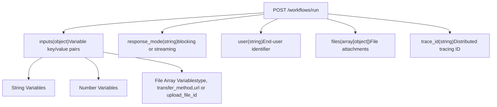
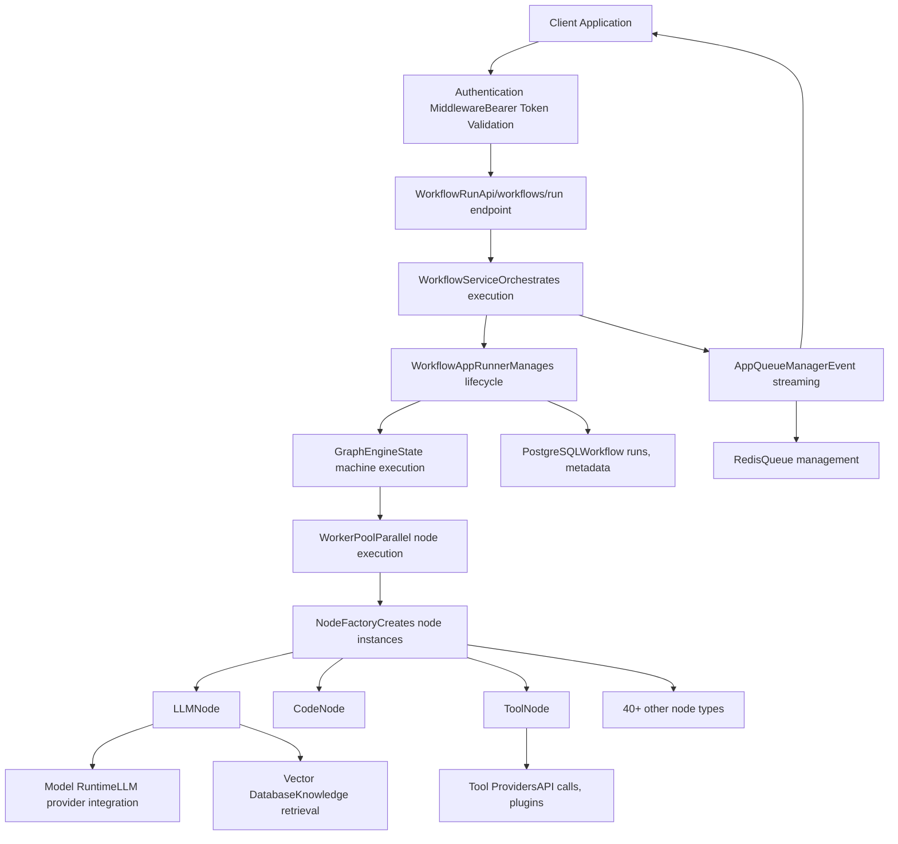

# Workflow Execution APIs

Relevant source files

-   [web/app/components/develop/template/template.en.mdx](https://github.com/langgenius/dify/blob/92dbc94f/web/app/components/develop/template/template.en.mdx)
-   [web/app/components/develop/template/template.ja.mdx](https://github.com/langgenius/dify/blob/92dbc94f/web/app/components/develop/template/template.ja.mdx)
-   [web/app/components/develop/template/template.zh.mdx](https://github.com/langgenius/dify/blob/92dbc94f/web/app/components/develop/template/template.zh.mdx)
-   [web/app/components/develop/template/template\_advanced\_chat.en.mdx](https://github.com/langgenius/dify/blob/92dbc94f/web/app/components/develop/template/template_advanced_chat.en.mdx)
-   [web/app/components/develop/template/template\_advanced\_chat.ja.mdx](https://github.com/langgenius/dify/blob/92dbc94f/web/app/components/develop/template/template_advanced_chat.ja.mdx)
-   [web/app/components/develop/template/template\_advanced\_chat.zh.mdx](https://github.com/langgenius/dify/blob/92dbc94f/web/app/components/develop/template/template_advanced_chat.zh.mdx)
-   [web/app/components/develop/template/template\_chat.en.mdx](https://github.com/langgenius/dify/blob/92dbc94f/web/app/components/develop/template/template_chat.en.mdx)
-   [web/app/components/develop/template/template\_chat.ja.mdx](https://github.com/langgenius/dify/blob/92dbc94f/web/app/components/develop/template/template_chat.ja.mdx)
-   [web/app/components/develop/template/template\_chat.zh.mdx](https://github.com/langgenius/dify/blob/92dbc94f/web/app/components/develop/template/template_chat.zh.mdx)
-   [web/app/components/develop/template/template\_workflow.en.mdx](https://github.com/langgenius/dify/blob/92dbc94f/web/app/components/develop/template/template_workflow.en.mdx)
-   [web/app/components/develop/template/template\_workflow.ja.mdx](https://github.com/langgenius/dify/blob/92dbc94f/web/app/components/develop/template/template_workflow.ja.mdx)
-   [web/app/components/develop/template/template\_workflow.zh.mdx](https://github.com/langgenius/dify/blob/92dbc94f/web/app/components/develop/template/template_workflow.zh.mdx)

## Purpose and Scope

This page documents the Service API for executing Workflow applications programmatically. Workflow applications are stateless, single-execution applications designed for tasks such as translation, content generation, data processing, and document analysis. Unlike chat applications, workflows do not maintain conversation history between executions.

For chat-based applications that incorporate workflow orchestration (Advanced Chat mode), see [Chat and Completion APIs](/langgenius/dify/8.2-chat-and-completion-apis). For general API authentication and response mode concepts, see [API Architecture and Response Modes](/langgenius/dify/8.1-api-architecture-and-response-modes). For understanding the underlying workflow execution engine, see [Graph Engine and Workflow Orchestration](/langgenius/dify/5.1-workflow-definition-and-execution-model).

---

## Workflow Execution Endpoint

### Endpoint Overview

Workflow applications are executed via a single HTTP endpoint:

**POST** `/workflows/run`

This endpoint executes a published workflow with provided input variables and returns results either as a complete response (blocking mode) or as a stream of events (streaming mode).

**Key Characteristics:**

-   **Stateless**: Each execution is independent; no conversation context is maintained
-   **Input-driven**: Requires input variables defined in the workflow's Start node
-   **Event-based**: Streams detailed execution events for monitoring and debugging
-   **Synchronous or Asynchronous**: Supports both blocking and streaming response modes

Sources: [web/app/components/develop/template/template\_workflow.en.mdx24-32](https://github.com/langgenius/dify/blob/92dbc94f/web/app/components/develop/template/template_workflow.en.mdx#L24-L32) [web/app/components/develop/template/template\_workflow.zh.mdx24-32](https://github.com/langgenius/dify/blob/92dbc94f/web/app/components/develop/template/template_workflow.zh.mdx#L24-L32)

---

## Request Structure

### Request Parameters


### Input Variables (`inputs`)

The `inputs` parameter accepts key/value pairs corresponding to variables defined in the workflow's Start node. Variable types include:

| Variable Type | Format | Example |
| --- | --- | --- |
| **String** | Plain string | `{"query": "Translate this text"}` |
| **Number** | Numeric value | `{"temperature": 0.7}` |
| **File Array** | Array of file objects | See File Array structure below |

Sources: [web/app/components/develop/template/template\_workflow.en.mdx34-52](https://github.com/langgenius/dify/blob/92dbc94f/web/app/components/develop/template/template_workflow.en.mdx#L34-L52) [web/app/components/develop/template/template\_workflow.zh.mdx34-61](https://github.com/langgenius/dify/blob/92dbc94f/web/app/components/develop/template/template_workflow.zh.mdx#L34-L61)

### File Array Variables

When a workflow variable is configured as a File Array type, the corresponding value must be an array where each element contains:

```
{
  "inputs": {
    "documents": [
      {
        "type": "document",
        "transfer_method": "local_file",
        "upload_file_id": "72fa9618-8f89-4a37-9b33-7e1178a24a67"
      },
      {
        "type": "image",
        "transfer_method": "remote_url",
        "url": "https://example.com/diagram.png"
      }
    ]
  }
}
```
**File Object Structure:**

| Field | Type | Description |
| --- | --- | --- |
| `type` | string | File category: `document`, `image`, `audio`, `video`, or `custom` |
| `transfer_method` | string | `local_file` (uploaded via File Upload API) or `remote_url` |
| `upload_file_id` | string | File ID from upload (when `transfer_method=local_file`) |
| `url` | string | Remote file URL (when `transfer_method=remote_url`) |

**Supported File Types:**

-   **Document**: TXT, MD, MARKDOWN, PDF, HTML, XLSX, XLS, DOCX, CSV, EML, MSG, PPTX, PPT, XML, EPUB
-   **Image**: JPG, JPEG, PNG, GIF, WEBP, SVG
-   **Audio**: MP3, M4A, WAV, WEBM, MPGA
-   **Video**: MP4, MOV, MPEG, WEBM

Sources: [web/app/components/develop/template/template\_workflow.en.mdx38-52](https://github.com/langgenius/dify/blob/92dbc94f/web/app/components/develop/template/template_workflow.en.mdx#L38-L52) [web/app/components/develop/template/template\_workflow.zh.mdx36-52](https://github.com/langgenius/dify/blob/92dbc94f/web/app/components/develop/template/template_workflow.zh.mdx#L36-L52)

### Response Mode (`response_mode`)

Determines how the API returns workflow execution results:

-   **`streaming`** (recommended): Returns events via Server-Sent Events (SSE) as the workflow executes. Provides real-time progress updates and allows for early termination.
-   **`blocking`**: Waits until workflow execution completes, then returns the final result. May be interrupted if execution exceeds 100 seconds due to infrastructure limitations.

Sources: [web/app/components/develop/template/template\_workflow.en.mdx54-57](https://github.com/langgenius/dify/blob/92dbc94f/web/app/components/develop/template/template_workflow.en.mdx#L54-L57) [web/app/components/develop/template/template\_workflow.zh.mdx48-51](https://github.com/langgenius/dify/blob/92dbc94f/web/app/components/develop/template/template_workflow.zh.mdx#L48-L51)

### Trace ID (`trace_id`)

Optional parameter for distributed tracing integration. Can be provided via three methods (in priority order):

1.  **HTTP Header**: `X-Trace-Id` (highest priority)
2.  **Query Parameter**: `?trace_id=xxx`
3.  **Request Body**: `"trace_id": "xxx"`

If not provided, the system generates a unique trace ID automatically.

Sources: [web/app/components/develop/template/template\_workflow.en.mdx64-68](https://github.com/langgenius/dify/blob/92dbc94f/web/app/components/develop/template/template_workflow.en.mdx#L64-L68) [web/app/components/develop/template/template\_workflow.zh.mdx56-60](https://github.com/langgenius/dify/blob/92dbc94f/web/app/components/develop/template/template_workflow.zh.mdx#L56-L60)

---

## Blocking Mode Response

### Response Structure

When `response_mode=blocking`, the API returns a single JSON response after workflow execution completes:

```
{
  "workflow_run_id": "b85e5fc5-751b-454d-b14e-dc5f240b0a31",
  "task_id": "bd029338-b068-4d34-a331-fc85478922c2",
  "data": {
    "id": "b85e5fc5-751b-454d-b14e-dc5f240b0a31",
    "workflow_id": "dfjasklfjdslag",
    "status": "succeeded",
    "outputs": {
      "text": "Nice to meet you.",
      "result": 42
    },
    "error": null,
    "elapsed_time": 0.875,
    "total_tokens": 3562,
    "total_steps": 8,
    "created_at": 1705407629,
    "finished_at": 1705407630
  }
}
```
### Response Fields

| Field | Type | Description |
| --- | --- | --- |
| `workflow_run_id` | string | Unique identifier for this workflow execution |
| `task_id` | string | Task ID for request tracking and stop API |
| `data.id` | string | Same as `workflow_run_id` |
| `data.workflow_id` | string | ID of the workflow definition that was executed |
| `data.status` | string | Execution status: `running`, `succeeded`, `failed`, or `stopped` |
| `data.outputs` | object | Key/value pairs from workflow End node outputs |
| `data.error` | string | Error message if `status=failed` |
| `data.elapsed_time` | float | Total execution time in seconds |
| `data.total_tokens` | int | Total tokens consumed by LLM nodes |
| `data.total_steps` | int | Number of nodes executed |
| `data.created_at` | timestamp | Unix timestamp when execution started |
| `data.finished_at` | timestamp | Unix timestamp when execution completed |

Sources: [web/app/components/develop/template/template\_workflow.en.mdx74-88](https://github.com/langgenius/dify/blob/92dbc94f/web/app/components/develop/template/template_workflow.en.mdx#L74-L88) [web/app/components/develop/template/template\_workflow.zh.mdx66-80](https://github.com/langgenius/dify/blob/92dbc94f/web/app/components/develop/template/template_workflow.zh.mdx#L66-L80)

---

## Streaming Mode Response

### Event Stream Format

When `response_mode=streaming`, the API returns events via Server-Sent Events (SSE) with `Content-Type: text/event-stream`. Each event is formatted as:

```
data: {"event": "event_type", "task_id": "...", "workflow_run_id": "...", "data": {...}}
```
Events are prefixed with `data:` and separated by double newlines (`\n\n`).

Sources: [web/app/components/develop/template/template\_workflow.en.mdx90-96](https://github.com/langgenius/dify/blob/92dbc94f/web/app/components/develop/template/template_workflow.en.mdx#L90-L96) [web/app/components/develop/template/template\_workflow.zh.mdx82-89](https://github.com/langgenius/dify/blob/92dbc94f/web/app/components/develop/template/template_workflow.zh.mdx#L82-L89)

### Workflow Execution Event Sequence

> **[Mermaid sequence]**
> *(图表结构无法解析)*

### Event Types

#### 1\. `workflow_started`

Emitted when workflow execution begins.

```
{
  "event": "workflow_started",
  "task_id": "bd029338-b068-4d34-a331-fc85478922c2",
  "workflow_run_id": "b85e5fc5-751b-454d-b14e-dc5f240b0a31",
  "data": {
    "id": "b85e5fc5-751b-454d-b14e-dc5f240b0a31",
    "workflow_id": "dfjasklfjdslag",
    "created_at": 1705395332
  }
}
```
Sources: [web/app/components/develop/template/template\_workflow.en.mdx99-106](https://github.com/langgenius/dify/blob/92dbc94f/web/app/components/develop/template/template_workflow.en.mdx#L99-L106) [web/app/components/develop/template/template\_workflow.zh.mdx91-98](https://github.com/langgenius/dify/blob/92dbc94f/web/app/components/develop/template/template_workflow.zh.mdx#L91-L98)

#### 2\. `node_started`

Emitted when a workflow node begins execution.

```
{
  "event": "node_started",
  "task_id": "bd029338-b068-4d34-a331-fc85478922c2",
  "workflow_run_id": "b85e5fc5-751b-454d-b14e-dc5f240b0a31",
  "data": {
    "id": "5ad498-f0c7-4085-b384-88cbe6290",
    "node_id": "llm_node_1745912968134",
    "node_type": "llm",
    "title": "LLM",
    "index": 2,
    "predecessor_node_id": "start_node_id",
    "inputs": {
      "query": "Hello world"
    },
    "created_at": 1705395332
  }
}
```
**Key Fields:**

-   `node_id`: Unique identifier for the node in the workflow graph
-   `node_type`: Type of node (e.g., `start`, `llm`, `code`, `if-else`, `end`)
-   `index`: Execution sequence number for UI tracing display
-   `predecessor_node_id`: ID of the previous node in the execution path
-   `inputs`: All input variable values used by this node

Sources: [web/app/components/develop/template/template\_workflow.en.mdx107-119](https://github.com/langgenius/dify/blob/92dbc94f/web/app/components/develop/template/template_workflow.en.mdx#L107-L119) [web/app/components/develop/template/template\_workflow.zh.mdx99-111](https://github.com/langgenius/dify/blob/92dbc94f/web/app/components/develop/template/template_workflow.zh.mdx#L99-L111)

#### 3\. `text_chunk`

Emitted when a node produces text output (typically from LLM nodes or Answer nodes with streaming enabled).

```
{
  "event": "text_chunk",
  "task_id": "bd029338-b068-4d34-a331-fc85478922c2",
  "workflow_run_id": "b85e5fc5-751b-454d-b14e-dc5f240b0a31",
  "data": {
    "text": "Hello, ",
    "from_variable_selector": ["llm_node_1745912968134", "text"]
  }
}
```
The `from_variable_selector` array indicates the source node ID and output variable name, allowing developers to trace which node generated the text.

Sources: [web/app/components/develop/template/template\_workflow.en.mdx120-126](https://github.com/langgenius/dify/blob/92dbc94f/web/app/components/develop/template/template_workflow.en.mdx#L120-L126) [web/app/components/develop/template/template\_workflow.zh.mdx112-118](https://github.com/langgenius/dify/blob/92dbc94f/web/app/components/develop/template/template_workflow.zh.mdx#L112-L118)

#### 4\. `node_finished`

Emitted when a node completes execution (success or failure).

```
{
  "event": "node_finished",
  "task_id": "bd029338-b068-4d34-a331-fc85478922c2",
  "workflow_run_id": "b85e5fc5-751b-454d-b14e-dc5f240b0a31",
  "data": {
    "id": "5ad498-f0c7-4085-b384-88cbe6290",
    "node_id": "llm_node_1745912968134",
    "node_type": "llm",
    "title": "LLM",
    "index": 2,
    "predecessor_node_id": "start_node_id",
    "inputs": {...},
    "process_data": {...},
    "outputs": {
      "text": "Hello, how can I help you?"
    },
    "status": "succeeded",
    "error": null,
    "elapsed_time": 1.234,
    "execution_metadata": {
      "total_tokens": 150,
      "total_price": 0.0003,
      "currency": "USD"
    },
    "created_at": 1705395332
  }
}
```
**Status Values:**

-   `running`: Node is still executing (should not appear in finished event)
-   `succeeded`: Node completed successfully
-   `failed`: Node encountered an error
-   `stopped`: Node was stopped by user

Sources: [web/app/components/develop/template/template\_workflow.en.mdx127-148](https://github.com/langgenius/dify/blob/92dbc94f/web/app/components/develop/template/template_workflow.en.mdx#L127-L148) [web/app/components/develop/template/template\_workflow.zh.mdx119-138](https://github.com/langgenius/dify/blob/92dbc94f/web/app/components/develop/template/template_workflow.zh.mdx#L119-L138)

#### 5\. `workflow_finished`

Emitted when the entire workflow execution completes.

```
{
  "event": "workflow_finished",
  "task_id": "bd029338-b068-4d34-a331-fc85478922c2",
  "workflow_run_id": "b85e5fc5-751b-454d-b14e-dc5f240b0a31",
  "data": {
    "id": "b85e5fc5-751b-454d-b14e-dc5f240b0a31",
    "workflow_id": "dfjasklfjdslag",
    "status": "succeeded",
    "outputs": {
      "result": "Translation complete",
      "word_count": 234
    },
    "error": null,
    "elapsed_time": 5.432,
    "total_tokens": 1250,
    "total_steps": 8,
    "created_at": 1705395332,
    "finished_at": 1705395337
  }
}
```
The `outputs` object contains key/value pairs from the workflow's End node configuration.

Sources: [web/app/components/develop/template/template\_workflow.en.mdx149-162](https://github.com/langgenius/dify/blob/92dbc94f/web/app/components/develop/template/template_workflow.en.mdx#L149-L162) [web/app/components/develop/template/template\_workflow.zh.mdx139-153](https://github.com/langgenius/dify/blob/92dbc94f/web/app/components/develop/template/template_workflow.zh.mdx#L139-L153)

#### 6\. `tts_message` and `tts_message_end`

If Text-to-Speech is enabled, audio chunks are streamed as base64-encoded MP3 data:

```
{
  "event": "tts_message",
  "task_id": "bd029338-b068-4d34-a331-fc85478922c2",
  "message_id": "a8bdc41c-13b2-4c18-bfd9-054b9803038c",
  "audio": "qqqqqqqqqqqqqqqqqq...",
  "created_at": 1721205487
}
```
The `tts_message_end` event signals completion of audio streaming with an empty `audio` field.

Sources: [web/app/components/develop/template/template\_workflow.en.mdx163-171](https://github.com/langgenius/dify/blob/92dbc94f/web/app/components/develop/template/template_workflow.en.mdx#L163-L171) [web/app/components/develop/template/template\_workflow.zh.mdx154-163](https://github.com/langgenius/dify/blob/92dbc94f/web/app/components/develop/template/template_workflow.zh.mdx#L154-L163)

#### 7\. `ping`

Keep-alive event sent every 10 seconds to maintain the SSE connection.

Sources: [web/app/components/develop/template/template\_workflow.en.mdx172](https://github.com/langgenius/dify/blob/92dbc94f/web/app/components/develop/template/template_workflow.en.mdx#L172-L172) [web/app/components/develop/template/template\_workflow.zh.mdx164](https://github.com/langgenius/dify/blob/92dbc94f/web/app/components/develop/template/template_workflow.zh.mdx#L164-L164)

#### 8\. `error`

Emitted when an error occurs during workflow execution. Receiving this event terminates the stream.

```
{
  "event": "error",
  "task_id": "bd029338-b068-4d34-a331-fc85478922c2",
  "workflow_run_id": "b85e5fc5-751b-454d-b14e-dc5f240b0a31",
  "status": 400,
  "code": "workflow_request_error",
  "message": "Node execution failed: LLM quota exceeded"
}
```
Sources: [web/app/components/develop/template/template\_workflow.en.mdx173-179](https://github.com/langgenius/dify/blob/92dbc94f/web/app/components/develop/template/template_workflow.en.mdx#L173-L179)

---

## Request Flow Architecture

### End-to-End Execution Flow


Sources: Architecture inferred from system diagrams and [web/app/components/develop/template/template\_workflow.en.mdx1-298](https://github.com/langgenius/dify/blob/92dbc94f/web/app/components/develop/template/template_workflow.en.mdx#L1-L298)

### Key Components

| Component | Responsibility |
| --- | --- |
| **WorkflowRunApi** | HTTP endpoint handler, request validation, authentication |
| **WorkflowService** | Business logic orchestration, workflow retrieval |
| **WorkflowAppRunner** | Lifecycle management, event emission |
| **GraphEngine** | Workflow graph execution, state management |
| **WorkerPool** | Parallel node execution, concurrency control |
| **AppQueueManager** | Event queuing and SSE streaming |
| **NodeFactory** | Dynamic node instantiation based on type |

---

## Error Handling

### Error Response Codes

| Status Code | Error Code | Description |
| --- | --- | --- |
| 400 | `invalid_param` | Invalid request parameters |
| 400 | `app_unavailable` | Workflow app not found or not published |
| 400 | `provider_not_initialize` | LLM provider credentials not configured |
| 400 | `provider_quota_exceeded` | LLM provider quota exhausted |
| 400 | `model_currently_not_support` | Requested model unavailable |
| 400 | `workflow_request_error` | Generic workflow execution failure |
| 500 | \- | Internal server error |

In streaming mode, errors are returned as `error` events. In blocking mode, errors are returned as standard HTTP error responses.

Sources: [web/app/components/develop/template/template\_workflow.en.mdx181-188](https://github.com/langgenius/dify/blob/92dbc94f/web/app/components/develop/template/template_workflow.en.mdx#L181-L188) [web/app/components/develop/template/template\_workflow.zh.mdx166-173](https://github.com/langgenius/dify/blob/92dbc94f/web/app/components/develop/template/template_workflow.zh.mdx#L166-L173)

### Error Event Example

```
{
  "event": "error",
  "task_id": "bd029338-b068-4d34-a331-fc85478922c2",
  "workflow_run_id": "b85e5fc5-751b-454d-b14e-dc5f240b0a31",
  "status": 400,
  "code": "provider_quota_exceeded",
  "message": "OpenAI API quota exceeded. Please check your billing settings."
}
```
---

## Complete Request Examples

### Example 1: Simple Translation Workflow

**Request:**

```
curl -X POST 'https://api.dify.ai/v1/workflows/run' \
  --header 'Authorization: Bearer {api_key}' \
  --header 'Content-Type: application/json' \
  --data-raw '{
    "inputs": {
      "source_text": "Hello, world!",
      "target_language": "Spanish"
    },
    "response_mode": "blocking",
    "user": "user-123"
  }'
```
**Response:**

```
{
  "workflow_run_id": "a1b2c3d4-e5f6-7890-abcd-ef1234567890",
  "task_id": "task-xyz-123",
  "data": {
    "id": "a1b2c3d4-e5f6-7890-abcd-ef1234567890",
    "workflow_id": "workflow-abc-456",
    "status": "succeeded",
    "outputs": {
      "translated_text": "¡Hola, mundo!"
    },
    "elapsed_time": 1.2,
    "total_tokens": 45,
    "total_steps": 3,
    "created_at": 1705395332,
    "finished_at": 1705395333
  }
}
```
Sources: [web/app/components/develop/template/template\_workflow.en.mdx177-228](https://github.com/langgenius/dify/blob/92dbc94f/web/app/components/develop/template/template_workflow.en.mdx#L177-L228)

### Example 2: Document Analysis with File Array

**Request:**

```
curl -X POST 'https://api.dify.ai/v1/workflows/run' \
  --header 'Authorization: Bearer {api_key}' \
  --header 'Content-Type: application/json' \
  --data-raw '{
    "inputs": {
      "documents": [
        {
          "type": "document",
          "transfer_method": "local_file",
          "upload_file_id": "72fa9618-8f89-4a37-9b33-7e1178a24a67"
        },
        {
          "type": "document",
          "transfer_method": "remote_url",
          "url": "https://example.com/report.pdf"
        }
      ],
      "analysis_type": "summary"
    },
    "response_mode": "streaming",
    "user": "user-456"
  }'
```
**Streaming Response:**

```
data: {"event": "workflow_started", "task_id": "task-123", "workflow_run_id": "run-456", "data": {"id": "run-456", "workflow_id": "wf-789", "created_at": 1705395332}}

data: {"event": "node_started", "task_id": "task-123", "workflow_run_id": "run-456", "data": {"id": "exec-1", "node_id": "start", "node_type": "start", "title": "Start", "index": 0, "inputs": {}, "created_at": 1705395332}}

data: {"event": "node_finished", "task_id": "task-123", "workflow_run_id": "run-456", "data": {"id": "exec-1", "node_id": "start", "status": "succeeded", "outputs": {}, "elapsed_time": 0.01, "created_at": 1705395332}}

data: {"event": "node_started", "task_id": "task-123", "workflow_run_id": "run-456", "data": {"id": "exec-2", "node_id": "llm-1", "node_type": "llm", "title": "Document Analyzer", "index": 1, "inputs": {"documents": [...]}, "created_at": 1705395333}}

data: {"event": "text_chunk", "task_id": "task-123", "workflow_run_id": "run-456", "data": {"text": "The documents contain ", "from_variable_selector": ["llm-1", "text"]}}

data: {"event": "text_chunk", "task_id": "task-123", "workflow_run_id": "run-456", "data": {"text": "analysis of quarterly results...", "from_variable_selector": ["llm-1", "text"]}}

data: {"event": "node_finished", "task_id": "task-123", "workflow_run_id": "run-456", "data": {"id": "exec-2", "node_id": "llm-1", "status": "succeeded", "outputs": {"text": "The documents contain analysis of quarterly results..."}, "elapsed_time": 2.5, "execution_metadata": {"total_tokens": 523, "total_price": 0.0052, "currency": "USD"}, "created_at": 1705395333}}

data: {"event": "workflow_finished", "task_id": "task-123", "workflow_run_id": "run-456", "data": {"id": "run-456", "workflow_id": "wf-789", "status": "succeeded", "outputs": {"summary": "The documents contain analysis of quarterly results..."}, "elapsed_time": 2.6, "total_tokens": 523, "total_steps": 2, "created_at": 1705395332, "finished_at": 1705395335}}
```
Sources: [web/app/components/develop/template/template\_workflow.en.mdx230-237](https://github.com/langgenius/dify/blob/92dbc94f/web/app/components/develop/template/template_workflow.en.mdx#L230-L237)

---

## Stop Workflow Execution

### Stop Endpoint

Workflows can be stopped mid-execution using the stop API (only available in streaming mode):

**POST** `/workflows/tasks/{task_id}/stop`

**Request Body:**

```
{
  "user": "user-123"
}
```
**Response:**

```
{
  "result": "success"
}
```
The `user` parameter must match the user identifier from the original workflow run request. After stopping, a `workflow_finished` event with `status: "stopped"` will be emitted.

Sources: [web/app/components/develop/template/template\_workflow.en.mdx239-268](https://github.com/langgenius/dify/blob/92dbc94f/web/app/components/develop/template/template_workflow.en.mdx#L239-L268)

---

## Comparison: Workflow App vs Advanced Chat

### Key Differences

| Feature | Workflow App | Advanced Chat |
| --- | --- | --- |
| **Endpoint** | `/workflows/run` | `/chat-messages` |
| **State** | Stateless (no conversation history) | Stateful (maintains conversation context) |
| **conversation\_id** | Not supported | Required for multi-turn conversations |
| **message\_id** | Not included in events | Included in all events |
| **Use Cases** | Translation, batch processing, data transformation | Customer support, chatbots, interactive AI |
| **Event Types** | Workflow events only | Workflow events + message events + agent events |

### When to Use Each

-   **Use Workflow App API** when:

    -   Each request is independent
    -   No conversation history is needed
    -   Processing documents, translations, or data transformations
    -   Building batch processing pipelines
-   **Use Advanced Chat API** when:

    -   Maintaining conversation context across multiple turns
    -   Building chatbots or conversational interfaces
    -   User needs to reference previous exchanges
    -   Agent mode with tool calling is required

Sources: Comparison inferred from [web/app/components/develop/template/template\_workflow.en.mdx1-298](https://github.com/langgenius/dify/blob/92dbc94f/web/app/components/develop/template/template_workflow.en.mdx#L1-L298) and [web/app/components/develop/template/template\_advanced\_chat.en.mdx1-694](https://github.com/langgenius/dify/blob/92dbc94f/web/app/components/develop/template/template_advanced_chat.en.mdx#L1-L694)

---

## Additional Resources

For file upload functionality required when using `transfer_method=local_file`, see [File Upload and Dataset APIs](/langgenius/dify/8.4-file-upload-and-management-apis).

For understanding authentication and base API concepts, see [API Architecture and Response Modes](/langgenius/dify/8.1-api-architecture-and-response-modes).

For the underlying workflow execution engine architecture, see [Graph Engine and Workflow Orchestration](/langgenius/dify/5.1-workflow-definition-and-execution-model).

For workflow node types and capabilities, see [Workflow Node Types and Container Nodes](/langgenius/dify/5.3-knowledge-retrieval-and-question-classifier-nodes).
