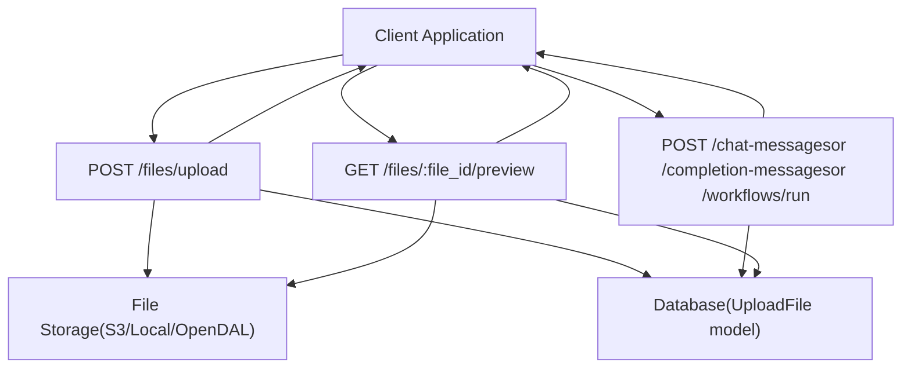
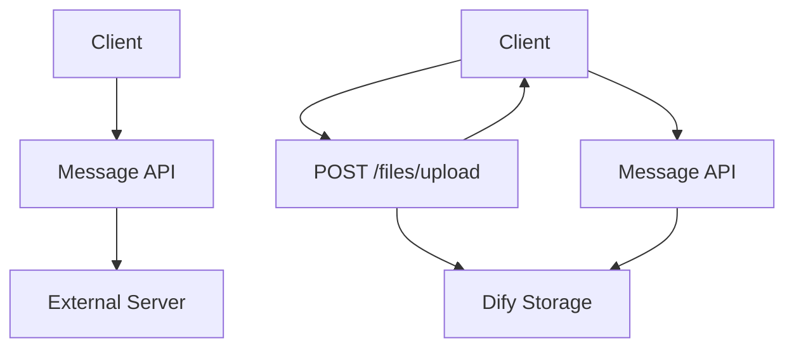
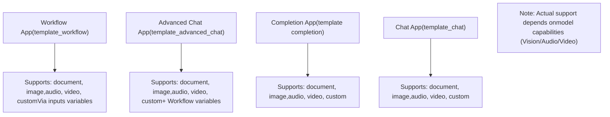
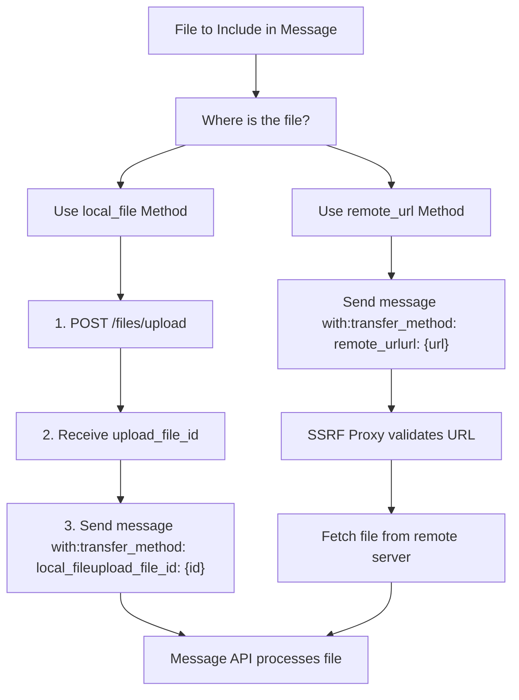
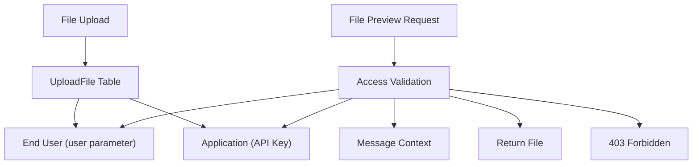
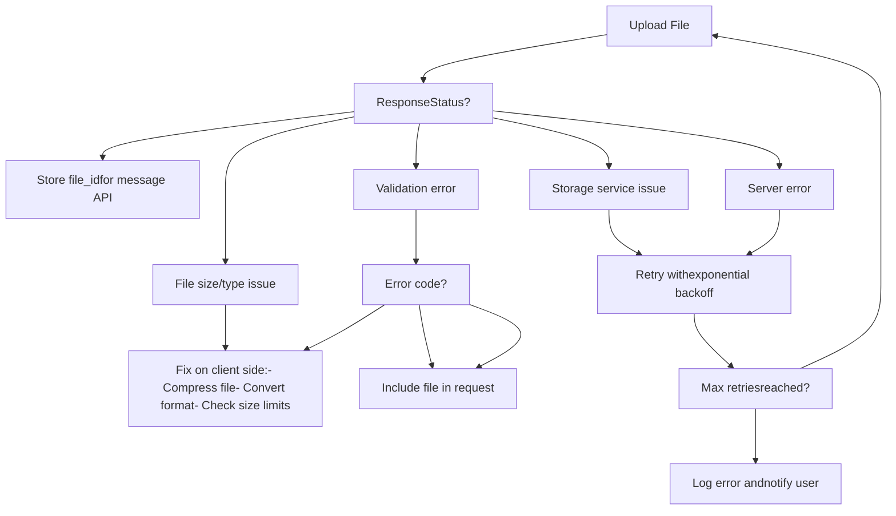

# File Upload and Management APIs

Relevant source files

-   [web/app/components/develop/template/template.en.mdx](https://github.com/langgenius/dify/blob/92dbc94f/web/app/components/develop/template/template.en.mdx)
-   [web/app/components/develop/template/template.ja.mdx](https://github.com/langgenius/dify/blob/92dbc94f/web/app/components/develop/template/template.ja.mdx)
-   [web/app/components/develop/template/template.zh.mdx](https://github.com/langgenius/dify/blob/92dbc94f/web/app/components/develop/template/template.zh.mdx)
-   [web/app/components/develop/template/template\_advanced\_chat.en.mdx](https://github.com/langgenius/dify/blob/92dbc94f/web/app/components/develop/template/template_advanced_chat.en.mdx)
-   [web/app/components/develop/template/template\_advanced\_chat.ja.mdx](https://github.com/langgenius/dify/blob/92dbc94f/web/app/components/develop/template/template_advanced_chat.ja.mdx)
-   [web/app/components/develop/template/template\_advanced\_chat.zh.mdx](https://github.com/langgenius/dify/blob/92dbc94f/web/app/components/develop/template/template_advanced_chat.zh.mdx)
-   [web/app/components/develop/template/template\_chat.en.mdx](https://github.com/langgenius/dify/blob/92dbc94f/web/app/components/develop/template/template_chat.en.mdx)
-   [web/app/components/develop/template/template\_chat.ja.mdx](https://github.com/langgenius/dify/blob/92dbc94f/web/app/components/develop/template/template_chat.ja.mdx)
-   [web/app/components/develop/template/template\_chat.zh.mdx](https://github.com/langgenius/dify/blob/92dbc94f/web/app/components/develop/template/template_chat.zh.mdx)
-   [web/app/components/develop/template/template\_workflow.en.mdx](https://github.com/langgenius/dify/blob/92dbc94f/web/app/components/develop/template/template_workflow.en.mdx)
-   [web/app/components/develop/template/template\_workflow.ja.mdx](https://github.com/langgenius/dify/blob/92dbc94f/web/app/components/develop/template/template_workflow.ja.mdx)
-   [web/app/components/develop/template/template\_workflow.zh.mdx](https://github.com/langgenius/dify/blob/92dbc94f/web/app/components/develop/template/template_workflow.zh.mdx)

This document describes the file upload and management APIs in Dify's Service API layer. These APIs enable end-users to upload files (images, documents, audio, video, and custom file types) and use them in conversations with Chat, Completion, Advanced Chat, and Workflow applications. The file APIs support multimodal capabilities when the underlying LLM model supports file processing.

For information about the overall API architecture and authentication, see [API Architecture and Response Modes](/langgenius/dify/8.1-api-architecture-and-response-modes). For details on how files are used in specific message endpoints, see [Chat and Completion APIs](/langgenius/dify/8.2-chat-and-completion-apis) and [Workflow Execution APIs](/langgenius/dify/8.3-workflow-execution-apis).

---

## Overview

The file management system provides two main endpoints:

1.  **File Upload (`POST /files/upload`)** - Uploads files and returns a file ID for subsequent use
2.  **File Preview/Download (`GET /files/:file_id/preview`)** - Retrieves uploaded files for preview or download

Files can be integrated into messages through two transfer methods:

-   **`local_file`** - Files uploaded via the upload endpoint, referenced by `upload_file_id`
-   **`remote_url`** - Externally hosted files, referenced by URL

**File Upload and Usage Flow**


Sources: [web/app/components/develop/template/template\_chat.en.mdx293-362](https://github.com/langgenius/dify/blob/92dbc94f/web/app/components/develop/template/template_chat.en.mdx#L293-L362) [web/app/components/develop/template/template\_chat.en.mdx366-439](https://github.com/langgenius/dify/blob/92dbc94f/web/app/components/develop/template/template_chat.en.mdx#L366-L439)

---

## File Upload API

### Endpoint: `POST /files/upload`

Uploads a file to the Dify platform for subsequent use in conversations. Uploaded files are scoped to the end-user (`user` parameter) and can only be accessed within the same application context.

**Request Requirements**

| Aspect | Details |
| --- | --- |
| Content-Type | `multipart/form-data` |
| Authentication | `Authorization: Bearer {API_KEY}` header |
| Method | POST |

**Request Parameters**

| Parameter | Type | Required | Description |
| --- | --- | --- | --- |
| `file` | File | Yes | The file to upload |
| `user` | string | Yes | User identifier, must be unique within the application and consistent with the user in message APIs |

**Response Format**

Successful upload returns JSON with file metadata:

```
{
  "id": "72fa9618-8f89-4a37-9b33-7e1178a24a67",
  "name": "example.png",
  "size": 1024,
  "extension": "png",
  "mime_type": "image/png",
  "created_by": "6ad1ab0a-73ff-4ac1-b9e4-cdb312f71f13",
  "created_at": 1577836800
}
```
**Response Fields**

| Field | Type | Description |
| --- | --- | --- |
| `id` | uuid | Unique file identifier, used as `upload_file_id` in message requests |
| `name` | string | Original filename |
| `size` | int | File size in bytes |
| `extension` | string | File extension |
| `mime_type` | string | MIME type of the file |
| `created_by` | uuid | End-user ID who uploaded the file |
| `created_at` | timestamp | Upload timestamp (Unix epoch) |

**Example Request**

```
curl -X POST 'https://api.dify.ai/v1/files/upload' \
  --header 'Authorization: Bearer {api_key}' \
  --form 'file=@/path/to/image.png;type=image/png' \
  --form 'user=abc-123'
```
Sources: [web/app/components/develop/template/template\_chat.en.mdx292-362](https://github.com/langgenius/dify/blob/92dbc94f/web/app/components/develop/template/template_chat.en.mdx#L292-L362) [web/app/components/develop/template/template.zh.mdx180-249](https://github.com/langgenius/dify/blob/92dbc94f/web/app/components/develop/template/template.zh.mdx#L180-L249)

---

## File Preview and Download API

### Endpoint: `GET /files/:file_id/preview`

Retrieves an uploaded file for browser preview or download. Files can only be accessed if they belong to messages within the requesting application.

**Path Parameters**

| Parameter | Type | Required | Description |
| --- | --- | --- | --- |
| `file_id` | string | Yes | Unique file identifier obtained from the upload API |

**Query Parameters**

| Parameter | Type | Required | Default | Description |
| --- | --- | --- | --- | --- |
| `as_attachment` | boolean | No | `false` | Forces browser to download the file instead of previewing it |

**Response Headers**

The API sets appropriate HTTP headers based on the file type and request parameters:

| Header | Description | Example |
| --- | --- | --- |
| `Content-Type` | MIME type of the file | `image/png`, `application/pdf` |
| `Content-Length` | File size in bytes (if available) | `1024` |
| `Content-Disposition` | Set to `attachment` when `as_attachment=true` | `attachment; filename*=UTF-8''example.png` |
| `Cache-Control` | Caching policy for performance | `public, max-age=3600` |
| `Accept-Ranges` | Set to `bytes` for audio/video files | `bytes` |

**Example Requests**

Preview in browser:

```
curl -X GET 'https://api.dify.ai/v1/files/72fa9618-8f89-4a37-9b33-7e1178a24a67/preview' \
  --header 'Authorization: Bearer {api_key}'
```
Force download:

```
curl -X GET 'https://api.dify.ai/v1/files/72fa9618-8f89-4a37-9b33-7e1178a24a67/preview?as_attachment=true' \
  --header 'Authorization: Bearer {api_key}' \
  --output downloaded_file.png
```
Sources: [web/app/components/develop/template/template\_chat.en.mdx365-439](https://github.com/langgenius/dify/blob/92dbc94f/web/app/components/develop/template/template_chat.en.mdx#L365-L439) [web/app/components/develop/template/template.zh.mdx252-327](https://github.com/langgenius/dify/blob/92dbc94f/web/app/components/develop/template/template.zh.mdx#L252-L327)

---

## File Integration in Message APIs

Files uploaded via the upload API can be used in Chat, Completion, Advanced Chat, and Workflow message requests. Files are passed as an array in the request body's `files` parameter.

**File Object Structure**

Each file in the `files` array contains:

| Field | Type | Required | Description |
| --- | --- | --- | --- |
| `type` | string | Yes | File category: `document`, `image`, `audio`, `video`, or `custom` |
| `transfer_method` | string | Yes | How the file is provided: `local_file` or `remote_url` |
| `upload_file_id` | string | Conditional | File ID from upload API (required when `transfer_method` is `local_file`) |
| `url` | string | Conditional | File URL (required when `transfer_method` is `remote_url`) |

**File Transfer Method Comparison**


**Example: Using Uploaded Files**

```
{
  "query": "What are the specs of the iPhone 13 Pro Max?",
  "files": [
    {
      "type": "image",
      "transfer_method": "local_file",
      "upload_file_id": "72fa9618-8f89-4a37-9b33-7e1178a24a67"
    }
  ],
  "user": "abc-123"
}
```
**Example: Using Remote URL Files**

```
{
  "query": "Describe this image",
  "files": [
    {
      "type": "image",
      "transfer_method": "remote_url",
      "url": "https://cloud.dify.ai/logo/logo-site.png"
    }
  ],
  "user": "abc-123"
}
```
Sources: [web/app/components/develop/template/template\_chat.en.mdx58-71](https://github.com/langgenius/dify/blob/92dbc94f/web/app/components/develop/template/template_chat.en.mdx#L58-L71) [web/app/components/develop/template/template\_advanced\_chat.en.mdx59-72](https://github.com/langgenius/dify/blob/92dbc94f/web/app/components/develop/template/template_advanced_chat.en.mdx#L59-L72) [web/app/components/develop/template/template\_workflow.en.mdx36-51](https://github.com/langgenius/dify/blob/92dbc94f/web/app/components/develop/template/template_workflow.en.mdx#L36-L51)

---

## Supported File Types

The file APIs support five main file categories, each with specific extensions and use cases.

**File Type Categories and Extensions**

| Category | Supported Extensions | Use Cases |
| --- | --- | --- |
| `document` | TXT, MD, MARKDOWN, MDX, PDF, HTML, XLSX, XLS, VTT, PROPERTIES, DOC, DOCX, CSV, EML, MSG, PPTX, PPT, XML, EPUB | Document parsing, text extraction, structured data analysis |
| `image` | JPG, JPEG, PNG, GIF, WEBP, SVG | Vision models, image understanding, multimodal queries |
| `audio` | MP3, M4A, WAV, WEBM, MPGA | Speech-to-text, audio transcription, audio analysis |
| `video` | MP4, MOV, MPEG, WEBM | Video understanding, frame analysis (model-dependent) |
| `custom` | Other file types | Generic file handling for custom processing |

**File Type Usage by Application Mode**


**File Size Limits**

Size limits are configurable per file type via the `/parameters` API endpoint:

| Limit Type | Parameter | Default (MB) |
| --- | --- | --- |
| Document files | `file_size_limit` | 15 |
| Image files | `image_file_size_limit` | 10 |
| Audio files | `audio_file_size_limit` | 50 |
| Video files | `video_file_size_limit` | 100 |

Sources: [web/app/components/develop/template/template\_chat.en.mdx60-66](https://github.com/langgenius/dify/blob/92dbc94f/web/app/components/develop/template/template_chat.en.mdx#L60-L66) [web/app/components/develop/template/template.zh.mdx622-650](https://github.com/langgenius/dify/blob/92dbc94f/web/app/components/develop/template/template.zh.mdx#L622-L650)

---

## File Transfer Methods

Dify supports two distinct methods for providing files to message APIs: `local_file` (uploaded to Dify) and `remote_url` (externally hosted).

**Transfer Method Decision Flow**


**local\_file Method**

Used for files uploaded to Dify's storage system:

1.  Client uploads file via `POST /files/upload`
2.  Dify stores file and returns `upload_file_id`
3.  Client references file in message using `upload_file_id`

**Advantages:**

-   Files persist in Dify storage
-   No external dependencies for file access
-   Better for sensitive or private files
-   Supports file access control

**remote\_url Method**

Used for externally hosted files accessible via HTTP(S):

1.  Client provides file URL directly in message
2.  Dify fetches file via SSRF Proxy (see [API Authentication and Security](/langgenius/dify/7.3-authentication-and-security))
3.  File content processed by LLM

**Advantages:**

-   No separate upload step required
-   Useful for publicly accessible files
-   Reduces storage requirements
-   Good for large files already hosted elsewhere

**Workflow Application File Variables**

In Workflow applications, file variables in the `inputs` object support the same transfer methods:

```
{
  "inputs": {
    "user_document": [
      {
        "transfer_method": "local_file",
        "upload_file_id": "72fa9618-8f89-4a37-9b33-7e1178a24a67",
        "type": "document"
      }
    ]
  },
  "response_mode": "streaming",
  "user": "abc-123"
}
```
Sources: [web/app/components/develop/template/template\_chat.en.mdx66-71](https://github.com/langgenius/dify/blob/92dbc94f/web/app/components/develop/template/template_chat.en.mdx#L66-L71) [web/app/components/develop/template/template\_workflow.en.mdx38-51](https://github.com/langgenius/dify/blob/92dbc94f/web/app/components/develop/template/template_workflow.en.mdx#L38-L51) [web/app/components/develop/template/template\_workflow.zh.mdx36-46](https://github.com/langgenius/dify/blob/92dbc94f/web/app/components/develop/template/template_workflow.zh.mdx#L36-L46)

---

## Security and Access Control

The file management APIs implement several security measures to protect file access and prevent abuse.

**Access Control Model**


**Security Features**

| Feature | Implementation | Purpose |
| --- | --- | --- |
| User Scoping | Files are tied to the `user` parameter | Prevents cross-user file access |
| Application Scoping | Files only accessible within the same app (API Key) | Prevents cross-application access |
| Message Context Validation | Files must belong to messages in the requesting app | Prevents unauthorized preview/download |
| API Key Authentication | All requests require valid `Authorization` header | Prevents anonymous access |
| SSRF Protection | Remote URLs fetched via SSRF Proxy | Prevents Server-Side Request Forgery attacks |
| File Type Validation | Extensions checked against allowed lists | Prevents malicious file uploads |

**Access Control Rules**

1.  **Upload**: User can upload files with their `user` identifier
2.  **Reference in Messages**: User can only reference their own uploaded files
3.  **Preview/Download**: Files can only be accessed if:
    -   Request uses valid API Key for the application
    -   File belongs to a message in the application
    -   File exists and has not been deleted

**SSRF Protection for Remote URLs**

When using `remote_url` transfer method, Dify fetches external files through the SSRF Proxy service, which:

-   Validates URL schemes (HTTP/HTTPS only)
-   Blocks access to internal networks and localhost
-   Prevents SSRF attacks against internal services
-   Enforces timeout limits

Sources: [web/app/components/develop/template/template\_chat.en.mdx375-397](https://github.com/langgenius/dify/blob/92dbc94f/web/app/components/develop/template/template_chat.en.mdx#L375-L397) [web/app/components/develop/template/template.zh.mdx260-285](https://github.com/langgenius/dify/blob/92dbc94f/web/app/components/develop/template/template.zh.mdx#L260-L285)

---

## Error Handling

Both file APIs return standard HTTP status codes and error responses for various failure scenarios.

**File Upload Errors**

| HTTP Code | Error Code | Description | Resolution |
| --- | --- | --- | --- |
| 400 | `no_file_uploaded` | No file provided in request | Include file in multipart form data |
| 400 | `too_many_files` | Multiple files sent (only one allowed) | Send only one file per request |
| 400 | `unsupported_preview` | File type does not support preview | Check supported file types |
| 400 | `unsupported_estimate` | File does not support size estimation | Check file format |
| 413 | `file_too_large` | File exceeds size limit | Reduce file size or check limits via `/parameters` |
| 415 | `unsupported_file_type` | File extension not supported | Use supported file types only |
| 503 | `s3_connection_failed` | Cannot connect to storage service | Retry request, check storage configuration |
| 503 | `s3_permission_denied` | No permission to upload to storage | Check storage credentials/permissions |
| 503 | `s3_file_too_large` | File exceeds storage provider limit | Reduce file size |
| 500 | \- | Internal server error | Retry request, contact support if persistent |

**File Preview/Download Errors**

| HTTP Code | Error Code | Description | Resolution |
| --- | --- | --- | --- |
| 400 | `invalid_param` | Invalid file\_id or parameters | Check file\_id format |
| 403 | `file_access_denied` | File access denied or doesn't belong to app | Verify file ownership and app context |
| 404 | `file_not_found` | File not found or deleted | Verify file\_id exists |
| 500 | \- | Internal server error | Retry request, contact support if persistent |

**Error Response Format**

Error responses follow a consistent JSON structure:

```
{
  "code": "file_too_large",
  "message": "The file is too large",
  "status": 413
}
```
**Error Handling Best Practices**


Sources: [web/app/components/develop/template/template\_chat.en.mdx321-331](https://github.com/langgenius/dify/blob/92dbc94f/web/app/components/develop/template/template_chat.en.mdx#L321-L331) [web/app/components/develop/template/template\_chat.en.mdx393-397](https://github.com/langgenius/dify/blob/92dbc94f/web/app/components/develop/template/template_chat.en.mdx#L393-L397) [web/app/components/develop/template/template.zh.mdx331-341](https://github.com/langgenius/dify/blob/92dbc94f/web/app/components/develop/template/template.zh.mdx#L331-L341)

---

## Usage Examples by Application Type

**Chat Application with Image**

```
# 1. Upload image
FILE_ID=$(curl -X POST 'https://api.dify.ai/v1/files/upload' \
  --header 'Authorization: Bearer {api_key}' \
  --form 'file=@screenshot.png;type=image/png' \
  --form 'user=user-123' | jq -r '.id')

# 2. Send chat message with image
curl -X POST 'https://api.dify.ai/v1/chat-messages' \
  --header 'Authorization: Bearer {api_key}' \
  --header 'Content-Type: application/json' \
  --data-raw '{
    "query": "What do you see in this image?",
    "files": [
      {
        "type": "image",
        "transfer_method": "local_file",
        "upload_file_id": "'$FILE_ID'"
      }
    ],
    "response_mode": "streaming",
    "user": "user-123"
  }'
```
**Completion Application with Document**

```
# Upload document and send completion request
FILE_ID=$(curl -X POST 'https://api.dify.ai/v1/files/upload' \
  --header 'Authorization: Bearer {api_key}' \
  --form 'file=@report.pdf;type=application/pdf' \
  --form 'user=user-456' | jq -r '.id')

curl -X POST 'https://api.dify.ai/v1/completion-messages' \
  --header 'Authorization: Bearer {api_key}' \
  --header 'Content-Type: application/json' \
  --data-raw '{
    "inputs": {
      "query": "Summarize this document"
    },
    "files": [
      {
        "type": "document",
        "transfer_method": "local_file",
        "upload_file_id": "'$FILE_ID'"
      }
    ],
    "response_mode": "blocking",
    "user": "user-456"
  }'
```
**Workflow Application with Multiple Files**

```
# Upload multiple files for workflow
DOC_ID=$(curl -X POST 'https://api.dify.ai/v1/files/upload' \
  --form 'file=@contract.docx' --form 'user=user-789' | jq -r '.id')

IMG_ID=$(curl -X POST 'https://api.dify.ai/v1/files/upload' \
  --form 'file=@signature.png' --form 'user=user-789' | jq -r '.id')

# Send to workflow with file variable
curl -X POST 'https://api.dify.ai/v1/workflows/run' \
  --header 'Authorization: Bearer {api_key}' \
  --header 'Content-Type: application/json' \
  --data-raw '{
    "inputs": {
      "documents": [
        {
          "transfer_method": "local_file",
          "upload_file_id": "'$DOC_ID'",
          "type": "document"
        },
        {
          "transfer_method": "local_file",
          "upload_file_id": "'$IMG_ID'",
          "type": "image"
        }
      ]
    },
    "response_mode": "streaming",
    "user": "user-789"
  }'
```
**Using Remote URL (No Upload Required)**

```
curl -X POST 'https://api.dify.ai/v1/chat-messages' \
  --header 'Authorization: Bearer {api_key}' \
  --header 'Content-Type: application/json' \
  --data-raw '{
    "query": "Analyze this company logo",
    "files": [
      {
        "type": "image",
        "transfer_method": "remote_url",
        "url": "https://example.com/logo.png"
      }
    ],
    "response_mode": "streaming",
    "user": "user-999"
  }'
```
Sources: [web/app/components/develop/template/template\_chat.en.mdx195-216](https://github.com/langgenius/dify/blob/92dbc94f/web/app/components/develop/template/template_chat.en.mdx#L195-L216) [web/app/components/develop/template/template\_workflow.zh.mdx177-205](https://github.com/langgenius/dify/blob/92dbc94f/web/app/components/develop/template/template_workflow.zh.mdx#L177-L205)
