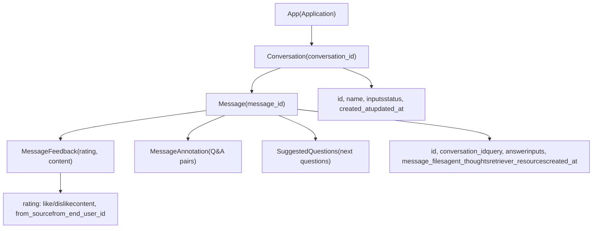
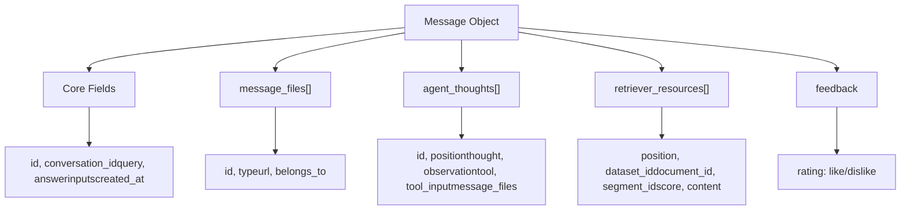
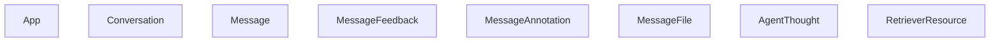

# Conversation and Message Management APIs

Relevant source files

-   [web/app/components/develop/template/template.en.mdx](https://github.com/langgenius/dify/blob/92dbc94f/web/app/components/develop/template/template.en.mdx)
-   [web/app/components/develop/template/template.ja.mdx](https://github.com/langgenius/dify/blob/92dbc94f/web/app/components/develop/template/template.ja.mdx)
-   [web/app/components/develop/template/template.zh.mdx](https://github.com/langgenius/dify/blob/92dbc94f/web/app/components/develop/template/template.zh.mdx)
-   [web/app/components/develop/template/template\_advanced\_chat.en.mdx](https://github.com/langgenius/dify/blob/92dbc94f/web/app/components/develop/template/template_advanced_chat.en.mdx)
-   [web/app/components/develop/template/template\_advanced\_chat.ja.mdx](https://github.com/langgenius/dify/blob/92dbc94f/web/app/components/develop/template/template_advanced_chat.ja.mdx)
-   [web/app/components/develop/template/template\_advanced\_chat.zh.mdx](https://github.com/langgenius/dify/blob/92dbc94f/web/app/components/develop/template/template_advanced_chat.zh.mdx)
-   [web/app/components/develop/template/template\_chat.en.mdx](https://github.com/langgenius/dify/blob/92dbc94f/web/app/components/develop/template/template_chat.en.mdx)
-   [web/app/components/develop/template/template\_chat.ja.mdx](https://github.com/langgenius/dify/blob/92dbc94f/web/app/components/develop/template/template_chat.ja.mdx)
-   [web/app/components/develop/template/template\_chat.zh.mdx](https://github.com/langgenius/dify/blob/92dbc94f/web/app/components/develop/template/template_chat.zh.mdx)
-   [web/app/components/develop/template/template\_workflow.en.mdx](https://github.com/langgenius/dify/blob/92dbc94f/web/app/components/develop/template/template_workflow.en.mdx)
-   [web/app/components/develop/template/template\_workflow.ja.mdx](https://github.com/langgenius/dify/blob/92dbc94f/web/app/components/develop/template/template_workflow.ja.mdx)
-   [web/app/components/develop/template/template\_workflow.zh.mdx](https://github.com/langgenius/dify/blob/92dbc94f/web/app/components/develop/template/template_workflow.zh.mdx)

This page documents the REST API endpoints for managing conversations, retrieving message history, submitting feedback, and accessing related metadata. These endpoints enable client applications to implement conversation-based interfaces with persistent chat history, user feedback collection, and annotation capabilities.

For message creation endpoints (sending chat or completion requests), see [Chat and Completion APIs](/langgenius/dify/8.2-chat-and-completion-apis). For workflow-specific execution tracking, see [Workflow Execution APIs](/langgenius/dify/8.3-workflow-execution-apis). For authentication and response streaming mechanisms, see [API Architecture and Response Modes](/langgenius/dify/8.1-api-architecture-and-response-modes).

---

## API Overview

The conversation and message management APIs provide access to the persistent state of user interactions with Dify applications. All endpoints require API-Key authentication via the `Authorization: Bearer {API_KEY}` header.

### Conversation and Message Hierarchy


Sources: [web/app/components/develop/template/template\_chat.en.mdx660-764](https://github.com/langgenius/dify/blob/92dbc94f/web/app/components/develop/template/template_chat.en.mdx#L660-L764) [web/app/components/develop/template/template\_chat.zh.mdx665-762](https://github.com/langgenius/dify/blob/92dbc94f/web/app/components/develop/template/template_chat.zh.mdx#L665-L762)

---

## Conversation Management

### List Conversations

**Endpoint:** `GET /conversations`

Retrieves a paginated list of conversations for the current end user. Conversations are returned in reverse chronological order (most recent first).

**Query Parameters:**

| Parameter | Type | Required | Description |
| --- | --- | --- | --- |
| `user` | string | Yes | End-user identifier, must be unique within the application |
| `last_id` | string | No | ID of the last conversation on current page for pagination |
| `limit` | integer | No | Number of conversations to return (default: 20) |
| `pinned` | boolean | No | Filter for pinned conversations only |

**Response Structure:**

```
{
  "data": [
    {
      "id": "conversation-uuid",
      "name": "Conversation title",
      "inputs": {},
      "status": "normal",
      "introduction": "Opening statement",
      "created_at": 1705395332,
      "updated_at": 1705395332
    }
  ],
  "has_more": true,
  "limit": 20
}
```
**Response Fields:**

-   `data` (array\[object\]) - List of conversation objects
    -   `id` (string) - Unique conversation identifier
    -   `name` (string) - Conversation title (auto-generated or custom)
    -   `inputs` (object) - Initial input variables used to start conversation
    -   `status` (string) - Conversation status: `normal`, `archived`, etc.
    -   `introduction` (string) - Opening statement shown to user
    -   `created_at` (timestamp) - Creation timestamp
    -   `updated_at` (timestamp) - Last update timestamp
-   `has_more` (boolean) - Whether more conversations exist
-   `limit` (integer) - Number of items returned

Sources: [web/app/components/develop/template/template\_chat.zh.mdx831-926](https://github.com/langgenius/dify/blob/92dbc94f/web/app/components/develop/template/template_chat.zh.mdx#L831-L926)

---

### Delete Conversation

**Endpoint:** `DELETE /conversations/:conversation_id`

Permanently deletes a conversation and all associated messages.

**Path Parameters:**

| Parameter | Type | Required | Description |
| --- | --- | --- | --- |
| `conversation_id` | string | Yes | Unique conversation identifier |

**Request Body:**

| Field | Type | Required | Description |
| --- | --- | --- | --- |
| `user` | string | Yes | End-user identifier (must match conversation owner) |

**Response:**

```
{
  "result": "success"
}
```
Sources: [web/app/components/develop/template/template\_chat.zh.mdx928-968](https://github.com/langgenius/dify/blob/92dbc94f/web/app/components/develop/template/template_chat.zh.mdx#L928-L968)

---

### Rename Conversation

**Endpoint:** `POST /conversations/:conversation_id/name`

Updates the conversation title. Can be set to auto-generate using LLM or specify a custom name.

**Path Parameters:**

| Parameter | Type | Required | Description |
| --- | --- | --- | --- |
| `conversation_id` | string | Yes | Unique conversation identifier |

**Request Body:**

| Field | Type | Required | Description |
| --- | --- | --- | --- |
| `name` | string | No | Custom conversation name |
| `auto_generate` | boolean | No | Whether to auto-generate name using LLM (default: false) |
| `user` | string | Yes | End-user identifier |

**Response:**

```
{
  "id": "conversation-uuid",
  "name": "Updated conversation name",
  "inputs": {},
  "status": "normal",
  "introduction": "",
  "created_at": 1705395332,
  "updated_at": 1705395440
}
```
**Behavior:**

-   If `auto_generate` is `true`, the system uses the LLM to generate a contextual title based on conversation content
-   If `name` is provided, it directly sets the conversation title
-   If both are provided, `name` takes precedence

Sources: [web/app/components/develop/template/template\_chat.zh.mdx970-1028](https://github.com/langgenius/dify/blob/92dbc94f/web/app/components/develop/template/template_chat.zh.mdx#L970-L1028)

---

## Message History Retrieval

### Get Conversation Messages

**Endpoint:** `GET /messages`

Retrieves historical messages from a conversation in scrolling pagination format. The first page returns the latest messages in reverse chronological order.

**Query Parameters:**

| Parameter | Type | Required | Description |
| --- | --- | --- | --- |
| `conversation_id` | string | Yes | Conversation identifier |
| `user` | string | Yes | End-user identifier |
| `first_id` | string | No | ID of first message on current page (for pagination) |
| `limit` | integer | No | Number of messages to return (default: 20) |

**Response Structure:**

```
{
  "limit": 20,
  "has_more": false,
  "data": [
    {
      "id": "message-uuid",
      "conversation_id": "conversation-uuid",
      "inputs": {"key": "value"},
      "query": "User question",
      "answer": "Assistant response",
      "message_files": [],
      "agent_thoughts": [],
      "feedback": null,
      "retriever_resources": [],
      "created_at": 1705395332
    }
  ]
}
```
### Message Data Structure


**Response Fields:**

| Field | Type | Description |
| --- | --- | --- |
| `id` | string | Unique message identifier |
| `conversation_id` | string | Parent conversation identifier |
| `inputs` | object | User input parameters/variables |
| `query` | string | User's input text or question |
| `answer` | string | Assistant's response content |
| `message_files` | array\[object\] | Attached files (images, documents, etc.) |
| `agent_thoughts` | array\[object\] | Agent reasoning steps (Agent mode only) |
| `feedback` | object | User feedback data (like/dislike) |
| `retriever_resources` | array\[object\] | Knowledge base citations |
| `created_at` | timestamp | Message creation time |

#### Message Files Structure

Each element in `message_files`:

| Field | Type | Description |
| --- | --- | --- |
| `id` | string | File identifier |
| `type` | string | File type: `image`, `document`, `audio`, `video`, `custom` |
| `url` | string | File preview URL (use `/files/{file_id}/preview` endpoint) |
| `belongs_to` | string | Owner: `user` or `assistant` |

#### Agent Thoughts Structure

Each element in `agent_thoughts` (Agent mode applications only):

| Field | Type | Description |
| --- | --- | --- |
| `id` | string | Unique thought identifier |
| `message_id` | string | Parent message identifier |
| `position` | integer | Iteration position in reasoning chain |
| `thought` | string | LLM's reasoning/thinking process |
| `observation` | string | Tool execution results |
| `tool` | string | Tool(s) called (semicolon-separated) |
| `tool_input` | string | Tool input parameters (JSON string) |
| `created_at` | timestamp | Creation time |
| `message_files` | array\[string\] | File IDs generated by this thought |

#### Retriever Resources Structure

Each element in `retriever_resources`:

| Field | Type | Description |
| --- | --- | --- |
| `position` | integer | Result ranking position |
| `dataset_id` | string | Knowledge base identifier |
| `dataset_name` | string | Knowledge base name |
| `document_id` | string | Source document identifier |
| `document_name` | string | Source document name |
| `segment_id` | string | Text segment identifier |
| `score` | float | Relevance score (0-1) |
| `content` | string | Retrieved text content |

Sources: [web/app/components/develop/template/template\_chat.en.mdx660-764](https://github.com/langgenius/dify/blob/92dbc94f/web/app/components/develop/template/template_chat.en.mdx#L660-L764) [web/app/components/develop/template/template\_chat.zh.mdx665-762](https://github.com/langgenius/dify/blob/92dbc94f/web/app/components/develop/template/template_chat.zh.mdx#L665-L762)

---

## Message Feedback System

### Submit Message Feedback

**Endpoint:** `POST /messages/:message_id/feedbacks`

Allows end users to provide feedback on assistant responses. Feedback includes like/dislike ratings and optional text comments.

**Path Parameters:**

| Parameter | Type | Required | Description |
| --- | --- | --- | --- |
| `message_id` | string | Yes | Target message identifier |

**Request Body:**

| Field | Type | Required | Description |
| --- | --- | --- | --- |
| `rating` | string | Yes | `like` (upvote), `dislike` (downvote), or `null` (revoke) |
| `user` | string | Yes | End-user identifier |
| `content` | string | No | Detailed feedback text |

**Example Request:**

```
curl -X POST 'https://api.dify.ai/v1/messages/abc-123/feedbacks' \
  --header 'Authorization: Bearer {api_key}' \
  --header 'Content-Type: application/json' \
  --data-raw '{
    "rating": "like",
    "user": "user-456",
    "content": "Very helpful response"
  }'
```
**Response:**

```
{
  "result": "success"
}
```
Sources: [web/app/components/develop/template/template\_chat.en.mdx484-542](https://github.com/langgenius/dify/blob/92dbc94f/web/app/components/develop/template/template_chat.en.mdx#L484-L542) [web/app/components/develop/template/template\_chat.zh.mdx490-548](https://github.com/langgenius/dify/blob/92dbc94f/web/app/components/develop/template/template_chat.zh.mdx#L490-L548)

---

### Get Application Feedbacks

**Endpoint:** `GET /app/feedbacks`

Retrieves all feedback submitted for the application, with pagination support. Useful for analytics and improving application quality.

**Query Parameters:**

| Parameter | Type | Required | Description |
| --- | --- | --- | --- |
| `page` | integer | No | Page number (default: 1) |
| `limit` | integer | No | Records per page (default: 20, max: 100) |

**Response Structure:**

```
{
  "data": [
    {
      "id": "feedback-uuid",
      "app_id": "app-uuid",
      "conversation_id": "conversation-uuid",
      "message_id": "message-uuid",
      "rating": "like",
      "content": "Helpful response",
      "from_source": "user",
      "from_end_user_id": "user-uuid",
      "from_account_id": null,
      "created_at": "2025-04-24T09:24:38",
      "updated_at": "2025-04-24T09:24:38"
    }
  ]
}
```
**Response Fields:**

| Field | Type | Description |
| --- | --- | --- |
| `id` | string | Unique feedback identifier |
| `app_id` | string | Application identifier |
| `conversation_id` | string | Associated conversation ID |
| `message_id` | string | Associated message ID |
| `rating` | string | `like` or `dislike` |
| `content` | string | Feedback text content |
| `from_source` | string | Source type: `user` (end-user) or `account` (admin/developer) |
| `from_end_user_id` | string | End-user identifier (if from\_source=user) |
| `from_account_id` | string | Account identifier (if from\_source=account) |
| `created_at` | string | ISO 8601 timestamp |
| `updated_at` | string | ISO 8601 timestamp |

### Feedback Flow Diagram

> **[Mermaid sequence]**
> *(图表结构无法解析)*

Sources: [web/app/components/develop/template/template\_chat.en.mdx546-603](https://github.com/langgenius/dify/blob/92dbc94f/web/app/components/develop/template/template_chat.en.mdx#L546-L603) [web/app/components/develop/template/template\_chat.zh.mdx552-609](https://github.com/langgenius/dify/blob/92dbc94f/web/app/components/develop/template/template_chat.zh.mdx#L552-L609)

---

## Suggested Questions

### Get Next Suggested Questions

**Endpoint:** `GET /messages/{message_id}/suggested`

Retrieves AI-generated follow-up question suggestions for a given message. These suggestions help guide users toward relevant next queries.

**Path Parameters:**

| Parameter | Type | Required | Description |
| --- | --- | --- | --- |
| `message_id` | string | Yes | Message identifier to generate suggestions for |

**Query Parameters:**

| Parameter | Type | Required | Description |
| --- | --- | --- | --- |
| `user` | string | Yes | End-user identifier |

**Response Structure:**

```
{
  "result": "success",
  "data": [
    "What are the key features?",
    "How does pricing work?",
    "Can you show me an example?"
  ]
}
```
**Response Fields:**

-   `result` (string) - Operation status: `success` or error code
-   `data` (array\[string\]) - List of suggested question strings (typically 2-4 items)

**Feature Requirements:**

This endpoint is only available when:

1.  The application has "Suggested Questions After Answer" feature enabled
2.  The target message has completed successfully
3.  The message belongs to the requesting user's conversation

**Common Error Codes:**

-   `404` - Message not found or user does not have access
-   `400` - Feature not enabled for this application

Sources: [web/app/components/develop/template/template\_chat.en.mdx606-656](https://github.com/langgenius/dify/blob/92dbc94f/web/app/components/develop/template/template_chat.en.mdx#L606-L656) [web/app/components/develop/template/template\_chat.zh.mdx612-661](https://github.com/langgenius/dify/blob/92dbc94f/web/app/components/develop/template/template_chat.zh.mdx#L612-L661)

---

## Audio Conversion APIs

### Audio to Text

**Endpoint:** `POST /audio-to-text`

Converts audio input to text using speech-to-text models. Used for voice-based chat interactions.

**Request Body:**

| Field | Type | Required | Description |
| --- | --- | --- | --- |
| `file` | file | Yes | Audio file (multipart/form-data) |
| `user` | string | Yes | End-user identifier |

**Supported Audio Formats:**

-   MP3, M4A, WAV, WEBM, AMR

**Response:**

```
{
  "text": "Transcribed text from audio"
}
```
Sources: [web/app/components/develop/template/template\_chat.zh.mdx1030-1083](https://github.com/langgenius/dify/blob/92dbc94f/web/app/components/develop/template/template_chat.zh.mdx#L1030-L1083)

---

### Text to Audio

**Endpoint:** `POST /text-to-audio`

Converts text to speech audio. Used for voice output in chat applications.

**Request Body:**

| Field | Type | Required | Description |
| --- | --- | --- | --- |
| `message_id` | string | No | Dify message ID to synthesize (takes priority) |
| `text` | string | No | Text content to synthesize (if no message\_id) |
| `user` | string | Yes | End-user identifier |

**Behavior:**

-   If `message_id` is provided, system retrieves message content and synthesizes it
-   If only `text` is provided, synthesizes the provided text
-   `message_id` takes priority if both are provided

**Response:**

Binary audio file (Content-Type: `audio/wav` or `audio/mp3`)

**Example Request:**

```
curl -o output.mp3 -X POST 'https://api.dify.ai/v1/text-to-audio' \
  --header 'Authorization: Bearer {api_key}' \
  --header 'Content-Type: application/json' \
  --data-raw '{
    "message_id": "msg-123",
    "user": "user-456"
  }'
```
Sources: [web/app/components/develop/template/template.zh.mdx490-538](https://github.com/langgenius/dify/blob/92dbc94f/web/app/components/develop/template/template.zh.mdx#L490-L538) [web/app/components/develop/template/template\_chat.zh.mdx1085-1142](https://github.com/langgenius/dify/blob/92dbc94f/web/app/components/develop/template/template_chat.zh.mdx#L1085-L1142)

---

## Data Model Relationships


Sources: [web/app/components/develop/template/template\_chat.en.mdx660-764](https://github.com/langgenius/dify/blob/92dbc94f/web/app/components/develop/template/template_chat.en.mdx#L660-L764) [web/app/components/develop/template/template\_chat.zh.mdx831-926](https://github.com/langgenius/dify/blob/92dbc94f/web/app/components/develop/template/template_chat.zh.mdx#L831-L926)

---

## Implementation Guidelines

### Pagination Pattern

All list endpoints follow a cursor-based pagination pattern:

```
# First page
GET /messages?conversation_id={id}&user={user}&limit=20

# Next page using last message ID
GET /messages?conversation_id={id}&user={user}&first_id={last_msg_id}&limit=20
```
### User Identifier Consistency

The `user` parameter must remain consistent across all API calls for a given end-user:

-   Used for conversation ownership validation
-   Required for message history retrieval
-   Enables proper user isolation in multi-tenant scenarios
-   Service API users are isolated from WebApp users

### Error Handling

Common error responses:

| Status | Code | Description |
| --- | --- | --- |
| 400 | `invalid_param` | Invalid request parameters |
| 403 | `forbidden` | User does not have access to resource |
| 404 | `not_found` | Conversation or message not found |
| 500 | `internal_server_error` | Server error |

### Rate Limiting

Feedback and annotation endpoints may be rate-limited to prevent abuse:

-   Typically 10 requests per minute per user
-   Returns `429 Too Many Requests` when exceeded

Sources: [web/app/components/develop/template/template\_chat.en.mdx1-900](https://github.com/langgenius/dify/blob/92dbc94f/web/app/components/develop/template/template_chat.en.mdx#L1-L900) [web/app/components/develop/template/template\_chat.zh.mdx1-900](https://github.com/langgenius/dify/blob/92dbc94f/web/app/components/develop/template/template_chat.zh.mdx#L1-L900)
