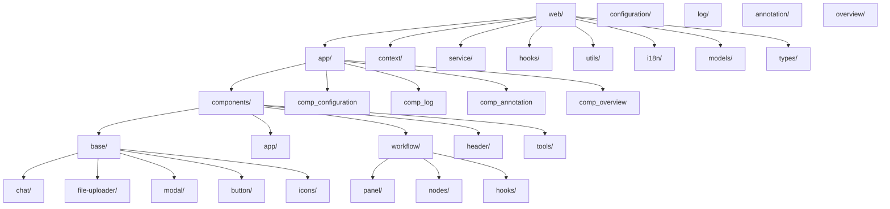
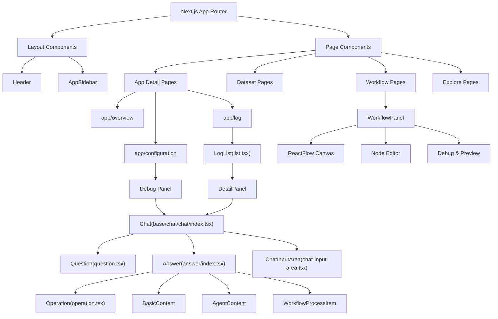
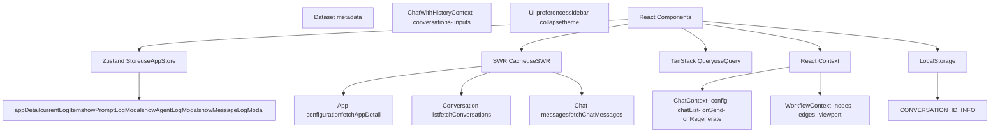
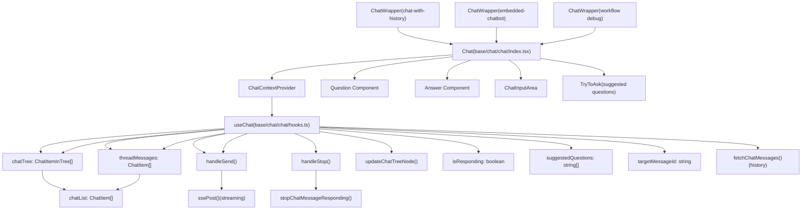
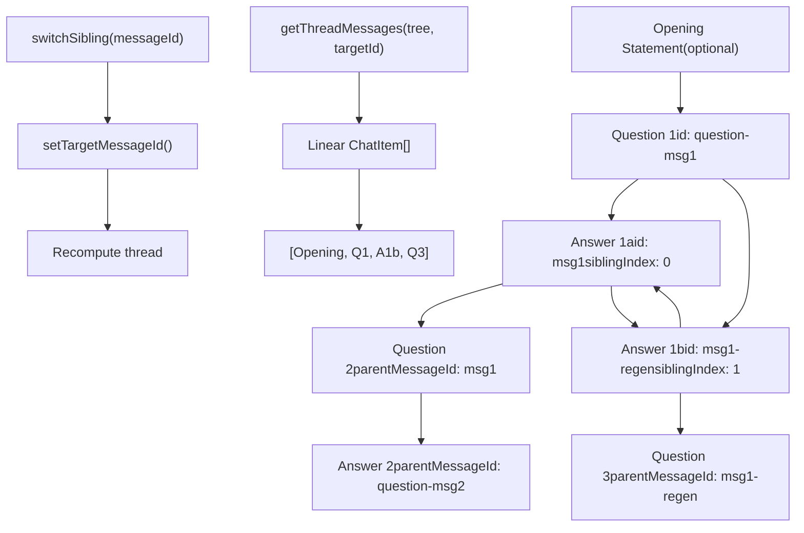
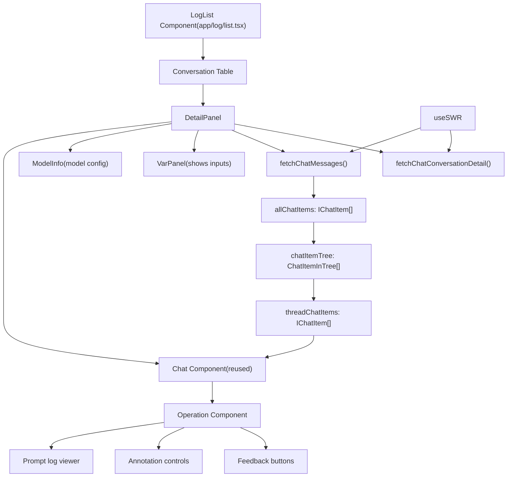
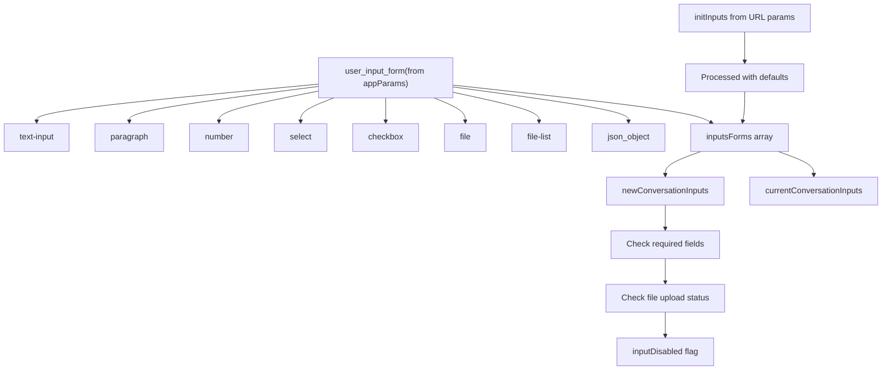
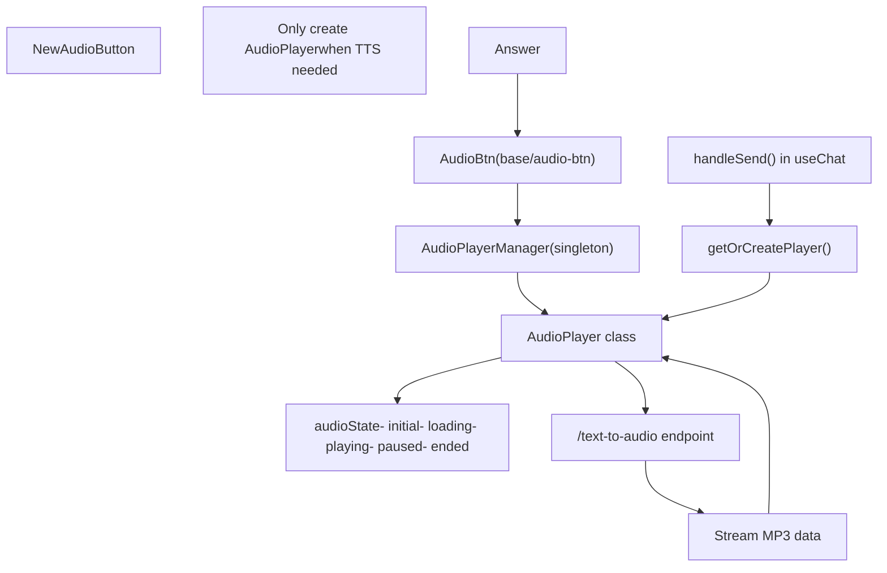

# Web Frontend Architecture

Relevant source files

-   [api/libs/helper.py](https://github.com/langgenius/dify/blob/92dbc94f/api/libs/helper.py)
-   [api/tests/unit\_tests/libs/test\_helper.py](https://github.com/langgenius/dify/blob/92dbc94f/api/tests/unit_tests/libs/test_helper.py)
-   [web/.env.example](https://github.com/langgenius/dify/blob/92dbc94f/web/.env.example)
-   [web/app/(commonLayout)/app/(appDetailLayout)/layout.tsx](https://github.com/langgenius/dify/blob/92dbc94f/web/app/(commonLayout)/app/(appDetailLayout)/layout.tsx)/app/(appDetailLayout)/layout.tsx)
-   [web/app/(commonLayout)/datasets/(datasetDetailLayout)/\[datasetId\]/settings/page.tsx](web/app/(commonLayout)/datasets/(datasetDetailLayout)/%5BdatasetId%5D/settings/page.tsx)
-   [web/app/activate/activateForm.tsx](https://github.com/langgenius/dify/blob/92dbc94f/web/app/activate/activateForm.tsx)
-   [web/app/components/base/form/hooks/use-get-form-values.ts](https://github.com/langgenius/dify/blob/92dbc94f/web/app/components/base/form/hooks/use-get-form-values.ts)
-   [web/app/components/base/form/utils/zod-submit-validator.ts](https://github.com/langgenius/dify/blob/92dbc94f/web/app/components/base/form/utils/zod-submit-validator.ts)
-   [web/app/components/base/logo/logo-embedded-chat-avatar.tsx](https://github.com/langgenius/dify/blob/92dbc94f/web/app/components/base/logo/logo-embedded-chat-avatar.tsx)
-   [web/app/components/plugins/marketplace/description/index.spec.tsx](https://github.com/langgenius/dify/blob/92dbc94f/web/app/components/plugins/marketplace/description/index.spec.tsx)
-   [web/app/components/plugins/marketplace/description/index.tsx](https://github.com/langgenius/dify/blob/92dbc94f/web/app/components/plugins/marketplace/description/index.tsx)
-   [web/app/components/provider/serwist.tsx](https://github.com/langgenius/dify/blob/92dbc94f/web/app/components/provider/serwist.tsx)
-   [web/app/forgot-password/ForgotPasswordForm.spec.tsx](https://github.com/langgenius/dify/blob/92dbc94f/web/app/forgot-password/ForgotPasswordForm.spec.tsx)
-   [web/app/forgot-password/ForgotPasswordForm.tsx](https://github.com/langgenius/dify/blob/92dbc94f/web/app/forgot-password/ForgotPasswordForm.tsx)
-   [web/app/install/installForm.tsx](https://github.com/langgenius/dify/blob/92dbc94f/web/app/install/installForm.tsx)
-   [web/app/layout.tsx](https://github.com/langgenius/dify/blob/92dbc94f/web/app/layout.tsx)
-   [web/app/serwist/\[path\]/route.ts](web/app/serwist/%5Bpath%5D/route.ts)
-   [web/app/sw.ts](https://github.com/langgenius/dify/blob/92dbc94f/web/app/sw.ts)
-   [web/config/index.ts](https://github.com/langgenius/dify/blob/92dbc94f/web/config/index.ts)
-   [web/docker/entrypoint.sh](https://github.com/langgenius/dify/blob/92dbc94f/web/docker/entrypoint.sh)
-   [web/eslint-rules/rules/no-as-any-in-t.js](https://github.com/langgenius/dify/blob/92dbc94f/web/eslint-rules/rules/no-as-any-in-t.js)
-   [web/eslint-rules/rules/no-legacy-namespace-prefix.js](https://github.com/langgenius/dify/blob/92dbc94f/web/eslint-rules/rules/no-legacy-namespace-prefix.js)
-   [web/eslint-rules/rules/require-ns-option.js](https://github.com/langgenius/dify/blob/92dbc94f/web/eslint-rules/rules/require-ns-option.js)
-   [web/eslint-suppressions.json](https://github.com/langgenius/dify/blob/92dbc94f/web/eslint-suppressions.json)
-   [web/eslint.config.mjs](https://github.com/langgenius/dify/blob/92dbc94f/web/eslint.config.mjs)
-   [web/i18n-config/lib.client.ts](https://github.com/langgenius/dify/blob/92dbc94f/web/i18n-config/lib.client.ts)
-   [web/i18n-config/lib.server.ts](https://github.com/langgenius/dify/blob/92dbc94f/web/i18n-config/lib.server.ts)
-   [web/i18n-config/server.ts](https://github.com/langgenius/dify/blob/92dbc94f/web/i18n-config/server.ts)
-   [web/knip.config.ts](https://github.com/langgenius/dify/blob/92dbc94f/web/knip.config.ts)
-   [web/next.config.js](https://github.com/langgenius/dify/blob/92dbc94f/web/next.config.js)
-   [web/pnpm-lock.yaml](https://github.com/langgenius/dify/blob/92dbc94f/web/pnpm-lock.yaml)
-   [web/scripts/gen-icons.mjs](https://github.com/langgenius/dify/blob/92dbc94f/web/scripts/gen-icons.mjs)
-   [web/types/feature.ts](https://github.com/langgenius/dify/blob/92dbc94f/web/types/feature.ts)
-   [web/utils/server-only-context.ts](https://github.com/langgenius/dify/blob/92dbc94f/web/utils/server-only-context.ts)

This document provides an architectural overview of the Dify web frontend, covering the Next.js 15 application structure, component hierarchy, state management patterns, and real-time communication strategies. The frontend is built with React 19 and TypeScript, implementing a modular architecture with clear separation of concerns.

For backend API integration patterns, see [Service APIs and External Integration](/langgenius/dify/8-service-apis). For workflow-specific UI components, see [Workflow System and Node Execution Architecture](/langgenius/dify/5-workflow-system-and-node-execution). For build system and tooling details, see [Frontend Build System and Configuration](/langgenius/dify/9.1-frontend-build-system-and-configuration).

---

## Technology Stack

The frontend is built on the following core technologies:

| Technology | Version | Purpose |
| --- | --- | --- |
| Next.js | 15.5.9 | React framework with App Router |
| React | 19.2.3 | UI library |
| TypeScript | 5.9.3 | Type safety |
| Zustand | 5.0.9 | Global state management |
| SWR | 2.3.7 | Server state caching |
| TanStack Query | 5.90.12 | Alternative server state management |
| Tailwind CSS | 3.4.18 | Utility-first CSS |
| React Flow | 11.11.4 | Workflow graph visualization |
| i18next | 23.16.8 | Internationalization |

**Sources:** [web/pnpm-lock.yaml1-566](https://github.com/langgenius/dify/blob/92dbc94f/web/pnpm-lock.yaml#L1-L566)

---

## Application Structure

### Directory Organization


**Diagram: Frontend Directory Structure**

The application follows Next.js 15 App Router conventions with a modular component architecture. Key directories:

-   `app/components/base/`: Reusable UI primitives (buttons, modals, chat components)
-   `app/components/app/`: Application-specific features (configuration, logs, annotations)
-   `app/components/workflow/`: Workflow editor and execution components
-   `context/`: React Context providers for global state
-   `service/`: API client functions
-   `hooks/`: Custom React hooks
-   `models/`: TypeScript type definitions
-   `i18n/`: Translation files

**Sources:** [web/app/components/base/chat/chat/index.tsx1-372](https://github.com/langgenius/dify/blob/92dbc94f/web/app/components/base/chat/chat/index.tsx#L1-L372) [web/app/components/app/log/list.tsx1-1020](https://github.com/langgenius/dify/blob/92dbc94f/web/app/components/app/log/list.tsx#L1-L1020) [web/app/components/workflow/panel/debug-and-preview/hooks.ts1-500](https://github.com/langgenius/dify/blob/92dbc94f/web/app/components/workflow/panel/debug-and-preview/hooks.ts#L1-L500)

---

## Component Architecture

### Component Hierarchy


**Diagram: Component Hierarchy and Composition**

The component architecture follows a hierarchical composition pattern with clear boundaries:

1.  **Layout Components**: Persistent UI elements like `Header` and `AppSidebar`
2.  **Page Components**: Route-specific containers organized by feature area
3.  **Feature Components**: Domain-specific components (configuration, logs, workflows)
4.  **Base Components**: Reusable primitives that form the foundation

**Sources:** [web/app/components/base/chat/chat/index.tsx77-371](https://github.com/langgenius/dify/blob/92dbc94f/web/app/components/base/chat/chat/index.tsx#L77-L371) [web/app/components/app/log/list.tsx202-760](https://github.com/langgenius/dify/blob/92dbc94f/web/app/components/app/log/list.tsx#L202-L760) [web/app/components/app-sidebar/app-info.tsx61-464](https://github.com/langgenius/dify/blob/92dbc94f/web/app/components/app-sidebar/app-info.tsx#L61-L464)

---

## State Management Architecture

### Hybrid State Management Strategy


**Diagram: State Management Layers and Data Flow**

The frontend implements a multi-layered state management strategy:

**1\. Zustand (Global App State)**

-   Location: [web/app/components/app/store.ts](https://github.com/langgenius/dify/blob/92dbc94f/web/app/components/app/store.ts)
-   Manages UI state like modal visibility, current log items, app details
-   Accessed via `useAppStore` hook with shallow comparison

**2\. SWR (Server State Cache)**

-   Used for data fetching with automatic revalidation
-   Provides optimistic updates and background revalidation
-   Example: [web/app/components/base/chat/chat-with-history/hooks.tsx177-191](https://github.com/langgenius/dify/blob/92dbc94f/web/app/components/base/chat/chat-with-history/hooks.tsx#L177-L191)

**3\. React Context (Scoped State)**

-   `ChatContext`: Manages chat configuration and callbacks [web/app/components/base/chat/chat/context.ts](https://github.com/langgenius/dify/blob/92dbc94f/web/app/components/base/chat/chat/context.ts)
-   `WorkflowContext`: Workflow execution state
-   `ChatWithHistoryContext`: Conversation history and inputs

**4\. LocalStorage (Persistence)**

-   Stores conversation IDs: `CONVERSATION_ID_INFO` constant
-   UI preferences like sidebar collapse state

**Sources:** [web/app/components/base/chat/chat/index.tsx115-122](https://github.com/langgenius/dify/blob/92dbc94f/web/app/components/base/chat/chat/index.tsx#L115-L122) [web/app/components/base/chat/chat-with-history/hooks.tsx150-167](https://github.com/langgenius/dify/blob/92dbc94f/web/app/components/base/chat/chat-with-history/hooks.tsx#L150-L167) [web/app/components/app/log/list.tsx210-218](https://github.com/langgenius/dify/blob/92dbc94f/web/app/components/app/log/list.tsx#L210-L218)

---

## Chat System Architecture

### Chat Component Structure


**Diagram: Chat Component Architecture and Data Flow**

The chat system is built around a core `Chat` component that is reusable across different contexts:

**Component Wrappers:**

-   `ChatWrapper` (chat-with-history): Full chat application with conversation management
-   `ChatWrapper` (embedded-chatbot): Embeddable chat widget
-   `ChatWrapper` (workflow debug): Workflow testing interface

**Core Components:**

-   `Chat` [web/app/components/base/chat/chat/index.tsx77-371](https://github.com/langgenius/dify/blob/92dbc94f/web/app/components/base/chat/chat/index.tsx#L77-L371): Main container managing layout and orchestration
-   `Question` [web/app/components/base/chat/chat/question.tsx](https://github.com/langgenius/dify/blob/92dbc94f/web/app/components/base/chat/chat/question.tsx): Renders user messages
-   `Answer` [web/app/components/base/chat/chat/answer/index.tsx40-233](https://github.com/langgenius/dify/blob/92dbc94f/web/app/components/base/chat/chat/answer/index.tsx#L40-L233): Renders assistant responses with operations
-   `ChatInputArea`: User input field with file upload and voice input

**State Management:** The `useChat` hook [web/app/components/base/chat/chat/hooks.ts48-657](https://github.com/langgenius/dify/blob/92dbc94f/web/app/components/base/chat/chat/hooks.ts#L48-L657) manages:

-   `chatTree`: Tree structure for message threading and branching
-   `threadMessages`: Linear view of current conversation thread
-   `isResponding`: Response state for UI feedback
-   `suggestedQuestions`: Post-response suggestions

**Sources:** [web/app/components/base/chat/chat/index.tsx1-372](https://github.com/langgenius/dify/blob/92dbc94f/web/app/components/base/chat/chat/index.tsx#L1-L372) [web/app/components/base/chat/chat/hooks.ts1-657](https://github.com/langgenius/dify/blob/92dbc94f/web/app/components/base/chat/chat/hooks.ts#L1-L657) [web/app/components/base/chat/chat-with-history/chat-wrapper.tsx1-302](https://github.com/langgenius/dify/blob/92dbc94f/web/app/components/base/chat/chat-with-history/chat-wrapper.tsx#L1-L302)

---

## Real-Time Communication

### Server-Sent Events (SSE) Flow

> **[Mermaid sequence]**
> *(图表结构无法解析)*

**Diagram: Server-Sent Events Communication Flow**

The frontend uses Server-Sent Events (SSE) for real-time streaming responses:

**1\. Connection Establishment**

-   `ssePost()` function [web/service/base.ts](https://github.com/langgenius/dify/blob/92dbc94f/web/service/base.ts) establishes SSE connection
-   Sends POST request with `response_mode: 'streaming'`
-   Receives event stream from backend

**2\. Event Handling** Key event callbacks in `handleSend` [web/app/components/base/chat/chat/hooks.ts212-476](https://github.com/langgenius/dify/blob/92dbc94f/web/app/components/base/chat/chat/hooks.ts#L212-L476):

-   `onData`: Handles text chunks, updates content incrementally
-   `onThought`: Processes agent reasoning steps
-   `onFile`: Adds generated files (images, documents)
-   `onCompleted`: Finalizes message and fetches metadata
-   `onWorkflowStarted/onWorkflowFinished`: Workflow execution events
-   `onNodeStarted/onNodeFinished`: Individual node execution events
-   `onTextChunk/onTextReplace`: Workflow node output streaming

**3\. State Updates**

-   Uses `updateCurrentQAOnTree()` to update chat tree immutably
-   Triggers React re-renders for incremental display
-   Maintains conversation history with parent-child relationships

**4\. Error Handling**

-   `hasStopResponded` ref prevents duplicate stop calls
-   Abort controllers for canceling in-flight requests
-   Error states propagated through `onCompleted(hasError=true)`

**Sources:** [web/app/components/base/chat/chat/hooks.ts212-476](https://github.com/langgenius/dify/blob/92dbc94f/web/app/components/base/chat/chat/hooks.ts#L212-L476) [web/app/components/base/chat/chat/index.tsx131-175](https://github.com/langgenius/dify/blob/92dbc94f/web/app/components/base/chat/chat/index.tsx#L131-L175)

---

## Message Threading and Tree Structure

### Chat Item Tree Architecture


**Diagram: Message Tree Structure and Thread Extraction**

The chat system implements a tree structure to support message regeneration and branching conversations:

**Tree Node Structure** (`ChatItemInTree`):

```
{
  id: string
  content: string
  isAnswer: boolean
  parentMessageId?: string
  children?: ChatItemInTree[]
  siblingIndex?: number
  prevSibling?: string  // ID of previous sibling
  nextSibling?: string  // ID of next sibling
}
```
**Key Functions:**

-   `buildChatItemTree()` [web/app/components/base/chat/utils.ts](https://github.com/langgenius/dify/blob/92dbc94f/web/app/components/base/chat/utils.ts): Converts flat message list to tree
-   `getThreadMessages()` [web/app/components/base/chat/utils.ts](https://github.com/langgenius/dify/blob/92dbc94f/web/app/components/base/chat/utils.ts): Extracts linear thread from tree based on target message ID
-   `switchSibling()` [web/app/components/base/chat/chat/index.tsx68](https://github.com/langgenius/dify/blob/92dbc94f/web/app/components/base/chat/chat/index.tsx#L68-L68): Navigates between alternative responses

**Message Regeneration Flow:**

1.  User clicks regenerate on an answer
2.  New placeholder answer added as sibling to current answer
3.  SSE stream populates new answer content
4.  Sibling navigation allows switching between answers
5.  `ContentSwitch` component displays "1 of 2" UI

**Sources:** [web/app/components/base/chat/chat/hooks.ts73-105](https://github.com/langgenius/dify/blob/92dbc94f/web/app/components/base/chat/chat/hooks.ts#L73-L105) [web/app/components/base/chat/chat/answer/index.tsx103-112](https://github.com/langgenius/dify/blob/92dbc94f/web/app/components/base/chat/chat/answer/index.tsx#L103-L112)

---

## Log Viewer Architecture

### Admin Log Viewer Components


**Diagram: Admin Log Viewer Architecture**

The log viewer [web/app/components/app/log/list.tsx1-1020](https://github.com/langgenius/dify/blob/92dbc94f/web/app/components/app/log/list.tsx#L1-L1020) provides administrators with detailed conversation inspection:

**Component Hierarchy:**

1.  **LogList**: Container managing conversation list and detail panel
2.  **ConversationTable**: Displays conversations with status indicators
3.  **DetailPanel**: Shows conversation details in a drawer

**Data Loading Strategy:**

-   Initial load: Fetch conversation metadata
-   On expand: Fetch first 10 messages via `fetchChatMessages()` [web/app/components/app/log/list.tsx228-285](https://github.com/langgenius/dify/blob/92dbc94f/web/app/components/app/log/list.tsx#L228-L285)
-   Pagination: Load more messages on scroll with `loadMoreMessages()` [web/app/components/app/log/list.tsx388-519](https://github.com/langgenius/dify/blob/92dbc94f/web/app/components/app/log/list.tsx#L388-L519)
-   Scroll handling: Detects scroll to top and triggers pagination [web/app/components/app/log/list.tsx521-585](https://github.com/langgenius/dify/blob/92dbc94f/web/app/components/app/log/list.tsx#L521-L585)

**Message Tree Management:**

-   `allChatItems`: Flat array of all loaded messages
-   `buildChatItemTree()`: Constructs tree from flat list
-   `getThreadMessages()`: Extracts current viewing thread
-   Supports message regeneration and sibling navigation

**Operations:**

-   User/admin feedback with separate rating systems
-   Annotation editing and management
-   Prompt log viewing for debugging
-   Message log inspection

**Sources:** [web/app/components/app/log/list.tsx196-760](https://github.com/langgenius/dify/blob/92dbc94f/web/app/components/app/log/list.tsx#L196-L760) [web/app/components/base/chat/chat/answer/operation.tsx1-300](https://github.com/langgenius/dify/blob/92dbc94f/web/app/components/base/chat/chat/answer/operation.tsx#L1-L300)

---

## Internationalization (i18n)

### Translation System

The frontend uses `i18next` for internationalization with dynamic loading:

**Configuration:**

-   Main config: [web/i18n-config/i18next-config.ts](https://github.com/langgenius/dify/blob/92dbc94f/web/i18n-config/i18next-config.ts)
-   Supported languages: English, Simplified Chinese, Traditional Chinese, Portuguese, Japanese, Korean, Ukrainian, Vietnamese, French, Slovakian, Spanish, Italian, Thai, Indonesian, Russian, German, Polish, Hungarian, Romanian, Dutch, Arabic, Turkish, Persian, Hebrew

**Usage Patterns:**

```
// In components
const { t } = useTranslation()
t('appLog.table.header.userRate')  // Returns translated string

// Dynamic language switching
changeLanguage('zh-Hans')
```
**Translation File Structure:**

-   Base translations: `web/i18n/[locale]/`
-   Lazy loading via `i18next-resources-to-backend`
-   Namespace-based organization (app, common, workflow, etc.)

**Sources:** [web/app/components/app/log/list.tsx16](https://github.com/langgenius/dify/blob/92dbc94f/web/app/components/app/log/list.tsx#L16-L16) [web/app/components/base/chat/chat-with-history/hooks.tsx117-123](https://github.com/langgenius/dify/blob/92dbc94f/web/app/components/base/chat/chat-with-history/hooks.tsx#L117-L123)

---

## Form and Input Management

### Input Variables and Forms


**Diagram: Input Form Processing and Validation**

The frontend dynamically generates form fields based on backend configuration:

**Form Field Types:** Defined in `user_input_form` array [web/app/components/base/chat/chat-with-history/hooks.tsx216-287](https://github.com/langgenius/dify/blob/92dbc94f/web/app/components/base/chat/chat-with-history/hooks.tsx#L216-L287):

-   `text-input`: Single line text with max length validation
-   `paragraph`: Multi-line text area
-   `number`: Numeric input
-   `select`: Dropdown with predefined options
-   `checkbox`: Boolean toggle
-   `file`: Single file upload
-   `file-list`: Multiple file upload
-   `json_object`: JSON editor

**URL Parameter Injection:**

-   `initInputs` populated from URL query parameters
-   Allows pre-filling forms via deep links
-   Example: `?inputs={"var1":"value1"}`

**Validation Logic** [web/app/components/base/chat/chat-with-history/chat-wrapper.tsx87-120](https://github.com/langgenius/dify/blob/92dbc94f/web/app/components/base/chat/chat-with-history/chat-wrapper.tsx#L87-L120):

1.  Check all required fields are non-empty
2.  Verify files are uploaded (not just selected)
3.  Set `inputDisabled` flag to prevent submission

**Sources:** [web/app/components/base/chat/chat-with-history/hooks.tsx216-287](https://github.com/langgenius/dify/blob/92dbc94f/web/app/components/base/chat/chat-with-history/hooks.tsx#L216-L287) [web/app/components/base/chat/chat-with-history/chat-wrapper.tsx86-120](https://github.com/langgenius/dify/blob/92dbc94f/web/app/components/base/chat/chat-with-history/chat-wrapper.tsx#L86-L120)

---

## File Upload System

### File Upload Architecture

The file upload system supports both local and remote files with multiple transfer methods:

**Transfer Methods:**

-   `local_file`: Upload to Dify storage, receive `uploadedId`
-   `remote_url`: Reference external URL
-   `tool_file`: File generated by tool execution

**File Entity Structure:**

```
type FileEntity = {
  id?: string
  name: string
  size?: number
  type: string
  transferMethod: TransferMethod
  url?: string
  uploadedId?: string  // Set after upload completes
  progress?: number
}
```
**Upload Flow:**

1.  User selects file via `FileUploader` component
2.  File added to form state with `transferMethod: 'local_file'`
3.  Upload initiated, progress tracked
4.  On completion, `uploadedId` populated
5.  On submit, `uploadedId` sent to backend

**File Processing:**

-   `getProcessedFiles()` [web/app/components/base/file-uploader/utils.ts](https://github.com/langgenius/dify/blob/92dbc94f/web/app/components/base/file-uploader/utils.ts): Prepares files for API request
-   `getProcessedFilesFromResponse()`: Converts backend response to UI format
-   Vision files (images) handled separately for multi-modal models

**Sources:** [web/app/components/base/chat/chat/hooks.ts276-295](https://github.com/langgenius/dify/blob/92dbc94f/web/app/components/base/chat/chat/hooks.ts#L276-L295) [web/app/components/base/chat/chat-with-history/chat-wrapper.tsx104-110](https://github.com/langgenius/dify/blob/92dbc94f/web/app/components/base/chat/chat-with-history/chat-wrapper.tsx#L104-L110)

---

## Audio and TTS Integration

### Text-to-Speech System


**Diagram: Text-to-Speech Architecture**

The TTS system provides audio playback of assistant responses:

**Components:**

-   `AudioBtn` [web/app/components/base/audio-btn/index.tsx21-90](https://github.com/langgenius/dify/blob/92dbc94f/web/app/components/base/audio-btn/index.tsx#L21-L90): UI button with play/pause states
-   `AudioPlayerManager`: Singleton managing player instances
-   `AudioPlayer`: Handles audio streaming and playback

**Lazy Initialization Pattern:** In `useChat` hook [web/app/components/base/chat/chat/hooks.ts312-320](https://github.com/langgenius/dify/blob/92dbc94f/web/app/components/base/chat/chat/hooks.ts#L312-L320):

```
let player: AudioPlayer | null = null
const getOrCreatePlayer = () => {
  if (!player)
    player = AudioPlayerManager.getInstance().getAudioPlayer(...)
  return player
}
```
**Benefits:**

-   Avoids opening audio channel unnecessarily
-   Reduces resource usage when TTS not enabled
-   Player created only when first TTS event received

**Audio State Machine:**

1.  `initial`: Button ready
2.  `loading`: Fetching audio from backend
3.  `playing`: Audio playing
4.  `paused`: Playback paused
5.  `ended`: Playback completed

**Sources:** [web/app/components/base/audio-btn/index.tsx1-90](https://github.com/langgenius/dify/blob/92dbc94f/web/app/components/base/audio-btn/index.tsx#L1-L90) [web/app/components/base/chat/chat/hooks.ts312-320](https://github.com/langgenius/dify/blob/92dbc94f/web/app/components/base/chat/chat/hooks.ts#L312-L320)

---

## Workflow UI Components

The workflow editor provides visual programming capabilities:

**Key Components:**

-   **Canvas**: React Flow-based graph editor
-   **Node Panel**: Draggable node palette
-   **Node Editor**: Configuration panel for selected node
-   **Debug Panel**: Execution preview with chat interface

**Integration Points:**

-   Workflow context provides shared state [web/app/components/workflow/context.tsx](https://github.com/langgenius/dify/blob/92dbc94f/web/app/components/workflow/context.tsx)
-   Hooks for workflow execution [web/app/components/workflow/hooks.ts](https://github.com/langgenius/dify/blob/92dbc94f/web/app/components/workflow/hooks.ts)
-   Debug chat reuses base `Chat` component [web/app/components/workflow/panel/debug-and-preview/chat-wrapper.tsx1-180](https://github.com/langgenius/dify/blob/92dbc94f/web/app/components/workflow/panel/debug-and-preview/chat-wrapper.tsx#L1-L180)

For detailed workflow architecture, see [Workflow and Application Execution](/langgenius/dify/5-workflow-system-and-node-execution).

**Sources:** [web/app/components/workflow/panel/debug-and-preview/chat-wrapper.tsx1-180](https://github.com/langgenius/dify/blob/92dbc94f/web/app/components/workflow/panel/debug-and-preview/chat-wrapper.tsx#L1-L180) [web/app/components/workflow/panel/debug-and-preview/hooks.ts1-500](https://github.com/langgenius/dify/blob/92dbc94f/web/app/components/workflow/panel/debug-and-preview/hooks.ts#L1-L500)

---

## Testing Infrastructure

### Jest Configuration

The project uses Jest with Happy DOM for unit testing:

**Configuration:** [web/jest.config.ts1-205](https://github.com/langgenius/dify/blob/92dbc94f/web/jest.config.ts#L1-L205)

-   Test environment: `@happy-dom/jest-environment`
-   Coverage provider: V8
-   Module name mapping: `@/*` → `<rootDir>/*`
-   Setup file: [web/jest.setup.ts1-64](https://github.com/langgenius/dify/blob/92dbc94f/web/jest.setup.ts#L1-L64)

**Test Setup:**

-   Mock Web Animations API for Headless UI compatibility
-   Suppress internal Headless UI `act()` warnings
-   Global cleanup after each test

**Coverage Reporting:**

-   JSON summary
-   LCOV for CI integration
-   Text output for terminal

**Sources:** [web/jest.config.ts1-205](https://github.com/langgenius/dify/blob/92dbc94f/web/jest.config.ts#L1-L205) [web/jest.setup.ts1-64](https://github.com/langgenius/dify/blob/92dbc94f/web/jest.setup.ts#L1-L64)

---

## ESLint and Code Quality

### Linting Configuration

The project uses a comprehensive ESLint setup based on `@antfu/eslint-config`:

**Key Configurations:** [web/eslint.config.mjs1-250](https://github.com/langgenius/dify/blob/92dbc94f/web/eslint.config.mjs#L1-L250)

-   **Stylistic Rules**: Stroustrup brace style, single quotes, 2-space indentation
-   **TypeScript**: Consistent type definitions, no empty object types
-   **React**: React Hooks rules, Next.js core web vitals
-   **Sonarjs**: Code complexity, maintainability checks
-   **Tailwind**: Class ordering and validation
-   **Oxlint**: Additional performance linting

**Disabled Rules:**

-   `sonarjs/cognitive-complexity`: Too restrictive
-   `sonarjs/max-lines`: 1000 line limit (warning only)
-   `@next/next/no-html-link-for-pages`: Performance issues

**Import Sorting:**

```
sort-imports: ['error', {
  ignoreCase: false,
  ignoreDeclarationSort: true,
  ignoreMemberSort: false
}]
```
**Sources:** [web/eslint.config.mjs1-250](https://github.com/langgenius/dify/blob/92dbc94f/web/eslint.config.mjs#L1-L250)

---

## Performance Optimizations

### Optimization Strategies

1.  **React Memoization:**

    -   `memo()` for expensive components [web/app/components/base/chat/chat/index.tsx371](https://github.com/langgenius/dify/blob/92dbc94f/web/app/components/base/chat/chat/index.tsx#L371-L371)
    -   `useMemo()` for derived state [web/app/components/base/chat/chat/hooks.ts83-105](https://github.com/langgenius/dify/blob/92dbc94f/web/app/components/base/chat/chat/hooks.ts#L83-L105)
    -   `useCallback()` for stable callbacks
2.  **SWR Caching:**

    -   Automatic background revalidation
    -   Stale-while-revalidate pattern
    -   Focus revalidation disabled for static data
3.  **Code Splitting:**

    -   Dynamic imports with `next/dynamic`
    -   Route-based code splitting via App Router
    -   Component lazy loading [web/app/components/app-sidebar/app-info.tsx35-52](https://github.com/langgenius/dify/blob/92dbc94f/web/app/components/app-sidebar/app-info.tsx#L35-L52)
4.  **Scroll Optimization:**

    -   Virtual scrolling with `react-window` for long lists
    -   Debounced scroll handlers [web/app/components/base/chat/chat/index.tsx168-175](https://github.com/langgenius/dify/blob/92dbc94f/web/app/components/base/chat/chat/index.tsx#L168-L175)
    -   Auto-scroll prevention during user scroll
5.  **State Updates:**

    -   Immer for immutable updates [web/app/components/base/chat/chat/hooks.ts9](https://github.com/langgenius/dify/blob/92dbc94f/web/app/components/base/chat/chat/hooks.ts#L9-L9)
    -   Refs for values that don't trigger re-renders
    -   Shallow comparison with Zustand

**Sources:** [web/app/components/base/chat/chat/index.tsx168-175](https://github.com/langgenius/dify/blob/92dbc94f/web/app/components/base/chat/chat/index.tsx#L168-L175) [web/app/components/app-sidebar/app-info.tsx35-52](https://github.com/langgenius/dify/blob/92dbc94f/web/app/components/app-sidebar/app-info.tsx#L35-L52) [web/app/components/base/chat/chat/hooks.ts107-112](https://github.com/langgenius/dify/blob/92dbc94f/web/app/components/base/chat/chat/hooks.ts#L107-L112)
