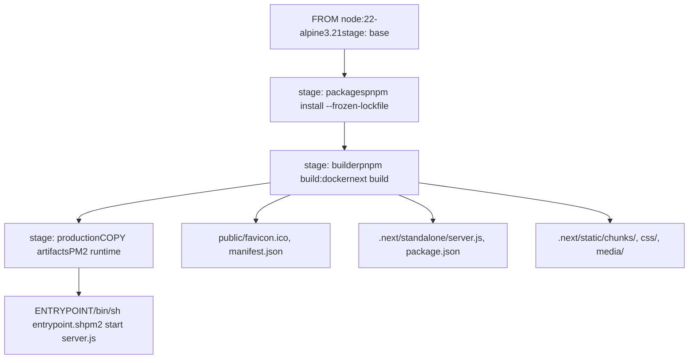
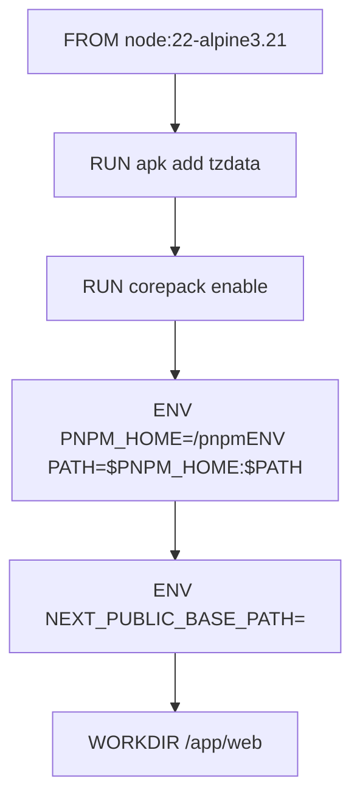
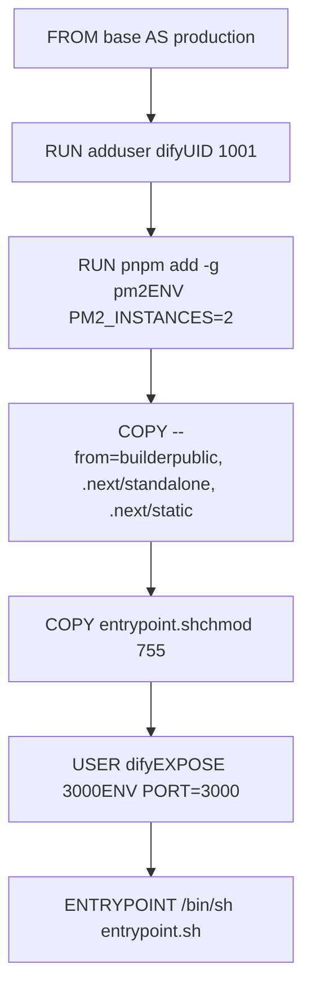
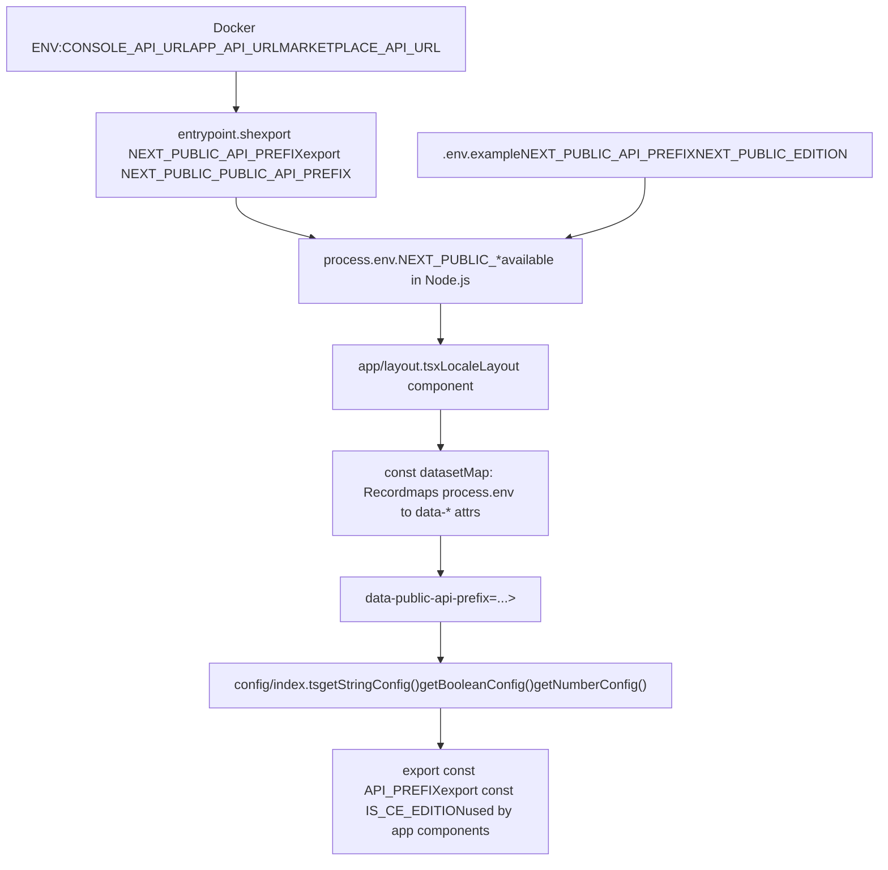
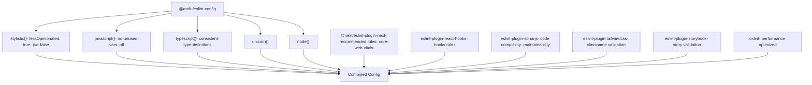
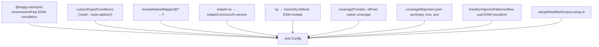
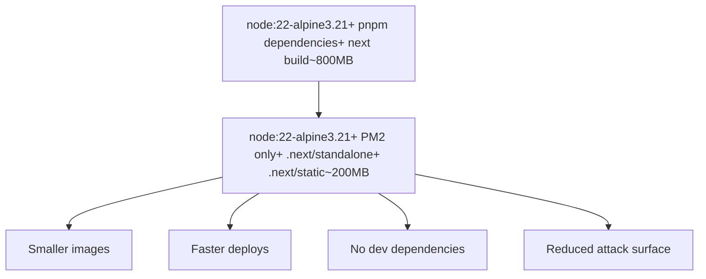

# Frontend Build and Configuration

Relevant source files

-   [.github/workflows/api-tests.yml](https://github.com/langgenius/dify/blob/92dbc94f/.github/workflows/api-tests.yml)
-   [.github/workflows/autofix.yml](https://github.com/langgenius/dify/blob/92dbc94f/.github/workflows/autofix.yml)
-   [.github/workflows/build-push.yml](https://github.com/langgenius/dify/blob/92dbc94f/.github/workflows/build-push.yml)
-   [.github/workflows/db-migration-test.yml](https://github.com/langgenius/dify/blob/92dbc94f/.github/workflows/db-migration-test.yml)
-   [.github/workflows/deploy-agent-dev.yml](https://github.com/langgenius/dify/blob/92dbc94f/.github/workflows/deploy-agent-dev.yml)
-   [.github/workflows/deploy-dev.yml](https://github.com/langgenius/dify/blob/92dbc94f/.github/workflows/deploy-dev.yml)
-   [.github/workflows/deploy-hitl.yml](https://github.com/langgenius/dify/blob/92dbc94f/.github/workflows/deploy-hitl.yml)
-   [.github/workflows/docker-build.yml](https://github.com/langgenius/dify/blob/92dbc94f/.github/workflows/docker-build.yml)
-   [.github/workflows/main-ci.yml](https://github.com/langgenius/dify/blob/92dbc94f/.github/workflows/main-ci.yml)
-   [.github/workflows/stale.yml](https://github.com/langgenius/dify/blob/92dbc94f/.github/workflows/stale.yml)
-   [.github/workflows/style.yml](https://github.com/langgenius/dify/blob/92dbc94f/.github/workflows/style.yml)
-   [.github/workflows/tool-test-sdks.yaml](https://github.com/langgenius/dify/blob/92dbc94f/.github/workflows/tool-test-sdks.yaml)
-   [.github/workflows/translate-i18n-claude.yml](https://github.com/langgenius/dify/blob/92dbc94f/.github/workflows/translate-i18n-claude.yml)
-   [.github/workflows/trigger-i18n-sync.yml](https://github.com/langgenius/dify/blob/92dbc94f/.github/workflows/trigger-i18n-sync.yml)
-   [.github/workflows/vdb-tests.yml](https://github.com/langgenius/dify/blob/92dbc94f/.github/workflows/vdb-tests.yml)
-   [.github/workflows/web-tests.yml](https://github.com/langgenius/dify/blob/92dbc94f/.github/workflows/web-tests.yml)
-   [api/Dockerfile](https://github.com/langgenius/dify/blob/92dbc94f/api/Dockerfile)
-   [api/migrations/README](https://github.com/langgenius/dify/blob/92dbc94f/api/migrations/README)
-   [web/.nvmrc](https://github.com/langgenius/dify/blob/92dbc94f/web/.nvmrc)
-   [web/Dockerfile](https://github.com/langgenius/dify/blob/92dbc94f/web/Dockerfile)
-   [web/README.md](https://github.com/langgenius/dify/blob/92dbc94f/web/README.md)
-   [web/app/(commonLayout)/app/(appDetailLayout)/layout.tsx](https://github.com/langgenius/dify/blob/92dbc94f/web/app/(commonLayout)/app/(appDetailLayout)/layout.tsx)/app/(appDetailLayout)/layout.tsx)
-   [web/app/(commonLayout)/datasets/(datasetDetailLayout)/\[datasetId\]/settings/page.tsx](web/app/(commonLayout)/datasets/(datasetDetailLayout)/%5BdatasetId%5D/settings/page.tsx)
-   [web/app/components/base/logo/logo-embedded-chat-avatar.tsx](https://github.com/langgenius/dify/blob/92dbc94f/web/app/components/base/logo/logo-embedded-chat-avatar.tsx)
-   [web/app/components/plugins/marketplace/description/index.spec.tsx](https://github.com/langgenius/dify/blob/92dbc94f/web/app/components/plugins/marketplace/description/index.spec.tsx)
-   [web/app/components/plugins/marketplace/description/index.tsx](https://github.com/langgenius/dify/blob/92dbc94f/web/app/components/plugins/marketplace/description/index.tsx)
-   [web/app/components/provider/serwist.tsx](https://github.com/langgenius/dify/blob/92dbc94f/web/app/components/provider/serwist.tsx)
-   [web/app/serwist/\[path\]/route.ts](web/app/serwist/%5Bpath%5D/route.ts)
-   [web/app/sw.ts](https://github.com/langgenius/dify/blob/92dbc94f/web/app/sw.ts)
-   [web/eslint-rules/rules/no-as-any-in-t.js](https://github.com/langgenius/dify/blob/92dbc94f/web/eslint-rules/rules/no-as-any-in-t.js)
-   [web/eslint-rules/rules/no-legacy-namespace-prefix.js](https://github.com/langgenius/dify/blob/92dbc94f/web/eslint-rules/rules/no-legacy-namespace-prefix.js)
-   [web/eslint-rules/rules/require-ns-option.js](https://github.com/langgenius/dify/blob/92dbc94f/web/eslint-rules/rules/require-ns-option.js)
-   [web/eslint-suppressions.json](https://github.com/langgenius/dify/blob/92dbc94f/web/eslint-suppressions.json)
-   [web/eslint.config.mjs](https://github.com/langgenius/dify/blob/92dbc94f/web/eslint.config.mjs)
-   [web/i18n-config/README.md](https://github.com/langgenius/dify/blob/92dbc94f/web/i18n-config/README.md)
-   [web/i18n-config/lib.client.ts](https://github.com/langgenius/dify/blob/92dbc94f/web/i18n-config/lib.client.ts)
-   [web/i18n-config/lib.server.ts](https://github.com/langgenius/dify/blob/92dbc94f/web/i18n-config/lib.server.ts)
-   [web/i18n-config/server.ts](https://github.com/langgenius/dify/blob/92dbc94f/web/i18n-config/server.ts)
-   [web/knip.config.ts](https://github.com/langgenius/dify/blob/92dbc94f/web/knip.config.ts)
-   [web/next.config.js](https://github.com/langgenius/dify/blob/92dbc94f/web/next.config.js)
-   [web/pnpm-lock.yaml](https://github.com/langgenius/dify/blob/92dbc94f/web/pnpm-lock.yaml)
-   [web/scripts/gen-icons.mjs](https://github.com/langgenius/dify/blob/92dbc94f/web/scripts/gen-icons.mjs)
-   [web/utils/server-only-context.ts](https://github.com/langgenius/dify/blob/92dbc94f/web/utils/server-only-context.ts)

## Purpose and Scope

This document details the frontend build pipeline, configuration management system, and deployment setup for Dify's Next.js-based web application. It covers the Docker multi-stage build process, package management with pnpm, the dual-source configuration architecture (build-time environment variables and runtime HTML attributes), and production deployment mechanisms.

For UI component architecture and patterns, see [UI Components and Patterns](/langgenius/dify/9.2-state-management-and-provider-architecture). For development environment setup including devcontainers, see [Development Environment Setup](/langgenius/dify/9.4-chat-ui-components-and-audio-features). For backend configuration using Pydantic, see [Configuration System](/langgenius/dify/2.3-application-types-and-execution-modes).

---

## Build Pipeline Overview

The frontend build process follows a multi-stage Docker build pattern with four distinct phases: dependency installation, production build, and runtime deployment. The application uses Next.js 15+ with standalone output mode for optimized production bundles.


**Sources:** [web/Dockerfile1-86](https://github.com/langgenius/dify/blob/92dbc94f/web/Dockerfile#L1-L86)

---

## Docker Multi-Stage Build

### Stage 1: Base Image

The base stage establishes the Node.js runtime environment and configures the package manager.

[web/Dockerfile2-15](https://github.com/langgenius/dify/blob/92dbc94f/web/Dockerfile#L2-L15)

Key configuration:

-   **Node.js**: Version 22 on Alpine Linux 3.21
-   **pnpm**: Enabled via corepack, version specified in `package.json`
-   **Timezone**: Configurable via `TZ` environment variable
-   **Base path**: Support for deployment under a subpath via `NEXT_PUBLIC_BASE_PATH`


### Stage 2: Package Installation

The packages stage installs Node.js dependencies using pnpm with a frozen lockfile to ensure reproducible builds.

[web/Dockerfile19-28](https://github.com/langgenius/dify/blob/92dbc94f/web/Dockerfile#L19-L28)

```
COPY package.json pnpm-lock.yaml /app/web/
RUN corepack install
RUN pnpm install --frozen-lockfile
```
The `--frozen-lockfile` flag ensures that the exact versions specified in `pnpm-lock.yaml` are installed, preventing unexpected dependency updates during build.

### Stage 3: Build

The builder stage compiles the Next.js application with optimizations for Docker deployment.

[web/Dockerfile31-37](https://github.com/langgenius/dify/blob/92dbc94f/web/Dockerfile#L31-L37)

```
ENV NODE_OPTIONS="--max-old-space-size=4096"
RUN pnpm build:docker
```
This stage:

-   Increases Node.js heap size to 4GB to prevent out-of-memory errors during build
-   Executes the `build:docker` script which runs Next.js build with standalone output mode
-   Generates optimized production bundles in `.next/standalone` and `.next/static`

### Stage 4: Production

The production stage creates a minimal runtime image with only the necessary artifacts.

[web/Dockerfile41-85](https://github.com/langgenius/dify/blob/92dbc94f/web/Dockerfile#L41-L85)

Key features:

-   **Non-root user**: Creates user `dify` (UID 1001) for security
-   **PM2 process manager**: Installed globally for production process management
-   **Artifacts copied**: Only `public/`, `.next/standalone/`, and `.next/static/` directories
-   **Entrypoint script**: [web/docker/entrypoint.sh1-44](https://github.com/langgenius/dify/blob/92dbc94f/web/docker/entrypoint.sh#L1-L44) configures runtime environment variables


**Sources:** [web/Dockerfile1-86](https://github.com/langgenius/dify/blob/92dbc94f/web/Dockerfile#L1-L86)

---

## Package Management with pnpm

The frontend uses **pnpm** as the package manager, configured through corepack for version management. The lockfile uses version 9.0 format with `autoInstallPeers: true` and `excludeLinksFromLockfile: false` settings.

### pnpm Configuration

[web/Dockerfile12-14](https://github.com/langgenius/dify/blob/92dbc94f/web/Dockerfile#L12-L14)

```
RUN corepack enable
ENV PNPM_HOME="/pnpm"
ENV PATH="$PNPM_HOME:$PATH"
```
Corepack reads the `packageManager` field from `package.json` to determine the exact pnpm version, ensuring consistency across development and production environments.

### Dependency Overrides and Polyfills

The project uses dependency overrides to ensure version consistency and security. Key override categories:

[web/pnpm-lock.yaml7-55](https://github.com/langgenius/dify/blob/92dbc94f/web/pnpm-lock.yaml#L7-L55)

1.  **Version pinning**: Forces specific versions for security (e.g., `esbuild: ~0.25.0`, `vite: ~6.4.1`)
2.  **Nolyfill replacements**: Replaces heavy polyfills with lighter alternatives (e.g., `array-includes: npm:@nolyfill/array-includes@^1`)
3.  **React compatibility**: Pins React types to `~19.2.7` for compatibility with React 19

### Installation Process

The dependency installation follows this sequence:

1.  **Copy lock files**: `package.json` and `pnpm-lock.yaml` are copied first
2.  **Install corepack**: `corepack install` sets up the specified pnpm version
3.  **Install dependencies**: `pnpm install --frozen-lockfile` installs exact versions from lock file
4.  **Build application**: `pnpm build:docker` compiles the production bundle

The `--frozen-lockfile` flag ensures reproducible builds by preventing any lock file modifications during installation. This approach leverages Docker layer caching: if `package.json` or `pnpm-lock.yaml` haven't changed, Docker reuses the cached dependency installation layer, significantly speeding up builds.

### Key Dependencies

Major framework and tooling dependencies include:

| Package | Version | Purpose |
| --- | --- | --- |
| `next` | ~15.5.9 | Next.js framework |
| `react` | 19.2.3 | React library |
| `react-dom` | 19.2.3 | React DOM renderer |
| `zustand` | ^5.0.9 | State management |
| `swr` | ^2.3.6 | Data fetching |
| `@tanstack/react-query` | ^5.90.5 | Server state management |
| `tailwindcss` | ^3.4.18 | CSS framework |

**Sources:** [web/Dockerfile19-37](https://github.com/langgenius/dify/blob/92dbc94f/web/Dockerfile#L19-L37) [web/pnpm-lock.yaml1-56](https://github.com/langgenius/dify/blob/92dbc94f/web/pnpm-lock.yaml#L1-L56)

---

## Configuration System Architecture

The frontend employs a **dual-source configuration system** that combines build-time environment variables with runtime HTML attributes. This design enables configuration changes without rebuilding the Docker image.


### Build-Time Configuration

Environment variables prefixed with `NEXT_PUBLIC_` are embedded into the JavaScript bundle at build time.

[web/.env.example1-73](https://github.com/langgenius/dify/blob/92dbc94f/web/.env.example#L1-L73)

Example variables:

-   `NEXT_PUBLIC_API_PREFIX`: Console API endpoint
-   `NEXT_PUBLIC_PUBLIC_API_PREFIX`: Service API endpoint
-   `NEXT_PUBLIC_EDITION`: Deployment edition (SELF\_HOSTED/CLOUD)
-   `NEXT_PUBLIC_TEXT_GENERATION_TIMEOUT_MS`: Timeout for LLM responses

These are accessible in client-side code via `process.env.NEXT_PUBLIC_*` but are **fixed at build time**.

### Runtime Configuration via HTML Attributes

To enable runtime configuration changes, the application uses HTML `data-*` attributes on the `<body>` element.

[web/app/layout.tsx38-87](https://github.com/langgenius/dify/blob/92dbc94f/web/app/layout.tsx#L38-L87)

```
const datasetMap: Record<DatasetAttr, string | undefined> = {
  [DatasetAttr.DATA_API_PREFIX]: process.env.NEXT_PUBLIC_API_PREFIX,
  [DatasetAttr.DATA_PUBLIC_API_PREFIX]: process.env.NEXT_PUBLIC_PUBLIC_API_PREFIX,
  // ... 25+ more attributes
}

return (
  <body {...datasetMap}>
    {children}
  </body>
)
```
The `DatasetAttr` enum defines the attribute keys:

[web/types/feature.ts103-133](https://github.com/langgenius/dify/blob/92dbc94f/web/types/feature.ts#L103-L133)

```
export enum DatasetAttr {
  DATA_API_PREFIX = 'data-api-prefix',
  DATA_PUBLIC_API_PREFIX = 'data-public-api-prefix',
  DATA_PUBLIC_EDITION = 'data-public-edition',
  // ... etc
}
```
This approach allows the server to inject configuration values into the HTML at runtime, which are then read by client-side code.

### Configuration Getter Functions

The [web/config/index.ts1-466](https://github.com/langgenius/dify/blob/92dbc94f/web/config/index.ts#L1-L466) module provides typed getter functions that implement the dual-source lookup strategy.

**String Configuration Getter:**

[web/config/index.ts38-48](https://github.com/langgenius/dify/blob/92dbc94f/web/config/index.ts#L38-L48)

```
const getStringConfig = (
  envVar: string | undefined,
  dataAttrKey: DatasetAttr,
  defaultValue: string,
) => {
  if (envVar) return envVar

  const attrValue = globalThis.document?.body?.getAttribute(dataAttrKey)
  if (attrValue) return attrValue
  return defaultValue
}
```
**Boolean Configuration Getter:**

[web/config/index.ts9-18](https://github.com/langgenius/dify/blob/92dbc94f/web/config/index.ts#L9-L18)

```
const getBooleanConfig = (
  envVar: string | undefined,
  dataAttrKey: DatasetAttr,
  defaultValue: boolean = true,
) => {
  if (envVar !== undefined && envVar !== '') return envVar === 'true'
  const attrValue = globalThis.document?.body?.getAttribute(dataAttrKey)
  if (attrValue !== undefined && attrValue !== '') return attrValue === 'true'
  return defaultValue
}
```
**Number Configuration Getter:**

[web/config/index.ts20-36](https://github.com/langgenius/dify/blob/92dbc94f/web/config/index.ts#L20-L36)

```
const getNumberConfig = (
  envVar: string | undefined,
  dataAttrKey: DatasetAttr,
  defaultValue: number,
) => {
  if (envVar) {
    const parsed = Number.parseInt(envVar)
    if (!Number.isNaN(parsed) && parsed > 0) return parsed
  }

  const attrValue = globalThis.document?.body?.getAttribute(dataAttrKey)
  if (attrValue) {
    const parsed = Number.parseInt(attrValue)
    if (!Number.isNaN(parsed) && parsed > 0) return parsed
  }
  return defaultValue
}
```
The lookup order is:

1.  **Environment variable** (`process.env.NEXT_PUBLIC_*`) - checked first
2.  **HTML body attribute** (`data-*`) - fallback for runtime config
3.  **Default value** - ultimate fallback

### Configuration Constants

The module exports typed configuration constants used throughout the application:

| Constant | Type | Default | Source |
| --- | --- | --- | --- |
| `API_PREFIX` | string | `http://localhost:5001/console/api` | [web/config/index.ts50-54](https://github.com/langgenius/dify/blob/92dbc94f/web/config/index.ts#L50-L54) |
| `PUBLIC_API_PREFIX` | string | `http://localhost:5001/api` | [web/config/index.ts55-59](https://github.com/langgenius/dify/blob/92dbc94f/web/config/index.ts#L55-L59) |
| `MARKETPLACE_API_PREFIX` | string | `http://localhost:5002/api` | [web/config/index.ts60-64](https://github.com/langgenius/dify/blob/92dbc94f/web/config/index.ts#L60-L64) |
| `IS_CE_EDITION` | boolean | `true` | [web/config/index.ts77](https://github.com/langgenius/dify/blob/92dbc94f/web/config/index.ts#L77-L77) |
| `IS_CLOUD_EDITION` | boolean | `false` | [web/config/index.ts78](https://github.com/langgenius/dify/blob/92dbc94f/web/config/index.ts#L78-L78) |
| `MAX_TOOLS_NUM` | number | `10` | [web/config/index.ts342-346](https://github.com/langgenius/dify/blob/92dbc94f/web/config/index.ts#L342-L346) |
| `MAX_PARALLEL_LIMIT` | number | `10` | [web/config/index.ts347-351](https://github.com/langgenius/dify/blob/92dbc94f/web/config/index.ts#L347-L351) |
| `TEXT_GENERATION_TIMEOUT_MS` | number | `60000` | [web/config/index.ts352-356](https://github.com/langgenius/dify/blob/92dbc94f/web/config/index.ts#L352-L356) |
| `LOOP_NODE_MAX_COUNT` | number | `100` | [web/config/index.ts357-361](https://github.com/langgenius/dify/blob/92dbc94f/web/config/index.ts#L357-L361) |
| `MAX_ITERATIONS_NUM` | number | `99` | [web/config/index.ts362-366](https://github.com/langgenius/dify/blob/92dbc94f/web/config/index.ts#L362-L366) |
| `MAX_TREE_DEPTH` | number | `50` | [web/config/index.ts367-371](https://github.com/langgenius/dify/blob/92dbc94f/web/config/index.ts#L367-L371) |
| `ENABLE_WEBSITE_JINAREADER` | boolean | `true` | [web/config/index.ts378-382](https://github.com/langgenius/dify/blob/92dbc94f/web/config/index.ts#L378-L382) |
| `ENABLE_WEBSITE_FIRECRAWL` | boolean | `true` | [web/config/index.ts383-387](https://github.com/langgenius/dify/blob/92dbc94f/web/config/index.ts#L383-L387) |
| `ENABLE_WEBSITE_WATERCRAWL` | boolean | `false` | [web/config/index.ts388-392](https://github.com/langgenius/dify/blob/92dbc94f/web/config/index.ts#L388-L392) |
| `CSRF_COOKIE_NAME` | function | Returns cookie name | [web/config/index.ts161-165](https://github.com/langgenius/dify/blob/92dbc94f/web/config/index.ts#L161-L165) |

**Sources:** [web/config/index.ts9-466](https://github.com/langgenius/dify/blob/92dbc94f/web/config/index.ts#L9-L466) [web/app/layout.tsx32-117](https://github.com/langgenius/dify/blob/92dbc94f/web/app/layout.tsx#L32-L117) [web/types/feature.ts103-134](https://github.com/langgenius/dify/blob/92dbc94f/web/types/feature.ts#L103-L134)

---

## Environment Variables Reference

### API Endpoints

| Variable | Default | Description |
| --- | --- | --- |
| `NEXT_PUBLIC_API_PREFIX` | `http://localhost:5001/console/api` | Console API for internal operations |
| `NEXT_PUBLIC_PUBLIC_API_PREFIX` | `http://localhost:5001/api` | Service API for external applications |
| `NEXT_PUBLIC_MARKETPLACE_API_PREFIX` | `https://marketplace.dify.ai/api/v1` | Plugin marketplace API |
| `NEXT_PUBLIC_MARKETPLACE_URL_PREFIX` | `https://marketplace.dify.ai` | Marketplace frontend URL |

### Feature Flags

| Variable | Default | Description |
| --- | --- | --- |
| `NEXT_PUBLIC_ALLOW_UNSAFE_DATA_SCHEME` | `false` | Allow data: URLs in content |
| `NEXT_PUBLIC_ENABLE_WEBSITE_JINAREADER` | `true` | Enable JinaReader for web crawling |
| `NEXT_PUBLIC_ENABLE_WEBSITE_FIRECRAWL` | `true` | Enable Firecrawl for web crawling |
| `NEXT_PUBLIC_ENABLE_WEBSITE_WATERCRAWL` | `true` | Enable WaterCrawl for web crawling |
| `NEXT_PUBLIC_ENABLE_SINGLE_DOLLAR_LATEX` | `false` | Support single-dollar LaTeX (`$...$`) |

### Resource Limits

| Variable | Default | Description |
| --- | --- | --- |
| `NEXT_PUBLIC_TEXT_GENERATION_TIMEOUT_MS` | `60000` | LLM response timeout in milliseconds |
| `NEXT_PUBLIC_MAX_TOOLS_NUM` | `10` | Maximum tools in agent/workflow |
| `NEXT_PUBLIC_MAX_PARALLEL_LIMIT` | `10` | Maximum parallel branches in workflow |
| `NEXT_PUBLIC_LOOP_NODE_MAX_COUNT` | `100` | Maximum loop node iterations |
| `NEXT_PUBLIC_MAX_ITERATIONS_NUM` | `99` | Maximum agent iterations |
| `NEXT_PUBLIC_MAX_TREE_DEPTH` | `50` | Maximum workflow tree depth |
| `NEXT_PUBLIC_TOP_K_MAX_VALUE` | `10` | Maximum top-k for RAG retrieval |
| `NEXT_PUBLIC_INDEXING_MAX_SEGMENTATION_TOKENS_LENGTH` | `4000` | Maximum tokens per document segment |

### Security and Deployment

| Variable | Default | Description |
| --- | --- | --- |
| `NEXT_PUBLIC_EDITION` | `SELF_HOSTED` | Deployment edition (SELF\_HOSTED/CLOUD) |
| `NEXT_PUBLIC_DEPLOY_ENV` | `DEVELOPMENT` | Deployment environment |
| `NEXT_PUBLIC_COOKIE_DOMAIN` | *(empty)* | Cookie domain for cross-subdomain auth |
| `NEXT_PUBLIC_SENTRY_DSN` | *(empty)* | Sentry error tracking DSN |
| `NEXT_PUBLIC_BASE_PATH` | *(empty)* | Base path for subdirectory deployment |
| `NEXT_TELEMETRY_DISABLED` | `1` | Disable Next.js telemetry |

**Sources:** [web/.env.example1-73](https://github.com/langgenius/dify/blob/92dbc94f/web/.env.example#L1-L73) [web/config/index.ts50-426](https://github.com/langgenius/dify/blob/92dbc94f/web/config/index.ts#L50-L426)

---

## Entrypoint Script and Runtime Configuration

The [web/docker/entrypoint.sh1-44](https://github.com/langgenius/dify/blob/92dbc94f/web/docker/entrypoint.sh#L1-L44) script bridges Docker environment variables to Next.js runtime configuration.

### Configuration Flow

**Entrypoint Script Variable Transformation**

> **[Mermaid sequence]**
> *(图表结构无法解析)*

### Variable Transformation

The script transforms container environment variables to Next.js format:

[web/docker/entrypoint.sh15-42](https://github.com/langgenius/dify/blob/92dbc94f/web/docker/entrypoint.sh#L15-L42)

```
export NEXT_PUBLIC_API_PREFIX=${CONSOLE_API_URL}/console/api
export NEXT_PUBLIC_PUBLIC_API_PREFIX=${APP_API_URL}/api
export NEXT_PUBLIC_MARKETPLACE_API_PREFIX=${MARKETPLACE_API_URL}/api/v1
export NEXT_PUBLIC_TEXT_GENERATION_TIMEOUT_MS=${TEXT_GENERATION_TIMEOUT_MS}
export NEXT_PUBLIC_MAX_TOOLS_NUM=${MAX_TOOLS_NUM}
# ... etc
```
This allows operators to configure the container using standard Docker environment variables without the `NEXT_PUBLIC_` prefix, which are then transformed for Next.js consumption.

### PM2 Process Management

The script starts the Next.js server using PM2:

[web/docker/entrypoint.sh43](https://github.com/langgenius/dify/blob/92dbc94f/web/docker/entrypoint.sh#L43-L43)

```
pm2 start /app/web/server.js --name dify-web --cwd /app/web \
  -i ${PM2_INSTANCES} --no-daemon
```
Configuration:

-   **Process name**: `dify-web`
-   **Working directory**: `/app/web`
-   **Instances**: Controlled by `PM2_INSTANCES` (default: 2)
-   **Mode**: No daemon mode (foreground) for Docker compatibility

**Sources:** [web/docker/entrypoint.sh1-44](https://github.com/langgenius/dify/blob/92dbc94f/web/docker/entrypoint.sh#L1-L44) [web/Dockerfile52](https://github.com/langgenius/dify/blob/92dbc94f/web/Dockerfile#L52-L52)

---

## Configuration Usage Patterns

### Accessing Configuration in Code

Client-side code imports constants from `config/index.ts`:

```
import { API_PREFIX, MAX_TOOLS_NUM } from '@/config'

// Use in API calls
fetch(`${API_PREFIX}/apps`)

// Use for validation
if (toolCount > MAX_TOOLS_NUM) {
  // Handle error
}
```
### Edition-Specific Logic

The application uses edition flags for conditional features:

[web/config/index.ts71-78](https://github.com/langgenius/dify/blob/92dbc94f/web/config/index.ts#L71-L78)

```
const EDITION = getStringConfig(
  process.env.NEXT_PUBLIC_EDITION,
  DatasetAttr.DATA_PUBLIC_EDITION,
  'SELF_HOSTED',
)

export const IS_CE_EDITION = EDITION === 'SELF_HOSTED'
export const IS_CLOUD_EDITION = EDITION === 'CLOUD'
```
Components can conditionally render based on these flags:

```
import { IS_CLOUD_EDITION } from '@/config'

if (IS_CLOUD_EDITION) {
  // Show cloud-specific features
}
```
### CSRF Token Handling

The CSRF cookie name adapts based on configuration to implement the `__Host-` cookie prefix security pattern:

[web/config/index.ts156-165](https://github.com/langgenius/dify/blob/92dbc94f/web/config/index.ts#L156-L165)

```
const COOKIE_DOMAIN = getStringConfig(
  process.env.NEXT_PUBLIC_COOKIE_DOMAIN,
  DatasetAttr.DATA_PUBLIC_COOKIE_DOMAIN,
  '',
).trim()

export const CSRF_COOKIE_NAME = () => {
  if (COOKIE_DOMAIN) return 'csrf_token'
  const isSecure = API_PREFIX.startsWith('https://')
  return isSecure ? '__Host-csrf_token' : 'csrf_token'
}
```
The `__Host-` prefix provides additional security by:

-   Requiring the `Secure` flag (HTTPS only)
-   Preventing domain attribute (must be exact domain match)
-   Preventing path attribute (scoped to entire origin)

This prevents cookie injection attacks in multi-tenant or subdomain scenarios.

**Additional Configuration Constants:**

[web/config/index.ts166-169](https://github.com/langgenius/dify/blob/92dbc94f/web/config/index.ts#L166-L169)

```
export const CSRF_HEADER_NAME = 'X-CSRF-Token'
export const ACCESS_TOKEN_LOCAL_STORAGE_NAME = 'access_token'
export const PASSPORT_LOCAL_STORAGE_NAME = (appCode: string) => `passport-${appCode}`
export const PASSPORT_HEADER_NAME = 'X-App-Passport'
```
**Sources:** [web/config/index.ts156-169](https://github.com/langgenius/dify/blob/92dbc94f/web/config/index.ts#L156-L169)

---

## Code Quality and Linting

The frontend uses ESLint with a comprehensive configuration for code quality enforcement.

### ESLint Configuration Architecture

The project uses `@antfu/eslint-config` as the base configuration with custom rule overrides and multiple plugin integrations.

[web/eslint.config.mjs1-268](https://github.com/langgenius/dify/blob/92dbc94f/web/eslint.config.mjs#L1-L268)


### Key Rule Categories

**Stylistic Rules** (enforced but less opinionated):

-   Indent: 2 spaces
-   Quotes: single quotes
-   Brace style: Stroustrup
-   Comma spacing: no space before, space after

**Code Quality Rules** (SonarJS):

-   `sonarjs/cognitive-complexity`: off (too strict for complex components)
-   `sonarjs/max-lines`: warn at 1000 lines
-   `sonarjs/no-dead-store`: error (detect unused assignments)
-   `sonarjs/no-duplicated-branches`: warn (reduce duplication)

**Performance Optimizations**:

-   Tailwind rules disabled for performance (`no-contradicting-classname`, `enforces-shorthand`)
-   Oxlint integration for faster linting via `.oxlintrc.json`

### Ignored Patterns

[web/eslint.config.mjs80-90](https://github.com/langgenius/dify/blob/92dbc94f/web/eslint.config.mjs#L80-L90)

```
{
  ignores: [
    'storybook-static/**',
    '**/node_modules/*',
    '**/dist/',
    '**/build/',
    '**/out/',
    '**/.next/',
    '**/public/*',
    '**/*.json',
    '**/*.js',
  ],
}
```
### Test File Configuration

Special globals are configured for test files to suppress `no-undef` errors:

[web/eslint.config.mjs218-228](https://github.com/langgenius/dify/blob/92dbc94f/web/eslint.config.mjs#L218-L228)

```
{
  files: GLOB_TESTS,
  languageOptions: {
    globals: {
      ...globals.browser,
      ...globals.es2021,
      ...globals.node,
      ...globals.jest,
    },
  },
}
```
**Sources:** [web/eslint.config.mjs1-268](https://github.com/langgenius/dify/blob/92dbc94f/web/eslint.config.mjs#L1-L268)

---

## Testing Infrastructure

The frontend uses Jest as the testing framework with React Testing Library for component testing.

### Jest Configuration

[web/jest.config.ts1-219](https://github.com/langgenius/dify/blob/92dbc94f/web/jest.config.ts#L1-L219)


### Test Environment Setup

The `jest.setup.ts` file configures global test utilities and polyfills:

[web/jest.setup.ts1-64](https://github.com/langgenius/dify/blob/92dbc94f/web/jest.setup.ts#L1-L64)

**Key configurations**:

1.  **Animation API mock**: Uses `jsdom-testing-mocks` to mock Web Animations API required by Headless UI
2.  **Console error suppression**: Filters out internal Headless UI `act()` warnings that are not actionable
3.  **Property writability fixes**: Ensures `focus` and `getAnimations` properties are writable for happy-dom compatibility
4.  **ResizeObserver polyfill**: Provides global `ResizeObserver` implementation for components that observe element sizes

### Module Path Aliases

```
moduleNameMapper: {
  '^@/(.*)$': '<rootDir>/$1',
  '^lodash-es$': 'lodash',
  '^lodash-es/(.*)$': 'lodash/$1',
  '^ky$': '<rootDir>/__mocks__/ky.ts',
}
```
These mappings:

-   Resolve `@/` imports to project root
-   Replace ESM `lodash-es` with CommonJS `lodash` for Jest compatibility
-   Mock the `ky` HTTP client for unit tests

### Coverage Configuration

[web/jest.config.ts29-53](https://github.com/langgenius/dify/blob/92dbc94f/web/jest.config.ts#L29-L53)

```
collectCoverage: true,
coverageProvider: 'v8',
coverageReporters: [
  'json-summary',
  'json',
  'text',
  'text-summary',
  'lcov',
  'clover',
],
```
The V8 coverage provider offers faster coverage collection than Babel-based instrumentation.

### VS Code Integration

Recommended extensions for development:

[web/.vscode/extensions.json1-7](https://github.com/langgenius/dify/blob/92dbc94f/web/.vscode/extensions.json#L1-L7)

```
{
  "recommendations": [
    "bradlc.vscode-tailwindcss",
    "firsttris.vscode-jest-runner",
    "kisstkondoros.vscode-codemetrics"
  ]
}
```
-   `vscode-tailwindcss`: Tailwind CSS IntelliSense and validation
-   `vscode-jest-runner`: Run individual tests from editor
-   `vscode-codemetrics`: Display code complexity metrics

**Sources:** [web/jest.config.ts1-219](https://github.com/langgenius/dify/blob/92dbc94f/web/jest.config.ts#L1-L219) [web/jest.setup.ts1-64](https://github.com/langgenius/dify/blob/92dbc94f/web/jest.setup.ts#L1-L64) [web/.vscode/extensions.json1-7](https://github.com/langgenius/dify/blob/92dbc94f/web/.vscode/extensions.json#L1-L7)

---

## Build Scripts and Commands

The frontend includes several build and development scripts defined in `package.json`.

### Key Scripts

| Script | Command | Purpose |
| --- | --- | --- |
| `build:docker` | `next build` | Production build for Docker |
| `dev` | `next dev` | Development server with hot reload |
| `start` | `next start` | Production server (standalone mode) |
| `lint` | `eslint .` | ESLint validation across all files |
| `test` | `jest` | Run Jest test suite |
| `test:watch` | `jest --watch` | Run tests in watch mode |

### Build Process

The `next build` command with standalone output mode generates:

1.  **`.next/standalone/`**: Self-contained server bundle with minimal dependencies
2.  **`.next/static/`**: Static assets (JS, CSS, images) with content hashing
3.  **`public/`**: Static files served at root path

The standalone output mode is configured in `next.config.js` and reduces the production image size by excluding unnecessary dependencies.

**Sources:** [web/Dockerfile31-37](https://github.com/langgenius/dify/blob/92dbc94f/web/Dockerfile#L31-L37) [web/jest.config.ts1-219](https://github.com/langgenius/dify/blob/92dbc94f/web/jest.config.ts#L1-L219)

---

## Production Deployment Configuration

### Docker Compose Integration

The web service in Docker Compose receives configuration from the parent environment:

```
services:
  web:
    environment:
      - CONSOLE_API_URL=http://api:5001
      - APP_API_URL=http://api:5001
      - MARKETPLACE_API_URL=https://marketplace.dify.ai
      - EDITION=${EDITION:-SELF_HOSTED}
      - DEPLOY_ENV=${DEPLOY_ENV:-PRODUCTION}
```
These values are transformed by `entrypoint.sh` into `NEXT_PUBLIC_*` variables.

### Port Mapping

[web/Dockerfile84](https://github.com/langgenius/dify/blob/92dbc94f/web/Dockerfile#L84-L84)

```
EXPOSE 3000
```
The Next.js server listens on port 3000, which is typically mapped through nginx for external access.

### Health Checks

The application can be monitored via:

-   **HTTP endpoint**: `GET http://localhost:3000/` returns 200 when healthy
-   **PM2 status**: `pm2 list` inside container shows process status

### User Permissions

[web/Dockerfile64-69](https://github.com/langgenius/dify/blob/92dbc94f/web/Dockerfile#L64-L69)

The application runs as non-root user `dify` (UID 1001) for security:

```
RUN addgroup -S -g ${dify_uid} dify && \
    adduser -S -u ${dify_uid} -G dify -s /bin/ash -h /home/dify dify && \
    chown -R dify:dify /app /.pm2

USER dify
```
This follows the principle of least privilege for container security.

**Sources:** [web/Dockerfile41-86](https://github.com/langgenius/dify/blob/92dbc94f/web/Dockerfile#L41-L86) [web/docker/entrypoint.sh1-44](https://github.com/langgenius/dify/blob/92dbc94f/web/docker/entrypoint.sh#L1-L44)

---

## Build Optimization Strategies

### Layer Caching

The Dockerfile structure optimizes Docker layer caching:

1.  **Base dependencies** (Node.js, pnpm) are cached longest
2.  **Package files** (`package.json`, `pnpm-lock.yaml`) change less frequently
3.  **Application code** changes most frequently

This ordering minimizes rebuild time when only application code changes.

### Multi-Stage Benefits


The production image excludes:

-   Development dependencies
-   Build tools (TypeScript compiler, etc.)
-   Source files (only compiled artifacts)
-   Node modules (standalone mode includes minimal deps)

### Build Arguments

[web/Dockerfile80-81](https://github.com/langgenius/dify/blob/92dbc94f/web/Dockerfile#L80-L81)

```
ARG COMMIT_SHA
ENV COMMIT_SHA=${COMMIT_SHA}
```
The build accepts a `COMMIT_SHA` argument for version tracking, accessible in the application for debugging and support purposes.

**Sources:** [web/Dockerfile1-86](https://github.com/langgenius/dify/blob/92dbc94f/web/Dockerfile#L1-L86)

---

## Configuration Best Practices

### Development vs Production

**Development** ([web/.env.example1-73](https://github.com/langgenius/dify/blob/92dbc94f/web/.env.example#L1-L73)):

-   Uses `localhost:5001` for API endpoints
-   Enables all feature flags by default
-   Verbose logging and error messages

**Production** ([web/docker/entrypoint.sh15-42](https://github.com/langgenius/dify/blob/92dbc94f/web/docker/entrypoint.sh#L15-L42)):

-   Uses container service names (`http://api:5001`)
-   Feature flags configurable via environment
-   Minimal logging, Sentry integration

### Security Considerations

1.  **No secrets in environment variables**: Use Docker secrets or external secret management for sensitive data
2.  **Cookie security**: Uses `__Host-` prefix for HTTPS deployments
3.  **CSRF protection**: Token-based CSRF protection with secure cookie settings
4.  **Content Security Policy**: Configurable via `NEXT_PUBLIC_CSP_WHITELIST`

### Configuration Validation

The getter functions provide default values, ensuring the application functions even with missing configuration:

[web/config/index.ts9-48](https://github.com/langgenius/dify/blob/92dbc94f/web/config/index.ts#L9-L48)

Each function validates and coerces values:

-   **Boolean**: Checks for `'true'` string
-   **Number**: Parses and validates `> 0`
-   **String**: Returns default if empty

This defensive approach prevents runtime errors from misconfiguration.

**Sources:** [web/config/index.ts9-457](https://github.com/langgenius/dify/blob/92dbc94f/web/config/index.ts#L9-L457) [web/docker/entrypoint.sh1-44](https://github.com/langgenius/dify/blob/92dbc94f/web/docker/entrypoint.sh#L1-L44) [web/.env.example1-73](https://github.com/langgenius/dify/blob/92dbc94f/web/.env.example#L1-L73)
