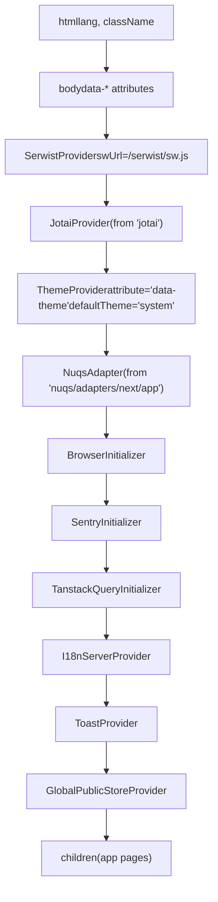
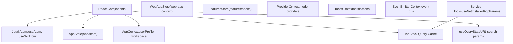
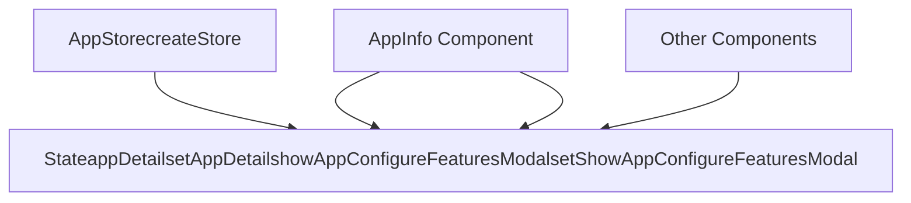
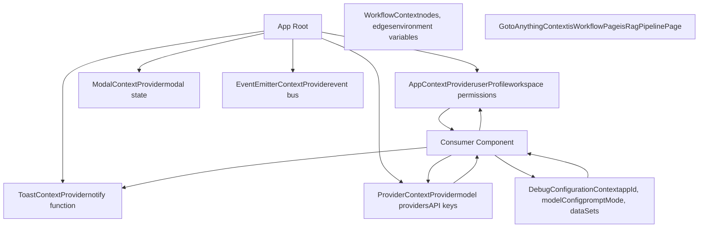
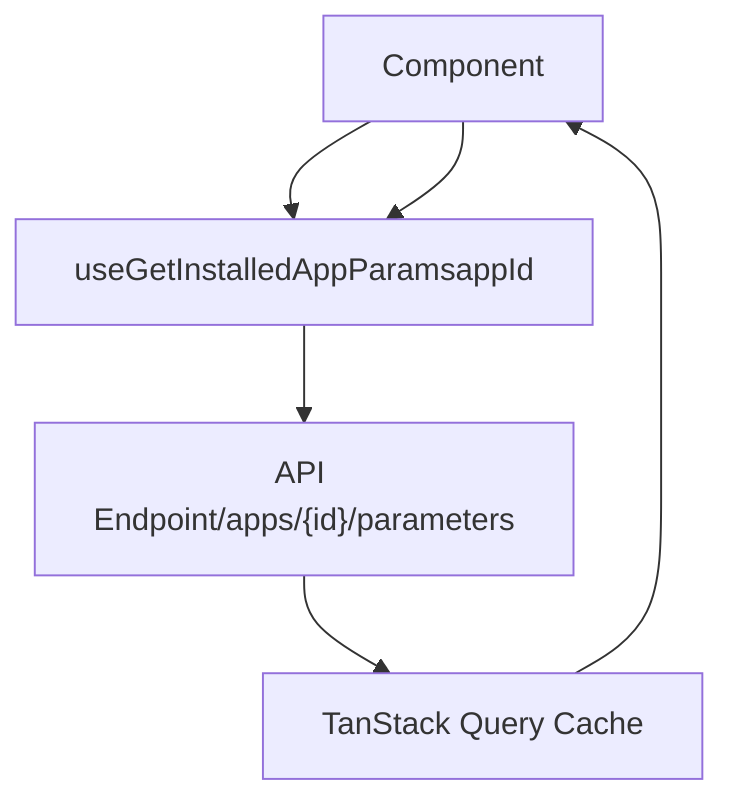
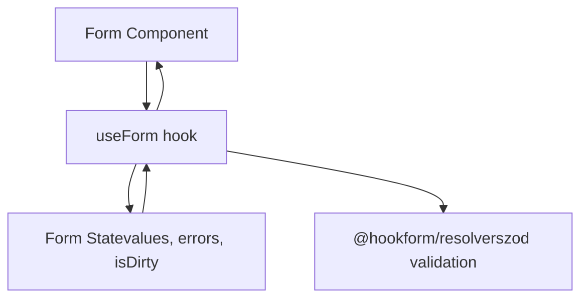
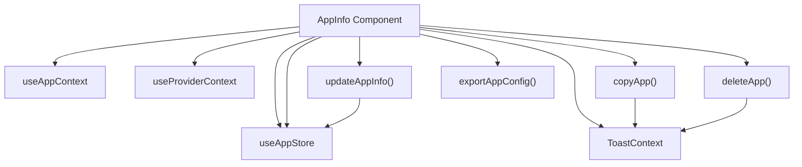
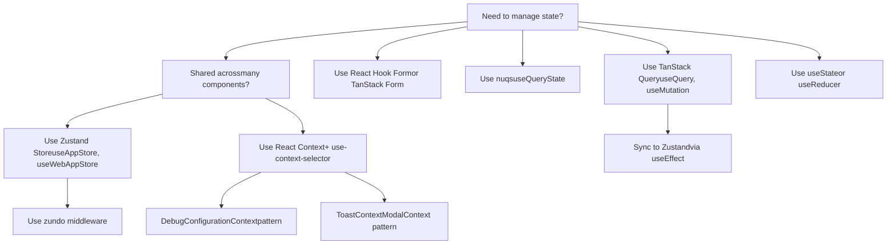

# State Management and Provider Architecture

Relevant source files

-   [api/libs/helper.py](https://github.com/langgenius/dify/blob/92dbc94f/api/libs/helper.py)
-   [api/tests/unit\_tests/libs/test\_helper.py](https://github.com/langgenius/dify/blob/92dbc94f/api/tests/unit_tests/libs/test_helper.py)
-   [web/.env.example](https://github.com/langgenius/dify/blob/92dbc94f/web/.env.example)
-   [web/app/(commonLayout)/app/(appDetailLayout)/layout.tsx](https://github.com/langgenius/dify/blob/92dbc94f/web/app/(commonLayout)/app/(appDetailLayout)/layout.tsx)/app/(appDetailLayout)/layout.tsx)
-   [web/app/(commonLayout)/datasets/(datasetDetailLayout)/\[datasetId\]/settings/page.tsx](web/app/(commonLayout)/datasets/(datasetDetailLayout)/%5BdatasetId%5D/settings/page.tsx)
-   [web/app/activate/activateForm.tsx](https://github.com/langgenius/dify/blob/92dbc94f/web/app/activate/activateForm.tsx)
-   [web/app/components/base/form/hooks/use-get-form-values.ts](https://github.com/langgenius/dify/blob/92dbc94f/web/app/components/base/form/hooks/use-get-form-values.ts)
-   [web/app/components/base/form/utils/zod-submit-validator.ts](https://github.com/langgenius/dify/blob/92dbc94f/web/app/components/base/form/utils/zod-submit-validator.ts)
-   [web/app/components/base/logo/logo-embedded-chat-avatar.tsx](https://github.com/langgenius/dify/blob/92dbc94f/web/app/components/base/logo/logo-embedded-chat-avatar.tsx)
-   [web/app/components/plugins/marketplace/description/index.spec.tsx](https://github.com/langgenius/dify/blob/92dbc94f/web/app/components/plugins/marketplace/description/index.spec.tsx)
-   [web/app/components/plugins/marketplace/description/index.tsx](https://github.com/langgenius/dify/blob/92dbc94f/web/app/components/plugins/marketplace/description/index.tsx)
-   [web/app/components/provider/serwist.tsx](https://github.com/langgenius/dify/blob/92dbc94f/web/app/components/provider/serwist.tsx)
-   [web/app/forgot-password/ForgotPasswordForm.spec.tsx](https://github.com/langgenius/dify/blob/92dbc94f/web/app/forgot-password/ForgotPasswordForm.spec.tsx)
-   [web/app/forgot-password/ForgotPasswordForm.tsx](https://github.com/langgenius/dify/blob/92dbc94f/web/app/forgot-password/ForgotPasswordForm.tsx)
-   [web/app/install/installForm.tsx](https://github.com/langgenius/dify/blob/92dbc94f/web/app/install/installForm.tsx)
-   [web/app/layout.tsx](https://github.com/langgenius/dify/blob/92dbc94f/web/app/layout.tsx)
-   [web/app/serwist/\[path\]/route.ts](web/app/serwist/%5Bpath%5D/route.ts)
-   [web/app/sw.ts](https://github.com/langgenius/dify/blob/92dbc94f/web/app/sw.ts)
-   [web/config/index.ts](https://github.com/langgenius/dify/blob/92dbc94f/web/config/index.ts)
-   [web/docker/entrypoint.sh](https://github.com/langgenius/dify/blob/92dbc94f/web/docker/entrypoint.sh)
-   [web/eslint-rules/rules/no-as-any-in-t.js](https://github.com/langgenius/dify/blob/92dbc94f/web/eslint-rules/rules/no-as-any-in-t.js)
-   [web/eslint-rules/rules/no-legacy-namespace-prefix.js](https://github.com/langgenius/dify/blob/92dbc94f/web/eslint-rules/rules/no-legacy-namespace-prefix.js)
-   [web/eslint-rules/rules/require-ns-option.js](https://github.com/langgenius/dify/blob/92dbc94f/web/eslint-rules/rules/require-ns-option.js)
-   [web/eslint-suppressions.json](https://github.com/langgenius/dify/blob/92dbc94f/web/eslint-suppressions.json)
-   [web/eslint.config.mjs](https://github.com/langgenius/dify/blob/92dbc94f/web/eslint.config.mjs)
-   [web/i18n-config/lib.client.ts](https://github.com/langgenius/dify/blob/92dbc94f/web/i18n-config/lib.client.ts)
-   [web/i18n-config/lib.server.ts](https://github.com/langgenius/dify/blob/92dbc94f/web/i18n-config/lib.server.ts)
-   [web/i18n-config/server.ts](https://github.com/langgenius/dify/blob/92dbc94f/web/i18n-config/server.ts)
-   [web/knip.config.ts](https://github.com/langgenius/dify/blob/92dbc94f/web/knip.config.ts)
-   [web/next.config.js](https://github.com/langgenius/dify/blob/92dbc94f/web/next.config.js)
-   [web/pnpm-lock.yaml](https://github.com/langgenius/dify/blob/92dbc94f/web/pnpm-lock.yaml)
-   [web/scripts/gen-icons.mjs](https://github.com/langgenius/dify/blob/92dbc94f/web/scripts/gen-icons.mjs)
-   [web/types/feature.ts](https://github.com/langgenius/dify/blob/92dbc94f/web/types/feature.ts)
-   [web/utils/server-only-context.ts](https://github.com/langgenius/dify/blob/92dbc94f/web/utils/server-only-context.ts)

This document describes the provider hierarchy and state management architecture in the Dify web frontend. The root layout establishes a nested provider tree that initializes Jotai, ThemeProvider, TanStack Query, i18n, and global stores. Configuration flows from server to client via dataset attributes on the body element.

For workflow-specific state management, see [Workflow Definition and Execution Model](/langgenius/dify/5.1-workflow-definition-and-execution-model). For debug configuration state, see [App Mode Rendering](/langgenius/dify/2.3-application-types-and-execution-modes).

---

## Overview

The Dify frontend uses a **provider-based architecture** defined in `web/app/layout.tsx`. The root layout wraps the application in a specific hierarchy of providers, each responsible for a distinct aspect of application state and configuration:

1.  **Service Worker**: `SerwistProvider` for PWA capabilities
2.  **Atomic State**: `JotaiProvider` for atomic state management
3.  **Theming**: `ThemeProvider` from next-themes
4.  **URL State**: `NuqsAdapter` for URL parameter synchronization
5.  **Browser Initialization**: `BrowserInitializer` for client-side setup
6.  **Error Tracking**: `SentryInitializer` for error monitoring
7.  **Server State**: `TanstackQueryInitializer` for API data caching
8.  **Internationalization**: `I18nServerProvider` for server-side i18n
9.  **Notifications**: `ToastProvider` for toast messages
10.  **Global Configuration**: `GlobalPublicStoreProvider` for public config

**Key Dependencies:**

-   `jotai@2.16.1` - Atomic state management
-   `next-themes@0.4.6` - Theme management
-   `@tanstack/react-query@5.90.12` - Server state management
-   `nuqs@2.8.6` - URL state management
-   `serwist@9.5.0` - Service worker for PWA
-   `zustand@5.0.9` - Global state stores
-   `use-context-selector@2.0.0` - Performance-optimized context
-   `zundo@2.3.0` - Undo/redo for Zustand stores

Sources: [web/app/layout.tsx1-134](https://github.com/langgenius/dify/blob/92dbc94f/web/app/layout.tsx#L1-L134) [web/pnpm-lock.yaml201-203](https://github.com/langgenius/dify/blob/92dbc94f/web/pnpm-lock.yaml#L201-L203) [web/pnpm-lock.yaml246-248](https://github.com/langgenius/dify/blob/92dbc94f/web/pnpm-lock.yaml#L246-L248) [web/pnpm-lock.yaml135-137](https://github.com/langgenius/dify/blob/92dbc94f/web/pnpm-lock.yaml#L135-L137) [web/pnpm-lock.yaml541-543](https://github.com/langgenius/dify/blob/92dbc94f/web/pnpm-lock.yaml#L541-L543) [web/pnpm-lock.yaml357-359](https://github.com/langgenius/dify/blob/92dbc94f/web/pnpm-lock.yaml#L357-L359)

---

## Provider Hierarchy in layout.tsx

The root layout file establishes a nested provider tree that wraps the entire application. Each provider initializes specific capabilities and makes them available to child components.

### Provider Tree Structure


Sources: [web/app/layout.tsx80-130](https://github.com/langgenius/dify/blob/92dbc94f/web/app/layout.tsx#L80-L130)

### Dataset Attributes Pattern

Configuration values flow from the server to the client via `data-*` attributes on the `body` element. The server-side layout renders these attributes during SSR, and client-side code reads them at runtime.

**Server-Side Rendering (layout.tsx):**

```
const datasetMap: Record<DatasetAttr, string | undefined> = {
  [DatasetAttr.DATA_API_PREFIX]: process.env.NEXT_PUBLIC_API_PREFIX,
  [DatasetAttr.DATA_PUBLIC_API_PREFIX]: process.env.NEXT_PUBLIC_PUBLIC_API_PREFIX,
  [DatasetAttr.DATA_MARKETPLACE_API_PREFIX]: process.env.NEXT_PUBLIC_MARKETPLACE_API_PREFIX,
  [DatasetAttr.DATA_PUBLIC_EDITION]: process.env.NEXT_PUBLIC_EDITION,
  [DatasetAttr.DATA_PUBLIC_AMPLITUDE_API_KEY]: process.env.NEXT_PUBLIC_AMPLITUDE_API_KEY,
  // ... 20+ more configuration values
}

return (
  <body
    className="color-scheme h-full select-auto"
    {...datasetMap}
  >
    {/* providers */}
  </body>
)
```
**Client-Side Consumption (config/index.ts):**

```
const getStringConfig = (
  envVar: string | undefined,
  dataAttrKey: DatasetAttr,
  defaultValue: string,
) => {
  if (envVar)
    return envVar

  const attrValue = globalThis.document?.body?.getAttribute(dataAttrKey)
  if (attrValue)
    return attrValue
  return defaultValue
}

export const API_PREFIX = getStringConfig(
  process.env.NEXT_PUBLIC_API_PREFIX,
  DatasetAttr.DATA_API_PREFIX,
  'http://localhost:5001/console/api',
)
```
This pattern allows Docker deployments to inject configuration at runtime via environment variables without rebuilding the Next.js application.

Sources: [web/app/layout.tsx46-78](https://github.com/langgenius/dify/blob/92dbc94f/web/app/layout.tsx#L46-L78) [web/app/layout.tsx95-98](https://github.com/langgenius/dify/blob/92dbc94f/web/app/layout.tsx#L95-L98) [web/config/index.ts42-60](https://github.com/langgenius/dify/blob/92dbc94f/web/config/index.ts#L42-L60) [web/types/feature.ts103-135](https://github.com/langgenius/dify/blob/92dbc94f/web/types/feature.ts#L103-L135)

### Configuration Enum

The `DatasetAttr` enum defines all available dataset attributes:

| Attribute | Purpose | Example Value |
| --- | --- | --- |
| `DATA_API_PREFIX` | Console API URL | `http://localhost:5001/console/api` |
| `DATA_PUBLIC_API_PREFIX` | Public API URL | `http://localhost:5001/api` |
| `DATA_PUBLIC_EDITION` | Deployment edition | `SELF_HOSTED`, `CLOUD`, `ENTERPRISE` |
| `DATA_PUBLIC_AMPLITUDE_API_KEY` | Analytics key | Analytics API key |
| `DATA_PUBLIC_TEXT_GENERATION_TIMEOUT_MS` | LLM timeout | `60000` |
| `DATA_PUBLIC_MAX_TOOLS_NUM` | Max tools in workflow | `10` |
| `DATA_PUBLIC_TOP_K_MAX_VALUE` | Max RAG top-k | `10` |
| `DATA_PUBLIC_LOOP_NODE_MAX_COUNT` | Max loop iterations | `100` |
| `DATA_PUBLIC_BATCH_CONCURRENCY` | Batch concurrency | `5` |

Sources: [web/types/feature.ts103-135](https://github.com/langgenius/dify/blob/92dbc94f/web/types/feature.ts#L103-L135) [web/config/index.ts56-173](https://github.com/langgenius/dify/blob/92dbc94f/web/config/index.ts#L56-L173)

---

## State Management Layers

Beyond the provider hierarchy, the application uses multiple state management libraries for different concerns:


Sources: [web/app/components/app-sidebar/app-info.tsx21-27](https://github.com/langgenius/dify/blob/92dbc94f/web/app/components/app-sidebar/app-info.tsx#L21-L27) [web/app/components/explore/installed-app/index.spec.tsx6-28](https://github.com/langgenius/dify/blob/92dbc94f/web/app/components/explore/installed-app/index.spec.tsx#L6-L28)

---

## JotaiProvider - Atomic State Management

`JotaiProvider` is the first provider in the hierarchy and enables atomic state management throughout the application. Jotai uses atoms as primitive units of state.

**Provider Setup:**

```
import { Provider as JotaiProvider } from 'jotai'

<JotaiProvider>
  {/* other providers */}
</JotaiProvider>
```
**Usage Pattern:**

```
import { atom, useAtom } from 'jotai'

// Define atom
const countAtom = atom(0)

// Consume atom in component
function Counter() {
  const [count, setCount] = useAtom(countAtom)
  return <button onClick={() => setCount(c => c + 1)}>{count}</button>
}
```
Jotai provides:

-   **Minimal boilerplate** - no context providers needed per atom
-   **Fine-grained reactivity** - components only re-render when their specific atoms change
-   **TypeScript integration** - full type inference for atom values
-   **Derived state** - atoms can derive from other atoms

Sources: [web/app/layout.tsx2](https://github.com/langgenius/dify/blob/92dbc94f/web/app/layout.tsx#L2-L2) [web/app/layout.tsx101](https://github.com/langgenius/dify/blob/92dbc94f/web/app/layout.tsx#L101-L101) [web/pnpm-lock.yaml201-203](https://github.com/langgenius/dify/blob/92dbc94f/web/pnpm-lock.yaml#L201-L203)

---

## ThemeProvider - Theme Management

`ThemeProvider` from `next-themes` manages dark/light theme switching with system preference detection.

**Provider Configuration:**

```
import { ThemeProvider } from 'next-themes'

<ThemeProvider
  attribute="data-theme"
  defaultTheme="system"
  enableSystem
  disableTransitionOnChange
  enableColorScheme={false}
>
  {/* app content */}
</ThemeProvider>
```
**Configuration Properties:**

-   `attribute="data-theme"` - Sets theme via `data-theme` attribute on `<html>`
-   `defaultTheme="system"` - Uses system preference by default
-   `enableSystem` - Enables system theme detection
-   `disableTransitionOnChange` - Prevents CSS transitions during theme change (avoids flash)
-   `enableColorScheme={false}` - Disables automatic `color-scheme` meta tag

**Usage in Components:**

```
import { useTheme } from 'next-themes'

function ThemeToggle() {
  const { theme, setTheme } = useTheme()
  return (
    <button onClick={() => setTheme(theme === 'dark' ? 'light' : 'dark')}>
      Toggle theme
    </button>
  )
}
```
Sources: [web/app/layout.tsx3](https://github.com/langgenius/dify/blob/92dbc94f/web/app/layout.tsx#L3-L3) [web/app/layout.tsx102-108](https://github.com/langgenius/dify/blob/92dbc94f/web/app/layout.tsx#L102-L108) [web/pnpm-lock.yaml246-248](https://github.com/langgenius/dify/blob/92dbc94f/web/pnpm-lock.yaml#L246-L248)

---

## TanstackQueryInitializer - Server State Cache

`TanstackQueryInitializer` sets up the TanStack Query client for server state management, API caching, and optimistic updates.

**Provider Setup:**

```
import { TanstackQueryInitializer } from '@/context/query-client'

<TanstackQueryInitializer>
  {/* app content */}
</TanstackQueryInitializer>
```
This initializes a `QueryClient` with default configuration for:

-   Stale time windows
-   Cache time limits
-   Refetch behavior
-   Error retry logic

**Query Hook Pattern:**

```
const { data, isFetching, error } = useQuery({
  queryKey: ['app', appId],
  queryFn: () => fetchApp(appId),
})
```
The query client automatically:

-   Caches results by query key
-   Deduplicates in-flight requests
-   Refetches on window focus
-   Handles loading and error states

Sources: [web/app/layout.tsx7](https://github.com/langgenius/dify/blob/92dbc94f/web/app/layout.tsx#L7-L7) [web/app/layout.tsx112](https://github.com/langgenius/dify/blob/92dbc94f/web/app/layout.tsx#L112-L112) [web/pnpm-lock.yaml135-137](https://github.com/langgenius/dify/blob/92dbc94f/web/pnpm-lock.yaml#L135-L137)

---

## I18nServerProvider - Internationalization

`I18nServerProvider` initializes server-side internationalization and makes translations available throughout the application.

**Provider Setup:**

```
import { I18nServerProvider } from './components/provider/i18n-server'

<I18nServerProvider>
  {/* app content */}
</I18nServerProvider>
```
**Server-Side Translation Loading:**

The i18n system uses React's `cache` and `use` to load translations server-side:

```
const [getLocaleCache, setLocaleCache] = serverOnlyContext<Locale | null>(null)

export const getLocaleOnServer = async (): Promise<Locale> => {
  const cached = getLocaleCache()
  if (cached)
    return cached

  // Get locale from cookie or Accept-Language header
  const localeCookie = (await cookies()).get('locale')
  languages = localeCookie?.value ? [localeCookie.value] : []

  if (!languages.length) {
    const negotiatorHeaders = {};
    (await headers()).forEach((value, key) => (negotiatorHeaders[key] = value))
    languages = new Negotiator({ headers: negotiatorHeaders }).languages()
  }

  const matchedLocale = match(languages, locales, defaultLocale)
  setLocaleCache(matchedLocale)
  return matchedLocale
}
```
**Translation Usage:**

```
// Server component
import { useTranslation } from '#i18n'

const { t } = useTranslation('common')
const text = t('welcome')

// Client component
import { useTranslation } from 'react-i18next'

const { t } = useTranslation()
const text = t('welcome', { ns: 'common' })
```
Sources: [web/app/layout.tsx14](https://github.com/langgenius/dify/blob/92dbc94f/web/app/layout.tsx#L14-L14) [web/app/layout.tsx113](https://github.com/langgenius/dify/blob/92dbc94f/web/app/layout.tsx#L113-L113) [web/i18n-config/server.ts53-81](https://github.com/langgenius/dify/blob/92dbc94f/web/i18n-config/server.ts#L53-L81) [web/i18n-config/lib.server.ts10-12](https://github.com/langgenius/dify/blob/92dbc94f/web/i18n-config/lib.server.ts#L10-L12) [web/i18n-config/lib.client.ts6-8](https://github.com/langgenius/dify/blob/92dbc94f/web/i18n-config/lib.client.ts#L6-L8)

---

## GlobalPublicStoreProvider - Global Configuration

`GlobalPublicStoreProvider` initializes global configuration state accessible throughout the application.

**Provider Setup:**

```
import GlobalPublicStoreProvider from '@/context/global-public-context'

<GlobalPublicStoreProvider>
  {/* app content */}
</GlobalPublicStoreProvider>
```
This provider reads configuration from dataset attributes (as described earlier) and makes them available via a global store.

Sources: [web/app/layout.tsx6](https://github.com/langgenius/dify/blob/92dbc94f/web/app/layout.tsx#L6-L6) [web/app/layout.tsx115-117](https://github.com/langgenius/dify/blob/92dbc94f/web/app/layout.tsx#L115-L117)

---

## Global State with Zustand

### AppStore Pattern

Zustand stores provide **global, cross-component state** with selector-based subscriptions for fine-grained reactivity. The primary store is `AppStore`:


**Usage Pattern in AppInfo Component:**

```
// Import the store
import { useStore as useAppStore } from '@/app/components/app/store'

// Inside component - selector pattern
const appDetail = useAppStore(state => state.appDetail)
const setAppDetail = useAppStore(state => state.setAppDetail)

// Usage
setAppDetail(newAppData)
```
The selector pattern `state => state.appDetail` ensures the component only re-renders when `appDetail` changes, not when other store properties change.

Sources: [web/app/components/app-sidebar/app-info.tsx21](https://github.com/langgenius/dify/blob/92dbc94f/web/app/components/app-sidebar/app-info.tsx#L21-L21) [web/app/components/app-sidebar/app-info.tsx67-68](https://github.com/langgenius/dify/blob/92dbc94f/web/app/components/app-sidebar/app-info.tsx#L67-L68) [web/app/components/app-sidebar/app-info.tsx105](https://github.com/langgenius/dify/blob/92dbc94f/web/app/components/app-sidebar/app-info.tsx#L105-L105) [web/app/components/workflow/update-dsl-modal.tsx23](https://github.com/langgenius/dify/blob/92dbc94f/web/app/components/workflow/update-dsl-modal.tsx#L23-L23) [web/app/components/workflow/update-dsl-modal.tsx63](https://github.com/langgenius/dify/blob/92dbc94f/web/app/components/workflow/update-dsl-modal.tsx#L63-L63)

### WebAppStore Context

For installed/shared apps, a separate `WebAppStore` manages web app-specific state:

```
// From test mock - shows the store structure
useWebAppStore(selector => {
  const state = {
    updateAppInfo: mockUpdateAppInfo,
    updateWebAppAccessMode: mockUpdateWebAppAccessMode,
    updateAppParams: mockUpdateAppParams,
    updateWebAppMeta: mockUpdateWebAppMeta,
    updateUserCanAccessApp: mockUpdateUserCanAccessApp,
  }
  return selector(state)
})
```
This store handles:

-   App metadata updates (`updateAppInfo`)
-   Access control state (`updateWebAppAccessMode`, `updateUserCanAccessApp`)
-   Runtime parameters (`updateAppParams`)
-   Extended metadata (`updateWebAppMeta`)

Sources: [web/app/components/explore/installed-app/index.spec.tsx6](https://github.com/langgenius/dify/blob/92dbc94f/web/app/components/explore/installed-app/index.spec.tsx#L6-L6) [web/app/components/explore/installed-app/index.spec.tsx129-146](https://github.com/langgenius/dify/blob/92dbc94f/web/app/components/explore/installed-app/index.spec.tsx#L129-L146) [web/app/components/explore/installed-app/index.spec.tsx397-419](https://github.com/langgenius/dify/blob/92dbc94f/web/app/components/explore/installed-app/index.spec.tsx#L397-L419)

### Features Store

The `FeaturesStore` manages feature flags and configuration using a similar Zustand pattern:

```
// Selector pattern from test
mockUseFeatures.mockImplementation((selector: FeatureSelector) => {
  if (typeof selector === 'function')
    return selector({ features: mockFeaturesState })
  return mockFeaturesState
})

// State structure
type FeatureState = {
  moreLikeThis: { enabled: boolean }
  opening: { enabled: boolean, opening_statement: string, suggested_questions: string[] }
  moderation: { enabled: boolean }
  speech2text: { enabled: boolean }
  text2speech: { enabled: boolean }
  file: { enabled: boolean }
  suggested: { enabled: boolean }
  citation: { enabled: boolean }
  annotationReply: { enabled: boolean }
}
```
Sources: [web/app/components/app/configuration/debug/debug-with-single-model/index.spec.tsx311-341](https://github.com/langgenius/dify/blob/92dbc94f/web/app/components/app/configuration/debug/debug-with-single-model/index.spec.tsx#L311-L341) [web/app/components/app/configuration/debug/debug-with-single-model/index.spec.tsx343](https://github.com/langgenius/dify/blob/92dbc94f/web/app/components/app/configuration/debug/debug-with-single-model/index.spec.tsx#L343-L343)

---

## React Context Providers with use-context-selector

The application uses `use-context-selector` for **optimized context consumption**. This library prevents unnecessary re-renders by allowing components to subscribe to specific context values.

### Context Architecture


### use-context-selector Pattern

**Standard Pattern:**

```
import { useContext } from 'use-context-selector'
import { ToastContext } from '@/app/components/base/toast'

// Consume entire context
const { notify } = useContext(ToastContext)

// Use notify
notify({
  type: 'success',
  message: t('editDone', { ns: 'app' })
})
```
**Custom Hook Pattern:**

```
// Custom hook that wraps context
export const useAppContext = () => {
  return useContext(AppContext)
}

// Usage in component
const { userProfile, isCurrentWorkspaceEditor } = useAppContext()
```
Sources: [web/app/components/app-sidebar/app-info.tsx19](https://github.com/langgenius/dify/blob/92dbc94f/web/app/components/app-sidebar/app-info.tsx#L19-L19) [web/app/components/app-sidebar/app-info.tsx64](https://github.com/langgenius/dify/blob/92dbc94f/web/app/components/app-sidebar/app-info.tsx#L64-L64) [web/app/components/app-sidebar/app-info.tsx207](https://github.com/langgenius/dify/blob/92dbc94f/web/app/components/app-sidebar/app-info.tsx#L207-L207) [web/app/components/workflow/update-dsl-modal.tsx19](https://github.com/langgenius/dify/blob/92dbc94f/web/app/components/workflow/update-dsl-modal.tsx#L19-L19) [web/app/components/workflow/update-dsl-modal.tsx62](https://github.com/langgenius/dify/blob/92dbc94f/web/app/components/workflow/update-dsl-modal.tsx#L62-L62)

### Key Context Providers

| Context | Purpose | Key Values |
| --- | --- | --- |
| `AppContext` | User profile & workspace permissions | `userProfile`, `isCurrentWorkspaceEditor`, `isCurrentWorkspaceOwner`, `isCurrentWorkspaceManager` |
| `ProviderContext` | Model provider configuration | `textGenerationModelList`, `hasSettedApiKey`, `modelProviders`, `updateModelList()` |
| `DebugConfigurationContext` | Debug/test mode settings | `appId`, `modelConfig`, `promptMode`, `dataSets`, `conversationId`, `inputs` |
| `ToastContext` | Toast notifications | `notify()` |
| `ModalContext` | Global modal state | `setShowPricingModal()`, other modal controls |
| `EventEmitterContext` | Event bus for cross-component events | `eventEmitter` |
| `WebAppContext` (via store) | Installed app state | `updateAppInfo()`, `updateWebAppAccessMode()`, `updateAppParams()` |
| `GotoAnythingContext` | Command palette context | `isWorkflowPage`, `isRagPipelinePage` |

Sources: [web/app/components/app/configuration/debug/debug-with-single-model/index.spec.tsx165-263](https://github.com/langgenius/dify/blob/92dbc94f/web/app/components/app/configuration/debug/debug-with-single-model/index.spec.tsx#L165-L263) [web/app/components/app/configuration/debug/debug-with-single-model/index.spec.tsx288-309](https://github.com/langgenius/dify/blob/92dbc94f/web/app/components/app/configuration/debug/debug-with-single-model/index.spec.tsx#L288-L309) [web/app/components/billing/upgrade-btn/index.spec.tsx10-15](https://github.com/langgenius/dify/blob/92dbc94f/web/app/components/billing/upgrade-btn/index.spec.tsx#L10-L15) [web/app/components/goto-anything/context.spec.tsx1-60](https://github.com/langgenius/dify/blob/92dbc94f/web/app/components/goto-anything/context.spec.tsx#L1-L60)

### DebugConfigurationContext Example

This context demonstrates a **complex, nested state structure**:

```
// From test mock - shows the full structure
const mockDebugConfigContext = {
  // App identification
  appId: 'test-app-id',

  // Model configuration
  modelConfig: createMockModelConfig({
    agentConfig: {
      enabled: false,
      max_iteration: 5,
      tools: [{
        tool_name: 'test-tool',
        provider_id: 'test-provider',
        provider_type: CollectionType.builtIn,
        tool_label: 'Test Tool',
        enabled: true,
      }],
      strategy: AgentStrategy.react,
    },
  }),
  setModelConfig: vi.fn(),

  // Prompt configuration
  promptMode: PromptMode.simple,
  setPromptMode: vi.fn(),
  currentAdvancedPrompt: [],
  setCurrentAdvancedPrompt: vi.fn(),

  // Dataset configuration
  dataSets: [],
  setDataSets: vi.fn(),
  datasetConfigs: {
    retrieval_model: 'single',
    top_k: 4,
    score_threshold_enabled: false,
  },
  setDatasetConfigs: vi.fn(),

  // Feature configurations
  moreLikeThisConfig: { enabled: false },
  setMoreLikeThisConfig: vi.fn(),
  speechToTextConfig: { enabled: false },
  setSpeechToTextConfig: vi.fn(),
  textToSpeechConfig: { enabled: false, voice: '', language: '' },
  setTextToSpeechConfig: vi.fn(),

  // Input/Output state
  inputs: { var1: 'test input' },
  setInputs: vi.fn(),
  query: '',
  setQuery: vi.fn(),

  // Conversation state
  conversationId: null,
  setConversationId: vi.fn(),

  // Event handlers
  showHistoryModal: vi.fn(),
  showSelectDataSet: vi.fn(),
}
```
This shows the **scope-focused pattern**: contexts group related state and actions for a specific feature (debug/testing mode in this case).

Sources: [web/app/components/app/configuration/debug/debug-with-single-model/index.spec.tsx165-263](https://github.com/langgenius/dify/blob/92dbc94f/web/app/components/app/configuration/debug/debug-with-single-model/index.spec.tsx#L165-L263)

---

## Server State Management with TanStack Query

TanStack Query (React Query) manages **server-side data fetching, caching, and synchronization**. It provides hooks for async operations with built-in loading, error, and refetching states.

### Query Hook Pattern


**Service Hook Example:**

```
// Mock from test shows hook structure
useGetInstalledAppParams.mockReturnValue({
  isFetching: false,  // Loading state
  data: mockAppParams,  // Cached data
  error: null  // Error state
})

// Usage in component
const {
  data: appParams,
  isFetching,
  error
} = useGetInstalledAppParams(appId)

// Handle states
if (isFetching) return <Loading />
if (error) return <Error message={error.message} />
return <Content data={appParams} />
```
Sources: [web/app/components/explore/installed-app/index.spec.tsx24-28](https://github.com/langgenius/dify/blob/92dbc94f/web/app/components/explore/installed-app/index.spec.tsx#L24-L28) [web/app/components/explore/installed-app/index.spec.tsx155-159](https://github.com/langgenius/dify/blob/92dbc94f/web/app/components/explore/installed-app/index.spec.tsx#L155-L159) [web/app/components/explore/installed-app/index.spec.tsx179-188](https://github.com/langgenius/dify/blob/92dbc94f/web/app/components/explore/installed-app/index.spec.tsx#L179-L188)

### Common Service Hooks

| Hook | Purpose | Returns |
| --- | --- | --- |
| `useGetInstalledAppParams` | Fetch app runtime parameters | `{ user_input_form, file_upload, system_parameters }` |
| `useGetInstalledAppMeta` | Fetch app metadata | `{ tool_icons }` |
| `useGetInstalledAppAccessModeByAppId` | Fetch access control mode | `{ accessMode }` |
| `useGetUserCanAccessApp` | Check user access permissions | `{ result: boolean }` |

### Query State Effects

Components use `useEffect` to **sync query data to context/store**:

```
// Update store when query data arrives
useEffect(() => {
  if (appParams) {
    updateAppParams(appParams)
  }
}, [appParams, updateAppParams])

useEffect(() => {
  if (webAppAccessMode?.accessMode) {
    updateWebAppAccessMode(webAppAccessMode.accessMode)
  }
}, [webAppAccessMode, updateWebAppAccessMode])
```
This pattern bridges **server state (TanStack Query)** with **global state (Zustand store)** or **scoped state (Context)**.

Sources: [web/app/components/explore/installed-app/index.spec.tsx435-457](https://github.com/langgenius/dify/blob/92dbc94f/web/app/components/explore/installed-app/index.spec.tsx#L435-L457)

---

## Form State Management

### React Hook Form Pattern

`react-hook-form@7.68.0` is the primary form library, providing **uncontrolled form state** with validation:


**Dependencies:**

-   `react-hook-form@7.68.0` - Core form library
-   `@hookform/resolvers@5.2.2` - Schema validation adapters
-   `zod@3.25.76` - Schema validation library

**Key Features:**

-   **Uncontrolled inputs** - minimizes re-renders
-   **Schema validation** - integrates with Zod
-   **Field arrays** - dynamic form fields
-   **Async validation** - server-side validation support

Sources: [web/pnpm-lock.yaml270-272](https://github.com/langgenius/dify/blob/92dbc94f/web/pnpm-lock.yaml#L270-L272) [web/pnpm-lock.yaml81-83](https://github.com/langgenius/dify/blob/92dbc94f/web/pnpm-lock.yaml#L81-L83) [web/pnpm-lock.yaml351-353](https://github.com/langgenius/dify/blob/92dbc94f/web/pnpm-lock.yaml#L351-L353)

### TanStack Form Alternative

`@tanstack/react-form@1.27.1` provides an alternative with **framework-agnostic** design:

```
// From dependencies
'@tanstack/react-form': '1.27.1'
'@tanstack/react-form-devtools': '0.2.9'
```
This is used selectively for complex forms requiring advanced features like:

-   Type-safe field paths
-   Granular subscription model
-   Custom validation timing

Sources: [web/pnpm-lock.yaml126-128](https://github.com/langgenius/dify/blob/92dbc94f/web/pnpm-lock.yaml#L126-L128) [web/pnpm-lock.yaml412-414](https://github.com/langgenius/dify/blob/92dbc94f/web/pnpm-lock.yaml#L412-L414)

---

## URL State Management with nuqs

`nuqs@2.8.6` provides **type-safe URL search parameter management** that syncs component state with the URL:

```
import { useQueryState } from 'nuqs'

// Basic usage
const [search, setSearch] = useQueryState('q')

// Type-safe parser
const [page, setPage] = useQueryState('page', {
  parse: (value) => parseInt(value) || 1
})

// Update URL and state
setSearch('new search')  // Updates ?q=new+search
```
**Benefits:**

-   Shareable URLs with state
-   Browser back/forward support
-   Server-side rendering compatible
-   Type-safe transformations

Sources: [web/pnpm-lock.yaml246-248](https://github.com/langgenius/dify/blob/92dbc94f/web/pnpm-lock.yaml#L246-L248)

---

## State Composition Patterns

### Multi-Layer Data Flow

Real components often compose multiple state management layers:


**Example from AppInfo Component:**

```
// Multiple state sources
const appDetail = useAppStore(state => state.appDetail)  // Zustand
const setAppDetail = useAppStore(state => state.setAppDetail)  // Zustand
const { notify } = useContext(ToastContext)  // Context
const { onPlanInfoChanged } = useProviderContext()  // Context
const { isCurrentWorkspaceEditor } = useAppContext()  // Context

// API call that updates multiple state layers
const onEdit = async (data) => {
  const app = await updateAppInfo({ appID: appDetail.id, ...data })
  setAppDetail(app)  // Update Zustand store
  notify({ type: 'success', message: t('editDone') })  // Update toast
}
```
Sources: [web/app/components/app-sidebar/app-info.tsx62-110](https://github.com/langgenius/dify/blob/92dbc94f/web/app/components/app-sidebar/app-info.tsx#L62-L110) [web/app/components/app-sidebar/app-info.tsx207](https://github.com/langgenius/dify/blob/92dbc94f/web/app/components/app-sidebar/app-info.tsx#L207-L207)

### Event Bus Pattern

The `EventEmitterContext` provides a **pub-sub event bus** for decoupled component communication:

```
// Get event emitter from context
const { eventEmitter } = useEventEmitterContextContext()

// Emit event
eventEmitter?.emit({
  type: WORKFLOW_DATA_UPDATE,
  payload: {
    nodes: initialNodes(nodes, edges),
    edges: initialEdges(edges, nodes),
    features: newFeatures,
    environment_variables: environment_variables || [],
  },
})

// Subscribe to events (in another component)
useEffect(() => {
  const handler = (event) => {
    if (event.type === WORKFLOW_DATA_UPDATE) {
      // Handle update
    }
  }
  eventEmitter?.on('*', handler)
  return () => eventEmitter?.off('*', handler)
}, [eventEmitter])
```
This pattern is used for:

-   Workflow graph updates
-   Cross-component notifications
-   Plugin lifecycle events

Sources: [web/app/components/workflow/update-dsl-modal.tsx29](https://github.com/langgenius/dify/blob/92dbc94f/web/app/components/workflow/update-dsl-modal.tsx#L29-L29) [web/app/components/workflow/update-dsl-modal.tsx67](https://github.com/langgenius/dify/blob/92dbc94f/web/app/components/workflow/update-dsl-modal.tsx#L67-L67) [web/app/components/workflow/update-dsl-modal.tsx126-138](https://github.com/langgenius/dify/blob/92dbc94f/web/app/components/workflow/update-dsl-modal.tsx#L126-L138)

### Loading and Error State Coordination

When consuming multiple async sources, components coordinate loading/error states:

```
// Check all loading states
const isLoading =
  isFetchingInstalledApps ||
  isFetchingAppParams ||
  isFetchingAppMeta ||
  isFetchingAccessMode

if (isLoading) return <LoadingSpinner />

// Check all error states
const error =
  appParamsError ||
  appMetaError ||
  accessModeError ||
  userAccessError

if (error) return <ErrorDisplay error={error} />

// All data loaded - render content
return <Content ... />
```
Sources: [web/app/components/explore/installed-app/index.spec.tsx179-224](https://github.com/langgenius/dify/blob/92dbc94f/web/app/components/explore/installed-app/index.spec.tsx#L179-L224) [web/app/components/explore/installed-app/index.spec.tsx237-295](https://github.com/langgenius/dify/blob/92dbc94f/web/app/components/explore/installed-app/index.spec.tsx#L237-L295)

---

## State Management Decision Tree


**Guidelines:**

1.  **Server Data** → Always use TanStack Query
2.  **Global Shared State** → Zustand with selectors
3.  **Feature-Scoped State** → React Context (use-context-selector)
4.  **Form Input** → React Hook Form or TanStack Form
5.  **URL Parameters** → nuqs for shareable state
6.  **Cross-Component Events** → EventEmitter pattern
7.  **Local Component State** → useState/useReducer

Sources: All sections above

---

## Testing State Management

### Mocking Zustand Stores

```
// Mock the store module
vi.mock('@/app/components/app/store', () => ({
  useStore: vi.fn((selector) => {
    if (typeof selector === 'function')
      return selector({
        setShowAppConfigureFeaturesModal: mockSetShowAppConfigureFeaturesModal
      })
    return mockSetShowAppConfigureFeaturesModal
  }),
}))
```
### Mocking Context Providers

```
// Mock useContext from use-context-selector
vi.mock('use-context-selector', () => ({
  useContext: vi.fn(),
  createContext: vi.fn(() => ({})),
}))

// Setup mock return value
;(useContext as Mock).mockReturnValue({
  installedApps: [mockInstalledApp],
  isFetchingInstalledApps: false,
})
```
### Mocking TanStack Query

```
// Mock query hook
vi.mock('@/service/use-explore', () => ({
  useGetInstalledAppParams: vi.fn(),
}))

// Setup mock return value
;(useGetInstalledAppParams as Mock).mockReturnValue({
  isFetching: false,
  data: mockAppParams,
  error: null,
})
```
Sources: [web/app/components/app/configuration/config/assistant-type-picker/index.spec.tsx1-700](https://github.com/langgenius/dify/blob/92dbc94f/web/app/components/app/configuration/config/assistant-type-picker/index.spec.tsx#L1-L700) [web/app/components/explore/installed-app/index.spec.tsx14-28](https://github.com/langgenius/dify/blob/92dbc94f/web/app/components/explore/installed-app/index.spec.tsx#L14-L28) [web/app/components/app/configuration/debug/debug-with-single-model/index.spec.tsx129-156](https://github.com/langgenius/dify/blob/92dbc94f/web/app/components/app/configuration/debug/debug-with-single-model/index.spec.tsx#L129-L156)

---

## Performance Optimization Patterns

### Selector Pattern in Zustand

```
// ❌ Bad - subscribes to entire store
const store = useAppStore()
const appDetail = store.appDetail

// ✅ Good - only subscribes to appDetail
const appDetail = useAppStore(state => state.appDetail)
```
### use-context-selector Benefits

```
// Standard React Context - re-renders on any context change
const { userProfile, workspace, models } = useContext(AppContext)

// use-context-selector - only re-renders on selected value change
const userProfile = useContext(AppContext, ctx => ctx.userProfile)
```
The library implements **shallow comparison** of selector results to prevent unnecessary re-renders.

### Query Stale Time Configuration

```
// Configure stale time to prevent refetches
const { data } = useQuery({
  queryKey: ['app', appId],
  queryFn: fetchApp,
  staleTime: 5 * 60 * 1000,  // 5 minutes
  cacheTime: 10 * 60 * 1000,  // 10 minutes
})
```
Sources: [web/app/components/app-sidebar/app-info.tsx67-68](https://github.com/langgenius/dify/blob/92dbc94f/web/app/components/app-sidebar/app-info.tsx#L67-L68) [web/pnpm-lock.yaml345-347](https://github.com/langgenius/dify/blob/92dbc94f/web/pnpm-lock.yaml#L345-L347)

---

## Summary

The Dify frontend uses a **purposeful, layered state architecture**:

| Layer | Library | Use Case |
| --- | --- | --- |
| Global State | Zustand | App-wide shared state (appDetail, features) |
| Scoped State | React Context + use-context-selector | Feature-specific state trees (debug, provider config) |
| Server State | TanStack Query | API data fetching and caching |
| Form State | React Hook Form / TanStack Form | Form input validation and submission |
| URL State | nuqs | Shareable state via URL parameters |
| Events | EventEmitter | Decoupled pub-sub communication |

This architecture provides:

-   **Separation of concerns** - each tool for its specific domain
-   **Performance optimization** - selector patterns prevent unnecessary re-renders
-   **Type safety** - TypeScript integration across all layers
-   **Developer experience** - specialized devtools for each layer (React Query Devtools, TanStack Form Devtools)

Sources: All sections above
