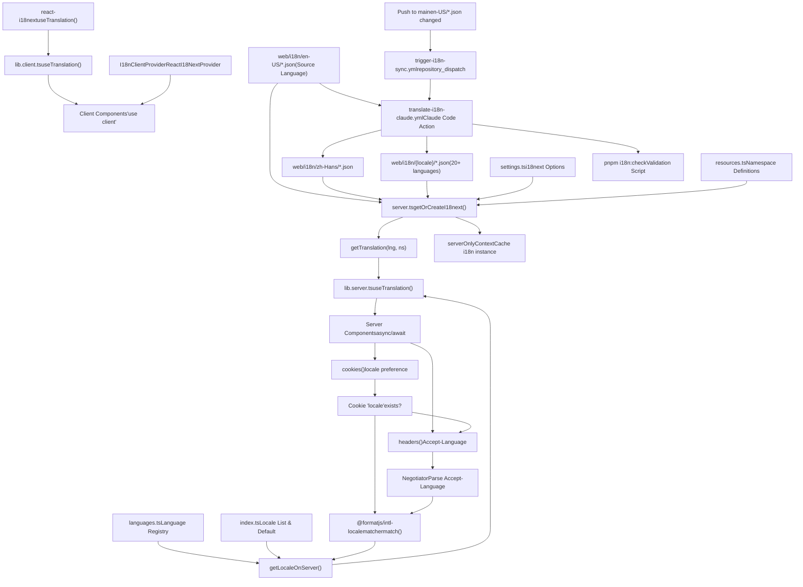
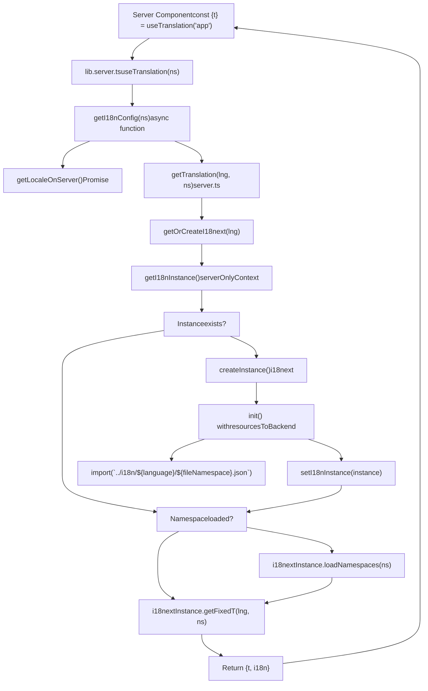
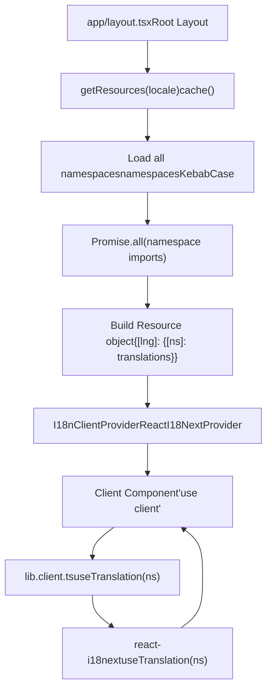
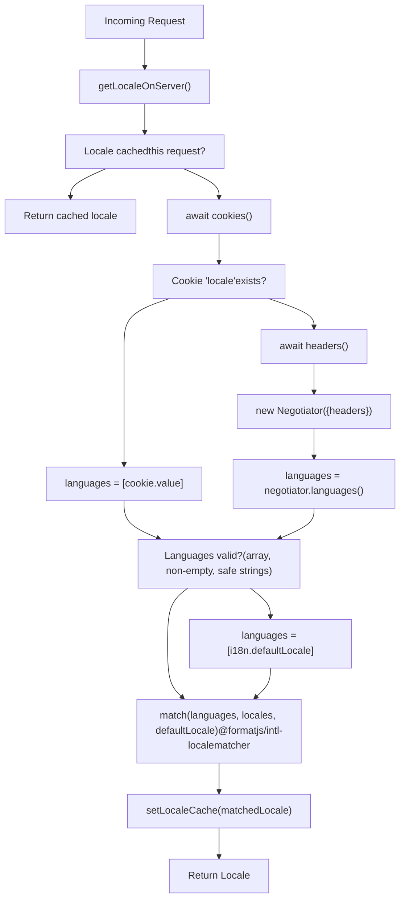
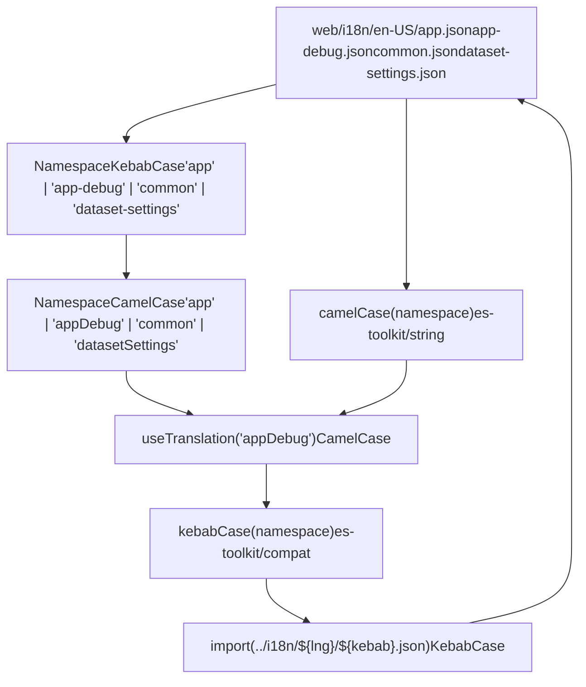
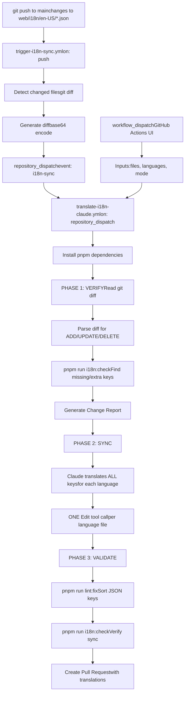
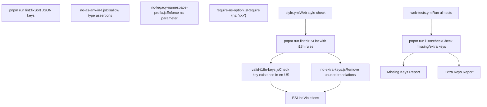

# Internationalization System

Relevant source files

-   [.github/workflows/api-tests.yml](https://github.com/langgenius/dify/blob/92dbc94f/.github/workflows/api-tests.yml)
-   [.github/workflows/autofix.yml](https://github.com/langgenius/dify/blob/92dbc94f/.github/workflows/autofix.yml)
-   [.github/workflows/build-push.yml](https://github.com/langgenius/dify/blob/92dbc94f/.github/workflows/build-push.yml)
-   [.github/workflows/db-migration-test.yml](https://github.com/langgenius/dify/blob/92dbc94f/.github/workflows/db-migration-test.yml)
-   [.github/workflows/deploy-agent-dev.yml](https://github.com/langgenius/dify/blob/92dbc94f/.github/workflows/deploy-agent-dev.yml)
-   [.github/workflows/deploy-dev.yml](https://github.com/langgenius/dify/blob/92dbc94f/.github/workflows/deploy-dev.yml)
-   [.github/workflows/deploy-hitl.yml](https://github.com/langgenius/dify/blob/92dbc94f/.github/workflows/deploy-hitl.yml)
-   [.github/workflows/docker-build.yml](https://github.com/langgenius/dify/blob/92dbc94f/.github/workflows/docker-build.yml)
-   [.github/workflows/main-ci.yml](https://github.com/langgenius/dify/blob/92dbc94f/.github/workflows/main-ci.yml)
-   [.github/workflows/stale.yml](https://github.com/langgenius/dify/blob/92dbc94f/.github/workflows/stale.yml)
-   [.github/workflows/style.yml](https://github.com/langgenius/dify/blob/92dbc94f/.github/workflows/style.yml)
-   [.github/workflows/tool-test-sdks.yaml](https://github.com/langgenius/dify/blob/92dbc94f/.github/workflows/tool-test-sdks.yaml)
-   [.github/workflows/translate-i18n-claude.yml](https://github.com/langgenius/dify/blob/92dbc94f/.github/workflows/translate-i18n-claude.yml)
-   [.github/workflows/trigger-i18n-sync.yml](https://github.com/langgenius/dify/blob/92dbc94f/.github/workflows/trigger-i18n-sync.yml)
-   [.github/workflows/vdb-tests.yml](https://github.com/langgenius/dify/blob/92dbc94f/.github/workflows/vdb-tests.yml)
-   [.github/workflows/web-tests.yml](https://github.com/langgenius/dify/blob/92dbc94f/.github/workflows/web-tests.yml)
-   [api/Dockerfile](https://github.com/langgenius/dify/blob/92dbc94f/api/Dockerfile)
-   [api/migrations/README](https://github.com/langgenius/dify/blob/92dbc94f/api/migrations/README)
-   [web/.nvmrc](https://github.com/langgenius/dify/blob/92dbc94f/web/.nvmrc)
-   [web/Dockerfile](https://github.com/langgenius/dify/blob/92dbc94f/web/Dockerfile)
-   [web/README.md](https://github.com/langgenius/dify/blob/92dbc94f/web/README.md)
-   [web/app/(commonLayout)/app/(appDetailLayout)/layout.tsx](https://github.com/langgenius/dify/blob/92dbc94f/web/app/(commonLayout)/app/(appDetailLayout)/layout.tsx)/app/(appDetailLayout)/layout.tsx)
-   [web/app/(commonLayout)/datasets/(datasetDetailLayout)/\[datasetId\]/settings/page.tsx](web/app/(commonLayout)/datasets/(datasetDetailLayout)/%5BdatasetId%5D/settings/page.tsx)
-   [web/app/components/base/logo/logo-embedded-chat-avatar.tsx](https://github.com/langgenius/dify/blob/92dbc94f/web/app/components/base/logo/logo-embedded-chat-avatar.tsx)
-   [web/app/components/plugins/marketplace/description/index.spec.tsx](https://github.com/langgenius/dify/blob/92dbc94f/web/app/components/plugins/marketplace/description/index.spec.tsx)
-   [web/app/components/plugins/marketplace/description/index.tsx](https://github.com/langgenius/dify/blob/92dbc94f/web/app/components/plugins/marketplace/description/index.tsx)
-   [web/app/components/provider/serwist.tsx](https://github.com/langgenius/dify/blob/92dbc94f/web/app/components/provider/serwist.tsx)
-   [web/app/serwist/\[path\]/route.ts](web/app/serwist/%5Bpath%5D/route.ts)
-   [web/app/sw.ts](https://github.com/langgenius/dify/blob/92dbc94f/web/app/sw.ts)
-   [web/eslint-rules/rules/no-as-any-in-t.js](https://github.com/langgenius/dify/blob/92dbc94f/web/eslint-rules/rules/no-as-any-in-t.js)
-   [web/eslint-rules/rules/no-legacy-namespace-prefix.js](https://github.com/langgenius/dify/blob/92dbc94f/web/eslint-rules/rules/no-legacy-namespace-prefix.js)
-   [web/eslint-rules/rules/require-ns-option.js](https://github.com/langgenius/dify/blob/92dbc94f/web/eslint-rules/rules/require-ns-option.js)
-   [web/eslint-suppressions.json](https://github.com/langgenius/dify/blob/92dbc94f/web/eslint-suppressions.json)
-   [web/eslint.config.mjs](https://github.com/langgenius/dify/blob/92dbc94f/web/eslint.config.mjs)
-   [web/i18n-config/README.md](https://github.com/langgenius/dify/blob/92dbc94f/web/i18n-config/README.md)
-   [web/i18n-config/lib.client.ts](https://github.com/langgenius/dify/blob/92dbc94f/web/i18n-config/lib.client.ts)
-   [web/i18n-config/lib.server.ts](https://github.com/langgenius/dify/blob/92dbc94f/web/i18n-config/lib.server.ts)
-   [web/i18n-config/server.ts](https://github.com/langgenius/dify/blob/92dbc94f/web/i18n-config/server.ts)
-   [web/knip.config.ts](https://github.com/langgenius/dify/blob/92dbc94f/web/knip.config.ts)
-   [web/next.config.js](https://github.com/langgenius/dify/blob/92dbc94f/web/next.config.js)
-   [web/pnpm-lock.yaml](https://github.com/langgenius/dify/blob/92dbc94f/web/pnpm-lock.yaml)
-   [web/scripts/gen-icons.mjs](https://github.com/langgenius/dify/blob/92dbc94f/web/scripts/gen-icons.mjs)
-   [web/utils/server-only-context.ts](https://github.com/langgenius/dify/blob/92dbc94f/web/utils/server-only-context.ts)

## Purpose and Scope

This document describes the internationalization (i18n) system used in the Dify web frontend. The system enables multi-language support across the application using i18next with Next.js App Router, supporting both Server Components and Client Components. The system manages 20+ languages with automated translation workflows and provides developer tools for maintaining translation consistency.

For backend API internationalization, see page [7.3](/langgenius/dify/7.3-authentication-and-security) on Authentication and Security. For frontend state management patterns, see page [9.2](/langgenius/dify/9.2-state-management-and-provider-architecture).

---

## Architecture Overview

The i18n system is built on three layers: configuration, runtime translation, and automation. It uses i18next for translation management, with separate code paths for server and client components due to Next.js App Router's rendering model.

### System Component Architecture


**Diagram: i18n System Architecture**

Sources: [web/i18n-config/server.ts1-95](https://github.com/langgenius/dify/blob/92dbc94f/web/i18n-config/server.ts#L1-L95) [web/i18n-config/lib.client.ts1-11](https://github.com/langgenius/dify/blob/92dbc94f/web/i18n-config/lib.client.ts#L1-L11) [web/i18n-config/lib.server.ts1-17](https://github.com/langgenius/dify/blob/92dbc94f/web/i18n-config/lib.server.ts#L1-L17) [.github/workflows/translate-i18n-claude.yml1-310](https://github.com/langgenius/dify/blob/92dbc94f/.github/workflows/translate-i18n-claude.yml#L1-L310) [.github/workflows/trigger-i18n-sync.yml1-67](https://github.com/langgenius/dify/blob/92dbc94f/.github/workflows/trigger-i18n-sync.yml#L1-L67)

---

## Translation File Organization

Translation files are organized by locale and namespace. Each namespace corresponds to a feature area or module of the application.

### File Structure

```
web/i18n/
├── en-US/           # English (United States) - Source language
│   ├── app.json
│   ├── app-debug.json
│   ├── common.json
│   ├── dataset-settings.json
│   └── ...
├── zh-Hans/         # Simplified Chinese
│   ├── app.json
│   ├── app-debug.json
│   └── ...
├── ja-JP/           # Japanese
├── pt-BR/           # Portuguese (Brazil)
└── ...              # 20+ other locales
```
### Namespace Convention

| File Name (kebab-case) | Namespace (camelCase) | Purpose |
| --- | --- | --- |
| `app.json` | `app` | Main application strings |
| `app-debug.json` | `appDebug` | Debugging UI strings |
| `common.json` | `common` | Shared/common strings |
| `dataset-settings.json` | `datasetSettings` | Dataset configuration |
| `plugin.json` | `plugin` | Plugin marketplace |

**Key characteristics:**

-   Files use **kebab-case** naming (e.g., `app-debug.json`)
-   Namespaces use **camelCase** (e.g., `appDebug`)
-   Keys are **flat with dot notation** (e.g., `"dialog.title"`)
-   i18next is configured with `keySeparator: false`, so dots are literal

Example translation file structure:

```
{
  "accessControl": "Access Control",
  "dialog.title": "Confirm Action",
  "dialog.cancel": "Cancel"
}
```
Sources: [web/i18n-config/README.md1-190](https://github.com/langgenius/dify/blob/92dbc94f/web/i18n-config/README.md#L1-L190) [web/i18n-config/server.ts29-32](https://github.com/langgenius/dify/blob/92dbc94f/web/i18n-config/server.ts#L29-L32)

---

## Server-Side Translation System

The server-side translation system supports Next.js Server Components using async/await patterns. It implements instance caching and dynamic namespace loading.

### Server Translation Flow


**Diagram: Server-Side Translation Resolution**

### Instance Caching with `serverOnlyContext`

The system uses React's `cache()` API to create request-scoped singletons for i18n instances and locale values:

```
// server.ts:18-19
const [getLocaleCache, setLocaleCache] = serverOnlyContext<Locale | null>(null)
const [getI18nInstance, setI18nInstance] = serverOnlyContext<I18nInstance | null>(null)
```
The `serverOnlyContext` pattern (from [web/utils/server-only-context.ts1-16](https://github.com/langgenius/dify/blob/92dbc94f/web/utils/server-only-context.ts#L1-L16)) creates a getter/setter pair that persists for the duration of a server request using React's `cache()`:

```
// server-only-context.ts:5-14
export function serverOnlyContext<T>(defaultValue: T): [() => T, (v: T) => void] {
  const getRef = cache(() => ({ current: defaultValue }))
  const getValue = (): T => getRef().current
  const setValue = (value: T) => {
    getRef().current = value
  }
  return [getValue, setValue]
}
```
### Dynamic Resource Loading

Translation files are loaded dynamically using `resourcesToBackend`:

```
// server.ts:28-32
.use(resourcesToBackend((language: Locale, namespace: NamespaceCamelCase | NamespaceKebabCase) => {
  const fileNamespace = kebabCase(namespace) as NamespaceKebabCase
  return import(`../i18n/${language}/${fileNamespace}.json`)
}))
```
The function converts camelCase namespace names to kebab-case file names (e.g., `appDebug` → `app-debug.json`).

### Usage in Server Components

```
// Example from web/app/(commonLayout)/datasets/(datasetDetailLayout)/[datasetId]/settings/page.tsx
import { useTranslation } from '#i18n'

const Settings = () => {
  const { t } = useTranslation('datasetSettings')

  return (
    <div>
      <div>{t('title')}</div>
      <div>{t('desc')}</div>
    </div>
  )
}
```
The `#i18n` import alias automatically resolves to server or client implementation based on the component type.

Sources: [web/i18n-config/server.ts1-95](https://github.com/langgenius/dify/blob/92dbc94f/web/i18n-config/server.ts#L1-L95) [web/i18n-config/lib.server.ts1-17](https://github.com/langgenius/dify/blob/92dbc94f/web/i18n-config/lib.server.ts#L1-L17) [web/utils/server-only-context.ts1-16](https://github.com/langgenius/dify/blob/92dbc94f/web/utils/server-only-context.ts#L1-L16) web/app/(commonLayout)/datasets/(datasetDetailLayout)/\[datasetId\]/settings/page.tsx:1-19

---

## Client-Side Translation System

Client-side translation uses react-i18next's standard hooks, wrapped in a thin compatibility layer for consistency with the server API.

### Client Translation Architecture


**Diagram: Client-Side Translation Setup**

### Resource Preloading

All translation resources are preloaded at the root layout level:

```
// server.ts:83-94
export const getResources = cache(async (lng: Locale): Promise<Resource> => {
  const messages = {} as ResourceLanguage

  await Promise.all(
    (namespacesKebabCase).map(async (ns) => {
      const mod = await import(`../i18n/${lng}/${ns}.json`)
      messages[camelCase(ns)] = mod.default
    }),
  )

  return { [lng]: messages }
})
```
This preloads all namespaces for the current locale in a single operation, avoiding waterfall requests.

### Client Hook Wrapper

The client-side hook is a simple wrapper:

```
// lib.client.ts:1-11
'use client'

export function useTranslation(ns?: NamespaceCamelCase) {
  return useTranslationOriginal(ns)
}

export { useLocale } from '@/context/i18n'
```
This maintains API consistency with the server-side implementation while delegating to react-i18next.

Sources: [web/i18n-config/lib.client.ts1-11](https://github.com/langgenius/dify/blob/92dbc94f/web/i18n-config/lib.client.ts#L1-L11) [web/i18n-config/server.ts83-94](https://github.com/langgenius/dify/blob/92dbc94f/web/i18n-config/server.ts#L83-L94)

---

## Locale Detection and Negotiation

The system detects user locale through a two-tier strategy: cookie preference first, then HTTP header negotiation.

### Locale Detection Flow


**Diagram: Locale Detection Algorithm**

### Implementation Details

**Cookie-based preference:**

```
// server.ts:62-63
const localeCookie = (await cookies()).get('locale')
languages = localeCookie?.value ? [localeCookie.value] : []
```
**Header negotiation:**

```
// server.ts:66-70
const negotiatorHeaders: Record<string, string> = {};
(await headers()).forEach((value, key) => (negotiatorHeaders[key] = value))
languages = new Negotiator({ headers: negotiatorHeaders }).languages()
```
**Security validation:**

```
// server.ts:73-75
if (!Array.isArray(languages) || languages.length === 0 ||
    !languages.every(lang => typeof lang === 'string' && /^[\w-]+$/.test(lang)))
  languages = [i18n.defaultLocale]
```
This validation prevents injection attacks through malformed Accept-Language headers.

**Locale matching:**

```
// server.ts:77-79
const matchedLocale = match(languages, locales, i18n.defaultLocale) as Locale
setLocaleCache(matchedLocale)
return matchedLocale
```
Uses `@formatjs/intl-localematcher` for RFC 4647-compliant locale matching.

### Language Configuration

Supported languages are defined in [web/i18n-config/languages.ts](https://github.com/langgenius/dify/blob/92dbc94f/web/i18n-config/languages.ts) (not provided but referenced in README):

```
// Example structure from README.md:48-143
export const languages = [
  { value: 'en-US', name: 'English(United States)', supported: true },
  { value: 'zh-Hans', name: '简体中文', supported: true },
  { value: 'ja-JP', name: '日本語 (日本)', supported: false },
  // ... 20+ languages
]
```
The `supported` flag determines which languages appear in UI language selectors.

Sources: [web/i18n-config/server.ts53-81](https://github.com/langgenius/dify/blob/92dbc94f/web/i18n-config/server.ts#L53-L81) [web/i18n-config/README.md48-143](https://github.com/langgenius/dify/blob/92dbc94f/web/i18n-config/README.md#L48-L143)

---

## Namespace Management

Namespaces organize translations by feature area. The system enforces a strict naming convention and provides type safety.

### Namespace Type System


**Diagram: Namespace Naming Convention System**

### Key Design Decisions

**Flat keys with dot notation:**

```
{
  "dialog.title": "Confirm",
  "dialog.message": "Are you sure?"
}
```
**i18next configuration:**

```
// settings.ts (referenced in server.ts:34)
{
  keySeparator: false,  // Dots are literal, not nested
  // ...
}
```
This means `t('dialog.title')` returns the string associated with the literal key `"dialog.title"`, not a nested lookup.

**Type-safe namespace usage:**

```
// Type signature from lib.server.ts:5-8
async function getI18nConfig(ns?: NamespaceCamelCase) {
  const lang = await getLocaleOnServer()
  return getTranslation(lang, ns)
}
```
The `NamespaceCamelCase` type ensures only valid namespaces can be passed.

Sources: [web/i18n-config/server.ts29-32](https://github.com/langgenius/dify/blob/92dbc94f/web/i18n-config/server.ts#L29-L32) [web/i18n-config/README.md20-34](https://github.com/langgenius/dify/blob/92dbc94f/web/i18n-config/README.md#L20-L34)

---

## Automated Translation Workflow

The system uses Claude Code (Anthropic API) to automatically translate changes to English source files into all supported languages.

### Translation Automation Flow


**Diagram: Automated Translation Pipeline**

### Three-Phase Translation Process

**Phase 1: VERIFY** The workflow analyzes the git diff to categorize changes:

```
# translate-i18n-claude.yml:172-225
## Step 1.1: Analyze Git Diff
Parse the diff to categorize changes:
- ADD: Keys that appear only in + lines (new keys)
- UPDATE: Keys that appear in both - and + lines (value changed)
- DELETE: Keys that appear only in - lines (removed keys)

## Step 1.3: Run i18n:check for Each Language
pnpm --dir ${{ github.workspace }}/web run i18n:check

## Step 1.4: Generate Change Report
```
**Phase 2: SYNC** Claude translates and applies changes:

```
# translate-i18n-claude.yml:231-275
### Step 2.1: Process ADD Operations (BATCH per language file)
1. First, translate ALL new keys for ALL languages mentally
2. Then, for EACH language file, do ONE Edit operation:
   - Read the file once
   - Insert ALL new keys at the beginning
   - Don't worry about alphabetical order - lint:fix will sort them later
```
**Key efficiency rule:** ONE Edit tool call per language file, batching all key additions together.

**Phase 3: VALIDATE** Ensures correctness:

```
# translate-i18n-claude.yml:335-346
### Step 3.1: Run lint:fix
pnpm --dir ${{ github.workspace }}/web run lint:fix

### Step 3.2: Run i18n:check Again
pnpm --dir ${{ github.workspace }}/web run i18n:check

### Step 3.3: Create Pull Request
```
### Special Handling for Manual Translations

The workflow respects manual translations in `zh-Hans` and `ja-JP`:

```
# translate-i18n-claude.yml:255-269
If zh-Hans or ja-JP files were ALSO modified in the same push:
1. Missing keys: Still ADD them (completeness required)
2. Existing translations: Compare with the NEW English value:
   - If translation is completely wrong → Update it
   - If translation is roughly correct (captures the meaning) → Keep it
   - When in doubt, keep the manual translation
```
### Manual Trigger Options

The workflow can be manually triggered with parameters:

| Parameter | Description | Example |
| --- | --- | --- |
| `files` | Specific files to translate | `"app common"` |
| `languages` | Target languages | `"zh-Hans ja-JP"` |
| `mode` | `incremental` or `full` | `incremental` (default) |

Sources: [.github/workflows/translate-i18n-claude.yml1-310](https://github.com/langgenius/dify/blob/92dbc94f/.github/workflows/translate-i18n-claude.yml#L1-L310) [.github/workflows/trigger-i18n-sync.yml1-67](https://github.com/langgenius/dify/blob/92dbc94f/.github/workflows/trigger-i18n-sync.yml#L1-L67)

---

## Development Tools and Validation

The system provides scripts and ESLint rules for maintaining translation quality and consistency.

### Validation Tools


**Diagram: i18n Validation Tools**

### i18n:check Script

The check script validates translation completeness:

```
# Example from README.md:160-162
pnpm run i18n:check --file app billing --lang zh-Hans --auto-remove
```
Parameters:

-   `--file`: Space-separated namespace names (e.g., `app billing`)
-   `--lang`: Space-separated language codes (e.g., `zh-Hans ja-JP`)
-   `--auto-remove`: Automatically delete extra keys

Output:

-   Non-zero exit code if missing or extra keys detected
-   Lists missing keys that need translation
-   Lists extra keys that should be removed

### ESLint i18n Rules

**valid-i18n-keys** (JSON files only):

```
// eslint.config.mjs:133
'dify-i18n/valid-i18n-keys': 'error',
```
Validates that all translation keys in non-English files exist in the English source.

**no-extra-keys** (JSON files only):

```
// eslint.config.mjs:134
'dify-i18n/no-extra-keys': 'error',
```
Detects translation keys that don't exist in the English source and should be removed.

**no-as-any-in-t** (TypeScript files):

```
// Example from no-as-any-in-t.js:22-23
messageId: 'noAsAnyInT',
'Avoid using "as any" in t() function calls.'
```
Prevents type assertion bypasses in translation calls:

```
// Bad
t('key' as any)

// Good
t('key')  // Type-safe with NamespaceCamelCase
```
**no-legacy-namespace-prefix**: Enforces separation of namespace from key:

```
// Bad (legacy style)
t('app.dialog.title')

// Good
const { t } = useTranslation('app')
t('dialog.title')
```
**require-ns-option**: Requires explicit namespace parameter:

```
// Bad
t('some.key')

// Good
t('some.key', { ns: 'app' })
```
### CI Integration

```
# .github/workflows/style.yml:105-109
- name: Web style check
  run: pnpm run lint:ci
```
The CI pipeline runs all ESLint rules including i18n validation on every PR.

Sources: [web/i18n-config/README.md159-163](https://github.com/langgenius/dify/blob/92dbc94f/web/i18n-config/README.md#L159-L163) [web/eslint.config.mjs122-135](https://github.com/langgenius/dify/blob/92dbc94f/web/eslint.config.mjs#L122-L135) [web/eslint-rules/rules/no-as-any-in-t.js1-106](https://github.com/langgenius/dify/blob/92dbc94f/web/eslint-rules/rules/no-as-any-in-t.js#L1-L106) [web/eslint-rules/rules/no-legacy-namespace-prefix.js1-200](https://github.com/langgenius/dify/blob/92dbc94f/web/eslint-rules/rules/no-legacy-namespace-prefix.js#L1-L200) [web/eslint-rules/rules/require-ns-option.js1-52](https://github.com/langgenius/dify/blob/92dbc94f/web/eslint-rules/rules/require-ns-option.js#L1-L52) [.github/workflows/style.yml105-109](https://github.com/langgenius/dify/blob/92dbc94f/.github/workflows/style.yml#L105-L109)

---

## Usage Patterns

### Server Component Pattern

```
import { useTranslation } from '#i18n'

const MyServerComponent = async () => {
  const { t } = useTranslation('app')

  return (
    <div>
      <h1>{t('title')}</h1>
      <p>{t('description')}</p>
    </div>
  )
}
```
The `#i18n` alias resolves to [web/i18n-config/lib.server.ts](https://github.com/langgenius/dify/blob/92dbc94f/web/i18n-config/lib.server.ts) for server components.

### Client Component Pattern

```
'use client'
import { useTranslation } from '#i18n'

const MyClientComponent = () => {
  const { t } = useTranslation('common')

  return <button>{t('button.save')}</button>
}
```
The `#i18n` alias resolves to [web/i18n-config/lib.client.ts](https://github.com/langgenius/dify/blob/92dbc94f/web/i18n-config/lib.client.ts) for client components.

### Multiple Namespace Usage

```
const MyComponent = () => {
  const { t } = useTranslation('app')
  const { t: tCommon } = useTranslation('common')

  return (
    <div>
      <h1>{t('title')}</h1>
      <button>{tCommon('operation.cancel')}</button>
    </div>
  )
}
```
Example from [web/app/components/plugins/marketplace/description/index.tsx1-73](https://github.com/langgenius/dify/blob/92dbc94f/web/app/components/plugins/marketplace/description/index.tsx#L1-L73)

### Locale-Specific Logic

```
import { useLocale } from '#i18n'

const Description = () => {
  const locale = useLocale()
  const isZhHans = locale === 'zh-Hans'

  return (
    <div>
      {isZhHans ? <ChineseLayout /> : <DefaultLayout />}
    </div>
  )
}
```
Example from [web/app/components/plugins/marketplace/description/index.tsx1-73](https://github.com/langgenius/dify/blob/92dbc94f/web/app/components/plugins/marketplace/description/index.tsx#L1-L73)

### Translation Key Structure

**Good practices:**

```
{
  "button.save": "Save",
  "button.cancel": "Cancel",
  "dialog.confirm.title": "Confirm Action",
  "dialog.confirm.message": "Are you sure?",
  "error.network": "Network error occurred"
}
```
**Use dot notation for logical grouping, but remember:**

-   Dots are literal characters (not nested objects)
-   Keys are flat in the JSON structure
-   Group by feature/component for maintainability

Sources: web/app/(commonLayout)/datasets/(datasetDetailLayout)/\[datasetId\]/settings/page.tsx:1-19, [web/app/components/plugins/marketplace/description/index.tsx1-73](https://github.com/langgenius/dify/blob/92dbc94f/web/app/components/plugins/marketplace/description/index.tsx#L1-L73) [web/i18n-config/README.md42-45](https://github.com/langgenius/dify/blob/92dbc94f/web/i18n-config/README.md#L42-L45)

---

## Summary

The Dify i18n system provides comprehensive multi-language support through:

| Component | Implementation | Key Files |
| --- | --- | --- |
| **Server Translation** | i18next with dynamic imports, request-scoped caching | `server.ts`, `lib.server.ts` |
| **Client Translation** | react-i18next with preloaded resources | `lib.client.ts`, `I18nClientProvider` |
| **Locale Detection** | Cookie → Accept-Language → Default | `getLocaleOnServer()` |
| **Automation** | Claude Code with 3-phase workflow | `translate-i18n-claude.yml` |
| **Validation** | ESLint rules + pnpm scripts | `eslint-rules/`, `i18n:check` |
| **Organization** | Namespace-based, kebab-case files, flat keys | `web/i18n/{locale}/{namespace}.json` |

The system supports 20+ languages with automated translation synchronization, type-safe APIs, and comprehensive validation tools to maintain translation quality across the application.

Sources: All files referenced throughout this document.
