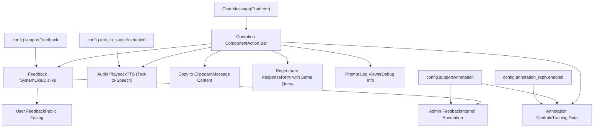
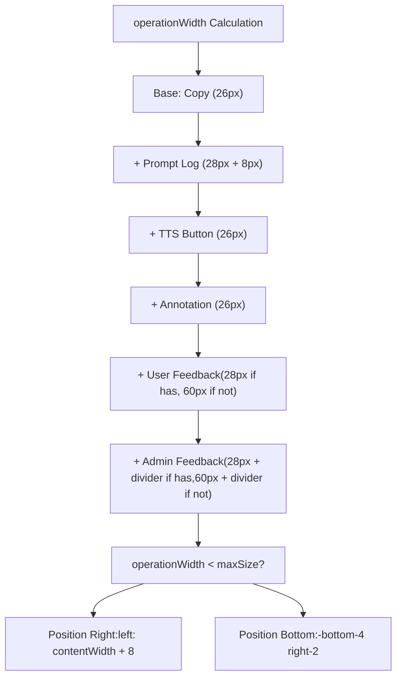
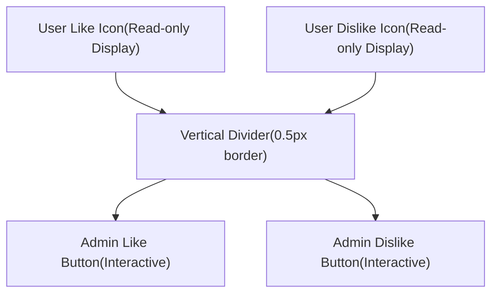
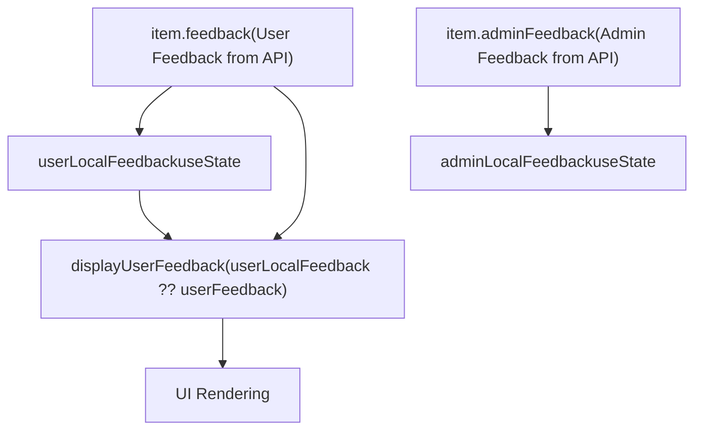
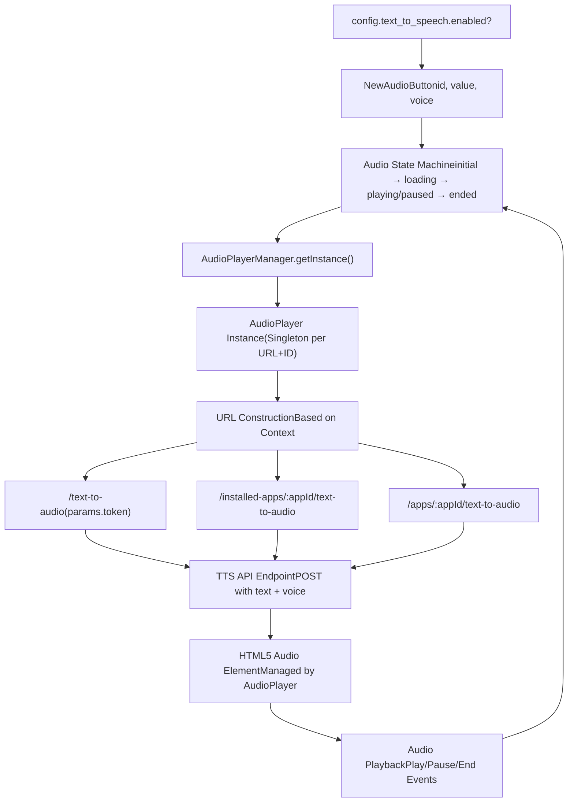
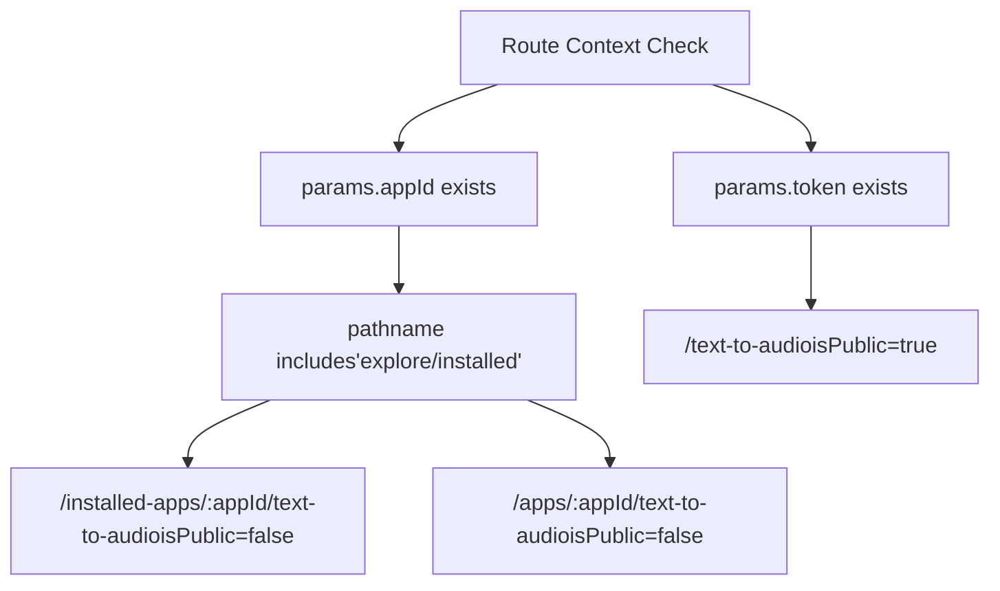
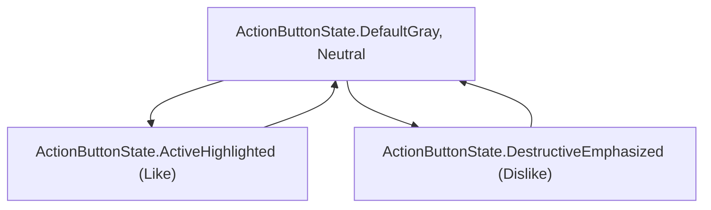
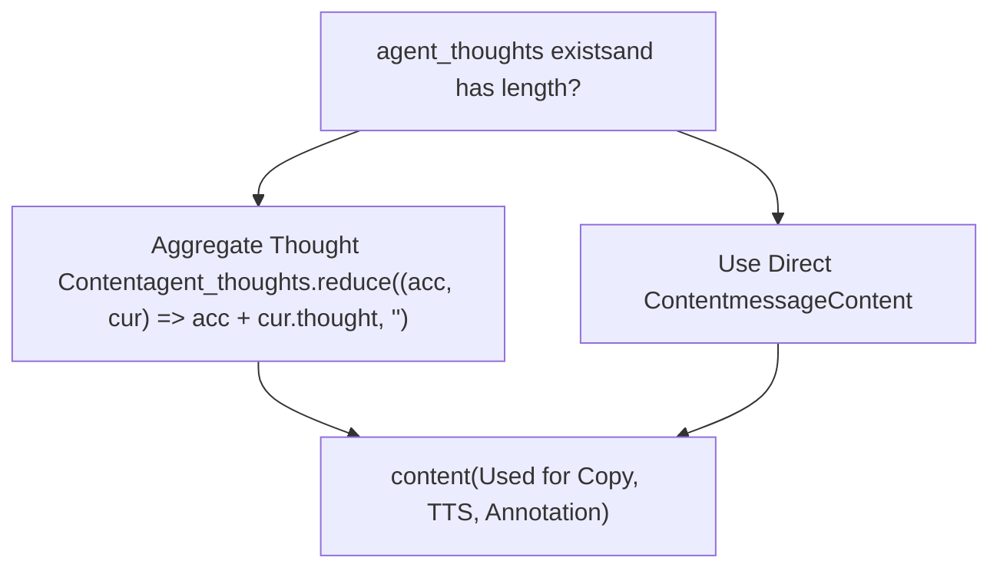

# Chat UI Components and Audio Features

Relevant source files

-   [api/core/model\_runtime/model\_providers/\_\_base/tts\_model.py](https://github.com/langgenius/dify/blob/92dbc94f/api/core/model_runtime/model_providers/__base/tts_model.py)
-   [web/app/components/app/configuration/config-vision/param-config.tsx](https://github.com/langgenius/dify/blob/92dbc94f/web/app/components/app/configuration/config-vision/param-config.tsx)
-   [web/app/components/base/audio-btn/index.tsx](https://github.com/langgenius/dify/blob/92dbc94f/web/app/components/base/audio-btn/index.tsx)
-   [web/app/components/base/audio-btn/style.module.css](https://github.com/langgenius/dify/blob/92dbc94f/web/app/components/base/audio-btn/style.module.css)
-   [web/app/components/base/chat/chat/answer/operation.tsx](https://github.com/langgenius/dify/blob/92dbc94f/web/app/components/base/chat/chat/answer/operation.tsx)
-   [web/app/components/develop/secret-key/assets/play.svg](https://github.com/langgenius/dify/blob/92dbc94f/web/app/components/develop/secret-key/assets/play.svg)
-   [web/app/components/header/maintenance-notice.tsx](https://github.com/langgenius/dify/blob/92dbc94f/web/app/components/header/maintenance-notice.tsx)

This document covers the UI components that render interactive controls for chat messages in the Dify frontend, with a focus on the Operation component, feedback system, and audio/TTS integration. These components enable users to interact with AI responses through actions like copying, regenerating, providing feedback, and playing audio.

For information about the overall chat application structure and message rendering, see [Application Types and Execution Modes](/langgenius/dify/2.3-application-types-and-execution-modes). For API-level feedback and conversation management, see [Conversation and Feedback APIs](/langgenius/dify/8.5-conversation-and-feedback-apis).

---

## Overview of Chat Message Operations

The chat interface provides an action bar that appears on hover over AI messages, containing buttons for various operations. This action bar is implemented in the `Operation` component located at [web/app/components/base/chat/chat/answer/operation.tsx](https://github.com/langgenius/dify/blob/92dbc94f/web/app/components/base/chat/chat/answer/operation.tsx)

**Diagram: Chat Message Operation Features**


**Sources:** [web/app/components/base/chat/chat/answer/operation.tsx31-40](https://github.com/langgenius/dify/blob/92dbc94f/web/app/components/base/chat/chat/answer/operation.tsx#L31-L40) [web/app/components/base/chat/chat/answer/operation.tsx52-60](https://github.com/langgenius/dify/blob/92dbc94f/web/app/components/base/chat/chat/answer/operation.tsx#L52-L60)

---

## Operation Component Architecture

The `Operation` component receives props including the chat item, question text, index, and various display flags. It integrates with the chat context to access configuration and callback functions.

### Component Props and Structure

| Prop | Type | Purpose |
| --- | --- | --- |
| `item` | `ChatItem` | The chat message containing ID, content, annotation, feedback, agent\_thoughts |
| `question` | `string` | The user's question that prompted this response |
| `index` | `number` | Position of the message in the conversation |
| `showPromptLog` | `boolean` | Whether to display the prompt log debug button |
| `maxSize` | `number` | Maximum width for positioning calculations |
| `contentWidth` | `number` | Width of the message content |
| `hasWorkflowProcess` | `boolean` | Whether the message includes workflow execution details |
| `noChatInput` | `boolean` | Whether chat input is disabled (hides regenerate) |

**Sources:** [web/app/components/base/chat/chat/answer/operation.tsx31-40](https://github.com/langgenius/dify/blob/92dbc94f/web/app/components/base/chat/chat/answer/operation.tsx#L31-L40)

### Chat Context Integration

The component accesses the following from `useChatContext()`:

-   **`config`**: Configuration object containing feature flags (`supportFeedback`, `supportAnnotation`, `text_to_speech`, `annotation_reply`, `appId`)
-   **`onAnnotationAdded`**: Callback when annotation is created
-   **`onAnnotationEdited`**: Callback when annotation is modified
-   **`onAnnotationRemoved`**: Callback when annotation is deleted
-   **`onFeedback`**: Callback for submitting user/admin feedback
-   **`onRegenerate`**: Callback to regenerate the response

**Sources:** [web/app/components/base/chat/chat/answer/operation.tsx52-60](https://github.com/langgenius/dify/blob/92dbc94f/web/app/components/base/chat/chat/answer/operation.tsx#L52-L60)

### Dynamic Positioning Logic

The operation bar dynamically positions itself based on available space and content:


**Sources:** [web/app/components/base/chat/chat/answer/operation.tsx158-176](https://github.com/langgenius/dify/blob/92dbc94f/web/app/components/base/chat/chat/answer/operation.tsx#L158-L176) [web/app/components/base/chat/chat/answer/operation.tsx180-188](https://github.com/langgenius/dify/blob/92dbc94f/web/app/components/base/chat/chat/answer/operation.tsx#L180-L188)

---

## Feedback System

The feedback system supports two distinct types: **user feedback** (public-facing, from end users) and **admin feedback** (internal, for annotation purposes). The display logic differs based on whether annotations are enabled.

### User Feedback Flow (No Annotations)

When `config.supportAnnotation` is false, only user feedback is displayed:

> **[Mermaid stateDiagram]**
> *(图表结构无法解析)*

**Sources:** [web/app/components/base/chat/chat/answer/operation.tsx128-145](https://github.com/langgenius/dify/blob/92dbc94f/web/app/components/base/chat/chat/answer/operation.tsx#L128-L145) [web/app/components/base/chat/chat/answer/operation.tsx189-228](https://github.com/langgenius/dify/blob/92dbc94f/web/app/components/base/chat/chat/answer/operation.tsx#L189-L228)

### Admin Feedback Flow (With Annotations)

When `config.supportAnnotation` is true, both user and admin feedback are displayed:

**Diagram: Dual Feedback System Layout**


**Key Implementation Details:**

1.  **User Feedback Display**: If user has provided feedback, it's shown as a read-only icon with tooltip containing rating and optional text content
2.  **Vertical Divider**: Rendered only if user feedback exists [web/app/components/base/chat/chat/answer/operation.tsx256](https://github.com/langgenius/dify/blob/92dbc94f/web/app/components/base/chat/chat/answer/operation.tsx#L256-L256)
3.  **Admin Controls**: Like/dislike buttons for administrators, toggleable
4.  **Tooltip Content**: Built using `buildFeedbackTooltip()` function that formats rating ("like"/"dislike") and optional text content

**Sources:** [web/app/components/base/chat/chat/answer/operation.tsx229-300](https://github.com/langgenius/dify/blob/92dbc94f/web/app/components/base/chat/chat/answer/operation.tsx#L229-L300) [web/app/components/base/chat/chat/answer/operation.tsx99-112](https://github.com/langgenius/dify/blob/92dbc94f/web/app/components/base/chat/chat/answer/operation.tsx#L99-L112)

### Feedback State Management


The component maintains local state for both feedback types to enable optimistic updates before the API responds.

**Sources:** [web/app/components/base/chat/chat/answer/operation.tsx73-90](https://github.com/langgenius/dify/blob/92dbc94f/web/app/components/base/chat/chat/answer/operation.tsx#L73-L90)

### Feedback Modal

When a user clicks dislike, a modal opens to collect optional feedback text:

**Modal Components:**

-   **Title**: `t('feedback.title')` - "Provide Feedback"
-   **Subtitle**: `t('feedback.subtitle')` - "Please tell us what went wrong with this response"
-   **Textarea**: Multi-line input for detailed feedback (4 rows)
-   **Buttons**: Cancel and Submit

**Sources:** [web/app/components/base/chat/chat/answer/operation.tsx354-379](https://github.com/langgenius/dify/blob/92dbc94f/web/app/components/base/chat/chat/answer/operation.tsx#L354-L379)

---

## Audio/TTS Integration

The audio playback feature enables text-to-speech for chat messages. Dify supports two audio button implementations: the legacy `AudioBtn` and the newer `NewAudioButton` component.

### Audio System Architecture


**Sources:** [web/app/components/base/chat/chat/answer/operation.tsx308-314](https://github.com/langgenius/dify/blob/92dbc94f/web/app/components/base/chat/chat/answer/operation.tsx#L308-L314) [web/app/components/base/audio-btn/index.tsx1-111](https://github.com/langgenius/dify/blob/92dbc94f/web/app/components/base/audio-btn/index.tsx#L1-L111)

### AudioBtn State Machine

The `AudioBtn` component implements a state machine with the following states:

| State | Description | UI Representation |
| --- | --- | --- |
| `initial` | No audio loaded or played yet | Play icon, enabled |
| `loading` | Fetching audio from API | Loading spinner, disabled |
| `playing` | Audio is currently playing | Pause icon, enabled |
| `paused` | Audio is paused (transitions to `ended`) | Play icon, enabled |
| `ended` | Playback completed or stopped | Play icon, enabled |

**State Transition Logic:**

```
// From audio_finished_call callback
switch (event) {
  case 'ended': setAudioState('ended')
  case 'paused': setAudioState('ended')
  case 'loaded': setAudioState('loading')
  case 'play': setAudioState('playing')
  case 'error': setAudioState('ended')
}
```
**Sources:** [web/app/components/base/audio-btn/index.tsx19-50](https://github.com/langgenius/dify/blob/92dbc94f/web/app/components/base/audio-btn/index.tsx#L19-L50)

### URL Construction for TTS Endpoints

The audio button determines the appropriate API endpoint based on the route context:


**Sources:** [web/app/components/base/audio-btn/index.tsx51-63](https://github.com/langgenius/dify/blob/92dbc94f/web/app/components/base/audio-btn/index.tsx#L51-L63)

### AudioPlayerManager Pattern

The `AudioPlayerManager` implements a singleton pattern to ensure only one audio plays at a time across the application:

**Key Methods:**

-   **`getInstance()`**: Returns the singleton instance
-   **`getAudioPlayer(url, isPublic, id, value, voice, callback)`**: Returns or creates an AudioPlayer for the given parameters
-   **`playAudio()`**: Starts/resumes playback
-   **`pauseAudio()`**: Pauses playback

This ensures that clicking play on a new message automatically stops any previously playing audio.

**Sources:** [web/app/components/base/audio-btn/index.tsx67-71](https://github.com/langgenius/dify/blob/92dbc94f/web/app/components/base/audio-btn/index.tsx#L67-L71) [web/app/components/base/audio-btn/audio.player.manager.tsx](https://github.com/langgenius/dify/blob/92dbc94f/web/app/components/base/audio-btn/audio.player.manager.tsx) (referenced but not provided)

### Backend TTS Model Interface

The backend TTS implementation is abstracted through the `TTSModel` base class:

```
class TTSModel(AIModel):
    model_type: ModelType = ModelType.TTS

    def invoke(self, model: str, tenant_id: str, credentials: dict,
               content_text: str, voice: str, user: str | None = None) -> Iterable[bytes]:
        # Delegates to PluginModelClient for plugin-based TTS providers

    def get_tts_model_voices(self, model: str, credentials: dict,
                            language: str | None = None):
        # Retrieves available voices for a TTS model
```
**Sources:** [api/core/model\_runtime/model\_providers/\_\_base/tts\_model.py12-79](https://github.com/langgenius/dify/blob/92dbc94f/api/core/model_runtime/model_providers/__base/tts_model.py#L12-L79)

---

## Action Buttons and UI States

The operation bar uses the `ActionButton` component with different visual states to indicate interactivity.

### ActionButton States


**State Usage:**

-   **Default**: Inactive buttons (unhighlighted like/dislike)
-   **Active**: Positive feedback given (like button)
-   **Destructive**: Negative feedback given (dislike button)

**Sources:** [web/app/components/base/chat/chat/answer/operation.tsx201-224](https://github.com/langgenius/dify/blob/92dbc94f/web/app/components/base/chat/chat/answer/operation.tsx#L201-L224)

### Common Action Buttons

#### Copy Button

```
<ActionButton onClick={() => {
  copy(content)
  Toast.notify({ type: 'success', message: t('actionMsg.copySuccessfully') })
}}>
  <RiClipboardLine className="h-4 w-4" />
</ActionButton>
```
Copies the message content (or aggregated agent thoughts) to the clipboard and shows a success toast.

**Sources:** [web/app/components/base/chat/chat/answer/operation.tsx315-321](https://github.com/langgenius/dify/blob/92dbc94f/web/app/components/base/chat/chat/answer/operation.tsx#L315-L321)

#### Regenerate Button

```
<ActionButton onClick={() => onRegenerate?.(item)}>
  <RiResetLeftLine className="h-4 w-4" />
</ActionButton>
```
Triggers regeneration of the response using the same user query. Hidden when `noChatInput` is true.

**Sources:** [web/app/components/base/chat/chat/answer/operation.tsx322-326](https://github.com/langgenius/dify/blob/92dbc94f/web/app/components/base/chat/chat/answer/operation.tsx#L322-L326)

#### Annotation Control Button

The `AnnotationCtrlButton` component manages annotation creation and editing:

**Props:**

-   `appId`: Application identifier
-   `messageId`: Message identifier
-   `cached`: Whether annotation already exists
-   `query`: Original user question
-   `answer`: AI response content
-   `onAdded`: Callback when annotation created
-   `onEdit`: Callback to open edit modal

**Sources:** [web/app/components/base/chat/chat/answer/operation.tsx327-337](https://github.com/langgenius/dify/blob/92dbc94f/web/app/components/base/chat/chat/answer/operation.tsx#L327-L337)

---

## Content Aggregation Logic

The operation bar works with the message content, which may come from different sources depending on the message type:


This ensures that for agent-based messages, the full reasoning chain is captured rather than just the final output.

**Sources:** [web/app/components/base/chat/chat/answer/operation.tsx80-85](https://github.com/langgenius/dify/blob/92dbc94f/web/app/components/base/chat/chat/answer/operation.tsx#L80-L85)

---

## Operation Bar Visibility and Positioning

The operation bar uses CSS classes to control visibility and positioning based on hover state and workflow context:

### Visibility Rules

1.  **Feedback Bars**: Visible only if feedback exists, otherwise shown on `group-hover`
2.  **Action Buttons**: Always hidden, shown on `group-hover`
3.  **Prompt Log**: Hidden, shown on `group-hover` when `showPromptLog` is true

**CSS Classes:**

-   `group-hover:flex`: Show when parent has `group` class and is hovered
-   `group-hover:block`: Show as block element on hover
-   `hidden`: Default hidden state

**Sources:** [web/app/components/base/chat/chat/answer/operation.tsx189-228](https://github.com/langgenius/dify/blob/92dbc94f/web/app/components/base/chat/chat/answer/operation.tsx#L189-L228) [web/app/components/base/chat/chat/answer/operation.tsx301-339](https://github.com/langgenius/dify/blob/92dbc94f/web/app/components/base/chat/chat/answer/operation.tsx#L301-L339)

### Positioning Strategy

The component calculates whether to position the bar:

-   **Right of content** (`left: contentWidth + 8`): When total width fits in available space
-   **Bottom right** (`-bottom-4 right-2`): When width exceeds space or workflow details present

```
const positionRight = useMemo(() => operationWidth < maxSize, [operationWidth, maxSize])
```
**Sources:** [web/app/components/base/chat/chat/answer/operation.tsx176](https://github.com/langgenius/dify/blob/92dbc94f/web/app/components/base/chat/chat/answer/operation.tsx#L176-L176) [web/app/components/base/chat/chat/answer/operation.tsx180-188](https://github.com/langgenius/dify/blob/92dbc94f/web/app/components/base/chat/chat/answer/operation.tsx#L180-L188)

---

## Edit Annotation Modal

The `EditReplyModal` component allows administrators to edit or create annotations for messages:

**Props Structure:**

-   `isShow`: Boolean to control modal visibility
-   `query`: Original user question
-   `answer`: AI response
-   `appId`: Application identifier
-   `messageId`: Message identifier
-   `annotationId`: Existing annotation ID (empty string if creating new)
-   `createdAt`: Timestamp of annotation creation
-   **Callbacks**: `onHide`, `onEdited`, `onAdded`, `onRemove`

This modal is separate from the feedback modal and is used for managing training data annotations.

**Sources:** [web/app/components/base/chat/chat/answer/operation.tsx341-353](https://github.com/langgenius/dify/blob/92dbc94f/web/app/components/base/chat/chat/answer/operation.tsx#L341-L353)

---

## Summary Table: Operation Features

| Feature | Config Flag | Component/Function | User Action | Backend API |
| --- | --- | --- | --- | --- |
| User Feedback | `supportFeedback` | Feedback buttons | Like/Dislike with optional text | `onFeedback(id, {rating, content})` |
| Admin Feedback | `supportFeedback` && `supportAnnotation` | Separate feedback section | Like/Dislike with optional text | Same `onFeedback` API |
| TTS Audio | `text_to_speech.enabled` | `NewAudioButton` | Click to play/pause | `/text-to-audio` or `/apps/:appId/text-to-audio` |
| Copy | Always enabled | Copy button | Click to copy | Client-side only |
| Regenerate | Always enabled (unless `noChatInput`) | Regenerate button | Click to retry | `onRegenerate(item)` |
| Annotation | `supportAnnotation` && `annotation_reply.enabled` | `AnnotationCtrlButton` | Click to add/edit | `onAnnotationAdded`/`onAnnotationEdited` |
| Prompt Log | `showPromptLog` prop | `Log` component | Hover to reveal | Client-side display |

**Sources:** [web/app/components/base/chat/chat/answer/operation.tsx42-382](https://github.com/langgenius/dify/blob/92dbc94f/web/app/components/base/chat/chat/answer/operation.tsx#L42-L382)
