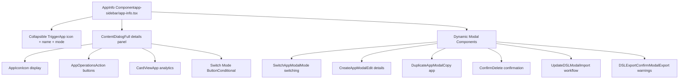
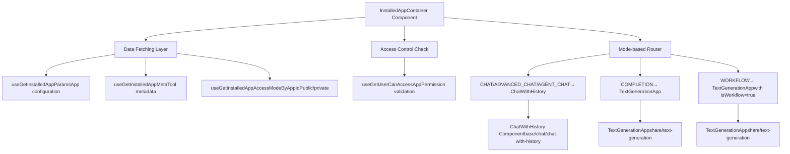
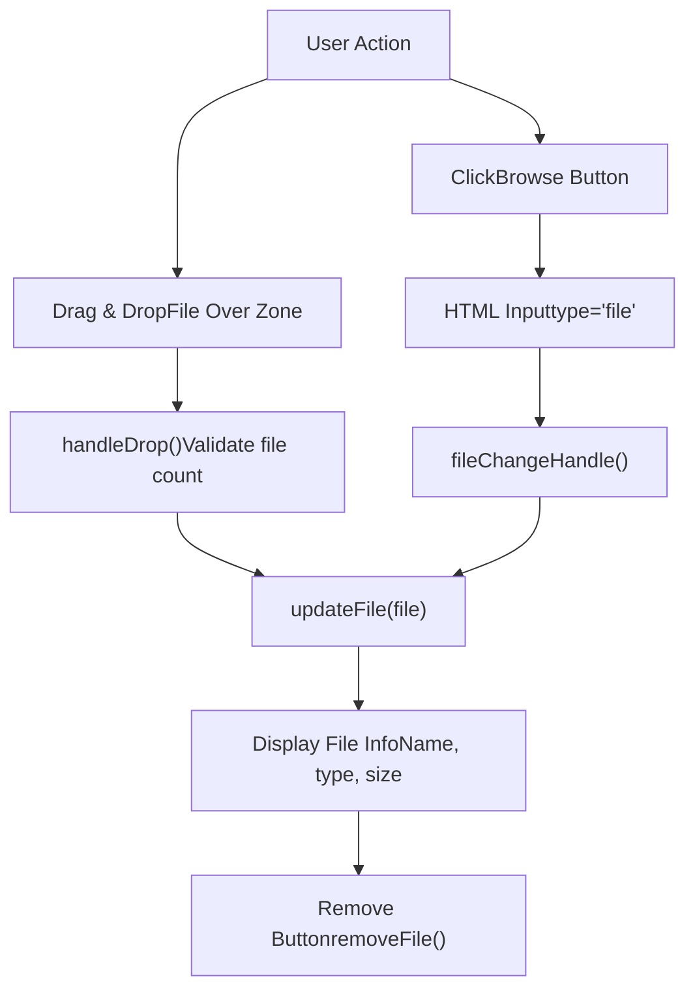
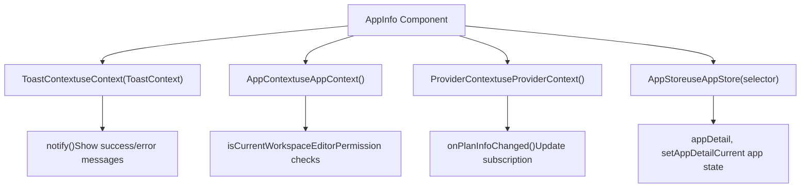
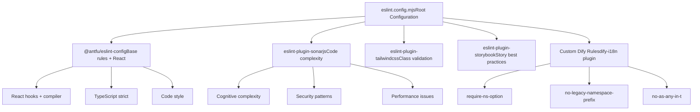
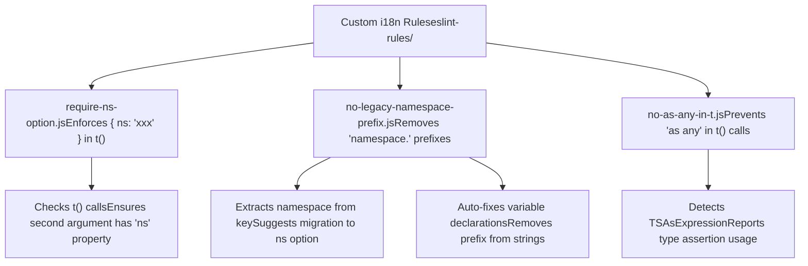
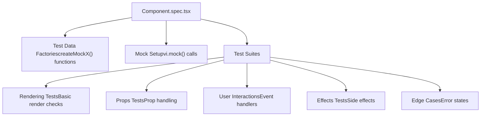
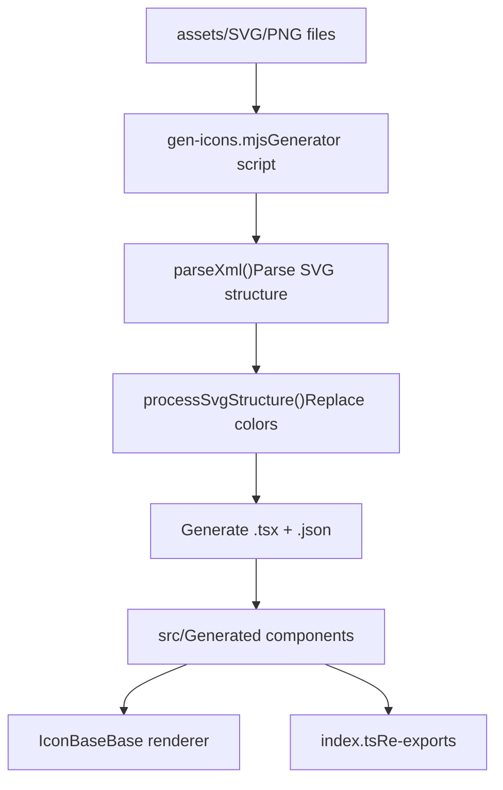
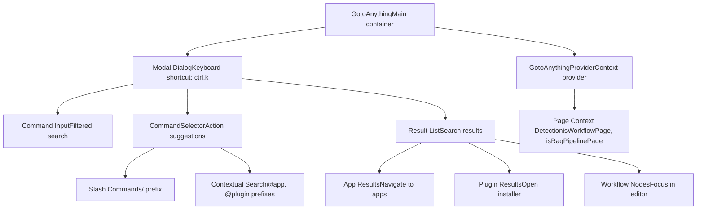

# Component Architecture and Key Features

Relevant source files

-   [web/app/(commonLayout)/app/(appDetailLayout)/layout.tsx](https://github.com/langgenius/dify/blob/92dbc94f/web/app/(commonLayout)/app/(appDetailLayout)/layout.tsx)/app/(appDetailLayout)/layout.tsx)
-   [web/app/(commonLayout)/datasets/(datasetDetailLayout)/\[datasetId\]/settings/page.tsx](web/app/(commonLayout)/datasets/(datasetDetailLayout)/%5BdatasetId%5D/settings/page.tsx)
-   [web/app/components/base/logo/logo-embedded-chat-avatar.tsx](https://github.com/langgenius/dify/blob/92dbc94f/web/app/components/base/logo/logo-embedded-chat-avatar.tsx)
-   [web/app/components/plugins/marketplace/description/index.spec.tsx](https://github.com/langgenius/dify/blob/92dbc94f/web/app/components/plugins/marketplace/description/index.spec.tsx)
-   [web/app/components/plugins/marketplace/description/index.tsx](https://github.com/langgenius/dify/blob/92dbc94f/web/app/components/plugins/marketplace/description/index.tsx)
-   [web/app/components/provider/serwist.tsx](https://github.com/langgenius/dify/blob/92dbc94f/web/app/components/provider/serwist.tsx)
-   [web/app/serwist/\[path\]/route.ts](web/app/serwist/%5Bpath%5D/route.ts)
-   [web/app/sw.ts](https://github.com/langgenius/dify/blob/92dbc94f/web/app/sw.ts)
-   [web/eslint-rules/rules/no-as-any-in-t.js](https://github.com/langgenius/dify/blob/92dbc94f/web/eslint-rules/rules/no-as-any-in-t.js)
-   [web/eslint-rules/rules/no-legacy-namespace-prefix.js](https://github.com/langgenius/dify/blob/92dbc94f/web/eslint-rules/rules/no-legacy-namespace-prefix.js)
-   [web/eslint-rules/rules/require-ns-option.js](https://github.com/langgenius/dify/blob/92dbc94f/web/eslint-rules/rules/require-ns-option.js)
-   [web/eslint-suppressions.json](https://github.com/langgenius/dify/blob/92dbc94f/web/eslint-suppressions.json)
-   [web/eslint.config.mjs](https://github.com/langgenius/dify/blob/92dbc94f/web/eslint.config.mjs)
-   [web/i18n-config/lib.client.ts](https://github.com/langgenius/dify/blob/92dbc94f/web/i18n-config/lib.client.ts)
-   [web/i18n-config/lib.server.ts](https://github.com/langgenius/dify/blob/92dbc94f/web/i18n-config/lib.server.ts)
-   [web/i18n-config/server.ts](https://github.com/langgenius/dify/blob/92dbc94f/web/i18n-config/server.ts)
-   [web/knip.config.ts](https://github.com/langgenius/dify/blob/92dbc94f/web/knip.config.ts)
-   [web/next.config.js](https://github.com/langgenius/dify/blob/92dbc94f/web/next.config.js)
-   [web/pnpm-lock.yaml](https://github.com/langgenius/dify/blob/92dbc94f/web/pnpm-lock.yaml)
-   [web/scripts/gen-icons.mjs](https://github.com/langgenius/dify/blob/92dbc94f/web/scripts/gen-icons.mjs)
-   [web/utils/server-only-context.ts](https://github.com/langgenius/dify/blob/92dbc94f/web/utils/server-only-context.ts)

This document describes the major UI components in the Dify web frontend, their architectural patterns, and key features they implement. It covers component organization, modal-based workflows, file handling, and code quality standards. For state management patterns, see [State Management and Context Architecture](/langgenius/dify/9.2-state-management-and-provider-architecture). For testing approaches, see [Testing Strategy and Quality Assurance](/langgenius/dify/9.4-chat-ui-components-and-audio-features).

---

## Component Organization Structure

The Dify frontend organizes components into a hierarchical directory structure under `web/app/components/`. Components are grouped by functional domain rather than by technical type.

### Directory Structure and Component Domains

```mermaid
flowchart TD
    App["app/Application management"]
    AppSidebar["app-sidebar/Navigation & app info"]
    Base["base/Reusable UI primitives"]
    Billing["billing/Subscription & plans"]
    Explore["explore/App marketplace"]
    Workflow["workflow/Visual workflow editor"]
    Plugins["plugins/Plugin system"]
    GotoAnything["goto-anything/Command palette"]
    Share["share/Public sharing"]
    AppConfig["configuration/App settings & debug"]
    AppInfo["app-info.tsxApp details panel"]
    Chat["chat/Chat interface"]
    Modal["modal/Modal dialogs"]
    FileUploader["file-uploader/File handling"]
    Nodes["nodes/Workflow node types"]
    UpdateDSL["update-dsl-modal.tsxDSL import/export"]

    App --> AppConfig
    AppSidebar --> AppInfo
    Base --> Chat
    Base --> Modal
    Base --> FileUploader
    Workflow --> Nodes
    Workflow --> UpdateDSL
```


**Component Design Principles:**

-   **Domain-driven organization**: Components grouped by business domain, not UI pattern
-   **Flat component hierarchy**: Avoids deep nesting beyond 2-3 levels
-   **Lazy loading**: Large components dynamically imported via `next/dynamic`
-   **Composition over inheritance**: Components composed from smaller primitives

**Sources:**

-   [web/app/components/app-sidebar/app-info.tsx1-476](https://github.com/langgenius/dify/blob/92dbc94f/web/app/components/app-sidebar/app-info.tsx#L1-L476)
-   [web/app/components/workflow/update-dsl-modal.tsx1-347](https://github.com/langgenius/dify/blob/92dbc94f/web/app/components/workflow/update-dsl-modal.tsx#L1-L347)
-   [web/app/components/explore/installed-app/index.spec.tsx1-617](https://github.com/langgenius/dify/blob/92dbc94f/web/app/components/explore/installed-app/index.spec.tsx#L1-L617)

---

## Core Application Management Components

### AppInfo Component - Application Details Panel

The `AppInfo` component is the primary interface for viewing and managing application details. It renders as a collapsible sidebar panel with application metadata and operations.

**Component Structure:**


**Key Operations:**

| Operation | Handler | Modal Component | API Call |
| --- | --- | --- | --- |
| Edit App | `onEdit` | `CreateAppModal` | `updateAppInfo()` |
| Duplicate | `onCopy` | `DuplicateAppModal` | `copyApp()` |
| Export DSL | `exportCheck` | `DSLExportConfirmModal` | `exportAppConfig()` |
| Import DSL | \- | `UpdateDSLModal` | `importDSL()` |
| Delete | `onConfirmDelete` | `Confirm` | `deleteApp()` |
| Switch Mode | \- | `SwitchAppModal` | (internal) |

**Dynamic Imports:** All modal components are lazy-loaded to reduce initial bundle size:

```
const SwitchAppModal = dynamic(() => import('@/app/components/app/switch-app-modal'), { ssr: false })
const CreateAppModal = dynamic(() => import('@/app/components/explore/create-app-modal'), { ssr: false })
const DuplicateAppModal = dynamic(() => import('@/app/components/app/duplicate-modal'), { ssr: false })
const Confirm = dynamic(() => import('@/app/components/base/confirm'), { ssr: false })
const UpdateDSLModal = dynamic(() => import('@/app/components/workflow/update-dsl-modal'), { ssr: false })
const DSLExportConfirmModal = dynamic(() => import('@/app/components/workflow/dsl-export-confirm-modal'), { ssr: false })
```
**State Management:** Uses Zustand store via `useAppStore`:

-   `appDetail`: Current application details
-   `setAppDetail`: Updates application state globally

**Sources:**

-   [web/app/components/app-sidebar/app-info.tsx55-476](https://github.com/langgenius/dify/blob/92dbc94f/web/app/components/app-sidebar/app-info.tsx#L55-L476)
-   [web/app/components/app-sidebar/app-info.tsx36-53](https://github.com/langgenius/dify/blob/92dbc94f/web/app/components/app-sidebar/app-info.tsx#L36-L53)
-   [web/app/components/app-sidebar/app-info.tsx21-23](https://github.com/langgenius/dify/blob/92dbc94f/web/app/components/app-sidebar/app-info.tsx#L21-L23)

### InstalledApp Component - App Type Router

The `InstalledApp` component is a container that routes to different UI implementations based on application mode. It handles data fetching, access control, and loading states before delegating rendering to mode-specific components.

**Component Routing Logic:**


**Data Flow and Effects:**

> **[Mermaid sequence]**
> *(图表结构无法解析)*

**Error Handling States:**

-   **404 Not Found**: App ID doesn't match any installed app
-   **403 Forbidden**: User lacks permission to access app
-   **Loading**: Any service hook is fetching data
-   **Error**: Service hook returned error

**Sources:**

-   [web/app/components/explore/installed-app/index.spec.tsx77-617](https://github.com/langgenius/dify/blob/92dbc94f/web/app/components/explore/installed-app/index.spec.tsx#L77-L617)

---

## Workflow and DSL Management Components

### UpdateDSLModal - Workflow Import Interface

The `UpdateDSLModal` component handles importing workflow definitions from YAML files. It includes file validation, version conflict resolution, and plugin dependency checking.

**Import Workflow:**

> **[Mermaid stateDiagram]**
> *(图表结构无法解析)*

**Key Functions:**

| Function | Purpose | API Endpoint |
| --- | --- | --- |
| `handleFile` | Stores selected file and reads content | \- |
| `validateDSLContent` | Validates YAML structure and node types | \- |
| `handleImport` | Initiates import with version check | `importDSL()` |
| `onUpdateDSLConfirm` | Confirms import after version warning | `importDSLConfirm()` |
| `handleWorkflowUpdate` | Fetches and updates workflow graph | `fetchWorkflowDraft()` |

**Node Type Validation:** The component validates that imported nodes are compatible with the target app mode:

-   **Advanced Chat Mode**: Rejects `End`, `TriggerWebhook`, `TriggerSchedule`, `TriggerPlugin` nodes
-   **Workflow Mode**: Rejects `Answer` nodes

**Version Conflict Handling:** When `DSLImportStatus.PENDING` is returned:

1.  Display `showErrorModal` with version comparison
2.  Show imported version (`imported_dsl_version`) vs. system version (`current_dsl_version`)
3.  Require explicit user confirmation via `importDSLConfirm()`

**Sources:**

-   [web/app/components/workflow/update-dsl-modal.tsx56-347](https://github.com/langgenius/dify/blob/92dbc94f/web/app/components/workflow/update-dsl-modal.tsx#L56-L347)
-   [web/app/components/workflow/update-dsl-modal.tsx140-165](https://github.com/langgenius/dify/blob/92dbc94f/web/app/components/workflow/update-dsl-modal.tsx#L140-L165)
-   [web/app/components/workflow/update-dsl-modal.tsx168-220](https://github.com/langgenius/dify/blob/92dbc94f/web/app/components/workflow/update-dsl-modal.tsx#L168-L220)

### Uploader Component - File Upload Handler

The `Uploader` component provides drag-and-drop and click-to-upload functionality for DSL files. It's a reusable component used by `UpdateDSLModal` and other file upload scenarios.

**Upload Interaction Flow:**


**Drag Event Handling:** Implements full drag-and-drop API:

-   `handleDragEnter`: Sets `dragging` state to show visual feedback
-   `handleDragOver`: Prevents default to allow drop
-   `handleDragLeave`: Clears `dragging` state when leaving zone
-   `handleDrop`: Extracts files and validates count (max 1)

**Visual States:**

-   **Empty State**: Shows upload icon with "Drag and drop or browse" text
-   **Dragging State**: Highlights border with accent color
-   **File Selected**: Shows file icon, name, type badge, size, and remove button

**Sources:**

-   [web/app/components/app/create-from-dsl-modal/uploader.tsx25-149](https://github.com/langgenius/dify/blob/92dbc94f/web/app/components/app/create-from-dsl-modal/uploader.tsx#L25-L149)
-   [web/app/components/app/create-from-dsl-modal/uploader.tsx39-67](https://github.com/langgenius/dify/blob/92dbc94f/web/app/components/app/create-from-dsl-modal/uploader.tsx#L39-L67)
-   [web/app/components/app/create-from-dsl-modal/uploader.tsx87-98](https://github.com/langgenius/dify/blob/92dbc94f/web/app/components/app/create-from-dsl-modal/uploader.tsx#L87-L98)

---

## Modal Management Patterns

### Dynamic Modal Loading Strategy

The frontend uses `next/dynamic` extensively to lazy-load modal components, reducing initial bundle size. Modals are only loaded when needed.

**Modal Loading Pattern:**

```
const ModalComponent = dynamic(
  () => import('@/app/components/path/to/modal'),
  { ssr: false }  // Disable SSR since modals don't need pre-rendering
)
```
**Common Modal Components:**

| Modal | Purpose | Trigger Component | State Variable |
| --- | --- | --- | --- |
| `CreateAppModal` | Create/edit app details | AppInfo, App List | `showEditModal` |
| `DuplicateAppModal` | Copy application | AppInfo | `showDuplicateModal` |
| `SwitchAppModal` | Change app mode | AppInfo | `showSwitchModal` |
| `UpdateDSLModal` | Import workflow DSL | AppInfo, Workflow | `showImportDSLModal` |
| `DSLExportConfirmModal` | Warn about secrets in export | AppInfo | `secretEnvList.length > 0` |
| `Confirm` | Generic confirmation dialog | Multiple | `showConfirmDelete` |

### Modal State Management Pattern

Modals use local React state for visibility control:

```
const [showModal, setShowModal] = useState(false)

// Open modal
setShowModal(true)

// Close modal (in onHide callback)
onHide={() => setShowModal(false)}
```
**Modal Lifecycle:**

1.  User triggers action (click button)
2.  Set modal state to `true`
3.  Dynamic import loads modal component
4.  Modal renders with `isShow={showModal}`
5.  User completes action or cancels
6.  Modal calls `onHide()` or `onConfirm()`
7.  Parent sets modal state to `false`
8.  Modal unmounts

**Sources:**

-   [web/app/components/app-sidebar/app-info.tsx69-76](https://github.com/langgenius/dify/blob/92dbc94f/web/app/components/app-sidebar/app-info.tsx#L69-L76)
-   [web/app/components/app-sidebar/app-info.tsx410-426](https://github.com/langgenius/dify/blob/92dbc94f/web/app/components/app-sidebar/app-info.tsx#L410-L426)

---

## Component Communication Patterns

### Context-based Communication

Components use React Context for cross-cutting concerns like toast notifications, app configuration, and provider state.

**Context Usage Example from AppInfo:**


**Context Injection Points:**

-   `ToastContext`: Imported from `@/app/components/base/toast`
-   `AppContext`: Imported from `@/context/app-context`
-   `ProviderContext`: Imported from `@/context/provider-context`
-   `DebugConfigurationContext`: Imported from `@/context/debug-configuration`
-   `WebAppContext`: Imported from `@/context/web-app-context`

**Sources:**

-   [web/app/components/app-sidebar/app-info.tsx64-68](https://github.com/langgenius/dify/blob/92dbc94f/web/app/components/app-sidebar/app-info.tsx#L64-L68)
-   [web/app/components/app-sidebar/app-info.tsx207](https://github.com/langgenius/dify/blob/92dbc94f/web/app/components/app-sidebar/app-info.tsx#L207-L207)

### Event Emitter Pattern for Workflow Updates

The workflow system uses an event emitter for broadcasting graph updates:

```
eventEmitter?.emit({
  type: WORKFLOW_DATA_UPDATE,
  payload: {
    nodes: initialNodes(nodes, edges),
    edges: initialEdges(edges, nodes),
    viewport,
    features: newFeatures,
    hash,
    conversation_variables: conversation_variables || [],
    environment_variables: environment_variables || [],
  },
} as any)
```
This pattern allows the workflow editor to reactively update when DSL is imported without prop drilling.

**Sources:**

-   [web/app/components/workflow/update-dsl-modal.tsx126-137](https://github.com/langgenius/dify/blob/92dbc94f/web/app/components/workflow/update-dsl-modal.tsx#L126-L137)
-   [web/app/components/workflow/update-dsl-modal.tsx67](https://github.com/langgenius/dify/blob/92dbc94f/web/app/components/workflow/update-dsl-modal.tsx#L67-L67)

---

## Code Quality and Linting Architecture

### ESLint Configuration Structure

The frontend uses a comprehensive ESLint configuration with multiple plugin layers:

**ESLint Configuration Hierarchy:**


**Key Rule Categories:**

| Plugin | Purpose | Key Rules |
| --- | --- | --- |
| `@antfu/eslint-config` | Base + React + TypeScript | React hooks, TS strict, style |
| `eslint-plugin-sonarjs` | Code quality | `cognitive-complexity`, `no-nested-functions`, `max-lines` |
| `eslint-plugin-tailwindcss` | CSS utility validation | `classnames-order`, `no-contradicting-classname` (disabled for perf) |
| `eslint-plugin-storybook` | Storybook best practices | Story structure validation |
| `dify-i18n` (custom) | i18n namespace migration | `require-ns-option`, `no-legacy-namespace-prefix`, `no-as-any-in-t` |

**React Compiler Rules:** The configuration includes React Compiler rules set to `warn` for gradual adoption:

-   `react-hooks/config`
-   `react-hooks/error-boundaries`
-   `react-hooks/immutability`
-   `react-hooks/preserve-manual-memoization`
-   `react-hooks/purity`

**Sources:**

-   [web/eslint.config.mjs1-193](https://github.com/langgenius/dify/blob/92dbc94f/web/eslint.config.mjs#L1-L193)
-   [web/eslint.config.mjs8-54](https://github.com/langgenius/dify/blob/92dbc94f/web/eslint.config.mjs#L8-L54)
-   [web/eslint.config.mjs82-130](https://github.com/langgenius/dify/blob/92dbc94f/web/eslint.config.mjs#L82-L130)

### Custom i18n Linting Rules

The codebase includes three custom ESLint rules for enforcing i18n best practices during a namespace migration.

**Custom Rule Implementations:**


**Rule: `require-ns-option`**

-   **Purpose:** Ensures all `t()` translation calls include explicit namespace
-   **Check:** Second argument must be object with `ns` property
-   **Rationale:** Prepares for removal of namespace prefixes from keys

**Rule: `no-legacy-namespace-prefix`**

-   **Purpose:** Detects and suggests removal of `namespace.key` patterns
-   **Handles:** String literals, template literals, variables
-   **Auto-fix:** Can update variable declarations (disabled by default)

**Rule: `no-as-any-in-t`**

-   **Purpose:** Prevents bypassing type safety in translation keys
-   **Modes:** `any` (only `as any`) or `all` (any type assertion)
-   **Rationale:** Maintains type safety during i18n key refactoring

**Sources:**

-   [web/eslint-rules/rules/require-ns-option.js1-52](https://github.com/langgenius/dify/blob/92dbc94f/web/eslint-rules/rules/require-ns-option.js#L1-L52)
-   [web/eslint-rules/rules/no-legacy-namespace-prefix.js1-300](https://github.com/langgenius/dify/blob/92dbc94f/web/eslint-rules/rules/no-legacy-namespace-prefix.js#L1-L300)
-   [web/eslint-rules/rules/no-as-any-in-t.js1-106](https://github.com/langgenius/dify/blob/92dbc94f/web/eslint-rules/rules/no-as-any-in-t.js#L1-L106)
-   [web/eslint.config.mjs179-191](https://github.com/langgenius/dify/blob/92dbc94f/web/eslint.config.mjs#L179-L191)

### Unused Code Detection with Knip

The project uses Knip to detect unused files, dependencies, and exports:

**Knip Configuration:**

```
{
  entry: [
    'scripts/**/*.{js,ts,mjs}',  // Script entry points
    'bin/**/*.{js,ts,mjs}',      // Binary entry points
  ],
  ignore: [
    'i18n/**',      // Generated i18n files
    'public/**',    // Static assets
  ],
  ignoreBinaries: ['only-allow'],
  ignoreDependencies: ['babel-loader'],  // Required by next-pwa
  rules: {
    // All rules set to 'warn' for gradual adoption
    files: 'warn',
    dependencies: 'warn',
    exports: 'warn',
    types: 'warn',
  }
}
```
**Detection Categories:**

-   **Files:** Unused source files
-   **Dependencies:** Unused npm packages
-   **Exports:** Unused exported functions/components
-   **Types:** Unused TypeScript types
-   **Binaries:** Unused binary scripts

**Sources:**

-   [web/knip.config.ts1-40](https://github.com/langgenius/dify/blob/92dbc94f/web/knip.config.ts#L1-L40)

---

## Component Testing Patterns

### Test Structure and Organization

The codebase follows a consistent testing structure with factory functions, comprehensive mocking, and scenario-based test suites.

**Standard Test File Structure:**


**Factory Function Pattern:**

Test files use factory functions to create type-safe mock data:

```
function createMockModelConfig(overrides: Partial<ModelConfig> = {}): ModelConfig {
  return {
    provider: 'openai',
    model_id: 'gpt-3.5-turbo',
    // ... full default structure
    ...overrides,  // Allow customization
  }
}
```
This pattern provides:

-   **Type safety:** Full TypeScript checking
-   **Defaults:** Sensible default values
-   **Flexibility:** Easy customization via overrides
-   **Reusability:** Used across multiple tests

**Test Suite Categories (Required):**

1.  **Rendering**: Component renders without crashing
2.  **Props**: Props are correctly applied and handled
3.  **User Interactions**: Events trigger expected behaviors
4.  **Effects**: Side effects execute correctly
5.  **Edge Cases**: Error states, null values, boundary conditions

**Sources:**

-   [web/app/components/app/configuration/debug/debug-with-single-model/index.spec.tsx17-123](https://github.com/langgenius/dify/blob/92dbc94f/web/app/components/app/configuration/debug/debug-with-single-model/index.spec.tsx#L17-L123)
-   [web/app/components/billing/upgrade-btn/index.spec.tsx32-84](https://github.com/langgenius/dify/blob/92dbc94f/web/app/components/billing/upgrade-btn/index.spec.tsx#L32-L84)
-   [web/app/components/explore/installed-app/index.spec.tsx172-234](https://github.com/langgenius/dify/blob/92dbc94f/web/app/components/explore/installed-app/index.spec.tsx#L172-L234)

### Mocking Strategy

**External Dependencies Only:** The testing guidelines emphasize mocking only external dependencies (services, contexts, third-party libraries) and using real project components:

```
// ✅ Mock external dependencies
vi.mock('@/service/base', () => ({ ssePost: mockSsePost }))
vi.mock('next/navigation', () => ({ useRouter: () => ({ push: vi.fn() }) }))

// ❌ Do NOT mock project components
// Use real components for integration testing
```
**Context Mocking Pattern:**

```
const mockDebugConfigContext = {
  appId: 'test-app-id',
  isAPIKeySet: true,
  modelConfig: createMockModelConfig(),
  // ... full context shape
}

vi.mock('@/context/debug-configuration', () => ({
  useDebugConfigurationContext: () => mockDebugConfigContext,
}))
```
**Complex Component Mocking:** For extremely complex child components (like `ChatWithHistory` with 576 lines), create simple test doubles:

```
vi.mock('@/app/components/base/chat/chat-with-history', () => ({
  default: ({ installedAppInfo }: Props) => (
    <div data-testid="chat-with-history">
      Chat With History - {installedAppInfo?.id}
    </div>
  ),
}))
```
**Sources:**

-   [web/app/components/app/configuration/debug/debug-with-single-model/index.spec.tsx126-157](https://github.com/langgenius/dify/blob/92dbc94f/web/app/components/app/configuration/debug/debug-with-single-model/index.spec.tsx#L126-L157)
-   [web/app/components/explore/installed-app/index.spec.tsx14-75](https://github.com/langgenius/dify/blob/92dbc94f/web/app/components/explore/installed-app/index.spec.tsx#L14-L75)

---

## Icon Generation System

### Automated SVG Component Generation

The frontend includes a script that automatically generates React components from SVG files in the assets directory.

**Icon Generation Pipeline:**


**Processing Steps:**

1.  **Walk Directory Tree:** Recursively processes `assets/public/`, `assets/vender/`, `assets/image/`
2.  **Parse SVG:** Uses `@rgrove/parse-xml` to convert SVG to JSON structure
3.  **Transform Colors:** Replaces `fill` and `stroke` with `currentColor` (for vender icons)
4.  **Generate Files:**
    -   `{Name}.json`: SVG structure data
    -   `{Name}.tsx`: React component wrapper
    -   `index.ts`: Re-export module
5.  **Generate CSS Modules:** For PNG images, creates CSS background modules

**SVG Component Template:**

```
import * as React from 'react'
import data from './IconName.json'
import IconBase from '@/app/components/base/icons/IconBase'
import type { IconData } from '@/app/components/base/icons/IconBase'

const Icon = ({ ref, ...props }: React.SVGProps<SVGSVGElement>) =>
  <IconBase {...props} ref={ref} data={data as IconData} />

Icon.displayName = 'IconName'
export default Icon
```
**Color Replacement Logic:** For vendor icons, paths are updated to use `currentColor`:

```
if (child?.attributes?.stroke)
  child.attributes.stroke = 'currentColor'
if (child?.attributes.fill)
  child.attributes.fill = 'currentColor'
```
**Sources:**

-   [web/scripts/gen-icons.mjs1-176](https://github.com/langgenius/dify/blob/92dbc94f/web/scripts/gen-icons.mjs#L1-L176)
-   [web/scripts/gen-icons.mjs18-34](https://github.com/langgenius/dify/blob/92dbc94f/web/scripts/gen-icons.mjs#L18-L34)
-   [web/scripts/gen-icons.mjs56-87](https://github.com/langgenius/dify/blob/92dbc94f/web/scripts/gen-icons.mjs#L56-L87)

---

## GotoAnything - Command Palette System

### Command Palette Architecture

The `GotoAnything` component implements a keyboard-driven command palette for quick navigation and actions, similar to VS Code's command palette.

**Command Palette Component Structure:**


**Action Registry Pattern:**

Actions are registered via the `createActions()` function:

```
const actions = {
  '/': {
    key: '/',
    shortcut: '/',
    title: 'Slash Commands',
    search: async (query) => { /* search logic */ },
    action: (result) => { /* execute command */ }
  },
  '@app': {
    key: '@app',
    shortcut: '@app',
    title: 'Search Apps',
    search: async (query) => { /* search apps */ },
    action: (result) => router.push(result.path)
  },
  '@plugin': { /* ... */ }
}
```
**Search Flow:**

> **[Mermaid sequence]**
> *(图表结构无法解析)*

**Context-Aware Features:**

-   **Workflow Page Detection:** Shows workflow-specific commands
-   **RAG Pipeline Detection:** Shows dataset-specific commands
-   **Keyboard Shortcuts:** `ctrl.k` (Windows) or `cmd.k` (Mac) to open

**Sources:**

-   [web/app/components/goto-anything/index.spec.tsx1-175](https://github.com/langgenius/dify/blob/92dbc94f/web/app/components/goto-anything/index.spec.tsx#L1-L175)
-   [web/app/components/goto-anything/command-selector.spec.tsx1-85](https://github.com/langgenius/dify/blob/92dbc94f/web/app/components/goto-anything/command-selector.spec.tsx#L1-L85)
-   [web/app/components/goto-anything/context.spec.tsx1-61](https://github.com/langgenius/dify/blob/92dbc94f/web/app/components/goto-anything/context.spec.tsx#L1-L61)

---

## Key Architectural Takeaways

1.  **Component Organization**: Domain-driven folders, not technical layers
2.  **Dynamic Imports**: Extensive use of code splitting for modals and large components
3.  **Context Composition**: Multiple contexts for cross-cutting concerns (toast, auth, config)
4.  **Factory Pattern**: Type-safe test data generation via factory functions
5.  **Pragmatic Mocking**: Mock only external dependencies, use real components for integration
6.  **Code Quality**: Multi-layer linting (base rules + complexity + custom i18n)
7.  **Automated Generation**: Icon components auto-generated from assets
8.  **Command Palette**: Keyboard-driven navigation via `GotoAnything`

**Sources:**

-   [web/app/components/app-sidebar/app-info.tsx1-476](https://github.com/langgenius/dify/blob/92dbc94f/web/app/components/app-sidebar/app-info.tsx#L1-L476)
-   [web/app/components/workflow/update-dsl-modal.tsx1-347](https://github.com/langgenius/dify/blob/92dbc94f/web/app/components/workflow/update-dsl-modal.tsx#L1-L347)
-   [web/app/components/explore/installed-app/index.spec.tsx1-617](https://github.com/langgenius/dify/blob/92dbc94f/web/app/components/explore/installed-app/index.spec.tsx#L1-L617)
-   [web/eslint.config.mjs1-193](https://github.com/langgenius/dify/blob/92dbc94f/web/eslint.config.mjs#L1-L193)
-   [web/knip.config.ts1-40](https://github.com/langgenius/dify/blob/92dbc94f/web/knip.config.ts#L1-L40)
