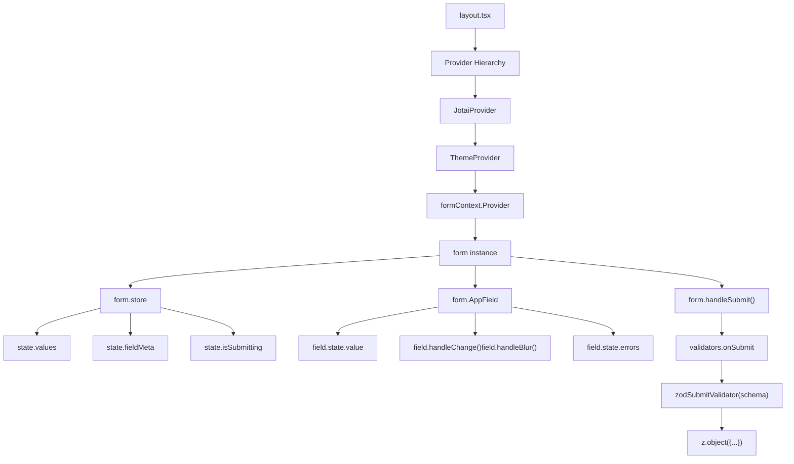
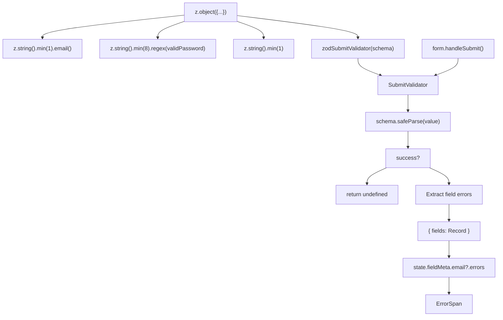
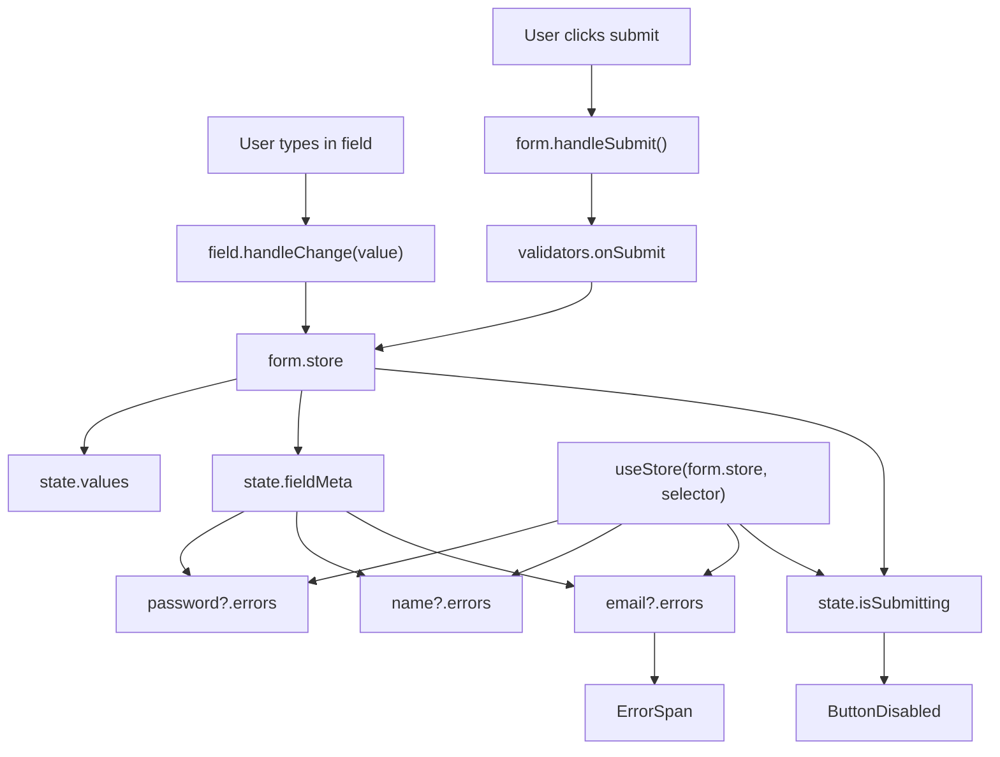
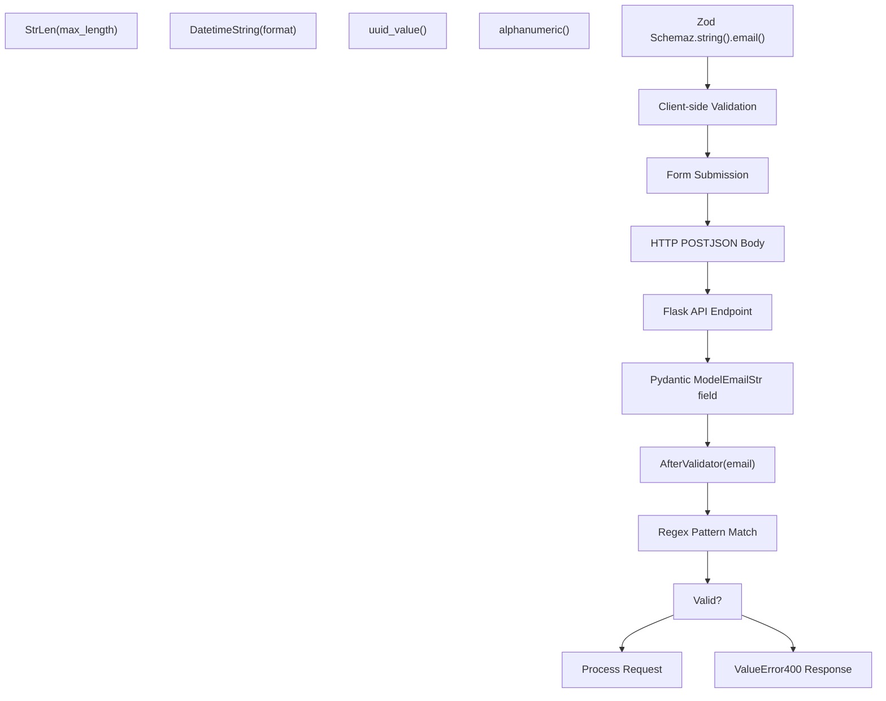
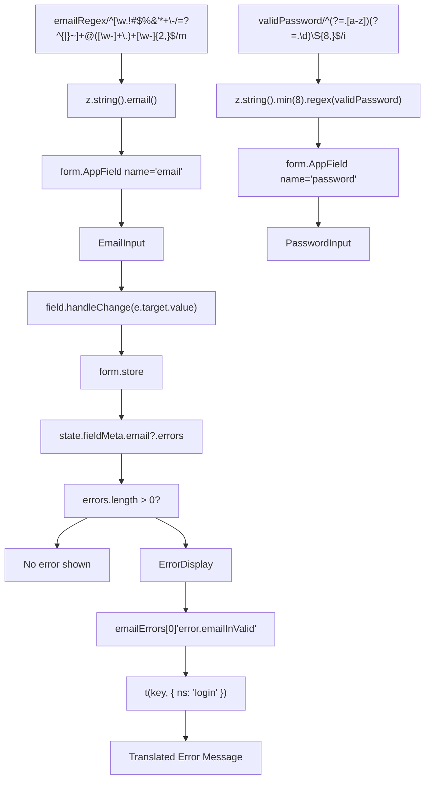
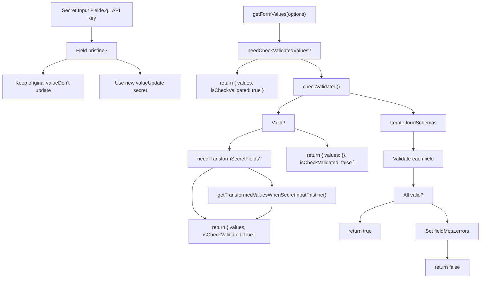

# Form System and Validation

Relevant source files

-   [api/libs/helper.py](https://github.com/langgenius/dify/blob/92dbc94f/api/libs/helper.py)
-   [api/tests/unit\_tests/libs/test\_helper.py](https://github.com/langgenius/dify/blob/92dbc94f/api/tests/unit_tests/libs/test_helper.py)
-   [web/.env.example](https://github.com/langgenius/dify/blob/92dbc94f/web/.env.example)
-   [web/app/activate/activateForm.tsx](https://github.com/langgenius/dify/blob/92dbc94f/web/app/activate/activateForm.tsx)
-   [web/app/components/base/form/hooks/use-get-form-values.ts](https://github.com/langgenius/dify/blob/92dbc94f/web/app/components/base/form/hooks/use-get-form-values.ts)
-   [web/app/components/base/form/utils/zod-submit-validator.ts](https://github.com/langgenius/dify/blob/92dbc94f/web/app/components/base/form/utils/zod-submit-validator.ts)
-   [web/app/forgot-password/ForgotPasswordForm.spec.tsx](https://github.com/langgenius/dify/blob/92dbc94f/web/app/forgot-password/ForgotPasswordForm.spec.tsx)
-   [web/app/forgot-password/ForgotPasswordForm.tsx](https://github.com/langgenius/dify/blob/92dbc94f/web/app/forgot-password/ForgotPasswordForm.tsx)
-   [web/app/install/installForm.tsx](https://github.com/langgenius/dify/blob/92dbc94f/web/app/install/installForm.tsx)
-   [web/app/layout.tsx](https://github.com/langgenius/dify/blob/92dbc94f/web/app/layout.tsx)
-   [web/config/index.ts](https://github.com/langgenius/dify/blob/92dbc94f/web/config/index.ts)
-   [web/docker/entrypoint.sh](https://github.com/langgenius/dify/blob/92dbc94f/web/docker/entrypoint.sh)
-   [web/types/feature.ts](https://github.com/langgenius/dify/blob/92dbc94f/web/types/feature.ts)

## Purpose and Scope

This document explains the form handling and validation architecture in the Dify web frontend. It covers the **Tanstack Form** integration, **Zod** schema validation, form hooks, and patterns used in authentication and configuration forms throughout the application.

For state management architecture, see page [9.2](/langgenius/dify/9.2-state-management-and-provider-architecture). For i18n integration in forms, see page [9.3](/langgenius/dify/9.3-internationalization-system). For backend API validation, see page [8](/langgenius/dify/8-service-apis).

---

## Form Framework Architecture

### Tanstack Form Integration

The Dify web frontend uses **@tanstack/react-form** for declarative, type-safe form handling. Tanstack Form provides fine-grained reactivity, minimal re-renders, and built-in validation support.

**Core Form Infrastructure:**

-   `@tanstack/react-form` - Form state management library
-   `zod` - Schema validation library
-   `formContext` - React context for form instance sharing
-   `useAppForm` - Custom hook wrapping Tanstack Form with Dify conventions

Sources: [web/app/install/installForm.tsx3](https://github.com/langgenius/dify/blob/92dbc94f/web/app/install/installForm.tsx#L3-L3) [web/app/install/installForm.tsx12](https://github.com/langgenius/dify/blob/92dbc94f/web/app/install/installForm.tsx#L12-L12)


**Diagram: Form Architecture and Data Flow**

Sources: [web/app/install/installForm.tsx12-13](https://github.com/langgenius/dify/blob/92dbc94f/web/app/install/installForm.tsx#L12-L13) [web/app/install/installForm.tsx43-79](https://github.com/langgenius/dify/blob/92dbc94f/web/app/install/installForm.tsx#L43-L79) [web/app/install/installForm.tsx128-138](https://github.com/langgenius/dify/blob/92dbc94f/web/app/install/installForm.tsx#L128-L138)

---

## Validation System

### Zod Schema Validation

Forms use **Zod** schemas to define validation rules declaratively. The `zodSubmitValidator` utility converts Zod schemas into Tanstack Form validators.

**Validation Flow:**

1.  Define Zod schema with validation rules
2.  Pass schema to `zodSubmitValidator(schema)`
3.  Assign validator to `form.validators.onSubmit`
4.  Validation runs on form submission
5.  Field errors populate `fieldMeta.errors` array

Sources: [web/app/install/installForm.tsx10](https://github.com/langgenius/dify/blob/92dbc94f/web/app/install/installForm.tsx#L10-L10) [web/app/install/installForm.tsx24-33](https://github.com/langgenius/dify/blob/92dbc94f/web/app/install/installForm.tsx#L24-L33) [web/app/components/base/form/utils/zod-submit-validator.ts1-22](https://github.com/langgenius/dify/blob/92dbc94f/web/app/components/base/form/utils/zod-submit-validator.ts#L1-L22)


**Diagram: Zod Validation Pipeline**

Sources: [web/app/components/base/form/utils/zod-submit-validator.ts5-22](https://github.com/langgenius/dify/blob/92dbc94f/web/app/components/base/form/utils/zod-submit-validator.ts#L5-L22) [web/app/install/installForm.tsx24-33](https://github.com/langgenius/dify/blob/92dbc94f/web/app/install/installForm.tsx#L24-L33) [web/app/install/installForm.tsx139-143](https://github.com/langgenius/dify/blob/92dbc94f/web/app/install/installForm.tsx#L139-L143)

### zodSubmitValidator Implementation

The `zodSubmitValidator` utility transforms Zod validation results into Tanstack Form's expected error format:

**File:** [web/app/components/base/form/utils/zod-submit-validator.ts1-22](https://github.com/langgenius/dify/blob/92dbc94f/web/app/components/base/form/utils/zod-submit-validator.ts#L1-L22)

```
type SubmitValidator<T> = ({ value }: { value: T }) =>
  { fields: Record<string, string> } | undefined

export const zodSubmitValidator = <T>(schema: ZodSchema<T>): SubmitValidator<T> => {
  return ({ value }) => {
    const result = schema.safeParse(value)
    if (!result.success) {
      const fieldErrors: Record<string, string> = {}
      for (const issue of result.error.issues) {
        const path = issue.path[0]
        if (path === undefined) continue
        const key = String(path)
        if (!fieldErrors[key])
          fieldErrors[key] = issue.message
      }
      return { fields: fieldErrors }
    }
    return undefined
  }
}
```
**Error Mapping:**

-   Zod issues → Field-specific error messages
-   First error per field takes precedence
-   Returns `undefined` if validation succeeds
-   Returns `{ fields: {...} }` if validation fails

Sources: [web/app/components/base/form/utils/zod-submit-validator.ts5-22](https://github.com/langgenius/dify/blob/92dbc94f/web/app/components/base/form/utils/zod-submit-validator.ts#L5-L22)

---

## Form Implementation Patterns

### useAppForm Hook

Forms are initialized using the `useAppForm` hook, which wraps Tanstack Form's `useForm` with Dify-specific conventions:

**Pattern:**

```
const form = useAppForm({
  defaultValues: {
    email: '',
    password: '',
    name: '',
  },
  validators: {
    onSubmit: zodSubmitValidator(accountFormSchema),
  },
  onSubmit: async ({ value }) => {
    // Handle form submission
    await submitData(value)
  },
})
```
Sources: [web/app/install/installForm.tsx43-79](https://github.com/langgenius/dify/blob/92dbc94f/web/app/install/installForm.tsx#L43-L79)

**Key Properties:**

-   `defaultValues` - Initial form state
-   `validators.onSubmit` - Zod schema validator
-   `onSubmit` - Async submission handler
-   `form.store` - Reactive state store
-   `form.handleSubmit()` - Trigger validation and submission

Sources: [web/app/install/installForm.tsx43-79](https://github.com/langgenius/dify/blob/92dbc94f/web/app/install/installForm.tsx#L43-L79)

### form.AppField Component

The `form.AppField` component connects input fields to form state using a render prop pattern:

**Pattern:**

```
<form.AppField name="email">
  {field => (
    <Input
      id="email"
      value={field.state.value}
      onChange={e => field.handleChange(e.target.value)}
      onBlur={field.handleBlur}
      placeholder={t('emailPlaceholder', { ns: 'login' })}
    />
  )}
</form.AppField>
```
Sources: [web/app/install/installForm.tsx128-138](https://github.com/langgenius/dify/blob/92dbc94f/web/app/install/installForm.tsx#L128-L138)

**Field API:**

-   `field.state.value` - Current field value
-   `field.handleChange(value)` - Update field value
-   `field.handleBlur()` - Mark field as touched
-   `field.state.errors` - Field validation errors

Sources: [web/app/install/installForm.tsx128-138](https://github.com/langgenius/dify/blob/92dbc94f/web/app/install/installForm.tsx#L128-L138)

### Form Submission Handling

Forms prevent default browser submission and handle submit events through Tanstack Form:

**Pattern:**

```
<form
  onSubmit={(e) => {
    e.preventDefault()
    e.stopPropagation()
    if (isSubmitting) return
    form.handleSubmit()
  }}
>
  {/* Form fields */}
</form>
```
Sources: [web/app/install/installForm.tsx115-121](https://github.com/langgenius/dify/blob/92dbc94f/web/app/install/installForm.tsx#L115-L121)

**Submission Flow:**

1.  Prevent default browser submission (`e.preventDefault()`)
2.  Stop event propagation (`e.stopPropagation()`)
3.  Check if submission is in progress
4.  Call `form.handleSubmit()` to trigger validation and `onSubmit`

Sources: [web/app/install/installForm.tsx115-121](https://github.com/langgenius/dify/blob/92dbc94f/web/app/install/installForm.tsx#L115-L121)

---

## Authentication Forms

### Install/Setup Form

The installation form (`installForm.tsx`) demonstrates the complete form pattern including validation, submission, and automatic login:

**File:** [web/app/install/installForm.tsx1-234](https://github.com/langgenius/dify/blob/92dbc94f/web/app/install/installForm.tsx#L1-L234)

**Form Schema:**

```
const accountFormSchema = z.object({
  email: z
    .string()
    .min(1, { message: 'error.emailInValid' })
    .email('error.emailInValid'),
  name: z.string().min(1, { message: 'error.nameEmpty' }),
  password: z.string().min(8, {
    message: 'error.passwordLengthInValid',
  }).regex(validPassword, 'error.passwordInvalid'),
})
```
Sources: [web/app/install/installForm.tsx24-33](https://github.com/langgenius/dify/blob/92dbc94f/web/app/install/installForm.tsx#L24-L33)

**Key Features:**

-   Email validation with Zod's `.email()` method
-   Password length (min 8 characters) and complexity regex
-   Name required (non-empty)
-   i18n error messages
-   Automatic login after successful setup

Sources: [web/app/install/installForm.tsx24-33](https://github.com/langgenius/dify/blob/92dbc94f/web/app/install/installForm.tsx#L24-L33) [web/app/install/installForm.tsx52-78](https://github.com/langgenius/dify/blob/92dbc94f/web/app/install/installForm.tsx#L52-L78)

### Forgot Password Form

The forgot password form demonstrates conditional UI based on form state:

**File:** [web/app/forgot-password/ForgotPasswordForm.tsx1-151](https://github.com/langgenius/dify/blob/92dbc94f/web/app/forgot-password/ForgotPasswordForm.tsx#L1-L151)

**State Management:**

```
const [isEmailSent, setIsEmailSent] = useState(false)

// Conditional button behavior
const handleSendResetPasswordClick = async () => {
  if (isSubmitting) return

  if (isEmailSent) {
    router.push('/signin')
  } else {
    form.handleSubmit()
  }
}
```
Sources: [web/app/forgot-password/ForgotPasswordForm.tsx35](https://github.com/langgenius/dify/blob/92dbc94f/web/app/forgot-password/ForgotPasswordForm.tsx#L35-L35) [web/app/forgot-password/ForgotPasswordForm.tsx61-71](https://github.com/langgenius/dify/blob/92dbc94f/web/app/forgot-password/ForgotPasswordForm.tsx#L61-L71)

**Pattern:**

-   Single form with two states: email input → confirmation
-   Button text changes based on state
-   Success response triggers state transition
-   Error handling preserves form state

Sources: [web/app/forgot-password/ForgotPasswordForm.tsx42-55](https://github.com/langgenius/dify/blob/92dbc94f/web/app/forgot-password/ForgotPasswordForm.tsx#L42-L55) [web/app/forgot-password/ForgotPasswordForm.tsx107-136](https://github.com/langgenius/dify/blob/92dbc94f/web/app/forgot-password/ForgotPasswordForm.tsx#L107-L136)

### Form State from Store

Form state is accessed via the `useStore` hook from Tanstack Form:

**Pattern:**

```
const isSubmitting = useStore(form.store, state => state.isSubmitting)
const emailErrors = useStore(form.store, state => state.fieldMeta.email?.errors)
const nameErrors = useStore(form.store, state => state.fieldMeta.name?.errors)
const passwordErrors = useStore(form.store, state => state.fieldMeta.password?.errors)
```
Sources: [web/app/install/installForm.tsx81-84](https://github.com/langgenius/dify/blob/92dbc94f/web/app/install/installForm.tsx#L81-L84)

**Store Properties:**

-   `state.isSubmitting` - Boolean indicating submission in progress
-   `state.fieldMeta.<field>?.errors` - Array of error messages per field
-   `state.values` - Current form values
-   Reactive updates trigger component re-renders only when subscribed values change

Sources: [web/app/install/installForm.tsx81-84](https://github.com/langgenius/dify/blob/92dbc94f/web/app/install/installForm.tsx#L81-L84)


**Diagram: Form State Management with useStore**

Sources: [web/app/install/installForm.tsx81-84](https://github.com/langgenius/dify/blob/92dbc94f/web/app/install/installForm.tsx#L81-L84) [web/app/install/installForm.tsx115-121](https://github.com/langgenius/dify/blob/92dbc94f/web/app/install/installForm.tsx#L115-L121) [web/app/install/installForm.tsx139-143](https://github.com/langgenius/dify/blob/92dbc94f/web/app/install/installForm.tsx#L139-L143)

---

## Backend Validation

### Python Validators

The backend provides validation utilities in `api/libs/helper.py` for consistent data validation across API endpoints:

**File:** [api/libs/helper.py1-435](https://github.com/langgenius/dify/blob/92dbc94f/api/libs/helper.py#L1-L435)

**Validator Functions:**

| Validator | Purpose | Example |
| --- | --- | --- |
| `email(email: str)` | Validates email format using regex | `email("user@example.com")` |
| `uuid_value(value: Any)` | Validates UUID format | `uuid_value("123e4567-e89b-12d3-a456-426614174000")` |
| `alphanumeric(value: str)` | Ensures alphanumeric + underscore only | `alphanumeric("my_variable_1")` |
| `timestamp_value(timestamp)` | Validates positive integer timestamp | `timestamp_value(1609459200)` |
| `timezone(timezone_string)` | Validates timezone name | `timezone("America/New_York")` |

Sources: [api/libs/helper.py129-137](https://github.com/langgenius/dify/blob/92dbc94f/api/libs/helper.py#L129-L137) [api/libs/helper.py143-152](https://github.com/langgenius/dify/blob/92dbc94f/api/libs/helper.py#L143-L152) [api/libs/helper.py168-173](https://github.com/langgenius/dify/blob/92dbc94f/api/libs/helper.py#L168-L173) [api/libs/helper.py176-184](https://github.com/langgenius/dify/blob/92dbc94f/api/libs/helper.py#L176-L184) [api/libs/helper.py222-227](https://github.com/langgenius/dify/blob/92dbc94f/api/libs/helper.py#L222-L227)

### Pydantic Validators

Custom Pydantic validators are created using `AfterValidator`:

**Pattern:**

```
from pydantic.functional_validators import AfterValidator
from typing import Annotated

def email(email):
    pattern = r"^[\w\.!#$%&'*+\-/=?^_`{|}~]+@([\w-]+\.)+[\w-]{2,}$"
    if re.match(pattern, email) is not None:
        return email
    raise ValueError(f"{email} is not a valid email.")

EmailStr = Annotated[str, AfterValidator(email)]
```
Sources: [api/libs/helper.py129-140](https://github.com/langgenius/dify/blob/92dbc94f/api/libs/helper.py#L129-L140)

**Usage in Models:**

```
class UserModel(BaseModel):
    email: EmailStr
    uuid: UUIDStrOrEmpty
```
Sources: [api/libs/helper.py140](https://github.com/langgenius/dify/blob/92dbc94f/api/libs/helper.py#L140-L140) [api/libs/helper.py165](https://github.com/langgenius/dify/blob/92dbc94f/api/libs/helper.py#L165-L165)

### Validation Classes

**StrLen Validator:**

```
class StrLen:
    """Restrict input to an integer in a range (inclusive)"""

    def __init__(self, max_length, argument="argument"):
        self.max_length = max_length
        self.argument = argument

    def __call__(self, value):
        length = len(value)
        if length > self.max_length:
            error = "Invalid {arg}: {val}. {arg} cannot exceed length {length}".format(
                arg=self.argument, val=value, length=self.max_length
            )
            raise ValueError(error)
        return value
```
Sources: [api/libs/helper.py187-202](https://github.com/langgenius/dify/blob/92dbc94f/api/libs/helper.py#L187-L202)

**DatetimeString Validator:**

```
class DatetimeString:
    def __init__(self, format, argument="argument"):
        self.format = format
        self.argument = argument

    def __call__(self, value):
        try:
            datetime.strptime(value, self.format)
        except ValueError:
            error = "Invalid {arg}: {val}. {arg} must be conform to the format {format}".format(
                arg=self.argument, val=value, format=self.format
            )
            raise ValueError(error)
        return value
```
Sources: [api/libs/helper.py205-219](https://github.com/langgenius/dify/blob/92dbc94f/api/libs/helper.py#L205-L219)


**Diagram: Frontend-to-Backend Validation Flow**

Sources: [web/app/install/installForm.tsx24-33](https://github.com/langgenius/dify/blob/92dbc94f/web/app/install/installForm.tsx#L24-L33) [api/libs/helper.py129-140](https://github.com/langgenius/dify/blob/92dbc94f/api/libs/helper.py#L129-L140) [api/libs/helper.py187-219](https://github.com/langgenius/dify/blob/92dbc94f/api/libs/helper.py#L187-L219)

---

## Validation Patterns and Rules

### Password Validation

Password validation combines length requirements and complexity rules:

**Frontend Pattern:**

```
export const validPassword = /^(?=.*[a-z])(?=.*\d)\S{8,}$/i
```
Sources: [web/config/index.ts414](https://github.com/langgenius/dify/blob/92dbc94f/web/config/index.ts#L414-L414)

**Validation Rules:**

-   Minimum 8 characters
-   At least one letter (case-insensitive via `/i` flag)
-   At least one digit
-   No whitespace characters (`\S`)

**Zod Integration:**

```
password: z.string().min(8, {
  message: 'error.passwordLengthInValid',
}).regex(validPassword, 'error.passwordInvalid')
```
Sources: [web/app/install/installForm.tsx30-32](https://github.com/langgenius/dify/blob/92dbc94f/web/app/install/installForm.tsx#L30-L32)

### Email Validation

Email validation uses different regex patterns on frontend and backend:

**Frontend Pattern:**

```
export const emailRegex = /^[\w.!#$%&'*+\-/=?^{|}~]+@([\w-]+\.)+[\w-]{2,}$/m
```
Sources: [web/config/index.ts193](https://github.com/langgenius/dify/blob/92dbc94f/web/config/index.ts#L193-L193)

**Backend Pattern:**

```
pattern = r"^[\w\.!#$%&'*+\-/=?^_`{|}~]+@([\w-]+\.)+[\w-]{2,}$"
```
Sources: [api/libs/helper.py131](https://github.com/langgenius/dify/blob/92dbc94f/api/libs/helper.py#L131-L131)

**Differences:**

-   Frontend uses multiline flag `/m` (not significant for single-line emails)
-   Backend escapes backtick in character class
-   Both accept standard email characters before `@`
-   Both require at least 2-character TLD

Sources: [web/config/index.ts193](https://github.com/langgenius/dify/blob/92dbc94f/web/config/index.ts#L193-L193) [api/libs/helper.py131](https://github.com/langgenius/dify/blob/92dbc94f/api/libs/helper.py#L131-L131)

### Field-Level Error Display

Errors are displayed below input fields using conditional rendering:

**Pattern:**

```
{emailErrors && emailErrors.length > 0 && (
  <span className="text-sm text-red-400">
    {t(`${emailErrors[0]}` as 'error.emailInValid', { ns: 'login' })}
  </span>
)}
```
Sources: [web/app/install/installForm.tsx139-143](https://github.com/langgenius/dify/blob/92dbc94f/web/app/install/installForm.tsx#L139-L143)

**Key Features:**

-   Check for errors existence and non-empty array
-   Display first error only
-   Use i18n with namespace for translated messages
-   Type assertion to satisfy TypeScript (translation key must be string literal)
-   Consistent red-400 color for error text

Sources: [web/app/install/installForm.tsx139-143](https://github.com/langgenius/dify/blob/92dbc94f/web/app/install/installForm.tsx#L139-L143) [web/app/install/installForm.tsx164-168](https://github.com/langgenius/dify/blob/92dbc94f/web/app/install/installForm.tsx#L164-L168)


**Diagram: Validation and Error Display Pipeline**

Sources: [web/config/index.ts193](https://github.com/langgenius/dify/blob/92dbc94f/web/config/index.ts#L193-L193) [web/config/index.ts414](https://github.com/langgenius/dify/blob/92dbc94f/web/config/index.ts#L414-L414) [web/app/install/installForm.tsx30-32](https://github.com/langgenius/dify/blob/92dbc94f/web/app/install/installForm.tsx#L30-L32) [web/app/install/installForm.tsx139-143](https://github.com/langgenius/dify/blob/92dbc94f/web/app/install/installForm.tsx#L139-L143)

---

## Form Hooks and Utilities

### useGetFormValues Hook

The `useGetFormValues` hook provides controlled access to form values with optional validation checking:

**File:** [web/app/components/base/form/hooks/use-get-form-values.ts1-44](https://github.com/langgenius/dify/blob/92dbc94f/web/app/components/base/form/hooks/use-get-form-values.ts#L1-L44)

**API:**

```
const { getFormValues } = useGetFormValues(form, formSchemas)

const result = getFormValues({
  needCheckValidatedValues: true,
  needTransformWhenSecretFieldIsPristine: false,
})

// result: { values: {...}, isCheckValidated: boolean }
```
Sources: [web/app/components/base/form/hooks/use-get-form-values.ts10-44](https://github.com/langgenius/dify/blob/92dbc94f/web/app/components/base/form/hooks/use-get-form-values.ts#L10-L44)

**Options:**

| Option | Type | Description |
| --- | --- | --- |
| `needCheckValidatedValues` | `boolean` | If `true`, validates form before returning values |
| `needTransformWhenSecretFieldIsPristine` | `boolean` | If `true`, transforms secret fields that haven't been modified |

**Return Value:**

-   `values` - Form values object (empty `{}` if validation fails)
-   `isCheckValidated` - Boolean indicating validation success

Sources: [web/app/components/base/form/hooks/use-get-form-values.ts13-38](https://github.com/langgenius/dify/blob/92dbc94f/web/app/components/base/form/hooks/use-get-form-values.ts#L13-L38)

### Secret Input Handling

Secret fields (like API keys or passwords) require special handling when they haven't been modified:

**Pattern:**

```
const getTransformedValuesWhenSecretInputPristine = (
  formSchemas: FormSchema[],
  form: AnyFormApi
) => {
  // If secret field is pristine (unchanged), transform to special format
  // Otherwise, use current value
}
```
This ensures that secret values aren't unnecessarily updated when a user views but doesn't modify a form containing sensitive data.

Sources: [web/app/components/base/form/hooks/use-get-form-values.ts7](https://github.com/langgenius/dify/blob/92dbc94f/web/app/components/base/form/hooks/use-get-form-values.ts#L7-L7) [web/app/components/base/form/hooks/use-get-form-values.ts29](https://github.com/langgenius/dify/blob/92dbc94f/web/app/components/base/form/hooks/use-get-form-values.ts#L29-L29)

### Form Validation Checking

The `useCheckValidated` hook validates all form fields and returns a boolean:

**Pattern:**

```
const { checkValidated } = useCheckValidated(form, formSchemas)

if (checkValidated()) {
  // All fields valid - proceed with submission
} else {
  // Validation failed - errors are set in fieldMeta
}
```
Sources: [web/app/components/base/form/hooks/use-get-form-values.ts8](https://github.com/langgenius/dify/blob/92dbc94f/web/app/components/base/form/hooks/use-get-form-values.ts#L8-L8) [web/app/components/base/form/hooks/use-get-form-values.ts27-32](https://github.com/langgenius/dify/blob/92dbc94f/web/app/components/base/form/hooks/use-get-form-values.ts#L27-L32)


**Diagram: Form Value Retrieval and Validation Flow**

Sources: [web/app/components/base/form/hooks/use-get-form-values.ts10-44](https://github.com/langgenius/dify/blob/92dbc94f/web/app/components/base/form/hooks/use-get-form-values.ts#L10-L44)

---

## Summary

The Dify web frontend implements a comprehensive testing and quality assurance strategy:

1.  **Vitest + React Testing Library** provide fast, reliable component testing
2.  **Selective mocking** of external dependencies only, using real implementations for internal code
3.  **Factory functions** create maintainable, type-safe test data
4.  **ESLint + SonarJS** enforce code quality and complexity limits
5.  **Custom i18n rules** facilitate namespace migration and type safety
6.  **Knip** detects unused code and dependencies
7.  **Pre-commit hooks** catch issues before they reach CI
8.  **Comprehensive test suites** cover rendering, props, interactions, and edge cases

This multi-layered approach ensures code quality, maintainability, and reliability across the frontend codebase.
