# Dify 简介

相关源文件

-   [README.md](https://github.com/langgenius/dify/blob/92dbc94f/README.md)
-   [api/.env.example](https://github.com/langgenius/dify/blob/92dbc94f/api/.env.example)
-   [api/app.py](https://github.com/langgenius/dify/blob/92dbc94f/api/app.py)
-   [api/app\_factory.py](https://github.com/langgenius/dify/blob/92dbc94f/api/app_factory.py)
-   [api/commands.py](https://github.com/langgenius/dify/blob/92dbc94f/api/commands.py)
-   [api/configs/feature/\_\_init\_\_.py](https://github.com/langgenius/dify/blob/92dbc94f/api/configs/feature/__init__.py)
-   [api/configs/middleware/\_\_init\_\_.py](https://github.com/langgenius/dify/blob/92dbc94f/api/configs/middleware/__init__.py)
-   [api/configs/packaging/\_\_init\_\_.py](https://github.com/langgenius/dify/blob/92dbc94f/api/configs/packaging/__init__.py)
-   [api/controllers/console/datasets/datasets.py](https://github.com/langgenius/dify/blob/92dbc94f/api/controllers/console/datasets/datasets.py)
-   [api/core/rag/datasource/vdb/vector\_factory.py](https://github.com/langgenius/dify/blob/92dbc94f/api/core/rag/datasource/vdb/vector_factory.py)
-   [api/core/rag/datasource/vdb/vector\_type.py](https://github.com/langgenius/dify/blob/92dbc94f/api/core/rag/datasource/vdb/vector_type.py)
-   [api/extensions/ext\_storage.py](https://github.com/langgenius/dify/blob/92dbc94f/api/extensions/ext_storage.py)
-   [api/extensions/storage/storage\_type.py](https://github.com/langgenius/dify/blob/92dbc94f/api/extensions/storage/storage_type.py)
-   [api/pyproject.toml](https://github.com/langgenius/dify/blob/92dbc94f/api/pyproject.toml)
-   [api/tests/unit\_tests/configs/test\_dify\_config.py](https://github.com/langgenius/dify/blob/92dbc94f/api/tests/unit_tests/configs/test_dify_config.py)
-   [api/uv.lock](https://github.com/langgenius/dify/blob/92dbc94f/api/uv.lock)
-   [dev/pytest/pytest\_vdb.sh](https://github.com/langgenius/dify/blob/92dbc94f/dev/pytest/pytest_vdb.sh)
-   [docker/.env.example](https://github.com/langgenius/dify/blob/92dbc94f/docker/.env.example)
-   [docker/docker-compose-template.yaml](https://github.com/langgenius/dify/blob/92dbc94f/docker/docker-compose-template.yaml)
-   [docker/docker-compose.middleware.yaml](https://github.com/langgenius/dify/blob/92dbc94f/docker/docker-compose.middleware.yaml)
-   [docker/docker-compose.yaml](https://github.com/langgenius/dify/blob/92dbc94f/docker/docker-compose.yaml)
-   [docker/middleware.env.example](https://github.com/langgenius/dify/blob/92dbc94f/docker/middleware.env.example)
-   [web/package.json](https://github.com/langgenius/dify/blob/92dbc94f/web/package.json)

## 目的与范围

本文档对 Dify 平台进行了高层次的介绍，涵盖了其目的、关键特性、部署选项以及基础架构概念。本概述为理解后续页面中详细记录的子系统建立了背景。

有关特定领域的详细信息，请参阅：

-   系统架构详情：[系统架构概览](/langgenius/dify/2-system-architecture-overview)
-   Docker 编排和服务：[服务拓扑与 Docker Compose](/langgenius/dify/2.1-service-topology-and-docker-compose)
-   数据模型和关系：[核心数据模型与领域实体](/langgenius/dify/2.2-core-data-models-and-domain-entities)
-   知识库实现：[知识库与 RAG 系统](/langgenius/dify/4-knowledge-base-and-rag-system)
-   工作流执行引擎：[工作流系统与节点执行](/langgenius/dify/5-workflow-system-and-node-execution)
-   API 集成模式：[服务 API](/langgenius/dify/8-service-apis)
-   前端架构：[Web 前端架构](/langgenius/dify/9-web-frontend-architecture)

## 什么是 Dify？

Dify 是一个用于开发 LLM（大语言模型）应用程序的开源平台。它提供了一个直观的界面，结合了代理 AI 工作流、RAG（检索增强生成）管道、代理能力、模型管理和可观测性功能，帮助开发者快速从原型过渡到生产。

该平台建立在具有清晰关注点分离的多服务架构之上：

| 组件 | 技术 | 主要位置 |
| --- | --- | --- |
| 后端 API | Flask (Python 3.11+) | [api/](https://github.com/langgenius/dify/blob/92dbc94f/api/) |
| 异步 Workers | Celery | [api/tasks/](https://github.com/langgenius/dify/blob/92dbc94f/api/tasks/) |
| 前端 | Next.js 15 (React 19 + TypeScript) | [web/](https://github.com/langgenius/dify/blob/92dbc94f/web/) |
| 主数据库 | PostgreSQL/MySQL | [api/models/](https://github.com/langgenius/dify/blob/92dbc94f/api/models/) |
| 缓存与队列 | Redis | 配置位于 [docker/docker-compose.yaml](https://github.com/langgenius/dify/blob/92dbc94f/docker/docker-compose.yaml) |
| 向量存储 | 30+ 提供商 | [api/core/rag/datasource/vdb/](https://github.com/langgenius/dify/blob/92dbc94f/api/core/rag/datasource/vdb/) |
| 文件存储 | S3/Azure/Aliyun/OpenDAL | [api/extensions/storage/](https://github.com/langgenius/dify/blob/92dbc94f/api/extensions/storage/) |
| 代码沙箱 | Dify Sandbox (Go) | [docker/docker-compose.yaml248-270](https://github.com/langgenius/dify/blob/92dbc94f/docker/docker-compose.yaml#L248-L270) |
| 插件系统 | Plugin Daemon (Go) | [docker/docker-compose.yaml272-334](https://github.com/langgenius/dify/blob/92dbc94f/docker/docker-compose.yaml#L272-L334) |

来源：[api/pyproject.toml4](https://github.com/langgenius/dify/blob/92dbc94f/api/pyproject.toml#L4-L4) [web/package.json116-122](https://github.com/langgenius/dify/blob/92dbc94f/web/package.json#L116-L122) [docker/docker-compose.yaml1-500](https://github.com/langgenius/dify/blob/92dbc94f/docker/docker-compose.yaml#L1-L500) [api/core/rag/datasource/vdb/vector\_type.py1-37](https://github.com/langgenius/dify/blob/92dbc94f/api/core/rag/datasource/vdb/vector_type.py#L1-L37)

## 系统架构概览

下图展示了部署架构和服务拓扑，映射到实际的 Docker 服务和代码位置：

**部署架构和服务拓扑：**

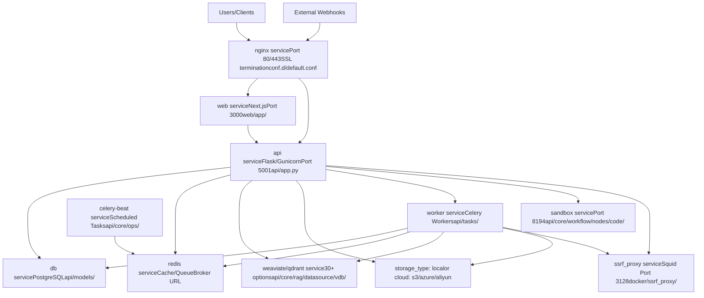
**服务编排：**

平台作为 Docker 服务运行，定义在 [docker/docker-compose.yaml](https://github.com/langgenius/dify/blob/92dbc94f/docker/docker-compose.yaml) 中。同一个 `langgenius/dify-api` 镜像通过 `MODE` 环境变量在不同模式下运行：

| 服务名称 | 镜像 | 模式/端口 | 用途 | 入口点 |
| --- | --- | --- | --- | --- |
| `api` | `langgenius/dify-api:1.11.4` | `MODE=api` 端口 5001 | 带有 Gunicorn 的 Flask API 服务器 | [docker/entrypoint.sh](https://github.com/langgenius/dify/blob/92dbc94f/docker/entrypoint.sh) → [api/app.py](https://github.com/langgenius/dify/blob/92dbc94f/api/app.py) |
| `worker` | `langgenius/dify-api:1.11.4` | `MODE=worker` | Celery 异步任务处理 | [docker/entrypoint.sh](https://github.com/langgenius/dify/blob/92dbc94f/docker/entrypoint.sh) → `celery worker` |
| `worker_beat` | `langgenius/dify-api:1.11.4` | `MODE=beat` | Celery Beat 调度器 | [docker/entrypoint.sh](https://github.com/langgenius/dify/blob/92dbc94f/docker/entrypoint.sh) → `celery beat` |
| `web` | `langgenius/dify-web:1.11.4` | 端口 3000 | Next.js 前端 | [web/docker/entrypoint.sh](https://github.com/langgenius/dify/blob/92dbc94f/web/docker/entrypoint.sh) |
| `db_postgres` | `postgres:15-alpine` | 端口 5432 | PostgreSQL 数据库 | SQLAlchemy 模型位于 [api/models/](https://github.com/langgenius/dify/blob/92dbc94f/api/models/) |
| `redis` | `redis:6-alpine` | 端口 6379 | 缓存和 Celery 消息代理 | `.env` 中的 `CELERY_BROKER_URL` |
| `nginx` | `langgenius/dify-nginx` | 端口 80/443 | 反向代理 | [docker/nginx/conf.d/default.conf](https://github.com/langgenius/dify/blob/92dbc94f/docker/nginx/conf.d/default.conf) |
| `weaviate` | `semitechnologies/weaviate` | 端口 8080 | 向量数据库 (默认) | [api/core/rag/datasource/vdb/weaviate/](https://github.com/langgenius/dify/blob/92dbc94f/api/core/rag/datasource/vdb/weaviate/) |
| `sandbox` | `langgenius/dify-sandbox:0.2.12` | 端口 8194 | 隔离代码执行 | [api/core/workflow/nodes/code/](https://github.com/langgenius/dify/blob/92dbc94f/api/core/workflow/nodes/code/) |
| `plugin_daemon` | `langgenius/dify-plugin-daemon:0.5.2` | 端口 5002 | 插件管理与执行 | [docker/docker-compose.yaml272-334](https://github.com/langgenius/dify/blob/92dbc94f/docker/docker-compose.yaml#L272-L334) |
| `ssrf_proxy` | `ubuntu/squid` | 端口 3128 | SSRF 保护代理 | [docker/ssrf\_proxy/squid.conf.template](https://github.com/langgenius/dify/blob/92dbc94f/docker/ssrf_proxy/squid.conf.template) |

**API 结构：**

[api/app.py](https://github.com/langgenius/dify/blob/92dbc94f/api/app.py) 中的 Flask 应用程序创建了多个蓝图 (blueprints)：

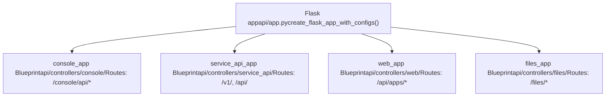
| 蓝图 | URL 前缀 | 认证方式 | 用途 |
| --- | --- | --- | --- |
| `console_app` | `/console/api` | 基于会话 (Session) | 管理员/开发者操作 |
| `service_api_app` | `/v1`, `/api` | API Key Bearer 令牌 | 公共应用执行 API |
| `web_app` | `/api/apps` | 终端用户令牌 | 嵌入式应用界面 |
| `files_app` | `/files` | 签名 URL | 文件下载 |

来源：[docker/docker-compose.yaml1-200](https://github.com/langgenius/dify/blob/92dbc94f/docker/docker-compose.yaml#L1-L200) [docker/entrypoint.sh1-50](https://github.com/langgenius/dify/blob/92dbc94f/docker/entrypoint.sh#L1-L50) [api/app.py1-150](https://github.com/langgenius/dify/blob/92dbc94f/api/app.py#L1-L150) [api/controllers/console/\_\_init\_\_.py1-50](https://github.com/langgenius/dify/blob/92dbc94f/api/controllers/console/__init__.py#L1-L50) [api/controllers/service\_api/\_\_init\_\_.py1-50](https://github.com/langgenius/dify/blob/92dbc94f/api/controllers/service_api/__init__.py#L1-L50)

## 核心数据模型

平台实现了严格的多租户机制，所有主要实体都限定在 `Tenant`（租户）范围内。下图显示了主要的领域模型及其关系：

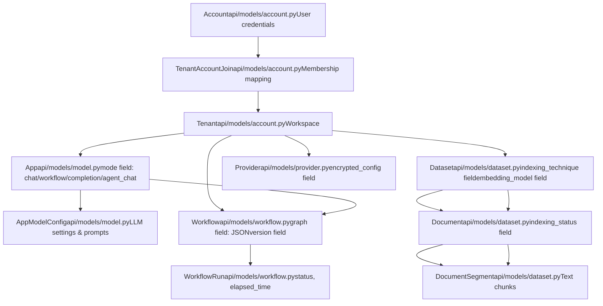
**关键模型结构：**

| 模型类 | 表名 | 关键字段 | 用途 |
| --- | --- | --- | --- |
| `Account` | `accounts` | `email`, `password`, `interface_language` | 用户身份和凭证 |
| `Tenant` | `tenants` | `name`, `encrypt_public_key` | 工作空间/组织容器 |
| `TenantAccountJoin` | `tenant_account_joins` | `tenant_id`, `account_id`, `role`, `current` | 具有 RBAC 角色的成员资格 |
| `App` | `apps` | `tenant_id`, `mode`, `name` | 应用程序实例 |
| `AppModelConfig` | `app_model_configs` | `app_id`, `model`, `configs` | LLM 和提示词设置 |
| `Dataset` | `datasets` | `tenant_id`, `indexing_technique`, `embedding_model` | 知识库配置 |
| `Document` | `documents` | `dataset_id`, `indexing_status`, `data_source_type` | 源文档元数据 |
| `DocumentSegment` | `document_segments` | `document_id`, `content`, `word_count`, `hit_count` | 索引文本块 |
| `Workflow` | `workflows` | `tenant_id`, `app_id`, `graph`, `version` | 工作流图定义 |
| `WorkflowRun` | `workflow_runs` | `workflow_id`, `status`, `inputs`, `outputs`, `elapsed_time` | 执行跟踪 |
| `Provider` | `providers` | `tenant_id`, `provider_name`, `encrypted_config` | 模型提供商凭证 |

有关详细的模型关系和服务层实现，请参阅[核心数据模型与领域实体](/langgenius/dify/2.2-core-data-models-and-domain-entities)。

来源：[api/models/account.py1-200](https://github.com/langgenius/dify/blob/92dbc94f/api/models/account.py#L1-L200) [api/models/model.py1-200](https://github.com/langgenius/dify/blob/92dbc94f/api/models/model.py#L1-L200) [api/models/dataset.py1-300](https://github.com/langgenius/dify/blob/92dbc94f/api/models/dataset.py#L1-L300) [api/models/workflow.py1-200](https://github.com/langgenius/dify/blob/92dbc94f/api/models/workflow.py#L1-L200) [api/models/provider.py1-100](https://github.com/langgenius/dify/blob/92dbc94f/api/models/provider.py#L1-L100)

## 关键特性和能力

### 1\. 工作流系统

工作流是有向无环图 (DAG)，以 JSON 格式存储在 `Workflow.graph` 中。执行引擎是 `GraphEngine`，它在 `GraphEngineState` 中维护状态，并通过 `WorkerPool` 处理节点。

**工作流执行架构：**

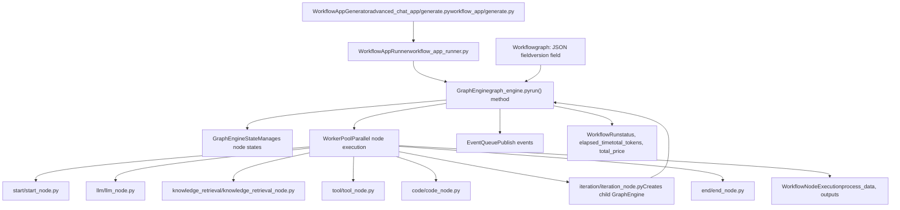
**关键节点类型：**

| 节点类型 | 模块路径 | 执行方法 | 用途 |
| --- | --- | --- | --- |
| Start | [api/core/workflow/nodes/start/start\_node.py](https://github.com/langgenius/dify/blob/92dbc94f/api/core/workflow/nodes/start/start_node.py) | `_run()` | 图入口点 |
| LLM | [api/core/workflow/nodes/llm/llm\_node.py](https://github.com/langgenius/dify/blob/92dbc94f/api/core/workflow/nodes/llm/llm_node.py) | `_run()` | 通过 ModelInstance 生成文本 |
| Knowledge Retrieval | [api/core/workflow/nodes/knowledge\_retrieval/knowledge\_retrieval\_node.py](https://github.com/langgenius/dify/blob/92dbc94f/api/core/workflow/nodes/knowledge_retrieval/knowledge_retrieval_node.py) | `_run()` | 使用 DatasetRetrieval 进行 RAG |
| Code | [api/core/workflow/nodes/code/code\_node.py](https://github.com/langgenius/dify/blob/92dbc94f/api/core/workflow/nodes/code/code_node.py) | `_run()` | CodeExecutor 沙箱中的 Python/JS |
| Tool | [api/core/workflow/nodes/tool/tool\_node.py](https://github.com/langgenius/dify/blob/92dbc94f/api/core/workflow/nodes/tool/tool_node.py) | `_run()` | 调用 ToolRuntime |
| If/Else | [api/core/workflow/nodes/if\_else/if\_else\_node.py](https://github.com/langgenius/dify/blob/92dbc94f/api/core/workflow/nodes/if_else/if_else_node.py) | `_run()` | 条件路由 |
| Iteration | [api/core/workflow/nodes/iteration/iteration\_node.py](https://github.com/langgenius/dify/blob/92dbc94f/api/core/workflow/nodes/iteration/iteration_node.py) | `_run()` | 创建子 GraphEngine 的循环 |
| End | [api/core/workflow/nodes/end/end\_node.py](https://github.com/langgenius/dify/blob/92dbc94f/api/core/workflow/nodes/end/end_node.py) | `_run()` | 图出口点 |

**状态管理：**

位于 [api/core/workflow/graph\_engine/entities/graph\_engine\_state.py](https://github.com/langgenius/dify/blob/92dbc94f/api/core/workflow/graph_engine/entities/graph_engine_state.py) 的 `GraphEngineState` 跟踪：

-   `node_parallel_mapping`：将节点映射到执行队列
-   `node_state_mapping`：跟踪每个节点的 `NodeRunState`
-   `node_run_result_mapping`：存储 `NodeRunResult` 输出

有关详细的工作流执行信息，请参阅[工作流定义与执行模型](/langgenius/dify/5.1-workflow-definition-and-execution-model)。

来源：[api/core/workflow/graph\_engine/graph\_engine.py1-500](https://github.com/langgenius/dify/blob/92dbc94f/api/core/workflow/graph_engine/graph_engine.py#L1-L500) [api/core/workflow/nodes/](https://github.com/langgenius/dify/blob/92dbc94f/api/core/workflow/nodes/) [api/models/workflow.py1-200](https://github.com/langgenius/dify/blob/92dbc94f/api/models/workflow.py#L1-L200) [api/core/app/apps/workflow\_app\_runner.py1-100](https://github.com/langgenius/dify/blob/92dbc94f/api/core/app/apps/workflow_app_runner.py#L1-L100)

### 2\. 全面的模型支持

平台通过 `ModelManager` 和 `ProviderManager` 抽象集成了 100 多个 LLM 模型：

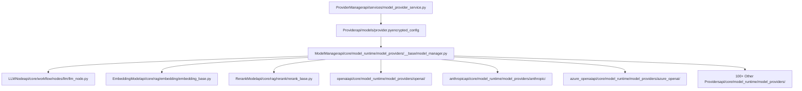
每个提供商都实现了 [api/core/model\_runtime/model\_providers/\_\_base/](https://github.com/langgenius/dify/blob/92dbc94f/api/core/model_runtime/model_providers/__base/) 中定义的标准化接口：

-   `__base/llm_model.py`：文本生成接口
-   `__base/text_embedding_model.py`：嵌入生成接口
-   `__base/rerank_model.py`：重排 (Reranking) 接口
-   `__base/speech2text_model.py`：音频转录接口
-   `__base/text2speech_model.py`：TTS（文本转语音）接口
-   `__base/moderation_model.py`：内容审查接口

有关模型集成的详细信息，请参阅[模型提供商管理](/langgenius/dify/6.3-model-provider-management)。

来源：[README.md90-93](https://github.com/langgenius/dify/blob/92dbc94f/README.md#L90-L93) [api/core/model\_runtime/model\_providers/\_\_base/](https://github.com/langgenius/dify/blob/92dbc94f/api/core/model_runtime/model_providers/__base/) [api/services/model\_provider\_service.py1-200](https://github.com/langgenius/dify/blob/92dbc94f/api/services/model_provider_service.py#L1-L200)

### 3\. RAG 管道

RAG 系统实现了索引 (ETL) 和多种策略的检索：

**索引和检索架构：**

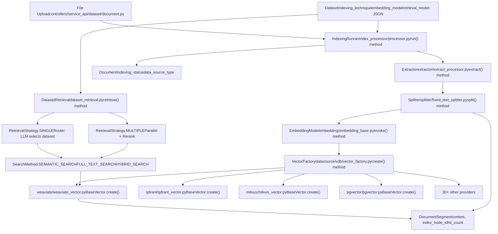
**检索策略：**

`Dataset` 中的 `retrieval_model` 字段定义了检索行为：

| 策略 | 枚举值 | 实现 | 行为 |
| --- | --- | --- | --- |
| Single | `SINGLE_RETRIEVAL` | [api/core/rag/retrieval/router/multi\_dataset\_function\_call\_router.py](https://github.com/langgenius/dify/blob/92dbc94f/api/core/rag/retrieval/router/multi_dataset_function_call_router.py) | LLM 路由到一个数据集 |
| Multiple | `MULTIPLE_RETRIEVAL` | [api/core/rag/retrieval/dataset\_retrieval.py](https://github.com/langgenius/dify/blob/92dbc94f/api/core/rag/retrieval/dataset_retrieval.py) | 并行搜索 + 重排 |

**搜索方法：**

| 方法 | 常量 | 实现位置 |
| --- | --- | --- |
| Semantic | `SEMANTIC_SEARCH` | 通过嵌入进行向量相似度搜索 |
| Full-Text | `FULL_TEXT_SEARCH` | 关键词搜索 (Jieba/BM25) |
| Hybrid | `HYBRID_SEARCH` | 结合语义 + 关键词 |

**向量数据库集成：**

位于 [api/core/rag/datasource/vdb/vector\_factory.py](https://github.com/langgenius/dify/blob/92dbc94f/api/core/rag/datasource/vdb/vector_factory.py) 的 `Vector` 工厂支持 30+ 提供商：

| 提供商 | 模块路径 | 向量类型常量 |
| --- | --- | --- |
| Weaviate | [api/core/rag/datasource/vdb/weaviate/weaviate\_vector.py](https://github.com/langgenius/dify/blob/92dbc94f/api/core/rag/datasource/vdb/weaviate/weaviate_vector.py) | `VectorType.WEAVIATE` |
| Qdrant | [api/core/rag/datasource/vdb/qdrant/qdrant\_vector.py](https://github.com/langgenius/dify/blob/92dbc94f/api/core/rag/datasource/vdb/qdrant/qdrant_vector.py) | `VectorType.QDRANT` |
| Milvus | [api/core/rag/datasource/vdb/milvus/milvus\_vector.py](https://github.com/langgenius/dify/blob/92dbc94f/api/core/rag/datasource/vdb/milvus/milvus_vector.py) | `VectorType.MILVUS` |
| PGVector | [api/core/rag/datasource/vdb/pgvector/pgvector.py](https://github.com/langgenius/dify/blob/92dbc94f/api/core/rag/datasource/vdb/pgvector/pgvector.py) | `VectorType.PGVECTOR` |
| Elasticsearch | [api/core/rag/datasource/vdb/elasticsearch/elasticsearch\_vector.py](https://github.com/langgenius/dify/blob/92dbc94f/api/core/rag/datasource/vdb/elasticsearch/elasticsearch_vector.py) | `VectorType.ELASTICSEARCH` |
| Chroma | [api/core/rag/datasource/vdb/chroma/chroma\_vector.py](https://github.com/langgenius/dify/blob/92dbc94f/api/core/rag/datasource/vdb/chroma/chroma_vector.py) | `VectorType.CHROMA` |
| OpenSearch | [api/core/rag/datasource/vdb/opensearch/opensearch\_vector.py](https://github.com/langgenius/dify/blob/92dbc94f/api/core/rag/datasource/vdb/opensearch/opensearch_vector.py) | `VectorType.OPENSEARCH` |
| OceanBase | [api/core/rag/datasource/vdb/oceanbase/oceanbase\_vector.py](https://github.com/langgenius/dify/blob/92dbc94f/api/core/rag/datasource/vdb/oceanbase/oceanbase_vector.py) | `VectorType.OCEANBASE` |

每个都实现了 [api/core/rag/datasource/vdb/vector\_base.py](https://github.com/langgenius/dify/blob/92dbc94f/api/core/rag/datasource/vdb/vector_base.py) 中的 `BaseVector` 接口，包含以下方法：

-   `create()`: 索引文档
-   `add_texts()`: 添加文档片段
-   `search_by_vector()`: 向量相似度搜索
-   `search_by_full_text()`: 关键词搜索
-   `delete()`: 删除索引文档

有关全面的 RAG 文档，请参阅[知识库与 RAG 系统](/langgenius/dify/4-knowledge-base-and-rag-system)。

来源：[api/core/rag/index\_processor/processor.py1-500](https://github.com/langgenius/dify/blob/92dbc94f/api/core/rag/index_processor/processor.py#L1-L500) [api/core/rag/retrieval/dataset\_retrieval.py1-400](https://github.com/langgenius/dify/blob/92dbc94f/api/core/rag/retrieval/dataset_retrieval.py#L1-L400) [api/core/rag/datasource/vdb/vector\_factory.py38-164](https://github.com/langgenius/dify/blob/92dbc94f/api/core/rag/datasource/vdb/vector_factory.py#L38-L164) [api/core/rag/datasource/vdb/vector\_type.py1-37](https://github.com/langgenius/dify/blob/92dbc94f/api/core/rag/datasource/vdb/vector_type.py#L1-L37) [api/models/dataset.py1-300](https://github.com/langgenius/dify/blob/92dbc94f/api/models/dataset.py#L1-L300)

### 4\. Agent 能力

平台通过 `ToolManager` 单例提供工具，并通过 agent 运行时调用它们：

**工具系统架构：**

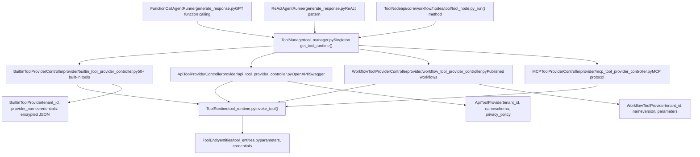
**内置工具类别：**

工具位于 [api/core/tools/provider/builtin/](https://github.com/langgenius/dify/blob/92dbc94f/api/core/tools/provider/builtin/)，每个提供商在一个子目录中：

| 类别 | 提供商名称 | 关键工具 | 位置 |
| --- | --- | --- | --- |
| 搜索 | `google` | Google Search, News | [api/core/tools/provider/builtin/google/](https://github.com/langgenius/dify/blob/92dbc94f/api/core/tools/provider/builtin/google/) |
| 图像生成 | `dalle`, `stable_diffusion` | DALL-E 3, SD API | [api/core/tools/provider/builtin/dalle/](https://github.com/langgenius/dify/blob/92dbc94f/api/core/tools/provider/builtin/dalle/) |
| 知识 | `wikipedia`, `wolfram` | Wikipedia 搜索, WolframAlpha | [api/core/tools/provider/builtin/wikipedia/](https://github.com/langgenius/dify/blob/92dbc94f/api/core/tools/provider/builtin/wikipedia/) |
| 生产力 | `gmail`, `google_calendar` | 邮件, 日历管理 | [api/core/tools/provider/builtin/gmail/](https://github.com/langgenius/dify/blob/92dbc94f/api/core/tools/provider/builtin/gmail/) |
| 开发 | `github`, `gitlab` | 仓库管理 | [api/core/tools/provider/builtin/github/](https://github.com/langgenius/dify/blob/92dbc94f/api/core/tools/provider/builtin/github/) |
| 天气 | `yahoo_weather` | 天气预报 | [api/core/tools/provider/builtin/yahoo\_weather/](https://github.com/langgenius/dify/blob/92dbc94f/api/core/tools/provider/builtin/yahoo_weather/) |

每个工具提供商包含：

-   `<provider>.yaml`: 提供商清单，包含显示名称、图标、凭证
-   `tools/<tool_name>.yaml`: 工具定义，包含参数和输出
-   `tools/<tool_name>.py`: 工具实现类，包含 `_invoke()` 方法

**Agent 执行：**

位于 [api/core/app/apps/agent\_chat/generate\_response.py](https://github.com/langgenius/dify/blob/92dbc94f/api/core/app/apps/agent_chat/generate_response.py) 中的 Agents 通过以下方式调用工具：

1.  LLM 决定调用哪个工具（函数调用或 ReAct 模式）
2.  `ToolManager.get_tool_runtime()` 获取 `ToolRuntime`
3.  `ToolRuntime.invoke_tool()` 使用凭证和参数执行
4.  结果返回给 agent 进行下一次迭代

有关工具系统的详细信息，请参阅[工具提供商架构](/langgenius/dify/6.1-tool-provider-architecture)。

来源：[README.md101-102](https://github.com/langgenius/dify/blob/92dbc94f/README.md#L101-L102) [api/core/tools/tool\_manager.py1-200](https://github.com/langgenius/dify/blob/92dbc94f/api/core/tools/tool_manager.py#L1-L200) [api/core/tools/provider/builtin/](https://github.com/langgenius/dify/blob/92dbc94f/api/core/tools/provider/builtin/) [api/core/app/apps/agent\_chat/generate\_response.py1-500](https://github.com/langgenius/dify/blob/92dbc94f/api/core/app/apps/agent_chat/generate_response.py#L1-L500)

### 5\. 后端即服务 (Backend-as-a-Service) API

所有功能都通过 REST API 暴露，具有双重响应模式：

**API 端点：**

| 端点 | 蓝图 | 用途 |
| --- | --- | --- |
| `POST /api/chat-messages` | [api/controllers/service\_api/app/chat.py](https://github.com/langgenius/dify/blob/92dbc94f/api/controllers/service_api/app/chat.py) | 发送聊天消息 |
| `POST /api/completion-messages` | [api/controllers/service\_api/app/completion.py](https://github.com/langgenius/dify/blob/92dbc94f/api/controllers/service_api/app/completion.py) | 文本补全 |
| `POST /api/workflows/run` | [api/controllers/service\_api/workflow/workflow.py](https://github.com/langgenius/dify/blob/92dbc94f/api/controllers/service_api/workflow/workflow.py) | 执行工作流 |
| `POST /api/files/upload` | [api/controllers/service\_api/file/file.py](https://github.com/langgenius/dify/blob/92dbc94f/api/controllers/service_api/file/file.py) | 上传文件 |
| `POST /api/messages/:id/feedbacks` | [api/controllers/service\_api/app/message.py](https://github.com/langgenius/dify/blob/92dbc94f/api/controllers/service_api/app/message.py) | 提交反馈 |

**响应模式：**

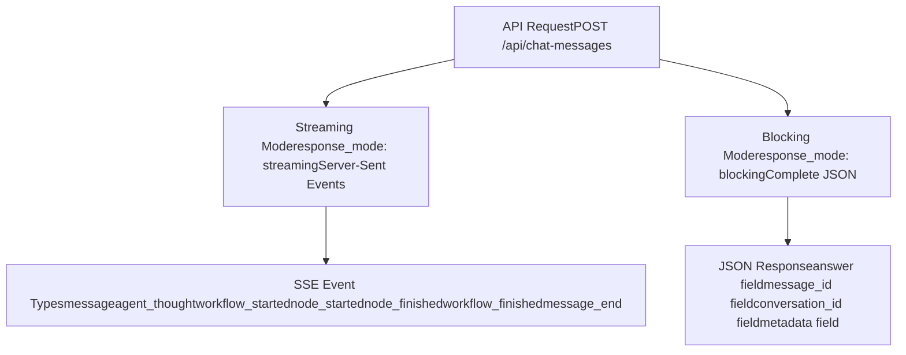
有关 API 集成模式，请参阅[服务 API](/langgenius/dify/8-service-apis)。

来源：[README.md107-108](https://github.com/langgenius/dify/blob/92dbc94f/README.md#L107-L108) [api/controllers/service\_api/](https://github.com/langgenius/dify/blob/92dbc94f/api/controllers/service_api/)

### 6\. LLMOps 与可观测性

平台在多个层级跟踪详细指标：

**执行跟踪：**

| 模型 | 跟踪指标 | 位置 |
| --- | --- | --- |
| `WorkflowRun` | `total_tokens`, `total_price`, `elapsed_time`, `status` | [api/models/workflow.py](https://github.com/langgenius/dify/blob/92dbc94f/api/models/workflow.py) |
| `WorkflowNodeExecution` | `process_data`, `outputs`, `execution_metadata` | [api/models/workflow.py](https://github.com/langgenius/dify/blob/92dbc94f/api/models/workflow.py) |
| `Message` | `message_tokens`, `message_unit_price`, `message_price_unit` | [api/models/model.py](https://github.com/langgenius/dify/blob/92dbc94f/api/models/model.py) |
| `MessageFeedback` | `rating`, `content` | [api/models/model.py](https://github.com/langgenius/dify/blob/92dbc94f/api/models/model.py) |
| `MessageAnnotation` | `content`, `question`, `hit_count` | [api/models/model.py](https://github.com/langgenius/dify/blob/92dbc94f/api/models/model.py) |

**监控集成：**

Grafana 仪表板可以连接到 PostgreSQL 数据库以可视化指标。`MessageAnnotation` 模型通过存储管理员更正内容来支持持续改进，这些更正内容可用于微调。

有关可观测性详情，请参阅[可观测性与监控](/langgenius/dify/3.3-storage-and-vector-database-configuration)。

来源：[README.md104-105](https://github.com/langgenius/dify/blob/92dbc94f/README.md#L104-L105) [api/models/workflow.py200-400](https://github.com/langgenius/dify/blob/92dbc94f/api/models/workflow.py#L200-L400) [api/models/model.py500-700](https://github.com/langgenius/dify/blob/92dbc94f/api/models/model.py#L500-L700)

## 部署选项

### 使用 Docker Compose 快速开始

**最低系统要求：**

| 资源 | 要求 |
| --- | --- |
| CPU | \>= 2 Core |
| RAM | \>= 4 GiB |
| 磁盘 | \>= 10 GiB (对于数据集需要更多) |
| Docker | \>= 20.10 |
| Docker Compose | \>= 2.0 |

**部署命令：**

```
cd dify
cd docker
cp .env.example .env
docker compose up -d
```
部署后，访问 `http://localhost/install` 仪表板开始初始化。

**网络拓扑：**

Nginx 反向代理根据 [docker/nginx/conf.d/default.conf](https://github.com/langgenius/dify/blob/92dbc94f/docker/nginx/conf.d/default.conf) 中定义的路径前缀路由请求：

| URL 模式 | 上游服务 | 目标端口 | 用途 |
| --- | --- | --- | --- |
| `/` | `web:3000` | 3000 | Next.js 前端 |
| `/console/api` | `api:5001` | 5001 | Console API |
| `/api` | `api:5001` | 5001 | Service API |
| `/v1` | `api:5001` | 5001 | Service API (兼容 OpenAI) |
| `/files` | `api:5001` | 5001 | 文件下载 |

**服务端口映射：**

| 服务 | 容器端口 | 主机端口 (暴露) | 描述 |
| --- | --- | --- | --- |
| `nginx` | 80, 443 | 80, 443 | 公共 HTTP/HTTPS |
| `api` | 5001 | \- | 仅内部 |
| `web` | 3000 | \- | 仅内部 |
| `db` | 5432 | 5432 (可选) | PostgreSQL 直接访问 |
| `redis` | 6379 | 6379 (可选) | Redis 直接访问 |
| `weaviate` | 8080 | 8080 (可选) | 向量 DB 管理 |
| `sandbox` | 8194 | \- | 仅内部 |
| `ssrf_proxy` | 3128 | \- | 仅内部 |

有关部署详细信息，请参阅[服务拓扑与 Docker Compose](/langgenius/dify/2.1-service-topology-and-docker-compose)。

来源：[README.md59-77](https://github.com/langgenius/dify/blob/92dbc94f/README.md#L59-L77) [docker/docker-compose.yaml1-500](https://github.com/langgenius/dify/blob/92dbc94f/docker/docker-compose.yaml#L1-L500) [docker/nginx/conf.d/default.conf1-100](https://github.com/langgenius/dify/blob/92dbc94f/docker/nginx/conf.d/default.conf#L1-L100)

### 高级部署选项

**云和企业级：**

| 选项 | 用例 | 链接 |
| --- | --- | --- |
| Dify Cloud | 零设置，托管服务 | [https://dify.ai](https://dify.ai) |
| 自托管 (Self-Hosted) | 完全控制，自定义基础设施 | [快速开始](https://github.com/langgenius/dify/blob/92dbc94f/Quick Start) |
| AWS Marketplace | Dify Premium AMI | AWS Marketplace 列表 |
| 企业版 (Enterprise) | 自定义品牌，支持 | 联系 [business@dify.ai](mailto:business@dify.ai) |

**基础设施即代码 (IaC)：**

平台支持通过以下方式部署：

-   **Kubernetes**: Helm Charts 实现高可用性
-   **Terraform**: 适用于 Azure, Google Cloud 的模块
-   **AWS CDK**: EKS 和 ECS 部署
-   **Alibaba Cloud**: 计算巢 (Computing Nest) 集成

有关高级部署，请参阅[部署和运维](/langgenius/dify/3-deployment-and-operations)。

来源：[README.md110-185](https://github.com/langgenius/dify/blob/92dbc94f/README.md#L110-L185)

## 配置系统

配置从环境变量流向基于 Pydantic 的验证系统：

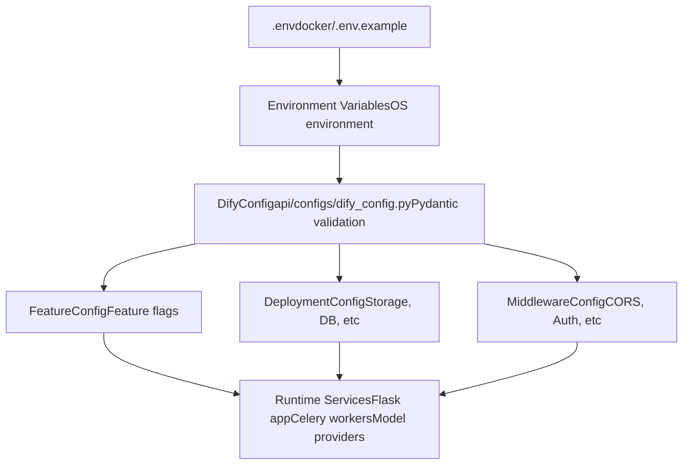
**关键配置类别：**

| 类别 | 环境变量 | 用途 |
| --- | --- | --- |
| 版本 | `EDITION` | `SELF_HOSTED`, `CLOUD`, 或 `ENTERPRISE` |
| 存储 | `STORAGE_TYPE`, `S3_*`, `AZURE_*` | 文件存储后端 |
| 向量 DB | `VECTOR_STORE`, 提供商特定变量 | 向量数据库选择 |
| 数据库 | `DB_*`, `CELERY_BROKER_URL` | PostgreSQL 和 Redis 连接 |
| 安全 | `SECRET_KEY`, `CONSOLE_API_URL` | 加密和 CORS |
| 模型 | `MODEL_PROVIDER_*` | 默认模型提供商 API 密钥 |
| 可观测性 | `LOG_LEVEL`, `SENTRY_DSN` | 日志和错误跟踪 |

配置定义在 [api/configs/dify\_config.py](https://github.com/langgenius/dify/blob/92dbc94f/api/configs/dify_config.py) 中并在启动时验证。无效的配置会导致应用程序快速失败并提供详细的错误消息。

有关配置详情，请参阅[配置系统](/langgenius/dify/2.3-application-types-and-execution-modes)和[环境配置](/langgenius/dify/3.2-environment-configuration-and-runtime-modes)。

来源：[docker/.env.example1-500](https://github.com/langgenius/dify/blob/92dbc94f/docker/.env.example#L1-L500) [api/configs/dify\_config.py1-200](https://github.com/langgenius/dify/blob/92dbc94f/api/configs/dify_config.py#L1-L200)

## 多租户与安全

### 租户隔离

所有资源都通过 `tenant_id` 外键进行范围限定，并在服务层强制执行：

**多租户数据模型：**

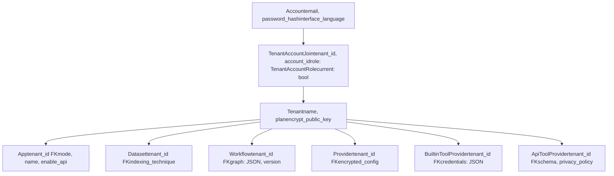
### 基于角色的访问控制 (RBAC)

[api/models/account.py](https://github.com/langgenius/dify/blob/92dbc94f/api/models/account.py) 中的 `TenantAccountRole` 枚举定义了 5 种角色：

| 角色常量 | 数据库值 | 权限 | 服务层检查 |
| --- | --- | --- | --- |
| `TenantAccountRole.OWNER` | `'owner'` | 完全控制，转移所有权 | `AccountService._check_role()` |
| `TenantAccountRole.ADMIN` | `'admin'` | 用户/团队管理 | `@cloud_edition_billing_resource_check` |
| `TenantAccountRole.EDITOR` | `'editor'` | 创建/编辑应用和工作流 | Controller 装饰器 |
| `TenantAccountRole.NORMAL` | `'normal'` | 仅查看访问 | 只读端点 |
| `TenantAccountRole.DATASET_OPERATOR` | `'dataset_operator'` | 仅数据集管理 | `DatasetService` 角色检查 |

### 认证流程

**基于会话的认证 (Console API)：**

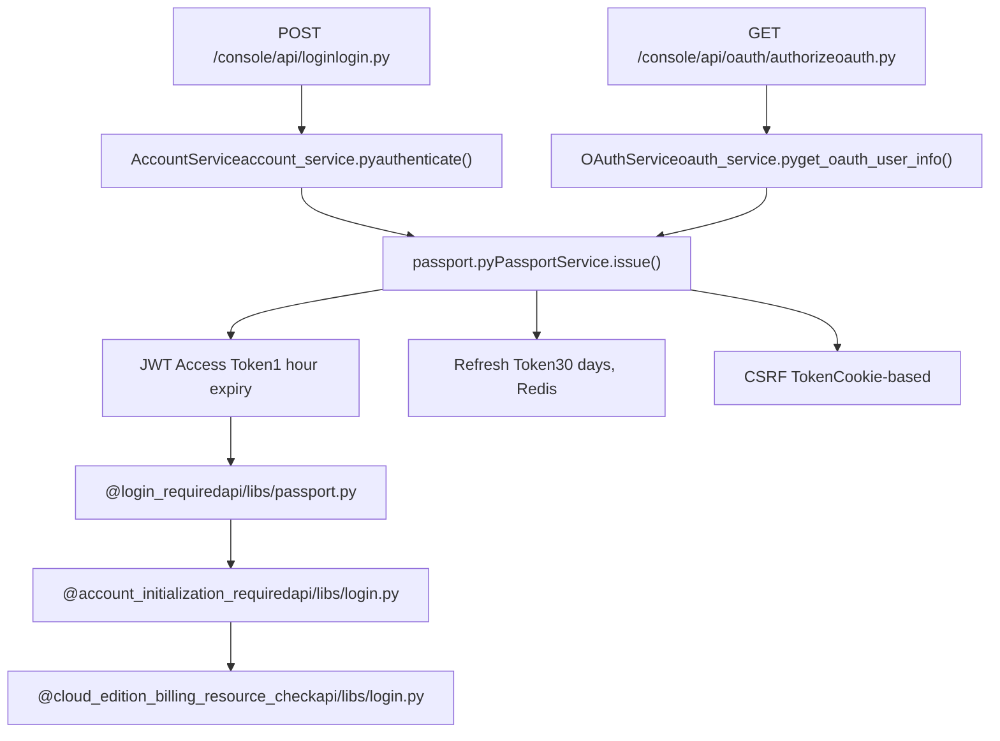
**API Key 认证 (Service API)：**

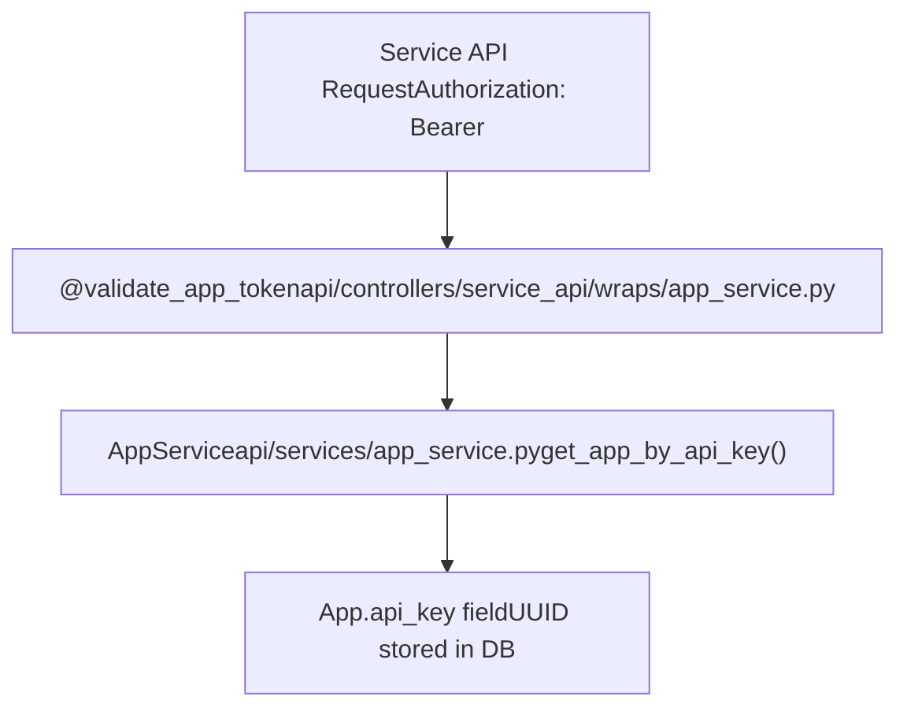
**安全特性：**

| 特性 | 实现文件 | 行为 |
| --- | --- | --- |
| 速率限制 (Rate Limiting) | [api/services/account\_service.py](https://github.com/langgenius/dify/blob/92dbc94f/api/services/account_service.py) | 5 次登录失败将锁定账户 24 小时 |
| 凭证加密 | [api/core/helper/encrypter.py](https://github.com/langgenius/dify/blob/92dbc94f/api/core/helper/encrypter.py) | 使用租户的 `encrypt_public_key` 进行 AES 加密 |
| OAuth 提供商 | [api/controllers/console/auth/oauth.py](https://github.com/langgenius/dify/blob/92dbc94f/api/controllers/console/auth/oauth.py) | 通过 `OAuthService` 支持 GitHub, Google |
| CSRF 保护 | [api/libs/passport.py](https://github.com/langgenius/dify/blob/92dbc94f/api/libs/passport.py) | `PassportService._generate_csrf_token()` |
| 密码哈希 | [api/libs/password.py](https://github.com/langgenius/dify/blob/92dbc94f/api/libs/password.py) | 通过 `hash_password()` / `compare_password()` 使用 bcrypt |

有关全面的安全文档，请参阅[认证与授权](/langgenius/dify/7-multi-tenancy-and-authorization)。

来源：[api/models/account.py1-300](https://github.com/langgenius/dify/blob/92dbc94f/api/models/account.py#L1-L300) [api/services/account\_service.py1-500](https://github.com/langgenius/dify/blob/92dbc94f/api/services/account_service.py#L1-L500) [api/libs/passport.py1-300](https://github.com/langgenius/dify/blob/92dbc94f/api/libs/passport.py#L1-L300) [api/libs/login.py1-200](https://github.com/langgenius/dify/blob/92dbc94f/api/libs/login.py#L1-L200) [api/core/helper/encrypter.py1-100](https://github.com/langgenius/dify/blob/92dbc94f/api/core/helper/encrypter.py#L1-L100)

## 开发与扩展

### API 集成

Service API 提供了对所有功能的编程访问：

**端点结构：**

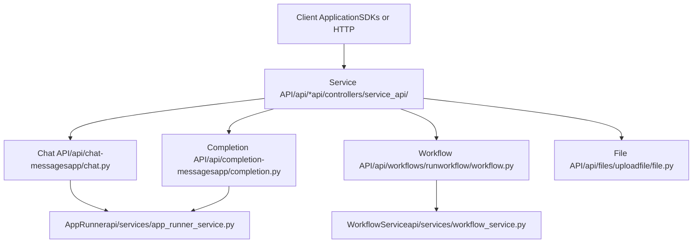
**认证：**

-   `Authorization: Bearer <token>` 头部中的 API Key
-   配置在 `App` 模型的 `api_key` 字段中
-   通过 `api_based_extension_required` 装饰器进行验证

有关 API 详情，请参阅[服务 API](/langgenius/dify/8-service-apis)。

来源：[api/controllers/service\_api/](https://github.com/langgenius/dify/blob/92dbc94f/api/controllers/service_api/)

### 工具开发

开发者可以使用自定义工具扩展 Dify：

**内置工具示例：**

内置工具定义在 [api/core/tools/provider/builtin/](https://github.com/langgenius/dify/blob/92dbc94f/api/core/tools/provider/builtin/) 中，结构如下：

```
builtin/
├── google/
│   ├── google.yaml          # 提供商清单
│   ├── tools/
│   │   ├── google_search.yaml   # 工具定义
│   │   └── google_search.py     # 工具实现
```
**自定义 API 工具：**

API 工具通过上传 OpenAPI/Swagger 规范在控制台 UI 中创建。`ApiToolProviderController` 解析规范并创建 `ApiToolProvider` 记录。

**工作流工具：**

任何发布的工作流都可以通过 `WorkflowToolProviderController` 引用作为工具使用。

有关工具开发，请参阅[工具与插件系统](/langgenius/dify/6-tool-and-plugin-system)。

来源：[api/core/tools/provider/builtin/](https://github.com/langgenius/dify/blob/92dbc94f/api/core/tools/provider/builtin/) [api/core/tools/provider/api\_tool\_provider\_controller.py1-200](https://github.com/langgenius/dify/blob/92dbc94f/api/core/tools/provider/api_tool_provider_controller.py#L1-L200)

## 下一步

本简介确立了 Dify 的基础概念。深入探索特定子系统：

-   **架构**：[系统架构概览](/langgenius/dify/2-system-architecture-overview) 了解组件交互模式
-   **部署**：[部署和运维](/langgenius/dify/3-deployment-and-operations) 了解基础设施设置
-   **知识库**：[知识库与 RAG 系统](/langgenius/dify/4-knowledge-base-and-rag-system) 了解文档处理和检索
-   **工作流**：[工作流系统与节点执行](/langgenius/dify/5-workflow-system-and-node-execution) 了解工作流引擎内部机制
-   **工具**：[工具与插件系统](/langgenius/dify/6-tool-and-plugin-system) 了解扩展功能
-   **安全**：[多租户与授权](/langgenius/dify/7-multi-tenancy-and-authorization) 了解认证和多租户
-   **API**：[服务 API](/langgenius/dify/8-service-apis) 了解集成模式
-   **前端**：[Web 前端架构](/langgenius/dify/9-web-frontend-architecture) 了解 UI 组件

获取社区支持，请查看 [GitHub 仓库](https://github.com/langgenius/dify/blob/92dbc94f/GitHub repository)、[Discord](https://discord.gg/FngNHpbcY7) 和 [文档](https://docs.dify.ai)。

来源：[README.md193-199](https://github.com/langgenius/dify/blob/92dbc94f/README.md#L193-L199)
