# 开发与 CI/CD

相关源文件

-   [.github/workflows/api-tests.yml](https://github.com/langgenius/dify/blob/92dbc94f/.github/workflows/api-tests.yml)
-   [.github/workflows/autofix.yml](https://github.com/langgenius/dify/blob/92dbc94f/.github/workflows/autofix.yml)
-   [.github/workflows/build-push.yml](https://github.com/langgenius/dify/blob/92dbc94f/.github/workflows/build-push.yml)
-   [.github/workflows/db-migration-test.yml](https://github.com/langgenius/dify/blob/92dbc94f/.github/workflows/db-migration-test.yml)
-   [.github/workflows/deploy-agent-dev.yml](https://github.com/langgenius/dify/blob/92dbc94f/.github/workflows/deploy-agent-dev.yml)
-   [.github/workflows/deploy-dev.yml](https://github.com/langgenius/dify/blob/92dbc94f/.github/workflows/deploy-dev.yml)
-   [.github/workflows/deploy-hitl.yml](https://github.com/langgenius/dify/blob/92dbc94f/.github/workflows/deploy-hitl.yml)
-   [.github/workflows/docker-build.yml](https://github.com/langgenius/dify/blob/92dbc94f/.github/workflows/docker-build.yml)
-   [.github/workflows/main-ci.yml](https://github.com/langgenius/dify/blob/92dbc94f/.github/workflows/main-ci.yml)
-   [.github/workflows/stale.yml](https://github.com/langgenius/dify/blob/92dbc94f/.github/workflows/stale.yml)
-   [.github/workflows/style.yml](https://github.com/langgenius/dify/blob/92dbc94f/.github/workflows/style.yml)
-   [.github/workflows/tool-test-sdks.yaml](https://github.com/langgenius/dify/blob/92dbc94f/.github/workflows/tool-test-sdks.yaml)
-   [.github/workflows/translate-i18n-claude.yml](https://github.com/langgenius/dify/blob/92dbc94f/.github/workflows/translate-i18n-claude.yml)
-   [.github/workflows/trigger-i18n-sync.yml](https://github.com/langgenius/dify/blob/92dbc94f/.github/workflows/trigger-i18n-sync.yml)
-   [.github/workflows/vdb-tests.yml](https://github.com/langgenius/dify/blob/92dbc94f/.github/workflows/vdb-tests.yml)
-   [.github/workflows/web-tests.yml](https://github.com/langgenius/dify/blob/92dbc94f/.github/workflows/web-tests.yml)
-   [api/Dockerfile](https://github.com/langgenius/dify/blob/92dbc94f/api/Dockerfile)
-   [api/migrations/README](https://github.com/langgenius/dify/blob/92dbc94f/api/migrations/README)
-   [web/.nvmrc](https://github.com/langgenius/dify/blob/92dbc94f/web/.nvmrc)
-   [web/Dockerfile](https://github.com/langgenius/dify/blob/92dbc94f/web/Dockerfile)
-   [web/README.md](https://github.com/langgenius/dify/blob/92dbc94f/web/README.md)
-   [web/i18n-config/README.md](https://github.com/langgenius/dify/blob/92dbc94f/web/i18n-config/README.md)

本页面记录了 Dify 平台的开发环境设置、持续集成/部署 (CI/CD) 管道以及代码质量标准。涵盖了本地开发工作流、自动化测试基础设施以及构建/发布流程。

有关部署配置详情，请参阅[环境配置与运行模式](/langgenius/dify/3.2-environment-configuration-and-runtime-modes)。有关前端特定测试，请参阅[测试策略与质量保证](/langgenius/dify/9.4-chat-ui-components-and-audio-features)。

---

## 开发环境设置

Dify 提供多种开发环境选项：用于容器化开发的 DevContainer，带有中间件服务的本地设置，以及 VS Code 的调试配置。

### DevContainer 配置

DevContainer 提供了一个预配置的 Python 3.12 环境，安装了所有依赖项。容器定义在 [.devcontainer/devcontainer.json1-49](https://github.com/langgenius/dify/blob/92dbc94f/.devcontainer/devcontainer.json#L1-L49) 中，并使用位于 [.devcontainer/Dockerfile1-4](https://github.com/langgenius/dify/blob/92dbc94f/.devcontainer/Dockerfile#L1-L4) 的自定义 Dockerfile。

**DevContainer 规范：**

| 组件 | 配置 |
| --- | --- |
| 基础镜像 | `mcr.microsoft.com/devcontainers/python:3.12-bookworm` |
| Node.js | 通过 `devcontainers/features/node` 安装 LTS 版本 |
| Docker | 启用 Docker-in-Docker 并支持 Buildx |
| Python 包 | `gmpy2` 依赖项 (`libgmp-dev`, `libmpfr-dev`, `libmpc-dev`) |
| 卷挂载 | `/tmp` 挂载为持久卷 (`dify-dev-tmp`) |
| VS Code 扩展 | `ms-python.pylint`, `GitHub.copilot`, `ms-python.python` |

**容器生命周期：**

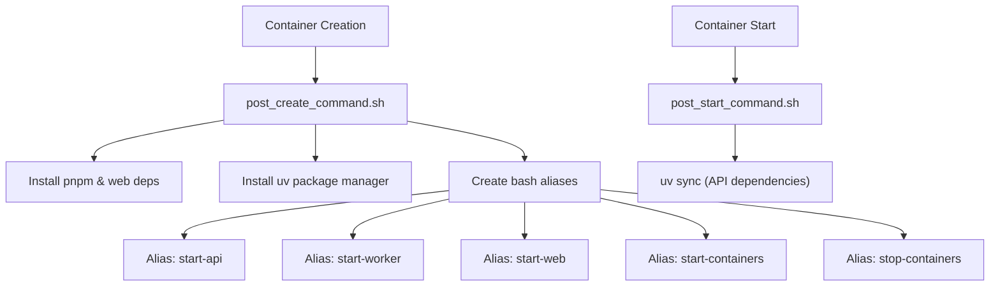
设置脚本创建了方便开发的别名：

-   `start-api`: 在端口 5001 启动 Flask 开发服务器
-   `start-worker`: 启动带有所有队列的 Celery worker
-   `start-web`: 在端口 3000 运行 Next.js 开发服务器
-   `start-containers`: 启动中间件服务 (PostgreSQL, Redis, Weaviate)
-   `stop-containers`: 停止中间件服务

**来源：** [.devcontainer/devcontainer.json1-49](https://github.com/langgenius/dify/blob/92dbc94f/.devcontainer/devcontainer.json#L1-L49) [.devcontainer/Dockerfile1-4](https://github.com/langgenius/dify/blob/92dbc94f/.devcontainer/Dockerfile#L1-L4) [.devcontainer/post\_create\_command.sh1-16](https://github.com/langgenius/dify/blob/92dbc94f/.devcontainer/post_create_command.sh#L1-L16) [.devcontainer/post\_start\_command.sh1-3](https://github.com/langgenius/dify/blob/92dbc94f/.devcontainer/post_start_command.sh#L1-L3)

### 本地开发工作流

对于不使用 DevContainer 的本地开发，设置需要手动安装依赖项和编排中间件。

**API 服务设置：**

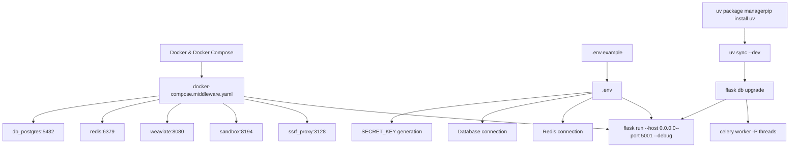
**Web 服务设置：**

Web 服务需要 Node.js 22 和 pnpm 包管理器：

1.  安装 pnpm: `corepack enable && corepack install`
2.  安装依赖项: `pnpm install --frozen-lockfile`
3.  配置环境: 复制 [web/.env.example1-79](https://github.com/langgenius/dify/blob/92dbc94f/web/.env.example#L1-L79) 到 `.env`
4.  启动开发服务器: `pnpm dev` (端口 3000)

**环境变量：**

| 类别 | 关键变量 | 用途 |
| --- | --- | --- |
| API Backend | `CONSOLE_API_URL`, `SERVICE_API_URL` | API 端点 URL |
| Database | `DB_TYPE`, `DB_HOST`, `DB_PORT`, `DB_USERNAME`, `DB_PASSWORD` | 数据库连接 |
| Cache | `REDIS_HOST`, `REDIS_PORT`, `CELERY_BROKER_URL` | Redis 配置 |
| Storage | `STORAGE_TYPE`, `S3_BUCKET_NAME`, `OPENDAL_SCHEME` | 文件存储后端 |
| Vector DB | `VECTOR_STORE`, `WEAVIATE_ENDPOINT` | 向量数据库选择 |
| Security | `SECRET_KEY`, `COOKIE_DOMAIN` | 认证与 Cookie |

**来源：** [api/README.md1-117](https://github.com/langgenius/dify/blob/92dbc94f/api/README.md#L1-L117) [api/.env.example](https://github.com/langgenius/dify/blob/92dbc94f/api/.env.example) [web/.env.example1-79](https://github.com/langgenius/dify/blob/92dbc94f/web/.env.example#L1-L79) [.devcontainer/post\_create\_command.sh9-14](https://github.com/langgenius/dify/blob/92dbc94f/.devcontainer/post_create_command.sh#L9-L14)

### 调试配置

提供了 VS Code 启动配置，用于调试 API、worker 和 web 服务。

**启动配置模板：**

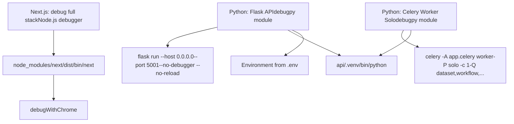
Celery worker 必须使用 `-P solo` 池模式以兼容调试，因为默认的 `gevent` 或 `threads` 池与调试器配合不佳。

**来源：** [.vscode/launch.json.template1-66](https://github.com/langgenius/dify/blob/92dbc94f/.vscode/launch.json.template#L1-L66) [.devcontainer/post\_create\_command.sh9-10](https://github.com/langgenius/dify/blob/92dbc94f/.devcontainer/post_create_command.sh#L9-L10)

### 开发脚本

`dev/` 目录提供了用于启动服务的便捷脚本：

**API 服务脚本：**

[dev/start-api1-11](https://github.com/langgenius/dify/blob/92dbc94f/dev/start-api#L1-L11) 提供了一个简单的包装器，围绕 `uv run flask run` 启用调试并在端口 5001 运行。

**Worker 服务脚本：**

[dev/start-worker1-129](https://github.com/langgenius/dify/blob/92dbc94f/dev/start-worker#L1-L129) 提供了一个复杂的 worker 启动脚本，支持可配置的队列、并发和池类型：

```
# 启动数据集队列 worker，2 个进程
./dev/start-worker --queues dataset --concurrency 2

# 为云版启动工作流 workers
./dev/start-worker --queues workflow_professional,workflow_team --concurrency 4

# 使用 prefork 池代替 gevent
./dev/start-worker --queues dataset --pool prefork
```
可用的队列类型包括：

-   `dataset`, `priority_dataset`: RAG 索引和文档处理
-   `workflow`, `workflow_professional`, `workflow_team`, `workflow_sandbox`: 工作流执行层级
-   `schedule_poller`, `schedule_executor`: 计划任务管理
-   `triggered_workflow_dispatcher`, `trigger_refresh_executor`: 触发器处理
-   `mail`, `ops_trace`, `app_deletion`, `plugin`, `conversation`, `retention`: 支持服务

**来源：** [dev/start-api1-11](https://github.com/langgenius/dify/blob/92dbc94f/dev/start-api#L1-L11) [dev/start-worker1-129](https://github.com/langgenius/dify/blob/92dbc94f/dev/start-worker#L1-L129) [api/docker/entrypoint.sh20-68](https://github.com/langgenius/dify/blob/92dbc94f/api/docker/entrypoint.sh#L20-L68)

---

## CI/CD 管道架构

CI/CD 系统使用 GitHub Actions，采用 hub-and-spoke（中心辐射）架构，其中主编排工作流根据更改的文件委托给专门的测试工作流。

### 管道编排

**主 CI 工作流结构：**

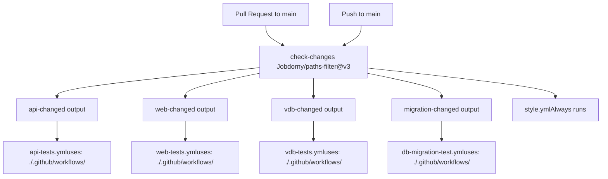
**路径过滤器配置：**

`check-changes` 任务使用 `dorny/paths-filter@v3` 检测特定路径中的更改：

| 过滤器 ID | 路径 | 触发工作流 |
| --- | --- | --- |
| `api` | `api/**`, `docker/**`, `.github/workflows/api-tests.yml` | `api-tests.yml` |
| `web` | `web/**`, `.github/workflows/web-tests.yml` | `web-tests.yml` |
| `vdb` | `api/core/rag/datasource/**`, `docker/**`, `api/uv.lock`, `api/pyproject.toml` | `vdb-tests.yml` |
| `migration` | `api/migrations/**`, `.github/workflows/db-migration-test.yml` | `db-migration-test.yml` |

**来源：** [.github/workflows/main-ci.yml1-80](https://github.com/langgenius/dify/blob/92dbc94f/.github/workflows/main-ci.yml#L1-L80)

### API 测试管道

API 测试工作流在 Python 3.11 和 3.12 上运行带有覆盖率报告的 pytest。

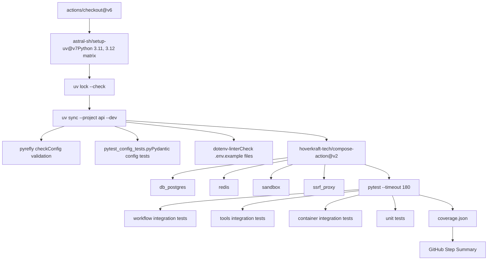
**测试类别：**

pytest 执行针对特定的测试目录：

-   `api/tests/integration_tests/workflow`: 工作流引擎集成测试
-   `api/tests/integration_tests/tools`: 工具提供商集成测试
-   `api/tests/test_containers_integration_tests`: 基于容器的集成测试
-   `api/tests/unit_tests`: 核心逻辑的单元测试

**覆盖率报告：**

工作流生成 JSON 格式的覆盖率报告，并在 GitHub Actions 摘要中显示：

-   总覆盖率百分比
-   每个文件的覆盖率，最低覆盖率的文件高亮显示
-   在可展开部分中显示行级覆盖率详细信息

**来源：** [.github/workflows/api-tests.yml1-105](https://github.com/langgenius/dify/blob/92dbc94f/.github/workflows/api-tests.yml#L1-L105)

### Web 测试管道

Web 测试工作流使用 Vitest 进行组件测试，并提供 Istanbul 覆盖率报告。

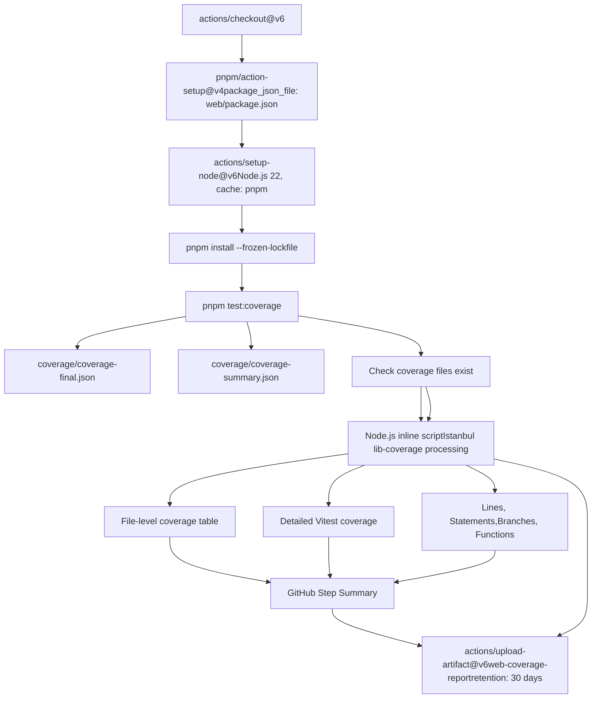
**覆盖率报告格式：**

工作流生成一个全面的覆盖率表，显示：

-   总体指标（语句、分支、函数、行）
-   按覆盖率百分比排序的每个文件细分（最低的在最前）
-   未覆盖行号格式化为范围（例如，“10-15,20”）
-   “所有文件”汇总行，显示聚合指标

位于 [.github/workflows/web-tests.yml62-359](https://github.com/langgenius/dify/blob/92dbc94f/.github/workflows/web-tests.yml#L62-L359) 的内联 Node.js 脚本处理 Istanbul 覆盖率数据，处理摘要和最终 JSON 格式，并生成 GitHub 风格 Markdown 格式的表格。

**来源：** [.github/workflows/web-tests.yml1-369](https://github.com/langgenius/dify/blob/92dbc94f/.github/workflows/web-tests.yml#L1-L369)

### 向量数据库测试

VDB 测试工作流验证与 11+ 个向量数据库后端的集成。

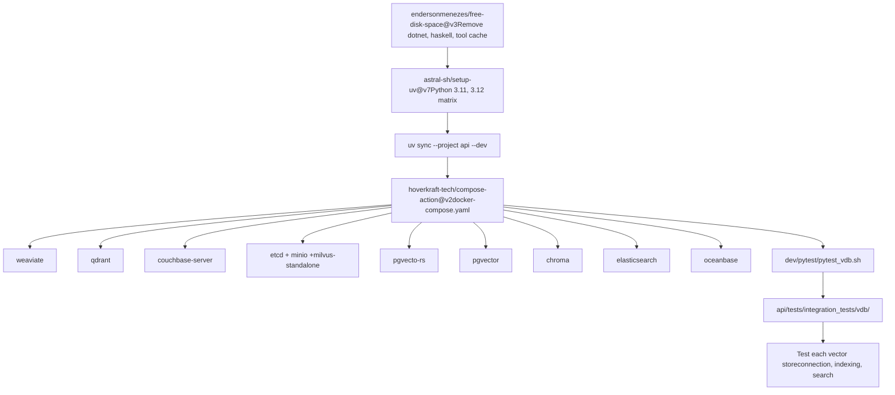
**测试的向量数据库：**

工作流测试与以下向量存储的集成：

-   **Weaviate**: 云原生向量搜索引擎
-   **Qdrant**: 高性能向量相似度搜索
-   **Milvus**: 分布式向量数据库（依赖 etcd + MinIO）
-   **pgvector**: 用于向量相似度的 PostgreSQL 扩展
-   **PgVecto-RS**: 基于 Rust 的 PostgreSQL 向量扩展
-   **Chroma**: AI 原生开源嵌入数据库
-   **Elasticsearch**: 具有向量搜索功能的搜索引擎
-   **Couchbase**: 支持向量搜索的分布式 NoSQL 数据库
-   **OceanBase**: 支持向量的分布式数据库

`dev/pytest/pytest_vdb.sh` 中的测试脚本运行集成测试，验证：

1.  连接建立和认证
2.  集合/索引创建
3.  带有嵌入的文档插入
4.  向量相似度搜索操作
5.  元数据过滤
6.  错误处理和边缘情况

**来源：** [.github/workflows/vdb-tests.yml1-91](https://github.com/langgenius/dify/blob/92dbc94f/.github/workflows/vdb-tests.yml#L1-L91)

### 数据库迁移测试

迁移测试工作流验证 SQL 生成以及 PostgreSQL 和 MySQL 的实时迁移。

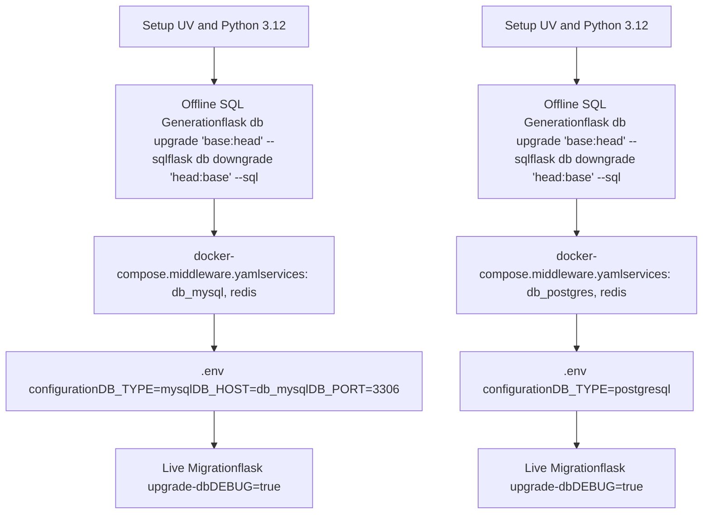
**迁移测试阶段：**

1.  **离线 SQL 生成**: 验证所有迁移是否可以在没有数据库连接的情况下生成 SQL：

    -   从 base 升级到 head: `flask db upgrade 'base:head' --sql`
    -   从 head 降级到 base: `flask db downgrade 'head:base' --sql`
2.  **实时迁移执行**: 将迁移应用于正在运行的数据库实例：

    -   PostgreSQL: `.env.example` 中的默认配置
    -   MySQL: 需要覆盖 `DB_TYPE`, `DB_HOST`, `DB_PORT`, `DB_USERNAME`

这确保了迁移适用于两种数据库后端，并支持离线/在线部署方案。

**来源：** [.github/workflows/db-migration-test.yml1-117](https://github.com/langgenius/dify/blob/92dbc94f/.github/workflows/db-migration-test.yml#L1-L117)

---

## 代码质量与测试标准

代码库通过自动化 linting、类型检查以及针对 Python、TypeScript 和基础设施文件的格式化来强制执行质量标准。

### 样式检查管道

样式检查工作流在所有 Pull Request 上运行，并验证代码质量，不过滤特定文件（始终运行）。

```mermaid
flowchart TD
    CheckInfraFiles["tj-actions/changed-files@v47files: **.sh, **.yaml, **Dockerfile"]
    SuperLinter["super-linter/super-linter/slim@v8"]
    BashCheck["VALIDATE_BASHVALIDATE_BASH_EXECBASH_SEVERITY: warning"]
    DockerCheck["VALIDATE_DOCKERFILE_HADOLINT"]
    EditorConfig["VALIDATE_EDITORCONFIG"]
    YAMLCheck["VALIDATE_YAMLVALIDATE_XML"]
    CheckWebFiles["tj-actions/changed-files@v47files: web/**, .github/workflows/style.yml"]
    SetupWeb["pnpm/action-setup@v4Node.js 22"]
    InstallWeb["pnpm install --frozen-lockfile"]
    ESLint["pnpm run lintESLint validation"]
    TypeCheck["pnpm run type-check:tsgoTypeScript validation"]
    Knip["pnpm run knipDead code detection"]
    BuildCheck["pnpm run buildBuild validation"]
    CheckPyFiles["tj-actions/changed-files@v47files: api/**, .github/workflows/style.yml"]
    SetupPy["astral-sh/setup-uv@v7Python 3.12"]
    InstallPy["uv sync --project api --dev"]
    ImportLinter["uv run lint-importsValidate import structure"]
    Basedpyright["basedpyrightType checking"]
    Mypy["mypy --check-untyped-defsType checking"]
    DotenvLinter["dotenv-linter.env.example validation"]

    CheckInfraFiles --> SuperLinter
    SuperLinter --> BashCheck
    SuperLinter --> DockerCheck
    SuperLinter --> EditorConfig
    SuperLinter --> YAMLCheck
    CheckWebFiles --> SetupWeb
    SetupWeb --> InstallWeb
    InstallWeb --> ESLint
    InstallWeb --> TypeCheck
    InstallWeb --> Knip
    InstallWeb --> BuildCheck
    CheckPyFiles --> SetupPy
    SetupPy --> InstallPy
    InstallPy --> ImportLinter
    InstallPy --> Basedpyright
    InstallPy --> Mypy
    InstallPy --> DotenvLinter
```
**Python Linting 工具：**

| 工具 | 用途 | 配置 |
| --- | --- | --- |
| `ruff` | 快速 Python linter 和格式化器 | 运行导入排序、格式化和 lint 检查 |
| `basedpyright` | Python 类型检查器 (Pyright 的分支) | 验证类型注解和推断 |
| `mypy` | 静态类型检查器 | 检查未定义类型的函数定义 (`--check-untyped-defs`) |
| `import-linter` | 验证导入结构 | 通过 `lint-imports` 命令强制执行架构边界 |
| `dotenv-linter` | 环境文件验证 | 检查 `.env.example` 文件的一致性 |

**Web Linting 工具：**

| 工具 | 用途 | 配置 |
| --- | --- | --- |
| ESLint | JavaScript/TypeScript linter | 配置在 `web/.eslintrc.json` |
| TypeScript Compiler | 类型检查 | `tsconfig.json` 开启严格模式 |
| Knip | 死代码检测 | 查找未使用的导出、依赖项和文件 |
| Next.js Build | 生产构建验证 | 确保 `next build` 没有构建错误 |

**SuperLinter 验证：**

SuperLinter 针对基础设施文件运行多个专用 linter：

-   **Bash**: 使用 `shellcheck` 进行 Shell 脚本验证（警告严重性）
-   **Dockerfile**: 通过 `hadolint` 验证 Docker 最佳实践
-   **YAML**: YAML 语法验证
-   **EditorConfig**: 通过 `.editorconfig` 保持代码风格一致

SuperLinter 配置为忽略 gitignored 文件和生成的文件，并带有过滤正则表达式以排除特定路径，如 `pnpm-lock.yaml`。

**来源：** [.github/workflows/style.yml1-165](https://github.com/langgenius/dify/blob/92dbc94f/.github/workflows/style.yml#L1-L165)

### 自动修复工作流

自动修复工作流自动纠正常见问题并将修复提交回 Pull Request。

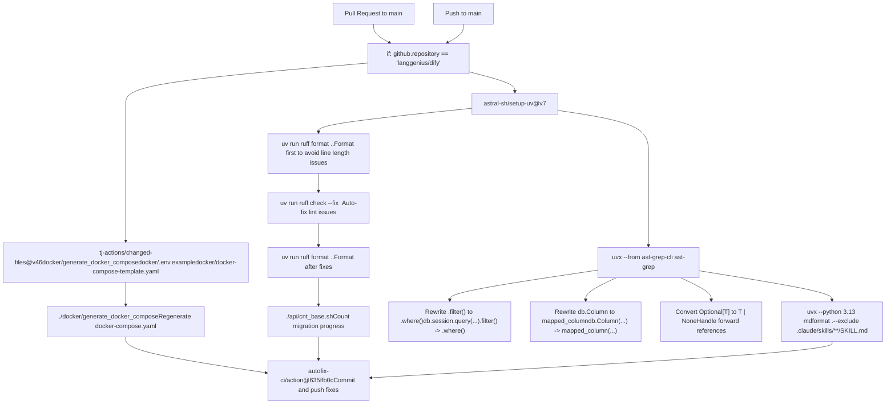
**AST-grep 重写：**

自动修复工作流使用 `ast-grep` 进行高级代码转换：

1.  **SQLAlchemy 查询现代化**:

    -   `db.session.query($WHATEVER).filter($HERE)` → `db.session.query($WHATEVER).where($HERE)`
    -   `session.query($WHATEVER).filter($HERE)` → `session.query($WHATEVER).where($HERE)`
2.  **SQLAlchemy 2.0 列语法**:

    -   `$A = db.Column($$$B)` → `$A = mapped_column($$$B)`
    -   `$A : $T = db.Column($$$B)` → `$A : $T = mapped_column($$$B)`
3.  **类型注解现代化**:

    -   `Optional[T]` → `T | None` (对前向引用进行特殊处理)
    -   像 `"Type" | None` 这样的前向引用保留为 `Optional["Type"]`

**Markdown 格式化：**

工作流使用 Python 3.13 运行 `mdformat` 来格式化 markdown 文件，排除带有 YAML front matter 的目录（如 `.claude/skills/**/SKILL.md`）以防止破坏结构化元数据。

**来源：** [.github/workflows/autofix.yml1-88](https://github.com/langgenius/dify/blob/92dbc94f/.github/workflows/autofix.yml#L1-L88)

### 构建和推送工作流

构建工作流为 API 和 web 服务创建多架构 Docker 镜像。

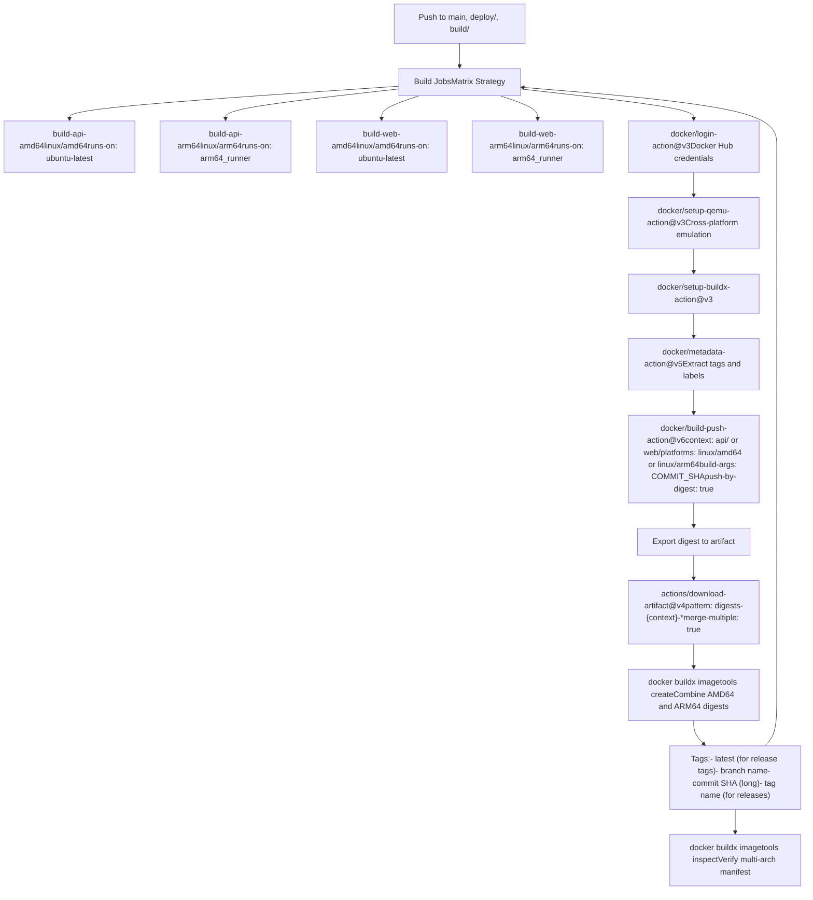
**多架构构建策略：**

工作流使用两阶段方法：

1.  **并行构建**: 每个平台 (AMD64, ARM64) 独立构建 API 和 web 服务

    -   AMD64 构建在 `ubuntu-latest` 运行器上运行
    -   ARM64 构建在专用的 `arm64_runner` 自托管运行器上运行
    -   每个构建导出一个摘要工件
2.  **清单创建**: 所有构建完成后，清单将合并摘要

    -   API 摘要: `digests-api-linux-amd64` + `digests-api-linux-arm64` → `langgenius/dify-api` 清单
    -   Web 摘要: `digests-web-linux-amd64` + `digests-web-linux-arm64` → `langgenius/dify-web` 清单

**镜像打标签策略：**

`docker/metadata-action@v5` 根据触发事件生成标签：

| 触发器 | 生成的标签 |
| --- | --- |
| 发布标签 (非预发布) | `latest`, 标签名, 提交 SHA |
| 预发布标签 | 标签名, 提交 SHA |
| 分支推送 | 分支名称, 提交 SHA |
| 提交推送 | 提交 SHA (长格式) |

**缓存策略：**

构建和清单任务都使用 GitHub Actions 缓存：

-   `cache-from: type=gha,scope={service_name}`: 从缓存读取
-   `cache-to: type=gha,mode=max,scope={service_name}`: 写入缓存（max 模式保留层）

**来源：** [.github/workflows/build-push.yml1-152](https://github.com/langgenius/dify/blob/92dbc94f/.github/workflows/build-push.yml#L1-L152)

### 测试覆盖率要求

覆盖率跟踪通过测试工作流自动进行，并在 GitHub Actions 摘要中进行内联报告。

**API 覆盖率指标：**

API 测试工作流从 pytest 生成的 `coverage.json` 中提取覆盖率：

```
# 提取总覆盖率百分比
TOTAL_COVERAGE=$(python -c 'import json; print(json.load(open("coverage.json"))["totals"]["percent_covered_display"])')
```
摘要包括：

-   总体覆盖率百分比
-   使用 `coverage report -m` 的文件级细分
-   GitHub Actions 摘要中的可展开详细信息部分

**Web 覆盖率指标：**

Web 测试工作流处理来自 Vitest 的 Istanbul 覆盖率数据：

-   解析 `coverage/coverage-final.json` 或 `coverage/coverage-summary.json`
-   计算行、语句、分支和函数的指标
-   生成带有未覆盖行号的详细表格
-   将完整覆盖率报告上传为工件（30 天保留期）

位于 [.github/workflows/web-tests.yml62-359](https://github.com/langgenius/dify/blob/92dbc94f/.github/workflows/web-tests.yml#L62-L359) 的内联 Node.js 脚本处理 `istanbul-lib-coverage` 不可用时的回退方案，从语句映射中手动计算覆盖率。

**覆盖率工件保留：**

| 工件 | 保留期 | 用途 |
| --- | --- | --- |
| `web-coverage-report` | 30 天 | 用于调试的完整 HTML 覆盖率报告 |

**来源：** [.github/workflows/api-tests.yml87-104](https://github.com/langgenius/dify/blob/92dbc94f/.github/workflows/api-tests.yml#L87-L104) [.github/workflows/web-tests.yml44-368](https://github.com/langgenius/dify/blob/92dbc94f/.github/workflows/web-tests.yml#L44-L368)
