# CI/CD 流水线架构

相关源文件

-   [.github/workflows/api-tests.yml](https://github.com/langgenius/dify/blob/92dbc94f/.github/workflows/api-tests.yml)
-   [.github/workflows/autofix.yml](https://github.com/langgenius/dify/blob/92dbc94f/.github/workflows/autofix.yml)
-   [.github/workflows/build-push.yml](https://github.com/langgenius/dify/blob/92dbc94f/.github/workflows/build-push.yml)
-   [.github/workflows/db-migration-test.yml](https://github.com/langgenius/dify/blob/92dbc94f/.github/workflows/db-migration-test.yml)
-   [.github/workflows/deploy-agent-dev.yml](https://github.com/langgenius/dify/blob/92dbc94f/.github/workflows/deploy-agent-dev.yml)
-   [.github/workflows/deploy-dev.yml](https://github.com/langgenius/dify/blob/92dbc94f/.github/workflows/deploy-dev.yml)
-   [.github/workflows/deploy-hitl.yml](https://github.com/langgenius/dify/blob/92dbc94f/.github/workflows/deploy-hitl.yml)
-   [.github/workflows/docker-build.yml](https://github.com/langgenius/dify/blob/92dbc94f/.github/workflows/docker-build.yml)
-   [.github/workflows/main-ci.yml](https://github.com/langgenius/dify/blob/92dbc94f/.github/workflows/main-ci.yml)
-   [.github/workflows/stale.yml](https://github.com/langgenius/dify/blob/92dbc94f/.github/workflows/stale.yml)
-   [.github/workflows/style.yml](https://github.com/langgenius/dify/blob/92dbc94f/.github/workflows/style.yml)
-   [.github/workflows/tool-test-sdks.yaml](https://github.com/langgenius/dify/blob/92dbc94f/.github/workflows/tool-test-sdks.yaml)
-   [.github/workflows/translate-i18n-claude.yml](https://github.com/langgenius/dify/blob/92dbc94f/.github/workflows/translate-i18n-claude.yml)
-   [.github/workflows/trigger-i18n-sync.yml](https://github.com/langgenius/dify/blob/92dbc94f/.github/workflows/trigger-i18n-sync.yml)
-   [.github/workflows/vdb-tests.yml](https://github.com/langgenius/dify/blob/92dbc94f/.github/workflows/vdb-tests.yml)
-   [.github/workflows/web-tests.yml](https://github.com/langgenius/dify/blob/92dbc94f/.github/workflows/web-tests.yml)
-   [api/Dockerfile](https://github.com/langgenius/dify/blob/92dbc94f/api/Dockerfile)
-   [api/migrations/README](https://github.com/langgenius/dify/blob/92dbc94f/api/migrations/README)
-   [web/.nvmrc](https://github.com/langgenius/dify/blob/92dbc94f/web/.nvmrc)
-   [web/Dockerfile](https://github.com/langgenius/dify/blob/92dbc94f/web/Dockerfile)
-   [web/README.md](https://github.com/langgenius/dify/blob/92dbc94f/web/README.md)
-   [web/i18n-config/README.md](https://github.com/langgenius/dify/blob/92dbc94f/web/i18n-config/README.md)

## 目的与范围

本文档描述了 Dify 平台的持续集成与持续部署 (CI/CD) 流水线架构。涵盖了自动化测试、代码质量检查以及 Docker 镜像构建的 GitHub Actions 工作流。

该流水线采用了“枢纽与分支 (hub-and-spoke)”架构，主编排工作流根据变更的文件将任务委派给专门的子工作流。有关开发环境设置的信息，请参阅 [开发环境设置](/langgenius/dify/10.1-development-environment-setup)。有关代码质量标准和测试策略的详情，请参阅 [代码质量与测试标准](/langgenius/dify/10.3-testing-infrastructure)。

**来源：** [.github/workflows/main-ci.yml1-80](https://github.com/langgenius/dify/blob/92dbc94f/.github/workflows/main-ci.yml#L1-L80)

---

## 流水线架构概览

CI/CD 系统使用集中式的编排模型，并配合智能的路径过滤机制，以最小化不必要的测试执行。

### 主编排工作流 (Main Orchestrator Workflow)

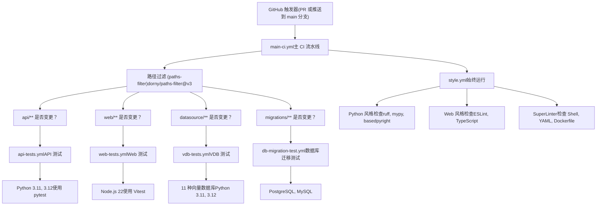
`main-ci.yml` 工作流作为编排器，根据文件变更决定执行哪些下游工作流。`check-changes` 作业使用 `dorny/paths-filter@v3` 分析修改过的文件，并为每个测试类别输出布尔标志。

**来源：** [.github/workflows/main-ci.yml1-80](https://github.com/langgenius/dify/blob/92dbc94f/.github/workflows/main-ci.yml#L1-L80)

### 路径过滤器配置

| 输出标志 | 触发条件 | 下游工作流 |
| --- | --- | --- |
| `api-changed` | `api/**`, `docker/**`, `.github/workflows/api-tests.yml` | `api-tests.yml` |
| `web-changed` | `web/**`, `.github/workflows/web-tests.yml` | `web-tests.yml` |
| `vdb-changed` | `api/core/rag/datasource/**`, `docker/**`, `api/uv.lock`, `api/pyproject.toml` | `vdb-tests.yml` |
| `migration-changed` | `api/migrations/**`, `.github/workflows/db-migration-test.yml` | `db-migration-test.yml` |

代码风格检查 (style check) 工作流在每个 PR 和推送时无条件运行，以便尽早捕获 lint 错误。

**来源：** [.github/workflows/main-ci.yml20-51](https://github.com/langgenius/dify/blob/92dbc94f/.github/workflows/main-ci.yml#L20-L51)

---

## 测试工作流

### API 测试工作流

`api-tests.yml` 工作流为 Python API 后端执行单元测试和集成测试。

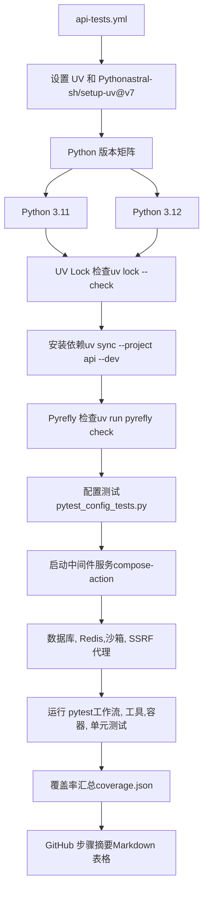
#### 测试执行详情

该工作流按顺序执行以下步骤：

1.  **环境设置**：使用 `astral-sh/setup-uv@v7` 安装 UV 包管理器和 Python，并启用缓存。
2.  **依赖管理**：验证 `uv.lock` 的完整性，并使用 `uv sync --project api --dev` 安装依赖。
3.  **静态分析**：运行 `pyrefly check` 进行代码质量验证。
4.  **配置测试**：通过 `dev/pytest/pytest_config_tests.py` 执行专门的配置测试。
5.  **中间件设置**：使用 `hoverkraft-tech/compose-action@v2` 启动 PostgreSQL, Redis, Sandbox 和 SSRF Proxy。
6.  **测试执行**：运行 pytest（设置 180 秒超时），涵盖以下目录：
    -   `api/tests/integration_tests/workflow`
    -   `api/tests/integration_tests/tools`
    -   `api/tests/test_containers_integration_tests`
    -   `api/tests/unit_tests`
7.  **覆盖率报告**：从 `coverage.json` 提取覆盖率百分比并生成 GitHub 步骤摘要。

**来源：** [.github/workflows/api-tests.yml1-105](https://github.com/langgenius/dify/blob/92dbc94f/.github/workflows/api-tests.yml#L1-L105)

#### 环境配置

```bash
# 测试环境的存储配置
STORAGE_TYPE=opendal
OPENDAL_SCHEME=fs
OPENDAL_FS_ROOT=/tmp/dify-storage
```
测试使用 OpenDAL 的文件系统后端，以避免在 CI 执行期间依赖外部服务。

**来源：** [.github/workflows/api-tests.yml76-79](https://github.com/langgenius/dify/blob/92dbc94f/.github/workflows/api-tests.yml#L76-L79)

### Web 测试工作流

`web-tests.yml` 工作流使用 Vitest 验证 Next.js 前端。

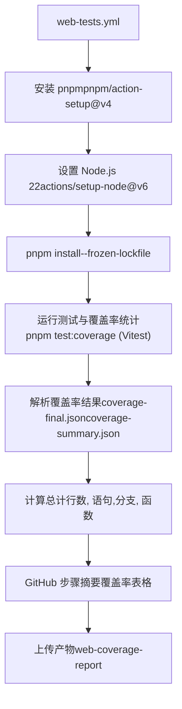
#### 覆盖率处理逻辑

该工作流包含复杂的 JavaScript 代码来处理 Istanbul 格式的覆盖率数据：

1.  **覆盖率文件检测**：检查 `coverage-summary.json`（首选）或 `coverage-final.json`。
2.  **指标计算**：计算行、语句、分支和函数的总计。
3.  **文件级分析**：生成每个文件的覆盖率百分比，并识别未覆盖的行。
4.  **行命中计算**：如果无法直接获取行命中数据，则回退到基于语句映射 (statement-map) 的行覆盖率计算。
5.  **输出格式化**：创建包含覆盖率指标和未覆盖行范围的 Markdown 表格。

覆盖率摘要作为 GitHub 步骤摘要显示，包含两个可展开的部分：

-   **顶级摘要**：总百分比以及覆盖数/总数。
-   **文件覆盖率**：按覆盖率百分比排序的最差 25 个文件。
-   **Vitest 覆盖率详细表格**：完整的文件列表及其未覆盖的行号。

**来源：** [.github/workflows/web-tests.yml1-369](https://github.com/langgenius/dify/blob/92dbc94f/.github/workflows/web-tests.yml#L1-L369)

### 向量数据库测试工作流

`vdb-tests.yml` 工作流验证了与 11 种不同向量数据库供应商的集成。

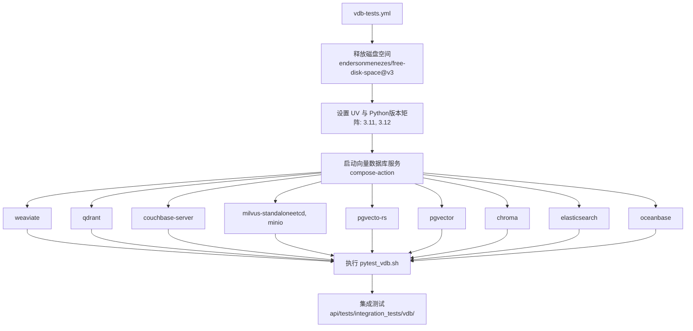
#### 向量数据库矩阵

| 向量数据库 | 服务依赖项 | 备注 |
| --- | --- | --- |
| Weaviate | `weaviate` | 独立服务 |
| Qdrant | `qdrant` | 独立服务 |
| Couchbase | `couchbase-server` | 具有向量搜索能力的增强型 NoSQL |
| Milvus | `etcd`, `minio`, `milvus-standalone` | 需要对象存储 |
| PgVecto-RS | `pgvecto-rs` | 带有 Rust 向量插件的 PostgreSQL |
| PgVector | `pgvector` | 带有 pgvector 扩展的 PostgreSQL |
| Chroma | `chroma` | 独立服务 |
| ElasticSearch | `elasticsearch` | 具有向量支持的全文本搜索 |
| OceanBase | `oceanbase` | 分布式数据库 |
| MyScale | 未包含在矩阵中 | 工作流中已注释掉 |
| TiDB | 未包含在矩阵中 | 工作流中已注释掉 |

工作流使用 `hoverkraft-tech/compose-action@v2.0.2` 同时编排多个 Docker Compose 服务。测试通过 `dev/pytest/pytest_vdb.sh` 执行。

**来源：** [.github/workflows/vdb-tests.yml1-91](https://github.com/langgenius/dify/blob/92dbc94f/.github/workflows/vdb-tests.yml#L1-L91)

### 数据库迁移测试工作流

`db-migration-test.yml` 工作流为 PostgreSQL 和 MySQL 验证 Flask-Migrate 迁移。

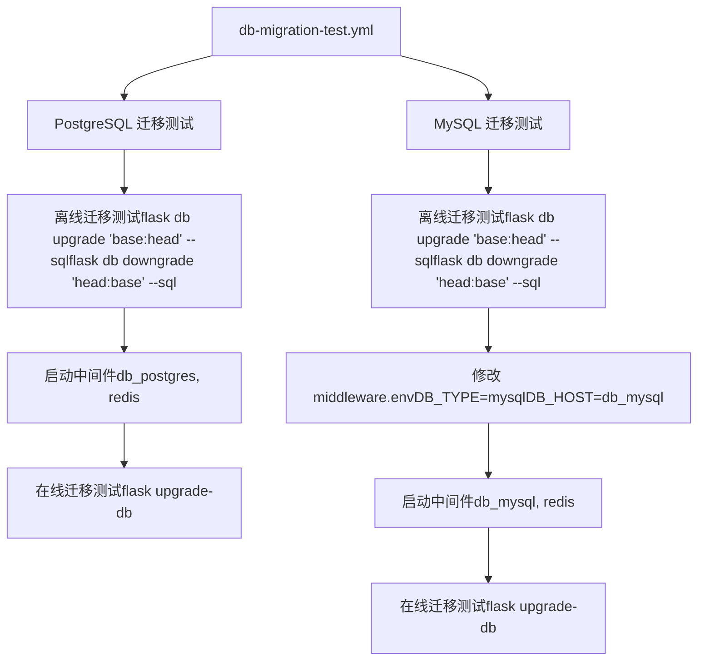
#### 迁移验证策略

该工作流分两个阶段验证迁移：

1.  **离线验证**：在不连接数据库的情况下生成 SQL 语句。
    -   测试升级路径：`flask db upgrade 'base:head' --sql`
    -   测试降级路径：`flask db downgrade 'head:base' --sql`
    -   确保迁移脚本可以被人工审核并在需要时手动执行。
2.  **在线验证**：将迁移应用到运行中的数据库实例。
    -   PostgreSQL：使用带有默认 PostgreSQL 设置的 `db_postgres` 服务。
    -   MySQL：使用 `db_mysql` 服务，并通过 `sed` 命令覆盖配置。

MySQL 作业通过修改 `docker/middleware.env` 来切换数据库类型：

```bash
sed -i 's/DB_TYPE=postgresql/DB_TYPE=mysql/' middleware.env
sed -i 's/DB_HOST=db_postgres/DB_HOST=db_mysql/' middleware.env
sed -i 's/DB_PORT=5432/DB_PORT=3306/' middleware.env
sed -i 's/DB_USERNAME=postgres/DB_USERNAME=mysql/' middleware.env
```
**来源：** [.github/workflows/db-migration-test.yml1-117](https://github.com/langgenius/dify/blob/92dbc94f/.github/workflows/db-migration-test.yml#L1-L117)

---

## 代码质量工作流

### 风格检查工作流

`style.yml` 工作流强制执行 Python、JavaScript/TypeScript 以及基础设施文件的代码质量标准。

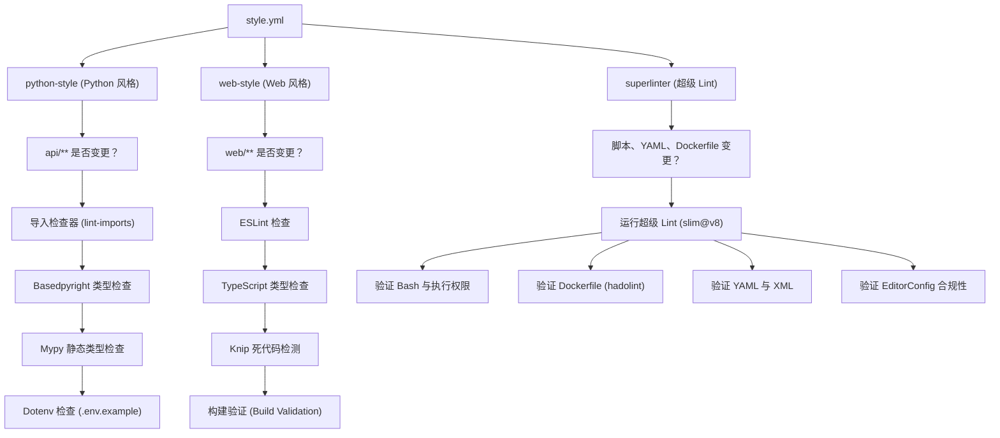
#### Python 风格检查

| 工具 | 用途 | 配置说明 |
| --- | --- | --- |
| `lint-imports` | 验证导入边界和架构层级 | 项目自定义规则 |
| `basedpyright` | 增强的类型检查能力 | 通过 `dev/basedpyright-check` 执行 |
| `mypy` | 静态类型检查 | 设置了排除目录并检查未定义类型的函数 |
| `dotenv-linter` | 验证 `.env.example` 文件 | 检查 `api/` 和 `web/` 下的示例文件 |

**来源：** [.github/workflows/style.yml16-61](https://github.com/langgenius/dify/blob/92dbc94f/.github/workflows/style.yml#L16-L61)

#### Web 风格检查

| 工具 | 用途 | 执行命令 |
| --- | --- | --- |
| ESLint | JS/TS 代码分析 | `pnpm run lint` |
| TypeScript 编译器 | 类型检查 | `pnpm run type-check:tsgo` |
| Knip | 死代码检测 | `pnpm run knip` |
| 构建验证 | 确保生产环境构建成功 | `pnpm run build` |

Web 检查在 `web/` 工作目录下运行，使用 Node.js 22 和 pnpm 包管理器。

**来源：** [.github/workflows/style.yml62-122](https://github.com/langgenius/dify/blob/92dbc94f/.github/workflows/style.yml#L62-L122)

#### SuperLinter 配置

SuperLinter 验证 shell 脚本、YAML 文件、Dockerfile 以及 EditorConfig 合规性：

```yaml
BASH_SEVERITY: warning
DEFAULT_BRANCH: origin/main
FILTER_REGEX_INCLUDE: pnpm-lock.yaml
IGNORE_GENERATED_FILES: true
IGNORE_GITIGNORED_FILES: true
VALIDATE_BASH: true
VALIDATE_BASH_EXEC: true
VALIDATE_DOCKERFILE_HADOLINT: true
VALIDATE_EDITORCONFIG: true
VALIDATE_XML: true
VALIDATE_YAML: true
```
注：GitHub Actions 工作流验证 (`VALIDATE_GITHUB_ACTIONS`) 暂时禁用，等待修复 `api-docker.yaml` 运行脚本的 shellcheck 兼容性问题。

**来源：** [.github/workflows/style.yml123-165](https://github.com/langgenius/dify/blob/92dbc94f/.github/workflows/style.yml#L123-L165)

### 自动修复工作流 (Autofix Workflow)

`autofix.yml` 工作流自动修正常见的代码问题，并将修复提交到拉取请求 (PR) 中。

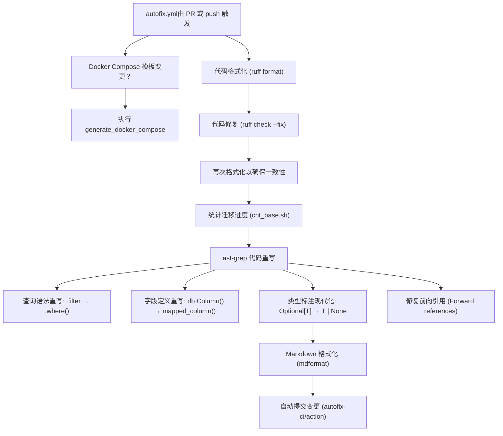
#### 自动代码转换

该工作流使用 `ast-grep` 应用了多项自动代码转换：

1.  **SQLAlchemy 2.0 迁移**：
    -   将 `db.session.query(...).filter(...)` 重写为 `.where(...)`。
    -   将 `db.Column(...)` 重写为 `mapped_column(...)`。
2.  **类型标注现代化**：
    -   将 `Optional[T]` 转换为 `T | None`。
    -   特别处理了前向引用，以避免破坏带引号的类型定义。
3.  **Markdown 格式化**：
    -   对所有 Markdown 文件运行 `mdformat`（排除带有 YAML 头部信息的技能文档）。

工作流使用 `autofix-ci/action` 自动将变更提交回 PR。

**来源：** [.github/workflows/autofix.yml1-88](https://github.com/langgenius/dify/blob/92dbc94f/.github/workflows/autofix.yml#L1-L88)

#### Docker Compose 生成

当 Docker Compose 模板文件发生变更时，工作流会重新生成 `docker-compose.yaml`：

```bash
cd docker
./generate_docker_compose
```
这确保了组合文件与模板及环境变量定义保持同步。

**来源：** [.github/workflows/autofix.yml17-36](https://github.com/langgenius/dify/blob/92dbc94f/.github/workflows/autofix.yml#L17-L36)

---

## 构建与部署流水线

### Docker 构建工作流

`build-push.yml` 工作流构建多架构 Docker 镜像并将其发布到 Docker Hub。

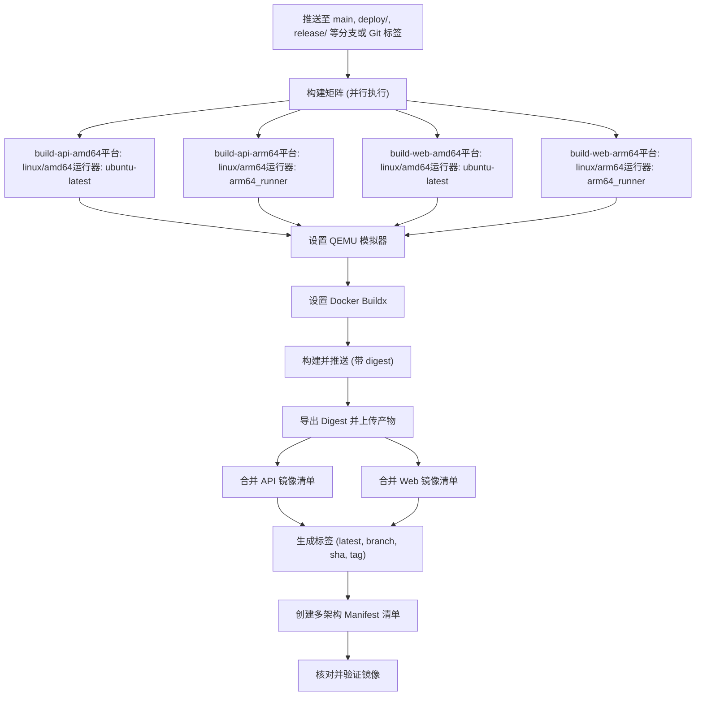
#### 构建矩阵配置

| 作业名称 | 镜像名称环境变量 | 构建上下文 | 目标平台 | 运行器 |
| --- | --- | --- | --- | --- |
| `build-api-amd64` | `DIFY_API_IMAGE_NAME` | `api` | `linux/amd64` | `ubuntu-latest` |
| `build-api-arm64` | `DIFY_API_IMAGE_NAME` | `api` | `linux/arm64` | `arm64_runner` |
| `build-web-amd64` | `DIFY_WEB_IMAGE_NAME` | `web` | `linux/amd64` | `ubuntu-latest` |
| `build-web-arm64` | `DIFY_WEB_IMAGE_NAME` | `web` | `linux/arm64` | `arm64_runner` |

工作流使用专用的 ARM64 运行器 (`arm64_runner`) 进行原生 ARM 构建，相比 QEMU 模拟构建，大幅提升了构建性能。

**来源：** [.github/workflows/build-push.yml24-47](https://github.com/langgenius/dify/blob/92dbc94f/.github/workflows/build-push.yml#L24-L47)

#### 构建配置

```yaml
- name: Build Docker image
  uses: docker/build-push-action@v6
  with:
    context: "{{defaultContext}}:${{ matrix.context }}"
    platforms: ${{ matrix.platform }}
    build-args: COMMIT_SHA=${{ fromJSON(steps.meta.outputs.json).labels['org.opencontainers.image.revision'] }}
    labels: ${{ steps.meta.outputs.labels }}
    outputs: type=image,name=${{ env[matrix.image_name_env] }},push-by-digest=true,name-canonical=true,push=true
    cache-from: type=gha,scope=${{ matrix.service_name }}
    cache-to: type=gha,mode=max,scope=${{ matrix.service_name }}
```
关键配置详情：

-   **构建上下文**：使用 `{{defaultContext}}` 并附加上下文路径。
-   **构建参数**：从 Git 元数据注入 `COMMIT_SHA`。
-   **推送策略**：使用基于摘要 (digest) 的推送，以便后续创建 Manifest。
-   **缓存机制**：利用 GitHub Actions 缓存，并按服务设置作用域。

**来源：** [.github/workflows/build-push.yml72-83](https://github.com/langgenius/dify/blob/92dbc94f/.github/workflows/build-push.yml#L72-L83)

### 清单 (Manifest) 创建

`create-manifest` 作业在所有平台构建完成后运行，将它们合并为多架构清单。

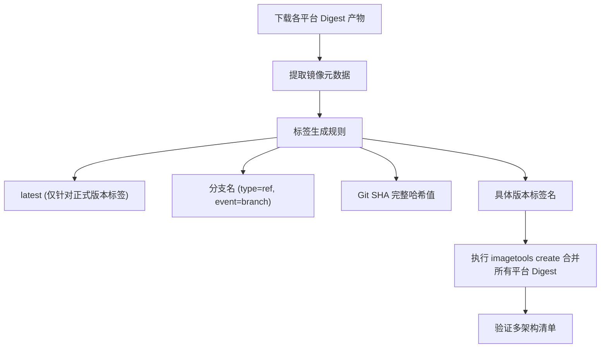
#### 标签生成规则

```yaml
tags: |
  type=raw,value=latest,enable=${{ startsWith(github.ref, 'refs/tags/') && !contains(github.ref, '-') }}
  type=ref,event=branch
  type=sha,enable=true,priority=100,prefix=,suffix=,format=long
  type=raw,value=${{ github.ref_name }},enable=${{ startsWith(github.ref, 'refs/tags/') }}
```
工作流生成四种类型的标签：

1.  **`latest`**：仅针对不带连字符的正式发布标签（稳定版）。
2.  **分支名**：针对分支推送（例如 `main`, `deploy/staging`）。
3.  **Git SHA**：长格式哈希，用于精确的版本追踪。
4.  **版本标签**：针对 Git 标签推送的精确标签名。

**来源：** [.github/workflows/build-push.yml100-152](https://github.com/langgenius/dify/blob/92dbc94f/.github/workflows/build-push.yml#L100-L152)

#### 清单创建命令

```bash
docker buildx imagetools create $(jq -cr '.tags | map("-t " + .) | join(" ")' <<< "$DOCKER_METADATA_OUTPUT_JSON") \
  $(printf "$IMAGE_NAME@sha256:%s " *)
```
该命令：

1.  使用 `jq` 从 `DOCKER_METADATA_OUTPUT_JSON` 中提取标签。
2.  将其格式化为 `-t` 参数。
3.  追加 `/tmp/digests/` 目录下的所有摘要文件。
4.  创建一个引用了所有平台特定镜像的清单列表 (manifest list)。

**来源：** [.github/workflows/build-push.yml138-144](https://github.com/langgenius/dify/blob/92dbc94f/.github/workflows/build-push.yml#L138-L144)

---

## 其他自动化工作流

### i18n 翻译工作流

`translate-i18n-base-on-english.yml` 工作流在英语源文件变更时自动生成翻译。

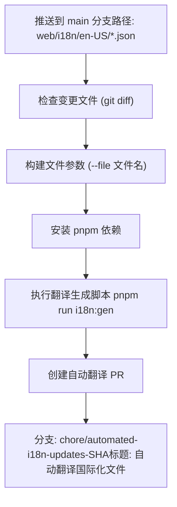
工作流逻辑：

1.  检测 `web/i18n/en-US/*.json` 文件的变更。
2.  提取变更的文件名并构建 `--file` 参数。
3.  带参数运行 `pnpm run i18n:gen`。
4.  为所有 locale 创建包含已翻译文件的自动化 PR。
5.  使用 `chore/automated-i18n-updates-<SHA>` 命名的分支，并开启自动删除分支。

**来源：** [.github/workflows/translate-i18n-base-on-english.yml1-86](https://github.com/langgenius/dify/blob/92dbc94f/.github/workflows/translate-i18n-base-on-english.yml#L1-L86)

### SDK 测试工作流

`tool-test-sdks.yaml` 工作流在多个 Node.js 版本上验证 Node.js SDK。

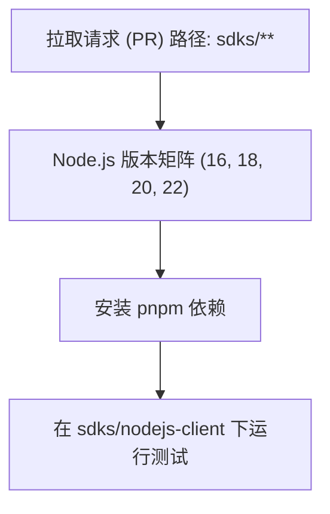
该工作流测试了 SDK 在 Node.js 各个 LTS 版本（16, 18, 20）及最新版本 (22) 上的兼容性，确保 SDK 在不同的运行时环境下均能正常工作。

**来源：** [.github/workflows/tool-test-sdks.yaml1-44](https://github.com/langgenius/dify/blob/92dbc94f/.github/workflows/tool-test-sdks.yaml#L1-L44)

---

## 工作流触发摘要

| 工作流 | 触发条件 | 频率 | 作用范围 |
| --- | --- | --- | --- |
| `main-ci.yml` | PR 或 推送至 main | 每次 PR 和合并 | 所有测试的编排器 |
| `style.yml` | 由 main-ci 调用 | 每次 PR 和合并 | 始终运行 |
| `api-tests.yml` | 由 main-ci 调用 | `api/**` 变更时 | 有条件触发 |
| `web-tests.yml` | 由 main-ci 调用 | `web/**` 变更时 | 有条件触发 |
| `vdb-tests.yml` | 由 main-ci 调用 | 数据源相关代码变更时 | 有条件触发 |
| `db-migration-test.yml` | 由 main-ci 调用 | 迁移脚本变更时 | 有条件触发 |
| `autofix.yml` | PR 或 推送至 main | 每次 PR 和合并 | 自动提交代码修复 |
| `build-push.yml` | 推送至 main、标签或特定分支 | 合并至 main 或发布时 | 部署镜像 |
| `translate-i18n-base-on-english.yml` | 推送至 main | 英语 i18n 文件变更时 | 自动化翻译 |
| `tool-test-sdks.yaml` | PR 至 main | `sdks/**` 变更时 | SDK 验证 |

---

## 并发控制

所有工作流均实现了并发控制，以防止冗余执行：

```yaml
concurrency:
  group: workflow-name-${{ github.head_ref || github.run_id }}
  cancel-in-progress: true
```
此配置：

-   按 PR 分支 (`github.head_ref`) 或唯一的运行 ID 对工作流进行分组。
-   当有新提交推送时，自动取消正在进行中的旧运行。
-   减少了 CI 队列等待时间和资源消耗。

**来源：** [.github/workflows/main-ci.yml15-17](https://github.com/langgenius/dify/blob/92dbc94f/.github/workflows/main-ci.yml#L15-L17) [.github/workflows/style.yml6-8](https://github.com/langgenius/dify/blob/92dbc94f/.github/workflows/style.yml#L6-L8) [.github/workflows/api-tests.yml6-8](https://github.com/langgenius/dify/blob/92dbc94f/.github/workflows/api-tests.yml#L6-L8) [.github/workflows/web-tests.yml6-8](https://github.com/langgenius/dify/blob/92dbc94f/.github/workflows/web-tests.yml#L6-L8)

---

## 性能优化

### 缓存策略

| 工作流 | 缓存类型 | 作用域 | 收益 |
| --- | --- | --- | --- |
| API 测试 | UV 缓存 | `api/uv.lock` | 更快的 Python 依赖安装 |
| Web 测试 | pnpm 缓存 | `web/pnpm-lock.yaml` | 缓存 Node.js 依赖包 |
| 风格检查 | UV/pnpm 缓存 | Lock 文件 | 跳过未变更的依赖安装 |
| 构建流水线 | GitHub Actions 缓存 | 按服务名称区分 | Docker 分层缓存收益 |

### 有条件执行

路径过滤器系统显著减少了不必要的测试执行：

-   **改造前**：每次 PR 运行所有测试（>15 分钟）。
-   **改造后**：仅根据变更文件运行相关测试（单领域变更可缩短至 3-5 分钟）。

### 并行执行

构建流水线将多架构构建并行化：

-   AMD64 构建在 `ubuntu-latest` 运行器上。
-   ARM64 构建在专用的 `arm64_runner` 运行器上。
-   两种架构同时构建，使总构建时间减少了约 50%。

**来源：** [.github/workflows/build-push.yml26-27](https://github.com/langgenius/dify/blob/92dbc94f/.github/workflows/build-push.yml#L26-L27)
