# 测试基础设施

相关源文件

-   [.github/workflows/api-tests.yml](https://github.com/langgenius/dify/blob/92dbc94f/.github/workflows/api-tests.yml)
-   [.github/workflows/autofix.yml](https://github.com/langgenius/dify/blob/92dbc94f/.github/workflows/autofix.yml)
-   [.github/workflows/build-push.yml](https://github.com/langgenius/dify/blob/92dbc94f/.github/workflows/build-push.yml)
-   [.github/workflows/db-migration-test.yml](https://github.com/langgenius/dify/blob/92dbc94f/.github/workflows/db-migration-test.yml)
-   [.github/workflows/deploy-agent-dev.yml](https://github.com/langgenius/dify/blob/92dbc94f/.github/workflows/deploy-agent-dev.yml)
-   [.github/workflows/deploy-dev.yml](https://github.com/langgenius/dify/blob/92dbc94f/.github/workflows/deploy-dev.yml)
-   [.github/workflows/deploy-hitl.yml](https://github.com/langgenius/dify/blob/92dbc94f/.github/workflows/deploy-hitl.yml)
-   [.github/workflows/docker-build.yml](https://github.com/langgenius/dify/blob/92dbc94f/.github/workflows/docker-build.yml)
-   [.github/workflows/main-ci.yml](https://github.com/langgenius/dify/blob/92dbc94f/.github/workflows/main-ci.yml)
-   [.github/workflows/stale.yml](https://github.com/langgenius/dify/blob/92dbc94f/.github/workflows/stale.yml)
-   [.github/workflows/style.yml](https://github.com/langgenius/dify/blob/92dbc94f/.github/workflows/style.yml)
-   [.github/workflows/tool-test-sdks.yaml](https://github.com/langgenius/dify/blob/92dbc94f/.github/workflows/tool-test-sdks.yaml)
-   [.github/workflows/translate-i18n-claude.yml](https://github.com/langgenius/dify/blob/92dbc94f/.github/workflows/translate-i18n-claude.yml)
-   [.github/workflows/trigger-i18n-sync.yml](https://github.com/langgenius/dify/blob/92dbc94f/.github/workflows/trigger-i18n-sync.yml)
-   [.github/workflows/vdb-tests.yml](https://github.com/langgenius/dify/blob/92dbc94f/.github/workflows/vdb-tests.yml)
-   [.github/workflows/web-tests.yml](https://github.com/langgenius/dify/blob/92dbc94f/.github/workflows/web-tests.yml)
-   [api/Dockerfile](https://github.com/langgenius/dify/blob/92dbc94f/api/Dockerfile)
-   [api/migrations/README](https://github.com/langgenius/dify/blob/92dbc94f/api/migrations/README)
-   [web/.nvmrc](https://github.com/langgenius/dify/blob/92dbc94f/web/.nvmrc)
-   [web/Dockerfile](https://github.com/langgenius/dify/blob/92dbc94f/web/Dockerfile)
-   [web/README.md](https://github.com/langgenius/dify/blob/92dbc94f/web/README.md)
-   [web/i18n-config/README.md](https://github.com/langgenius/dify/blob/92dbc94f/web/i18n-config/README.md)

本文档描述了 Dify 代码库中的测试基础设施，包括测试组织、执行环境、CI/CD 集成以及覆盖率报告。有关本地开发环境设置的信息，请参阅 [开发环境设置](/langgenius/dify/10.1-development-environment-setup)。有关 CI/CD 流水线架构，请参阅 [CI/CD 流水线架构](/langgenius/dify/10.2-cicd-pipeline-architecture)。有关代码质量工具与 Lint 检查，请参阅 [代码质量与 Lint 检查](/langgenius/dify/10.4-code-quality-and-linting)。

## 概览

Dify 的测试基础设施由多个通过 GitHub Actions 并行执行的测试套件组成：

-   **API 测试**：针对 Python 后端的单元测试、集成测试以及工作流/工具测试。
-   **Web 测试**：使用 Vitest 针对 Next.js 前端进行的组件和单元测试。
-   **VDB 测试**：针对 10 多种向量数据库实现的集成测试。
-   **迁移测试**：针对 PostgreSQL 和 MySQL 的数据库模式迁移验证。
-   **风格检查**：Lint 检查、类型检查以及代码质量验证。

所有测试工作流均支持 Python 3.11 和 3.12 版本，使用 UV 进行 Python 依赖管理，并根据变更的文件有条件地执行，以优化 CI/CD 的运行时间。

---

## 测试套件组织

```mermaid
flowchart TD
    UnitTests["单元测试<br/>api/tests/unit_tests/"]
    IntegTests["集成测试<br/>workflow/, tools/"]
    ContainerTests["测试容器<br/>test_containers_integration_tests/"]
    ConfigTests["配置测试<br/>dev/pytest/pytest_config_tests.py"]
    ComponentTests["组件测试<br/>*.spec.tsx"]
    UtilTests["工具函数测试<br/>*.spec.ts"]
    BuildTests["构建验证<br/>pnpm run build"]
    WeaviateTest["Weaviate 测试"]
    QdrantTest["Qdrant 测试"]
    PGVectorTest["PGVector 测试"]
    MilvusTest["Milvus 测试"]
    ChromaTest["Chroma 测试"]
    ElasticTest["ElasticSearch 测试"]
    OtherVDB["其他 8+ 种 VDB 测试"]
    OfflineMigration["离线迁移<br/>SQL 生成测试"]
    OnlineMigrationPG["在线迁移<br/>PostgreSQL"]
    OnlineMigrationMySQL["在线迁移<br/>MySQL"]
    PythonStyle["Python 风格检查<br/>Ruff, Mypy, Basedpyright"]
    WebStyle["Web 风格检查<br/>ESLint, TypeScript"]
    SuperLinter["Shell/YAML/Docker<br/>Super-linter"]
    MainCI["main-ci.yml<br/>编排器"]

    MainCI --> UnitTests
    MainCI --> IntegTests
    MainCI --> ContainerTests
    MainCI --> ConfigTests
    MainCI --> ComponentTests
    MainCI --> UtilTests
    MainCI --> BuildTests
    MainCI --> WeaviateTest
    MainCI --> QdrantTest
    MainCI --> PGVectorTest
    MainCI --> OfflineMigration
    MainCI --> OnlineMigrationPG
    MainCI --> OnlineMigrationMySQL
    MainCI --> PythonStyle
    MainCI --> WebStyle
    MainCI --> SuperLinter
```
**来源：** [.github/workflows/main-ci.yml1-80](https://github.com/langgenius/dify/blob/92dbc94f/.github/workflows/main-ci.yml#L1-L80) [.github/workflows/api-tests.yml1-99](https://github.com/langgenius/dify/blob/92dbc94f/.github/workflows/api-tests.yml#L1-L99) [.github/workflows/web-tests.yml1-414](https://github.com/langgenius/dify/blob/92dbc94f/.github/workflows/web-tests.yml#L1-L414) [.github/workflows/vdb-tests.yml1-91](https://github.com/langgenius/dify/blob/92dbc94f/.github/workflows/vdb-tests.yml#L1-L91) [.github/workflows/db-migration-test.yml1-117](https://github.com/langgenius/dify/blob/92dbc94f/.github/workflows/db-migration-test.yml#L1-L117)

---

## API 测试基础设施

### 测试运行器配置

API 测试使用 `pytest` 作为测试运行器，配置如下：

| 配置项 | 取值 | 目的 |
| --- | --- | --- |
| 测试运行器 | `uv run --project api pytest` | 使用 UV 管理的依赖执行测试 |
| 超时时间 | `${PYTEST_TIMEOUT:-180}` 秒 | 防止测试挂起（默认 3 分钟） |
| Python 版本 | 3.11, 3.12 | 针对不同版本的版本兼容性矩阵测试 |
| 覆盖率输出 | `coverage.json` | JSON 格式以便进行程序化解析 |
| 存储后端 | `opendal` (使用 `fs` 模式) | 文件系统存储以实现测试隔离 |

**来源：** [.github/workflows/api-tests.yml74-79](https://github.com/langgenius/dify/blob/92dbc94f/.github/workflows/api-tests.yml#L74-L79)

### 测试分类

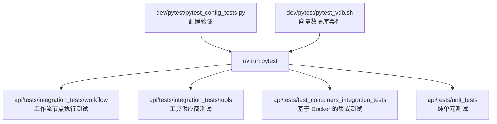
**来源：** [.github/workflows/api-tests.yml42-79](https://github.com/langgenius/dify/blob/92dbc94f/.github/workflows/api-tests.yml#L42-L79) [.github/workflows/vdb-tests.yml89-90](https://github.com/langgenius/dify/blob/92dbc94f/.github/workflows/vdb-tests.yml#L89-L90)

### 测试环境设置

API 测试环境需要通过 Docker Compose 编排的特定中间件服务：

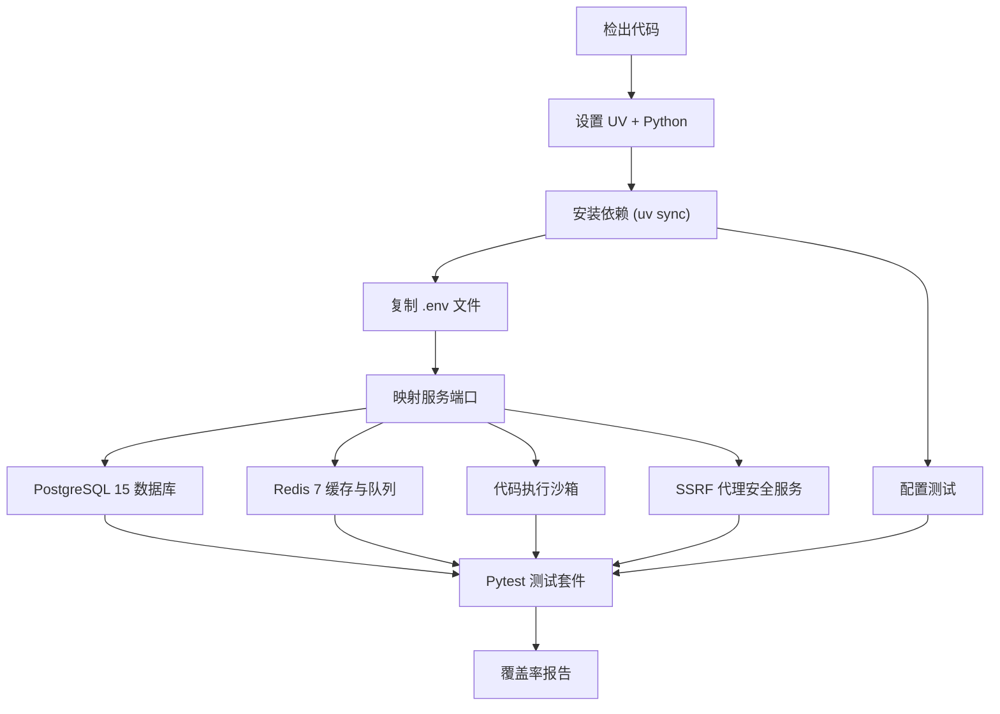
**来源：** [.github/workflows/api-tests.yml23-79](https://github.com/langgenius/dify/blob/92dbc94f/.github/workflows/api-tests.yml#L23-L79)

环境配置包括：

-   **环境文件**：将 `docker/.env.example` 复制为 `docker/.env`，将 `docker/middleware.env.example` 复制为 `docker/middleware.env`。
-   **测试配置**：将 `api/tests/integration_tests/.env.example` 复制为 `api/tests/integration_tests/.env`。
-   **存储设置**：`STORAGE_TYPE=opendal`, `OPENDAL_SCHEME=fs`, `OPENDAL_FS_ROOT=/tmp/dify-storage`。

**来源：** [.github/workflows/api-tests.yml45-72](https://github.com/langgenius/dify/blob/92dbc94f/.github/workflows/api-tests.yml#L45-L72)

---

## Web 测试基础设施

### 测试框架

Web 前端使用 Vitest 和 React Testing Library 进行测试：

| 组件 | 工具 | 目的 |
| --- | --- | --- |
| 测试运行器 | Vitest | 带有热重载 (HMR) 的快速单元测试执行 |
| 组件测试 | React Testing Library | 以用户为中心的组件测试 |
| 覆盖率统计 | Istanbul (c8) | 代码覆盖率测量 |
| 构建验证 | Next.js build | 生产环境构建验证 |

**来源：** [web/README.md110-138](https://github.com/langgenius/dify/blob/92dbc94f/web/README.md#L110-L138)

### 测试执行

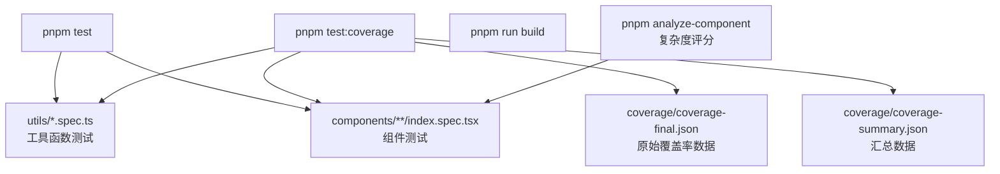
**来源：** [web/README.md110-138](https://github.com/langgenius/dify/blob/92dbc94f/web/README.md#L110-L138) [.github/workflows/web-tests.yml19-43](https://github.com/langgenius/dify/blob/92dbc94f/.github/workflows/web-tests.yml#L19-L43)

### 覆盖率报告

Web 测试工作流生成精细到文件级的详细覆盖率报告。覆盖率计算逻辑支持 `coverage-final.json` 和 `coverage-summary.json` 两种格式：

**行覆盖率计算方法**（按优先级排序）：

1.  预计算的 `lineHits` 对象 (`entry.l`)。
2.  Istanbul FileCoverage API (`fileCoverage.getLineCoverage()`)。
3.  语句映射转换 (`getLineCoverageFromStatements`)。

**报告的覆盖率指标**：

-   行覆盖率 (Lines coverage)。
-   语句覆盖率 (Statements coverage)。
-   分支覆盖率 (Branches coverage)。
-   函数覆盖率 (Functions coverage)。
-   未覆盖的行范围（格式如 `1-5,10,15-20`）。

**来源：** [.github/workflows/web-tests.yml44-359](https://github.com/langgenius/dify/blob/92dbc94f/.github/workflows/web-tests.yml#L44-L359)

---

## 向量数据库测试

### 受支持的数据库

VDB 测试套件验证了与 10 多种向量数据库实现的集成：

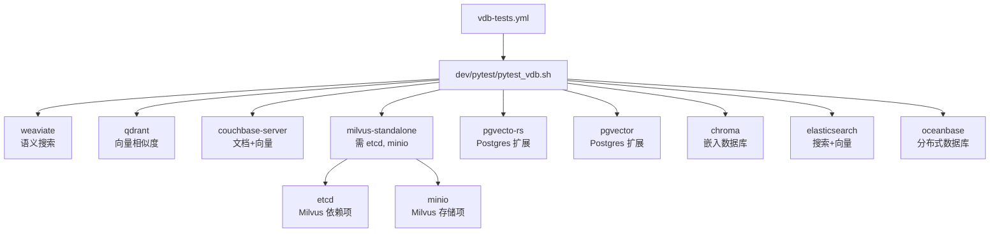
**来源：** [.github/workflows/vdb-tests.yml62-78](https://github.com/langgenius/dify/blob/92dbc94f/.github/workflows/vdb-tests.yml#L62-L78)

### 测试环境

VDB 测试需要额外的磁盘空间，并在运行中采取了特定的优化：

| 配置项 | 取值 | 目的 |
| --- | --- | --- |
| 磁盘清理 | `free-disk-space@v3` | 移除 .NET, Haskell 及工具缓存 |
| Python 矩阵 | 3.11, 3.12 | 多版本验证 |
| 服务定义文件 | `docker/docker-compose.yaml` | VDB 服务定义 |
| 测试脚本 | `dev/pytest/pytest_vdb.sh` | 针对 VDB 的专用测试运行脚本 |

**来源：** [.github/workflows/vdb-tests.yml26-90](https://github.com/langgenius/dify/blob/92dbc94f/.github/workflows/vdb-tests.yml#L26-L90)

---

## 数据库迁移测试

### 离线迁移验证

离线迁移测试验证了在不连接数据库的情况下，迁移脚本能否正确生成 SQL 语句：

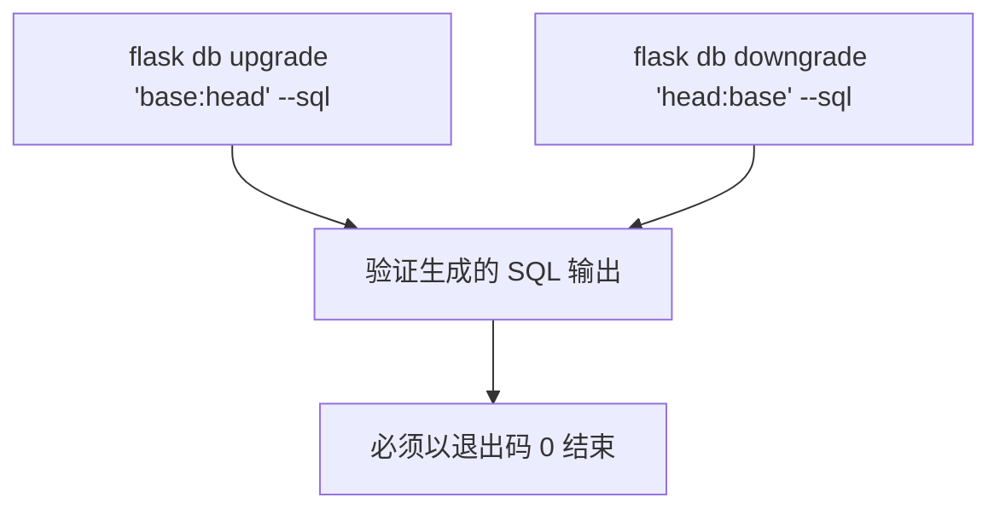
**来源：** [.github/workflows/db-migration-test.yml30-35](https://github.com/langgenius/dify/blob/92dbc94f/.github/workflows/db-migration-test.yml#L30-L35)

### 在线迁移验证

在线迁移测试在真实的数据库上执行迁移，以确保它们在类生产环境下能够成功：

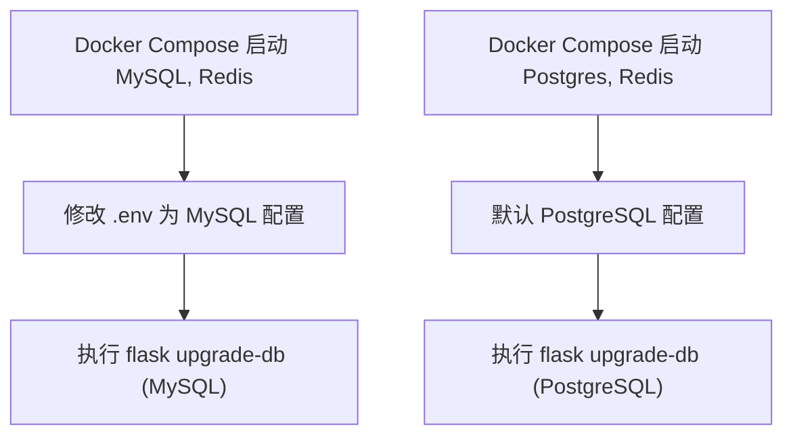
**来源：** [.github/workflows/db-migration-test.yml37-116](https://github.com/langgenius/dify/blob/92dbc94f/.github/workflows/db-migration-test.yml#L37-L116)

### 针对 MySQL 的配置转换

MySQL 迁移测试需要对环境变量进行转换：

```bash
# 针对 docker/middleware.env
sed -i 's/DB_TYPE=postgresql/DB_TYPE=mysql/' middleware.env
sed -i 's/DB_HOST=db_postgres/DB_HOST=db_mysql/' middleware.env
sed -i 's/DB_PORT=5432/DB_PORT=3306/' middleware.env
sed -i 's/DB_USERNAME=postgres/DB_USERNAME=mysql/' middleware.env

# 针对 api/.env
sed -i 's/DB_TYPE=postgresql/DB_TYPE=mysql/' .env
sed -i 's/DB_PORT=5432/DB_PORT=3306/' .env
sed -i 's/DB_USERNAME=postgres/DB_USERNAME=root/' .env
```
**来源：** [.github/workflows/db-migration-test.yml87-111](https://github.com/langgenius/dify/blob/92dbc94f/.github/workflows/db-migration-test.yml#L87-L111)

---

## 代码质量与 Lint 检查

### Python 风格检查

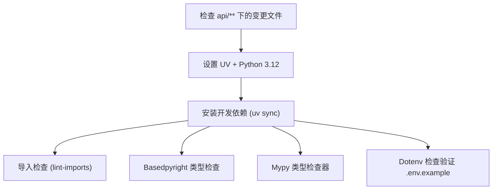
**来源：** [.github/workflows/style.yml16-61](https://github.com/langgenius/dify/blob/92dbc94f/.github/workflows/style.yml#L16-L61)

**Mypy 配置说明**：

-   排除目录：`tests/`, `migrations/`。
-   标志位：`--check-untyped-defs` (检查未定义类型的函数), `--disable-error-code=import-untyped`。
-   作用范围：排除 `.gitignore` 匹配的所有文件。

**来源：** [.github/workflows/style.yml54-56](https://github.com/langgenius/dify/blob/92dbc94f/.github/workflows/style.yml#L54-L56)

### Web 风格检查

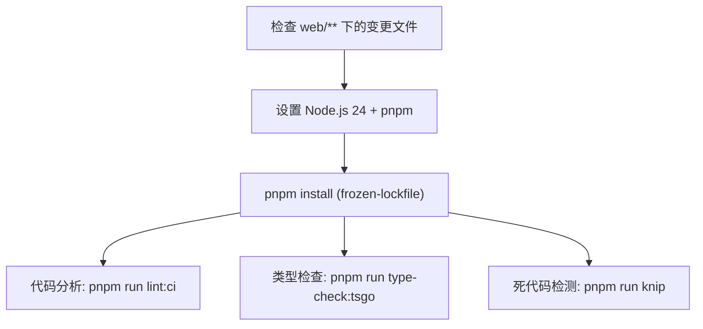
**来源：** [.github/workflows/style.yml62-129](https://github.com/langgenius/dify/blob/92dbc94f/.github/workflows/style.yml#L62-L129)

### SuperLinter 配置

SuperLinter 用于验证 shell 脚本、YAML 文件和 Dockerfile：

| 验证器 | 状态 | 严重程度 |
| --- | --- | --- |
| BASH | 已启用 | warning |
| BASH_EXEC | 已启用 | - |
| DOCKERFILE_HADOLINT | 已启用 | - |
| EDITORCONFIG | 已启用 | - |
| XML | 已启用 | - |
| YAML | 已启用 | - |

**文件过滤器**：

-   包含：`**.sh`, `**.yaml`, `**.yml`, `**Dockerfile`, `dev/**`, `.editorconfig`。
-   排除：Git 忽略的文件、自动生成的文件。

**来源：** [.github/workflows/style.yml130-172](https://github.com/langgenius/dify/blob/92dbc94f/.github/workflows/style.yml#L130-L172)

---

## CI/CD 流水线集成

### 有条件的测试执行

主 CI 流水线使用路径过滤来仅执行相关的测试套件：

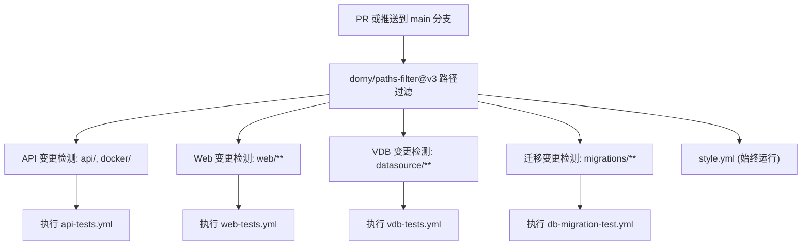
**来源：** [.github/workflows/main-ci.yml20-79](https://github.com/langgenius/dify/blob/92dbc94f/.github/workflows/main-ci.yml#L20-L79)

### 并发控制

所有测试工作流均实现了并发控制，以取消冗余的运行：

```yaml
concurrency:
  group: <workflow-name>-${{ github.head_ref || github.run_id }}
  cancel-in-progress: true
```
此模式：

-   按工作流名称 + 分支/运行 ID 进行分组。
-   当有新提交推送时，取消先前的运行。
-   减少了 CI/CD 的资源消耗。

**来源：** [.github/workflows/api-tests.yml6-8](https://github.com/langgenius/dify/blob/92dbc94f/.github/workflows/api-tests.yml#L6-L8) [.github/workflows/web-tests.yml6-8](https://github.com/langgenius/dify/blob/92dbc94f/.github/workflows/web-tests.yml#L6-L8) [.github/workflows/vdb-tests.yml6-8](https://github.com/langgenius/dify/blob/92dbc94f/.github/workflows/vdb-tests.yml#L6-L8)

---

## 覆盖率报告

### API 覆盖率工作流

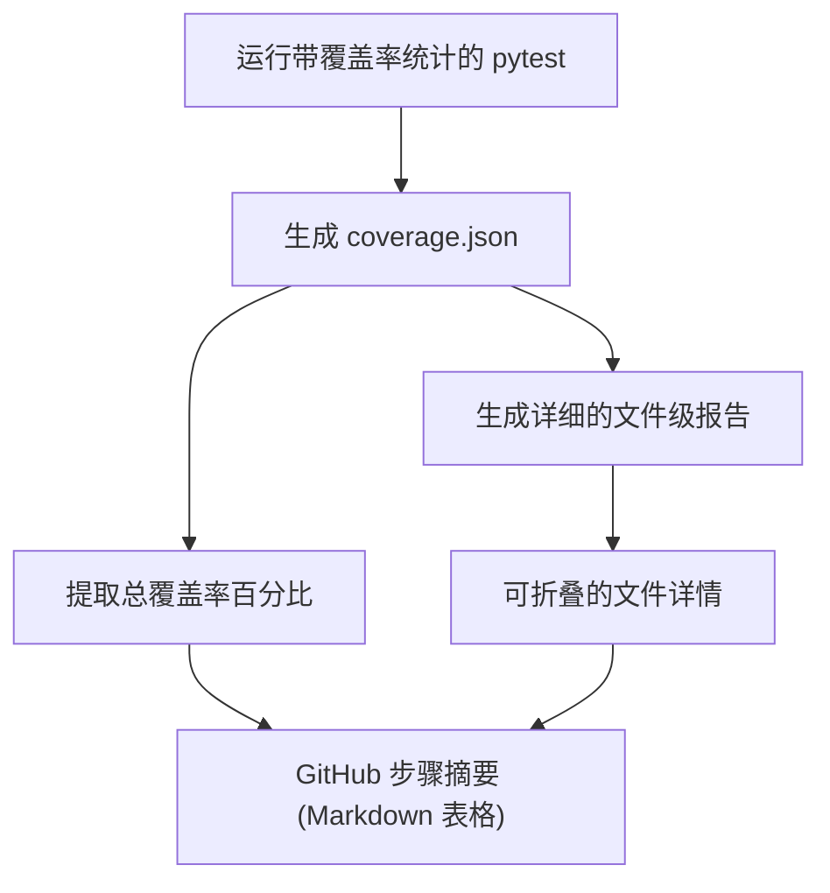
**来源：** [.github/workflows/api-tests.yml81-98](https://github.com/langgenius/dify/blob/92dbc94f/.github/workflows/api-tests.yml#L81-L98)

**覆盖率摘要格式**：

```
### Test Coverage Summary :test_tube:
Total Coverage: 85.42%

<details><summary>File-level coverage (click to expand)</summary>
```
[详细的文件级覆盖率报告]

```
</details>
```
### Web 覆盖率工作流

Web 覆盖率工作流提供了多维度的全面指标：

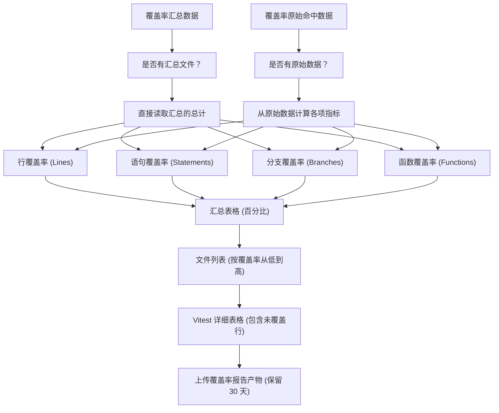
**来源：** [.github/workflows/web-tests.yml44-368](https://github.com/langgenius/dify/blob/92dbc94f/.github/workflows/web-tests.yml#L44-L368)

**未覆盖行格式化**：

-   从命中数据中检测未覆盖的行。
-   格式化为范围：`1-5,10,15-20`。
-   处理边界情况（无行数据、缺少 fileCoverage API 等）。

**来源：** [.github/workflows/web-tests.yml249-269](https://github.com/langgenius/dify/blob/92dbc94f/.github/workflows/web-tests.yml#L249-L269)

### 覆盖率产物上传

API 和 Web 测试均将覆盖率数据保留为 GitHub 产物 (Artifacts)：

| 工作流 | 产物名称 | 路径 | 保留时间 |
| --- | --- | --- | --- |
| Web 测试 | `web-coverage-report` | `web/coverage` | 30 天 |
| API 测试 | （以内联方式显示在摘要中） | - | - |

**来源：** [.github/workflows/web-tests.yml361-368](https://github.com/langgenius/dify/blob/92dbc94f/.github/workflows/web-tests.yml#L361-L368)

---

## 测试执行命令

### API 测试命令

```bash
# 运行配置测试
uv run --project api dev/pytest/pytest_config_tests.py

# 运行主测试套件
uv run --project api pytest \
  --timeout 180 \
  api/tests/integration_tests/workflow \
  api/tests/integration_tests/tools \
  api/tests/test_containers_integration_tests \
  api/tests/unit_tests

# 运行向量数据库 (VDB) 测试
uv run --project api bash dev/pytest/pytest_vdb.sh

# 生成覆盖率报告
uv run --project api coverage report -m
```
**来源：** [.github/workflows/api-tests.yml42-95](https://github.com/langgenius/dify/blob/92dbc94f/.github/workflows/api-tests.yml#L42-L95) [.github/workflows/vdb-tests.yml90](https://github.com/langgenius/dify/blob/92dbc94f/.github/workflows/vdb-tests.yml#L90-L90)

### Web 测试命令

```bash
# 安装依赖
pnpm install --frozen-lockfile

# 运行带覆盖率统计的测试
pnpm test:coverage

# 验证生产环境构建
pnpm run build

# 分析组件复杂度
pnpm analyze-component app/components/your-component/index.tsx
```
**来源：** [.github/workflows/web-tests.yml39-42](https://github.com/langgenius/dify/blob/92dbc94f/.github/workflows/web-tests.yml#L39-L42) [web/README.md116-138](https://github.com/langgenius/dify/blob/92dbc94f/web/README.md#L116-L138)

### 迁移测试命令

```bash
# 离线迁移验证
uv run --directory api flask db upgrade 'base:head' --sql
uv run --directory api flask db downgrade 'head:base' --sql

# 在线执行迁移
uv run --directory api flask upgrade-db
```
**来源：** [.github/workflows/db-migration-test.yml30-59](https://github.com/langgenius/dify/blob/92dbc94f/.github/workflows/db-migration-test.yml#L30-L59)

---

## 测试容器管理

### Docker Compose 服务定义

测试基础设施使用 Docker Compose，并通过 Profile 机制激活服务：

**API 测试所需服务**：

-   `db_postgres` - PostgreSQL 15 数据库。
-   `redis` - Redis 7 缓存与队列。
-   `sandbox` - 代码执行沙箱。
-   `ssrf_proxy` - 安全代理 (squid)。

**VDB 测试所需服务**：

-   基础服务 (weaviate, qdrant, pgvector 等)。
-   辅助服务 (Milvus 所需的 etcd, minio)。
-   专用数据库 (couchbase, elasticsearch, oceanbase)。

**来源：** [.github/workflows/api-tests.yml50-62](https://github.com/langgenius/dify/blob/92dbc94f/.github/workflows/api-tests.yml#L50-L62) [.github/workflows/vdb-tests.yml62-78](https://github.com/langgenius/dify/blob/92dbc94f/.github/workflows/vdb-tests.yml#L62-L78)

### 服务端口映射

`.github/workflows/expose_service_ports.sh` 脚本通过将 Docker 网络端口映射到 localhost，使容器化服务对测试运行器可见。

**来源：** [.github/workflows/api-tests.yml50-51](https://github.com/langgenius/dify/blob/92dbc94f/.github/workflows/api-tests.yml#L50-L51)

