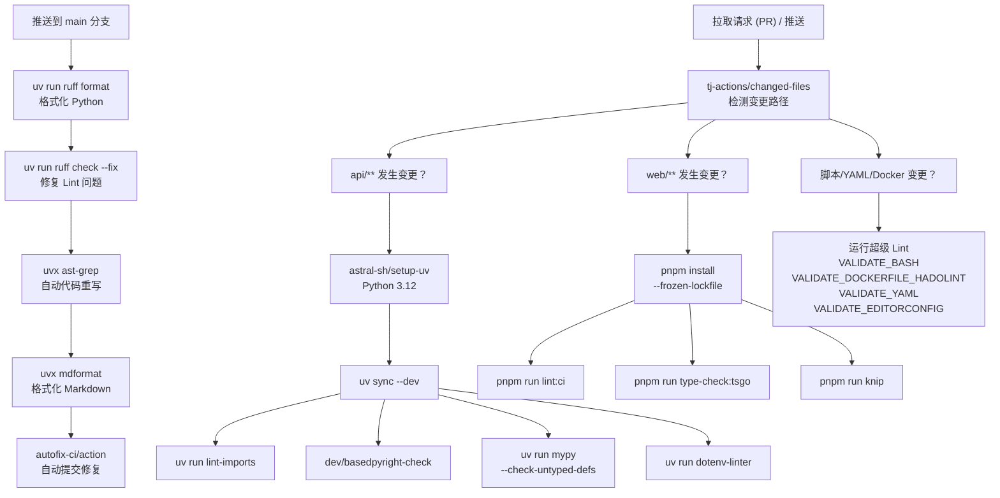
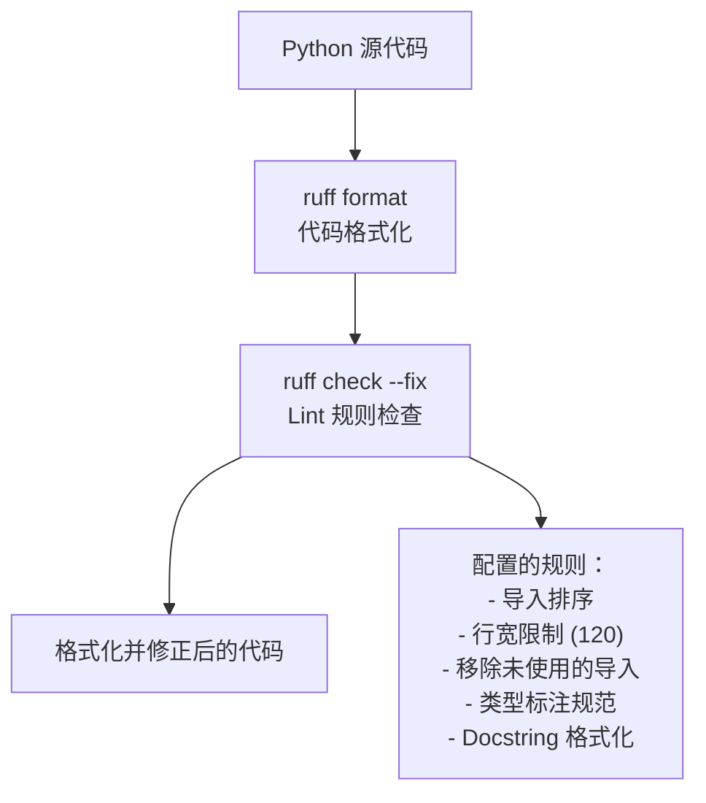
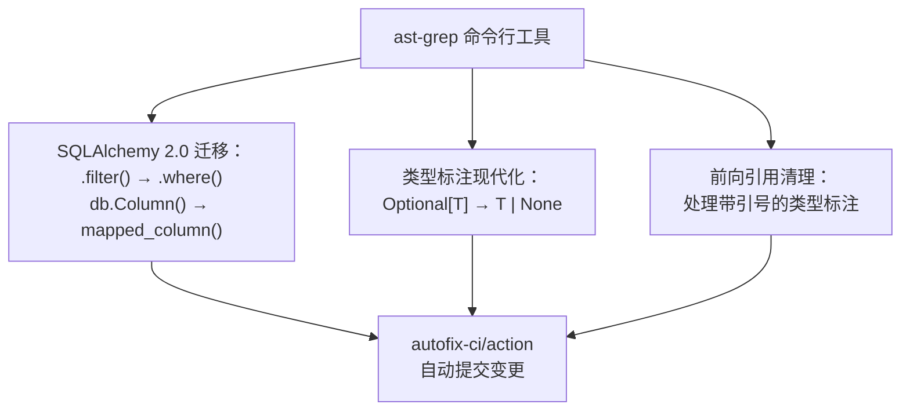
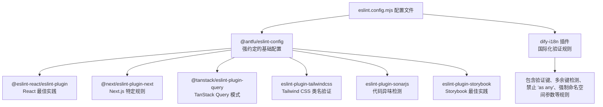
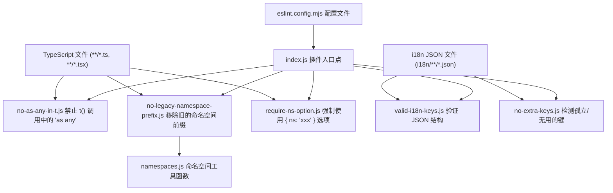

# 代码质量与 Lint 检查

相关源文件

-   [.github/workflows/api-tests.yml](https://github.com/langgenius/dify/blob/92dbc94f/.github/workflows/api-tests.yml)
-   [.github/workflows/autofix.yml](https://github.com/langgenius/dify/blob/92dbc94f/.github/workflows/autofix.yml)
-   [.github/workflows/build-push.yml](https://github.com/langgenius/dify/blob/92dbc94f/.github/workflows/build-push.yml)
-   [.github/workflows/db-migration-test.yml](https://github.com/langgenius/dify/blob/92dbc94f/.github/workflows/db-migration-test.yml)
-   [.github/workflows/deploy-agent-dev.yml](https://github.com/langgenius/dify/blob/92dbc94f/.github/workflows/deploy-agent-dev.yml)
-   [.github/workflows/deploy-dev.yml](https://github.com/langgenius/dify/blob/92dbc94f/.github/workflows/deploy-dev.yml)
-   [.github/workflows/deploy-hitl.yml](https://github.com/langgenius/dify/blob/92dbc94f/.github/workflows/deploy-hitl.yml)
-   [.github/workflows/docker-build.yml](https://github.com/langgenius/dify/blob/92dbc94f/.github/workflows/docker-build.yml)
-   [.github/workflows/main-ci.yml](https://github.com/langgenius/dify/blob/92dbc94f/.github/workflows/main-ci.yml)
-   [.github/workflows/stale.yml](https://github.com/langgenius/dify/blob/92dbc94f/.github/workflows/stale.yml)
-   [.github/workflows/style.yml](https://github.com/langgenius/dify/blob/92dbc94f/.github/workflows/style.yml)
-   [.github/workflows/tool-test-sdks.yaml](https://github.com/langgenius/dify/blob/92dbc94f/.github/workflows/tool-test-sdks.yaml)
-   [.github/workflows/translate-i18n-claude.yml](https://github.com/langgenius/dify/blob/92dbc94f/.github/workflows/translate-i18n-claude.yml)
-   [.github/workflows/trigger-i18n-sync.yml](https://github.com/langgenius/dify/blob/92dbc94f/.github/workflows/trigger-i18n-sync.yml)
-   [.github/workflows/vdb-tests.yml](https://github.com/langgenius/dify/blob/92dbc94f/.github/workflows/vdb-tests.yml)
-   [.github/workflows/web-tests.yml](https://github.com/langgenius/dify/blob/92dbc94f/.github/workflows/web-tests.yml)
-   [api/Dockerfile](https://github.com/langgenius/dify/blob/92dbc94f/api/Dockerfile)
-   [api/migrations/README](https://github.com/langgenius/dify/blob/92dbc94f/api/migrations/README)
-   [web/.nvmrc](https://github.com/langgenius/dify/blob/92dbc94f/web/.nvmrc)
-   [web/Dockerfile](https://github.com/langgenius/dify/blob/92dbc94f/web/Dockerfile)
-   [web/README.md](https://github.com/langgenius/dify/blob/92dbc94f/web/README.md)
-   [web/app/(commonLayout)/app/(appDetailLayout)/layout.tsx](https://github.com/langgenius/dify/blob/92dbc94f/web/app/(commonLayout)/app/(appDetailLayout)/layout.tsx)
-   [web/app/(commonLayout)/datasets/(datasetDetailLayout)/[datasetId]/settings/page.tsx](web/app/(commonLayout)/datasets/(datasetDetailLayout)/%5BdatasetId%5D/settings/page.tsx)
-   [web/app/components/base/logo/logo-embedded-chat-avatar.tsx](https://github.com/langgenius/dify/blob/92dbc94f/web/app/components/base/logo/logo-embedded-chat-avatar.tsx)
-   [web/app/components/plugins/marketplace/description/index.spec.tsx](https://github.com/langgenius/dify/blob/92dbc94f/web/app/components/plugins/marketplace/description/index.spec.tsx)
-   [web/app/components/plugins/marketplace/description/index.tsx](https://github.com/langgenius/dify/blob/92dbc94f/web/app/components/plugins/marketplace/description/index.tsx)
-   [web/app/components/provider/serwist.tsx](https://github.com/langgenius/dify/blob/92dbc94f/web/app/components/provider/serwist.tsx)
-   [web/app/serwist/[path]/route.ts](web/app/serwist/%5Bpath%5D/route.ts)
-   [web/app/sw.ts](https://github.com/langgenius/dify/blob/92dbc94f/web/app/sw.ts)
-   [web/eslint-rules/rules/no-as-any-in-t.js](https://github.com/langgenius/dify/blob/92dbc94f/web/eslint-rules/rules/no-as-any-in-t.js)
-   [web/eslint-rules/rules/no-legacy-namespace-prefix.js](https://github.com/langgenius/dify/blob/92dbc94f/web/eslint-rules/rules/no-legacy-namespace-prefix.js)
-   [web/eslint-rules/rules/require-ns-option.js](https://github.com/langgenius/dify/blob/92dbc94f/web/eslint-rules/rules/require-ns-option.js)
-   [web/eslint-suppressions.json](https://github.com/langgenius/dify/blob/92dbc94f/web/eslint-suppressions.json)
-   [web/eslint.config.mjs](https://github.com/langgenius/dify/blob/92dbc94f/web/eslint.config.mjs)
-   [web/i18n-config/README.md](https://github.com/langgenius/dify/blob/92dbc94f/web/i18n-config/README.md)
-   [web/i18n-config/lib.client.ts](https://github.com/langgenius/dify/blob/92dbc94f/web/i18n-config/lib.client.ts)
-   [web/i18n-config/lib.server.ts](https://github.com/langgenius/dify/blob/92dbc94f/web/i18n-config/lib.server.ts)
-   [web/i18n-config/server.ts](https://github.com/langgenius/dify/blob/92dbc94f/web/i18n-config/server.ts)
-   [web/knip.config.ts](https://github.com/langgenius/dify/blob/92dbc94f/web/knip.config.ts)
-   [web/next.config.js](https://github.com/langgenius/dify/blob/92dbc94f/web/next.config.js)
-   [web/pnpm-lock.yaml](https://github.com/langgenius/dify/blob/92dbc94f/web/pnpm-lock.yaml)
-   [web/scripts/gen-icons.mjs](https://github.com/langgenius/dify/blob/92dbc94f/web/scripts/gen-icons.mjs)
-   [web/utils/server-only-context.ts](https://github.com/langgenius/dify/blob/92dbc94f/web/utils/server-only-context.ts)

本文档描述了 Dify 代码库中的代码质量与 Lint 检查基础设施，包括样式检查器、类型检查器、格式化工具以及针对 Python API 和 TypeScript Web 前端的自定义 Lint 规则。有关测试基础设施的信息，请参阅 [10.3](/langgenius/dify/10.3-testing-infrastructure)。有关 CI/CD 流水线架构，请参阅 [10.2](/langgenius/dify/10.2-cicd-pipeline-architecture)。

## 概览

Dify 通过集成到 CI/CD 流水线中的多个自动化 Lint 系统来强制执行代码质量。代码库根据工具链的不同分为两个主要领域：

| 领域 | 主要工具 | 配置文件 |
| --- | --- | --- |
| **Python (API)** | Ruff, Basedpyright, Mypy, Import Linter | `api/pyproject.toml`, `api/uv.lock` |
| **Web (TypeScript)** | ESLint, TypeScript Compiler, Knip | `web/eslint.config.mjs`, `web/tsconfig.json`, `web/knip.config.ts` |
| **横切关注点** | SuperLinter, dotenv-linter, mdformat | `.github/workflows/style.yml`, `.github/workflows/autofix.yml` |

所有样式检查均在 GitHub Actions 的拉取请求 (PR) 以及推送到 main 分支时运行。`autofix` 工作流在推送到 main 分支时会自动应用格式化和某些 Lint 修复。

**来源：** [.github/workflows/style.yml1-172](https://github.com/langgenius/dify/blob/92dbc94f/.github/workflows/style.yml#L1-L172) [.github/workflows/autofix.yml1-88](https://github.com/langgenius/dify/blob/92dbc94f/.github/workflows/autofix.yml#L1-L88)

## CI/CD Lint 检查流水线


**来源：** [.github/workflows/style.yml1-172](https://github.com/langgenius/dify/blob/92dbc94f/.github/workflows/style.yml#L1-L172) [.github/workflows/autofix.yml1-88](https://github.com/langgenius/dify/blob/92dbc94f/.github/workflows/autofix.yml#L1-L88)

## Python Lint 检查与类型检查

API 代码库采用了多层次的 Python 代码质量保障方法：

### Ruff - 高性能 Python Lint 检查器与格式化工具

Ruff 兼具 Lint 检查和格式化功能，通过单一的 Rust 实现替代了 Flake8、Black、isort 等多种工具。


**配置说明：** Ruff 配置由 `api/pyproject.toml` 管理，包含导入排序、行宽限制及代码风格规则。`autofix` 工作流会在 `ruff check --fix` 之前运行 `ruff format`，以确保修复顺序的一致性。

**来源：** [.github/workflows/autofix.yml38-46](https://github.com/langgenius/dify/blob/92dbc94f/.github/workflows/autofix.yml#L38-L46) [.github/workflows/style.yml42-56](https://github.com/langgenius/dify/blob/92dbc94f/.github/workflows/style.yml#L42-L56)

### 类型检查 - Basedpyright 与 Mypy

代码库使用双重类型检查器以确保类型安全性：

| 工具 | 目的 | 配置方式 |
| --- | --- | --- |
| **Basedpyright** | 现代 Python 类型检查器 (Pyright 分支) | 通过 `dev/basedpyright-check` 脚本运行 |
| **Mypy** | 传统的渐进式类型检查器 | 设置了 `--check-untyped-defs` 等参数并排除了测试目录 |

**调用方式：**

```bash
# 执行 Basedpyright 检查
dev/basedpyright-check

# 执行 Mypy 检查
uv --directory api run mypy \
  --exclude-gitignore \
  --exclude 'tests/' \
  --exclude 'migrations/' \
  --check-untyped-defs \
  --disable-error-code=import-untyped .
```
**来源：** [.github/workflows/style.yml50-56](https://github.com/langgenius/dify/blob/92dbc94f/.github/workflows/style.yml#L50-L56)

### Import Linter - 维护架构边界

Import Linter 通过拦截违反预定义边界的导入行为，来强制执行架构层的分离。

**调用方式：**

```bash
uv run --directory api --dev lint-imports
```
该工具确保高层模块不会不当地依赖低层模块，从而维护整洁的架构。

**来源：** [.github/workflows/style.yml46-48](https://github.com/langgenius/dify/blob/92dbc94f/.github/workflows/style.yml#L46-L48)

### AST-Grep - 自动化代码转换

`autofix` 工作流使用 `ast-grep` (抽象语法树搜索/替换) 进行自动化的重构模式匹配：


**模式示例：**

```bash
# 将 SQLAlchemy 1.x 转换为 2.0 语法
ast-grep --pattern 'db.session.query($WHATEVER).filter($HERE)' \
         --rewrite 'db.session.query($WHATEVER).where($HERE)'

# 现代化类型标注
ast-grep --pattern 'Optional[$T]' --rewrite '$T | None'
```
**来源：** [.github/workflows/autofix.yml53-80](https://github.com/langgenius/dify/blob/92dbc94f/.github/workflows/autofix.yml#L53-L80)

### Dotenv Linter

验证 `.env.example` 文件在 API 和 Web 之间的一致性：

```bash
uv run --project api dotenv-linter ./api/.env.example ./web/.env.example
```
**来源：** [.github/workflows/style.yml58-60](https://github.com/langgenius/dify/blob/92dbc94f/.github/workflows/style.yml#L58-L60)

## Web Lint 检查与类型检查

Next.js 前端使用 ESLint，并配合大量插件及自定义规则：

### ESLint 配置架构


**关键配置决策：**

| 设置项 | 取值 | 理由 |
| --- | --- | --- |
| `ts/no-explicit-any` | `error` | 强制类型安全，禁止逃生口 |
| `ts/consistent-type-definitions` | `type` 优先于 `interface` | 统一的类型定义风格 |
| `react-compiler` | `false` | 性能考虑 —— 编译器规则执行较慢 |
| `tailwindcss/classnames-order` | `warn` | 维持一致的类名排序 |
| `tailwindcss/no-custom-classname` | `off` | 面对 1000 多行的配置时存在性能问题 |

**来源：** [web/eslint.config.mjs1-136](https://github.com/langgenius/dify/blob/92dbc94f/web/eslint.config.mjs#L1-L136)

### ESLint 执行方式

```bash
# CI 执行
pnpm run lint:ci

# 本地开发（带自动修复）
pnpm run lint --fix
```
`lint:ci` 命令运行 ESLint 并带有 `--max-warnings 0` 标志，从而在 CI 中将警告视为错误处理。

**来源：** [.github/workflows/style.yml108-109](https://github.com/langgenius/dify/blob/92dbc94f/.github/workflows/style.yml#L108-L109)

### TypeScript 类型检查

类型检查独立于 ESLint 运行，使用自定义的 TypeScript 编译器包装器：

```bash
pnpm run type-check:tsgo
```
该命令调用了 `@typescript/native-preview` (tsgo)，这是一种更快的原生 TypeScript 编译器实现，相比标准的 `tsc` 在类型检查速度上有显著提升。

**配置说明：** [web/tsconfig.json](https://github.com/langgenius/dify/blob/92dbc94f/web/tsconfig.json) 定义了严格的类型检查规则，包括 `strict: true`, `noImplicitAny: true` 以及 Next.js 特定的编译选项。

**来源：** [.github/workflows/style.yml120-123](https://github.com/langgenius/dify/blob/92dbc94f/.github/workflows/style.yml#L120-L123) [web/pnpm-lock.yaml475-477](https://github.com/langgenius/dify/blob/92dbc94f/web/pnpm-lock.yaml#L475-L477)

### Knip - 死代码检测

Knip 用于识别未使用的文件、依赖项以及导出项：

```bash
pnpm run knip
```
**`web/knip.config.ts` 中的配置：**

```javascript
{
  entry: ['scripts/**/*.{js,ts,mjs}', 'bin/**/*.{js,ts,mjs}'],
  ignore: ['i18n/**', 'public/**'],
  rules: {
    files: 'warn',
    dependencies: 'warn',
    exports: 'warn',
    classMembers: 'warn',
    types: 'warn',
    duplicates: 'warn'
  }
}
```
所有规则均设置为 `warn` 级别，以报告问题而不中断构建。

**来源：** [web/knip.config.ts1-37](https://github.com/langgenius/dify/blob/92dbc94f/web/knip.config.ts#L1-L37) [.github/workflows/style.yml125-128](https://github.com/langgenius/dify/blob/92dbc94f/.github/workflows/style.yml#L125-L128)

## 针对国际化的自定义 ESLint 规则

Dify 实现了自定义 ESLint 规则，以强制执行国际化翻译的最佳实践并捕获常见错误：

### 自定义规则架构


**来源：** [web/eslint.config.mjs107-135](https://github.com/langgenius/dify/blob/92dbc94f/web/eslint.config.mjs#L107-L135) [web/eslint-rules/](https://github.com/langgenius/dify/blob/92dbc94f/web/eslint-rules/)

### 规则：`no-as-any-in-t`

**目的：** 通过禁止 `as any` 类型断言，防止翻译调用中的类型安全失效。

**违规示例：**

```javascript
// ❌ 差的做法 —— 丧失了类型安全性
t('some.key' as any)

// ✅ 好的做法 —— 正确的类型推导
t('common.submit')
```
**配置选项：**

-   `any` 模式（默认）：仅标记 `as any`。
-   `all` 模式：标记所有类型断言，包括 `as string` 等。

**来源：** [web/eslint-rules/rules/no-as-any-in-t.js1-106](https://github.com/langgenius/dify/blob/92dbc94f/web/eslint-rules/rules/no-as-any-in-t.js#L1-L106)

### 规则：`no-legacy-namespace-prefix`

**目的：** 强制执行现代的命名空间使用模式，即在 `useTranslation()` Hook 中指定命名空间，而非在键名中使用前缀。

**违规示例：**

```javascript
// ❌ 差的做法 —— 遗留的命名空间前缀
const { t } = useTranslation()
t('common.submit')

// ✅ 好的做法 —— 在 Hook 中定义命名空间
const { t } = useTranslation('common')
t('submit')
```
**自动修复能力：** 该规则包含一个复杂的修复器，它可以：

1.  从键名前缀中提取命名空间。
2.  收集组件中使用的所有命名空间。
3.  更新 `useTranslation()` 调用以包含命名空间。
4.  从键名中移除命名空间前缀。

**来源：** [web/eslint-rules/rules/no-legacy-namespace-prefix.js1-321](https://github.com/langgenius/dify/blob/92dbc94f/web/eslint-rules/rules/no-legacy-namespace-prefix.js#L1-L321)

### 规则：`require-ns-option`

**目的：** 在不通过 `useTranslation()` Hook 上下文直接调用 `t()` 时，要求显式指定命名空间。

**违规示例：**

```javascript
// ❌ 差的做法 —— 缺失命名空间
t('submit')

// ✅ 好的做法 —— 显式指定命名空间
t('submit', { ns: 'common' })
```
**来源：** [web/eslint-rules/rules/require-ns-option.js1-52](https://github.com/langgenius/dify/blob/92dbc94f/web/eslint-rules/rules/require-ns-option.js#L1-L52)

### 规则：`valid-i18n-keys`

**目的：** 验证国际化 JSON 文件的结构，确保键名是扁平的（无嵌套对象）且格式正确。

**强制执行：**

-   使用点号分隔的扁平键名结构（例如 `