# 系统架构概览

相关源文件

-   [api/.env.example](https://github.com/langgenius/dify/blob/92dbc94f/api/.env.example)
-   [api/app.py](https://github.com/langgenius/dify/blob/92dbc94f/api/app.py)
-   [api/app\_factory.py](https://github.com/langgenius/dify/blob/92dbc94f/api/app_factory.py)
-   [api/commands.py](https://github.com/langgenius/dify/blob/92dbc94f/api/commands.py)
-   [api/configs/feature/\_\_init\_\_.py](https://github.com/langgenius/dify/blob/92dbc94f/api/configs/feature/__init__.py)
-   [api/configs/middleware/\_\_init\_\_.py](https://github.com/langgenius/dify/blob/92dbc94f/api/configs/middleware/__init__.py)
-   [api/configs/packaging/\_\_init\_\_.py](https://github.com/langgenius/dify/blob/92dbc94f/api/configs/packaging/__init__.py)
-   [api/controllers/console/datasets/datasets.py](https://github.com/langgenius/dify/blob/92dbc94f/api/controllers/console/datasets/datasets.py)
-   [api/core/rag/datasource/vdb/vector\_factory.py](https://github.com/langgenius/dify/blob/92dbc94f/api/core/rag/datasource/vdb/vector_factory.py)
-   [api/core/rag/datasource/vdb/vector\_type.py](https://github.com/langgenius/dify/blob/92dbc94f/api/core/rag/datasource/vdb/vector_type.py)
-   [api/extensions/ext\_storage.py](https://github.com/langgenius/dify/blob/92dbc94f/api/extensions/ext_storage.py)
-   [api/extensions/storage/storage\_type.py](https://github.com/langgenius/dify/blob/92dbc94f/api/extensions/storage/storage_type.py)
-   [api/models/account.py](https://github.com/langgenius/dify/blob/92dbc94f/api/models/account.py)
-   [api/models/api\_based\_extension.py](https://github.com/langgenius/dify/blob/92dbc94f/api/models/api_based_extension.py)
-   [api/models/dataset.py](https://github.com/langgenius/dify/blob/92dbc94f/api/models/dataset.py)
-   [api/models/model.py](https://github.com/langgenius/dify/blob/92dbc94f/api/models/model.py)
-   [api/models/oauth.py](https://github.com/langgenius/dify/blob/92dbc94f/api/models/oauth.py)
-   [api/models/provider.py](https://github.com/langgenius/dify/blob/92dbc94f/api/models/provider.py)
-   [api/models/source.py](https://github.com/langgenius/dify/blob/92dbc94f/api/models/source.py)
-   [api/models/task.py](https://github.com/langgenius/dify/blob/92dbc94f/api/models/task.py)
-   [api/models/tools.py](https://github.com/langgenius/dify/blob/92dbc94f/api/models/tools.py)
-   [api/models/trigger.py](https://github.com/langgenius/dify/blob/92dbc94f/api/models/trigger.py)
-   [api/models/web.py](https://github.com/langgenius/dify/blob/92dbc94f/api/models/web.py)
-   [api/models/workflow.py](https://github.com/langgenius/dify/blob/92dbc94f/api/models/workflow.py)
-   [api/pyproject.toml](https://github.com/langgenius/dify/blob/92dbc94f/api/pyproject.toml)
-   [api/tests/test\_containers\_integration\_tests/services/test\_advanced\_prompt\_template\_service.py](https://github.com/langgenius/dify/blob/92dbc94f/api/tests/test_containers_integration_tests/services/test_advanced_prompt_template_service.py)
-   [api/tests/test\_containers\_integration\_tests/services/test\_agent\_service.py](https://github.com/langgenius/dify/blob/92dbc94f/api/tests/test_containers_integration_tests/services/test_agent_service.py)
-   [api/tests/test\_containers\_integration\_tests/tasks/\_\_init\_\_.py](https://github.com/langgenius/dify/blob/92dbc94f/api/tests/test_containers_integration_tests/tasks/__init__.py)
-   [api/tests/test\_containers\_integration\_tests/tasks/test\_add\_document\_to\_index\_task.py](https://github.com/langgenius/dify/blob/92dbc94f/api/tests/test_containers_integration_tests/tasks/test_add_document_to_index_task.py)
-   [api/tests/unit\_tests/configs/test\_dify\_config.py](https://github.com/langgenius/dify/blob/92dbc94f/api/tests/unit_tests/configs/test_dify_config.py)
-   [api/tests/unit\_tests/core/test\_provider\_manager.py](https://github.com/langgenius/dify/blob/92dbc94f/api/tests/unit_tests/core/test_provider_manager.py)
-   [api/uv.lock](https://github.com/langgenius/dify/blob/92dbc94f/api/uv.lock)
-   [dev/pytest/pytest\_vdb.sh](https://github.com/langgenius/dify/blob/92dbc94f/dev/pytest/pytest_vdb.sh)
-   [docker/.env.example](https://github.com/langgenius/dify/blob/92dbc94f/docker/.env.example)
-   [docker/docker-compose-template.yaml](https://github.com/langgenius/dify/blob/92dbc94f/docker/docker-compose-template.yaml)
-   [docker/docker-compose.middleware.yaml](https://github.com/langgenius/dify/blob/92dbc94f/docker/docker-compose.middleware.yaml)
-   [docker/docker-compose.yaml](https://github.com/langgenius/dify/blob/92dbc94f/docker/docker-compose.yaml)
-   [docker/middleware.env.example](https://github.com/langgenius/dify/blob/92dbc94f/docker/middleware.env.example)
-   [web/package.json](https://github.com/langgenius/dify/blob/92dbc94f/web/package.json)

## 目的与范围

本文档提供了 Dify 系统架构的全面概述，包括其服务拓扑、核心组件、数据模型和部署结构。它描述了平台的各个层级如何交互以支持 AI 应用程序的开发和执行。

有关特定子系统的详细信息，请参阅：

-   服务部署和 Docker 配置：[服务拓扑与 Docker Compose](/langgenius/dify/2.1-service-topology-and-docker-compose)
-   数据模型和领域实体：[核心数据模型与领域实体](/langgenius/dify/2.2-core-data-models-and-domain-entities)
-   应用程序执行模式：[应用程序类型与执行模式](/langgenius/dify/2.3-application-types-and-execution-modes)
-   配置和环境设置：[配置管理系统](/langgenius/dify/2.4-configuration-management-system)

---

## 高层架构

Dify 是一个全栈 AI 应用程序开发平台，组织成独特的架构层。系统在前端、API、业务逻辑、后台处理、专用服务和数据持久层之间遵循清晰的关注点分离原则。

### 架构层级图

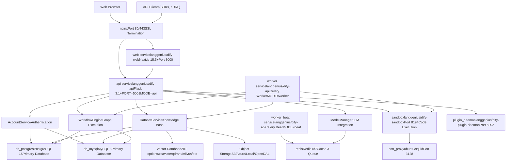
**来源：** [docker/docker-compose.yaml1-690](https://github.com/langgenius/dify/blob/92dbc94f/docker/docker-compose.yaml#L1-L690) [docker/docker-compose-template.yaml1-316](https://github.com/langgenius/dify/blob/92dbc94f/docker/docker-compose-template.yaml#L1-L316) [api/app.py1-30](https://github.com/langgenius/dify/blob/92dbc94f/api/app.py#L1-L30) [api/app\_factory.py1-150](https://github.com/langgenius/dify/blob/92dbc94f/api/app_factory.py#L1-L150)

---

## 服务拓扑

### 容器架构

Dify 的 Docker 部署包含在共享 `dify` 网络中运行的多个互联服务。该架构使用单个 API 镜像 (`langgenius/dify-api`)，通过 `MODE` 环境变量控制在三种不同模式下运行。

```mermaid
flowchart TD
    InitPerms["init_permissionsbusyboxUID: 1001Sets /app/api/storage permissions"]
    Nginx["nginxlanggenius/dify-nginxEXPOSE_NGINX_PORT:80EXPOSE_NGINX_SSL_PORT:443"]
    Web["weblanggenius/dify-web:1.11.4User: dify:1001PORT=3000"]
    API["apilanggenius/dify-api:1.11.4MODE=apiDIFY_PORT=5001User: dify:1001"]
    Worker["workerlanggenius/dify-api:1.11.4MODE=workerCELERY_WORKER_AMOUNTUser: dify:1001"]
    WorkerBeat["worker_beatlanggenius/dify-api:1.11.4MODE=beatUser: dify:1001"]
    Sandbox["sandboxlanggenius/dify-sandbox:0.2.12SANDBOX_PORT=8194API_KEY=SANDBOX_API_KEY"]
    PluginDaemon["plugin_daemonlanggenius/dify-plugin-daemon:0.5.2SERVER_PORT=5002SERVER_KEY=PLUGIN_DAEMON_KEY"]
    SSRFProxy["ssrf_proxyubuntu/squidSSRF_HTTP_PORT=3128"]
    DBPostgres["db_postgrespostgres:15-alpineProfile: postgresqlPGDATA volume"]
    DBMySQL["db_mysqlmysql:8.0Profile: mysqldata volume"]
    Redis["redisredis:6-alpineREDIS_PASSWORDdata volume"]
    Weaviate["weaviateProfile: weaviate"]
    Qdrant["qdrantProfile: qdrant"]
    Milvus["milvusProfile: milvus"]
    Others["20+ other VDB options"]
    EnvFile[".env fileshared-api-worker-env400+ variables"]

    InitPerms --> Web
    InitPerms --> API
    InitPerms --> Worker
    Nginx --> Web
    Nginx --> API
    Web --> API
    API --> DBPostgres
    API --> DBMySQL
    API --> Redis
    API --> Sandbox
    API --> PluginDaemon
    Worker --> DBPostgres
    Worker --> DBMySQL
    Worker --> Redis
    Worker --> Sandbox
    Worker --> SSRFProxy
    WorkerBeat --> Redis
    API --> Weaviate
    API --> Qdrant
    API --> Milvus
    API --> Others
    EnvFile --> API
    EnvFile --> Worker
    EnvFile --> WorkerBeat
    EnvFile --> Web
```
**关键设计模式：**

| 模式 | 实现 | 用途 |
| --- | --- | --- |
| **共享镜像** | `langgenius/dify-api` 作为 `api`, `worker`, `worker_beat` 运行 | 单次构建，多种部署模式 |
| **模式选择** | `MODE` 环境变量 (`api`, `worker`, `beat`) | 在运行时决定服务行为 |
| **非 Root 用户** | 所有服务以 `dify:1001` 运行 | 安全加固 |
| **Init 容器** | `init_permissions` 运行一次 busybox | 在主服务启动前设置正确的文件所有权 |
| **基于 Profile 的 VDB** | Docker Compose Profiles 对应 20+ 向量数据库 | 仅启用所需的 VDB，避免资源浪费 |
| **共享环境** | compose 文件中的 `shared-api-worker-env` 锚点 | 在 API 和 worker 服务之间共享 400+ 变量 |

**来源：** [docker/docker-compose.yaml1-690](https://github.com/langgenius/dify/blob/92dbc94f/docker/docker-compose.yaml#L1-L690) [docker/docker-compose-template.yaml1-316](https://github.com/langgenius/dify/blob/92dbc94f/docker/docker-compose-template.yaml#L1-L316) [docker/.env.example1-1000](https://github.com/langgenius/dify/blob/92dbc94f/docker/.env.example#L1-L1000)

### 服务依赖

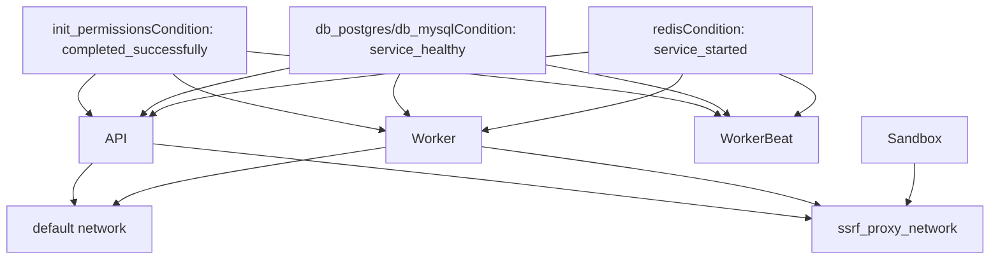
**依赖要求：**

-   **api/worker/worker\_beat** 依赖 `init_permissions` 成功完成
-   **api/worker/worker\_beat** 需要数据库健康检查通过 (`service_healthy`)
-   **api/worker/worker\_beat** 需要 Redis 启动 (`service_started`)
-   **sandbox** 和 **worker** 共享 `ssrf_proxy_network` 以进行安全的出站请求

**来源：** [docker/docker-compose-template.yaml39-131](https://github.com/langgenius/dify/blob/92dbc94f/docker/docker-compose-template.yaml#L39-L131)

---

## 核心组件

### Flask 应用程序工厂

API 服务使用应用程序工厂模式根据执行上下文创建具有不同配置的 Flask 应用程序。

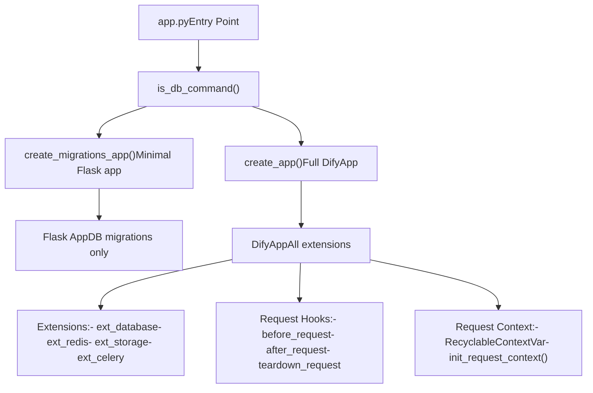
**应用程序初始化流程：**

| 步骤 | 函数 | 用途 |
| --- | --- | --- |
| 1 | `is_db_command()` | 检查是否运行 Flask DB 迁移命令 |
| 2 | `create_migrations_app()` | 创建用于 DB 操作的最小化应用程序 |
| 2 | `create_app()` | 创建具有所有扩展的完整 DifyApp |
| 3 | `DifyApp.__init__()` | 使用 `dify_config.model_dump()` 中的配置初始化 Flask |
| 4 | `before_request` hook | 初始化日志上下文，增加线程回收计数 |
| 5 | `after_request` hook | 如果启用，添加 OpenTelemetry 跟踪头 |

**来源：** [api/app.py1-30](https://github.com/langgenius/dify/blob/92dbc94f/api/app.py#L1-L30) [api/app\_factory.py1-150](https://github.com/langgenius/dify/blob/92dbc94f/api/app_factory.py#L1-L150) [api/dify\_app.py1-200](https://github.com/langgenius/dify/blob/92dbc94f/api/dify_app.py#L1-L200)

### 业务逻辑服务

核心业务逻辑被组织到封装领域操作的服务类中：

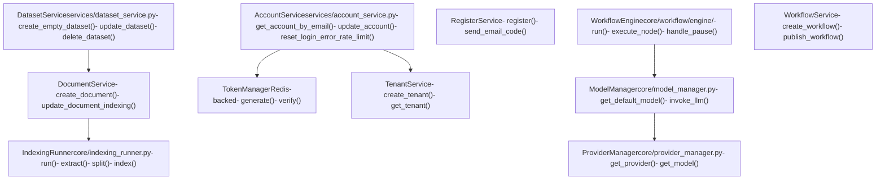
**来源：** [api/services/account\_service.py1-500](https://github.com/langgenius/dify/blob/92dbc94f/api/services/account_service.py#L1-L500) [api/services/dataset\_service.py1-1000](https://github.com/langgenius/dify/blob/92dbc94f/api/services/dataset_service.py#L1-L1000) [api/core/workflow/engine/workflow\_engine.py1-800](https://github.com/langgenius/dify/blob/92dbc94f/api/core/workflow/engine/workflow_engine.py#L1-L800) [api/core/model\_manager.py1-600](https://github.com/langgenius/dify/blob/92dbc94f/api/core/model_manager.py#L1-L600)

---

## 数据模型与关系

### 核心实体关系图


### 关键模型类

```mermaid
flowchart TD
    Provider["Provider- id: StringUUID- tenant_id: StringUUID- provider_name: String- provider_type: String- encrypted_config: LongText"]
    ProviderModel["ProviderModel- id: StringUUID- tenant_id: StringUUID- provider_name: String- model_name: String- model_type: ModelType- encrypted_config: LongText"]
    Dataset["Dataset- id: StringUUID- tenant_id: StringUUID- name: String- indexing_technique: String- embedding_model: String- retrieval_model: JSON"]
    Document["Document- id: StringUUID- dataset_id: StringUUID- data_source_type: String- indexing_status: String"]
    DocumentSegment["DocumentSegment- id: StringUUID- document_id: StringUUID- content: LongText- keywords: JSON- index_node_id: String"]
    Workflow["Workflow- id: StringUUID- tenant_id: StringUUID- app_id: StringUUID- type: WorkflowType- graph: LongText- version: String"]
    WorkflowRun["WorkflowRun- id: StringUUID- workflow_id: StringUUID- status: String- inputs: JSON- outputs: JSON"]
    WorkflowNodeExecution["WorkflowNodeExecution- id: StringUUID- workflow_run_id: StringUUID- node_id: String- node_type: NodeType- inputs: JSON- outputs: JSON"]
    App["App- id: StringUUID- tenant_id: StringUUID- mode: AppMode- app_model_config_id: StringUUID- workflow_id: StringUUID"]
    AppModelConfig["AppModelConfig- id: StringUUID- app_id: StringUUID- provider: String- model_id: String- configs: JSON"]
    Conversation["Conversation- id: StringUUID- app_id: StringUUID- from_source: String"]
    Message["Message- id: StringUUID- conversation_id: StringUUID- query: LongText- answer: LongText"]
    Account["Account- id: StringUUID- email: String- password: String- password_salt: String"]
    Tenant["Tenant- id: StringUUID- name: String- encrypt_public_key: LongText"]
    TenantAccountJoin["TenantAccountJoin- tenant_id: StringUUID- account_id: StringUUID- role: TenantAccountRole"]
```
**表命名约定：**

| 模型类 | 表名 | 主键 | 关键索引 |
| --- | --- | --- | --- |
| `Account` | `accounts` | `id` | `accounts_email_idx` |
| `Tenant` | `tenants` | `id` | \- |
| `TenantAccountJoin` | `tenant_account_joins` | `id` | `tenant_account_join_account_id_idx` |
| `App` | `apps` | `id` | `app_tenant_id_idx` |
| `AppModelConfig` | `app_model_configs` | `id` | `app_app_id_idx` |
| `Workflow` | `workflows` | `id` | `workflow_version_idx(tenant_id, app_id, version)` |
| `WorkflowRun` | `workflow_runs` | `id` | `workflow_run_tenant_idx`, `workflow_run_workflow_id_idx` |
| `Dataset` | `datasets` | `id` | `dataset_tenant_idx` |
| `Document` | `documents` | `id` | `document_dataset_id_idx` |
| `DocumentSegment` | `document_segments` | `id` | `document_segment_document_id_idx`, `document_segment_dataset_id_idx` |

**来源：** [api/models/account.py1-500](https://github.com/langgenius/dify/blob/92dbc94f/api/models/account.py#L1-L500) [api/models/model.py1-2500](https://github.com/langgenius/dify/blob/92dbc94f/api/models/model.py#L1-L2500) [api/models/workflow.py1-2000](https://github.com/langgenius/dify/blob/92dbc94f/api/models/workflow.py#L1-L2000) [api/models/dataset.py1-2500](https://github.com/langgenius/dify/blob/92dbc94f/api/models/dataset.py#L1-L2500) [api/models/provider.py1-600](https://github.com/langgenius/dify/blob/92dbc94f/api/models/provider.py#L1-L600)

---

## 应用程序模式与执行

### AppMode 枚举

Dify 支持多种应用程序模式，每种模式都有独特的执行模式：

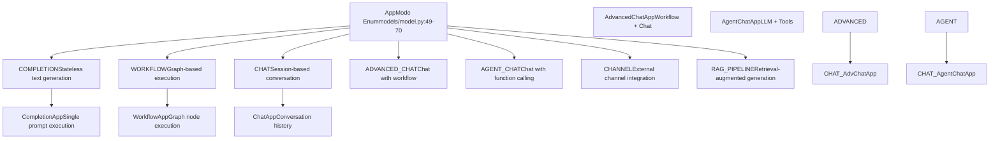
**模式确定逻辑：**

`App.is_agent` 属性动态检查聊天应用是否应被视为代理：

```
# From models/model.py:156-169
@property
def is_agent(self) -> bool:
    app_model_config = self.app_model_config
    if not app_model_config or not app_model_config.agent_mode:
        return False

    agent_mode_dict = app_model_config.agent_mode_dict
    if agent_mode_dict.get("enabled") and agent_mode_dict.get("strategy") in {"function_call", "react"}:
        self.mode = AppMode.AGENT_CHAT
        db.session.commit()
        return True
    return False
```
**来源：** [api/models/model.py49-176](https://github.com/langgenius/dify/blob/92dbc94f/api/models/model.py#L49-L176)

### 按模式的执行流程

> **[Mermaid sequence]**
> *(图表结构无法解析)*

**来源：** [api/core/app/apps/completion/app.py1-300](https://github.com/langgenius/dify/blob/92dbc94f/api/core/app/apps/completion/app.py#L1-L300) [api/core/app/apps/workflow/app.py1-400](https://github.com/langgenius/dify/blob/92dbc94f/api/core/app/apps/workflow/app.py#L1-L400) [api/core/app/apps/chat/app.py1-500](https://github.com/langgenius/dify/blob/92dbc94f/api/core/app/apps/chat/app.py#L1-L500)

---

## 配置管理

### DifyConfig 系统

配置系统使用具有环境变量支持的 Pydantic 设置：

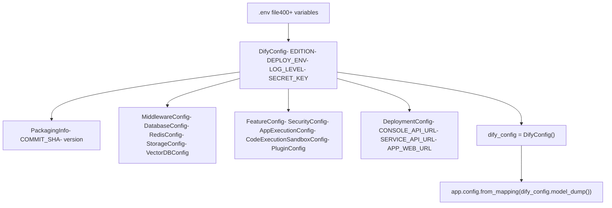
**配置类别：**

| 类别 | 模块 | 关键设置 |
| --- | --- | --- |
| **Packaging** | `configs/packaging/__init__.py` | `COMMIT_SHA`, 来自 pyproject.toml 的 `version` |
| **Middleware** | `configs/middleware/__init__.py` | 数据库, Redis, 存储, 向量 DB 连接 |
| **Feature** | `configs/feature/__init__.py` | 安全, 执行限制, 插件设置 |
| **Deployment** | `configs/deploy/__init__.py` | API URLs, 文件 URLs, 触发器 URLs |

**环境变量模式：**

-   数据库: `DB_TYPE`, `DB_USERNAME`, `DB_PASSWORD`, `DB_HOST`, `DB_PORT`, `DB_DATABASE`
-   Redis: `REDIS_HOST`, `REDIS_PORT`, `REDIS_PASSWORD`, `REDIS_DB`
-   存储: `STORAGE_TYPE`, `OPENDAL_SCHEME`, `S3_ENDPOINT`, 等
-   向量: `VECTOR_STORE`, `WEAVIATE_ENDPOINT`, `QDRANT_URL`, 等
-   执行: `APP_MAX_EXECUTION_TIME`, `WORKFLOW_MAX_EXECUTION_STEPS`, `CODE_EXECUTION_ENDPOINT`

**来源：** [api/configs/app\_config.py1-200](https://github.com/langgenius/dify/blob/92dbc94f/api/configs/app_config.py#L1-L200) [api/configs/packaging/\_\_init\_\_.py1-15](https://github.com/langgenius/dify/blob/92dbc94f/api/configs/packaging/__init__.py#L1-L15) [api/configs/middleware/\_\_init\_\_.py1-400](https://github.com/langgenius/dify/blob/92dbc94f/api/configs/middleware/__init__.py#L1-L400) [api/configs/feature/\_\_init\_\_.py1-800](https://github.com/langgenius/dify/blob/92dbc94f/api/configs/feature/__init__.py#L1-L800) [docker/.env.example1-1000](https://github.com/langgenius/dify/blob/92dbc94f/docker/.env.example#L1-L1000)

### 运行时模式配置

API 服务行为由 `MODE` 环境变量控制：

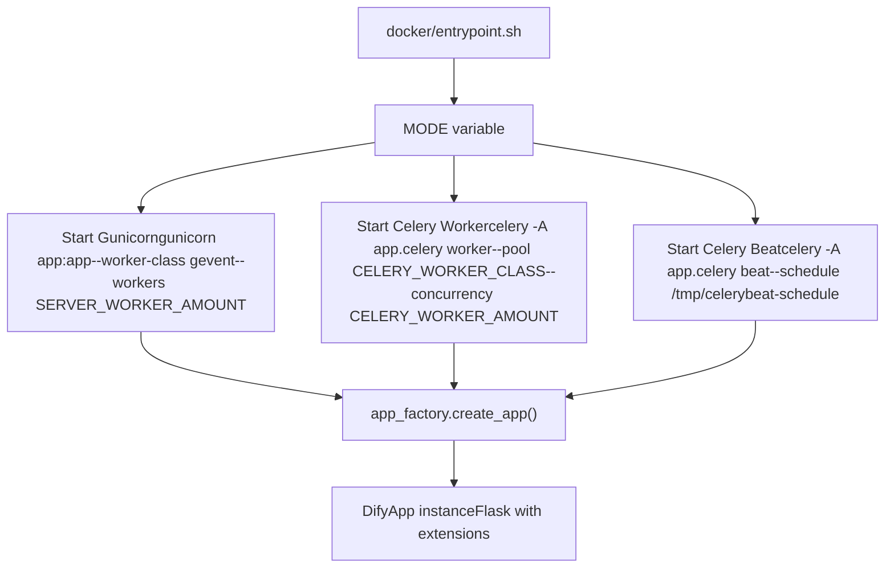
**关键配置变量：**

| 变量 | 模式 | 默认值 | 用途 |
| --- | --- | --- | --- |
| `MODE` | 所有 | \- | 决定服务类型: `api`, `worker`, `beat` |
| `DIFY_PORT` | api | 5001 | API 服务器端口 |
| `SERVER_WORKER_AMOUNT` | api | 1 | Gunicorn worker 数量 |
| `SERVER_WORKER_CLASS` | api | gevent | Worker 类 (gevent/sync/solo) |
| `CELERY_WORKER_AMOUNT` | worker | \- | Celery worker 进程数量 |
| `CELERY_WORKER_CLASS` | worker | \- | Worker 池类 |
| `CELERY_BROKER_URL` | worker/beat | \- | Celery 的 Redis 连接 |

**来源：** [docker/docker-compose-template.yaml22-131](https://github.com/langgenius/dify/blob/92dbc94f/docker/docker-compose-template.yaml#L22-L131) [docker/.env.example145-202](https://github.com/langgenius/dify/blob/92dbc94f/docker/.env.example#L145-L202) [api/app\_factory.py18-60](https://github.com/langgenius/dify/blob/92dbc94f/api/app_factory.py#L18-L60)

---

## 向量数据库集成

Dify 通过工厂模式支持 20+ 种向量数据库：

```mermaid
flowchart TD
    VectorFactory["Vectorcore/rag/datasource/vdb/vector_factory.py"]
    VectorType["VectorTypefrom dify_config.VECTOR_STORE"]
    Weaviate["WeaviateVectorWEAVIATE_ENDPOINT"]
    Qdrant["QdrantVectorQDRANT_URL"]
    Milvus["MilvusVectorMILVUS_URI"]
    PGVector["PGVectorVectorPGVECTOR_HOST"]
    Chroma["ChromaVectorCHROMA_HOST"]
    Elasticsearch["ElasticsearchVectorELASTICSEARCH_HOST"]
    OpenSearch["OpenSearchVectorOPENSEARCH_HOST"]
    AnalyticDB["AnalyticDBVectorANALYTICDB_HOST"]
    OceanBase["OceanBaseVectorOCEANBASE_VECTOR_HOST"]
    TiDB["TiDBVectorTIDB_VECTOR_HOST"]
    Others["15+ more options"]
    Create["create()Create collection"]
    Add["add_texts()Insert vectors"]
    Search["search_by_vector()Similarity search"]
    Delete["delete()Remove collection"]

    VectorFactory --> VectorType
    VectorType --> Weaviate
    VectorType --> Qdrant
    VectorType --> Milvus
    VectorType --> PGVector
    VectorType --> Chroma
    VectorType --> Elasticsearch
    VectorType --> OpenSearch
    VectorType --> AnalyticDB
    VectorType --> OceanBase
    VectorType --> TiDB
    VectorType --> Others
    Weaviate --> Create
    Weaviate --> Add
    Weaviate --> Search
    Weaviate --> Delete
```
**支持的向量数据库：**

| 类型 | 环境变量前缀 | 配置 |
| --- | --- | --- |
| Weaviate | `WEAVIATE_*` | `ENDPOINT`, `API_KEY`, `GRPC_ENDPOINT` |
| Qdrant | `QDRANT_*` | `URL`, `API_KEY`, `GRPC_ENABLED` |
| Milvus | `MILVUS_*` | `URI`, `TOKEN`, `USER`, `PASSWORD` |
| PGVector | `PGVECTOR_*` | `HOST`, `PORT`, `USER`, `PASSWORD`, `DATABASE` |
| Chroma | `CHROMA_*` | `HOST`, `PORT`, `TENANT`, `DATABASE` |
| ElasticSearch | `ELASTICSEARCH_*` | `HOST`, `PORT`, `USERNAME`, `PASSWORD` |
| OpenSearch | `OPENSEARCH_*` | `HOST`, `PORT`, `USER`, `PASSWORD` |

**来源：** [api/core/rag/datasource/vdb/vector\_factory.py1-350](https://github.com/langgenius/dify/blob/92dbc94f/api/core/rag/datasource/vdb/vector_factory.py#L1-L350) [api/core/rag/datasource/vdb/vector\_type.py1-50](https://github.com/langgenius/dify/blob/92dbc94f/api/core/rag/datasource/vdb/vector_type.py#L1-L50) [docker/.env.example536-685](https://github.com/langgenius/dify/blob/92dbc94f/docker/.env.example#L536-L685)

---

## 存储架构

### 存储类型配置

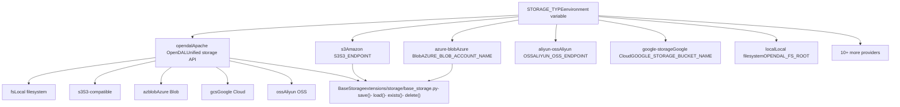
**存储配置：**

| 存储类型 | 主要变量 | 描述 |
| --- | --- | --- |
| `opendal` | `OPENDAL_SCHEME`, `OPENDAL_FS_ROOT` | 具有多种后端方案的 Apache OpenDAL |
| `s3` | `S3_ENDPOINT`, `S3_BUCKET_NAME`, `S3_ACCESS_KEY` | Amazon S3 或兼容服务 |
| `azure-blob` | `AZURE_BLOB_ACCOUNT_NAME`, `AZURE_BLOB_CONTAINER_NAME` | Azure Blob Storage |
| `aliyun-oss` | `ALIYUN_OSS_ENDPOINT`, `ALIYUN_OSS_BUCKET_NAME` | 阿里云 OSS |
| `google-storage` | `GOOGLE_STORAGE_BUCKET_NAME`, `GOOGLE_STORAGE_SERVICE_ACCOUNT_JSON_BASE64` | Google Cloud Storage |

**来源：** [api/extensions/ext\_storage.py1-150](https://github.com/langgenius/dify/blob/92dbc94f/api/extensions/ext_storage.py#L1-L150) [api/configs/middleware/storage/opendal\_storage\_config.py1-50](https://github.com/langgenius/dify/blob/92dbc94f/api/configs/middleware/storage/opendal_storage_config.py#L1-L50) [docker/.env.example410-529](https://github.com/langgenius/dify/blob/92dbc94f/docker/.env.example#L410-L529)

---

## 总结

Dify 的架构设计旨在实现可扩展性、模块化和灵活性：

1.  **多服务部署**：使用带有共享配置的 Docker Compose
2.  **统一的 API 镜像**：在三种模式（api, worker, beat）下运行，由环境变量控制
3.  **清晰的分离**：前端 (Next.js)、后端 (Flask) 和专用服务 (Sandbox, Plugin Daemon) 之间分离
4.  **灵活的数据层**：支持用于关系数据的 PostgreSQL/MySQL，用于缓存/队列的 Redis，用于嵌入的 20+ 向量数据库，以及多种对象存储后端
5.  **领域驱动设计**：服务类封装业务逻辑 (AccountService, DatasetService, WorkflowEngine)
6.  **多种执行模式**：适用于不同的 AI 应用程序类型 (Chat, Completion, Workflow, Agent)
7.  **基于 Pydantic 的配置**：广泛的环境变量支持
8.  **安全优先方法**：非 root 容器、SSRF 保护和加密凭证

这种架构使 Dify 能够支持多样化的 AI 应用程序开发场景，同时通过标准化的部署模式保持运维的简单性。
