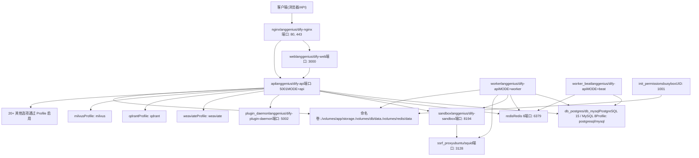
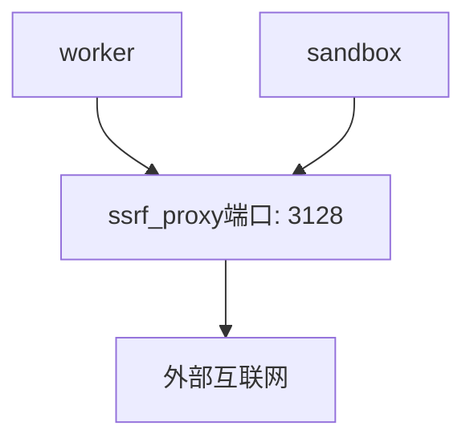
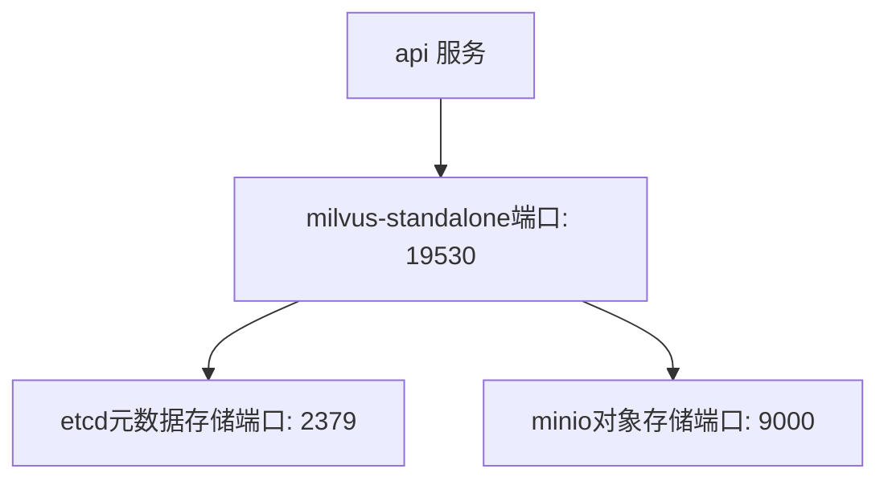
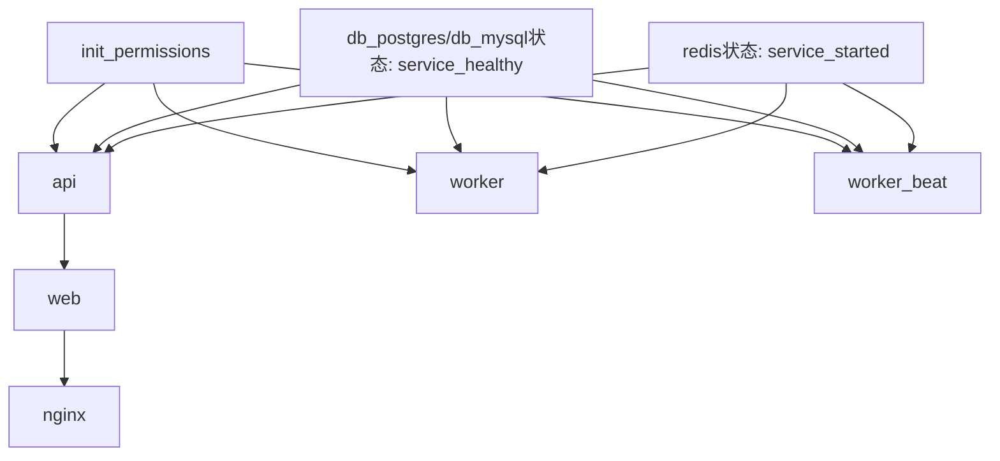
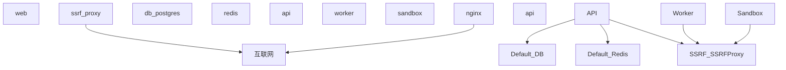
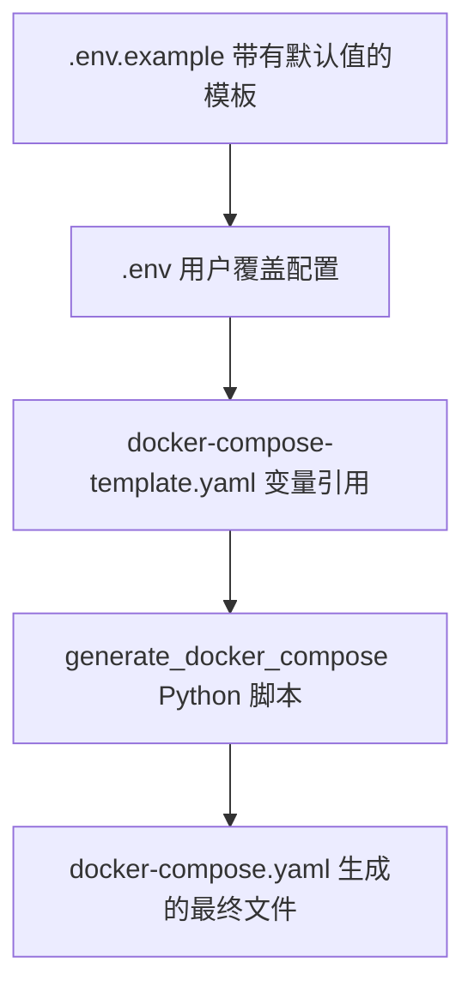

# 服务拓扑与 Docker Compose

相关源文件

-   [api/.env.example](https://github.com/langgenius/dify/blob/92dbc94f/api/.env.example)
-   [api/app.py](https://github.com/langgenius/dify/blob/92dbc94f/api/app.py)
-   [api/app_factory.py](https://github.com/langgenius/dify/blob/92dbc94f/api/app_factory.py)
-   [api/commands.py](https://github.com/langgenius/dify/blob/92dbc94f/api/commands.py)
-   [api/configs/feature/__init__.py](https://github.com/langgenius/dify/blob/92dbc94f/api/configs/feature/__init__.py)
-   [api/configs/middleware/__init__.py](https://github.com/langgenius/dify/blob/92dbc94f/api/configs/middleware/__init__.py)
-   [api/configs/packaging/__init__.py](https://github.com/langgenius/dify/blob/92dbc94f/api/configs/packaging/__init__.py)
-   [api/controllers/console/datasets/datasets.py](https://github.com/langgenius/dify/blob/92dbc94f/api/controllers/console/datasets/datasets.py)
-   [api/core/rag/datasource/vdb/vector_factory.py](https://github.com/langgenius/dify/blob/92dbc94f/api/core/rag/datasource/vdb/vector_factory.py)
-   [api/core/rag/datasource/vdb/vector_type.py](https://github.com/langgenius/dify/blob/92dbc94f/api/core/rag/datasource/vdb/vector_type.py)
-   [api/extensions/ext_storage.py](https://github.com/langgenius/dify/blob/92dbc94f/api/extensions/ext_storage.py)
-   [api/extensions/storage/storage_type.py](https://github.com/langgenius/dify/blob/92dbc94f/api/extensions/storage/storage_type.py)
-   [api/pyproject.toml](https://github.com/langgenius/dify/blob/92dbc94f/api/pyproject.toml)
-   [api/tests/unit_tests/configs/test_dify_config.py](https://github.com/langgenius/dify/blob/92dbc94f/api/tests/unit_tests/configs/test_dify_config.py)
-   [api/uv.lock](https://github.com/langgenius/dify/blob/92dbc94f/api/uv.lock)
-   [dev/pytest/pytest_vdb.sh](https://github.com/langgenius/dify/blob/92dbc94f/dev/pytest/pytest_vdb.sh)
-   [docker/.env.example](https://github.com/langgenius/dify/blob/92dbc94f/docker/.env.example)
-   [docker/docker-compose-template.yaml](https://github.com/langgenius/dify/blob/92dbc94f/docker/docker-compose-template.yaml)
-   [docker/docker-compose.middleware.yaml](https://github.com/langgenius/dify/blob/92dbc94f/docker/docker-compose.middleware.yaml)
-   [docker/docker-compose.yaml](https://github.com/langgenius/dify/blob/92dbc94f/docker/docker-compose.yaml)
-   [docker/middleware.env.example](https://github.com/langgenius/dify/blob/92dbc94f/docker/middleware.env.example)
-   [web/package.json](https://github.com/langgenius/dify/blob/92dbc94f/web/package.json)

本文档描述了 Dify 的 Docker Compose 部署架构，详细说明了服务是如何组织的、它们如何通信，以及系统如何利用 Docker Compose 的特性（如 Profile、健康检查和共享配置）来构建生产就绪的多容器应用。

有关创建这些镜像的构建过程信息，请参阅 [Docker 构建过程与多架构镜像](/langgenius/dify/3.1-docker-build-process-and-multi-architecture-images)。有关运行时配置和环境变量，请参阅 [环境配置与运行时模式](/langgenius/dify/3.2-environment-configuration-and-runtime-modes)。

## 服务拓扑概览

Dify 的 Docker Compose 部署由多个服务层级组成，这些层级协同工作，提供完整的 AI 应用平台。该架构在前端、后端 API、后台 Worker、专门服务以及数据存储之间实现了关注点分离。


**服务概览：**

-   **路由 (Routing)**: `nginx` 负责 SSL 终止并将请求路由到后端服务
-   **前端 (Frontend)**: `web` 运行 Next.js UI 应用
-   **后端 (Backend)**: `api` 通过 Flask/Gunicorn 处理 HTTP 请求
-   **Workers**: `worker` 处理异步任务，`worker_beat` 调度周期性任务
-   **沙箱 (Sandbox)**: `sandbox` 提供隔离的代码执行环境
-   **插件 (Plugins)**: `plugin_daemon` 管理插件的生命周期和执行
-   **安全 (Security)**: `ssrf_proxy` 防止服务端请求伪造（SSRF）攻击
-   **数据 (Data)**: `db_postgres`/`db_mysql` 用于事务数据，`redis` 用于缓存/队列
-   **向量数据库 (Vector DBs)**: 用于语义搜索的可选服务（基于 Profile）

**来源：** [docker/docker-compose.yaml1-50](https://github.com/langgenius/dify/blob/92dbc94f/docker/docker-compose.yaml#L1-L50) [docker/docker-compose-template.yaml1-132](https://github.com/langgenius/dify/blob/92dbc94f/docker/docker-compose-template.yaml#L1-L132)

## 核心服务定义

### API 服务

`api` 服务运行处理所有 HTTP API 请求的 Flask 应用。它使用与 worker 服务相同的 Docker 镜像，但运行模式不同。

```yaml
api:
  image: langgenius/dify-api:1.11.4
  restart: always
  environment:
    MODE: api
    # 通过 <<: *shared-api-worker-env 共享环境变量
  ports:
    - "5001:5001"
  depends_on:
    - init_permissions
    - db_postgres/db_mysql
    - redis
  volumes:
    - ./volumes/app/storage:/app/api/storage
  networks:
    - ssrf_proxy_network
    - default
```
**关键配置：**

-   `MODE=api` - 启动 Gunicorn WSGI 服务器 ([api/docker/entrypoint.sh33](https://github.com/langgenius/dify/blob/92dbc94f/api/docker/entrypoint.sh#L33-L33))
-   `DIFY_PORT=5001` - 默认 API 端口
-   `SERVER_WORKER_CLASS=gevent` - 使用 gevent 处理异步 I/O
-   `SERVER_WORKER_AMOUNT=1` - Gunicorn worker 进程数量
-   用户: `dify:1001` - 以非 root 用户执行以保证安全

API 服务连接到：

-   数据库用于持久化
-   Redis 用于缓存和会话管理
-   Sandbox 用于代码执行
-   Plugin daemon 用于插件管理

**来源：** [docker/docker-compose-template.yaml22-62](https://github.com/langgenius/dify/blob/92dbc94f/docker/docker-compose-template.yaml#L22-L62) [docker/docker-compose.yaml23-61](https://github.com/langgenius/dify/blob/92dbc94f/docker/docker-compose.yaml#L23-L61)

### Worker 服务

Dify 使用 Celery 进行异步任务处理，包含两个与 worker 相关的服务：

#### Worker (任务处理器)

```yaml
worker:
  image: langgenius/dify-api:1.11.4
  environment:
    MODE: worker
  depends_on:
    - db_postgres/db_mysql
    - redis
```
worker 处理来自多个 Celery 队列的任务：

-   `dataset` - 文档索引和向量嵌入（embedding）生成
-   `mail` - 邮件发送操作
-   `ops_trace` - 运行追踪任务
-   常规任务队列

配置：

-   `CELERY_WORKER_CLASS` - worker 类（默认为 gevent）
-   `CELERY_WORKER_AMOUNT` - worker 进程数量
-   `CELERY_AUTO_SCALE` - 启用自动扩缩容（最小/最大 worker 数）
-   `CELERY_BROKER_URL` - 用于任务队列的 Redis 连接

**来源：** [docker/docker-compose-template.yaml63-101](https://github.com/langgenius/dify/blob/92dbc94f/docker/docker-compose-template.yaml#L63-L101) [docker/.env.example186-213](https://github.com/langgenius/dify/blob/92dbc94f/docker/.env.example#L186-L213)

#### Worker Beat (调度器)

```yaml
worker_beat:
  image: langgenius/dify-api:1.11.4
  environment:
    MODE: beat
```
`worker_beat` 服务运行 Celery Beat，用于调度周期性任务：

-   知识库清理
-   工作流日志保留
-   插件更新检查
-   TiDB serverless 状态更新

调度任务配置在 [api/.env.example585-603](https://github.com/langgenius/dify/blob/92dbc94f/api/.env.example#L585-L603) 中：

-   `ENABLE_WORKFLOW_SCHEDULE_POLLER_TASK` - 轮询已调度的工作流
-   `WORKFLOW_SCHEDULE_POLLER_INTERVAL` - 轮询间隔（默认：1 分钟）
-   `ENABLE_CLEAN_MESSAGES` - 清理旧消息日志
-   `ENABLE_WORKFLOW_RUN_CLEANUP_TASK` - 清理工作流运行日志

**来源：** [docker/docker-compose-template.yaml102-132](https://github.com/langgenius/dify/blob/92dbc94f/docker/docker-compose-template.yaml#L102-L132) [api/.env.example585-603](https://github.com/langgenius/dify/blob/92dbc94f/api/.env.example#L585-L603)

### Web 服务

`web` 服务运行 Next.js 前端应用：

```yaml
web:
  image: langgenius/dify-web:1.11.4
  environment:
    CONSOLE_API_URL: ${CONSOLE_API_URL:-}
    APP_API_URL: ${APP_API_URL:-}
    NEXT_PUBLIC_COOKIE_DOMAIN: ${NEXT_PUBLIC_COOKIE_DOMAIN:-}
    PM2_INSTANCES: ${PM2_INSTANCES:-2}
```
web 服务使用 Next.js 构建，并运行在 PM2 进程管理器下。它与后端 API 服务通信以进行所有数据操作。

**关键环境变量：**

-   `CONSOLE_API_URL` - 后端 API 基础 URL
-   `APP_API_URL` - WebApp API 基础 URL
-   `PM2_INSTANCES` - Node.js 实例数量（默认：2）
-   `MARKETPLACE_API_URL` - 插件市场 URL

构建过程采用独立的 Next.js 构建 ([web/package.json28](https://github.com/langgenius/dify/blob/92dbc94f/web/package.json#L28-L28))，专为 Docker 部署优化。

**来源：** [docker/docker-compose-template.yaml133-161](https://github.com/langgenius/dify/blob/92dbc94f/docker/docker-compose-template.yaml#L133-L161) [web/package.json26-29](https://github.com/langgenius/dify/blob/92dbc94f/web/package.json#L26-L29)

### Nginx 反向代理

Nginx 处理 SSL 终止和请求路由：

```yaml
nginx:
  image: langgenius/dify-nginx
  ports:
    - "${EXPOSE_NGINX_PORT:-80}:80"
    - "${EXPOSE_NGINX_SSL_PORT:-443}:443"
  environment:
    NGINX_SERVER_NAME: ${NGINX_SERVER_NAME:-_}
    NGINX_HTTPS_ENABLED: ${NGINX_HTTPS_ENABLED:-false}
    NGINX_SSL_CERT_FILENAME: ${NGINX_SSL_CERT_FILENAME:-dify.crt}
```
配置选项 ([docker/.env.example547-562](https://github.com/langgenius/dify/blob/92dbc94f/docker/.env.example#L547-L562))：

-   `NGINX_WORKER_PROCESSES=auto` - worker 进程数
-   `NGINX_CLIENT_MAX_BODY_SIZE=100M` - 最大上传限制
-   `NGINX_PROXY_READ_TIMEOUT=3600s` - 流式传输的长超时时间
-   `NGINX_ENABLE_CERTBOT_CHALLENGE` - 启用 Let's Encrypt 支持

**来源：** [docker/docker-compose.yaml796-849](https://github.com/langgenius/dify/blob/92dbc94f/docker/docker-compose.yaml#L796-L849) [docker/.env.example547-562](https://github.com/langgenius/dify/blob/92dbc94f/docker/.env.example#L547-L562)

## 镜像复用模式：MODE 变量

Dify Docker Compose 设置中的一个关键架构模式是，三个不同的服务复用同一个 `langgenius/dify-api` 镜像，通过 `MODE` 环境变量进行区分：

| 服务 | MODE 值 | 用途 | 入口点 |
| --- | --- | --- | --- |
| `api` | `api` | Flask/Gunicorn HTTP 服务器 | [api/docker/entrypoint.sh33](https://github.com/langgenius/dify/blob/92dbc94f/api/docker/entrypoint.sh#L33-L33) |
| `worker` | `worker` | 处理异步任务的 Celery worker | [api/docker/entrypoint.sh47](https://github.com/langgenius/dify/blob/92dbc94f/api/docker/entrypoint.sh#L47-L47) |
| `worker_beat` | `beat` | Celery beat 调度器 | [api/docker/entrypoint.sh53](https://github.com/langgenius/dify/blob/92dbc94f/api/docker/entrypoint.sh#L53-L53) |

这种模式在入口点脚本中实现：

```bash
# api/docker/entrypoint.sh
case "${MODE}" in
  api)
    exec gunicorn 'app:app' --bind "${DIFY_BIND_ADDRESS}:${DIFY_PORT}" \
      --workers="${SERVER_WORKER_AMOUNT}" \
      --worker-class="${SERVER_WORKER_CLASS}"
    ;; 
  worker)
    exec celery -A app.celery worker \
      --pool="${CELERY_WORKER_CLASS}" \
      --autoscale="${CELERY_MAX_WORKERS},${CELERY_MIN_WORKERS}"
    ;; 
  beat)
    exec celery -A app.celery beat
    ;; 
esac
```
**此模式的优点：**

1.  **单一事实来源** - 一个镜像包含所有后端代码
2.  **版本一致性** - API 和 workers 始终使用相同的代码版本
3.  **降低构建复杂度** - 只需构建和维护一个后端镜像
4.  **共享依赖** - 所有 Python 依赖只需安装一次

共享环境变量使用 YAML 锚点定义 ([docker/docker-compose.yaml7](https://github.com/langgenius/dify/blob/92dbc94f/docker/docker-compose.yaml#L7-L7))，并被三个服务共同引用：

```yaml
x-shared-env: &shared-api-worker-env
  CONSOLE_API_URL: ${CONSOLE_API_URL:-}
  DB_TYPE: ${DB_TYPE:-postgresql}
  DB_USERNAME: ${DB_USERNAME:-postgres}
  # ... 600+ 共享环境变量
```
**来源：** [docker/docker-compose-template.yaml1-2](https://github.com/langgenius/dify/blob/92dbc94f/docker/docker-compose-template.yaml#L1-L2) [docker/docker-compose.yaml7-650](https://github.com/langgenius/dify/blob/92dbc94f/docker/docker-compose.yaml#L7-L650)

## 数据层服务

### 数据库服务

Dify 通过 Docker Compose Profile 支持两种主要的数据库引擎：

#### PostgreSQL (默认)

```yaml
db_postgres:
  image: postgres:15-alpine
  profiles:
    - postgresql
  environment:
    POSTGRES_USER: ${DB_USERNAME:-postgres}
    POSTGRES_PASSWORD: ${DB_PASSWORD:-difyai123456}
    POSTGRES_DB: ${DB_DATABASE:-dify}
    PGDATA: ${PGDATA:-/var/lib/postgresql/data/pgdata}
  command: >
    postgres -c 'max_connections=${POSTGRES_MAX_CONNECTIONS:-100}'
             -c 'shared_buffers=${POSTGRES_SHARED_BUFFERS:-128MB}'
             -c 'work_mem=${POSTGRES_WORK_MEM:-4MB}'
  volumes:
    - ./volumes/db/data:/var/lib/postgresql/data
  healthcheck:
    test: ["CMD", "pg_isready", "-h", "db_postgres", "-U", "postgres", "-d", "dify"]
```
**性能调优参数：**

-   `POSTGRES_MAX_CONNECTIONS=100` - 连接池大小
-   `POSTGRES_SHARED_BUFFERS=128MB` - 共享内存（建议为 RAM 的 25%）
-   `POSTGRES_WORK_MEM=4MB` - 每个操作的内存
-   `POSTGRES_EFFECTIVE_CACHE_SIZE=4096MB` - 查询计划器提示

**来源：** [docker/docker-compose-template.yaml162-198](https://github.com/langgenius/dify/blob/92dbc94f/docker/docker-compose-template.yaml#L162-L198) [docker/.env.example262-304](https://github.com/langgenius/dify/blob/92dbc94f/docker/.env.example#L262-L304)

#### MySQL (备选)

```yaml
db_mysql:
  image: mysql:8.0
  profiles:
    - mysql
  environment:
    MYSQL_ROOT_PASSWORD: ${DB_PASSWORD:-difyai123456}
    MYSQL_DATABASE: ${DB_DATABASE:-dify}
  command:
    - "--max_connections=1000"
    - "--innodb_buffer_pool_size=${MYSQL_INNODB_BUFFER_POOL_SIZE:-512M}"
    - "--innodb_log_file_size=${MYSQL_INNODB_LOG_FILE_SIZE:-128M}"
  volumes:
    - ${MYSQL_HOST_VOLUME:-./volumes/mysql/data}:/var/lib/mysql
```
**MySQL 特定调优：**

-   `MYSQL_MAX_CONNECTIONS=1000` - 默认值高于 PostgreSQL
-   `MYSQL_INNODB_BUFFER_POOL_SIZE=512M` - InnoDB 缓存（建议为 RAM 的 70-80%）
-   `MYSQL_INNODB_FLUSH_LOG_AT_TRX_COMMIT=2` - 耐久性与性能的平衡

**来源：** [docker/docker-compose-template.yaml199-228](https://github.com/langgenius/dify/blob/92dbc94f/docker/docker-compose-template.yaml#L199-L228) [docker/.env.example306-327](https://github.com/langgenius/dify/blob/92dbc94f/docker/.env.example#L306-L327)

### Redis 缓存与消息代理

Redis 在 Dify 架构中承担双重角色：

```yaml
redis:
  image: redis:6-alpine
  environment:
    REDISCLI_AUTH: ${REDIS_PASSWORD:-difyai123456}
  volumes:
    - ./volumes/redis/data:/data
  command: redis-server --requirepass ${REDIS_PASSWORD:-difyai123456}
  healthcheck:
    test: ["CMD-SHELL", "redis-cli -a $REDIS_PASSWORD ping | grep -q PONG"]
```
**Redis 用途：**

1.  **会话缓存** - 用户会话和令牌 ([extensions/ext_redis.py](https://github.com/langgenius/dify/blob/92dbc94f/extensions/ext_redis.py))
2.  **Celery 代理 (broker)** - `worker` 服务的任务队列
3.  **Celery 后端 (backend)** - 任务结果存储
4.  **应用缓存** - 知识库元数据、向量嵌入缓存

**配置：**

-   `REDIS_DB=0` - 会话和缓存数据库
-   `CELERY_BROKER_URL=redis://:password@redis:6379/1` - Celery 使用 DB 1
-   `REDIS_USE_SENTINEL=false` - 可选的高可用（HA）模式
-   `REDIS_USE_CLUSTERS=false` - 可选的集群模式

Redis Sentinel 和集群支持可用于高可用部署 ([docker/.env.example350-366](https://github.com/langgenius/dify/blob/92dbc94f/docker/.env.example#L350-L366))。

**来源：** [docker/docker-compose-template.yaml229-246](https://github.com/langgenius/dify/blob/92dbc94f/docker/docker-compose-template.yaml#L229-L246) [docker/.env.example329-386](https://github.com/langgenius/dify/blob/92dbc94f/docker/.env.example#L329-L386)

## 专门服务

### 沙箱服务 (Sandbox Service)

沙箱为工作流的代码节点提供隔离的代码执行：

```yaml
sandbox:
  image: langgenius/dify-sandbox:0.2.12
  environment:
    API_KEY: ${SANDBOX_API_KEY:-dify-sandbox}
    GIN_MODE: ${SANDBOX_GIN_MODE:-release}
    WORKER_TIMEOUT: ${SANDBOX_WORKER_TIMEOUT:-15}
    ENABLE_NETWORK: ${SANDBOX_ENABLE_NETWORK:-true}
    HTTP_PROXY: ${SANDBOX_HTTP_PROXY:-http://ssrf_proxy:3128}
    HTTPS_PROXY: ${SANDBOX_HTTPS_PROXY:-http://ssrf_proxy:3128}
    SANDBOX_PORT: ${SANDBOX_PORT:-8194}
  volumes:
    - ./volumes/sandbox/dependencies:/dependencies
    - ./volumes/sandbox/conf:/conf
  networks:
    - ssrf_proxy_network
```
**安全特性：**

-   隔离的执行环境
-   通过 `ssrf_proxy` 强制使用 HTTP/HTTPS 代理
-   可配置的网络访问
-   API 密钥身份验证

API 服务通过 `CODE_EXECUTION_ENDPOINT=http://sandbox:8194` 连接到沙箱 ([api/.env.example462](https://github.com/langgenius/dify/blob/92dbc94f/api/.env.example#L462-L462))。

**来源：** [docker/docker-compose-template.yaml247-270](https://github.com/langgenius/dify/blob/92dbc94f/docker/docker-compose-template.yaml#L247-L270) [docker/.env.example461-478](https://github.com/langgenius/dify/blob/92dbc94f/docker/.env.example#L461-L478)

### 插件守护进程 (Plugin Daemon)

插件守护进程管理插件的生命周期和执行：

```yaml
plugin_daemon:
  image: langgenius/dify-plugin-daemon:0.5.2-local
  environment:
    DB_DATABASE: ${DB_PLUGIN_DATABASE:-dify_plugin}
    SERVER_PORT: ${PLUGIN_DAEMON_PORT:-5002}
    SERVER_KEY: ${PLUGIN_DAEMON_KEY:-...}
    DIFY_INNER_API_URL: ${PLUGIN_DIFY_INNER_API_URL:-http://api:5001}
    DIFY_INNER_API_KEY: ${PLUGIN_DIFY_INNER_API_KEY:-...}
    PLUGIN_WORKING_PATH: ${PLUGIN_WORKING_PATH:-/app/storage/cwd}
    PLUGIN_MAX_EXECUTION_TIMEOUT: ${PLUGIN_MAX_EXECUTION_TIMEOUT:-600}
    PLUGIN_STORAGE_TYPE: ${PLUGIN_STORAGE_TYPE:-local}
```
**插件存储：**

-   `PLUGIN_INSTALLED_PATH=plugin` - 已安装插件目录
-   `PLUGIN_PACKAGE_CACHE_PATH=plugin_packages` - 包缓存
-   `PLUGIN_MEDIA_CACHE_PATH=assets` - 媒体资产

该守护进程使用与 API 服务相同的数据库、Redis 和存储配置，但为插件元数据维护了一个单独的数据库（默认为 `dify_plugin`）。

**来源：** [docker/docker-compose-template.yaml271-389](https://github.com/langgenius/dify/blob/92dbc94f/docker/docker-compose-template.yaml#L271-L389) [docker/.env.example614-638](https://github.com/langgenius/dify/blob/92dbc94f/docker/.env.example#L614-L638)

### SSRF 代理

`ssrf_proxy` 服务提供针对服务端请求伪造（SSRF）攻击的防护：

```yaml
ssrf_proxy:
  image: ubuntu/squid:latest
  environment:
    SSRF_HTTP_PORT: ${SSRF_HTTP_PORT:-3128}
    SSRF_REVERSE_PROXY_PORT: ${SSRF_REVERSE_PROXY_PORT:-8194}
    SSRF_SANDBOX_HOST: ${SSRF_SANDBOX_HOST:-sandbox}
  networks:
    - ssrf_proxy_network
    - default
```
**架构：** SSRF 代理位于内部服务和外部网络之间，使用自定义 Docker 网络 (`ssrf_proxy_network`) 进行隔离。需要访问外部网络的服务（worker、sandbox）通过此代理进行路由。

**网络拓扑：**


服务通过环境变量配置代理：

-   `SSRF_PROXY_HTTP_URL=http://ssrf_proxy:3128`
-   `SSRF_PROXY_HTTPS_URL=http://ssrf_proxy:3128`
-   `SANDBOX_HTTP_PROXY=http://ssrf_proxy:3128`

**来源：** [docker/docker-compose.yaml855-917](https://github.com/langgenius/dify/blob/92dbc94f/docker/docker-compose.yaml#L855-L917) [docker/.env.example563-573](https://github.com/langgenius/dify/blob/92dbc94f/docker/.env.example#L563-L573)

## 初始化与权限

### 初始化权限容器 (Init Permissions Container)

在服务启动前，一个初始化容器会设置文件权限：

```yaml
init_permissions:
  image: busybox:latest
  command:
    - sh
    - -c
    - |
      FLAG_FILE="/app/api/storage/.init_permissions"
      if [ -f "$$FLAG_FILE" ]; then
        echo "权限已初始化。退出。"
        exit 0
      fi
      echo "正在为 /app/api/storage 初始化权限"
      chown -R 1001:1001 /app/api/storage && touch "$$FLAG_FILE"
      echo "权限已初始化。退出。"
  volumes:
    - ./volumes/app/storage:/app/api/storage
  restart: "no"
```
**目的：**

-   将所有者设置为 `dify:1001` (UID/GID 1001)
-   创建标志文件以防止重复初始化
-   运行一次后退出 (`restart: "no"`)

所有应用服务都依赖于该容器成功完成：

```yaml
api:
  depends_on:
    init_permissions:
      condition: service_completed_successfully
```
**来源：** [docker/docker-compose-template.yaml3-21](https://github.com/langgenius/dify/blob/92dbc94f/docker/docker-compose-template.yaml#L3-L21)

## 卷持久化 (Volume Persistence)

Dify 使用 Docker 卷（Volume）进行数据持久化：

| 卷路径 | 用途 | 相关服务 |
| --- | --- | --- |
| `./volumes/app/storage` | 上传的文件、插件数据 | api, worker, worker_beat |
| `./volumes/db/data` | PostgreSQL/MySQL 数据 | db_postgres/db_mysql |
| `./volumes/redis/data` | Redis 持久化数据 | redis |
| `./volumes/sandbox/dependencies` | Python 依赖缓存 | sandbox |
| `./volumes/sandbox/conf` | 沙箱配置 | sandbox |
| `./volumes/nginx/ssl` | SSL 证书 | nginx |

**存储布局：**

```
volumes/
├── app/
│   └── storage/
│       ├── .init_permissions (标志文件)
│       ├── uploads/
│       └── plugins/
├── db/
│   └── data/
│       └── pgdata/ (或 mysql/)
├── redis/
│   └── data/
│       └── dump.rdb
├── sandbox/
│   ├── dependencies/
│   └── conf/
└── nginx/
    └── ssl/
```
所有卷均使用相对路径 (`./volumes/*`)，以便在不同部署环境间移植。

**来源：** [docker/docker-compose-template.yaml19-265](https://github.com/langgenius/dify/blob/92dbc94f/docker/docker-compose-template.yaml#L19-L265)

## 可选服务与 Docker Compose Profile

Dify 使用 Docker Compose Profile 来按需启用可选服务。这使得基础部署保持轻量，同时支持 20 多种向量数据库选项。

### Profile 系统

Profile 系统通过为服务打上 Profile 名称标签来工作：

```yaml
db_postgres:
  profiles:
    - postgresql
  # ...

weaviate:
  profiles:
    - weaviate
  # ...

qdrant:
  profiles:
    - qdrant
  # ...
```
**启用 Profile：**

```bash
# 仅启动 PostgreSQL（默认）
docker compose --profile postgresql up

# 添加 Weaviate 向量数据库
docker compose --profile postgresql --profile weaviate up

# 同时启用多个向量数据库
docker compose --profile postgresql --profile weaviate --profile qdrant up
```
**来源：** [docker/docker-compose.yaml165-1013](https://github.com/langgenius/dify/blob/92dbc94f/docker/docker-compose.yaml#L165-L1013)

### 向量数据库服务

以下向量数据库可作为可选服务使用：

| 向量数据库 | Profile 名称 | 镜像 | 端口 |
| --- | --- | --- | --- |
| Weaviate | `weaviate` | `weaviate/weaviate:1.28.5` | 8080, 50051 (gRPC) |
| Qdrant | `qdrant` | `qdrant/qdrant:v1.7.3` | 6333, 6334 (gRPC) |
| Milvus | `milvus` | 多个 (etcd, minio, milvus) | 19530, 9091 |
| Chroma | `chroma` | `chromadb/chroma:0.5.20` | 8000 |
| PGVector | `pgvector` | `pgvector/pgvector:pg16` | 5432 |
| PGVecto.rs | `pgvecto-rs` | `tensorchord/pgvecto-rs:pg16-v0.2.1` | 5432 |
| OpenSearch | `opensearch` | `opensearchproject/opensearch:latest` | 9200 |
| Elasticsearch | `elasticsearch` | `docker.elastic.co/elasticsearch/elasticsearch:8.14.3` | 9200 |
| Oracle | `oracle` | `container-registry.oracle.com/database/free:latest` | 1521 |

**Weaviate 配置示例：**

```yaml
weaviate:
  image: weaviate/weaviate:1.28.5
  profiles:
    - weaviate
  command:
    - --host
    - 0.0.0.0
    - --port
    - '8080'
    - --scheme
    - http
  environment:
    QUERY_DEFAULTS_LIMIT: ${WEAVIATE_QUERY_DEFAULTS_LIMIT:-25}
    AUTHENTICATION_ANONYMOUS_ACCESS_ENABLED: ${WEAVIATE_AUTHENTICATION_ANONYMOUS_ACCESS_ENABLED:-true}
    AUTHENTICATION_APIKEY_ENABLED: ${WEAVIATE_AUTHENTICATION_APIKEY_ENABLED:-true}
    AUTHENTICATION_APIKEY_ALLOWED_KEYS: ${WEAVIATE_AUTHENTICATION_APIKEY_ALLOWED_KEYS:-WVF5YThaHlkYwhGUSmCRgsX3tD5ngdN8pkih}
  volumes:
    - ./volumes/weaviate:/var/lib/weaviate
```
应用通过 `VECTOR_STORE` 环境变量选择向量数据库 ([api/.env.example182](https://github.com/langgenius/dify/blob/92dbc94f/api/.env.example#L182-L182))：

```ini
# 选项：weaviate, qdrant, milvus, chroma, pgvector, pgvecto-rs,
#       opensearch, elasticsearch, oracle 等 20 多种
VECTOR_STORE=weaviate
```
**来源：** [docker/docker-compose.yaml918-1015](https://github.com/langgenius/dify/blob/92dbc94f/docker/docker-compose.yaml#L918-L1015) [core/rag/datasource/vdb/vector_type.py1-37](https://github.com/langgenius/dify/blob/92dbc94f/core/rag/datasource/vdb/vector_type.py#L1-L37)

### Milvus 多容器设置

Milvus 需要多个支撑服务：


```yaml
etcd:
  profiles:
    - milvus
  image: quay.io/coreos/etcd:v3.5.5
  environment:
    ETCD_AUTO_COMPACTION_MODE: ${ETCD_AUTO_COMPACTION_MODE:-revision}
    ETCD_AUTO_COMPACTION_RETENTION: ${ETCD_AUTO_COMPACTION_RETENTION:-1000}
    ETCD_QUOTA_BACKEND_BYTES: ${ETCD_QUOTA_BACKEND_BYTES:-4294967296}

minio:
  profiles:
    - milvus
  image: minio/minio:RELEASE.2023-03-20T20-16-18Z
  environment:
    MINIO_ACCESS_KEY: ${MINIO_ACCESS_KEY:-minioadmin}
    MINIO_SECRET_KEY: ${MINIO_SECRET_KEY:-minioadmin}
  volumes:
    - ./volumes/milvus/minio:/minio_data

milvus-standalone:
  profiles:
    - milvus
  image: milvusdb/milvus:v2.3.9
  depends_on:
    - etcd
    - minio
  environment:
    ETCD_ENDPOINTS: ${ETCD_ENDPOINTS:-etcd:2379}
    MINIO_ADDRESS: ${MINIO_ADDRESS:-minio:9000}
```
**来源：** [docker/docker-compose.yaml1137-1276](https://github.com/langgenius/dify/blob/92dbc94f/docker/docker-compose.yaml#L1137-L1276)

### Certbot 用于 SSL

可选的 Let's Encrypt SSL 证书管理：

```yaml
certbot:
  image: certbot/certbot:latest
  profiles:
    - certbot
  environment:
    CERTBOT_EMAIL: ${CERTBOT_EMAIL:-your_email@example.com}
    CERTBOT_DOMAIN: ${CERTBOT_DOMAIN:-your_domain.com}
  volumes:
    - ./volumes/certbot/conf:/etc/letsencrypt
    - ./volumes/certbot/www:/var/www/certbot
    - ./volumes/certbot/logs:/var/log/letsencrypt
```
启用时，Nginx 配置包含：

```yaml
NGINX_HTTPS_ENABLED=true
NGINX_ENABLE_CERTBOT_CHALLENGE=true
```
**来源：** [docker/docker-compose.yaml850-860](https://github.com/langgenius/dify/blob/92dbc94f/docker/docker-compose.yaml#L850-L860)

## 服务依赖与健康检查

### 依赖图

服务通过带有健康检查条件的 `depends_on` 声明依赖关系：


**依赖配置：**

```yaml
api:
  depends_on:
    init_permissions:
      condition: service_completed_successfully
    db_postgres:
      condition: service_healthy
      required: false  # 基于 Profile 设为可选
    redis:
      condition: service_started
```
`required: false` 标志允许服务在可选的基于 Profile 的服务未运行时也能启动。

**来源：** [docker/docker-compose-template.yaml39-55](https://github.com/langgenius/dify/blob/92dbc94f/docker/docker-compose-template.yaml#L39-L55)

### 健康检查定义

关键服务定义了健康检查，以确保在依赖服务启动前它们已准备就绪：

**PostgreSQL:**

```yaml
healthcheck:
  test: ["CMD", "pg_isready", "-h", "db_postgres", "-U", "postgres", "-d", "dify"]
  interval: 1s
  timeout: 3s
  retries: 60
```
**MySQL:**

```yaml
healthcheck:
  test: ["CMD", "mysqladmin", "ping", "-u", "root", "-p${DB_PASSWORD}"]
  interval: 1s
  timeout: 3s
  retries: 30
```
**Redis:**

```yaml
healthcheck:
  test: ["CMD-SHELL", "redis-cli -a ${REDIS_PASSWORD} ping | grep -q PONG"]
```
**Sandbox:**

```yaml
healthcheck:
  test: ["CMD", "curl", "-f", "http://localhost:8194/health"]
```
这些健康检查通过确保依赖项确实可运行后再让依赖服务连接，从而防止级联失败。

**来源：** [docker/docker-compose-template.yaml183-267](https://github.com/langgenius/dify/blob/92dbc94f/docker/docker-compose-template.yaml#L183-L267)

## 网络架构

### Docker 网络

Dify 使用自定义 Docker 网络进行服务隔离：

```yaml
networks:
  ssrf_proxy_network:
    driver: bridge
    name: dify_ssrf_proxy_network
  default:
    driver: bridge
    name: dify_default
```
**网络分配：**

| 服务 | 网络 | 用途 |
| --- | --- | --- |
| api | default, ssrf_proxy_network | API 需要内部访问和代理的外部访问 |
| worker | default, ssrf_proxy_network | worker 通过 SSRF 代理访问外部 API |
| sandbox | ssrf_proxy_network | 带有代理的隔离代码执行 |
| ssrf_proxy | default, ssrf_proxy_network | 网络间的桥梁 |
| db_postgres | default | 仅内部访问 |
| redis | default | 仅内部访问 |
| web | default | 仅内部访问 |
| nginx | default | 面向外部 |

**网络拓扑：**


同时加入两个服务的网络可以进行内部通信，同时也能通过 SSRF 代理路由外部请求。

**来源：** [docker/docker-compose.yaml1-269](https://github.com/langgenius/dify/blob/92dbc94f/docker/docker-compose.yaml#L1-L269)

## 配置系统

### 环境变量来源

配置通过多个层级流动：


1.  **[docker/.env.example](https://github.com/langgenius/dify/blob/92dbc94f/docker/.env.example)** - 包含所有可用变量和默认值的模板
2.  **docker/.env** - 用户创建的包含覆盖配置的文件
3.  **[docker/docker-compose-template.yaml](https://github.com/langgenius/dify/blob/92dbc94f/docker/docker-compose-template.yaml)** - 使用 `${VAR:-default}` 语法的模板
4.  **生成脚本** - 处理模板以创建最终的 compose 文件
5.  **[docker/docker-compose.yaml](https://github.com/langgenius/dify/blob/92dbc94f/docker/docker-compose.yaml)** - 生成的文件（顶部有自动生成警告）

**来源：** [docker/docker-compose.yaml1-5](https://github.com/langgenius/dify/blob/92dbc94f/docker/docker-compose.yaml#L1-L5) [docker/.env.example1-8](https://github.com/langgenius/dify/blob/92dbc94f/docker/.env.example#L1-L8)

### 共享环境变量

`x-shared-env` YAML 锚点定义了 api、worker 和 worker_beat 服务共享的 600 多个环境变量：

```yaml
x-shared-env: &shared-api-worker-env
  # 核心 URL
  CONSOLE_API_URL: ${CONSOLE_API_URL:-}
  CONSOLE_WEB_URL: ${CONSOLE_WEB_URL:-}
  SERVICE_API_URL: ${SERVICE_API_URL:-}

  # 数据库
  DB_TYPE: ${DB_TYPE:-postgresql}
  DB_USERNAME: ${DB_USERNAME:-postgres}
  DB_PASSWORD: ${DB_PASSWORD:-difyai123456}
  DB_HOST: ${DB_HOST:-db_postgres}
  DB_PORT: ${DB_PORT:-5432}
  DB_DATABASE: ${DB_DATABASE:-dify}

  # Redis
  REDIS_HOST: ${REDIS_HOST:-redis}
  REDIS_PORT: ${REDIS_PORT:-6379}
  REDIS_PASSWORD: ${REDIS_PASSWORD:-difyai123456}

  # Celery
  CELERY_BROKER_URL: ${CELERY_BROKER_URL:-redis://:difyai123456@redis:6379/1}

  # 向量数据库
  VECTOR_STORE: ${VECTOR_STORE:-weaviate}
  WEAVIATE_ENDPOINT: ${WEAVIATE_ENDPOINT:-http://weaviate:8080}

  # 存储
  STORAGE_TYPE: ${STORAGE_TYPE:-opendal}
  OPENDAL_SCHEME: ${OPENDAL_SCHEME:-fs}

  # ... 590 多个其他变量
```
服务引用此锚点：

```yaml
api:
  environment:
    <<: *shared-api-worker-env
    MODE: api

worker:
  environment:
    <<: *shared-api-worker-env
    MODE: worker
```
这确保了所有后端服务的配置一致。

**来源：** [docker/docker-compose.yaml7-650](https://github.com/langgenius/dify/blob/92dbc94f/docker/docker-compose.yaml#L7-L650) [docker/docker-compose-template.yaml1-72](https://github.com/langgenius/dify/blob/92dbc94f/docker/docker-compose-template.yaml#L1-L72)

### 服务特定环境变量

某些服务具有共享锚点之外的独特环境变量：

**API 服务：**

```yaml
api:
  environment:
    <<: *shared-api-worker-env
    MODE: api
    SENTRY_DSN: ${API_SENTRY_DSN:-}
    PLUGIN_REMOTE_INSTALL_HOST: ${EXPOSE_PLUGIN_DEBUGGING_HOST:-localhost}
    PLUGIN_REMOTE_INSTALL_PORT: ${EXPOSE_PLUGIN_DEBUGGING_PORT:-5003}
```
**Web 服务：**

```yaml
web:
  environment:
    CONSOLE_API_URL: ${CONSOLE_API_URL:-}
    APP_API_URL: ${APP_API_URL:-}
    AMPLITUDE_API_KEY: ${AMPLITUDE_API_KEY:-}
    SENTRY_DSN: ${WEB_SENTRY_DSN:-}
    PM2_INSTANCES: ${PM2_INSTANCES:-2}
    CSP_WHITELIST: ${CSP_WHITELIST:-}
```
**沙箱服务：**

```yaml
sandbox:
  environment:
    API_KEY: ${SANDBOX_API_KEY:-dify-sandbox}
    GIN_MODE: ${SANDBOX_GIN_MODE:-release}
    WORKER_TIMEOUT: ${SANDBOX_WORKER_TIMEOUT:-15}
    HTTP_PROXY: ${SANDBOX_HTTP_PROXY:-http://ssrf_proxy:3128}
```
**来源：** [docker/docker-compose-template.yaml31-262](https://github.com/langgenius/dify/blob/92dbc94f/docker/docker-compose-template.yaml#L31-L262)

## 中间件开发设置

对于本地开发，一个单独的 compose 文件提供了中间件服务：

```bash
# 文件：docker/docker-compose.middleware.yaml
docker compose -f docker/docker-compose.middleware.yaml up
```
此文件仅包含数据和专门服务，允许开发人员在本地运行 api/worker/web，同时使用 Docker 处理依赖项：

```yaml
# docker-compose.middleware.yaml 服务：
services:
  db_postgres:
    profiles: ["", "postgresql"]
    ports:
      - "${EXPOSE_POSTGRES_PORT:-5432}:5432"

  redis:
    ports:
      - "${EXPOSE_REDIS_PORT:-6379}:6379"

  sandbox:
    # 与生产环境配置相同

  plugin_daemon:
    environment:
      DIFY_INNER_API_URL: ${PLUGIN_DIFY_INNER_API_URL:-http://host.docker.internal:5001}
```
主要区别：

-   暴露端口用于外部访问（数据库、Redis）
-   使用 `host.docker.internal` 连接宿主机运行的服务
-   没有 api/worker/web 服务（这些在本地运行）
-   db_postgres 的空字符串 Profile 使其默认启用

**来源：** [docker/docker-compose.middleware.yaml1-200](https://github.com/langgenius/dify/blob/92dbc94f/docker/docker-compose.middleware.yaml#L1-L200) [docker/middleware.env.example1-100](https://github.com/langgenius/dify/blob/92dbc94f/docker/middleware.env.example#L1-L100)

## 总结

Dify 的 Docker Compose 架构展示了多个生产就绪模式：

1.  **镜像复用** - 单个 `dify-api` 镜像通过 MODE 变量承担三种角色
2.  **基于 Profile 的可选性** - 按需提供 20 多种向量数据库
3.  **健康检查依赖** - 通过健康检查强制执行启动顺序
4.  **网络隔离** - SSRF 代理防御外部威胁
5.  **非 Root 执行** - 所有服务以 UID 1001 运行
6.  **配置模板化** - YAML 锚点减少重复
7.  **卷持久化** - 有状态数据在容器重启后得以保留
8.  **开发支持** - 为本地开发提供单独的中间件 compose

该架构既支持简单的单服务器部署，也支持具有多个向量数据库、自定义存储后端和高可用数据库配置的复杂分布式设置。

**来源：** [docker/docker-compose.yaml](https://github.com/langgenius/dify/blob/92dbc94f/docker/docker-compose.yaml) [docker/docker-compose-template.yaml](https://github.com/langgenius/dify/blob/92dbc94f/docker/docker-compose-template.yaml) [docker/.env.example](https://github.com/langgenius/dify/blob/92dbc94f/docker/.env.example) [docker/docker-compose.middleware.yaml](https://github.com/langgenius/dify/blob/92dbc94f/docker/docker-compose.middleware.yaml)
