# 核心数据模型与领域实体

相关源文件

-   [api/models/account.py](https://github.com/langgenius/dify/blob/92dbc94f/api/models/account.py)
-   [api/models/api\_based\_extension.py](https://github.com/langgenius/dify/blob/92dbc94f/api/models/api_based_extension.py)
-   [api/models/dataset.py](https://github.com/langgenius/dify/blob/92dbc94f/api/models/dataset.py)
-   [api/models/model.py](https://github.com/langgenius/dify/blob/92dbc94f/api/models/model.py)
-   [api/models/oauth.py](https://github.com/langgenius/dify/blob/92dbc94f/api/models/oauth.py)
-   [api/models/provider.py](https://github.com/langgenius/dify/blob/92dbc94f/api/models/provider.py)
-   [api/models/source.py](https://github.com/langgenius/dify/blob/92dbc94f/api/models/source.py)
-   [api/models/task.py](https://github.com/langgenius/dify/blob/92dbc94f/api/models/task.py)
-   [api/models/tools.py](https://github.com/langgenius/dify/blob/92dbc94f/api/models/tools.py)
-   [api/models/trigger.py](https://github.com/langgenius/dify/blob/92dbc94f/api/models/trigger.py)
-   [api/models/web.py](https://github.com/langgenius/dify/blob/92dbc94f/api/models/web.py)
-   [api/models/workflow.py](https://github.com/langgenius/dify/blob/92dbc94f/api/models/workflow.py)
-   [api/tests/test\_containers\_integration\_tests/services/test\_advanced\_prompt\_template\_service.py](https://github.com/langgenius/dify/blob/92dbc94f/api/tests/test_containers_integration_tests/services/test_advanced_prompt_template_service.py)
-   [api/tests/test\_containers\_integration\_tests/services/test\_agent\_service.py](https://github.com/langgenius/dify/blob/92dbc94f/api/tests/test_containers_integration_tests/services/test_agent_service.py)
-   [api/tests/test\_containers\_integration\_tests/tasks/\_\_init\_\_.py](https://github.com/langgenius/dify/blob/92dbc94f/api/tests/test_containers_integration_tests/tasks/__init__.py)
-   [api/tests/test\_containers\_integration\_tests/tasks/test\_add\_document\_to\_index\_task.py](https://github.com/langgenius/dify/blob/92dbc94f/api/tests/test_containers_integration_tests/tasks/test_add_document_to_index_task.py)
-   [api/tests/unit\_tests/core/test\_provider\_manager.py](https://github.com/langgenius/dify/blob/92dbc94f/api/tests/unit_tests/core/test_provider_manager.py)

本文档提供了 Dify 的 SQLAlchemy 数据模型和领域实体的全面参考。它涵盖了主要的数据库表、它们之间的关系以及关键的业务逻辑属性。有关这些模型在特定子系统中的使用信息，请参阅 [工作流系统与节点执行](/langgenius/dify/5-workflow-system-and-node-execution)、[知识库与 RAG 系统](/langgenius/dify/4-knowledge-base-and-rag-system) 以及 [多租户与授权](/langgenius/dify/7-multi-tenancy-and-authorization)。

## 模型架构概览

Dify 的数据模型架构遵循划分为多个功能层的多租户设计。所有模型都继承自 [api/models/base.py](https://github.com/langgenius/dify/blob/92dbc94f/api/models/base.py) 中定义的 `Base` 或 `TypeBase`，并使用 SQLAlchemy ORM 进行数据库交互。

### 模型继承结构

```mermaid
flowchart TD
    TypeBase["TypeBase(基于数据类的 ORM)"]
    Base["Base(传统 ORM)"]
    Account["Account(账号)"]
    Tenant["Tenant(租户/工作区)"]
    TenantAccountJoin["TenantAccountJoin(租户账号关联)"]
    BuiltinToolProvider["BuiltinToolProvider(内置工具供应商)"]
    ApiToolProvider["ApiToolProvider(API 工具供应商)"]
    WorkflowToolProvider["WorkflowToolProvider(工作流工具供应商)"]
    MCPToolProvider["MCPToolProvider(MCP 工具供应商)"]
    Provider["Provider(模型供应商)"]
    ProviderModel["ProviderModel(供应商模型)"]
    App["App(应用)"]
    AppModelConfig["AppModelConfig(应用模型配置)"]
    Conversation["Conversation(会话)"]
    Message["Message(消息)"]
    Workflow["Workflow(工作流)"]
    WorkflowRun["WorkflowRun(工作流运行)"]
    WorkflowNodeExecutionModel["WorkflowNodeExecutionModel(工作流节点执行模型)"]
    Dataset["Dataset(数据集/知识库)"]
    Document["Document(文档)"]
    DocumentSegment["DocumentSegment(文档分段)"]

    TypeBase --> Account
    TypeBase --> Tenant
    TypeBase --> TenantAccountJoin
    TypeBase --> BuiltinToolProvider
    TypeBase --> ApiToolProvider
    TypeBase --> WorkflowToolProvider
    TypeBase --> MCPToolProvider
    TypeBase --> Provider
    TypeBase --> ProviderModel
    Base --> App
    Base --> AppModelConfig
    Base --> Conversation
    Base --> Message
    Base --> Workflow
    Base --> WorkflowRun
    Base --> WorkflowNodeExecutionModel
    Base --> Dataset
    Base --> Document
    Base --> DocumentSegment
```
**来源：** [api/models/base.py](https://github.com/langgenius/dify/blob/92dbc94f/api/models/base.py) [api/models/account.py](https://github.com/langgenius/dify/blob/92dbc94f/api/models/account.py) [api/models/model.py](https://github.com/langgenius/dify/blob/92dbc94f/api/models/model.py) [api/models/workflow.py](https://github.com/langgenius/dify/blob/92dbc94f/api/models/workflow.py) [api/models/dataset.py](https://github.com/langgenius/dify/blob/92dbc94f/api/models/dataset.py)

## 多租户与账号管理

### 核心身份模型

多租户系统建立在三个主要模型之上，这些模型确立了工作区边界和用户关系。

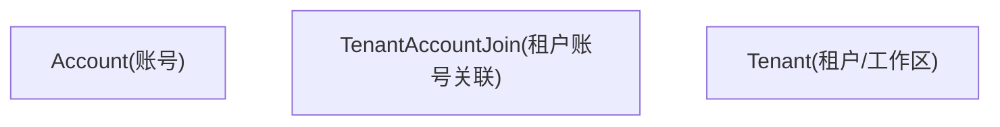
**来源：** [api/models/account.py87-236](https://github.com/langgenius/dify/blob/92dbc94f/api/models/account.py#L87-L236) [api/models/account.py242-277](https://github.com/langgenius/dify/blob/92dbc94f/api/models/account.py#L242-L277) [api/models/account.py279-302](https://github.com/langgenius/dify/blob/92dbc94f/api/models/account.py#L279-L302)

#### Account (账号模型)

`Account` 模型 ([api/models/account.py87-236](https://github.com/langgenius/dify/blob/92dbc94f/api/models/account.py#L87-L236)) 代表系统中的个人用户。关键字段：

| 字段 | 类型 | 描述 |
| --- | --- | --- |
| `id` | StringUUID | 主键 |
| `email` | String(255) | 用户电子邮件，已索引 |
| `password` | String(255) | 哈希后的密码（OAuth 用户可为空） |
| `interface_language` | String(255) | UI 界面语言偏好 |
| `status` | String(16) | 账号状态（pending, active, banned, closed） |
| `role` | TenantAccountRole | 在当前活跃租户中的角色（运行时属性） |

**关键属性和方法：**

-   `current_tenant` - 返回此账号当前活跃的 `Tenant` (租户)
-   `is_admin_or_owner` - 检查是否具有管理员或所有者权限
-   `has_edit_permission` - 检查是否具有编辑权限
-   `get_by_openid()` - 通过 OAuth 供应商获取账号

#### Tenant (租户模型)

`Tenant` 模型 ([api/models/account.py242-277](https://github.com/langgenius/dify/blob/92dbc94f/api/models/account.py#L242-L277)) 代表工作区或组织：

| 字段 | 类型 | 描述 |
| --- | --- | --- |
| `id` | StringUUID | 主键 |
| `name` | String(255) | 工作区名称 |
| `plan` | String(255) | 计费方案 (basic, plus, pro) |
| `status` | String(255) | 租户状态 (normal, archive) |
| `encrypt_public_key` | LongText | 用于加密的公钥 |
| `custom_config` | LongText | JSON 格式的配置 |

**关键方法：**

-   `get_accounts()` - 返回所有成员账号列表
-   `custom_config_dict` - 用于访问已解析 JSON 配置的属性

#### TenantAccountJoin (租户账号关联模型)

`TenantAccountJoin` 模型 ([api/models/account.py279-302](https://github.com/langgenius/dify/blob/92dbc94f/api/models/account.py#L279-L302)) 管理成员关系：

| 字段 | 类型 | 描述 |
| --- | --- | --- |
| `tenant_id` | StringUUID | 关联租户 |
| `account_id` | StringUUID | 关联账号 |
| `role` | String(16) | 成员角色 (owner, admin, editor, normal, dataset\_operator) |
| `current` | Boolean | 是否为用户的当前活跃工作区 |
| `invited_by` | StringUUID | 邀请该成员的账号 |

**角色层级：**

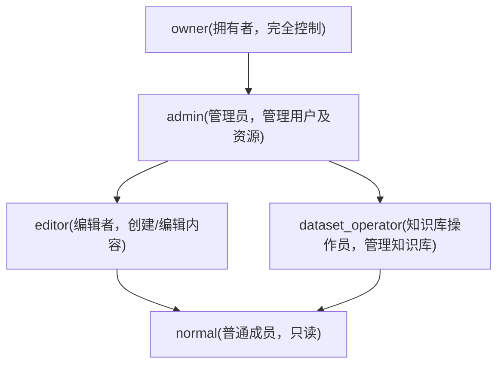
**来源：** [api/models/account.py19-77](https://github.com/langgenius/dify/blob/92dbc94f/api/models/account.py#L19-L77)

### 相关身份模型

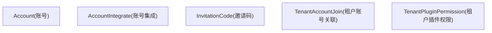
**来源：** [api/models/account.py304-325](https://github.com/langgenius/dify/blob/92dbc94f/api/models/account.py#L304-L325) [api/models/account.py327-346](https://github.com/langgenius/dify/blob/92dbc94f/api/models/account.py#L327-L346) [api/models/account.py348-375](https://github.com/langgenius/dify/blob/92dbc94f/api/models/account.py#L348-L375)

## 应用层模型

### 核心应用架构

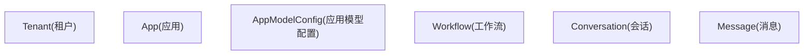
**来源：** [api/models/model.py78-177](https://github.com/langgenius/dify/blob/92dbc94f/api/models/model.py#L78-L177) [api/models/model.py318-541](https://github.com/langgenius/dify/blob/92dbc94f/api/models/model.py#L318-L541) [api/models/model.py637-918](https://github.com/langgenius/dify/blob/92dbc94f/api/models/model.py#L637-L918) [api/models/model.py920-1548](https://github.com/langgenius/dify/blob/92dbc94f/api/models/model.py#L920-L1548)

### App (应用模型)

`App` 模型 ([api/models/model.py78-177](https://github.com/langgenius/dify/blob/92dbc94f/api/models/model.py#L78-L177)) 是代表 AI 应用的核心实体：

| 字段 | 类型 | 描述 |
| --- | --- | --- |
| `id` | StringUUID | 主键 |
| `tenant_id` | StringUUID | 关联工作区 |
| `mode` | String(255) | 应用类型（见 AppMode 枚举） |
| `app_model_config_id` | StringUUID | 当前配置引用 |
| `workflow_id` | StringUUID | 关联工作流（针对工作流应用） |
| `enable_site` | Boolean | 是否启用 WebApp |
| `enable_api` | Boolean | 是否启用 API 访问 |
| `api_rpm`, `api_rph` | Integer | 频率限制配置 |
| `use_icon_as_answer_icon` | Boolean | 图标显示设置 |

#### AppMode 枚举

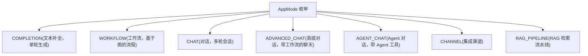
**来源：** [api/models/model.py49-70](https://github.com/langgenius/dify/blob/92dbc94f/api/models/model.py#L49-L70)

**关键属性：**

-   `app_model_config` - 返回关联的 `AppModelConfig` 实例
-   `workflow` - 返回关联的 `Workflow` 实例（如果适用）
-   `site` - 返回已发布的 `Site` 配置
-   `is_agent` - 布尔值，指示应用是否使用 Agent 模式
-   `deleted_tools` - 已引用但不再可用的工具列表
-   `tags` - 关联到应用的 `Tag` 对象列表

### AppModelConfig (应用模型配置模型)

`AppModelConfig` 模型 ([api/models/model.py318-541](https://github.com/langgenius/dify/blob/92dbc94f/api/models/model.py#L318-L541)) 存储应用配置和提示词设置：

| 字段 | 类型 | 描述 |
| --- | --- | --- |
| `app_id` | StringUUID | 父应用引用 |
| `provider` | String(255) | LLM 供应商名称 |
| `model_id` | String(255) | 模型标识符 |
| `pre_prompt` | LongText | 系统提示词/指令 |
| `agent_mode` | LongText | Agent 配置 (JSON) |
| `user_input_form` | LongText | 输入表单定义 (JSON) |
| `dataset_configs` | LongText | 知识库设置 (JSON) |
| `file_upload` | LongText | 文件上传配置 (JSON) |
| `prompt_type` | String(255) | 提示词格式 (simple/advanced) |

**JSON 字段属性：**

-   `agent_mode_dict` - 解析后的 Agent 配置，包含 `enabled` (启用), `strategy` (策略), `tools` (工具), `prompt` (提示词)
-   `dataset_configs_dict` - 检索设置，包含 `retrieval_model` (检索模型)
-   `file_upload_dict` - 用于图像/文件上传的多模态设置
-   `speech_to_text_dict`, `text_to_speech_dict` - 音频功能配置

**来源：** [api/models/model.py353-495](https://github.com/langgenius/dify/blob/92dbc94f/api/models/model.py#L353-L495)

### Conversation (会话) 与 Message (消息) 模型

#### Conversation (会话模型)

`Conversation` 模型 ([api/models/model.py637-918](https://github.com/langgenius/dify/blob/92dbc94f/api/models/model.py#L637-L918)) 代表聊天会话：

| 字段 | 类型 | 描述 |
| --- | --- | --- |
| `id` | StringUUID | 主键 |
| `app_id` | StringUUID | 父应用 |
| `mode` | String(255) | 会话模式 |
| `status` | String(255) | 会话状态 |
| `from_source` | String(255) | 来源 (api, console 等) |
| `from_end_user_id` | StringUUID | 终端用户引用 |
| `from_account_id` | StringUUID | 账号引用 |
| `inputs` | JSON | 输入变量（支持文件对象） |
| `dialogue_count` | Integer | 消息交换次数 |

**关键属性：**

-   `inputs` - 具有自动文件对象反序列化的属性
-   `model_config` - 返回有效配置（可能覆盖应用配置）
-   `message_count` - 消息总数
-   `user_feedback_stats`, `admin_feedback_stats` - 点赞/踩统计
-   `status_count` - 工作流执行状态细分

**来源：** [api/models/model.py684-894](https://github.com/langgenius/dify/blob/92dbc94f/api/models/model.py#L684-L894)

#### Message (消息模型)

`Message` 模型 ([api/models/model.py920-1548](https://github.com/langgenius/dify/blob/92dbc94f/api/models/model.py#L920-L1548)) 存储单个对话轮次：

| 字段 | 类型 | 描述 |
| --- | --- | --- |
| `id` | StringUUID | 主键 |
| `conversation_id` | StringUUID | 父会话 |
| `query` | LongText | 用户输入 |
| `message` | JSON | 结构化消息内容 |
| `answer` | LongText | AI 响应 |
| `workflow_run_id` | StringUUID | 关联的工作流运行 |
| `message_tokens` | Integer | 输入 Token 数 |
| `answer_tokens` | Integer | 输出 Token 数 |
| `provider_response_latency` | Float | 生成耗时 |
| `from_source` | String(255) | 消息来源 |

**相关消息模型：**

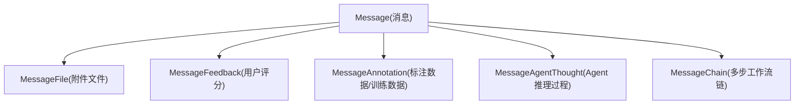
**来源：** [api/models/model.py1550-1662](https://github.com/langgenius/dify/blob/92dbc94f/api/models/model.py#L1550-L1662) [api/models/model.py1665-1722](https://github.com/langgenius/dify/blob/92dbc94f/api/models/model.py#L1665-L1722) [api/models/model.py1725-1824](https://github.com/langgenius/dify/blob/92dbc94f/api/models/model.py#L1725-L1824) [api/models/model.py1827-1921](https://github.com/langgenius/dify/blob/92dbc94f/api/models/model.py#L1827-L1921) [api/models/model.py1924-1982](https://github.com/langgenius/dify/blob/92dbc94f/api/models/model.py#L1924-L1982)

### 其他应用辅助模型

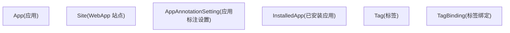
**来源：** [api/models/model.py1985-2054](https://github.com/langgenius/dify/blob/92dbc94f/api/models/model.py#L1985-L2054) [api/models/model.py2218-2271](https://github.com/langgenius/dify/blob/92dbc94f/api/models/model.py#L2218-L2271) [api/models/model.py2274-2318](https://github.com/langgenius/dify/blob/92dbc94f/api/models/model.py#L2274-L2318)

## 工作流层模型

### 工作流定义与执行

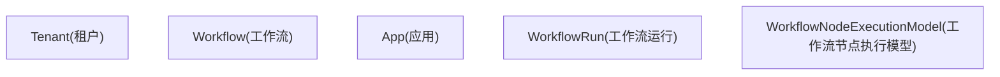
**来源：** [api/models/workflow.py100-554](https://github.com/langgenius/dify/blob/92dbc94f/api/models/workflow.py#L100-L554) [api/models/workflow.py556-716](https://github.com/langgenius/dify/blob/92dbc94f/api/models/workflow.py#L556-L716) [api/models/workflow.py728-1014](https://github.com/langgenius/dify/blob/92dbc94f/api/models/workflow.py#L728-L1014)

### Workflow (工作流模型)

`Workflow` 模型 ([api/models/workflow.py100-554](https://github.com/langgenius/dify/blob/92dbc94f/api/models/workflow.py#L100-L554)) 存储工作流定义：

| 字段 | 类型 | 描述 |
| --- | --- | --- |
| `id` | StringUUID | 主键 |
| `tenant_id`, `app_id` | StringUUID | 租户和应用引用 |
| `type` | String(255) | 工作流类型 (workflow, chat, rag-pipeline) |
| `version` | String(255) | 版本标识（"draft" 或时间戳） |
| `graph` | LongText | 画布配置 (JSON) |
| `features` | LongText | 功能设置 (JSON) |
| `environment_variables` | LongText | 加密的环境变量 (JSON) |
| `conversation_variables` | LongText | 会话变量/聊天记忆配置 (JSON) |
| `rag_pipeline_variables` | LongText | RAG 流水线设置 (JSON) |

**WorkflowType 枚举：**

| 值 | 描述 |
| --- | --- |
| `WORKFLOW` | 标准工作流应用 |
| `CHAT` | 工作流模式下的对话应用 |
| `RAG_PIPELINE` | RAG 检索流水线 |

**关键属性和方法：**

-   `graph_dict` - 解析后的图结构，包含节点 (nodes) 和边 (edges)
-   `get_node_config_by_id(node_id)` - 提取单个节点的配置
-   `walk_nodes(specific_node_type=None)` - 遍历工作流节点
-   `user_input_form()` - 返回开始节点的变量定义
-   `environment_variables` - 具有自动加密/解密的属性
-   `unique_hash` - 用于变更检测的图和功能哈希

**来源：** [api/models/workflow.py60-94](https://github.com/langgenius/dify/blob/92dbc94f/api/models/workflow.py#L60-L94) [api/models/workflow.py212-313](https://github.com/langgenius/dify/blob/92dbc94f/api/models/workflow.py#L212-L313)

### WorkflowRun (工作流运行模型)

`WorkflowRun` 模型 ([api/models/workflow.py556-716](https://github.com/langgenius/dify/blob/92dbc94f/api/models/workflow.py#L556-L716)) 追踪工作流执行：

| 字段 | 类型 | 描述 |
| --- | --- | --- |
| `workflow_id` | StringUUID | 来源工作流 |
| `triggered_from` | String(255) | 触发上下文（调试、应用运行等） |
| `version` | String(255) | 使用的工作流版本 |
| `status` | String(255) | 执行状态 (running, succeeded, failed, stopped, partial-succeeded) |
| `inputs`, `outputs` | LongText | 输入/输出数据 (JSON) |
| `error` | LongText | 失败时的错误消息 |
| `elapsed_time` | Float | 总执行耗时 |
| `total_tokens` | BigInteger | 消耗的 LLM Token 总数 |
| `created_by_role` | String(255) | 创建者类型 (account, end\_user) |

**关键属性：**

-   `graph_dict`, `inputs_dict`, `outputs_dict` - 解析后的 JSON 数据
-   `message` - 如果是从聊天触发，关联的消息对象
-   `workflow` - 父工作流实例

**来源：** [api/models/workflow.py632-690](https://github.com/langgenius/dify/blob/92dbc94f/api/models/workflow.py#L632-L690)

### WorkflowNodeExecutionModel (工作流节点执行模型)

`WorkflowNodeExecutionModel` ([api/models/workflow.py728-1014](https://github.com/langgenius/dify/blob/92dbc94f/api/models/workflow.py#L728-L1014)) 提供详尽的执行日志：

| 字段 | 类型 | 描述 |
| --- | --- | --- |
| `workflow_run_id` | StringUUID | 父运行 ID |
| `node_id` | String(255) | 图中的节点标识符 |
| `node_type` | String(255) | 节点类型 (llm, http-request 等) |
| `index` | Integer | 执行序列号 |
| `predecessor_node_id` | String(255) | 路径中的前序节点 |
| `inputs`, `outputs` | LongText | 节点 I/O 数据 (JSON) |
| `process_data` | LongText | 内部处理状态 (JSON) |
| `status` | String(255) | 执行结果状态 |
| `execution_metadata` | LongText | Token 使用量、定价等元数据 (JSON) |
| `elapsed_time` | Float | 节点执行耗时 |

**执行数据卸载：**

对于大型执行，数据可以卸载到对象存储：

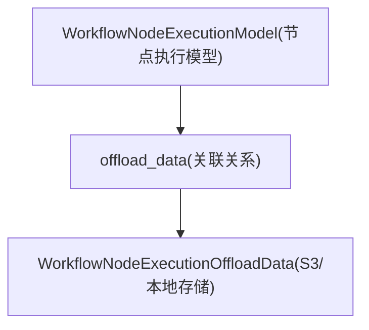
**来源：** [api/models/workflow.py1017-1110](https://github.com/langgenius/dify/blob/92dbc94f/api/models/workflow.py#L1017-L1110)

### 工作流暂停系统

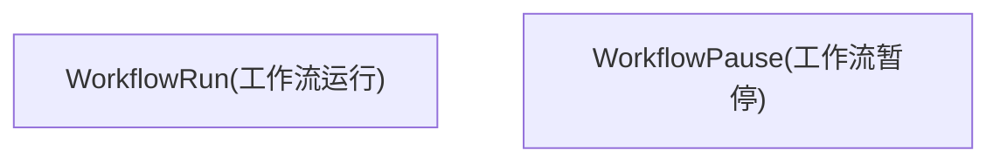
**暂停原因类型：**

-   `HUMAN_INPUT_REQUIRED` - 等待用户输入
-   `SCHEDULING_PAUSE` - 时间延迟

**来源：** [api/models/workflow.py1113-1175](https://github.com/langgenius/dify/blob/92dbc94f/api/models/workflow.py#L1113-L1175)

## 知识库层模型

### 数据集结构层级

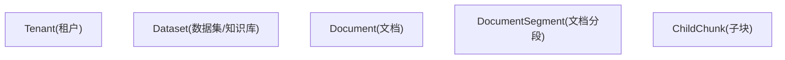
**来源：** [api/models/dataset.py44-311](https://github.com/langgenius/dify/blob/92dbc94f/api/models/dataset.py#L44-L311) [api/models/dataset.py353-650](https://github.com/langgenius/dify/blob/92dbc94f/api/models/dataset.py#L353-L650) [api/models/dataset.py652-891](https://github.com/langgenius/dify/blob/92dbc94f/api/models/dataset.py#L652-L891) [api/models/dataset.py894-975](https://github.com/langgenius/dify/blob/92dbc94f/api/models/dataset.py#L894-L975)

### Dataset (数据集模型)

`Dataset` 模型 ([api/models/dataset.py44-311](https://github.com/langgenius/dify/blob/92dbc94f/api/models/dataset.py#L44-L311)) 代表知识库：

| 字段 | 类型 | 描述 |
| --- | --- | --- |
| `id` | StringUUID | 主键 |
| `tenant_id` | StringUUID | 租户引用 |
| `name` | String(255) | 数据集名称 |
| `permission` | String(255) | 访问控制 (only\_me, all\_team\_members, partial\_members) |
| `indexing_technique` | String(255) | 索引技术 (high\_quality, economy) |
| `embedding_model` | String(255) | 嵌入模型名称 |
| `embedding_model_provider` | String(255) | 嵌入模型供应商 |
| `retrieval_model` | JSON | 检索配置 |
| `built_in_field_enabled` | Boolean | 是否包含系统元数据字段 |
| `chunk_structure` | String(255) | 分块策略 |
| `is_multimodal` | Boolean | 是否支持图像/音频等多模态 |

**权限级别：**

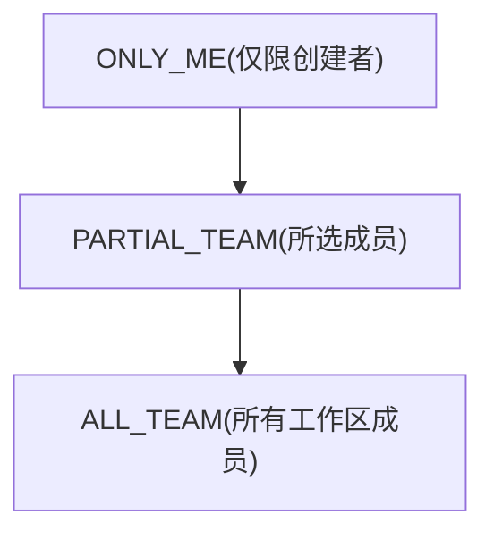
**关键属性：**

-   `total_documents`, `total_available_documents` - 文档计数
-   `retrieval_model_dict` - 解析后的检索配置，包含搜索方法、重排序 (reranking)、top\_k 等
-   `doc_metadata` - 自定义和内置元数据字段列表
-   `external_knowledge_info` - 外部 API 知识库配置

**来源：** [api/models/dataset.py38-42](https://github.com/langgenius/dify/blob/92dbc94f/api/models/dataset.py#L38-L42) [api/models/dataset.py83-306](https://github.com/langgenius/dify/blob/92dbc94f/api/models/dataset.py#L83-L306)

### Document (文档模型)

`Document` 模型 ([api/models/dataset.py353-650](https://github.com/langgenius/dify/blob/92dbc94f/api/models/dataset.py#L353-L650)) 代表上传或导入的文件：

| 字段 | 类型 | 描述 |
| --- | --- | --- |
| `dataset_id` | StringUUID | 父数据集 |
| `data_source_type` | String(255) | 来源 (upload\_file, notion\_import, website\_crawl 等) |
| `name` | String(255) | 文档名称 |
| `indexing_status` | String(255) | 索引状态 |
| `batch` | String(255) | 上传批次标识符 |
| `word_count` | Integer | 总字数 |
| `doc_form` | String(255) | 索引结构 (text\_model, qa\_model) |
| `doc_metadata` | JSON | 自定义元数据字段 |
| `enabled` | Boolean | 文档是否启用 |
| `archived` | Boolean | 软删除标志 |

**索引状态流：**

> **[Mermaid stateDiagram]**
> *(图表结构无法解析)*

**内置元数据字段：**

-   `document_name` - 文档名称
-   `uploader` - 创建者账号名
-   `upload_date` - 创建时间戳
-   `last_update_date` - 最后更新时间戳
-   `source` - 数据源类型

**来源：** [api/models/dataset.py425-598](https://github.com/langgenius/dify/blob/92dbc94f/api/models/dataset.py#L425-L598)

### DocumentSegment (文档分段模型)

`DocumentSegment` 模型 ([api/models/dataset.py652-891](https://github.com/langgenius/dify/blob/92dbc94f/api/models/dataset.py#L652-L891)) 存储文本块：

| 字段 | 类型 | 描述 |
| --- | --- | --- |
| `document_id` | StringUUID | 父文档 |
| `dataset_id` | StringUUID | 父数据集 |
| `position` | Integer | 在文档中的顺序 |
| `content` | LongText | 段落文本内容 |
| `word_count` | Integer | 字数 |
| `tokens` | Integer | Token 数 |
| `index_node_id` | String(255) | 向量数据库中的节点 ID |
| `index_node_hash` | String(255) | 内容哈希 |
| `enabled` | Boolean | 是否包含在检索中 |
| `status` | String(255) | 处理状态 |
| `hit_count` | Integer | 被检索命中的频率 |

**分段关联关系：**

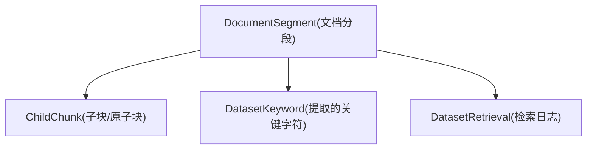
**来源：** [api/models/dataset.py652-891](https://github.com/langgenius/dify/blob/92dbc94f/api/models/dataset.py#L652-L891)

### 数据集配置模型

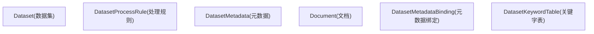
**DatasetProcessRule (数据集处理规则) 模式：**

-   `automatic` - 默认自动分段规则
-   `custom` - 用户自定义规则
-   `hierarchical` - 父子块级联结构

**来源：** [api/models/dataset.py313-351](https://github.com/langgenius/dify/blob/92dbc94f/api/models/dataset.py#L313-L351) [api/models/dataset.py978-1026](https://github.com/langgenius/dify/blob/92dbc94f/api/models/dataset.py#L978-L1026) [api/models/dataset.py1029-1073](https://github.com/langgenius/dify/blob/92dbc94f/api/models/dataset.py#L1029-L1073)

## 供应商与模型集成

### 供应商架构

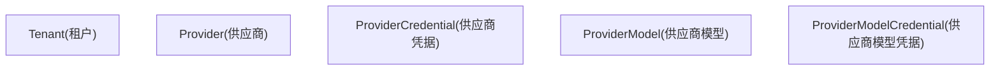
**来源：** [api/models/provider.py49-128](https://github.com/langgenius/dify/blob/92dbc94f/api/models/provider.py#L49-L128) [api/models/provider.py129-177](https://github.com/langgenius/dify/blob/92dbc94f/api/models/provider.py#L129-L177) [api/models/provider.py314-338](https://github.com/langgenius/dify/blob/92dbc94f/api/models/provider.py#L314-L338) [api/models/provider.py340-372](https://github.com/langgenius/dify/blob/92dbc94f/api/models/provider.py#L340-L372)

### Provider (供应商模型)

`Provider` 模型 ([api/models/provider.py49-128](https://github.com/langgenius/dify/blob/92dbc94f/api/models/provider.py#L49-L128)) 代表 LLM 供应商配置：

| 字段 | 类型 | 描述 |
| --- | --- | --- |
| `provider_name` | String(255) | 供应商标识（openai, anthropic 等） |
| `provider_type` | String(40) | 类型 (custom, system) |
| `is_valid` | Boolean | 凭据是否有效 |
| `credential_id` | StringUUID | 加密凭据引用 |
| `quota_type` | String(40) | 额度类型 (paid, free, trial) |
| `quota_limit`, `quota_used` | BigInteger | 使用量追踪 |

**ProviderType 枚举：**

-   `CUSTOM` - 用户提供的 API Key
-   `SYSTEM` - 托管/管理的供应商

**ProviderQuotaType 枚举：**

-   `PAID` - 已付费的托管额度
-   `FREE` - 第三方免费层级
-   `TRIAL` - 托管试用额度

**关键属性：**

-   `credential` - 返回关联的 `ProviderCredential`
-   `is_enabled` - 结合 `is_valid` 和凭据检查的结果
-   `token_is_set` - 布尔值，指示凭据是否存在

**来源：** [api/models/provider.py19-47](https://github.com/langgenius/dify/blob/92dbc94f/api/models/provider.py#L19-L47)

### 模型配置模型

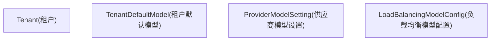
**来源：** [api/models/provider.py179-199](https://github.com/langgenius/dify/blob/92dbc94f/api/models/provider.py#L179-L199) [api/models/provider.py253-281](https://github.com/langgenius/dify/blob/92dbc94f/api/models/provider.py#L253-L281) [api/models/provider.py283-312](https://github.com/langgenius/dify/blob/92dbc94f/api/models/provider.py#L283-L312)

## 工具供应商模型

### 工具供应商类型层级

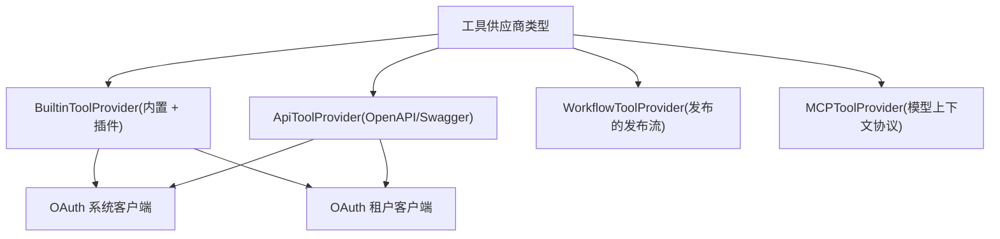
**来源：** [api/models/tools.py68-118](https://github.com/langgenius/dify/blob/92dbc94f/api/models/tools.py#L68-L118) [api/models/tools.py120-192](https://github.com/langgenius/dify/blob/92dbc94f/api/models/tools.py#L120-L192) [api/models/tools.py216-281](https://github.com/langgenius/dify/blob/92dbc94f/api/models/tools.py#L216-L281) [api/models/tools.py283-369](https://github.com/langgenius/dify/blob/92dbc94f/api/models/tools.py#L283-L369)

### BuiltinToolProvider (内置工具供应商模型)

`BuiltinToolProvider` 模型 ([api/models/tools.py68-118](https://github.com/langgenius/dify/blob/92dbc94f/api/models/tools.py#L68-L118)) 存储内置工具的凭据：

| 字段 | 类型 | 描述 |
| --- | --- | --- |
| `tenant_id` | StringUUID | 租户引用 |
| `provider` | String(256) | 工具供应商标识 |
| `name` | String(256) | 配置名称 |
| `encrypted_credentials` | LongText | 加密的 API Key/密钥 |
| `credential_type` | String(32) | 类型 (api-key, oauth2) |
| `is_default` | Boolean | 是否为默认配置 |
| `expires_at` | BigInteger | OAuth 令牌过期时间 |

**来源：** [api/models/tools.py68-118](https://github.com/langgenius/dify/blob/92dbc94f/api/models/tools.py#L68-L118)

### ApiToolProvider (API 工具供应商模型)

`ApiToolProvider` 模型 ([api/models/tools.py120-192](https://github.com/langgenius/dify/blob/92dbc94f/api/models/tools.py#L120-L192)) 代表基于 OpenAPI 的工具集成：

| 字段 | 类型 | 描述 |
| --- | --- | --- |
| `name` | String(255) | 供应商名称 |
| `icon` | String(255) | 供应商图标 URL |
| `schema` | LongText | 原始 OpenAPI/Swagger Schema |
| `schema_type_str` | String(40) | Schema 格式 (openapi, swagger) |
| `tools_str` | LongText | 解析后的工具定义 (JSON) |
| `credentials_str` | LongText | 凭据要求 (JSON) |
| `description` | LongText | 供应商描述 |

**关键属性：**

-   `schema_type` - 解析后的 `ApiProviderSchemaType` 枚举
-   `tools` - `ApiToolBundle` 对象列表
-   `credentials` - 解析后的凭据字典

**来源：** [api/models/tools.py172-187](https://github.com/langgenius/dify/blob/92dbc94f/api/models/tools.py#L172-L187)

### WorkflowToolProvider (工作流工具供应商模型)

`WorkflowToolProvider` 模型 ([api/models/tools.py216-281](https://github.com/langgenius/dify/blob/92dbc94f/api/models/tools.py#L216-L281)) 将工作流发布为可复用的工具：

| 字段 | 类型 | 描述 |
| --- | --- | --- |
| `app_id` | StringUUID | 来源工作流应用 |
| `name` | String(255) | 工具标识符 |
| `label` | String(255) | 显示名称 |
| `version` | String(255) | 工作流版本 |
| `parameter_configuration` | LongText | 输入参数定义 (JSON) |
| `description` | LongText | 工具描述 |

**关键属性：**

-   `parameter_configurations` - `WorkflowToolParameterConfiguration` 对象列表
-   `app` - 关联的 `App` 实例

**来源：** [api/models/tools.py272-280](https://github.com/langgenius/dify/blob/92dbc94f/api/models/tools.py#L272-L280)

### MCPToolProvider (MCP 工具供应商模型)

`MCPToolProvider` 模型 ([api/models/tools.py283-369](https://github.com/langgenius/dify/blob/92dbc94f/api/models/tools.py#L283-L369)) 集成模型上下文协议 (Model Context Protocol) 服务器：

| 字段 | 类型 | 描述 |
| --- | --- | --- |
| `name` | String(40) | 供应商名称 |
| `server_identifier` | String(64) | 唯一服务器 ID |
| `server_url` | LongText | 加密的服务器端点 |
| `server_url_hash` | String(64) | 用于排重的哈希 |
| `encrypted_credentials` | LongText | 认证凭据 |
| `authed` | Boolean | 是否已认证 |
| `tools` | LongText | 可用工具列表 (JSON) |
| `timeout` | Float | 请求超时时间 |
| `sse_read_timeout` | Float | SSE 流读取超时时间 |
| `encrypted_headers` | LongText | 自定义 HTTP 标头 |

**来源：** [api/models/tools.py336-368](https://github.com/langgenius/dify/blob/92dbc94f/api/models/tools.py#L336-L368)

### 工具 OAuth 模型

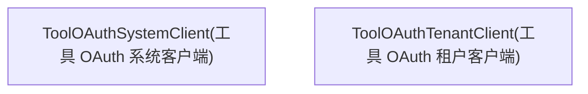
**来源：** [api/models/tools.py28-42](https://github.com/langgenius/dify/blob/92dbc94f/api/models/tools.py#L28-L42) [api/models/tools.py45-66](https://github.com/langgenius/dify/blob/92dbc94f/api/models/tools.py#L45-L66)

## 触发器与自动化模型

### 触发器系统架构

```mermaid
flowchart TD
    entity_Tenant_0["Tenant(租户)"]
    entity_TriggerSubscription_1["TriggerSubscription(触发器订阅)"]
    entity_App_2["App(应用)"]
    entity_WorkflowWebhookTrigger_3["WorkflowWebhookTrigger(Webhook 触发器)"]
    entity_WorkflowScheduleTrigger_4["WorkflowScheduleTrigger(定时调度触发器)"]
    entity_WorkflowPluginTrigger_5["WorkflowPluginTrigger(插件触发器)"]
    entity_WorkflowRun_6["WorkflowRun(工作流运行)"]
    entity_WorkflowTriggerLog_7["WorkflowTriggerLog(触发器日志)"]
```
**来源：** [api/models/trigger.py27-106](https://github.com/langgenius/dify/blob/92dbc94f/api/models/trigger.py#L27-L106) [api/models/trigger.py282-364](https://github.com/langgenius/dify/blob/92dbc94f/api/models/trigger.py#L282-L364) [api/models/trigger.py367-468](https://github.com/langgenius/dify/blob/92dbc94f/api/models/trigger.py#L367-L468) [api/models/trigger.py169-280](https://github.com/langgenius/dify/blob/92dbc94f/api/models/trigger.py#L169-L280)

### TriggerSubscription (触发器订阅模型)

`TriggerSubscription` 模型 ([api/models/trigger.py27-106](https://github.com/langgenius/dify/blob/92dbc94f/api/models/trigger.py#L27-L106)) 管理供应商订阅：

| 字段 | 类型 | 描述 |
| --- | --- | --- |
| `provider_id` | String(255) | 供应商标识 |
| `endpoint_id` | String(255) | 唯一的订阅端点（已索引） |
| `parameters` | JSON | 订阅参数 |
| `properties` | JSON | 供应商特定属性 |
| `credentials` | JSON | 认证数据 |
| `credential_type` | String(50) | 类型 (oauth, api\_key) |
| `credential_expires_at` | Integer | OAuth 过期时间戳 |
| `expires_at` | Integer | 订阅过期时间 |

**关键方法：**

-   `is_credential_expired()` - 检查 OAuth 过期情况（含 3 分钟缓冲期）
-   `to_entity()` - 转换为领域 `Subscription` (订阅) 对象
-   `to_api_entity()` - 转换为 API 响应实体

**来源：** [api/models/trigger.py79-105](https://github.com/langgenius/dify/blob/92dbc94f/api/models/trigger.py#L79-L105)

### WorkflowTriggerLog (工作流触发日志模型)

`WorkflowTriggerLog` 模型 ([api/models/trigger.py169-280](https://github.com/langgenius/dify/blob/92dbc94f/api/models/trigger.py#L169-L280)) 追踪异步触发器执行：

| 字段 | 类型 | 描述 |
| --- | --- | --- |
| `workflow_run_id` | StringUUID | 关联的工作流运行 |
| `trigger_type` | String(50) | 类型 (webhook, schedule, plugin) |
| `trigger_metadata` | LongText | 触发器元数据 (JSON) |
| `trigger_data` | LongText | 完整的触发 Payload (JSON) |
| `inputs` | LongText | 工作流输入 (JSON) |
| `status` | String(50) | 执行状态 |
| `queue_name` | String(100) | Celery 队列名 |
| `celery_task_id` | String(255) | 用于追踪的 Celery 任务 ID |
| `retry_count` | Integer | 重试次数 |

**触发器类型：**

-   `WEBHOOK` - HTTP Webhook 调用
-   `SCHEDULE` - 基于 Cron 的定时调度
-   `PLUGIN` - 插件事件触发

**来源：** [api/models/trigger.py169-280](https://github.com/langgenius/dify/blob/92dbc94f/api/models/trigger.py#L169-L280) [api/models/enums.py](https://github.com/langgenius/dify/blob/92dbc94f/api/models/enums.py)

### Webhook 与定时调度触发器

```mermaid
flowchart TD
    App["应用"]
    Webhook["Webhook 触发器(HTTP 端点)"]
    Schedule["定时调度触发器(Cron 计划)"]
    Plugin["插件触发器(插件事件)"]
    WebhookLog["日志：WorkflowTriggerLog"]
    ScheduleLog["日志：WorkflowTriggerLog"]
    PluginLog["日志：WorkflowTriggerLog"]

    App --> Webhook
    App --> Schedule
    App --> Plugin
    Webhook --> WebhookLog
    Schedule --> ScheduleLog
    Plugin --> PluginLog
```
**WorkflowScheduleTrigger (定时调度触发器) 字段：**

-   `cron_expression` - Cron 语法调度表达式
-   `timezone` - 执行时区
-   `enabled` - 调度是否启用

**WorkflowPluginTrigger (插件触发器) 字段：**

-   `plugin_id` - 插件标识符
-   `trigger_provider` - 插件内的触发器供应商
-   `trigger_subscription_id` - 订阅引用

**来源：** [api/models/trigger.py367-468](https://github.com/langgenius/dify/blob/92dbc94f/api/models/trigger.py#L367-L468) [api/models/trigger.py471-552](https://github.com/langgenius/dify/blob/92dbc94f/api/models/trigger.py#L471-L552)

## 辅助与实用模型

### 文件与媒体模型

```mermaid
flowchart TD
    entity_Message_0["Message(消息)"]
    entity_MessageFile_1["MessageFile(消息文件)"]
    entity_ToolFile_2["ToolFile(工具文件)"]
    entity_UploadFile_3["UploadFile(上传文件)"]
```
**来源：** [api/models/tools.py462-492](https://github.com/langgenius/dify/blob/92dbc94f/api/models/tools.py#L462-L492) [api/models/model.py2057-2124](https://github.com/langgenius/dify/blob/92dbc94f/api/models/model.py#L2057-2124)

### 标签系统

```mermaid
flowchart TD
    entity_Tenant_0["Tenant(租户)"]
    entity_Tag_1["Tag(标签)"]
    entity_TagBinding_2["TagBinding(标签绑定)"]
```
**标签类型：**

-   `app` - 应用标签
-   `knowledge` - 数据集/知识库标签

**来源：** [api/models/model.py2218-2271](https://github.com/langgenius/dify/blob/92dbc94f/api/models/model.py#L2218-L2271) [api/models/model.py2274-2318](https://github.com/langgenius/dify/blob/92dbc94f/api/models/model.py#L2274-L2318)

### Celery 任务模型

```mermaid
flowchart TD
    entity_CeleryTask_0["CeleryTask(任务)"]
    entity_CeleryTaskSet_1["CeleryTaskSet(任务集)"]
```
**Celery 任务状态：**

-   `PENDING` - 任务等待执行
-   `STARTED` - 任务已开始
-   `SUCCESS` - 任务执行成功
-   `FAILURE` - 任务失败
-   `RETRY` - 任务重试中
-   `REVOKED` - 任务已被撤销/取消

**来源：** [api/models/task.py14-54](https://github.com/langgenius/dify/blob/92dbc94f/api/models/task.py#L14-L54)

### 数据源 OAuth 模型

```mermaid
flowchart TD
    entity_Tenant_0["Tenant(租户)"]
    entity_DataSourceOauthBinding_1["DataSourceOauthBinding(数据源 OAuth 绑定)"]
    entity_DataSourceApiKeyAuthBinding_2["DataSourceApiKeyAuthBinding(数据源 API Key 绑定)"]
```
**数据源供应商：**

-   Notion (使用 OAuth)
-   网站爬虫 (使用 API Key)
-   自定义集成

**来源：** [api/models/source.py13-39](https://github.com/langgenius/dify/blob/92dbc94f/api/models/source.py#L13-L39) [api/models/source.py41-79](https://github.com/langgenius/dify/blob/92dbc94f/api/models/source.py#L41-L79)

### 外部知识库 API 模型

```mermaid
flowchart TD
    entity_Tenant_0["Tenant(租户)"]
    entity_ExternalKnowledgeApis_1["ExternalKnowledgeApis(外部知识库 API)"]
    entity_Dataset_2["Dataset(数据集)"]
    entity_ExternalKnowledgeBindings_3["ExternalKnowledgeBindings(外部知识库绑定)"]
```
**来源：** [api/models/dataset.py1076-1127](https://github.com/langgenius/dify/blob/92dbc94f/api/models/dataset.py#L1076-L1127) [api/models/dataset.py1130-1168](https://github.com/langgenius/dify/blob/92dbc94f/api/models/dataset.py#L1130-L1168)

### Web 特定模型

```mermaid
flowchart TD
    entity_EndUser_0["EndUser(终端用户)"]
    entity_SavedMessage_1["SavedMessage(已保存的消息)"]
    entity_PinnedConversation_2["PinnedConversation(置顶会话)"]
```
**来源：** [api/models/web.py14-38](https://github.com/langgenius/dify/blob/92dbc94f/api/models/web.py#L14-L38) [api/models/web.py40-64](https://github.com/langgenius/dify/blob/92dbc94f/api/models/web.py#L40-L64)

## 模型关系与访问模式

### 跨层关系图

```mermaid
flowchart TD
    Tenant["Tenant(租户)"]
    Account["Account(账号)"]
    App["App(应用)"]
    Conversation["Conversation(会话)"]
    Message["Message(消息)"]
    Workflow["Workflow(工作流)"]
    WorkflowRun["WorkflowRun(工作流运行)"]
    Dataset["Dataset(数据集)"]
    Document["Document(文档)"]
    Provider["Provider(供应商)"]
    ToolProvider["工具供应商"]

    Tenant --> App
    Tenant --> Workflow
    Tenant --> Dataset
    Tenant --> Provider
    Tenant --> ToolProvider
    App --> Conversation
    App --> Workflow
    App --> Dataset
    Conversation --> Message
    Message --> WorkflowRun
    Workflow --> WorkflowRun
```
### 常用查询模式

**租户范围查询：**

```
# 所有查询都按 tenant_id 过滤，以实现多租户隔离
apps = db.session.query(App).where(App.tenant_id == tenant_id).all()
datasets = db.session.query(Dataset).where(Dataset.tenant_id == tenant_id).all()
```
**关系遍历：**

```
# 从应用导航到相关实体
app = db.session.get(App, app_id)
app_config = app.app_model_config  # 属性查询
workflow = app.workflow  # 属性查询
conversations = db.session.query(Conversation).where(Conversation.app_id == app.id).all()
```
**索引查询：**

```
# 使用已索引字段以提高性能
dataset_by_tenant = db.session.query(Dataset).where(Dataset.tenant_id == tenant_id).all()
messages_by_conversation = db.session.query(Message).where(
    Message.conversation_id == conv_id
).order_by(Message.created_at.asc()).all()
```
**来源：** [api/models/model.py](https://github.com/langgenius/dify/blob/92dbc94f/api/models/model.py) [api/models/workflow.py](https://github.com/langgenius/dify/blob/92dbc94f/api/models/workflow.py) [api/models/dataset.py](https://github.com/langgenius/dify/blob/92dbc94f/api/models/dataset.py)

---

本文档提供了 Dify 数据模型的全面参考。有关工作流特定的执行逻辑，请参阅 [工作流定义与执行模型](/langgenius/dify/5.1-workflow-definition-and-execution-model)。有关知识库索引和检索，请参阅 [数据集服务与文档管理](/langgenius/dify/4.1-dataset-service-and-document-management)。有关身份验证和授权流程，请参阅 [租户与账号模型](/langgenius/dify/7.1-tenant-and-account-models)。
