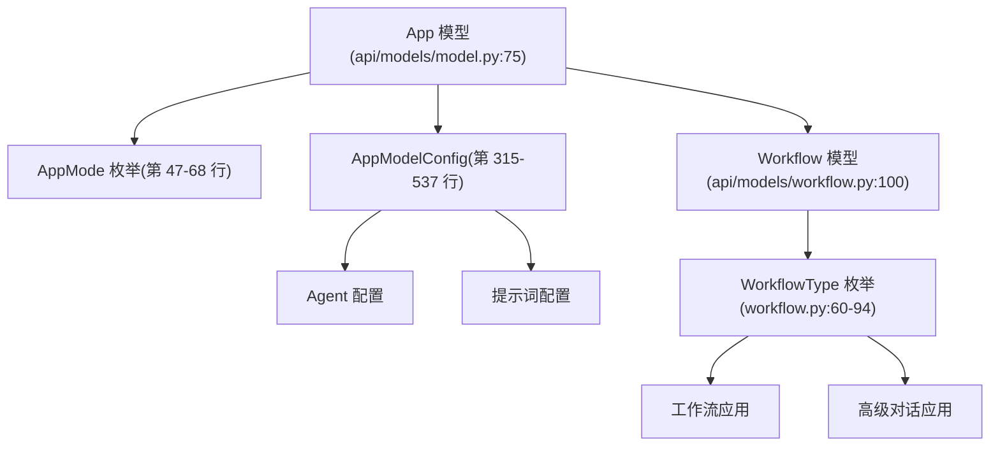
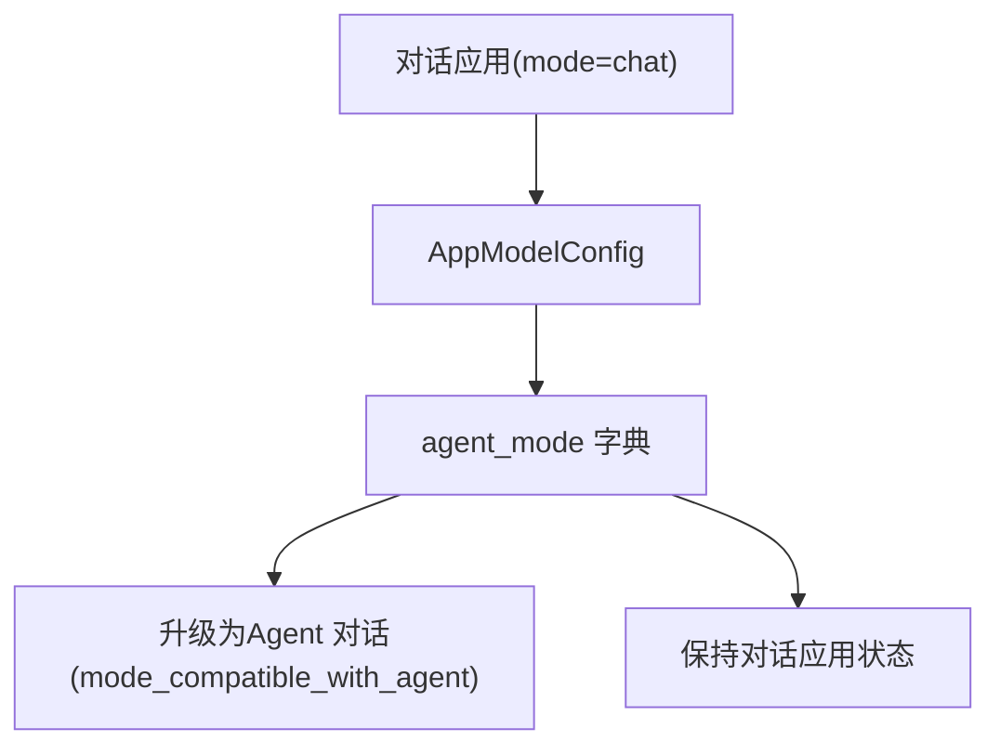
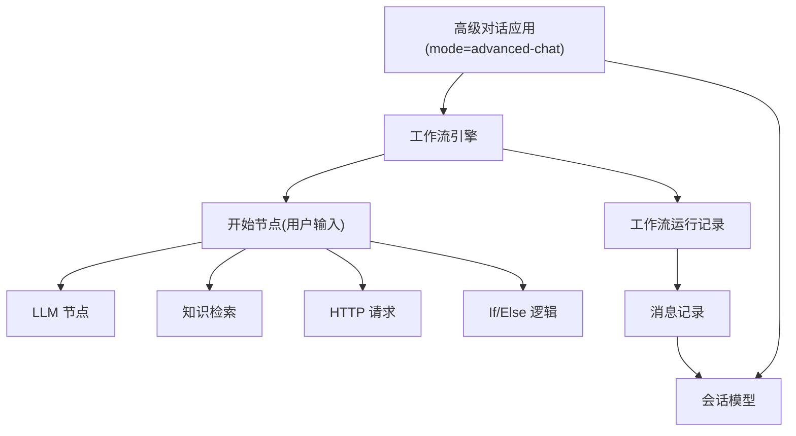
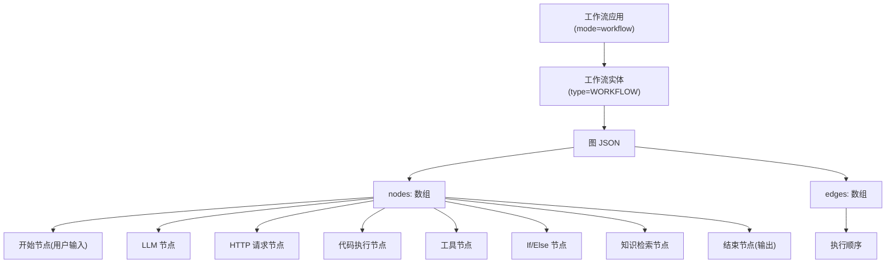
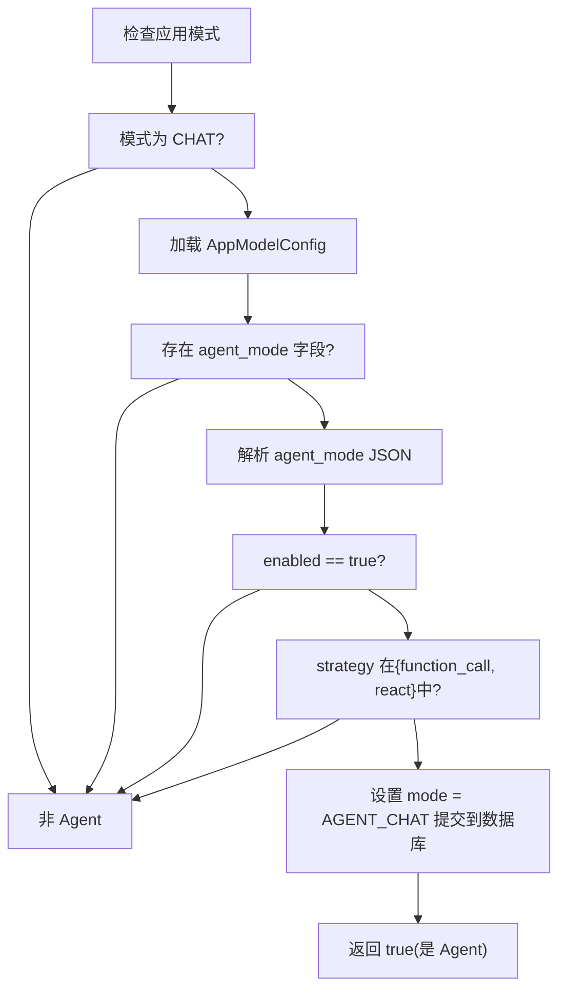
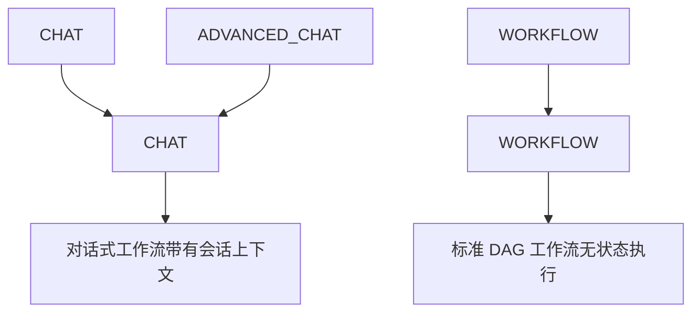
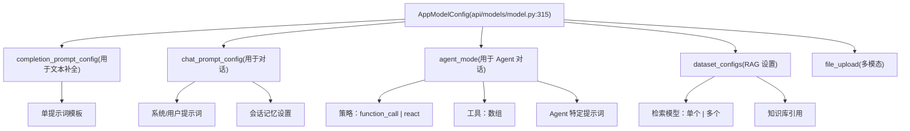
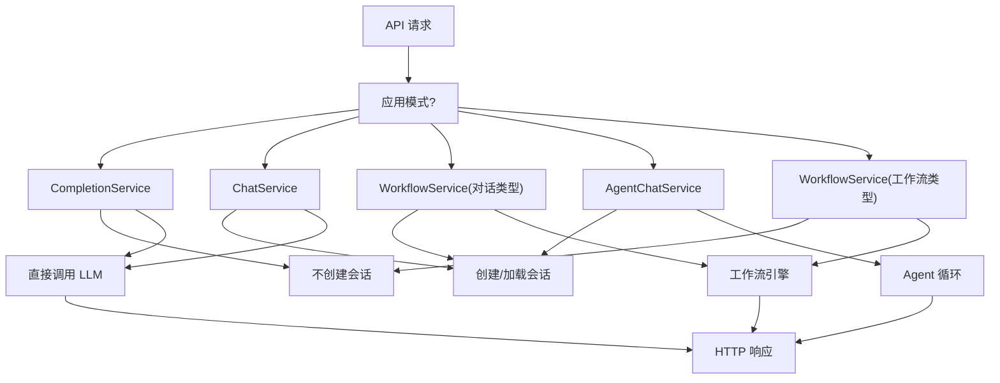
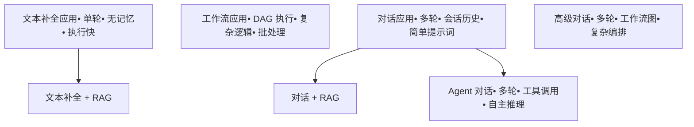

# 应用类型与执行模式

相关源文件

-   [api/models/account.py](https://github.com/langgenius/dify/blob/92dbc94f/api/models/account.py)
-   [api/models/api\_based\_extension.py](https://github.com/langgenius/dify/blob/92dbc94f/api/models/api_based_extension.py)
-   [api/models/dataset.py](https://github.com/langgenius/dify/blob/92dbc94f/api/models/dataset.py)
-   [api/models/model.py](https://github.com/langgenius/dify/blob/92dbc94f/api/models/model.py)
-   [api/models/oauth.py](https://github.com/langgenius/dify/blob/92dbc94f/api/models/oauth.py)
-   [api/models/provider.py](https://github.com/langgenius/dify/blob/92dbc94f/api/models/provider.py)
-   [api/models/source.py](https://github.com/langgenius/dify/blob/92dbc94f/api/models/source.py)
-   [api/models/task.py](https://github.com/langgenius/dify/blob/92dbc94f/api/models/task.py)
-   [api/models/tools.py](https://github.com/langgenius/dify/blob/92dbc94f/api/models/tools.py)
-   [api/models/trigger.py](https://github.com/langgenius/dify/blob/92dbc94f/api/models/trigger.py)
-   [api/models/web.py](https://github.com/langgenius/dify/blob/92dbc94f/api/models/web.py)
-   [api/models/workflow.py](https://github.com/langgenius/dify/blob/92dbc94f/api/models/workflow.py)
-   [api/tests/test\_containers\_integration\_tests/services/test\_advanced\_prompt\_template\_service.py](https://github.com/langgenius/dify/blob/92dbc94f/api/tests/test_containers_integration_tests/services/test_advanced_prompt_template_service.py)
-   [api/tests/test\_containers\_integration\_tests/services/test\_agent\_service.py](https://github.com/langgenius/dify/blob/92dbc94f/api/tests/test_containers_integration_tests/services/test_agent_service.py)
-   [api/tests/test\_containers\_integration\_tests/tasks/\_\_init\_\_.py](https://github.com/langgenius/dify/blob/92dbc94f/api/tests/test_containers_integration_tests/tasks/__init__.py)
-   [api/tests/test\_containers\_integration\_tests/tasks/test\_add\_document\_to\_index\_task.py](https://github.com/langgenius/dify/blob/92dbc94f/api/tests/test_containers_integration_tests/tasks/test_add_document_to_index_task.py)
-   [api/tests/unit\_tests/core/test\_provider\_manager.py](https://github.com/langgenius/dify/blob/92dbc94f/api/tests/unit_tests/core/test_provider_manager.py)
-   [web/app/components/develop/template/template.en.mdx](https://github.com/langgenius/dify/blob/92dbc94f/web/app/components/develop/template/template.en.mdx)
-   [web/app/components/develop/template/template.ja.mdx](https://github.com/langgenius/dify/blob/92dbc94f/web/app/components/develop/template/template.ja.mdx)
-   [web/app/components/develop/template/template.zh.mdx](https://github.com/langgenius/dify/blob/92dbc94f/web/app/components/develop/template/template.zh.mdx)
-   [web/app/components/develop/template/template\_advanced\_chat.en.mdx](https://github.com/langgenius/dify/blob/92dbc94f/web/app/components/develop/template/template_advanced_chat.en.mdx)
-   [web/app/components/develop/template/template\_advanced\_chat.ja.mdx](https://github.com/langgenius/dify/blob/92dbc94f/web/app/components/develop/template/template_advanced_chat.ja.mdx)
-   [web/app/components/develop/template/template\_advanced\_chat.zh.mdx](https://github.com/langgenius/dify/blob/92dbc94f/web/app/components/develop/template/template_advanced_chat.zh.mdx)
-   [web/app/components/develop/template/template\_chat.en.mdx](https://github.com/langgenius/dify/blob/92dbc94f/web/app/components/develop/template/template_chat.en.mdx)
-   [web/app/components/develop/template/template\_chat.ja.mdx](https://github.com/langgenius/dify/blob/92dbc94f/web/app/components/develop/template/template_chat.ja.mdx)
-   [web/app/components/develop/template/template\_chat.zh.mdx](https://github.com/langgenius/dify/blob/92dbc94f/web/app/components/develop/template/template_chat.zh.mdx)
-   [web/app/components/develop/template/template\_workflow.en.mdx](https://github.com/langgenius/dify/blob/92dbc94f/web/app/components/develop/template/template_workflow.en.mdx)
-   [web/app/components/develop/template/template\_workflow.ja.mdx](https://github.com/langgenius/dify/blob/92dbc94f/web/app/components/develop/template/template_workflow.ja.mdx)
-   [web/app/components/develop/template/template\_workflow.zh.mdx](https://github.com/langgenius/dify/blob/92dbc94f/web/app/components/develop/template/template_workflow.zh.mdx)

本页面记录了 Dify 支持的五种主要应用类型及其执行特性。每种应用类型定义了独特的交互模式和执行模型，针对特定的使用场景进行了优化，涵盖了从单轮文本补全到多步工作流编排的各种需求。

有关这些应用底层的数据模型信息，请参阅 [核心数据模型与领域实体](/langgenius/dify/2.2-core-data-models-and-domain-entities)。有关工作流节点执行的详细信息，请参阅 [工作流系统与节点执行](/langgenius/dify/5-workflow-system-and-node-execution)。

---

## 应用类型分类

Dify 支持五种不同的应用模式，每种模式由 `AppMode` 枚举定义。这些模式决定了应用的执行模式、状态管理以及可用的功能集。

**AppMode 枚举**

应用类型存储在 `App` 模型的 `mode` 字段中：

| 模式值 | 描述 | 状态性 | 主要使用场景 |
| --- | --- | --- | --- |
| `completion` | 单轮文本生成 | 无状态 | 文本补全、翻译、一次性任务 |
| `chat` | 对话式交互 | 有状态 | 客户支持、聊天机器人、问答 |
| `advanced-chat` | 具备工作流能力的对话 | 有状态 | 带有编排能力的复杂对话流程 |
| `agent-chat` | 具备工具调用能力的自主 Agent | 有状态 | 集成外部工具的任务自动化 |
| `workflow` | 多步流水线执行 | 每次运行无状态 | 数据处理、批处理操作、ETL |

来源：[api/models/model.py47-68](https://github.com/langgenius/dify/blob/92dbc94f/api/models/model.py#L47-L68)

---

## 应用模式实现

### 模式存储与验证


**App 模型中的模式存储**

来源：[api/models/model.py75-313](https://github.com/langgenius/dify/blob/92dbc94f/api/models/model.py#L75-L313)

---

## 应用类型详细规范

### 1\. 文本补全应用 (`completion`)

**特性：**

-   **无状态 (Stateless)**：每个请求相互独立
-   **单轮**：一个输入 → 一个输出
-   **无会话历史**：请求之间没有记忆
-   **配置**：使用 `AppModelConfig` 中的 `completion_prompt_config`

**执行流程：**

> **[Mermaid 序列图]**
> *(图表结构无法解析)*

**关键属性：**

-   不创建 `Conversation` (会话) 实体
-   不维护消息历史记录
-   适用于功能性转换任务
-   如果配置了，支持文件上传

来源：[api/models/model.py47-48](https://github.com/langgenius/dify/blob/92dbc94f/api/models/model.py#L47-L48) [api/models/model.py315-349](https://github.com/langgenius/dify/blob/92dbc94f/api/models/model.py#L315-L349)

---

### 2\. 对话应用 (`chat`)

**特性：**

-   **有状态 (Stateful)**：维护会话历史记录
-   **多轮**：带有上下文的连续对话
-   **记忆**：可以访问会话中的先前消息
-   **配置**：使用 `AppModelConfig` 中的 `chat_prompt_config`

**执行流程：**

> **[Mermaid 序列图]**
> *(图表结构无法解析)*

**状态管理：**

-   在收到第一条消息时创建 `Conversation` 实体
-   每次交互都存储为 `Message` 记录
-   支持会话变量
-   通过 `retriever_resource` 实现可选的 RAG 集成

**Agent 兼容性：**

如果检测到 Agent 配置，对话应用可以自动升级到 Agent 对话模式：


来源：[api/models/model.py50](https://github.com/langgenius/dify/blob/92dbc94f/api/models/model.py#L50-L50) [api/models/model.py153-166](https://github.com/langgenius/dify/blob/92dbc94f/api/models/model.py#L153-L166) [api/models/model.py169-173](https://github.com/langgenius/dify/blob/92dbc94f/api/models/model.py#L169-L173)

---

### 3\. 高级对话应用 (`advanced-chat`)

**特性：**

-   **有状态**：完整的会话历史记录
-   **由工作流驱动**：后端基于工作流引擎
-   **复杂编排**：多节点执行图
-   **增强能力**：可以访问所有工作流节点类型

**架构：**


**工作流集成：**

-   应用拥有指向 `Workflow` 实体的 `workflow_id`
-   每条消息都会触发一次 `WorkflowRun` 执行
-   工作流类型为 `WorkflowType.CHAT`
-   会话变量会被传递到工作流上下文中
-   工作流输出即为消息响应

**执行生命周期：**

1.  用户向会话发送消息
2.  创建状态为 `normal` 的 `Message` 实体
3.  创建 `triggered_from='app-run'` 的 `WorkflowRun` 实体
4.  逐个节点执行工作流图
5.  每个节点的执行情况记录在 `WorkflowNodeExecutionModel` 中
6.  最终输出存储在 `Message.answer` 中
7.  `WorkflowRun` 标记为 `succeeded` (成功) 或 `failed` (失败)

来源：[api/models/model.py51](https://github.com/langgenius/dify/blob/92dbc94f/api/models/model.py#L51-L51) [api/models/workflow.py100-202](https://github.com/langgenius/dify/blob/92dbc94f/api/models/workflow.py#L100-L202) [api/models/workflow.py556-715](https://github.com/langgenius/dify/blob/92dbc94f/api/models/workflow.py#L556-L715)

---

### 4\. Agent 对话应用 (`agent-chat`)

**特性：**

-   **具备工具能力**：可以访问外部工具和 API
-   **自主推理**：使用 ReAct 或函数调用 (Function Calling) 策略
-   **多步执行**：每一轮对话可以执行多次工具调用
-   **有状态**：维护会话和 Agent 思维链 (thought chain)

**Agent 模式配置：**

`AppModelConfig` 中的 `agent_mode` 字段决定了 Agent 的行为：

```
{
  "enabled": true,
  "strategy": "function_call",  // 或 "react"
  "tools": [
    {
      "provider_id": "google",
      "provider_type": "builtin",
      "tool_name": "google_search",
      "tool_parameters": {}
    }
  ],
  "prompt": {
    "first_prompt": "You are a helpful assistant...",
    "next_iteration": "Continue with the next step..."
  }
}
```
**工具供应商类型：**

| 供应商类型 | 存储表 | 描述 |
| --- | --- | --- |
| `builtin` | `tool_builtin_providers` | 预置工具（Google, DALL-E 等） |
| `api` | `tool_api_providers` | 通过 OpenAPI 规范集成的自定义 API |
| `workflow` | `tool_workflow_providers` | 其他 Dify 工作流作为工具使用 |
| `mcp` | `tool_mcp_providers` | 模型上下文协议 (Model Context Protocol) 工具 |

**带思维链的执行过程：**

> **[Mermaid 序列图]**
> *(图表结构无法解析)*

**Agent 检测逻辑：**

系统会自动检测 Agent 配置：

来源：[api/models/model.py52](https://github.com/langgenius/dify/blob/92dbc94f/api/models/model.py#L52-L52) [api/models/model.py153-166](https://github.com/langgenius/dify/blob/92dbc94f/api/models/model.py#L153-L166) [api/models/model.py427-432](https://github.com/langgenius/dify/blob/92dbc94f/api/models/model.py#L427-L432)

---

### 5\. 工作流应用 (`workflow`)

**特性：**

-   **无状态**：每次运行相互独立
-   **DAG 执行**：节点的有向无环图
-   **面向批处理**：设计用于数据处理流水线
-   **无会话**：纯粹的 输入 → 处理 → 输出

**工作流图结构：**


**节点执行追踪：**

每次工作流运行都会创建详细的执行记录：

| 实体 | 用途 | 关键字段 |
| --- | --- | --- |
| `WorkflowRun` | 整体执行记录 | `status`, `inputs`, `outputs`, `elapsed_time` |
| `WorkflowNodeExecutionModel` | 单节点执行详情 | `node_id`, `node_type`, `inputs`, `outputs`, `status` |
| `WorkflowNodeExecutionOffload` | 大型执行数据存储 | 当数据超过大小阈值时进行卸载存储 |

**执行流程：**

1.  API 接收带有输入的工作流运行请求
2.  创建 `triggered_from='app-run'` 的 `WorkflowRun` 实体
3.  工作流引擎从 `Workflow.graph` 加载图结构
4.  根据边确定的拓扑顺序执行节点
5.  每个节点创建 `WorkflowNodeExecutionModel` 记录
6.  变量通过变量池在节点间传递
7.  从指定的结束节点收集最终输出
8.  使用最终状态和输出更新 `WorkflowRun`

**工作流中的变量类型：**

-   **用户输入变量**：在开始节点中定义，在运行时提供
-   **环境变量**：加密的机密信息，所有节点均可访问
-   **会话变量**：仅适用于对话类工作流，不适用于工作流应用
-   **系统变量**：元数据信息，如执行时间、用户信息

来源：[api/models/model.py49](https://github.com/langgenius/dify/blob/92dbc94f/api/models/model.py#L49-L49) [api/models/workflow.py60-94](https://github.com/langgenius/dify/blob/92dbc94f/api/models/workflow.py#L60-L94) [api/models/workflow.py100-554](https://github.com/langgenius/dify/blob/92dbc94f/api/models/workflow.py#L100-L554)

---

## 模式转换与兼容性

### Agent 模式自动检测

`is_agent` 属性动态确定对话应用是否应表现为 Agent 对话应用：


**代码实现：**

`mode_compatible_with_agent` 属性提供了实际生效的模式：

来源：[api/models/model.py153-173](https://github.com/langgenius/dify/blob/92dbc94f/api/models/model.py#L153-L173)

---

## 工作流类型映射

`WorkflowType` 枚举为基于工作流的应用提供了一种平行的分类：


**转换逻辑：**

`WorkflowType.from_app_mode()` 方法将应用模式映射到工作流类型：

```
# 摘自 api/models/workflow.py:82-93 的简化逻辑
if app_mode == AppMode.WORKFLOW:
    return WorkflowType.WORKFLOW
else:
    return WorkflowType.CHAT  # 针对 CHAT, ADVANCED_CHAT, AGENT_CHAT
```
这种区分会影响：

-   会话变量的处理方式
-   会话历史记录是否可用
-   节点执行上下文的设置
-   对输出格式的预期

来源：[api/models/workflow.py60-94](https://github.com/langgenius/dify/blob/92dbc94f/api/models/workflow.py#L60-L94)

---

## 配置模型关系

### AppModelConfig 结构

不同的应用模式利用不同的配置部分：


**按模式划分的配置字段：**

| 字段 | 文本补全 | 对话 | 高级对话 | Agent 对话 | 工作流 |
| --- | --- | --- | --- | --- | --- |
| `pre_prompt` | ✓ | ✓ | ✗ (在图中) | ✓ | ✗ (在图中) |
| `chat_prompt_config` | ✗ | ✓ | ✗ | ✓ | ✗ |
| `completion_prompt_config` | ✓ | ✗ | ✗ | ✗ | ✗ |
| `agent_mode` | ✗ | ✓\* | ✗ | ✓ | ✗ |
| `dataset_configs` | ✓ | ✓ | ✓ | ✓ | ✗ |
| `user_input_form` | ✓ | ✓ | ✗ (在图中) | ✓ | ✗ (在图中) |

\* 仅当将对话应用升级为 Agent 对话时有效

来源：[api/models/model.py315-537](https://github.com/langgenius/dify/blob/92dbc94f/api/models/model.py#L315-L537)

---

## 应用生命周期状态

### 应用状态管理

> **[Mermaid 状态图]**
> *(图表结构无法解析)*

**状态字段：**

-   存储在 `App.status` 列中（默认值为 `'normal'`）
-   控制应用的可见性和可访问性
-   独立于应用模式

**发布标志：**

| 字段 | 类型 | 目的 |
| --- | --- | --- |
| `enable_site` | boolean | 允许 WebApp 访问 |
| `enable_api` | boolean | 允许 API 访问 |
| `api_rpm` | integer | 频率限制（每分钟请求数） |
| `api_rph` | integer | 频率限制（每小时请求数） |

来源：[api/models/model.py89-93](https://github.com/langgenius/dify/blob/92dbc94f/api/models/model.py#L89-L93)

---

## 执行上下文差异

### 按模式划分的请求处理


**状态持久化：**

-   **无状态模式** (文本补全, 工作流)：无会话，无消息历史记录
-   **有状态模式** (对话, 高级对话, Agent 对话)：持久化存储会话和消息

**执行复杂度：**

-   **简单**：文本补全, 对话（直接调用 LLM）
-   **复杂**：高级对话, 工作流（多节点图）
-   **自主**：Agent 对话（带推理的工具调用循环）

来源：[api/models/model.py47-68](https://github.com/langgenius/dify/blob/92dbc94f/api/models/model.py#L47-L68) [api/models/workflow.py60-94](https://github.com/langgenius/dify/blob/92dbc94f/api/models/workflow.py#L60-L94)

---

## 总结：模式选择指南

### 决策矩阵

| 需求 | 建议模式 |
| --- | --- |
| 单轮文本转换 | `completion` |
| 多轮对话，无需工具 | `chat` |
| 带有复杂逻辑的对话 | `advanced-chat` |
| 带工具调用的自主任务执行 | `agent-chat` |
| 数据流水线，批处理 | `workflow` |
| 基于 RAG 的问答 | 配合知识库配置的 `chat` 或 `advanced-chat` |
| 函数调用 / API 集成 | `agent-chat` |
| 流程中的条件分支 | `advanced-chat` 或 `workflow` |
| 请求间不保留状态 | `completion` 或 `workflow` |

### 模式特性总结


来源：[api/models/model.py47-68](https://github.com/langgenius/dify/blob/92dbc94f/api/models/model.py#L47-L68) [api/models/model.py153-173](https://github.com/langgenius/dify/blob/92dbc94f/api/models/model.py#L153-L173) [api/models/workflow.py60-94](https://github.com/langgenius/dify/blob/92dbc94f/api/models/workflow.py#L60-L94)
