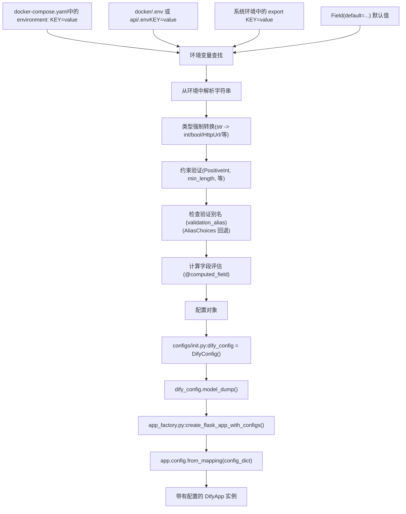
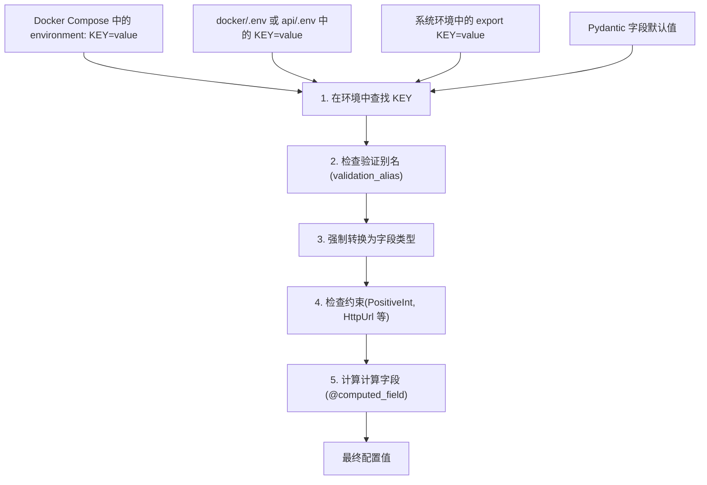
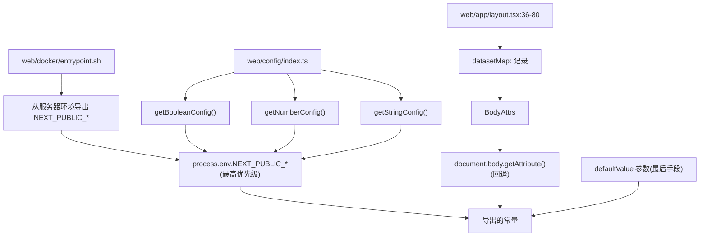

# 配置系统

相关源文件

-   [api/.env.example](https://github.com/langgenius/dify/blob/92dbc94f/api/.env.example)
-   [api/app.py](https://github.com/langgenius/dify/blob/92dbc94f/api/app.py)
-   [api/app\_factory.py](https://github.com/langgenius/dify/blob/92dbc94f/api/app_factory.py)
-   [api/commands.py](https://github.com/langgenius/dify/blob/92dbc94f/api/commands.py)
-   [api/configs/feature/\_\_init\_\_.py](https://github.com/langgenius/dify/blob/92dbc94f/api/configs/feature/__init__.py)
-   [api/configs/middleware/\_\_init\_\_.py](https://github.com/langgenius/dify/blob/92dbc94f/api/configs/middleware/__init__.py)
-   [api/configs/packaging/\_\_init\_\_.py](https://github.com/langgenius/dify/blob/92dbc94f/api/configs/packaging/__init__.py)
-   [api/controllers/console/datasets/datasets.py](https://github.com/langgenius/dify/blob/92dbc94f/api/controllers/console/datasets/datasets.py)
-   [api/core/rag/datasource/vdb/vector\_factory.py](https://github.com/langgenius/dify/blob/92dbc94f/api/core/rag/datasource/vdb/vector_factory.py)
-   [api/core/rag/datasource/vdb/vector\_type.py](https://github.com/langgenius/dify/blob/92dbc94f/api/core/rag/datasource/vdb/vector_type.py)
-   [api/extensions/ext\_storage.py](https://github.com/langgenius/dify/blob/92dbc94f/api/extensions/ext_storage.py)
-   [api/extensions/storage/storage\_type.py](https://github.com/langgenius/dify/blob/92dbc94f/api/extensions/storage/storage_type.py)
-   [api/libs/helper.py](https://github.com/langgenius/dify/blob/92dbc94f/api/libs/helper.py)
-   [api/pyproject.toml](https://github.com/langgenius/dify/blob/92dbc94f/api/pyproject.toml)
-   [api/tests/unit\_tests/configs/test\_dify\_config.py](https://github.com/langgenius/dify/blob/92dbc94f/api/tests/unit_tests/configs/test_dify_config.py)
-   [api/tests/unit\_tests/libs/test\_helper.py](https://github.com/langgenius/dify/blob/92dbc94f/api/tests/unit_tests/libs/test_helper.py)
-   [api/uv.lock](https://github.com/langgenius/dify/blob/92dbc94f/api/uv.lock)
-   [dev/pytest/pytest\_vdb.sh](https://github.com/langgenius/dify/blob/92dbc94f/dev/pytest/pytest_vdb.sh)
-   [docker/.env.example](https://github.com/langgenius/dify/blob/92dbc94f/docker/.env.example)
-   [docker/docker-compose-template.yaml](https://github.com/langgenius/dify/blob/92dbc94f/docker/docker-compose-template.yaml)
-   [docker/docker-compose.middleware.yaml](https://github.com/langgenius/dify/blob/92dbc94f/docker/docker-compose.middleware.yaml)
-   [docker/docker-compose.yaml](https://github.com/langgenius/dify/blob/92dbc94f/docker/docker-compose.yaml)
-   [docker/middleware.env.example](https://github.com/langgenius/dify/blob/92dbc94f/docker/middleware.env.example)
-   [web/.env.example](https://github.com/langgenius/dify/blob/92dbc94f/web/.env.example)
-   [web/app/activate/activateForm.tsx](https://github.com/langgenius/dify/blob/92dbc94f/web/app/activate/activateForm.tsx)
-   [web/app/components/base/form/hooks/use-get-form-values.ts](https://github.com/langgenius/dify/blob/92dbc94f/web/app/components/base/form/hooks/use-get-form-values.ts)
-   [web/app/components/base/form/utils/zod-submit-validator.ts](https://github.com/langgenius/dify/blob/92dbc94f/web/app/components/base/form/utils/zod-submit-validator.ts)
-   [web/app/forgot-password/ForgotPasswordForm.spec.tsx](https://github.com/langgenius/dify/blob/92dbc94f/web/app/forgot-password/ForgotPasswordForm.spec.tsx)
-   [web/app/forgot-password/ForgotPasswordForm.tsx](https://github.com/langgenius/dify/blob/92dbc94f/web/app/forgot-password/ForgotPasswordForm.tsx)
-   [web/app/install/installForm.tsx](https://github.com/langgenius/dify/blob/92dbc94f/web/app/install/installForm.tsx)
-   [web/app/layout.tsx](https://github.com/langgenius/dify/blob/92dbc94f/web/app/layout.tsx)
-   [web/config/index.ts](https://github.com/langgenius/dify/blob/92dbc94f/web/config/index.ts)
-   [web/docker/entrypoint.sh](https://github.com/langgenius/dify/blob/92dbc94f/web/docker/entrypoint.sh)
-   [web/package.json](https://github.com/langgenius/dify/blob/92dbc94f/web/package.json)
-   [web/types/feature.ts](https://github.com/langgenius/dify/blob/92dbc94f/web/types/feature.ts)

本文档描述了 Dify 的配置系统，该系统负责管理 API、Worker 和 Web 服务中的应用设置、功能标志 (feature flags)、中间件连接以及部署参数。系统在后端使用 Pydantic 进行类型安全的配置管理，并使用环境变量进行部署时的自定义。

有关服务编排和 Docker 部署的信息，请参阅 [服务拓扑与 Docker Compose](/langgenius/dify/2.1-service-topology-and-docker-compose)。有关数据模型配置，请参阅 [核心数据模型与领域实体](/langgenius/dify/2.2-core-data-models-and-domain-entities)。

---

## 架构概览

Dify 的配置系统在后端使用 Pydantic 的 `BaseSettings` 进行类型安全的配置，而在前端采用双源方案（环境变量 + HTML 数据属性）。

### 全系统配置架构

```mermaid
flowchart TD
    DotEnvFiles[".env 文件(docker/.env, api/.env, web/.env)"]
    SystemEnv["系统环境变量"]
    DockerComposeEnv["docker-compose.yaml中的 environment: KEY=value"]
    PydanticDefaults["Pydantic 字段默认值(Field(default=...)"]
    DifyConfig["DifyConfig(BaseSettings)"]
    SecurityConfig["SecurityConfigSECRET_KEY, 令牌过期时间"]
    AppExecutionConfig["AppExecutionConfigAPP_MAX_EXECUTION_TIME"]
    CodeSandboxConfig["CodeExecutionSandboxConfigCODE_EXECUTION_ENDPOINT"]
    PluginConfig["PluginConfigPLUGIN_DAEMON_URL"]
    EndpointConfig["EndpointConfigCONSOLE_API_URL"]
    FileAccessConfig["FileAccessConfigFILES_URL"]
    DatabaseConfig["DatabaseConfigDB_TYPE, SQLALCHEMY_*"]
    RedisConfig["RedisConfigREDIS_HOST, sentinel, cluster"]
    CeleryConfig["CeleryConfigCELERY_BROKER_URL"]
    StorageConfig["StorageConfigSTORAGE_TYPE"]
    VectorStoreConfig["VectorStoreConfigVECTOR_STORE"]
    PackagingInfo["PackagingInfoCOMMIT_SHA, 版本号"]
    CreateFlask["create_flask_app_with_configs()"]
    DifyApp["DifyApp 实例"]
    FlaskConfigDict["app.config.from_mapping(dify_config.model_dump())"]
    DockerEntrypoint["docker/entrypoint.shexport NEXT_PUBLIC_*"]
    LayoutTsx["app/layout.tsxdatasetMap 注入"]
    ConfigIndex["config/index.tsgetBooleanConfig() 等"]
    ExportedConstants["API_PREFIX, LOOP_NODE_MAX_COUNT,MAX_TOOLS_NUM 等"]

    DifyConfig --> SecurityConfig
    DifyConfig --> AppExecutionConfig
    DifyConfig --> CodeSandboxConfig
    DifyConfig --> PluginConfig
    DifyConfig --> EndpointConfig
    DifyConfig --> FileAccessConfig
    DifyConfig --> DatabaseConfig
    DifyConfig --> RedisConfig
    DifyConfig --> CeleryConfig
    DifyConfig --> StorageConfig
    DifyConfig --> VectorStoreConfig
    DifyConfig --> PackagingInfo
    CreateFlask --> DifyApp
    DifyApp --> FlaskConfigDict
    DockerEntrypoint --> LayoutTsx
    LayoutTsx --> ConfigIndex
    ConfigIndex --> ExportedConstants
    DotEnvFiles --> SystemEnv
    DockerComposeEnv --> SystemEnv
    SystemEnv --> DifyConfig
    SystemEnv --> DockerEntrypoint
    PydanticDefaults --> DifyConfig
    DifyConfig --> CreateFlask
```


**来源**: [api/configs/app\_config.py1-50](https://github.com/langgenius/dify/blob/92dbc94f/api/configs/app_config.py#L1-L50) [api/configs/feature/\_\_init\_\_.py1-800](https://github.com/langgenius/dify/blob/92dbc94f/api/configs/feature/__init__.py#L1-L800) [api/configs/middleware/\_\_init\_\_.py1-400](https://github.com/langgenius/dify/blob/92dbc94f/api/configs/middleware/__init__.py#L1-L400) [api/app\_factory.py18-25](https://github.com/langgenius/dify/blob/92dbc94f/api/app_factory.py#L18-L25) [web/config/index.ts1-60](https://github.com/langgenius/dify/blob/92dbc94f/web/config/index.ts#L1-L60) [web/docker/entrypoint.sh13-50](https://github.com/langgenius/dify/blob/92dbc94f/web/docker/entrypoint.sh#L13-L50)

---

## 后端配置加载流程

后端配置系统使用 Pydantic 的 `BaseSettings`，支持自动的环境变量解析和验证。

### 三阶段配置加载


**来源**: [api/configs/app\_config.py1-50](https://github.com/langgenius/dify/blob/92dbc94f/api/configs/app_config.py#L1-L50) [api/app\_factory.py18-25](https://github.com/langgenius/dify/blob/92dbc94f/api/app_factory.py#L18-L25) [docker/docker-compose.yaml7-28](https://github.com/langgenius/dify/blob/92dbc94f/docker/docker-compose.yaml#L7-L28)

### Docker 入口点预配置

API 的入口脚本 [api/docker/entrypoint.sh1-10](https://github.com/langgenius/dify/blob/92dbc94f/api/docker/entrypoint.sh#L1-L10) 在进行 Python 导入之前设置了编码环境变量：

```
export LANG=${LANG:-en_US.UTF-8}
export LC_ALL=${LC_ALL:-en_US.UTF-8}
export PYTHONIOENCODING=${PYTHONIOENCODING:-utf-8}
```
这确保了所有字符串操作均采用 UTF-8 编码，这对多语言支持至关重要。

### 应用工厂模式

`create_flask_app_with_configs()` 函数 [api/app\_factory.py18-25](https://github.com/langgenius/dify/blob/92dbc94f/api/app_factory.py#L18-L25) 使用 Pydantic 配置初始化 Flask 应用：

```
def create_flask_app_with_configs() -> DifyApp:
    dify_app = DifyApp(__name__)
    dify_app.config.from_mapping(dify_config.model_dump())
    dify_app.config["RESTX_INCLUDE_ALL_MODELS"] = True
    return dify_app
```
`dify_config.model_dump()` 方法将所有 Pydantic 配置对象序列化为一个适合 Flask 配置系统的字典。

**来源**: [api/docker/entrypoint.sh1-10](https://github.com/langgenius/dify/blob/92dbc94f/api/docker/entrypoint.sh#L1-L10) [api/app\_factory.py18-25](https://github.com/langgenius/dify/blob/92dbc94f/api/app_factory.py#L18-L25) [api/configs/app\_config.py1-50](https://github.com/langgenius/dify/blob/92dbc94f/api/configs/app_config.py#L1-L50)

---

## 配置类层级

Dify 将配置组织为特定领域的 Pydantic 模型，这些模型均继承自 `BaseSettings`。

### 功能配置类 (Feature Configuration Classes)

这些类位于 [api/configs/feature/\_\_init\_\_.py](https://github.com/langgenius/dify/blob/92dbc94f/api/configs/feature/__init__.py)，负责管理应用行为：

| 类名 | 用途 | 关键字段 |
| --- | --- | --- |
| `SecurityConfig` | 身份验证与令牌管理 | `SECRET_KEY`, `RESET_PASSWORD_TOKEN_EXPIRY_MINUTES`, `LOGIN_DISABLED` |
| `AppExecutionConfig` | 应用运行时限制 | `APP_MAX_EXECUTION_TIME`, `APP_MAX_ACTIVE_REQUESTS` |
| `CodeExecutionSandboxConfig` | 代码沙箱设置 | `CODE_EXECUTION_ENDPOINT`, `CODE_EXECUTION_API_KEY`, 超时时间值 |
| `TriggerConfig` | Webhook 配置 | `WEBHOOK_REQUEST_BODY_MAX_SIZE` |
| `PluginConfig` | 插件守护进程设置 | `PLUGIN_DAEMON_URL`, `PLUGIN_DAEMON_KEY`, 大小限制 |
| `MarketplaceConfig` | 插件市场集成 | `MARKETPLACE_ENABLED`, `MARKETPLACE_API_URL` |
| `EndpointConfig` | 服务 URL 地址 | `CONSOLE_API_URL`, `SERVICE_API_URL`, `APP_WEB_URL` |
| `FileAccessConfig` | 文件处理 | `FILES_URL`, `INTERNAL_FILES_URL`, `FILES_ACCESS_TIMEOUT` |

**带有验证的配置示例** [api/configs/feature/\_\_init\_\_.py19-65](https://github.com/langgenius/dify/blob/92dbc94f/api/configs/feature/__init__.py#L19-L65)：

```
class SecurityConfig(BaseSettings):
    SECRET_KEY: str = Field(
        description="用于安全会话 cookie 签名的密钥",
        default="",
    )

    RESET_PASSWORD_TOKEN_EXPIRY_MINUTES: PositiveInt = Field(
        description="密码重置令牌的有效时长（分钟）",
        default=5,
    )
```
### 中间件配置类 (Middleware Configuration Classes)

这些类位于 [api/configs/middleware/\_\_init\_\_.py](https://github.com/langgenius/dify/blob/92dbc94f/api/configs/middleware/__init__.py)，负责管理外部服务连接：

| 类名 | 用途 | 连接详情 |
| --- | --- | --- |
| `DatabaseConfig` | 主数据库 | PostgreSQL/MySQL 连接、连接池设置 |
| `RedisConfig` | 缓存与消息代理 | Redis/Sentinel/Cluster 配置 |
| `CeleryConfig` | 任务队列 | Celery broker URL, 后端类型 |
| `StorageConfig` | 文件存储 | S3, Azure Blob, 阿里云 OSS, OpenDAL 等 |
| `VectorDatabaseConfig` | 向量数据库选择 | Weaviate, Qdrant, Milvus, PGVector 等 |

**向量数据库配置示例** [api/configs/middleware/\_\_init\_\_.py52-100](https://github.com/langgenius/dify/blob/92dbc94f/api/configs/middleware/__init__.py#L52-L100)：

```
class VectorDatabaseConfig(BaseSettings):
    VECTOR_STORE: str = Field(
        description="向量数据库类型",
        default="weaviate",
    )
```
系统通过 `WeaviateConfig`、`QdrantConfig`、`MilvusConfig` 等条件配置类支持 30 多种向量数据库类型。

**来源**: [api/configs/feature/\_\_init\_\_.py1-800](https://github.com/langgenius/dify/blob/92dbc94f/api/configs/feature/__init__.py#L1-L800) [api/configs/middleware/\_\_init\_\_.py1-200](https://github.com/langgenius/dify/blob/92dbc94f/api/configs/middleware/__init__.py#L1-L200)

---

## 环境变量解析

环境变量遵循分层解析策略，并具有类型强制转换和验证功能。


### 别名与回退模式

配置字段可以使用带有 `AliasChoices` 的 `validation_alias` 来保证向后兼容性 [api/configs/feature/\_\_init\_\_.py296-309](https://github.com/langgenius/dify/blob/92dbc94f/api/configs/feature/__init__.py#L296-L309)：

```
FILES_URL: str = Field(
    description="文件预览或下载的基础 URL",
    validation_alias=AliasChoices("FILES_URL", "CONSOLE_API_URL"),
    alias_priority=1,
    default="",
)
```
这使得 `FILES_URL` 在未显式设置时可以回退到 `CONSOLE_API_URL`。

### Docker Compose 环境变量

[docker/docker-compose.yaml7-28](https://github.com/langgenius/dify/blob/92dbc94f/docker/docker-compose.yaml#L7-L28) 使用 YAML 锚点在服务间共享环境变量：

```
x-shared-env: &shared-api-worker-env
  CONSOLE_API_URL: ${CONSOLE_API_URL:-}
  CONSOLE_WEB_URL: ${CONSOLE_WEB_URL:-}
  SERVICE_API_URL: ${SERVICE_API_URL:-}
  # ... 数百个共享变量
```
各服务引用该锚点 [docker/docker-compose-template.yaml26-28](https://github.com/langgenius/dify/blob/92dbc94f/docker/docker-compose-template.yaml#L26-L28)：

```
api:
  environment:
    <<: *shared-api-worker-env
```
**来源**: [docker/docker-compose.yaml7-650](https://github.com/langgenius/dify/blob/92dbc94f/docker/docker-compose.yaml#L7-L650) [api/configs/feature/\_\_init\_\_.py296-309](https://github.com/langgenius/dify/blob/92dbc94f/api/configs/feature/__init__.py#L296-L309) [docker/docker-compose-template.yaml1-100](https://github.com/langgenius/dify/blob/92dbc94f/docker/docker-compose-template.yaml#L1-L100)

---

## 类型安全与验证

Pydantic 提供了编译时类型检查和带有自定义约束的运行时验证。

### 字段类型与约束

| Pydantic 类型 | 描述 | 示例用法 |
| --- | --- | --- |
| `PositiveInt` | 大于 0 的整数 | `APP_MAX_EXECUTION_TIME: PositiveInt = 1200` |
| `NonNegativeInt` | 大于或等于 0 的整数 | `APP_MAX_ACTIVE_REQUESTS: NonNegativeInt = 0` |
| `PositiveFloat` | 大于 0.0 的浮点数 | `CODE_EXECUTION_POOL_KEEPALIVE_EXPIRY: PositiveFloat = 5.0` |
| `HttpUrl` | 经过验证的 URL | `CODE_EXECUTION_ENDPOINT: HttpUrl` |
| `NegativeInt` | 小于 0 的整数 | `CODE_MIN_NUMBER: NegativeInt` |
| `Literal[...]` | 类枚举约束 | `STORAGE_TYPE: Literal["s3", "azure-blob", ...]` |

### 自定义验证器

字段验证器强制执行特定领域的规则 [api/controllers/console/datasets/datasets.py111-117](https://github.com/langgenius/dify/blob/92dbc94f/api/controllers/console/datasets/datasets.py#L111-L117)：

```
@field_validator("indexing_technique")
@classmethod
def validate_indexing(cls, value: str | None) -> str | None:
    if value is None:
        return value
    if value not in Dataset.INDEXING_TECHNIQUE_LIST:
        raise ValueError("无效的索引技术。")
    return value
```
### 计算字段 (Computed Fields)

衍生的配置值使用 `@computed_field` [api/configs/middleware/\_\_init\_\_.py](https://github.com/langgenius/dify/blob/92dbc94f/api/configs/middleware/__init__.py#LNaN-LNaN)：

```
@computed_field
@property
def SQLALCHEMY_DATABASE_URI(self) -> str:
    return self._get_database_uri()
```
**来源**: [api/configs/feature/\_\_init\_\_.py19-175](https://github.com/langgenius/dify/blob/92dbc94f/api/configs/feature/__init__.py#L19-L175) [api/configs/middleware/\_\_init\_\_.py100-200](https://github.com/langgenius/dify/blob/92dbc94f/api/configs/middleware/__init__.py#L100-L200) [api/controllers/console/datasets/datasets.py111-117](https://github.com/langgenius/dify/blob/92dbc94f/api/controllers/console/datasets/datasets.py#L111-L117)

---

## 前端配置系统

Web 前端采用了双源配置方案：Next.js 构建时的环境变量以及运行时回退到 HTML 文档 body 的 `data-*` 属性。

### 前端配置解析流程


**来源**: [web/config/index.ts9-54](https://github.com/langgenius/dify/blob/92dbc94f/web/config/index.ts#L9-L54) [web/app/layout.tsx36-80](https://github.com/langgenius/dify/blob/92dbc94f/web/app/layout.tsx#L36-L80) [web/docker/entrypoint.sh13-50](https://github.com/langgenius/dify/blob/92dbc94f/web/docker/entrypoint.sh#L13-L50)

### 配置辅助函数

三个针对特定类型的辅助函数提供了一致的解析逻辑 [web/config/index.ts9-54](https://github.com/langgenius/dify/blob/92dbc94f/web/config/index.ts#L9-L54)：

```
const getBooleanConfig = (
  envVar: string | undefined,
  dataAttrKey: DatasetAttr,
  defaultValue: boolean = true,
) => {
  if (envVar !== undefined && envVar !== '') return envVar === 'true'
  const attrValue = globalThis.document?.body?.getAttribute(dataAttrKey)
  if (attrValue !== undefined && attrValue !== '') return attrValue === 'true'
  return defaultValue
}

const getNumberConfig = (
  envVar: string | undefined,
  dataAttrKey: DatasetAttr,
  defaultValue: number,
) => {
  // 从环境变量或数据属性解析并验证数字
}

const getStringConfig = (
  envVar: string | undefined,
  dataAttrKey: DatasetAttr,
  defaultValue: string,
) => {
  // 返回第一个已定义的值：环境变量、数据属性或默认值
}
```
### 数据集属性枚举 (Dataset Attributes Enum)

`DatasetAttr` 枚举 [web/types/feature.ts1-50](https://github.com/langgenius/dify/blob/92dbc94f/web/types/feature.ts#L1-L50) 定义了所有支持的 HTML 数据属性键：

| DatasetAttr 常量 | HTML 属性 | 用途 |
| --- | --- | --- |
| `DATA_API_PREFIX` | `data-api-prefix` | 控制台 API 基础 URL |
| `DATA_PUBLIC_API_PREFIX` | `data-public-api-prefix` | 公共 API 基础 URL |
| `DATA_MARKETPLACE_API_PREFIX` | `data-marketplace-api-prefix` | 插件市场 API URL |
| `DATA_PUBLIC_EDITION` | `data-public-edition` | 部署版本 (SELF\_HOSTED/CLOUD) |
| `DATA_PUBLIC_AMPLITUDE_API_KEY` | `data-public-amplitude-api-key` | 数据分析 Key |
| `DATA_PUBLIC_COOKIE_DOMAIN` | `data-public-cookie-domain` | 跨子域认证的 Cookie 域名 |
| `DATA_PUBLIC_SENTRY_DSN` | `data-public-sentry-dsn` | Sentry 错误追踪 |
| `DATA_PUBLIC_TEXT_GENERATION_TIMEOUT_MS` | `data-public-text-generation-timeout-ms` | LLM 超时时间 |
| `DATA_PUBLIC_MAX_TOOLS_NUM` | `data-public-max-tools-num` | 工作流中最大工具数 |
| `DATA_PUBLIC_LOOP_NODE_MAX_COUNT` | `data-public-loop-node-max-count` | 最大循环迭代次数 |
| `DATA_PUBLIC_MAX_TREE_DEPTH` | `data-public-max-tree-depth` | 最大工作流嵌套层数 |

### 服务端属性注入

Next.js 的布局组件 [web/app/layout.tsx46-80](https://github.com/langgenius/dify/blob/92dbc94f/web/app/layout.tsx#L46-L80) 将服务器环境变量映射到 HTML 属性：

```
const datasetMap: Record<DatasetAttr, string | undefined> = {
  [DatasetAttr.DATA_API_PREFIX]: process.env.NEXT_PUBLIC_API_PREFIX,
  [DatasetAttr.DATA_PUBLIC_API_PREFIX]: process.env.NEXT_PUBLIC_PUBLIC_API_PREFIX,
  [DatasetAttr.DATA_MARKETPLACE_API_PREFIX]: process.env.NEXT_PUBLIC_MARKETPLACE_API_PREFIX,
  [DatasetAttr.DATA_MARKETPLACE_URL_PREFIX]: process.env.NEXT_PUBLIC_MARKETPLACE_URL_PREFIX,
  [DatasetAttr.DATA_PUBLIC_EDITION]: process.env.NEXT_PUBLIC_EDITION,
  [DatasetAttr.DATA_PUBLIC_AMPLITUDE_API_KEY]: process.env.NEXT_PUBLIC_AMPLITUDE_API_KEY,
  [DatasetAttr.DATA_PUBLIC_COOKIE_DOMAIN]: process.env.NEXT_PUBLIC_COOKIE_DOMAIN,
  [DatasetAttr.DATA_PUBLIC_TEXT_GENERATION_TIMEOUT_MS]: process.env.NEXT_PUBLIC_TEXT_GENERATION_TIMEOUT_MS,
  [DatasetAttr.DATA_PUBLIC_MAX_TOOLS_NUM]: process.env.NEXT_PUBLIC_MAX_TOOLS_NUM,
  // ... 更多映射
}
```
这些属性在 SSR（服务端渲染）期间作为 `<body>` 元素的 `data-*` 属性渲染，从而允许在不重新构建前端包的情况下更改运行时配置。

### 导出的配置常量

配置作为类型化常量导出 [web/config/index.ts56-150](https://github.com/langgenius/dify/blob/92dbc94f/web/config/index.ts#L56-L150)：

```
export const API_PREFIX = getStringConfig(
  process.env.NEXT_PUBLIC_API_PREFIX,
  DatasetAttr.DATA_API_PREFIX,
  'http://localhost:5001/console/api',
)

export const PUBLIC_API_PREFIX = getStringConfig(
  process.env.NEXT_PUBLIC_PUBLIC_API_PREFIX,
  DatasetAttr.DATA_PUBLIC_API_PREFIX,
  'http://localhost:5001/api',
)

export const MARKETPLACE_API_PREFIX = getStringConfig(
  process.env.NEXT_PUBLIC_MARKETPLACE_API_PREFIX,
  DatasetAttr.DATA_MARKETPLACE_API_PREFIX,
  'http://localhost:5002/api',
)

export const LOOP_NODE_MAX_COUNT = getNumberConfig(
  process.env.NEXT_PUBLIC_LOOP_NODE_MAX_COUNT,
  DatasetAttr.DATA_PUBLIC_LOOP_NODE_MAX_COUNT,
  100,
)

export const MAX_TOOLS_NUM = getNumberConfig(
  process.env.NEXT_PUBLIC_MAX_TOOLS_NUM,
  DatasetAttr.DATA_PUBLIC_MAX_TOOLS_NUM,
  10,
)
```
### Docker 入口点变量导出

Docker 入口脚本 [web/docker/entrypoint.sh13-50](https://github.com/langgenius/dify/blob/92dbc94f/web/docker/entrypoint.sh#L13-L50) 将后端配置导出为 `NEXT_PUBLIC_*` 变量：

```
export NEXT_PUBLIC_DEPLOY_ENV=${DEPLOY_ENV}
export NEXT_PUBLIC_EDITION=${EDITION}
export NEXT_PUBLIC_API_PREFIX=${CONSOLE_API_URL}/console/api
export NEXT_PUBLIC_PUBLIC_API_PREFIX=${APP_API_URL}/api
export NEXT_PUBLIC_MARKETPLACE_API_PREFIX=${MARKETPLACE_API_URL}/api/v1
export NEXT_PUBLIC_TEXT_GENERATION_TIMEOUT_MS=${TEXT_GENERATION_TIMEOUT_MS}
export NEXT_PUBLIC_MAX_TOOLS_NUM=${MAX_TOOLS_NUM}
```
这确保了后端配置（来自 `.env` 或 Docker Compose）在容器启动时流向前端。

**来源**: [web/config/index.ts1-150](https://github.com/langgenius/dify/blob/92dbc94f/web/config/index.ts#L1-L150) [web/app/layout.tsx36-80](https://github.com/langgenius/dify/blob/92dbc94f/web/app/layout.tsx#L36-L80) [web/types/feature.ts1-50](https://github.com/langgenius/dify/blob/92dbc94f/web/types/feature.ts#L1-L50) [web/docker/entrypoint.sh13-50](https://github.com/langgenius/dify/blob/92dbc94f/web/docker/entrypoint.sh#L13-L50)

---

## 功能标志与运行时配置

系统使用环境变量作为功能标志 (feature flags) 来启用/禁用特定功能。

### 功能标志示例

| 环境变量 | 类型 | 用途 | 默认值 |
| --- | --- | --- | --- |
| `MIGRATION_ENABLED` | boolean | 启动时运行数据库迁移 | `true` |
| `DEBUG` | boolean | 启用调试模式（禁用 gevent 补丁） | `false` |
| `MARKETPLACE_ENABLED` | boolean | 启用插件市场集成 | `true` |
| `ENABLE_CLEAN_EMBEDDING_CACHE_TASK` | boolean | 启用定时的向量嵌入缓存清理任务 | `false` |
| `ENABLE_WEBSITE_JINAREADER` | boolean | 启用 Jina Reader 网站抓取 | `true` |
| `CELERY_AUTO_SCALE` | boolean | 启用 Celery worker 自动扩缩容 | `false` |

### 基于模式的配置 (Mode-Based Configuration)

[api/docker/entrypoint.sh10-50](https://github.com/langgenius/dify/blob/92dbc94f/api/docker/entrypoint.sh#L10-L50) 脚本使用 `MODE` 环境变量决定服务启动方式：

```
if [[ "${MODE}" == "worker" ]]; then
  # 启动 Celery worker
elif [[ "${MODE}" == "beat" ]]; then
  # 启动 Celery beat
elif [[ "${MODE}" == "api" ]]; then
  # 启动 Gunicorn API 服务器
fi
```
这允许相同的 Docker 镜像根据运行时配置运行不同的服务。

### 条件服务依赖

Docker Compose 使用 Profile 和条件依赖项 [docker/docker-compose-template.yaml42-47](https://github.com/langgenius/dify/blob/92dbc94f/docker/docker-compose-template.yaml#L42-L47)：

```
depends_on:
  db_postgres:
    condition: service_healthy
    required: false
  db_mysql:
    condition: service_healthy
    required: false
```
`required: false` 标志允许服务在可选依赖项不可用时也能启动。

**来源**: [api/docker/entrypoint.sh10-50](https://github.com/langgenius/dify/blob/92dbc94f/api/docker/entrypoint.sh#L10-L50) [docker/docker-compose-template.yaml39-100](https://github.com/langgenius/dify/blob/92dbc94f/docker/docker-compose-template.yaml#L39-L100) [api/configs/feature/\_\_init\_\_.py250-290](https://github.com/langgenius/dify/blob/92dbc94f/api/configs/feature/__init__.py#L250-L290)

---

## 数据库与连接池配置

数据库配置支持 PostgreSQL 和 MySQL，并提供丰富的调优选项。

```mermaid
flowchart TD
    MySQLMaxConns["MYSQL_MAX_CONNECTIONS默认: 1000"]
    InnoDBBuffer["MYSQL_INNODB_BUFFER_POOL_SIZE默认: 512M"]
    LogFileSize["MYSQL_INNODB_LOG_FILE_SIZE默认: 128M"]
    FlushLog["MYSQL_INNODB_FLUSH_LOG_AT_TRX_COMMIT默认: 2"]
    MaxConns["POSTGRES_MAX_CONNECTIONS默认: 100"]
    SharedBuffers["POSTGRES_SHARED_BUFFERS默认: 128MB"]
    WorkMem["POSTGRES_WORK_MEM默认: 4MB"]
    EffectiveCache["POSTGRES_EFFECTIVE_CACHE_SIZE默认: 4096MB"]
    DBType["DB_TYPE(postgresql | mysql)"]
    DBHost["DB_HOST"]
    DBPort["DB_PORT"]
    DBUser["DB_USERNAME"]
    DBPass["DB_PASSWORD"]
    DBName["DB_DATABASE"]
    ConnectionURI["SQLALCHEMY_DATABASE_URI(计算得出)"]
    PoolSize["SQLALCHEMY_POOL_SIZE默认: 30"]
    MaxOverflow["SQLALCHEMY_MAX_OVERFLOW默认: 10"]
    PoolRecycle["SQLALCHEMY_POOL_RECYCLE默认: 3600s"]
    PoolPrePing["SQLALCHEMY_POOL_PRE_PING默认: false"]
    PoolLifo["SQLALCHEMY_POOL_USE_LIFO默认: false"]
    PoolTimeout["SQLALCHEMY_POOL_TIMEOUT默认: 30s"]

    DBType --> ConnectionURI
    DBHost --> ConnectionURI
    DBPort --> ConnectionURI
    DBUser --> ConnectionURI
    DBPass --> ConnectionURI
    DBName --> ConnectionURI
    ConnectionURI --> PoolSize
    ConnectionURI --> MaxOverflow
    ConnectionURI --> PoolRecycle
```


### PostgreSQL 配置

PostgreSQL 设置作为命令行参数传递 [docker/docker-compose-template.yaml173-180](https://github.com/langgenius/dify/blob/92dbc94f/docker/docker-compose-template.yaml#L173-L180)：

```
command: >
  postgres -c 'max_connections=${POSTGRES_MAX_CONNECTIONS:-100}'
           -c 'shared_buffers=${POSTGRES_SHARED_BUFFERS:-128MB}'
           -c 'work_mem=${POSTGRES_WORK_MEM:-4MB}'
           -c 'effective_cache_size=${POSTGRES_EFFECTIVE_CACHE_SIZE:-4096MB}'
```
### MySQL 配置

MySQL 设置使用类似的命令语法 [docker/docker-compose-template.yaml208-212](https://github.com/langgenius/dify/blob/92dbc94f/docker/docker-compose-template.yaml#L208-L212)：

```
command: >
  --max_connections=1000
  --innodb_buffer_pool_size=${MYSQL_INNODB_BUFFER_POOL_SIZE:-512M}
  --innodb_log_file_size=${MYSQL_INNODB_LOG_FILE_SIZE:-128M}
```
**来源**: [docker/docker-compose-template.yaml162-227](https://github.com/langgenius/dify/blob/92dbc94f/docker/docker-compose-template.yaml#L162-L227) [docker/.env.example227-326](https://github.com/langgenius/dify/blob/92dbc94f/docker/.env.example#L227-L326) [api/configs/middleware/\_\_init\_\_.py](https://github.com/langgenius/dify/blob/92dbc94f/api/configs/middleware/__init__.py#LNaN-LNaN)

---

## Redis 与 Celery 配置

Redis 配置支持独立 (standalone)、哨兵 (Sentinel) 和集群 (Cluster) 模式，并提供 SSL 选项。

### Redis 连接模式

```mermaid
flowchart TD
    ClusterFlag["REDIS_USE_CLUSTERS=true"]
    ClusterConfig["集群配置"]
    ClusterNodes["REDIS_CLUSTERShost1:port1,host2:port2"]
    ClusterPass["REDIS_CLUSTERS_PASSWORD"]
    SentinelFlag["REDIS_USE_SENTINEL=true"]
    SentinelURI["sentinel://:password@host:port/db"]
    SentinelNodes["REDIS_SENTINELShost1:port1,host2:port2"]
    SentinelService["REDIS_SENTINEL_SERVICE_NAME"]
    StandaloneHost["REDIS_HOST"]
    StandaloneURI["redis://:password@host:port/db"]
    StandalonePort["REDIS_PORT"]
    StandalonePass["REDIS_PASSWORD"]
    StandaloneDB["REDIS_DB"]

    ClusterFlag --> ClusterConfig
    SentinelFlag --> SentinelURI
    SentinelNodes --> SentinelURI
    StandaloneHost --> StandaloneURI
```


### Celery Broker 配置

Celery broker URL 支持独立 Redis 和哨兵模式 [docker/.env.example370-376](https://github.com/langgenius/dify/blob/92dbc94f/docker/.env.example#L370-L376)：

```
# 独立 Redis
CELERY_BROKER_URL=redis://:difyai123456@redis:6379/1

# Redis 哨兵 (多个哨兵用分号分隔)
CELERY_BROKER_URL=sentinel://:password@sentinel1:26379/1;sentinel://:password@sentinel2:26379/1
```
### Celery Worker 配置

Worker 配置支持手动设置 worker 数量或自动扩缩容 [api/docker/entrypoint.sh20-40](https://github.com/langgenius/dify/blob/92dbc94f/api/docker/entrypoint.sh#L20-L40)：

```
if [ "${CELERY_AUTO_SCALE,,}" = "true" ]; then
  AVAILABLE_CORES=$(nproc)
  MAX_WORKERS=${CELERY_MAX_WORKERS:-$AVAILABLE_CORES}
  MIN_WORKERS=${CELERY_MIN_WORKERS:-1}
  AUTOSCALE_OPTION="--autoscale=${MAX_WORKERS},${MIN_WORKERS}"
else
  CONCURRENCY=${CELERY_WORKER_AMOUNT:-1}
  CONCURRENCY_OPTION="--concurrency=${CONCURRENCY}"
fi
```
**来源**: [docker/.env.example328-384](https://github.com/langgenius/dify/blob/92dbc94f/docker/.env.example#L328-L384) [api/docker/entrypoint.sh20-50](https://github.com/langgenius/dify/blob/92dbc94f/api/docker/entrypoint.sh#L20-L50) [api/configs/middleware/\_\_init\_\_.py](https://github.com/langgenius/dify/blob/92dbc94f/api/configs/middleware/__init__.py#LNaN-LNaN)

---

## 存储后端配置

Dify 通过统一的配置接口支持多个存储后端。

### 存储类型选择

`STORAGE_TYPE` 环境变量决定了当前生效的后端 [api/configs/middleware/\_\_init\_\_.py52-67](https://github.com/langgenius/dify/blob/92dbc94f/api/configs/middleware/__init__.py#L52-L67)：

```
STORAGE_TYPE: Literal[
    "opendal",
    "s3",
    "aliyun-oss",
    "azure-blob",
    "baidu-obs",
    "clickzetta-volume",
    "google-storage",
    "huawei-obs",
    "oci-storage",
    "tencent-cos",
    "volcengine-tos",
    "supabase",
    "local",
]
```
### 存储配置类

每个存储后端都有专用的配置类：

| 类名 | 后端 | 关键配置字段 |
| --- | --- | --- |
| `OpenDALStorageConfig` | OpenDAL (默认) | `OPENDAL_SCHEME`, `OPENDAL_FS_ROOT` |
| `S3StorageConfig` | Amazon S3 / MinIO | `S3_ENDPOINT`, `S3_BUCKET_NAME`, `S3_ACCESS_KEY` |
| `AzureBlobStorageConfig` | Azure Blob | `AZURE_BLOB_ACCOUNT_NAME`, `AZURE_BLOB_CONTAINER_NAME` |
| `AliyunOSSStorageConfig` | 阿里云 OSS | `ALIYUN_OSS_BUCKET_NAME`, `ALIYUN_OSS_ENDPOINT` |
| `TencentCloudCOSStorageConfig` | 腾讯云 COS | `TENCENT_COS_BUCKET_NAME`, `TENCENT_COS_REGION` |

### OpenDAL 配置

OpenDAL 为多种存储服务提供通用接口 [docker/.env.example406-418](https://github.com/langgenius/dify/blob/92dbc94f/docker/.env.example#L406-L418)：

```
STORAGE_TYPE=opendal
OPENDAL_SCHEME=fs  # 或 s3, azblob, gcs, oss, cos 等
OPENDAL_FS_ROOT=storage
```
配置遵循 `OPENDAL_<协议名>_<配置名>` 的模式，允许自动解析协议特定的设置。

**来源**: [api/configs/middleware/\_\_init\_\_.py52-100](https://github.com/langgenius/dify/blob/92dbc94f/api/configs/middleware/__init__.py#L52-L100) [docker/.env.example403-515](https://github.com/langgenius/dify/blob/92dbc94f/docker/.env.example#L403-L515) [api/configs/middleware/storage/](https://github.com/langgenius/dify/blob/92dbc94f/api/configs/middleware/storage/)

---

## 向量数据库配置

系统通过条件配置加载支持 30 多种向量数据库。

### 向量存储选择

```mermaid
flowchart TD
    VectorStore["VECTOR_STORE"]
    WeaviateConf["WeaviateConfigWEAVIATE_ENDPOINTWEAVIATE_API_KEY"]
    QdrantConf["QdrantConfigQDRANT_URLQDRANT_API_KEY"]
    MilvusConf["MilvusConfigMILVUS_URIMILVUS_TOKEN"]
    PGVectorConf["PGVectorConfigPGVECTOR_HOSTPGVECTOR_DATABASE"]
    ChromaConf["ChromaConfigCHROMA_HOSTCHROMA_PORT"]
    OceanBaseConf["OceanBaseVectorConfigOCEANBASE_VECTOR_HOST"]

    VectorStore --> WeaviateConf
    VectorStore --> QdrantConf
    VectorStore --> MilvusConf
    VectorStore --> PGVectorConf
    VectorStore --> ChromaConf
    VectorStore --> OceanBaseConf
```


### 向量数据库工厂 (Vector Database Factory)

[api/core/rag/datasource/vdb/vector\_factory.py38-80](https://github.com/langgenius/dify/blob/92dbc94f/api/core/rag/datasource/vdb/vector_factory.py#L38-L80) 实现了工厂模式以实例化合适的向量数据库：

```
class Vector:
    def __init__(self, dataset: Dataset, attributes: list | None = None):
        self._dataset = dataset
        self._embeddings = self._get_embeddings()
        vector_type = dify_config.VECTOR_STORE
        # 基于 vector_type 进行工厂实例化
```
### 向量存储类型

[api/core/rag/datasource/vdb/vector\_type.py1-30](https://github.com/langgenius/dify/blob/92dbc94f/api/core/rag/datasource/vdb/vector_type.py#L1-L30) 枚举定义了所有受支持的类型：

```
class VectorType(StrEnum):
    ALIBABACLOUD_MYSQL = "alibabacloud_mysql"
    ANALYTICDB = "analyticdb"
    CHROMA = "chroma"
    CLICKZETTA = "clickzetta"
    COUCHBASE = "couchbase"
    ELASTICSEARCH = "elasticsearch"
    # ... 还有 20 多种类型
```
**来源**: [api/configs/middleware/\_\_init\_\_.py](https://github.com/langgenius/dify/blob/92dbc94f/api/configs/middleware/__init__.py#LNaN-LNaN) [api/core/rag/datasource/vdb/vector\_type.py1-30](https://github.com/langgenius/dify/blob/92dbc94f/api/core/rag/datasource/vdb/vector_type.py#L1-L30) [api/core/rag/datasource/vdb/vector\_factory.py38-80](https://github.com/langgenius/dify/blob/92dbc94f/api/core/rag/datasource/vdb/vector_factory.py#L38-L80) [docker/.env.example516-700](https://github.com/langgenius/dify/blob/92dbc94f/docker/.env.example#L516-L700)

---

## 插件与市场配置

插件系统配置负责管理插件守护进程、市场集成以及存储。

### 插件守护进程配置

插件守护进程作为一个独立的 Go 服务运行，拥有自己的配置 [docker/docker-compose-template.yaml271-298](https://github.com/langgenius/dify/blob/92dbc94f/docker/docker-compose-template.yaml#L271-L298)：

```
plugin_daemon:
  environment:
    SERVER_PORT: ${PLUGIN_DAEMON_PORT:-5002}
    SERVER_KEY: ${PLUGIN_DAEMON_KEY:-...}
    MAX_PLUGIN_PACKAGE_SIZE: ${PLUGIN_MAX_PACKAGE_SIZE:-52428800}
    DIFY_INNER_API_URL: ${PLUGIN_DIFY_INNER_API_URL:-http://api:5001}
    DIFY_INNER_API_KEY: ${PLUGIN_DIFY_INNER_API_KEY:-...}
    PLUGIN_WORKING_PATH: ${PLUGIN_WORKING_PATH:-/app/storage/cwd}
```
### 市场配置 (Marketplace Configuration)

市场设置控制插件的发现和安装 [api/configs/feature/\_\_init\_\_.py247-260](https://github.com/langgenius/dify/blob/92dbc94f/api/configs/feature/__init__.py#L247-L260)：

```
class MarketplaceConfig(BaseSettings):
    MARKETPLACE_ENABLED: bool = Field(
        description="启用或禁用插件市场",
        default=True,
    )

    MARKETPLACE_API_URL: HttpUrl = Field(
        description="插件市场 API URL",
        default=HttpUrl("https://marketplace.dify.ai"),
    )
```
### 插件存储配置

插件可以使用不同的存储后端 [docker/.env.example596-624](https://github.com/langgenius/dify/blob/92dbc94f/docker/.env.example#L596-L624)：

```
PLUGIN_STORAGE_TYPE=local  # 或 s3, azure, aliyun-oss, tencent-cos
PLUGIN_STORAGE_LOCAL_ROOT=/app/storage
PLUGIN_INSTALLED_PATH=plugin
PLUGIN_PACKAGE_CACHE_PATH=plugin_packages
```
**来源**: [api/configs/feature/\_\_init\_\_.py204-260](https://github.com/langgenius/dify/blob/92dbc94f/api/configs/feature/__init__.py#L204-L260) [docker/docker-compose-template.yaml271-320](https://github.com/langgenius/dify/blob/92dbc94f/docker/docker-compose-template.yaml#L271-L320) [docker/.env.example596-624](https://github.com/langgenius/dify/blob/92dbc94f/docker/.env.example#L596-L624)

---

## 配置测试与验证

测试套件用于验证配置加载和类型强制转换。

### 配置测试套件

[api/tests/unit\_tests/configs/test\_dify\_config.py1-100](https://github.com/langgenius/dify/blob/92dbc94f/api/tests/unit_tests/configs/test_dify_config.py#L1-L100) 包含全面的测试：

```
def test_dify_config(monkeypatch: pytest.MonkeyPatch):
    # 测试环境变量加载
    # 测试类型强制转换
    # 测试验证约束
    # 测试计算字段
```
### 常用验证模式

配置验证遵循一致的模式：

1.  **类型验证**：Pydantic 自动将字符串转换为合适的类型（int, bool, HttpUrl）。
2.  **约束验证**：强制执行 `PositiveInt`、`min_length`、`max_length` 等字段约束。
3.  **跨字段验证**：自定义验证器可以检查字段间的关联关系。
4.  **默认值回退**：缺失的环境变量使用字段默认值。

### 配置错误处理

无效配置在启动时会引发 `ValidationError`，从而防止应用以错误设置运行。这种“快速失败 (fail-fast)”的方法确保了配置问题在部署前就能被捕获。

**来源**: [api/tests/unit\_tests/configs/test\_dify\_config.py1-100](https://github.com/langgenius/dify/blob/92dbc94f/api/tests/unit_tests/configs/test_dify_config.py#L1-L100) [api/configs/feature/\_\_init\_\_.py](https://github.com/langgenius/dify/blob/92dbc94f/api/configs/feature/__init__.py#LNaN-LNaN)

---

## 总结

Dify 的配置系统提供了：

1.  **类型安全**：基于 Pydantic 的验证确保了运行时的配置正确性。
2.  **分层组织**：按领域划分的配置类（功能、中间件、打包）。
3.  **灵活的来源**：环境变量、`.env` 文件、Docker Compose，具有明确的优先级。
4.  **多后端支持**：通过配置实现存储、数据库和向量数据库的抽象。
5.  **功能标志**：通过布尔型环境变量控制运行时行为。
6.  **前后端分离**：具有一致模式的独立配置系统。
7.  **部署灵活性**：同一份代码库通过配置支持多种部署模式。

后端服务通过 `dify_config` 单例访问配置系统，前端组件则通过导出的常量进行访问，从而为所有运行时设置提供统一接口。

**来源**: [api/configs/app\_config.py](https://github.com/langgenius/dify/blob/92dbc94f/api/configs/app_config.py) [api/configs/feature/\_\_init\_\_.py1-800](https://github.com/langgenius/dify/blob/92dbc94f/api/configs/feature/__init__.py#L1-L800) [api/configs/middleware/\_\_init\_\_.py1-400](https://github.com/langgenius/dify/blob/92dbc94f/api/configs/middleware/__init__.py#L1-L400) [web/config/index.ts1-150](https://github.com/langgenius/dify/blob/92dbc94f/web/config/index.ts#L1-L150) [docker/.env.example1-700](https://github.com/langgenius/dify/blob/92dbc94f/docker/.env.example#L1-L700)