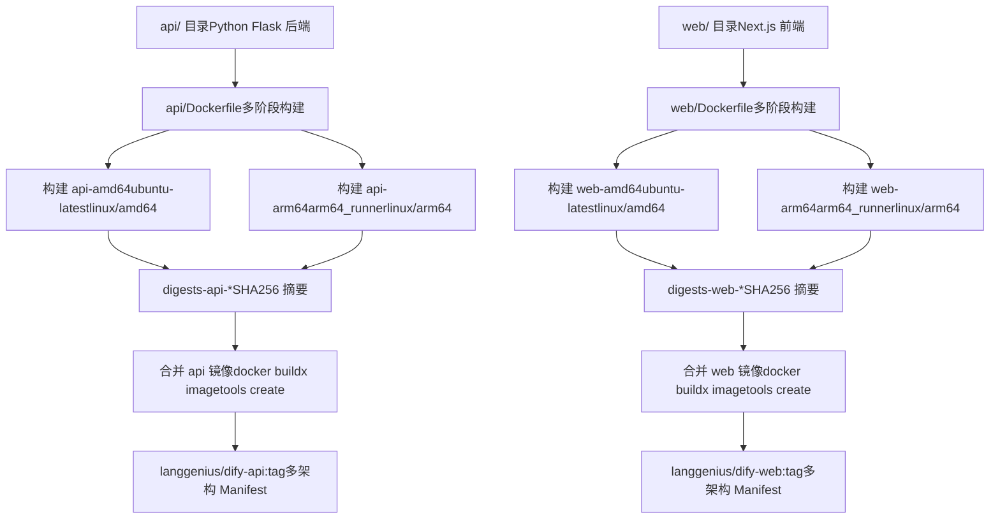
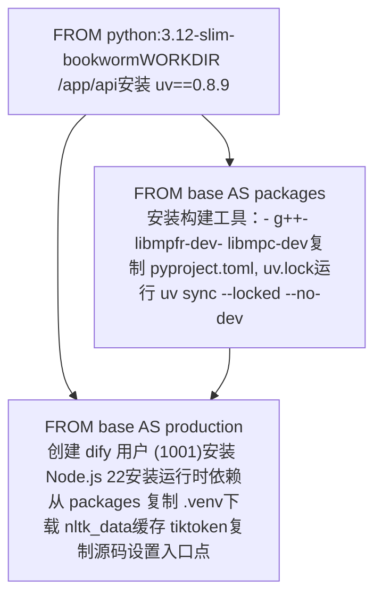
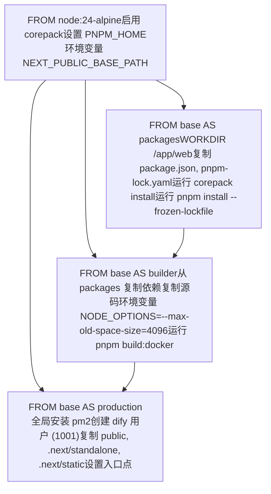
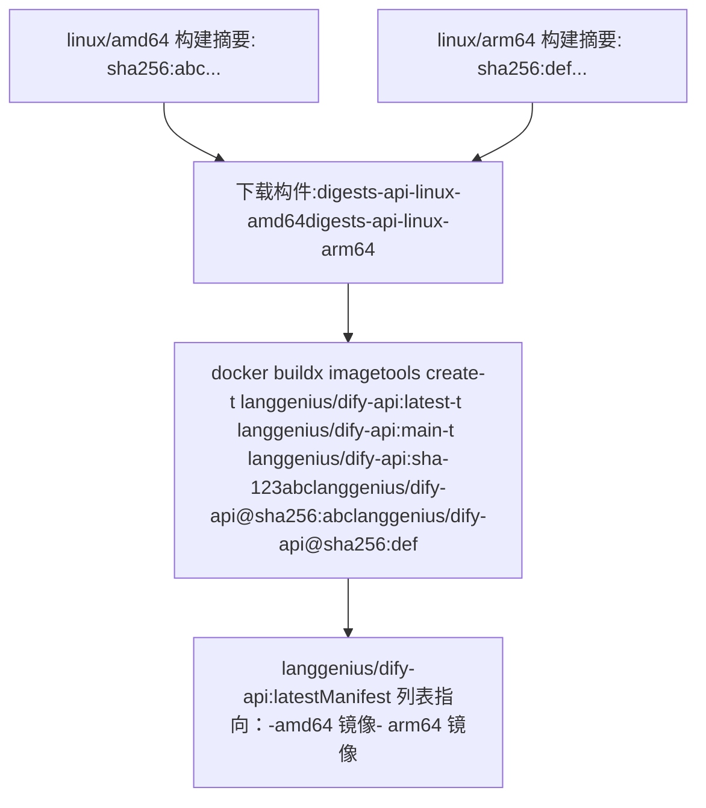

# Docker 构建过程与多架构镜像

相关源文件

-   [.github/workflows/api-tests.yml](https://github.com/langgenius/dify/blob/92dbc94f/.github/workflows/api-tests.yml)
-   [.github/workflows/autofix.yml](https://github.com/langgenius/dify/blob/92dbc94f/.github/workflows/autofix.yml)
-   [.github/workflows/build-push.yml](https://github.com/langgenius/dify/blob/92dbc94f/.github/workflows/build-push.yml)
-   [.github/workflows/db-migration-test.yml](https://github.com/langgenius/dify/blob/92dbc94f/.github/workflows/db-migration-test.yml)
-   [.github/workflows/deploy-agent-dev.yml](https://github.com/langgenius/dify/blob/92dbc94f/.github/workflows/deploy-agent-dev.yml)
-   [.github/workflows/deploy-dev.yml](https://github.com/langgenius/dify/blob/92dbc94f/.github/workflows/deploy-dev.yml)
-   [.github/workflows/deploy-hitl.yml](https://github.com/langgenius/dify/blob/92dbc94f/.github/workflows/deploy-hitl.yml)
-   [.github/workflows/docker-build.yml](https://github.com/langgenius/dify/blob/92dbc94f/.github/workflows/docker-build.yml)
-   [.github/workflows/main-ci.yml](https://github.com/langgenius/dify/blob/92dbc94f/.github/workflows/main-ci.yml)
-   [.github/workflows/stale.yml](https://github.com/langgenius/dify/blob/92dbc94f/.github/workflows/stale.yml)
-   [.github/workflows/style.yml](https://github.com/langgenius/dify/blob/92dbc94f/.github/workflows/style.yml)
-   [.github/workflows/tool-test-sdks.yaml](https://github.com/langgenius/dify/blob/92dbc94f/.github/workflows/tool-test-sdks.yaml)
-   [.github/workflows/translate-i18n-claude.yml](https://github.com/langgenius/dify/blob/92dbc94f/.github/workflows/translate-i18n-claude.yml)
-   [.github/workflows/trigger-i18n-sync.yml](https://github.com/langgenius/dify/blob/92dbc94f/.github/workflows/trigger-i18n-sync.yml)
-   [.github/workflows/vdb-tests.yml](https://github.com/langgenius/dify/blob/92dbc94f/.github/workflows/vdb-tests.yml)
-   [.github/workflows/web-tests.yml](https://github.com/langgenius/dify/blob/92dbc94f/.github/workflows/web-tests.yml)
-   [api/Dockerfile](https://github.com/langgenius/dify/blob/92dbc94f/api/Dockerfile)
-   [api/migrations/README](https://github.com/langgenius/dify/blob/92dbc94f/api/migrations/README)
-   [web/.nvmrc](https://github.com/langgenius/dify/blob/92dbc94f/web/.nvmrc)
-   [web/Dockerfile](https://github.com/langgenius/dify/blob/92dbc94f/web/Dockerfile)
-   [web/README.md](https://github.com/langgenius/dify/blob/92dbc94f/web/README.md)
-   [web/i18n-config/README.md](https://github.com/langgenius/dify/blob/92dbc94f/web/i18n-config/README.md)

本文档解释了 Dify 如何为 API 后端和 Web 前端服务构建 Docker 镜像，包括多阶段构建 (multi-stage build) 过程、多架构支持 (amd64/arm64) 以及自动构建和发布镜像的 CI/CD 流水线。

有关运行时配置和部署，请参阅 [环境配置与运行时模式](/langgenius/dify/3.2-environment-configuration-and-runtime-modes)。有关整体服务拓扑，请参阅 [服务拓扑与 Docker Compose](/langgenius/dify/2.1-service-topology-and-docker-compose)。

---

## 构建架构概览

Dify 分别为 API 和 Web 服务提供了独立的 Dockerfile，每个 Dockerfile 都实现了多阶段构建，以优化镜像大小和构建缓存。CI/CD 流水线并行构建 amd64 和 arm64 架构的镜像，然后将它们组合成多架构的 Manifest 列表。

### 构建流水线流程


**来源：** [.github/workflows/build-push.yml1-152](https://github.com/langgenius/dify/blob/92dbc94f/.github/workflows/build-push.yml#L1-L152)

---

## 多阶段构建：API 服务

API 服务的 Dockerfile 采用了三阶段构建过程，将依赖安装与运行时环境分离，从而生成仅包含必要运行时依赖的精简最终镜像。

### API 构建阶段


### 关键组件

| 组件 | 用途 | 位置 | 
| --- | --- | --- |
| **基础镜像** | `python:3.12-slim-bookworm` | 基于 Debian 12 的极简 Python 运行时 | 
| **包管理器** | `uv==0.8.9` | 高性能 Python 包安装器 | 
| **构建依赖** | `g++`, `libmpfr-dev`, `libmpc-dev` | 构建 gmpy2 所需的工具 | 
| **运行时依赖** | Node.js 22, 字体, libmagic 等 | PDF 处理及工具执行所需 | 
| **用户** | `dify:1001` | 出于安全考虑的非 root 用户 | 
| **虚拟环境** | `/app/api/.venv` | 隔离的 Python 依赖环境 | 
| **入口点** | `/entrypoint.sh` | 可配置的启动脚本 | 

### 依赖安装过程

`packages` 阶段使用 `uv` 安装 Python 依赖，它会读取 `pyproject.toml` 和 `uv.lock`：

**[api/Dockerfile12-26](https://github.com/langgenius/dify/blob/92dbc94f/api/Dockerfile#L12-L26)**

```dockerfile
FROM base AS packages
RUN apt-get update \
    && apt-get install -y --no-install-recommends \
          g++ \
          libmpfr-dev libmpc-dev
COPY pyproject.toml uv.lock ./
RUN uv sync --locked --no-dev
```
`--locked` 标志通过使用 `uv.lock` 中的确切版本确保了构建的可重现性。`--no-dev` 标志排除了开发环境依赖。

**来源：** [api/Dockerfile1-122](https://github.com/langgenius/dify/blob/92dbc94f/api/Dockerfile#L1-L122)

### 运行时环境设置

`production` 阶段会创建一个非 root 用户并安装运行时依赖：

**[api/Dockerfile52-58](https://github.com/langgenius/dify/blob/92dbc94f/api/Dockerfile#L52-L58)**

```dockerfile
ARG dify_uid=1001
RUN groupadd -r -g ${dify_uid} dify && \
    useradd -r -u ${dify_uid} -g ${dify_uid} -s /bin/bash dify && \
    chown -R dify:dify /app
```
Node.js 22 通过 nodesource 仓库安装，并带有 GPG 密钥验证 **[api/Dockerfile60-91](https://github.com/langgenius/dify/blob/92dbc94f/api/Dockerfile#L60-L91)**，这是某些需要执行 JavaScript 的工具和处理器所必需的。

### 预下载资源

为了避免在运行时进行下载，有两个数据集会在构建期间预先缓存：

1.  **NLTK 数据**: 自然语言处理数据集 **[api/Dockerfile99-101](https://github.com/langgenius/dify/blob/92dbc94f/api/Dockerfile#L99-L101)**

    ```dockerfile
    RUN mkdir -p /usr/local/share/nltk_data \
        && NLTK_DATA=/usr/local/share/nltk_data python -c "import nltk; ..."
    ```

2.  **Tiktoken 缓存**: OpenAI 分词器 (tokenizer) 编码数据 **[api/Dockerfile103-106](https://github.com/langgenius/dify/blob/92dbc94f/api/Dockerfile#L103-L106)**

    ```dockerfile
    RUN python -c "import tiktoken; tiktoken.encoding_for_model('gpt2')" \
        && chown -R dify:dify ${TIKTOKEN_CACHE_DIR}
    ```


**来源：** [api/Dockerfile29-122](https://github.com/langgenius/dify/blob/92dbc94f/api/Dockerfile#L29-L122)

---

## 多阶段构建：Web 服务

Web 服务的 Dockerfile 采用了针对 Next.js 应用优化的四阶段构建，将依赖安装、构建产物和生产环境运行时分离。

### Web 构建阶段


### 构建配置

`builder` 阶段为 Next.js 编译分配了更大的内存限制：

**[web/Dockerfile32-38](https://github.com/langgenius/dify/blob/92dbc94f/web/Dockerfile#L32-L38)**

```dockerfile
FROM base AS builder
WORKDIR /app/web
COPY --from=packages /app/web/ .
COPY . .
ENV NODE_OPTIONS="--max-old-space-size=4096"
RUN pnpm build:docker
```
`pnpm build:docker` 命令以 `standalone` 输出模式编译 Next.js，这会创建一个极简的生产环境包 **[web/Dockerfile38](https://github.com/langgenius/dify/blob/92dbc94f/web/Dockerfile#L38-L38)**。

### 生产环境产物

`production` 阶段仅从 `builder` 阶段复制三个目录：

**[web/Dockerfile75-77](https://github.com/langgenius/dify/blob/92dbc94f/web/Dockerfile#L75-L77)**

```dockerfile
COPY --from=builder --chown=dify:dify /app/web/public ./public
COPY --from=builder --chown=dify:dify /app/web/.next/standalone ./
COPY --from=builder --chown=dify:dify /app/web/.next/static ./.next/static
```
| 产物 | 用途 | 
| --- | --- |
| `public/` | 静态资产（图像、字体、图标） | 
| `.next/standalone/` | 包含所需依赖项的极简生产服务器 | 
| `.next/static/` | 编译后的静态资产（JS 块, CSS） | 

### 运行时配置

`production` 阶段安装了用于进程管理的 PM2：

**[web/Dockerfile61](https://github.com/langgenius/dify/blob/92dbc94f/web/Dockerfile#L61-L61)**

```dockerfile
RUN pnpm add -g pm2
```
PM2 允许通过 `PM2_INSTANCES` 环境变量控制多实例部署 **[web/Dockerfile53](https://github.com/langgenius/dify/blob/92dbc94f/web/Dockerfile#L53-L53)**，默认值为 2 个实例。

**来源：** [web/Dockerfile1-87](https://github.com/langgenius/dify/blob/92dbc94f/web/Dockerfile#L1-L87)

---

## 多架构构建策略

Dify 使用 GitHub Actions 的矩阵 (matrix) 构建以及平台特定的 Runner，为 `linux/amd64` 和 `linux/arm64` 平台构建镜像。

### 构建矩阵配置

构建流水线定义了包含 4 个作业的矩阵：

**[.github/workflows/build-push.yml28-46](https://github.com/langgenius/dify/blob/92dbc94f/.github/workflows/build-push.yml#L28-L46)**

```yaml
strategy:
  matrix:
    include:
      - service_name: "build-api-amd64"
        image_name_env: "DIFY_API_IMAGE_NAME"
        context: "api"
        platform: linux/amd64
      - service_name: "build-api-arm64"
        image_name_env: "DIFY_API_IMAGE_NAME"
        context: "api"
        platform: linux/arm64
      - service_name: "build-web-amd64"
        image_name_env: "DIFY_WEB_IMAGE_NAME"
        context: "web"
        platform: linux/amd64
      - service_name: "build-web-arm64"
        image_name_env: "DIFY_WEB_IMAGE_NAME"
        context: "web"
        platform: linux/arm64
```
### Runner 分配

流水线根据平台进行 Runner 的条件选择：

**[.github/workflows/build-push.yml26](https://github.com/langgenius/dify/blob/92dbc94f/.github/workflows/build-push.yml#L26-L26)**

```yaml
runs-on: ${{ matrix.platform == 'linux/arm64' && 'arm64_runner' || 'ubuntu-latest' }}
```
| 平台 | Runner | 架构 | 
| --- | --- | --- |
| `linux/amd64` | `ubuntu-latest` | x86_64 原生构建 | 
| `linux/arm64` | `arm64_runner` | ARM64 原生构建 | 

对于生产镜像，原生构建比 QEMU 模拟更快且更可靠。

**来源：** [.github/workflows/build-push.yml25-47](https://github.com/langgenius/dify/blob/92dbc94f/.github/workflows/build-push.yml#L25-L47)

### 基于 Digest 的推送

为了避免竞态条件，每个平台的构建都通过 Digest（摘要）而非 Tag（标签）进行推送：

**[.github/workflows/build-push.yml72-82](https://github.com/langgenius/dify/blob/92dbc94f/.github/workflows/build-push.yml#L72-L82)**

```yaml
- name: Build Docker image
  uses: docker/build-push-action@v6
  with:
    platforms: ${{ matrix.platform }}
    outputs: type=image,name=${{ env[matrix.image_name_env] }},push-by-digest=true,name-canonical=true,push=true
    cache-from: type=gha,scope=${{ matrix.service_name }}
    cache-to: type=gha,mode=max,scope=${{ matrix.service_name }}
```
Digest（可寻址内容的 SHA256 哈希）被提取并作为构件 (artifact) 上传：

**[.github/workflows/build-push.yml84-98](https://github.com/langgenius/dify/blob/92dbc94f/.github/workflows/build-push.yml#L84-L98)**

```yaml
- name: Export digest
  env:
    DIGEST: ${{ steps.build.outputs.digest }}
  run: |
    mkdir -p /tmp/digests
    sanitized_digest=${DIGEST#sha256:}
    touch "/tmp/digests/${sanitized_digest}"

- name: Upload digest
  uses: actions/upload-artifact@v6
  with:
    name: digests-${{ matrix.context }}-${{ env.PLATFORM_PAIR }}
    path: /tmp/digests/*
```
**来源：** [.github/workflows/build-push.yml72-98](https://github.com/langgenius/dify/blob/92dbc94f/.github/workflows/build-push.yml#L72-L98)

### Manifest 列表创建

在所有平台的构建完成后，一个单独的任务会创建多架构的 Manifest：


**[.github/workflows/build-push.yml114-144](https://github.com/langgenius/dify/blob/92dbc94f/.github/workflows/build-push.yml#L114-L144)**

```yaml
- name: Download digests
  uses: actions/download-artifact@v7
  with:
    path: /tmp/digests
    pattern: digests-${{ matrix.context }}-*
    merge-multiple: true

- name: Create manifest list and push
  working-directory: /tmp/digests
  run: |
    docker buildx imagetools create $(jq -cr '.tags | map("-t " + .) | join(" ")' <<< "$DOCKER_METADATA_OUTPUT_JSON") \
      $(printf "$IMAGE_NAME@sha256:%s " *)
```
**来源：** [.github/workflows/build-push.yml100-151](https://github.com/langgenius/dify/blob/92dbc94f/.github/workflows/build-push.yml#L100-L151)

---

## CI/CD 流水线架构

构建流水线采用了两阶段架构：并行平台构建，随后进行 Manifest 创建。

### 流水线触发器

`build-push.yml` 工作流由以下操作触发：

**[.github/workflows/build-push.yml3-12](https://github.com/langgenius/dify/blob/92dbc94f/.github/workflows/build-push.yml#L3-L12)**

```yaml
on:
  push:
    branches:
      - "main"
      - "deploy/**"
      - "build/**"
      - "release/e-*"
      - "hotfix/**"
    tags:
      - "*"
```
### 标签 (Tag) 策略

镜像标签由 `docker/metadata-action` 生成：

**[.github/workflows/build-push.yml127-136](https://github.com/langgenius/dify/blob/92dbc94f/.github/workflows/build-push.yml#L127-L136)**

```yaml
- name: Extract metadata for Docker
  id: meta
  uses: docker/metadata-action@v5
  with:
    images: ${{ env[matrix.image_name_env] }}
    tags: |
      type=raw,value=latest,enable=${{ startsWith(github.ref, 'refs/tags/') && !contains(github.ref, '-') }}
      type=ref,event=branch
      type=sha,enable=true,priority=100,prefix=,suffix=,format=long
      type=raw,value=${{ github.ref_name }},enable=${{ startsWith(github.ref, 'refs/tags/') }}
```
| 标签类型 | 示例 | 条件 | 
| --- | --- | --- |
| `latest` | `langgenius/dify-api:latest` | 不带预发布后缀的正式发布标签 | 
| 分支名 | `langgenius/dify-api:main` | 所有分支推送 | 
| Commit SHA | `langgenius/dify-api:a1b2c3d4e5f6...` | 所有提交（长格式） | 
| 标签名 | `langgenius/dify-api:v1.2.3` | Git 标签 | 

**来源：** [.github/workflows/build-push.yml1-152](https://github.com/langgenius/dify/blob/92dbc94f/.github/workflows/build-push.yml#L1-L152)

### 构建缓存

使用 GitHub Actions 缓存来加速后续构建：

**[.github/workflows/build-push.yml81-82](https://github.com/langgenius/dify/blob/92dbc94f/.github/workflows/build-push.yml#L81-L82)**

```yaml
cache-from: type=gha,scope=${{ matrix.service_name }}
cache-to: type=gha,mode=max,scope=${{ matrix.service_name }}
```
每个矩阵作业（例如 `build-api-amd64`）都有自己的缓存作用域，以避免缓存冲突。`mode=max` 导出了所有中间层，以实现最大的缓存重用。

**来源：** [.github/workflows/build-push.yml72-82](https://github.com/langgenius/dify/blob/92dbc94f/.github/workflows/build-push.yml#L72-L82)

### PR 构建验证

Pull request 会触发一个仅构建的工作流，用于验证 Dockerfile 而不进行推送：

**[.github/workflows/docker-build.yml1-49](https://github.com/langgenius/dify/blob/92dbc94f/.github/workflows/docker-build.yml#L1-L49)**

```yaml
name: Build docker image
on:
  pull_request:
    branches: ["main"]
    paths:
      - api/Dockerfile
      - web/Dockerfile

jobs:
  build-docker:
    runs-on: ubuntu-latest
    strategy:
      matrix:
        include:
          - service_name: "api-amd64"
            platform: linux/amd64
            context: "api"
          # ... arm64 变体
    steps:
      - name: Set up QEMU
        uses: docker/setup-qemu-action@v3
      - name: Build Docker Image
        uses: docker/build-push-action@v6
        with:
          push: false
```
该工作流在 x86_64 Runner 上使用 QEMU 进行 ARM64 模拟，这对于测试是可以接受的，但比原生构建慢。

**来源：** [.github/workflows/docker-build.yml1-49](https://github.com/langgenius/dify/blob/92dbc94f/.github/workflows/docker-build.yml#L1-L49)

---

## 构建优化技术

采用了多种技术来优化两个服务的构建速度和镜像大小。

### 多阶段构建的好处

| 阶段 | 目的 | 保留的产物 | 
| --- | --- | --- |
| `base` | 通用基础层 | 无（中间层） | 
| `packages` | 依赖项编译 | 仅虚拟环境 | 
| `builder` | 应用构建 | 仅生产环境产物 | 
| `production` | 极简运行时 | 源码、编译后的资产、运行时依赖 | 

构建工具和中间文件在阶段间被丢弃，使最终镜像大小减少了 50-70%。

### 分层缓存策略

Dockerfile 指令的顺序经过优化，以最大限度提高缓存命中率：

1.  **最不常变动的排在前面**: 基础镜像、系统包
2.  **依赖清单**: `pyproject.toml`, `package.json` 在源码之前复制
3.  **依赖安装**: 在复制源码之前独立成层
4.  **源码**: 最后复制，仅使最后的层失效

**API Dockerfile 示例：**

```dockerfile
COPY pyproject.toml uv.lock ./
RUN uv sync --locked --no-dev
COPY --chown=dify:dify . /app/api/ 
```
**来源：** [api/Dockerfile25-109](https://github.com/langgenius/dify/blob/92dbc94f/api/Dockerfile#L25-L109) [web/Dockerfile24-38](https://github.com/langgenius/dify/blob/92dbc94f/web/Dockerfile#L24-L38)

### 基于 Lockfile 的安装

两个服务均使用 Lockfile 确保构建的可重现性：

| 服务 | Lockfile | 命令 | 
| --- | --- | --- |
| API | `uv.lock` | `uv sync --locked --no-dev` | 
| Web | `pnpm-lock.yaml` | `pnpm install --frozen-lockfile` | 

如果 Lockfile 不同步，`--locked` 和 `--frozen-lockfile` 标志会使构建失败，从而防止非确定性的构建结果。

**来源：** [api/Dockerfile26](https://github.com/langgenius/dify/blob/92dbc94f/api/Dockerfile#L26-L26) [web/Dockerfile29](https://github.com/langgenius/dify/blob/92dbc94f/web/Dockerfile#L29-L29)

### 构建上下文优化

构建上下文被限制在服务目录内：

**[.github/workflows/build-push.yml76](https://github.com/langgenius/dify/blob/92dbc94f/.github/workflows/build-push.yml#L76-L76)**

```yaml
context: "{{defaultContext}}:${{ matrix.context }}"
```
这防止了将整个仓库（包括 `.git/`）发送到 Docker 守护进程，将上下文上传时间从几分钟缩短到几秒钟。

**来源：** [.github/workflows/build-push.yml74-80](https://github.com/langgenius/dify/blob/92dbc94f/.github/workflows/build-push.yml#L74-L80)

---

## 安全性考虑

两个 Dockerfile 都为生产部署实现了安全性最佳实践。

### 非 Root 用户执行

所有服务均以专门的非 root 用户 `dify` (UID 1001) 运行：

**API:** **[api/Dockerfile52-58](https://github.com/langgenius/dify/blob/92dbc94f/api/Dockerfile#L52-L58)**

```dockerfile
ARG dify_uid=1001
RUN groupadd -r -g ${dify_uid} dify && \
    useradd -r -u ${dify_uid} -g ${dify_uid} -s /bin/bash dify && \
    chown -R dify:dify /app
USER dify
```
**Web:** **[web/Dockerfile65-70](https://github.com/langgenius/dify/blob/92dbc94f/web/Dockerfile#L65-70)**

```dockerfile
ARG dify_uid=1001
RUN addgroup -S -g ${dify_uid} dify && \
    adduser -S -u ${dify_uid} -G dify -s /bin/ash -h /home/dify dify && \
    mkdir /app && mkdir /.pm2 && \
    chown -R dify:dify /app /.pm2
USER dify
```
这防止了提权攻击并限制了文件系统的访问权限。

**来源：** [api/Dockerfile52-119](https://github.com/langgenius/dify/blob/92dbc94f/api/Dockerfile#L52-L119) [web/Dockerfile65-84](https://github.com/langgenius/dify/blob/92dbc94f/web/Dockerfile#L65-L84)

### 经过验证的依赖项

Node.js 的安装包含 GPG 密钥验证：

**[api/Dockerfile67-71](https://github.com/langgenius/dify/blob/92dbc94f/api/Dockerfile#L67-L71)**

```dockerfile
curl -fsSL https://deb.nodesource.com/gpgkey/nodesource-repo.gpg.key -o /tmp/nodesource.gpg
gpg --show-keys --with-colons /tmp/nodesource.gpg \
    | awk -F: '/^fpr:/ {print $10}' \
    | grep -Fx "${NODESOURCE_KEY_FPR}"
gpg --dearmor -o /etc/apt/keyrings/nodesource.gpg /tmp/nodesource.gpg
```
预期的指纹 `6F71F525282841EEDAF851B42F59B5F99B1BE0B4` 被硬编码 **[api/Dockerfile55](https://github.com/langgenius/dify/blob/92dbc94f/api/Dockerfile#L55-L55)**，以防止中间人攻击。

**来源：** [api/Dockerfile60-91](https://github.com/langgenius/dify/blob/92dbc94f/api/Dockerfile#L60-L91)

### 锁定安全更新

显式锁定了关键的安全包版本：

**[api/Dockerfile83](https://github.com/langgenius/dify/blob/92dbc94f/api/Dockerfile#L83-L83)**

```dockerfile
expat libldap-2.5-0=2.5.13+dfsg-5 perl libsqlite3-0=3.40.1-2+deb12u2 zlib1g=1:1.2.13.dfsg-1
```
这确保了在保持可重现性的同时，修复了已知的漏洞。

**来源：** [api/Dockerfile83](https://github.com/langgenius/dify/blob/92dbc94f/api/Dockerfile#L83-L83)

### 构建参数 Commit SHA

Commit SHA 作为构建参数传递并嵌入到镜像中：

**[api/Dockerfile115-116](https://github.com/langgenius/dify/blob/92dbc94f/api/Dockerfile#L115-L116)**

```dockerfile
ARG COMMIT_SHA
ENV COMMIT_SHA=${COMMIT_SHA}
```
**[.github/workflows/build-push.yml78](https://github.com/langgenius/dify/blob/92dbc94f/.github/workflows/build-push.yml#L78-L78)**

```yaml
build-args: COMMIT_SHA=${{ fromJSON(steps.meta.outputs.json).labels['org.opencontainers.image.revision'] }}
```
这使得运行时版本自省成为可能，便于调试和审计。

**来源：** [api/Dockerfile115-116](https://github.com/langgenius/dify/blob/92dbc94f/api/Dockerfile#L115-L116) [web/Dockerfile81-82](https://github.com/langgenius/dify/blob/92dbc94f/web/Dockerfile#L81-L82) [.github/workflows/build-push.yml78](https://github.com/langgenius/dify/blob/92dbc94f/.github/workflows/build-push.yml#L78-L78)

### Hadolint 验证

Dockerfile 会在 CI 中通过 Hadolint 进行验证：

**[.github/workflows/style.yml154-171](https://github.com/langgenius/dify/blob/92dbc94f/.github/workflows/style.yml#L154-L171)**

```yaml
- name: Super-linter
  uses: super-linter/super-linter/slim@v8
  if: steps.changed-files.outputs.any_changed == 'true'
  env:
    VALIDATE_DOCKERFILE_HADOLINT: true
```
这能捕获常见的错误，例如：

-   缺失 `USER` 指令
-   未打标签的基础镜像
-   不安全的下载
-   低效的层使用

**来源：** [.github/workflows/style.yml130-171](https://github.com/langgenius/dify/blob/92dbc94f/.github/workflows/style.yml#L130-L171)

---

## 相关配置文件

| 文件 | 用途 | 
| --- | --- |
| `docker/entrypoint.sh` | 运行时模式选择器 (api/worker/beat) | 
| `pyproject.toml` | Python 依赖项和包元数据 | 
| `uv.lock` | 锁定的 Python 依赖版本 | 
| `web/package.json` | Node.js 依赖项和脚本 | 
| `web/pnpm-lock.yaml` | 锁定的 Node.js 依赖版本 | 
| `docker/.env.example` | 容器环境变量模板 | 

**来源：** [api/Dockerfile112](https://github.com/langgenius/dify/blob/92dbc94f/api/Dockerfile#L112-L112) [web/Dockerfile79](https://github.com/langgenius/dify/blob/92dbc94f/web/Dockerfile#L79-L79)
