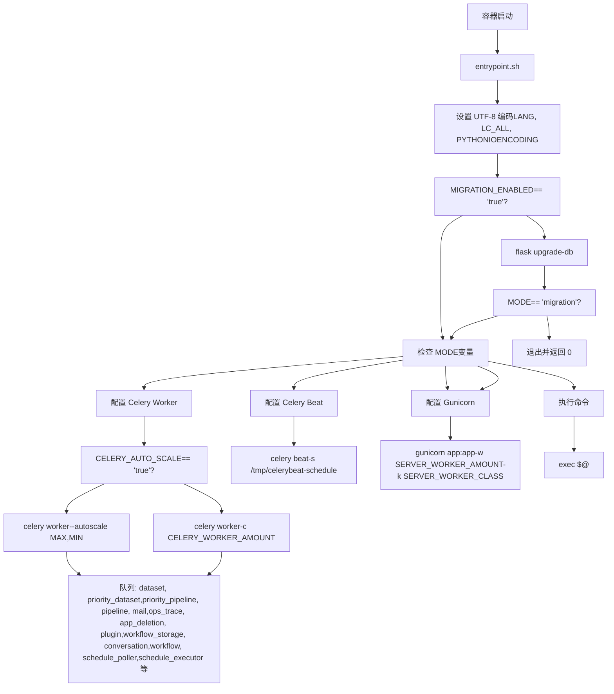

# 环境配置与运行时模式

相关源文件

-   [api/.env.example](https://github.com/langgenius/dify/blob/92dbc94f/api/.env.example)
-   [api/app.py](https://github.com/langgenius/dify/blob/92dbc94f/api/app.py)
-   [api/app_factory.py](https://github.com/langgenius/dify/blob/92dbc94f/api/app_factory.py)
-   [api/commands.py](https://github.com/langgenius/dify/blob/92dbc94f/api/commands.py)
-   [api/configs/feature/__init__.py](https://github.com/langgenius/dify/blob/92dbc94f/api/configs/feature/__init__.py)
-   [api/configs/middleware/__init__.py](https://github.com/langgenius/dify/blob/92dbc94f/api/configs/middleware/__init__.py)
-   [api/configs/packaging/__init__.py](https://github.com/langgenius/dify/blob/92dbc94f/api/configs/packaging/__init__.py)
-   [api/controllers/console/datasets/datasets.py](https://github.com/langgenius/dify/blob/92dbc94f/api/controllers/console/datasets/datasets.py)
-   [api/core/rag/datasource/vdb/vector_factory.py](https://github.com/langgenius/dify/blob/92dbc94f/api/core/rag/datasource/vdb/vector_factory.py)
-   [api/core/rag/datasource/vdb/vector_type.py](https://github.com/langgenius/dify/blob/92dbc94f/api/core/rag/datasource/vdb/vector_type.py)
-   [api/extensions/ext_storage.py](https://github.com/langgenius/dify/blob/92dbc94f/api/extensions/ext_storage.py)
-   [api/extensions/storage/storage_type.py](https://github.com/langgenius/dify/blob/92dbc94f/api/extensions/storage/storage_type.py)
-   [api/libs/helper.py](https://github.com/langgenius/dify/blob/92dbc94f/api/libs/helper.py)
-   [api/pyproject.toml](https://github.com/langgenius/dify/blob/92dbc94f/api/pyproject.toml)
-   [api/tests/unit_tests/configs/test_dify_config.py](https://github.com/langgenius/dify/blob/92dbc94f/api/tests/unit_tests/configs/test_dify_config.py)
-   [api/tests/unit_tests/libs/test_helper.py](https://github.com/langgenius/dify/blob/92dbc94f/api/tests/unit_tests/libs/test_helper.py)
-   [api/uv.lock](https://github.com/langgenius/dify/blob/92dbc94f/api/uv.lock)
-   [dev/pytest/pytest_vdb.sh](https://github.com/langgenius/dify/blob/92dbc94f/dev/pytest/pytest_vdb.sh)
-   [docker/.env.example](https://github.com/langgenius/dify/blob/92dbc94f/docker/.env.example)
-   [docker/docker-compose-template.yaml](https://github.com/langgenius/dify/blob/92dbc94f/docker/docker-compose-template.yaml)
-   [docker/docker-compose.middleware.yaml](https://github.com/langgenius/dify/blob/92dbc94f/docker/docker-compose.middleware.yaml)
-   [docker/docker-compose.yaml](https://github.com/langgenius/dify/blob/92dbc94f/docker/docker-compose.yaml)
-   [docker/middleware.env.example](https://github.com/langgenius/dify/blob/92dbc94f/docker/middleware.env.example)
-   [web/.env.example](https://github.com/langgenius/dify/blob/92dbc94f/web/.env.example)
-   [web/app/activate/activateForm.tsx](https://github.com/langgenius/dify/blob/92dbc94f/web/app/activate/activateForm.tsx)
-   [web/app/components/base/form/hooks/use-get-form-values.ts](https://github.com/langgenius/dify/blob/92dbc94f/web/app/components/base/form/hooks/use-get-form-values.ts)
-   [web/app/components/base/form/utils/zod-submit-validator.ts](https://github.com/langgenius/dify/blob/92dbc94f/web/app/components/base/form/utils/zod-submit-validator.ts)
-   [web/app/forgot-password/ForgotPasswordForm.spec.tsx](https://github.com/langgenius/dify/blob/92dbc94f/web/app/forgot-password/ForgotPasswordForm.spec.tsx)
-   [web/app/forgot-password/ForgotPasswordForm.tsx](https://github.com/langgenius/dify/blob/92dbc94f/web/app/forgot-password/ForgotPasswordForm.tsx)
-   [web/app/install/installForm.tsx](https://github.com/langgenius/dify/blob/92dbc94f/web/app/install/installForm.tsx)
-   [web/app/layout.tsx](https://github.com/langgenius/dify/blob/92dbc94f/web/app/layout.tsx)
-   [web/config/index.ts](https://github.com/langgenius/dify/blob/92dbc94f/web/config/index.ts)
-   [web/docker/entrypoint.sh](https://github.com/langgenius/dify/blob/92dbc94f/web/docker/entrypoint.sh)
-   [web/package.json](https://github.com/langgenius/dify/blob/92dbc94f/web/package.json)
-   [web/types/feature.ts](https://github.com/langgenius/dify/blob/92dbc94f/web/types/feature.ts)

本文档介绍了 Dify 如何通过 `.env` 文件和环境变量管理环境配置，以及 API 服务如何使用单个 Docker 镜像支持多种运行时模式。有关 Docker 构建过程和多架构镜像的信息，请参阅 [Docker 构建过程与多架构镜像](/langgenius/dify/3.1-docker-build-process-and-multi-architecture-images)。有关存储和向量数据库配置的详细信息，请参阅 [存储与向量数据库配置](/langgenius/dify/3.3-storage-and-vector-database-configuration)。

## 目的与范围

Dify 使用灵活的基于环境的配置系统，允许单个 Docker 镜像在多种运行时模式下运行。这种设计实现了：

-   **统一配置**：所有服务通过 Docker Compose 共享相同的环境变量。
-   **多模式运行**：同一个 API 镜像可以根据 `MODE` 环境变量，作为 API 服务器、Celery worker、调度器或迁移工具运行。
-   **类型安全配置**：基于 Pydantic 的配置类提供了验证和类型安全性。
-   **环境隔离**：开发、测试和生产环境使用不同的 `.env` 文件。

---

## 环境变量管理

### 配置文件层级

Dify 使用多个 `.env` 文件来组织环境变量：


**来源**: [docker/.env.example1-900](https://github.com/langgenius/dify/blob/92dbc94f/docker/.env.example#L1-L900) [api/.env.example1-667](https://github.com/langgenius/dify/blob/92dbc94f/api/.env.example#L1-L667) [docker/docker-compose.yaml1-650](https://github.com/langgenius/dify/blob/92dbc94f/docker/docker-compose.yaml#L1-L650)

### 环境变量分类

配置系统将环境变量分为不同的类别：

| 类别 | 关键变量 | 配置类 | 用途 |
| --- | --- | --- | --- |
| **通用** | `CONSOLE_API_URL`, `CONSOLE_WEB_URL`, `SERVICE_API_URL`, `APP_WEB_URL`, `FILES_URL` | `EndpointConfig` | 不同服务的 URL 端点 |
| **服务器** | `LOG_LEVEL`, `DEBUG`, `FLASK_DEBUG`, `SECRET_KEY`, `DEPLOY_ENV` | 多个 | 日志、调试和部署设置 |
| **容器启动** | `DIFY_BIND_ADDRESS`, `DIFY_PORT`, `SERVER_WORKER_AMOUNT`, `SERVER_WORKER_CLASS` | 多个 | Gunicorn 和容器运行时配置 |
| **数据库** | `DB_TYPE`, `DB_USERNAME`, `DB_PASSWORD`, `DB_HOST`, `DB_PORT`, `DB_DATABASE` | `DatabaseConfig` | 关系型数据库连接 |
| **Redis** | `REDIS_HOST`, `REDIS_PORT`, `REDIS_PASSWORD`, `REDIS_USE_SSL`, `REDIS_USE_SENTINEL` | `RedisConfig` | 缓存和消息代理配置 |
| **Celery** | `CELERY_BROKER_URL`, `CELERY_BACKEND`, `CELERY_WORKER_AMOUNT`, `CELERY_AUTO_SCALE` | 多个 | 异步任务处理 |
| **存储** | `STORAGE_TYPE`, `OPENDAL_SCHEME`, `S3_*`, `AZURE_BLOB_*` | `StorageConfig` | 文件存储后端选择 |
| **向量存储** | `VECTOR_STORE`, `WEAVIATE_*`, `QDRANT_*`, `MILVUS_*` | `VectorStoreConfig` | 向量嵌入数据库 |
| **代码执行** | `CODE_EXECUTION_ENDPOINT`, `CODE_EXECUTION_API_KEY`, `CODE_MAX_*` | `CodeExecutionSandboxConfig` | 沙箱服务配置 |
| **工作流** | `WORKFLOW_MAX_EXECUTION_STEPS`, `WORKFLOW_MAX_EXECUTION_TIME`, `WORKFLOW_CALL_MAX_DEPTH` | `WorkflowConfig` | 工作流执行限制 |
| **插件** | `PLUGIN_DAEMON_URL`, `PLUGIN_DAEMON_KEY`, `PLUGIN_MAX_PACKAGE_SIZE` | `PluginConfig` | 插件系统配置 |

**来源**: [docker/.env.example1-900](https://github.com/langgenius/dify/blob/92dbc94f/docker/.env.example#L1-L900) [api/configs/feature/__init__.py1-600](https://github.com/langgenius/dify/blob/92dbc94f/api/configs/feature/__init__.py#L1-L600) [api/configs/middleware/__init__.py1-300](https://github.com/langgenius/dify/blob/92dbc94f/api/configs/middleware/__init__.py#L1-L300)

### 环境变量加载流程


**来源**: [docker/docker-compose-template.yaml1-50](https://github.com/langgenius/dify/blob/92dbc94f/docker/docker-compose-template.yaml#L1-L50) [docker/docker-compose.yaml1-100](https://github.com/langgenius/dify/blob/92dbc94f/docker/docker-compose.yaml#L1-L100) [docker/entrypoint.sh1-80](https://github.com/langgenius/dify/blob/92dbc94f/docker/entrypoint.sh#L1-L80) [api/configs/app_config.py1-50](https://github.com/langgenius/dify/blob/92dbc94f/api/configs/app_config.py#L1-L50)

配置加载遵循以下顺序：

1.  **Docker Compose 生成**：[docker/docker-compose-template.yaml1-650](https://github.com/langgenius/dify/blob/92dbc94f/docker/docker-compose-template.yaml#L1-L650) 作为模板，与环境变量合并生成最终的 [docker/docker-compose.yaml1-650](https://github.com/langgenius/dify/blob/92dbc94f/docker/docker-compose.yaml#L1-L650)。
2.  **共享环境锚点**：`x-shared-env` 锚点 [docker/docker-compose.yaml7-650](https://github.com/langgenius/dify/blob/92dbc94f/docker/docker-compose.yaml#L7-L650) 定义了 API 和 Worker 容器共享的环境变量。
3.  **操作系统环境**：Docker Compose 在容器中设置操作系统环境变量。
4.  **UTF-8 编码**：[docker/entrypoint.sh6-8](https://github.com/langgenius/dify/blob/92dbc94f/docker/entrypoint.sh#L6-L8) 确保正确设置了 UTF-8 编码。
5.  **Pydantic 验证**：Python 应用通过 Pydantic 模型加载配置，验证类型和约束。

---

## 运行时模式

### MODE 环境变量

`MODE` 环境变量决定了 API 容器运行哪种服务。该变量在 [docker/docker-compose-template.yaml22-111](https://github.com/langgenius/dify/blob/92dbc94f/docker/docker-compose-template.yaml#L22-L111) 中设置：

```
MODE: api          # API 服务 (第 30 行)
MODE: worker       # Celery worker (第 72 行)
MODE: beat         # Celery beat 调度器 (第 111 行)
MODE: migration    # 仅运行数据库迁移 (第 14 行)
MODE: job          # 一次性命令执行
```
### 运行时模式决策流程


**来源**: [docker/entrypoint.sh1-80](https://github.com/langgenius/dify/blob/92dbc94f/docker/entrypoint.sh#L1-L80) [docker/docker-compose-template.yaml22-132](https://github.com/langgenius/dify/blob/92dbc94f/docker/docker-compose-template.yaml#L22-L132)

### API 模式

**目的**：将 Flask 应用作为处理 REST API 请求的 Web 服务器运行。

**配置** [docker/entrypoint.sh50-80](https://github.com/langgenius/dify/blob/92dbc94f/docker/entrypoint.sh#L50-L80)：

-   **Worker 类**：`SERVER_WORKER_CLASS`（默认：`gevent`）决定并发模型。
-   **Worker 数量**：`SERVER_WORKER_AMOUNT`（默认：1）设置 Gunicorn worker 进程数。
-   **Worker 连接数**：`SERVER_WORKER_CONNECTIONS`（默认：10）针对 gevent worker 的连接数。
-   **超时时间**：`GUNICORN_TIMEOUT`（默认：360 秒）以支持 SSE。
-   **绑定地址**：`DIFY_BIND_ADDRESS:DIFY_PORT`（默认：`0.0.0.0:5001`）。

**命令示例**：

```
gunicorn app:app \
  --bind 0.0.0.0:5001 \
  --workers 1 \
  --worker-class gevent \
  --worker-connections 10 \
  --timeout 360 \
  --access-logfile - \
  --error-logfile -
```
**环境变量**：

| 变量 | 默认值 | 描述 |
| --- | --- | --- |
| `MODE` | `api` | 设置 API 服务器模式 |
| `DIFY_BIND_ADDRESS` | `0.0.0.0` | 绑定地址 |
| `DIFY_PORT` | `5001` | 绑定端口 |
| `SERVER_WORKER_AMOUNT` | `1` | worker 进程数 |
| `SERVER_WORKER_CLASS` | `gevent` | worker 类 (gevent/sync/solo) |
| `SERVER_WORKER_CONNECTIONS` | `10` | 每个 worker 的连接数 |
| `GUNICORN_TIMEOUT` | `360` | 请求超时时间（秒） |

**来源**: [docker/entrypoint.sh50-80](https://github.com/langgenius/dify/blob/92dbc94f/docker/entrypoint.sh#L50-L80) [docker/.env.example143-182](https://github.com/langgenius/dify/blob/92dbc94f/docker/.env.example#L143-L182) [docker/docker-compose-template.yaml22-61](https://github.com/langgenius/dify/blob/92dbc94f/docker/docker-compose-template.yaml#L22-L61)

### Worker 模式

**目的**：运行 Celery worker 以处理异步任务，包括知识库索引、工作流执行和邮件发送。

**配置** [docker/entrypoint.sh20-48](https://github.com/langgenius/dify/blob/92dbc94f/docker/entrypoint.sh#L20-L48)：

-   **Worker 数量**：`CELERY_WORKER_AMOUNT` 设置固定的 worker 数量。
-   **自动扩缩容**：`CELERY_AUTO_SCALE` 启用 worker 动态扩缩容。
    -   `CELERY_MAX_WORKERS`：自动扩缩容时的最大 worker 数。
    -   `CELERY_MIN_WORKERS`：自动扩缩容时的最小 worker 数。
-   **Worker 类**：`CELERY_WORKER_CLASS` 可以覆盖并发模型（很少需要）。

**队列列表** [docker/entrypoint.sh41](https://github.com/langgenius/dify/blob/92dbc94f/docker/entrypoint.sh#L41-L41)：

-   `dataset`：知识库处理任务。
-   `priority_dataset`：高优先级知识库任务。
-   `priority_pipeline`：高优先级工作流任务。
-   `pipeline`：标准工作流任务。
-   `mail`：邮件发送任务。
-   `ops_trace`：运行追踪任务。
-   `app_deletion`：应用清理任务。
-   `plugin`：插件管理任务。
-   `workflow_storage`：工作流持久化任务。
-   `conversation`：会话处理任务。
-   `workflow`：通用工作流任务。
-   `schedule_poller`：定时工作流轮询。
-   `schedule_executor`：定时工作流执行。
-   `triggered_workflow_dispatcher`：触发器分发。
-   `trigger_refresh_executor`：触发器刷新任务。
-   `retention`：数据保留任务。

**命令示例（固定 Worker 数）**：

```
celery -A app.celery worker \
  -P threads \
  -c 2 \
  --loglevel INFO \
  -Q dataset,priority_dataset,pipeline,mail,ops_trace
```
**命令示例（自动扩缩容）**：

```
celery -A app.celery worker \
  -P threads \
  --autoscale=10,2 \
  --loglevel INFO \
  -Q dataset,priority_dataset,pipeline,mail,ops_trace
```
**环境变量**：

| 变量 | 默认值 | 描述 |
| --- | --- | --- |
| `MODE` | `worker` | 设置 worker 模式 |
| `CELERY_WORKER_AMOUNT` | (空) | 固定 worker 数量 |
| `CELERY_AUTO_SCALE` | `false` | 启用自动扩缩容 |
| `CELERY_MAX_WORKERS` | (空) | 自动扩缩容最大 worker 数 |
| `CELERY_MIN_WORKERS` | (空) | 自动扩缩容最小 worker 数 |
| `CELERY_WORKER_CLASS` | (空) | 覆盖并发模型 |

**来源**: [docker/entrypoint.sh20-48](https://github.com/langgenius/dify/blob/92dbc94f/docker/entrypoint.sh#L20-L48) [docker/.env.example183-210](https://github.com/langgenius/dify/blob/92dbc94f/docker/.env.example#L183-L210) [docker/docker-compose-template.yaml63-100](https://github.com/langgenius/dify/blob/92dbc94f/docker/docker-compose-template.yaml#L63-L100)

### Beat 模式

**目的**：运行 Celery beat 调度器，按预定间隔触发周期性任务。

**配置** [docker/entrypoint.sh49](https://github.com/langgenius/dify/blob/92dbc94f/docker/entrypoint.sh#L49-L49)：

-   **调度文件**：`/tmp/celerybeat-schedule` 存储调度数据库。
-   **无 Worker**：Beat 仅负责调度任务；由 worker 负责执行。
-   **单实例**：每个部署中只能运行一个 beat 实例。

**周期性任务**（在应用代码中配置）：

-   `ENABLE_CLEAN_EMBEDDING_CACHE_TASK`：清理过期的向量嵌入缓存。
-   `ENABLE_CLEAN_UNUSED_DATASETS_TASK`：移除未使用的知识库。
-   `ENABLE_CLEAN_MESSAGES`：清理旧消息。
-   `ENABLE_WORKFLOW_SCHEDULE_POLLER_TASK`：轮询已调度的工作流。
-   `ENABLE_CHECK_UPGRADABLE_PLUGIN_TASK`：检查插件更新。

**命令**：

```
celery -A app.celery beat \
  --loglevel INFO \
  -s /tmp/celerybeat-schedule
```
**环境变量**：

| 变量 | 默认值 | 描述 |
| --- | --- | --- |
| `MODE` | `beat` | 设置 beat 调度器模式 |
| `CELERY_BEAT_SCHEDULER_TIME` | `1` | 调度器滴答间隔 |
| `WORKFLOW_SCHEDULE_POLLER_INTERVAL` | `1` | 工作流轮询间隔（分钟） |

**来源**: [docker/entrypoint.sh49](https://github.com/langgenius/dify/blob/92dbc94f/docker/entrypoint.sh#L49-L49) [api/.env.example577-594](https://github.com/langgenius/dify/blob/92dbc94f/api/.env.example#L577-L594) [docker/docker-compose-template.yaml102-131](https://github.com/langgenius/dify/blob/92dbc94f/docker/docker-compose-template.yaml#L102-L131)

### Migration 模式

**目的**：运行数据库迁移并退出，适用于初始化容器或手动迁移运行。

**配置** [docker/entrypoint.sh10-18](https://github.com/langgenius/dify/blob/92dbc94f/docker/entrypoint.sh#L10-L18)：

-   **启用方式**：`MIGRATION_ENABLED=true`。
-   **命令**：`flask upgrade-db`（实际运行 `flask db upgrade`）。
-   **退出行为**：当 `MODE=migration` 时，迁移完成后即退出。

**迁移流程**：

1.  检查 `MIGRATION_ENABLED` 环境变量。
2.  运行 `flask upgrade-db` 命令。
3.  如果 `MODE=migration`，以状态码 0 退出。
4.  否则，继续启动服务。

**使用场景**：

-   **初始化容器**：[docker/docker-compose-template.yaml4-20](https://github.com/langgenius/dify/blob/92dbc94f/docker/docker-compose-template.yaml#L4-L20) 展示了 `init_permissions` 服务模式。
-   **手动迁移**：在部署新版本前运行迁移。
-   **零停机部署**：在更新服务前迁移数据库。

**命令**：

```
MODE=migration flask upgrade-db
```
**环境变量**：

| 变量 | 默认值 | 描述 |
| --- | --- | --- |
| `MODE` | `migration` | 设置仅迁移模式 |
| `MIGRATION_ENABLED` | `true` | 启动时启用迁移 |

**来源**: [docker/entrypoint.sh10-18](https://github.com/langgenius/dify/blob/92dbc94f/docker/entrypoint.sh#L10-L18) [docker/.env.example122-124](https://github.com/langgenius/dify/blob/92dbc94f/docker/.env.example#L122-L124) [api/app.py4-14](https://github.com/langgenius/dify/blob/92dbc94f/api/app.py#L4-L14)

### Job 模式

**目的**：在容器环境中执行任意命令，适用于维护任务和 CLI 命令。

**配置** [docker/entrypoint.sh80](https://github.com/langgenius/dify/blob/92dbc94f/docker/entrypoint.sh#L80-L80)：

-   **命令执行**：`exec "$@"` 透传所有参数。
-   **环境**：完整的应用环境均可用。
-   **使用场景**：管理命令、数据导入、清理脚本。

**示例**：

```
# 重置用户密码
docker compose run --rm api flask reset-password --email user@example.com

# 生成加密密钥
docker compose run --rm api flask reset-encrypt-key-pair

# 运行向量数据库迁移
docker compose run --rm api flask vdb-migrate --scope all

# 创建初始管理员账号
docker compose run --rm api flask register --email admin@example.com
```
**可用命令** [api/commands.py53-600](https://github.com/langgenius/dify/blob/92dbc94f/api/commands.py#L53-L600)：

-   `reset-password`：重置账号密码。
-   `reset-email`：更新账号邮箱。
-   `reset-encrypt-key-pair`：重新生成加密密钥。
-   `vdb-migrate`：迁移向量数据库数据。
-   `register`：创建新账号。

**来源**: [docker/entrypoint.sh80](https://github.com/langgenius/dify/blob/92dbc94f/docker/entrypoint.sh#L80-L80) [api/commands.py1-600](https://github.com/langgenius/dify/blob/92dbc94f/api/commands.py#L1-L600)

---

## Pydantic 配置系统

### 配置架构

Dify 使用 Pydantic 进行类型安全且经过验证的配置管理：


**来源**: [api/configs/app_config.py1-100](https://github.com/langgenius/dify/blob/92dbc94f/api/configs/app_config.py#L1-L100) [api/configs/feature/__init__.py1-600](https://github.com/langgenius/dify/blob/92dbc94f/api/configs/feature/__init__.py#L1-L600) [api/configs/middleware/__init__.py1-300](https://github.com/langgenius/dify/blob/92dbc94f/api/configs/middleware/__init__.py#L1-L300)

### 配置加载序列

> **[Mermaid 序列图]**
> *(图表结构无法解析)*

**来源**: [docker/entrypoint.sh1-80](https://github.com/langgenius/dify/blob/92dbc94f/docker/entrypoint.sh#L1-L80) [api/app.py1-30](https://github.com/langgenius/dify/blob/92dbc94f/api/app.py#L1-L30) [api/app_factory.py1-100](https://github.com/langgenius/dify/blob/92dbc94f/api/app_factory.py#L1-L100)

### 配置类示例

**SecurityConfig** [api/configs/feature/__init__.py19-65](https://github.com/langgenius/dify/blob/92dbc94f/api/configs/feature/__init__.py#L19-L65)：

```python
class SecurityConfig(BaseSettings):
    SECRET_KEY: str = Field(default="", description="...")
    RESET_PASSWORD_TOKEN_EXPIRY_MINUTES: PositiveInt = Field(default=5)
    LOGIN_DISABLED: bool = Field(default=False)
    ADMIN_API_KEY_ENABLE: bool = Field(default=False)
```
**DatabaseConfig** [api/configs/middleware/__init__.py60-150](https://github.com/langgenius/dify/blob/92dbc94f/api/configs/middleware/__init__.py#L60-L150)：

```python
class DatabaseConfig(BaseSettings):
    DB_TYPE: Literal["postgresql", "mysql"] = Field(default="postgresql")
    DB_HOST: str = Field(default="localhost")
    DB_PORT: PositiveInt = Field(default=5432)
    DB_USERNAME: str = Field(default="postgres")
    DB_PASSWORD: str = Field(default="")
    DB_DATABASE: str = Field(default="dify")
    SQLALCHEMY_POOL_SIZE: PositiveInt = Field(default=30)
    SQLALCHEMY_MAX_OVERFLOW: NonNegativeInt = Field(default=10)
```
**CodeExecutionSandboxConfig** [api/configs/feature/__init__.py86-175](https://github.com/langgenius/dify/blob/92dbc94f/api/configs/feature/__init__.py#L86-L175)：

```python
class CodeExecutionSandboxConfig(BaseSettings):
    CODE_EXECUTION_ENDPOINT: HttpUrl = Field(default=HttpUrl("http://sandbox:8194"))
    CODE_EXECUTION_API_KEY: str = Field(default="dify-sandbox")
    CODE_EXECUTION_CONNECT_TIMEOUT: float | None = Field(default=10.0)
    CODE_MAX_NUMBER: PositiveInt = Field(default=9223372036854775807)
    CODE_MAX_STRING_LENGTH: PositiveInt = Field(default=400_000)
```
**来源**: [api/configs/feature/__init__.py1-600](https://github.com/langgenius/dify/blob/92dbc94f/api/configs/feature/__init__.py#L1-L600) [api/configs/middleware/__init__.py1-300](https://github.com/langgenius/dify/blob/92dbc94f/api/configs/middleware/__init__.py#L1-L300)

---

## 容器启动流程

### 完整的初始化序列


**来源**: [docker/entrypoint.sh1-80](https://github.com/langgenius/dify/blob/92dbc94f/docker/entrypoint.sh#L1-L80) [api/app.py1-30](https://github.com/langgenius/dify/blob/92dbc94f/api/app.py#L1-L30) [api/app_factory.py1-100](https://github.com/langgenius/dify/blob/92dbc94f/api/app_factory.py#L1-L100)

### Worker 类与并发模型

`SERVER_WORKER_CLASS`（针对 API）和 `CELERY_WORKER_CLASS`（针对 worker）决定了并发模型：

| Worker 类 | 并发模型 | 使用场景 | 是否需要补丁 |
| --- | --- | --- | --- |
| **gevent** | 基于 Greenlet (协程) | 默认，高并发 | 是 - psycopg2, grpc |
| **threads** | 基于线程 | Windows 兼容性 | 否 |
| **sync** | 同步 | 简单，阻塞型 I/O | 否 |
| **solo** | 单进程 | 调试 | 否 |

**猴子补丁 (Monkey Patching)** [api/gunicorn.conf.py1-50](https://github.com/langgenius/dify/blob/92dbc94f/api/gunicorn.conf.py#L1-L50) [api/celery_entrypoint.py1-50](https://github.com/langgenius/dify/blob/92dbc94f/api/celery_entrypoint.py#L1-L50)：

-   **条件**：`SERVER_WORKER_CLASS=gevent` 或 `CELERY_WORKER_CLASS=gevent`。
-   **操作**：对 `psycopg2` 和 `grpc` 进行补丁，使其兼容 gevent。
-   **位置**：`gunicorn.conf.py` (API), `celery_entrypoint.py` (worker)。
-   **原因**：PostgreSQL 驱动和 gRPC 需要感知事件循环 (event loop)。

**警告** [docker/.env.example158-177](https://github.com/langgenius/dify/blob/92dbc94f/docker/.env.example#L158-L177)：

> 更改 worker 类需要禁用补丁，且可能降低吞吐量。强烈建议不要更改此参数。

**来源**: [docker/.env.example158-177](https://github.com/langgenius/dify/blob/92dbc94f/docker/.env.example#L158-L177) [api/gunicorn.conf.py1-50](https://github.com/langgenius/dify/blob/92dbc94f/api/gunicorn.conf.py#L1-L50) [api/celery_entrypoint.py1-50](https://github.com/langgenius/dify/blob/92dbc94f/api/celery_entrypoint.py#L1-L50)

### 健康检查与依赖关系

Docker Compose 定义了服务依赖和健康检查：


**健康检查命令**：

-   **PostgreSQL**：`pg_isready -h db_postgres -U postgres -d dify` [docker/docker-compose-template.yaml184-197](https://github.com/langgenius/dify/blob/92dbc94f/docker/docker-compose-template.yaml#L184-L197)。
-   **MySQL**：`mysqladmin ping -u root -p${DB_PASSWORD}` [docker/docker-compose-template.yaml216-227](https://github.com/langgenius/dify/blob/92dbc94f/docker/docker-compose-template.yaml#L216-L227)。
-   **Redis**：`redis-cli -a ${REDIS_PASSWORD} ping | grep -q PONG` [docker/docker-compose-template.yaml241-245](https://github.com/langgenius/dify/blob/92dbc94f/docker/docker-compose-template.yaml#L241-L245)。
-   **Sandbox**：`curl -f http://localhost:8194/health` [docker/docker-compose-template.yaml267](https://github.com/langgenius/dify/blob/92dbc94f/docker/docker-compose-template.yaml#L267-L267)。

**来源**: [docker/docker-compose-template.yaml39-98](https://github.com/langgenius/dify/blob/92dbc94f/docker/docker-compose-template.yaml#L39-L98) [docker/docker-compose-template.yaml183-246](https://github.com/langgenius/dify/blob/92dbc94f/docker/docker-compose-template.yaml#L183-L246)

---

## 开发环境与生产环境配置

### 开发环境

**本地开发** [api/README.md1-117](https://github.com/langgenius/dify/blob/92dbc94f/api/README.md#L1-L117)：

1.  将 `.env.example` 复制为 `.env`。
2.  生成 `SECRET_KEY`：`openssl rand -base64 42`。
3.  启动中间件：`docker compose -f docker-compose.middleware.yaml up`。
4.  安装依赖：`uv sync --dev`。
5.  运行迁移：`uv run flask db upgrade`。
6.  启动 API：`uv run flask run --host 0.0.0.0 --port=5001 --debug`。
7.  启动 worker：`uv run celery -A app.celery worker -P threads -c 2`。

**开发设置** [api/.env.example1-100](https://github.com/langgenius/dify/blob/92dbc94f/api/.env.example#L1-L100)：

```
DEBUG=true
FLASK_DEBUG=true
ENABLE_REQUEST_LOGGING=True
SQLALCHEMY_ECHO=true
DEPLOY_ENV=DEVELOPMENT
```
### 生产环境

**Docker 部署** [docker/.env.example1-100](https://github.com/langgenius/dify/blob/92dbc94f/docker/.env.example#L1-L100)：

```
DEBUG=false
FLASK_DEBUG=false
DEPLOY_ENV=PRODUCTION
LOG_LEVEL=INFO
MIGRATION_ENABLED=true
```
**关键差异**：

| 维度 | 开发环境 | 生产环境 |
| --- | --- | --- |
| **调试模式** | `DEBUG=true` | `DEBUG=false` |
| **Flask 调试** | `FLASK_DEBUG=true` | `FLASK_DEBUG=false` |
| **SQL 日志** | `SQLALCHEMY_ECHO=true` | `SQLALCHEMY_ECHO=false` |
| **日志级别** | `DEBUG` | `INFO` 或 `WARNING` |
| **Worker 类** | `threads` (方便调试) | `gevent` (更好的并发性) |
| **Worker 数量** | 1-2 | CPU 核心数 × 2 + 1 |
| **Secret Key** | 任意值 | 强随机密钥 |
| **CORS** | `*` (允许所有) | 指定来源 |

**来源**: [api/README.md1-117](https://github.com/langgenius/dify/blob/92dbc94f/api/README.md#L1-L117) [api/.env.example1-667](https://github.com/langgenius/dify/blob/92dbc94f/api/.env.example#L1-L667) [docker/.env.example1-900](https://github.com/langgenius/dify/blob/92dbc94f/docker/.env.example#L1-L900)

---

## 配置最佳实践

### 安全考虑

1.  **SECRET_KEY 生成** [docker/.env.example96-99](https://github.com/langgenius/dify/blob/92dbc94f/docker/.env.example#L96-L99)：

    ```
    # 生成强密钥
    SECRET_KEY=$(openssl rand -base64 42)
    ```

2.  **数据库凭据** [docker/.env.example234-241](https://github.com/langgenius/dify/blob/92dbc94f/docker/.env.example#L234-L241)：

    -   为 `DB_PASSWORD` 使用强密码。
    -   为 `REDIS_PASSWORD` 使用强密码。
    -   在生产环境中避免使用默认密码。
3.  **API 密钥** [docker/.env.example434-438](https://github.com/langgenius/dify/blob/92dbc94f/docker/.env.example#L434-L438)：

    -   生成唯一的 `CODE_EXECUTION_API_KEY`。
    -   设置强 `SANDBOX_API_KEY`。
    -   每个环境使用不同的密钥。

### 性能调优

**数据库连接池** [docker/.env.example243-258](https://github.com/langgenius/dify/blob/92dbc94f/docker/.env.example#L243-L258)：

```
# 连接池大小 (默认: 30)
SQLALCHEMY_POOL_SIZE=30
# 最大溢出连接数 (默认: 10)
SQLALCHEMY_MAX_OVERFLOW=10
# 连接回收时间 (默认: 3600s)
SQLALCHEMY_POOL_RECYCLE=3600
# 连接超时时间 (默认: 30s)
SQLALCHEMY_POOL_TIMEOUT=30
```
**PostgreSQL 配置** [docker/.env.example260-302](https://github.com/langgenius/dify/blob/92dbc94f/docker/.env.example#L260-L302)：

```
# 最大连接数
POSTGRES_MAX_CONNECTIONS=100
# 缓冲池大小 (物理内存的 25%)
POSTGRES_SHARED_BUFFERS=128MB
# 每个操作的工作内存
POSTGRES_WORK_MEM=4MB
# 缓存大小预估
POSTGRES_EFFECTIVE_CACHE_SIZE=4096MB
```
**Worker 扩缩容** [docker/.env.example183-210](https://github.com/langgenius/dify/blob/92dbc94f/docker/.env.example#L183-L210)：

```
# 固定 worker 数量
CELERY_WORKER_AMOUNT=2

# 或者使用自动扩缩容
CELERY_AUTO_SCALE=true
CELERY_MAX_WORKERS=10
CELERY_MIN_WORKERS=2
```
### 监控配置

**日志** [docker/.env.example69-81](https://github.com/langgenius/dify/blob/92dbc94f/docker/.env.example#L69-L81)：

```
LOG_LEVEL=INFO
LOG_FILE=/app/logs/server.log
LOG_FILE_MAX_SIZE=20  # MB
LOG_FILE_BACKUP_COUNT=5
LOG_DATEFORMAT=%Y-%m-%d %H:%M:%S
LOG_TZ=UTC
```
**OpenTelemetry** [api/.env.example633-648](https://github.com/langgenius/dify/blob/92dbc94f/api/.env.example#L633-L648)：

```
ENABLE_OTEL=false
OTLP_BASE_ENDPOINT=http://localhost:4318
OTEL_EXPORTER_TYPE=otlp
OTEL_SAMPLING_RATE=0.1
OTEL_BATCH_EXPORT_SCHEDULE_DELAY=5000
```
**Sentry 错误追踪** [docker/.env.example406-412](https://github.com/langgenius/dify/blob/92dbc94f/docker/.env.example#L406-L412)：

```
API_SENTRY_DSN=https://your-sentry-dsn
API_SENTRY_TRACES_SAMPLE_RATE=1.0
WEB_SENTRY_DSN=https://your-sentry-dsn
```
**来源**: [docker/.env.example69-412](https://github.com/langgenius/dify/blob/92dbc94f/docker/.env.example#L69-L412) [api/.env.example633-648](https://github.com/langgenius/dify/blob/92dbc94f/api/.env.example#L633-L648) [api/configs/feature/__init__.py400-500](https://github.com/langgenius/dify/blob/92dbc94f/api/configs/feature/__init__.py#L400-L500)
