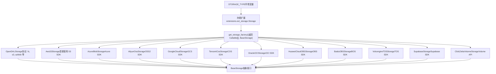
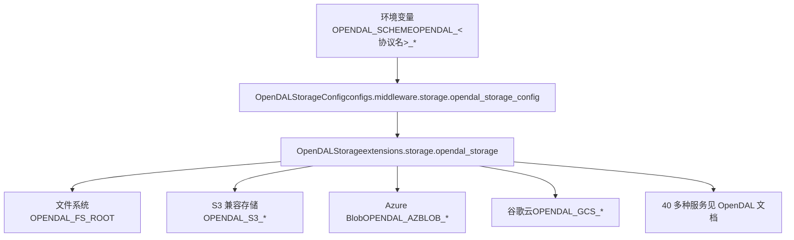
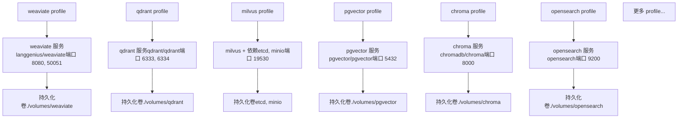
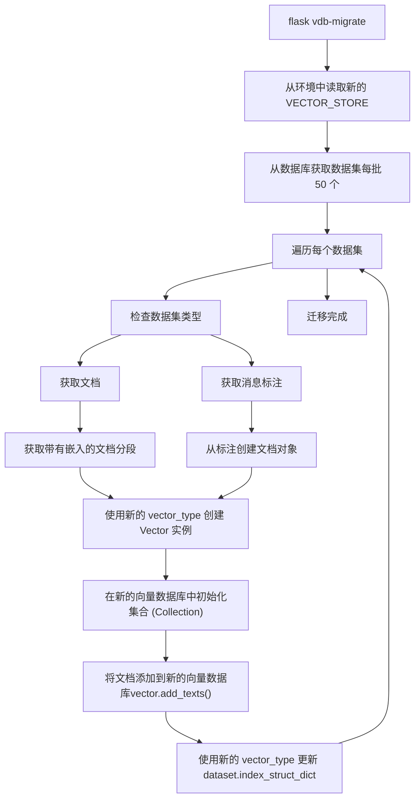
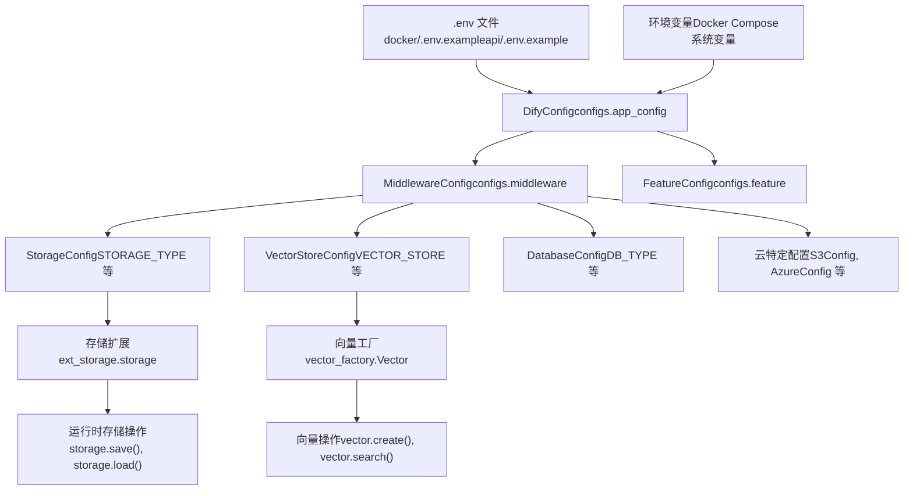

# 存储与向量数据库配置

相关源文件

-   [api/.env.example](https://github.com/langgenius/dify/blob/92dbc94f/api/.env.example)
-   [api/app.py](https://github.com/langgenius/dify/blob/92dbc94f/api/app.py)
-   [api/app\_factory.py](https://github.com/langgenius/dify/blob/92dbc94f/api/app_factory.py)
-   [api/commands.py](https://github.com/langgenius/dify/blob/92dbc94f/api/commands.py)
-   [api/configs/feature/\_\_init\_\_.py](https://github.com/langgenius/dify/blob/92dbc94f/api/configs/feature/__init__.py)
-   [api/configs/middleware/\_\_init\_\_.py](https://github.com/langgenius/dify/blob/92dbc94f/api/configs/middleware/__init__.py)
-   [api/configs/packaging/\_\_init\_\_.py](https://github.com/langgenius/dify/blob/92dbc94f/api/configs/packaging/__init__.py)
-   [api/controllers/console/datasets/datasets.py](https://github.com/langgenius/dify/blob/92dbc94f/api/controllers/console/datasets/datasets.py)
-   [api/core/rag/datasource/vdb/vector\_factory.py](https://github.com/langgenius/dify/blob/92dbc94f/api/core/rag/datasource/vdb/vector_factory.py)
-   [api/core/rag/datasource/vdb/vector\_type.py](https://github.com/langgenius/dify/blob/92dbc94f/api/core/rag/datasource/vdb/vector_type.py)
-   [api/extensions/ext\_storage.py](https://github.com/langgenius/dify/blob/92dbc94f/api/extensions/ext_storage.py)
-   [api/extensions/storage/storage\_type.py](https://github.com/langgenius/dify/blob/92dbc94f/api/extensions/storage/storage_type.py)
-   [api/pyproject.toml](https://github.com/langgenius/dify/blob/92dbc94f/api/pyproject.toml)
-   [api/tests/unit\_tests/configs/test\_dify\_config.py](https://github.com/langgenius/dify/blob/92dbc94f/api/tests/unit_tests/configs/test_dify_config.py)
-   [api/uv.lock](https://github.com/langgenius/dify/blob/92dbc94f/api/uv.lock)
-   [dev/pytest/pytest\_vdb.sh](https://github.com/langgenius/dify/blob/92dbc94f/dev/pytest/pytest_vdb.sh)
-   [docker/.env.example](https://github.com/langgenius/dify/blob/92dbc94f/docker/.env.example)
-   [docker/docker-compose-template.yaml](https://github.com/langgenius/dify/blob/92dbc94f/docker/docker-compose-template.yaml)
-   [docker/docker-compose.middleware.yaml](https://github.com/langgenius/dify/blob/92dbc94f/docker/docker-compose.middleware.yaml)
-   [docker/docker-compose.yaml](https://github.com/langgenius/dify/blob/92dbc94f/docker/docker-compose.yaml)
-   [docker/middleware.env.example](https://github.com/langgenius/dify/blob/92dbc94f/docker/middleware.env.example)
-   [web/package.json](https://github.com/langgenius/dify/blob/92dbc94f/web/package.json)

本文档介绍了 Dify 中存储后端和向量数据库的配置。存储后端负责处理文件上传、文档处理产物和插件包；而向量数据库则存储向量嵌入 (embeddings)，用于知识库系统中的语义搜索。有关 RAG 流水线的详细信息，请参阅 [知识库与 RAG 系统](/langgenius/dify/4-knowledge-base-and-rag-system)。有关部署基础设施的信息，请参阅 [Docker 构建过程](/langgenius/dify/3.1-docker-build-process-and-multi-architecture-images) 和 [环境配置](/langgenius/dify/3.2-environment-configuration-and-runtime-modes)。

---

## 存储架构

Dify 通过工厂模式支持多种存储后端，该模式抽象了底层的存储实现。所有存储操作都通过 `Storage` 扩展进行，该扩展根据 `STORAGE_TYPE` 环境变量初始化相应的后端。

### 存储后端工厂模式


**来源：** [api/extensions/ext\_storage.py15-84](https://github.com/langgenius/dify/blob/92dbc94f/api/extensions/ext_storage.py#L15-L84) [api/extensions/storage/storage\_type.py1-18](https://github.com/langgenius/dify/blob/92dbc94f/api/extensions/storage/storage_type.py#L1-L18)

### 受支持的存储后端

| 存储类型 | 配置前缀 | SDK/库 | 使用场景 |
| --- | --- | --- | --- |
| `opendal` (默认) | `OPENDAL_*` | Apache OpenDAL | 40 多种存储服务的统一接口 |
| `s3` | `S3_*` | boto3 | AWS S3 及兼容 S3 的服务 |
| `azure-blob` | `AZURE_BLOB_*` | azure-storage-blob | 微软 Azure Blob 存储 |
| `aliyun-oss` | `ALIYUN_OSS_*` | oss2 | 阿里云 OSS |
| `google-storage` | `GOOGLE_STORAGE_*` | google-cloud-storage | 谷歌云存储 (GCS) |
| `tencent-cos` | `TENCENT_COS_*` | cos-python-sdk-v5 | 腾讯云 COS |
| `oci-storage` | `OCI_*` | oci | 甲骨文云 (OCI) 基础设施 |
| `huawei-obs` | `HUAWEI_OBS_*` | esdk-obs-python | 华为云 OBS |
| `baidu-obs` | `BAIDU_OBS_*` | bce-python-sdk | 百度云 BOS |
| `volcengine-tos` | `VOLCENGINE_TOS_*` | tos | 火山引擎 TOS |
| `supabase` | `SUPABASE_*` | supabase-py | Supabase 存储 |
| `clickzetta-volume` | `CLICKZETTA_VOLUME_*` | Volume API | ClickZetta Volume 存储 |
| `local` (已弃用) | `STORAGE_LOCAL_PATH` | 文件系统 | 本地文件系统（请改用 `opendal` 配合 `fs` 协议） |

**来源：** [api/configs/middleware/\_\_init\_\_.py52-80](https://github.com/langgenius/dify/blob/92dbc94f/api/configs/middleware/__init__.py#L52-L80) [docker/.env.example406-529](https://github.com/langgenius/dify/blob/92dbc94f/docker/.env.example#L406-L529)

---

## OpenDAL 存储配置

推荐使用 OpenDAL 作为默认存储后端，因为它通过单一配置模式为 40 多种存储服务提供统一接口。这降低了代码复杂度，并简化了存储供应商之间的切换。

### OpenDAL 配置结构


**配置示例：**

```
# 使用本地文件系统存储（默认）
STORAGE_TYPE=opendal
OPENDAL_SCHEME=fs
OPENDAL_FS_ROOT=storage

# 通过 OpenDAL 使用兼容 S3 的存储
STORAGE_TYPE=opendal
OPENDAL_SCHEME=s3
OPENDAL_S3_ENDPOINT=https://s3.amazonaws.com
OPENDAL_S3_REGION=us-east-1
OPENDAL_S3_BUCKET=my-bucket
OPENDAL_S3_ACCESS_KEY_ID=your-key
OPENDAL_S3_SECRET_ACCESS_KEY=your-secret
```
`OpenDALStorage` 类会扫描以 `OPENDAL_<协议名>` 开头的环境变量，并将其自动应用于 OpenDAL 操作器。这允许通过环境变量传递任何 OpenDAL 服务配置，而无需更改代码。

**来源：** [docker/.env.example413-421](https://github.com/langgenius/dify/blob/92dbc94f/docker/.env.example#L413-L421) [api/configs/middleware/storage/opendal\_storage\_config.py1-50](https://github.com/langgenius/dify/blob/92dbc94f/api/configs/middleware/storage/opendal_storage_config.py#L1-L50)

---

## 云特定存储配置

虽然推荐使用 OpenDAL，但 Dify 仍为主要云供应商提供了直接的 SDK 集成，以支持额外的云特定功能。

### S3 存储配置

直接 S3 集成支持 AWS IAM 角色及其他 S3 特定功能：

```
STORAGE_TYPE=s3
S3_ENDPOINT=https://s3.amazonaws.com
S3_REGION=us-east-1
S3_BUCKET_NAME=difyai
S3_ACCESS_KEY=your-access-key
S3_SECRET_KEY=your-secret-key
# 使用 AWS 托管 IAM 角色而非访问密钥
S3_USE_AWS_MANAGED_IAM=false
```
### 归档存储 (兼容 S3)

为工作流运行日志和会话归档提供独立的兼容 S3 的存储：

```
ARCHIVE_STORAGE_ENABLED=false
ARCHIVE_STORAGE_ENDPOINT=
ARCHIVE_STORAGE_ARCHIVE_BUCKET=
ARCHIVE_STORAGE_EXPORT_BUCKET=
ARCHIVE_STORAGE_ACCESS_KEY=
ARCHIVE_STORAGE_SECRET_KEY=
ARCHIVE_STORAGE_REGION=auto
```
**来源：** [docker/.env.example441-459](https://github.com/langgenius/dify/blob/92dbc94f/docker/.env.example#L441-L459) [api/configs/middleware/storage/amazon\_s3\_storage\_config.py1-50](https://github.com/langgenius/dify/blob/92dbc94f/api/configs/middleware/storage/amazon_s3_storage_config.py#L1-L50)

### Azure Blob 存储

```
STORAGE_TYPE=azure-blob
AZURE_BLOB_ACCOUNT_NAME=difyai
AZURE_BLOB_ACCOUNT_KEY=difyai
AZURE_BLOB_CONTAINER_NAME=difyai-container
AZURE_BLOB_ACCOUNT_URL=https://<your_account_name>.blob.core.windows.net
```
**来源：** [docker/.env.example461-466](https://github.com/langgenius/dify/blob/92dbc94f/docker/.env.example#L461-L466) [api/configs/middleware/storage/azure\_blob\_storage\_config.py1-30](https://github.com/langgenius/dify/blob/92dbc94f/api/configs/middleware/storage/azure_blob_storage_config.py#L1-L30)

### 阿里云 OSS

```
STORAGE_TYPE=aliyun-oss
ALIYUN_OSS_BUCKET_NAME=your-bucket-name
ALIYUN_OSS_ACCESS_KEY=your-access-key
ALIYUN_OSS_SECRET_KEY=your-secret-key
ALIYUN_OSS_ENDPOINT=https://oss-ap-southeast-1-internal.aliyuncs.com
ALIYUN_OSS_REGION=ap-southeast-1
ALIYUN_OSS_AUTH_VERSION=v4
# 不要以 '/' 开头。OSS 不支持对象名称以斜杠开头。
ALIYUN_OSS_PATH=your-path
ALIYUN_CLOUDBOX_ID=your-cloudbox-id
```
**来源：** [docker/.env.example473-483](https://github.com/langgenius/dify/blob/92dbc94f/docker/.env.example#L473-L483) [api/configs/middleware/storage/aliyun\_oss\_storage\_config.py1-50](https://github.com/langgenius/dify/blob/92dbc94f/api/configs/middleware/storage/aliyun_oss_storage_config.py#L1-L50)

---

## 存储初始化流程

> **[Mermaid 序列图]**
> *(图表结构无法解析)*

存储扩展在 [api/app\_factory.py73-100](https://github.com/langgenius/dify/blob/92dbc94f/api/app_factory.py#L73-L100) 的 `initialize_extensions()` 函数中进行初始化。`Storage` 类创建了一个单例的 `storage_runner` 实例，可通过 `extensions.ext_storage.storage` 在整个应用中访问。

**来源：** [api/app\_factory.py73-100](https://github.com/langgenius/dify/blob/92dbc94f/api/app_factory.py#L73-L100) [api/extensions/ext\_storage.py15-84](https://github.com/langgenius/dify/blob/92dbc94f/api/extensions/ext_storage.py#L15-L84)

---

## 向量数据库架构

Dify 支持 20 多种向量数据库，用于存储文档嵌入，以实现语义搜索。向量数据库按数据集进行配置，并采用与存储后端类似的工厂模式。

### 向量数据库工厂模式

```mermaid
flowchart TD
    Dataset["Dataset 模型index_struct_dict['type']"]
    VectorConfig["VECTOR_STORE环境变量"]
    Vector["Vector 类core.rag.datasource.vdb.vector_factory.Vector"]
    Factory["get_vector_factory()返回 AbstractVectorFactory"]
    Weaviate["WeaviateVectorFactory默认"]
    Qdrant["QdrantVectorFactory"]
    Milvus["MilvusVectorFactory"]
    PGVector["PGVectorFactory"]
    PGVectoRS["PGVectoRSVectorFactory"]
    Chroma["ChromaVectorFactory"]
    OpenSearch["OpenSearchVectorFactory"]
    Elasticsearch["ElasticsearchVectorFactory"]
    AnalyticDB["AnalyticdbVectorFactory"]
    TiDB["TiDBVectorFactory"]
    MyScale["MyScaleVectorFactory"]
    Oracle["OracleVectorFactory"]
    Tencent["TencentVectorFactory"]
    Baidu["BaiduVectorFactory"]
    Couchbase["CouchbaseVectorFactory"]
    OceanBase["OceanBaseVectorFactory"]
    More["还有 17 种以上向量数据库..."]
    BaseVector["BaseVector抽象接口"]

    Dataset --> Vector
    VectorConfig --> Vector
    Vector --> Factory
    Factory --> Weaviate
    Factory --> Qdrant
    Factory --> Milvus
    Factory --> PGVector
    Factory --> PGVectoRS
    Factory --> Chroma
    Factory --> OpenSearch
    Factory --> Elasticsearch
    Factory --> AnalyticDB
    Factory --> TiDB
    Factory --> MyScale
    Factory --> Oracle
    Factory --> Tencent
    Factory --> Baidu
    Factory --> Couchbase
    Factory --> OceanBase
    Factory --> More
    Weaviate --> BaseVector
    Qdrant --> BaseVector
    Milvus --> BaseVector
    PGVector --> BaseVector
    PGVectoRS --> BaseVector
    Chroma --> BaseVector
    OpenSearch --> BaseVector
    Elasticsearch --> BaseVector
```


**来源：** [api/core/rag/datasource/vdb/vector\_factory.py38-158](https://github.com/langgenius/dify/blob/92dbc94f/api/core/rag/datasource/vdb/vector_factory.py#L38-L158) [api/core/rag/datasource/vdb/vector\_type.py1-37](https://github.com/langgenius/dify/blob/92dbc94f/api/core/rag/datasource/vdb/vector_type.py#L1-L37)

### 受支持的向量数据库

| 向量存储 | 配置前缀 | 特殊功能 |
| --- | --- | --- |
| `weaviate` | `WEAVIATE_*` | 默认, 支持 gRPC, 分词选项 |
| `qdrant` | `QDRANT_*` | 支持 gRPC, 复制因子 |
| `milvus` | `MILVUS_*` | 混合搜索, 分析器参数 |
| `pgvector` | `PGVECTOR_*` | PostgreSQL 扩展, 支持 pg\_bigm |
| `pgvecto-rs` | `PGVECTO_RS_*` | 基于 Rust 的 PostgreSQL 扩展 |
| `chroma` | `CHROMA_*` | 令牌认证, 多租户 |
| `opensearch` | `OPENSEARCH_*` | AWS 认证, SSL 验证 |
| `elasticsearch` | `ELASTICSEARCH_*` | 云服务支持, API Key 认证 |
| `analyticdb` | `ANALYTICDB_*` | 阿里云托管服务 |
| `tidb_vector` | `TIDB_VECTOR_*` | TiDB serverless 向量扩展 |
| `tidb_on_qdrant` | `TIDB_ON_QDRANT_*` | TiDB + Qdrant 混合模式 |
| `myscale` | `MYSCALE_*` | 全文搜索参数 |
| `oracle` | `ORACLE_*` | 自治数据库支持, Wallet 配置 |
| `tencent` | `TENCENT_VECTOR_DB_*` | 腾讯云托管, 混合搜索 |
| `baidu` | `BAIDU_VECTOR_DB_*` | 百度云托管, 倒排索引 |
| `couchbase` | `COUCHBASE_*` | 带有向量搜索的 NoSQL |
| `vikingdb` | `VIKINGDB_*` | 火山引擎托管 |
| `upstash` | `UPSTASH_VECTOR_*` | Serverless 向量数据库 |
| `oceanbase` | `OCEANBASE_*` | 混合搜索, 全文解析器选项 |
| `seekdb` | `SEEKDB_*` | OceanBase 精简版 |
| `opengauss` | `OPENGAUSS_*` | 支持乘积量化 (PQ) |
| `tablestore` | `TABLESTORE_*` | 阿里云表格存储 |
| `vastbase` | `VASTBASE_*` | 海量数据库 (VastBase) |
| `matrixone` | `MATRIXONE_*` | MatrixOne 数据库 |
| `clickzetta` | `CLICKZETTA_*` | 倒排索引, 分析器选项 |
| `alibabacloud_mysql` | `ALIBABACLOUD_MYSQL_*` | 带有向量能力的 RDS MySQL |
| `lindorm` | `LINDORM_*` | 阿里云 Lindorm |
| `huawei_cloud` | `HUAWEI_CLOUD_*` | 华为云搜索服务 |
| `relyt` | `RELYT_*` | 兼容 PostgreSQL |
| `iris` | `IRIS_*` | InterSystems IRIS, 支持文本索引 |

**来源：** [docker/.env.example532-686](https://github.com/langgenius/dify/blob/92dbc94f/docker/.env.example#L532-L686) [api/core/rag/datasource/vdb/vector\_type.py4-37](https://github.com/langgenius/dify/blob/92dbc94f/api/core/rag/datasource/vdb/vector_type.py#L4-L37)

---

## 向量数据库配置示例

### Weaviate (默认)

```
VECTOR_STORE=weaviate
VECTOR_INDEX_NAME_PREFIX=Vector_index
WEAVIATE_ENDPOINT=http://weaviate:8080
WEAVIATE_API_KEY=WVF5YThaHlkYwhGUSmCRgsX3tD5ngdN8pkih
WEAVIATE_GRPC_ENDPOINT=grpc://weaviate:50051
WEAVIATE_TOKENIZATION=word
```
Weaviate 是默认的向量数据库，同时支持 HTTP 和 gRPC 协议。`WEAVIATE_TOKENIZATION` 选项控制索引时的文本分词方式。

**来源：** [docker/.env.example541-545](https://github.com/langgenius/dify/blob/92dbc94f/docker/.env.example#L541-L545) [api/configs/middleware/vdb/weaviate\_config.py1-50](https://github.com/langgenius/dify/blob/92dbc94f/api/configs/middleware/vdb/weaviate_config.py#L1-L50)

### Qdrant

```
VECTOR_STORE=qdrant
QDRANT_URL=http://qdrant:6333
QDRANT_API_KEY=difyai123456
QDRANT_CLIENT_TIMEOUT=20
QDRANT_GRPC_ENABLED=false
QDRANT_GRPC_PORT=6334
QDRANT_REPLICATION_FACTOR=1
```
**来源：** [docker/.env.example564-570](https://github.com/langgenius/dify/blob/92dbc94f/docker/.env.example#L564-L570) [api/configs/middleware/vdb/qdrant\_config.py1-50](https://github.com/langgenius/dify/blob/92dbc94f/api/configs/middleware/vdb/qdrant_config.py#L1-L50)

### Milvus

```
VECTOR_STORE=milvus
MILVUS_URI=http://host.docker.internal:19530
MILVUS_DATABASE=
MILVUS_TOKEN=
MILVUS_USER=
MILVUS_PASSWORD=
MILVUS_ENABLE_HYBRID_SEARCH=False
MILVUS_ANALYZER_PARAMS=
```
Milvus 支持结合向量和标量过滤的混合搜索。`MILVUS_ANALYZER_PARAMS` 允许自定义文本分析配置。

**来源：** [docker/.env.example572-580](https://github.com/langgenius/dify/blob/92dbc94f/docker/.env.example#L572-L580) [api/configs/middleware/vdb/milvus\_config.py1-50](https://github.com/langgenius/dify/blob/92dbc94f/api/configs/middleware/vdb/milvus_config.py#L1-L50)

### PGVector

```
VECTOR_STORE=pgvector
PGVECTOR_HOST=pgvector
PGVECTOR_PORT=5432
PGVECTOR_USER=postgres
PGVECTOR_PASSWORD=difyai123456
PGVECTOR_DATABASE=dify
PGVECTOR_MIN_CONNECTION=1
PGVECTOR_MAX_CONNECTION=5
# 启用 pg_bigm 扩展以优化中日文搜索
PGVECTOR_PG_BIGM=false
PGVECTOR_PG_BIGM_VERSION=1.2-20240606
```
**来源：** [docker/.env.example600-609](https://github.com/langgenius/dify/blob/92dbc94f/docker/.env.example#L600-L609) [api/configs/middleware/vdb/pgvector\_config.py1-50](https://github.com/langgenius/dify/blob/92dbc94f/api/configs/middleware/vdb/pgvector_config.py#L1-L50)

### OceanBase (混合搜索)

```
VECTOR_STORE=oceanbase
OCEANBASE_VECTOR_HOST=oceanbase
OCEANBASE_VECTOR_PORT=2881
OCEANBASE_VECTOR_USER=root@test
OCEANBASE_VECTOR_PASSWORD=difyai123456
OCEANBASE_VECTOR_DATABASE=test
OCEANBASE_CLUSTER_NAME=difyai
OCEANBASE_MEMORY_LIMIT=6G
OCEANBASE_ENABLE_HYBRID_SEARCH=false
# 内置解析器：ngram, beng, space, ngram2, ik
# 外部解析器（需要插件）：japanese_ftparser, thai_ftparser
OCEANBASE_FULLTEXT_PARSER=ik
```
OceanBase 可以同时作为元数据库 (`DB_TYPE=oceanbase`) 和向量数据库 (`VECTOR_STORE=oceanbase`) 使用。

**来源：** [docker/.env.example547-562](https://github.com/langgenius/dify/blob/92dbc94f/docker/.env.example#L547-L562) [api/configs/middleware/vdb/oceanbase\_config.py1-50](https://github.com/langgenius/dify/blob/92dbc94f/api/configs/middleware/vdb/oceanbase_config.py#L1-L50)

---

## Docker Compose 向量数据库服务

向量数据库在 Docker Compose 配置中通过 Profile 机制作为可选服务引入。这允许仅启用所需的向量数据库，而无需启动所有服务。

### 向量数据库服务拓扑


**启用向量数据库：**

```
# 启动默认的 Weaviate
docker compose --profile weaviate up -d

# 启动 Qdrant
docker compose --profile qdrant up -d

# 启动 Milvus（包含 etcd 和 minio 依赖项）
docker compose --profile milvus up -d

# 启动 PGVector
docker compose --profile pgvector up -d
```
**来源：** [docker/docker-compose-template.yaml1-900](https://github.com/langgenius/dify/blob/92dbc94f/docker/docker-compose-template.yaml#L1-L900) [docker/docker-compose.middleware.yaml1-400](https://github.com/langgenius/dify/blob/92dbc94f/docker/docker-compose.middleware.yaml#L1-L400)

---

## 向量数据库初始化与迁移

### 向量初始化流程

> **[Mermaid 序列图]**
> *(图表结构无法解析)*

位于 [api/core/rag/datasource/vdb/vector\_factory.py38-66](https://github.com/langgenius/dify/blob/92dbc94f/api/core/rag/datasource/vdb/vector_factory.py#L38-L66) 的 `Vector` 类负责向量数据库的初始化。它首先尝试从数据集的 `index_struct_dict` 中读取向量类型；如果不可用，则使用全局的 `VECTOR_STORE` 配置。

**来源：** [api/core/rag/datasource/vdb/vector\_factory.py38-158](https://github.com/langgenius/dify/blob/92dbc94f/api/core/rag/datasource/vdb/vector_factory.py#L38-L158)

### 向量数据库迁移命令

`vdb-migrate` 命令可将现有数据集迁移到不同的向量数据库：

```
# 迁移所有数据集（知识库 + 标注）
flask vdb-migrate --scope all

# 仅迁移知识库数据集
flask vdb-migrate --scope knowledge

# 仅迁移标注数据集
flask vdb-migrate --scope annotation
```
**迁移过程：**


迁移命令在 [api/commands.py170-287](https://github.com/langgenius/dify/blob/92dbc94f/api/commands.py#L170-L287) 中实现，分别处理知识库数据集和标注数据集。

**来源：** [api/commands.py170-287](https://github.com/langgenius/dify/blob/92dbc94f/api/commands.py#L170-L287)

---

## 配置层级

### 配置加载顺序


配置通过 Pydantic Settings 加载，且环境变量具有最高优先级。层级如下：

1.  **基础配置**: [api/configs/app\_config.py1-100](https://github.com/langgenius/dify/blob/92dbc94f/api/configs/app_config.py#L1-L100) 中的 `DifyConfig`。
2.  **中间件配置**: [api/configs/middleware/\_\_init\_\_.py1-200](https://github.com/langgenius/dify/blob/92dbc94f/api/configs/middleware/__init__.py#L1-L200) 中的存储、向量数据库、数据库配置。
3.  **功能配置**: [api/configs/feature/\_\_init\_\_.py1-400](https://github.com/langgenius/dify/blob/92dbc94f/api/configs/feature/__init__.py#L1-L400) 中的安全、应用执行、插件配置。
4.  **运行时初始化**: 在 [api/app\_factory.py73-100](https://github.com/langgenius/dify/blob/92dbc94f/api/app_factory.py#L73-L100) 中初始化的扩展。

**来源：** [api/configs/app\_config.py1-50](https://github.com/langgenius/dify/blob/92dbc94f/api/configs/app_config.py#L1-L50) [api/configs/middleware/\_\_init\_\_.py1-200](https://github.com/langgenius/dify/blob/92dbc94f/api/configs/middleware/__init__.py#L1-L200) [api/app\_factory.py73-100](https://github.com/langgenius/dify/blob/92dbc94f/api/app_factory.py#L73-L100)

---

## 测试向量数据库

向量数据库集成测试位于 [api/tests/integration\_tests/vdb/](https://github.com/langgenius/dify/blob/92dbc94f/api/tests/integration_tests/vdb/)，每个受支持的数据库都配有测试容器：

```
# 运行所有向量数据库集成测试
./dev/pytest/pytest_vdb.sh

# 测试特定向量数据库
pytest api/tests/integration_tests/vdb/weaviate
pytest api/tests/integration_tests/vdb/qdrant
pytest api/tests/integration_tests/vdb/pgvector
```
测试脚本 [dev/pytest/pytest\_vdb.sh1-24](https://github.com/langgenius/dify/blob/92dbc94f/dev/pytest/pytest_vdb.sh#L1-L24) 涵盖了 Chroma, Milvus, PGVector, Qdrant, Weaviate, Elasticsearch, VikingDB, Baidu, TcVectorDB, Upstash, Couchbase, OceanBase, TiDB Vector 和华为云等多个向量数据库。

**来源：** [dev/pytest/pytest\_vdb.sh1-24](https://github.com/langgenius/dify/blob/92dbc94f/dev/pytest/pytest_vdb.sh#L1-L24) [api/tests/integration\_tests/vdb/](https://github.com/langgenius/dify/blob/92dbc94f/api/tests/integration_tests/vdb/)

---

## 存储与向量数据库配置参考

### 环境变量摘要

| 类别 | 变量名 | 默认值 | 描述 |
| --- | --- | --- | --- |
| **存储** | `STORAGE_TYPE` | `opendal` | 存储后端类型 |
|  | `OPENDAL_SCHEME` | `fs` | OpenDAL 服务协议 |
|  | `OPENDAL_FS_ROOT` | `storage` | 文件系统根目录 |
|  | `S3_BUCKET_NAME` | `difyai` | S3 存储桶名称 |
|  | `AZURE_BLOB_CONTAINER_NAME` | `difyai-container` | Azure 容器名称 |
| **向量数据库** | `VECTOR_STORE` | `weaviate` | 向量数据库类型 |
|  | `VECTOR_INDEX_NAME_PREFIX` | `Vector_index` | 集合名称前缀 |
|  | `WEAVIATE_ENDPOINT` | `http://weaviate:8080` | Weaviate HTTP 端点 |
|  | `QDRANT_URL` | `http://qdrant:6333` | Qdrant HTTP 端点 |
|  | `PGVECTOR_HOST` | `pgvector` | PGVector 数据库主机 |
| **归档** | `ARCHIVE_STORAGE_ENABLED` | `false` | 启用归档存储 |
|  | `ARCHIVE_STORAGE_ARCHIVE_BUCKET` | \- | 归档存储桶名称 |

**来源：** [docker/.env.example406-686](https://github.com/langgenius/dify/blob/92dbc94f/docker/.env.example#L406-L686) [api/.env.example87-374](https://github.com/langgenius/dify/blob/92dbc94f/api/.env.example#L87-L374)

---

## 插件存储配置

插件可以使用与主应用独立的存储配置：

```
PLUGIN_STORAGE_TYPE=local  # 或 s3, azure, aliyun, tencent, volcengine
PLUGIN_STORAGE_LOCAL_ROOT=/app/storage
PLUGIN_INSTALLED_PATH=plugin
PLUGIN_PACKAGE_CACHE_PATH=plugin_packages
PLUGIN_MEDIA_CACHE_PATH=assets

# 插件的 S3 配置
PLUGIN_S3_ENDPOINT=
PLUGIN_S3_USE_AWS_MANAGED_IAM=false
PLUGIN_AWS_ACCESS_KEY=
PLUGIN_AWS_SECRET_KEY=
PLUGIN_AWS_REGION=

# 插件的 Azure 配置
PLUGIN_AZURE_BLOB_STORAGE_CONNECTION_STRING=
PLUGIN_AZURE_BLOB_STORAGE_CONTAINER_NAME=

# 其他云供应商配置...
```
插件存储由插件守护进程 (plugin daemon) 服务管理，可独立于主应用存储进行配置，以支持不同的部署架构。

**来源：** [docker/.env.example610-638](https://github.com/langgenius/dify/blob/92dbc94f/docker/.env.example#L610-L638) [docker/docker-compose-template.yaml292-321](https://github.com/langgenius/dify/blob/92dbc94f/docker/docker-compose-template.yaml#L292-L321)