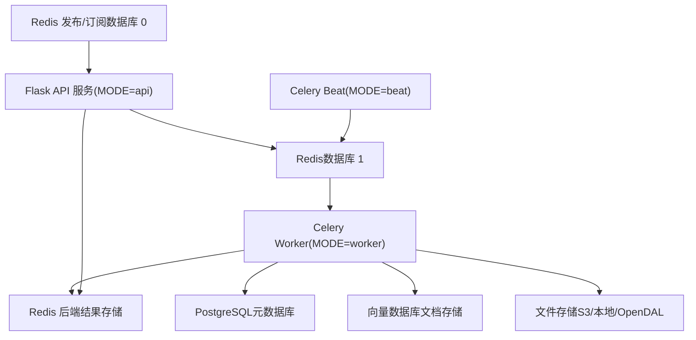
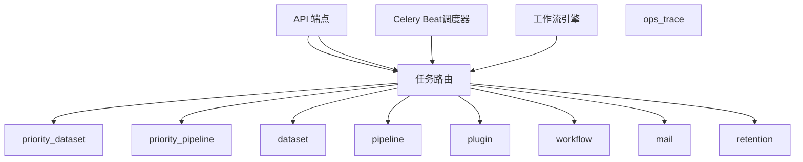
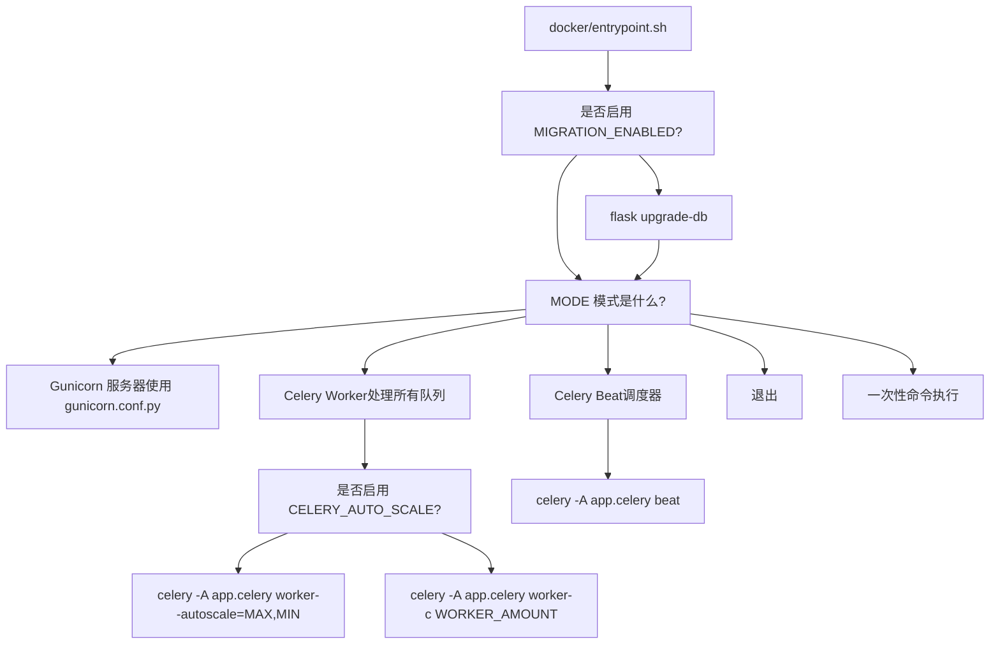
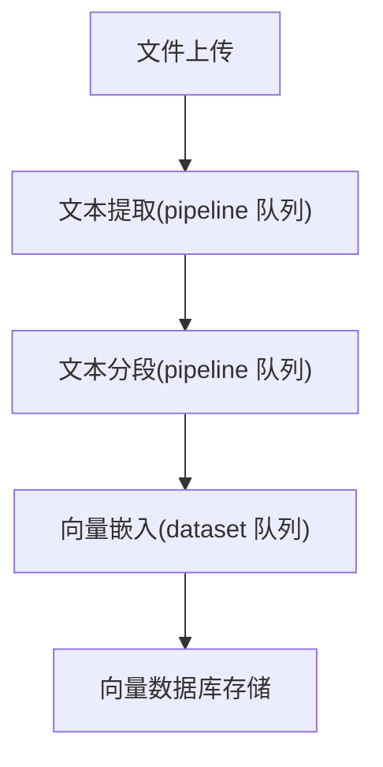
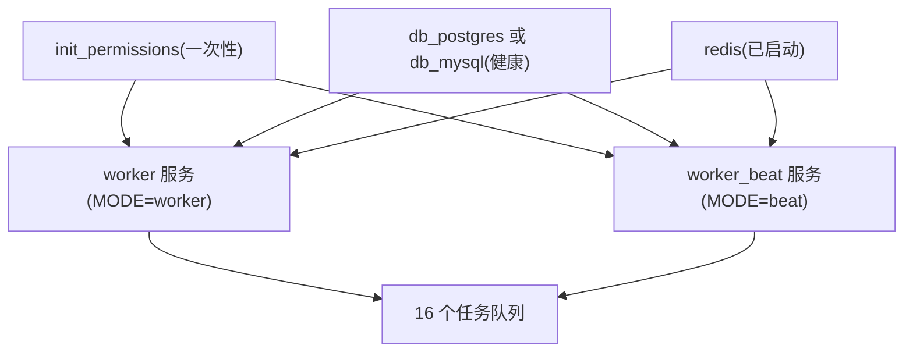

# 使用 Celery 进行异步任务处理

相关源文件

-   [api/.env.example](https://github.com/langgenius/dify/blob/92dbc94f/api/.env.example)
-   [api/app.py](https://github.com/langgenius/dify/blob/92dbc94f/api/app.py)
-   [api/app_factory.py](https://github.com/langgenius/dify/blob/92dbc94f/api/app_factory.py)
-   [api/commands.py](https://github.com/langgenius/dify/blob/92dbc94f/api/commands.py)
-   [api/configs/feature/__init__.py](https://github.com/langgenius/dify/blob/92dbc94f/api/configs/feature/__init__.py)
-   [api/configs/middleware/__init__.py](https://github.com/langgenius/dify/blob/92dbc94f/api/configs/middleware/__init__.py)
-   [api/configs/packaging/__init__.py](https://github.com/langgenius/dify/blob/92dbc94f/api/configs/packaging/__init__.py)
-   [api/controllers/console/datasets/datasets.py](https://github.com/langgenius/dify/blob/92dbc94f/api/controllers/console/datasets/datasets.py)
-   [api/core/rag/datasource/vdb/vector_factory.py](https://github.com/langgenius/dify/blob/92dbc94f/api/core/rag/datasource/vdb/vector_factory.py)
-   [api/core/rag/datasource/vdb/vector_type.py](https://github.com/langgenius/dify/blob/92dbc94f/api/core/rag/datasource/vdb/vector_type.py)
-   [api/extensions/ext_storage.py](https://github.com/langgenius/dify/blob/92dbc94f/api/extensions/ext_storage.py)
-   [api/extensions/storage/storage_type.py](https://github.com/langgenius/dify/blob/92dbc94f/api/extensions/storage/storage_type.py)
-   [api/models/account.py](https://github.com/langgenius/dify/blob/92dbc94f/api/models/account.py)
-   [api/models/api_based_extension.py](https://github.com/langgenius/dify/blob/92dbc94f/api/models/api_based_extension.py)
-   [api/models/dataset.py](https://github.com/langgenius/dify/blob/92dbc94f/api/models/dataset.py)
-   [api/models/model.py](https://github.com/langgenius/dify/blob/92dbc94f/api/models/model.py)
-   [api/models/oauth.py](https://github.com/langgenius/dify/blob/92dbc94f/api/models/oauth.py)
-   [api/models/provider.py](https://github.com/langgenius/dify/blob/92dbc94f/api/models/provider.py)
-   [api/models/source.py](https://github.com/langgenius/dify/blob/92dbc94f/api/models/source.py)
-   [api/models/task.py](https://github.com/langgenius/dify/blob/92dbc94f/api/models/task.py)
-   [api/models/tools.py](https://github.com/langgenius/dify/blob/92dbc94f/api/models/tools.py)
-   [api/models/trigger.py](https://github.com/langgenius/dify/blob/92dbc94f/api/models/trigger.py)
-   [api/models/web.py](https://github.com/langgenius/dify/blob/92dbc94f/api/models/web.py)
-   [api/models/workflow.py](https://github.com/langgenius/dify/blob/92dbc94f/api/models/workflow.py)
-   [api/pyproject.toml](https://github.com/langgenius/dify/blob/92dbc94f/api/pyproject.toml)
-   [api/tests/test_containers_integration_tests/services/test_advanced_prompt_template_service.py](https://github.com/langgenius/dify/blob/92dbc94f/api/tests/test_containers_integration_tests/services/test_advanced_prompt_template_service.py)
-   [api/tests/test_containers_integration_tests/services/test_agent_service.py](https://github.com/langgenius/dify/blob/92dbc94f/api/tests/test_containers_integration_tests/services/test_agent_service.py)
-   [api/tests/test_containers_integration_tests/tasks/__init__.py](https://github.com/langgenius/dify/blob/92dbc94f/api/tests/test_containers_integration_tests/tasks/__init__.py)
-   [api/tests/test_containers_integration_tests/tasks/test_add_document_to_index_task.py](https://github.com/langgenius/dify/blob/92dbc94f/api/tests/test_containers_integration_tests/tasks/test_add_document_to_index_task.py)
-   [api/tests/unit_tests/configs/test_dify_config.py](https://github.com/langgenius/dify/blob/92dbc94f/api/tests/unit_tests/configs/test_dify_config.py)
-   [api/tests/unit_tests/core/test_provider_manager.py](https://github.com/langgenius/dify/blob/92dbc94f/api/tests/unit_tests/core/test_provider_manager.py)
-   [api/uv.lock](https://github.com/langgenius/dify/blob/92dbc94f/api/uv.lock)
-   [dev/pytest/pytest_vdb.sh](https://github.com/langgenius/dify/blob/92dbc94f/dev/pytest/pytest_vdb.sh)
-   [docker/.env.example](https://github.com/langgenius/dify/blob/92dbc94f/docker/.env.example)
-   [docker/docker-compose-template.yaml](https://github.com/langgenius/dify/blob/92dbc94f/docker/docker-compose-template.yaml)
-   [docker/docker-compose.middleware.yaml](https://github.com/langgenius/dify/blob/92dbc94f/docker/docker-compose.middleware.yaml)
-   [docker/docker-compose.yaml](https://github.com/langgenius/dify/blob/92dbc94f/docker/docker-compose.yaml)
-   [docker/middleware.env.example](https://github.com/langgenius/dify/blob/92dbc94f/docker/middleware.env.example)
-   [web/package.json](https://github.com/langgenius/dify/blob/92dbc94f/web/package.json)

## 目的与范围

本页面详细介绍了 Dify 基于 Celery 的异步任务处理系统，涵盖了 Worker 配置、队列管理、任务路由以及运行模式。Celery 负责处理包括知识库索引、文档处理、工作流执行以及定时任务在内的所有后台作业。

有关 API 服务配置，请参阅 [环境配置与运行时模式](/langgenius/dify/3.2-environment-configuration-and-runtime-modes)。有关任务所使用的存储配置，请参阅 [存储与向量数据库配置](/langgenius/dify/3.3-storage-and-vector-database-configuration)。

**来源：** [api/README.md84-94](https://github.com/langgenius/dify/blob/92dbc94f/api/README.md#L84-L94) [docker/docker-compose-template.yaml63-131](https://github.com/langgenius/dify/blob/92dbc94f/docker/docker-compose-template.yaml#L63-L131)

---

## 系统架构概览

### Celery 组件拓扑


**Celery 组件：**

-   **Broker (代理):** Redis 数据库 1 (`CELERY_BROKER_URL`) 负责处理任务队列和消息路由。
-   **Backend (后端):** Redis 存储任务结果和状态信息 (`CELERY_BACKEND`)。
-   **Workers:** 负责跨多个队列执行任务，具有可配置的并发性。
-   **Beat:** 周期性任务调度器（类似于 cron 的调度）。

**来源：** [docker/docker-compose.yaml100-101](https://github.com/langgenius/dify/blob/92dbc94f/docker/docker-compose.yaml#L100-L101) [docker/.env.example370-384](https://github.com/langgenius/dify/blob/92dbc94f/docker/.env.example#L370-L384) [api/.env.example72-74](https://github.com/langgenius/dify/blob/92dbc94f/api/.env.example#L72-L74)

---

## 队列结构与任务路由

### 任务队列

Dify 使用 16 个专门的队列按优先级和功能组织工作：

| 队列名称 | 用途 | 优先级 |
| --- | --- | --- |
| `priority_dataset` | 高优先级知识库操作 | 高 |
| `priority_pipeline` | 高优先级流水线处理 | 高 |
| `dataset` | 标准知识库索引和更新 | 普通 |
| `pipeline` | 文档处理流水线 | 普通 |
| `mail` | 邮件通知 | 普通 |
| `ops_trace` | 运行追踪与指标 | 普通 |
| `app_deletion` | 应用清理任务 | 普通 |
| `plugin` | 插件安装与执行 | 普通 |
| `workflow_storage` | 工作流执行日志存储 | 普通 |
| `conversation` | 会话处理 | 普通 |
| `workflow` | 工作流执行任务 | 普通 |
| `schedule_poller` | 定时工作流轮询 | 普通 |
| `schedule_executor` | 定时工作流执行 | 普通 |
| `triggered_workflow_dispatcher` | 触发式工作流分发 | 普通 |
| `trigger_refresh_executor` | 工作流触发器刷新 | 普通 |
| `retention` | 数据保留与清理 | 低 |

**队列声明：** 除非另有特定配置，否则 Worker 会消费所有队列的任务。队列列表在 Worker 启动时指定。

**来源：** [api/README.md87](https://github.com/langgenius/dify/blob/92dbc94f/api/README.md#L87-L87) [.devcontainer/post_create_command.sh10](https://github.com/langgenius/dify/blob/92dbc94f/.devcontainer/post_create_command.sh#L10-L10)

### 任务路由流程


**来源：** [api/README.md87](https://github.com/langgenius/dify/blob/92dbc94f/api/README.md#L87-L87)

---

## Worker 配置

### 环境变量

**Worker 扩缩容：**

```
# 固定 worker 数量
CELERY_WORKER_AMOUNT=         # worker 进程数（默认基于 CPU 核心数）

# 自动扩缩容模式
CELERY_AUTO_SCALE=false       # 启用动态 worker 扩缩容
CELERY_MAX_WORKERS=           # 自动扩缩容时的最大 worker 数
CELERY_MIN_WORKERS=           # 自动扩缩容时的最小 worker 数
```
**Worker 类：**

```
CELERY_WORKER_CLASS=          # Worker 类: gevent, threads, prefork
                              # 默认: 为空 (生产环境使用 gevent)
```
**并发性：**

```
SERVER_WORKER_CONNECTIONS=10  # 每个 gevent worker 进程的连接数
```
**来源：** [docker/.env.example184-210](https://github.com/langgenius/dify/blob/92dbc94f/docker/.env.example#L184-L210) [docker/docker-compose.yaml45-50](https://github.com/langgenius/dify/blob/92dbc94f/docker/docker-compose.yaml#L45-L50)

### Worker 池类型

Dify 支持三种 Worker 池类型：

1.  **Gevent (生产环境默认):**

    -   使用 Greenlet (协程) 实现异步 I/O。
    -   适用于 I/O 密集型任务（API 调用、数据库查询）。
    -   通过 `SERVER_WORKER_CLASS=gevent` 配置。
    -   在 Docker 部署中自动使用。
2.  **Threads (线程):**

    -   使用 Python 线程实现并发执行。
    -   更适合 CPU 密集型任务。
    -   使用 `-P threads` 标志指定。
    -   推荐用于本地开发。
3.  **Prefork (多进程):**

    -   使用独立的操作系统进程实现多进程。
    -   具有最高的隔离性，但内存占用较高。
    -   使用 `-P prefork` 指定。

**来源：** [docker/.env.example158-178](https://github.com/langgenius/dify/blob/92dbc94f/docker/.env.example#L158-L178) [api/README.md87](https://github.com/langgenius/dify/blob/92dbc94f/api/README.md#L87-L87)

### Worker 启动模式

`entrypoint.sh` 脚本支持多种运行模式：


**Worker 模式命令 (禁用自动扩缩容):**

```
celery -A app.celery worker \
  -P ${CELERY_WORKER_CLASS:-gevent} \
  -c ${CELERY_WORKER_AMOUNT:-1} \
  -l INFO \
  -Q dataset,priority_dataset,priority_pipeline,pipeline,mail,ops_trace,app_deletion,plugin,workflow_storage,conversation,workflow,schedule_poller,schedule_executor,triggered_workflow_dispatcher,trigger_refresh_executor,retention
```
**Worker 模式命令 (启用自动扩缩容):**

```
celery -A app.celery worker \
  -P ${CELERY_WORKER_CLASS:-gevent} \
  --autoscale=${CELERY_MAX_WORKERS},${CELERY_MIN_WORKERS} \
  -l INFO \
  -Q [所有队列...]
```
**来源：** [docker/entrypoint.sh20-52](https://github.com/langgenius/dify/blob/92dbc94f/docker/entrypoint.sh#L20-L52) [docker/entrypoint.sh54-58](https://github.com/langgenius/dify/blob/92dbc94f/docker/entrypoint.sh#L54-L58)

---

## Celery Beat 调度器

### 目的

Celery Beat 是一个调度器，它按定义的时间间隔触发周期性任务。它作为一个独立的服务运行，并根据调度定义将任务排入 Worker 队列。

### 配置

```
# Beat 调度器时间（检查调度的间隔秒数）
CELERY_BEAT_SCHEDULER_TIME=1

# 工作流调度轮询
WORKFLOW_SCHEDULE_POLLER_INTERVAL=1        # 轮询间隔（分钟）
WORKFLOW_SCHEDULE_POLLER_BATCH_SIZE=100    # 每次轮询的最大工作流数
WORKFLOW_SCHEDULE_MAX_DISPATCH_PER_TICK=0  # 每个滴答周期的最大分发数 (0=不限制)
```
**来源：** [api/.env.example577-594](https://github.com/langgenius/dify/blob/92dbc94f/api/.env.example#L577-L594)

### 周期性任务

| 任务 | 队列 | 默认状态 | 目的 |
| --- | --- | --- | --- |
| `clean_embedding_cache_task` | `ops_trace` | 已禁用 | 清理过期的向量嵌入缓存 |
| `clean_unused_datasets_task` | `dataset` | 已禁用 | 移除未使用的知识库 |
| `create_tidb_serverless_task` | `dataset` | 已禁用 | TiDB 实例开通 |
| `update_tidb_serverless_status_task` | `dataset` | 已禁用 | TiDB 状态更新 |
| `clean_messages` | `conversation` | 已禁用 | 消息保留期限清理 |
| `mail_clean_document_notify_task` | `mail` | 已禁用 | 文档清理通知 |
| `datasets_queue_monitor` | `ops_trace` | 已禁用 | 监控知识库队列深度 |
| `check_upgradable_plugin_task` | `plugin` | 已启用 | 检查插件更新 |
| `workflow_schedule_poller_task` | `schedule_poller` | 已启用 | 轮询已调度的工作流 |

**启用/禁用配置：**

```
ENABLE_CLEAN_EMBEDDING_CACHE_TASK=false
ENABLE_CLEAN_UNUSED_DATASETS_TASK=false
ENABLE_CREATE_TIDB_SERVERLESS_TASK=false
ENABLE_UPDATE_TIDB_SERVERLESS_STATUS_TASK=false
ENABLE_CLEAN_MESSAGES=false
ENABLE_MAIL_CLEAN_DOCUMENT_NOTIFY_TASK=false
ENABLE_DATASETS_QUEUE_MONITOR=false
ENABLE_CHECK_UPGRADABLE_PLUGIN_TASK=true
ENABLE_WORKFLOW_SCHEDULE_POLLER_TASK=true
```
**来源：** [api/.env.example580-594](https://github.com/langgenius/dify/blob/92dbc94f/api/.env.example#L580-L594)

### Beat 服务部署

```
# Docker Compose Beat 服务
worker_beat:
  image: langgenius/dify-api:1.11.2
  restart: always
  environment:
    MODE: beat
    # 与 API 和 Worker 共享的环境变量
  depends_on:
    - db_postgres (或 db_mysql)
    - redis
```
**来源：** [docker/docker-compose-template.yaml102-131](https://github.com/langgenius/dify/blob/92dbc94f/docker/docker-compose-template.yaml#L102-L131)

---

## Broker (代理) 与 Backend (后端) 配置

### Redis Broker 配置

**连接字符串格式：**

```
redis://[用户名]:[密码]@[主机]:[端口]/[数据库]
```
**标准配置：**

```
CELERY_BROKER_URL=redis://:difyai123456@redis:6379/1
CELERY_BACKEND=redis
BROKER_USE_SSL=false
```
**配合 Redis Sentinel 实现高可用：**

```
CELERY_USE_SENTINEL=true
CELERY_SENTINEL_MASTER_NAME=mymaster
CELERY_SENTINEL_PASSWORD=sentinelpass
CELERY_SENTINEL_SOCKET_TIMEOUT=0.1

# Sentinel 模式下的 Broker URL 格式：
# sentinel://[:密码@]主机1:端口1[;sentinel://[:密码@]主机2:端口2;...]
CELERY_BROKER_URL=sentinel://:password@sentinel1:26379/1;sentinel://:password@sentinel2:26379/1
```
**来源：** [docker/.env.example370-384](https://github.com/langgenius/dify/blob/92dbc94f/docker/.env.example#L370-L384) [api/.env.example72-74](https://github.com/langgenius/dify/blob/92dbc94f/api/.env.example#L72-L74)

### 连接池

Redis 连接池由 Celery 客户端管理，并通过 SQLAlchemy 池设置进行配置，这些设置同样适用于 Redis 连接：

```
SQLALCHEMY_POOL_SIZE=30              # 基础连接池大小
SQLALCHEMY_MAX_OVERFLOW=10           # 允许的最大溢出连接数
SQLALCHEMY_POOL_RECYCLE=3600         # 连接回收时间（秒）
SQLALCHEMY_POOL_TIMEOUT=30           # 获取连接的超时时间
```
**来源：** [docker/.env.example243-258](https://github.com/langgenius/dify/blob/92dbc94f/docker/.env.example#L243-L258)

---

## 任务类型与使用场景

### 知识库索引任务

**队列：** `dataset`, `priority_dataset`

**主要任务：**

-   `IndexingRunner.run()` - 处理文档并创建向量嵌入。
-   `DatasetService.update_dataset_index()` - 更新现有的知识库索引。
-   `DocumentService.batch_add_segments()` - 批量添加文档分段。
-   `clean_unused_datasets_task()` - 定期清理未使用的知识库。

**优先级路由：** 紧急的知识库操作（由用户触发的行为）使用 `priority_dataset` 队列；后台更新则使用标准的 `dataset` 队列。

**来源：** [api/controllers/console/datasets/datasets.py](https://github.com/langgenius/dify/blob/92dbc94f/api/controllers/console/datasets/datasets.py)

### 流水线处理任务

**队列：** `pipeline`, `priority_pipeline`

**主要任务：**

-   文档内容提取 (PDF, DOCX, TXT 等)。
-   文本清洗与分段。
-   元数据提取。
-   格式转换。

**流水线流程：**


**来源：** [api/controllers/console/datasets/datasets.py](https://github.com/langgenius/dify/blob/92dbc94f/api/controllers/console/datasets/datasets.py)

### 工作流执行任务

**队列：** `workflow`, `workflow_storage`, `schedule_poller`, `schedule_executor`, `triggered_workflow_dispatcher`

**工作流任务类型：**

-   `workflow` - 执行工作流图。
-   `workflow_storage` - 将执行日志持久化到对象存储。
-   `schedule_poller` - 轮询数据库中已调度的工作流。
-   `schedule_executor` - 执行已调度的运行任务。
-   `triggered_workflow_dispatcher` - 分发 Webhook 触发的工作流。

**来源：** [api/.env.example577-594](https://github.com/langgenius/dify/blob/92dbc94f/api/.env.example#L577-L594)

### 插件与工具任务

**队列：** `plugin`

**主要任务：**

-   插件安装与包提取。
-   插件运行时初始化。
-   插件内的工具调用。
-   插件包验证。

**来源：** [docker/docker-compose-template.yaml77](https://github.com/langgenius/dify/blob/92dbc94f/docker/docker-compose-template.yaml#L77-L77)

### 运行保障任务

**队列：** `mail`, `ops_trace`, `retention`

**任务示例：**

-   `mail` - 发送邮件通知（密码重置、知识库处理完成）。
-   `ops_trace` - 记录运行指标和追踪。
-   `retention` - 清理旧日志、过期令牌和临时文件。
-   `app_deletion` - 删除应用并执行级联清理。

**来源：** [api/.env.example580-594](https://github.com/langgenius/dify/blob/92dbc94f/api/.env.example#L580-L594)

---

## 本地开发设置

### 在本地运行 Worker

**启动 Worker：**

```
cd api
uv run celery -A app.celery worker \
  -P threads \
  -c 2 \
  --loglevel INFO \
  -Q dataset,priority_dataset,priority_pipeline,pipeline,mail,ops_trace,app_deletion,plugin,workflow_storage,conversation,workflow,schedule_poller,schedule_executor,triggered_workflow_dispatcher,trigger_refresh_executor,retention
```
**启动 Beat 调度器：**

```
cd api
uv run celery -A app.celery beat
```
**开发别名：** DevContainer 包含了便捷的别名：

```
start-worker   # 启动 Celery worker
start-beat     # 启动 Celery beat
```
**来源：** [api/README.md86-94](https://github.com/langgenius/dify/blob/92dbc94f/api/README.md#L86-L94) [.devcontainer/post_create_command.sh10-11](https://github.com/langgenius/dify/blob/92dbc94f/.devcontainer/post_create_command.sh#L10-L11)

### 开发环境下的 Worker 配置

**推荐使用线程池：** 本地开发建议使用 `-P threads` 而非 gevent，以避免协程相关问题对调试工具的干扰。

**并发性：** 建议以 `-c 1` 或 `-c 2` 启动，以便于调试。生产环境则根据 CPU 核心数使用更高的并发设置。

**队列过滤：** 在开发过程中，你可以将队列限制为特定类型：

```
# 仅处理知识库
uv run celery -A app.celery worker -Q dataset,priority_dataset

# 仅执行工作流
uv run celery -A app.celery worker -Q workflow,workflow_storage
```
**来源：** [api/README.md86-94](https://github.com/langgenius/dify/blob/92dbc94f/api/README.md#L86-L94)

---

## Docker Compose 部署

### 服务定义

**Worker 服务：**

```
worker:
  image: langgenius/dify-api:1.11.2
  restart: always
  environment:
    MODE: worker
    # 所有共享环境变量
  depends_on:
    init_permissions:
      condition: service_completed_successfully
    db_postgres:
      condition: service_healthy
    redis:
      condition: service_started
  volumes:
    - ./volumes/app/storage:/app/api/storage
```
**Beat 服务：**

```
worker_beat:
  image: langgenius/dify-api:1.11.2
  restart: always
  environment:
    MODE: beat
    # 所有共享环境变量
  depends_on:
    init_permissions:
      condition: service_completed_successfully
    db_postgres:
      condition: service_healthy
    redis:
      condition: service_started
```
**来源：** [docker/docker-compose-template.yaml63-131](https://github.com/langgenius/dify/blob/92dbc94f/docker/docker-compose-template.yaml#L63-L131)

### 服务依赖关系


**健康检查依赖：**

-   PostgreSQL/MySQL 必须在 Worker 启动前通过健康检查。
-   Redis 必须已启动（但不需要健康检查）。
-   `init_permissions` 必须成功完成，以确保正确的文件权限。

**来源：** [docker/docker-compose-template.yaml79-94](https://github.com/langgenius/dify/blob/92dbc94f/docker/docker-compose-template.yaml#L79-L94) [docker/docker-compose-template.yaml113-128](https://github.com/langgenius/dify/blob/92dbc94f/docker/docker-compose-template.yaml#L113-L128)

### 扩容 Worker

**水平扩容：**

```
# 将 worker 服务扩容至 3 个副本
docker compose up -d --scale worker=3

# 每个副本均以相同配置运行
# Redis 负责在副本间分发任务
```
**垂直扩容：**

```
# 在 .env 中调整每个 worker 的并发数
CELERY_WORKER_AMOUNT=4  # 或者
CELERY_AUTO_SCALE=true
CELERY_MAX_WORKERS=8
CELERY_MIN_WORKERS=2
```
**来源：** [docker/.env.example184-210](https://github.com/langgenius/dify/blob/92dbc94f/docker/.env.example#L184-L210)

---

## 监控与运维

### 日志配置

**日志级别：**

```
LOG_LEVEL=INFO                    # Celery worker 日志级别
LOG_FILE=/app/logs/server.log     # 日志文件位置
LOG_FILE_MAX_SIZE=20              # MB
LOG_FILE_BACKUP_COUNT=5           # 轮转文件的保留个数
```
**日志输出：** Worker 将日志输出到 stdout（由 Docker 捕获），如果设置了 `LOG_FILE`，也可以输出到文件。

**来源：** [docker/.env.example69-81](https://github.com/langgenius/dify/blob/92dbc94f/docker/.env.example#L69-L81)

### 任务结果存储

**结果后端 (Result Backend):** Redis 存储任务结果，其生存时间 (TTL) 可配置：

```
CELERY_BACKEND=redis
# 任务完成后结果会自动过期
```
**结果访问模式：**

1.  API 将任务入队，接收任务 ID。
2.  客户端使用任务 ID 轮询结果。
3.  Worker 将结果存储在 Redis 后端。
4.  API 获取结果并返回给客户端。

**来源：** [docker/.env.example377](https://github.com/langgenius/dify/blob/92dbc94f/docker/.env.example#L377-L377)

### 健康监控

**Worker 健康：** Worker 不暴露 HTTP 健康检查端点。通过以下方式监控：

-   Docker 容器状态 (`docker ps`)
-   Celery inspect 命令。
-   Redis 中的任务处理速率。

**Celery Inspect 命令：**

```
# 检查活跃的 worker
celery -A app.celery inspect active

# 检查已调度的任务
celery -A app.celery inspect scheduled

# 检查已注册的任务
celery -A app.celery inspect registered
```
**来源：** [api/README.md86-94](https://github.com/langgenius/dify/blob/92dbc94f/api/README.md#L86-L94)

### 队列监控

**队列监控任务：** 可选的定时任务用于监控队列深度：

```
ENABLE_DATASETS_QUEUE_MONITOR=true
QUEUE_MONITOR_THRESHOLD=200              # 报警阈值
QUEUE_MONITOR_ALERT_EMAILS=admin@example.com
QUEUE_MONITOR_INTERVAL=30                # 分钟
```
当队列深度超过阈值时，会向指定地址发送邮件报警。

**来源：** [api/.env.example652-657](https://github.com/langgenius/dify/blob/92dbc94f/api/.env.example#L652-L657)

---

## 生产环境注意事项

### Worker 自动扩缩容策略

**何时使用自动扩缩容：**

-   工作负载模式多变。
-   CPU 密集型任务（文档处理、向量生成）。
-   云环境下的成本优化。

**配置示例：**

```
CELERY_AUTO_SCALE=true
CELERY_MAX_WORKERS=10    # 最高扩容至 10 个 worker
CELERY_MIN_WORKERS=2     # 保持至少 2 个 worker
```
**扩缩容行为：**

-   当队列深度增加时，Worker 会向上扩容。
-   空闲一段时间后，Worker 会向下缩容。
-   每个进程会消耗额外的内存（约 200-500MB）。

**来源：** [docker/.env.example187-210](https://github.com/langgenius/dify/blob/92dbc94f/docker/.env.example#L187-L210)

### Worker 池选择

**Gevent (生产环境默认):**

-   **优点：** 高并发、单任务内存占用低、高效的 I/O 处理。
-   **缺点：** 并非与所有库兼容，需要 Monkey Patching。
-   **用途：** API 调用、数据库查询、向量数据库操作。

**Threads (线程):**

-   **优点：** 标准库兼容性好、易于调试。
-   **缺点：** 内存占用较高、受 GIL 限制。
-   **用途：** 本地开发、CPU 密集型预处理。

**Prefork (多进程):**

-   **优点：** 最高的隔离性、不受 GIL 限制。
-   **缺点：** 内存占用最高、启动较慢。
-   **用途：** 资源密集型插件、执行不受信任的代码。

**来源：** [docker/.env.example158-178](https://github.com/langgenius/dify/blob/92dbc94f/docker/.env.example#L158-L178)

### Redis Sentinel 实现高可用

**设置：**

```
CELERY_USE_SENTINEL=true
CELERY_SENTINEL_MASTER_NAME=dify-master
CELERY_BROKER_URL=sentinel://:password@sentinel1:26379/1;sentinel://:password@sentinel2:26379/1;sentinel://:password@sentinel3:26379/1
```
**好处：**

-   如果 Redis 主节点故障，可自动执行故障转移。
-   多个 Sentinel 节点提供冗余。
-   Redis 维护期间无需停机。

**来源：** [docker/.env.example380-384](https://github.com/langgenius/dify/blob/92dbc94f/docker/.env.example#L380-L384)

### 任务重试与错误处理

**默认重试行为：** 任务失败后会自动重试，并采用指数退避 (exponential backoff) 策略。可在任务定义中按任务进行配置。

**死信队列 (Dead Letter Queue):** 达到最大重试次数后仍失败的任务会被记录，但不会自动重新入队。需通过监控日志来处理经常性失败。

**来源：** [api/pyproject.toml14](https://github.com/langgenius/dify/blob/92dbc94f/api/pyproject.toml#L14-L14)

### 内存管理

**Worker 内存限制：** 每个 Worker 进程消耗：

-   基础内存：约 150MB（Python 运行时 + 导入库）。
-   单任务内存：约 50-200MB（取决于文档大小）。
-   Gevent：单任务开销比线程低。

**内存计算：**

```
总内存 = (基础内存 × Worker 数) + (任务内存 × 并发任务数)
示例：(150MB × 4 个 worker) + (100MB × 8 个任务) = 1.4GB
```
**来源：** [docker/.env.example45-50](https://github.com/langgenius/dify/blob/92dbc94f/docker/.env.example#L45-L50)

---

## 故障排查

### Worker 无法启动

**检查 Broker 连通性：**

```
redis-cli -h redis -p 6379 -a difyai123456 PING
```
**确认数据库迁移已完成：**

```
docker compose logs api | grep "Migration"
```
**检查 Worker 日志：**

```
docker compose logs worker --tail=100
```
**来源：** [docker/entrypoint.sh10-17](https://github.com/langgenius/dify/blob/92dbc94f/docker/entrypoint.sh#L10-L17)

### 任务不被处理

**可能原因：**

1.  Worker 未订阅正确的队列。
2.  Redis 连接问题。
3.  Worker 崩溃或挂起。

**诊断方式：**

```
# 在 Redis 中检查队列长度
redis-cli -h redis -a password LLEN celery

# 检查 Worker 状态
celery -A app.celery inspect active

# 重启 Worker
docker compose restart worker
```
**来源：** [api/README.md86-94](https://github.com/langgenius/dify/blob/92dbc94f/api/README.md#L86-L94)

### 任务处理缓慢

**常见瓶颈：**

1.  Worker 并发数不足。
2.  数据库连接池耗尽。
3.  向量数据库频率限制。
4.  访问外部服务的网络延迟。

**解决方案：**

-   增加 `CELERY_WORKER_AMOUNT` 或启用自动扩缩容。
-   增加 `SQLALCHEMY_POOL_SIZE`。
-   添加更多的 Worker 副本。
-   针对紧急任务使用优先级队列。

**来源：** [docker/.env.example243-258](https://github.com/langgenius/dify/blob/92dbc94f/docker/.env.example#L243-L258) [docker/.env.example45-50](https://github.com/langgenius/dify/blob/92dbc94f/docker/.env.example#L45-L50)
