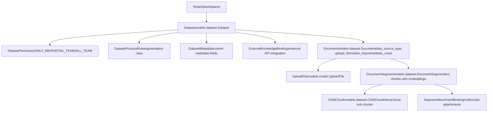
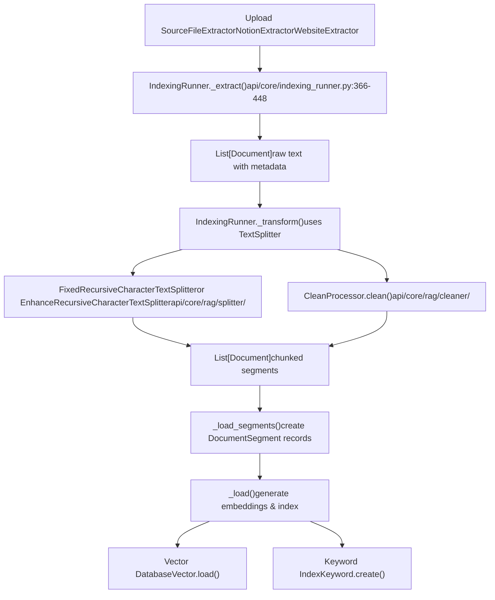

# 知识库与 RAG 系统

相关源文件

-   [api/controllers/console/datasets/data_source.py](https://github.com/langgenius/dify/blob/92dbc94f/api/controllers/console/datasets/data_source.py)
-   [api/controllers/console/datasets/datasets_document.py](https://github.com/langgenius/dify/blob/92dbc94f/api/controllers/console/datasets/datasets_document.py)
-   [api/controllers/console/datasets/datasets_segments.py](https://github.com/langgenius/dify/blob/92dbc94f/api/controllers/console/datasets/datasets_segments.py)
-   [api/controllers/console/datasets/external.py](https://github.com/langgenius/dify/blob/92dbc94f/api/controllers/console/datasets/external.py)
-   [api/controllers/console/datasets/hit_testing.py](https://github.com/langgenius/dify/blob/92dbc94f/api/controllers/console/datasets/hit_testing.py)
-   [api/controllers/console/datasets/metadata.py](https://github.com/langgenius/dify/blob/92dbc94f/api/controllers/console/datasets/metadata.py)
-   [api/controllers/console/tag/tags.py](https://github.com/langgenius/dify/blob/92dbc94f/api/controllers/console/tag/tags.py)
-   [api/controllers/service_api/__init__.py](https://github.com/langgenius/dify/blob/92dbc94f/api/controllers/service_api/__init__.py)
-   [api/controllers/service_api/app/annotation.py](https://github.com/langgenius/dify/blob/92dbc94f/api/controllers/service_api/app/annotation.py)
-   [api/controllers/service_api/dataset/dataset.py](https://github.com/langgenius/dify/blob/92dbc94f/api/controllers/service_api/dataset/dataset.py)
-   [api/controllers/service_api/dataset/document.py](https://github.com/langgenius/dify/blob/92dbc94f/api/controllers/service_api/dataset/document.py)
-   [api/controllers/service_api/dataset/metadata.py](https://github.com/langgenius/dify/blob/92dbc94f/api/controllers/service_api/dataset/metadata.py)
-   [api/controllers/service_api/dataset/segment.py](https://github.com/langgenius/dify/blob/92dbc94f/api/controllers/service_api/dataset/segment.py)
-   [api/core/indexing_runner.py](https://github.com/langgenius/dify/blob/92dbc94f/api/core/indexing_runner.py)
-   [api/core/rag/datasource/retrieval_service.py](https://github.com/langgenius/dify/blob/92dbc94f/api/core/rag/datasource/retrieval_service.py)
-   [api/core/rag/entities/metadata_entities.py](https://github.com/langgenius/dify/blob/92dbc94f/api/core/rag/entities/metadata_entities.py)
-   [api/core/rag/extractor/entity/extract_setting.py](https://github.com/langgenius/dify/blob/92dbc94f/api/core/rag/extractor/entity/extract_setting.py)
-   [api/core/rag/extractor/notion_extractor.py](https://github.com/langgenius/dify/blob/92dbc94f/api/core/rag/extractor/notion_extractor.py)
-   [api/core/rag/retrieval/dataset_retrieval.py](https://github.com/langgenius/dify/blob/92dbc94f/api/core/rag/retrieval/dataset_retrieval.py)
-   [api/core/workflow/nodes/knowledge_retrieval/entities.py](https://github.com/langgenius/dify/blob/92dbc94f/api/core/workflow/nodes/knowledge_retrieval/entities.py)
-   [api/core/workflow/nodes/knowledge_retrieval/knowledge_retrieval_node.py](https://github.com/langgenius/dify/blob/92dbc94f/api/core/workflow/nodes/knowledge_retrieval/knowledge_retrieval_node.py)
-   [api/core/workflow/nodes/list_operator/entities.py](https://github.com/langgenius/dify/blob/92dbc94f/api/core/workflow/nodes/list_operator/entities.py)
-   [api/core/workflow/nodes/list_operator/exc.py](https://github.com/langgenius/dify/blob/92dbc94f/api/core/workflow/nodes/list_operator/exc.py)
-   [api/core/workflow/nodes/list_operator/node.py](https://github.com/langgenius/dify/blob/92dbc94f/api/core/workflow/nodes/list_operator/node.py)
-   [api/core/workflow/nodes/question_classifier/entities.py](https://github.com/langgenius/dify/blob/92dbc94f/api/core/workflow/nodes/question_classifier/entities.py)
-   [api/services/dataset_service.py](https://github.com/langgenius/dify/blob/92dbc94f/api/services/dataset_service.py)
-   [api/services/hit_testing_service.py](https://github.com/langgenius/dify/blob/92dbc94f/api/services/hit_testing_service.py)
-   [api/tests/unit_tests/controllers/console/datasets/__init__.py](https://github.com/langgenius/dify/blob/92dbc94f/api/tests/unit_tests/controllers/console/datasets/__init__.py)
-   [api/tests/unit_tests/controllers/console/datasets/test_external_dataset_payload.py](https://github.com/langgenius/dify/blob/92dbc94f/api/tests/unit_tests/controllers/console/datasets/test_external_dataset_payload.py)
-   [api/tests/unit_tests/core/datasource/test_notion_provider.py](https://github.com/langgenius/dify/blob/92dbc94f/api/tests/unit_tests/core/datasource/test_notion_provider.py)
-   [api/tests/unit_tests/core/rag/extractor/__init__.py](https://github.com/langgenius/dify/blob/92dbc94f/api/tests/unit_tests/core/rag/extractor/__init__.py)
-   [api/tests/unit_tests/core/rag/extractor/test_notion_extractor.py](https://github.com/langgenius/dify/blob/92dbc94f/api/tests/unit_tests/core/rag/extractor/test_notion_extractor.py)
-   [api/tests/unit_tests/core/rag/retrieval/__init__.py](https://github.com/langgenius/dify/blob/92dbc94f/api/tests/unit_tests/core/rag/retrieval/__init__.py)
-   [api/tests/unit_tests/core/rag/retrieval/test_dataset_retrieval.py](https://github.com/langgenius/dify/blob/92dbc94f/api/tests/unit_tests/core/rag/retrieval/test_dataset_retrieval.py)
-   [api/tests/unit_tests/core/workflow/nodes/test_list_operator.py](https://github.com/langgenius/dify/blob/92dbc94f/api/tests/unit_tests/core/workflow/nodes/test_list_operator.py)
-   [api/tests/unit_tests/services/test_metadata_bug_complete.py](https://github.com/langgenius/dify/blob/92dbc94f/api/tests/unit_tests/services/test_metadata_bug_complete.py)
-   [api/tests/unit_tests/services/test_metadata_nullable_bug.py](https://github.com/langgenius/dify/blob/92dbc94f/api/tests/unit_tests/services/test_metadata_nullable_bug.py)
-   [web/app/components/develop/ApiServer.tsx](https://github.com/langgenius/dify/blob/92dbc94f/web/app/components/develop/ApiServer.tsx)
-   [web/app/components/develop/doc.tsx](https://github.com/langgenius/dify/blob/92dbc94f/web/app/components/develop/doc.tsx)
-   [web/app/components/develop/index.tsx](https://github.com/langgenius/dify/blob/92dbc94f/web/app/components/develop/index.tsx)
-   [web/app/components/workflow/nodes/knowledge-retrieval/components/metadata/condition-list/utils.ts](https://github.com/langgenius/dify/blob/92dbc94f/web/app/components/workflow/nodes/knowledge-retrieval/components/metadata/condition-list/utils.ts)
-   [web/app/components/workflow/nodes/knowledge-retrieval/components/metadata/metadata-icon.tsx](https://github.com/langgenius/dify/blob/92dbc94f/web/app/components/workflow/nodes/knowledge-retrieval/components/metadata/metadata-icon.tsx)
-   [web/app/components/workflow/nodes/list-operator/components/extract-input.tsx](https://github.com/langgenius/dify/blob/92dbc94f/web/app/components/workflow/nodes/list-operator/components/extract-input.tsx)
-   [web/app/components/workflow/nodes/list-operator/components/filter-condition.tsx](https://github.com/langgenius/dify/blob/92dbc94f/web/app/components/workflow/nodes/list-operator/components/filter-condition.tsx)
-   [web/app/components/workflow/nodes/list-operator/default.ts](https://github.com/langgenius/dify/blob/92dbc94f/web/app/components/workflow/nodes/list-operator/default.ts)
-   [web/app/components/workflow/nodes/list-operator/panel.tsx](https://github.com/langgenius/dify/blob/92dbc94f/web/app/components/workflow/nodes/list-operator/panel.tsx)
-   [web/app/components/workflow/nodes/list-operator/types.ts](https://github.com/langgenius/dify/blob/92dbc94f/web/app/components/workflow/nodes/list-operator/types.ts)
-   [web/app/components/workflow/nodes/utils.ts](https://github.com/langgenius/dify/blob/92dbc94f/web/app/components/workflow/nodes/utils.ts)

本文档描述了 Dify 中的检索增强生成 (RAG) 系统，该系统使应用程序能够检索和使用知识库中的信息。涵盖了数据集和文档的数据模型、文档索引管道、检索策略、元数据过滤以及与工作流和 API 的集成点。

有关使用检索到的知识的工作流执行信息，请参阅[工作流系统与节点执行](/langgenius/dify/5-workflow-system-and-node-execution)。有关暴露 RAG 功能的 API 端点，请参阅[服务 API](/langgenius/dify/8-service-apis)。

---

## 数据模型层级

知识库系统使用四层数据结构，组织为：**Dataset (数据集) → Document (文档) → DocumentSegment (文档片段) → ChildChunk (子块)**。

**来源**: [api/services/dataset_service.py36-51](https://github.com/langgenius/dify/blob/92dbc94f/api/services/dataset_service.py#L36-L51) [api/models/dataset.py](https://github.com/langgenius/dify/blob/92dbc94f/api/models/dataset.py)

### Dataset 模型

`Dataset` 模型表示一个知识库，包含以下关键属性：

| 属性 |
| --- |
| `indexing_technique` |
| `embedding_model_provider` |
| `embedding_model` |
| `retrieval_model` |
| `permission` |
| `provider` |
| `doc_form` |

**来源**: [api/services/dataset_service.py243-273](https://github.com/langgenius/dify/blob/92dbc94f/api/services/dataset_service.py#L243-L273) [api/models/dataset.py](https://github.com/langgenius/dify/blob/92dbc94f/api/models/dataset.py)

### Document 模型

每个 `Document` 代表一个源文件或导入，并跟踪索引进度：

| 属性 |
| --- |
| `data_source_type` |
| `indexing_status` |
| `data_source_info` |
| `dataset_process_rule_id` |
| `doc_form` |

**来源**: [api/core/indexing_runner.py366-448](https://github.com/langgenius/dify/blob/92dbc94f/api/core/indexing_runner.py#L366-L448) [api/models/dataset.py](https://github.com/langgenius/dify/blob/92dbc94f/api/models/dataset.py)

### DocumentSegment 模型

`DocumentSegment` 表示带有向量嵌入的索引文本块：

| 属性 |
| --- |
| `content` |
| `index_node_id` |
| `index_node_hash` |
| `keywords` |
| `enabled` |
| `status` |
| `hit_count` |

**来源**: [api/models/dataset.py](https://github.com/langgenius/dify/blob/92dbc94f/api/models/dataset.py) [api/core/rag/datasource/retrieval_service.py372-527](https://github.com/langgenius/dify/blob/92dbc94f/api/core/rag/datasource/retrieval_service.py#L372-L527)

### ChildChunk 模型 (分层索引)

对于 `parent_child_index` 模式，`ChildChunk` 存储父分段的子片段：

| 属性 |
| --- |
| `segment_id` |
| `content` |
| `index_node_id` |
| `position` |

**来源**: [api/models/dataset.py](https://github.com/langgenius/dify/blob/92dbc94f/api/models/dataset.py) [api/core/indexing_runner.py231-246](https://github.com/langgenius/dify/blob/92dbc94f/api/core/indexing_runner.py#L231-L246)

---

## 文档索引管道

`IndexingRunner` 类编排从原始文档到可搜索分段的 ETL 过程。

**来源**: [api/core/indexing_runner.py64-123](https://github.com/langgenius/dify/blob/92dbc94f/api/core/indexing_runner.py#L64-L123) [api/core/indexing_runner.py366-448](https://github.com/langgenius/dify/blob/92dbc94f/api/core/indexing_runner.py#L366-L448) [api/core/indexing_runner.py550-633](https://github.com/langgenius/dify/blob/92dbc94f/api/core/indexing_runner.py#L550-L633)

### 提取阶段 (Extract)

提取阶段将各种数据源转换为原始 `Document` 对象：

**支持的数据源**:

-   **上传文件**: 由 `FileExtractor` 处理 PDF, DOCX, TXT, Markdown 等。
-   **Notion**: `NotionExtractor` 通过带有 OAuth 凭证的 Notion API 检索页面/数据库。
-   **网站**: 使用 Firecrawl 或 Jina API 的网络爬虫。

`IndexingRunner` 中的 `_extract()` 方法：

1.  从 `Document.data_source_type` 确定数据源类型
2.  创建适当的 `ExtractSetting` 实体
3.  调用 `index_processor.extract()` 获取原始文本
4.  将文档状态更新为 `