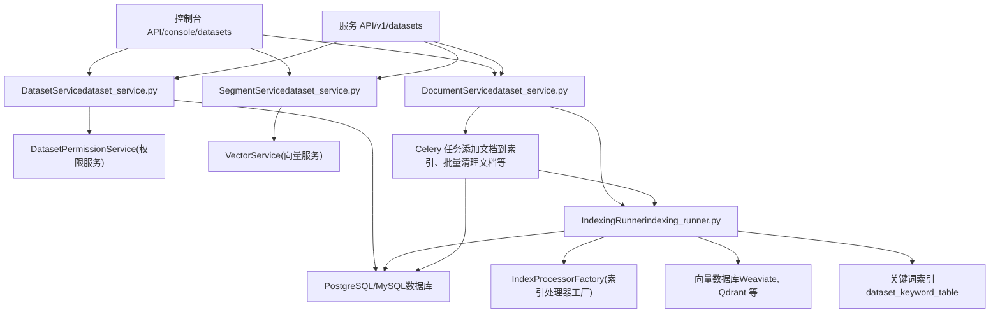
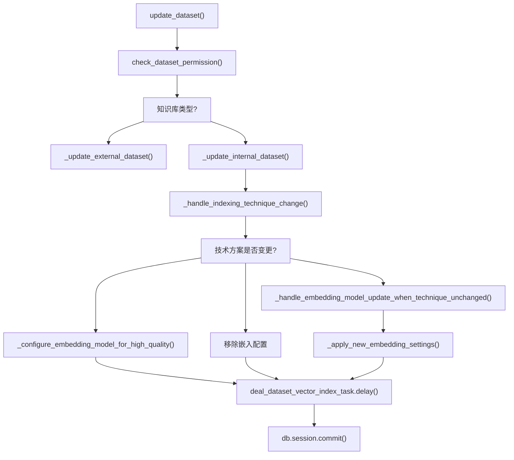
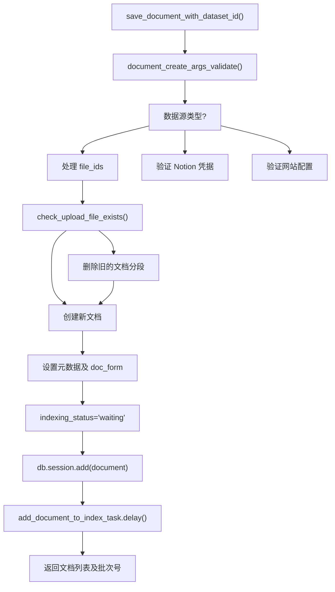
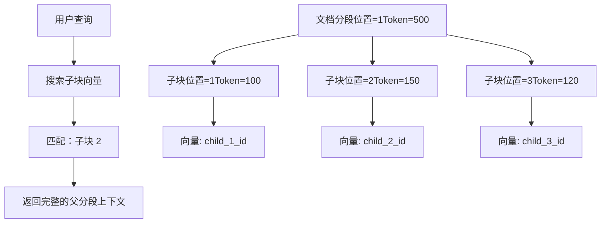
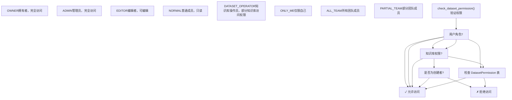
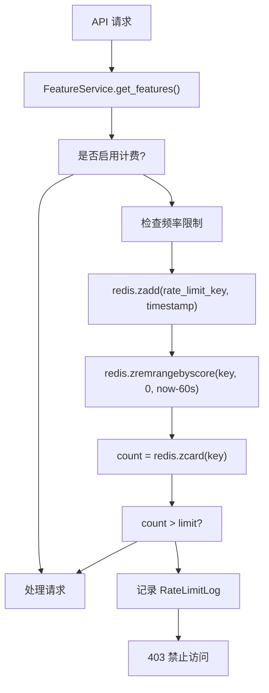
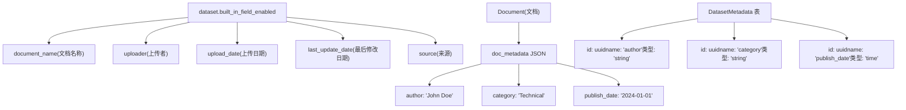
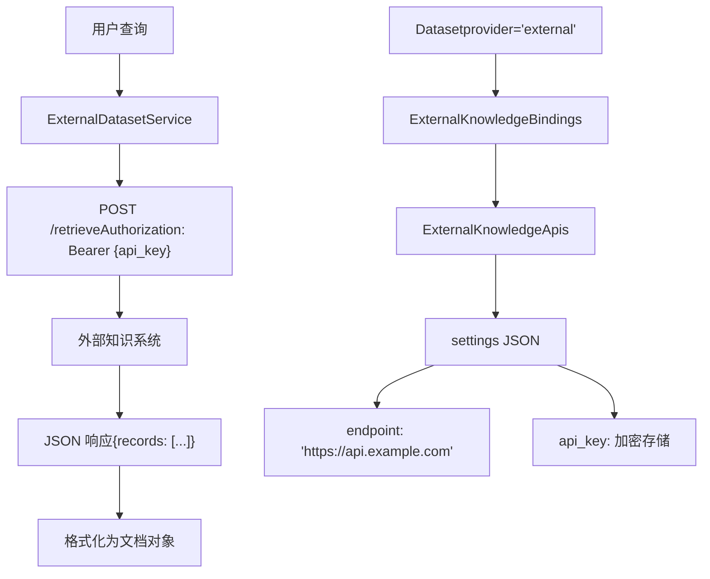

# 知识库服务与文档管理

相关源文件

-   [api/controllers/console/datasets/data\_source.py](https://github.com/langgenius/dify/blob/92dbc94f/api/controllers/console/datasets/data_source.py)
-   [api/controllers/console/datasets/datasets\_document.py](https://github.com/langgenius/dify/blob/92dbc94f/api/controllers/console/datasets/datasets_document.py)
-   [api/controllers/console/datasets/datasets\_segments.py](https://github.com/langgenius/dify/blob/92dbc94f/api/controllers/console/datasets/datasets_segments.py)
-   [api/controllers/console/datasets/external.py](https://github.com/langgenius/dify/blob/92dbc94f/api/controllers/console/datasets/external.py)
-   [api/controllers/console/datasets/hit\_testing.py](https://github.com/langgenius/dify/blob/92dbc94f/api/controllers/console/datasets/hit_testing.py)
-   [api/controllers/console/datasets/metadata.py](https://github.com/langgenius/dify/blob/92dbc94f/api/controllers/console/datasets/metadata.py)
-   [api/controllers/console/tag/tags.py](https://github.com/langgenius/dify/blob/92dbc94f/api/controllers/console/tag/tags.py)
-   [api/controllers/service\_api/\_\_init\_\_.py](https://github.com/langgenius/dify/blob/92dbc94f/api/controllers/service_api/__init__.py)
-   [api/controllers/service\_api/app/annotation.py](https://github.com/langgenius/dify/blob/92dbc94f/api/controllers/service_api/app/annotation.py)
-   [api/controllers/service\_api/dataset/dataset.py](https://github.com/langgenius/dify/blob/92dbc94f/api/controllers/service_api/dataset/dataset.py)
-   [api/controllers/service\_api/dataset/document.py](https://github.com/langgenius/dify/blob/92dbc94f/api/controllers/service_api/dataset/document.py)
-   [api/controllers/service\_api/dataset/metadata.py](https://github.com/langgenius/dify/blob/92dbc94f/api/controllers/service_api/dataset/metadata.py)
-   [api/controllers/service\_api/dataset/segment.py](https://github.com/langgenius/dify/blob/92dbc94f/api/controllers/service_api/dataset/segment.py)
-   [api/core/indexing\_runner.py](https://github.com/langgenius/dify/blob/92dbc94f/api/core/indexing_runner.py)
-   [api/core/rag/extractor/entity/extract\_setting.py](https://github.com/langgenius/dify/blob/92dbc94f/api/core/rag/extractor/entity/extract_setting.py)
-   [api/core/rag/extractor/notion\_extractor.py](https://github.com/langgenius/dify/blob/92dbc94f/api/core/rag/extractor/notion_extractor.py)
-   [api/services/dataset\_service.py](https://github.com/langgenius/dify/blob/92dbc94f/api/services/dataset_service.py)
-   [api/tests/unit\_tests/controllers/console/datasets/\_\_init\_\_.py](https://github.com/langgenius/dify/blob/92dbc94f/api/tests/unit_tests/controllers/console/datasets/__init__.py)
-   [api/tests/unit\_tests/controllers/console/datasets/test\_external\_dataset\_payload.py](https://github.com/langgenius/dify/blob/92dbc94f/api/tests/unit_tests/controllers/console/datasets/test_external_dataset_payload.py)
-   [api/tests/unit\_tests/core/datasource/test\_notion\_provider.py](https://github.com/langgenius/dify/blob/92dbc94f/api/tests/unit_tests/core/datasource/test_notion_provider.py)
-   [api/tests/unit\_tests/core/rag/extractor/\_\_init\_\_.py](https://github.com/langgenius/dify/blob/92dbc94f/api/tests/unit_tests/core/rag/extractor/__init__.py)
-   [api/tests/unit\_tests/core/rag/extractor/test\_notion\_extractor.py](https://github.com/langgenius/dify/blob/92dbc94f/api/tests/unit_tests/core/rag/extractor/test_notion_extractor.py)
-   [api/tests/unit\_tests/services/test\_metadata\_bug\_complete.py](https://github.com/langgenius/dify/blob/92dbc94f/api/tests/unit_tests/services/test_metadata_bug_complete.py)
-   [api/tests/unit\_tests/services/test\_metadata\_nullable\_bug.py](https://github.com/langgenius/dify/blob/92dbc94f/api/tests/unit_tests/services/test_metadata_nullable_bug.py)
-   [web/app/components/develop/ApiServer.tsx](https://github.com/langgenius/dify/blob/92dbc94f/web/app/components/develop/ApiServer.tsx)
-   [web/app/components/develop/doc.tsx](https://github.com/langgenius/dify/blob/92dbc94f/web/app/components/develop/doc.tsx)
-   [web/app/components/develop/index.tsx](https://github.com/langgenius/dify/blob/92dbc94f/web/app/components/develop/index.tsx)

## 目的与范围

本页面详细介绍了 Dify 中用于管理知识库及其文档的服务层 API 和数据模型。内容涵盖了 `DatasetService`、`DocumentService` 和 `SegmentService` 类，它们负责提供 CRUD 操作、权限管理以及文档生命周期的编排。

有关文档索引和嵌入 (embedding) 过程的信息，请参阅 [文档索引流水线](/langgenius/dify/4.2-document-indexing-pipeline)。有关检索策略和搜索方法的信息，请参阅 [检索策略与元数据过滤](/langgenius/dify/4.3-retrieval-strategies-and-metadata-filtering)。有关向量数据库配置的信息，请参阅 [向量数据库集成](/langgenius/dify/4.4-vector-database-integration)。

---

## 核心数据模型

### 知识库、文档与分段层级结构

```mermaid
flowchart TD
    entity_Dataset_0["Dataset(知识库)"]
    entity_Document_1["Document(文档)"]
    entity_DatasetProcessRule_2["DatasetProcessRule(处理规则)"]
    entity_AppDatasetJoin_3["AppDatasetJoin(应用知识库关联)"]
    entity_DatasetCollectionBinding_4["DatasetCollectionBinding(集合绑定)"]
    entity_ExternalKnowledgeBindings_5["ExternalKnowledgeBindings(外部知识库绑定)"]
    entity_DocumentSegment_6["DocumentSegment(文档分段)"]
    entity_UploadFile_7["UploadFile(上传文件)"]
    entity_ChildChunk_8["ChildChunk(子块)"]
    entity_SegmentAttachmentBinding_9["SegmentAttachmentBinding(附件绑定)"]
```


**Dataset (知识库)**：代表一个知识库，包含索引技术（高质量/经济型）、嵌入模型、检索设置和权限等配置。`provider` 字段区分了 `vendor`（由 Dify 管理）和 `external`（第三方 API）知识库。

**Document (文档)**：知识库中的单个文件或文本条目。追踪数据源类型（`upload_file` 上传文件、`notion_import` Notion 导入、`website_crawl` 网站抓取）、索引状态和处理元数据。

**DocumentSegment (文档分段)**：在文本切分过程中从文档创建的代码块。每个分段可以独立启用/禁用，并追踪检索命中次数。

**ChildChunk (子块)**：用于层级分块（`doc_form="parent_child_index"`），子块在父分段内提供更细粒度的上下文。

来源：[api/models/dataset.py44-311](https://github.com/langgenius/dify/blob/92dbc94f/api/models/dataset.py#L44-L311) [api/models/dataset.py353-513](https://github.com/langgenius/dify/blob/92dbc94f/api/models/dataset.py#L353-L513) [api/models/dataset.py564-716](https://github.com/langgenius/dify/blob/92dbc94f/api/models/dataset.py#L564-L716)

---

## DatasetService 架构

### 服务层设计


来源：[api/services/dataset\_service.py97-273](https://github.com/langgenius/dify/blob/92dbc94f/api/services/dataset_service.py#L97-L273) [api/controllers/console/datasets/datasets\_document.py1-65](https://github.com/langgenius/dify/blob/92dbc94f/api/controllers/console/datasets/datasets_document.py#L1-L65) [api/controllers/service\_api/dataset/dataset.py1-99](https://github.com/langgenius/dify/blob/92dbc94f/api/controllers/service_api/dataset/dataset.py#L1-L99)

### DatasetService 核心方法

`DatasetService` 类提供了知识库层面的操作：

| 方法 | 用途 | 关键参数 |
| --- | --- | --- |
| `get_datasets()` | 列出知识库，支持过滤和分页 | `tenant_id`, `user`, `search`, `tag_ids`, `page`, `per_page` |
| `get_dataset()` | 通过 ID 获取单个知识库 | `dataset_id` |
| `create_empty_dataset()` | 创建带配置的新知识库 | `tenant_id`, `name`, `indexing_technique`, `embedding_model_provider`, `embedding_model_name` |
| `update_dataset()` | 更新知识库设置并触发重新索引 | `dataset_id`, `data` (包含更新的字典), `user` |
| `check_dataset_permission()` | 验证用户对知识库的访问权限 | `dataset`, `user` |
| `check_dataset_model_setting()` | 验证嵌入模型是否可用 | `dataset` |

**知识库创建流程**：

> **[Mermaid 序列图]**
> *(图表结构无法解析)*

来源：[api/services/dataset\_service.py198-272](https://github.com/langgenius/dify/blob/92dbc94f/api/services/dataset_service.py#L198-L272) [api/services/dataset\_service.py407-444](https://github.com/langgenius/dify/blob/92dbc94f/api/services/dataset_service.py#L407-L444)

### 知识库更新与重新索引

当知识库配置发生变化（特别是嵌入模型）时，系统会触发重新索引：


**重新索引行为**：

-   `add`: 为文档创建向量索引（经济型 → 高质量）。
-   `remove`: 删除向量索引（高质量 → 经济型）。
-   `update`: 使用新模型重新进行嵌入（模型变更）。

来源：[api/services/dataset\_service.py407-579](https://github.com/langgenius/dify/blob/92dbc94f/api/services/dataset_service.py#L407-L579) [api/services/dataset\_service.py664-853](https://github.com/langgenius/dify/blob/92dbc94f/api/services/dataset_service.py#L664-L853)

---

## DocumentService 操作

### 文档创建流水线

`DocumentService` 负责文档的摄入及索引前的准备工作：


**关键方法**：

| 方法 | 用途 | 参数 |
| --- | --- | --- |
| `save_document_with_dataset_id()` | 文档创建的主要入口点 | `dataset`, `knowledge_config`, `account`, `dataset_process_rule` |
| `document_create_args_validate()` | 验证创建参数 | `knowledge_config` |
| `check_upload_file_exists()` | 检测重复文档 | `dataset_id`, `upload_file_id` |
| `get_document()` | 通过 ID 获取文档 | `dataset_id`, `document_id` |
| `delete_documents()` | 删除文档及其索引 | `dataset`, `document_ids` |
| `retry_document()` | 重试失败的索引任务 | `dataset`, `documents` |

来源：[api/services/dataset\_service.py2008-2318](https://github.com/langgenius/dify/blob/92dbc94f/api/services/dataset_service.py#L2008-L2318) [api/services/dataset\_service.py1621-1708](https://github.com/langgenius/dify/blob/92dbc94f/api/services/dataset_service.py#L1621-L1708)

### 文档生命周期状态

> **[Mermaid 状态图]**
> *(图表结构无法解析)*

**状态追踪字段** (位于 `Document` 模型):

-   `indexing_status`: `waiting` (等待中), `parsing` (解析中), `splitting` (清洗中/分段中), `indexing` (索引中), `completed` (已完成), `error` (错误)。
-   `is_paused`: 用户手动暂停的布尔标志。
-   `enabled`: 文档是否参与检索。
-   `archived`: 软删除标志。

**时间戳**：

-   `processing_started_at`: 索引开始时间。
-   `parsing_completed_at`: 文本提取完成时间。
-   `splitting_completed_at`: 分块完成时间。
-   `completed_at`: 完整索引完成时间。
-   `stopped_at`: 如果发生错误的时间。

来源：[api/models/dataset.py353-442](https://github.com/langgenius/dify/blob/92dbc94f/api/models/dataset.py#L353-L442) [api/core/indexing\_runner.py64-123](https://github.com/langgenius/dify/blob/92dbc94f/api/core/indexing_runner.py#L64-L123)

---

## SegmentService 与分块管理

### 分段 CRUD 操作

`SegmentService` 提供了对单个文档分块的操作：

```mermaid
flowchart TD
    CreateSegment["create_segment()"]
    UpdateSegment["update_segment()"]
    DeleteSegment["delete_segment()"]
    EnableSegment["enable_segment()"]
    DisableSegment["disable_segment()"]
    CreateChild["create_child_chunk()"]
    UpdateChild["update_child_chunk()"]
    DeleteChild["delete_child_chunk()"]
    BatchUpdateChildren["batch_update_child_chunks()"]
    AddToIndex["batch_create_segment_to_index_task"]
    UpdateIndex["update_segment_index"]
    RemoveFromIndex["delete_segment_from_index_task"]

    CreateSegment --> AddToIndex
    UpdateSegment --> UpdateIndex
    DeleteSegment --> RemoveFromIndex
    EnableSegment --> AddToIndex
    DisableSegment --> RemoveFromIndex
    CreateChild --> AddToIndex
    UpdateChild --> UpdateIndex
    DeleteChild --> RemoveFromIndex
```


**分段模型字段**：

| 字段 | 类型 | 用途 |
| --- | --- | --- |
| `content` | Text | 分块文本内容 |
| `position` | Integer | 文档内的顺序 |
| `word_count` | Integer | 字数长度 |
| `tokens` | Integer | 嵌入所需的 Token 数 |
| `status` | String | `completed`, `indexing`, `error` |
| `enabled` | Boolean | 是否包含在检索中 |
| `disabled_at` | Timestamp | 禁用时间 |
| `hit_count` | Integer | 检索使用计数器 |
| `keywords` | JSON | 提取的关键词（经济模式） |
| `index_node_id` | String | 向量数据库中的文档 ID |
| `index_node_hash` | String | 内容哈希，用于去重 |

来源：[api/models/dataset.py564-716](https://github.com/langgenius/dify/blob/92dbc94f/api/models/dataset.py#L564-L716) [api/services/dataset\_service.py2835-3139](https://github.com/langgenius/dify/blob/92dbc94f/api/services/dataset_service.py#L2835-L3139)

### 层级分块（父子分块）

当 `doc_form="parent_child_index"` 时，分段包含子块：


**子块操作**：

-   `create_child_chunk()`: 向现有分段添加子块 [api/services/dataset\_service.py3141-3236](https://github.com/langgenius/dify/blob/92dbc94f/api/services/dataset_service.py#L3141-L3236)
-   `update_child_chunk()`: 修改子块内容并重新索引 [api/services/dataset\_service.py3238-3329](https://github.com/langgenius/dify/blob/92dbc94f/api/services/dataset_service.py#L3238-L3329)
-   `delete_child_chunk()`: 从分段和向量数据库中移除子块 [api/services/dataset\_service.py3331-3379](https://github.com/langgenius/dify/blob/92dbc94f/api/services/dataset_service.py#L3331-L3379)
-   `batch_update_child_chunks()`: 批量更新多个子块 [api/services/dataset\_service.py3381-3502](https://github.com/langgenius/dify/blob/92dbc94f/api/services/dataset_service.py#L3381-L3502)

来源：[api/models/dataset.py718-759](https://github.com/langgenius/dify/blob/92dbc94f/api/models/dataset.py#L718-L759) [api/services/dataset\_service.py3141-3502](https://github.com/langgenius/dify/blob/92dbc94f/api/services/dataset_service.py#L3141-L3502)

---

## API 端点

### 控制台 API（管理界面）

控制台 API 提供了对知识库和文档的完整管理访问权限：

**知识库端点**：

| 端点 | 方法 | 用途 |
| --- | --- | --- |
| `/console/datasets` | GET | 列出带过滤器的知识库 |
| `/console/datasets` | POST | 创建新知识库 |
| `/console/datasets/<id>` | GET | 获取知识库详情 |
| `/console/datasets/<id>` | PATCH | 更新知识库配置 |
| `/console/datasets/<id>` | DELETE | 删除知识库 |

**文档端点**：

| 端点 | 方法 | 用途 |
| --- | --- | --- |
| `/console/datasets/<id>/documents` | GET | 列出知识库中的文档 |
| `/console/datasets/<id>/documents` | POST | 创建文档（上传/文本/同步） |
| `/console/datasets/<id>/documents` | DELETE | 批量删除文档 |
| `/console/datasets/<id>/documents/<doc_id>` | GET | 获取文档详情 |
| `/console/datasets/<id>/documents/<doc_id>` | PATCH | 更新文档元数据 |
| `/console/datasets/<id>/documents/<doc_id>` | DELETE | 删除单个文档 |
| `/console/datasets/<id>/documents/<doc_id>/status` | GET | 获取索引状态 |

**分段端点**：

| 端点 | 方法 | 用途 |
| --- | --- | --- |
| `/console/datasets/<id>/documents/<doc_id>/segments` | GET | 列出带过滤器的分段 |
| `/console/datasets/<id>/documents/<doc_id>/segments` | POST | 手动创建分段 |
| `/console/datasets/<id>/documents/<doc_id>/segments/<seg_id>` | PATCH | 更新分段内容 |
| `/console/datasets/<id>/documents/<doc_id>/segments/<seg_id>` | DELETE | 删除分段 |
| `/console/datasets/<id>/documents/<doc_id>/segments/<seg_id>/enable` | POST | 启用分段 |
| `/console/datasets/<id>/documents/<doc_id>/segments/<seg_id>/disable` | POST | 禁用分段 |

来源：[api/controllers/console/datasets/datasets\_document.py206-393](https://github.com/langgenius/dify/blob/92dbc94f/api/controllers/console/datasets/datasets_document.py#L206-L393) [api/controllers/console/datasets/datasets\_segments.py95-450](https://github.com/langgenius/dify/blob/92dbc94f/api/controllers/console/datasets/datasets_segments.py#L95-L450)

### 服务 API（外部应用）

服务 API 使用 Bearer 令牌认证进行外部集成：

> **[Mermaid 序列图]**
> *(图表结构无法解析)*

**认证**：使用 `@validate_dataset_token` 装饰器，其行为如下：

1.  从 `Authorization` 标头提取 Bearer 令牌。
2.  针对 `api_tokens` 表（type='dataset'）验证令牌。
3.  作为租户拥有者账号登录。
4.  检查 `dataset.enable_api` 标志。

**关键服务 API 端点**：

| 端点 | 用途 |
| --- | --- |
| `POST /v1/datasets` | 创建知识库 |
| `GET /v1/datasets` | 列出知识库 |
| `GET /v1/datasets/<id>` | 获取知识库 |
| `PATCH /v1/datasets/<id>` | 更新知识库 |
| `DELETE /v1/datasets/<id>` | 删除知识库 |
| `POST /v1/datasets/<id>/document/create_by_text` | 通过文本创建文档 |
| `POST /v1/datasets/<id>/document/create_by_file` | 通过上传文件创建文档 |
| `POST /v1/datasets/<id>/documents/<doc_id>/update_by_text` | 更新文档文本 |
| `POST /v1/datasets/<id>/documents/<doc_id>/update_by_file` | 更新文档文件 |
| `POST /v1/datasets/<id>/documents/<doc_id>/segments` | 创建分段 |
| `PATCH /v1/datasets/<id>/documents/<doc_id>/segments/<seg_id>` | 更新分段 |
| `DELETE /v1/datasets/<id>/documents/<doc_id>/segments/<seg_id>` | 删除分段 |

来源：[api/controllers/service\_api/dataset/dataset.py102-338](https://github.com/langgenius/dify/blob/92dbc94f/api/controllers/service_api/dataset/dataset.py#L102-L338) [api/controllers/service\_api/dataset/document.py76-476](https://github.com/langgenius/dify/blob/92dbc94f/api/controllers/service_api/dataset/document.py#L76-L476) [api/controllers/service\_api/wraps.py219-294](https://github.com/langgenius/dify/blob/92dbc94f/api/controllers/service_api/wraps.py#L219-L294)

---

## 权限管理

### 知识库权限级别

知识库支持 `DatasetPermissionEnum` 中定义的三种权限模型：


**DatasetPermission 表**：对于 `PARTIAL_TEAM`，存储显式的权限记录：

| 字段 | 用途 |
| --- | --- |
| `dataset_id` | 知识库标识符 |
| `account_id` | 用户标识符 |
| `tenant_id` | 工作区标识符 |
| `has_permission` | 布尔标志 |

**权限检查逻辑**：

```
def check_dataset_permission(dataset, user):
    if user.current_role in [TenantAccountRole.OWNER, TenantAccountRole.ADMIN]:
        return True

    if dataset.permission == DatasetPermissionEnum.ALL_TEAM:
        return True

    if dataset.permission == DatasetPermissionEnum.ONLY_ME:
        return dataset.created_by == user.id

    if dataset.permission == DatasetPermissionEnum.PARTIAL_TEAM:
        permission = db.session.query(DatasetPermission).filter_by(
            dataset_id=dataset.id, account_id=user.id
        ).first()
        return permission is not None

    return False
```
来源：[api/models/dataset.py38-41](https://github.com/langgenius/dify/blob/92dbc94f/api/models/dataset.py#L38-L41) [api/services/dataset\_service.py1403-1476](https://github.com/langgenius/dify/blob/92dbc94f/api/services/dataset_service.py#L1403-L1476)

### 频率限制与配额

在云端部署中，知识库操作受到频率限制：


**配额检查**：

-   `vector_space`: 检查剩余向量存储容量。
-   `documents`: 检查文档上传配额。
-   `knowledge` 频率限制：每分钟处理知识库操作的请求数。

**装饰器**：

-   `@cloud_edition_billing_resource_check("vector_space")`: 操作前检查容量。
-   `@cloud_edition_billing_rate_limit_check("knowledge")`: 对请求进行频率限制。

来源：[api/controllers/console/wraps.py97-169](https://github.com/langgenius/dify/blob/92dbc94f/api/controllers/console/wraps.py#L97-L169) [api/controllers/service\_api/wraps.py130-216](https://github.com/langgenius/dify/blob/92dbc94f/api/controllers/service_api/wraps.py#L130-L216) [api/services/feature\_service.py1-270](https://github.com/langgenius/dify/blob/92dbc94f/api/services/feature_service.py#L1-L270)

---

## 文档处理集成

### 触发后台索引

文档创建后会将异步索引任务加入队列：

> **[Mermaid 序列图]**
> *(图表结构无法解析)*

**任务类型**：

| 任务 | 用途 | 触发条件 |
| --- | --- | --- |
| `add_document_to_index_task` | 为新文档建立索引 | 文档创建 |
| `document_indexing_update_task` | 更新后重新索引 | 文档内容变更 |
| `retry_document_indexing_task` | 重试失败的索引 | 用户重试操作 |
| `remove_document_from_index_task` | 从向量数据库删除 | 文档删除 |
| `batch_clean_document_task` | 批量清理文档 | 批量操作 |
| `sync_website_document_indexing_task` | 重新抓取网站内容 | 网站文档同步 |
| `clean_notion_document_task` | 同步 Notion 页面 | Notion 集成 |

来源：[api/services/dataset\_service.py2298-2318](https://github.com/langgenius/dify/blob/92dbc94f/api/services/dataset_service.py#L2298-L2318) [api/core/indexing\_runner.py48-123](https://github.com/langgenius/dify/blob/92dbc94f/api/core/indexing_runner.py#L48-L123) [tasks/add\_document\_to\_index\_task.py](https://github.com/langgenius/dify/blob/92dbc94f/tasks/add_document_to_index_task.py)

### 数据源类型

文档支持三种数据源类型：

**1\. 上传文件** (`upload_file`)：

```
{
  "data_source_type": "upload_file",
  "data_source_info": {
    "upload_file_id": "uuid"
  }
}
```
引用 `upload_files` 表。支持 PDF, TXT, Markdown, DOCX, CSV 等格式。

**2\. Notion 导入** (`notion_import`)：

```
{
  "data_source_type": "notion_import",
  "data_source_info": {
    "credential_id": "uuid",
    "notion_workspace_id": "workspace_id",
    "notion_page_id": "page_id",
    "type": "page"  // 或 "database"
  }
}
```
使用 `NotionExtractor` 通过 Notion API 获取内容。

**3\. 网站抓取** (`website_crawl`)：

```
{
  "data_source_type": "website_crawl",
  "data_source_info": {
    "provider": "firecrawl",
    "job_id": "job_id",
    "url": "https://example.com",
    "mode": "scrape",  // 或 "crawl"
    "only_main_content": true
  }
}
```
集成网站抓取服务，如 Firecrawl 或 Jina。

来源：[api/models/dataset.py423-424](https://github.com/langgenius/dify/blob/92dbc94f/api/models/dataset.py#L423-L424) [api/core/indexing\_runner.py366-448](https://github.com/langgenius/dify/blob/92dbc94f/api/core/indexing_runner.py#L366-L448) [api/core/rag/extractor/notion\_extractor.py31-177](https://github.com/langgenius/dify/blob/92dbc94f/api/core/rag/extractor/notion_extractor.py#L31-L177)

---

## 元数据与自定义字段

### 文档元数据系统

文档支持自定义元数据字段，用于检索时的过滤：


**元数据字段类型**：

-   `string`: 文本值。
-   `number`: 数值。
-   `time`: ISO 8601 时间戳。

**内置字段**：当 `dataset.built_in_field_enabled=true` 时，会自动添加以下字段：

-   `document_name`: 文档文件名。
-   `uploader`: 创建者账号名。
-   `upload_date`: 创建时间戳。
-   `last_update_date`: 最后修改时间戳。
-   `source`: 数据源类型。

**元数据用途**：

-   检索时的过滤（见 [检索策略](/langgenius/dify/4.3-retrieval-strategies-and-metadata-filtering)）。
-   在知识库内组织文档。
-   RAG 应用中的自定义业务逻辑。

来源：[api/models/dataset.py256-305](https://github.com/langgenius/dify/blob/92dbc94f/api/models/dataset.py#L256-L305) [api/models/dataset.py761-815](https://github.com/langgenius/dify/blob/92dbc94f/api/models/dataset.py#L761-L815) [core/rag/index\_processor/constant/built\_in\_field.py](https://github.com/langgenius/dify/blob/92dbc94f/core/rag/index_processor/constant/built_in_field.py)

---

## 外部知识库

### 外部 API 集成

`provider="external"` 的知识库会将检索任务委托给第三方 API：


**外部知识库 API 结构**：

```
{
  "endpoint": "https://api.example.com/retrieve",
  "api_key": "加密后的 key",
  "retrieval_model": {
    "top_k": 3,
    "score_threshold": 0.5
  }
}
```
**向外部系统发送的请求**：

```
{
  "query": "用户的问题",
  "retrieval_setting": {
    "top_k": 3,
    "score_threshold": 0.5
  }
}
```
**预期的响应**：

```
{
  "records": [
    {
      "content": "检索到的文本",
      "score": 0.95,
      "title": "文档标题",
      "metadata": {...}
    }
  ]
}
```
外部知识库会跳过本地索引步骤，直接将检索请求转发到配置的端点。

来源：[api/models/dataset.py225-245](https://github.com/langgenius/dify/blob/92dbc94f/api/models/dataset.py#L225-L245) [api/services/external_knowledge_service.py](https://github.com/langgenius/dify/blob/92dbc94f/api/services/external_knowledge_service.py) [api/services/dataset\_service.py458-532](https://github.com/langgenius/dify/blob/92dbc94f/api/services/dataset_service.py#L458-L532)