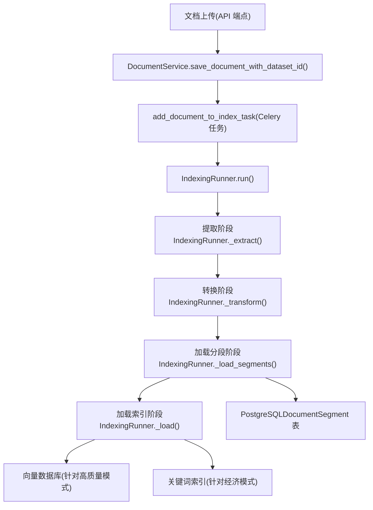
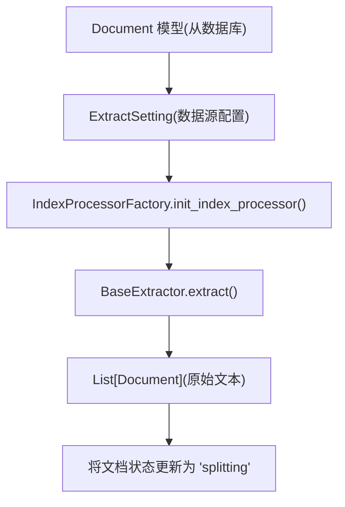
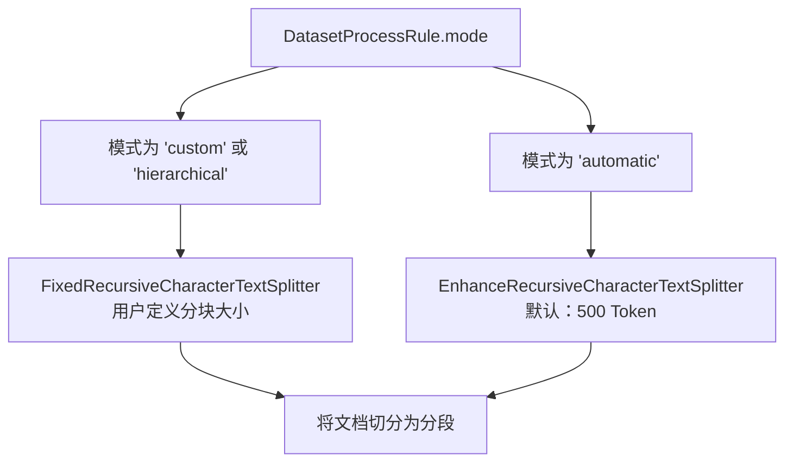
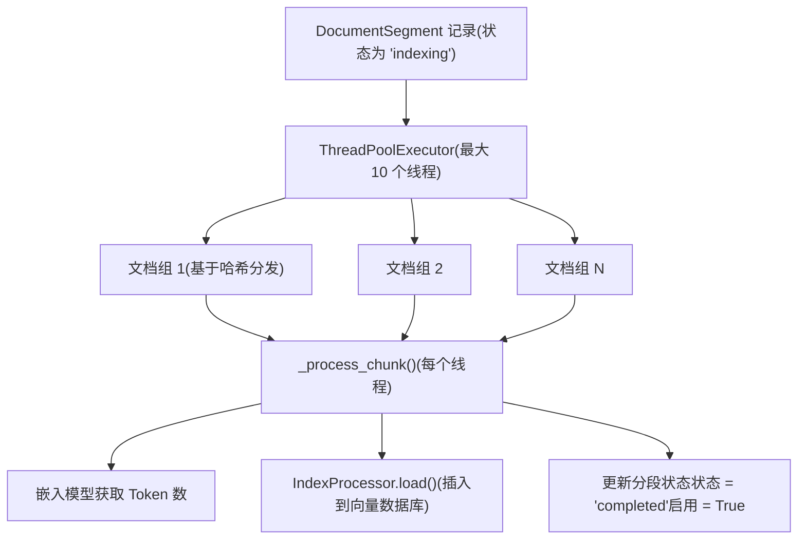
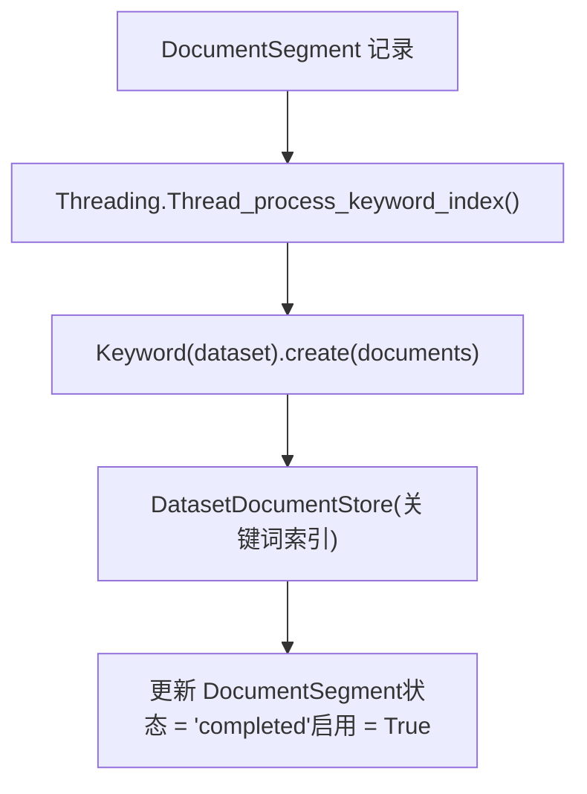
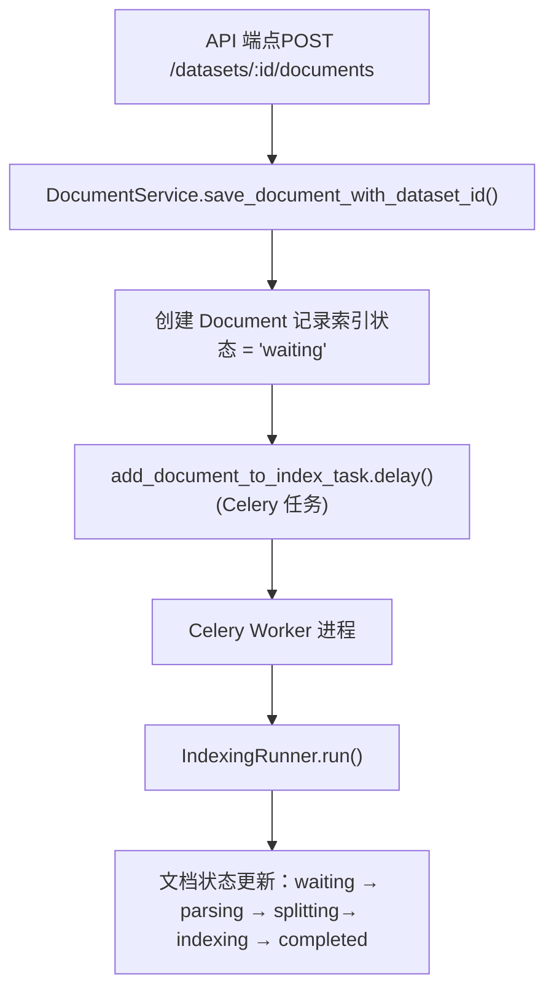
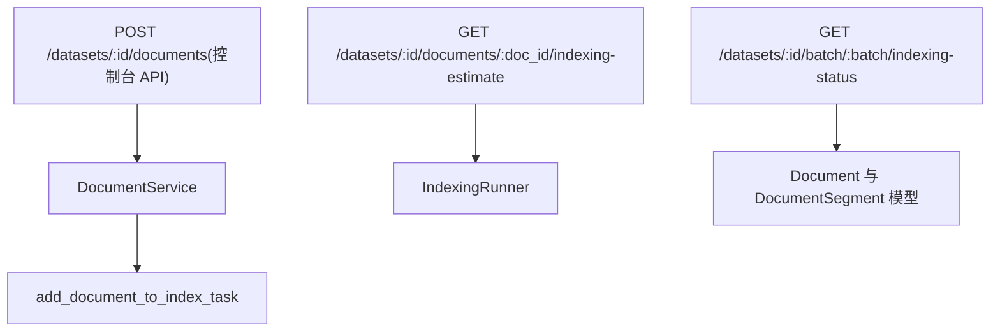

# 文档索引流水线

相关源文件

-   [api/controllers/console/datasets/data_source.py](https://github.com/langgenius/dify/blob/92dbc94f/api/controllers/console/datasets/data_source.py)
-   [api/controllers/console/datasets/datasets_document.py](https://github.com/langgenius/dify/blob/92dbc94f/api/controllers/console/datasets/datasets_document.py)
-   [api/controllers/console/datasets/datasets_segments.py](https://github.com/langgenius/dify/blob/92dbc94f/api/controllers/console/datasets/datasets_segments.py)
-   [api/controllers/console/datasets/external.py](https://github.com/langgenius/dify/blob/92dbc94f/api/controllers/console/datasets/external.py)
-   [api/controllers/console/datasets/hit_testing.py](https://github.com/langgenius/dify/blob/92dbc94f/api/controllers/console/datasets/hit_testing.py)
-   [api/controllers/console/datasets/metadata.py](https://github.com/langgenius/dify/blob/92dbc94f/api/controllers/console/datasets/metadata.py)
-   [api/controllers/console/tag/tags.py](https://github.com/langgenius/dify/blob/92dbc94f/api/controllers/console/tag/tags.py)
-   [api/controllers/service_api/__init__.py](https://github.com/langgenius/dify/blob/92dbc94f/api/controllers/service_api/__init__.py)
-   [api/controllers/service_api/app/annotation.py](https://github.com/langgenius/dify/blob/92dbc94f/api/controllers/service_api/app/annotation.py)
-   [api/controllers/service_api/dataset/dataset.py](https://github.com/langgenius/dify/blob/92dbc94f/api/controllers/service_api/dataset/dataset.py)
-   [api/controllers/service_api/dataset/document.py](https://github.com/langgenius/dify/blob/92dbc94f/api/controllers/service_api/dataset/document.py)
-   [api/controllers/service_api/dataset/metadata.py](https://github.com/langgenius/dify/blob/92dbc94f/api/controllers/service_api/dataset/metadata.py)
-   [api/controllers/service_api/dataset/segment.py](https://github.com/langgenius/dify/blob/92dbc94f/api/controllers/service_api/dataset/segment.py)
-   [api/core/indexing_runner.py](https://github.com/langgenius/dify/blob/92dbc94f/api/core/indexing_runner.py)
-   [api/core/rag/extractor/entity/extract_setting.py](https://github.com/langgenius/dify/blob/92dbc94f/api/core/rag/extractor/entity/extract_setting.py)
-   [api/core/rag/extractor/notion_extractor.py](https://github.com/langgenius/dify/blob/92dbc94f/api/core/rag/extractor/notion_extractor.py)
-   [api/services/dataset_service.py](https://github.com/langgenius/dify/blob/92dbc94f/api/services/dataset_service.py)
-   [api/tests/unit_tests/controllers/console/datasets/__init__.py](https://github.com/langgenius/dify/blob/92dbc94f/api/tests/unit_tests/controllers/console/datasets/__init__.py)
-   [api/tests/unit_tests/controllers/console/datasets/test_external_dataset_payload.py](https://github.com/langgenius/dify/blob/92dbc94f/api/tests/unit_tests/controllers/console/datasets/test_external_dataset_payload.py)
-   [api/tests/unit_tests/core/datasource/test_notion_provider.py](https://github.com/langgenius/dify/blob/92dbc94f/api/tests/unit_tests/core/datasource/test_notion_provider.py)
-   [api/tests/unit_tests/core/rag/extractor/__init__.py](https://github.com/langgenius/dify/blob/92dbc94f/api/tests/unit_tests/core/rag/extractor/__init__.py)
-   [api/tests/unit_tests/core/rag/extractor/test_notion_extractor.py](https://github.com/langgenius/dify/blob/92dbc94f/api/tests/unit_tests/core/rag/extractor/test_notion_extractor.py)
-   [api/tests/unit_tests/services/test_metadata_bug_complete.py](https://github.com/langgenius/dify/blob/92dbc94f/api/tests/unit_tests/services/test_metadata_bug_complete.py)
-   [api/tests/unit_tests/services/test_metadata_nullable_bug.py](https://github.com/langgenius/dify/blob/92dbc94f/api/tests/unit_tests/services/test_metadata_nullable_bug.py)
-   [web/app/components/develop/ApiServer.tsx](https://github.com/langgenius/dify/blob/92dbc94f/web/app/components/develop/ApiServer.tsx)
-   [web/app/components/develop/doc.tsx](https://github.com/langgenius/dify/blob/92dbc94f/web/app/components/develop/doc.tsx)
-   [web/app/components/develop/index.tsx](https://github.com/langgenius/dify/blob/92dbc94f/web/app/components/develop/index.tsx)

## 目的与范围

本文档描述了 Dify 中的文档索引流水线，该流水线负责处理上传的文档，并为语义搜索和检索做好准备。流水线编排了提取、文本切分、清洗、分段创建以及向量/关键词索引等操作。

有关文档检索和搜索的信息，请参阅 [检索策略与元数据过滤](/langgenius/dify/4.3-retrieval-strategies-and-metadata-filtering)。有关向量数据库配置的信息，请参阅 [向量数据库集成](/langgenius/dify/4.4-vector-database-integration)。有关更广泛的知识库管理系统，请参阅 [知识库服务与文档管理](/langgenius/dify/4.1-dataset-service-and-document-management)。

---

## 流水线架构概览

文档索引流水线由 `IndexingRunner` 类实现，它编排了一个 ETL（提取-转换-加载）过程。流水线通过 Celery Worker 异步执行，以处理耗时的索引操作，且不会阻塞 API 请求。

**高层流水线流程**


**来源：** [api/core/indexing_runner.py48-123](https://github.com/langgenius/dify/blob/92dbc94f/api/core/indexing_runner.py#L48-L123) [api/services/dataset_service.py56-92](https://github.com/langgenius/dify/blob/92dbc94f/api/services/dataset_service.py#L56-L92)

---

## ETL 流水线阶段

`IndexingRunner` 类实现了一个三阶段的 ETL 流水线，将原始输入文档处理为可搜索的索引分段。

### 阶段 1：提取 (Extraction)

提取阶段从各种数据源获取文档内容，并将其转换为 `Document` 对象列表。

**支持的数据源类型**

| 数据源类型 | 提取器 | 描述 |
| --- | --- | --- |
| `upload_file` | `FileExtractor` | 直接上传的文件（PDF, DOCX, TXT 等） |
| `notion_import` | `NotionExtractor` | 通过 OAuth 导入的 Notion 页面和数据库 |
| `website_crawl` | `WebExtractor` | 通过 Firecrawl/Jina 供应商抓取的网页 |

**提取流程**


提取逻辑位于 `IndexingRunner._extract()` 方法中，其操作包括：

1.  从 `Document.data_source_info_dict` 获取数据源信息。
2.  根据源类型创建 `ExtractSetting` 对象。
3.  委托给相应的提取器（文件、Notion 或网站）。
4.  完成后将文档状态更新为 `"splitting"`。

**来源：** [api/core/indexing_runner.py366-448](https://github.com/langgenius/dify/blob/92dbc94f/api/core/indexing_runner.py#L366-L448) [api/core/rag/extractor/entity/extract_setting.py1-47](https://github.com/langgenius/dify/blob/92dbc94f/api/core/rag/extractor/entity/extract_setting.py#L1-L47)

### 阶段 2：文本切分与转换 (Text Splitting and Transformation)

转换阶段将文档切分为更小的分段（segments），应用清洗规则，并为每个分段生成元数据。

**文本切分器选择**


**切分器配置参数**

| 参数 | 自定义模式 | 自动模式 |
| --- | --- | --- |
| `chunk_size` | 用户定义 (50-2000 Token) | 500 Token |
| `chunk_overlap` | 用户定义 | 规则中的默认值 |
| `separator` | 用户定义 (例如 `\n\n`) | `["\n\n", "。", ". ", " ", ""]` |
| `embedding_model_instance` | 用于 Token 计数 | 用于 Token 计数 |

**转换过程**

`IndexingRunner._transform()` 方法（委托给 `IndexProcessor.transform()`）执行以下操作：

1.  **文档清洗**：通过 `CleanProcessor.clean()` 应用清洗规则。

    -   移除多余空格。
    -   标准化字符。
    -   应用自定义预处理规则。
2.  **文本切分**：使用选定的切分器创建分段。

    -   遵循 Token 限制。
    -   通过重叠（overlap）维持上下文。
    -   保留文档层级（针对父子索引）。
3.  **元数据生成**：为每个分段分配元数据。

    -   `doc_id`: 唯一分段标识符 (UUID)。
    -   `doc_hash`: 用于去重的内容哈希。
    -   `document_id`: 关联父文档。
    -   `dataset_id`: 关联父知识库。

**来源：** [api/core/indexing_runner.py450-548](https://github.com/langgenius/dify/blob/92dbc94f/api/core/indexing_runner.py#L450-L548) [api/core/rag/splitter/fixed_text_splitter.py1-31](https://github.com/langgenius/dify/blob/92dbc94f/api/core/rag/splitter/fixed_text_splitter.py#L1-L31)

### 阶段 3：分段存储 (Segment Storage)

`_load_segments()` 方法将转换后的分段作为 `DocumentSegment` 记录持久化到 PostgreSQL 数据库中。

**DocumentSegment 模型字段**

| 字段 | 类型 | 描述 |
| --- | --- | --- |
| `dataset_id` | UUID | 父知识库引用 |
| `document_id` | UUID | 父文档引用 |
| `index_node_id` | String | 唯一分段标识符（来自 `doc_id`） |
| `index_node_hash` | String | 用于去重的内容哈希 |
| `position` | Integer | 分段在文档中的顺序 |
| `content` | Text | 分段文本内容 |
| `word_count` | Integer | 分段字数 |
| `tokens` | Integer | 分段 Token 数 |
| `keywords` | JSON | 提取的关键词（针对经济模式） |
| `status` | String | `"indexing"` → `"completed"` |
| `enabled` | Boolean | 分段是否可用于检索 |

**来源：** [api/core/indexing_runner.py730-763](https://github.com/langgenius/dify/blob/92dbc94f/api/core/indexing_runner.py#L730-L763) [models/dataset.py](https://github.com/langgenius/dify/blob/92dbc94f/models/dataset.py#LNaN-LNaN)

---

## 索引策略

分段存储到数据库后，流水线会根据知识库的 `indexing_technique` 设置对其进行索引。

### 高质量索引（向量嵌入）

对于 `indexing_technique == "high_quality"`，流水线使用配置的嵌入模型生成向量嵌入，并将其存储在向量数据库中。

**向量索引流程**


`IndexingRunner._load()` 方法：

1.  使用基于哈希的分发将分段**分配到多个线程**，以防止死锁。
2.  为每个分段的文本内容**生成向量嵌入**。
3.  将向量**插入**到配置的向量数据库（Weaviate, Qdrant 等）。
4.  将分段状态**更新**为 `"completed"` 并设置 `enabled = True`。

**来源：** [api/core/indexing_runner.py550-704](https://github.com/langgenius/dify/blob/92dbc94f/api/core/indexing_runner.py#L550-L704) [api/core/rag/index_processor/index_processor_base.py](https://github.com/langgenius/dify/blob/92dbc94f/api/core/rag/index_processor/index_processor_base.py)

### 经济索引（关键词提取）

对于 `indexing_technique == "economy"`，流水线使用 `Keyword` 类提取关键词并创建基于关键词的搜索索引。

**关键词索引流程**


关键词索引过程：

1.  **在独立线程中运行**，以便与其他操作并行。
2.  从分段内容中**提取关键词**。
3.  将关键词**存储**在 `DocumentSegment.keywords` JSON 字段中。
4.  **创建关键词索引**，用于 BM25 风格的词法搜索。

**来源：** [api/core/indexing_runner.py573-659](https://github.com/langgenius/dify/blob/92dbc94f/api/core/indexing_runner.py#L573-L659) [api/core/rag/datasource/keyword/keyword_factory.py](https://github.com/langgenius/dify/blob/92dbc94f/api/core/rag/datasource/keyword/keyword_factory.py)

---

## 基于 Celery 的后台处理

索引流水线通过 Celery 任务异步执行，以处理耗时操作，且不会阻塞 HTTP 请求。

**任务编排**


**关键 Celery 任务**

| 任务名称 | 用途 | 触发条件 |
| --- | --- | --- |
| `add_document_to_index_task` | 初始文档索引 | 文档上传/创建 |
| `document_indexing_update_task` | 文档更新后重新索引 | 文档内容变更 |
| `retry_document_indexing_task` | 重试失败的索引 | 手动重试操作 |
| `recover_document_indexing_task` | 恢复已暂停的索引 | 恢复操作 |

**来源：** [tasks/add_document_to_index_task.py](https://github.com/langgenius/dify/blob/92dbc94f/tasks/add_document_to_index_task.py) [api/services/dataset_service.py56-92](https://github.com/langgenius/dify/blob/92dbc94f/api/services/dataset_service.py#L56-L92)

---

## 状态追踪与错误处理

索引流水线维护详尽的状态信息并优雅地处理错误，以提供对索引过程的可视化监控。

### 文档状态生命周期

> **[Mermaid 状态图]**
> *(图表结构无法解析)*

**代码中的状态追踪**

`IndexingRunner._update_document_index_status()` 方法在关键转换点更新文档状态：

-   `parsing_completed_at`: 提取完成的时间戳。
-   `splitting_completed_at`: 切分完成的时间戳。
-   `completed_at`: 索引完成的时间戳。
-   `indexing_latency`: 索引花费的总时长（秒）。
-   `tokens`: 处理的 Token 总数。
-   `error`: 如果索引失败，存储错误消息。

**来源：** [api/core/indexing_runner.py53-63](https://github.com/langgenius/dify/blob/92dbc94f/api/core/indexing_runner.py#L53-L63) [api/core/indexing_runner.py434-440](https://github.com/langgenius/dify/blob/92dbc94f/api/core/indexing_runner.py#L434-L440) [api/core/indexing_runner.py624-633](https://github.com/langgenius/dify/blob/92dbc94f/api/core/indexing_runner.py#L624-L633)

### 错误处理

`IndexingRunner._handle_indexing_error()` 方法捕获异常并更新文档状态：

1.  **记录异常**并包含完整的回溯信息。
2.  将文档状态**更新**为 `"error"`。
3.  在 `Document.error` 字段中**存储错误消息**。
4.  在 `Document.stopped_at` 中**设置停止时间戳**。

常见错误场景：

-   **ProviderTokenNotInitError**: 嵌入模型凭据未配置。
-   **DocumentIsPausedError**: 文档在索引过程中被暂停。
-   **ObjectDeletedError**: 文档在索引过程中被删除。

**来源：** [api/core/indexing_runner.py53-63](https://github.com/langgenius/dify/blob/92dbc94f/api/core/indexing_runner.py#L53-L63) [api/core/indexing_runner.py115-122](https://github.com/langgenius/dify/blob/92dbc94f/api/core/indexing_runner.py#L115-L122)

---

## API 集成点

索引流水线与 REST API 集成，通过 API 触发并监控索引操作。

### 控制台 API 端点


**关键端点**

| 端点 | 方法 | 用途 |
| --- | --- | --- |
| `/datasets/<dataset_id>/documents` | POST | 上传并索引新文档 |
| `/datasets/<dataset_id>/documents/<document_id>/indexing-estimate` | GET | 估算索引成本并预览分段 |
| `/datasets/<dataset_id>/batch/<batch>/indexing-status` | GET | 轮询批量上传的索引状态 |

**来源：** [api/controllers/console/datasets/datasets_document.py215-404](https://github.com/langgenius/dify/blob/92dbc94f/api/controllers/console/datasets/datasets_document.py#L215-L404) [api/controllers/console/datasets/datasets_document.py470-638](https://github.com/langgenius/dify/blob/92dbc94f/api/controllers/console/datasets/datasets_document.py#L470-L638)

### 服务 API 端点

服务 API 为程序化访问提供类似功能：

| 端点 | 方法 | 用途 |
| --- | --- | --- |
| `/v1/datasets/<dataset_id>/document/create-by-text` | POST | 通过文本内容创建文档 |
| `/v1/datasets/<dataset_id>/document/create-by-file` | POST | 通过上传文件创建文档 |
| `/v1/datasets/<dataset_id>/documents/<document_id>/update-by-text` | POST | 更新文档内容 |

**来源：** [api/controllers/service_api/dataset/document.py76-162](https://github.com/langgenius/dify/blob/92dbc94f/api/controllers/service_api/dataset/document.py#L76-L162) [api/controllers/service_api/dataset/document.py242-349](https://github.com/langgenius/dify/blob/92dbc94f/api/controllers/service_api/dataset/document.py#L242-L349)

---

## 索引估算 (Indexing Estimation)

`IndexingRunner.indexing_estimate()` 方法在实际索引前提供成本估算和分段预览。

**估算过程**

1.  从数据源**提取内容**（不进行持久化）。
2.  **应用切分规则**以生成预览分段。
3.  如果使用高质量索引，则**统计 Token 数**。
4.  **返回预览**前 10 个分段以及总分段数。

**估算响应结构**

```json
{
  "total_segments": 45,
  "tokens": 12000,
  "total_price": 0.012,
  "currency": "USD",
  "preview": [
    {
      "content": "第一个分段文本...",
      "child_chunks": ["子块 1", "子块 2"]
    }
  ]
}
```
**来源：** [api/core/indexing_runner.py264-364](https://github.com/langgenius/dify/blob/92dbc94f/api/core/indexing_runner.py#L264-L364) [api/controllers/console/datasets/datasets_document.py470-538](https://github.com/langgenius/dify/blob/92dbc94f/api/controllers/console/datasets/datasets_document.py#L470-L538)

---

## 配置与自定义

### 处理规则

文档处理行为通过 `DatasetProcessRule` 记录进行配置，定义了切分和清洗参数。

**处理规则结构**

```json
{
  "mode": "custom",  # "automatic", "custom", 或 "hierarchical"
  "rules": {
    "segmentation": {
      "max_tokens": 1000,
      "chunk_overlap": 50,
      "separator": "\n\n"
    },
    "pre_processing_rules": [
      {"id": "remove_extra_spaces", "enabled": True},
      {"id": "remove_urls_emails", "enabled": False}
    ]
  }
}
```
**默认规则**

`DocumentService.DEFAULT_RULES` 常量定义了回退值：

-   模式：`"automatic"`
-   最大 Token 数：500
-   分块重叠：50

**来源：** [api/services/dataset_service.py170-185](https://github.com/langgenius/dify/blob/92dbc94f/api/services/dataset_service.py#L170-L185) [models/dataset.py](https://github.com/langgenius/dify/blob/92dbc94f/models/dataset.py#LNaN-LNaN)

### 索引技术配置

知识库的 `indexing_technique` 字段决定了索引策略：

| 技术方案 | 是否需要嵌入模型 | 是否需要向量数据库 | 使用场景 |
| --- | --- | --- | --- |
| `high_quality` | 是 | 是 | 语义搜索, 复杂查询 |
| `economy` | 否 | 否 | 关键词搜索, 成本较低 |

**来源：** [api/services/dataset_service.py336-351](https://github.com/langgenius/dify/blob/92dbc94f/api/services/dataset_service.py#L336-L351) [models/dataset.py](https://github.com/langgenius/dify/blob/92dbc94f/models/dataset.py#LNaN-LNaN)

---

## 高级特性

### 父子索引 (Parent-Child Indexing)

当 `doc_form == "parent_child_index"` 时，流水线会创建层级分段结构：

1.  **父分段 (Parent segments)** 存储高层级内容。
2.  **子块 (Child chunks)**（通过 `ChildChunk` 模型）存储详细的子分段。
3.  **检索**时返回包含子块详情的父上下文。

**来源：** [api/core/indexing_runner.py231-246](https://github.com/langgenius/dify/blob/92dbc94f/api/core/indexing_runner.py#L231-L246) [models/dataset.py](https://github.com/langgenius/dify/blob/92dbc94f/models/dataset.py#LNaN-LNaN)

### 多模态文档支持

针对多模态嵌入模型，流水线会同时索引文本和附件图像：

1.  通过 `DatasetService.check_is_multimodal_model()` **检测多模态模型**。
2.  从文档内容中**提取图像附件**。
3.  为文本+图像对**生成多模态嵌入**。

**来源：** [api/core/indexing_runner.py678-686](https://github.com/langgenius/dify/blob/92dbc94f/api/core/indexing_runner.py#L678-L686) [api/services/dataset_service.py369-389](https://github.com/langgenius/dify/blob/92dbc94f/api/services/dataset_service.py#L369-L389)

### 暂停与恢复

用户可以暂停长时间运行的索引操作：

1.  **暂停**：设置 `Document.is_paused = True` 并在 Redis 中存储标志。
2.  **检查**：`IndexingRunner._check_document_paused_status()` 检查 Redis。
3.  **恢复**：清除 Redis 标志并重新将任务入队。

**来源：** [api/core/indexing_runner.py706-711](https://github.com/langgenius/dify/blob/92dbc94f/api/core/indexing_runner.py#L706-L711) [tasks/recover_document_indexing_task.py](https://github.com/langgenius/dify/blob/92dbc94f/tasks/recover_document_indexing_task.py)
