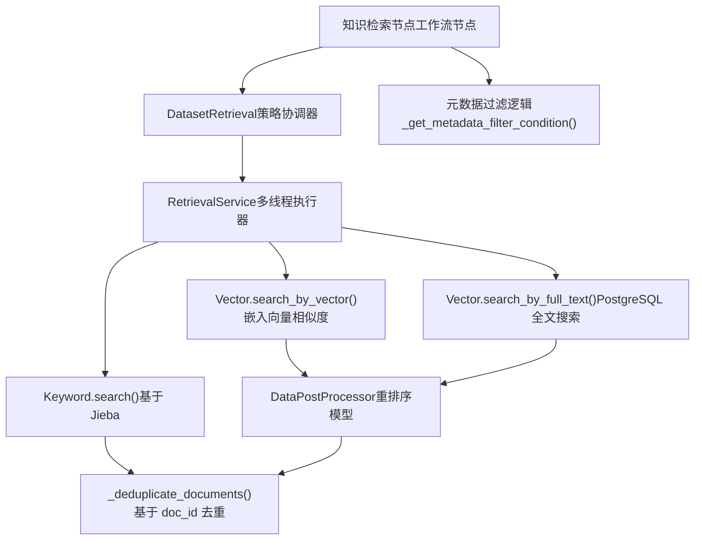
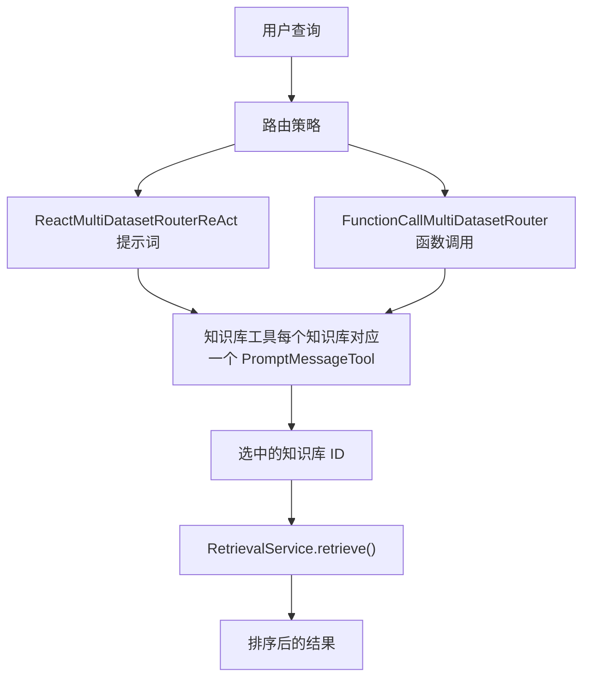
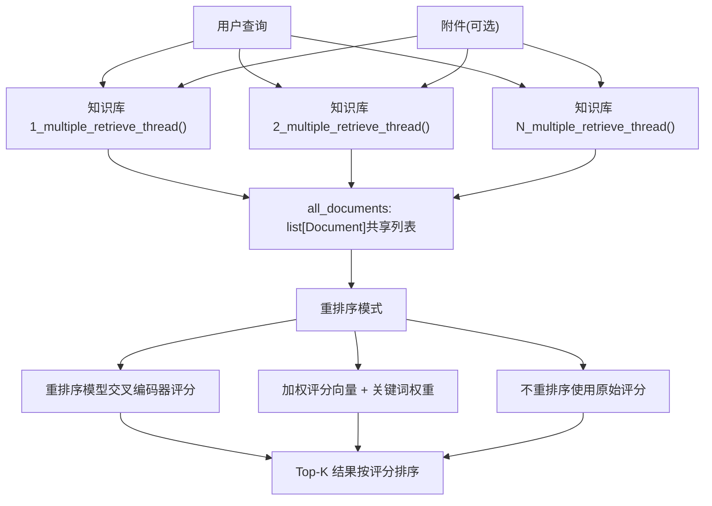
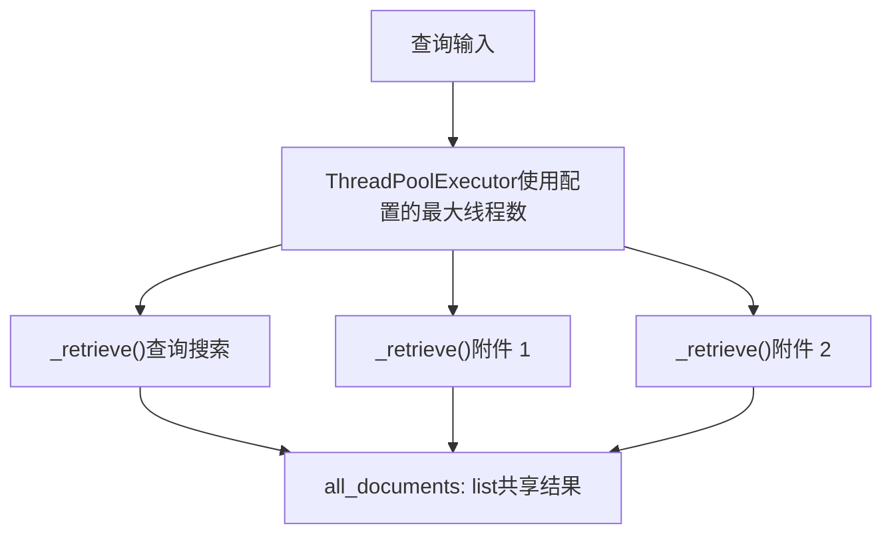
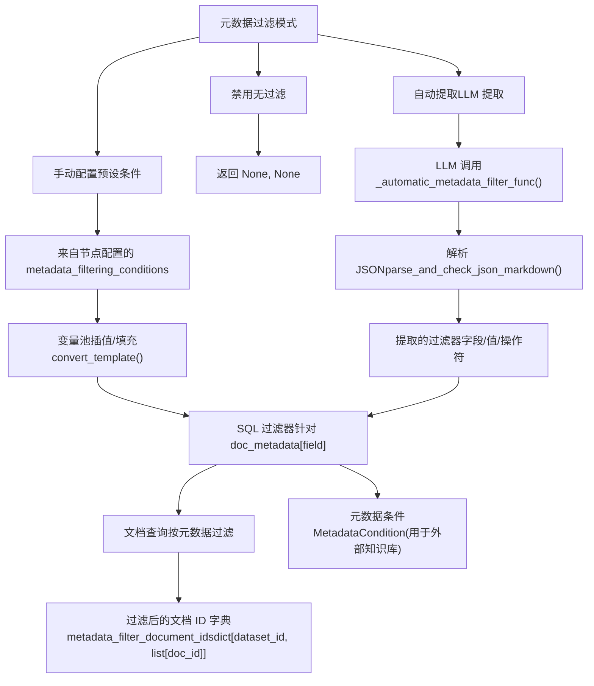
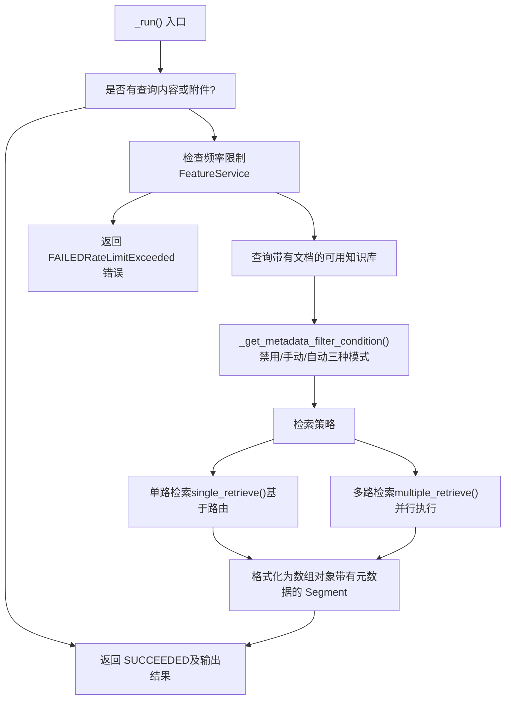
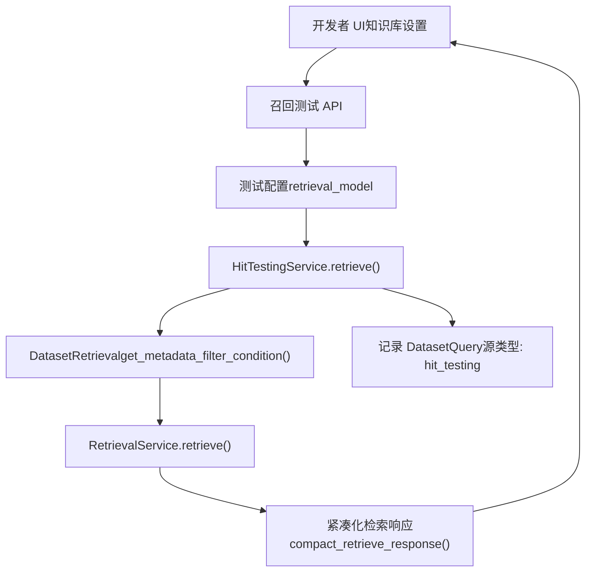
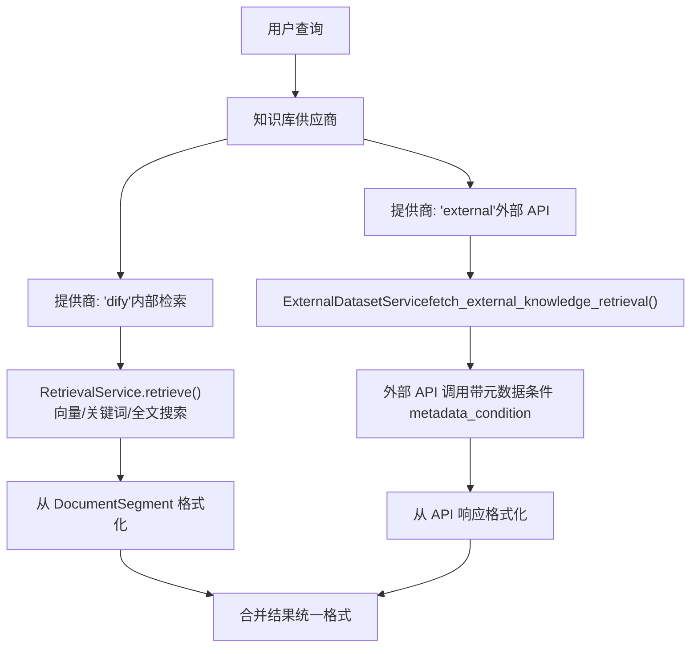

# 知识检索策略与元数据过滤

相关源文件

-   [api/core/rag/datasource/retrieval\_service.py](https://github.com/langgenius/dify/blob/92dbc94f/api/core/rag/datasource/retrieval_service.py)
-   [api/core/rag/entities/metadata\_entities.py](https://github.com/langgenius/dify/blob/92dbc94f/api/core/rag/entities/metadata_entities.py)
-   [api/core/rag/retrieval/dataset\_retrieval.py](https://github.com/langgenius/dify/blob/92dbc94f/api/core/rag/retrieval/dataset_retrieval.py)
-   [api/core/workflow/nodes/knowledge\_retrieval/entities.py](https://github.com/langgenius/dify/blob/92dbc94f/api/core/workflow/nodes/knowledge_retrieval/entities.py)
-   [api/core/workflow/nodes/knowledge\_retrieval/knowledge\_retrieval\_node.py](https://github.com/langgenius/dify/blob/92dbc94f/api/core/workflow/nodes/knowledge_retrieval/knowledge_retrieval_node.py)
-   [api/core/workflow/nodes/list\_operator/entities.py](https://github.com/langgenius/dify/blob/92dbc94f/api/core/workflow/nodes/list_operator/entities.py)
-   [api/core/workflow/nodes/list\_operator/exc.py](https://github.com/langgenius/dify/blob/92dbc94f/api/core/workflow/nodes/list_operator/exc.py)
-   [api/core/workflow/nodes/list\_operator/node.py](https://github.com/langgenius/dify/blob/92dbc94f/api/core/workflow/nodes/list_operator/node.py)
-   [api/core/workflow/nodes/question\_classifier/entities.py](https://github.com/langgenius/dify/blob/92dbc94f/api/core/workflow/nodes/question_classifier/entities.py)
-   [api/services/hit\_testing\_service.py](https://github.com/langgenius/dify/blob/92dbc94f/api/services/hit_testing_service.py)
-   [api/tests/unit\_tests/core/rag/retrieval/\_\_init\_\_.py](https://github.com/langgenius/dify/blob/92dbc94f/api/tests/unit_tests/core/rag/retrieval/__init__.py)
-   [api/tests/unit\_tests/core/rag/retrieval/test\_dataset\_retrieval.py](https://github.com/langgenius/dify/blob/92dbc94f/api/tests/unit_tests/core/rag/retrieval/test_dataset_retrieval.py)
-   [api/tests/unit\_tests/core/workflow/nodes/test\_list\_operator.py](https://github.com/langgenius/dify/blob/92dbc94f/api/tests/unit_tests/core/workflow/nodes/test_list_operator.py)
-   [web/app/components/workflow/nodes/knowledge-retrieval/components/metadata/condition-list/utils.ts](https://github.com/langgenius/dify/blob/92dbc94f/web/app/components/workflow/nodes/knowledge-retrieval/components/metadata/condition-list/utils.ts)
-   [web/app/components/workflow/nodes/knowledge-retrieval/components/metadata/metadata-icon.tsx](https://github.com/langgenius/dify/blob/92dbc94f/web/app/components/workflow/nodes/knowledge-retrieval/components/metadata/metadata-icon.tsx)
-   [web/app/components/workflow/nodes/list-operator/components/extract-input.tsx](https://github.com/langgenius/dify/blob/92dbc94f/web/app/components/workflow/nodes/list-operator/components/extract-input.tsx)
-   [web/app/components/workflow/nodes/list-operator/components/filter-condition.tsx](https://github.com/langgenius/dify/blob/92dbc94f/web/app/components/workflow/nodes/list-operator/components/filter-condition.tsx)
-   [web/app/components/workflow/nodes/list-operator/default.ts](https://github.com/langgenius/dify/blob/92dbc94f/web/app/components/workflow/nodes/list-operator/default.ts)
-   [web/app/components/workflow/nodes/list-operator/panel.tsx](https://github.com/langgenius/dify/blob/92dbc94f/web/app/components/workflow/nodes/list-operator/panel.tsx)
-   [web/app/components/workflow/nodes/list-operator/types.ts](https://github.com/langgenius/dify/blob/92dbc94f/web/app/components/workflow/nodes/list-operator/types.ts)
-   [web/app/components/workflow/nodes/utils.ts](https://github.com/langgenius/dify/blob/92dbc94f/web/app/components/workflow/nodes/utils.ts)

## 目的与范围

本文档介绍了 Dify 中的知识检索系统，重点阐述了如何从知识库中检索文档，以及如何应用元数据过滤来缩小搜索结果范围。检索系统支持多种搜索方法（关键词、语义、全文）、两种编排策略（基于路由的单知识库选择 vs. 多知识库并行检索）以及三种元数据过滤模式（禁用、手动配置、基于 LLM 的自动提取）。

有关文档如何初始索引和存储的信息，请参阅 [文档索引流水线](/langgenius/dify/4.2-document-indexing-pipeline)。有关向量数据库集成的详情，请参阅 [向量数据库集成](/langgenius/dify/4.4-vector-database-integration)。有关知识库管理的信息，请参阅 [知识库服务与文档管理](/langgenius/dify/4.1-dataset-service-and-document-management)。

---

## 检索系统架构

检索系统分为三个层级：编排层、检索服务层和搜索后端层。`KnowledgeRetrievalNode` 作为工作流的入口点，`DatasetRetrieval` 负责协调检索策略，而 `RetrievalService` 则负责在多个搜索方法间执行并行搜索。


**来源：** [api/core/workflow/nodes/knowledge\_retrieval/knowledge\_retrieval\_node.py85-222](https://github.com/langgenius/dify/blob/92dbc94f/api/core/workflow/nodes/knowledge_retrieval/knowledge_retrieval_node.py#L85-L222) [api/core/rag/retrieval/dataset\_retrieval.py77-93](https://github.com/langgenius/dify/blob/92dbc94f/api/core/rag/retrieval/dataset_retrieval.py#L77-L93) [api/core/rag/datasource/retrieval\_service.py39-113](https://github.com/langgenius/dify/blob/92dbc94f/api/core/rag/datasource/retrieval_service.py#L39-L113)

---

## 检索策略

Dify 支持两种基本的检索策略：**N 选 1 检索**（基于路由的选择）和**多路并行检索**（并行搜索并合并结果）。

### N 选 1 检索策略 (Single Dataset Retrieval Strategy)

单路检索使用基于 LLM 的路由器在搜索前选择最相关的知识库。当存在多个专业化知识库时，这种方式可以缩小搜索范围并提高性能。


路由器为每个可用的知识库创建一个 `PromptMessageTool`，将知识库的描述作为工具描述。LLM 根据查询选择最合适的知识库。

**来源：** [api/core/rag/retrieval/dataset\_retrieval.py329-459](https://github.com/langgenius/dify/blob/92dbc94f/api/core/rag/retrieval/dataset_retrieval.py#L329-L459)

### 多路并行检索策略 (Multiple Dataset Retrieval Strategy)

多路检索并行搜索所有可用的知识库并合并结果。这是默认策略，适用于查询可能跨越多个知识领域的情况。


每个线程独立执行 `RetrievalService.retrieve()`，并将结果添加到共享列表中。所有线程完成后，结果会进行去重和可选的重排序。

**来源：** [api/core/rag/retrieval/dataset\_retrieval.py461-587](https://github.com/langgenius/dify/blob/92dbc94f/api/core/rag/retrieval/dataset_retrieval.py#L461-L587) [api/core/rag/retrieval/dataset\_retrieval.py588-653](https://github.com/langgenius/dify/blob/92dbc94f/api/core/rag/retrieval/dataset_retrieval.py#L588-L653)

---

## 搜索方法

`RetrievalService` 支持三种搜索方法，这些方法可以独立执行，也可以并行执行以实现混合搜索。

### 搜索方法对比

| 方法 | 索引类型 | 使用场景 | 配置 |
| --- | --- | --- | --- |
| `KEYWORD_SEARCH` | 经济型 (Jieba) | 精确术语匹配，多语言 | `indexing_technique: "economy"` |
| `SEMANTIC_SEARCH` | 高质量 (向量) | 基于含义的相似度 | `search_method: "semantic_search"` |
| `FULL_TEXT_SEARCH` | 高质量 (PostgreSQL 全文搜索) | 自然语言查询 | `search_method: "full_text_search"` |
| `HYBRID_SEARCH` | 高质量 (向量 + 全文搜索) | 两者兼顾 | `search_method: "hybrid_search"` |

### 关键词搜索

关键词搜索在经济模式知识库中使用 Jieba 关键词表处理器。它执行精确的词元匹配，不具备语义理解能力。

**实现：** [api/core/rag/datasource/retrieval\_service.py178-202](https://github.com/langgenius/dify/blob/92dbc94f/api/core/rag/datasource/retrieval_service.py#L178-L202)

```
# 由 RetrievalService.keyword_search() 调用
keyword = Keyword(dataset=dataset)
documents = keyword.search(
    cls.escape_query_for_search(query),
    top_k=top_k,
    document_ids_filter=document_ids_filter
)
```
### 语义搜索

语义搜索将查询转换为嵌入向量 (embedding vector)，并在向量数据库中执行相似度搜索。支持使用交叉编码器 (cross-encoder) 模型进行可选的重排序。

**实现：** [api/core/rag/datasource/retrieval\_service.py204-295](https://github.com/langgenius/dify/blob/92dbc94f/api/core/rag/datasource/retrieval_service.py#L204-L295)

```
# 由 RetrievalService.embedding_search() 调用
vector = Vector(dataset=dataset)
documents = vector.search_by_vector(
    query,
    search_type="similarity_score_threshold",
    top_k=top_k,
    score_threshold=score_threshold,
    filter={"group_id": [dataset.id]},
    document_ids_filter=document_ids_filter,
)
```
### 全文搜索

全文搜索通过向量数据库接口利用 PostgreSQL 原生的全文搜索能力。它对查询进行分词，并与已索引的文档进行匹配。

**实现：** [api/core/rag/datasource/retrieval\_service.py297-343](https://github.com/langgenius/dify/blob/92dbc94f/api/core/rag/datasource/retrieval_service.py#L297-L343)

```
# 由 RetrievalService.full_text_index_search() 调用
vector_processor = Vector(dataset=dataset)
documents = vector_processor.search_by_full_text(
    cls.escape_query_for_search(query),
    top_k=top_k,
    document_ids_filter=document_ids_filter
)
```
### 多线程执行

`RetrievalService.retrieve()` 方法使用 `ThreadPoolExecutor` 并行运行多个搜索方法：


**来源：** [api/core/rag/datasource/retrieval\_service.py42-113](https://github.com/langgenius/dify/blob/92dbc94f/api/core/rag/datasource/retrieval_service.py#L42-L113)

---

## 元数据过滤系统

元数据过滤通过对 `Document.doc_metadata` JSONB 字段应用条件来缩小搜索结果范围。系统支持三种模式：禁用、手动配置（预设条件）和自动提取（基于 LLM 提取条件）。

### 元数据过滤架构


**来源：** [api/core/workflow/nodes/knowledge\_retrieval/knowledge\_retrieval\_node.py441-533](https://github.com/langgenius/dify/blob/92dbc94f/api/core/workflow/nodes/knowledge_retrieval/knowledge_retrieval_node.py#L441-L533)

### 手动元数据过滤

手动模式使用在节点配置中定义的预设条件。条件支持从工作流变量池中进行变量插值（变量替换）。

**支持的比较操作符：**

| 操作符 | SQL 转换 | 值类型 |
| --- | --- | --- |
| `contains` (包含) | `LIKE '%value%'` | 字符串 |
| `not contains` (不包含) | `NOT LIKE '%value%'` | 字符串 |
| `start with` (以...开始) | `LIKE 'value%'` | 字符串 |
| `end with` (以...结束) | `LIKE '%value'` | 字符串 |
| `is`, `=` | `= value` | 字符串或数值 |
| `is not`, `≠` | `!= value` | 字符串或数值 |
| `in` (在...中) | `IN (value_list)` | 逗号分隔或列表 |
| `not in` (不在...中) | `NOT IN (value_list)` | 逗号分隔或列表 |
| `empty` (为空) | `IS NULL` | 无 |
| `not empty` (不为空) | `IS NOT NULL` | 无 |
| `before` (在...之前), `<` | `< value` | 数值 |
| `after` (在...之后), `>` | `> value` | 数值 |
| `≤`, `<=` | `<= value` | 数值 |
| `≥`, `>=` | `>= value` | 数值 |

**实现：** [api/core/workflow/nodes/knowledge\_retrieval/knowledge\_retrieval\_node.py606-685](https://github.com/langgenius/dify/blob/92dbc94f/api/core/workflow/nodes/knowledge_retrieval/knowledge_retrieval_node.py#L606-L685)

**配置示例：**

```
metadata_filtering_conditions = {
    "logical_operator": "and",  # 或 "or"
    "conditions": [
        {
            "name": "author",
            "comparison_operator": "is",
            "value": "{{#sys.user_name#}}"  # 变量插值
        },
        {
            "name": "publish_date",
            "comparison_operator": "after",
            "value": "2024-01-01"
        }
    ]
}
```
### 自动元数据过滤 (基于 LLM)

自动模式使用 LLM 从用户查询中提取元数据字段名、值和比较操作符。这允许根据自然语言进行动态过滤。

> **[Mermaid 序列图]**
> *(图表结构无法解析)*

**提示词模板结构：**

自动过滤提示词遵循与问题分类器类似的模式，使用包含示例的 System/User/Assistant 消息：

**来源：** [api/core/workflow/nodes/knowledge\_retrieval/template\_prompts.py1-49](https://github.com/langgenius/dify/blob/92dbc94f/api/core/workflow/nodes/knowledge_retrieval/template_prompts.py#L1-L49)

| 提示词组件 | 用途 |
| --- | --- |
| `METADATA_FILTER_SYSTEM_PROMPT` | 定义提取任务和 JSON 格式要求 |
| `METADATA_FILTER_USER_PROMPT_1` | 第一个输入示例（字段列表 + 查询） |
| `METADATA_FILTER_ASSISTANT_PROMPT_1` | 第一个输出示例（提取的过滤器） |
| `METADATA_FILTER_USER_PROMPT_2` | 第二个输入示例 |
| `METADATA_FILTER_ASSISTANT_PROMPT_2` | 第二个输出示例 |
| `METADATA_FILTER_USER_PROMPT_3` | 实际的用户查询模板 |

**LLM 响应格式：**

```
{
    "metadata_map": [
        {
            "metadata_field_name": "author",
            "metadata_field_value": "John Doe",
            "comparison_operator": "is"
        },
        {
            "metadata_field_name": "category",
            "metadata_field_value": "technical",
            "comparison_operator": "contains"
        }
    ]
}
```
**实现：** [api/core/workflow/nodes/knowledge\_retrieval/knowledge\_retrieval\_node.py535-604](https://github.com/langgenius/dify/blob/92dbc94f/api/core/workflow/nodes/knowledge_retrieval/knowledge_retrieval_node.py#L535-L604)

系统会在构建 SQL 过滤器之前，验证提取的字段名是否存在于 `DatasetMetadata` 表中。

---

## 重排序 (Reranking)

重排序是检索后的一个步骤，使用更复杂的模型（通常是交叉编码器 cross-encoder）对文档进行重新评分。它以增加延迟为代价换取相关性的提升。

### 重排序模式

| 模式 | 实现方式 | 使用场景 |
| --- | --- | --- |
| `reranking_model` | 交叉编码器模型（如 Cohere, Jina） | 相关性最佳，速度较慢 |
| `weighted_score` | 向量评分与关键词评分的加权平均 | 速度快，无需外部 API |
| `disabled` | 使用原始搜索评分 | 速度最快，无重排序 |

### 数据后处理器 (DataPostProcessor)

`DataPostProcessor` 类封装了重排序逻辑，并在初始检索后被调用：

```
data_post_processor = DataPostProcessor(
    str(dataset.tenant_id),
    str(RerankMode.RERANKING_MODEL),
    reranking_model,
    None,
    False
)
reranked_docs = data_post_processor.invoke(
    query=query,
    documents=documents,
    score_threshold=score_threshold,
    top_n=len(documents),
    query_type=query_type,
)
```
**来源：** [api/core/rag/datasource/retrieval\_service.py258-291](https://github.com/langgenius/dify/blob/92dbc94f/api/core/rag/datasource/retrieval_service.py#L258-L291) [api/core/rag/datasource/retrieval\_service.py329-339](https://github.com/langgenius/dify/blob/92dbc94f/api/core/rag/datasource/retrieval_service.py#L329-L339)

### 加权评分重排序 (Weighted Score Reranking)

对于加权评分模式，系统结合了向量搜索和关键词搜索的评分：

```
weights = {
    "vector_setting": {
        "vector_weight": 0.7,
        "embedding_provider_name": "openai",
        "embedding_model_name": "text-embedding-3-small"
    },
    "keyword_setting": {
        "keyword_weight": 0.3
    }
}
```
最终评分为：`score = (vector_score * vector_weight) + (keyword_score * keyword_weight)`

**来源：** [api/core/workflow/nodes/knowledge\_retrieval/knowledge\_retrieval\_node.py315-332](https://github.com/langgenius/dify/blob/92dbc94f/api/core/workflow/nodes/knowledge_retrieval/knowledge_retrieval_node.py#L315-L332)

---

## 与工作流节点的集成

`KnowledgeRetrievalNode` 将检索系统集成到工作流执行引擎中。它输出一个包含元数据的检索结果数组。

### 节点执行流程


**来源：** [api/core/workflow/nodes/knowledge\_retrieval/knowledge\_retrieval\_node.py123-221](https://github.com/langgenius/dify/blob/92dbc94f/api/core/workflow/nodes/knowledge_retrieval/knowledge_retrieval_node.py#L123-L221)

### 输出结构

每个检索结果包含：

```
{
    "metadata": {
        "_source": "knowledge",
        "dataset_id": "...",
        "dataset_name": "...",
        "document_id": "...",
        "document_name": "...",
        "data_source_type": "upload_file",
        "segment_id": "...",
        "retriever_from": "workflow",
        "score": 0.85,
        "child_chunks": [...],  # 用于父子索引
        "segment_hit_count": 5,
        "segment_word_count": 150,
        "segment_position": 1,
        "segment_index_node_hash": "...",
        "doc_metadata": {...}
    },
    "title": "文档标题",
    "content": "检索到的文本内容...",
    "files": [...]  # 附件文件（如果有）
}
```
**来源：** [api/core/workflow/nodes/knowledge\_retrieval/knowledge\_retrieval\_node.py356-431](https://github.com/langgenius/dify/blob/92dbc94f/api/core/workflow/nodes/knowledge_retrieval/knowledge_retrieval_node.py#L356-L431)

---

## 召回测试与开发工具

`HitTestingService` (召回测试服务) 提供了一个开发接口，用于在不运行完整工作流的情况下测试检索配置。

### 召回测试架构


**关键特性：**

-   在部署到生产环境前测试检索配置。
-   在 `DatasetQuery` 表中记录查询以供分析。
-   支持手动的元数据过滤条件。
-   返回带有分段详情的格式化结果。

**来源：** [api/services/hit\_testing\_service.py28-194](https://github.com/langgenius/dify/blob/92dbc94f/api/services/hit_testing_service.py#L28-L194)

---

## 外部知识库集成

外部知识库跳过内部索引流水线，将检索任务委托给外部 API。系统仍通过 `MetadataCondition` 实体支持元数据过滤。


外部知识库在 API 请求中接收序列化后的 `MetadataCondition` 对象，允许外部服务在其自身的检索逻辑中应用过滤器。

**来源：** [api/core/rag/retrieval/dataset\_retrieval.py381-400](https://github.com/langgenius/dify/blob/92dbc94f/api/core/rag/retrieval/dataset_retrieval.py#L381-L400) [api/core/rag/datasource/retrieval\_service.py115-137](https://github.com/langgenius/dify/blob/92dbc94f/api/core/rag/datasource/retrieval_service.py#L115-L137)

---

## 关键类与函数总结

| 组件 | 位置 | 用途 |
| --- | --- | --- |
| `KnowledgeRetrievalNode` | [api/core/workflow/nodes/knowledge\_retrieval/knowledge\_retrieval\_node.py85](https://github.com/langgenius/dify/blob/92dbc94f/api/core/workflow/nodes/knowledge_retrieval/knowledge_retrieval_node.py#L85-L85) | 用于检索的工作流节点 |
| `DatasetRetrieval` | [api/core/rag/retrieval/dataset\_retrieval.py77](https://github.com/langgenius/dify/blob/92dbc94f/api/core/rag/retrieval/dataset_retrieval.py#L77-L77) | 编排检索策略 |
| `RetrievalService` | [api/core/rag/datasource/retrieval\_service.py39](https://github.com/langgenius/dify/blob/92dbc94f/api/core/rag/datasource/retrieval_service.py#L39-L39) | 执行多线程搜索 |
| `_get_metadata_filter_condition()` | [api/core/workflow/nodes/knowledge\_retrieval/knowledge\_retrieval\_node.py441](https://github.com/langgenius/dify/blob/92dbc94f/api/core/workflow/nodes/knowledge_retrieval/knowledge_retrieval_node.py#L441-L441) | 构建元数据过滤器 |
| `_automatic_metadata_filter_func()` | [api/core/workflow/nodes/knowledge\_retrieval/knowledge\_retrieval\_node.py535](https://github.com/langgenius/dify/blob/92dbc94f/api/core/workflow/nodes/knowledge_retrieval/knowledge_retrieval_node.py#L535-L535) | 基于 LLM 提取过滤器 |
| `_process_metadata_filter_func()` | [api/core/workflow/nodes/knowledge\_retrieval/knowledge\_retrieval\_node.py606](https://github.com/langgenius/dify/blob/92dbc94f/api/core/workflow/nodes/knowledge_retrieval/knowledge_retrieval_node.py#L606-L606) | 构建 SQL 过滤器 |
| `single_retrieve()` | [api/core/rag/retrieval/dataset\_retrieval.py329](https://github.com/langgenius/dify/blob/92dbc94f/api/core/rag/retrieval/dataset_retrieval.py#L329-L329) | 基于路由的单路检索 |
| `multiple_retrieve()` | [api/core/rag/retrieval/dataset\_retrieval.py461](https://github.com/langgenius/dify/blob/92dbc94f/api/core/rag/retrieval/dataset_retrieval.py#L461-L461) | 并行的多路检索 |
| `keyword_search()` | [api/core/rag/datasource/retrieval\_service.py178](https://github.com/langgenius/dify/blob/92dbc94f/api/core/rag/datasource/retrieval_service.py#L178-L178) | Jieba 关键词搜索 |
| `embedding_search()` | [api/core/rag/datasource/retrieval\_service.py204](https://github.com/langgenius/dify/blob/92dbc94f/api/core/rag/datasource/retrieval_service.py#L204-L204) | 向量相似度搜索 |
| `full_text_index_search()` | [api/core/rag/datasource/retrieval\_service.py297](https://github.com/langgenius/dify/blob/92dbc94f/api/core/rag/datasource/retrieval_service.py#L297-L297) | PostgreSQL 全文搜索 |
| `format_retrieval_documents()` | [api/core/rag/datasource/retrieval\_service.py349](https://github.com/langgenius/dify/blob/92dbc94f/api/core/rag/datasource/retrieval_service.py#L349-L349) | 转换为检索分段 (RetrievalSegments) |
| `HitTestingService` | [api/services/hit\_testing\_service.py28](https://github.com/langgenius/dify/blob/92dbc94f/api/services/hit_testing_service.py#L28-L28) | 召回测试开发接口 |
