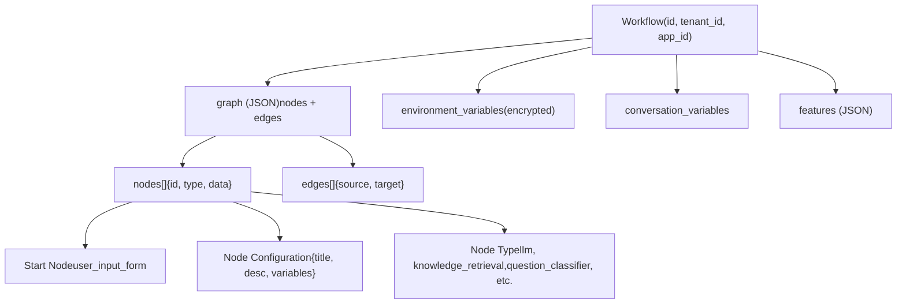
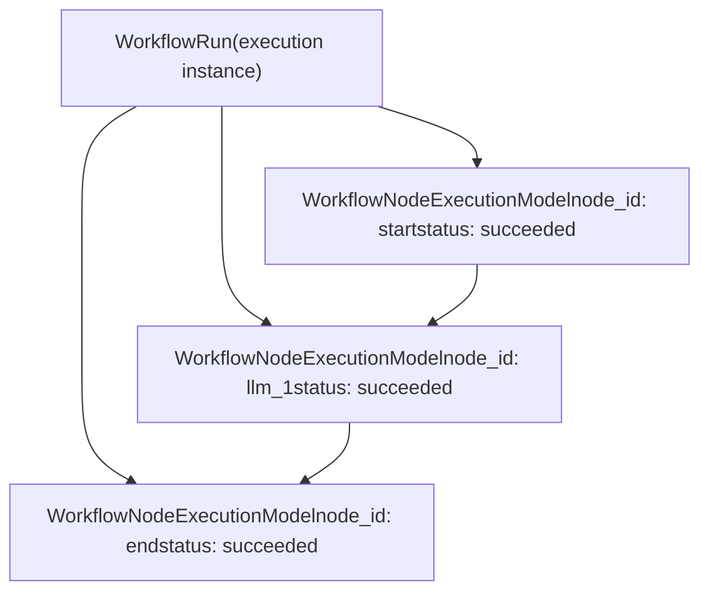
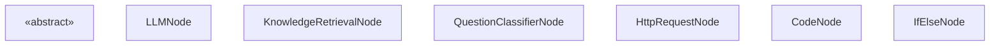
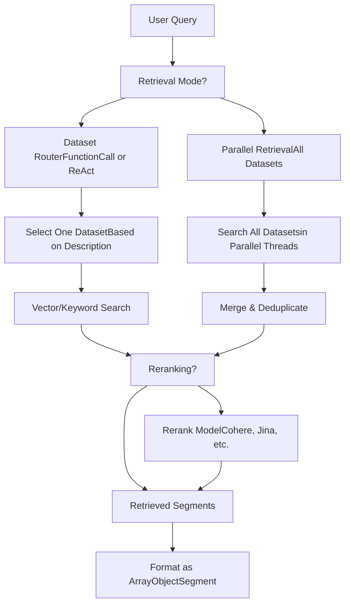
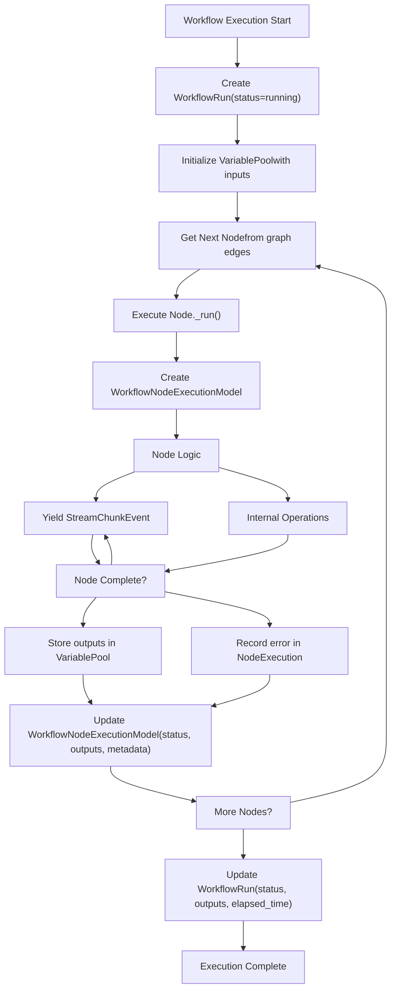
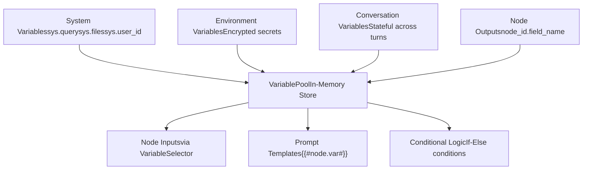

# 工作流系统与节点执行

相关源文件

-   [api/core/rag/datasource/retrieval\_service.py](https://github.com/langgenius/dify/blob/92dbc94f/api/core/rag/datasource/retrieval_service.py)
-   [api/core/rag/entities/metadata\_entities.py](https://github.com/langgenius/dify/blob/92dbc94f/api/core/rag/entities/metadata_entities.py)
-   [api/core/rag/retrieval/dataset\_retrieval.py](https://github.com/langgenius/dify/blob/92dbc94f/api/core/rag/retrieval/dataset_retrieval.py)
-   [api/core/workflow/nodes/knowledge\_retrieval/entities.py](https://github.com/langgenius/dify/blob/92dbc94f/api/core/workflow/nodes/knowledge_retrieval/entities.py)
-   [api/core/workflow/nodes/knowledge\_retrieval/knowledge\_retrieval\_node.py](https://github.com/langgenius/dify/blob/92dbc94f/api/core/workflow/nodes/knowledge_retrieval/knowledge_retrieval_node.py)
-   [api/core/workflow/nodes/list\_operator/entities.py](https://github.com/langgenius/dify/blob/92dbc94f/api/core/workflow/nodes/list_operator/entities.py)
-   [api/core/workflow/nodes/list\_operator/exc.py](https://github.com/langgenius/dify/blob/92dbc94f/api/core/workflow/nodes/list_operator/exc.py)
-   [api/core/workflow/nodes/list\_operator/node.py](https://github.com/langgenius/dify/blob/92dbc94f/api/core/workflow/nodes/list_operator/node.py)
-   [api/core/workflow/nodes/question\_classifier/entities.py](https://github.com/langgenius/dify/blob/92dbc94f/api/core/workflow/nodes/question_classifier/entities.py)
-   [api/models/account.py](https://github.com/langgenius/dify/blob/92dbc94f/api/models/account.py)
-   [api/models/api\_based\_extension.py](https://github.com/langgenius/dify/blob/92dbc94f/api/models/api_based_extension.py)
-   [api/models/dataset.py](https://github.com/langgenius/dify/blob/92dbc94f/api/models/dataset.py)
-   [api/models/model.py](https://github.com/langgenius/dify/blob/92dbc94f/api/models/model.py)
-   [api/models/oauth.py](https://github.com/langgenius/dify/blob/92dbc94f/api/models/oauth.py)
-   [api/models/provider.py](https://github.com/langgenius/dify/blob/92dbc94f/api/models/provider.py)
-   [api/models/source.py](https://github.com/langgenius/dify/blob/92dbc94f/api/models/source.py)
-   [api/models/task.py](https://github.com/langgenius/dify/blob/92dbc94f/api/models/task.py)
-   [api/models/tools.py](https://github.com/langgenius/dify/blob/92dbc94f/api/models/tools.py)
-   [api/models/trigger.py](https://github.com/langgenius/dify/blob/92dbc94f/api/models/trigger.py)
-   [api/models/web.py](https://github.com/langgenius/dify/blob/92dbc94f/api/models/web.py)
-   [api/models/workflow.py](https://github.com/langgenius/dify/blob/92dbc94f/api/models/workflow.py)
-   [api/services/hit\_testing\_service.py](https://github.com/langgenius/dify/blob/92dbc94f/api/services/hit_testing_service.py)
-   [api/tests/test\_containers\_integration\_tests/services/test\_advanced\_prompt\_template\_service.py](https://github.com/langgenius/dify/blob/92dbc94f/api/tests/test_containers_integration_tests/services/test_advanced_prompt_template_service.py)
-   [api/tests/test\_containers\_integration\_tests/services/test\_agent\_service.py](https://github.com/langgenius/dify/blob/92dbc94f/api/tests/test_containers_integration_tests/services/test_agent_service.py)
-   [api/tests/test\_containers\_integration\_tests/tasks/\_\_init\_\_.py](https://github.com/langgenius/dify/blob/92dbc94f/api/tests/test_containers_integration_tests/tasks/__init__.py)
-   [api/tests/test\_containers\_integration\_tests/tasks/test\_add\_document\_to\_index\_task.py](https://github.com/langgenius/dify/blob/92dbc94f/api/tests/test_containers_integration_tests/tasks/test_add_document_to_index_task.py)
-   [api/tests/unit\_tests/core/rag/retrieval/\_\_init\_\_.py](https://github.com/langgenius/dify/blob/92dbc94f/api/tests/unit_tests/core/rag/retrieval/__init__.py)
-   [api/tests/unit\_tests/core/rag/retrieval/test\_dataset\_retrieval.py](https://github.com/langgenius/dify/blob/92dbc94f/api/tests/unit_tests/core/rag/retrieval/test_dataset_retrieval.py)
-   [api/tests/unit\_tests/core/test\_provider\_manager.py](https://github.com/langgenius/dify/blob/92dbc94f/api/tests/unit_tests/core/test_provider_manager.py)
-   [api/tests/unit\_tests/core/workflow/nodes/test\_list\_operator.py](https://github.com/langgenius/dify/blob/92dbc94f/api/tests/unit_tests/core/workflow/nodes/test_list_operator.py)
-   [web/app/components/workflow/nodes/knowledge-retrieval/components/metadata/condition-list/utils.ts](https://github.com/langgenius/dify/blob/92dbc94f/web/app/components/workflow/nodes/knowledge-retrieval/components/metadata/condition-list/utils.ts)
-   [web/app/components/workflow/nodes/knowledge-retrieval/components/metadata/metadata-icon.tsx](https://github.com/langgenius/dify/blob/92dbc94f/web/app/components/workflow/nodes/knowledge-retrieval/components/metadata/metadata-icon.tsx)
-   [web/app/components/workflow/nodes/list-operator/components/extract-input.tsx](https://github.com/langgenius/dify/blob/92dbc94f/web/app/components/workflow/nodes/list-operator/components/extract-input.tsx)
-   [web/app/components/workflow/nodes/list-operator/components/filter-condition.tsx](https://github.com/langgenius/dify/blob/92dbc94f/web/app/components/workflow/nodes/list-operator/components/filter-condition.tsx)
-   [web/app/components/workflow/nodes/list-operator/default.ts](https://github.com/langgenius/dify/blob/92dbc94f/web/app/components/workflow/nodes/list-operator/default.ts)
-   [web/app/components/workflow/nodes/list-operator/panel.tsx](https://github.com/langgenius/dify/blob/92dbc94f/web/app/components/workflow/nodes/list-operator/panel.tsx)
-   [web/app/components/workflow/nodes/list-operator/types.ts](https://github.com/langgenius/dify/blob/92dbc94f/web/app/components/workflow/nodes/list-operator/types.ts)
-   [web/app/components/workflow/nodes/utils.ts](https://github.com/langgenius/dify/blob/92dbc94f/web/app/components/workflow/nodes/utils.ts)

## 目的与范围

本文档涵盖了 Dify 中的工作流执行引擎，它通过执行互连的节点来编排多步骤的 AI 管道。它详细介绍了工作流定义结构、节点执行模型、内置节点类型以及支持节点间数据流动的运行时变量池。

有关特定节点配置的信息，请参阅[其他工作流节点类型](/langgenius/dify/5.5-trigger-system-and-workflow-automation)。有关工作流作为工具的集成，请参阅[工具提供商架构](/langgenius/dify/6.1-tool-provider-architecture)。有关应用级工作流配置，请参阅[应用程序类型与执行模式](/langgenius/dify/2.3-application-types-and-execution-modes)。

---

## 工作流定义与结构

### Workflow 模型

`Workflow` 类 [api/models/workflow.py100-554](https://github.com/langgenius/dify/blob/92dbc94f/api/models/workflow.py#L100-L554) 表示存储在数据库中的工作流定义。每个工作流包含：

-   **图结构 (Graph Structure)**：定义执行流的节点和边的 JSON 表示
-   **类型 (Type)**：`workflow`、`chat` 或 `rag-pipeline` [api/models/workflow.py60-93](https://github.com/langgenius/dify/blob/92dbc94f/api/models/workflow.py#L60-L93)
-   **版本 (Version)**：`draft` 表示工作版本，发布版本为时间戳 [api/models/workflow.py166](https://github.com/langgenius/dify/blob/92dbc94f/api/models/workflow.py#L166-L166)
-   **环境变量 (Environment Variables)**：所有节点均可用的加密变量 [api/models/workflow.py428-461](https://github.com/langgenius/dify/blob/92dbc94f/api/models/workflow.py#L428-L461)
-   **对话变量 (Conversation Variables)**：跨对话轮次维护的状态 [api/models/workflow.py518-532](https://github.com/langgenius/dify/blob/92dbc94f/api/models/workflow.py#L518-L532)
-   **特性 (Features)**：文件上传、开场白等配置 [api/models/workflow.py282-313](https://github.com/langgenius/dify/blob/92dbc94f/api/models/workflow.py#L282-L313)


**来源：** [api/models/workflow.py100-554](https://github.com/langgenius/dify/blob/92dbc94f/api/models/workflow.py#L100-L554)

### 图 JSON 结构

工作流图存储为包含节点和边的 JSON blob [api/models/workflow.py212-231](https://github.com/langgenius/dify/blob/92dbc94f/api/models/workflow.py#L212-L231)：

| 字段 | 类型 | 描述 |
| --- | --- | --- |
| `nodes` | Array | 具有 id、类型和数据的节点配置列表 |
| `edges` | Array | 定义执行顺序的节点间连接 |
| `viewport` | Object | UI 画布位置和缩放级别 |

图中的每个节点包含 [api/models/workflow.py315-361](https://github.com/langgenius/dify/blob/92dbc94f/api/models/workflow.py#L315-L361)：

```
{
  "id": "node_id",
  "data": {
    "type": "llm",
    "title": "LLM Node",
    "variables": [...],
    "model": {...},
    "prompt_template": [...]
  }
}
```
`walk_nodes()` 方法 [api/models/workflow.py315-361](https://github.com/langgenius/dify/blob/92dbc94f/api/models/workflow.py#L315-L361) 提供对所有节点的迭代，可按类型过滤。

**来源：** [api/models/workflow.py212-361](https://github.com/langgenius/dify/blob/92dbc94f/api/models/workflow.py#L212-L361)

---

## 工作流执行模型

### WorkflowRun 实体

`WorkflowRun` [api/models/workflow.py556-715](https://github.com/langgenius/dify/blob/92dbc94f/api/models/workflow.py#L556-L715) 表示工作流的单个执行实例：

| 字段 | 类型 | 描述 |
| --- | --- | --- |
| `id` | UUID | 唯一运行标识符 |
| `workflow_id` | UUID | 引用工作流定义 |
| `tenant_id` | UUID | 工作空间标识符 |
| `app_id` | UUID | 应用程序标识符 |
| `triggered_from` | String | `debugging` 或 `app-run` |
| `version` | String | 执行的工作流版本 |
| `graph` | JSON | 执行时工作流图的快照 |
| `inputs` | JSON | 提供给工作流的输入变量 |
| `status` | String | `running`, `succeeded`, `failed`, `stopped`, `partial-succeeded` |
| `outputs` | JSON | 最终输出值 |
| `error` | Text | 如果失败的错误消息 |
| `elapsed_time` | Float | 总执行时间（秒） |
| `total_tokens` | BigInt | 累计使用的 LLM token |
| `total_steps` | Int | 执行的节点数 |
| `exceptions_count` | Int | 节点失败计数 |
| `created_by_role` | String | `account` 或 `end_user` |
| `created_at` | Timestamp | 执行开始时间 |
| `finished_at` | Timestamp | 执行结束时间 |

**来源：** [api/models/workflow.py556-715](https://github.com/langgenius/dify/blob/92dbc94f/api/models/workflow.py#L556-L715)

### WorkflowNodeExecutionModel

单个节点的执行在 `WorkflowNodeExecutionModel` [api/models/workflow.py727-1078](https://github.com/langgenius/dify/blob/92dbc94f/api/models/workflow.py#L727-L1078) 中跟踪：


每个节点执行记录包含 [api/models/workflow.py727-896](https://github.com/langgenius/dify/blob/92dbc94f/api/models/workflow.py#L727-L896)：

-   **执行上下文**：`workflow_run_id`, `node_id`, `node_type`, `index`（执行顺序）
-   **输入/输出**：消耗和产生的变量的序列化 JSON
-   **处理数据**：LLM 提示词、API 响应、中间计算结果
-   **状态**：`running`, `succeeded`, `failed`, `stopped`
-   **指标**：`elapsed_time`, `execution_metadata`（token、价格）
-   **错误信息**：失败执行的 `error`, `error_type`
-   **执行类型**：`single-step`（调试）或 `workflow-run`

**来源：** [api/models/workflow.py727-1078](https://github.com/langgenius/dify/blob/92dbc94f/api/models/workflow.py#L727-L1078)

### 执行状态流

> **[Mermaid stateDiagram]**
> *(图表结构无法解析)*

**来源：** [api/models/workflow.py610](https://github.com/langgenius/dify/blob/92dbc94f/api/models/workflow.py#L610-L610) [api/core/workflow/enums.py](https://github.com/langgenius/dify/blob/92dbc94f/api/core/workflow/enums.py)

---

## 节点架构与基类

### 节点类层次结构

所有工作流节点都继承自抽象 `Node` 基类：


**来源：** [api/core/workflow/nodes/base/node.py](https://github.com/langgenius/dify/blob/92dbc94f/api/core/workflow/nodes/base/node.py) [api/core/workflow/nodes/llm/node.py108-351](https://github.com/langgenius/dify/blob/92dbc94f/api/core/workflow/nodes/llm/node.py#L108-L351) [api/core/workflow/nodes/knowledge\_retrieval/knowledge\_retrieval\_node.py85-432](https://github.com/langgenius/dify/blob/92dbc94f/api/core/workflow/nodes/knowledge_retrieval/knowledge_retrieval_node.py#L85-L432) [api/core/workflow/nodes/question\_classifier/question\_classifier\_node.py46-232](https://github.com/langgenius/dify/blob/92dbc94f/api/core/workflow/nodes/question_classifier/question_classifier_node.py#L46-L232)

### 节点执行类型

节点有两种执行类型 [api/core/workflow/enums.py](https://github.com/langgenius/dify/blob/92dbc94f/api/core/workflow/enums.py)：

| 类型 | 描述 | 节点示例 |
| --- | --- | --- |
| `SEQUENTIAL` | 标准线性执行 | LLM, 知识检索, HTTP 请求, 代码 |
| `BRANCH` | 带有边选择的条件路由 | 问题分类器, If-Else |

分支节点在其 `NodeRunResult` [api/core/workflow/nodes/question\_classifier/question\_classifier\_node.py206-218](https://github.com/langgenius/dify/blob/92dbc94f/api/core/workflow/nodes/question_classifier/question_classifier_node.py#L206-L218) 中返回一个 `edge_source_handle`，以指示要遵循哪条传出边。

**来源：** [api/core/workflow/enums.py](https://github.com/langgenius/dify/blob/92dbc94f/api/core/workflow/enums.py) [api/core/workflow/nodes/question\_classifier/question\_classifier\_node.py46-232](https://github.com/langgenius/dify/blob/92dbc94f/api/core/workflow/nodes/question_classifier/question_classifier_node.py#L46-L232)

### NodeRunResult 结构

每个节点的 `_run()` 方法返回一个 `NodeRunResult`，包含 [api/core/workflow/node\_events.py](https://github.com/langgenius/dify/blob/92dbc94f/api/core/workflow/node_events.py)：

```
{
    "status": WorkflowNodeExecutionStatus,  # SUCCEEDED, FAILED, STOPPED
    "inputs": dict,                         # 节点消耗的变量
    "process_data": dict,                   # 中间数据（提示词，响应）
    "outputs": dict,                        # 节点产生的变量
    "metadata": dict,                       # 指标（token，价格，持续时间）
    "llm_usage": LLMUsage,                 # Token 消耗详情
    "error": str | None,                    # 如果失败的错误消息
    "error_type": str | None,               # 异常类名
    "edge_source_handle": str | None        # 对于分支节点
}
```
**来源：** [api/core/workflow/node\_events.py](https://github.com/langgenius/dify/blob/92dbc94f/api/core/workflow/node_events.py)

---

## 核心节点类型

### LLM 节点

`LLMNode` [api/core/workflow/nodes/llm/node.py108-351](https://github.com/langgenius/dify/blob/92dbc94f/api/core/workflow/nodes/llm/node.py#L108-L351) 执行语言模型推理：

#### 配置

`LLMNodeData` [api/core/workflow/nodes/llm/entities.py61-91](https://github.com/langgenius/dify/blob/92dbc94f/api/core/workflow/nodes/llm/entities.py#L61-L91) 定义了节点配置：

| 字段 | 类型 | 描述 |
| --- | --- | --- |
| `model` | `ModelConfig` | 提供商，模型名称，补全参数 |
| `prompt_template` | Sequence | 聊天消息或补全模板 |
| `prompt_config` | `PromptConfig` | 用于动态提示词的 Jinja2 变量 |
| `memory` | `MemoryConfig` | 对话历史配置 |
| `context` | `ContextConfig` | 知识库上下文注入 |
| `vision` | `VisionConfig` | 图像输入配置 |
| `structured_output` | Mapping | 结构化响应的 JSON 模式 |
| `reasoning_format` | `"separated"` 或 `"tagged"` | 如何处理 `<think>` 推理标签 |

**来源：** [api/core/workflow/nodes/llm/entities.py61-91](https://github.com/langgenius/dify/blob/92dbc94f/api/core/workflow/nodes/llm/entities.py#L61-L91)

#### 执行流程

> **[Mermaid sequence]**
> *(图表结构无法解析)*

**来源：** [api/core/workflow/nodes/llm/node.py149-351](https://github.com/langgenius/dify/blob/92dbc94f/api/core/workflow/nodes/llm/node.py#L149-L351)

#### 流式传输和输出处理

节点在执行期间生成事件 [api/core/workflow/nodes/llm/node.py255-283](https://github.com/langgenius/dify/blob/92dbc94f/api/core/workflow/nodes/llm/node.py#L255-L283)：

1.  **StreamChunkEvent**：随着从 LLM 到达的增量文本块
2.  **ModelInvokeCompletedEvent**：包含完整文本、使用情况和 finish\_reason 的最终结果
3.  **StreamCompletedEvent**：包含最终输出的 NodeRunResult 包装

对于支持推理的模型 [api/core/workflow/nodes/llm/node.py266-277](https://github.com/langgenius/dify/blob/92dbc94f/api/core/workflow/nodes/llm/node.py#L266-L277)：

-   `reasoning_format="tagged"`：在输出文本中保留 `<think>` 标签（向后兼容）
-   `reasoning_format="separated"`：将思考内容提取到单独的 `reasoning_content` 字段

**来源：** [api/core/workflow/nodes/llm/node.py149-566](https://github.com/langgenius/dify/blob/92dbc94f/api/core/workflow/nodes/llm/node.py#L149-L566)

#### 结构化输出

当 `structured_output_enabled` 为 true 时 [api/core/workflow/nodes/llm/node.py375-391](https://github.com/langgenius/dify/blob/92dbc94f/api/core/workflow/nodes/llm/node.py#L375-L391)，节点：

1.  从 `structured_output` 配置生成 JSON 模式
2.  调用 `invoke_llm_with_structured_output()` 以强制执行模式合规性
3.  在 `outputs["structured_output"]` 中返回解析后的 JSON

**来源：** [api/core/workflow/nodes/llm/node.py375-411](https://github.com/langgenius/dify/blob/92dbc94f/api/core/workflow/nodes/llm/node.py#L375-L411) [api/core/llm\_generator/output\_parser/structured\_output.py](https://github.com/langgenius/dify/blob/92dbc94f/api/core/llm_generator/output_parser/structured_output.py)

---

### 知识检索节点 (Knowledge Retrieval Node)

`KnowledgeRetrievalNode` [api/core/workflow/nodes/knowledge\_retrieval/knowledge\_retrieval\_node.py85-432](https://github.com/langgenius/dify/blob/92dbc94f/api/core/workflow/nodes/knowledge_retrieval/knowledge_retrieval_node.py#L85-L432) 查询数据集知识库：

#### 配置

`KnowledgeRetrievalNodeData` 定义 [api/core/workflow/nodes/knowledge\_retrieval/entities.py](https://github.com/langgenius/dify/blob/92dbc94f/api/core/workflow/nodes/knowledge_retrieval/entities.py)：

| 字段 | 类型 | 描述 |
| --- | --- | --- |
| `dataset_ids` | List\[str\] | 要查询的知识库 |
| `query_variable_selector` | VariableSelector | 对查询文本变量的引用 |
| `query_attachment_selector` | VariableSelector | 对文件附件变量的引用 |
| `retrieval_mode` | `SINGLE` 或 `MULTIPLE` | 查询一个或所有数据集 |
| `single_retrieval_config` | Config | 用于数据集选择的路由模型 |
| `multiple_retrieval_config` | Config | top\_k, score\_threshold, 重排 |

**来源：** [api/core/workflow/nodes/knowledge\_retrieval/entities.py](https://github.com/langgenius/dify/blob/92dbc94f/api/core/workflow/nodes/knowledge_retrieval/entities.py)

#### 检索策略


**来源：** [api/core/workflow/nodes/knowledge\_retrieval/knowledge\_retrieval\_node.py123-431](https://github.com/langgenius/dify/blob/92dbc94f/api/core/workflow/nodes/knowledge_retrieval/knowledge_retrieval_node.py#L123-L431) [api/core/rag/retrieval/dataset\_retrieval.py332-462](https://github.com/langgenius/dify/blob/92dbc94f/api/core/rag/retrieval/dataset_retrieval.py#L332-L462)

#### 执行流程

> **[Mermaid sequence]**
> *(图表结构无法解析)*

**来源：** [api/core/workflow/nodes/knowledge\_retrieval/knowledge\_retrieval\_node.py123-220](https://github.com/langgenius/dify/blob/92dbc94f/api/core/workflow/nodes/knowledge_retrieval/knowledge_retrieval_node.py#L123-L220)

#### 输出格式

检索到的文档作为 `ArrayObjectSegment` 返回 [api/core/workflow/nodes/knowledge\_retrieval/knowledge\_retrieval\_node.py377-430](https://github.com/langgenius/dify/blob/92dbc94f/api/core/workflow/nodes/knowledge_retrieval/knowledge_retrieval_node.py#L377-L430)，结构如下：

```
{
  "result": [
    {
      "metadata": {
        "_source": "knowledge",
        "dataset_id": "uuid",
        "dataset_name": "string",
        "document_id": "uuid",
        "document_name": "string",
        "segment_id": "uuid",
        "score": 0.95,
        "position": 1
      },
      "title": "Document Name",
      "content": "Retrieved text content",
      "files": ["file1.png", "file2.jpg"]
    }
  ]
}
```
**来源：** [api/core/workflow/nodes/knowledge\_retrieval/knowledge\_retrieval\_node.py377-431](https://github.com/langgenius/dify/blob/92dbc94f/api/core/workflow/nodes/knowledge_retrieval/knowledge_retrieval_node.py#L377-L431)

---

### 问题分类器节点 (Question Classifier Node)

`QuestionClassifierNode` [api/core/workflow/nodes/question\_classifier/question\_classifier\_node.py46-232](https://github.com/langgenius/dify/blob/92dbc94f/api/core/workflow/nodes/question_classifier/question_classifier_node.py#L46-L232) 基于查询分类路由执行：

#### 配置

`QuestionClassifierNodeData` 定义 [api/core/workflow/nodes/question\_classifier/entities.py](https://github.com/langgenius/dify/blob/92dbc94f/api/core/workflow/nodes/question_classifier/entities.py)：

| 字段 | 类型 | 描述 |
| --- | --- | --- |
| `query_variable_selector` | VariableSelector | 要分类的查询文本 |
| `model` | ModelConfig | 用于分类的 LLM |
| `classes` | List\[ClassConfig\] | 类别定义 (id, name) |
| `instruction` | String | 分类指南 |
| `memory` | MemoryConfig | 对话历史 |
| `vision` | VisionConfig | 图像输入支持 |

**来源：** [api/core/workflow/nodes/question\_classifier/entities.py](https://github.com/langgenius/dify/blob/92dbc94f/api/core/workflow/nodes/question_classifier/entities.py)

#### 分类过程

> **[Mermaid sequence]**
> *(图表结构无法解析)*

**来源：** [api/core/workflow/nodes/question\_classifier/question\_classifier\_node.py82-231](https://github.com/langgenius/dify/blob/92dbc94f/api/core/workflow/nodes/question_classifier/question_classifier_node.py#L82-L231)

#### 提示词模板

该节点使用结构化提示词 [api/core/workflow/nodes/question\_classifier/template\_prompts.py1-76](https://github.com/langgenius/dify/blob/92dbc94f/api/core/workflow/nodes/question_classifier/template_prompts.py#L1-L76)：

```
### Job Description
You are a text classification engine...

### Task
Assign ONE category from the provided list...

### Format
{"input_text": ["query"], "categories": [...], "classification_instructions": [...]}

### Example
User: {"input_text": ["I recently had a great experience..."]}
Assistant: {"category_id": "f5660049...", "category_name": "Customer Service"}
```
LLM 响应被解析为 JSON 并根据配置的类别进行验证 [api/core/workflow/nodes/question\_classifier/question\_classifier\_node.py172-189](https://github.com/langgenius/dify/blob/92dbc94f/api/core/workflow/nodes/question_classifier/question_classifier_node.py#L172-L189)

**来源：** [api/core/workflow/nodes/question\_classifier/template\_prompts.py1-76](https://github.com/langgenius/dify/blob/92dbc94f/api/core/workflow/nodes/question_classifier/template_prompts.py#L1-L76) [api/core/workflow/nodes/question\_classifier/question\_classifier\_node.py172-189](https://github.com/langgenius/dify/blob/92dbc94f/api/core/workflow/nodes/question_classifier/question_classifier_node.py#L172-L189)

#### 分支执行

作为一个分支节点，它返回匹配分类 `category_id` 的 `edge_source_handle` [api/core/workflow/nodes/question\_classifier/question\_classifier\_node.py206-218](https://github.com/langgenius/dify/blob/92dbc94f/api/core/workflow/nodes/question_classifier/question_classifier_node.py#L206-L218)：

```
return NodeRunResult(
    status=WorkflowNodeExecutionStatus.SUCCEEDED,
    outputs={
        "class_name": category_name,
        "class_id": category_id,
    },
    edge_source_handle=category_id,  # Routes to matching edge
)
```
**来源：** [api/core/workflow/nodes/question\_classifier/question\_classifier\_node.py206-218](https://github.com/langgenius/dify/blob/92dbc94f/api/core/workflow/nodes/question_classifier/question_classifier_node.py#L206-L218)

---

## 节点执行流程

### 运行时执行序列


**来源：** [api/models/workflow.py556-715](https://github.com/langgenius/dify/blob/92dbc94f/api/models/workflow.py#L556-L715) [api/models/workflow.py727-896](https://github.com/langgenius/dify/blob/92dbc94f/api/models/workflow.py#L727-L896)

### 事件流

节点在执行期间生成事件 [api/core/workflow/node\_events.py](https://github.com/langgenius/dify/blob/92dbc94f/api/core/workflow/node_events.py)：

| 事件类型 | 用途 | 触发源 |
| --- | --- | --- |
| `StreamChunkEvent` | 增量文本输出 | LLM 节点流式传输期间 |
| `ModelInvokeCompletedEvent` | 最终 LLM 结果 | LLM 调用处理程序 |
| `RunRetrieverResourceEvent` | 知识检索结果 | 知识节点 |
| `NodeRunResult` | 节点执行完成 | 所有节点 (通过 StreamCompletedEvent) |

**来源：** [api/core/workflow/node\_events.py](https://github.com/langgenius/dify/blob/92dbc94f/api/core/workflow/node_events.py) [api/core/workflow/nodes/llm/node.py255-328](https://github.com/langgenius/dify/blob/92dbc94f/api/core/workflow/nodes/llm/node.py#L255-L328)

### 错误处理

当节点失败时 [api/core/workflow/nodes/llm/node.py329-351](https://github.com/langgenius/dify/blob/92dbc94f/api/core/workflow/nodes/llm/node.py#L329-L351)：

1.  在 `_run()` 方法中捕获异常
2.  创建 `status=FAILED` 的 `NodeRunResult`
3.  错误消息和类型存储在结果中
4.  即使失败也会跟踪 LLM 使用情况
5.  WorkflowRun 可能会根据配置继续（部分成功）或中止

**来源：** [api/core/workflow/nodes/llm/node.py329-351](https://github.com/langgenius/dify/blob/92dbc94f/api/core/workflow/nodes/llm/node.py#L329-L351) [api/core/workflow/nodes/knowledge\_retrieval/knowledge\_retrieval\_node.py202-220](https://github.com/langgenius/dify/blob/92dbc94f/api/core/workflow/nodes/knowledge_retrieval/knowledge_retrieval_node.py#L202-L220)

---

## 变量池与数据流

### VariablePool 架构

`VariablePool` 管理节点之间的数据流 [api/core/workflow/runtime.py](https://github.com/langgenius/dify/blob/92dbc94f/api/core/workflow/runtime.py)：


**来源：** [api/core/workflow/runtime.py](https://github.com/langgenius/dify/blob/92dbc94f/api/core/workflow/runtime.py) [api/core/workflow/constants.py](https://github.com/langgenius/dify/blob/92dbc94f/api/core/workflow/constants.py)

### 变量类型

变量存储为类型化段 (segments) [api/core/variables/](https://github.com/langgenius/dify/blob/92dbc94f/api/core/variables/)：

| 段类型 | Python 类型 | 描述 |
| --- | --- | --- |
| `StringSegment` | str | 纯文本值 |
| `IntegerSegment` | int | 整数 |
| `FloatSegment` | float | 浮点数 |
| `ObjectSegment` | dict | JSON 对象 |
| `ArraySegment` | list | 通用数组 |
| `ArrayStringSegment` | list\[str\] | 字符串数组 |
| `ArrayNumberSegment` | list\[float\] | 数字数组 |
| `ArrayObjectSegment` | list\[dict\] | 对象数组 |
| `FileSegment` | File | 单个文件引用 |
| `ArrayFileSegment` | list\[File\] | 多个文件 |
| `SecretVariable` | str (encrypted) | 加密敏感数据 |
| `NoneSegment` | None | 空/未定义值 |

**来源：** [api/core/variables/](https://github.com/langgenius/dify/blob/92dbc94f/api/core/variables/)

### 变量选择器语法

节点使用 `VariableSelector` 引用变量 [api/core/workflow/nodes/base/entities.py](https://github.com/langgenius/dify/blob/92dbc94f/api/core/workflow/nodes/base/entities.py)：

```
# Format: [node_id, field_name, optional_nested_path]
query_selector = ["sys", "query"]           # System query
context_selector = ["knowledge_1", "result"]  # Node output
nested_selector = ["llm_1", "structured_output", "name"]  # Nested field
```
LLM 节点配置中的示例 [api/core/workflow/nodes/llm/entities.py19-22](https://github.com/langgenius/dify/blob/92dbc94f/api/core/workflow/nodes/llm/entities.py#L19-L22)：

```
context_config = ContextConfig(
    enabled=True,
    variable_selector=["knowledge_1", "result"]  # Uses retrieval output
)
```
**来源：** [api/core/workflow/nodes/base/entities.py](https://github.com/langgenius/dify/blob/92dbc94f/api/core/workflow/nodes/base/entities.py) [api/core/workflow/nodes/llm/entities.py19-22](https://github.com/langgenius/dify/blob/92dbc94f/api/core/workflow/nodes/llm/entities.py#L19-L22)

### 模板变量替换

提示词模板支持变量注入 [api/core/workflow/nodes/base/variable\_template\_parser.py](https://github.com/langgenius/dify/blob/92dbc94f/api/core/workflow/nodes/base/variable_template_parser.py)：

```
# Template syntax
template = "Answer based on: {{#knowledge_1.result#}}"

# Parser extracts selectors
parser = VariableTemplateParser(template)
selectors = parser.extract_variable_selectors()
# Returns: [VariableSelector(["knowledge_1", "result"])]

# Pool substitutes values
converted = variable_pool.convert_template(template)
# Returns: "Answer based on: [Retrieved document text...]"
```
**来源：** [api/core/workflow/nodes/base/variable\_template\_parser.py](https://github.com/langgenius/dify/blob/92dbc94f/api/core/workflow/nodes/base/variable_template_parser.py)

---

## 执行跟踪与元数据

### 节点执行元数据

每个节点执行记录详细的指标 [api/models/workflow.py839-896](https://github.com/langgenius/dify/blob/92dbc94f/api/models/workflow.py#L839-L896)：

```
execution_metadata = {
    WorkflowNodeExecutionMetadataKey.TOTAL_TOKENS: 1250,
    WorkflowNodeExecutionMetadataKey.TOTAL_PRICE: 0.00125,
    WorkflowNodeExecutionMetadataKey.CURRENCY: "USD",
    # Additional metrics specific to node type
}
```
对于 LLM 节点 [api/core/workflow/nodes/llm/node.py321-326](https://github.com/langgenius/dify/blob/92dbc94f/api/core/workflow/nodes/llm/node.py#L321-L326)：

```
metadata = {
    "total_tokens": usage.total_tokens,
    "total_price": usage.total_price,
    "currency": usage.currency,
    "prompt_tokens": usage.prompt_tokens,
    "completion_tokens": usage.completion_tokens,
    "latency": usage.latency,
    "time_to_first_token": usage.time_to_first_token,
}
```
**来源：** [api/models/workflow.py839-896](https://github.com/langgenius/dify/blob/92dbc94f/api/models/workflow.py#L839-L896) [api/core/workflow/nodes/llm/node.py321-326](https://github.com/langgenius/dify/blob/92dbc94f/api/core/workflow/nodes/llm/node.py#L321-L326)

### 过程数据存储

`process_data` 字段 [api/models/workflow.py897-975](https://github.com/langgenius/dify/blob/92dbc94f/api/models/workflow.py#L897-L975) 存储执行详情：

**LLM 节点过程数据：**

```
{
  "model_mode": "chat",
  "prompts": [
    {"role": "system", "text": "You are a helpful assistant"},
    {"role": "user", "text": "Explain quantum computing"}
  ],
  "usage": {"prompt_tokens": 20, "completion_tokens": 150},
  "finish_reason": "stop",
  "model_provider": "openai",
  "model_name": "gpt-4"
}
```
**知识检索过程数据：**

```
{
  "usage": {"total_tokens": 0}
}
```
**来源：** [api/models/workflow.py897-975](https://github.com/langgenius/dify/blob/92dbc94f/api/models/workflow.py#L897-L975) [api/core/workflow/nodes/llm/node.py286-295](https://github.com/langgenius/dify/blob/92dbc94f/api/core/workflow/nodes/llm/node.py#L286-L295)

### 工作流聚合

`WorkflowRun` 聚合来自所有节点执行的指标 [api/models/workflow.py614-620](https://github.com/langgenius/dify/blob/92dbc94f/api/models/workflow.py#L614-L620)：

-   `total_tokens`：跨节点的所有 LLM token 使用总和
-   `total_steps`：已执行节点的计数
-   `elapsed_time`：从开始到结束的挂钟时间
-   `exceptions_count`：失败节点执行的数量

**来源：** [api/models/workflow.py556-715](https://github.com/langgenius/dify/blob/92dbc94f/api/models/workflow.py#L556-L715)

---

**文档来源：** [api/models/workflow.py100-1078](https://github.com/langgenius/dify/blob/92dbc94f/api/models/workflow.py#L100-L1078) [api/core/workflow/nodes/llm/node.py108-566](https://github.com/langgenius/dify/blob/92dbc94f/api/core/workflow/nodes/llm/node.py#L108-L566) [api/core/workflow/nodes/knowledge\_retrieval/knowledge\_retrieval\_node.py85-432](https://github.com/langgenius/dify/blob/92dbc94f/api/core/workflow/nodes/knowledge_retrieval/knowledge_retrieval_node.py#L85-L432) [api/core/workflow/nodes/question\_classifier/question\_classifier\_node.py46-232](https://github.com/langgenius/dify/blob/92dbc94f/api/core/workflow/nodes/question_classifier/question_classifier_node.py#L46-L232) [api/core/workflow/nodes/base/node.py](https://github.com/langgenius/dify/blob/92dbc94f/api/core/workflow/nodes/base/node.py) [api/core/workflow/node\_events.py](https://github.com/langgenius/dify/blob/92dbc94f/api/core/workflow/node_events.py) [api/core/workflow/nodes/base/entities.py](https://github.com/langgenius/dify/blob/92dbc94f/api/core/workflow/nodes/base/entities.py) [api/core/variables/](https://github.com/langgenius/dify/blob/92dbc94f/api/core/variables/) [api/core/rag/retrieval/dataset\_retrieval.py77-608](https://github.com/langgenius/dify/blob/92dbc94f/api/core/rag/retrieval/dataset_retrieval.py#L77-L608) [api/core/rag/datasource/retrieval\_service.py43-372](https://github.com/langgenius/dify/blob/92dbc94f/api/core/rag/datasource/retrieval_service.py#L43-L372)
