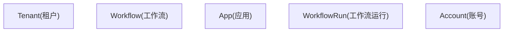
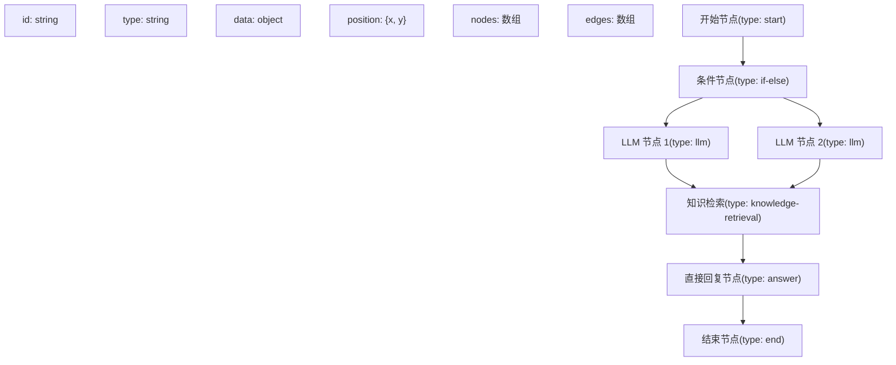
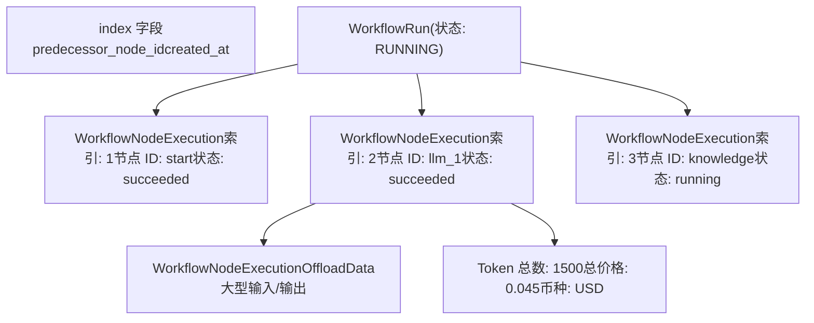
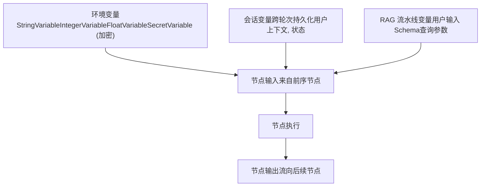

# 工作流定义与执行模型

相关源文件

-   [api/models/account.py](https://github.com/langgenius/dify/blob/92dbc94f/api/models/account.py)
-   [api/models/api_based_extension.py](https://github.com/langgenius/dify/blob/92dbc94f/api/models/api_based_extension.py)
-   [api/models/dataset.py](https://github.com/langgenius/dify/blob/92dbc94f/api/models/dataset.py)
-   [api/models/model.py](https://github.com/langgenius/dify/blob/92dbc94f/api/models/model.py)
-   [api/models/oauth.py](https://github.com/langgenius/dify/blob/92dbc94f/api/models/oauth.py)
-   [api/models/provider.py](https://github.com/langgenius/dify/blob/92dbc94f/api/models/provider.py)
-   [api/models/source.py](https://github.com/langgenius/dify/blob/92dbc94f/api/models/source.py)
-   [api/models/task.py](https://github.com/langgenius/dify/blob/92dbc94f/api/models/task.py)
-   [api/models/tools.py](https://github.com/langgenius/dify/blob/92dbc94f/api/models/tools.py)
-   [api/models/trigger.py](https://github.com/langgenius/dify/blob/92dbc94f/api/models/trigger.py)
-   [api/models/web.py](https://github.com/langgenius/dify/blob/92dbc94f/api/models/web.py)
-   [api/models/workflow.py](https://github.com/langgenius/dify/blob/92dbc94f/api/models/workflow.py)
-   [api/tests/test_containers_integration_tests/services/test_advanced_prompt_template_service.py](https://github.com/langgenius/dify/blob/92dbc94f/api/tests/test_containers_integration_tests/services/test_advanced_prompt_template_service.py)
-   [api/tests/test_containers_integration_tests/services/test_agent_service.py](https://github.com/langgenius/dify/blob/92dbc94f/api/tests/test_containers_integration_tests/services/test_agent_service.py)
-   [api/tests/test_containers_integration_tests/tasks/__init__.py](https://github.com/langgenius/dify/blob/92dbc94f/api/tests/test_containers_integration_tests/tasks/__init__.py)
-   [api/tests/test_containers_integration_tests/tasks/test_add_document_to_index_task.py](https://github.com/langgenius/dify/blob/92dbc94f/api/tests/test_containers_integration_tests/tasks/test_add_document_to_index_task.py)
-   [api/tests/unit_tests/core/test_provider_manager.py](https://github.com/langgenius/dify/blob/92dbc94f/api/tests/unit_tests/core/test_provider_manager.py)

## 目的与范围

本文档描述了 Dify 的工作流定义与执行模型，涵盖了工作流的存储、版本控制、执行以及监控。重点介绍了数据模型（`Workflow`、`WorkflowRun`、`WorkflowNodeExecutionModel`）及其关联关系、基于图的工作流结构、版本管理以及执行日志记录机制。

有关特定节点类型及其实现的信息，请参阅 [LLM 节点与模型集成](/langgenius/dify/5.2-llm-nodes-and-model-integration)、[知识检索与问题分类器节点](/langgenius/dify/5.3-knowledge-retrieval-and-question-classifier-nodes) 以及 [列表操作器与数据转换节点](/langgenius/dify/5.4-list-operator-and-data-transformation-nodes)。有关工作流自动化与触发的信息，请参阅 [触发器系统与工作流自动化](/langgenius/dify/5.5-trigger-system-and-workflow-automation)。

---

## 工作流数据模型

`Workflow` 模型代表了工作流的定义，它可以驱动**工作流应用**或处于工作流模式下的**对话应用**。每个工作流都绑定到一个租户（工作区）和一个应用。

### Workflow 表结构

| 字段 | 类型 | 描述 |
| --- | --- | --- |
| `id` | UUID | 主键 |
| `tenant_id` | UUID | 工作区标识符 |
| `app_id` | UUID | 关联的应用标识符 |
| `type` | String | 工作流类型：`"workflow"` (工作流), `"chat"` (对话), 或 `"rag-pipeline"` (RAG 流水线) |
| `version` | String | 版本标识符：`"draft"` 代表草稿，时间戳代表已发布版本 |
| `graph` | LongText (JSON) | 完整的工作流画布配置，包括节点和边 |
| `features` | LongText (JSON) | 功能配置（文件上传、文本转语音等） |
| `environment_variables` | LongText (JSON) | 工作流的加密环境变量 |
| `conversation_variables` | LongText (JSON) | 跨对话轮次持久化的变量 |
| `rag_pipeline_variables` | LongText (JSON) | 特定于 RAG 流水线工作流的变量 |
| `marked_name` | String | 可选的版本标签名 |
| `marked_comment` | String | 可选的版本描述 |
| `created_by` | UUID | 创建者账号 ID |
| `updated_by` | UUID | 最后更新者账号 ID |

**来源：** [api/models/workflow.py100-165](https://github.com/langgenius/dify/blob/92dbc94f/api/models/workflow.py#L100-L165)

### WorkflowType 枚举

```python
class WorkflowType(StrEnum):
    WORKFLOW = "workflow"      # 用于工作流应用
    CHAT = "chat"              # 用于工作流模式下的对话应用
    RAG_PIPELINE = "rag-pipeline"  # 用于 RAG 流水线工作流
```
`WorkflowType.from_app_mode()` 静态方法将 `AppMode` 值转换为对应的工作流类型：

-   `AppMode.WORKFLOW` → `WorkflowType.WORKFLOW`
-   `AppMode.ADVANCED_CHAT`, `AppMode.CHAT`, `AppMode.AGENT_CHAT` → `WorkflowType.CHAT`

**来源：** [api/models/workflow.py60-94](https://github.com/langgenius/dify/blob/92dbc94f/api/models/workflow.py#L60-L94)

### 工作流模型图


**来源：** [api/models/workflow.py100-165](https://github.com/langgenius/dify/blob/92dbc94f/api/models/workflow.py#L100-L165) [api/models/model.py78-144](https://github.com/langgenius/dify/blob/92dbc94f/api/models/model.py#L78-L144) [api/models/account.py242-278](https://github.com/langgenius/dify/blob/92dbc94f/api/models/account.py#L242-L278)

---

## 图结构 (Graph Structure)

`graph` 字段将完整的工作流定义存储为一个包含节点 (nodes) 和边 (edges) 的 JSON 对象。这种基于图的结构实现了可视化的工作流设计与执行。

### Graph JSON 模式

```json
{
  "nodes": [
    {
      "id": "1748401971780start",
      "type": "start",
      "data": {
        "type": "start",
        "title": "开始",
        "variables": [...] 
      },
      "position": {"x": 100, "y": 100}
    },
    {
      "id": "llm_node_1",
      "type": "llm",
      "data": {
        "type": "llm",
        "title": "LLM",
        "model": {
          "provider": "openai",
          "name": "gpt-4",
          "mode": "chat",
          "completion_params": {"temperature": 0.7}
        },
        "prompt_template": [
          {"role": "system", "text": "你是一个得力的助手"}
        ],
        "context": {"enabled": false},
        "vision": {"enabled": false},
        "memory": {...}
      },
      "position": {"x": 300, "y": 100}
    }
  ],
  "edges": [
    {
      "id": "edge_1",
      "source": "1748401971780start",
      "target": "llm_node_1"
    }
  ]
}
```
### 节点配置结构

图中的每个节点包含：

-   **`id`**: 唯一的节点标识符
-   **`type`**: 视觉节点类型（用于 UI 渲染）
-   **`data`**: 节点配置对象，包含：
    -   **`type`**: 节点执行类型（如 `"start"`, `"llm"`, `"knowledge-retrieval"`, `"if-else"`）
    -   **`title`**: 显示名称
    -   **`desc`**: 可选描述
    -   **特定于节点的配置字段**（因节点类型而异）

用于控制流的特殊节点属性：

-   **`isInIteration`**: 布尔值，指示节点是否位于迭代块内
-   **`iteration_id`**: 父迭代节点 ID（如果 `isInIteration` 为 true）
-   **`isInLoop`**: 布尔值，指示节点是否位于循环块内
-   **`loop_id`**: 父循环节点 ID（如果 `isInLoop` 为 true）

**来源：** [api/models/workflow.py119-127](https://github.com/langgenius/dify/blob/92dbc94f/api/models/workflow.py#L119-L127) [api/models/workflow.py315-362](https://github.com/langgenius/dify/blob/92dbc94f/api/models/workflow.py#L315-L362)

### 访问图数据

`Workflow` 模型提供了多个处理图的方法：

| 方法 | 用途 | 返回值 |
| --- | --- | --- |
| `graph_dict` | 将图 JSON 解析为字典 | `Mapping[str, Any]` |
| `get_node_config_by_id(node_id)` | 获取特定节点的配置 | `Mapping[str, Any]` |
| `get_node_type_from_node_config(node_config)` | 提取节点类型 | `NodeType` 枚举 |
| `get_enclosing_node_type_and_id(node_config)` | 获取父迭代/循环信息 | `tuple[NodeType, str]` 或 `None` |
| `walk_nodes(specific_node_type=None)` | 遍历所有节点 | `(id, data)` 元组的生成器 |
| `user_input_form(to_old_structure=False)` | 提取开始节点的变量 | `list[Any]` |

**示例用法：**

```python
workflow = db.session.query(Workflow).filter_by(id=workflow_id).first()

# 获取所有 LLM 节点
for node_id, node_data in workflow.walk_nodes(specific_node_type=NodeType.LLM):
    model_config = node_data.get('model', {})
    print(f"LLM 节点 {node_id} 使用的模型: {model_config.get('name')}")

# 获取特定节点
node_config = workflow.get_node_config_by_id("llm_node_1")
node_type = Workflow.get_node_type_from_node_config(node_config)
```
**来源：** [api/models/workflow.py212-253](https://github.com/langgenius/dify/blob/92dbc94f/api/models/workflow.py#L212-L253) [api/models/workflow.py315-390](https://github.com/langgenius/dify/blob/92dbc94f/api/models/workflow.py#L315-L390)

### 图遍历图表


**来源：** [api/models/workflow.py315-362](https://github.com/langgenius/dify/blob/92dbc94f/api/models/workflow.py#L315-L362)

---

## 版本控制系统

Dify 实现了双版本系统：每个工作流有一个草稿版本和多个已发布版本。

### 版本生命周期

1.  **草稿版本 (`version = "draft"`)**

    -   每个应用在任何时候仅存在一个草稿
    -   可编辑且未发布
    -   用于开发和测试
    -   由常量 `Workflow.VERSION_DRAFT` 标识
2.  **已发布版本**

    -   通过发布草稿生成
    -   版本字符串是一个时间戳（例如 `"2024-01-15 10:30:45"`）
    -   一旦发布即不可变
    -   多个已发布版本可以共存
    -   通过 `Workflow.version_from_datetime(datetime)` 方法生成

### 执行时的版本选择

执行工作流时：

-   **调试**: 使用草稿版本
-   **生产环境/API**: 使用最新的已发布版本，或按要求使用特定版本

**来源：** [api/models/workflow.py166-167](https://github.com/langgenius/dify/blob/92dbc94f/api/models/workflow.py#L166-L167) [api/models/workflow.py551-553](https://github.com/langgenius/dify/blob/92dbc94f/api/models/workflow.py#L551-L553)

### WorkflowRun 中的版本快照

每个 `WorkflowRun` 在执行时都会捕捉工作流图的完整快照：

```python
workflow_run = WorkflowRun(
    workflow_id=workflow.id,
    version=workflow.version,  # 版本标识符
    graph=workflow.graph,      # 完整的图快照 (JSON)
    # ... 其他字段
)
```
这确保了即使以后修改了工作流定义，执行记录仍保持一致。快照包括：

-   所有节点配置
-   所有边的连接关系
-   功能设置（如果需要）

**来源：** [api/models/workflow.py556-620](https://github.com/langgenius/dify/blob/92dbc94f/api/models/workflow.py#L556-L620) [api/models/workflow.py644-646](https://github.com/langgenius/dify/blob/92dbc94f/api/models/workflow.py#L644-L646)

### 版本管理工作流图表

> **[Mermaid 状态图]**
> *(图表结构无法解析)*

**来源：** [api/models/workflow.py166-167](https://github.com/langgenius/dify/blob/92dbc94f/api/models/workflow.py#L166-L167) [api/models/workflow.py551-553](https://github.com/langgenius/dify/blob/92dbc94f/api/models/workflow.py#L551-L553)

---

## WorkflowRun 执行模型

`WorkflowRun` 代表了工作流的一次执行实例。每次运行都是工作流执行的完整、自包含的记录。

### WorkflowRun 字段

| 字段 | 类型 | 描述 |
| --- | --- | --- |
| `id` | UUID | 唯一的运行标识符 |
| `tenant_id` | UUID | 工作区标识符 |
| `app_id` | UUID | 关联的应用 |
| `workflow_id` | UUID | 来源工作流 |
| `type` | String | 工作流类型 (workflow/chat/rag-pipeline) |
| `triggered_from` | String | 触发来源：`"debugging"` (调试) 或 `"app-run"` (应用运行) |
| `version` | String | 用于此次运行的工作流版本 |
| `graph` | LongText (JSON) | 执行时工作流图的快照 |
| `inputs` | LongText (JSON) | 运行的输入参数 |
| `status` | String | 执行状态（见下文） |
| `outputs` | LongText (JSON) | 最终输出结果 |
| `error` | LongText | 失败时的错误消息 |
| `elapsed_time` | Float | 总执行耗时（秒） |
| `total_tokens` | BigInteger | 消耗的 Token 总数 |
| `total_steps` | Integer | 执行的总步数 |
| `exceptions_count` | Integer | 遇到的异常次数 |
| `created_by_role` | String | 创建者角色：`"account"` (账号) 或 `"end_user"` (终端用户) |
| `created_by` | UUID | 创建者 ID |
| `created_at` | DateTime | 运行开始时间 |
| `finished_at` | DateTime | 运行完成时间 |

**来源：** [api/models/workflow.py556-622](https://github.com/langgenius/dify/blob/92dbc94f/api/models/workflow.py#L556-L622)

### 执行状态值

`status` 字段可以具有以下值（在 `core.workflow.enums.WorkflowExecutionStatus` 中定义）：

-   **`RUNNING`**: 工作流正在执行中
-   **`SUCCEEDED`**: 成功完成
-   **`FAILED`**: 执行失败并报错
-   **`STOPPED`**: 由用户手动停止
-   **`PARTIAL_SUCCEEDED`**: 部分节点成功，部分失败

**来源：** [api/models/workflow.py611](https://github.com/langgenius/dify/blob/92dbc94f/api/models/workflow.py#L611-L611) [core/workflow/enums.py](https://github.com/langgenius/dify/blob/92dbc94f/core/workflow/enums.py) (在导入中引用)

### 触发来源 (Triggered From)

`triggered_from` 字段指示工作流运行是如何启动的：

-   **`"debugging"`**: 从画布调试界面触发
-   **`"app-run"`**: 从已发布的应用程序执行（API、WebApp 或用户交互）触发

**来源：** [api/models/workflow.py570-572](https://github.com/langgenius/dify/blob/92dbc94f/api/models/workflow.py#L570-L572)

### WorkflowRun 生命周期图表

> **[Mermaid 状态图]**
> *(图表结构无法解析)*

**来源：** [api/models/workflow.py556-622](https://github.com/langgenius/dify/blob/92dbc94f/api/models/workflow.py#L556-L622)

### WorkflowRun 方法

| 属性/方法 | 描述 | 返回值 |
| --- | --- | --- |
| `graph_dict` | 解析图 JSON | `Mapping[str, Any]` |
| `inputs_dict` | 解析输入 JSON | `Mapping[str, Any]` |
| `outputs_dict` | 解析输出 JSON | `Mapping[str, Any]` |
| `message` | 获取关联的消息（如果是从对话触发） | `Message` 或 `None` |
| `workflow` | 获取来源工作流 | `Workflow` |
| `created_by_account` | 获取创建者账号 | `Account` 或 `None` |
| `created_by_end_user` | 获取创建者终端用户 | `EndUser` 或 `None` |
| `to_dict()` | 序列化为字典 | `dict[str, Any]` |
| `from_dict(data)` | 从字典反序列化 | `WorkflowRun` |

**来源：** [api/models/workflow.py632-715](https://github.com/langgenius/dify/blob/92dbc94f/api/models/workflow.py#L632-L715)

---

## 节点执行日志

`WorkflowNodeExecutionModel`（表名：`workflow_node_executions`）追踪工作流运行中各个节点的执行情况，提供详细的执行日志和追踪能力。

### WorkflowNodeExecutionModel 结构

| 字段 | 类型 | 描述 |
| --- | --- | --- |
| `id` | UUID | 唯一的执行记录 ID |
| `tenant_id` | UUID | 工作区标识符 |
| `app_id` | UUID | 关联的应用 |
| `workflow_id` | UUID | 工作流标识符 |
| `triggered_from` | String | `"single-step"` (单步), `"workflow-run"` (工作流运行), 或 `"rag-pipeline-run"` (RAG 流水线运行) |
| `workflow_run_id` | UUID | 父工作流运行 ID（单步调试时为空） |
| `index` | Integer | 用于排序的执行序列号 |
| `predecessor_node_id` | String | 执行路径中的前序节点 |
| `node_execution_id` | String | 此节点执行实例的唯一 ID |
| `node_id` | String | 图中的节点标识符 |
| `node_type` | String | 节点类型（如 "llm", "knowledge-retrieval"） |
| `title` | String | 节点显示名称 |
| `inputs` | LongText (JSON) | 传递给节点的输入数据 |
| `process_data` | LongText (JSON) | 中间处理数据 |
| `outputs` | LongText (JSON) | 节点的输出数据 |
| `status` | String | 执行状态：`"running"`, `"succeeded"`, `"failed"` |
| `error` | LongText | 失败时的错误详情 |
| `elapsed_time` | Float | 节点执行耗时（秒） |
| `execution_metadata` | LongText (JSON) | 元数据，包括 Token 数、成本、币种 |
| `created_by_role` | String | `"account"` 或 `"end_user"` |
| `created_by` | UUID | 执行者 ID |
| `created_at` | DateTime | 执行开始时间 |
| `finished_at` | DateTime | 执行完成时间 |

**来源：** [api/models/workflow.py728-866](https://github.com/langgenius/dify/blob/92dbc94f/api/models/workflow.py#L728-L866)

### 触发来源类型

`WorkflowNodeExecutionTriggeredFrom` 枚举定义了执行上下文：

-   **`SINGLE_STEP`**: 单步调试（无 `workflow_run_id`）
-   **`WORKFLOW_RUN`**: 完整工作流执行的一部分
-   **`RAG_PIPELINE_RUN`**: RAG 流水线内的执行

**来源：** [api/models/workflow.py718-726](https://github.com/langgenius/dify/blob/92dbc94f/api/models/workflow.py#L718-L726)

### 执行元数据结构

`execution_metadata` 字段存储成本和性能指标：

```json
{
  "total_tokens": 1500,
  "total_price": 0.045,
  "currency": "USD",
  "provider_response_latency": 1.23
}
```
**来源：** [api/models/workflow.py757-763](https://github.com/langgenius/dify/blob/92dbc94f/api/models/workflow.py#L757-L763)

### 执行数据卸载 (Offloading)

对于大型执行数据（输入、输出、处理数据），Dify 实现了卸载到外部存储的机制：

1.  **WorkflowNodeExecutionOffloadData 模型**

    -   在外部存储（S3 等）中存储大型数据对象
    -   字段：`workflow_node_execution_id`, `inputs`, `outputs`, `process_data`
    -   与 `WorkflowNodeExecutionModel` 呈 1:1 关联
2.  **卸载决策**

    -   通过 `ExecutionOffLoadType` 枚举进行配置（见下文）
    -   当数据超过大小阈值时进行卸载
    -   原始记录保留小型引用或摘要

**来源：** [api/models/workflow.py1079-1154](https://github.com/langgenius/dify/blob/92dbc94f/api/models/workflow.py#L1079-L1154)

### ExecutionOffLoadType 枚举

控制何时卸载执行数据：

-   **`NEVER`**: 永不卸载，所有数据存储在数据库中
-   **`ALWAYS`**: 始终卸载到外部存储
-   **`SELECTIVE`**: 仅当数据超过阈值时卸载
-   **`SYNC_ONLY`**: 仅针对同步请求进行卸载（以避免阻塞）

**来源：** [api/models/enums.py](https://github.com/langgenius/dify/blob/92dbc94f/api/models/enums.py) (在 workflow.py 的导入中引用)

### 节点执行追踪图表


**来源：** [api/models/workflow.py728-866](https://github.com/langgenius/dify/blob/92dbc94f/api/models/workflow.py#L728-L866) [api/models/workflow.py1079-1154](https://github.com/langgenius/dify/blob/92dbc94f/api/models/workflow.py#L1079-L1154)

### 查询节点执行

**获取一次工作流运行的所有执行记录：**

```python
executions = db.session.query(WorkflowNodeExecutionModel)
    .filter_by(workflow_run_id=run_id)
    .order_by(WorkflowNodeExecutionModel.index)
    .all()
```
**获取特定节点的执行记录：**

```python
node_executions = db.session.query(WorkflowNodeExecutionModel)
    .filter_by(
        tenant_id=tenant_id,
        app_id=app_id,
        workflow_id=workflow_id,
        node_id=node_id
    )
    .order_by(WorkflowNodeExecutionModel.created_at.desc())
    .all()
```
**来源：** [api/models/workflow.py777-815](https://github.com/langgenius/dify/blob/92dbc94f/api/models/workflow.py#L777-L815) (索引定义)

---

## 变量管理

工作流支持三种类型的变量，它们在不同的作用域内持久化：

### 环境变量 (Environment Variables)

环境变量是工作流级配置值，所有节点均可访问：

**支持的类型：**

-   `StringVariable` (字符串)
-   `IntegerVariable` (整数)
-   `FloatVariable` (浮点数)
-   `SecretVariable` (加密的机密变量)

**存储格式：**

```json
{
  "api_key": {
    "id": "var_1",
    "name": "api_key",
    "type": "secret",
    "value": "<加密后的值>"
  },
  "max_tokens": {
    "id": "var_2",
    "name": "max_tokens",
    "type": "number",
    "value": 2000
  }
}
```
**加密：**

-   机密变量使用 `encrypter.encrypt_token(tenant_id, token)` 进行加密
-   访问时使用 `encrypter.decrypt_token(tenant_id, token)` 进行解密
-   加密是租户特定的，以实现安全隔离

**访问：**

```python
workflow = db.session.query(Workflow).filter_by(id=workflow_id).first()
env_vars = workflow.environment_variables  # 返回解密后的变量

for var in env_vars:
    if isinstance(var, SecretVariable):
        # var.value 会自动解密
        print(f"{var.name}: {var.value}")
```
**来源：** [api/models/workflow.py427-500](https://github.com/langgenius/dify/blob/92dbc94f/api/models/workflow.py#L427-L500)

### 会话变量 (Conversation Variables)

会话变量在基于对话的工作流中跨多个轮次持久化：

**目的：**

-   存储对话上下文
-   维护消息间的状态
-   实现类似记忆的行为

**存储：**

-   以 JSON 格式存储在 `_conversation_variables` 字段中
-   使用 `variable_factory.build_conversation_variable_from_mapping()` 进行反序列化

**访问：**

```python
workflow = db.session.query(Workflow).filter_by(id=workflow_id).first()
conv_vars = workflow.conversation_variables

# 设置会话变量
workflow.conversation_variables = [
    StringVariable(id="conv_1", name="user_name", value="Alice"),
    StringVariable(id="conv_2", name="topic", value="AI")
]
db.session.commit()
```
**来源：** [api/models/workflow.py517-532](https://github.com/langgenius/dify/blob/92dbc94f/api/models/workflow.py#L517-L532)

### RAG 流水线变量

RAG 流水线变量特定于 RAG 流水线工作流，定义了用户输入模式 (schema)：

**结构：**

```json
[
  {
    "variable": "query",
    "type": "text-input",
    "label": "用户查询",
    "required": true
  },
  {
    "variable": "filters",
    "type": "select",
    "label": "分类过滤器",
    "options": ["tech", "business", "science"]
  }
]
```
**访问：**

```python
workflow = db.session.query(Workflow).filter_by(
    type=WorkflowType.RAG_PIPELINE,
    id=workflow_id
).first()

input_form = workflow.rag_pipeline_user_input_form()
# 返回用于构建输入表单的变量列表
```
**来源：** [api/models/workflow.py534-549](https://github.com/langgenius/dify/blob/92dbc94f/api/models/workflow.py#L534-L549) [api/models/workflow.py391-395](https://github.com/langgenius/dify/blob/92dbc94f/api/models/workflow.py#L391-L395)

### 变量作用域图表


**来源：** [api/models/workflow.py427-549](https://github.com/langgenius/dify/blob/92dbc94f/api/models/workflow.py#L427-L549)

---

## 暂停与恢复机制

工作流在执行过程中可以因为人工输入或预定的延迟而暂停。这通过 `WorkflowPause` 模型进行管理。

### WorkflowPause 模型

代表等待恢复的已暂停工作流运行：

| 字段 | 类型 | 描述 |
| --- | --- | --- |
| `id` | UUID | 暂停记录 ID |
| `tenant_id` | UUID | 工作区标识符 |
| `app_id` | UUID | 关联的应用 |
| `workflow_id` | UUID | 工作流标识符 |
| `workflow_run_id` | UUID | 已暂停的运行记录（1:1 关联） |
| `event_data` | LongText (JSON) | 用于恢复的状态快照 |
| `pause_expires_at` | BigInteger | 暂停过期的 Unix 时间戳 |
| `pause_metadata` | LongText (JSON) | 暂停原因及详情 |
| `created_at` | DateTime | 暂停开始时间 |

**来源：** [api/models/workflow.py1156-1211](https://github.com/langgenius/dify/blob/92dbc94f/api/models/workflow.py#L1156-L1211)

### 暂停原因 (Pause Reasons)

`pause_metadata` 字段使用 `PauseReason` 实体存储结构化的暂停原因信息：

**人机交互输入 (HumanInputRequired):**

```json
{
  "type": "human_input_required",
  "message": "请审核并批准生成的内容",
  "timeout_seconds": 3600,
  "inputs_schema": {
    "approval": {"type": "select", "options": ["approve", "reject"]},
    "comments": {"type": "text-input", "required": false}
  }
}
```
**定时调度暂停 (SchedulingPause):**

```json
{
  "type": "scheduling_pause",
  "message": "发送邮件前的预定延迟",
  "resume_at": 1705320000,
  "reason": "频率限制节流"
}
```
**来源：** [core/workflow/entities/pause_reason.py](https://github.com/langgenius/dify/blob/92dbc94f/core/workflow/entities/pause_reason.py)（在 [api/models/workflow.py32](https://github.com/langgenius/dify/blob/92dbc94f/api/models/workflow.py#L32-L32) 的导入中引用）

### 暂停/恢复生命周期

> **[Mermaid 状态图]**
> *(图表结构无法解析)*

**来源：** [api/models/workflow.py1156-1211](https://github.com/langgenius/dify/blob/92dbc94f/api/models/workflow.py#L1156-L1211)

### 与 WorkflowRun 的关系

`WorkflowRun` 模型与 `WorkflowPause` 具有可选的 1:1 关系：

```python
class WorkflowRun(Base):
    # ... 其他字段 ...

    pause: Mapped[Optional["WorkflowPause"]] = orm.relationship(
        "WorkflowPause",
        primaryjoin="WorkflowRun.id == foreign(WorkflowPause.workflow_run_id)",
        uselist=False,
        lazy="raise",  # 要求显式预加载
        back_populates="workflow_run",
    )
```
**注意：** `lazy="raise"` 配置意味着必须使用 `joinedload()` 或 `selectinload()` 显式加载 `pause` 关系，以避免延迟加载错误。

**来源：** [api/models/workflow.py623-630](https://github.com/langgenius/dify/blob/92dbc94f/api/models/workflow.py#L623-L630)

---

## 总结

Dify 工作流系统使用全面的数据模型来管理工作流定义、执行和监控：

1.  **工作流模型 (Workflow Model)**：存储带有基于图的结构、版本控制和变量的工作流定义。
2.  **图结构 (Graph Structure)**：基于 JSON 的节点和边，实现了可视化的工作流设计。
3.  **版本控制 (Versioning)**：草稿和已发布版本管理，并带有执行快照。
4.  **工作流运行 (WorkflowRun)**：包含状态追踪和结果的完整执行记录。
5.  **节点执行日志 (Node Execution Logging)**：详尽的单节点执行日志，并支持大型数据的卸载存储。
6.  **变量管理 (Variable Management)**：三种作用域的变量（环境、对话、RAG 流水线）。
7.  **暂停/恢复 (Pause/Resume)**：支持人机交互 (human-in-the-loop) 和定时调度的执行暂停。

该架构为复杂的工作流执行提供了完整的可追溯性、可重现性和调试能力。

**来源：** [api/models/workflow.py1-1500](https://github.com/langgenius/dify/blob/92dbc94f/api/models/workflow.py#L1-L1500) [api/models/model.py78-316](https://github.com/langgenius/dify/blob/92dbc94f/api/models/model.py#L78-L316) [api/models/account.py242-278](https://github.com/langgenius/dify/blob/92dbc94f/api/models/account.py#L242-L278)
