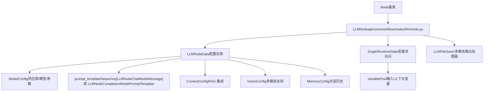
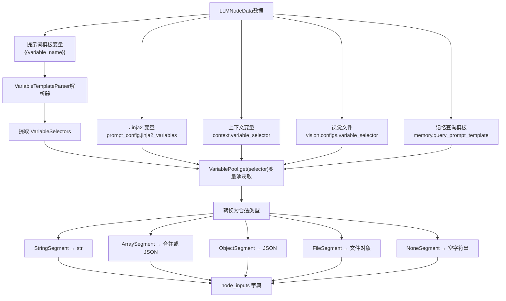
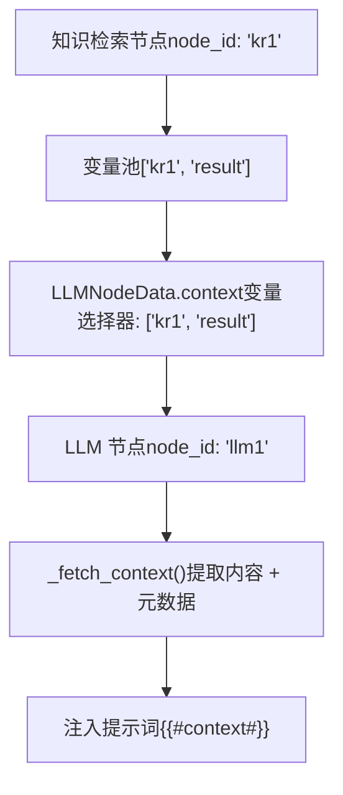
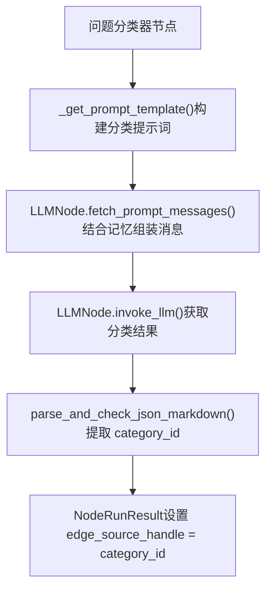

# LLM 节点与模型集成

相关源文件

-   [api/models/account.py](https://github.com/langgenius/dify/blob/92dbc94f/api/models/account.py)
-   [api/models/api\_based\_extension.py](https://github.com/langgenius/dify/blob/92dbc94f/api/models/api_based_extension.py)
-   [api/models/dataset.py](https://github.com/langgenius/dify/blob/92dbc94f/api/models/dataset.py)
-   [api/models/model.py](https://github.com/langgenius/dify/blob/92dbc94f/api/models/model.py)
-   [api/models/oauth.py](https://github.com/langgenius/dify/blob/92dbc94f/api/models/oauth.py)
-   [api/models/provider.py](https://github.com/langgenius/dify/blob/92dbc94f/api/models/provider.py)
-   [api/models/source.py](https://github.com/langgenius/dify/blob/92dbc94f/api/models/source.py)
-   [api/models/task.py](https://github.com/langgenius/dify/blob/92dbc94f/api/models/task.py)
-   [api/models/tools.py](https://github.com/langgenius/dify/blob/92dbc94f/api/models/tools.py)
-   [api/models/trigger.py](https://github.com/langgenius/dify/blob/92dbc94f/api/models/trigger.py)
-   [api/models/web.py](https://github.com/langgenius/dify/blob/92dbc94f/api/models/web.py)
-   [api/models/workflow.py](https://github.com/langgenius/dify/blob/92dbc94f/api/models/workflow.py)
-   [api/tests/test\_containers\_integration\_tests/services/test\_advanced\_prompt\_template\_service.py](https://github.com/langgenius/dify/blob/92dbc94f/api/tests/test_containers_integration_tests/services/test_advanced_prompt_template_service.py)
-   [api/tests/test\_containers\_integration\_tests/services/test\_agent\_service.py](https://github.com/langgenius/dify/blob/92dbc94f/api/tests/test_containers_integration_tests/services/test_agent_service.py)
-   [api/tests/test\_containers\_integration\_tests/tasks/\_\_init\_\_.py](https://github.com/langgenius/dify/blob/92dbc94f/api/tests/test_containers_integration_tests/tasks/__init__.py)
-   [api/tests/test\_containers\_integration\_tests/tasks/test\_add\_document\_to\_index\_task.py](https://github.com/langgenius/dify/blob/92dbc94f/api/tests/test_containers_integration_tests/tasks/test_add_document_to_index_task.py)
-   [api/tests/unit\_tests/core/test\_provider\_manager.py](https://github.com/langgenius/dify/blob/92dbc94f/api/tests/unit_tests/core/test_provider_manager.py)

本文档描述了 Dify 工作流系统中 LLM（大语言模型）节点的实现，涵盖了模型配置、提示词构建、执行模式以及与其他工作流组件的集成。

**范围**：本页面重点介绍 `LLMNode` 类及其与模型供应商的集成。有关为 LLM 获取上下文的知识检索节点，请参阅 [5.3](/langgenius/dify/5.3-knowledge-retrieval-and-question-classifier-nodes)。有关通用工作流执行概念，请参阅 [5.1](/langgenius/dify/5.1-workflow-definition-and-execution-model)。有关基于 HTTP 的外部 API 集成，请参阅 [5.4](/langgenius/dify/5.4-list-operator-and-data-transformation-nodes)。

---

## 核心架构

### LLMNode 类结构

`LLMNode` 类继承自基础 `Node` 类，为工作流提供 LLM 调用能力。它管理从提示词构建到响应处理的完整生命周期。


**来源**：[api/core/workflow/nodes/llm/node.py108-144](https://github.com/langgenius/dify/blob/92dbc94f/api/core/workflow/nodes/llm/node.py#L108-L144) [api/core/workflow/nodes/llm/entities.py61-99](https://github.com/langgenius/dify/blob/92dbc94f/api/core/workflow/nodes/llm/entities.py#L61-L99)

### 关键数据结构

`LLMNodeData` 实体封装了 LLM 节点的所有配置：

| 字段 | 类型 | 用途 |
| --- | --- | --- |
| `model` | `ModelConfig` | 供应商、模型名称、模式、补全参数 |
| `prompt_template` | `Sequence[LLMNodeChatModelMessage]` 或 `LLMNodeCompletionModelPromptTemplate` | 提示词结构（对话消息或补全文本） |
| `prompt_config` | `PromptConfig` | 用于高级模板的 Jinja2 变量选择器 |
| `memory` | `MemoryConfig` 或 `None` | 对话历史记录配置 |
| `context` | `ContextConfig` | RAG 上下文变量选择器 |
| `vision` | `VisionConfig` | 多模态文件输入配置 |
| `structured_output` | `Mapping[str, Any]` 或 `None` | 结构化响应的 JSON Schema |
| `structured_output_switch_on` | `bool` | 是否启用结构化输出模式 |
| `reasoning_format` | `"separated"` 或 `"tagged"` | 如何处理 `<think>` 标签。`reasoning_format` 字段控制处理方式： |

| 格式 | 行为 | 输出字段 |
| --- | --- | --- |
| `"tagged"` | 保留 `<think>` 标签在文本中 | `text`: 包含思考标签的原始输出 |
| `"separated"` | 使用正则提取并移除标签 | `text`: 清洗后的回答内容<br/>`reasoning_content`: 提取的思考内容 |

`_THINK_PATTERN = re.compile(r"<think[^>]*>(.*?)", re.IGNORECASE | re.DOTALL)`

**使用场景**：`"separated"` (分离) 模式允许下游节点通过 `{{#node_id.reasoning_content#}}` 访问推理过程，同时保持向用户展示的文本整洁。

**来源**：[api/core/workflow/nodes/llm/node.py111-112](https://github.com/langgenius/dify/blob/92dbc94f/api/core/workflow/nodes/llm/node.py#L111-L112) [api/core/workflow/nodes/llm/node.py266-271](https://github.com/langgenius/dify/blob/92dbc94f/api/core/workflow/nodes/llm/node.py#L266-L271) [api/core/workflow/nodes/llm/node.py496-523](https://github.com/langgenius/dify/blob/92dbc94f/api/core/workflow/nodes/llm/node.py#L496-L523) [api/core/workflow/nodes/llm/node.py532-565](https://github.com/langgenius/dify/blob/92dbc94f/api/core/workflow/nodes/llm/node.py#L532-L565)

---

## 输入/输出处理

### 输入变量获取


**来源**：[api/core/workflow/nodes/llm/node.py164-170](https://github.com/langgenius/dify/blob/92dbc94f/api/core/workflow/nodes/llm/node.py#L164-L170) [api/core/workflow/nodes/llm/node.py626-660](https://github.com/langgenius/dify/blob/92dbc94f/api/core/workflow/nodes/llm/node.py#L626-L660)

### 输出格式

`_run()` 生成器会产出一系列事件，最后以包含 `NodeRunResult` 的 `StreamCompletedEvent` 结束：

```
NodeRunResult(
    status=WorkflowNodeExecutionStatus.SUCCEEDED,
    inputs={
        # 提示词中使用的变量
        "variable1": "value1",
        "#context#": "检索到的上下文...",
        "#files#": [{"id": "...", "filename": "..."}],
    },
    process_data={
        "model_mode": "chat",
        "prompts": "用于日志记录的格式化提示词",
        "usage": {"prompt_tokens": 100, "completion_tokens": 50, ...},
        "finish_reason": "stop",
        "model_provider": "openai",
        "model_name": "gpt-4",
    },
    outputs={
        "text": "清洗后的响应文本",
        "reasoning_content": "提取出的 <think> 内容 (如果是分离模式)",
        "usage": {...},
        "finish_reason": "stop",
        "structured_output": {"field": "value"},  # 如果启用
        "files": ArrayFileSegment([...])  # 如果有多模态输出
    },
    metadata={
        WorkflowNodeExecutionMetadataKey.TOTAL_TOKENS: 150,
        WorkflowNodeExecutionMetadataKey.TOTAL_PRICE: 0.0025,
        WorkflowNodeExecutionMetadataKey.CURRENCY: "USD",
    },
    llm_usage=LLMUsage(...)
)
```
**关键输出字段**：

-   `text`: 主要响应文本（如果 `reasoning_format="separated"` 则为清洗后的内容）
-   `reasoning_content`: 提取的推理内容（如果 `reasoning_format="tagged"` 则为空）
-   `structured_output`: 解析后的 JSON 对象（如果启用了结构化输出）
-   `files`: 生成的图像等多模态输出
-   `usage`: Token 消耗数和定价信息

**来源**：[api/core/workflow/nodes/llm/node.py286-328](https://github.com/langgenius/dify/blob/92dbc94f/api/core/workflow/nodes/llm/node.py#L286-L328)

---

## 高级特性

### 多模态输出处理

LLM 可以生成多模态内容（例如通过 DALL-E 生成图像）。`LLMFileSaver` 接口负责处理此类内容：

**图像输出示例**：

-   Markdown：``
-   存储为 `FileTransferMethod.TOOL_FILE` 的文件对象

**来源**：[api/core/workflow/nodes/llm/node.py463-479](https://github.com/langgenius/dify/blob/92dbc94f/api/core/workflow/nodes/llm/node.py#L463-L479) [api/core/workflow/nodes/llm/node.py527-530](https://github.com/langgenius/dify/blob/92dbc94f/api/core/workflow/nodes/llm/node.py#L527-L530)

### 消耗统计与额度 (Usage Tracking and Quota)

> **[Mermaid 序列图]**
> *(图表结构无法解析)*

**消耗计算**：

-   `prompt_tokens`: 输入提示词大小
-   `completion_tokens`: 生成的响应大小
-   `total_tokens`: 输入与输出之和
-   `total_price`: 根据模型定价配置计算得出
-   `latency`: 总请求耗时（秒）

**来源**：[api/core/workflow/nodes/llm/node.py281](https://github.com/langgenius/dify/blob/92dbc94f/api/core/workflow/nodes/llm/node.py#L281-L281) [api/core/workflow/nodes/llm/node.py321-325](https://github.com/langgenius/dify/blob/92dbc94f/api/core/workflow/nodes/llm/node.py#L321-L325)

### 异常处理

常见异常及其处理方式：

| 异常 | 原因 | 处理方式 |
| --- | --- | --- |
| `VariableNotFoundError` | 引用的变量不在变量池中 | 节点失败并显示错误消息 |
| `ModelNotExistError` | 模型未找到或不可用 | 节点失败并显示错误消息 |
| `InvalidContextStructureError` | 上下文数组格式错误 | 节点失败并显示错误消息 |
| `OutputParserError` | 结构化输出解析失败 | 转换为 `LLMNodeError` |
| `QuotaExceededError` | 租户额度已耗尽 | 节点失败，不扣除消耗 |
| 通用 `Exception` | 意外错误 | 捕获并记录日志，节点优雅地失败 |

所有错误都会导致产生 `status=FAILED` 的 `StreamCompletedEvent`，并在 `error` 和 `error_type` 字段中提供错误详情。

**来源**：[api/core/workflow/nodes/llm/node.py329-351](https://github.com/langgenius/dify/blob/92dbc94f/api/core/workflow/nodes/llm/node.py#L329-L351) [api/core/workflow/nodes/llm/exc.py](https://github.com/langgenius/dify/blob/92dbc94f/api/core/workflow/nodes/llm/exc.py)（已引用但未提供源码）

---

## 集成示例

### 与知识检索节点集成


**上下文数组结构**：

```
[
    {
        "content": "检索到的文本...",
        "metadata": {
            "_source": "knowledge",
            "dataset_id": "...",
            "document_id": "...",
            "segment_id": "...",
            "score": 0.95
        }
    },
    ...
]
```
**来源**：[api/core/workflow/nodes/llm/node.py662-719](https://github.com/langgenius/dify/blob/92dbc94f/api/core/workflow/nodes/llm/node.py#L662-L719)

### 与问题分类器节点集成

`QuestionClassifierNode` 内部使用 `LLMNode.invoke_llm()` 和 `fetch_prompt_messages()` 来执行分类任务：


这展示了代码复用：`QuestionClassifierNode` 利用了 `LLMNode` 的静态方法进行提示词组装和模型调用。

**来源**：[api/core/workflow/nodes/question\_classifier/question\_classifier_node.py132-163](https://github.com/langgenius/dify/blob/92dbc94f/api/core/workflow/nodes/question_classifier/question_classifier_node.py#L132-L163)