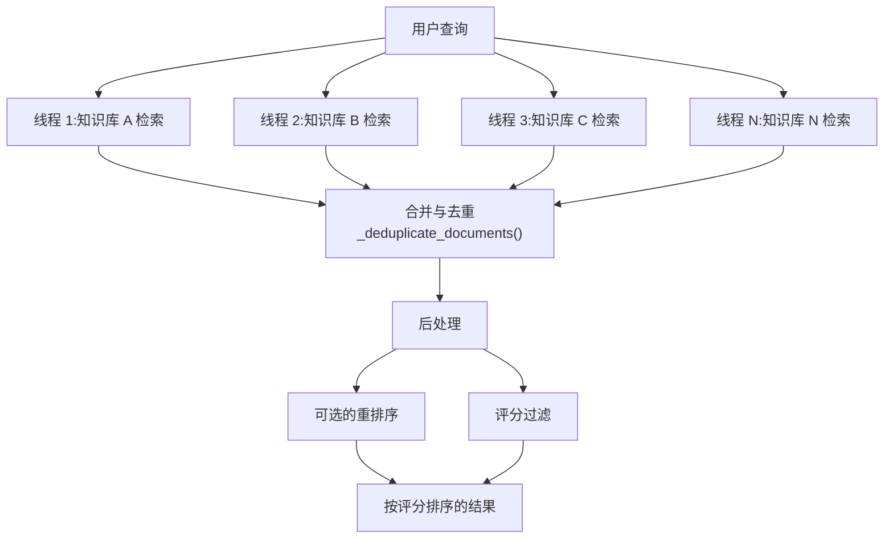
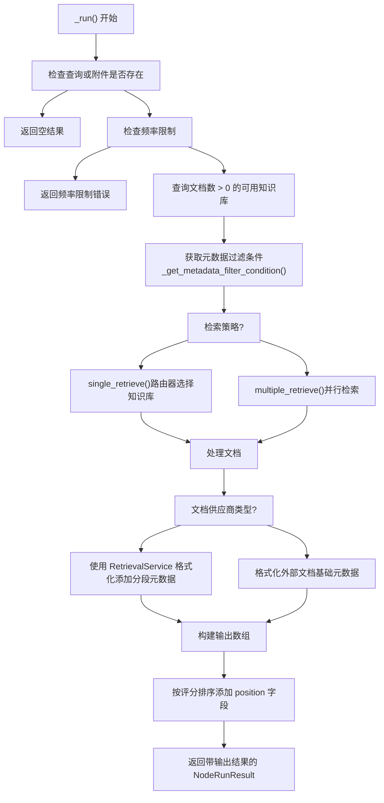
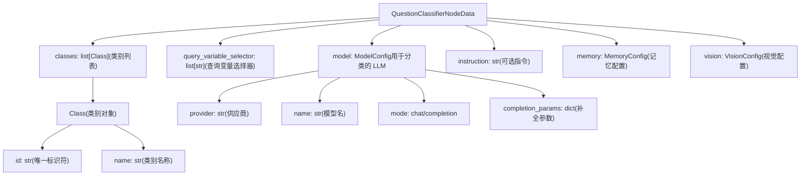
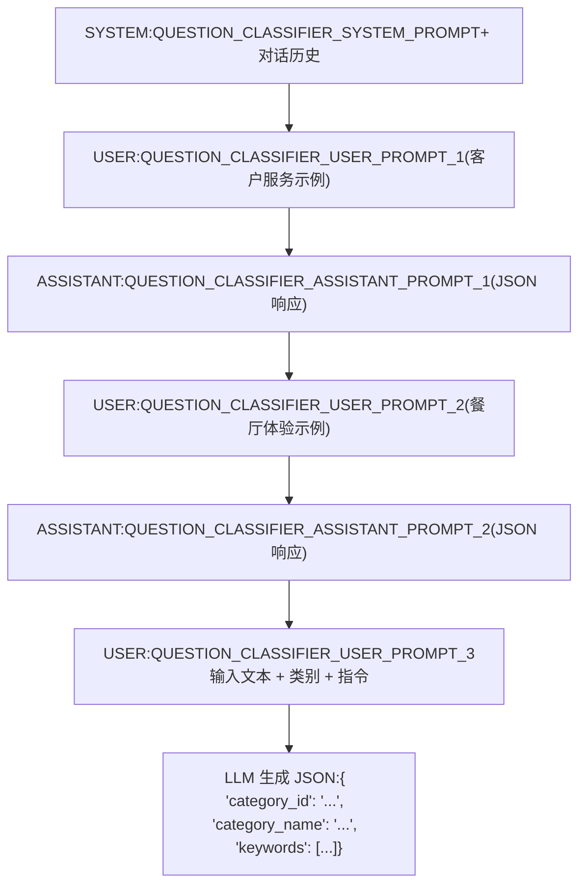
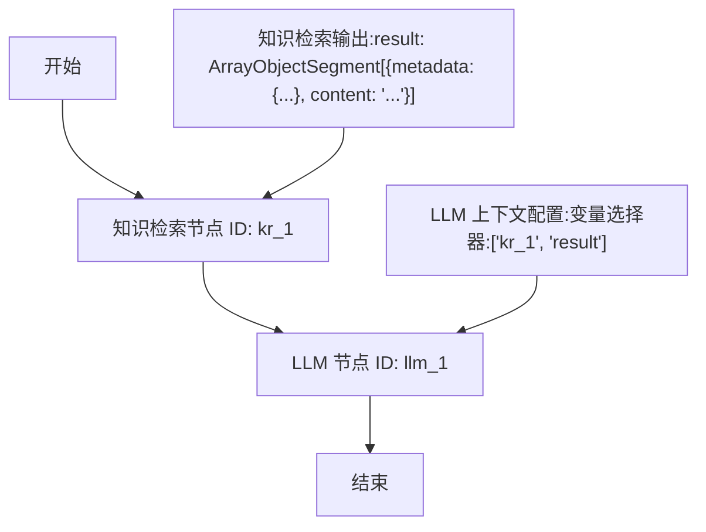
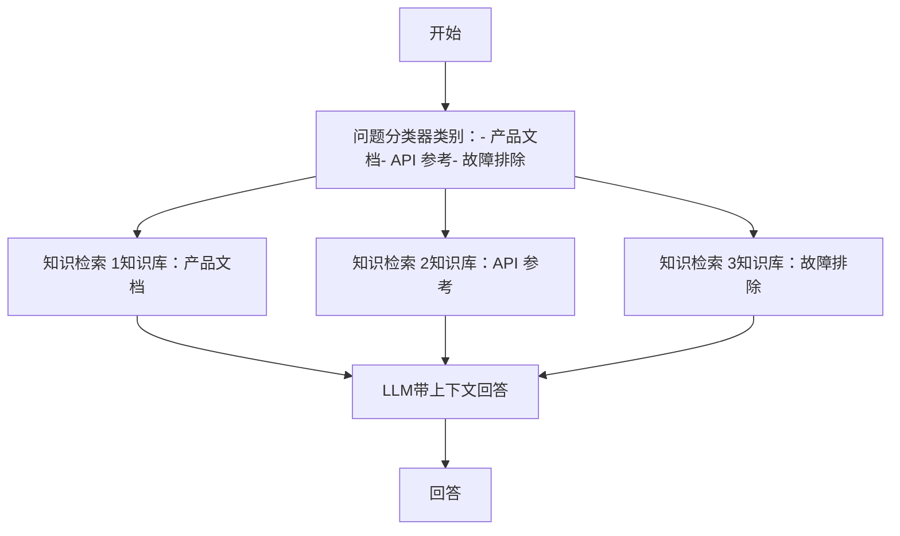

# 知识检索与问题分类器节点

相关源文件

-   [api/core/rag/datasource/retrieval\_service.py](https://github.com/langgenius/dify/blob/92dbc94f/api/core/rag/datasource/retrieval_service.py)
-   [api/core/rag/entities/metadata\_entities.py](https://github.com/langgenius/dify/blob/92dbc94f/api/core/rag/entities/metadata_entities.py)
-   [api/core/rag/retrieval/dataset\_retrieval.py](https://github.com/langgenius/dify/blob/92dbc94f/api/core/rag/retrieval/dataset_retrieval.py)
-   [api/core/workflow/nodes/knowledge\_retrieval/entities.py](https://github.com/langgenius/dify/blob/92dbc94f/api/core/workflow/nodes/knowledge_retrieval/entities.py)
-   [api/core/workflow/nodes/knowledge\_retrieval/knowledge\_retrieval\_node.py](https://github.com/langgenius/dify/blob/92dbc94f/api/core/workflow/nodes/knowledge_retrieval/knowledge_retrieval_node.py)
-   [api/core/workflow/nodes/list\_operator/entities.py](https://github.com/langgenius/dify/blob/92dbc94f/api/core/workflow/nodes/list_operator/entities.py)
-   [api/core/workflow/nodes/list\_operator/exc.py](https://github.com/langgenius/dify/blob/92dbc94f/api/core/workflow/nodes/list_operator/exc.py)
-   [api/core/workflow/nodes/list\_operator/node.py](https://github.com/langgenius/dify/blob/92dbc94f/api/core/workflow/nodes/list_operator/node.py)
-   [api/core/workflow/nodes/question\_classifier/entities.py](https://github.com/langgenius/dify/blob/92dbc94f/api/core/workflow/nodes/question_classifier/entities.py)
-   [api/models/account.py](https://github.com/langgenius/dify/blob/92dbc94f/api/models/account.py)
-   [api/models/api\_based\_extension.py](https://github.com/langgenius/dify/blob/92dbc94f/api/models/api_based_extension.py)
-   [api/models/dataset.py](https://github.com/langgenius/dify/blob/92dbc94f/api/models/dataset.py)
-   [api/models/model.py](https://github.com/langgenius/dify/blob/92dbc94f/api/models/model.py)
-   [api/models/oauth.py](https://github.com/langgenius/dify/blob/92dbc94f/api/models/oauth.py)
-   [api/models/provider.py](https://github.com/langgenius/dify/blob/92dbc94f/api/models/provider.py)
-   [api/models/source.py](https://github.com/langgenius/dify/blob/92dbc94f/api/models/source.py)
-   [api/models/task.py](https://github.com/langgenius/dify/blob/92dbc94f/api/models/task.py)
-   [api/models/tools.py](https://github.com/langgenius/dify/blob/92dbc94f/api/models/tools.py)
-   [api/models/trigger.py](https://github.com/langgenius/dify/blob/92dbc94f/api/models/trigger.py)
-   [api/models/web.py](https://github.com/langgenius/dify/blob/92dbc94f/api/models/web.py)
-   [api/models/workflow.py](https://github.com/langgenius/dify/blob/92dbc94f/api/models/workflow.py)
-   [api/services/hit\_testing\_service.py](https://github.com/langgenius/dify/blob/92dbc94f/api/services/hit_testing_service.py)
-   [api/tests/test\_containers\_integration\_tests/services/test\_advanced\_prompt\_template\_service.py](https://github.com/langgenius/dify/blob/92dbc94f/api/tests/test_containers_integration_tests/services/test_advanced_prompt_template_service.py)
-   [api/tests/test\_containers\_integration\_tests/services/test\_agent\_service.py](https://github.com/langgenius/dify/blob/92dbc94f/api/tests/test_containers_integration_tests/services/test_agent_service.py)
-   [api/tests/test\_containers\_integration\_tests/tasks/\_\_init\_\_.py](https://github.com/langgenius/dify/blob/92dbc94f/api/tests/test_containers_integration_tests/tasks/__init__.py)
-   [api/tests/test\_containers\_integration\_tests/tasks/test\_add\_document\_to\_index\_task.py](https://github.com/langgenius/dify/blob/92dbc94f/api/tests/test_containers_integration_tests/tasks/test_add_document_to_index_task.py)
-   [api/tests/unit\_tests/core/rag/retrieval/\_\_init\_\_.py](https://github.com/langgenius/dify/blob/92dbc94f/api/tests/unit_tests/core/rag/retrieval/__init__.py)
-   [api/tests/unit\_tests/core/rag/retrieval/test\_dataset\_retrieval.py](https://github.com/langgenius/dify/blob/92dbc94f/api/tests/unit_tests/core/rag/retrieval/test_dataset_retrieval.py)
-   [api/tests/unit\_tests/core/test\_provider\_manager.py](https://github.com/langgenius/dify/blob/92dbc94f/api/tests/unit_tests/core/test_provider_manager.py)
-   [api/tests/unit\_tests/core/workflow/nodes/test\_list\_operator.py](https://github.com/langgenius/dify/blob/92dbc94f/api/tests/unit_tests/core/workflow/nodes/test_list_operator.py)
-   [web/app/components/workflow/nodes/knowledge-retrieval/components/metadata/condition-list/utils.ts](https://github.com/langgenius/dify/blob/92dbc94f/web/app/components/workflow/nodes/knowledge-retrieval/components/metadata/condition-list/utils.ts)
-   [web/app/components/workflow/nodes/knowledge-retrieval/components/metadata/metadata-icon.tsx](https://github.com/langgenius/dify/blob/92dbc94f/web/app/components/workflow/nodes/knowledge-retrieval/components/metadata/metadata-icon.tsx)
-   [web/app/components/workflow/nodes/list-operator/components/extract-input.tsx](https://github.com/langgenius/dify/blob/92dbc94f/web/app/components/workflow/nodes/list-operator/components/extract-input.tsx)
-   [web/app/components/workflow/nodes/list-operator/components/filter-condition.tsx](https://github.com/langgenius/dify/blob/92dbc94f/web/app/components/workflow/nodes/list-operator/components/filter-condition.tsx)
-   [web/app/components/workflow/nodes/list-operator/default.ts](https://github.com/langgenius/dify/blob/92dbc94f/web/app/components/workflow/nodes/list-operator/default.ts)
-   [web/app/components/workflow/nodes/list-operator/panel.tsx](https://github.com/langgenius/dify/blob/92dbc94f/web/app/components/workflow/nodes/list-operator/panel.tsx)
-   [web/app/components/workflow/nodes/list-operator/types.ts](https://github.com/langgenius/dify/blob/92dbc94f/web/app/components/workflow/nodes/list-operator/types.ts)
-   [web/app/components/workflow/nodes/utils.ts](https://github.com/langgenius/dify/blob/92dbc94f/web/app/components/workflow/nodes/utils.ts)

本文档涵盖了用于智能内容检索和查询路由的两个专门工作流节点：

-   **知识检索节点 (Knowledge Retrieval Node)**：使用语义搜索、关键词搜索或混合方式从配置的数据集（知识库）中检索相关文档。
-   **问题分类器节点 (Question Classifier Node)**：通过 LLM 将用户查询划分为预定义的类别，从而引导工作流的执行路径。

有关通用工作流执行及其他节点类型的信息，请参阅 [工作流定义与执行模型](/langgenius/dify/5.1-workflow-definition-and-execution-model)。有关 LLM 节点的详细信息，请参阅 [LLM 节点与模型集成](/langgenius/dify/5.2-llm-nodes-and-model-integration)。

---

## 知识检索节点概览

`KnowledgeRetrievalNode` 根据用户输入查询数据集（知识库），以检索相关的文档分段。它支持文本查询和图像附件，并具有可配置的检索策略和元数据过滤功能。

### 节点特性

| 属性 | 值 |
| --- | --- |
| 节点类型 | `NodeType.KNOWLEDGE_RETRIEVAL` |
| 执行类型 | 串行 |
| 主要实现类 | `KnowledgeRetrievalNode` |
| 输入变量 | 查询文本 (string), 附件 (files) |
| 输出格式 | 包含分段内容、元数据和评分的对象数组 |

**来源：** [api/core/workflow/nodes/knowledge\_retrieval/knowledge\_retrieval\_node.py85-86](https://github.com/langgenius/dify/blob/92dbc94f/api/core/workflow/nodes/knowledge_retrieval/knowledge_retrieval_node.py#L85-L86)

### 知识检索数据模型与配置

```mermaid
flowchart TD
    KRNodeData["KnowledgeRetrievalNodeData(知识检索节点数据)"]
    dataset_ids["dataset_ids: list[str](知识库 ID 列表)"]
    query_selector["query_variable_selector: list[str](查询变量选择器)"]
    attachment_selector["query_attachment_selector: list[str](查询附件选择器)"]
    retrieval_mode["retrieval_mode: RetrieveStrategy(检索模式)"]
    metadata_filtering["metadata_filtering_mode: str(元数据过滤模式)"]
    single_config["single_retrieval_config(单路检索配置)"]
    multiple_config["multiple_retrieval_config(多路检索配置)"]
    single["SINGLE: 基于路由的知识库选择"]
    multiple["MULTIPLE: 从所有知识库并行检索"]
    disabled["disabled(禁用)"]
    manual["manual: 用户定义的过滤器"]
    automatic["automatic: LLM 生成的过滤器"]
    model["model: ModelConfig(用于路由器的 LLM)"]
    top_k["top_k: int"]
    score_threshold["score_threshold: float(评分阈值)"]
    reranking["reranking_enable: bool(启用重排序)"]
    rerank_mode["reranking_mode: str(重排序模式)"]
    weights["weights: dict(权重)"]

    KRNodeData --> dataset_ids
    KRNodeData --> query_selector
    KRNodeData --> attachment_selector
    KRNodeData --> retrieval_mode
    KRNodeData --> metadata_filtering
    KRNodeData --> single_config
    KRNodeData --> multiple_config
    retrieval_mode --> single
    retrieval_mode --> multiple
    metadata_filtering --> disabled
    metadata_filtering --> manual
    metadata_filtering --> automatic
    single_config --> model
    multiple_config --> top_k
    multiple_config --> score_threshold
    multiple_config --> reranking
    multiple_config --> rerank_mode
    multiple_config --> weights
```


**来源：** [api/core/workflow/nodes/knowledge\_retrieval/knowledge\_retrieval\_node.py60](https://github.com/langgenius/dify/blob/92dbc94f/api/core/workflow/nodes/knowledge_retrieval/knowledge_retrieval_node.py#L60-L60) [api/core/app/app\_config/entities.py](https://github.com/langgenius/dify/blob/92dbc94f/api/core/app/app_config/entities.py)

### 检索策略：N 选 1 vs 多路并行

该节点支持通过 `retrieval_mode` 配置两种不同的检索策略：

#### N 选 1 检索策略 (Single Retrieval Strategy)

当 `retrieval_mode` 为 `SINGLE` 时，系统在检索前使用基于 LLM 的路由器来选择最相关的知识库：

> **[Mermaid 序列图]**
> *(图表结构无法解析)*

路由器可以使用：

-   **函数调用 (Function Calling)**：如果模型支持 `TOOL_CALL` 或 `MULTI_TOOL_CALL` 功能。
-   **ReAct**：针对不支持工具调用的模型的回退方案。

**来源：** [api/core/workflow/nodes/knowledge\_retrieval/knowledge\_retrieval\_node.py271-302](https://github.com/langgenius/dify/blob/92dbc94f/api/core/workflow/nodes/knowledge_retrieval/knowledge_retrieval_node.py#L271-L302) [api/core/rag/retrieval/dataset\_retrieval.py332-462](https://github.com/langgenius/dify/blob/92dbc94f/api/core/rag/retrieval/dataset_retrieval.py#L332-L462)

#### 多路并行检索策略 (Multiple Retrieval Strategy)

当 `retrieval_mode` 为 `MULTIPLE` 时，系统并行查询所有配置的知识库：


系统使用 `ThreadPoolExecutor` 并行化检索，并实现“快速失败”行为——如果任何线程遇到异常，所有线程都将被取消。

**来源：** [api/core/workflow/nodes/knowledge\_retrieval/knowledge\_retrieval\_node.py303-351](https://github.com/langgenius/dify/blob/92dbc94f/api/core/workflow/nodes/knowledge_retrieval/knowledge_retrieval_node.py#L303-L351) [api/core/rag/retrieval/dataset\_retrieval.py464-608](https://github.com/langgenius/dify/blob/92dbc94f/api/core/rag/retrieval/dataset_retrieval.py#L464-L608)

### 元数据过滤机制

知识检索节点支持三种元数据过滤模式：

| 模式 | 描述 | 实现方式 |
| --- | --- | --- |
| `disabled` (禁用) | 不应用元数据过滤 | 过滤条件返回 `None` |
| `manual` (手动) | 用户定义的过滤条件 | 在节点配置中定义过滤器，支持变量插值 |
| `automatic` (自动) | 从查询中通过 LLM 生成过滤器 | 使用 LLM 分析查询并动态提取过滤条件 |

#### 自动元数据过滤流程

> **[Mermaid 序列图]**
> *(图表结构无法解析)*

自动过滤使用提示词模板指示 LLM 提取相关的元数据过滤器：

**来源：** [api/core/workflow/nodes/knowledge\_retrieval/knowledge\_retrieval\_node.py535-604](https://github.com/langgenius/dify/blob/92dbc94f/api/core/workflow/nodes/knowledge_retrieval/knowledge_retrieval_node.py#L535-L604) [api/core/workflow/nodes/knowledge\_retrieval/template\_prompts.py42-50](https://github.com/langgenius/dify/blob/92dbc94f/api/core/workflow/nodes/knowledge_retrieval/template_prompts.py#L42-L50)

### 知识检索执行流程


每个检索到的分段的输出结构：

```
{
  "metadata": {
    "_source": "knowledge",
    "dataset_id": "...",
    "dataset_name": "...",
    "document_id": "...",
    "document_name": "...",
    "segment_id": "...",
    "score": 0.95,
    "position": 1,
    "data_source_type": "upload_file",
    "retriever_from": "workflow",
    "child_chunks": [...],
    "doc_metadata": {...}
  },
  "title": "文档标题",
  "content": "检索到的分段内容...",
  "files": [...]  // 可选的图像附件
}
```
**来源：** [api/core/workflow/nodes/knowledge\_retrieval/knowledge\_retrieval\_node.py123-221](https://github.com/langgenius/dify/blob/92dbc94f/api/core/workflow/nodes/knowledge_retrieval/knowledge_retrieval_node.py#L123-L221) [api/core/workflow/nodes/knowledge\_retrieval/knowledge\_retrieval\_node.py356-431](https://github.com/langgenius/dify/blob/92dbc94f/api/core/workflow/nodes/knowledge_retrieval/knowledge_retrieval_node.py#L356-L431)

---

## 问题分类器节点概览

`QuestionClassifierNode` 通过 LLM 推理将用户查询划分为预定义的类别，然后根据分类结果引导工作流的执行路径。这实现了工作流中的条件分支功能。

### 节点特性

| 属性 | 值 |
| --- | --- |
| 节点类型 | `NodeType.QUESTION_CLASSIFIER` |
| 执行类型 | `NodeExecutionType.BRANCH` (分支) |
| 主要实现类 | `QuestionClassifierNode` |
| 是否支持分支 | 是 - 基于 `edge_source_handle` 进行路由 |
| 输入变量 | 查询文本, 可选的指令 (instruction) |
| 输出格式 | `class_name` (类名), `class_id` (类 ID), `usage` (消耗) |

**来源：** [api/core/workflow/nodes/question\_classifier/question\_classifier\_node.py46-48](https://github.com/langgenius/dify/blob/92dbc94f/api/core/workflow/nodes/question_classifier/question_classifier_node.py#L46-L48)

### 问题分类器数据模型


**来源：** [api/core/workflow/nodes/question\_classifier/entities.py](https://github.com/langgenius/dify/blob/92dbc94f/api/core/workflow/nodes/question_classifier/entities.py) [api/core/workflow/nodes/llm/entities.py12-17](https://github.com/langgenius/dify/blob/92dbc94f/api/core/workflow/nodes/llm/entities.py#L12-L17)

### 分类过程与提示词策略

问题分类器使用精心构造的提示词来引导 LLM 进行准确分类：

#### 对话模型 (Chat Model) 提示词结构

对于处于 `chat` 模式的模型，提示词包括：

1.  **系统消息 (System Message)**：设置包含对话历史的分类任务上下文。
2.  **少样本示例 (Few-shot Examples)**：两个展示分类过程的用户-助手交互示例。
3.  **用户查询 (User Query)**：包含类别列表和具体输入的实际分类请求。


**来源：** [api/core/workflow/nodes/question\_classifier/question\_classifier\_node.py311-376](https://github.com/langgenius/dify/blob/92dbc94f/api/core/workflow/nodes/question_classifier/question_classifier_node.py#L311-L376) [api/core/workflow/nodes/question\_classifier/template\_prompts.py1-76](https://github.com/langgenius/dify/blob/92dbc94f/api/core/workflow/nodes/question_classifier/template_prompts.py#L1-L76)

#### 文本补全模型 (Completion Model) 提示词结构

对于处于 `completion` 模式的模型，使用包含以下内容的单一综合提示词：

-   任务描述
-   格式要求
-   嵌入在提示词中的少样本示例
-   对话历史
-   输入文本和类别

**来源：** [api/core/workflow/nodes/question\_classifier/question\_classifier\_node.py364-372](https://github.com/langgenius/dify/blob/92dbc94f/api/core/workflow/nodes/question_classifier/question_classifier_node.py#L364-L372)

### 分类执行流程

> **[Mermaid 序列图]**
> *(图表结构无法解析)*

**来源：** [api/core/workflow/nodes/question\_classifier/question\_classifier\_node.py82-231](https://github.com/langgenius/dify/blob/92dbc94f/api/core/workflow/nodes/question_classifier/question_classifier_node.py#L82-L231)

### 分支行为

问题分类器的分支能力是通过 `NodeRunResult` 中的 `edge_source_handle` 字段实现的：

```
# 摘自 _run() 方法
return NodeRunResult(
    status=WorkflowNodeExecutionStatus.SUCCEEDED,
    outputs={"class_name": category_name, "class_id": category_id, ...},
    edge_source_handle=category_id,  # 这决定了工作流将沿哪条边继续执行
    ...
)
```
工作流引擎使用 `edge_source_handle` 来选择跟随哪条输出边。在节点配置中定义的每个类别都成为一个潜在的分支路径。

**配置示例：**

```
{
  "classes": [
    {"id": "technical_support", "name": "技术支持"},
    {"id": "billing_inquiry", "name": "账单咨询"},
    {"id": "general_question", "name": "通用问题"}
  ]
}
```
工作流设计者从问题分类器节点引出不同的边，每条边标记一个 `category_id`。当分类完成后，只有与返回的 `category_id` 匹配的边才会被执行。

**来源：** [api/core/workflow/nodes/question\_classifier/question\_classifier\_node.py206-218](https://github.com/langgenius/dify/blob/92dbc94f/api/core/workflow/nodes/question_classifier/question_classifier_node.py#L206-L218) [api/core/workflow/enums.py](https://github.com/langgenius/dify/blob/92dbc94f/api/core/workflow/enums.py)

---

## 集成与使用模式

### 知识检索输出作为 LLM 上下文

一种常见的模式是将知识检索节点的输出连接到 LLM 节点的上下文：


LLM 节点的上下文配置使用变量选择器 `[node_id, 'result']` 引用知识检索的输出。LLM 节点会自动从对象数组中提取内容。

**来源：** [api/core/workflow/nodes/llm/node.py662-720](https://github.com/langgenius/dify/blob/92dbc94f/api/core/workflow/nodes/llm/node.py#L662-L720) [api/core/workflow/nodes/knowledge\_retrieval/knowledge\_retrieval\_node.py188-199](https://github.com/langgenius/dify/blob/92dbc94f/api/core/workflow/nodes/knowledge_retrieval/knowledge_retrieval_node.py#L188-199)

### 使用问题分类器进行条件检索

根据分类结果将查询路由到不同的知识库：


这种模式允许为每个类别定制专门的检索策略。

**来源：** [api/core/workflow/nodes/question\_classifier/question\_classifier\_node.py46-48](https://github.com/langgenius/dify/blob/92dbc94f/api/core/workflow/nodes/question_classifier/question_classifier_node.py#L46-L48)

### 带变量插值的元数据过滤

手动元数据过滤支持来自工作流变量的动态值：

```
{
  "metadata_filtering_mode": "manual",
  "metadata_filtering_conditions": {
    "logical_operator": "and",
    "conditions": [
      {
        "name": "department",
        "comparison_operator": "equals",
        "value": "{{#start.department#}}"
      },
      {
        "name": "access_level",
        "comparison_operator": "greater_than",
        "value": "{{#start.user_level#}}"
      }
    ]
  }
}
```
节点在应用过滤器之前，会使用 `variable_pool.convert_template()` 转换模板变量。

**来源：** [api/core/workflow/nodes/knowledge\_retrieval/knowledge\_retrieval\_node.py484-517](https://github.com/langgenius/dify/blob/92dbc94f/api/core/workflow/nodes/knowledge_retrieval/knowledge_retrieval_node.py#L484-L517)

### 频率限制 (Rate Limiting)

知识检索节点使用 Redis 强制执行基于订阅方案的频率限制：

> **[Mermaid 序列图]**
> *(图表结构无法解析)*

频率限制追踪使用 Redis 的有序集合 (sorted sets)，将时间戳同时作为分数 (score) 和值。这可以高效地移除过期条目并统计当前请求数。

**来源：** [api/core/workflow/nodes/knowledge\_retrieval/knowledge\_retrieval\_node.py161-182](https://github.com/langgenius/dify/blob/92dbc94f/api/core/workflow/nodes/knowledge_retrieval/knowledge_retrieval_node.py#L161-L182)

---

## 变量池集成

这两个节点都从工作流的 `VariablePool` 中读取输入，并将输出写入其中：

### 读取输入

```
# 知识检索节点
variable = variable_pool.get(node_data.query_variable_selector)
query = variable.value  # StringSegment

# 问题分类器节点
variable = variable_pool.get(node_data.query_variable_selector)
query = variable.value
```
### 写入输出

```
# 知识检索输出
outputs = {
    "result": ArrayObjectSegment(value=retrieval_resource_list)
}

# 问题分类器输出
outputs = {
    "class_name": category_name,
    "class_id": category_id,
    "usage": jsonable_encoder(usage)
}
```
其他节点使用变量选择器（如 `["node_id", "result"]` 或 `["node_id", "class_name"]`）引用这些输出。

**来源：** [api/core/workflow/nodes/knowledge\_retrieval/knowledge\_retrieval\_node.py134-157](https://github.com/langgenius/dify/blob/92dbc94f/api/core/workflow/nodes/knowledge_retrieval/knowledge_retrieval_node.py#L134-L157) [api/core/workflow/nodes/question\_classifier/question\_classifier\_node.py87-89](https://github.com/langgenius/dify/blob/92dbc94f/api/core/workflow/nodes/question_classifier/question_classifier_node.py#L87-L89) [api/core/workflow/nodes/question\_classifier/question\_classifier\_node.py200-204](https://github.com/langgenius/dify/blob/92dbc94f/api/core/workflow/nodes/question_classifier/question_classifier_node.py#L200-L204)