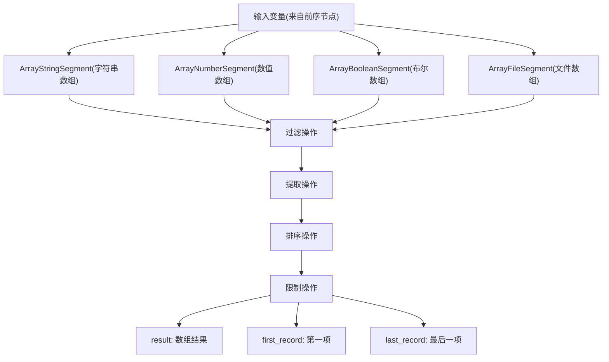
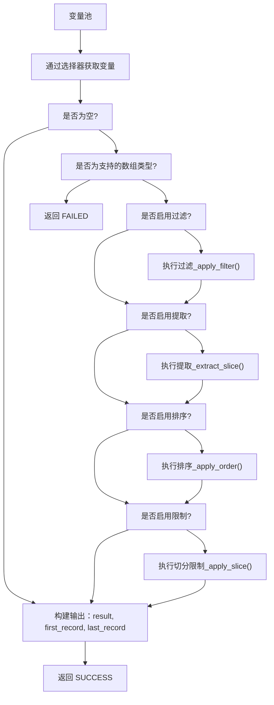
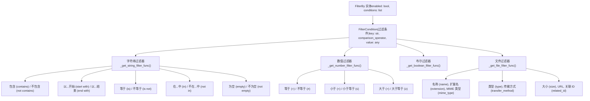
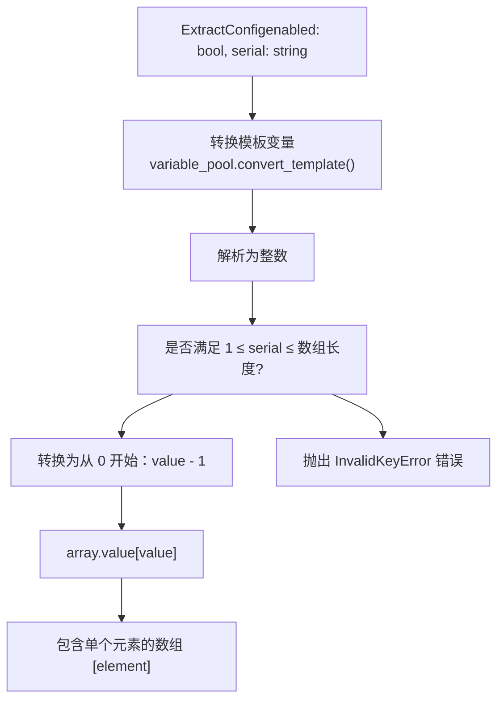
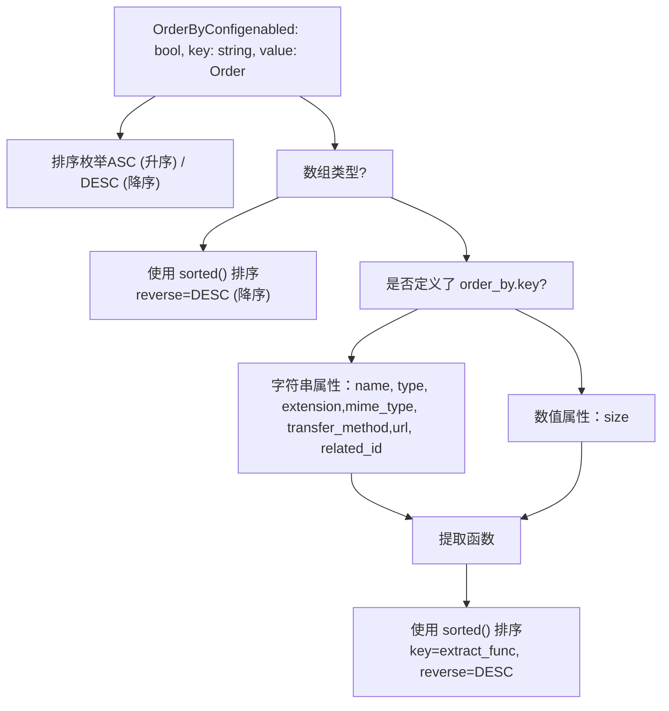
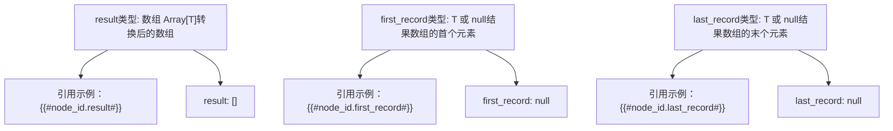
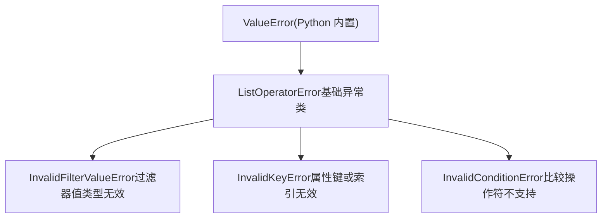
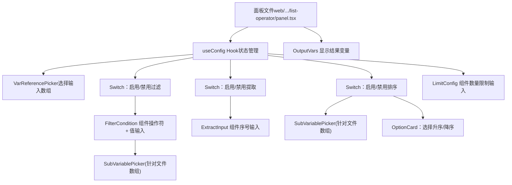
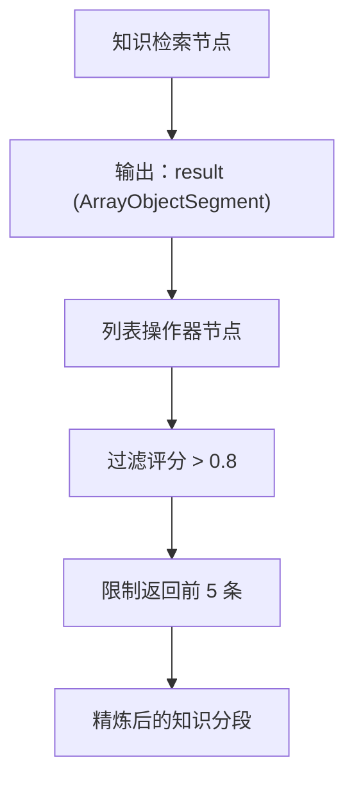

# 列表操作器与数据转换节点

相关源文件

-   [api/core/rag/datasource/retrieval\_service.py](https://github.com/langgenius/dify/blob/92dbc94f/api/core/rag/datasource/retrieval_service.py)
-   [api/core/rag/entities/metadata\_entities.py](https://github.com/langgenius/dify/blob/92dbc94f/api/core/rag/entities/metadata_entities.py)
-   [api/core/rag/retrieval/dataset\_retrieval.py](https://github.com/langgenius/dify/blob/92dbc94f/api/core/rag/retrieval/dataset_retrieval.py)
-   [api/core/workflow/nodes/knowledge\_retrieval/entities.py](https://github.com/langgenius/dify/blob/92dbc94f/api/core/workflow/nodes/knowledge_retrieval/entities.py)
-   [api/core/workflow/nodes/knowledge\_retrieval/knowledge\_retrieval\_node.py](https://github.com/langgenius/dify/blob/92dbc94f/api/core/workflow/nodes/knowledge_retrieval/knowledge_retrieval_node.py)
-   [api/core/workflow/nodes/list\_operator/entities.py](https://github.com/langgenius/dify/blob/92dbc94f/api/core/workflow/nodes/list_operator/entities.py)
-   [api/core/workflow/nodes/list\_operator/exc.py](https://github.com/langgenius/dify/blob/92dbc94f/api/core/workflow/nodes/list_operator/exc.py)
-   [api/core/workflow/nodes/list\_operator/node.py](https://github.com/langgenius/dify/blob/92dbc94f/api/core/workflow/nodes/list_operator/node.py)
-   [api/core/workflow/nodes/question\_classifier/entities.py](https://github.com/langgenius/dify/blob/92dbc94f/api/core/workflow/nodes/question_classifier/entities.py)
-   [api/services/hit\_testing\_service.py](https://github.com/langgenius/dify/blob/92dbc94f/api/services/hit_testing_service.py)
-   [api/tests/unit\_tests/core/rag/retrieval/\_\_init\_\_.py](https://github.com/langgenius/dify/blob/92dbc94f/api/tests/unit_tests/core/rag/retrieval/__init__.py)
-   [api/tests/unit\_tests/core/rag/retrieval/test\_dataset\_retrieval.py](https://github.com/langgenius/dify/blob/92dbc94f/api/tests/unit_tests/core/rag/retrieval/test_dataset_retrieval.py)
-   [api/tests/unit\_tests/core/workflow/nodes/test\_list\_operator.py](https://github.com/langgenius/dify/blob/92dbc94f/api/tests/unit_tests/core/workflow/nodes/test_list_operator.py)
-   [web/app/components/workflow/nodes/knowledge-retrieval/components/metadata/condition-list/utils.ts](https://github.com/langgenius/dify/blob/92dbc94f/web/app/components/workflow/nodes/knowledge-retrieval/components/metadata/condition-list/utils.ts)
-   [web/app/components/workflow/nodes/knowledge-retrieval/components/metadata/metadata-icon.tsx](https://github.com/langgenius/dify/blob/92dbc94f/web/app/components/workflow/nodes/knowledge-retrieval/components/metadata/metadata-icon.tsx)
-   [web/app/components/workflow/nodes/list-operator/components/extract-input.tsx](https://github.com/langgenius/dify/blob/92dbc94f/web/app/components/workflow/nodes/list-operator/components/extract-input.tsx)
-   [web/app/components/workflow/nodes/list-operator/components/filter-condition.tsx](https://github.com/langgenius/dify/blob/92dbc94f/web/app/components/workflow/nodes/list-operator/components/filter-condition.tsx)
-   [web/app/components/workflow/nodes/list-operator/default.ts](https://github.com/langgenius/dify/blob/92dbc94f/web/app/components/workflow/nodes/list-operator/default.ts)
-   [web/app/components/workflow/nodes/list-operator/panel.tsx](https://github.com/langgenius/dify/blob/92dbc94f/web/app/components/workflow/nodes/list-operator/panel.tsx)
-   [web/app/components/workflow/nodes/list-operator/types.ts](https://github.com/langgenius/dify/blob/92dbc94f/web/app/components/workflow/nodes/list-operator/types.ts)
-   [web/app/components/workflow/nodes/utils.ts](https://github.com/langgenius/dify/blob/92dbc94f/web/app/components/workflow/nodes/utils.ts)

列表操作器 (List Operator) 节点为 Dify 工作流提供了数组处理能力，能够对数组类型的变量执行过滤、提取、排序和限制操作。该节点对于数据预处理、结果精炼以及条件数据流控制至关重要。

有关知识库检索操作的信息，请参阅 [知识检索与问题分类器节点](/langgenius/dify/5.3-knowledge-retrieval-and-question-classifier-nodes)。有关通用工作流结构和执行的信息，请参阅 [工作流定义与执行模型](/langgenius/dify/5.1-workflow-definition-and-execution-model)。

## 概览

`ListOperatorNode` 类 ([api/core/workflow/nodes/list\_operator/node.py37-184](https://github.com/langgenius/dify/blob/92dbc94f/api/core/workflow/nodes/list_operator/node.py#L37-L184)) 通过一个由四个顺序操作组成的可配置流水线处理数组变量：

1.  **过滤 (Filter)** - 对数组元素应用条件过滤。
2.  **提取 (Extract)** - 通过索引位置选择特定元素。
3.  **排序 (Order)** - 按升序或降序对元素进行排序。
4.  **限制 (Limit)** - 限制结果中的元素数量。

每个操作都可以独立启用或禁用，操作按上述固定顺序执行。

**来源：** [api/core/workflow/nodes/list\_operator/node.py37-118](https://github.com/langgenius/dify/blob/92dbc94f/api/core/workflow/nodes/list_operator/node.py#L37-L118)

## 支持的数组类型


该节点在运行时验证输入类型 ([api/core/workflow/nodes/list\_operator/node.py69-73](https://github.com/langgenius/dify/blob/92dbc94f/api/core/workflow/nodes/list_operator/node.py#L69-L73))：

| 类型 | 类名 | 使用场景 |
| --- | --- | --- |
| `ArrayStringSegment` | 字符串数组 | 文本列表、分类、标签 |
| `ArrayNumberSegment` | 数值数组 | 评分、计数、测量值 |
| `ArrayBooleanSegment` | 布尔数组 | 标志、二进制状态 |
| `ArrayFileSegment` | 文件数组 | 多模态处理、批量文档 |

**来源：** [api/core/workflow/nodes/list\_operator/node.py14-21](https://github.com/langgenius/dify/blob/92dbc94f/api/core/workflow/nodes/list_operator/node.py#L14-L21) [api/core/workflow/nodes/list\_operator/entities.py1-70](https://github.com/langgenius/dify/blob/92dbc94f/api/core/workflow/nodes/list_operator/entities.py#L1-L70)

## 操作执行流水线

### 流水线架构


执行流程 ([api/core/workflow/nodes/list\_operator/node.py82-109](https://github.com/langgenius/dify/blob/92dbc94f/api/core/workflow/nodes/list_operator/node.py#L82-L109))：

1.  从 `variable_pool` 中使用选择器进行**变量检索**。
2.  **空数组处理** - 如果为空则立即成功并返回空结果。
3.  **顺序应用操作** - 操作会就地修改数组。
4.  **构建输出** - 生成 `result` (结果), `first_record` (第一条记录), `last_record` (最后一条记录)。

**来源：** [api/core/workflow/nodes/list\_operator/node.py44-118](https://github.com/langgenius/dify/blob/92dbc94f/api/core/workflow/nodes/list_operator/node.py#L44-L118)

## 过滤 (Filter) 操作

### 过滤条件系统


### 过滤实现

`_apply_filter` 方法 ([api/core/workflow/nodes/list\_operator/node.py119-157](https://github.com/langgenius/dify/blob/92dbc94f/api/core/workflow/nodes/list_operator/node.py#L119-L157)) 根据数组元素类型处理条件：

| 数组类型 | 过滤逻辑 | 示例 |
| --- | --- | --- |
| `ArrayStringSegment` | 文本匹配操作符 | `contains`, `start with`, `is` |
| `ArrayNumberSegment` | 数值比较 | `=`, `<`, `>`, `≤`, `≥`, `≠` |
| `ArrayBooleanSegment` | 布尔等值 | `is`, `is not` |
| `ArrayFileSegment` | 属性提取 + 比较 | 按 `type`, `size`, `extension` 过滤 |

**文件过滤：**

对于 `ArrayFileSegment`，系统首先使用基于键的访问器提取属性 ([api/core/workflow/nodes/list\_operator/node.py186-212](https://github.com/langgenius/dify/blob/92dbc94f/api/core/workflow/nodes/list_operator/node.py#L186-L212))：

```
# 字符串属性
_get_file_extract_string_func(key="name")      # 返回文件名
_get_file_extract_string_func(key="type")      # 返回文件类型
_get_file_extract_string_func(key="extension") # 返回扩展名

# 数值属性
_get_file_extract_number_func(key="size")      # 返回文件大小
```
然后应用适当的比较操作符 ([api/core/workflow/nodes/list\_operator/node.py278-291](https://github.com/langgenius/dify/blob/92dbc94f/api/core/workflow/nodes/list_operator/node.py#L278-L291))。

**取反模式：**

`_negation` 辅助函数 ([api/core/workflow/nodes/list\_operator/node.py26-34](https://github.com/langgenius/dify/blob/92dbc94f/api/core/workflow/nodes/list_operator/node.py#L26-L34)) 包装任何过滤函数以创建其逻辑反面，从而实现了 `not contains`, `is not`, `not in` 等操作符。

**来源：** [api/core/workflow/nodes/list\_operator/node.py119-157](https://github.com/langgenius/dify/blob/92dbc94f/api/core/workflow/nodes/list_operator/node.py#L119-L157) [api/core/workflow/nodes/list\_operator/node.py214-291](https://github.com/langgenius/dify/blob/92dbc94f/api/core/workflow/nodes/list_operator/node.py#L214-L291) [api/core/workflow/nodes/list\_operator/entities.py9-28](https://github.com/langgenius/dify/blob/92dbc94f/api/core/workflow/nodes/list_operator/entities.py#L9-L28)

## 提取 (Extract) 操作

提取操作根据从 1 开始的序号位置从数组中选择单个元素 ([api/core/workflow/nodes/list\_operator/node.py175-184](https://github.com/langgenius/dify/blob/92dbc94f/api/core/workflow/nodes/list_operator/node.py#L175-L184))：


**关键特性：**

-   **从 1 开始的索引**，以便于用户使用（内部会转换为从 0 开始）。
-   **支持变量模板** - `serial` 可以引用工作流变量。
-   **验证** - 如果索引超出范围，则抛出 `InvalidKeyError`。
-   **结果** - 返回包含单个元素的数组，而不是元素本身。

**来源：** [api/core/workflow/nodes/list\_operator/node.py175-184](https://github.com/langgenius/dify/blob/92dbc94f/api/core/workflow/nodes/list_operator/node.py#L175-L184) [api/core/workflow/nodes/list\_operator/entities.py59-62](https://github.com/langgenius/dify/blob/92dbc94f/api/core/workflow/nodes/list_operator/entities.py#L59-L62)

## 排序 (Order) 操作

### 排序逻辑


`_apply_order` 方法 ([api/core/workflow/nodes/list\_operator/node.py159-169](https://github.com/langgenius/dify/blob/92dbc94f/api/core/workflow/nodes/list_operator/node.py#L159-L169)) 使用 Python 的 `sorted()` 函数：

**简单类型 (字符串、数值、布尔值):**

-   通过 `reverse` 参数直接进行升序或降序排序。
-   不需要提供 `key` 函数。

**文件数组:**

-   需要 `order_by.key` 指定按哪个属性排序。
-   使用提取函数获取属性值 ([api/core/workflow/nodes/list\_operator/node.py186-212](https://github.com/langgenius/dify/blob/92dbc94f/api/core/workflow/nodes/list_operator/node.py#L186-L212))。
-   支持排序的属性：`name`, `type`, `extension`, `mime_type`, `transfer_method`, `url`, `related_id`, `size`。
-   在 `_order_file` 中实现 ([api/core/workflow/nodes/list\_operator/node.py337-347](https://github.com/langgenius/dify/blob/92dbc94f/api/core/workflow/nodes/list_operator/node.py#L337-L347))。

**来源：** [api/core/workflow/nodes/list\_operator/node.py159-169](https://github.com/langgenius/dify/blob/92dbc94f/api/core/workflow/nodes/list_operator/node.py#L159-L169) [api/core/workflow/nodes/list\_operator/node.py337-347](https://github.com/langgenius/dify/blob/92dbc94f/api/core/workflow/nodes/list_operator/node.py#L337-L347) [api/core/workflow/nodes/list\_operator/entities.py30-33](https://github.com/langgenius/dify/blob/92dbc94f/api/core/workflow/nodes/list_operator/entities.py#L30-L33)

## 限制 (Limit) 操作

限制操作将结果数组约束为前 N 个元素 ([api/core/workflow/nodes/list\_operator/node.py171-173](https://github.com/langgenius/dify/blob/92dbc94f/api/core/workflow/nodes/list_operator/node.py#L171-L173))：

```
def _apply_slice(self, variable: _SUPPORTED_TYPES_ALIAS) -> _SUPPORTED_TYPES_ALIAS:
    result = variable.value[: self.node_data.limit.size]
    return variable.model_copy(update={"value": result})
```
**配置参数：**

| 属性 | 类型 | 描述 |
| --- | --- | --- |
| `enabled` | `bool` | 是否应用限制 |
| `size` | `int` | 返回结果的最大元素数量 |

**行为：**

-   使用 Python 的切片语法 `[:size]`。
-   如果 `size` 超过数组长度，则返回整个数组。
-   如果 `size` 为 0 或负数，则返回空数组。

**来源：** [api/core/workflow/nodes/list\_operator/node.py171-173](https://github.com/langgenius/dify/blob/92dbc94f/api/core/workflow/nodes/list_operator/node.py#L171-L173) [api/core/workflow/nodes/list\_operator/entities.py54-57](https://github.com/langgenius/dify/blob/92dbc94f/api/core/workflow/nodes/list_operator/entities.py#L54-L57)

## 输出变量

### 输出结构


该节点产生三个输出变量 ([api/core/workflow/nodes/list\_operator/node.py99-103](https://github.com/langgenius/dify/blob/92dbc94f/api/core/workflow/nodes/list_operator/node.py#L99-L103))：

| 变量 | 类型 | 描述 | 空数组时的值 |
| --- | --- | --- | --- |
| `result` | `Array[T]` | 转换后的完整数组 | `[]` |
| `first_record` | `T | null` | 结果数组的首个元素 | `null` |
| `last_record` | `T | null` | 结果数组的末个元素 | `null` |

其中 `T` 是元素类型（`string`, `number`, `boolean`, 或 `File`）。

**类型保留：**

输出 `result` 使用 `model_copy` 保留了输入数组的类型：

```
outputs = {
    "result": variable,  # 仍为 ArrayStringSegment, ArrayNumberSegment 等
    "first_record": variable.value[0] if variable.value else None,
    "last_record": variable.value[-1] if variable.value else None,
}
```
**来源：** [api/core/workflow/nodes/list\_operator/node.py99-103](https://github.com/langgenius/dify/blob/92dbc94f/api/core/workflow/nodes/list_operator/node.py#L99-L103) [api/core/workflow/nodes/list\_operator/node.py55-68](https://github.com/langgenius/dify/blob/92dbc94f/api/core/workflow/nodes/list_operator/node.py#L55-L68)

## 异常处理

### 异常层级


异常类定义在 [api/core/workflow/nodes/list\_operator/exc.py1-17](https://github.com/langgenius/dify/blob/92dbc94f/api/core/workflow/nodes/list_operator/exc.py#L1-L17) 中：

| 异常 | 触发条件 | 示例 |
| --- | --- | --- |
| `InvalidFilterValueError` | 过滤器值类型错误 | 对字符串过滤使用布尔值 |
| `InvalidKeyError` | 属性键无效或索引越界 | `key="invalid_prop"` 或 `serial=999` |
| `InvalidConditionError` | 不支持的比较操作符 | 未知的操作符字符串 |

所有异常都在 `_run` 方法中被捕获 ([api/core/workflow/nodes/list\_operator/node.py110-117](https://github.com/langgenius/dify/blob/92dbc94f/api/core/workflow/nodes/list_operator/node.py#L110-L117))，并转换为带有错误消息的失败节点结果。

**来源：** [api/core/workflow/nodes/list\_operator/exc.py1-17](https://github.com/langgenius/dify/blob/92dbc94f/api/core/workflow/nodes/list_operator/exc.py#L1-L17) [api/core/workflow/nodes/list\_operator/node.py110-117](https://github.com/langgenius/dify/blob/92dbc94f/api/core/workflow/nodes/list_operator/node.py#L110-L117)

## 前端配置

### UI 面板架构


前端面板 ([web/app/components/workflow/nodes/list-operator/panel.tsx21-188](https://github.com/langgenius/dify/blob/92dbc94f/web/app/components/workflow/nodes/list-operator/panel.tsx#L21-L188)) 为配置所有操作提供了可视化界面：

**组件结构：**

| 部分 | 组件 | 目的 |
| --- | --- | --- |
| 输入变量 | `VarReferencePicker` | 从工作流变量中选择源数组 |
| 过滤条件 | `Switch`, `FilterCondition` | 配置条件过滤 |
| 提取 | `Switch`, `ExtractInput` | 配置按索引提取元素 |
| 排序方式 | `Switch`, `SubVariablePicker`, `OptionCard` | 配置排序方向和属性 |
| 限制数量 | `LimitConfig` | 配置结果规模限制 |
| 输出 | `OutputVars` | 显示可用的输出变量 |

**感知类型的 UI：**

`FilterCondition` 组件 ([web/app/components/workflow/nodes/list-operator/components/filter-condition.tsx40-188](https://github.com/langgenius/dify/blob/92dbc94f/web/app/components/workflow/nodes/list-operator/components/filter-condition.tsx#L40-L188)) 会根据数组元素类型进行调整：

-   **字符串/数值数组**: 直接进行比较值输入。
-   **布尔数组**: 使用 `BoolValue` 切换开关组件。
-   **文件数组**:
    -   使用 `SubVariablePicker` 选择属性 (`key`)。
    -   针对类型特定的操作符（例如对 `type` 使用 `in`, 对 `size` 使用数值比较）。
    -   枚举值的选择下拉框 (`FILE_TYPE_OPTIONS`, `TRANSFER_METHOD`)。

**变量模板支持：**

输入字段通过带有 `nodesOutputVars` 和 `availableNodes` 属性的 `Input` 组件支持变量引用，从而允许使用来自前序工作流节点的动态值。

**来源：** [web/app/components/workflow/nodes/list-operator/panel.tsx21-188](https://github.com/langgenius/dify/blob/92dbc94f/web/app/components/workflow/nodes/list-operator/panel.tsx#L21-L188) [web/app/components/workflow/nodes/list-operator/components/filter-condition.tsx40-188](https://github.com/langgenius/dify/blob/92dbc94f/web/app/components/workflow/nodes/list-operator/components/filter-condition.tsx#L40-L188) [web/app/components/workflow/nodes/list-operator/components/extract-input.tsx19-53](https://github.com/langgenius/dify/blob/92dbc94f/web/app/components/workflow/nodes/list-operator/components/extract-input.tsx#L19-L53)

## 验证规则

前端验证 ([web/app/components/workflow/nodes/list-operator/default.ts38-61](https://github.com/langgenius/dify/blob/92dbc94f/web/app/components/workflow/nodes/list-operator/default.ts#L38-L61)) 强制执行以下规则：

| 字段 | 验证规则 | 错误条件 |
| --- | --- | --- |
| `variable` | 必填 | 选择器数组为空 |
| `filter_by.key` | 如果是文件数组且启用了过滤，则必填 | 缺少文件过滤属性键 |
| `filter_by.comparison_operator` | 如果启用了过滤，则必填 | 缺少操作符 |
| `filter_by.value` | 如果操作符需要值，则必填 | 非空型操作符缺少数值输入 |

`comparisonOperatorNotRequireValue` 函数用于检查 `empty` (为空), `not empty` (不为空) 等操作符是否需要跳过值验证。

**来源：** [web/app/components/workflow/nodes/list-operator/default.ts38-61](https://github.com/langgenius/dify/blob/92dbc94f/web/app/components/workflow/nodes/list-operator/default.ts#L38-L61)

## 与知识检索集成

列表操作器节点通常用于处理知识检索节点的返回结果。知识检索节点输出 `ArrayObjectSegment` ([api/core/workflow/nodes/knowledge\_retrieval/knowledge\_retrieval\_node.py188-200](https://github.com/langgenius/dify/blob/92dbc94f/api/core/workflow/nodes/knowledge_retrieval/knowledge_retrieval_node.py#L188-L200))：


**常见模式：**

1.  **评分过滤**: 按相关性评分阈值过滤检索结果。
2.  **结果限制**: 在重排序后仅取前 K 个最相关的代码块。
3.  **来源过滤**: 按知识库或文档元数据进行过滤。

**注意：** 尽管 `ArrayObjectSegment` 未列在 `_SUPPORTED_TYPES_TUPLE` 中，但变量池转换系统可能会通过 `ArrayAnySegment` 回退机制来处理对象数组 ([api/core/workflow/nodes/list\_operator/node.py61](https://github.com/langgenius/dify/blob/92dbc94f/api/core/workflow/nodes/list_operator/node.py#L61-L61))。

**来源：** [api/core/workflow/nodes/knowledge\_retrieval/knowledge\_retrieval\_node.py188-200](https://github.com/langgenius/dify/blob/92dbc94f/api/core/workflow/nodes/knowledge_retrieval/knowledge_retrieval_node.py#L188-L200) [api/core/workflow/nodes/list\_operator/node.py58-62](https://github.com/langgenius/dify/blob/92dbc94f/api/core/workflow/nodes/list_operator/node.py#L58-L62)

## 测试

测试套件 ([api/tests/unit\_tests/core/workflow/nodes/test\_list\_operator.py1-183](https://github.com/langgenius/dify/blob/92dbc94f/api/tests/unit_tests/core/workflow/nodes/test_list_operator.py#L1-L183)) 验证了：

**文件过滤测试** ([api/tests/unit\_tests/core/workflow/nodes/test\_list\_operator.py65-138](https://github.com/langgenius/dify/blob/92dbc94f/api/tests/unit_tests/core/workflow/nodes/test_list_operator.py#L65-L138))：

-   使用 `in` 操作符按 `type` 过滤文件。
-   验证是否正确选择了文件 (IMAGE, DOCUMENT) 并排除了其他类型 (AUDIO)。

**属性提取测试** ([api/tests/unit\_tests/core/workflow/nodes/test\_list\_operator.py140-183](https://github.com/langgenius/dify/blob/92dbc94f/api/tests/unit_tests/core/workflow/nodes/test_list_operator.py#L140-L183))：

-   测试所有文件属性提取器 (`name`, `type`, `extension`, `mime_type`, `transfer_method`, `url`, `related_id`)。
-   验证空值处理（针对空属性返回空字符串）。
-   验证针对无效键抛出 `InvalidKeyError`。

**测试固件 (Fixtures)：**

```
@pytest.fixture
def list_operator_node():
    config = {
        "variable": ["test_variable"],
        "filter_by": FilterBy(enabled=True, conditions=[...]),
        "order_by": OrderByConfig(enabled=False),
        "limit": Limit(enabled=False),
        "extract_by": ExtractConfig(enabled=False)
    }
```
**来源：** [api/tests/unit\_tests/core/workflow/nodes/test\_list\_operator.py23-183](https://github.com/langgenius/dify/blob/92dbc94f/api/tests/unit_tests/core/workflow/nodes/test_list_operator.py#L23-L183)