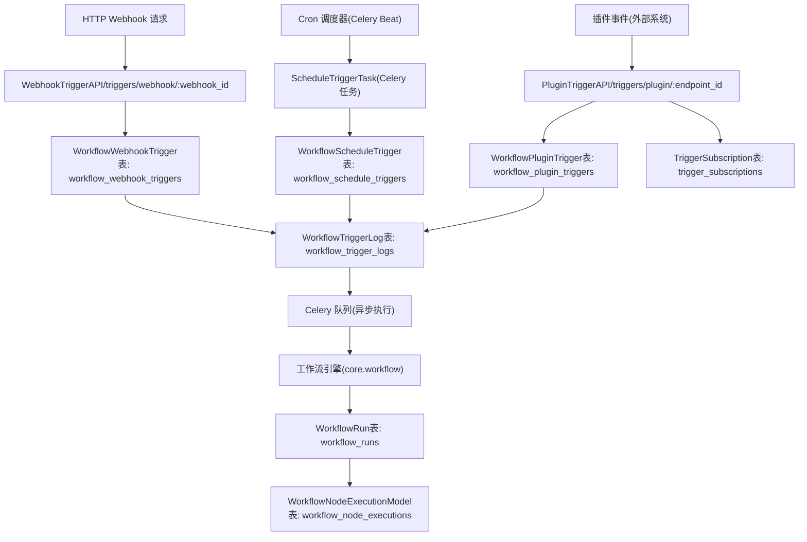
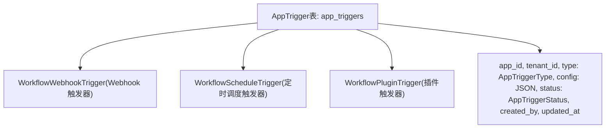
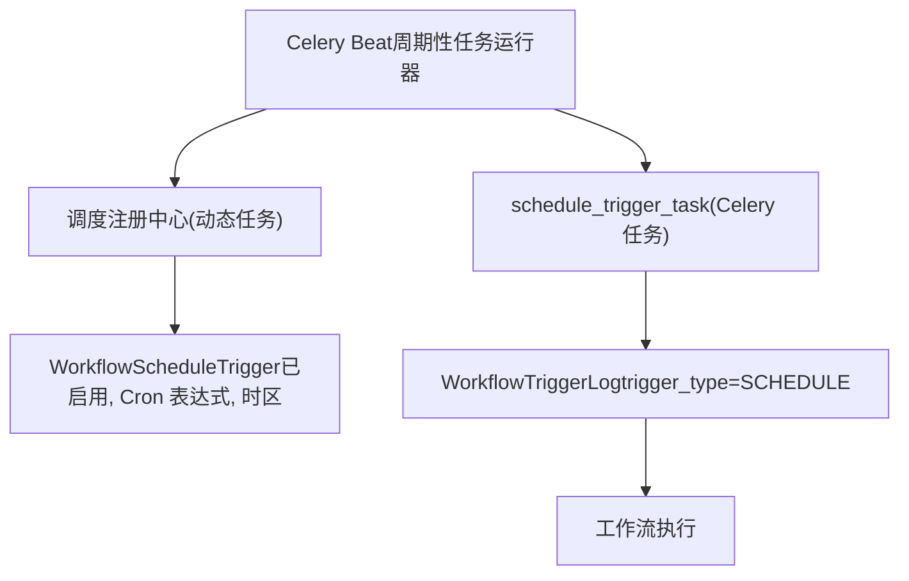
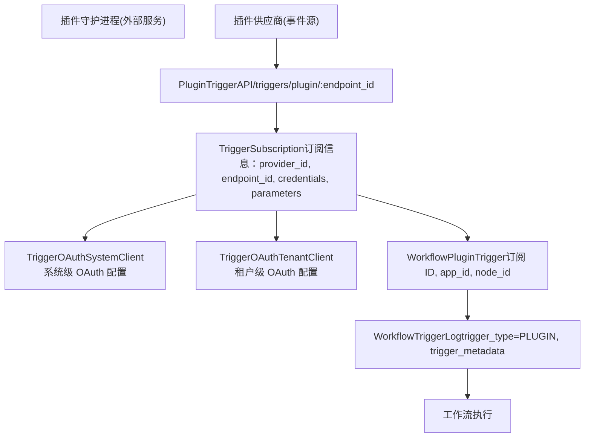
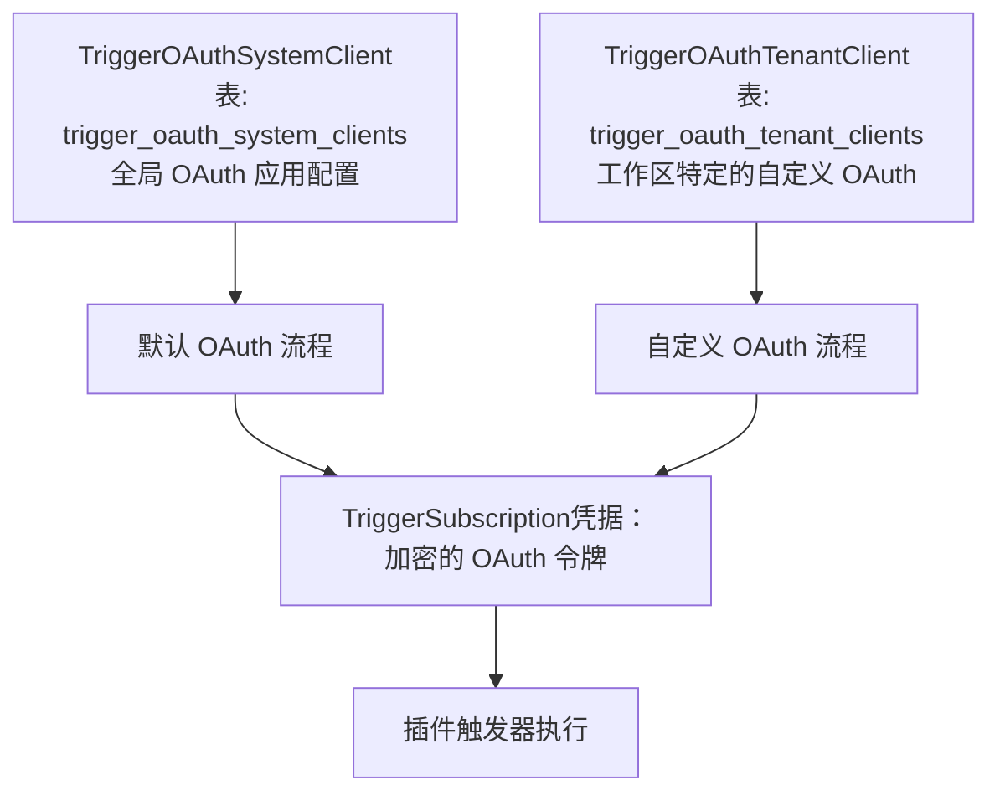
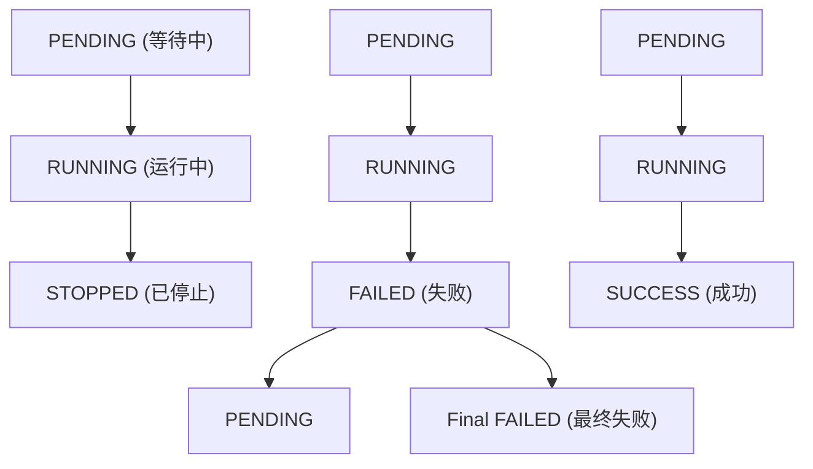

# 触发器系统与工作流自动化

相关源文件

-   [api/models/account.py](https://github.com/langgenius/dify/blob/92dbc94f/api/models/account.py)
-   [api/models/api\_based\_extension.py](https://github.com/langgenius/dify/blob/92dbc94f/api/models/api_based_extension.py)
-   [api/models/dataset.py](https://github.com/langgenius/dify/blob/92dbc94f/api/models/dataset.py)
-   [api/models/model.py](https://github.com/langgenius/dify/blob/92dbc94f/api/models/model.py)
-   [api/models/oauth.py](https://github.com/langgenius/dify/blob/92dbc94f/api/models/oauth.py)
-   [api/models/provider.py](https://github.com/langgenius/dify/blob/92dbc94f/api/models/provider.py)
-   [api/models/source.py](https://github.com/langgenius/dify/blob/92dbc94f/api/models/source.py)
-   [api/models/task.py](https://github.com/langgenius/dify/blob/92dbc94f/api/models/task.py)
-   [api/models/tools.py](https://github.com/langgenius/dify/blob/92dbc94f/api/models/tools.py)
-   [api/models/trigger.py](https://github.com/langgenius/dify/blob/92dbc94f/api/models/trigger.py)
-   [api/models/web.py](https://github.com/langgenius/dify/blob/92dbc94f/api/models/web.py)
-   [api/models/workflow.py](https://github.com/langgenius/dify/blob/92dbc94f/api/models/workflow.py)
-   [api/tests/test\_containers\_integration\_tests/services/test\_advanced\_prompt\_template\_service.py](https://github.com/langgenius/dify/blob/92dbc94f/api/tests/test_containers_integration_tests/services/test_advanced_prompt_template_service.py)
-   [api/tests/test\_containers\_integration\_tests/services/test\_agent\_service.py](https://github.com/langgenius/dify/blob/92dbc94f/api/tests/test_containers_integration_tests/services/test_agent_service.py)
-   [api/tests/test\_containers\_integration\_tests/tasks/\_\_init\_\_.py](https://github.com/langgenius/dify/blob/92dbc94f/api/tests/test_containers_integration_tests/tasks/__init__.py)
-   [api/tests/test\_containers\_integration\_tests/tasks/test\_add\_document\_to\_index\_task.py](https://github.com/langgenius/dify/blob/92dbc94f/api/tests/test_containers_integration_tests/tasks/test_add_document_to_index_task.py)
-   [api/tests/unit\_tests/core/test\_provider\_manager.py](https://github.com/langgenius/dify/blob/92dbc94f/api/tests/unit_tests/core/test_provider_manager.py)

## 目的与范围

触发器系统 (Trigger System) 能够响应外部事件、预定时间或基于插件的触发器，实现自动化的工作流执行。该系统允许工作流在无需用户直接交互的情况下运行，主要通过三种机制实现：**Webhooks** (HTTP 端点)、**Schedules** (基于 Cron 的定时调度) 和 **Plugin Triggers** (插件事件触发)。

有关工作流定义与执行的信息，请参阅 [工作流定义与执行模型](/langgenius/dify/5.1-workflow-definition-and-execution-model)。有关工作流如何处理 LLM 调用和工具的详情，请参阅 [LLM 节点与模型集成](/langgenius/dify/5.2-llm-nodes-and-model-integration)。

---

## 触发器架构概览

触发器系统由多个关键组件组成，它们协同工作以实现自动化的工作流执行：

### 系统组件图


**来源：** [api/models/trigger.py1-600](https://github.com/langgenius/dify/blob/92dbc94f/api/models/trigger.py#L1-L600)

---

## 触发器类型与配置

### 触发器类型枚举

系统支持在 `AppTriggerType` 中定义的通过三种触发器类型：

| 触发器类型 | 枚举值 | 使用场景 |
| --- | --- | --- |
| Webhook | `WEBHOOK` | 用于外部集成的 HTTP 端点 |
| Schedule | `SCHEDULE` | 基于时间的执行 (Cron) |
| Plugin | `PLUGIN` | 来自外部插件的事件驱动执行 |

**来源：** [api/models/enums.py1-100](https://github.com/langgenius/dify/blob/92dbc94f/api/models/enums.py#L1-L100)

---

## 数据模型架构

### 核心触发器表

```mermaid
flowchart TD
    entity_App_0["App(应用)"]
    entity_WorkflowWebhookTrigger_1["WorkflowWebhookTrigger(Webhook 触发器)"]
    entity_WorkflowScheduleTrigger_2["WorkflowScheduleTrigger(定时调度触发器)"]
    entity_WorkflowPluginTrigger_3["WorkflowPluginTrigger(插件触发器)"]
    entity_Workflow_4["Workflow(工作流)"]
    entity_TriggerSubscription_5["TriggerSubscription(触发器订阅)"]
    entity_WorkflowTriggerLog_6["WorkflowTriggerLog(触发器日志)"]
    entity_WorkflowRun_7["WorkflowRun(工作流运行)"]
```


**来源：** [api/models/trigger.py27-106](https://github.com/langgenius/dify/blob/92dbc94f/api/models/trigger.py#L27-L106) [api/models/trigger.py169-280](https://github.com/langgenius/dify/blob/92dbc94f/api/models/trigger.py#L169-L280) [api/models/trigger.py282-400](https://github.com/langgenius/dify/blob/92dbc94f/api/models/trigger.py#L282-L400)

### AppTrigger 关联关系

`AppTrigger` 模型为所有触发器类型提供了一个统一的接口：


**来源：** [api/models/trigger.py402-500](https://github.com/langgenius/dify/blob/92dbc94f/api/models/trigger.py#L402-L500)

---

## Webhook 触发器

### Webhook 触发流程

> **[Mermaid 序列图]**
> *(图表结构无法解析)*

### Webhook 触发器模型结构

`WorkflowWebhookTrigger` 表存储 Webhook 配置：

| 字段 | 类型 | 描述 |
| --- | --- | --- |
| `id` | UUID | 主键 |
| `app_id` | UUID | 外键，关联应用 |
| `node_id` | VARCHAR(255) | 工作流图中的开始节点 ID |
| `tenant_id` | UUID | 工作区标识符 |
| `webhook_id` | VARCHAR(255) | **唯一的**端点标识符，用于 URL |
| `created_by` | VARCHAR(255) | 创建者用户 ID |
| `created_at` | TIMESTAMP | 创建时间戳 |
| `updated_at` | TIMESTAMP | 最后更新时间戳 |

**端点 URL 模式：**

```
https://{API_HOST}/triggers/webhook/{webhook_id}
```
**来源：** [api/models/trigger.py282-340](https://github.com/langgenius/dify/blob/92dbc94f/api/models/trigger.py#L282-L340)

### Webhook ID 生成

`webhook_id` 使用 `generate_webhook_trigger_endpoint()` 工具函数生成，该函数为每个 Webhook 触发器创建一个 URL 安全的唯一标识符。

**来源：** [core/trigger/utils/endpoint.py1-50](https://github.com/langgenius/dify/blob/92dbc94f/core/trigger/utils/endpoint.py#L1-L50)

---

## 定时调度 (Schedule) 触发器

### 定时调度触发器架构


### 定时调度触发器模型

`WorkflowScheduleTrigger` 表存储基于 Cron 的调度配置：

| 字段 | 类型 | 描述 |
| --- | --- | --- |
| `id` | UUID | 主键 |
| `app_id` | UUID | 外键，关联应用 |
| `node_id` | VARCHAR(255) | 工作流中的开始节点 ID |
| `tenant_id` | UUID | 工作区标识符 |
| `cron` | VARCHAR(255) | Cron 表达式 (例如 `"0 9 * * *"`) |
| `timezone` | VARCHAR(255) | IANA 时区 (例如 `"America/New_York"`) |
| `enabled` | BOOLEAN | 激活状态 |
| `created_by` | VARCHAR(255) | 创建者用户 ID |
| `created_at` | TIMESTAMP | 创建时间戳 |
| `updated_at` | TIMESTAMP | 最后更新时间戳 |
| `last_triggered_at` | TIMESTAMP | 最近一次成功触发的时间 |

**Cron 表达式格式：**

```
┌───────────── 分钟 (0 - 59)
│ ┌───────────── 小时 (0 - 23)
│ │ ┌───────────── 月份中的天数 (1 - 31)
│ │ │ ┌───────────── 月份 (1 - 12)
│ │ │ │ ┌───────────── 星期中的天数 (0 - 6) (周日到周六)
│ │ │ │ │
* * * * *
```
**来源：** [api/models/trigger.py342-400](https://github.com/langgenius/dify/blob/92dbc94f/api/models/trigger.py#L342-L400)

### 时区处理

定时调度触发器支持 IANA 时区标识符（例如 `"UTC"`, `"America/New_York"`, `"Europe/London"`）。Celery Beat 调度器在执行前会将 Cron 表达式转换为指定的时区。

**来源：** [api/models/trigger.py350-360](https://github.com/langgenius/dify/blob/92dbc94f/api/models/trigger.py#L350-L360)

---

## 插件触发器 (Plugin Triggers)

### 插件触发器架构


### TriggerSubscription (触发器订阅) 模型

`TriggerSubscription` 表管理插件事件订阅：

| 字段 | 类型 | 描述 |
| --- | --- | --- |
| `id` | UUID | 主键 |
| `name` | VARCHAR(255) | 订阅实例名称 |
| `tenant_id` | UUID | 工作区标识符 |
| `user_id` | UUID | 创建订阅的用户 ID |
| `provider_id` | VARCHAR(255) | 插件标识符 (例如 `"plugin_id/provider_name"`) |
| `endpoint_id` | VARCHAR(255) | 用于接收事件的**唯一**端点 |
| `parameters` | JSON | 订阅配置参数 |
| `properties` | JSON | 订阅属性 |
| `credentials` | JSON | 加密凭据 (OAuth 令牌, API Key) |
| `credential_type` | VARCHAR(50) | `"oauth"` 或 `"api_key"` |
| `credential_expires_at` | INTEGER | OAuth 令牌过期时间戳 (`-1` 代表永不过期) |
| `expires_at` | INTEGER | 订阅过期时间戳 (`-1` 代表永不过期) |
| `created_at` | TIMESTAMP | 创建时间戳 |
| `updated_at` | TIMESTAMP | 最后更新时间戳 |

**已索引字段：**

-   `endpoint_id`（用于 O(1) 端点查询的唯一索引）
-   `(tenant_id, provider_id)`（用于供应商查询的复合索引）

**来源：** [api/models/trigger.py27-106](https://github.com/langgenius/dify/blob/92dbc94f/api/models/trigger.py#L27-L106)

### 插件触发器凭据管理

插件触发器支持两种凭据类型：

#### API Key 凭据

```
{
  "credential_type": "api_key",
  "credentials": {
    "api_key": "加密后的值"
  },
  "credential_expires_at": -1
}
```
#### OAuth 凭据

```
{
  "credential_type": "oauth",
  "credentials": {
    "access_token": "加密后的 token",
    "refresh_token": "加密后的刷新 token",
    "token_type": "Bearer"
  },
  "credential_expires_at": 1704067200
}
```
**OAuth 刷新逻辑：**

`is_credential_expired()` 方法检查 OAuth 令牌是否需要刷新，带有 3 分钟的缓冲期：

```
def is_credential_expired(self) -> bool:
    if self.credential_expires_at == -1:
        return False
    # 检查令牌是否在未来 3 分钟内过期
    return (self.credential_expires_at - 180) < int(time.time())
```
**来源：** [api/models/trigger.py79-84](https://github.com/langgenius/dify/blob/92dbc94f/api/models/trigger.py#L79-L84)

### 插件端点 URL 生成

插件触发器端点遵循以下模式：

```
https://{API_HOST}/triggers/plugin/{endpoint_id}
```
`endpoint_id` 是由 `generate_plugin_trigger_endpoint_url()` 生成的唯一标识符。

**来源：** [core/trigger/utils/endpoint.py1-50](https://github.com/langgenius/dify/blob/92dbc94f/core/trigger/utils/endpoint.py#L1-L50)

---

## 工作流触发执行

### 触发日志生命周期

> **[Mermaid 状态图]**
> *(图表结构无法解析)*

### WorkflowTriggerLog (工作流触发日志) 模型

`WorkflowTriggerLog` 表追踪所有触发器执行情况：

| 字段 | 类型 | 描述 |
| --- | --- | --- |
| `id` | UUID | 主键 (作为 `workflow_trigger_log_id` 使用) |
| `tenant_id` | UUID | 工作区标识符 |
| `app_id` | UUID | 应用标识符 |
| `workflow_id` | UUID | 工作流标识符 |
| `workflow_run_id` | UUID | 关联的 WorkflowRun (执行开始前为 NULL) |
| `root_node_id` | VARCHAR(255) | 自定义开始节点 ID (可选) |
| `trigger_metadata` | TEXT | 触发器特定元数据 (JSON) |
| `trigger_type` | VARCHAR(50) | `WEBHOOK`, `SCHEDULE`, 或 `PLUGIN` |
| `trigger_data` | TEXT | 包含输入的完整触发数据 (JSON) |
| `inputs` | TEXT | 便于查看的输入参数 (JSON) |
| `outputs` | TEXT | 输出内容 (JSON, 完成前为 NULL) |
| `status` | VARCHAR(50) | 执行状态 (见生命周期) |
| `error` | TEXT | 失败时的错误消息 |
| `queue_name` | VARCHAR(100) | 执行所使用的 Celery 队列名 |
| `celery_task_id` | VARCHAR(255) | 用于追踪的 Celery 任务 ID |
| `retry_count` | INTEGER | 重试尝试次数 |
| `elapsed_time` | FLOAT | 耗时（秒） |
| `total_tokens` | INTEGER | 消耗的总 Token 数 (LLM 调用) |
| `created_by_role` | VARCHAR(255) | `"account"` 或 `"end_user"` |
| `created_by` | VARCHAR(255) | 创建者 ID |
| `created_at` | TIMESTAMP | 创建时间 |
| `triggered_at` | TIMESTAMP | 实际触发时间 (执行开始时间) |
| `finished_at` | TIMESTAMP | 完成时间 |

**已索引字段：**

-   `(tenant_id, app_id)` 用于应用特定查询。
-   `status` 用于按执行状态过滤。
-   `created_at` 用于按时间顺序排序。
-   `workflow_run_id` 用于链接到 WorkflowRun。
-   `workflow_id` 用于工作流特定查询。

**来源：** [api/models/trigger.py169-280](https://github.com/langgenius/dify/blob/92dbc94f/api/models/trigger.py#L169-L280)

### 支持重调用的触发器执行流程

> **[Mermaid 序列图]**
> *(图表结构无法解析)*

**来源：** [api/models/trigger.py253-279](https://github.com/langgenius/dify/blob/92dbc94f/api/models/trigger.py#L253-L279)

### 触发器数据结构

`trigger_data` 字段以 JSON 格式存储完整的触发上下文：

```
{
  "type": "webhook",
  "source": {
    "ip": "192.168.1.100",
    "user_agent": "curl/7.68.0"
  },
  "inputs": {
    "user_input": "Hello, world!",
    "parameter1": "value1"
  },
  "metadata": {
    "webhook_id": "abc123",
    "received_at": "2024-01-15T10:30:00Z"
  }
}
```
针对**定时调度触发器**，元数据包含：

```
{
  "type": "schedule",
  "metadata": {
    "cron": "0 9 * * *",
    "timezone": "America/New_York",
    "scheduled_time": "2024-01-15T09:00:00-05:00"
  },
  "inputs": {
    // 开始节点输入
  }
}
```
针对**插件触发器**，元数据包含：

```
{
  "type": "plugin",
  "metadata": {
    "provider_id": "github_webhook",
    "endpoint_id": "xyz789",
    "event_type": "push",
    "subscription_id": "sub_123"
  },
  "inputs": {
    // 从插件事件载荷中提取
  }
}
```
**来源：** [api/models/trigger.py219-223](https://github.com/langgenius/dify/blob/92dbc94f/api/models/trigger.py#L219-L223)

---

## 触发器的 OAuth 配置

### 系统级与租户级 OAuth

插件触发器支持两个层级的 OAuth 认证：


### TriggerOAuthSystemClient 模型

针对插件供应商的系统级 OAuth 配置：

| 字段 | 类型 | 描述 |
| --- | --- | --- |
| `id` | UUID | 主键 |
| `plugin_id` | VARCHAR(255) | 插件标识符 |
| `provider` | VARCHAR(255) | 插件内的供应商名称 |
| `encrypted_oauth_params` | TEXT | 加密的 OAuth 客户端凭据 (JSON) |
| `created_at` | TIMESTAMP | 创建时间戳 |
| `updated_at` | TIMESTAMP | 最后更新时间戳 |

**唯一约束：** `(plugin_id, provider)`

**来源：** [api/models/trigger.py108-133](https://github.com/langgenius/dify/blob/92dbc94f/api/models/trigger.py#L108-L133)

### TriggerOAuthTenantClient 模型

租户特定的 OAuth 配置（覆盖系统级配置）：

| 字段 | 类型 | 描述 |
| --- | --- | --- |
| `id` | UUID | 主键 |
| `tenant_id` | UUID | 工作区标识符 |
| `plugin_id` | VARCHAR(255) | 插件标识符 |
| `provider` | VARCHAR(255) | 插件内的供应商名称 |
| `enabled` | BOOLEAN | 激活状态 |
| `encrypted_oauth_params` | TEXT | 加密的 OAuth 客户端凭据 (JSON) |
| `created_at` | TIMESTAMP | 创建时间戳 |
| `updated_at` | TIMESTAMP | 最后更新时间戳 |

**唯一约束：** `(tenant_id, plugin_id, provider)`

**OAuth 参数结构：**

```
{
  "client_id": "租户自定义客户端 ID",
  "client_secret": "加密后的密钥",
  "authorize_url": "https://provider.com/oauth/authorize",
  "token_url": "https://provider.com/oauth/token",
  "scopes": ["read", "write"]
}
```
**来源：** [api/models/trigger.py135-167](https://github.com/langgenius/dify/blob/92dbc94f/api/models/trigger.py#L135-L167)

---

## 触发器状态管理

### 触发器状态枚举

#### AppTriggerStatus (应用触发器状态)

控制触发器是否正在活跃地处理事件：

| 状态 | 描述 |
| --- | --- |
| `ACTIVE` | 触发器已启用并正在处理事件 |
| `PAUSED` | 触发器已禁用，事件将被忽略 |

**来源：** [api/models/enums.py1-50](https://github.com/langgenius/dify/blob/92dbc94f/api/models/enums.py#L1-L50)

#### WorkflowTriggerStatus (工作流触发状态)

追踪单次触发的执行状态：

| 状态 | 描述 |
| --- | --- |
| `PENDING` | 触发器已入队，等待 Worker 处理 |
| `RUNNING` | 正在执行工作流 |
| `SUCCESS` | 工作流成功完成 |
| `FAILED` | 工作流执行失败 |
| `STOPPED` | 执行被手动停止 |

**来源：** [api/models/enums.py51-100](https://github.com/langgenius/dify/blob/92dbc94f/api/models/enums.py#L51-L100)

### 状态转换规则


**来源：** [api/models/trigger.py225-240](https://github.com/langgenius/dify/blob/92dbc94f/api/models/trigger.py#L225-L240)

---

## 触发器实体转换

`TriggerSubscription` 模型提供了转换为领域实体的方法：

### to\_entity() 方法

转换为用于工作流执行的核心 `Subscription` (订阅) 实体：

```
def to_entity(self) -> Subscription:
    return Subscription(
        expires_at=self.expires_at,
        endpoint=generate_plugin_trigger_endpoint_url(self.endpoint_id),
        parameters=self.parameters,
        properties=self.properties,
    )
```
**来源：** [api/models/trigger.py86-92](https://github.com/langgenius/dify/blob/92dbc94f/api/models/trigger.py#L86-L92)

### to\_api\_entity() 方法

转换为用于返回客户端响应的 API 实体：

```
def to_api_entity(self) -> TriggerProviderSubscriptionApiEntity:
    return TriggerProviderSubscriptionApiEntity(
        id=self.id,
        name=self.name,
        provider=self.provider_id,
        endpoint=generate_plugin_trigger_endpoint_url(self.endpoint_id),
        parameters=self.parameters,
        properties=self.properties,
        credential_type=CredentialType(self.credential_type),
        credentials=self.credentials,
        workflows_in_use=-1,
    )
```
**来源：** [api/models/trigger.py94-105](https://github.com/langgenius/dify/blob/92dbc94f/api/models/trigger.py#L94-L105)

---

## 触发器队列管理

### Celery 队列配置

触发执行根据配置分布在不同的 Celery 队列中：

| 队列名称 | 用途 |
| --- | --- |
| `default` | 标准触发器执行 |
| `high_priority` | 时间敏感的定时调度触发器 |
| `plugin_triggers` | 基于插件的事件处理 |

`WorkflowTriggerLog` 中的 `queue_name` 字段记录了处理该触发器的队列。

**来源：** [api/models/trigger.py228](https://github.com/langgenius/dify/blob/92dbc94f/api/models/trigger.py#L228-L228)

### 任务重试配置

失败的触发执行可以自动重试：

```
# 伪配置（实际值位于 Celery 设置中）
MAX_RETRIES = 3
RETRY_DELAY_SECONDS = 60  # 指数退避
```
`retry_count` 字段追踪重试尝试次数。达到最大重试次数后，触发器状态将保持为 `FAILED`。

**来源：** [api/models/trigger.py232](https://github.com/langgenius/dify/blob/92dbc94f/api/models/trigger.py#L232-L232)

---

## 与工作流执行的集成

### 工作流触发来源枚举

`WorkflowNodeExecutionTriggeredFrom` 枚举区分了触发来源：

```
class WorkflowNodeExecutionTriggeredFrom(StrEnum):
    SINGLE_STEP = "single-step"        # 手动单步调试
    WORKFLOW_RUN = "workflow-run"      # 标准工作流执行
    RAG_PIPELINE_RUN = "rag-pipeline-run"  # RAG 流水线执行
```
由触发器启动的工作流使用 `WORKFLOW_RUN` 作为其触发来源。

**来源：** [api/models/workflow.py718-725](https://github.com/langgenius/dify/blob/92dbc94f/api/models/workflow.py#L718-L725)

### 将触发器链接到 WorkflowRun

当触发器执行工作流时：

1.  创建状态为 `PENDING` 的 **WorkflowTriggerLog**。
2.  Worker 领取任务，更新状态为 `RUNNING`，设置 `triggered_at`。
3.  **WorkflowEngine** 创建 `triggered_from="app-run"` 的 **WorkflowRun**。
4.  **WorkflowTriggerLog.workflow\_run\_id** 被填充为该运行 ID。
5.  完成后，设置 `status=SUCCESS/FAILED`、`outputs` (输出) 和 `finished_at` (完成时间)。

这种双向链接实现了：

-   查找工作流运行的所有触发器。
-   从触发日志重新执行工作流。
-   监控触发器的性能指标。

**来源：** [api/models/trigger.py217](https://github.com/langgenius/dify/blob/92dbc94f/api/models/trigger.py#L217-L217) [api/models/workflow.py556-691](https://github.com/langgenius/dify/blob/92dbc94f/api/models/workflow.py#L556-L691)

---

## 监控与可观测性

### 触发器指标

`WorkflowTriggerLog` 表提供了用于监控的指标：

| 指标 | 字段 | 描述 |
| --- | --- | --- |
| 执行耗时 | `elapsed_time` | 从触发到完成的总秒数 |
| Token 消耗 | `total_tokens` | 累积的 LLM Token 消耗量 |
| 重试次数 | `retry_count` | 重试尝试次数 |
| 队列延迟 | `triggered_at - created_at` | 在队列中等待的时间 |

### 查询示例

**查找应用的失败触发记录：**

```
SELECT * FROM workflow_trigger_logs
WHERE app_id = :app_id
  AND status = 'FAILED'
ORDER BY created_at DESC;
```
**计算平均执行耗时：**

```
SELECT AVG(elapsed_time) as avg_time
FROM workflow_trigger_logs
WHERE status = 'SUCCESS'
  AND workflow_id = :workflow_id;
```
**来源：** [api/models/trigger.py233-234](https://github.com/langgenius/dify/blob/92dbc94f/api/models/trigger.py#L233-L234)

---

## 触发日志字典序列化

`to_dict()` 方法将触发日志记录转换为对 API 友好的字典：

```
def to_dict(self) -> dict[str, Any]:
    return {
        "id": self.id,
        "tenant_id": self.tenant_id,
        "app_id": self.app_id,
        "workflow_id": self.workflow_id,
        "workflow_run_id": self.workflow_run_id,
        "root_node_id": self.root_node_id,
        "trigger_metadata": json.loads(self.trigger_metadata) if self.trigger_metadata else None,
        "trigger_type": self.trigger_type,
        "trigger_data": json.loads(self.trigger_data),
        "inputs": json.loads(self.inputs),
        "outputs": json.loads(self.outputs) if self.outputs else None,
        "status": self.status,
        "error": self.error,
        "queue_name": self.queue_name,
        "celery_task_id": self.celery_task_id,
        "retry_count": self.retry_count,
        "elapsed_time": self.elapsed_time,
        "total_tokens": self.total_tokens,
        "created_by_role": self.created_by_role,
        "created_by": self.created_by,
        "created_at": self.created_at.isoformat() if self.created_at else None,
        "triggered_at": self.triggered_at.isoformat() if self.triggered_at else None,
        "finished_at": self.finished_at.isoformat() if self.finished_at else None,
    }
```
**来源：** [api/models/trigger.py253-279](https://github.com/langgenius/dify/blob/92dbc94f/api/models/trigger.py#L253-L279)

---

**总结：** 触发器系统提供了三种不同的自动化机制（Webhooks、定时调度和插件事件），它们通过 `WorkflowTriggerLog` 汇聚到统一的执行模型中。该架构实现了可靠的异步工作流执行、重试逻辑、全面的日志记录以及重调用能力，同时保持了触发器配置、订阅管理和执行跟踪之间的清晰分离。
