# 工具与插件系统

相关源文件

-   [api/.env.example](https://github.com/langgenius/dify/blob/92dbc94f/api/.env.example)
-   [api/app.py](https://github.com/langgenius/dify/blob/92dbc94f/api/app.py)
-   [api/app\_factory.py](https://github.com/langgenius/dify/blob/92dbc94f/api/app_factory.py)
-   [api/commands.py](https://github.com/langgenius/dify/blob/92dbc94f/api/commands.py)
-   [api/configs/feature/\_\_init\_\_.py](https://github.com/langgenius/dify/blob/92dbc94f/api/configs/feature/__init__.py)
-   [api/configs/middleware/\_\_init\_\_.py](https://github.com/langgenius/dify/blob/92dbc94f/api/configs/middleware/__init__.py)
-   [api/configs/packaging/\_\_init\_\_.py](https://github.com/langgenius/dify/blob/92dbc94f/api/configs/packaging/__init__.py)
-   [api/controllers/console/datasets/datasets.py](https://github.com/langgenius/dify/blob/92dbc94f/api/controllers/console/datasets/datasets.py)
-   [api/core/rag/datasource/vdb/vector\_factory.py](https://github.com/langgenius/dify/blob/92dbc94f/api/core/rag/datasource/vdb/vector_factory.py)
-   [api/core/rag/datasource/vdb/vector\_type.py](https://github.com/langgenius/dify/blob/92dbc94f/api/core/rag/datasource/vdb/vector_type.py)
-   [api/extensions/ext\_storage.py](https://github.com/langgenius/dify/blob/92dbc94f/api/extensions/ext_storage.py)
-   [api/extensions/storage/storage\_type.py](https://github.com/langgenius/dify/blob/92dbc94f/api/extensions/storage/storage_type.py)
-   [api/models/account.py](https://github.com/langgenius/dify/blob/92dbc94f/api/models/account.py)
-   [api/models/api\_based\_extension.py](https://github.com/langgenius/dify/blob/92dbc94f/api/models/api_based_extension.py)
-   [api/models/dataset.py](https://github.com/langgenius/dify/blob/92dbc94f/api/models/dataset.py)
-   [api/models/model.py](https://github.com/langgenius/dify/blob/92dbc94f/api/models/model.py)
-   [api/models/oauth.py](https://github.com/langgenius/dify/blob/92dbc94f/api/models/oauth.py)
-   [api/models/provider.py](https://github.com/langgenius/dify/blob/92dbc94f/api/models/provider.py)
-   [api/models/source.py](https://github.com/langgenius/dify/blob/92dbc94f/api/models/source.py)
-   [api/models/task.py](https://github.com/langgenius/dify/blob/92dbc94f/api/models/task.py)
-   [api/models/tools.py](https://github.com/langgenius/dify/blob/92dbc94f/api/models/tools.py)
-   [api/models/trigger.py](https://github.com/langgenius/dify/blob/92dbc94f/api/models/trigger.py)
-   [api/models/web.py](https://github.com/langgenius/dify/blob/92dbc94f/api/models/web.py)
-   [api/models/workflow.py](https://github.com/langgenius/dify/blob/92dbc94f/api/models/workflow.py)
-   [api/pyproject.toml](https://github.com/langgenius/dify/blob/92dbc94f/api/pyproject.toml)
-   [api/tests/test\_containers\_integration\_tests/services/test\_advanced\_prompt\_template\_service.py](https://github.com/langgenius/dify/blob/92dbc94f/api/tests/test_containers_integration_tests/services/test_advanced_prompt_template_service.py)
-   [api/tests/test\_containers\_integration\_tests/services/test\_agent\_service.py](https://github.com/langgenius/dify/blob/92dbc94f/api/tests/test_containers_integration_tests/services/test_agent_service.py)
-   [api/tests/test\_containers\_integration\_tests/tasks/\_\_init\_\_.py](https://github.com/langgenius/dify/blob/92dbc94f/api/tests/test_containers_integration_tests/tasks/__init__.py)
-   [api/tests/test\_containers\_integration\_tests/tasks/test\_add\_document\_to\_index\_task.py](https://github.com/langgenius/dify/blob/92dbc94f/api/tests/test_containers_integration_tests/tasks/test_add_document_to_index_task.py)
-   [api/tests/unit\_tests/configs/test\_dify\_config.py](https://github.com/langgenius/dify/blob/92dbc94f/api/tests/unit_tests/configs/test_dify_config.py)
-   [api/tests/unit\_tests/core/test\_provider\_manager.py](https://github.com/langgenius/dify/blob/92dbc94f/api/tests/unit_tests/core/test_provider_manager.py)
-   [api/uv.lock](https://github.com/langgenius/dify/blob/92dbc94f/api/uv.lock)
-   [dev/pytest/pytest\_vdb.sh](https://github.com/langgenius/dify/blob/92dbc94f/dev/pytest/pytest_vdb.sh)
-   [docker/.env.example](https://github.com/langgenius/dify/blob/92dbc94f/docker/.env.example)
-   [docker/docker-compose-template.yaml](https://github.com/langgenius/dify/blob/92dbc94f/docker/docker-compose-template.yaml)
-   [docker/docker-compose.middleware.yaml](https://github.com/langgenius/dify/blob/92dbc94f/docker/docker-compose.middleware.yaml)
-   [docker/docker-compose.yaml](https://github.com/langgenius/dify/blob/92dbc94f/docker/docker-compose.yaml)
-   [docker/middleware.env.example](https://github.com/langgenius/dify/blob/92dbc94f/docker/middleware.env.example)
-   [web/package.json](https://github.com/langgenius/dify/blob/92dbc94f/web/package.json)

本文档描述了工具和插件系统，它使 Dify 应用程序能够与外部服务集成并执行自定义功能。该系统支持四种类型的工具提供商：**内置工具**、**基于 API 的工具** (OpenAPI/Swagger)、**工作流作为工具**以及 **MCP (Model Context Protocol) 工具**。一个单独的 **Plugin Daemon**（插件守护进程）服务负责管理插件的生命周期、安装以及在隔离环境中的执行。

有关如何在工作流执行中调用工具的信息，请参阅[工作流系统与节点执行](/langgenius/dify/5-workflow-system-and-node-execution)。有关 LLM 函数调用和使用工具的代理推理的信息，请参阅[LLM 节点与模型集成](/langgenius/dify/5.2-llm-nodes-and-model-integration)。

---

## 系统架构概览

工具和插件系统由分布在 API、Worker 和 Plugin Daemon 服务中的多个协作组件组成。

**架构：工具与插件系统组件**

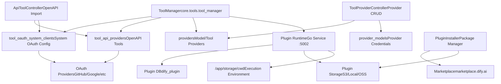
**来源：** [docker/docker-compose.yaml271-300](https://github.com/langgenius/dify/blob/92dbc94f/docker/docker-compose.yaml#L271-L300) [api/configs/feature/\_\_init\_\_.py204-225](https://github.com/langgenius/dify/blob/92dbc94f/api/configs/feature/__init__.py#L204-L225) [api/models/tools.py1-50](https://github.com/langgenius/dify/blob/92dbc94f/api/models/tools.py#L1-L50) [api/models/provider.py1-50](https://github.com/langgenius/dify/blob/92dbc94f/api/models/provider.py#L1-L50)

---

## 工具提供商类型

Dify 支持四种不同的工具提供商类型，每种都有不同的集成模式和用例。

**工具提供商类型层次结构**

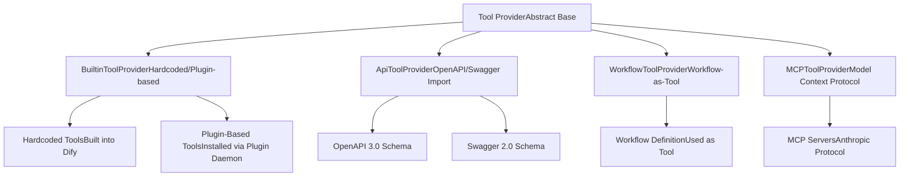
**来源：** [api/models/tools.py15-21](https://github.com/langgenius/dify/blob/92dbc94f/api/models/tools.py#L15-L21) [api/models/model.py179-290](https://github.com/langgenius/dify/blob/92dbc94f/api/models/model.py#L179-L290)

### 内置工具提供商 (Built-in Tool Providers)

内置工具提供商有两种形式：**硬编码 (hardcoded)** 工具（编译进 Dify）和 **基于插件 (plugin-based)** 工具（动态安装）。

| 提供商类型 | 存储位置 | 验证方式 | 示例 |
| --- | --- | --- | --- |
| 硬编码 | 源代码 | 代码审查 | 核心实用工具 |
| 基于插件 | 插件守护进程 | 签名验证 | 来自市场的社区插件 |

`ToolManager` 使用 `GenericProviderID.is_hardcoded` 标志区分这些类型。硬编码提供商通过 `ToolManager.get_hardcoded_provider()` 检查，而基于插件的提供商通过 `PluginService.check_tools_existence()` 验证。

**来源：** [api/models/model.py210-252](https://github.com/langgenius/dify/blob/92dbc94f/api/models/model.py#L210-L252)

### API 工具提供商 (API Tool Providers)

API 工具提供商通过 OpenAPI/Swagger 规范实现与外部服务的集成。系统导入 API 模式，生成工具定义，并处理 OAuth 认证流程。

**API 工具配置模式**

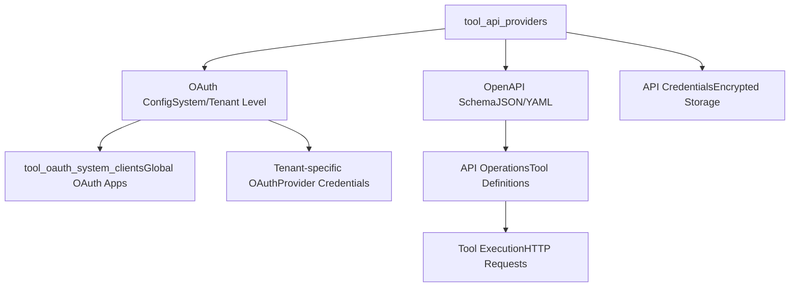
`ApiToolProvider` 表存储：

-   OpenAPI/Swagger 模式 (JSON/YAML)
-   提供商名称和描述 (国际化)
-   认证类型 (none, api\_key, oauth)
-   OAuth 配置引用

**来源：** [api/models/tools.py1-100](https://github.com/langgenius/dify/blob/92dbc94f/api/models/tools.py#L1-L100) [api/controllers/console/datasets/datasets.py1-50](https://github.com/langgenius/dify/blob/92dbc94f/api/controllers/console/datasets/datasets.py#L1-L50)

---

## 插件守护进程架构

Plugin Daemon 是一个独立的基于 Go 的服务，负责管理插件的生命周期、执行隔离和安全强制执行。

**插件守护进程服务配置**

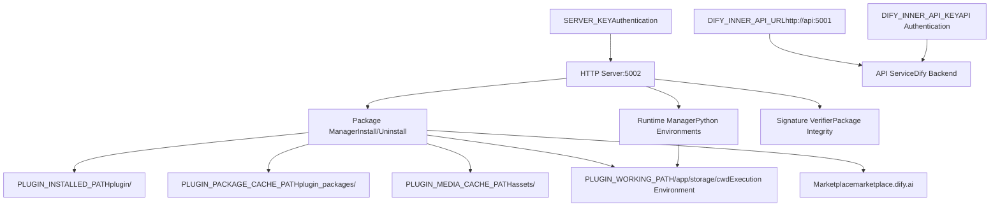
**关键配置参数：**

| 参数 | 默认值 | 描述 |
| --- | --- | --- |
| `PLUGIN_DAEMON_PORT` | 5002 | HTTP 服务器端口 |
| `PLUGIN_DAEMON_KEY` | (生成) | API→Daemon 的认证密钥 |
| `PLUGIN_MAX_PACKAGE_SIZE` | 52428800 (50MB) | 最大插件包大小 |
| `PLUGIN_PYTHON_ENV_INIT_TIMEOUT` | 120s | Python 环境初始化超时时间 |
| `PLUGIN_MAX_EXECUTION_TIMEOUT` | 600s | 最大插件执行时间 |
| `FORCE_VERIFYING_SIGNATURE` | true | 强制包签名验证 |
| `ENFORCE_LANGGENIUS_PLUGIN_SIGNATURES` | true | 需要官方 Dify 签名 |

**来源：** [docker/docker-compose.yaml271-300](https://github.com/langgenius/dify/blob/92dbc94f/docker/docker-compose.yaml#L271-L300) [docker/.env.example586-615](https://github.com/langgenius/dify/blob/92dbc94f/docker/.env.example#L586-L615) [api/configs/feature/\_\_init\_\_.py204-225](https://github.com/langgenius/dify/blob/92dbc94f/api/configs/feature/__init__.py#L204-L225)

### 插件安装流程

插件安装过程涉及多个验证步骤和数据库迁移。

**插件安装序列**

> **[Mermaid sequence]**
> *(图表结构无法解析)*

`PluginInstaller` 类 ([api/commands.py21](https://github.com/langgenius/dify/blob/92dbc94f/api/commands.py#L21-L21)) 和 `PluginService` ([api/commands.py49](https://github.com/langgenius/dify/blob/92dbc94f/api/commands.py#L49-L49)) 协调安装过程，而 `PluginDataMigration` ([api/commands.py47](https://github.com/langgenius/dify/blob/92dbc94f/api/commands.py#L47-L47)) 处理安装后的数据结构更新。

**来源：** [docker/docker-compose.yaml271-290](https://github.com/langgenius/dify/blob/92dbc94f/docker/docker-compose.yaml#L271-L290) [api/commands.py21-53](https://github.com/langgenius/dify/blob/92dbc94f/api/commands.py#L21-L53)

### 插件存储后端

插件系统支持用于插件包和媒体资源的多种存储后端。

| 存储类型 | 配置前缀 | 用例 |
| --- | --- | --- |
| 本地 | `PLUGIN_STORAGE_LOCAL_ROOT` | 开发/单实例 |
| AWS S3 | `PLUGIN_S3_*` | 生产云部署 |
| Azure Blob | `PLUGIN_AZURE_BLOB_STORAGE_*` | Azure 云部署 |
| Aliyun OSS | `PLUGIN_ALIYUN_OSS_*` | 阿里云部署 |
| Tencent COS | `PLUGIN_TENCENT_COS_*` | 腾讯云部署 |
| Volcengine TOS | `PLUGIN_VOLCENGINE_TOS_*` | 火山引擎部署 |

存储通过 `PLUGIN_STORAGE_TYPE` 环境变量配置。所有存储后端支持相同的目录结构：

-   `PLUGIN_INSTALLED_PATH` (默认: `plugin/`) - 已安装的插件代码
-   `PLUGIN_PACKAGE_CACHE_PATH` (默认: `plugin_packages/`) - 下载的包
-   `PLUGIN_MEDIA_CACHE_PATH` (默认: `assets/`) - 媒体文件

**来源：** [docker/.env.example610-638](https://github.com/langgenius/dify/blob/92dbc94f/docker/.env.example#L610-L638)

---

## API 工具集成与 OAuth

API 工具提供商需要认证配置。系统支持三种认证方式：无 (none)、API 密钥 (API key) 和 OAuth 2.0。

### OAuth 配置层级

OAuth 配置存在于两个层级：用于共享 OAuth 应用的 **系统级 (system-level)**，以及用于特定工作空间凭证的 **租户级 (tenant-level)**。

**OAuth 配置模型**

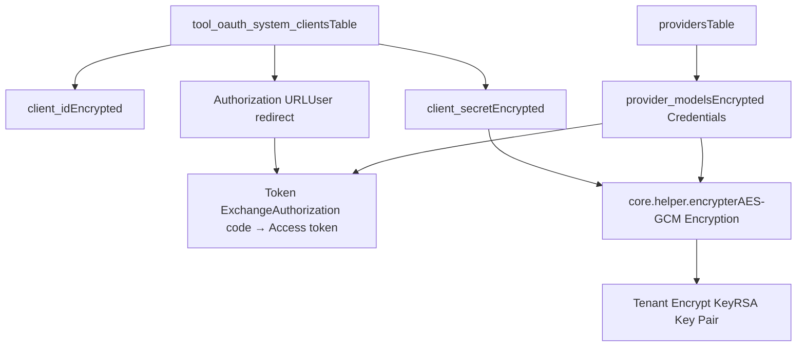
`ToolOAuthSystemClient` 表结构：

| 列 | 类型 | 描述 |
| --- | --- | --- |
| `id` | uuid | 主键 |
| `provider` | string | 工具提供商名称 |
| `tenant_id` | uuid | 工作空间 ID (系统级为 null) |
| `client_id` | text | 加密的 OAuth 客户端 ID |
| `client_secret` | text | 加密的 OAuth 客户端密钥 |
| `created_at` | timestamp | 创建时间 |
| `updated_at` | timestamp | 最后更新时间 |

**来源：** [api/models/tools.py28-50](https://github.com/langgenius/dify/blob/92dbc94f/api/models/tools.py#L28-L50) [api/commands.py26](https://github.com/langgenius/dify/blob/92dbc94f/api/commands.py#L26-L26)

### OAuth 流程实现

API 工具的 OAuth 认证流程遵循标准的 OAuth 2.0 授权码许可。

**OAuth 2.0 授权流程**

> **[Mermaid sequence]**
> *(图表结构无法解析)*

系统 OAuth 凭证通过 `encrypt_system_oauth_params()` 函数管理，该函数使用通过 `generate_key_pair()` 生成的租户特定密钥进行 AES-GCM 加密 ([api/commands.py26-27](https://github.com/langgenius/dify/blob/92dbc94f/api/commands.py#L26-L27))。

**来源：** [api/models/tools.py28-50](https://github.com/langgenius/dify/blob/92dbc94f/api/models/tools.py#L28-L50) [api/commands.py26-27](https://github.com/langgenius/dify/blob/92dbc94f/api/commands.py#L26-L27) [api/models/provider.py1-50](https://github.com/langgenius/dify/blob/92dbc94f/api/models/provider.py#L1-L50)

---

## 工具提供商配置与管理

工具提供商（包括模型提供商和工具提供商）共享一个统一的配置系统，存储在 `providers` 和 `provider_models` 表中。

### Provider 和 ProviderModel 模式

**提供商配置数据模型**

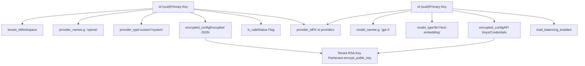
每个租户都有一个唯一的 RSA 密钥对用于加密敏感配置。公钥存储在 `tenants.encrypt_public_key` 中，私钥安全管理。`reset-encrypt-key-pair` 命令 ([api/commands.py129-168](https://github.com/langgenius/dify/blob/92dbc94f/api/commands.py#L129-L168)) 演示了加密架构：

1.  为每个租户生成新的 RSA 密钥对
2.  清除所有 provider 和 provider\_model 记录
3.  要求用户重新输入凭证

**来源：** [api/models/provider.py1-50](https://github.com/langgenius/dify/blob/92dbc94f/api/models/provider.py#L1-L50) [api/commands.py129-168](https://github.com/langgenius/dify/blob/92dbc94f/api/commands.py#L129-L168)

### 提供商发现与工具枚举

`ToolManager` 类协调跨不同提供商类型的工具提供商发现。

**工具发现过程**

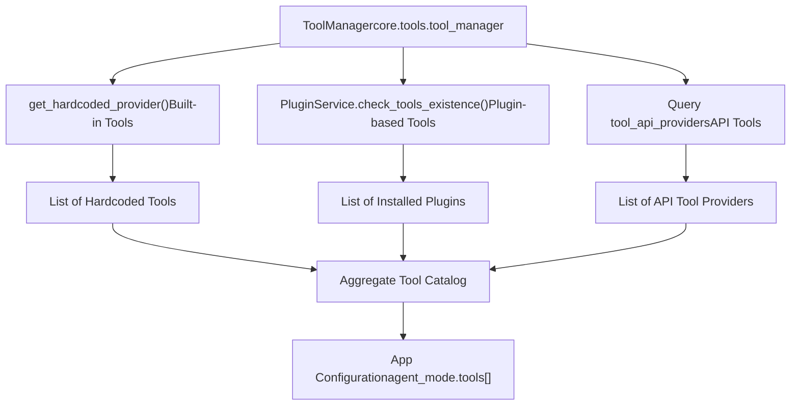
当应用程序检索其工具目录时，`deleted_tools` 属性 ([api/models/model.py179-290](https://github.com/langgenius/dify/blob/92dbc94f/api/models/model.py#L179-L290)) 检查：

-   缺失的 API 提供商：通过 ID 查询 `tool_api_providers`
-   缺失的内置提供商：检查硬编码工具和插件是否存在
-   如果提供商不再存在，将工具标记为已删除

已删除工具结构：

```
{
  "type": "api|builtin",
  "tool_name": "tool_name",
  "provider_id": "uuid_or_string"
}
```
**来源：** [api/models/model.py179-290](https://github.com/langgenius/dify/blob/92dbc94f/api/models/model.py#L179-L290) [api/commands.py48-49](https://github.com/langgenius/dify/blob/92dbc94f/api/commands.py#L48-L49)

---

## 工具位置与排序

Dify 支持通过位置配置环境变量来配置 UI 中工具和提供商的显示顺序。

| 变量 | 描述 | 格式 |
| --- | --- | --- |
| `POSITION_TOOL_PINS` | 固定工具 (总是在顶部) | 逗号分隔的提供商名称 |
| `POSITION_TOOL_INCLUDES` | 显式包含的工具 | 逗号分隔的提供商名称 |
| `POSITION_TOOL_EXCLUDES` | 隐藏工具 | 逗号分隔的提供商名称 |
| `POSITION_PROVIDER_PINS` | 固定提供商 | 逗号分隔的提供商名称 |
| `POSITION_PROVIDER_INCLUDES` | 显式包含的提供商 | 逗号分隔的提供商名称 |
| `POSITION_PROVIDER_EXCLUDES` | 隐藏提供商 | 逗号分隔的提供商名称 |

示例配置：

```
POSITION_TOOL_PINS=google_search,web_scraper
POSITION_TOOL_EXCLUDES=deprecated_tool,internal_tool
```
**来源：** [docker/.env.example576-581](https://github.com/langgenius/dify/blob/92dbc94f/docker/.env.example#L576-L581) [api/.env.example606-612](https://github.com/langgenius/dify/blob/92dbc94f/api/.env.example#L606-L612)

---

## 市场集成

插件市场实现了社区贡献插件的发现和安装。

**市场集成架构**

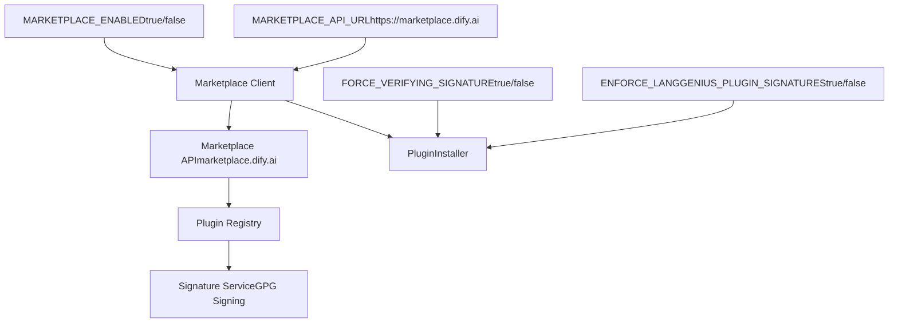
市场配置：

-   `MARKETPLACE_ENABLED=true` - 启用/禁用市场访问
-   `MARKETPLACE_API_URL=https://marketplace.dify.ai` - 市场端点
-   `FORCE_VERIFYING_SIGNATURE=true` - 要求所有插件进行签名验证
-   `ENFORCE_LANGGENIUS_PLUGIN_SIGNATURES=true` - 仅允许官方签名的插件

签名验证过程确保：

1.  插件包完整性（无篡改）
2.  Dify 团队的官方批准（如果 `ENFORCE_LANGGENIUS_PLUGIN_SIGNATURES=true`）
3.  与清单的版本一致性

**来源：** [docker/.env.example600-603](https://github.com/langgenius/dify/blob/92dbc94f/docker/.env.example#L600-L603) [api/.env.example622-624](https://github.com/langgenius/dify/blob/92dbc94f/api/.env.example#L622-L624) [docker/docker-compose.yaml288-289](https://github.com/langgenius/dify/blob/92dbc94f/docker/docker-compose.yaml#L288-L289)

---

## 工具执行与超时

工具执行受可配置的超时限制约束，以防止失控进程。

| 配置 | 默认值 | 描述 |
| --- | --- | --- |
| `API_TOOL_DEFAULT_CONNECT_TIMEOUT` | 10s | API 工具的 TCP 连接超时 |
| `API_TOOL_DEFAULT_READ_TIMEOUT` | 60s | API 工具的 HTTP 读取超时 |
| `PLUGIN_MAX_EXECUTION_TIMEOUT` | 600s | 最大插件执行时间 |
| `CODE_EXECUTION_READ_TIMEOUT` | 60s | 沙箱代码执行超时 |

API 工具 ([docker/.env.example215-216](https://github.com/langgenius/dify/blob/92dbc94f/docker/.env.example#L215-L216)) 对外部服务的 HTTP 请求使用单独的连接和读取超时。插件执行 ([docker/.env.example607](https://github.com/langgenius/dify/blob/92dbc94f/docker/.env.example#L607-L607)) 具有由插件守护进程强制执行的最大挂钟时间限制。

**来源：** [docker/.env.example215-216](https://github.com/langgenius/dify/blob/92dbc94f/docker/.env.example#L215-L216) [docker/.env.example607](https://github.com/langgenius/dify/blob/92dbc94f/docker/.env.example#L607-L607) [api/.env.example479-481](https://github.com/langgenius/dify/blob/92dbc94f/api/.env.example#L479-L481)

---

## 插件守护进程通信协议

API 服务通过 HTTP/JSON RPC 与 Plugin Daemon 通信，使用双向认证。

**API ↔ 插件守护进程认证**

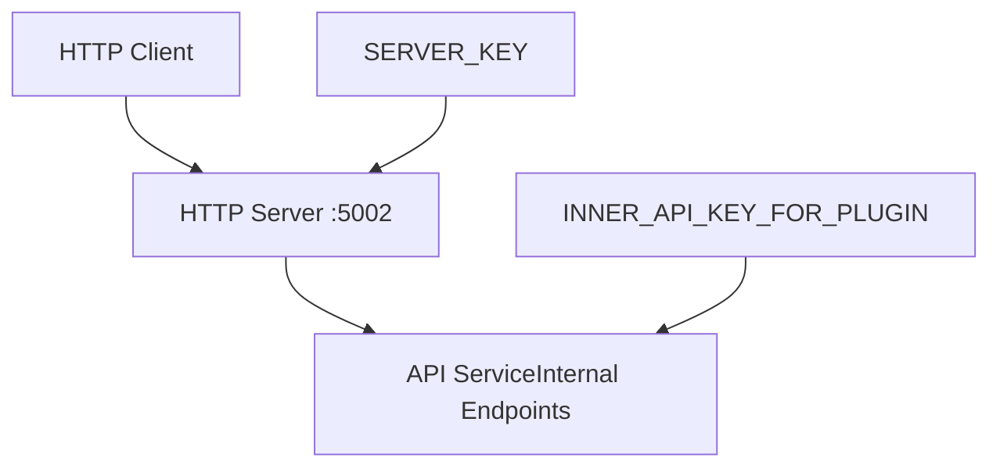
**双向认证：**

1.  **API → Plugin Daemon**: 使用 `PLUGIN_DAEMON_KEY` 作为 Bearer 令牌
2.  **Plugin Daemon → API**: 使用 `INNER_API_KEY_FOR_PLUGIN` 作为回调的 API 密钥

配置参数：

-   `PLUGIN_DAEMON_URL=http://plugin_daemon:5002` - 守护进程端点
-   `PLUGIN_DAEMON_KEY` - API→Daemon 认证的共享密钥
-   `INNER_API_KEY_FOR_PLUGIN` - Daemon→API 回调的共享密钥
-   `PLUGIN_DAEMON_TIMEOUT=600.0` - 请求超时时间（秒）

**来源：** [docker/docker-compose.yaml280-284](https://github.com/langgenius/dify/blob/92dbc94f/docker/docker-compose.yaml#L280-L284) [docker/.env.example586-598](https://github.com/langgenius/dify/blob/92dbc94f/docker/.env.example#L586-L598) [api/configs/feature/\_\_init\_\_.py204-225](https://github.com/langgenius/dify/blob/92dbc94f/api/configs/feature/__init__.py#L204-L225)

---

## 插件数据库模式

Plugin Daemon 维护其自己独立的数据库 (`dify_plugin`) 用于插件元数据和运行状态。

| 数据库 | 用途 | 连接 |
| --- | --- | --- |
| `dify` (主) | 应用程序数据、用户、工作流 | API, Worker 服务 |
| `dify_plugin` | 插件元数据、安装 | 仅插件守护进程 |

这种分离确保：

-   **隔离性**: 插件故障不会损坏应用程序数据库
-   **性能**: 插件查询不与应用程序查询竞争
-   **安全性**: 插件守护进程具有有限的数据库访问范围

插件守护进程的数据库配置：

```
DB_DATABASE=dify_plugin  # 独立的数据库名称
DB_HOST=db_postgres      # 相同的数据库服务器
DB_PORT=5432
```
**来源：** [docker/docker-compose.yaml278](https://github.com/langgenius/dify/blob/92dbc94f/docker/docker-compose.yaml#L278-L278) [docker/docker-compose-template.yaml278](https://github.com/langgenius/dify/blob/92dbc94f/docker/docker-compose-template.yaml#L278-L278)

---

## 插件的文件访问配置

处理文件的插件需要访问 Dify 文件存储系统。这通过 `FILES_URL` 和 `INTERNAL_FILES_URL` 配置。

**插件的文件访问架构**

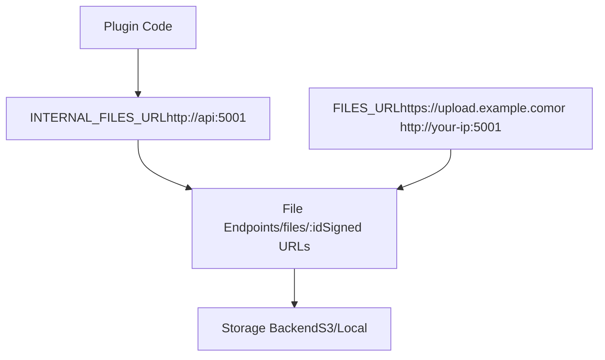
配置规则：

-   `FILES_URL` - 外部文件访问 URL (必须可公开访问)

    -   对于 HTTPS: `FILES_URL=https://example.com`
    -   对于 HTTP: `FILES_URL=http://example.com`
    -   带端口: `FILES_URL=http://<your-ip>:5001`
    -   推荐: 使用专用子域名，如 `https://upload.example.com`
-   `INTERNAL_FILES_URL` - 插件守护进程的内部 Docker 网络 URL

    -   示例: `INTERNAL_FILES_URL=http://api:5001`
    -   插件守护进程使用它在 Docker 网络内下载文件

文件 URL 使用 `sign_upload_file()` 或 `sign_tool_file()` 函数进行签名，并带有过期时间 (`FILES_ACCESS_TIMEOUT=300` 秒默认值)。

**来源：** [docker/.env.example44-58](https://github.com/langgenius/dify/blob/92dbc94f/docker/.env.example#L44-L58) [api/.env.example22-28](https://github.com/langgenius/dify/blob/92dbc94f/api/.env.example#L22-L28) [api/models/dataset.py24](https://github.com/langgenius/dify/blob/92dbc94f/api/models/dataset.py#L24-L24)

---

## 插件工作目录与隔离

每个插件执行都在具有专用 Python 虚拟环境的隔离工作目录中运行。

**插件执行隔离**

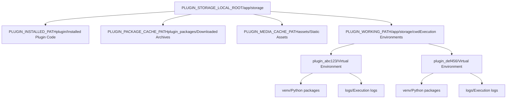
目录结构：

```
/app/storage/
├── plugin/                    # 已安装的插件代码
│   ├── plugin_provider_1/
│   └── plugin_provider_2/
├── plugin_packages/           # 下载的 .zip 包
│   ├── plugin_1_v1.0.0.zip
│   └── plugin_2_v2.1.0.zip
├── assets/                    # 插件媒体文件
│   ├── icons/
│   └── screenshots/
└── cwd/                       # 工作目录
    ├── plugin_abc123/
    │   ├── venv/             # 虚拟环境
    │   └── __pycache__/
    └── plugin_def456/
        └── venv/
```
Python 虚拟环境初始化：

-   超时: `PLUGIN_PYTHON_ENV_INIT_TIMEOUT=120` 秒
-   PIP 镜像: `PIP_MIRROR_URL` (可选，用于更快安装)
-   每个插件获得隔离的依赖项

**来源：** [docker/.env.example610-615](https://github.com/langgenius/dify/blob/92dbc94f/docker/.env.example#L610-L615) [docker/docker-compose.yaml287](https://github.com/langgenius/dify/blob/92dbc94f/docker/docker-compose.yaml#L287-L287) [api/.env.example617-619](https://github.com/langgenius/dify/blob/92dbc94f/api/.env.example#L617-L619)

---

## 插件开发与调试

Dify 支持具有调试功能的远程插件开发。

**远程插件安装流程**

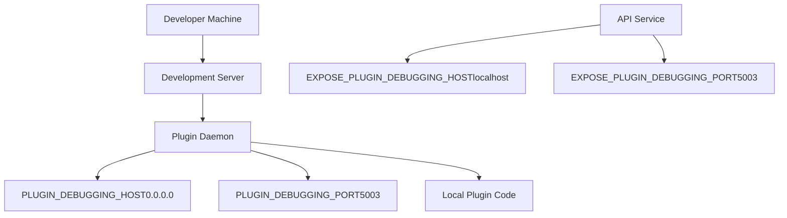
开发配置：

-   `PLUGIN_DEBUGGING_HOST=0.0.0.0` - 远程安装端点的绑定地址
-   `PLUGIN_DEBUGGING_PORT=5003` - 远程插件安装端口
-   `EXPOSE_PLUGIN_DEBUGGING_HOST=localhost` - API 通信的外部主机名
-   `EXPOSE_PLUGIN_DEBUGGING_PORT=5003` - 外部端口映射

远程安装允许开发者：

1.  在本地运行插件代码
2.  将插件端点暴露给 Dify
3.  通过 HTTP URL 而不是市场安装插件
4.  无需打包即可快速迭代

**来源：** [docker/.env.example592-596](https://github.com/langgenius/dify/blob/92dbc94f/docker/.env.example#L592-L596) [docker/docker-compose.yaml285-286](https://github.com/langgenius/dify/blob/92dbc94f/docker/docker-compose.yaml#L285-L286) [api/.env.example617-618](https://github.com/langgenius/dify/blob/92dbc94f/api/.env.example#L617-L618)

---

## 工具可见性与删除检测

应用程序跟踪配置了哪些工具，系统会检测工具何时不可用。

**工具删除检测算法**

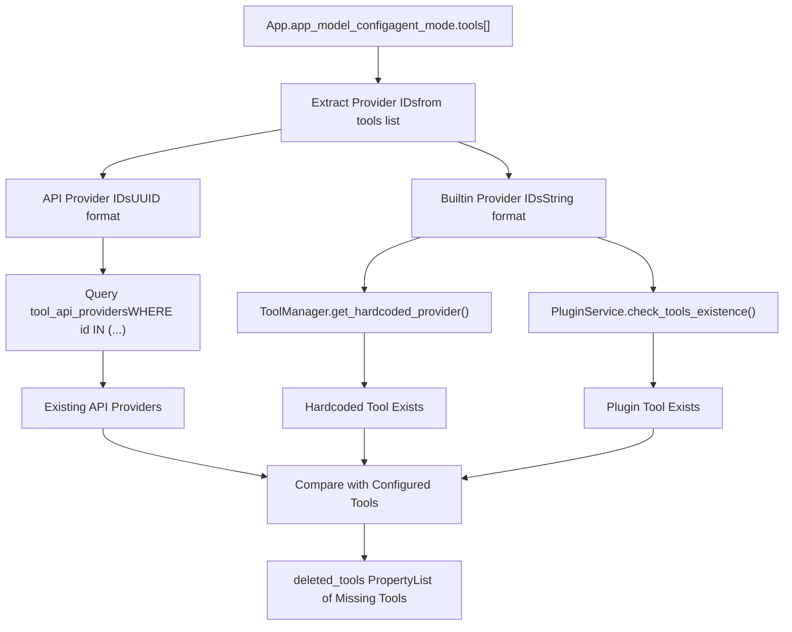
`App.deleted_tools` 属性 ([api/models/model.py179-290](https://github.com/langgenius/dify/blob/92dbc94f/api/models/model.py#L179-L290)) 实现了此检测：

1.  从应用配置解析 `agent_mode.tools`
2.  提取提供商 ID 和类型（API 与内置）
3.  对于 API 工具：查询数据库是否存在
4.  对于内置工具：
    -   检查是否为硬编码（始终可用）
    -   通过 `PluginService` 检查插件是否存在
5.  返回不再存在的工具列表

已删除工具结构：

```
{
  "type": "api|builtin",
  "tool_name": "tool_name",
  "provider_id": "uuid_or_string"
}
```
**来源：** [api/models/model.py179-290](https://github.com/langgenius/dify/blob/92dbc94f/api/models/model.py#L179-L290)

---

## 安全注意事项

工具和插件系统实现了多个安全层：

### 包签名验证

| 设置 | 值 | 安全级别 |
| --- | --- | --- |
| `FORCE_VERIFYING_SIGNATURE=true` | 启用 | 高 - 拒绝未签名包 |
| `FORCE_VERIFYING_SIGNATURE=false` | 禁用 | 低 - 允许任何包 |
| `ENFORCE_LANGGENIUS_PLUGIN_SIGNATURES=true` | 启用 | 最高 - 仅限官方插件 |

### 凭证加密

所有敏感凭证在静止时加密：

1.  **工具 OAuth 凭证**: 使用租户密钥加密 `tool_oauth_system_clients.client_secret`
2.  **提供商凭证**: 每个租户加密 `provider_models.encrypted_config`
3.  **API 密钥**: 使用 `core.helper.encrypter` 和 AES-GCM 加密所有 API 密钥

### 执行隔离

插件在隔离环境中执行：

-   每个插件独立的 Python 虚拟环境
-   工作目录隔离 (`PLUGIN_WORKING_PATH`)
-   通过 `SANDBOX_ENABLE_NETWORK` 进行网络访问控制
-   通过 SSRF 保护代理路由代理
-   超时限制以防止资源耗尽

### API 认证

服务之间的双向认证：

-   API → 插件守护进程: Bearer 令牌 (`PLUGIN_DAEMON_KEY`)
-   插件守护进程 → API: API 密钥 (`INNER_API_KEY_FOR_PLUGIN`)
-   两个密钥都应具有加密强度（通过 `openssl rand -base64 42` 生成）

**来源：** [docker/.env.example602-603](https://github.com/langgenius/dify/blob/92dbc94f/docker/.env.example#L602-L603) [docker/docker-compose.yaml288-289](https://github.com/langgenius/dify/blob/92dbc94f/docker/docker-compose.yaml#L288-L289) [api/commands.py26](https://github.com/langgenius/dify/blob/92dbc94f/api/commands.py#L26-L26) [api/models/tools.py28-50](https://github.com/langgenius/dify/blob/92dbc94f/api/models/tools.py#L28-L50)
