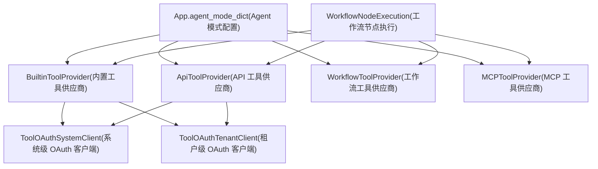
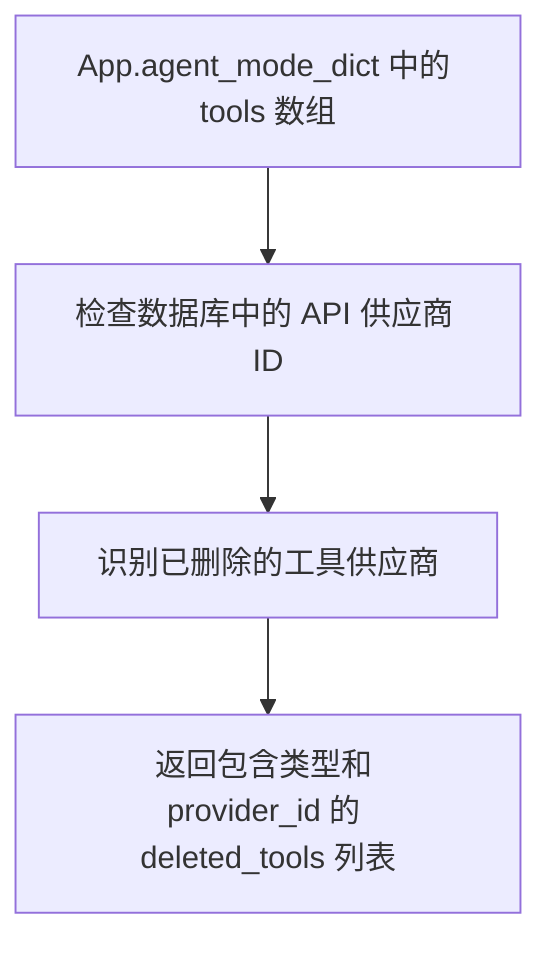
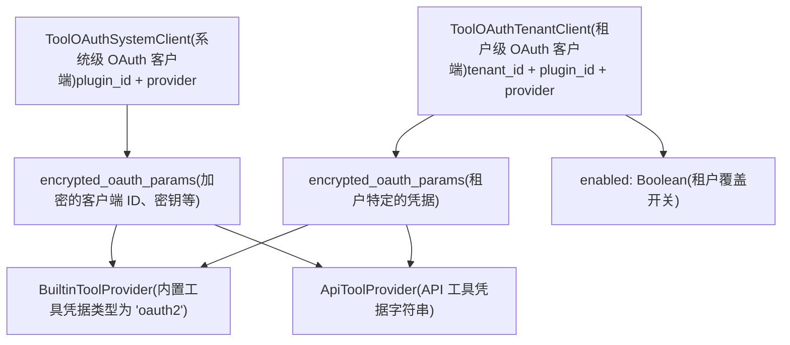
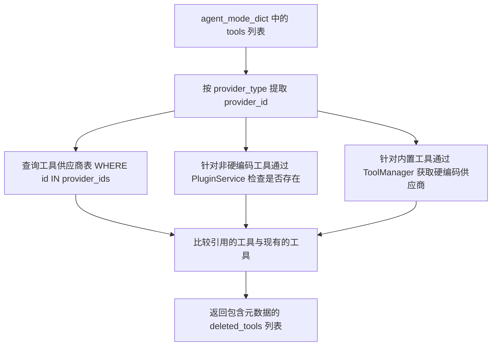
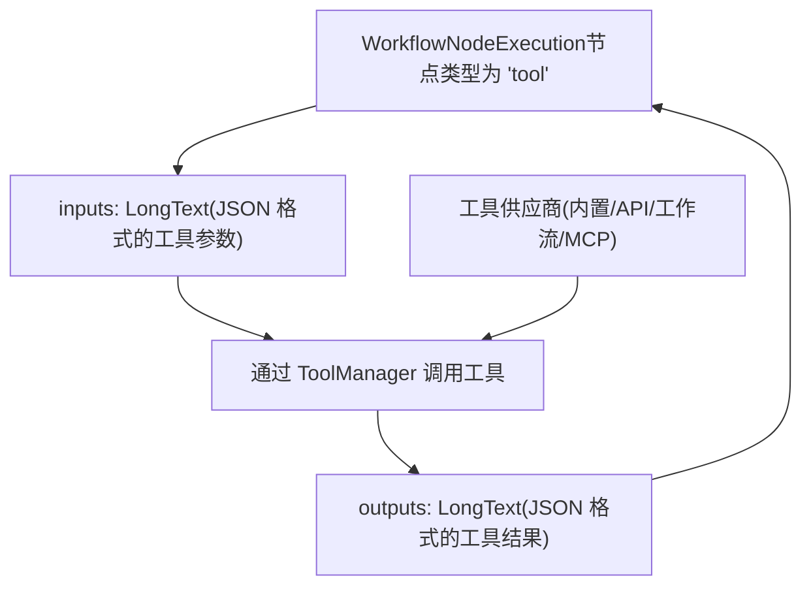

# 工具供应商架构

相关源文件

-   [api/models/account.py](https://github.com/langgenius/dify/blob/92dbc94f/api/models/account.py)
-   [api/models/api\_based\_extension.py](https://github.com/langgenius/dify/blob/92dbc94f/api/models/api_based_extension.py)
-   [api/models/dataset.py](https://github.com/langgenius/dify/blob/92dbc94f/api/models/dataset.py)
-   [api/models/model.py](https://github.com/langgenius/dify/blob/92dbc94f/api/models/model.py)
-   [api/models/oauth.py](https://github.com/langgenius/dify/blob/92dbc94f/api/models/oauth.py)
-   [api/models/provider.py](https://github.com/langgenius/dify/blob/92dbc94f/api/models/provider.py)
-   [api/models/source.py](https://github.com/langgenius/dify/blob/92dbc94f/api/models/source.py)
-   [api/models/task.py](https://github.com/langgenius/dify/blob/92dbc94f/api/models/task.py)
-   [api/models/tools.py](https://github.com/langgenius/dify/blob/92dbc94f/api/models/tools.py)
-   [api/models/trigger.py](https://github.com/langgenius/dify/blob/92dbc94f/api/models/trigger.py)
-   [api/models/web.py](https://github.com/langgenius/dify/blob/92dbc94f/api/models/web.py)
-   [api/models/workflow.py](https://github.com/langgenius/dify/blob/92dbc94f/api/models/workflow.py)
-   [api/tests/test\_containers\_integration\_tests/services/test\_advanced\_prompt\_template\_service.py](https://github.com/langgenius/dify/blob/92dbc94f/api/tests/test_containers_integration_tests/services/test_advanced_prompt_template_service.py)
-   [api/tests/test\_containers\_integration\_tests/services/test\_agent\_service.py](https://github.com/langgenius/dify/blob/92dbc94f/api/tests/test_containers_integration_tests/services/test_agent_service.py)
-   [api/tests/test\_containers\_integration\_tests/tasks/\_\_init\_\_.py](https://github.com/langgenius/dify/blob/92dbc94f/api/tests/test_containers_integration_tests/tasks/__init__.py)
-   [api/tests/test\_containers\_integration\_tests/tasks/test\_add\_document\_to\_index\_task.py](https://github.com/langgenius/dify/blob/92dbc94f/api/tests/test_containers_integration_tests/tasks/test_add_document_to_index_task.py)
-   [api/tests/unit\_tests/core/test\_provider\_manager.py](https://github.com/langgenius/dify/blob/92dbc94f/api/tests/unit_tests/core/test_provider_manager.py)

## 目的与范围

本文档描述了 Dify 的工具供应商架构，该架构实现了工作流和 Agent 应用的外部工具集成。系统支持四种不同的供应商类型：内置工具 (built-in tools)、基于 API 的工具 (OpenAPI/Swagger)、工作流即工具 (workflow-as-tool) 以及 MCP (模型上下文协议) 工具。该架构为工具的身份验证、配置和执行提供了统一的接口。

有关如何在工作流节点中调用工具的信息，请参阅 [工作流系统与节点执行](/langgenius/dify/5-workflow-system-and-node-execution)。有关模型供应商配置，请参阅 [模型供应商管理](/langgenius/dify/6.3-model-provider-management)。

---

## 工具供应商类型系统

Dify 工具系统支持四种截然不同的供应商类型，每种类型都有自己的数据模型和生命周期管理：


**来源：** [api/models/tools.py1-511](https://github.com/langgenius/dify/blob/92dbc94f/api/models/tools.py#L1-L511) [api/models/model.py78-316](https://github.com/langgenius/dify/blob/92dbc94f/api/models/model.py#L78-L316) [api/models/workflow.py728-935](https://github.com/langgenius/dify/blob/92dbc94f/api/models/workflow.py#L728-L935)

---

## 内置工具供应商 (Built-in Tool Providers)

内置工具供应商代表 Dify 自带的预包装工具。每个租户可以为同一供应商配置多个凭据实例，从而实现多种配置（例如不同的 API 密钥）。

### 数据模型

| 字段 | 类型 | 描述 |
| --- | --- | --- |
| `id` | StringUUID | 唯一标识符 |
| `tenant_id` | StringUUID | 工作区 ID（全局工具此项为空） |
| `user_id` | StringUUID | 创建者用户 ID |
| `provider` | String(256) | 工具供应商名称 |
| `name` | String(256) | 实例名称（默认："API KEY 1"） |
| `encrypted_credentials` | LongText | 加密的凭据 JSON |
| `credential_type` | String(32) | 凭据类型："api-key" 或 "oauth2" |
| `is_default` | Boolean | 默认实例标志 |
| `expires_at` | BigInteger | 令牌过期时间戳（-1 代表永不过期） |

`credentials` 属性 [api/models/tools.py113-117](https://github.com/langgenius/dify/blob/92dbc94f/api/models/tools.py#L113-L117) 提供了对存储的凭据字典的解密访问。

### 凭据管理

内置工具支持两种身份验证模式：

1.  **API Key 身份验证**：存储在 `encrypted_credentials` 中的简单基于密钥的验证。
2.  **OAuth2 身份验证**：带有刷新支持的基于令牌的验证。

唯一性约束 `unique_builtin_tool_provider` 确保每个租户下每个供应商名称组合的唯一性 [api/models/tools.py76](https://github.com/langgenius/dify/blob/92dbc94f/api/models/tools.py#L76-L76)。

**来源：** [api/models/tools.py68-118](https://github.com/langgenius/dify/blob/92dbc94f/api/models/tools.py#L68-L118)

---

## API 工具供应商 (OpenAPI/Swagger)

API 工具供应商支持通过 OpenAPI 或 Swagger 规范集成外部 API。这些工具是租户特定的，支持动态的工具发现。

### 数据模型

| 字段 | 类型 | 描述 |
| --- | --- | --- |
| `id` | StringUUID | 唯一标识符 |
| `tenant_id` | StringUUID | 工作区 ID |
| `user_id` | StringUUID | 创建者用户 ID |
| `name` | String(255) | 供应商实例名称 |
| `icon` | String(255) | 供应商图标 URL |
| `schema` | LongText | OpenAPI/Swagger Schema (JSON) |
| `schema_type_str` | String(40) | Schema 类型标识符 |
| `description` | LongText | 供应商描述 |
| `tools_str` | LongText | 解析后的工具数组 (JSON) |
| `credentials_str` | LongText | API 凭据 (JSON) |
| `privacy_policy` | String(255) | 隐私政策 URL（可选） |
| `custom_disclaimer` | LongText | 自定义免责声明文本 |

### Schema 处理

`schema_type` 属性 [api/models/tools.py171-173](https://github.com/langgenius/dify/blob/92dbc94f/api/models/tools.py#L171-L173) 将存储的字符串转换为 `ApiProviderSchemaType` 枚举，而 `tools` 属性 [api/models/tools.py175-177](https://github.com/langgenius/dify/blob/92dbc94f/api/models/tools.py#L175-L177) 将工具数组反序列化为 `ApiToolBundle` 对象。

### 工具删除追踪

当 API 工具供应商被删除但仍被应用配置引用时，`App.deleted_tools` 属性 [api/models/model.py179-290](https://github.com/langgenius/dify/blob/92dbc94f/api/models/model.py#L179-L290) 会进行追踪。通过在应用初始化期间识别缺失的工具，防止出现运行时错误：


**来源：** [api/models/tools.py120-192](https://github.com/langgenius/dify/blob/92dbc94f/api/models/tools.py#L120-L192) [api/models/model.py179-290](https://github.com/langgenius/dify/blob/92dbc94f/api/models/model.py#L179-L290)

---

## 工作流工具供应商 (Workflow Tool Providers)

工作流工具供应商允许将已发布的工作流作为工具暴露出来，从而实现工作流的组合与复用。

### 数据模型

| 字段 | 类型 | 描述 |
| --- | --- | --- |
| `id` | StringUUID | 唯一标识符 |
| `tenant_id` | StringUUID | 工作区 ID |
| `user_id` | StringUUID | 创建者用户 ID |
| `app_id` | StringUUID | 来源工作流的应用 ID |
| `name` | String(255) | 工具供应商名称 |
| `label` | String(255) | 显示标签 |
| `icon` | String(255) | 工具图标 URL |
| `version` | String(255) | 工作流版本 |
| `description` | LongText | 工具描述 |
| `parameter_configuration` | LongText | 输入参数配置 (JSON) |
| `privacy_policy` | String(255) | 隐私政策 URL（可选） |

### 参数配置

`parameter_configurations` 属性 [api/models/tools.py272-276](https://github.com/langgenius/dify/blob/92dbc94f/api/models/tools.py#L272-L276) 将存储的 JSON 反序列化为 `WorkflowToolParameterConfiguration` 对象，定义了该工具的输入接口。

### 唯一性约束

两个约束确保了数据完整性：

1.  `unique_workflow_tool_provider`：每个租户下一个名称 [api/models/tools.py224](https://github.com/langgenius/dify/blob/92dbc94f/api/models/tools.py#L224-L224)。
2.  `unique_workflow_tool_provider_app_id`：每个应用一个工具 [api/models/tools.py225](https://github.com/langgenius/dify/blob/92dbc94f/api/models/tools.py#L225-L225)。

**来源：** [api/models/tools.py216-281](https://github.com/langgenius/dify/blob/92dbc94f/api/models/tools.py#L216-L281)

---

## MCP 工具供应商 (MCP Tool Providers)

MCP (模型上下文协议) 供应商实现了与外部 MCP 服务器的集成，支持动态的工具发现和调用。

### 数据模型

| 字段 | 类型 | 描述 |
| --- | --- | --- |
| `id` | StringUUID | 唯一标识符 |
| `tenant_id` | StringUUID | 工作区 ID |
| `user_id` | StringUUID | 创建者用户 ID |
| `name` | String(40) | 供应商名称 |
| `server_identifier` | String(64) | 服务器标识符 |
| `server_url` | LongText | 加密的服务器 URL |
| `server_url_hash` | String(64) | URL 哈希值，用于唯一性检查 |
| `icon` | String(255) | 供应商图标（可选） |
| `encrypted_credentials` | LongText | 加密的凭据（可选） |
| `encrypted_headers` | LongText | 加密的 HTTP 标头（可选） |
| `authed` | Boolean | 身份验证状态 |
| `tools` | LongText | 可用的工具数组 (JSON) |
| `timeout` | Float | 请求超时时间（默认：30秒） |
| `sse_read_timeout` | Float | SSE 读取超时时间（默认：300秒） |

### 用于唯一性检查的 URL 哈希

`server_url_hash` 字段 [api/models/tools.py306](https://github.com/langgenius/dify/blob/92dbc94f/api/models/tools.py#L306-L306) 存储了加密 URL 的哈希值，以此强制执行 `unique_mcp_provider_server_url` 约束 [api/models/tools.py291](https://github.com/langgenius/dify/blob/92dbc94f/api/models/tools.py#L291-L291)，且不会泄露实际的 URL。

### 实体转换

`to_entity()` 方法 [api/models/tools.py364-368](https://github.com/langgenius/dify/blob/92dbc94f/api/models/tools.py#L364-L368) 将数据库模型转换为领域实体 `MCPProviderEntity`，实现了持久化与业务逻辑的解耦。

**来源：** [api/models/tools.py283-369](https://github.com/langgenius/dify/blob/92dbc94f/api/models/tools.py#L283-L369)

---

## OAuth 配置架构

OAuth 身份验证支持两个层级：系统级和租户级，从而实现了集中式管理和各租户自定义。


### 系统级 OAuth 客户端

`ToolOAuthSystemClient` 模型 [api/models/tools.py28-42](https://github.com/langgenius/dify/blob/92dbc94f/api/models/tools.py#L28-L42) 存储了跨所有租户共享的全局 OAuth 配置：

| 字段 | 类型 | 描述 |
| --- | --- | --- |
| `id` | StringUUID | 唯一标识符 |
| `plugin_id` | String(512) | 插件标识符 |
| `provider` | String(255) | 工具供应商名称 |
| `encrypted_oauth_params` | LongText | OAuth 凭据 (client\_id, client\_secret 等) |

唯一约束 `tool_oauth_system_client_plugin_id_provider_idx` [api/models/tools.py32](https://github.com/langgenius/dify/blob/92dbc94f/api/models/tools.py#L32-L32) 确保了每个插件+供应商组合只有一个配置。

### 租户级 OAuth 客户端

`ToolOAuthTenantClient` 模型 [api/models/tools.py45-66](https://github.com/langgenius/dify/blob/92dbc94f/api/models/tools.py#L45-L66) 允许租户覆盖系统默认设置：

| 字段 | 类型 | 描述 |
| --- | --- | --- |
| `id` | StringUUID | 唯一标识符 |
| `tenant_id` | StringUUID | 工作区 ID |
| `plugin_id` | String(255) | 插件标识符 |
| `provider` | String(255) | 工具供应商名称 |
| `enabled` | Boolean | 覆盖启用标志 |
| `encrypted_oauth_params` | LongText | 租户特定的 OAuth 凭据 |

`oauth_params` 属性 [api/models/tools.py64-65](https://github.com/langgenius/dify/blob/92dbc94f/api/models/tools.py#L64-L65) 反序列化加密参数以供使用。

**来源：** [api/models/tools.py28-66](https://github.com/langgenius/dify/blob/92dbc94f/api/models/tools.py#L28-L66)

---

## 工具标签绑定 (Tool Label Bindings)

工具标签绑定为工具的发现和过滤提供了分类和标记功能。

### 数据模型

| 字段 | 类型 | 描述 |
| --- | --- | --- |
| `id` | StringUUID | 唯一标识符 |
| `tool_id` | String(64) | 工具标识符 |
| `tool_type` | String(40) | 工具供应商类型 |
| `label_name` | String(40) | 标签名称 |

唯一约束 `unique_tool_label_bind` [api/models/tools.py202](https://github.com/langgenius/dify/blob/92dbc94f/api/models/tools.py#L202-L202) 确保了每个工具一个标签。

**来源：** [api/models/tools.py194-213](https://github.com/langgenius/dify/blob/92dbc94f/api/models/tools.py#L194-L213)

---

## 工具调用日志

`ToolModelInvoke` 模型 [api/models/tools.py371-418](https://github.com/langgenius/dify/blob/92dbc94f/api/models/tools.py#L371-L418) 记录了涉及 LLM 模型调用的工具执行详情指标：

| 字段 | 类型 | 描述 |
| --- | --- | --- |
| `id` | StringUUID | 唯一标识符 |
| `user_id` | StringUUID | 调用者用户 ID |
| `tenant_id` | StringUUID | 工作区 ID |
| `provider` | String(255) | 模型供应商 |
| `tool_type` | String(40) | 工具供应商类型 |
| `tool_name` | String(128) | 工具名称 |
| `model_parameters` | LongText | 模型配置 (JSON) |
| `prompt_messages` | LongText | 输入消息 (JSON) |
| `model_response` | LongText | 模型输出 (JSON) |
| `prompt_tokens` | Integer | 输入 Token 计数 |
| `answer_tokens` | Integer | 输出 Token 计数 |
| `answer_unit_price` | Decimal(10,4) | 每 Token 成本 |
| `answer_price_unit` | Decimal(10,7) | 价格单位乘数 |
| `provider_response_latency` | Float | 响应延迟（秒） |
| `total_price` | Decimal(10,7) | 总成本 |
| `currency` | String(255) | 货币代码 |

这使得针对内部利用了 LLM 的工具进行成本追踪和性能监控成为可能。

**来源：** [api/models/tools.py371-418](https://github.com/langgenius/dify/blob/92dbc94f/api/models/tools.py#L371-L418)

---

## 工具文件管理

工具在执行期间可以创建文件（例如 DALL-E 生成图像、文档创建等）。`ToolFile` 模型 [api/models/tools.py462-492](https://github.com/langgenius/dify/blob/92dbc94f/api/models/tools.py#L462-L492) 存储了这些生成文件的元数据：

| 字段 | 类型 | 描述 |
| --- | --- | --- |
| `id` | StringUUID | 唯一标识符 |
| `user_id` | StringUUID | 用户 ID |
| `tenant_id` | StringUUID | 工作区 ID |
| `conversation_id` | StringUUID | 关联的会话 ID（可选） |
| `file_key` | String(255) | 存储键 |
| `mimetype` | String(255) | 文件 MIME 类型 |
| `original_url` | String(2048) | 原始文件 URL（可选） |
| `name` | String(255) | 文件名 |
| `size` | Integer | 文件大小（字节） |

索引 `tool_file_conversation_id_idx` [api/models/tools.py470](https://github.com/langgenius/dify/blob/92dbc94f/api/models/tools.py#L470-L470) 实现了对会话内生成的所有文件的高效检索。

**来源：** [api/models/tools.py462-492](https://github.com/langgenius/dify/blob/92dbc94f/api/models/tools.py#L462-L492)

---

## 应用 Agent 模式下的工具配置

Agent 模式的应用将工具配置存储在 `AppModelConfig.agent_mode` 字段中 [api/models/model.py343](https://github.com/langgenius/dify/blob/92dbc94f/api/models/model.py#L343-L343)，该字段包含定义了已启用工具及其参数的 JSON 结构。

### Agent 模式结构

`agent_mode_dict` 属性 [api/models/model.py430-435](https://github.com/langgenius/dify/blob/92dbc94f/api/models/model.py#L430-L435) 返回一个具有以下结构的字典：

```
{
    "enabled": bool,
    "strategy": str,  # "function_call" (函数调用) 或 "react"
    "tools": [
        {
            "provider_id": str,
            "provider_type": str,  # "builtin", "api", "workflow", "mcp"
            "tool_name": str,
            "tool_parameters": dict
        }
    ],
    "prompt": str  # 可选的自定义系统提示词
}
```
### 工具引用解析

`deleted_tools` 属性 [api/models/model.py179-290](https://github.com/langgenius/dify/blob/92dbc94f/api/models/model.py#L179-L290) 通过以下方式验证工具引用：

1.  **API 工具供应商**：查询 `tool_api_providers` 表确认是否存在 [api/models/model.py228-237](https://github.com/langgenius/dify/blob/92dbc94f/api/models/model.py#L228-L237)。
2.  **内置供应商**：检查插件服务以确认工具可用性 [api/models/model.py239-258](https://github.com/langgenius/dify/blob/92dbc94f/api/models/model.py#L239-L258)。
3.  **删除检测**：返回包含类型和 provider\_id 的缺失工具列表 [api/models/model.py260-290](https://github.com/langgenius/dify/blob/92dbc94f/api/models/model.py#L260-L290)。


这种验证机制可以防止在应用配置中仍引用了已被删除的工具时出现运行时错误。

**来源：** [api/models/model.py179-290](https://github.com/langgenius/dify/blob/92dbc94f/api/models/model.py#L179-L290) [api/models/model.py343](https://github.com/langgenius/dify/blob/92dbc94f/api/models/model.py#L343-L343) [api/models/model.py430-435](https://github.com/langgenius/dify/blob/92dbc94f/api/models/model.py#L430-L435)

---

## 数据库关联关系与约束

工具供应商系统强制执行多个关键约束以维护数据完整性：

| 模型 | 约束 | 目的 |
| --- | --- | --- |
| `ToolOAuthSystemClient` | `tool_oauth_system_client_plugin_id_provider_idx` | 每个插件+供应商组合唯一 |
| `ToolOAuthTenantClient` | `unique_tool_oauth_tenant_client` | 每个租户+插件+供应商组合唯一 |
| `BuiltinToolProvider` | `unique_builtin_tool_provider` | 每个租户+供应商+名称组合唯一 |
| `ApiToolProvider` | `unique_api_tool_provider` | 每个租户一个名称 |
| `WorkflowToolProvider` | `unique_workflow_tool_provider` | 每个租户一个名称 |
| `WorkflowToolProvider` | `unique_workflow_tool_provider_app_id` | 每个工作流应用一个工具 |
| `MCPToolProvider` | `unique_mcp_provider_server_url` | 每个租户一个唯一的服务器 URL 哈希 |
| `MCPToolProvider` | `unique_mcp_provider_name` | 每个租户一个名称 |
| `MCPToolProvider` | `unique_mcp_provider_server_identifier` | 每个租户一个唯一的服务器标识符 |
| `ToolLabelBinding` | `unique_tool_label_bind` | 每个工具一个标签 |

这些约束确保了工具供应商是可唯一标识的，并防止了配置重复。

**来源：** [api/models/tools.py28-511](https://github.com/langgenius/dify/blob/92dbc94f/api/models/tools.py#L28-L511)

---

## 与工作流执行集成

工具供应商在工作流节点执行期间被引用。`WorkflowNodeExecution` 模型 [api/models/workflow.py728-935](https://github.com/langgenius/dify/blob/92dbc94f/api/models/workflow.py#L728-L935) 存储了包含工具调用的执行元数据。

工具供应商与工作流执行之间的关系：


`process_data` 字段 [api/models/workflow.py830](https://github.com/langgenius/dify/blob/92dbc94f/api/models/workflow.py#L830-L830) 存储中间执行状态，而 `execution_metadata` [api/models/workflow.py844](https://github.com/langgenius/dify/blob/92dbc94f/api/models/workflow.py#L844-L844) 则捕捉针对使用了 LLM 的工具调用的 Token 使用量和成本信息。

**来源：** [api/models/workflow.py728-935](https://github.com/langgenius/dify/blob/92dbc94f/api/models/workflow.py#L728-L935)