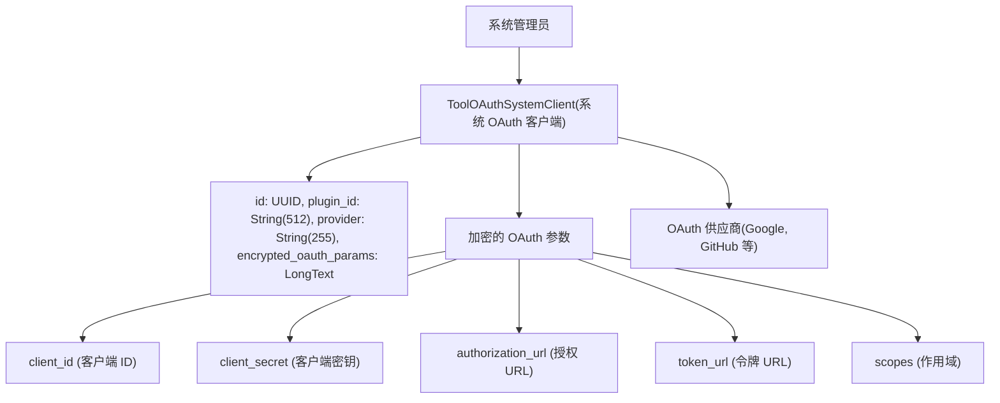
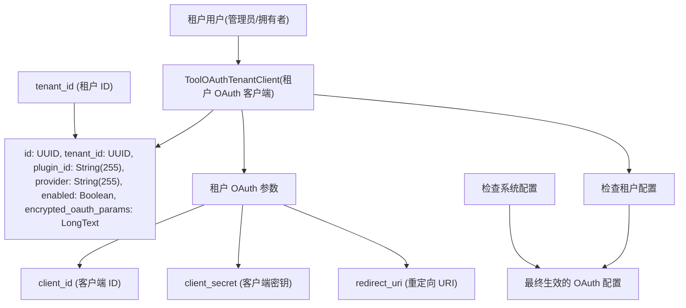
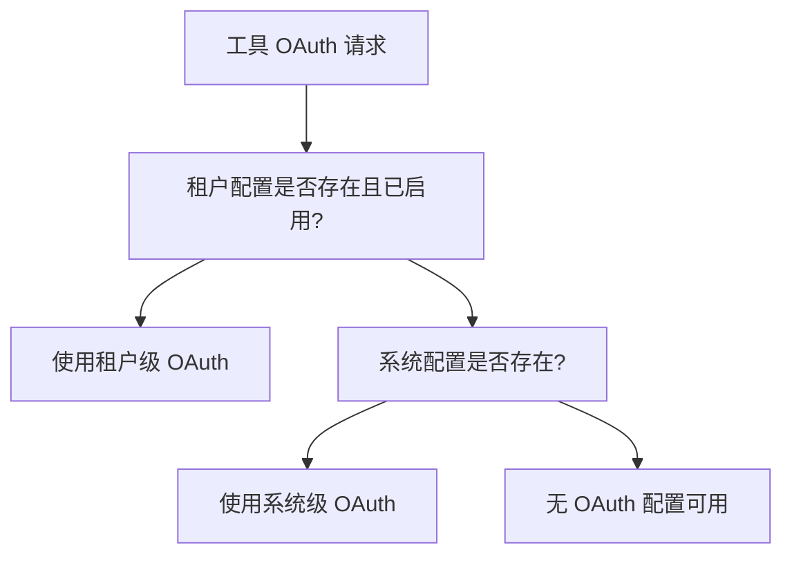
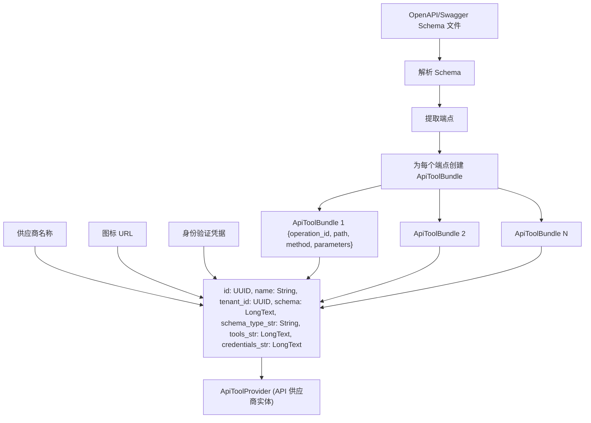
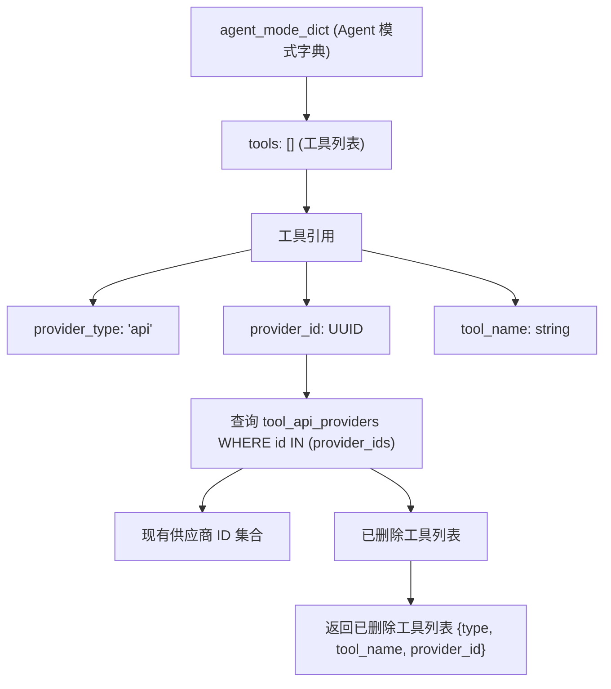

# API 工具集成与 OAuth

相关源文件

-   [api/models/account.py](https://github.com/langgenius/dify/blob/92dbc94f/api/models/account.py)
-   [api/models/api\_based\_extension.py](https://github.com/langgenius/dify/blob/92dbc94f/api/models/api_based_extension.py)
-   [api/models/dataset.py](https://github.com/langgenius/dify/blob/92dbc94f/api/models/dataset.py)
-   [api/models/model.py](https://github.com/langgenius/dify/blob/92dbc94f/api/models/model.py)
-   [api/models/oauth.py](https://github.com/langgenius/dify/blob/92dbc94f/api/models/oauth.py)
-   [api/models/provider.py](https://github.com/langgenius/dify/blob/92dbc94f/api/models/provider.py)
-   [api/models/source.py](https://github.com/langgenius/dify/blob/92dbc94f/api/models/source.py)
-   [api/models/task.py](https://github.com/langgenius/dify/blob/92dbc94f/api/models/task.py)
-   [api/models/tools.py](https://github.com/langgenius/dify/blob/92dbc94f/api/models/tools.py)
-   [api/models/trigger.py](https://github.com/langgenius/dify/blob/92dbc94f/api/models/trigger.py)
-   [api/models/web.py](https://github.com/langgenius/dify/blob/92dbc94f/api/models/web.py)
-   [api/models/workflow.py](https://github.com/langgenius/dify/blob/92dbc94f/api/models/workflow.py)
-   [api/tests/test\_containers\_integration\_tests/services/test\_advanced\_prompt\_template\_service.py](https://github.com/langgenius/dify/blob/92dbc94f/api/tests/test_containers_integration_tests/services/test_advanced_prompt_template_service.py)
-   [api/tests/test\_containers\_integration\_tests/services/test\_agent\_service.py](https://github.com/langgenius/dify/blob/92dbc94f/api/tests/test_containers_integration_tests/services/test_agent_service.py)
-   [api/tests/test\_containers\_integration\_tests/tasks/\_\_init\_\_.py](https://github.com/langgenius/dify/blob/92dbc94f/api/tests/test_containers_integration_tests/tasks/__init__.py)
-   [api/tests/test\_containers\_integration\_tests/tasks/test\_add\_document\_to\_index\_task.py](https://github.com/langgenius/dify/blob/92dbc94f/api/tests/test_containers_integration_tests/tasks/test_add_document_to_index_task.py)
-   [api/tests/unit\_tests/core/test\_provider\_manager.py](https://github.com/langgenius/dify/blob/92dbc94f/api/tests/unit_tests/core/test_provider_manager.py)

## 目的与范围

本文档描述了 Dify 中的 API 工具集成系统，重点介绍了外部 API 服务如何通过 OpenAPI/Swagger 规范集成为工具，以及如何配置和管理 OAuth 2.0 身份验证。内容涵盖了 `ApiToolProvider` 架构、两层 OAuth 配置系统（系统级和租户级）以及凭据管理。

有关更广泛的工具供应商架构（包括内置工具、工作流工具和 MCP 工具）的信息，请参阅 [工具供应商架构](/langgenius/dify/6.1-tool-provider-architecture)。有关模型供应商凭据管理的信息，请参阅 [模型供应商管理](/langgenius/dify/6.3-model-provider-management)。

---

## API 工具集成概览

Dify 中的 API 工具支持通过标准的 OpenAPI 或 Swagger Schema 定义来集成外部 HTTP API。与代码中硬编码的内置工具不同，API 工具由用户动态配置，以调用任意外部服务。

### ApiToolProvider (API 工具供应商) 模型

`ApiToolProvider` 模型存储租户级别的 API 供应商配置。每个供应商代表一个由单个 OpenAPI/Swagger Schema 定义的相关 API 端点集合。

**核心组件：**

| 字段 | 类型 | 用途 |
| --- | --- | --- |
| `id` | StringUUID | 供应商唯一标识符 |
| `name` | String(255) | 用户定义的供应商名称 |
| `tenant_id` | StringUUID | 工作区隔离 |
| `schema` | LongText | 原始的 OpenAPI/Swagger 规范文件 |
| `schema_type_str` | String(40) | Schema 格式：`openapi` 或 `swagger` |
| `tools_str` | LongText | 解析后的工具定义 JSON 数组 |
| `credentials_str` | LongText | 包含身份验证凭据的 JSON 对象 |
| `icon` | String(255) | 供应商图标 URL |
| `description` | LongText | 供应商描述 |
| `privacy_policy` | String(255) | 可选的隐私政策 URL |

**来源：** [api/models/tools.py120-192](https://github.com/langgenius/dify/blob/92dbc94f/api/models/tools.py#L120-L192)

### 工具 Schema 类型

系统通过 `ApiProviderSchemaType` 枚举支持两种 Schema 格式：

```
class ApiProviderSchemaType(StrEnum):
    OPENAPI = "openapi"  # OpenAPI 3.x 规范
    SWAGGER = "swagger"  # Swagger 2.0 规范
```
当上传 OpenAPI/Swagger Schema 时，系统会对其进行解析以提取各个工具（端点）定义，这些定义以 `ApiToolBundle` 对象的形式存储在 `tools_str` 字段中。

**来源：** [api/models/tools.py172-182](https://github.com/langgenius/dify/blob/92dbc94f/api/models/tools.py#L172-L182)

---

## OAuth 配置架构

Dify 实现了一个两层 OAuth 配置系统，以支持集中管理和租户特定的 OAuth 应用。这实现了灵活的部署场景：管理员可以提供共享的 OAuth 应用，同时允许单个租户配置自己的应用。

### 系统级 OAuth 配置

**图表：系统级 OAuth 架构**


`ToolOAuthSystemClient` 表存储由系统管理员配置的全系统共享的 OAuth 客户端凭据。这些凭据对所有租户可用，但可以被租户特定的配置覆盖。

**关键特性：**

-   **唯一约束**：`(plugin_id, provider)` 确保每个供应商只有一个系统级 OAuth 配置。
-   **加密存储**：OAuth 凭据在 `encrypted_oauth_params` 字段中加密存储。
-   **索引**：通过 `tool_oauth_system_client_plugin_id_provider_idx` 进行优化查询。

**来源：** [api/models/tools.py28-42](https://github.com/langgenius/dify/blob/92dbc94f/api/models/tools.py#L28-L42)

### 租户级 OAuth 配置

**图表：租户级 OAuth 架构**


`ToolOAuthTenantClient` 表允许单个租户配置自己的 OAuth 应用。启用后，这些配置将覆盖该租户的系统级配置。

**关键特性：**

-   **唯一约束**：`(tenant_id, plugin_id, provider)` 确保每个供应商只有一个租户配置。
-   **启用/禁用**：`enabled` 标志控制租户配置是否覆盖系统配置。
-   **工作区隔离**：每个租户维护独立的 OAuth 配置。

**来源：** [api/models/tools.py45-66](https://github.com/langgenius/dify/blob/92dbc94f/api/models/tools.py#L45-L66)

### OAuth 配置优先级


**优先级顺序：**

1.  **租户级配置**（如果 `enabled=true`）
2.  **系统级配置**（回退方案）
3.  **错误**（无可用配置）

**来源：** [api/models/tools.py28-66](https://github.com/langgenius/dify/blob/92dbc94f/api/models/tools.py#L28-L66)

---

## API 工具供应商管理

### 工具定义与存储

当创建 API 供应商时，系统会执行以下操作：

**图表：API 工具供应商创建流程**


**来源：** [api/models/tools.py120-192](https://github.com/langgenius/dify/blob/92dbc94f/api/models/tools.py#L120-L192)

### ApiToolBundle 结构

每个 API 端点都被转换为一个 `ApiToolBundle` 对象，包含以下内容：

```
interface ApiToolBundle {
  operation_id: string;        // 操作的唯一标识符
  operation: string;           // HTTP 方法 (GET, POST 等)
  path: string;                // API 端点路径
  summary: string;             // 简要描述
  description: string;         // 详细描述
  parameters: Parameter[];     // 输入参数
  responses: Response[];       // 预期响应
  author: string;              // 工具作者
  server_url: string;          // API 基础 URL
}
```
这些 bundle 被序列化为 JSON 并存储在 `tools_str` 字段中。`tools` 属性提供了反序列化后的访问方式：

```
@property
def tools(self) -> list[ApiToolBundle]:
    return [ApiToolBundle.model_validate(tool) for tool in json.loads(self.tools_str)]
```
**来源：** [api/models/tools.py175-177](https://github.com/langgenius/dify/blob/92dbc94f/api/models/tools.py#L175-L177)

### 凭据管理

API 工具凭据经过加密后存储在 `credentials_str` 字段中，并通过 `credentials` 属性访问：

```
@property
def credentials(self) -> dict[str, Any]:
    return json.loads(self.credentials_str)
```
**凭据类型：**

-   **API Key**: 简单的 Bearer 令牌或基于 Header 的身份验证。
-   **OAuth 2.0**: 通过 OAuth 流程获取的访问令牌。
-   **Basic Auth**: 用户名和密码组合。
-   **自定义 (Custom)**: 供应商特定的身份验证方案。

**来源：** [api/models/tools.py179-181](https://github.com/langgenius/dify/blob/92dbc94f/api/models/tools.py#L179-L181)

---

## 工具身份验证流程

### OAuth 2.0 身份验证流程

**图表：完整的 OAuth 2.0 工具身份验证流程**

> **[Mermaid 序列图]**
> *(图表结构无法解析)*

**来源：** [api/models/tools.py28-66](https://github.com/langgenius/dify/blob/92dbc94f/api/models/tools.py#L28-L66) [api/models/tools.py120-192](https://github.com/langgenius/dify/blob/92dbc94f/api/models/tools.py#L120-L192)

### API Key 身份验证流程

对于更简单的基于 API Key 的身份验证：

> **[Mermaid 序列图]**
> *(图表结构无法解析)*

**来源：** [api/models/tools.py120-192](https://github.com/langgenius/dify/blob/92dbc94f/api/models/tools.py#L120-L192)

---

## 与工作流和 Agent 集成

### Agent 模式下的工具配置

API 工具在 `AppModelConfig` 的 `agent_mode` 配置中被引用：

```
agent_mode_dict = {
    "enabled": True,
    "strategy": "function_call",  # 或 "react"
    "tools": [
        {
            "provider_type": "api",
            "provider_id": "api-工具供应商-的-uuid",
            "tool_name": "来自-schema-的-operation_id",
            "enabled": True
        }
    ]
}
```
系统通过检查所引用的 `ApiToolProvider` 是否存在来验证工具的可用性。

**来源：** [api/models/model.py194-290](https://github.com/langgenius/dify/blob/92dbc94f/api/models/model.py#L194-L290)

### 工具验证与已删除工具检测

`App.deleted_tools` 属性用于识别那些已被删除但仍在应用配置中被引用的工具：

**图表：工具验证流程**


此验证在访问 `app.deleted_tools` 时运行，有助于防止因工具供应商缺失而导致的运行时错误。

**来源：** [api/models/model.py179-290](https://github.com/langgenius/dify/blob/92dbc94f/api/models/model.py#L179-L290)

### 工作流中的工具执行

API 工具可以通过“工具节点”在工作流中被调用。执行流程如下：

1.  **工具选择**：用户从可用供应商中选择 API 工具。
2.  **参数绑定**：将工作流变量映射到工具参数。
3.  **凭据解析**：系统获取 OAuth 令牌或 API Key。
4.  **HTTP 调用**：工具执行器根据 OpenAPI 规范发起 HTTP 请求。
5.  **响应处理**：解析 API 响应并供后续节点使用。

**来源：** [api/models/model.py179-290](https://github.com/langgenius/dify/blob/92dbc94f/api/models/model.py#L179-L290) [api/models/tools.py120-192](https://github.com/langgenius/dify/blob/92dbc94f/api/models/tools.py#L120-L192)

---

## 数据库表结构参考

### 表：tool\_oauth\_system\_clients

**用途：** 存储工具供应商的系统级 OAuth 客户端配置。

| 列名 | 类型 | 约束 | 描述 |
| --- | --- | --- | --- |
| `id` | UUID | 主键 | 唯一标识符 |
| `plugin_id` | String(512) | 非空 | 插件标识符 |
| `provider` | String(255) | 非空 | 供应商名称 |
| `encrypted_oauth_params` | LongText | 非空 | 加密的 OAuth 凭据 |

**索引：**

-   `tool_oauth_system_client_pkey`: 基于 `id` 的主键。
-   `tool_oauth_system_client_plugin_id_provider_idx`: 基于 `(plugin_id, provider)` 的唯一索引。

**来源：** [api/models/tools.py28-42](https://github.com/langgenius/dify/blob/92dbc94f/api/models/tools.py#L28-L42)

### 表：tool\_oauth\_tenant\_clients

**用途：** 存储可覆盖系统默认设置的租户级 OAuth 客户端配置。

| 列名 | 类型 | 约束 | 描述 |
| --- | --- | --- | --- |
| `id` | UUID | 主键 | 唯一标识符 |
| `tenant_id` | UUID | 非空 | 工作区 ID |
| `plugin_id` | String(255) | 非空 | 插件标识符 |
| `provider` | String(255) | 非空 | 供应商名称 |
| `enabled` | Boolean | 非空, 默认：true | 租户配置是否激活 |
| `encrypted_oauth_params` | LongText | 非空 | 加密的 OAuth 凭据 |

**索引：**

-   `tool_oauth_tenant_client_pkey`: 基于 `id` 的主键。
-   `unique_tool_oauth_tenant_client`: 基于 `(tenant_id, plugin_id, provider)` 的唯一索引。

**来源：** [api/models/tools.py45-66](https://github.com/langgenius/dify/blob/92dbc94f/api/models/tools.py#L45-L66)

### 表：tool\_api\_providers

**用途：** 存储 API 工具供应商定义，包括 OpenAPI Schema 和凭据。

| 列名 | 类型 | 约束 | 描述 |
| --- | --- | --- | --- |
| `id` | UUID | 主键 | 唯一标识符 |
| `name` | String(255) | 非空 | 用户定义的供应商名称 |
| `tenant_id` | UUID | 非空 | 工作区 ID |
| `user_id` | UUID | 非空 | 创建者用户 ID |
| `icon` | String(255) | 非空 | 供应商图标 URL |
| `schema` | LongText | 非空 | 原始的 OpenAPI/Swagger Schema |
| `schema_type_str` | String(40) | 非空 | Schema 格式 (openapi/swagger) |
| `tools_str` | LongText | 非空 | 工具定义的 JSON 数组 |
| `credentials_str` | LongText | 非空 | 包含凭据的 JSON 对象 |
| `description` | LongText | 非空 | 供应商描述 |
| `privacy_policy` | String(255) | 可为空 | 隐私政策 URL |
| `custom_disclaimer` | LongText | 默认："" | 自定义免责声明文本 |

**索引：**

-   `tool_api_provider_pkey`: 基于 `id` 的主键。
-   `unique_api_tool_provider`: 基于 `(name, tenant_id)` 的唯一索引。

**来源：** [api/models/tools.py120-192](https://github.com/langgenius/dify/blob/92dbc94f/api/models/tools.py#L120-L192)

---

## 安全性考虑

### 凭据加密

所有敏感凭据在存储前都会进行加密：

-   `ToolOAuthSystemClient.encrypted_oauth_params` 中的 **OAuth 令牌**。
-   `ToolOAuthTenantClient.encrypted_oauth_params` 中的 **OAuth 令牌**。
-   `ApiToolProvider.credentials_str` 中的 **API Key 和令牌**。

加密由 `core.helper.encrypter` 模块处理，使用租户特定的加密密钥。

### 租户隔离

API 工具供应商通过 `tenant_id` 进行严格隔离：

-   每个租户只能访问自己的 `ApiToolProvider` 配置。
-   OAuth 租户客户端的作用域仅限于单个租户。
-   系统级 OAuth 配置是共享的，但租户级配置优先。

### OAuth 令牌刷新

存储在工具凭据中的 OAuth 令牌可能会过期。系统应实现令牌刷新逻辑：

1.  在工具调用前检查令牌是否过期。
2.  使用刷新令牌 (refresh token) 获取新的访问令牌。
3.  使用新令牌更新存储的凭据。
4.  令牌刷新后重试失败的请求。

**来源：** [api/models/tools.py28-192](https://github.com/langgenius/dify/blob/92dbc94f/api/models/tools.py#L28-L192)

---

## 总结

Dify 中的 API 工具集成系统提供了一个灵活的框架，用于通过 OpenAPI/Swagger 规范集成外部 HTTP API。两层 OAuth 配置系统（系统级和租户级）实现了集中式管理和租户特定的自定义。工具凭据经过安全加密并按租户隔离，确保了数据安全和对多租户的支持。

关键模型：

-   **`ToolOAuthSystemClient`**: 系统级 OAuth 配置。
-   **`ToolOAuthTenantClient`**: 具有覆盖能力的租户级 OAuth 配置。
-   **`ApiToolProvider`**: 带有 Schema 解析和凭据存储的 API 工具定义。

**来源：** [api/models/tools.py28-192](https://github.com/langgenius/dify/blob/92dbc94f/api/models/tools.py#L28-L192) [api/models/model.py179-290](https://github.com/langgenius/dify/blob/92dbc94f/api/models/model.py#L179-L290)