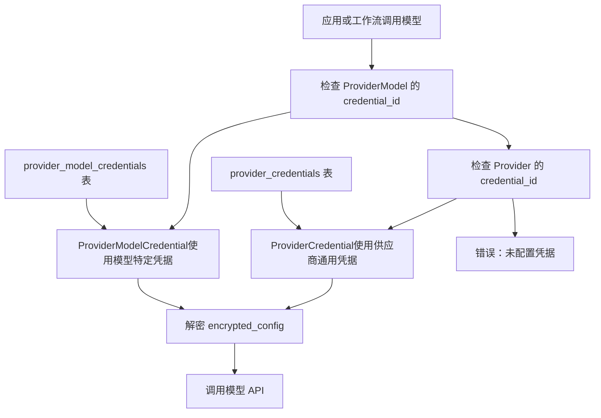
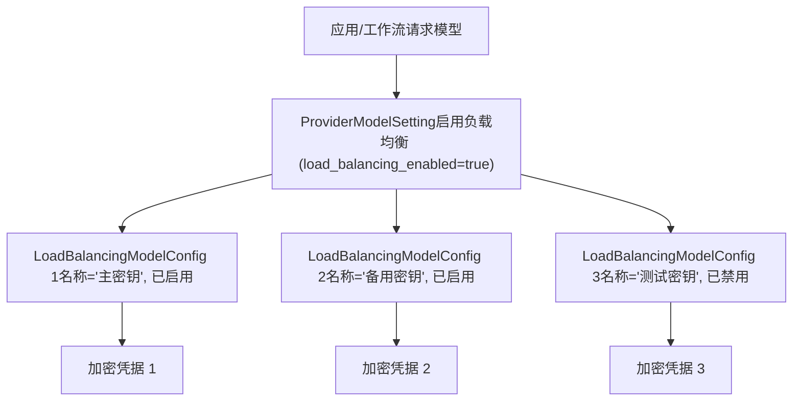
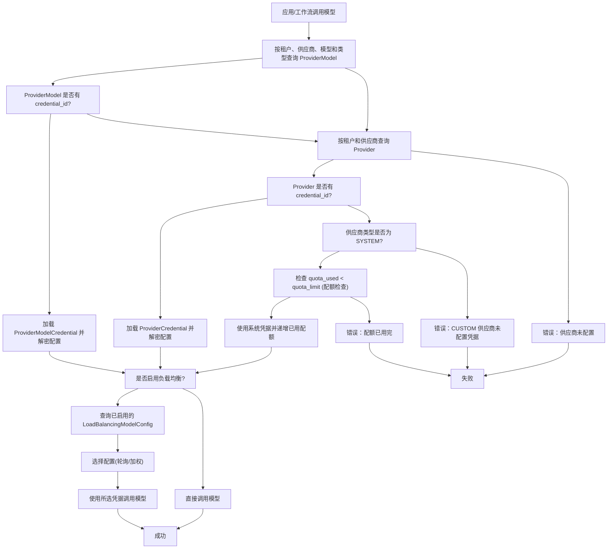

# 模型供应商管理

相关源文件

-   [api/models/account.py](https://github.com/langgenius/dify/blob/92dbc94f/api/models/account.py)
-   [api/models/api\_based\_extension.py](https://github.com/langgenius/dify/blob/92dbc94f/api/models/api_based_extension.py)
-   [api/models/dataset.py](https://github.com/langgenius/dify/blob/92dbc94f/api/models/dataset.py)
-   [api/models/model.py](https://github.com/langgenius/dify/blob/92dbc94f/api/models/model.py)
-   [api/models/oauth.py](https://github.com/langgenius/dify/blob/92dbc94f/api/models/oauth.py)
-   [api/models/provider.py](https://github.com/langgenius/dify/blob/92dbc94f/api/models/provider.py)
-   [api/models/source.py](https://github.com/langgenius/dify/blob/92dbc94f/api/models/source.py)
-   [api/models/task.py](https://github.com/langgenius/dify/blob/92dbc94f/api/models/task.py)
-   [api/models/tools.py](https://github.com/langgenius/dify/blob/92dbc94f/api/models/tools.py)
-   [api/models/trigger.py](https://github.com/langgenius/dify/blob/92dbc94f/api/models/trigger.py)
-   [api/models/web.py](https://github.com/langgenius/dify/blob/92dbc94f/api/models/web.py)
-   [api/models/workflow.py](https://github.com/langgenius/dify/blob/92dbc94f/api/models/workflow.py)
-   [api/tests/test\_containers\_integration\_tests/services/test\_advanced\_prompt\_template\_service.py](https://github.com/langgenius/dify/blob/92dbc94f/api/tests/test_containers_integration_tests/services/test_advanced_prompt_template_service.py)
-   [api/tests/test\_containers\_integration\_tests/services/test\_agent\_service.py](https://github.com/langgenius/dify/blob/92dbc94f/api/tests/test_containers_integration_tests/services/test_agent_service.py)
-   [api/tests/test\_containers\_integration\_tests/tasks/\_\_init\_\_.py](https://github.com/langgenius/dify/blob/92dbc94f/api/tests/test_containers_integration_tests/tasks/__init__.py)
-   [api/tests/test\_containers\_integration\_tests/tasks/test\_add\_document\_to\_index\_task.py](https://github.com/langgenius/dify/blob/92dbc94f/api/tests/test_containers_integration_tests/tasks/test_add_document_to_index_task.py)
-   [api/tests/unit\_tests/core/test\_provider\_manager.py](https://github.com/langgenius/dify/blob/92dbc94f/api/tests/unit_tests/core/test_provider_manager.py)

## 目的与范围

模型供应商管理系统负责在 Dify 中配置、验证和管理与大语言模型 (LLM) 供应商的连接。这包括管理凭据、配额 (quotas)、负载均衡以及租户的默认模型选择。该系统实现了对系统级提供（托管）模型和自定义（用户配置）模型的跨租户访问。

有关工具在 Agent 执行期间如何使用模型供应商的信息，请参阅 [工具供应商架构](/langgenius/dify/6.1-tool-provider-architecture)。有关工作流如何调用 LLM 节点的信息，请参阅 [LLM 节点与模型集成](/langgenius/dify/5.2-llm-nodes-and-model-integration)。

**来源：** [api/models/provider.py1-370](https://github.com/langgenius/dify/blob/92dbc94f/api/models/provider.py#L1-L370)

---

## 核心数据模型

供应商管理系统由多个相互关联的模型组成，这些模型协同工作，实现了灵活的多租户模型配置。

### 模型关系图

```mermaid
flowchart TD
    entity_Tenant_0["Tenant(租户)"]
    entity_Provider_1["Provider(供应商)"]
    entity_ProviderModel_2["ProviderModel(供应商模型)"]
    entity_TenantDefaultModel_3["TenantDefaultModel(租户默认模型)"]
    entity_TenantPreferredModelProvider_4["TenantPreferredModelProvider(租户首选模型供应商)"]
    entity_ProviderCredential_5["ProviderCredential(供应商凭据)"]
    entity_ProviderModelCredential_6["ProviderModelCredential(供应商模型凭据)"]
    entity_ProviderModelSetting_7["ProviderModelSetting(供应商模型设置)"]
    entity_LoadBalancingModelConfig_8["LoadBalancingModelConfig(负载均衡模型配置)"]
```


**来源：** [api/models/provider.py47-369](https://github.com/langgenius/dify/blob/92dbc94f/api/models/provider.py#L47-L369)

---

## 供应商类型与配额类型

系统区分了两种基本的供应商类型，以及针对托管服务的三个配额类型。

### 供应商类型 (Provider Types)

`ProviderType` 枚举定义了供应商的分类：

| 类型 | 描述 | 使用场景 |
| --- | --- | --- |
| `SYSTEM` | 由 Dify 平台提供的托管模型 | 免费/试用配额，托管的 OpenAI, Anthropic 等 |
| `CUSTOM` | 用户自行配置的外部供应商 | 用户自带 API 密钥 (BYOK) |

**来源：** [api/models/provider.py17-27](https://github.com/langgenius/dify/blob/92dbc94f/api/models/provider.py#L17-L27)

### 配额类型 (Quota Types)

`ProviderQuotaType` 枚举定义了系统供应商的配额类别：

| 类型 | 描述 | 行为 |
| --- | --- | --- |
| `PAID` | 托管的付费配额 | 从 Dify 平台购买的配额 |
| `FREE` | 第三方免费配额 | 外部供应商提供的免费额度 |
| `TRIAL` | 托管的试用配额 | 由 Dify 提供的有限试用额度 |

`Provider` 模型通过 `quota_limit`、`quota_used` 和 `quota_type` 字段追踪配额使用情况。当使用系统供应商时，`quota_used` 计数器会根据 Token 消耗量递增。

**来源：** [api/models/provider.py29-45](https://github.com/langgenius/dify/blob/92dbc94f/api/models/provider.py#L29-L45) [api/models/provider.py76-86](https://github.com/langgenius/dify/blob/92dbc94f/api/models/provider.py#L76-L86)

---

## 供应商与模型配置

### Provider (供应商) 模型

`Provider` 模型代表租户配置的一个供应商实例：

```
# Provider 模型中的关键字段
tenant_id: str              # 工作区/租户标识符
provider_name: str          # 例如 "openai", "anthropic", "azure_openai"
provider_type: str          # "custom" (自定义) 或 "system" (系统)
is_valid: bool              # 凭据是否已验证
credential_id: str | None   # 关联 ProviderCredential 的 ID
quota_type: str | None      # 针对系统供应商："paid", "free", "trial"
quota_limit: int | None     # 最大配额 (Token 数/请求数)
quota_used: int             # 当前配额已使用量
last_used: datetime | None  # 最后一次使用的时间戳
```
该模型包含验证逻辑：

-   `is_enabled` 属性：如果供应商有效且（对于自定义供应商）凭据已设置，则返回 `True`。
-   `token_is_set` 属性：检查 `encrypted_config` 是否存在。

**来源：** [api/models/provider.py47-125](https://github.com/langgenius/dify/blob/92dbc94f/api/models/provider.py#L47-L125)

### ProviderModel (供应商模型) 模型

`ProviderModel` 模型代表供应商下属的具体可用模型：

```
# ProviderModel 模型中的关键字段
tenant_id: str              # 工作区标识符
provider_name: str          # 所属供应商
model_name: str             # 模型名，例如 "gpt-4", "claude-3-opus"
model_type: str             # 模型类型，例如 "llm", "text-embedding", "speech2text", "tts", "rerank", "moderation"
credential_id: str | None   # 模型特定的凭据覆盖
is_valid: bool              # 验证状态
```
这允许进行模型级别的凭据覆盖，从而实现在同一个供应商下为不同模型使用不同的 API 密钥。

**来源：** [api/models/provider.py127-175](https://github.com/langgenius/dify/blob/92dbc94f/api/models/provider.py#L127-L175)

---

## 凭据管理架构

Dify 实现了一个两级凭据系统：供应商级凭据和模型级凭据。这实现了灵活的认证模式，同时通过加密保持安全性。

### 凭据层级结构


### ProviderCredential (供应商凭据) 模型

`ProviderCredential` 模型存储了供应商的命名凭据：

```
# ProviderCredential 关键字段
id: str                    # 凭据 ID (UUID v7)
tenant_id: str             # 工作区标识符
provider_name: str         # 供应商标识符
credential_name: str       # 用户友好名称（例如 "生产环境 API Key"）
encrypted_config: str      # 加密的 JSON 格式凭据数据
```
同一租户下的同一个供应商可以存在多个凭据，从而支持凭据轮换和负载均衡。

**来源：** [api/models/provider.py312-336](https://github.com/langgenius/dify/blob/92dbc94f/api/models/provider.py#L312-L336)

### ProviderModelCredential (供应商模型凭据) 模型

`ProviderModelCredential` 模型存储模型特定的凭据：

```
# ProviderModelCredential 关键字段
id: str                    # 凭据 ID (UUID v7)
tenant_id: str             # 工作区标识符
provider_name: str         # 供应商标识符
model_name: str            # 具体模型名
model_type: str            # 模型类型 (llm, embedding 等)
credential_name: str       # 用户友好名称
encrypted_config: str      # 加密的 JSON 格式凭据数据
```
这种粒度允许为不同的模型使用不同的凭据，适用于以下场景：

-   为不同模型使用不同级别的 API。
-   按模型隔离成本。
-   使用单独的试用密钥测试新模型。

**来源：** [api/models/provider.py338-369](https://github.com/langgenius/dify/blob/92dbc94f/api/models/provider.py#L338-L369)

### 凭据访问模式

`Provider` 和 `ProviderModel` 都使用缓存属性来访问凭据：

```
# Provider.credential 属性
@cached_property
def credential(self):
    if self.credential_id:
        return db.session.query(ProviderCredential).where(
            ProviderCredential.id == self.credential_id
        ).first()

# Provider.encrypted_config 属性
@property
def encrypted_config(self):
    credential = self.credential
    return credential.encrypted_config if credential else None
```
**来源：** [api/models/provider.py94-108](https://github.com/langgenius/dify/blob/92dbc94f/api/models/provider.py#L94-L108) [api/models/provider.py157-175](https://github.com/langgenius/dify/blob/92dbc94f/api/models/provider.py#L157-L175)

---

## 负载均衡配置

负载均衡将请求分发到同一模型的多个凭据上，从而提高可靠性并优化频率限制管理。

### 负载均衡模型


### ProviderModelSetting (供应商模型设置) 模型

`ProviderModelSetting` 模型控制模型可用性和负载均衡：

```
# ProviderModelSetting 关键字段
tenant_id: str                      # 工作区标识符
provider_name: str                  # 供应商标识符
model_name: str                     # 模型名称
model_type: str                     # 模型类型
enabled: bool = True                # 模型是否可用
load_balancing_enabled: bool = False # 是否启用负载均衡
```
当 `load_balancing_enabled` 为 `True` 时，系统使用 `LoadBalancingModelConfig` 条目来分发请求。

**来源：** [api/models/provider.py251-278](https://github.com/langgenius/dify/blob/92dbc94f/api/models/provider.py#L251-L278)

### LoadBalancingModelConfig (负载均衡模型配置) 模型

`LoadBalancingModelConfig` 模型定义了具体的负载均衡配置：

```
# LoadBalancingModelConfig 关键字段
tenant_id: str                      # 工作区标识符
provider_name: str                  # 供应商标识符
model_name: str                     # 模型名称
model_type: str                     # 模型类型
name: str                           # 配置名称
encrypted_config: str | None        # 直接存储的加密凭据
credential_id: str | None           # 引用 ProviderCredential 或 ProviderModelCredential 的 ID
credential_source_type: str | None  # 来源类型指示符
enabled: bool = True                # 此配置是否激活
```
负载均衡配置可以通过两种方式存储凭据：

1.  **直接存储**：`encrypted_config` 包含凭据内容。
2.  **引用存储**：`credential_id` 指向一个 `ProviderCredential` 或 `ProviderModelCredential`。

**来源：** [api/models/provider.py281-309](https://github.com/langgenius/dify/blob/92dbc94f/api/models/provider.py#L281-L309)

### 负载均衡策略

当一个模型存在多个已启用的 `LoadBalancingModelConfig` 条目时：

1.  系统查询所有已启用的配置。
2.  请求分发到各个凭据（通常采用轮询或加权方式）。
3.  失败的请求可以故障转移 (failover) 到备用凭据。
4.  跳过已禁用的配置。

这提供了：

-   **频率限制分担**：将请求分散到多个 API Key。
-   **容错能力**：凭据失效时自动切换。
-   **成本管理**：使用不同的计费账号。

**来源：** [api/models/provider.py281-309](https://github.com/langgenius/dify/blob/92dbc94f/api/models/provider.py#L281-L309)

---

## 默认模型配置

租户可以为不同的模型类型配置默认模型，从而简化应用的创建。

### TenantDefaultModel (租户默认模型) 模型

`TenantDefaultModel` 模型存储了默认的模型选择：

```
# TenantDefaultModel 关键字段
tenant_id: str         # 工作区标识符
provider_name: str     # 默认供应商
model_name: str        # 默认模型名
model_type: str        # 模型类型 (llm, text-embedding, rerank, tts, speech2text, moderation)
```
常见模型类型：

-   `llm`：用于对话和补全的语言模型。
-   `text-embedding`：用于 RAG 的嵌入模型。
-   `rerank`：用于检索的重排序模型。
-   `tts`：文本转语音模型。
-   `speech2text`：语音识别模型。
-   `moderation`：内容审查模型。

**来源：** [api/models/provider.py177-196](https://github.com/langgenius/dify/blob/92dbc94f/api/models/provider.py#L177-L196)

### TenantPreferredModelProvider (租户首选模型供应商) 模型

当多个供应商提供同一模型时，`TenantPreferredModelProvider` 模型指示首选的供应商类型：

```
# TenantPreferredModelProvider 关键字段
tenant_id: str                    # 工作区标识符
provider_name: str                # 供应商名称
preferred_provider_type: str      # "custom" (自定义) 或 "system" (系统)
```
这解决了同时有系统供应商和自定义供应商可用时的歧义。例如，如果租户同时拥有：

-   系统级 OpenAI 供应商（由 Dify 托管）。
-   自定义 OpenAI 供应商（用户自己的 API Key）。

首选供应商类型决定了默认使用哪一个。

**来源：** [api/models/provider.py199-217](https://github.com/langgenius/dify/blob/92dbc94f/api/models/provider.py#L199-L217)

---

## 与应用及工作流的集成

模型供应商在 Dify 系统的各种上下文中被广泛使用。

### 应用模型配置

应用中的 `AppModelConfig` 模型引用了供应商：

```
# 摘自 AppModelConfig 模型
provider: str | None      # 供应商名称 (例如 "openai")
model_id: str | None      # 模型名 (例如 "gpt-4")
model: str                # 包含完整模型配置的 JSON
```
`model_dict` 属性用于反序列化模型配置：

```
@property
def model_dict(self) -> dict[str, Any]:
    return json.loads(self.model) if self.model else {}
```
该字典包含：

-   `provider`：供应商名称（格式：`plugin_id/provider_name/deployment_name` 或仅 `provider_name`）。
-   `name`：模型名称。
-   `mode`：模型模式（如 "chat", "completion"）。
-   `completion_params`：温度 (temperature)、max\_tokens 等参数。

**来源：** [api/models/model.py315-358](https://github.com/langgenius/dify/blob/92dbc94f/api/models/model.py#L315-L358)

### 知识库嵌入配置

知识库 (Dataset) 存储了用于索引的嵌入模型配置：

```
# 摘自 Dataset 模型
embedding_model: str | None           # 模型名称
embedding_model_provider: str | None  # 供应商名称
```
这决定了在以下环节使用哪个嵌入模型：

-   文档分块与索引。
-   检索期间的查询嵌入。
-   向量相似度搜索。

**来源：** [api/models/dataset.py70-71](https://github.com/langgenius/dify/blob/92dbc94f/api/models/dataset.py#L70-L71)

### 会话模型追踪

`Conversation` (会话) 模型追踪了使用了哪个供应商/模型：

```
# 摘自 Conversation 模型
model_provider: str | None    # 使用的供应商
model_id: str | None          # 使用的模型
```
这实现了：

-   按会话进行成本追踪。
-   模型使用情况分析。
-   模型特定问题的调试。

**来源：** [api/models/model.py644-646](https://github.com/langgenius/dify/blob/92dbc94f/api/models/model.py#L644-L646)

---

## 供应商订单与支付

对于托管（系统）供应商，`ProviderOrder` 模型追踪支付交易。

### ProviderOrder 模型

```
# ProviderOrder 关键字段
tenant_id: str                # 工作区标识符
provider_name: str            # 正在购买的供应商
account_id: str               # 购买账号
payment_product_id: str       # 正在购买的产品
payment_id: str | None        # 支付处理器 ID
transaction_id: str | None    # 交易标识符
quantity: int                 # 购买数量
currency: str | None          # 货币 (USD, EUR 等)
total_amount: int | None      # 总金额（分）
payment_status: str           # "wait_pay", "paid", "failed", "refunded"
paid_at: datetime | None      # 支付时间戳
```
支付状态：

-   `wait_pay`：等待支付。
-   `paid`：支付成功，配额已增加。
-   `failed`：支付失败。
-   `refunded`：已退款。

**来源：** [api/models/provider.py220-248](https://github.com/langgenius/dify/blob/92dbc94f/api/models/provider.py#L220-L248)

---

## 使用示例：模型解析

当应用或工作流调用模型时，系统通过以下过程解析凭据：


**来源：** [api/models/provider.py47-369](https://github.com/langgenius/dify/blob/92dbc94f/api/models/provider.py#L47-L369)

---

## 数据库表结构摘要

模型供应商管理系统使用以下表格：

| 表名 | 用途 | 关键约束 |
| --- | --- | --- |
| `providers` | 租户级别的供应商配置 | 唯一索引：(tenant\_id, provider\_name, provider\_type, quota\_type) |
| `provider_models` | 供应商旗下的模型注册信息 | 唯一索引：(tenant\_id, provider\_name, model\_name, model\_type) |
| `provider_credentials` | 供应商的命名凭据 | 索引：(tenant\_id, provider\_name) |
| `provider_model_credentials` | 模型特定的凭据 | 索引：(tenant\_id, provider\_name, model\_name, model\_type) |
| `provider_model_settings` | 模型的启用/禁用及负载均衡设置 | 索引：(tenant\_id, provider\_name, model\_type) |
| `load_balancing_model_configs` | 负载均衡具体配置 | 索引：(tenant\_id, provider\_name, model\_type) |
| `tenant_default_models` | 租户的默认模型选择 | 索引：(tenant\_id, provider\_name, model\_type) |
| `tenant_preferred_model_providers` | 租户的首选供应商类型 | 索引：(tenant\_id, provider\_name) |
| `provider_orders` | 托管供应商的支付/订单记录 | 索引：(tenant\_id, provider\_name) |

所有表格均使用 UUID 标识符，并包含 `created_at` 和 `updated_at` 时间戳。

**来源：** [api/models/provider.py47-369](https://github.com/langgenius/dify/blob/92dbc94f/api/models/provider.py#L47-L369)