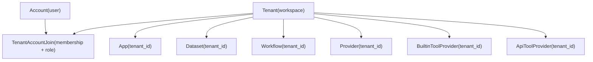
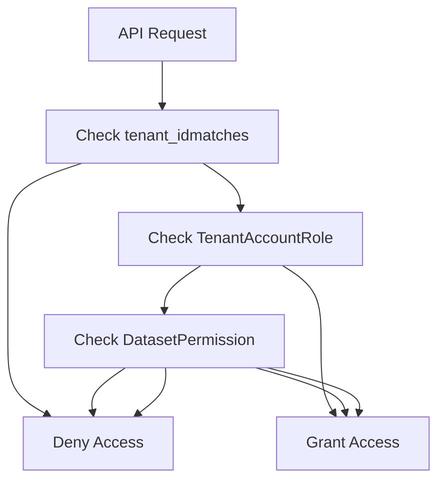
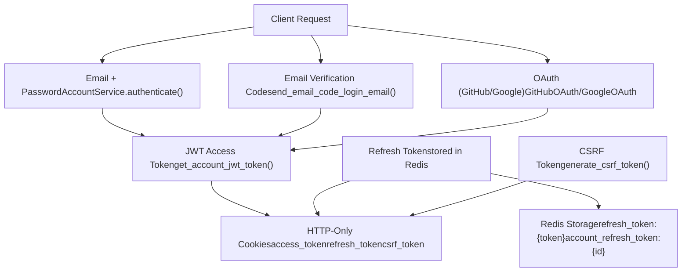
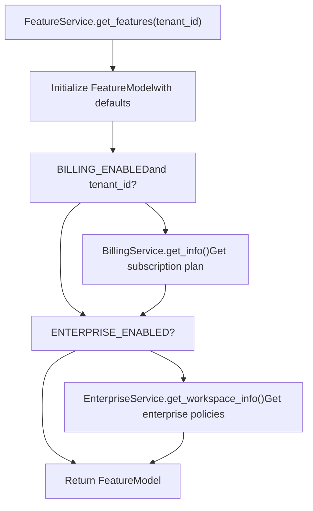

# 多租户与授权

相关源文件

-   [api/controllers/console/\_\_init\_\_.py](https://github.com/langgenius/dify/blob/92dbc94f/api/controllers/console/__init__.py)
-   [api/controllers/console/auth/activate.py](https://github.com/langgenius/dify/blob/92dbc94f/api/controllers/console/auth/activate.py)
-   [api/controllers/console/auth/email\_register.py](https://github.com/langgenius/dify/blob/92dbc94f/api/controllers/console/auth/email_register.py)
-   [api/controllers/console/auth/error.py](https://github.com/langgenius/dify/blob/92dbc94f/api/controllers/console/auth/error.py)
-   [api/controllers/console/auth/forgot\_password.py](https://github.com/langgenius/dify/blob/92dbc94f/api/controllers/console/auth/forgot_password.py)
-   [api/controllers/console/auth/login.py](https://github.com/langgenius/dify/blob/92dbc94f/api/controllers/console/auth/login.py)
-   [api/controllers/console/auth/oauth.py](https://github.com/langgenius/dify/blob/92dbc94f/api/controllers/console/auth/oauth.py)
-   [api/controllers/console/billing/billing.py](https://github.com/langgenius/dify/blob/92dbc94f/api/controllers/console/billing/billing.py)
-   [api/controllers/console/billing/compliance.py](https://github.com/langgenius/dify/blob/92dbc94f/api/controllers/console/billing/compliance.py)
-   [api/controllers/console/error.py](https://github.com/langgenius/dify/blob/92dbc94f/api/controllers/console/error.py)
-   [api/controllers/console/feature.py](https://github.com/langgenius/dify/blob/92dbc94f/api/controllers/console/feature.py)
-   [api/controllers/console/init\_validate.py](https://github.com/langgenius/dify/blob/92dbc94f/api/controllers/console/init_validate.py)
-   [api/controllers/console/setup.py](https://github.com/langgenius/dify/blob/92dbc94f/api/controllers/console/setup.py)
-   [api/controllers/console/version.py](https://github.com/langgenius/dify/blob/92dbc94f/api/controllers/console/version.py)
-   [api/controllers/console/workspace/account.py](https://github.com/langgenius/dify/blob/92dbc94f/api/controllers/console/workspace/account.py)
-   [api/controllers/console/workspace/agent\_providers.py](https://github.com/langgenius/dify/blob/92dbc94f/api/controllers/console/workspace/agent_providers.py)
-   [api/controllers/console/workspace/members.py](https://github.com/langgenius/dify/blob/92dbc94f/api/controllers/console/workspace/members.py)
-   [api/controllers/console/workspace/model\_providers.py](https://github.com/langgenius/dify/blob/92dbc94f/api/controllers/console/workspace/model_providers.py)
-   [api/controllers/console/workspace/models.py](https://github.com/langgenius/dify/blob/92dbc94f/api/controllers/console/workspace/models.py)
-   [api/controllers/console/workspace/workspace.py](https://github.com/langgenius/dify/blob/92dbc94f/api/controllers/console/workspace/workspace.py)
-   [api/controllers/console/wraps.py](https://github.com/langgenius/dify/blob/92dbc94f/api/controllers/console/wraps.py)
-   [api/controllers/service\_api/wraps.py](https://github.com/langgenius/dify/blob/92dbc94f/api/controllers/service_api/wraps.py)
-   [api/libs/encryption.py](https://github.com/langgenius/dify/blob/92dbc94f/api/libs/encryption.py)
-   [api/libs/workspace\_permission.py](https://github.com/langgenius/dify/blob/92dbc94f/api/libs/workspace_permission.py)
-   [api/models/account.py](https://github.com/langgenius/dify/blob/92dbc94f/api/models/account.py)
-   [api/models/api\_based\_extension.py](https://github.com/langgenius/dify/blob/92dbc94f/api/models/api_based_extension.py)
-   [api/models/dataset.py](https://github.com/langgenius/dify/blob/92dbc94f/api/models/dataset.py)
-   [api/models/model.py](https://github.com/langgenius/dify/blob/92dbc94f/api/models/model.py)
-   [api/models/oauth.py](https://github.com/langgenius/dify/blob/92dbc94f/api/models/oauth.py)
-   [api/models/provider.py](https://github.com/langgenius/dify/blob/92dbc94f/api/models/provider.py)
-   [api/models/source.py](https://github.com/langgenius/dify/blob/92dbc94f/api/models/source.py)
-   [api/models/task.py](https://github.com/langgenius/dify/blob/92dbc94f/api/models/task.py)
-   [api/models/tools.py](https://github.com/langgenius/dify/blob/92dbc94f/api/models/tools.py)
-   [api/models/trigger.py](https://github.com/langgenius/dify/blob/92dbc94f/api/models/trigger.py)
-   [api/models/web.py](https://github.com/langgenius/dify/blob/92dbc94f/api/models/web.py)
-   [api/models/workflow.py](https://github.com/langgenius/dify/blob/92dbc94f/api/models/workflow.py)
-   [api/services/account\_service.py](https://github.com/langgenius/dify/blob/92dbc94f/api/services/account_service.py)
-   [api/services/billing\_service.py](https://github.com/langgenius/dify/blob/92dbc94f/api/services/billing_service.py)
-   [api/services/enterprise/enterprise\_service.py](https://github.com/langgenius/dify/blob/92dbc94f/api/services/enterprise/enterprise_service.py)
-   [api/services/feature\_service.py](https://github.com/langgenius/dify/blob/92dbc94f/api/services/feature_service.py)
-   [api/services/operation\_service.py](https://github.com/langgenius/dify/blob/92dbc94f/api/services/operation_service.py)
-   [api/templates/change\_mail\_confirm\_old\_template\_zh-CN.html](https://github.com/langgenius/dify/blob/92dbc94f/api/templates/change_mail_confirm_old_template_zh-CN.html)
-   [api/templates/transfer\_workspace\_owner\_confirm\_template\_en-US.html](https://github.com/langgenius/dify/blob/92dbc94f/api/templates/transfer_workspace_owner_confirm_template_en-US.html)
-   [api/templates/without-brand/transfer\_workspace\_owner\_confirm\_template\_en-US.html](https://github.com/langgenius/dify/blob/92dbc94f/api/templates/without-brand/transfer_workspace_owner_confirm_template_en-US.html)
-   [api/tests/test\_containers\_integration\_tests/services/test\_advanced\_prompt\_template\_service.py](https://github.com/langgenius/dify/blob/92dbc94f/api/tests/test_containers_integration_tests/services/test_advanced_prompt_template_service.py)
-   [api/tests/test\_containers\_integration\_tests/services/test\_agent\_service.py](https://github.com/langgenius/dify/blob/92dbc94f/api/tests/test_containers_integration_tests/services/test_agent_service.py)
-   [api/tests/test\_containers\_integration\_tests/tasks/\_\_init\_\_.py](https://github.com/langgenius/dify/blob/92dbc94f/api/tests/test_containers_integration_tests/tasks/__init__.py)
-   [api/tests/test\_containers\_integration\_tests/tasks/test\_add\_document\_to\_index\_task.py](https://github.com/langgenius/dify/blob/92dbc94f/api/tests/test_containers_integration_tests/tasks/test_add_document_to_index_task.py)
-   [api/tests/unit\_tests/controllers/console/auth/test\_account\_activation.py](https://github.com/langgenius/dify/blob/92dbc94f/api/tests/unit_tests/controllers/console/auth/test_account_activation.py)
-   [api/tests/unit\_tests/controllers/console/auth/test\_authentication\_security.py](https://github.com/langgenius/dify/blob/92dbc94f/api/tests/unit_tests/controllers/console/auth/test_authentication_security.py)
-   [api/tests/unit\_tests/controllers/console/auth/test\_email\_verification.py](https://github.com/langgenius/dify/blob/92dbc94f/api/tests/unit_tests/controllers/console/auth/test_email_verification.py)
-   [api/tests/unit\_tests/controllers/console/auth/test\_login\_logout.py](https://github.com/langgenius/dify/blob/92dbc94f/api/tests/unit_tests/controllers/console/auth/test_login_logout.py)
-   [api/tests/unit\_tests/controllers/console/auth/test\_oauth.py](https://github.com/langgenius/dify/blob/92dbc94f/api/tests/unit_tests/controllers/console/auth/test_oauth.py)
-   [api/tests/unit\_tests/controllers/console/auth/test\_password\_reset.py](https://github.com/langgenius/dify/blob/92dbc94f/api/tests/unit_tests/controllers/console/auth/test_password_reset.py)
-   [api/tests/unit\_tests/controllers/console/auth/test\_token\_refresh.py](https://github.com/langgenius/dify/blob/92dbc94f/api/tests/unit_tests/controllers/console/auth/test_token_refresh.py)
-   [api/tests/unit\_tests/controllers/test\_compare\_versions.py](https://github.com/langgenius/dify/blob/92dbc94f/api/tests/unit_tests/controllers/test_compare_versions.py)
-   [api/tests/unit\_tests/core/test\_provider\_manager.py](https://github.com/langgenius/dify/blob/92dbc94f/api/tests/unit_tests/core/test_provider_manager.py)
-   [api/tests/unit\_tests/libs/test\_encryption.py](https://github.com/langgenius/dify/blob/92dbc94f/api/tests/unit_tests/libs/test_encryption.py)
-   [api/tests/unit\_tests/libs/test\_oauth\_clients.py](https://github.com/langgenius/dify/blob/92dbc94f/api/tests/unit_tests/libs/test_oauth_clients.py)
-   [api/tests/unit\_tests/libs/test\_workspace\_permission.py](https://github.com/langgenius/dify/blob/92dbc94f/api/tests/unit_tests/libs/test_workspace_permission.py)

本文档描述了 Dify 的多租户架构、账户管理和基于角色的访问控制 (RBAC) 系统。它涵盖了工作空间（租户）如何隔离，用户如何在租户内分配角色，以及如何在整个代码库中强制执行权限。

有关 API 级认证机制（API 密钥、JWT 令牌、OAuth）的信息，请参阅第 7.3 节。有关功能门控和计费集成的信息，请参阅第 7.4 节。

---

## 多租户架构概览

Dify 实现了一个**基于工作空间的多租户模型**，其中每个租户代表一个隔离的工作空间。所有主要资源（应用程序、数据集、工作流、提供商、工具）都使用 `tenant_id` 外键限定于特定租户。

### 核心概念

| 概念 | 描述 | 数据库模型 |
| --- | --- | --- |
| **租户 (Tenant)** | 拥有所有资源的工作空间 | `tenants` 表 |
| **账户 (Account)** | 可以是多个租户成员的用户 | `accounts` 表 |
| **成员资格 (Membership)** | 账户与租户之间的关系以及分配的角色 | `tenant_account_joins` 表 |
| **角色 (Role)** | 定义账户在特定租户内拥有的权限 | `TenantAccountRole` 枚举 |

**租户范围的资源**

以下实体属于租户范围（包含 `tenant_id` 字段）：

-   应用程序 (`App`)
-   数据集 (`Dataset`)
-   工作流 (`Workflow`, `WorkflowRun`)
-   LLM 提供商 (`Provider`, `ProviderModel`)
-   工具提供商 (`BuiltinToolProvider`, `ApiToolProvider`, `WorkflowToolProvider`, `MCPToolProvider`)
-   对话 (`Conversation` 通过 `App.tenant_id`)
-   文档 (`Document`)

**实体关系图**


来源：[api/models/account.py242-277](https://github.com/langgenius/dify/blob/92dbc94f/api/models/account.py#L242-L277) [api/models/model.py75-313](https://github.com/langgenius/dify/blob/92dbc94f/api/models/model.py#L75-L313) [api/models/dataset.py44-311](https://github.com/langgenius/dify/blob/92dbc94f/api/models/dataset.py#L44-L311) [api/models/workflow.py100-202](https://github.com/langgenius/dify/blob/92dbc94f/api/models/workflow.py#L100-L202) [api/models/provider.py47-125](https://github.com/langgenius/dify/blob/92dbc94f/api/models/provider.py#L47-L125) [api/models/tools.py66-116](https://github.com/langgenius/dify/blob/92dbc94f/api/models/tools.py#L66-L116)

---

## 账户服务与租户管理

位于 [api/services/account\_service.py](https://github.com/langgenius/dify/blob/92dbc94f/api/services/account_service.py) 的 `AccountService` 和 `TenantService` 类提供了账户和租户管理的核心功能。

### 关键服务类

**AccountService 方法：**

| 方法 | 用途 | 位置 |
| --- | --- | --- |
| `create_account()` | 创建带有密码哈希的新账户 | [api/services/account\_service.py229-279](https://github.com/langgenius/dify/blob/92dbc94f/api/services/account_service.py#L229-L279) |
| `authenticate()` | 验证电子邮件/密码凭证 | [api/services/account\_service.py176-204](https://github.com/langgenius/dify/blob/92dbc94f/api/services/account_service.py#L176-L204) |
| `login()` | 生成 JWT 和刷新令牌 | [api/services/account\_service.py398-412](https://github.com/langgenius/dify/blob/92dbc94f/api/services/account_service.py#L398-L412) |
| `load_user()` | 加载账户并设置当前租户 | [api/services/account\_service.py127-159](https://github.com/langgenius/dify/blob/92dbc94f/api/services/account_service.py#L127-L159) |
| `update_account_password()` | 使用当前密码验证更新密码 | [api/services/account\_service.py207-226](https://github.com/langgenius/dify/blob/92dbc94f/api/services/account_service.py#L207-L226) |

**TenantService 方法：**

`TenantService` 类（在整个代码库中引用）提供：

-   `create_owner_tenant_if_not_exist()` - 为新账户创建默认工作空间
-   `get_join_tenants()` - 检索账户所属的所有租户
-   `get_tenant_members()` - 列出租户的所有成员
-   `remove_member_from_tenant()` - 通过权限检查移除成员
-   `update_member_role()` - 通过 RBAC 强制执行更改成员角色

来源：[api/services/account\_service.py88-792](https://github.com/langgenius/dify/blob/92dbc94f/api/services/account_service.py#L88-L792) [api/controllers/console/workspace/members.py84-220](https://github.com/langgenius/dify/blob/92dbc94f/api/controllers/console/workspace/members.py#L84-L220)

---

## 租户与账户模型

### Tenant 模型

`Tenant` 模型代表一个工作空间。每个租户都有自己隔离的一组资源。

**关键字段：**

| 字段 | 类型 | 描述 |
| --- | --- | --- |
| `id` | StringUUID | 主键 |
| `name` | String(255) | 工作空间名称 |
| `plan` | String(255) | 订阅计划（默认：'basic'） |
| `status` | String(255) | 状态：'normal' 或 'archive' |
| `encrypt_public_key` | LongText | 加密公钥 |
| `custom_config` | LongText | JSON 自定义配置 |

**租户状态：**

```
class TenantStatus(enum.StrEnum):
    NORMAL = "normal"
    ARCHIVE = "archive"
```
来源：[api/models/account.py242-277](https://github.com/langgenius/dify/blob/92dbc94f/api/models/account.py#L242-L277) [api/models/account.py237-240](https://github.com/langgenius/dify/blob/92dbc94f/api/models/account.py#L237-L240)

### Account 模型

`Account` 模型代表系统中的一个用户。一个账户可以是具有不同角色的多个租户的成员。

**关键字段：**

| 字段 | 类型 | 描述 |
| --- | --- | --- |
| `id` | StringUUID | 主键 |
| `name` | String(255) | 用户名 |
| `email` | String(255) | 唯一电子邮件地址 |
| `password` | String(255) | 哈希密码（可空） |
| `status` | String(16) | 账户状态 |
| `interface_language` | String(255) | UI 语言偏好 |
| `timezone` | String(255) | 用户时区 |
| `last_login_at` | DateTime | 最后登录时间戳 |

**账户状态：**

```
class AccountStatus(enum.StrEnum):
    PENDING = "pending"
    UNINITIALIZED = "uninitialized"
    ACTIVE = "active"
    BANNED = "banned"
    CLOSED = "closed"
```
**当前租户上下文：**

`Account` 模型使用 `_current_tenant` 和 `role` 属性在运行时维护当前租户上下文：

-   `_current_tenant`: 当前活动的 `Tenant` 对象
-   `role`: 账户在当前租户中的角色 (`TenantAccountRole`)

这些通过调用 `account.current_tenant = tenant` 或 `account.set_tenant_id(tenant_id)` 来设置。

来源：[api/models/account.py87-182](https://github.com/langgenius/dify/blob/92dbc94f/api/models/account.py#L87-L182) [api/models/account.py79-85](https://github.com/langgenius/dify/blob/92dbc94f/api/models/account.py#L79-L85)

### TenantAccountJoin 模型

`TenantAccountJoin` 模型代表租户和账户之间的多对多关系，存储角色分配。

**关键字段：**

| 字段 | 类型 | 描述 |
| --- | --- | --- |
| `id` | StringUUID | 主键 |
| `tenant_id` | StringUUID | 指向 Tenant 的外键 |
| `account_id` | StringUUID | 指向 Account 的外键 |
| `role` | String(16) | 租户内的角色 |
| `current` | Boolean | 这是否是用户当前活动的租户 |
| `invited_by` | StringUUID | 邀请者的账户 ID |

**唯一约束：**

该表对 `(tenant_id, account_id)` 强制执行唯一约束，确保一个账户在每个租户中只能有一个角色。

来源：[api/models/account.py279-302](https://github.com/langgenius/dify/blob/92dbc94f/api/models/account.py#L279-L302)

---

## 基于角色的访问控制 (RBAC)

Dify 使用 `TenantAccountRole` 枚举实现 RBAC，定义了五个具有分层权限的不同角色。

### TenantAccountRole 枚举

```
class TenantAccountRole(enum.StrEnum):
    OWNER = "owner"
    ADMIN = "admin"
    EDITOR = "editor"
    NORMAL = "normal"
    DATASET_OPERATOR = "dataset_operator"
```
**角色层级和权限：**

| 角色 | 管理团队 | 编辑应用 | 编辑数据集 | 仅查看 | 特殊用途 |
| --- | --- | --- | --- | --- | --- |
| `OWNER` | ✓ | ✓ | ✓ | \- | 工作空间创建者，最高权限 |
| `ADMIN` | ✓ | ✓ | ✓ | \- | 完全管理访问权限 |
| `EDITOR` | \- | ✓ | ✓ | \- | 可以创建和修改资源 |
| `NORMAL` | \- | \- | \- | ✓ | 只读访问权限 |
| `DATASET_OPERATOR` | \- | \- | ✓ | \- | 数据集管理的专用角色 |

来源：[api/models/account.py19-77](https://github.com/langgenius/dify/blob/92dbc94f/api/models/account.py#L19-L77)

### 权限检查方法

`TenantAccountRole` 枚举提供了用于检查权限的静态方法：

**特权角色 (Owner 或 Admin):**

```
@staticmethod
def is_privileged_role(role: Optional["TenantAccountRole"]) -> bool:
    return role in {TenantAccountRole.OWNER, TenantAccountRole.ADMIN}
```
用于：团队管理、计费、工作空间设置

**编辑角色 (Owner, Admin, Editor):**

```
@staticmethod
def is_editing_role(role: Optional["TenantAccountRole"]) -> bool:
    return role in {TenantAccountRole.OWNER, TenantAccountRole.ADMIN, TenantAccountRole.EDITOR}
```
用于：创建/修改应用程序、工作流和一般资源

**数据集编辑角色 (Owner, Admin, Editor, Dataset Operator):**

```
@staticmethod
def is_dataset_edit_role(role: Optional["TenantAccountRole"]) -> bool:
    return role in {
        TenantAccountRole.OWNER,
        TenantAccountRole.ADMIN,
        TenantAccountRole.EDITOR,
        TenantAccountRole.DATASET_OPERATOR,
    }
```
用于：创建/修改数据集和文档

来源：[api/models/account.py38-77](https://github.com/langgenius/dify/blob/92dbc94f/api/models/account.py#L38-L77)

### 账户权限属性

`Account` 模型为当前租户上下文中的权限检查提供了便捷属性：

| 属性 | 描述 | 为 True 的条件 |
| --- | --- | --- |
| `is_admin_or_owner` | 检查用户是否为 admin 或 owner | `role in {OWNER, ADMIN}` |
| `is_admin` | 专门检查用户是否为 admin | `role == ADMIN` |
| `has_edit_permission` | 检查用户是否可以编辑资源 | `role in {OWNER, ADMIN, EDITOR}` |
| `is_dataset_editor` | 检查用户是否可以编辑数据集 | `role in {OWNER, ADMIN, EDITOR, DATASET_OPERATOR}` |
| `is_dataset_operator` | 检查用户是否为 dataset operator | `role == DATASET_OPERATOR` |

**使用示例：**

```
# In service code
if not account.is_admin_or_owner:
    raise Forbidden("Only admins and owners can perform this action")

if not account.has_edit_permission:
    raise Forbidden("You don't have permission to edit this resource")
```
来源：[api/models/account.py194-235](https://github.com/langgenius/dify/blob/92dbc94f/api/models/account.py#L194-L235)

---

## 数据集特定权限

除了租户级 RBAC 之外，数据集拥有自己的权限模型，控制租户内的可见性。

### DatasetPermissionEnum

```
class DatasetPermissionEnum(enum.StrEnum):
    ONLY_ME = "only_me"
    ALL_TEAM = "all_team_members"
    PARTIAL_TEAM = "partial_members"
```
**权限级别：**

| 权限 | 可见性 | 用例 |
| --- | --- | --- |
| `ONLY_ME` | 仅创建者可访问 | 私有数据集 |
| `ALL_TEAM` | 所有租户成员可访问 | 共享团队知识库 |
| `PARTIAL_TEAM` | 特定成员可访问 | 工作空间内选择性共享 |

`Dataset` 模型包含一个存储此值的 `permission` 字段：

```
permission: Mapped[str] = mapped_column(String(255), server_default=sa.text("'only_me'"))
```
**权限流程：**


来源：[api/models/dataset.py38-42](https://github.com/langgenius/dify/blob/92dbc94f/api/models/dataset.py#L38-L42) [api/models/dataset.py44-311](https://github.com/langgenius/dify/blob/92dbc94f/api/models/dataset.py#L44-L311)

---

## 代码库中的授权模式

### 租户范围模式

所有租户范围资源的查询必须按 `tenant_id` 过滤，以确保适当的隔离：

**标准查询模式：**

```
# Always include tenant_id filter
app = db.session.query(App).where(
    App.id == app_id,
    App.tenant_id == current_user.current_tenant_id
).first()
```
**反模式（切勿这样做）：**

```
# WRONG: Missing tenant_id check
app = db.session.query(App).where(App.id == app_id).first()
```
此模式适用于所有主要实体：

-   `App.tenant_id`
-   `Dataset.tenant_id`
-   `Workflow.tenant_id`
-   `Provider.tenant_id`
-   `BuiltinToolProvider.tenant_id`
-   `ApiToolProvider.tenant_id`
-   `WorkflowToolProvider.tenant_id`

来源：[api/models/model.py75-313](https://github.com/langgenius/dify/blob/92dbc94f/api/models/model.py#L75-L313) [api/models/dataset.py44-311](https://github.com/langgenius/dify/blob/92dbc94f/api/models/dataset.py#L44-L311) [api/models/workflow.py100-202](https://github.com/langgenius/dify/blob/92dbc94f/api/models/workflow.py#L100-L202)

### 设置当前租户上下文

`Account.current_tenant` setter 加载租户和角色信息：

```
@current_tenant.setter
def current_tenant(self, tenant: "Tenant"):
    with Session(db.engine, expire_on_commit=False) as session:
        tenant_join_query = select(TenantAccountJoin).where(
            TenantAccountJoin.tenant_id == tenant.id,
            TenantAccountJoin.account_id == self.id
        )
        tenant_join = session.scalar(tenant_join_query)
        # ...
        if tenant_join:
            self.role = TenantAccountRole(tenant_join.role)
            self._current_tenant = tenant_reloaded
```
这确保了：

1.  账户确实是租户的成员
2.  加载了正确的角色用于权限检查
3.  租户对象在请求生命周期内可用

来源：[api/models/account.py130-155](https://github.com/langgenius/dify/blob/92dbc94f/api/models/account.py#L130-L155)

### 当前用户上下文加载

`AccountService.load_user()` 方法是加载已认证账户的主要入口点：

```
@staticmethod
def load_user(user_id: str) -> None | Account:
    account = db.session.query(Account).filter_by(id=user_id).first()
    if not account:
        return None

    if account.status == AccountStatus.BANNED:
        raise Unauthorized("Account is banned.")

    # Load current tenant
    current_tenant = db.session.query(TenantAccountJoin).filter_by(
        account_id=account.id, current=True
    ).first()

    if current_tenant:
        account.set_tenant_id(current_tenant.tenant_id)
    # ... fallback to first tenant if no current tenant set
```
该方法：

1.  验证账户存在且未被封禁
2.  加载用户当前活动的租户
3.  在账户对象上设置 `current_tenant` 和 `role`
4.  更新 `last_active_at` 时间戳

来源：[api/services/account\_service.py127-159](https://github.com/langgenius/dify/blob/92dbc94f/api/services/account_service.py#L127-L159)

### 资源所有权模式

许多实体使用 `created_by` 字段跟踪其创建者：

```
# App model
created_by = mapped_column(StringUUID, nullable=True)

# Dataset model
created_by = mapped_column(StringUUID, nullable=False)

# Workflow model
created_by: Mapped[str] = mapped_column(StringUUID, nullable=False)
```
这使得能够：

-   检查用户是否为资源创建者
-   实现 `ONLY_ME` 权限
-   审计日志和跟踪

来源：[api/models/model.py99](https://github.com/langgenius/dify/blob/92dbc94f/api/models/model.py#L99-L99) [api/models/dataset.py64](https://github.com/langgenius/dify/blob/92dbc94f/api/models/dataset.py#L64-L64) [api/models/workflow.py148](https://github.com/langgenius/dify/blob/92dbc94f/api/models/workflow.py#L148-L148)

---

## 使用装饰器强制执行权限

Dify 广泛使用装饰器在 API 端点级别强制执行权限。这些装饰器包装 Flask-RESTX `Resource` 方法。

### Console API 权限装饰器

位于 [api/controllers/console/wraps.py](https://github.com/langgenius/dify/blob/92dbc94f/api/controllers/console/wraps.py)，这些装饰器保护控制台管理端点：

**核心装饰器：**

| 装饰器 | 用途 | 实现 |
| --- | --- | --- |
| `@setup_required` | 确保系统设置已完成 | 检查 `DifySetup` 表 |
| `@login_required` | 需要已认证的会话 | 使用 Flask-Login |
| `@account_initialization_required` | 确保账户未处于 UNINITIALIZED 状态 | 检查 `AccountStatus` |
| `@is_admin_or_owner_required` | 需要 ADMIN 或 OWNER 角色 | 检查 `account.is_admin_or_owner` |
| `@cloud_edition_billing_resource_check(resource)` | 强制执行计费限制 | 调用 `FeatureService.get_features()` |

**使用示例：**

```
@console_ns.route("/workspaces/current/members")
class MemberListApi(Resource):
    @setup_required
    @login_required
    @account_initialization_required
    def get(self):
        current_user, _ = current_account_with_tenant()
        if not current_user.current_tenant:
            raise ValueError("No current tenant")
        members = TenantService.get_tenant_members(current_user.current_tenant)
        return {"result": "success", "accounts": members}, 200
```
来源：[api/controllers/console/wraps.py39-158](https://github.com/langgenius/dify/blob/92dbc94f/api/controllers/console/wraps.py#L39-L158) [api/controllers/console/workspace/members.py72-86](https://github.com/langgenius/dify/blob/92dbc94f/api/controllers/console/workspace/members.py#L72-L86)

### Service API 权限装饰器

位于 [api/controllers/service\_api/wraps.py](https://github.com/langgenius/dify/blob/92dbc94f/api/controllers/service_api/wraps.py)，这些装饰器保护编程 API 端点：

**API 令牌验证：**

```
@validate_app_token(fetch_user_arg=FetchUserArg(fetch_from=WhereisUserArg.JSON, required=True))
def decorated_view(*args, **kwargs):
    # Validates API token from Authorization header
    # Loads app_model and tenant context
    # Optionally loads end_user if fetch_user_arg provided
    pass
```
`validate_and_get_api_token()` 函数：

1.  从 `Authorization` 头部提取 Bearer 令牌
2.  查询 `ApiToken` 表查找匹配的令牌
3.  更新 `last_used_at` 时间戳
4.  返回令牌对象或引发 `Unauthorized`

**数据集 API 保护：**

```
class DatasetApiResource(Resource):
    method_decorators = [validate_dataset_token]

    def get_dataset(self, dataset_id: str, tenant_id: str) -> Dataset:
        dataset = db.session.query(Dataset).where(
            Dataset.id == dataset_id,
            Dataset.tenant_id == tenant_id
        ).first()
        # ...
```
来源：[api/controllers/service\_api/wraps.py50-295](https://github.com/langgenius/dify/blob/92dbc94f/api/controllers/service_api/wraps.py#L50-L295) [api/controllers/service\_api/wraps.py336-346](https://github.com/langgenius/dify/blob/92dbc94f/api/controllers/service_api/wraps.py#L336-L346)

### 计费和功能门控

`@cloud_edition_billing_resource_check` 装饰器强制执行订阅限制：

```
@cloud_edition_billing_resource_check("members")
def post(self):
    # Checks if tenant has reached member limit
    # Raises 403 if limit exceeded
    pass
```
可以门控的资源：

-   `"members"` - 团队成员数量
-   `"apps"` - 应用程序数量
-   `"vector_space"` - 向量存储容量
-   `"documents"` - 文档上传配额
-   `"annotation"` - 标注配额

来源：[api/controllers/console/wraps.py97-158](https://github.com/langgenius/dify/blob/92dbc94f/api/controllers/console/wraps.py#L97-L158)

---

## 多租户数据模型

### 完整实体关系图


来源：[api/models/account.py242-302](https://github.com/langgenius/dify/blob/92dbc94f/api/models/account.py#L242-L302) [api/models/model.py75-313](https://github.com/langgenius/dify/blob/92dbc94f/api/models/model.py#L75-L313) [api/models/dataset.py44-311](https://github.com/langgenius/dify/blob/92dbc94f/api/models/dataset.py#L44-L311) [api/models/workflow.py100-202](https://github.com/langgenius/dify/blob/92dbc94f/api/models/workflow.py#L100-L202)

---

## 授权流程示例

### 示例 1：检查应用访问权限

> **[Mermaid sequence]**
> *(图表结构无法解析)*

### 示例 2：创建具有权限的数据集

> **[Mermaid sequence]**
> *(图表结构无法解析)*

### 示例 3：租户成员邀请

> **[Mermaid sequence]**
> *(图表结构无法解析)*

来源：基于 [api/models/account.py87-235](https://github.com/langgenius/dify/blob/92dbc94f/api/models/account.py#L87-L235) [api/models/dataset.py44-311](https://github.com/langgenius/dify/blob/92dbc94f/api/models/dataset.py#L44-L311) [api/models/model.py75-313](https://github.com/langgenius/dify/blob/92dbc94f/api/models/model.py#L75-L313) 中的模式

---

## 认证与令牌管理

Dify 实现了由 `AccountService` 管理的多种认证方法。

### 认证方法

**图：认证流程**


来源：[api/services/account\_service.py176-440](https://github.com/langgenius/dify/blob/92dbc94f/api/services/account_service.py#L176-L440) [api/controllers/console/auth/login.py82-148](https://github.com/langgenius/dify/blob/92dbc94f/api/controllers/console/auth/login.py#L82-L148)

### JWT 令牌结构

由 `AccountService.get_account_jwt_token()` 生成：

```
payload = {
    "user_id": account.id,
    "exp": exp,  # Expiration timestamp
    "iss": dify_config.EDITION,  # Issuer (SELF_HOSTED/CLOUD/ENTERPRISE)
    "sub": "Console API Passport",
}
token = PassportService().issue(payload)
```
**令牌过期：**

-   访问令牌：由 `ACCESS_TOKEN_EXPIRE_MINUTES` 配置（默认因版本而异）
-   刷新令牌：由 `REFRESH_TOKEN_EXPIRE_DAYS` 配置（存储在 Redis 中）

来源：[api/services/account\_service.py162-173](https://github.com/langgenius/dify/blob/92dbc94f/api/services/account_service.py#L162-L173) [api/services/account\_service.py83-86](https://github.com/langgenius/dify/blob/92dbc94f/api/services/account_service.py#L83-L86)

### 刷新令牌存储

刷新令牌使用双重键存储在 Redis 中，以实现双向查找：

```
# Key: refresh_token:{token} -> Value: account_id
redis_client.setex(
    f"refresh_token:{refresh_token}",
    REFRESH_TOKEN_EXPIRY,
    account_id
)

# Key: account_refresh_token:{account_id} -> Value: refresh_token
redis_client.setex(
    f"account_refresh_token:{account_id}",
    REFRESH_TOKEN_EXPIRY,
    refresh_token
)
```
这种双键结构使得能够：

1.  在刷新期间验证令牌
2.  注销时通过账户 ID 撤销令牌
3.  防止多个并发会话（最后生成的令牌获胜）

来源：[api/services/account\_service.py83-125](https://github.com/langgenius/dify/blob/92dbc94f/api/services/account_service.py#L83-L125)

### 速率限制

`AccountService` 使用 `RateLimiter` 辅助类实现速率限制器：

| 速率限制器 | 最大尝试次数 | 时间窗口 | 用途 |
| --- | --- | --- | --- |
| `reset_password_rate_limiter` | 1 | 60 秒 | 密码重置邮件 |
| `email_register_rate_limiter` | 1 | 60 秒 | 注册邮件 |
| `email_code_login_rate_limiter` | 3 | 300 秒 | 登录代码邮件 |
| `email_code_account_deletion_rate_limiter` | 1 | 60 秒 | 账户删除代码 |

额外的速率限制：

-   `LOGIN_MAX_ERROR_LIMITS = 5` - 锁定前的失败登录尝试次数
-   存储在 Redis 中，键如 `login_error_rate_limit:{email}`

来源：[api/services/account\_service.py89-99](https://github.com/langgenius/dify/blob/92dbc94f/api/services/account_service.py#L89-L99) [api/services/account\_service.py799-827](https://github.com/langgenius/dify/blob/92dbc94f/api/services/account_service.py#L799-L827)

---

## 功能门控与基于版本的控制

`FeatureService` 基于版本和订阅提供特定于租户的功能可用性。

### 版本类型

Dify 支持由 `dify_config.EDITION` 控制的三个版本：

1.  **SELF\_HOSTED** - 本地部署，默认启用所有功能
2.  **CLOUD** - 带有 `BillingService` 集成的 SaaS 部署
3.  **ENTERPRISE** - 带有 `EnterpriseService` 集成的企业部署

### FeatureService.get\_features()

返回包含以下内容的 `FeatureModel`：

```
class FeatureModel(BaseModel):
    billing: BillingModel  # Subscription plan and limits
    members: LimitationModel  # Team member limits
    apps: LimitationModel  # App count limits
    vector_space: LimitationModel  # Vector storage limits
    documents_upload_quota: LimitationModel  # Document upload limits
    workspace_members: LicenseLimitationModel  # Enterprise workspace member limits
    model_load_balancing_enabled: bool  # Load balancing feature
    dataset_operator_enabled: bool  # Dataset operator role
    is_allow_transfer_workspace: bool  # Workspace transfer permission
```
**功能解析逻辑：**


来源：[api/services/feature\_service.py175-247](https://github.com/langgenius/dify/blob/92dbc94f/api/services/feature_service.py#L175-L247)

### 计费集成 (Cloud 版)

`BillingService` 与外部计费 API 通信以用于 CLOUD 版本：

**关键方法：**

| 方法 | 用途 | 返回 |
| --- | --- | --- |
| `get_info(tenant_id)` | 检索订阅详情 | 计划、状态、限制 |
| `get_tenant_feature_plan_usage_info(tenant_id)` | 当前使用统计 | 使用计数 |
| `update_tenant_feature_plan_usage(tenant_id, feature_key, delta)` | 增加/减少使用量 | 退款的历史 ID |
| `refund_tenant_feature_plan_usage(history_id)` | 撤销使用费 | 成功状态 |

**缓存：**

计费信息缓存在 Redis 中以减少 API 调用：

-   键模式：`tenant:{tenant_id}:billing_info`
-   通过 `get_plan_bulk_with_cache()` 在批量操作中使用

来源：[api/services/billing\_service.py29-393](https://github.com/langgenius/dify/blob/92dbc94f/api/services/billing_service.py#L29-L393)

### 企业策略 (Enterprise 版)

`EnterpriseService` 强制执行组织范围的策略：

**工作空间权限：**

```
class WorkspacePermission(BaseModel):
    workspace_id: str
    allow_member_invite: bool  # Can members invite others?
    allow_owner_transfer: bool  # Can ownership be transferred?
```
成员邀请中的强制执行示例：

```
from libs.workspace_permission import check_workspace_member_invite_permission

check_workspace_member_invite_permission(tenant_id)
# Raises Forbidden if enterprise policy disallows member invites
```
来源：[api/services/enterprise/enterprise\_service.py8-125](https://github.com/langgenius/dify/blob/92dbc94f/api/services/enterprise/enterprise_service.py#L8-L125) [api/controllers/console/workspace/members.py112-114](https://github.com/langgenius/dify/blob/92dbc94f/api/controllers/console/workspace/members.py#L112-L114)

---

## 总结

Dify 的多租户和授权系统提供：

1.  **工作空间隔离**：所有资源都通过 `tenant_id` 外键严格限定于租户
2.  **灵活的成员资格**：账户可以属于具有不同角色的多个租户
3.  **五角色 RBAC**：Owner, Admin, Editor, Normal, 和 Dataset Operator 角色，具有清晰的权限边界
4.  **数据集粒度**：数据集级别的额外权限控制 (only\_me, all\_team, partial\_team)
5.  **审计跟踪**：通过 `created_by` 字段跟踪所有主要资源的创建者

**关键实现点：**

-   始终按 `tenant_id` 过滤查询以确保租户隔离
-   使用 `Account.current_tenant` 和 `Account.role` 进行权限检查
-   利用 `is_admin_or_owner`, `has_edit_permission`, `is_dataset_editor` 等辅助方法
-   尊重知识库访问的数据集特定权限
-   在请求处理早期加载租户上下文

这种架构在保持清晰的关注点分离和直接的权限逻辑的同时，实现了安全的多租户操作。

来源：[api/models/account.py19-302](https://github.com/langgenius/dify/blob/92dbc94f/api/models/account.py#L19-L302) [api/models/model.py75-313](https://github.com/langgenius/dify/blob/92dbc94f/api/models/model.py#L75-L313) [api/models/dataset.py38-311](https://github.com/langgenius/dify/blob/92dbc94f/api/models/dataset.py#L38-L311) [api/models/workflow.py100-202](https://github.com/langgenius/dify/blob/92dbc94f/api/models/workflow.py#L100-L202) [api/models/provider.py47-125](https://github.com/langgenius/dify/blob/92dbc94f/api/models/provider.py#L47-L125) [api/models/tools.py66-367](https://github.com/langgenius/dify/blob/92dbc94f/api/models/tools.py#L66-L367)
