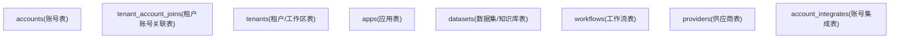
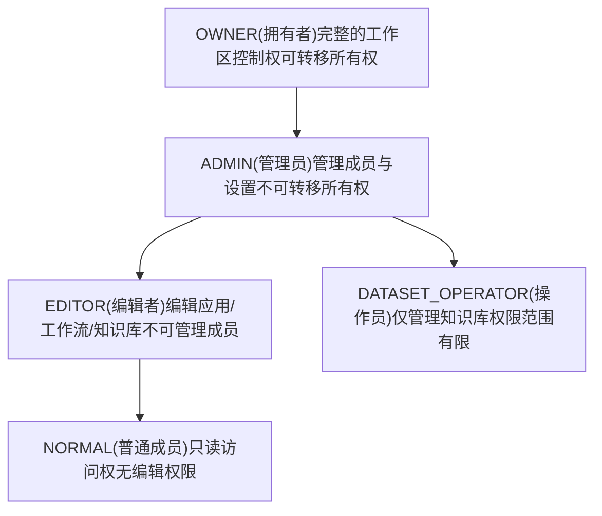
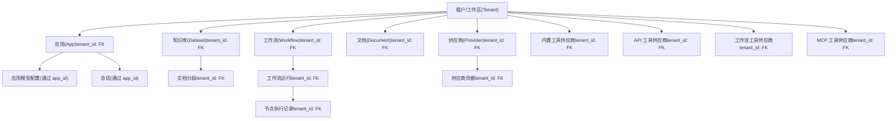

# 租户与账号模型

相关源文件

-   [api/controllers/console/__init__.py](https://github.com/langgenius/dify/blob/92dbc94f/api/controllers/console/__init__.py)
-   [api/controllers/console/auth/activate.py](https://github.com/langgenius/dify/blob/92dbc94f/api/controllers/console/auth/activate.py)
-   [api/controllers/console/auth/email_register.py](https://github.com/langgenius/dify/blob/92dbc94f/api/controllers/console/auth/email_register.py)
-   [api/controllers/console/auth/error.py](https://github.com/langgenius/dify/blob/92dbc94f/api/controllers/console/auth/error.py)
-   [api/controllers/console/auth/forgot_password.py](https://github.com/langgenius/dify/blob/92dbc94f/api/controllers/console/auth/forgot_password.py)
-   [api/controllers/console/auth/login.py](https://github.com/langgenius/dify/blob/92dbc94f/api/controllers/console/auth/login.py)
-   [api/controllers/console/auth/oauth.py](https://github.com/langgenius/dify/blob/92dbc94f/api/controllers/console/auth/oauth.py)
-   [api/controllers/console/billing/billing.py](https://github.com/langgenius/dify/blob/92dbc94f/api/controllers/console/billing/billing.py)
-   [api/controllers/console/billing/compliance.py](https://github.com/langgenius/dify/blob/92dbc94f/api/controllers/console/billing/compliance.py)
-   [api/controllers/console/error.py](https://github.com/langgenius/dify/blob/92dbc94f/api/controllers/console/error.py)
-   [api/controllers/console/feature.py](https://github.com/langgenius/dify/blob/92dbc94f/api/controllers/console/feature.py)
-   [api/controllers/console/init_validate.py](https://github.com/langgenius/dify/blob/92dbc94f/api/controllers/console/init_validate.py)
-   [api/controllers/console/setup.py](https://github.com/langgenius/dify/blob/92dbc94f/api/controllers/console/setup.py)
-   [api/controllers/console/version.py](https://github.com/langgenius/dify/blob/92dbc94f/api/controllers/console/version.py)
-   [api/controllers/console/workspace/account.py](https://github.com/langgenius/dify/blob/92dbc94f/api/controllers/console/workspace/account.py)
-   [api/controllers/console/workspace/agent_providers.py](https://github.com/langgenius/dify/blob/92dbc94f/api/controllers/console/workspace/agent_providers.py)
-   [api/controllers/console/workspace/members.py](https://github.com/langgenius/dify/blob/92dbc94f/api/controllers/console/workspace/members.py)
-   [api/controllers/console/workspace/model_providers.py](https://github.com/langgenius/dify/blob/92dbc94f/api/controllers/console/workspace/model_providers.py)
-   [api/controllers/console/workspace/models.py](https://github.com/langgenius/dify/blob/92dbc94f/api/controllers/console/workspace/models.py)
-   [api/controllers/console/workspace/workspace.py](https://github.com/langgenius/dify/blob/92dbc94f/api/controllers/console/workspace/workspace.py)
-   [api/controllers/console/wraps.py](https://github.com/langgenius/dify/blob/92dbc94f/api/controllers/console/wraps.py)
-   [api/controllers/service_api/wraps.py](https://github.com/langgenius/dify/blob/92dbc94f/api/controllers/service_api/wraps.py)
-   [api/libs/encryption.py](https://github.com/langgenius/dify/blob/92dbc94f/api/libs/encryption.py)
-   [api/libs/workspace_permission.py](https://github.com/langgenius/dify/blob/92dbc94f/api/libs/workspace_permission.py)
-   [api/models/account.py](https://github.com/langgenius/dify/blob/92dbc94f/api/models/account.py)
-   [api/models/api_based_extension.py](https://github.com/langgenius/dify/blob/92dbc94f/api/models/api_based_extension.py)
-   [api/models/dataset.py](https://github.com/langgenius/dify/blob/92dbc94f/api/models/dataset.py)
-   [api/models/model.py](https://github.com/langgenius/dify/blob/92dbc94f/api/models/model.py)
-   [api/models/oauth.py](https://github.com/langgenius/dify/blob/92dbc94f/api/models/oauth.py)
-   [api/models/provider.py](https://github.com/langgenius/dify/blob/92dbc94f/api/models/provider.py)
-   [api/models/source.py](https://github.com/langgenius/dify/blob/92dbc94f/api/models/source.py)
-   [api/models/task.py](https://github.com/langgenius/dify/blob/92dbc94f/api/models/task.py)
-   [api/models/tools.py](https://github.com/langgenius/dify/blob/92dbc94f/api/models/tools.py)
-   [api/models/trigger.py](https://github.com/langgenius/dify/blob/92dbc94f/api/models/trigger.py)
-   [api/models/web.py](https://github.com/langgenius/dify/blob/92dbc94f/api/models/web.py)
-   [api/models/workflow.py](https://github.com/langgenius/dify/blob/92dbc94f/api/models/workflow.py)
-   [api/services/account_service.py](https://github.com/langgenius/dify/blob/92dbc94f/api/services/account_service.py)
-   [api/services/billing_service.py](https://github.com/langgenius/dify/blob/92dbc94f/api/services/billing_service.py)
-   [api/services/enterprise/enterprise_service.py](https://github.com/langgenius/dify/blob/92dbc94f/api/services/enterprise/enterprise_service.py)
-   [api/services/feature_service.py](https://github.com/langgenius/dify/blob/92dbc94f/api/services/feature_service.py)
-   [api/services/operation_service.py](https://github.com/langgenius/dify/blob/92dbc94f/api/services/operation_service.py)
-   [api/templates/change_mail_confirm_old_template_zh-CN.html](https://github.com/langgenius/dify/blob/92dbc94f/api/templates/change_mail_confirm_old_template_zh-CN.html)
-   [api/templates/transfer_workspace_owner_confirm_template_en-US.html](https://github.com/langgenius/dify/blob/92dbc94f/api/templates/transfer_workspace_owner_confirm_template_en-US.html)
-   [api/templates/without-brand/transfer_workspace_owner_confirm_template_en-US.html](https://github.com/langgenius/dify/blob/92dbc94f/api/templates/without-brand/transfer_workspace_owner_confirm_template_en-US.html)
-   [api/tests/test_containers_integration_tests/services/test_advanced_prompt_template_service.py](https://github.com/langgenius/dify/blob/92dbc94f/api/tests/test_containers_integration_tests/services/test_advanced_prompt_template_service.py)
-   [api/tests/test_containers_integration_tests/services/test_agent_service.py](https://github.com/langgenius/dify/blob/92dbc94f/api/tests/test_containers_integration_tests/services/test_agent_service.py)
-   [api/tests/test_containers_integration_tests/tasks/__init__.py](https://github.com/langgenius/dify/blob/92dbc94f/api/tests/test_containers_integration_tests/tasks/__init__.py)
-   [api/tests/test_containers_integration_tests/tasks/test_add_document_to_index_task.py](https://github.com/langgenius/dify/blob/92dbc94f/api/tests/test_containers_integration_tests/tasks/test_add_document_to_index_task.py)
-   [api/tests/unit_tests/controllers/console/auth/test_account_activation.py](https://github.com/langgenius/dify/blob/92dbc94f/api/tests/unit_tests/controllers/console/auth/test_account_activation.py)
-   [api/tests/unit_tests/controllers/console/auth/test_authentication_security.py](https://github.com/langgenius/dify/blob/92dbc94f/api/tests/unit_tests/controllers/console/auth/test_authentication_security.py)
-   [api/tests/unit_tests/controllers/console/auth/test_email_verification.py](https://github.com/langgenius/dify/blob/92dbc94f/api/tests/unit_tests/controllers/console/auth/test_email_verification.py)
-   [api/tests/unit_tests/controllers/console/auth/test_login_logout.py](https://github.com/langgenius/dify/blob/92dbc94f/api/tests/unit_tests/controllers/console/auth/test_login_logout.py)
-   [api/tests/unit_tests/controllers/console/auth/test_oauth.py](https://github.com/langgenius/dify/blob/92dbc94f/api/tests/unit_tests/controllers/console/auth/test_oauth.py)
-   [api/tests/unit_tests/controllers/console/auth/test_password_reset.py](https://github.com/langgenius/dify/blob/92dbc94f/api/tests/unit_tests/controllers/console/auth/test_password_reset.py)
-   [api/tests/unit_tests/controllers/console/auth/test_token_refresh.py](https://github.com/langgenius/dify/blob/92dbc94f/api/tests/unit_tests/controllers/console/auth/test_token_refresh.py)
-   [api/tests/unit_tests/controllers/test_compare_versions.py](https://github.com/langgenius/dify/blob/92dbc94f/api/tests/unit_tests/controllers/test_compare_versions.py)
-   [api/tests/unit_tests/core/test_provider_manager.py](https://github.com/langgenius/dify/blob/92dbc94f/api/tests/unit_tests/core/test_provider_manager.py)
-   [api/tests/unit_tests/libs/test_encryption.py](https://github.com/langgenius/dify/blob/92dbc94f/api/tests/unit_tests/libs/test_encryption.py)
-   [api/tests/unit_tests/libs/test_oauth_clients.py](https://github.com/langgenius/dify/blob/92dbc94f/api/tests/unit_tests/libs/test_oauth_clients.py)
-   [api/tests/unit_tests/libs/test_workspace_permission.py](https://github.com/langgenius/dify/blob/92dbc94f/api/tests/unit_tests/libs/test_workspace_permission.py)

本文档记录了实现 Dify 多租户架构的核心数据模型：`Account`（用户）、`Tenant`（工作区）和 `TenantAccountJoin`（带有角色的成员关系）。这些模型构成了整个系统中工作区隔离和用户管理的基础。

有关基于角色的权限和访问控制详情，请参阅第 7.2 节。有关 API 身份验证和安全机制，请参阅第 7.3 节。

## 目的与范围

本文档记录了实现 Dify 多租户架构的核心数据模型。系统使用三个主要模型：

-   **`Account`** - 包含身份验证凭据的个人用户记录。
-   **`Tenant`** - 作为资源隔离边界的工作区实体。
-   **`TenantAccountJoin`** - 将用户映射到工作区并分配角色的多对多关系。

所有主要资源（应用、数据集、工作流、工具、供应商）都包含一个 `tenant_id` 外键，以强制执行工作区隔离。本页涵盖：

-   数据模型定义及其关联关系。
-   工作区成员身份与角色层级。
-   成员管理操作（邀请、更新角色、移除）。
-   工作区切换与当前工作区追踪。
-   所有权转移流程。
-   资源作用域模式。
-   按租户进行的凭据加密。

有关详细的基于角色的权限检查和访问控制逻辑，请参阅第 7.2 节。有关包括 JWT 令牌和 OAuth 在内的身份验证机制，请参阅第 7.3 节。

**关键文件：**

-   [api/models/account.py19-296](https://github.com/langgenius/dify/blob/92dbc94f/api/models/account.py#L19-L296) - `Account`, `Tenant`, `TenantAccountJoin`, `TenantAccountRole` 模型。
-   [api/services/account_service.py860-1318](https://github.com/langgenius/dify/blob/92dbc94f/api/services/account_service.py#L860-L1318) - `TenantService` 和 `RegisterService` 实现。

---

## 当前工作区追踪

`TenantAccountJoin.current` 布尔标志用于追踪每个用户的活跃工作区。每个用户最多只能有一个关联记录的 `current=True`。

**登录时：**

1.  `AccountService.load_user()` 查询 `current=True` 的关联记录。
2.  如果找到，则将该租户和角色加载到 `Account` 对象中。
3.  如果未找到，则选择第一个可用的工作区并将其标记为当前工作区。
4.  会话期间每 10 分钟更新一次 `Account.last_active_at`。

**工作区切换流程：**

1.  验证用户是目标工作区的成员。
2.  将该用户的所有关联记录设置为 `current=False`。
3.  将目标关联记录设置为 `current=True`。
4.  原子化地提交事务。

**实现：**

```python
# 位于 AccountService.load_user() 中
current_tenant = db.session.query(TenantAccountJoin)
    .filter_by(account_id=account.id, current=True)
    .first()

if current_tenant:
    account.set_tenant_id(current_tenant.tenant_id)
else:
    # 自动选择第一个工作区
    available_ta = db.session.query(TenantAccountJoin)
        .filter_by(account_id=account.id)
        .order_by(TenantAccountJoin.id.asc())
        .first()
    if available_ta:
        account.set_tenant_id(available_ta.tenant_id)
        available_ta.current = True
        db.session.commit()
```
来源：[api/services/account_service.py126-159](https://github.com/langgenius/dify/blob/92dbc94f/api/services/account_service.py#L126-L159) [api/models/account.py124-174](https://github.com/langgenius/dify/blob/92dbc94f/api/models/account.py#L124-L174)

---

## 数据库表结构

### 实体关系图


**图表：多租户核心 Schema**

来源：[api/models/account.py87-325](https://github.com/langgenius/dify/blob/92dbc94f/api/models/account.py#L87-L325) [api/models/model.py78-143](https://github.com/langgenius/dify/blob/92dbc94f/api/models/model.py#L78-L143) [api/models/dataset.py44-78](https://github.com/langgenius/dify/blob/92dbc94f/api/models/dataset.py#L44-L78) [api/models/workflow.py100-140](https://github.com/langgenius/dify/blob/92dbc94f/api/models/workflow.py#L100-L140) [api/models/provider.py49-88](https://github.com/langgenius/dify/blob/92dbc94f/api/models/provider.py#L49-L88)

---

### 表定义

**`accounts` (账号表)** [api/models/account.py87-235](https://github.com/langgenius/dify/blob/92dbc94f/api/models/account.py#L87-L235)

-   **主键：** `id` (StringUUID)
-   **唯一约束：** `email`
-   **索引：** 基于 `email` 的 `account_email_idx`
-   **关键列：**
    -   `email` - 身份验证标识符。
    -   `password` - 哈希后的密码（对于 OAuth 用户可为空）。
    -   `password_salt` - 密码盐。
    -   `status` - 状态：`pending` (待定), `uninitialized` (未初始化), `active` (活跃), `banned` (封禁), `closed` (关闭)。
    -   `last_login_at`, `last_login_ip` - 登录追踪。
    -   `last_active_at` - 会话期间每 10 分钟更新一次。

**`tenants` (租户表)** [api/models/account.py242-277](https://github.com/langgenius/dify/blob/92dbc94f/api/models/account.py#L242-L277)

-   **主键：** `id` (StringUUID)
-   **无唯一性约束** - 多个工作区可以拥有相同的名称。
-   **关键列：**
    -   `name` - 工作区显示名称。
    -   `plan` - 订阅方案（默认：`'basic'`）。
    -   `status` - 状态：`normal` (正常) 或 `archive` (归档)。
    -   `encrypt_public_key` - 用于加密租户凭据的 RSA 公钥。
    -   `custom_config` - JSON 格式的配置大对象。

**`tenant_account_joins` (租户账号关联表)** [api/models/account.py279-301](https://github.com/langgenius/dify/blob/92dbc94f/api/models/account.py#L279-L301)

-   **主键：** `id` (StringUUID)
-   **唯一约束：** 通过 `unique_tenant_account_join` 实现 `(tenant_id, account_id)` 唯一。
-   **索引：**
    -   基于 `account_id` 的 `tenant_account_join_account_id_idx`。
    -   基于 `tenant_id` 的 `tenant_account_join_tenant_id_idx`。
-   **外键：**
    -   `tenant_id` → `tenants.id`
    -   `account_id` → `accounts.id`
    -   `invited_by` → `accounts.id` (可为空)
-   **关键列：**
    -   `role` - 角色：`owner` (拥有者), `admin` (管理员), `editor` (编辑者), `normal` (普通成员), `dataset_operator` (知识库操作员)。
    -   `current` - 指示活跃工作区的布尔标志（每个用户仅一个）。
    -   `invited_by` - 邀请者的账号 ID (可为空)。

**`account_integrates` (账号集成表)** [api/models/account.py304-325](https://github.com/langgenius/dify/blob/92dbc94f/api/models/account.py#L304-L325)

-   **主键：** `id` (StringUUID)
-   **唯一约束：**
    -   通过 `unique_account_provider` 实现 `(account_id, provider)` 唯一。
    -   通过 `unique_provider_open_id` 实现 `(provider, open_id)` 唯一。
-   **用途：** 将 OAuth 供应商账号（GitHub, Google）链接到 Dify 账号。

### 租户作用域资源表 (Tenant-Scoped Resource Tables)

所有主要资源表均通过 `tenant_id` 强制执行工作区隔离：

| 表名 | 租户索引 | 模型位置 |
| --- | --- | --- |
| `apps` (应用) | `app_tenant_id_idx` | [api/models/model.py78-143](https://github.com/langgenius/dify/blob/92dbc94f/api/models/model.py#L78-L143) |
| `datasets` (知识库) | `dataset_tenant_idx` | [api/models/dataset.py44-78](https://github.com/langgenius/dify/blob/92dbc94f/api/models/dataset.py#L44-L78) |
| `documents` (文档) | `document_tenant_idx` | [api/models/dataset.py353-422](https://github.com/langgenius/dify/blob/92dbc94f/api/models/dataset.py#L353-L422) |
| `document_segments` (文档分段) | (复合索引) | [api/models/dataset.py643-746](https://github.com/langgenius/dify/blob/92dbc94f/api/models/dataset.py#L643-L746) |
| `workflows` (工作流) | `workflow_version_idx` (包含 `tenant_id`) | [api/models/workflow.py100-140](https://github.com/langgenius/dify/blob/92dbc94f/api/models/workflow.py#L100-L140) |
| `workflow_runs` (工作流运行) | `workflow_run_triggerd_from_idx` (包含 `tenant_id`) | [api/models/workflow.py556-620](https://github.com/langgenius/dify/blob/92dbc94f/api/models/workflow.py#L556-L620) |
| `tool_builtin_providers` | `unique_builtin_tool_provider` (复合索引) | [api/models/tools.py68-112](https://github.com/langgenius/dify/blob/92dbc94f/api/models/tools.py#L68-L112) |
| `tool_api_providers` | `unique_api_tool_provider` (复合索引) | [api/models/tools.py120-169](https://github.com/langgenius/dify/blob/92dbc94f/api/models/tools.py#L120-L169) |
| `tool_workflow_providers` | `unique_workflow_tool_provider` (复合索引) | [api/models/tools.py216-260](https://github.com/langgenius/dify/blob/92dbc94f/api/models/tools.py#L216-L260) |
| `providers` (供应商) | `provider_tenant_id_provider_idx` | [api/models/provider.py49-88](https://github.com/langgenius/dify/blob/92dbc94f/api/models/provider.py#L49-L88) |
| `provider_credentials` | `provider_credential_tenant_id_idx` | [api/models/provider.py128-188](https://github.com/langgenius/dify/blob/92dbc94f/api/models/provider.py#L128-L188) |

来源：[api/models/account.py87-325](https://github.com/langgenius/dify/blob/92dbc94f/api/models/account.py#L87-L325) [api/models/model.py78](https://github.com/langgenius/dify/blob/92dbc94f/api/models/model.py#L78-L78) [api/models/dataset.py44-746](https://github.com/langgenius/dify/blob/92dbc94f/api/models/dataset.py#L44-L746) [api/models/workflow.py100-620](https://github.com/langgenius/dify/blob/92dbc94f/api/models/workflow.py#L100-L620) [api/models/tools.py68-260](https://github.com/langgenius/dify/blob/92dbc94f/api/models/tools.py#L68-L260) [api/models/provider.py49-188](https://github.com/langgenius/dify/blob/92dbc94f/api/models/provider.py#L49-L188)

---

## TenantAccountRole (租户账号角色) 枚举

`TenantAccountRole` 枚举 [api/models/account.py19-77](https://github.com/langgenius/dify/blob/92dbc94f/api/models/account.py#L19-L77) 定义了存储在 `tenant_account_joins.role` 中的五个等级的角色：

| 角色 | 字符串值 | 能力 |
| --- | --- | --- |
| **OWNER** (拥有者) | `"owner"` | 完整的工作区控制权、所有权转移、成员管理、所有编辑权限。 |
| **ADMIN** (管理员) | `"admin"` | 成员管理（拥有者除外）、设置、所有编辑权限。 |
| **EDITOR** (编辑者) | `"editor"` | 创建/编辑应用、工作流、知识库（无成员管理权限）。 |
| **NORMAL** (普通成员) | `"normal"` | 对工作区资源的只读访问权限。 |
| **DATASET_OPERATOR** (知识库操作员) | `"dataset_operator"` | 仅限知识库管理的专门角色。 |

### 静态验证方法

```python
class TenantAccountRole(enum.StrEnum):
    @staticmethod
    def is_privileged_role(role) -> bool:
        # 针对 OWNER 或 ADMIN 返回 True

    @staticmethod
    def is_editing_role(role) -> bool:
        # 针对 OWNER, ADMIN 或 EDITOR 返回 True

    @staticmethod
    def is_dataset_edit_role(role) -> bool:
        # 针对 OWNER, ADMIN, EDITOR 或 DATASET_OPERATOR 返回 True

    @staticmethod
    def is_non_owner_role(role) -> bool:
        # 针对除 OWNER 以外的所有角色返回 True（用于邀请成员）
```
这些方法在整个代码库中用于权限检查。详细的访问控制实现请参见第 7.2 节。

来源：[api/models/account.py19-77](https://github.com/langgenius/dify/blob/92dbc94f/api/models/account.py#L19-L77)

---

## 基于角色的访问控制 (RBAC)

### 权限层级


**图表：角色权限层级**

来源：[api/models/account.py19-77](https://github.com/langgenius/dify/blob/92dbc94f/api/models/account.py#L19-L77)

---

### 权限检查实现

控制器使用装饰器和内联检查来强制执行基于角色的权限：

**基于装饰器的检查：**

```python
@login_required
@account_initialization_required
def post(self):
    current_user, _ = current_account_with_tenant()
    if not current_user.is_admin_or_owner:
        raise Forbidden()
    # 执行特权操作
```
**服务层强制执行：**

`AccountService` 中的 `TenantService` 类在修改成员身份时强制执行权限检查：

```python
@staticmethod
def update_member_role(tenant, member, new_role, operator):
    # 检查操作者是否拥有权限
    operator_join = get_tenant_account_join(tenant.id, operator.id)
    if operator_join.role not in ['owner', 'admin']:
        raise NoPermissionError()

    # 防止非拥有者更改拥有者角色
    member_join = get_tenant_account_join(tenant.id, member.id)
    if member_join.role == 'owner' and operator_join.role != 'owner':
        raise NoPermissionError()
```
来源：[api/services/account_service.py1034-1129](https://github.com/langgenius/dify/blob/92dbc94f/api/services/account_service.py#L1034-L1129) [api/controllers/console/workspace/members.py152-182](https://github.com/langgenius/dify/blob/92dbc94f/api/controllers/console/workspace/members.py#L152-L182)

---

### 角色特定能力

| 能力 | 拥有者 (Owner) | 管理员 (Admin) | 编辑者 (Editor) | 知识库操作员 | 普通成员 (Normal) |
| --- | --- | --- | --- | --- | --- |
| 转移所有权 | ✓ | ✗ | ✗ | ✗ | ✗ |
| 添加/移除成员 | ✓ | ✓ | ✗ | ✗ | ✗ |
| 更改成员角色 | ✓ | ✓ (非拥有者) | ✗ | ✗ | ✗ |
| 配置工作区设置 | ✓ | ✓ | ✗ | ✗ | ✗ |
| 创建/编辑应用 | ✓ | ✓ | ✓ | ✗ | ✗ |
| 创建/编辑工作流 | ✓ | ✓ | ✓ | ✗ | ✗ |
| 创建/编辑知识库 | ✓ | ✓ | ✓ | ✓ | ✗ |
| 查看资源 | ✓ | ✓ | ✓ | ✓ | ✓ |

来源：[api/models/account.py38-77](https://github.com/langgenius/dify/blob/92dbc94f/api/models/account.py#L38-L77)

---

## TenantService 操作

`TenantService` 类提供工作区管理功能。它作为嵌套类实现在 `AccountService` 中，位于 [api/services/account_service.py860-1318](https://github.com/langgenius/dify/blob/92dbc94f/api/services/account_service.py#L860-L1318)。

### 创建工作区

> **[Mermaid 序列图]**
> *(图表结构无法解析)*

**图表：带有事件系统的工作区创建流程**

**TenantService 中的实现：**

```python
@staticmethod
def create_tenant(name: str) -> Tenant:
    """创建具有默认方案和状态的新租户。"""
    tenant = Tenant(name=name)
    db.session.add(tenant)
    db.session.commit()
    return tenant

@staticmethod
def create_tenant_member(tenant: Tenant, account: Account, role: str = 'normal') -> TenantAccountJoin:
    """将账号以指定角色添加到租户中。"""
    ta = TenantAccountJoin(
        tenant_id=tenant.id,
        account_id=account.id,
        role=role,
        current=True
    )
    db.session.add(ta)
    db.session.commit()
    return ta

@staticmethod
def create_owner_tenant_if_not_exist(account: Account) -> Tenant:
    """如果不存在，则为新账号创建默认工作区。"""
    available_ta = db.session.query(TenantAccountJoin)
        .filter_by(account_id=account.id)
        .first()

    if available_ta:
        return db.session.query(Tenant)
            .where(Tenant.id == available_ta.tenant_id)
            .first()

    # 创建新租户
    tenant = TenantService.create_tenant(f"{account.name} 的工作区")
    TenantService.create_tenant_member(tenant, account, role='owner')
    account.current_tenant = tenant

    tenant_was_created.send(tenant)
    return tenant
```
来源：[api/services/account_service.py860-911](https://github.com/langgenius/dify/blob/92dbc94f/api/services/account_service.py#L860-L911) [api/controllers/console/workspace/workspace.py97-148](https://github.com/langgenius/dify/blob/92dbc94f/api/controllers/console/workspace/workspace.py#L97-L148)

---

### 切换工作区

用户通过更新 `TenantAccountJoin` 中的 `current` 标志来切换工作区。每个用户在同一时间只能有一个工作区的 `current=true`。

**端点：** `POST /console/api/workspaces/switch`

**请求体：** `{"tenant_id": "<uuid>"}`

**实现流程：**

> **[Mermaid 序列图]**
> *(图表结构无法解析)*

**图表：工作区切换事务**

**TenantService.switch_tenant() 实现：**

```python
@staticmethod
def switch_tenant(account: Account, tenant_id: str):
    """切换用户的当前工作区。"""
    # 验证成员身份
    tenant_account_join = db.session.query(TenantAccountJoin)
        .filter_by(account_id=account.id, tenant_id=tenant_id)
        .first()

    if not tenant_account_join:
        raise AccountNotLinkTenantError('未找到该用户的租户。')

    # 清除所有当前的 current 标志
    db.session.query(TenantAccountJoin)
        .filter_by(account_id=account.id)
        .update({'current': False})

    # 设置新的当前工作区
    tenant_account_join.current = True
    db.session.commit()
```
**控制器实现：**

```python
class SwitchWorkspaceApi(Resource):
    @console_ns.expect(console_ns.models['SwitchWorkspacePayload'])
    @setup_required
    @login_required
    @account_initialization_required
    def post(self):
        current_user, _ = current_account_with_tenant()
        args = SwitchWorkspacePayload.model_validate(console_ns.payload)

        try:
            TenantService.switch_tenant(current_user, args.tenant_id)
        except Exception as e:
            raise AccountNotLinkTenantError("账号未关联租户")

        new_tenant = db.session.query(Tenant).get(args.tenant_id)
        return {"result": "success", "new_tenant": marshal(...)}
```
来源：[api/services/account_service.py913-970](https://github.com/langgenius/dify/blob/92dbc94f/api/services/account_service.py#L913-L970) [api/controllers/console/workspace/workspace.py179-201](https://github.com/langgenius/dify/blob/92dbc94f/api/controllers/console/workspace/workspace.py#L179-L201)

---

## 成员管理

### 邀请成员

成员邀请使用基于令牌 (token) 的电子邮件验证。该工作流同时处理新用户和现有账号。

**端点：** `POST /console/api/workspaces/current/members/invite-email`

**请求体：**

```json
{
  "emails": ["user@example.com"],
  "role": "editor",
  "language": "en-US"
}
```
**流程：**

> **[Mermaid 序列图]**
> *(图表结构无法解析)*

**图表：带有令牌流的成员邀请工作流**

**RegisterService.invite_new_member() 实现：**

```python
@staticmethod
def invite_new_member(
    tenant: Tenant,
    email: str,
    language: str,
    role: str = 'normal',
    inviter: Account | None = None
) -> str:
    """生成邀请令牌并发送电子邮件。"""
    # 检查账号是否存在
    account = db.session.query(Account).filter_by(email=email).first()

    if account:
        # 检查是否已是成员
        existing_join = db.session.query(TenantAccountJoin)
            .filter_by(tenant_id=tenant.id, account_id=account.id)
            .first()
        if existing_join:
            raise AccountAlreadyInTenantError(
                '该账号已加入工作区。'
            )

    # 生成包含邀请数据的令牌
    token = TokenManager.generate_token(
        email=email,
        token_type='invitation',
        additional_data={
            'tenant_id': tenant.id,
            'role': role,
            'inviter_id': inviter.id if inviter else None
        }
    )

    # 将邮件任务加入队列
    send_invite_member_mail_task.delay(
        language=language,
        to=email,
        token=token,
        inviter_name=inviter.name if inviter else None,
        workspace_name=tenant.name
    )

    return token
```
**带有计费检查的控制器：**

```python
class MemberInviteEmailApi(Resource):
    @console_ns.expect(console_ns.models['MemberInvitePayload'])
    @setup_required
    @login_required
    @account_initialization_required
    @cloud_edition_billing_resource_check("members")  # 检查工作区成员限制
    def post(self):
        args = MemberInvitePayload.model_validate(console_ns.payload)
        current_user, _ = current_account_with_tenant()

        # 验证角色
        if not TenantAccountRole.is_non_owner_role(args.role):
            return {"code": "invalid-role"}, 400

        # 检查成员限制
        workspace_members = FeatureService.get_features(
            tenant_id=current_user.current_tenant.id
        ).workspace_members

        if not workspace_members.is_available(len(args.emails)):
            raise WorkspaceMembersLimitExceeded()

        # 处理邀请
        invitation_results = []
        for email in args.emails:
            try:
                token = RegisterService.invite_new_member(
                    current_user.current_tenant, email, args.language,
                    role=args.role, inviter=current_user
                )
                invitation_results.append({
                    "status": "success",
                    "email": email,
                    "url": f"{console_web_url}/activate?email={email}&token={token}"
                })
            except AccountAlreadyInTenantError:
                invitation_results.append({"status": "success", "email": email})
            except Exception as e:
                invitation_results.append({"status": "failed", "email": email})

        return {"result": "success", "invitation_results": invitation_results}, 201
```
来源：[api/services/account_service.py1221-1318](https://github.com/langgenius/dify/blob/92dbc94f/api/services/account_service.py#L1221-L1318) [api/controllers/console/workspace/members.py88-145](https://github.com/langgenius/dify/blob/92dbc94f/api/controllers/console/workspace/members.py#L88-L145)

---

### 更新成员角色

**端点：** `PUT /console/api/workspaces/current/members/<member_id>/update-role`

**请求体：** `{"role": "editor"}`

**验证规则：**

-   仅 `OWNER` 和 `ADMIN` 可以更新角色。
-   非拥有者不能修改 `OWNER` 角色。
-   不能直接分配 `OWNER` 角色（需使用所有权转移流程）。
-   不能修改自己的角色。
-   角色必须有效：`admin`, `editor`, `normal`, 或 `dataset_operator`。

**TenantService.update_member_role() 实现：**

```python
@staticmethod
def update_member_role(
    tenant: Tenant,
    member: Account,
    new_role: str,
    operator: Account
):
    """在进行权限检查后更新成员角色。"""
    # 获取操作者的关联记录
    operator_join = db.session.query(TenantAccountJoin)
        .filter_by(tenant_id=tenant.id, account_id=operator.id)
        .first()

    if not operator_join or operator_join.role not in ['owner', 'admin']:
        raise NoPermissionError('只有拥有者和管理员可以更新角色')

    # 防止修改自身
    if member.id == operator.id:
        raise CannotOperateSelfError()

    # 获取成员的关联记录
    member_join = db.session.query(TenantAccountJoin)
        .filter_by(tenant_id=tenant.id, account_id=member.id)
        .first()

    if not member_join:
        raise MemberNotInTenantError()

    # 防止非拥有者修改拥有者
    if member_join.role == 'owner' and operator_join.role != 'owner':
        raise NoPermissionError('只有拥有者可以修改拥有者角色')

    # 防止直接分配拥有者角色（应使用 transfer_ownership）
    if new_role == 'owner':
        raise InvalidActionError('请使用所有权转移功能分配拥有者角色')

    # 检查角色是否已分配
    if member_join.role == new_role:
        raise RoleAlreadyAssignedError()

    # 更新角色
    member_join.role = new_role
    db.session.commit()
```
**控制器实现：**

```python
class MemberUpdateRoleApi(Resource):
    @console_ns.expect(console_ns.models['MemberRoleUpdatePayload'])
    @setup_required
    @login_required
    @account_initialization_required
    def put(self, member_id):
        args = MemberRoleUpdatePayload.model_validate(console_ns.payload)

        # 验证角色
        if not TenantAccountRole.is_valid_role(args.role):
            return {"code": "invalid-role", "message": "无效的角色"}, 400

        current_user, _ = current_account_with_tenant()
        member = db.session.get(Account, str(member_id))

        if not member:
            abort(404)

        try:
            TenantService.update_member_role(
                current_user.current_tenant,
                member,
                args.role,
                current_user
            )
        except Exception as e:
            raise ValueError(str(e))

        return {"result": "success"}
```
来源：[api/services/account_service.py1034-1129](https://github.com/langgenius/dify/blob/92dbc94f/api/services/account_service.py#L1034-L1129) [api/controllers/console/workspace/members.py179-210](https://github.com/langgenius/dify/blob/92dbc94f/api/controllers/console/workspace/members.py#L179-L210)

---

### 移除成员

**端点：** `DELETE /console/api/workspaces/current/members/<member_id>`

**规则：**

-   仅 `OWNER` 和 `ADMIN` 可以移除成员。
-   不能移除你自己。
-   不能移除工作区拥有者。
-   移除成员会删除其对应的 `TenantAccountJoin` 记录。

**TenantService.remove_member_from_tenant() 实现：**

```python
@staticmethod
def remove_member_from_tenant(
    tenant: Tenant,
    member: Account,
    operator: Account
):
    """从工作区中移除成员。"""
    # 获取操作者的关联记录
    operator_join = db.session.query(TenantAccountJoin)
        .filter_by(tenant_id=tenant.id, account_id=operator.id)
        .first()

    if not operator_join or operator_join.role not in ['owner', 'admin']:
        raise NoPermissionError('只有拥有者和管理员可以移除成员')

    # 防止移除自身
    if member.id == operator.id:
        raise CannotOperateSelfError('不能移除你自己')

    # 获取成员的关联记录
    member_join = db.session.query(TenantAccountJoin)
        .filter_by(tenant_id=tenant.id, account_id=member.id)
        .first()

    if not member_join:
        raise MemberNotInTenantError('未在工作区中找到该成员')

    # 防止移除拥有者
    if member_join.role == 'owner':
        raise NoPermissionError('不能移除工作区拥有者')

    # 删除关联记录（级联删除将处理相关数据）
    db.session.delete(member_join)
    db.session.commit()
```
**控制器实现：**

```python
class MemberCancelInviteApi(Resource):
    @setup_required
    @login_required
    @account_initialization_required
    def delete(self, member_id):
        current_user, _ = current_account_with_tenant()
        member = db.session.query(Account).where(Account.id == str(member_id)).first()

        if member is None:
            abort(404)

        try:
            TenantService.remove_member_from_tenant(
                current_user.current_tenant,
                member,
                current_user
            )
        except services.errors.account.CannotOperateSelfError as e:
            return {"code": "cannot-operate-self", "message": str(e)}, 400
        except services.errors.account.NoPermissionError as e:
            return {"code": "forbidden", "message": str(e)}, 403
        except services.errors.account.MemberNotInTenantError as e:
            return {"code": "member-not-found", "message": str(e)}, 404
        except Exception as e:
            raise ValueError(str(e))

        return {"result": "success", "tenant_id": current_user.current_tenant.id}, 200
```
来源：[api/services/account_service.py972-1032](https://github.com/langgenius/dify/blob/92dbc94f/api/services/account_service.py#L972-L1032) [api/controllers/console/workspace/members.py148-177](https://github.com/langgenius/dify/blob/92dbc94f/api/controllers/console/workspace/members.py#L148-L177)

---

## 所有权转移 (Ownership Transfer)

所有权转移采用三步验证流程，以防止意外转移：

1.  **请求：** 拥有者请求电子邮件验证码。
2.  **验证：** 拥有者输入 6 位代码以获取验证后的令牌。
3.  **转移：** 拥有者提交经验证的令牌及新拥有者的 ID。

> **[Mermaid 序列图]**
> *(图表结构无法解析)*

**图表：带有令牌验证的三步所有权转移流程**

来源：[api/services/account_service.py1131-1219](https://github.com/langgenius/dify/blob/92dbc94f/api/services/account_service.py#L1131-L1219) [api/controllers/console/workspace/members.py228-366](https://github.com/langgenius/dify/blob/92dbc94f/api/controllers/console/workspace/members.py#L228-L366)

---

### 第一阶段：请求验证码

**端点：** `POST /console/api/workspaces/current/members/send-owner-transfer-confirm-email`

**请求体：** `{"language": "en-US"}`

拥有者请求将 6 位验证码发送到其电子邮件：

**AccountService.send_owner_transfer_email() 实现：**

```python
@classmethod
def send_owner_transfer_email(
    cls,
    account: Account | None = None,
    email: str | None = None,
    language: str = "en-US",
    workspace_name: str | None = ""
) -> str:
    """生成验证码并发送电子邮件。"""
    account_email = account.email if account else email
    if account_email is None:
        raise ValueError("必须提供电子邮件。" )

    # 频率限制：每 60 秒 1 次请求
    if cls.owner_transfer_rate_limiter.is_rate_limited(account_email):
        raise OwnerTransferRateLimitExceededError(
            int(cls.owner_transfer_rate_limiter.time_window / 60)
        )

    # 生成 6 位代码
    code, token = cls.generate_owner_transfer_token(account_email, account)

    # 将邮件任务加入队列
    send_owner_transfer_confirm_task.delay(
        language=language,
        to=account_email,
        code=code,
        workspace=workspace_name or ""
    )

    cls.owner_transfer_rate_limiter.increment_rate_limit(account_email)
    return token

@classmethod
def generate_owner_transfer_token(
    cls,
    email: str,
    account: Account | None = None,
    code: str | None = None,
    additional_data: dict[str, Any] = {}
) -> tuple[str, str]:
    """生成嵌入了验证码的令牌。"""
    if not code:
        code = ''.join([str(secrets.randbelow(10)) for _ in range(6)])

    additional_data['code'] = code
    token = TokenManager.generate_token(
        account=account,
        email=email,
        token_type='owner_transfer',
        additional_data=additional_data
    )
    return code, token
```
**控制器实现：**

```python
class SendOwnerTransferEmailApi(Resource):
    @console_ns.expect(console_ns.models['OwnerTransferEmailPayload'])
    @setup_required
    @login_required
    @account_initialization_required
    @is_allow_transfer_owner  # 检查功能标志
    def post(self):
        args = OwnerTransferEmailPayload.model_validate(console_ns.payload)

        # 检查基于 IP 的频率限制
        ip_address = extract_remote_ip(request)
        if AccountService.is_email_send_ip_limit(ip_address):
            raise EmailSendIpLimitError()

        current_user, _ = current_account_with_tenant()

        # 验证当前用户是否为拥有者
        if not TenantService.is_owner(current_user, current_user.current_tenant):
            raise NotOwnerError()

        # 发送验证邮件
        token = AccountService.send_owner_transfer_email(
            account=current_user,
            email=current_user.email,
            language=args.language or "en-US",
            workspace_name=current_user.current_tenant.name
        )

        return {"result": "success", "data": token}
```
来源：[api/services/account_service.py560-690](https://github.com/langgenius/dify/blob/92dbc94f/api/services/account_service.py#L560-L690) [api/controllers/console/workspace/members.py228-265](https://github.com/langgenius/dify/blob/92dbc94f/api/controllers/console/workspace/members.py#L228-L265)

---

### 第二阶段：验证代码

**端点：** `POST /console/api/workspaces/current/members/owner-transfer-check`

**请求体：** `{"code": "123456", "token": "第一阶段获取的令牌"}`

拥有者验证代码以接收验证后的令牌：

```python
class OwnerTransferCheckApi(Resource):
    @console_ns.expect(console_ns.models['OwnerTransferCheckPayload'])
    @setup_required
    @login_required
    @account_initialization_required
    @is_allow_transfer_owner
    def post(self):
        args = OwnerTransferCheckPayload.model_validate(console_ns.payload)
        current_user, _ = current_account_with_tenant()

        # 验证拥有者
        if not TenantService.is_owner(current_user, current_user.current_tenant):
            raise NotOwnerError()

        user_email = current_user.email

        # 检查错误尝试频率限制（最多 5 次）
        if AccountService.is_owner_transfer_error_rate_limit(user_email):
            raise OwnerTransferLimitError()

        # 验证令牌和代码
        token_data = AccountService.get_owner_transfer_data(args.token)
        if token_data is None:
            raise InvalidTokenError()

        if user_email != token_data.get('email'):
            raise InvalidEmailError()

        if args.code != token_data.get('code'):
            AccountService.add_owner_transfer_error_rate_limit(user_email)
            raise EmailCodeError()

        # 代码有效 - 撤销旧令牌并生成新的验证后令牌
        AccountService.revoke_owner_transfer_token(args.token)
        _, new_token = AccountService.generate_owner_transfer_token(
            user_email, code=args.code, additional_data={}
        )

        AccountService.reset_owner_transfer_error_rate_limit(user_email)
        return {
            "is_valid": True,
            "email": token_data.get('email'),
            "token": new_token
        }
```
来源：[api/controllers/console/workspace/members.py267-309](https://github.com/langgenius/dify/blob/92dbc94f/api/controllers/console/workspace/members.py#L267-L309)

---

### 第三阶段：执行转移

**端点：** `POST /console/api/workspaces/current/members/<member_id>/owner-transfer`

**请求体：** `{"token": "第二阶段获取的验证后令牌"}`

拥有者使用验证后的令牌完成转移：

**控制器实现：**

```python
class OwnerTransfer(Resource):
    @console_ns.expect(console_ns.models['OwnerTransferPayload'])
    @setup_required
    @login_required
    @account_initialization_required
    @is_allow_transfer_owner
    def post(self, member_id):
        args = OwnerTransferPayload.model_validate(console_ns.payload)
        current_user, _ = current_account_with_tenant()

        # 验证拥有者
        if not TenantService.is_owner(current_user, current_user.current_tenant):
            raise NotOwnerError()

        # 不能转移给自己
        if current_user.id == str(member_id):
            raise CannotTransferOwnerToSelfError()

        # 验证令牌
        transfer_token_data = AccountService.get_owner_transfer_data(args.token)
        if not transfer_token_data:
            raise InvalidTokenError()

        if transfer_token_data.get('email') != current_user.email:
            raise InvalidEmailError()

        # 撤销令牌（单次有效）
        AccountService.revoke_owner_transfer_token(args.token)

        # 获取新拥有者
        member = db.session.get(Account, str(member_id))
        if not member:
            abort(404)

        # 验证新拥有者是否为成员
        if not TenantService.is_member(member, current_user.current_tenant):
            raise MemberNotInTenantError()

        # 执行转移
        TenantService.update_member_role(
            current_user.current_tenant,
            member,
            'owner',
            current_user
        )

        # 发送通知
        AccountService.send_new_owner_transfer_notify_email(
            account=member,
            email=member.email,
            workspace_name=current_user.current_tenant.name
        )

        AccountService.send_old_owner_transfer_notify_email(
            account=current_user,
            email=current_user.email,
            workspace_name=current_user.current_tenant.name,
            new_owner_email=member.email
        )

        return {"result": "success"}
```
**TenantService - 针对拥有者角色的特殊处理：**

尽管存在正常限制，`update_member_role()` 方法仍允许在转移期间将角色更改为 `owner`。原子化的数据库事务确保了一致性：

```python
# 当 new_role == 'owner' 时，在 update_member_role() 中执行：
# 1. 查找当前拥有者
current_owner_join = db.session.query(TenantAccountJoin)
    .filter_by(tenant_id=tenant.id, role='owner')
    .first()

# 2. 原子化更新（事务）
if current_owner_join:
    current_owner_join.role = 'admin'  # 将原拥有者降级为管理员

member_join.role = 'owner'  # 将新拥有者升级
db.session.commit()
```
来源：[api/services/account_service.py1131-1219](https://github.com/langgenius/dify/blob/92dbc94f/api/services/account_service.py#L1131-L1219) [api/controllers/console/workspace/members.py311-366](https://github.com/langgenius/dify/blob/92dbc94f/api/controllers/console/workspace/members.py#L311-L366)

---

## 核心数据模型

### 实体关系概览

多租户系统使用三个主要模型：`Account`（用户）、`Tenant`（工作区）和 `TenantAccountJoin`（带有角色的成员身份）。所有主要资源都引用 `tenant_id` 以实现工作区隔离。

**图表：多租户数据库 Schema**

来源：[api/models/account.py87-295](https://github.com/langgenius/dify/blob/92dbc94f/api/models/account.py#L87-L295) [api/models/model.py75-313](https://github.com/langgenius/dify/blob/92dbc94f/api/models/model.py#L75-L313) [api/models/dataset.py44-311](https://github.com/langgenius/dify/blob/92dbc94f/api/models/dataset.py#L44-L311) [api/models/workflow.py100-201](https://github.com/langgenius/dify/blob/92dbc94f/api/models/workflow.py#L100-L201) [api/models/tools.py66-367](https://github.com/langgenius/dify/blob/92dbc94f/api/models/tools.py#L66-L367)

---

### Account (账号) 模型

`Account` 模型代表个人用户。该类扩展了用于 Flask-Login 集成的 `UserMixin` 以及用于 SQLAlchemy 数据类支持的 `TypeBase`。

**数据表：** `accounts`

**关键列：**

-   **`id`**: `StringUUID`，主键。
-   **`email`**: `String(255)`，已索引，身份验证的唯一标识符。
-   **`password`**: `String(255)`，可为空（OAuth 用户可能没有密码）。
-   **`password_salt`**: `String(255)`，可为空。
-   **`status`**: `String(16)`，取值：`pending`, `uninitialized`, `active`, `banned`, `closed`。
-   **`last_login_at`**: `DateTime`，可为空。
-   **`last_active_at`**: `DateTime`，每 10 分钟自动更新一次。

**运行时属性（不存储）：**

-   **`role`**: `TenantAccountRole | None`，从当前的 `TenantAccountJoin.role` 填充。
-   **`_current_tenant`**: `Tenant | None`，通过 `set_tenant_id()` 加载。

**关键方法：**

```python
def set_tenant_id(self, tenant_id: str):
    # 从 TenantAccountJoin 加载租户和角色
    # 设置 self.role 和 self._current_tenant
```
```python
@property
def current_tenant(self) -> Tenant | None:
    return self._current_tenant

@current_tenant.setter
def current_tenant(self, tenant: Tenant):
    # 更新内部状态，并在 expire_on_commit=False 的情况下重新加载
```
```python
@property
def is_admin_or_owner(self) -> bool:
    return TenantAccountRole.is_privileged_role(self.role)

@property
def has_edit_permission(self) -> bool:
    return TenantAccountRole.is_editing_role(self.role)

@property
def is_dataset_editor(self) -> bool:
    return TenantAccountRole.is_dataset_edit_role(self.role)
```
来源：[api/models/account.py87-229](https://github.com/langgenius/dify/blob/92dbc94f/api/models/account.py#L87-L229)

---

### Tenant (租户) 模型

`Tenant` 模型代表一个工作区。每个租户拥有隔离的资源（应用、知识库、工作流）以及成员列表。

**数据表：** `tenants`

**关键列：**

-   **`id`**: `StringUUID`，主键。
-   **`name`**: `String(255)`，工作区显示名称（不唯一）。
-   **`plan`**: `String(255)`，默认为 `'basic'`（例如：`basic`, `professional`）。
-   **`status`**: `String(255)`，默认为 `'normal'`（取值：`normal`, `archive`）。
-   **`encrypt_public_key`**: `LongText`，用于加密租户特定凭据的 RSA 公钥。
-   **`custom_config`**: `LongText`，存储租户配置的 JSON 大对象。
-   **`created_at`**: `DateTime`，自动填充。
-   **`updated_at`**: `DateTime`，自动更新。

**关键方法：**

```python
def get_accounts(self) -> list[Account]:
    # 查询：SELECT accounts.* FROM accounts
    #       JOIN tenant_account_joins ON accounts.id = tenant_account_joins.account_id
    #       WHERE tenant_account_joins.tenant_id = self.id
    return list(db.session.scalars(
        select(Account).where(
            Account.id == TenantAccountJoin.account_id,
            TenantAccountJoin.tenant_id == self.id
        )
    ).all())

@property
def custom_config_dict(self) -> dict[str, Any]:
    return json.loads(self.custom_config) if self.custom_config else {}
```
来源：[api/models/account.py236-271](https://github.com/langgenius/dify/blob/92dbc94f/api/models/account.py#L236-L271)

---

### TenantAccountJoin (租户账号关联) 模型

`TenantAccountJoin` 模型实现了 `Account` 与 `Tenant` 之间的多对多关系，存储角色分配并追踪当前的当前工作区。

**数据表：** `tenant_account_joins`

**关键列：**

-   **`id`**: `StringUUID`，主键。
-   **`tenant_id`**: `StringUUID`，外键，关联 `tenants.id`。
-   **`account_id`**: `StringUUID`，外键，关联 `accounts.id`。
-   **`role`**: `String(16)`，默认为 `'normal'`（取值：`owner`, `admin`, `editor`, `normal`, `dataset_operator`）。
-   **`current`**: `Boolean`，默认为 `false`，指示用户的活跃工作区。
-   **`invited_by`**: `StringUUID`，可为空，引用 `accounts.id`。
-   **`created_at`**: `DateTime`。
-   **`updated_at`**: `DateTime`。

**表约束：**

-   **唯一性：** 通过 `unique_tenant_account_join` 实现 `(tenant_id, account_id)` 唯一 —— 每个用户在每个工作区中正好拥有一个角色。
-   **索引：** 基于 `account_id` 的 `tenant_account_join_account_id_idx`。
-   **索引：** 基于 `tenant_id` 的 `tenant_account_join_tenant_id_idx`。

**使用模式：**

```python
# 查找用户的当前工作区
current_join = db.session.query(TenantAccountJoin)
    .filter_by(account_id=user.id, current=True)
    .first()

# 切换工作区：清除所有当前的 current 标志，设置新的
db.session.query(TenantAccountJoin)
    .filter_by(account_id=user.id)
    .update({'current': False})
target_join.current = True
```
来源：[api/models/account.py273-296](https://github.com/langgenius/dify/blob/92dbc94f/api/models/account.py#L273-L296)

---

### TenantAccountRole (租户账号角色) 枚举

`TenantAccountRole` 枚举定义了五个等级的权限级别：

| 角色 | 权限 |
| --- | --- |
| **`OWNER`** | 完整控制权，包括成员管理、设置、计费和所有权转移。 |
| **`ADMIN`** | 管理成员（拥有者除外）、配置设置、管理所有资源。 |
| **`EDITOR`** | 创建和编辑应用、工作流、知识库（不能管理成员）。 |
| **`NORMAL`** | 对工作区资源的只读访问权限。 |
| **`DATASET_OPERATOR`** | 仅用于管理知识库的专门角色。 |

**角色检查方法：**

枚举提供了用于权限检查的静态方法：

```python
@staticmethod
def is_privileged_role(role) -> bool:
    # 针对 OWNER 或 ADMIN 返回 True

@staticmethod
def is_editing_role(role) -> bool:
    # 针对 OWNER, ADMIN 或 EDITOR 返回 True

@staticmethod
def is_dataset_edit_role(role) -> bool:
    # 针对 OWNER, ADMIN, EDITOR 或 DATASET_OPERATOR 返回 True
```
来源：[api/models/account.py19-77](https://github.com/langgenius/dify/blob/92dbc94f/api/models/account.py#L19-L77)

---

## 资源作用域架构

Dify 中的所有主要实体都包含一个 `tenant_id` 外键，用于强制执行工作区隔离。这种模式确保了租户之间完全的数据分离。


**图表：租户作用域资源层级结构**

来源：[api/models/model.py71-143](https://github.com/langgenius/dify/blob/92dbc94f/api/models/model.py#L71-L143) [api/models/dataset.py42-78](https://github.com/langgenius/dify/blob/92dbc94f/api/models/dataset.py#L42-L78) [api/models/workflow.py89-156](https://github.com/langgenius/dify/blob/92dbc94f/api/models/workflow.py#L89-L156) [api/models/tools.py64-335](https://github.com/langgenius/dify/blob/92dbc94f/api/models/tools.py#L64-L335) [api/models/provider.py44-118](https://github.com/langgenius/dify/blob/92dbc94f/api/models/provider.py#L44-L118)

---

### 实现模式

服务类通过在查询中使用 `tenant_id` 进行过滤，始终如一地强制执行租户作用域：

**来自 DatasetService 的示例：**

```python
# 所有知识库查询都按 tenant_id 过滤
datasets = db.session.query(Dataset)
    .filter(Dataset.tenant_id == tenant_id)
    .all()
```
**来自应用创建的示例：**

```python
app = App(
    tenant_id=tenant_id,  # 所有资源必需
    name=name,
    mode=mode,
    # ... 其他字段
)
```
`tenant_id` 字段：

-   在所有主要实体模型上**均为非空**。
-   **已索引**以提高查询性能。
-   在执行数据库操作前，在服务层进行**验证**。
-   在 API 控制器中从 `current_user.current_tenant_id` **自动提取**。

来源：[api/models/model.py76](https://github.com/langgenius/dify/blob/92dbc94f/api/models/model.py#L76-L76) [api/models/dataset.py54](https://github.com/langgenius/dify/blob/92dbc94f/api/models/dataset.py#L54-L54) [api/models/workflow.py129](https://github.com/langgenius/dify/blob/92dbc94f/api/models/workflow.py#L129-L129)

```