# 基于角色的访问控制 (RBAC)

相关源文件

-   [api/controllers/console/\_\_init\_\_.py](https://github.com/langgenius/dify/blob/92dbc94f/api/controllers/console/__init__.py)
-   [api/controllers/console/auth/activate.py](https://github.com/langgenius/dify/blob/92dbc94f/api/controllers/console/auth/activate.py)
-   [api/controllers/console/auth/email\_register.py](https://github.com/langgenius/dify/blob/92dbc94f/api/controllers/console/auth/email_register.py)
-   [api/controllers/console/auth/error.py](https://github.com/langgenius/dify/blob/92dbc94f/api/controllers/console/auth/error.py)
-   [api/controllers/console/auth/forgot\_password.py](https://github.com/langgenius/dify/blob/92dbc94f/api/controllers/console/auth/forgot_password.py)
-   [api/controllers/console/auth/login.py](https://github.com/langgenius/dify/blob/92dbc94f/api/controllers/console/auth/login.py)
-   [api/controllers/console/auth/oauth.py](https://github.com/langgenius/dify/blob/92dbc94f/api/controllers/console/auth/oauth.py)
-   [api/controllers/console/billing/billing.py](https://github.com/langgenius/dify/blob/92dbc94f/api/controllers/console/billing/billing.py)
-   [api/controllers/console/billing/compliance.py](https://github.com/langgenius/dify/blob/92dbc94f/api/controllers/console/billing/compliance.py)
-   [api/controllers/console/error.py](https://github.com/langgenius/dify/blob/92dbc94f/api/controllers/console/error.py)
-   [api/controllers/console/feature.py](https://github.com/langgenius/dify/blob/92dbc94f/api/controllers/console/feature.py)
-   [api/controllers/console/init\_validate.py](https://github.com/langgenius/dify/blob/92dbc94f/api/controllers/console/init_validate.py)
-   [api/controllers/console/setup.py](https://github.com/langgenius/dify/blob/92dbc94f/api/controllers/console/setup.py)
-   [api/controllers/console/version.py](https://github.com/langgenius/dify/blob/92dbc94f/api/controllers/console/version.py)
-   [api/controllers/console/workspace/account.py](https://github.com/langgenius/dify/blob/92dbc94f/api/controllers/console/workspace/account.py)
-   [api/controllers/console/workspace/agent\_providers.py](https://github.com/langgenius/dify/blob/92dbc94f/api/controllers/console/workspace/agent_providers.py)
-   [api/controllers/console/workspace/members.py](https://github.com/langgenius/dify/blob/92dbc94f/api/controllers/console/workspace/members.py)
-   [api/controllers/console/workspace/model\_providers.py](https://github.com/langgenius/dify/blob/92dbc94f/api/controllers/console/workspace/model_providers.py)
-   [api/controllers/console/workspace/models.py](https://github.com/langgenius/dify/blob/92dbc94f/api/controllers/console/workspace/models.py)
-   [api/controllers/console/workspace/workspace.py](https://github.com/langgenius/dify/blob/92dbc94f/api/controllers/console/workspace/workspace.py)
-   [api/controllers/console/wraps.py](https://github.com/langgenius/dify/blob/92dbc94f/api/controllers/console/wraps.py)
-   [api/controllers/service\_api/wraps.py](https://github.com/langgenius/dify/blob/92dbc94f/api/controllers/service_api/wraps.py)
-   [api/libs/encryption.py](https://github.com/langgenius/dify/blob/92dbc94f/api/libs/encryption.py)
-   [api/libs/workspace\_permission.py](https://github.com/langgenius/dify/blob/92dbc94f/api/libs/workspace_permission.py)
-   [api/services/account\_service.py](https://github.com/langgenius/dify/blob/92dbc94f/api/services/account_service.py)
-   [api/services/billing\_service.py](https://github.com/langgenius/dify/blob/92dbc94f/api/services/billing_service.py)
-   [api/services/enterprise/enterprise\_service.py](https://github.com/langgenius/dify/blob/92dbc94f/api/services/enterprise/enterprise_service.py)
-   [api/services/feature\_service.py](https://github.com/langgenius/dify/blob/92dbc94f/api/services/feature_service.py)
-   [api/services/operation\_service.py](https://github.com/langgenius/dify/blob/92dbc94f/api/services/operation_service.py)
-   [api/templates/change\_mail\_confirm\_old\_template\_zh-CN.html](https://github.com/langgenius/dify/blob/92dbc94f/api/templates/change_mail_confirm_old_template_zh-CN.html)
-   [api/templates/transfer\_workspace\_owner\_confirm\_template\_en-US.html](https://github.com/langgenius/dify/blob/92dbc94f/api/templates/transfer_workspace_owner_confirm_template_en-US.html)
-   [api/templates/without-brand/transfer\_workspace\_owner\_confirm\_template\_en-US.html](https://github.com/langgenius/dify/blob/92dbc94f/api/templates/without-brand/transfer_workspace_owner_confirm_template_en-US.html)
-   [api/tests/unit\_tests/controllers/console/auth/test\_account\_activation.py](https://github.com/langgenius/dify/blob/92dbc94f/api/tests/unit_tests/controllers/console/auth/test_account_activation.py)
-   [api/tests/unit\_tests/controllers/console/auth/test\_authentication\_security.py](https://github.com/langgenius/dify/blob/92dbc94f/api/tests/unit_tests/controllers/console/auth/test_authentication_security.py)
-   [api/tests/unit\_tests/controllers/console/auth/test\_email\_verification.py](https://github.com/langgenius/dify/blob/92dbc94f/api/tests/unit_tests/controllers/console/auth/test_email_verification.py)
-   [api/tests/unit\_tests/controllers/console/auth/test\_login\_logout.py](https://github.com/langgenius/dify/blob/92dbc94f/api/tests/unit_tests/controllers/console/auth/test_login_logout.py)
-   [api/tests/unit\_tests/controllers/console/auth/test\_oauth.py](https://github.com/langgenius/dify/blob/92dbc94f/api/tests/unit_tests/controllers/console/auth/test_oauth.py)
-   [api/tests/unit\_tests/controllers/console/auth/test\_password\_reset.py](https://github.com/langgenius/dify/blob/92dbc94f/api/tests/unit_tests/controllers/console/auth/test_password_reset.py)
-   [api/tests/unit\_tests/controllers/console/auth/test\_token\_refresh.py](https://github.com/langgenius/dify/blob/92dbc94f/api/tests/unit_tests/controllers/console/auth/test_token_refresh.py)
-   [api/tests/unit\_tests/controllers/test\_compare\_versions.py](https://github.com/langgenius/dify/blob/92dbc94f/api/tests/unit_tests/controllers/test_compare_versions.py)
-   [api/tests/unit\_tests/libs/test\_encryption.py](https://github.com/langgenius/dify/blob/92dbc94f/api/tests/unit_tests/libs/test_encryption.py)
-   [api/tests/unit\_tests/libs/test\_oauth\_clients.py](https://github.com/langgenius/dify/blob/92dbc94f/api/tests/unit_tests/libs/test_oauth_clients.py)
-   [api/tests/unit\_tests/libs/test\_workspace\_permission.py](https://github.com/langgenius/dify/blob/92dbc94f/api/tests/unit_tests/libs/test_workspace_permission.py)

本文档描述了 Dify 中的基于角色的访问控制 (RBAC) 系统，涵盖了五级角色层级、权限检查机制、知识库级别权限以及通过装饰器和服务层检查执行的授权。

## RBAC 系统概览

Dify RBAC 系统为工作区资源实现了五级角色层级和细粒度的权限管理。访问控制通过装饰器、服务层检查以及按资源划分的权限模型强制执行。

**角色层级**：五种不同的角色（`owner` (拥有者), `admin` (管理员), `editor` (编辑者), `dataset_operator` (知识库操作员), `normal` (普通成员)），权限从最高特权到最低特权级联。

**权限执行**：通过 `@is_admin_or_owner_required` 等装饰器，以及通过 `TenantService.has_roles()` 进行的服务层检查，在访问资源前执行授权验证。

**知识库权限**：三级权限模型（`only_me` (仅限自己), `all_team_members` (所有团队成员), `partial_members` (部分成员)）在资源级别控制知识库访问。

**资源隔离**：所有资源（应用、知识库、插件、模型）都作用于租户，并在 API 层强制执行基于角色的访问限制。

来源：[api/models/account.py200-250](https://github.com/langgenius/dify/blob/92dbc94f/api/models/account.py#L200-L250) [api/services/account\_service.py972-1100](https://github.com/langgenius/dify/blob/92dbc94f/api/services/account_service.py#L972-L1100) [api/controllers/console/wraps.py1-50](https://github.com/langgenius/dify/blob/92dbc94f/api/controllers/console/wraps.py#L1-L50)

## 角色层级与权限

### 五级角色系统

Dify 实现了五种角色，其权限在 `TenantAccountRole` 枚举中定义并呈级联分布：

**角色层级**（从最高特权到最低特权）：

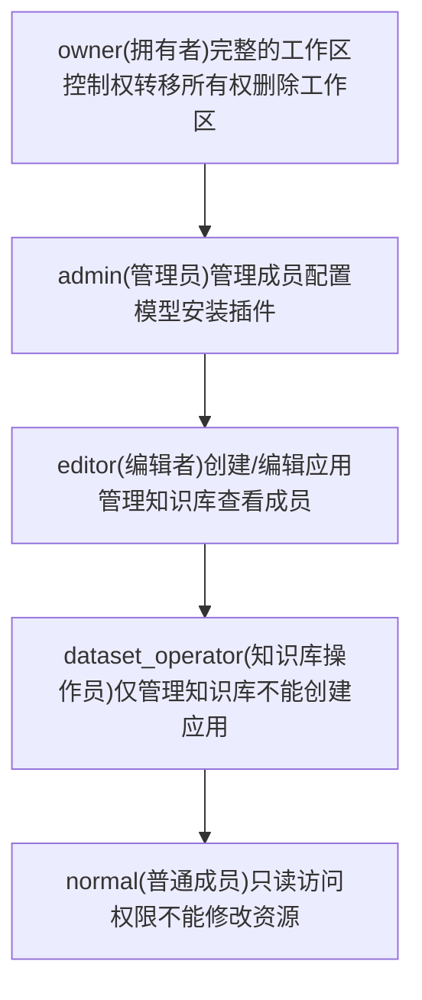
**角色权限矩阵**：

| 操作 | owner | admin | editor | dataset\_operator | normal |
| --- | --- | --- | --- | --- | --- |
| 转移所有权 | ✓ | ✗ | ✗ | ✗ | ✗ |
| 删除工作区 | ✓ | ✗ | ✗ | ✗ | ✗ |
| 管理成员 | ✓ | ✓ | ✗ | ✗ | ✗ |
| 安装插件 | ✓ | ✓ | ✗ | ✗ | ✗ |
| 配置模型 | ✓ | ✓ | ✗ | ✗ | ✗ |
| 创建/编辑应用 | ✓ | ✓ | ✓ | ✗ | ✗ |
| 管理知识库 | ✓ | ✓ | ✓ | ✓ | ✗ |
| 查看资源 | ✓ | ✓ | ✓ | ✓ | ✓ |

来源：[api/models/account.py200-250](https://github.com/langgenius/dify/blob/92dbc94f/api/models/account.py#L200-L250) [api/services/account\_service.py1130-1180](https://github.com/langgenius/dify/blob/92dbc94f/api/services/account_service.py#L1130-L1180)

### 角色检查方法

`TenantService` 提供了角色验证方法：

**TenantService 角色检查**：

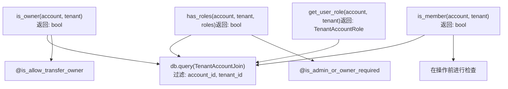
来源：[api/services/account\_service.py1130-1180](https://github.com/langgenius/dify/blob/92dbc94f/api/services/account_service.py#L1130-L1180) [api/controllers/console/wraps.py40-80](https://github.com/langgenius/dify/blob/92dbc94f/api/controllers/console/wraps.py#L40-L80)

## 权限检查系统

### 基于装饰器的授权

控制器端点使用装饰器在执行处理程序之前强制执行角色要求：

**授权装饰器流程**：

> **[Mermaid 序列图]**
> *(图表结构无法解析)*

**常用的授权装饰器**：

| 装饰器 | 所需角色 | 用途 | 文件位置 |
| --- | --- | --- | --- |
| `@is_admin_or_owner_required` | `owner`, `admin` | 模型配置、成员管理 | [api/controllers/console/wraps.py40-60](https://github.com/langgenius/dify/blob/92dbc94f/api/controllers/console/wraps.py#L40-L60) |
| `@is_allow_transfer_owner` | 仅限 `owner` | 工作区所有权转移 | [api/controllers/console/wraps.py80-100](https://github.com/langgenius/dify/blob/92dbc94f/api/controllers/console/wraps.py#L80-L100) |
| `@plugin_permission_required` | 基于具体设置 | 插件安装/调试 | [api/controllers/console/workspace/\_\_init\_\_.py30-60](https://github.com/langgenius/dify/blob/92dbc94f/api/controllers/console/workspace/__init__.py#L30-L60) |
| `@cloud_edition_billing_resource_check` | 基于订阅方案 | 功能访问权限 | [api/controllers/console/wraps.py120-150](https://github.com/langgenius/dify/blob/92dbc94f/api/controllers/console/wraps.py#L120-L150) |

来源：[api/controllers/console/wraps.py40-150](https://github.com/langgenius/dify/blob/92dbc94f/api/controllers/console/wraps.py#L40-L150) [api/controllers/console/workspace/members.py180-210](https://github.com/langgenius/dify/blob/92dbc94f/api/controllers/console/workspace/members.py#L180-L210)

### 服务层权限检查

除了装饰器外，服务层也会执行内联权限检查：

**TenantService 权限强制执行**：

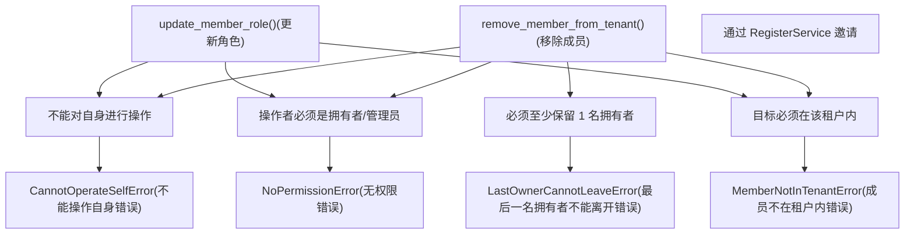
来源：[api/services/account\_service.py1181-1280](https://github.com/langgenius/dify/blob/92dbc94f/api/services/account_service.py#L1181-L1280) [api/controllers/console/workspace/members.py148-177](https://github.com/langgenius/dify/blob/92dbc94f/api/controllers/console/workspace/members.py#L148-L177)

## 知识库级权限 (Dataset-Level Permissions)

### 知识库权限模型

知识库通过 `DatasetPermission` 模型支持独立于工作区角色的细粒度访问控制：

**知识库权限级别**：

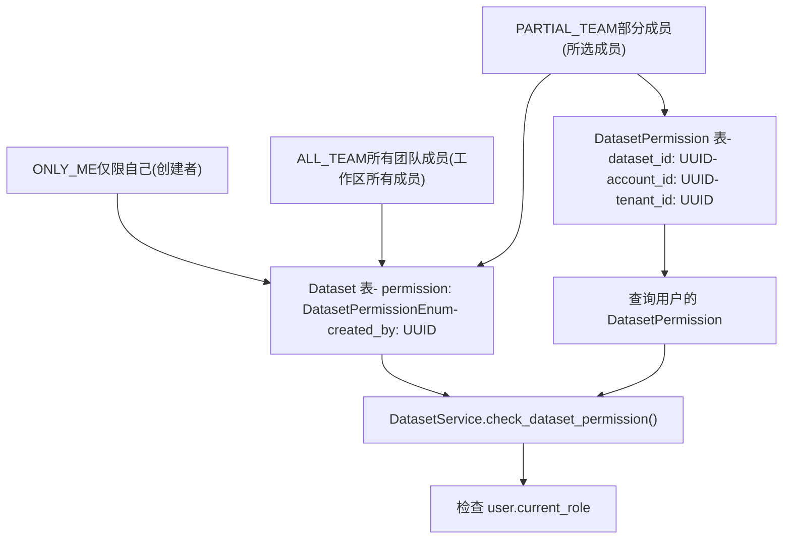
**权限级别行为**：

| 权限级别 | 创建者访问权 | 其他成员访问权 | 知识库操作员访问权 | 执行方式 |
| --- | --- | --- | --- | --- |
| `ONLY_ME` | 完全访问 | 无权访问 | 无权访问 | 在 API 层检查 |
| `ALL_TEAM` | 完全访问 | 完全访问 | 完全访问 | 租户作用域 |
| `PARTIAL_TEAM` | 完全访问 | 通过 `DatasetPermission` | 通过 `DatasetPermission` | 数据库关联 |

来源：[api/models/dataset.py1-100](https://github.com/langgenius/dify/blob/92dbc94f/api/models/dataset.py#L1-L100) [api/services/dataset\_service.py98-166](https://github.com/langgenius/dify/blob/92dbc94f/api/services/dataset_service.py#L98-L166)

### DatasetPermission 服务

`DatasetPermissionService` 管理部分团队成员列表：

**DatasetPermissionService 方法**：

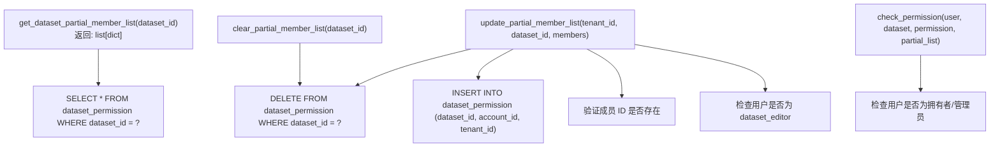
来源：[api/services/dataset\_service.py2668-2790](https://github.com/langgenius/dify/blob/92dbc94f/api/services/dataset_service.py#L2668-L2790)

### 知识库权限检查流程

在访问知识库时，系统执行权限验证：

**知识库访问验证**：

> **[Mermaid 序列图]**
> *(图表结构无法解析)*

来源：[api/services/dataset\_service.py98-166](https://github.com/langgenius/dify/blob/92dbc94f/api/services/dataset_service.py#L98-L166) [api/controllers/console/datasets/datasets\_document.py118-127](https://github.com/langgenius/dify/blob/92dbc94f/api/controllers/console/datasets/datasets_document.py#L118-L127)

## 角色分配与管理

### 添加与移除成员

`TenantService` 处理工作区成员身份操作：

**成员管理流程**：

> **[Mermaid 序列图]**
> *(图表结构无法解析)*

来源：[api/controllers/console/workspace/members.py88-145](https://github.com/langgenius/dify/blob/92dbc94f/api/controllers/console/workspace/members.py#L88-L145) [api/services/account\_service.py1055-1128](https://github.com/langgenius/dify/blob/92dbc94f/api/services/account_service.py#L1055-L1128)

### 更新成员角色

角色更新强制执行权限要求：

**角色更新流程**：

> **[Mermaid 序列图]**
> *(图表结构无法解析)*

**角色更新限制**：

| 当前角色 | 可更新为 | 操作者必须是 |
| --- | --- | --- |
| `normal` | `editor`, `dataset_operator` | `owner` 或 `admin` |
| `dataset_operator` | `editor`, `normal` | `owner` 或 `admin` |
| `editor` | `admin`, `normal`, `dataset_operator` | `owner` 或 `admin` |
| `admin` | `editor`, `normal` | 仅限 `owner` |
| `owner` | 无法通过 API 更改 | 需走所有权转移流程 |

来源：[api/services/account\_service.py1181-1250](https://github.com/langgenius/dify/blob/92dbc94f/api/services/account_service.py#L1181-L1250) [api/controllers/console/workspace/members.py179-210](https://github.com/langgenius/dify/blob/92dbc94f/api/controllers/console/workspace/members.py#L179-L210)

### 所有权转移流程 (Owner Transfer Flow)

工作区所有权转移需要通过电子邮件验证：

**所有权转移序列**：

> **[Mermaid 序列图]**
> *(图表结构无法解析)*

**安全措施**：

1.  需要电子邮件验证码。
2.  频率限制：每 60 秒 1 次尝试。
3.  错误追踪：最多 5 次验证失败。
4.  令牌在 5 分钟后过期。
5.  不能转移给自己。

来源：[api/controllers/console/workspace/members.py228-372](https://github.com/langgenius/dify/blob/92dbc94f/api/controllers/console/workspace/members.py#L228-L372) [api/services/account\_service.py561-628](https://github.com/langgenius/dify/blob/92dbc94f/api/services/account_service.py#L561-L628)

## 装饰器与中间件

### 控制器级授权

多个装饰器在执行处理程序之前强制执行授权：

**常用授权装饰器**：

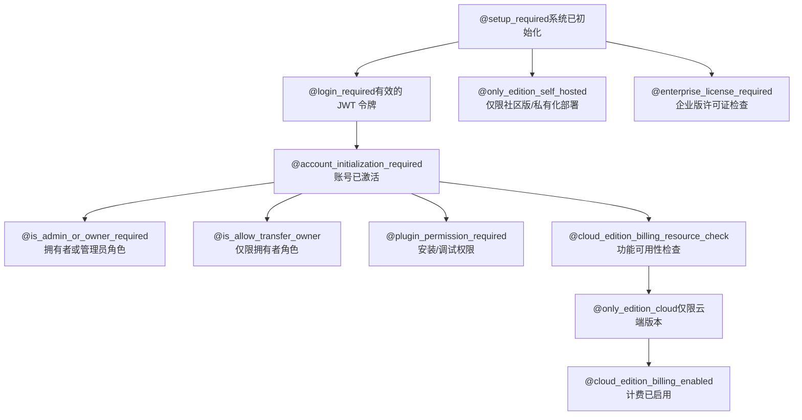
**装饰器实现详情**：

| 装饰器 | 文件位置 | 执行的检查 |
| --- | --- | --- |
| `@setup_required` | [api/controllers/console/wraps.py15-30](https://github.com/langgenius/dify/blob/92dbc94f/api/controllers/console/wraps.py#L15-L30) | 验证 `DifySetup` 是否存在 |
| `@login_required` | [libs/login.py30-60](https://github.com/langgenius/dify/blob/92dbc94f/libs/login.py#L30-L60) | 验证来自 Cookie 的 JWT |
| `@account_initialization_required` | [api/controllers/console/wraps.py35-50](https://github.com/langgenius/dify/blob/92dbc94f/api/controllers/console/wraps.py#L35-L50) | 检查 `account.status == ACTIVE` |
| `@is_admin_or_owner_required` | [api/controllers/console/wraps.py55-75](https://github.com/langgenius/dify/blob/92dbc94f/api/controllers/console/wraps.py#L55-L75) | 验证角色属于 \[`owner`, `admin`\] |
| `@cloud_edition_billing_resource_check` | [api/controllers/console/wraps.py120-160](https://github.com/langgenius/dify/blob/92dbc94f/api/controllers/console/wraps.py#L120-L160) | 调用 `FeatureService.get_features()` |

来源：[api/controllers/console/wraps.py1-180](https://github.com/langgenius/dify/blob/92dbc94f/api/controllers/console/wraps.py#L1-L180) [libs/login.py1-80](https://github.com/langgenius/dify/blob/92dbc94f/libs/login.py#L1-L80)

### 插件权限系统

插件操作需要按租户配置的特殊权限：

**插件权限模型**：

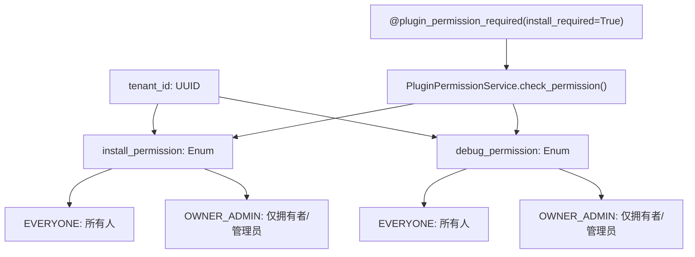
**插件权限检查流程**：

```python
@plugin_permission_required(install_required=True, debug_required=False)
def post(self):
    # 仅当用户根据租户的 install_permission 设置拥有安装权限时，
    # 处理程序才会执行。
```
来源：[api/controllers/console/workspace/\_\_init\_\_.py30-80](https://github.com/langgenius/dify/blob/92dbc94f/api/controllers/console/workspace/__init__.py#L30-L80) [api/services/plugin/plugin\_permission\_service.py1-100](https://github.com/langgenius/dify/blob/92dbc94f/api/services/plugin/plugin_permission_service.py#L1-L100) [api/models/account.py150-180](https://github.com/langgenius/dify/blob/92dbc94f/api/models/account.py#L150-L180)

## RBAC 实现总结

### 代码实体映射

下表将高层概念映射到具体的代码实体：

**RBAC 核心组件**：

| 概念 | 代码实体 | 位置 |
| --- | --- | --- |
| 角色枚举 | `TenantAccountRole` | [api/models/account.py200-210](https://github.com/langgenius/dify/blob/92dbc94f/api/models/account.py#L200-L210) |
| 成员关联表 | `TenantAccountJoin` | [api/models/account.py220-250](https://github.com/langgenius/dify/blob/92dbc94f/api/models/account.py#L220-L250) |
| 权限设置 | `TenantPluginPermission` | [api/models/account.py150-180](https://github.com/langgenius/dify/blob/92dbc94f/api/models/account.py#L150-L180) |
| 角色检查 | `TenantService.has_roles()` | [api/services/account\_service.py1130-1160](https://github.com/langgenius/dify/blob/92dbc94f/api/services/account_service.py#L1130-L1160) |
| 拥有者检查 | `TenantService.is_owner()` | [api/services/account\_service.py1165-1180](https://github.com/langgenius/dify/blob/92dbc94f/api/services/account_service.py#L1165-L1180) |
| 成员操作 | `TenantService.remove_member_from_tenant()` | [api/services/account\_service.py1181-1230](https://github.com/langgenius/dify/blob/92dbc94f/api/services/account_service.py#L1181-L1230) |
| 角色更新 | `TenantService.update_member_role()` | [api/services/account\_service.py1231-1280](https://github.com/langgenius/dify/blob/92dbc94f/api/services/account_service.py#L1231-L1280) |

**授权装饰器**：

| 装饰器 | 实现位置 | 使用示例 |
| --- | --- | --- |
| `@is_admin_or_owner_required` | [api/controllers/console/wraps.py55-75](https://github.com/langgenius/dify/blob/92dbc94f/api/controllers/console/wraps.py#L55-L75) | 模型供应商配置 |
| `@is_allow_transfer_owner` | [api/controllers/console/wraps.py80-100](https://github.com/langgenius/dify/blob/92dbc94f/api/controllers/console/wraps.py#L80-L100) | 所有权转移端点 |
| `@plugin_permission_required` | [api/controllers/console/workspace/\_\_init\_\_.py30-60](https://github.com/langgenius/dify/blob/92dbc94f/api/controllers/console/workspace/__init__.py#L30-L60) | 插件安装/调试 |
| `@cloud_edition_billing_resource_check` | [api/controllers/console/wraps.py120-160](https://github.com/langgenius/dify/blob/92dbc94f/api/controllers/console/wraps.py#L120-L160) | 成员邀请 |

**知识库权限**：

| 概念 | 代码实体 | 位置 |
| --- | --- | --- |
| 权限枚举 | `DatasetPermissionEnum` | [api/models/dataset.py30-40](https://github.com/langgenius/dify/blob/92dbc94f/api/models/dataset.py#L30-L40) |
| 权限关联表 | `DatasetPermission` | [api/models/dataset.py200-220](https://github.com/langgenius/dify/blob/92dbc94f/api/models/dataset.py#L200-L220) |
| 权限服务 | `DatasetPermissionService` | [api/services/dataset\_service.py2668-2790](https://github.com/langgenius/dify/blob/92dbc94f/api/services/dataset_service.py#L2668-L2790) |
| 权限检查 | `DatasetService.check_dataset_permission()` | [api/services/dataset\_service.py98-166](https://github.com/langgenius/dify/blob/92dbc94f/api/services/dataset_service.py#L98-L166) |
| 获取部分成员 | `get_dataset_partial_member_list()` | [api/services/dataset\_service.py2668-2700](https://github.com/langgenius/dify/blob/92dbc94f/api/services/dataset_service.py#L2668-L2700) |
| 更新部分成员 | `update_partial_member_list()` | [api/services/dataset\_service.py2701-2756](https://github.com/langgenius/dify/blob/92dbc94f/api/services/dataset_service.py#L2701-L2756) |

来源：[api/models/account.py1-300](https://github.com/langgenius/dify/blob/92dbc94f/api/models/account.py#L1-L300) [api/services/account\_service.py972-1280](https://github.com/langgenius/dify/blob/92dbc94f/api/services/account_service.py#L972-L1280) [api/controllers/console/wraps.py1-180](https://github.com/langgenius/dify/blob/92dbc94f/api/controllers/console/wraps.py#L1-L180)

### 权限检查最佳实践

**何时使用装饰器 vs 服务检查**：

1.  **使用装饰器**进行端点级授权：
    -   整个端点需要特定角色。
    -   处理程序中所有操作的权限一致。
    -   示例：模型供应商配置。
2.  **使用服务检查**进行操作特定验证：
    -   同一处理程序中的不同操作需要不同权限。
    -   权限基于资源状态动态变化。
    -   示例：成员移除（必须检查是否为最后一名拥有者）。
3.  **使用知识库权限检查**进行知识库资源访问：
    -   在进行知识库操作前调用 `check_dataset_permission()`。
    -   将角色检查与知识库级权限结合。
    -   示例：文档上传、分段创建。

**常见错误模式**：

| 错误 | 原因 | HTTP 状态码 |
| --- | --- | --- |
| `NoPermissionError` | 用户缺少所需角色或知识库权限 | 403 Forbidden |
| `MemberNotInTenantError` | 目标成员不在该工作区内 | 404 Not Found |
| `CannotOperateSelfError` | 用户尝试对自己执行非法操作 | 400 Bad Request |
| `RoleAlreadyAssignedError` | 角色未发生变更 | 400 Bad Request |

来源：[api/services/errors/account.py1-100](https://github.com/langgenius/dify/blob/92dbc94f/api/services/errors/account.py#L1-L100) [api/controllers/console/error.py1-50](https://github.com/langgenius/dify/blob/92dbc94f/api/controllers/console/error.py#L1-L50)

## 服务 API 权限系统 (Service API Permission System)

### API 令牌验证

服务 API 端点使用作用域限定为应用 (app) 或知识库 (dataset) 的 API 令牌：

**API 令牌类型与作用域**：

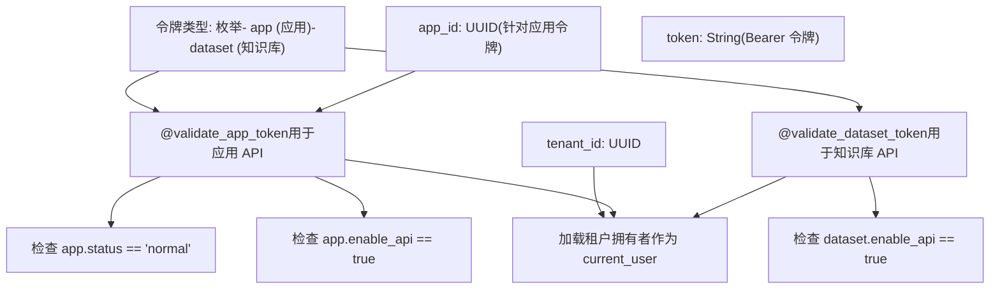
来源：[api/controllers/service\_api/wraps.py50-128](https://github.com/langgenius/dify/blob/92dbc94f/api/controllers/service_api/wraps.py#L50-L128) [api/controllers/service\_api/wraps.py219-295](https://github.com/langgenius/dify/blob/92dbc94f/api/controllers/service_api/wraps.py#L219-L295)

### 知识库 API 权限流程

知识库服务 API 会执行额外的权限检查：

**知识库服务 API 授权**：

> **[Mermaid 序列图]**
> *(图表结构无法解析)*

**服务 API 权限装饰器**：

| 装饰器 | 作用域 | 权限检查内容 | 用途 |
| --- | --- | --- | --- |
| `@validate_app_token` | 特定应用 | `app.enable_api`, `app.status` | 对话、补全 API |
| `@validate_dataset_token` | 全租户 | 针对每个知识库的 `dataset.enable_api` | 知识库操作 |
| `@cloud_edition_billing_resource_check` | 全租户 | 计费限制检查 | 文档上传、分段创建 |
| `@cloud_edition_billing_rate_limit_check` | 全租户 | 频率限制检查 | 知识库操作 |

来源：[api/controllers/service\_api/wraps.py50-295](https://github.com/langgenius/dify/blob/92dbc94f/api/controllers/service_api/wraps.py#L50-L295) [api/controllers/service\_api/dataset/document.py76-161](https://github.com/langgenius/dify/blob/92dbc94f/api/controllers/service_api/dataset/document.py#L76-L161)

### 服务 API 的权限覆盖

服务 API 调用以租户拥有者的权限执行：

**加载拥有者上下文**：

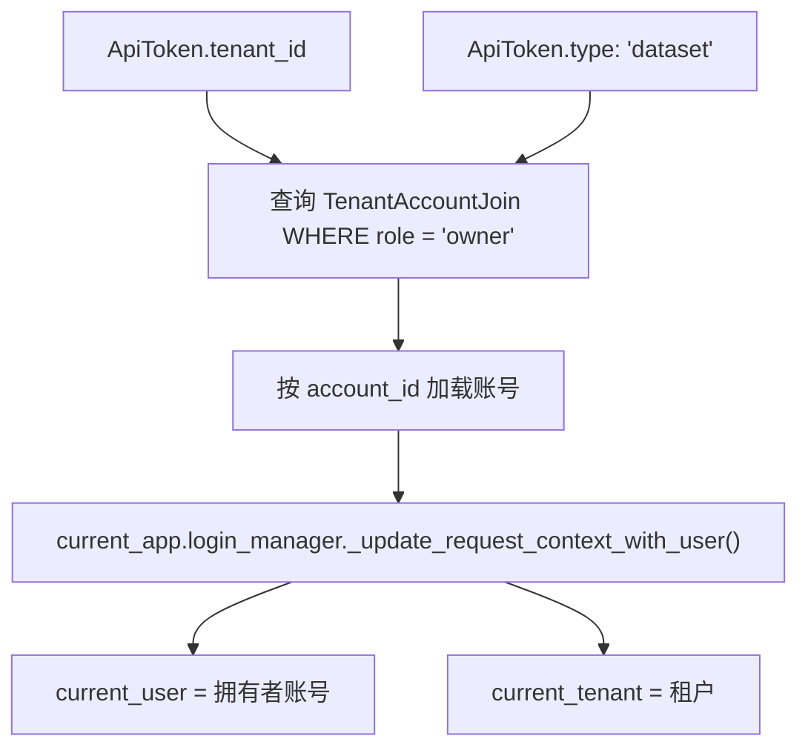
**影响**：
-   服务 API 操作以工作区拥有者的身份执行。
-   知识库权限检查使用拥有者的上下文。
-   如果拥有者创建了 `ONLY_ME` 知识库，则该知识库是可访问的。
-   如果拥有者在 `PARTIAL_TEAM` 知识库的权限列表中，则该知识库也是可访问的。

来源：[api/controllers/service\_api/wraps.py98-118](https://github.com/langgenius/dify/blob/92dbc94f/api/controllers/service_api/wraps.py#L98-L118) [api/controllers/service\_api/wraps.py265-284](https://github.com/langgenius/dify/blob/92dbc94f/api/controllers/service_api/wraps.py#L265-L284)

## SSL/TLS 配置

### Nginx SSL 终止

Nginx 反向代理负责处理 SSL/TLS 终止：

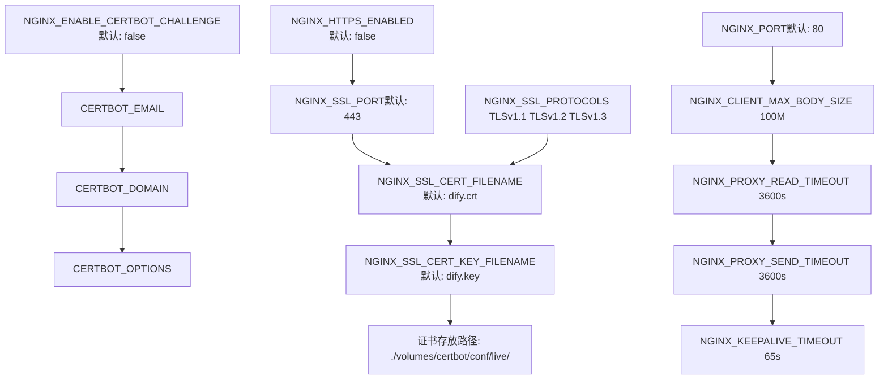
**SSL 设置过程**：
1.  设置 `NGINX_HTTPS_ENABLED=true`。
2.  将证书文件放入 `./volumes/certbot/conf/live/`。
3.  配置 `NGINX_SSL_CERT_FILENAME` 和 `NGINX_SSL_CERT_KEY_FILENAME`。
4.  （可选）启用 Certbot 以实现证书自动更新。

来源：[docker/docker-compose.yaml510-525](https://github.com/langgenius/dify/blob/92dbc94f/docker/docker-compose.yaml#L510-L525) [docker/.env.example510-525](https://github.com/langgenius/dify/blob/92dbc94f/docker/.env.example#L510-L525)

### 数据库 SSL 配置

Redis 和 PostgreSQL 均支持 SSL 连接：

**Redis SSL**：

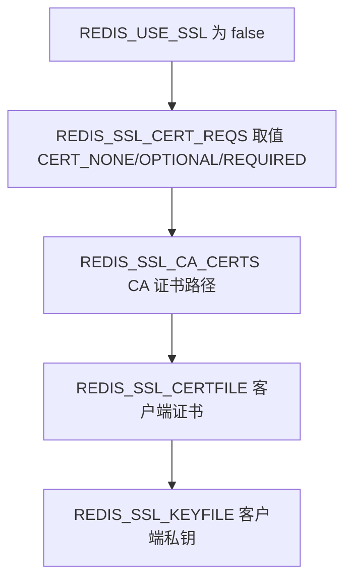
来源：[docker/docker-compose.yaml85-89](https://github.com/langgenius/dify/blob/92dbc94f/docker/docker-compose.yaml#L85-L89) [api/.env.example47-56](https://github.com/langgenius/dify/blob/92dbc94f/api/.env.example#L47-L56)

## HTTP 安全响应头 (HTTP Security Headers)

### CORS 配置

跨域资源共享 (CORS) 可针对控制台 API 和 Web API 分别进行配置：

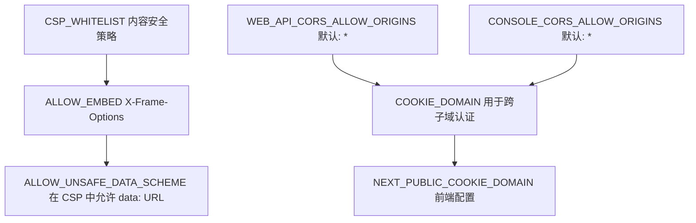
**CORS 配置表**：

| 变量 | 用途 | 默认值 | 安全影响 |
| --- | --- | --- | --- |
| `WEB_API_CORS_ALLOW_ORIGINS` | Web API 允许的来源 | `*` | `*` 允许所有来源（宽松） |
| `CONSOLE_CORS_ALLOW_ORIGINS` | 控制台 API 允许的来源 | `*` | `*` 允许所有来源（宽松） |
| `COOKIE_DOMAIN` | 跨子域认证的 Cookie 域名 | 为空 | 设置以进行子域认证 |
| `CSP_WHITELIST` | 内容安全策略白名单 | 为空 | 限制资源加载 |
| `ALLOW_EMBED` | 是否允许 iframe 嵌入 | `false` | 防止点击劫持 (clickjacking) |
| `ALLOW_UNSAFE_DATA_SCHEME` | 是否允许 data: URL | `false` | 防止通过 data URL 进行 XSS |

**生产环境建议**：在生产环境中，应设置具体的来源地址而非 `*`。

来源：[docker/docker-compose.yaml107-110](https://github.com/langgenius/dify/blob/92dbc94f/docker/docker-compose.yaml#L107-L110) [docker/docker-compose.yaml545](https://github.com/langgenius/dify/blob/92dbc94f/docker/docker-compose.yaml#L545-L545) [docker/docker-compose.yaml118-120](https://github.com/langgenius/dify/blob/92dbc94f/docker/docker-compose.yaml#L118-L120) [api/.env.example162-166](https://github.com/langgenius/dify/blob/92dbc94f/api/.env.example#L162-L166) [api/.env.example618-619](https://github.com/langgenius/dify/blob/92dbc94f/api/.env.example#L618-L619)

### X-Forward 标头

系统可以根据配置尊重复向代理标头：

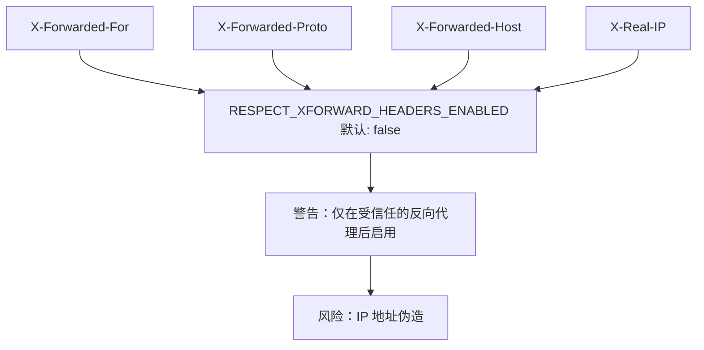
**安全警告**：在没有受信任代理的情况下启用 `RESPECT_XFORWARD_HEADERS_ENABLED` 会允许客户端伪造 IP 地址，从而绕过频率限制和基于 IP 的安全控制。

来源：[docker/docker-compose.yaml448](https://github.com/langgenius/dify/blob/92dbc94f/docker/docker-compose.yaml#L448-L448) [api/.env.example481](https://github.com/langgenius/dify/blob/92dbc94f/api/.env.example#L481-L481)

## 令牌管理 (Token Management)

### JWT 令牌结构

系统使用 JWT 令牌进行 API 身份验证：

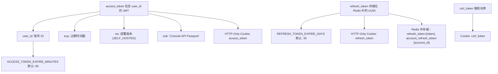
**令牌生命周期**：
1.  **Access Token (访问令牌)**：短效 JWT（60 分钟），用于 API 认证。
2.  **Refresh Token (刷新令牌)**：长效 UUID（30 天），存储在 Redis 中，用于获取新的访问令牌。
3.  **CSRF Token**：用于防止跨站请求伪造的随机令牌。

来源：[api/services/account\_service.py77-86](https://github.com/langgenius/dify/blob/92dbc94f/api/services/account_service.py#L77-L86) [api/services/account\_service.py162-173](https://github.com/langgenius/dify/blob/92dbc94f/api/services/account_service.py#L162-L173) [docker/docker-compose.yaml35-36](https://github.com/langgenius/dify/blob/92dbc94f/docker/docker-compose.yaml#L35-L36)

### 令牌刷新流程

> **[Mermaid 序列图]**
> *(图表结构无法解析)*

来源：[api/services/account\_service.py107-124](https://github.com/langgenius/dify/blob/92dbc94f/api/services/account_service.py#L107-L124) [api/controllers/console/auth/login.py200-250](https://github.com/langgenius/dify/blob/92dbc94f/api/controllers/console/auth/login.py#L200-L250)

## 管理员 API 身份验证

### 管理员 API Key

系统支持可选的管理员 API Key 身份验证，用于特权操作：

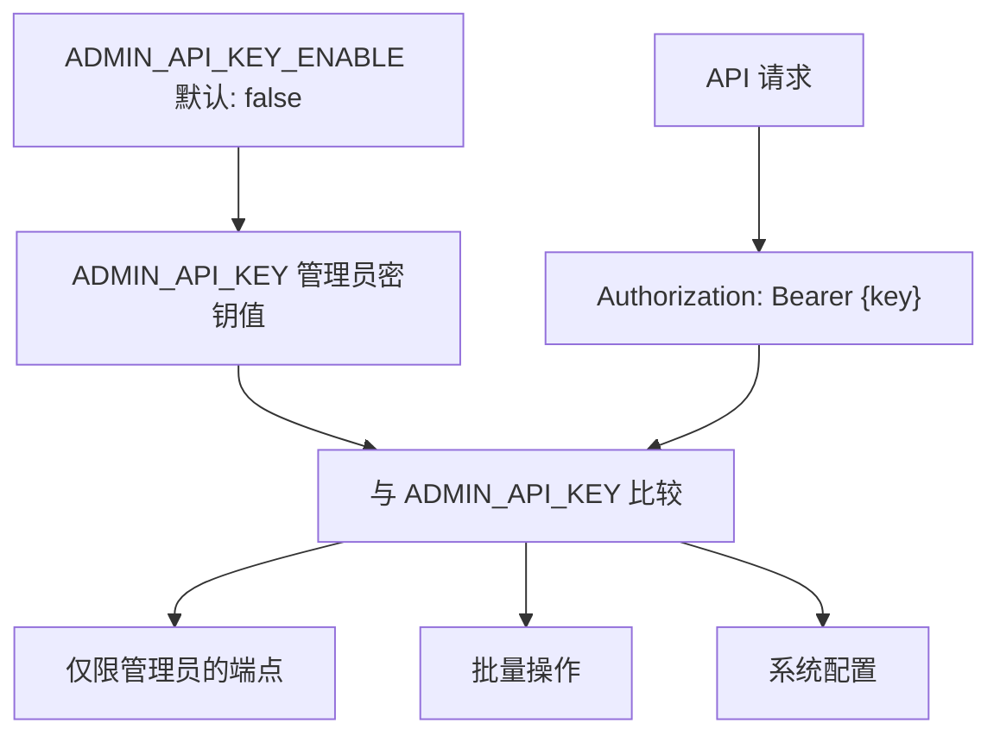
**用法**：当 `ADMIN_API_KEY_ENABLE=true` 时，受保护的管理员端点要求提供 `Authorization: Bearer {ADMIN_API_KEY}` 标头。

来源：[api/configs/feature/\_\_init\_\_.py56-64](https://github.com/langgenius/dify/blob/92dbc94f/api/configs/feature/__init__.py#L56-L64)

## 安全最佳实践总结

### 生产环境安全检查清单

| 安全领域 | 配置项 | 建议设置 |
| --- | --- | --- |
| **密钥管理** | `SECRET_KEY` | 使用 `openssl rand -base64 42` 生成 |
|  | `SANDBOX_API_KEY` | 强随机密钥 |
|  | `PLUGIN_DAEMON_KEY` | 强随机密钥 |
| **CORS** | `WEB_API_CORS_ALLOW_ORIGINS` | 指定具体来源，而非 `*` |
|  | `CONSOLE_CORS_ALLOW_ORIGINS` | 指定具体来源，而非 `*` |
| **SSL/TLS** | `NGINX_HTTPS_ENABLED` | `true` |
|  | `NGINX_SSL_PROTOCOLS` | 仅限 `TLSv1.2 TLSv1.3` |
| **代理标头** | `RESPECT_XFORWARD_HEADERS_ENABLED` | 除非在受信任代理后，否则设为 `false` |
| **频率限制** | 所有频率限制器 | 保持启用状态 |
| **SSRF 防护** | `SSRF_PROXY_HTTP_URL` | 进行配置并启用 |
| **沙箱** | `SANDBOX_ENABLE_NETWORK` | `true`（且仅配合代理使用） |
| **监控** | `ENABLE_OTEL` 或 `SENTRY_DSN` | 启用其中之一或全部 |
| **嵌入权限** | `ALLOW_EMBED` | 除非有必要，否则设为 `false` |
| **数据协议** | `ALLOW_UNSAFE_DATA_SCHEME` | `false` |
| **管理员 API** | `ADMIN_API_KEY_ENABLE` | 仅在需要时启用 |

### 深度防御层 (Defense in Depth Layers)

Dify 安全基础设施实现了深度防御体系：

1.  **边界层**：Nginx SSL 终止、CORS 策略、频率限制。
2.  **应用层**：CSRF 令牌、JWT 身份验证、会话管理。
3.  **授权层**：基于角色的访问控制、租户隔离。
4.  **执行层**：沙箱化代码执行、SSRF 代理过滤。
5.  **数据层**：凭据加密、安全 Cookie 标志、密钥管理。
6.  **监控层**：错误追踪、分布式追踪、审计日志。

来源：[api/configs/feature/\_\_init\_\_.py19-65](https://github.com/langgenius/dify/blob/92dbc94f/api/configs/feature/__init__.py#L19-L65) [docker/docker-compose.yaml510-536](https://github.com/langgenius/dify/blob/92dbc94f/docker/docker-compose.yaml#L510-L536) [api/services/account\_service.py89-105](https://github.com/langgenius/dify/blob/92dbc94f/api/services/account_service.py#L89-L105)