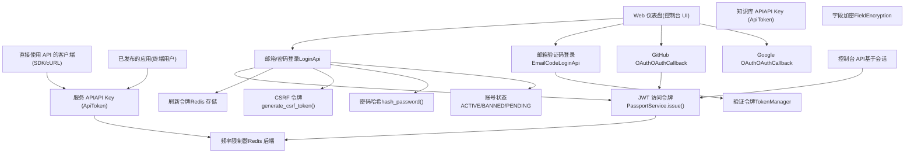
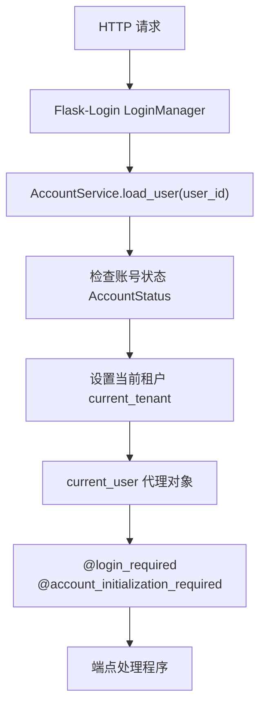
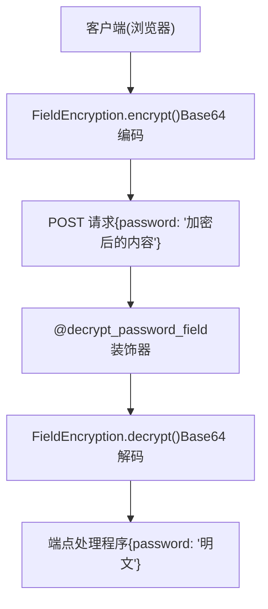
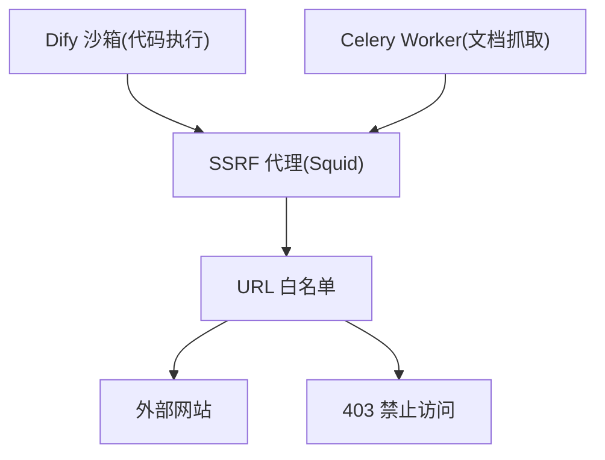

# 身份验证与安全

相关源文件

-   [api/controllers/console/__init__.py](https://github.com/langgenius/dify/blob/92dbc94f/api/controllers/console/__init__.py)
-   [api/controllers/console/auth/activate.py](https://github.com/langgenius/dify/blob/92dbc94f/api/controllers/console/auth/activate.py)
-   [api/controllers/console/auth/email_register.py](https://github.com/langgenius/dify/blob/92dbc94f/api/controllers/console/auth/email_register.py)
-   [api/controllers/console/auth/error.py](https://github.com/langgenius/dify/blob/92dbc94f/api/controllers/console/auth/error.py)
-   [api/controllers/console/auth/forgot_password.py](https://github.com/langgenius/dify/blob/92dbc94f/api/controllers/console/auth/forgot_password.py)
-   [api/controllers/console/auth/login.py](https://github.com/langgenius/dify/blob/92dbc94f/api/controllers/console/auth/login.py)
-   [api/controllers/console/auth/oauth.py](https://github.com/langgenius/dify/blob/92dbc94f/api/controllers/console/auth/oauth.py)
-   [api/controllers/console/billing/billing.py](https://github.com/langgenius/dify/blob/92dbc94f/api/controllers/console/billing/billing.py)
-   [api/controllers/console/billing/compliance.py](https://github.com/langgenius/dify/blob/92dbc94f/api/controllers/console/billing/compliance.py)
-   [api/controllers/console/error.py](https://github.com/langgenius/dify/blob/92dbc94f/api/controllers/console/error.py)
-   [api/controllers/console/feature.py](https://github.com/langgenius/dify/blob/92dbc94f/api/controllers/console/feature.py)
-   [api/controllers/console/init_validate.py](https://github.com/langgenius/dify/blob/92dbc94f/api/controllers/console/init_validate.py)
-   [api/controllers/console/setup.py](https://github.com/langgenius/dify/blob/92dbc94f/api/controllers/console/setup.py)
-   [api/controllers/console/version.py](https://github.com/langgenius/dify/blob/92dbc94f/api/controllers/console/version.py)
-   [api/controllers/console/workspace/account.py](https://github.com/langgenius/dify/blob/92dbc94f/api/controllers/console/workspace/account.py)
-   [api/controllers/console/workspace/agent_providers.py](https://github.com/langgenius/dify/blob/92dbc94f/api/controllers/console/workspace/agent_providers.py)
-   [api/controllers/console/workspace/members.py](https://github.com/langgenius/dify/blob/92dbc94f/api/controllers/console/workspace/members.py)
-   [api/controllers/console/workspace/model_providers.py](https://github.com/langgenius/dify/blob/92dbc94f/api/controllers/console/workspace/model_providers.py)
-   [api/controllers/console/workspace/models.py](https://github.com/langgenius/dify/blob/92dbc94f/api/controllers/console/workspace/models.py)
-   [api/controllers/console/workspace/workspace.py](https://github.com/langgenius/dify/blob/92dbc94f/api/controllers/console/workspace/workspace.py)
-   [api/controllers/console/wraps.py](https://github.com/langgenius/dify/blob/92dbc94f/api/controllers/console/wraps.py)
-   [api/controllers/service_api/wraps.py](https://github.com/langgenius/dify/blob/92dbc94f/api/controllers/service_api/wraps.py)
-   [api/libs/encryption.py](https://github.com/langgenius/dify/blob/92dbc94f/api/libs/encryption.py)
-   [api/libs/workspace_permission.py](https://github.com/langgenius/dify/blob/92dbc94f/api/libs/workspace_permission.py)
-   [api/services/account_service.py](https://github.com/langgenius/dify/blob/92dbc94f/api/services/account_service.py)
-   [api/services/billing_service.py](https://github.com/langgenius/dify/blob/92dbc94f/api/services/billing_service.py)
-   [api/services/enterprise/enterprise_service.py](https://github.com/langgenius/dify/blob/92dbc94f/api/services/enterprise/enterprise_service.py)
-   [api/services/feature_service.py](https://github.com/langgenius/dify/blob/92dbc94f/api/services/feature_service.py)
-   [api/services/operation_service.py](https://github.com/langgenius/dify/blob/92dbc94f/api/services/operation_service.py)
-   [api/templates/change_mail_confirm_old_template_zh-CN.html](https://github.com/langgenius/dify/blob/92dbc94f/api/templates/change_mail_confirm_old_template_zh-CN.html)
-   [api/templates/transfer_workspace_owner_confirm_template_en-US.html](https://github.com/langgenius/dify/blob/92dbc94f/api/templates/transfer_workspace_owner_confirm_template_en-US.html)
-   [api/templates/without-brand/transfer_workspace_owner_confirm_template_en-US.html](https://github.com/langgenius/dify/blob/92dbc94f/api/templates/without-brand/transfer_workspace_owner_confirm_template_en-US.html)
-   [api/tests/unit_tests/controllers/console/auth/test_account_activation.py](https://github.com/langgenius/dify/blob/92dbc94f/api/tests/unit_tests/controllers/console/auth/test_account_activation.py)
-   [api/tests/unit_tests/controllers/console/auth/test_authentication_security.py](https://github.com/langgenius/dify/blob/92dbc94f/api/tests/unit_tests/controllers/console/auth/test_authentication_security.py)
-   [api/tests/unit_tests/controllers/console/auth/test_email_verification.py](https://github.com/langgenius/dify/blob/92dbc94f/api/tests/unit_tests/controllers/console/auth/test_email_verification.py)
-   [api/tests/unit_tests/controllers/console/auth/test_login_logout.py](https://github.com/langgenius/dify/blob/92dbc94f/api/tests/unit_tests/controllers/console/auth/test_login_logout.py)
-   [api/tests/unit_tests/controllers/console/auth/test_oauth.py](https://github.com/langgenius/dify/blob/92dbc94f/api/tests/unit_tests/controllers/console/auth/test_oauth.py)
-   [api/tests/unit_tests/controllers/console/auth/test_password_reset.py](https://github.com/langgenius/dify/blob/92dbc94f/api/tests/unit_tests/controllers/console/auth/test_password_reset.py)
-   [api/tests/unit_tests/controllers/console/auth/test_token_refresh.py](https://github.com/langgenius/dify/blob/92dbc94f/api/tests/unit_tests/controllers/console/auth/test_token_refresh.py)
-   [api/tests/unit_tests/controllers/test_compare_versions.py](https://github.com/langgenius/dify/blob/92dbc94f/api/tests/unit_tests/controllers/test_compare_versions.py)
-   [api/tests/unit_tests/libs/test_encryption.py](https://github.com/langgenius/dify/blob/92dbc94f/api/tests/unit_tests/libs/test_encryption.py)
-   [api/tests/unit_tests/libs/test_oauth_clients.py](https://github.com/langgenius/dify/blob/92dbc94f/api/tests/unit_tests/libs/test_oauth_clients.py)
-   [api/tests/unit_tests/libs/test_workspace_permission.py](https://github.com/langgenius/dify/blob/92dbc94f/api/tests/unit_tests/libs/test_workspace_permission.py)

## 目的与范围

本文档描述了 Dify 中的身份验证与安全机制，包括用户身份验证方法、令牌管理、API 身份验证、频率限制和密码安全。内容涵盖了用户如何登录控制台 API (Console API，即管理界面)，以及外部客户端如何通过服务 API (Service API，即程序化访问) 进行身份验证。

有关基于角色的访问控制和工作区权限的信息，请参阅 [基于角色的访问控制](/langgenius/dify/7.2-role-based-access-control)。有关租户/工作区管理，请参阅 [租户与账号模型](/langgenius/dify/7.1-tenant-and-account-models)。有关计费和基于功能的访问控制，请参阅 [计费与功能管理](/langgenius/dify/7.4-billing-and-feature-management)。

---

## 身份验证架构概览

Dify 支持针对不同使用场景的多种身份验证方法，并实现了全面的安全控制，包括令牌管理、频率限制和密码安全。

### 身份验证系统组件


**来源：** [api/services/account_service.py88-444](https://github.com/langgenius/dify/blob/92dbc94f/api/services/account_service.py#L88-L444) [api/controllers/console/auth/login.py82-323](https://github.com/langgenius/dify/blob/92dbc94f/api/controllers/console/auth/login.py#L82-L323) [api/controllers/console/auth/oauth.py56-236](https://github.com/langgenius/dify/blob/92dbc94f/api/controllers/console/auth/oauth.py#L56-L236) [api/controllers/service_api/wraps.py50-334](https://github.com/langgenius/dify/blob/92dbc94f/api/controllers/service_api/wraps.py#L50-L334)

---

## 身份验证方法

Dify 为不同的用户类型和安全需求提供了多种身份验证方法。

### 邮箱/密码身份验证

最主要的身份验证方法，使用邮箱和密码凭据，配合基于 JWT 令牌的会话。

#### 登录流程

> **[Mermaid 序列图]**
> *(图表结构无法解析)*

**关键类与函数：**

-   **`AccountService.authenticate(email, password, invite_token)`** [api/services/account_service.py176-204](https://github.com/langgenius/dify/blob/92dbc94f/api/services/account_service.py#L176-L204) - 验证凭据并返回 Account 对象。
-   **`AccountService.login(account, ip_address)`** [api/services/account_service.py398-412](https://github.com/langgenius/dify/blob/92dbc94f/api/services/account_service.py#L398-L412) - 生成令牌对并更新登录信息。
-   **`AccountService.get_account_jwt_token(account)`** [api/services/account_service.py162-173](https://github.com/langgenius/dify/blob/92dbc94f/api/services/account_service.py#L162-L173) - 使用 `PassportService` 创建 JWT。
-   **`LoginApi.post()`** [api/controllers/console/auth/login.py88-148](https://github.com/langgenius/dify/blob/92dbc94f/api/controllers/console/auth/login.py#L88-L148) - 登录端点的具体实现。

**密码验证：**

`compare_password()` 函数 [api/libs/password.py](https://github.com/langgenius/dify/blob/92dbc94f/api/libs/password.py) 使用 PBKDF2-HMAC-SHA256 算法，并结合存储在 `Account.password_salt` 中的用户级盐值进行验证。

**令牌存储：**

```python
# 刷新令牌存储在 Redis 中，使用两个键进行双向查询
REFRESH_TOKEN_PREFIX = "refresh_token:"  # token -> account_id
ACCOUNT_REFRESH_TOKEN_PREFIX = "account_refresh_token:"  # account_id -> token
REFRESH_TOKEN_EXPIRY = timedelta(days=30)  # 可通过 REFRESH_TOKEN_EXPIRE_DAYS 配置
```
**频率限制 (Rate Limiting)：**

登录尝试受到频率限制，以防止暴力破解攻击：

-   **5 次登录失败**将触发临时锁定 [api/services/account_service.py100](https://github.com/langgenius/dify/blob/92dbc94f/api/services/account_service.py#L100-L100)。
-   锁定时间通过 `LOGIN_LOCKOUT_DURATION` 环境变量配置 [api/services/account_service.py807](https://github.com/langgenius/dify/blob/92dbc94f/api/services/account_service.py#L807-L807)。
-   频率限制键：Redis 中的 `login_error_rate_limit:{email}`。

**来源：** [api/services/account_service.py176-204](https://github.com/langgenius/dify/blob/92dbc94f/api/services/account_service.py#L176-L204) [api/services/account_service.py398-412](https://github.com/langgenius/dify/blob/92dbc94f/api/services/account_service.py#L398-L412) [api/controllers/console/auth/login.py82-148](https://github.com/langgenius/dify/blob/92dbc94f/api/controllers/console/auth/login.py#L82-L148) [api/libs/password.py](https://github.com/langgenius/dify/blob/92dbc94f/api/libs/password.py)

---

### OAuth 身份验证

Dify 支持 GitHub 和 Google 供应商的 OAuth 2.0 身份验证。

#### OAuth 配置

OAuth 供应商通过环境变量配置，并在 `get_oauth_providers()` 中实例化：

| 供应商 | Client ID 变量 | Client Secret 变量 | 重定向 URI |
| --- | --- | --- | --- |
| GitHub | `GITHUB_CLIENT_ID` | `GITHUB_CLIENT_SECRET` | `/console/api/oauth/authorize/github` |
| Google | `GOOGLE_CLIENT_ID` | `GOOGLE_CLIENT_SECRET` | `/console/api/oauth/authorize/google` |

**来源：** [api/controllers/console/auth/oauth.py33-53](https://github.com/langgenius/dify/blob/92dbc94f/api/controllers/console/auth/oauth.py#L33-L53)

#### OAuth 流程

> **[Mermaid 序列图]**
> *(图表结构无法解析)*

**关键组件：**

-   **`OAuthLogin.get(provider)`** [api/controllers/console/auth/oauth.py65-74](https://github.com/langgenius/dify/blob/92dbc94f/api/controllers/console/auth/oauth.py#L65-L74) - 启动 OAuth 流程。
-   **`OAuthCallback.get(provider)`** [api/controllers/console/auth/oauth.py90-172](https://github.com/langgenius/dify/blob/92dbc94f/api/controllers/console/auth/oauth.py#L90-L172) - 处理 OAuth 回调。
-   **`_generate_account(provider, user_info)`** [api/controllers/console/auth/oauth.py185-235](https://github.com/langgenius/dify/blob/92dbc94f/api/controllers/console/auth/oauth.py#L185-L235) - 创建或链接账号。
-   **`GitHubOAuth`** 与 **`GoogleOAuth`** [api/libs/oauth.py](https://github.com/langgenius/dify/blob/92dbc94f/api/libs/oauth.py) - OAuth 客户端实现。

**账号链接：**

OAuth 账号通过 `AccountIntegrate` 表进行链接：

```python
class AccountIntegrate:
    account_id: str       # 指向 Account 的外键
    provider: str         # "github" 或 "google"
    open_id: str          # 供应商唯一的系统用户 ID
    encrypted_token: str  # OAuth 访问令牌 (已加密)
```
**来源：** [api/controllers/console/auth/oauth.py56-236](https://github.com/langgenius/dify/blob/92dbc94f/api/controllers/console/auth/oauth.py#L56-L236) [api/libs/oauth.py](https://github.com/langgenius/dify/blob/92dbc94f/api/libs/oauth.py) [api/services/account_service.py333-357](https://github.com/langgenius/dify/blob/92dbc94f/api/services/account_service.py#L333-L357)

---

### 邮箱验证码（无密码）登录

用户可以使用发送到其邮箱的 6 位验证码进行身份验证。

#### 邮箱验证码流程

> **[Mermaid 序列图]**
> *(图表结构无法解析)*

**频率限制：**

邮箱验证码登录具有多个频率限制层级：

| 限制类型 | 限制次数 | 时间窗口 | 键名模式 |
| --- | --- | --- | --- |
| 单个邮箱的邮件发送 | 3 次尝试 | 5 分钟 | `email_code_login_rate_limit` |
| 单个 IP 的邮件发送（每分钟） | 可配置 | 1 分钟 | `email_send_ip_limit_minute:{ip}` |
| 单个 IP 的邮件发送（每小时） | 可配置 | 1 小时 | `email_send_ip_limit_hour:{ip}` |

**来源：** [api/controllers/console/auth/login.py200-298](https://github.com/langgenius/dify/blob/92dbc94f/api/controllers/console/auth/login.py#L200-L298) [api/services/account_service.py725-772](https://github.com/langgenius/dify/blob/92dbc94f/api/services/account_service.py#L725-L772)

---

## 令牌管理 (Token Management)

Dify 针对不同的安全目的使用多种令牌类型。

### 令牌类型及其用途

| 令牌类型 | 存储位置 | 有效期 | 用途 |
| --- | --- | --- | --- |
| JWT 访问令牌 | HTTP-only Cookie | 可配置（默认 30 分钟） | API 身份验证 |
| 刷新令牌 (Refresh Token) | Redis + HTTP-only Cookie | 30 天 | 令牌续期 |
| CSRF 令牌 | Cookie (非 HTTP-only) | 会话期间 | CSRF 防护 |
| 邮箱验证令牌 | Redis | 10 分钟 | 邮箱验证码 |
| 密码重置令牌 | Redis | 10 分钟 | 密码重置代码 |
| 邀请令牌 | 数据库 | 直到被使用 | 账号激活 |

**来源：** [api/services/account_service.py77-86](https://github.com/langgenius/dify/blob/92dbc94f/api/services/account_service.py#L77-L86) [api/libs/helper.py](https://github.com/langgenius/dify/blob/92dbc94f/api/libs/helper.py)

### JWT 访问令牌

JWT 访问令牌由 `PassportService` 签发，并包含用户身份声明。

**令牌结构：**

```python
payload = {
    "user_id": account.id,
    "exp": expiration_timestamp,
    "iss": dify_config.EDITION,  # "SELF_HOSTED", "CLOUD", 或 "ENTERPRISE"
    "sub": "Console API Passport"
}
```
**令牌生成：**

-   **`AccountService.get_account_jwt_token(account)`** [api/services/account_service.py162-173](https://github.com/langgenius/dify/blob/92dbc94f/api/services/account_service.py#L162-L173)
-   **`PassportService().issue(payload)`** [api/libs/passport.py](https://github.com/langgenius/dify/blob/92dbc94f/api/libs/passport.py)

**令牌过期：**

通过 `ACCESS_TOKEN_EXPIRE_MINUTES` 环境变量配置（默认 30 分钟）。

**来源：** [api/services/account_service.py162-173](https://github.com/langgenius/dify/blob/92dbc94f/api/services/account_service.py#L162-L173) [api/libs/passport.py](https://github.com/langgenius/dify/blob/92dbc94f/api/libs/passport.py)

### 刷新令牌 (Refresh Tokens)

刷新令牌支持长会话而无需存储敏感凭据。

**存储模式：**

```python
# 双向 Redis 键，实现高效查询
refresh_token_key = f"refresh_token:{refresh_token}"      # 映射到 account_id
account_refresh_key = f"account_refresh_token:{account_id}"  # 映射到 refresh_token

# 存储
redis_client.setex(refresh_token_key, REFRESH_TOKEN_EXPIRY, account_id)
redis_client.setex(account_refresh_key, REFRESH_TOKEN_EXPIRY, refresh_token)
```
**刷新流程：**

> **[Mermaid 序列图]**
> *(图表结构无法解析)*

**关键函数：**

-   **`AccountService.refresh_token(refresh_token)`** [api/services/account_service.py421-439](https://github.com/langgenius/dify/blob/92dbc94f/api/services/account_service.py#L421-L439)
-   **`AccountService._store_refresh_token(token, account_id)`** [api/services/account_service.py115-119](https://github.com/langgenius/dify/blob/92dbc94f/api/services/account_service.py#L115-L119)
-   **`AccountService._delete_refresh_token(token, account_id)`** [api/services/account_service.py122-124](https://github.com/langgenius/dify/blob/92dbc94f/api/services/account_service.py#L122-L124)

**来源：** [api/services/account_service.py83-86](https://github.com/langgenius/dify/blob/92dbc94f/api/services/account_service.py#L83-L86) [api/services/account_service.py421-439](https://github.com/langgenius/dify/blob/92dbc94f/api/services/account_service.py#L421-L439) [api/controllers/console/auth/login.py301-322](https://github.com/langgenius/dify/blob/92dbc94f/api/controllers/console/auth/login.py#L301-L322)

### CSRF 防护

跨站请求伪造 (CSRF) 令牌用于保护未经授权的状态变更请求。

**令牌生成：**

-   **`generate_csrf_token(account_id)`** [api/libs/token.py](https://github.com/langgenius/dify/blob/92dbc94f/api/libs/token.py) - 创建基于 HMAC 的 CSRF 令牌。
-   令牌绑定到用户会话，并在状态变更操作中进行验证。

**Cookie 配置：**

CSRF 令牌存储在非 HTTP-only 的 Cookie 中，以便 JavaScript 可以读取并将其包含在请求头中。

**来源：** [api/libs/token.py](https://github.com/langgenius/dify/blob/92dbc94f/api/libs/token.py) [api/services/account_service.py408](https://github.com/langgenius/dify/blob/92dbc94f/api/services/account_service.py#L408-L408)

### 验证令牌 (TokenManager)

`TokenManager` 类处理用于邮箱验证、密码重置等操作的短效验证令牌。

**支持的令牌类型：**

-   `reset_password` - 密码重置验证
-   `email_register` - 邮箱注册验证
-   `email_code_login` - 无密码登录验证
-   `change_email` - 邮箱更换验证
-   `owner_transfer` - 工作区拥有者转移验证
-   `account_deletion` - 账号注销验证

**Redis 中的令牌结构：**

```python
# 键名模式
key = f"verify_token:{token_type}:{token_hash}"

# 值 (JSON)
{
    "account_id": "...",  # 可选
    "email": "...",       # 可选
    "code": "123456",     # 6 位验证码
    "created_at": 1234567890,
    # ... 其他附加数据
}
```
**关键函数：**

-   **`TokenManager.generate_token(account, email, token_type, additional_data)`** [api/libs/helper.py](https://github.com/langgenius/dify/blob/92dbc94f/api/libs/helper.py)
-   **`TokenManager.get_token_data(token, token_type)`** [api/libs/helper.py](https://github.com/langgenius/dify/blob/92dbc94f/api/libs/helper.py)
-   **`TokenManager.revoke_token(token, token_type)`** [api/libs/helper.py](https://github.com/langgenius/dify/blob/92dbc94f/api/libs/helper.py)

**过期机制：**

所有验证令牌均在 10 分钟后过期。

**来源：** [api/libs/helper.py](https://github.com/langgenius/dify/blob/92dbc94f/api/libs/helper.py) [api/services/account_service.py295-300](https://github.com/langgenius/dify/blob/92dbc94f/api/services/account_service.py#L295-L300) [api/services/account_service.py630-723](https://github.com/langgenius/dify/blob/92dbc94f/api/services/account_service.py#L630-L723)

---

## API 身份验证

Dify 暴露了多个具有不同身份验证机制的 API 接口。

### 控制台 API 身份验证

控制台 API 使用基于会话的身份验证，JWT 令牌存储在 HTTP-only 的 Cookie 中。

**身份验证流程：**


**必需的装饰器：**

-   **`@setup_required`** - 确保系统已完成初始化 [api/controllers/console/wraps.py217-232](https://github.com/langgenius/dify/blob/92dbc94f/api/controllers/console/wraps.py#L217-L232)。
-   **`@login_required`** - 验证用户已通过身份验证 [api/libs/login.py](https://github.com/langgenius/dify/blob/92dbc94f/api/libs/login.py)。
-   **`@account_initialization_required`** - 确保账号状态为 ACTIVE [api/controllers/console/wraps.py39-49](https://github.com/langgenius/dify/blob/92dbc94f/api/controllers/console/wraps.py#L39-L49)。

**用户加载：**

每次请求都会调用 `load_user()` 函数来加载已认证的用户：

```python
@staticmethod
def load_user(user_id: str) -> None | Account:
    account = db.session.query(Account).filter_by(id=user_id).first()

    # 检查是否被封禁
    if account.status == AccountStatus.BANNED:
        raise Unauthorized("账号已被封禁。 সন")

    # 加载当前租户
    current_tenant = db.session.query(TenantAccountJoin)
        .filter_by(account_id=account.id, current=True).first()

    if current_tenant:
        account.set_tenant_id(current_tenant.tenant_id)

    # 每 10 分钟更新一次 last_active_at
    if naive_utc_now() - account.last_active_at > timedelta(minutes=10):
        account.last_active_at = naive_utc_now()
        db.session.commit()

    return account
```
**来源：** [api/services/account_service.py127-159](https://github.com/langgenius/dify/blob/92dbc94f/api/services/account_service.py#L127-L159) [api/libs/login.py](https://github.com/langgenius/dify/blob/92dbc94f/api/libs/login.py) [api/controllers/console/wraps.py39-49](https://github.com/langgenius/dify/blob/92dbc94f/api/controllers/console/wraps.py#L39-L49)

### 服务 API 身份验证

服务 API 使用基于 API Key 的身份验证，用于对应用和工作流的程序化访问。

#### API 令牌结构

API 令牌存储在 `ApiToken` 表中，其结构如下：

```python
class ApiToken:
    id: str
    app_id: str           # 指向 App 的外键
    tenant_id: str        # 指向 Tenant 的外键
    type: str             # "app" 或 "dataset"
    token: str            # 实际的 API Key (唯一)
    last_used_at: datetime
    created_at: datetime
```
**来源：** [api/models/model.py](https://github.com/langgenius/dify/blob/92dbc94f/api/models/model.py)

#### 验证流程

> **[Mermaid 序列图]**
> *(图表结构无法解析)*

**关键函数：**

-   **`validate_and_get_api_token(scope)`** [api/controllers/service_api/wraps.py297-333](https://github.com/langgenius/dify/blob/92dbc94f/api/controllers/service_api/wraps.py#L297-L333) - 令牌验证的核心逻辑。
-   **`@validate_app_token`** 装饰器 [api/controllers/service_api/wraps.py50-127](https://github.com/langgenius/dify/blob/92dbc94f/api/controllers/service_api/wraps.py#L50-L127) - 验证应用 API 令牌。
-   **`@validate_dataset_token`** 装饰器 [api/controllers/service_api/wraps.py219-294](https://github.com/langgenius/dify/blob/92dbc94f/api/controllers/service_api/wraps.py#L219-L294) - 验证知识库 API 令牌。

**授权标头格式：**

```
Authorization: Bearer {api_token}
```
**令牌作用域验证：**

`scope` 参数必须与令牌的 `type` 字段匹配：

-   `"app"` - 用于应用执行端点。
-   `"dataset"` - 用于知识库查询端点。

**最后使用时间追踪：**

API 令牌以 1 分钟的粒度追踪使用情况，以避免过多的数据库写入：

```python
cutoff_time = current_time - timedelta(minutes=1)
update_stmt = update(ApiToken).where(
    ApiToken.token == auth_token,
    (ApiToken.last_used_at.is_(None) | (ApiToken.last_used_at < cutoff_time)),
    ApiToken.type == scope,
).values(last_used_at=current_time)
```
**来源：** [api/controllers/service_api/wraps.py50-333](https://github.com/langgenius/dify/blob/92dbc94f/api/controllers/service_api/wraps.py#L50-L333) [api/models/model.py](https://github.com/langgenius/dify/blob/92dbc94f/api/models/model.py)

### 知识库 API 身份验证

知识库 API 令牌支持直接访问知识库查询端点。

**与应用 API 的主要区别：**

1.  令牌类型必须为 `"dataset"`。
2.  验证知识库存在且 `enable_api=True`。
3.  需要租户拥有者 (owner) 凭据。
4.  将 `tenant_id` 作为第一个参数注入到端点处理程序中。

**装饰器用法：**

```python
@validate_dataset_token
def get(self, dataset_id: str, tenant_id: str):
    # tenant_id 由装饰器注入
    dataset = self.get_dataset(dataset_id, tenant_id)
    # ...
```
**来源：** [api/controllers/service_api/wraps.py219-294](https://github.com/langgenius/dify/blob/92dbc94f/api/controllers/service_api/wraps.py#L219-L294)

---

## 频率限制与滥用防范

Dify 实现了全面的频率限制 (Rate Limiting)，以防止滥用并确保公平使用。

### RateLimiter 实现

`RateLimiter` 类提供了基于 Redis 的滑动窗口频率限制。

**类定义：**

```python
class RateLimiter:
    def __init__(self, prefix: str, max_attempts: int, time_window: int):
        self.prefix = prefix              # Redis 键前缀
        self.max_attempts = max_attempts  # 最大允许尝试次数
        self.time_window = time_window    # 以秒为单位的时间窗口

    def is_rate_limited(self, key: str) -> bool:
        """检查 key 是否超过了频率限制"""
        redis_key = f"{self.prefix}:{key}"
        count = redis_client.get(redis_key)
        return int(count or 0) > self.max_attempts

    def increment_rate_limit(self, key: str):
        """递增频率限制计数器"""
        redis_key = f"{self.prefix}:{key}"
        count = int(redis_client.get(redis_key) or 0) + 1
        redis_client.setex(redis_key, self.time_window, count)
```
**Redis 回退机制：**

所有频率限制操作都使用 `@redis_fallback` 装饰器，以便在 Redis 不可用时优雅处理：

```python
@redis_fallback(default_return=False)
def is_rate_limited(self, key: str) -> bool:
    # ... 实现
```
**来源：** [api/libs/helper.py](https://github.com/langgenius/dify/blob/92dbc94f/api/libs/helper.py) [api/extensions/ext_redis.py](https://github.com/langgenius/dify/blob/92dbc94f/api/extensions/ext_redis.py)

### 针对特定操作的频率限制

`AccountService` 为各种操作定义了频率限制器：

| 操作 | 前缀 | 最大次数 | 时间窗口 | 限制器实例 |
| --- | --- | --- | --- | --- |
| 密码重置邮件 | `reset_password_rate_limit` | 1 | 60 秒 | `reset_password_rate_limiter` |
| 邮箱注册 | `email_register_rate_limit` | 1 | 60 秒 | `email_register_rate_limiter` |
| 邮箱验证码登录 | `email_code_login_rate_limit` | 3 | 300 秒 | `email_code_login_rate_limiter` |
| 账号注销邮件 | `email_code_account_deletion_rate_limit` | 1 | 60 秒 | `email_code_account_deletion_rate_limiter` |
| 邮箱更换 | `change_email_rate_limit` | 1 | 60 秒 | `change_email_rate_limiter` |
| 拥有者转移 | `owner_transfer_rate_limit` | 1 | 60 秒 | `owner_transfer_rate_limiter` |

**声明：**

```python
class AccountService:
    reset_password_rate_limiter = RateLimiter(
        prefix="reset_password_rate_limit",
        max_attempts=1,
        time_window=60 * 1
    )
    email_code_login_rate_limiter = RateLimiter(
        prefix="email_code_login_rate_limit",
        max_attempts=3,
        time_window=300 * 1
    )
    # ... 更多限制器
```
**使用模式：**

```python
if cls.reset_password_rate_limiter.is_rate_limited(email):
    raise PasswordResetRateLimitExceededError(
        int(cls.reset_password_rate_limiter.time_window / 60)
    )

# 发送邮件
send_reset_password_mail_task.delay(email, code)

cls.reset_password_rate_limiter.increment_rate_limit(email)
```
**来源：** [api/services/account_service.py89-98](https://github.com/langgenius/dify/blob/92dbc94f/api/services/account_service.py#L89-L98) [api/services/account_service.py446-477](https://github.com/langgenius/dify/blob/92dbc94f/api/services/account_service.py#L446-L477)

### 错误频率限制 (Error Rate Limiting)

错误频率限制通过追踪失败尝试来防止暴力破解攻击。

**登录错误频率限制：**

```python
LOGIN_MAX_ERROR_LIMITS = 5  # 最大登录失败次数

@staticmethod
def add_login_error_rate_limit(email: str):
    key = f"login_error_rate_limit:{email}"
    count = int(redis_client.get(key) or 0) + 1
    redis_client.setex(key, dify_config.LOGIN_LOCKOUT_DURATION, count)

@staticmethod
def is_login_error_rate_limit(email: str) -> bool:
    key = f"login_error_rate_limit:{email}"
    count = int(redis_client.get(key) or 0)
    return count > AccountService.LOGIN_MAX_ERROR_LIMITS
```
**错误频率限制类型：**

| 操作 | 最大错误次数 | 键名模式 | 锁定时间配置 |
| --- | --- | --- | --- |
| 登录 | 5 | `login_error_rate_limit:{email}` | `LOGIN_LOCKOUT_DURATION` |
| 密码重置 | 5 | `forgot_password_error_rate_limit:{email}` | `FORGOT_PASSWORD_LOCKOUT_DURATION` |
| 邮箱注册 | 5 | `email_register_error_rate_limit:{email}` | `EMAIL_REGISTER_LOCKOUT_DURATION` |
| 邮箱更换 | 5 | `change_email_error_rate_limit:{email}` | `CHANGE_EMAIL_LOCKOUT_DURATION` |
| 拥有者转移 | 5 | `owner_transfer_error_rate_limit:{email}` | `OWNER_TRANSFER_LOCKOUT_DURATION` |

**成功后重置：**

操作成功后会清除错误计数器：

```python
AccountService.reset_login_error_rate_limit(normalized_email)
```
**来源：** [api/services/account_service.py100-104](https://github.com/langgenius/dify/blob/92dbc94f/api/services/account_service.py#L100-L104) [api/services/account_service.py800-939](https://github.com/langgenius/dify/blob/92dbc94f/api/services/account_service.py#L800-L939)

### 基于 IP 的频率限制

邮件发送操作按 IP 地址进行频率限制，以防止垃圾邮件。

**多级 IP 频率限制：**

```python
def is_email_send_ip_limit(ip_address: str) -> bool:
    minute_key = f"email_send_ip_limit_minute:{ip_address}"
    freeze_key = f"email_send_ip_limit_freeze:{ip_address}"
    hour_limit_key = f"email_send_ip_limit_hour:{ip_address}"

    # 检查 IP 是否被冻结（1 小时封禁）
    if redis_client.get(freeze_key):
        return True

    # 检查每分钟限制
    current_minute_count = int(redis_client.get(minute_key) or 0)
    if current_minute_count > dify_config.EMAIL_SEND_IP_LIMIT_PER_MINUTE:
        # 检查本小时内是否已被警告
        hour_limit_count = int(redis_client.get(hour_limit_key) or 0)
        if hour_limit_count >= 1:
            # 本小时内第二次违规 -> 冻结 IP
            redis_client.setex(freeze_key, 60 * 60, 1)
            return True
        else:
            # 第一次违规 -> 10 分钟警告期
            redis_client.setex(hour_limit_key, 60 * 10, hour_limit_count + 1)
        return True

    # 递增分钟计数器
    redis_client.setex(minute_key, 60, current_minute_count + 1)
    return False
```
**三级保护：**

1.  **每分钟限制** - 通过 `EMAIL_SEND_IP_LIMIT_PER_MINUTE` 配置。
2.  **首次违规** - 10 分钟警告期。
3.  **二次违规** - 1 小时 IP 冻结。

**来源：** [api/services/account_service.py943-980](https://github.com/langgenius/dify/blob/92dbc94f/api/services/account_service.py#L943-L980)

---

## 密码安全

Dify 实现了行业标准的密码安全实践。

### 密码哈希

密码使用 PBKDF2-HMAC-SHA256 算法和用户级盐值进行哈希处理。

**哈希生成：**

```python
def hash_password(password: str, salt: bytes) -> bytes:
    """
    使用 PBKDF2-HMAC-SHA256 进行密码哈希

    参数：
    - password: 明文密码
    - salt: 16 字节随机盐

    返回：
    - 32 字节密码哈希值
    """
    return hashlib.pbkdf2_hmac(
        'sha256',
        password.encode('utf-8'),
        salt,
        iterations=10000,  # OWASP 推荐的最低迭代次数
        dklen=32
    )
```
**存储格式：**

```python
# 生成盐
salt = secrets.token_bytes(16)
base64_salt = base64.b64encode(salt).decode()

# 哈希密码
password_hashed = hash_password(password, salt)
base64_password_hashed = base64.b64encode(password_hashed).decode()

# 存储到 Account 模型
account.password = base64_password_hashed
account.password_salt = base64_salt
```
**验证：**

```python
def compare_password(password: str, stored_hash: str, stored_salt: str) -> bool:
    """根据存储的哈希值验证密码"""
    salt = base64.b64decode(stored_salt.encode('utf-8'))
    password_hash = hash_password(password, salt)
    encoded_hash = base64.b64encode(password_hash).decode()
    return encoded_hash == stored_hash
```
**来源：** [api/libs/password.py](https://github.com/langgenius/dify/blob/92dbc94f/api/libs/password.py) [api/services/account_service.py188-193](https://github.com/langgenius/dify/blob/92dbc94f/api/services/account_service.py#L188-L193)

### 密码验证

在注册和更改密码时强制执行密码强度要求。

**验证规则：**

```python
def valid_password(password: str) -> str:
    """
    验证密码是否符合安全要求

    要求：
    - 最少 8 个字符
    - 最多 64 个字符
    - 至少包含一个大写字母
    - 至少包含一个小写字母
    - 至少包含一个数字

    异常：
    - ValueError: 如果密码不符合要求
    """
    if len(password) < 8:
        raise ValueError("密码长度必须至少为 8 个字符")
    if len(password) > 64:
        raise ValueError("密码长度不能超过 64 个字符")
    if not re.search(r'[A-Z]', password):
        raise ValueError("密码必须包含至少一个大写字母")
    if not re.search(r'[a-z]', password):
        raise ValueError("密码必须包含至少一个小写字母")
    if not re.search(r'\d', password):
        raise ValueError("密码必须包含至少一个数字")
    return password
```
**在创建账号中使用：**

```python
@staticmethod
def create_account(email: str, name: str, interface_language: str,
                  password: str | None = None, ...):
    if password:
        valid_password(password)  # 如果无效则抛出 ValueError

        salt = secrets.token_bytes(16)
        password_hashed = hash_password(password, salt)
        # ... 存储哈希后的密码
```
**来源：** [api/libs/password.py](https://github.com/langgenius/dify/blob/92dbc94f/api/libs/password.py) [api/services/account_service.py229-279](https://github.com/langgenius/dify/blob/92dbc94f/api/services/account_service.py#L229-L279)

### 密码重置流程

密码重置机制使用通过邮件发送的时效性验证码。

> **[Mermaid 序列图]**
> *(图表结构无法解析)*

**三步过程：**

1.  **发送代码** - 生成验证码并发送邮件。
2.  **验证代码** - 验证代码并签发第二阶段令牌。
3.  **重置密码** - 使用第二阶段令牌更新密码。

**安全特性：**

-   令牌在 10 分钟后过期。
-   验证码为 6 位随机数字。
-   错误频率限制防止暴力破解验证码。
-   令牌单次有效（验证成功后即撤销）。
-   两阶段流程防止令牌重放。

**来源：** [api/controllers/console/auth/forgot_password.py56-200](https://github.com/langgenius/dify/blob/92dbc94f/api/controllers/console/auth/forgot_password.py#L56-L200) [api/services/account_service.py446-477](https://github.com/langgenius/dify/blob/92dbc94f/api/services/account_service.py#L446-L477) [api/services/account_service.py630-644](https://github.com/langgenius/dify/blob/92dbc94f/api/services/account_service.py#L630-L644)

---

## 账号安全

### 账号状态管理

账号拥有一个状态字段，用于控制访问权限和能力。

**账号状态枚举：**

```python
class AccountStatus(str, Enum):
    UNINITIALIZED = "uninitialized"  # 账号已创建但未设置完成
    PENDING = "pending"              # 已邀请但未激活
    ACTIVE = "active"                # 正常的活跃账号
    BANNED = "banned"                # 被系统封禁
    CLOSED = "closed"                # 账号已被用户注销
```
**状态检查：**

`load_user()` 函数在每次请求时验证账号状态：

```python
if account.status == AccountStatus.BANNED:
    raise Unauthorized("账号已被封禁。 সন")
```
`@account_initialization_required` 装饰器阻止未初始化账号的访问：

```python
def account_initialization_required(view):
    @wraps(view)
    def decorated(*args, **kwargs):
        current_user, _ = current_account_with_tenant()
        if current_user.status == AccountStatus.UNINITIALIZED:
            raise AccountNotInitializedError()
        return view(*args, **kwargs)
    return decorated
```
**状态转换：**

> **[Mermaid 状态图]**
> *(图表结构无法解析)*

**来源：** [api/models/account.py](https://github.com/langgenius/dify/blob/92dbc94f/api/models/account.py) [api/services/account_service.py127-159](https://github.com/langgenius/dify/blob/92dbc94f/api/services/account_service.py#L127-L159) [api/controllers/console/wraps.py39-49](https://github.com/langgenius/dify/blob/92dbc94f/api/controllers/console/wraps.py#L39-L49)

### 账号注销 (Account Deletion)

账号注销是一个需要邮箱验证的两步过程。

**注销流程：**

> **[Mermaid 序列图]**
> *(图表结构无法解析)*

**关键函数：**

-   **`generate_account_deletion_verification_code(account)`** [api/services/account_service.py295-300](https://github.com/langgenius/dify/blob/92dbc94f/api/services/account_service.py#L295-L300)
-   **`verify_account_deletion_code(token, code)`** [api/services/account_service.py317-325](https://github.com/langgenius/dify/blob/92dbc94f/api/services/account_service.py#L317-L325)
-   **`delete_account(account)`** [api/services/account_service.py328-330](https://github.com/langgenius/dify/blob/92dbc94f/api/services/account_service.py#L328-L330)

**注销任务：**

实际的注销操作由 `delete_account_task` 异步执行，以避免阻塞请求：

```python
@app_celery.task(queue="dataset")
def delete_account_task(account_id: str):
    # 删除账号及其关联的所有数据
    # - 租户成员身份
    # - API 令牌
    # - 拥有的知识库
    # - 拥有的应用
    # - 会话记录
    # - 等等
```
**冻结账号期（云端版）：**

在 CLOUD 版本中，已注销账号的邮箱会被标记为“冻结” 30 天，以防止立即重新注册：

```python
if dify_config.BILLING_ENABLED and BillingService.is_email_in_freeze(email):
    raise AccountRegisterError(
        description=(
            "该邮箱账号在过去 30 天内已被注销，"
            "暂时无法用于新账号注册"
        )
    )
```
**来源：** [api/controllers/console/workspace/account.py392-423](https://github.com/langgenius/dify/blob/92dbc94f/api/controllers/console/workspace/account.py#L392-L423) [api/services/account_service.py295-330](https://github.com/langgenius/dify/blob/92dbc94f/api/services/account_service.py#L295-L330) [api/tasks/delete_account_task.py](https://github.com/langgenius/dify/blob/92dbc94f/api/tasks/delete_account_task.py)

### 冻结账号检测

计费服务追踪最近注销的账号以防止滥用。

**检测函数：**

```python
@classmethod
def is_email_in_freeze(cls, email: str) -> bool:
    params = {"email": email}
    try:
        response = cls._send_request("GET", "/account/in-freeze", params=params)
        return bool(response.get("data", False))
    except Exception:
        return False  # 如果调用失败则放行，以免误伤正常用户
```
**在注册中使用：**

```python
def create_account(email: str, name: str, ...):
    if dify_config.BILLING_ENABLED and BillingService.is_email_in_freeze(email):
        raise AccountRegisterError(
            description=(
                "该邮箱账号在过去 30 天内已被注销，"
                "暂时无法用于新账号注册"
            )
        )
    # ... 创建账号
```
**来源：** [api/services/billing_service.py171-177](https://github.com/langgenius/dify/blob/92dbc94f/api/services/billing_service.py#L171-L177) [api/services/account_service.py243-249](https://github.com/langgenius/dify/blob/92dbc94f/api/services/account_service.py#L243-L249)

---

## 安全特性

### 字段加密 (Field Encryption)

敏感数据在传输前可以使用 `FieldEncryption` 工具进行加密。

**加密工作流：**


**解密装饰器：**

```python
@decrypt_password_field
def post(self):
    args = LoginPayload.model_validate(console_ns.payload)
    # args.password 此时已是解密后的明文
```
可用装饰器：

-   **`@decrypt_password_field`** - 解密 `password` 字段 [api/controllers/console/wraps.py461-480](https://github.com/langgenius/dify/blob/92dbc94f/api/controllers/console/wraps.py#L461-L480)。
-   **`@decrypt_code_field`** - 解密 `code` 字段 [api/controllers/console/wraps.py483-502](https://github.com/langgenius/dify/blob/92dbc94f/api/controllers/console/wraps.py#L483-L502)。

**实现细节：**

`_decrypt_field()` 辅助函数会就地修改请求载荷：

```python
def _decrypt_field(field_name: str, error_class: type[Exception], error_message: str):
    if not request or not request.is_json:
        return

    payload = request.get_json()  # 缓存的可变字典
    if not payload or field_name not in payload:
        return

    encoded_value = payload[field_name]
    decoded_value = FieldEncryption.decrypt_field(encoded_value)

    if decoded_value is None:
        raise error_class(error_message)

    # 就地更新，以便后续访问能看到解密后的值
    payload[field_name] = decoded_value
```
**配置：**

加密受 `FIELD_ENCRYPTION_ENABLED` 环境变量控制。如果禁用，字段将不经修改透传。

**来源：** [api/controllers/console/wraps.py433-502](https://github.com/langgenius/dify/blob/92dbc94f/api/controllers/console/wraps.py#L433-L502) [api/libs/encryption.py](https://github.com/langgenius/dify/blob/92dbc94f/api/libs/encryption.py)

### 安全的 Cookie 处理

令牌存储在 HTTP-only 的 Cookie 中，以防范 XSS 攻击。

**Cookie 配置：**

```python
def set_access_token_to_cookie(request, response, access_token: str):
    response.set_cookie(
        key='access_token',
        value=access_token,
        max_age=ACCESS_TOKEN_EXPIRE_SECONDS,
        httponly=True,        # 无法通过 JavaScript 访问
        secure=True,          # 仅通过 HTTPS 发送
        samesite='Lax',       # CSRF 防护
        domain=get_cookie_domain(request)
    )

def set_refresh_token_to_cookie(request, response, refresh_token: str):
    response.set_cookie(
        key='refresh_token',
        value=refresh_token,
        max_age=REFRESH_TOKEN_EXPIRE_SECONDS,
        httponly=True,
        secure=True,
        samesite='Lax',
        domain=get_cookie_domain(request)
    )

def set_csrf_token_to_cookie(request, response, csrf_token: str):
    response.set_cookie(
        key='csrf_token',
        value=csrf_token,
        max_age=ACCESS_TOKEN_EXPIRE_SECONDS,
        httponly=False,       # 必须允许 JavaScript 读取
        secure=True,
        samesite='Lax',
        domain=get_cookie_domain(request)
    )
```
**Cookie 属性：**

| 属性 | 访问令牌 | 刷新令牌 | CSRF 令牌 | 目的 |
| --- | --- | --- | --- | --- |
| `httponly` | `True` | `True` | `False` | 防止 XSS 访问令牌 |
| `secure` | `True` | `True` | `True` | 仅通过 HTTPS 发送 |
| `samesite` | `Lax` | `Lax` | `Lax` | CSRF 防护 |
| `domain` | 已配置 | 已配置 | 已配置 | Cookie 作用域 |

**域名配置：**

Cookie 域名由 `COOKIE_DOMAIN` 环境变量确定，或从请求主机名中提取。

**来源：** [api/libs/token.py](https://github.com/langgenius/dify/blob/92dbc94f/api/libs/token.py)

### SSRF 防御

当系统发起外部 HTTP 请求时，SSRF 代理服务会保护系统免受服务端请求伪造 (SSRF) 攻击。

**架构：**


**配置：**

SSRF 代理在 Docker Compose 部署中作为一个 Squid 代理容器进行配置，负责过滤出站请求。

**使用场景：**

-   从外部 URL 抓取文档。
-   网页爬取操作。
-   插件发起的外部调用。
-   Webhook 投递。

有关 SSRF 代理配置的详细信息，请参阅 Docker Compose 部署文档。

**来源：** [docker/docker-compose.yaml](https://github.com/langgenius/dify/blob/92dbc94f/docker/docker-compose.yaml) [api/controllers/service_api/wraps.py89](https://github.com/langgenius/dify/blob/92dbc94f/api/controllers/service_api/wraps.py#L89-L89)

---

## 安全最佳实践总结

### 密码安全

-   采用 PBKDF2-HMAC-SHA256 哈希算法，迭代次数为 10,000 次。
-   每个用户拥有 16 字节随机盐值。
-   最少 8 个字符并满足复杂度要求。
-   存储前进行 Base64 编码。

### 令牌安全

-   JWT 令牌采用短有效期（默认 30 分钟）。
-   刷新令牌用于长会话（30 天）。
-   CSRF 令牌用于状态变更操作。
-   单次使用的验证令牌，有效期为 10 分钟。
-   对敏感令牌使用 HTTP-only Cookie。

### 频率限制 (Rate Limiting)

-   邮件发送：基于 IP 的多级限制。
-   登录尝试：5 次失败触发锁定。
-   邮箱相关操作：在时间窗口内限制 1-3 次尝试。
-   API 使用：按租户配置频率限制。

### 账号保护

-   每次请求都进行账号状态验证。
-   封禁账号立即拦截访问。
-   已注销账号有 30 天冻结期（云端版）。
-   账号注销需两步验证。

### API 安全

-   服务 API 采用 Bearer 令牌认证。
-   令牌作用域验证（"app" vs "dataset"）。
-   针对 API 请求的租户拥有者身份模拟。
-   以 1 分钟粒度追踪最后使用时间。

**来源：** [api/services/account_service.py](https://github.com/langgenius/dify/blob/92dbc94f/api/services/account_service.py) [api/controllers/console/auth/](https://github.com/langgenius/dify/blob/92dbc94f/api/controllers/console/auth/) [api/controllers/service_api/wraps.py](https://github.com/langgenius/dify/blob/92dbc94f/api/controllers/service_api/wraps.py) [api/libs/helper.py](https://github.com/langgenius/dify/blob/92dbc94f/api/libs/helper.py)
