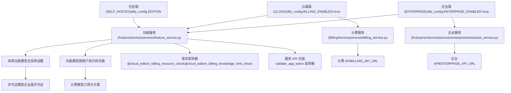
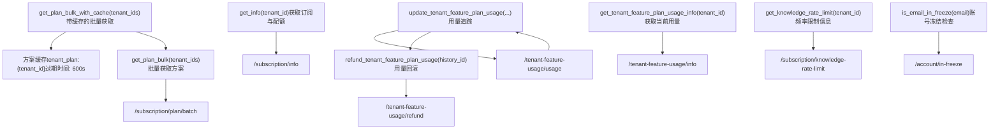
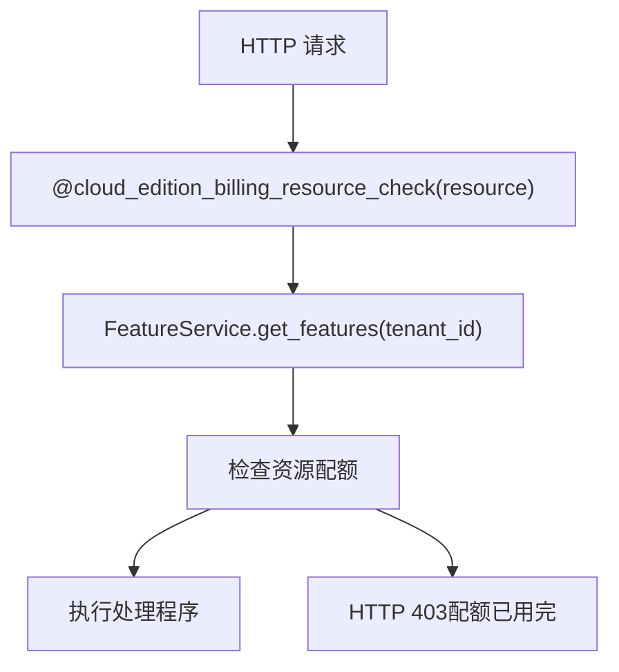
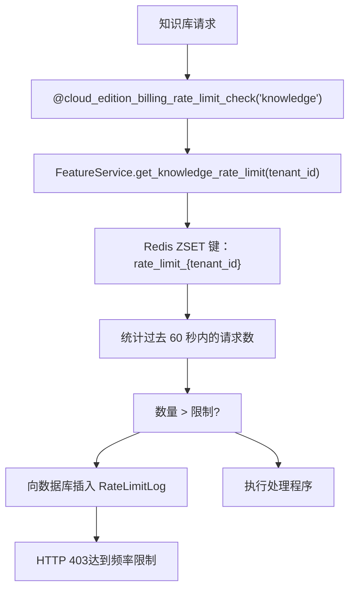
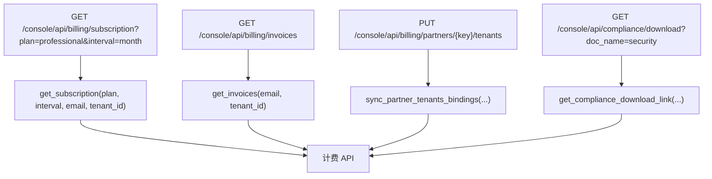

# 计费与功能管理

相关源文件

-   [api/controllers/console/\_\_init\_\_.py](https://github.com/langgenius/dify/blob/92dbc94f/api/controllers/console/__init__.py)
-   [api/controllers/console/auth/activate.py](https://github.com/langgenius/dify/blob/92dbc94f/api/controllers/console/auth/activate.py)
-   [api/controllers/console/auth/email\_register.py](https://github.com/langgenius/dify/blob/92dbc94f/api/controllers/console/auth/email_register.py)
-   [api/controllers/console/auth/error.py](https://github.com/langgenius/dify/blob/92dbc94f/api/controllers/console/auth/error.py)
-   [api/controllers/console/auth/forgot\_password.py](https://github.com/langgenius/dify/blob/92dbc94f/api/controllers/console/auth/forgot_password.py)
-   [api/controllers/console/auth/login.py](https://github.com/langgenius/dify/blob/92dbc94f/api/controllers/console/auth/login.py)
-   [api/controllers/console/auth/oauth.py](https://github.com/langgenius/dify/blob/92dbc94f/api/controllers/console/auth/oauth.py)
-   [api/controllers/console/billing/billing.py](https://github.com/langgenius/dify/blob/92dbc94f/api/controllers/console/billing/billing.py)
-   [api/controllers/console/billing/compliance.py](https://github.com/langgenius/dify/blob/92dbc94f/api/controllers/console/billing/compliance.py)
-   [api/controllers/console/error.py](https://github.com/langgenius/dify/blob/92dbc94f/api/controllers/console/error.py)
-   [api/controllers/console/feature.py](https://github.com/langgenius/dify/blob/92dbc94f/api/controllers/console/feature.py)
-   [api/controllers/console/init\_validate.py](https://github.com/langgenius/dify/blob/92dbc94f/api/controllers/console/init_validate.py)
-   [api/controllers/console/setup.py](https://github.com/langgenius/dify/blob/92dbc94f/api/controllers/console/setup.py)
-   [api/controllers/console/version.py](https://github.com/langgenius/dify/blob/92dbc94f/api/controllers/console/version.py)
-   [api/controllers/console/workspace/account.py](https://github.com/langgenius/dify/blob/92dbc94f/api/controllers/console/workspace/account.py)
-   [api/controllers/console/workspace/agent\_providers.py](https://github.com/langgenius/dify/blob/92dbc94f/api/controllers/console/workspace/agent_providers.py)
-   [api/controllers/console/workspace/members.py](https://github.com/langgenius/dify/blob/92dbc94f/api/controllers/console/workspace/members.py)
-   [api/controllers/console/workspace/model\_providers.py](https://github.com/langgenius/dify/blob/92dbc94f/api/controllers/console/workspace/model_providers.py)
-   [api/controllers/console/workspace/models.py](https://github.com/langgenius/dify/blob/92dbc94f/api/controllers/console/workspace/models.py)
-   [api/controllers/console/workspace/workspace.py](https://github.com/langgenius/dify/blob/92dbc94f/api/controllers/console/workspace/workspace.py)
-   [api/controllers/console/wraps.py](https://github.com/langgenius/dify/blob/92dbc94f/api/controllers/console/wraps.py)
-   [api/controllers/service\_api/wraps.py](https://github.com/langgenius/dify/blob/92dbc94f/api/controllers/service_api/wraps.py)
-   [api/libs/encryption.py](https://github.com/langgenius/dify/blob/92dbc94f/api/libs/encryption.py)
-   [api/libs/workspace\_permission.py](https://github.com/langgenius/dify/blob/92dbc94f/api/libs/workspace_permission.py)
-   [api/services/account\_service.py](https://github.com/langgenius/dify/blob/92dbc94f/api/services/account_service.py)
-   [api/services/billing\_service.py](https://github.com/langgenius/dify/blob/92dbc94f/api/services/billing_service.py)
-   [api/services/enterprise/enterprise\_service.py](https://github.com/langgenius/dify/blob/92dbc94f/api/services/enterprise/enterprise_service.py)
-   [api/services/feature\_service.py](https://github.com/langgenius/dify/blob/92dbc94f/api/services/feature_service.py)
-   [api/services/operation\_service.py](https://github.com/langgenius/dify/blob/92dbc94f/api/services/operation_service.py)
-   [api/templates/change\_mail\_confirm\_old\_template\_zh-CN.html](https://github.com/langgenius/dify/blob/92dbc94f/api/templates/change_mail_confirm_old_template_zh-CN.html)
-   [api/templates/transfer\_workspace\_owner\_confirm\_template\_en-US.html](https://github.com/langgenius/dify/blob/92dbc94f/api/templates/transfer_workspace_owner_confirm_template_en-US.html)
-   [api/templates/without-brand/transfer\_workspace\_owner\_confirm\_template\_en-US.html](https://github.com/langgenius/dify/blob/92dbc94f/api/templates/without-brand/transfer_workspace_owner_confirm_template_en-US.html)
-   [api/tests/unit\_tests/controllers/console/auth/test\_account\_activation.py](https://github.com/langgenius/dify/blob/92dbc94f/api/tests/unit_tests/controllers/console/auth/test_account_activation.py)
-   [api/tests/unit\_tests/controllers/console/auth/test\_authentication\_security.py](https://github.com/langgenius/dify/blob/92dbc94f/api/tests/unit_tests/controllers/console/auth/test_authentication_security.py)
-   [api/tests/unit\_tests/controllers/console/auth/test\_email\_verification.py](https://github.com/langgenius/dify/blob/92dbc94f/api/tests/unit_tests/controllers/console/auth/test_email_verification.py)
-   [api/tests/unit\_tests/controllers/console/auth/test\_login\_logout.py](https://github.com/langgenius/dify/blob/92dbc94f/api/tests/unit_tests/controllers/console/auth/test_login_logout.py)
-   [api/tests/unit\_tests/controllers/console/auth/test\_oauth.py](https://github.com/langgenius/dify/blob/92dbc94f/api/tests/unit_tests/controllers/console/auth/test_oauth.py)
-   [api/tests/unit\_tests/controllers/console/auth/test\_password\_reset.py](https://github.com/langgenius/dify/blob/92dbc94f/api/tests/unit_tests/controllers/console/auth/test_password_reset.py)
-   [api/tests/unit\_tests/controllers/console/auth/test\_token\_refresh.py](https://github.com/langgenius/dify/blob/92dbc94f/api/tests/unit_tests/controllers/console/auth/test_token_refresh.py)
-   [api/tests/unit\_tests/controllers/test\_compare\_versions.py](https://github.com/langgenius/dify/blob/92dbc94f/api/tests/unit_tests/controllers/test_compare_versions.py)
-   [api/tests/unit\_tests/libs/test\_encryption.py](https://github.com/langgenius/dify/blob/92dbc94f/api/tests/unit_tests/libs/test_encryption.py)
-   [api/tests/unit\_tests/libs/test\_oauth\_clients.py](https://github.com/langgenius/dify/blob/92dbc94f/api/tests/unit_tests/libs/test_oauth_clients.py)
-   [api/tests/unit\_tests/libs/test\_workspace\_permission.py](https://github.com/langgenius/dify/blob/92dbc94f/api/tests/unit_tests/libs/test_workspace_permission.py)

本文档描述了 Dify 中的计费集成、功能开关 (feature flag) 系统以及配额执行 (quota enforcement) 机制。系统支持三种部署版本（社区版 SELF\_HOSTED、云端版 CLOUD、企业版 ENTERPRISE），每个版本具有不同的功能可用性和限制执行策略。有关身份验证和工作区管理的信息，请参阅 [多租户与授权](/langgenius/dify/7-multi-tenancy-and-authorization)。有关 API 层级的访问控制，请参阅 [服务 API](/langgenius/dify/8-service-apis)。

## 系统架构

Dify 实现了一个三层功能管理系统，根据部署版本自动适配：

**版本架构图**


**来源：** [api/services/feature\_service.py1-368](https://github.com/langgenius/dify/blob/92dbc94f/api/services/feature_service.py#L1-L368) [api/services/billing\_service.py1-393](https://github.com/langgenius/dify/blob/92dbc94f/api/services/billing_service.py#L1-L393) [api/services/enterprise/enterprise\_service.py1-142](https://github.com/langgenius/dify/blob/92dbc94f/api/services/enterprise/enterprise_service.py#L1-L142) [api/configs/dify\_config.py](https://github.com/langgenius/dify/blob/92dbc94f/api/configs/dify_config.py)

## 版本对比

| 功能 | 社区版 (SELF\_HOSTED) | 云端版 (CLOUD) | 企业版 (ENTERPRISE) |
| --- | --- | --- | --- |
| 计费集成 | ❌ | ✅ | ❌ |
| 按方案配额 | ❌ | ✅ (Sandbox/Professional/Team) | ❌ |
| 许可证验证 | ❌ | ❌ | ✅ |
| 工作区限制 | ❌ | 通过计费 API | 通过许可证 |
| SSO 强制执行 | ❌ | ❌ | ✅ |
| 品牌定制 | 通过环境变量 | 通过订阅方案 | ✅ |
| 工作区策略 | ❌ | ❌ | ✅ |

**来源：** [api/services/feature\_service.py175-219](https://github.com/langgenius/dify/blob/92dbc94f/api/services/feature_service.py#L175-L219) [api/controllers/console/wraps.py52-95](https://github.com/langgenius/dify/blob/92dbc94f/api/controllers/console/wraps.py#L52-L95)

## BillingService (计费服务) 架构

`BillingService` 类为云端版部署提供了与外部计费 API 的集成。它负责处理订阅管理、配额追踪和资源使用情况报告。

**BillingService 组件图**


**来源：** [api/services/billing\_service.py29-393](https://github.com/langgenius/dify/blob/92dbc94f/api/services/billing_service.py#L29-L393)

### BillingService 关键方法

**订阅与方案管理**

```python
# 获取租户的完整计费信息
billing_info = BillingService.get_info(tenant_id)
# 返回: {
#   "enabled": bool,
#   "subscription": {"plan": str, "interval": str},
#   "members": {"size": int, "limit": int},
#   "apps": {"size": int, "limit": int},
#   "vector_space": {"size": int, "limit": int},
#   ...
# }
```
**来源：** [api/services/billing\_service.py40-45](https://github.com/langgenius/dify/blob/92dbc94f/api/services/billing_service.py#L40-L45)

**带缓存的批量方案查询**

计费服务针对批量操作实现了两级缓存策略：

```python
# 使用 Redis 缓存批量获取多个租户的方案
plans = BillingService.get_plan_bulk_with_cache(['tenant1', 'tenant2'])
# 返回: {"tenant1": {"plan": "professional", "expiration_date": 1234567890}, ...}
```
1.  **第一级**：检查 Redis 缓存 (`tenant_plan:{tenant_id}`，10 分钟 TTL)。
2.  **第二级**：从计费 API 批量获取缓存未命中的项（每请求最多 200 个）。
3.  **反向补充**：缓存查询结果供后续请求使用。

**来源：** [api/services/billing\_service.py295-383](https://github.com/langgenius/dify/blob/92dbc94f/api/services/billing_service.py#L295-L383)

**用量追踪与退款**

```python
# 增加某项功能的用量
result = BillingService.update_tenant_feature_plan_usage(
    tenant_id="tenant_123",
    feature_key="trigger",
    delta=1  # 正数代表消耗，负数代表归还
)
# 返回: {"result": "success", "history_id": "uuid"}

# 对之前的扣费进行退款
BillingService.refund_tenant_feature_plan_usage(history_id="uuid")
```
**来源：** [api/services/billing\_service.py85-117](https://github.com/langgenius/dify/blob/92dbc94f/api/services/billing_service.py#L85-L117)

**教育身份管理**

系统支持针对认证教育机构的特殊定价：

```python
# 验证教育邮箱
BillingService.EducationIdentity.verify(account_id, account_email)

# 激活教育优惠
BillingService.EducationIdentity.activate(account, token, institution, role)

# 检查教育状态
status = BillingService.EducationIdentity.status(account_id)
```
**来源：** [api/services/billing\_service.py185-226](https://github.com/langgenius/dify/blob/92dbc94f/api/services/billing_service.py#L185-L226) [api/controllers/console/workspace/account.py439-494](https://github.com/langgenius/dify/blob/92dbc94f/api/controllers/console/workspace/account.py#L439-L494)

## FeatureService (功能服务) 与功能模型

`FeatureService` 汇总了来自多个来源的功能开关，并返回统一的模型，供控制器用于授权决策。

**功能模型层级**

```mermaid
flowchart TD
    SystemFeatureModel["系统功能模型services/feature_service.py:156-173"]
    SSOEnforced["sso_enforced_for_signin: bool"]
    EnableMarketplace["enable_marketplace: bool"]
    EmailLogin["邮箱验证码登录/密码登录开关"]
    AllowRegister["is_allow_register: 允许注册开关"]
    LicenseInfo["license: 许可证模型"]
    BrandingInfo["branding: 品牌信息模型"]
    PluginPermission["plugin_installation_permission: 插件安装权限模型"]
    FeatureModel["租户功能模型services/feature_service.py:122-144"]
    BillingInfo["billing: 计费模型启用状态, 订阅"]
    ResourceLimits["成员、应用、向量空间限制模型"]
    QuotaLimits["文档上传配额、标注配额限制模型"]
    FeatureFlags["logo 替换、负载均衡、版权信息等开关"]
    UsageQuotas["触发器事件、API 频率限制配额"]
    WorkspaceMembers["workspace_members: 许可证成员限制"]
    GetSystemFeatures["get_system_features()返回系统功能模型"]
    GetFeatures["get_features(tenant_id)返回租户功能模型"]

    SystemFeatureModel --> SSOEnforced
    SystemFeatureModel --> EnableMarketplace
    SystemFeatureModel --> EmailLogin
    SystemFeatureModel --> AllowRegister
    SystemFeatureModel --> LicenseInfo
    SystemFeatureModel --> BrandingInfo
    SystemFeatureModel --> PluginPermission
    FeatureModel --> BillingInfo
    FeatureModel --> ResourceLimits
    FeatureModel --> QuotaLimits
    FeatureModel --> FeatureFlags
    FeatureModel --> UsageQuotas
    FeatureModel --> WorkspaceMembers
    GetSystemFeatures --> SystemFeatureModel
    GetFeatures --> FeatureModel
```


**来源：** [api/services/feature\_service.py11-173](https://github.com/langgenius/dify/blob/92dbc94f/api/services/feature_service.py#L11-L173)

### 功能解析流程

> **[Mermaid 序列图]**
> *(图表结构无法解析)*

**来源：** [api/services/feature\_service.py175-307](https://github.com/langgenius/dify/blob/92dbc94f/api/services/feature_service.py#L175-L307)

### LimitationModel (限制模型) 与配额检查

系统使用两种模型来处理资源限制：

**LimitationModel** - 基础的用量/限制追踪：

```python
class LimitationModel(BaseModel):
    size: int = 0    # 当前用量
    limit: int = 0   # 允许的最大值 (0 代表无限制)
```
**LicenseLimitationModel** - 增强版，带有可用性检查：

```python
class LicenseLimitationModel(BaseModel):
    enabled: bool = False  # 是否强制执行限制
    size: int = 0          # 当前用量
    limit: int = 0         # 允许的最大值 (0 代表无限制)

    def is_available(self, required: int = 1) -> bool:
        """检查所需数量是否可以分配"""
        if not self.enabled or self.limit == 0:
            return True  # 未执行限制
        return (self.limit - self.size) >= required
```
**来源：** [api/services/feature\_service.py26-55](https://github.com/langgenius/dify/blob/92dbc94f/api/services/feature_service.py#L26-L55)

## 资源配额执行 (Resource Quota Enforcement)

配额执行发生在两个层面：控制台 API (Console API，管理操作) 和服务 API (Service API，程序化访问)。

### 控制台 API 执行

`@cloud_edition_billing_resource_check` 装饰器在管理操作上强制执行配额：


**来源：** [api/controllers/console/wraps.py97-137](https://github.com/langgenius/dify/blob/92dbc94f/api/controllers/console/wraps.py#L97-L137)

**用法示例**：

```python
@console_ns.route("/workspaces/current/members/invite-email")
class MemberInviteEmailApi(Resource):
    @cloud_edition_billing_resource_check("members")
    def post(self):
        # 该端点受成员配额检查保护
        # 如果成员数量达到上限，将返回 403
        ...
```
**来源：** [api/controllers/console/workspace/members.py88-156](https://github.com/langgenius/dify/blob/92dbc94f/api/controllers/console/workspace/members.py#L88-L156)

### 服务 API 执行

服务 API 针对基于 API 令牌的访问实现了类似的检查：

```python
@cloud_edition_billing_resource_check(resource: str, api_token_type: str)
def decorator(view):
    api_token = validate_and_get_api_token(api_token_type)
    features = FeatureService.get_features(api_token.tenant_id)

    if features.billing.enabled:
        # 检查特定资源的限制
        if resource == "members" and 0 < members.limit <= members.size:
            raise Forbidden("成员上限已达")
        elif resource == "documents" and 0 < documents.limit <= documents.size:
            raise Forbidden("文档上传上限已达")
        # ... 更多检查
```
**来源：** [api/controllers/service\_api/wraps.py130-158](https://github.com/langgenius/dify/blob/92dbc94f/api/controllers/service_api/wraps.py#L130-L158)

### 配额类型

| 资源 | 检查位置 | 执行范围 |
| --- | --- | --- |
| `members` (成员) | 成员邀请 | 控制台 + 服务 API |
| `apps` (应用) | 创建应用 | 控制台 + 服务 API |
| `vector_space` (向量空间) | 文档索引 | 控制台 + 服务 API |
| `documents` (文档) | 文档上传 | 控制台 + 服务 API |
| `workspace_custom` (工作区自定义) | Logo 替换 | 仅限控制台 API |
| `annotation` (标注) | 标注导入 | 仅限控制台 API |

**来源：** [api/controllers/console/wraps.py97-137](https://github.com/langgenius/dify/blob/92dbc94f/api/controllers/console/wraps.py#L97-L137) [api/controllers/service\_api/wraps.py130-158](https://github.com/langgenius/dify/blob/92dbc94f/api/controllers/service_api/wraps.py#L130-L158)

## 频率限制 (Rate Limiting)

### 知识库频率限制

知识库操作使用 Redis 的有序集合 (ZSET) 和滑动窗口算法进行频率限制：


**来源：** [api/controllers/console/wraps.py162-196](https://github.com/langgenius/dify/blob/92dbc94f/api/controllers/console/wraps.py#L162-L196) [api/controllers/service\_api/wraps.py182-217](https://github.com/langgenius/dify/blob/92dbc94f/api/controllers/service_api/wraps.py#L182-217)

**实现细节**：

```python
# 从计费 API 获取频率限制 (云端版) 或默认为 10
knowledge_rate_limit = FeatureService.get_knowledge_rate_limit(tenant_id)
# 返回: {"enabled": bool, "limit": int, "subscription_plan": str}

# Redis 滑动窗口检查
current_time = int(time.time() * 1000)
key = f"rate_limit_{tenant_id}"

redis_client.zadd(key, {current_time: current_time})
redis_client.zremrangebyscore(key, 0, current_time - 60000)  # 移除旧条目
request_count = redis_client.zcard(key)

if request_count > knowledge_rate_limit.limit:
    # 记录到数据库用于分析
    rate_limit_log = RateLimitLog(
        tenant_id=tenant_id,
        subscription_plan=knowledge_rate_limit.subscription_plan,
        operation="knowledge"
    )
    db.session.add(rate_limit_log)
    db.session.commit()

    raise Forbidden("已达到频率限制")
```
**来源：** [api/controllers/console/wraps.py162-196](https://github.com/langgenius/dify/blob/92dbc94f/api/controllers/console/wraps.py#L162-L196) [api/services/feature\_service.py192-200](https://github.com/langgenius/dify/blob/92dbc94f/api/services/feature_service.py#L192-L200)

### 标注导入频率限制

标注导入使用双层频率限制：

| 层级 | 限制次数 | 时间窗口 | Redis 键 |
| --- | --- | --- | --- |
| 短期 | 5 次请求 | 1 分钟 | `annotation_import_rate_limit:{tenant_id}:1min` |
| 长期 | 20 次请求 | 1 小时 | `annotation_import_rate_limit:{tenant_id}:1hour` |

**并发控制**：

```python
@annotation_import_concurrency_limit
def import_annotations():
    # 在 Redis 中追踪活跃任务
    active_jobs_key = f"annotation_import_active:{tenant_id}"
    active_count = redis_client.zcard(active_jobs_key)

    if active_count >= ANNOTATION_IMPORT_MAX_CONCURRENT:
        abort(429, "当前导入并发任务过多")
```
**来源：** [api/controllers/console/wraps.py345-431](https://github.com/langgenius/dify/blob/92dbc94f/api/controllers/console/wraps.py#L345-L431)

## 许可证管理 (企业版)

企业版部署通过 `EnterpriseService` 验证许可证：

**许可证状态流**

> **[Mermaid 状态图]**
> *(图表结构无法解析)*

**来源：** [api/services/feature\_service.py63-76](https://github.com/langgenius/dify/blob/92dbc94f/api/services/feature_service.py#L63-L76)

**许可证模型 (License Model)**：

```python
class LicenseModel(BaseModel):
    status: LicenseStatus  # 取值：none/inactive/active/expiring/expired/lost
    expired_at: str
    workspaces: LicenseLimitationModel  # 工作区数量限制
```
**强制执行**：

```python
@enterprise_license_required
def protected_endpoint():
    settings = FeatureService.get_system_features()
    if settings.license.status in [LicenseStatus.INACTIVE,
                                   LicenseStatus.EXPIRED,
                                   LicenseStatus.LOST]:
        raise UnauthorizedAndForceLogout("许可证无效")
```
**来源：** [api/controllers/console/wraps.py235-244](https://github.com/langgenius/dify/blob/92dbc94f/api/controllers/console/wraps.py#L235-L244)

### 工作区策略执行

企业版支持工作区级别的权限策略：

```python
class WorkspacePermission(BaseModel):
    workspace_id: str
    allow_member_invite: bool = False
    allow_owner_transfer: bool = False
```
**权限检查辅助函数**：

```python
def check_workspace_member_invite_permission(workspace_id: str):
    """
    在两个层面进行检查：
    1. 计费/方案层面（SANDBOX 方案无法邀请）
    2. 企业策略层面（管理员配置）
    """
    features = FeatureService.get_features(workspace_id)

    # 第一层：基于方案的检查 (云端版)
    if not features.workspace_members.is_available():
        raise Forbidden("工作区成员数量已达上限")

    # 第二层：基于策略的检查 (企业版)
    if dify_config.ENTERPRISE_ENABLED:
        permission = EnterpriseService.WorkspacePermissionService.get_permission(workspace_id)
        if not permission.allow_member_invite:
            raise Forbidden("根据策略，成员邀请功能已被禁用")
```
**来源：** [api/libs/workspace\_permission.py21-55](https://github.com/langgenius/dify/blob/92dbc94f/api/libs/workspace_permission.py#L21-L55) [api/services/enterprise/enterprise\_service.py16-31](https://github.com/langgenius/dify/blob/92dbc94f/api/services/enterprise/enterprise_service.py#L16-L31)

## 计费 API 端点

控制台 API 为云端版暴露了计费管理端点：

**计费端点图**


**来源：** [api/controllers/console/billing/billing.py1-87](https://github.com/langgenius/dify/blob/92dbc94f/api/controllers/console/billing/billing.py#L1-L87) [api/controllers/console/billing/compliance.py1-45](https://github.com/langgenius/dify/blob/92dbc94f/api/controllers/console/billing/compliance.py#L1-L45)

**订阅管理示例**：

```python
@console_ns.route("/billing/subscription")
class Subscription(Resource):
    @only_edition_cloud
    def get(self):
        current_user, current_tenant_id = current_account_with_tenant()
        args = SubscriptionQuery.model_validate(request.args)

        # 验证用户是否为拥有者或管理员
        BillingService.is_tenant_owner_or_admin(current_user)

        # 从计费 API 获取支付链接
        return BillingService.get_subscription(
            args.plan,      # "professional" 或 "team"
            args.interval,  # "month" 或 "year"
            current_user.email,
            current_tenant_id
        )
```
**来源：** [api/controllers/console/billing/billing.py31-42](https://github.com/langgenius/dify/blob/92dbc94f/api/controllers/console/billing/billing.py#L31-L42)

## 功能 API 端点

客户端通过专用端点检索功能配置：

```python
@console_ns.route("/features")
class FeatureApi(Resource):
    @login_required
    @account_initialization_required
    def get(self):
        """获取按租户划分的功能配置"""
        _, current_tenant_id = current_account_with_tenant()
        return FeatureService.get_features(current_tenant_id).model_dump()

@console_ns.route("/system-features")
class SystemFeatureApi(Resource):
    def get(self):
        """获取全系统功能配置（无需认证）"""
        return FeatureService.get_system_features().model_dump()
```
**来源：** [api/controllers/console/feature.py1-44](https://github.com/langgenius/dify/blob/92dbc94f/api/controllers/console/feature.py#L1-L44)

**示例响应结构**：

```json
{
  "billing": {
    "enabled": true,
    "subscription": {
      "plan": "professional",
      "interval": "month"
    }
  },
  "members": {"size": 5, "limit": 10},
  "apps": {"size": 3, "limit": 50},
  "vector_space": {"size": 1024, "limit": 5120},
  "documents_upload_quota": {"size": 100, "limit": 1000},
  "can_replace_logo": true,
  "model_load_balancing_enabled": true,
  "trigger_event": {"usage": 150, "limit": 3000, "reset_date": 1735689600},
  "workspace_members": {"enabled": true, "size": 5, "limit": 10}
}
```
## 账号冻结机制 (Account Freeze Mechanism)

计费系统在账号注销后实现了 30 天的冻结期：

> **[Mermaid 序列图]**
> *(图表结构无法解析)*

**来源：** [api/services/billing\_service.py171-178](https://github.com/langgenius/dify/blob/92dbc94f/api/services/billing_service.py#L171-L178) [api/services/account\_service.py237-249](https://github.com/langgenius/dify/blob/92dbc94f/api/services/account_service.py#L237-L249) [api/controllers/console/auth/login.py93-98](https://github.com/langgenius/dify/blob/92dbc94f/api/controllers/console/auth/login.py#L93-L98)

## 集成点

### 创建账号

```python
# api/services/account_service.py:229-279
def create_account(email: str, ...):
    if not FeatureService.get_system_features().is_allow_register:
        raise AccountNotFound()

    # 检查邮箱是否处于冻结期 (仅限云端版)
    if dify_config.BILLING_ENABLED and BillingService.is_email_in_freeze(email):
        raise AccountRegisterError("该邮箱在 30 天内被注销，暂不可用")

    # 执行创建账号逻辑...
```
**来源：** [api/services/account\_service.py229-279](https://github.com/langgenius/dify/blob/92dbc94f/api/services/account_service.py#L229-L279)

### 创建工作区

```python
# api/services/account_service.py:989-1003
def create_tenant(name: str, is_setup: bool = False):
    if not FeatureService.get_system_features().is_allow_create_workspace:
        raise NotAllowedCreateWorkspace()

    # 检查工作区上限 (企业版)
    system_features = FeatureService.get_system_features()
    if not system_features.license.workspaces.is_available():
        raise WorkspacesLimitExceeded()

    # 执行创建租户逻辑...
```
**来源：** [api/services/account\_service.py989-1003](https://github.com/langgenius/dify/blob/92dbc94f/api/services/account_service.py#L989-L1003)

### 工作区展示

```python
# api/controllers/console/workspace/workspace.py:102-128
@console_ns.route("/workspaces")
class TenantListApi(Resource):
    def get(self):
        tenants = TenantService.get_join_tenants(current_user)

        for tenant in tenants:
            features = FeatureService.get_features(tenant.id)
            tenant_dict = {
                "id": tenant.id,
                "name": tenant.name,
                "plan": features.billing.subscription.plan if features.billing.enabled
                        else CloudPlan.SANDBOX
            }
```
**来源：** [api/controllers/console/workspace/workspace.py102-128](https://github.com/langgenius/dify/blob/92dbc94f/api/controllers/console/workspace/workspace.py#L102-L128)

## 配置

### 环境变量

```bash
# 版本控制
EDITION=SELF_HOSTED|CLOUD  # 部署版本

# 计费集成 (云端版)
BILLING_ENABLED=true
BILLING_API_URL=https://billing.example.com
BILLING_API_SECRET_KEY=此处填写密钥

# 企业版功能
ENTERPRISE_ENABLED=true
ENTERPRISE_API_URL=https://enterprise.example.com
ENTERPRISE_API_SECRET_KEY=此处填写密钥

# 功能开关
CAN_REPLACE_LOGO=true
MODEL_LB_ENABLED=true
DATASET_OPERATOR_ENABLED=false
EDUCATION_ENABLED=false
```
**来源：** [api/configs/dify\_config.py](https://github.com/langgenius/dify/blob/92dbc94f/api/configs/dify_config.py)

### Redis 键名模式

| 键名模式 | 用途 | 过期时间 (TTL) |
| --- | --- | --- |
| `tenant_plan:{tenant_id}` | 已缓存的订阅方案 | 600 秒 |
| `rate_limit_{tenant_id}` | 知识库请求时间戳 | 无（ZSET 类型） |
| `annotation_import_rate_limit:{tenant_id}:1min` | 标注导入 1 分钟窗口 | 120 秒 |
| `annotation_import_rate_limit:{tenant_id}:1hour` | 标注导入 1 小时窗口 | 7200 秒 |
| `annotation_import_active:{tenant_id}` | 活跃导入任务追踪 | 无（ZSET 类型） |

**来源：** [api/services/billing\_service.py35-38](https://github.com/langgenius/dify/blob/92dbc94f/api/services/billing_service.py#L35-L38) [api/controllers/console/wraps.py162-431](https://github.com/langgenius/dify/blob/92dbc94f/api/controllers/console/wraps.py#L162-L431)

计费与功能管理系统提供了灵活的、感知版本的资源控制，同时通过 `FeatureService` 抽象层为客户端维护了统一的 API 界面。
