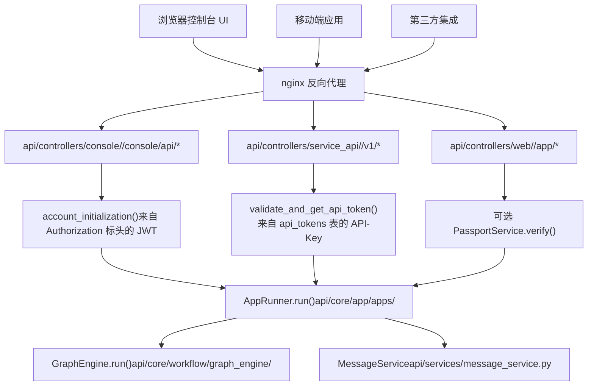
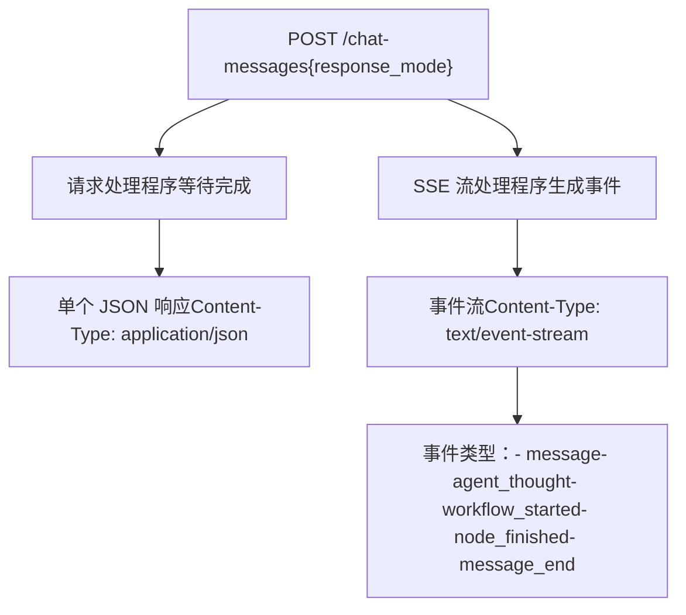
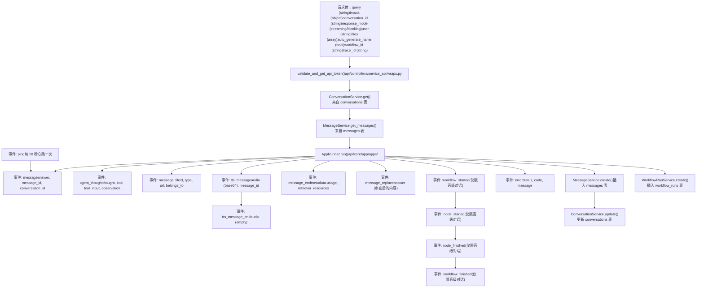
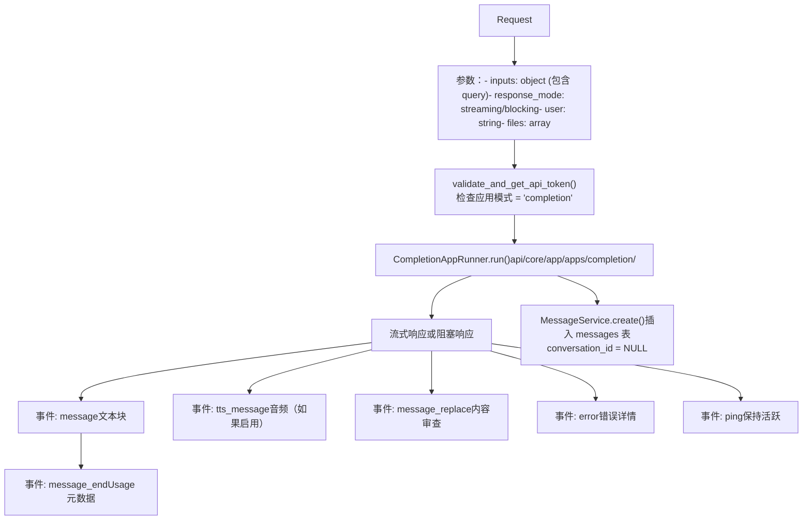
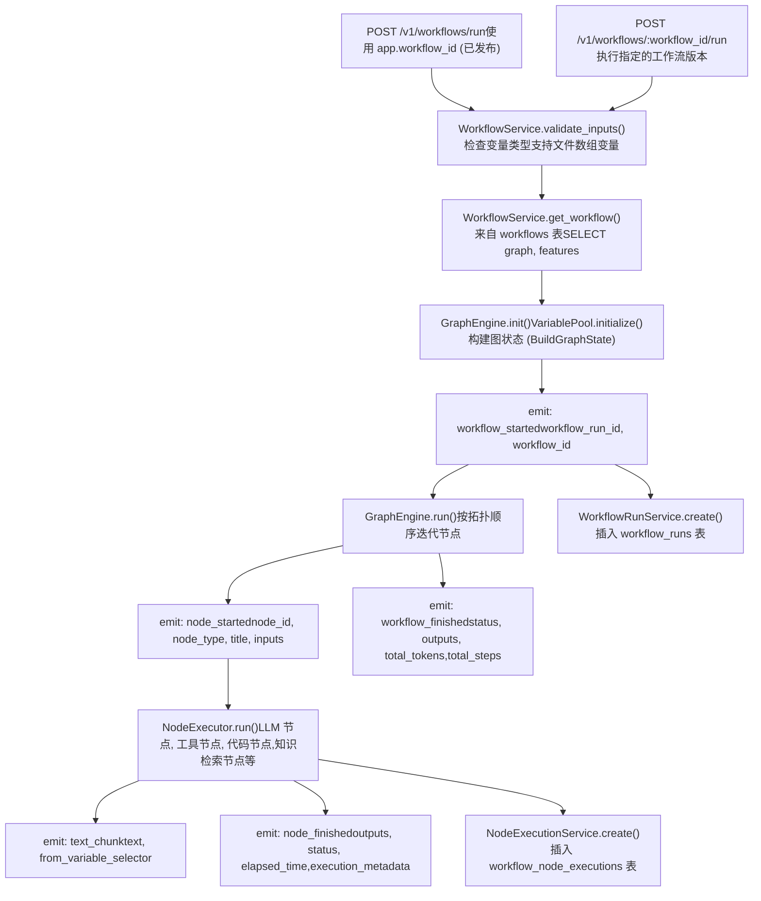
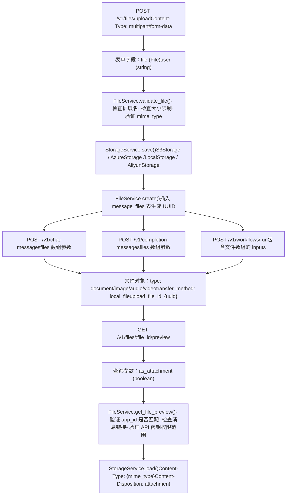

# 服务 API 与外部集成

相关源文件

-   [web/app/components/develop/template/template.en.mdx](https://github.com/langgenius/dify/blob/92dbc94f/web/app/components/develop/template/template.en.mdx)
-   [web/app/components/develop/template/template.ja.mdx](https://github.com/langgenius/dify/blob/92dbc94f/web/app/components/develop/template/template.ja.mdx)
-   [web/app/components/develop/template/template.zh.mdx](https://github.com/langgenius/dify/blob/92dbc94f/web/app/components/develop/template/template.zh.mdx)
-   [web/app/components/develop/template/template_advanced_chat.en.mdx](https://github.com/langgenius/dify/blob/92dbc94f/web/app/components/develop/template/template_advanced_chat.en.mdx)
-   [web/app/components/develop/template/template_advanced_chat.ja.mdx](https://github.com/langgenius/dify/blob/92dbc94f/web/app/components/develop/template/template_advanced_chat.ja.mdx)
-   [web/app/components/develop/template/template_advanced_chat.zh.mdx](https://github.com/langgenius/dify/blob/92dbc94f/web/app/components/develop/template/template_advanced_chat.zh.mdx)
-   [web/app/components/develop/template/template_chat.en.mdx](https://github.com/langgenius/dify/blob/92dbc94f/web/app/components/develop/template/template_chat.en.mdx)
-   [web/app/components/develop/template/template_chat.ja.mdx](https://github.com/langgenius/dify/blob/92dbc94f/web/app/components/develop/template/template_chat.ja.mdx)
-   [web/app/components/develop/template/template_chat.zh.mdx](https://github.com/langgenius/dify/blob/92dbc94f/web/app/components/develop/template/template_chat.zh.mdx)
-   [web/app/components/develop/template/template_workflow.en.mdx](https://github.com/langgenius/dify/blob/92dbc94f/web/app/components/develop/template/template_workflow.en.mdx)
-   [web/app/components/develop/template/template_workflow.ja.mdx](https://github.com/langgenius/dify/blob/92dbc94f/web/app/components/develop/template/template_workflow.ja.mdx)
-   [web/app/components/develop/template/template_workflow.zh.mdx](https://github.com/langgenius/dify/blob/92dbc94f/web/app/components/develop/template/template_workflow.zh.mdx)

本文档详细介绍了面向外部的服务 API（Service APIs），这些 API 使得集成 Dify 应用成为可能。这些 API 提供了对对话（chat）、文本补全（completion）和工作流（workflow）执行能力的程序化访问，支持实时流式（streaming）和阻塞（blocking）两种响应模式。

有关 Web UI 用于管理内部的控制台 API（Console APIs）的信息，请参阅 [API 架构与响应模式](/langgenius/dify/8.1-api-architecture-and-response-modes)。有关身份验证和多租户概念，请参阅 [身份验证与授权](/langgenius/dify/7-multi-tenancy-and-authorization)。

---

## API 架构概览

Dify 暴露了三个不同的 API 层面，每个层面服务于不同的访问模式和身份验证要求。

### API 层面分类

Dify 通过不同的身份验证和路由模式暴露了三个 API 层面。所有路由均由运行在 5001 端口的 Flask 应用处理，Nginx 作为反向代理。


服务 API 路由挂载在 `/v1` 和 `/api` 前缀下，控制器按应用类型组织。API 密钥根据 `api_tokens` 表进行验证，该表以 `app-{随机字符串}` 格式存储密钥。

**来源：** [web/app/components/develop/template/template_chat.en.mdx1-30](https://github.com/langgenius/dify/blob/92dbc94f/web/app/components/develop/template/template_chat.en.mdx#L1-L30) [web/app/components/develop/template/template_workflow.en.mdx1-30](https://github.com/langgenius/dify/blob/92dbc94f/web/app/components/develop/template/template_workflow.en.mdx#L1-L30)

### API 端点结构

| API 层面 | 基础路径 | 身份验证 | 用途 | 控制器位置 |
| --- | --- | --- | --- | --- |
| **控制台 API** | `/console/api/*` | OAuth2 (JWT) | 管理操作：知识库管理、应用配置、模型设置 | `api/controllers/console/` |
| **服务 API** | `/v1/*` `/api/*` | API-Key (Bearer) | 应用执行：对话、文本补全、工作流运行 | `api/controllers/service_api/` |
| **公共 API** | `/app/*` | 可选 API-Key | 具有可选身份验证的公开分享应用 | `api/controllers/web/` |

服务 API 是外部系统的主要集成点。每个端点都在 `web/app/components/develop/template/` 目录下的 MDX 模板文件中进行了说明，以便在 Web UI 中显示。API 密钥的作用域限于特定应用，并存储在具有 `app_id` 外键的 `api_tokens` 表中。密钥格式为 `app-{随机字符串}`，必须包含在 `Authorization` 标头中，格式为 `Bearer {API_KEY}`。

**关键服务 API 端点：**

-   `POST /v1/chat-messages` - 对话应用端点 ([service_api/app/chat.py](https://github.com/langgenius/dify/blob/92dbc94f/service_api/app/chat.py))
-   `POST /v1/completion-messages` - 文本补全应用端点 ([service_api/app/completion.py](https://github.com/langgenius/dify/blob/92dbc94f/service_api/app/completion.py))
-   `POST /v1/workflows/run` - 工作流执行端点 ([service_api/app/workflow.py](https://github.com/langgenius/dify/blob/92dbc94f/service_api/app/workflow.py))
-   `POST /v1/files/upload` - 用于多模态输入的文件上传 ([service_api/app/file.py](https://github.com/langgenius/dify/blob/92dbc94f/service_api/app/file.py))
-   `GET /v1/messages` - 获取会话历史记录 ([service_api/app/conversation.py](https://github.com/langgenius/dify/blob/92dbc94f/service_api/app/conversation.py))

**来源：** [web/app/components/develop/template/template_chat.en.mdx12-20](https://github.com/langgenius/dify/blob/92dbc94f/web/app/components/develop/template/template_chat.en.mdx#L12-L20) [web/app/components/develop/template/template_workflow.en.mdx12-20](https://github.com/langgenius/dify/blob/92dbc94f/web/app/components/develop/template/template_workflow.en.mdx#L12-L20)

### 响应模式架构

服务 API 支持两种响应模式，这从根本上改变了结果的交付方式：


**流式模式**（推荐）：

-   使用服务器发送事件（SSE）协议
-   实现类似打字机的渐进式输出
-   避免 Cloudflare 100 秒超时
-   事件以前缀 `data:` 开头，以 `\n\n` 分隔
-   支持丰富的事件分类，实现实时反馈

**阻塞模式**：

-   执行完成后返回完整结果
-   在长时间运行的请求中可能会中断
-   集成更简单，但用户体验较差
-   Agent 助手应用不支持此模式

**来源：** [web/app/components/develop/template/template_chat.en.mdx44-50](https://github.com/langgenius/dify/blob/92dbc94f/web/app/components/develop/template/template_chat.en.mdx#L44-L50) [web/app/components/develop/template/template_workflow.en.mdx54-57](https://github.com/langgenius/dify/blob/92dbc94f/web/app/components/develop/template/template_workflow.en.mdx#L54-L57)

---

## 对话应用 API

对话应用维护会话状态，支持上下文感知的多轮对话。主要端点是 `POST /chat-messages`。

### 对话消息端点

`POST /v1/chat-messages` 端点处理具有会话状态管理的对话交互。该端点在 [api/controllers/service_api/app/chat.py](https://github.com/langgenius/dify/blob/92dbc94f/api/controllers/service_api/app/chat.py) 中实现。


**高级对话应用：** 高级对话应用（启用工作流编排的应用）会发出额外的工作流执行事件，包括 `workflow_started`、`node_started`、`node_finished` 和 `workflow_finished`。这些事件提供了工作流执行图的详细追踪。

**来源：** [web/app/components/develop/template/template_chat.en.mdx24-91](https://github.com/langgenius/dify/blob/92dbc94f/web/app/components/develop/template/template_chat.en.mdx#L24-L91) [web/app/components/develop/template/template_chat.en.mdx106-178](https://github.com/langgenius/dify/blob/92dbc94f/web/app/components/develop/template/template_chat.en.mdx#L106-L178) [web/app/components/develop/template/template_advanced_chat.en.mdx24-230](https://github.com/langgenius/dify/blob/92dbc94f/web/app/components/develop/template/template_advanced_chat.en.mdx#L24-L230)

### 请求体结构

对话消息请求体包含以下字段：

| 参数 | 类型 | 是否必选 | 描述 | 示例值 |
| --- | --- | --- | --- | --- |
| `query` | string | 是 | 用户输入/提问内容 | `"iPhone 13 的参数是什么？"` |
| `inputs` | object | 否 | 应用定义的变量值 | `{"name": "John"}` (默认: `{}`)
| `conversation_id` | string | 否 | 继续现有会话 | `"45701982-8118-4bc5-8e9b-64562b4555f2"` |
| `response_mode` | string | 是 | 响应交付模式 | `"streaming"` 或 `"blocking"` |
| `user` | string | 是 | 终端用户标识符 | `"abc-123"` |
| `files` | array[object] | 否 | 多模态文件输入 | 见下文文件对象结构 |
| `auto_generate_name` | bool | 否 | 自动生成会话标题 | `true` (默认) |
| `workflow_id` | string | 否 | 工作流版本 UUID | `"dfjasklfjdslag"` |
| `trace_id` | string | 否 | 分布式追踪 ID | `"trace-12345"` |

**文件对象结构：**

`files` 数组中的每个文件对象包含：

```
{
  "type": "image",
  "transfer_method": "remote_url",
  "url": "https://example.com/image.png"
}
```
对于上传的文件：

```
{
  "type": "document",
  "transfer_method": "local_file",
  "upload_file_id": "72fa9618-8f89-4a37-9b33-7e1178a24a67"
}
```
**支持的文件类型：**

-   `type: "document"` - TXT, MD, MARKDOWN, MDX, PDF, HTML, XLSX, XLS, DOCX, CSV, PPTX, PPT, XML, EPUB
-   `type: "image"` - JPG, JPEG, PNG, GIF, WEBP, SVG
-   `type: "audio"` - MP3, M4A, WAV, WEBM, MPGA
-   `type: "video"` - MP4, MOV, MPEG, WEBM
-   `type: "custom"` - 其他文件类型

**来源：** [web/app/components/develop/template/template_chat.en.mdx36-86](https://github.com/langgenius/dify/blob/92dbc94f/web/app/components/develop/template/template_chat.en.mdx#L36-L86) [web/app/components/develop/template/template_chat.en.mdx58-71](https://github.com/langgenius/dify/blob/92dbc94f/web/app/components/develop/template/template_chat.en.mdx#L58-L71)

### 流式事件类型

当 `response_mode` 为 `streaming` 时，API 返回具有以下事件类型的服务器发送事件（SSE）：

#### 文本生成事件

**`event: message`** - LLM 文本块

```json
{
  "event": "message",
  "task_id": "900bbd43-dc0b-4383-a372-aa6e6c414227",
  "message_id": "663c5084-a254-4040-8ad3-51f2a3c1a77c",
  "conversation_id": "45701982-8118-4bc5-8e9b-64562b4555f2",
  "answer": " 你好",
  "created_at": 1705398420
}
```
**`event: agent_message`** - Agent 模式文本块（仅在 Agent 助手模式下）

```json
{
  "event": "agent_message",
  "task_id": "...",
  "message_id": "...",
  "conversation_id": "...",
  "answer": " 正在思考...",
  "created_at": 1705398420
}
```
**来源：** [web/app/components/develop/template/template_chat.en.mdx115-126](https://github.com/langgenius/dify/blob/92dbc94f/web/app/components/develop/template/template_chat.en.mdx#L115-L126)

#### Agent 推理事件

**`event: agent_thought`** - Agent 推理和工具调用（仅限 Agent 模式）

```json
{
  "event": "agent_thought",
  "id": "592c84cf-07ee-441c-9dcc-ffc66c033469",
  "task_id": "...",
  "message_id": "...",
  "position": 1,
  "thought": "我需要搜索信息",
  "observation": "搜索结果: ...",
  "tool": "google_search;dalle3",
  "tool_input": "{\"google_search\": {\"query\": \"cat\"}}",
  "created_at": 1705395332,
  "message_files": ["file_id_1"],
  "conversation_id": "..."
}
```
**来源：** [web/app/components/develop/template/template_chat.en.mdx137-150](https://github.com/langgenius/dify/blob/92dbc94f/web/app/components/develop/template/template_chat.en.mdx#L137-L150)

#### 文件事件

**`event: message_file`** - 由工具生成或上传的文件

```json
{
  "event": "message_file",
  "id": "d75b7a5c-ce5e-442e-ab1b-d6a5e5b557b0",
  "type": "image",
  "belongs_to": "assistant",
  "url": "http://example.com/files/tools/xyz.png",
  "conversation_id": "..."
}
```
**来源：** [web/app/components/develop/template/template_chat.en.mdx150-155](https://github.com/langgenius/dify/blob/92dbc94f/web/app/components/develop/template/template_chat.en.mdx#L150-L155)

#### 音频事件

**`event: tts_message`** - 文本转语音音频块（启用自动播放时）

```json
{
  "event": "tts_message",
  "task_id": "...",
  "message_id": "...",
  "audio": "base64_编码的_mp3_块",
  "created_at": 1705395332
}
```
**`event: tts_message_end`** - 音频流结束标记

```json
{
  "event": "tts_message_end",
  "task_id": "...",
  "message_id": "...",
  "audio": "",
  "created_at": 1705395332
}
```
**来源：** [web/app/components/develop/template/template_chat.en.mdx127-143](https://github.com/langgenius/dify/blob/92dbc94f/web/app/components/develop/template/template_chat.en.mdx#L127-L143)

#### 完成事件

**`event: message_end`** - 带有元数据的流完成事件

```json
{
  "event": "message_end",
  "task_id": "...",
  "message_id": "...",
  "conversation_id": "...",
  "metadata": {
    "usage": {
      "prompt_tokens": 1033,
      "completion_tokens": 135,
      "total_tokens": 1168,
      "total_price": "0.0013030",
      "currency": "USD",
      "latency": 1.381760165997548
    },
    "retriever_resources": [
      {
        "position": 1,
        "dataset_id": "...",
        "dataset_name": "iPhone",
        "document_id": "...",
        "segment_id": "...",
        "score": 0.98457545,
        "content": "..."
      }
    ]
  }
}
```
**来源：** [web/app/components/develop/template/template_chat.en.mdx156-162](https://github.com/langgenius/dify/blob/92dbc94f/web/app/components/develop/template/template_chat.en.mdx#L156-L162)

#### 控制事件

**`event: message_replace`** - 内容审查替换

```json
{
  "event": "message_replace",
  "task_id": "...",
  "message_id": "...",
  "conversation_id": "...",
  "answer": "我无法处理该请求。",
  "created_at": 1705395332
}
```
**`event: error`** - 流式传输过程中的异常

```json
{
  "event": "error",
  "task_id": "...",
  "message_id": "...",
  "status": 400,
  "code": "provider_quota_exceeded",
  "message": "模型调用额度不足"
}
```
**`event: ping`** - 保持活跃（每 10 秒一次）

**来源：** [web/app/components/develop/template/template_chat.en.mdx163-177](https://github.com/langgenius/dify/blob/92dbc94f/web/app/components/develop/template/template_chat.en.mdx#L163-L177)

### 会话管理

对话会话跨多个消息持久存在，维护上下文和历史记录。

**会话生命周期：**

1.  第一条消息：省略 `conversation_id`，系统创建新会话
2.  后续消息：包含先前响应中的 `conversation_id`
3.  会话存储在 `conversations` 表中，包含摘要和名称
4.  消息通过 `conversation_id` 外键链接

**会话历史记录端点：**

```
GET /messages?conversation_id={id}&user={user}&first_id={id}&limit=20
```
按时间倒序返回分页的消息历史记录，包含：

-   消息输入和查询
-   回答内容
-   Agent 推理（如果是 Agent 模式）
-   消息文件
-   召回资源（RAG 引用）
-   反馈评分

**来源：** [web/app/components/develop/template/template_chat.en.mdx660-717](https://github.com/langgenius/dify/blob/92dbc94f/web/app/components/develop/template/template_chat.en.mdx#L660-L717)

### 停止生成端点

对于流式模式，可以在中途停止生成：

```
POST /chat-messages/:task_id/stop
Body: {"user": "abc-123"}
Response: {"result": "success"}
```
`task_id` 在流式事件响应中提供。此端点取消正在进行的生成并清理资源。

**来源：** [web/app/components/develop/template/template_chat.en.mdx442-467](https://github.com/langgenius/dify/blob/92dbc94f/web/app/components/develop/template/template_chat.en.mdx#L442-L467)

### 错误响应

服务 API 在阻塞和流式模式下均返回一致的错误结构。

**阻塞模式错误响应：**

```json
{
  "code": "provider_quota_exceeded",
  "message": "模型调用额度不足",
  "status": 400
}
```
**流式模式错误事件：**

```
data: {"event": "error", "task_id": "...", "message_id": "...", "status": 400, "code": "provider_quota_exceeded", "message": "模型调用额度不足"}
```
**常用错误代码：**

| HTTP 状态码 | 错误代码 | 描述 |
| --- | --- | --- |
| 404 | - | 会话不存在 |
| 400 | `invalid_param` | 异常的参数输入 |
| 400 | `app_unavailable` | 应用配置不可用 |
| 400 | `provider_not_initialize` | 无可用的模型凭据配置 |
| 400 | `provider_quota_exceeded` | 模型调用额度不足 |
| 400 | `model_currently_not_support` | 当前模型不可用 |
| 400 | `workflow_not_found` | 未找到指定的工作流版本 |
| 400 | `draft_workflow_error` | 无法使用草稿工作流版本 |
| 400 | `workflow_id_format_error` | 无效的 workflow_id 格式（预期为 UUID） |
| 400 | `completion_request_error` | 文本生成失败 |
| 400 | `workflow_request_error` | 工作流执行失败 |
| 500 | - | 内部服务器错误 |

**来源：** [web/app/components/develop/template/template_chat.en.mdx179-190](https://github.com/langgenius/dify/blob/92dbc94f/web/app/components/develop/template/template_chat.en.mdx#L179-L190) [web/app/components/develop/template/template_chat.en.mdx170-177](https://github.com/langgenius/dify/blob/92dbc94f/web/app/components/develop/template/template_chat.en.mdx#L170-L177) [web/app/components/develop/template/template_workflow.en.mdx166-173](https://github.com/langgenius/dify/blob/92dbc94f/web/app/components/develop/template/template_workflow.en.mdx#L166-L173)

---

## 文本补全应用 API

文本补全应用是无状态的，适用于翻译、摘要或文本生成等单轮任务。与对话应用不同，它们不维护会话历史。

### 文本补全消息端点

`POST /v1/completion-messages` 端点处理无会话历史记录的无状态文本生成请求。该端点在 [api/controllers/service_api/app/completion.py](https://github.com/langgenius/dify/blob/92dbc94f/api/controllers/service_api/app/completion.py) 中实现。


**与对话应用的主要区别：**

-   没有 `conversation_id` 参数或状态管理
-   `inputs` 对象必须包含至少一个键值对
-   存储的消息没有会话链接 (`conversation_id = NULL`)
-   没有 Agent 相关的事件 (`agent_thought`, `agent_message`)

**来源：** [web/app/components/develop/template/template.en.mdx24-73](https://github.com/langgenius/dify/blob/92dbc94f/web/app/components/develop/template/template.en.mdx#L24-L73)

### 请求结构

补全端点要求 `inputs` 中至少有一个键值对，通常包含 `query`：

```json
{
  "inputs": {
    "query": "将其翻译成法语：Hello, world!"
  },
  "response_mode": "streaming",
  "user": "abc-123",
  "files": []
}
```
与对话端点的主要区别：

-   没有 `conversation_id` 参数
-   `inputs` 必须包含至少一个键值对
-   通常使用 `query` 键作为输入文本
-   每个请求都是独立的

**来源：** [web/app/components/develop/template/template.en.mdx36-69](https://github.com/langgenius/dify/blob/92dbc94f/web/app/components/develop/template/template.en.mdx#L36-L69)

### 流式事件

补全应用支持对话事件的一个子集：

**`event: message`** - 文本块

```json
{
  "event": "message",
  "task_id": "900bbd43-...",
  "message_id": "663c5084-...",
  "answer": " Bonjour",
  "created_at": 1705398420
}
```
**`event: message_end`** - 带有元数据的完成事件

```json
{
  "event": "message_end",
  "task_id": "...",
  "message_id": "...",
  "metadata": {
    "usage": {...},
    "retriever_resources": [...]
  }
}
```
**注意：** 补全应用是无状态的，因此不会发出 `agent_thought`、`agent_message` 或 `conversation_id` 事件。

**来源：** [web/app/components/develop/template/template.en.mdx93-104](https://github.com/langgenius/dify/blob/92dbc94f/web/app/components/develop/template/template.en.mdx#L93-L104)

---

## 工作流应用 API

工作流应用执行节点的有向无环图（DAG），支持复杂的多步骤过程。有两个端点可用于工作流执行。

### 工作流执行架构

工作流应用执行有向无环图（DAG），有两种端点变体。主要端点是 `POST /v1/workflows/run`，在 [api/controllers/service_api/app/workflow.py](https://github.com/langgenius/dify/blob/92dbc94f/api/controllers/service_api/app/workflow.py) 中实现。


**工作流图结构：** 工作流以 JSON 格式存储在 `workflows.graph` 列中，包含：

-   `nodes`: 节点定义的数组，包含 `id`, `type`, `data`
-   `edges`: 节点之间的连接数组
-   `viewport`: 画布显示元数据

`GraphEngine` ([api/core/workflow/graph_engine/graph_engine.py](https://github.com/langgenius/dify/blob/92dbc94f/api/core/workflow/graph_engine/graph_engine.py)) 解析此结构并按依赖顺序执行节点。

**来源：** [web/app/components/develop/template/template_workflow.en.mdx24-89](https://github.com/langgenius/dify/blob/92dbc94f/web/app/components/develop/template/template_workflow.en.mdx#L24-L89) [web/app/components/develop/template/template_workflow.zh.mdx22-173](https://github.com/langgenius/dify/blob/92dbc94f/web/app/components/develop/template/template_workflow.zh.mdx#L22-L173) [web/app/components/develop/template/template_workflow.en.mdx98-154](https://github.com/langgenius/dify/blob/92dbc94f/web/app/components/develop/template/template_workflow.en.mdx#L98-L154)

### 默认工作流端点

执行已发布的工作流版本：

```
POST /workflows/run
```
**请求体：**

```json
{
  "inputs": {
    "user_query": "分析此文档",
    "file_list": [
      {
        "type": "document",
        "transfer_method": "local_file",
        "upload_file_id": "uuid",
        "type": "document"
      }
    ]
  },
  "response_mode": "streaming",
  "user": "abc-123",
  "trace_id": "可选追踪 ID"
}
```
**关键特性：**

-   `inputs` 可以包含用于文档处理的文件数组变量
-   文件数组支持文档、图像、音频、视频和自定义类型
-   每个文件由 `transfer_method`（`remote_url` 或 `local_file`）指定
-   使用默认发布的的工作流版本

**来源：** [web/app/components/develop/template/template_workflow.en.mdx34-68](https://github.com/langgenius/dify/blob/92dbc94f/web/app/components/develop/template/template_workflow.en.mdx#L34-L68)

### 指定版本端点

通过 UUID 执行特定工作流版本：

```
POST /workflows/:workflow_id/run
```
`workflow_id` 路径参数是从 Web UI 的版本历史界面获取的。这允许执行特定版本的工作流进行测试或回滚。

请求体结构与 `/workflows/run` 相同，但通过 URL 路径指定工作流版本，而不是使用默认发布的版本。

**来源：** [web/app/components/develop/template/template_workflow.zh.mdx324-369](https://github.com/langgenius/dify/blob/92dbc94f/web/app/components/develop/template/template_workflow.zh.mdx#L324-L369)

### 流式事件流

工作流执行会发出丰富的事件流，追踪图的执行进度：

#### 工作流生命周期事件

**`event: workflow_started`** - 开始执行

```json
{
  "event": "workflow_started",
  "task_id": "5ad4cb98-f0c7-4085-b384-88c403be6290",
  "workflow_run_id": "5ad498-f0c7-4085-b384-88cbe6290",
  "data": {
    "id": "5ad498-f0c7-4085-b384-88cbe6290",
    "workflow_id": "dfjasklfjdslag",
    "created_at": 1679586595
  }
}
```
**`event: workflow_finished`** - 执行完成

```json
{
  "event": "workflow_finished",
  "task_id": "...",
  "workflow_run_id": "...",
  "data": {
    "id": "...",
    "workflow_id": "...",
    "status": "succeeded",  // 或 "failed", "stopped"
    "outputs": {"result": "..."},
    "error": null,
    "elapsed_time": 5.234,
    "total_tokens": 3562,
    "total_steps": 8,
    "created_at": 1679586595,
    "finished_at": 1679586600
  }
}
```
**来源：** [web/app/components/develop/template/template_workflow.en.mdx99-107](https://github.com/langgenius/dify/blob/92dbc94f/web/app/components/develop/template/template_workflow.en.mdx#L99-L107) [web/app/components/develop/template/template_workflow.en.mdx194-209](https://github.com/langgenius/dify/blob/92dbc94f/web/app/components/develop/template/template_workflow.en.mdx#L194-L209)

#### 节点执行事件

**`event: node_started`** - 节点开始执行

```json
{
  "event": "node_started",
  "task_id": "...",
  "workflow_run_id": "...",
  "data": {
    "id": "...",
    "node_id": "dfjasklfjdslag",
    "node_type": "llm",
    "title": "文本生成器",
    "index": 3,
    "predecessor_node_id": "前序节点 ID",
    "inputs": {"prompt": "生成关于...的文本"},
    "created_at": 1679586595
  }
}
```
**`event: node_finished`** - 节点执行完成

```json
{
  "event": "node_finished",
  "task_id": "...",
  "workflow_run_id": "...",
  "data": {
    "id": "...",
    "node_id": "...",
    "node_type": "llm",
    "title": "文本生成器",
    "index": 3,
    "inputs": {...},
    "process_data": {...},
    "outputs": {"text": "生成的回复内容..."},
    "status": "succeeded",
    "error": null,
    "elapsed_time": 2.341,
    "execution_metadata": {
      "total_tokens": 1234,
      "total_price": "0.0123",
      "currency": "USD"
    },
    "created_at": 1679586595
  }
}
```
**来源：** [web/app/components/develop/template/template_workflow.en.mdx108-148](https://github.com/langgenius/dify/blob/92dbc94f/web/app/components/develop/template/template_workflow.en.mdx#L108-L148)

#### 文本流式事件

**`event: text_chunk`** - 渐进式文本输出

```json
{
  "event": "text_chunk",
  "task_id": "...",
  "workflow_run_id": "...",
  "data": {
    "text": "生成的文本...",
    "from_variable_selector": ["node_id", "output_variable"]
  }
}
```
`from_variable_selector` 数组标识了生成该文本的源节点和变量，使开发人员能够追踪输出来源。

**来源：** [web/app/components/develop/template/template_workflow.en.mdx120-127](https://github.com/langgenius/dify/blob/92dbc94f/web/app/components/develop/template/template_workflow.en.mdx#L120-L127)

### 阻塞模式响应

当 `response_mode` 为 `blocking` 时，API 在工作流完成后返回单个 JSON 响应：

```json
{
  "workflow_run_id": "djflajgkldjgd",
  "task_id": "9da23599-e713-473b-982c-4328d4f5c78a",
  "data": {
    "id": "fdlsjfjejkghjda",
    "workflow_id": "fldjaslkfjlsda",
    "status": "succeeded",
    "outputs": {
      "text": "最终输出",
      "summary": "文档摘要..."
    },
    "error": null,
    "elapsed_time": 8.456,
    "total_tokens": 5432,
    "total_steps": 12,
    "created_at": 1705407629,
    "finished_at": 1705407637
  }
}
```
**注意：** 由于 Cloudflare 的限制，阻塞模式可能会在 100 秒后超时。建议在生产环境中使用流式模式。

**来源：** [web/app/components/develop/template/template_workflow.en.mdx74-89](https://github.com/langgenius/dify/blob/92dbc94f/web/app/components/develop/template/template_workflow.en.mdx#L74-L89)

### 错误处理

工作流特定的错误代码：

| 状态码 | 错误代码 | 描述 |
| --- | --- | --- |
| 400 | `invalid_param` | 异常的参数输入 |
| 400 | `app_unavailable` | 应用配置不可用 |
| 400 | `provider_not_initialize` | 无可用的模型凭据 |
| 400 | `provider_quota_exceeded` | 模型额度不足 |
| 400 | `model_currently_not_support` | 当前模型不可用 |
| 400 | `workflow_not_found` | 未找到指定的工作流版本 |
| 400 | `draft_workflow_error` | 无法使用草稿工作流版本 |
| 400 | `workflow_id_format_error` | 无效的 workflow_id（必须为 UUID） |
| 400 | `workflow_request_error` | 工作流执行失败 |
| 500 | - | 内部服务器错误 |

**来源：** [web/app/components/develop/template/template_workflow.zh.mdx475-485](https://github.com/langgenius/dify/blob/92dbc94f/web/app/components/develop/template/template_workflow.zh.mdx#L475-L485)

---

## 文件上传与多模态 API

文件上传功能允许用户在提交文本查询的同时提交图像、文档、音频和视频，从而实现多模态理解。

### 文件上传流程

可以上传文件并在对话或工作流请求中引用，以便进行多模态处理。上传端点为 `POST /v1/files/upload`，在 [api/controllers/service_api/app/file.py](https://github.com/langgenius/dify/blob/92dbc94f/api/controllers/service_api/app/file.py) 中实现。


**存储实现：** `StorageService` ([api/core/file/file_manager.py](https://github.com/langgenius/dify/blob/92dbc94f/api/core/file/file_manager.py)) 为多个存储后端提供统一接口：

-   `S3Storage` - AWS S3 或与 S3 兼容的服务
-   `AzureStorage` - Azure Blob 存储
-   `AliyunStorage` - 阿里云 OSS
-   `LocalStorage` - 本地文件系统存储

存储后端通过 `STORAGE_TYPE` 环境变量及相应的凭据进行配置。

**来源：** [web/app/components/develop/template/template_chat.en.mdx293-362](https://github.com/langgenius/dify/blob/92dbc94f/web/app/components/develop/template/template_chat.en.mdx#L293-L362) [web/app/components/develop/template/template_chat.en.mdx365-439](https://github.com/langgenius/dify/blob/92dbc94f/web/app/components/develop/template/template_chat.en.mdx#L365-L439) [web/app/components/develop/template/template_workflow.en.mdx34-52](https://github.com/langgenius/dify/blob/92dbc94f/web/app/components/develop/template/template_workflow.en.mdx#L34-L52)

### 文件上传端点

上传文件供后续消息或工作流请求使用：

```
POST /files/upload
Content-Type: multipart/form-data
```
**请求：**

```bash
curl -X POST 'https://api.dify.ai/v1/files/upload' \
  --header 'Authorization: Bearer {api_key}' \
  --form 'file=@localfile.png;type=image/png' \
  --form 'user=abc-123'
```
**响应：**

```json
{
  "id": "72fa9618-8f89-4a37-9b33-7e1178a24a67",
  "name": "example.png",
  "size": 1024,
  "extension": "png",
  "mime_type": "image/png",
  "created_by": "6ad1ab0a-73ff-4ac1-b9e4-cdb312f71f13",
  "created_at": 1577836800
}
```
返回的 `id` 在后续 API 调用中作为 `upload_file_id` 使用。

**来源：** [web/app/components/develop/template/template_chat.en.mdx298-360](https://github.com/langgenius/dify/blob/92dbc94f/web/app/components/develop/template/template_chat.en.mdx#L298-L360)

### 支持的文件类型

`/files/upload` 端点和 `files` 参数支持多种文件类别。

| 文件类型 | 支持的扩展名 | 使用场景 |
| --- | --- | --- |
| **document** | TXT, MD, MARKDOWN, MDX, PDF, HTML, XLSX, XLS, VTT, PROPERTIES, DOC, DOCX, CSV, EML, MSG, PPTX, PPT, XML, EPUB | 文档解析和文本提取 |
| **image** | JPG, JPEG, PNG, GIF, WEBP, SVG | 视觉模型和图像理解 |
| **audio** | MP3, M4A, WAV, WEBM, MPGA | 语音转文本和音频分析 |
| **video** | MP4, MOV, MPEG, WEBM | 视频理解模型 |
| **custom** | 其他文件类型 | 自定义处理工作流 |

**模型能力要求：**

-   图像处理需要视觉能力
-   音频文件需要语音转录模型
-   视频文件需要视频理解模型
-   所有模型均可进行文档解析

文件类型验证在上传过程中进行。不支持的类型返回 `415` 状态码和 `unsupported_file_type` 错误代码。

**来源：** [web/app/components/develop/template/template_chat.en.mdx59-66](https://github.com/langgenius/dify/blob/92dbc94f/web/app/components/develop/template/template_chat.en.mdx#L59-L66) [web/app/components/develop/template/template_workflow.en.mdx38-47](https://github.com/langgenius/dify/blob/92dbc94f/web/app/components/develop/template/template_workflow.en.mdx#L38-L47)

### 文件传输方法

在 API 调用中可以使用两种方法引用文件：

**1. 本地文件上传：**

```json
{
  "files": [
    {
      "type": "image",
      "transfer_method": "local_file",
      "upload_file_id": "72fa9618-8f89-4a37-9b33-7e1178a24a67"
    }
  ]
}
```
**2. 远程 URL：**

```json
{
  "files": [
    {
      "type": "image",
      "transfer_method": "remote_url",
      "url": "https://example.com/image.png"
    }
  ]
}
```
远程 URL 允许直接引用文件，而无需上传到 Dify 存储。

**来源：** [web/app/components/develop/template/template_chat.en.mdx67-71](https://github.com/langgenius/dify/blob/92dbc94f/web/app/components/develop/template/template_chat.en.mdx#L67-L71)

### 文件预览端点

访问上传的文件进行显示或下载：

```
GET /files/:file_id/preview
GET /files/:file_id/preview?as_attachment=true
```
**访问控制：**

-   仅当文件属于请求应用内的消息时，才能访问该文件
-   受应用 API 密钥范围限制
-   用户无法访问其他应用的文件

**响应标头：**

```
Content-Type: image/png
Content-Length: 1024
Cache-Control: public, max-age=3600
Accept-Ranges: bytes  // 用于音频/视频
```
对于下载模式 (`as_attachment=true`)：

```
Content-Disposition: attachment; filename*=UTF-8''example.png
```
**来源：** [web/app/components/develop/template/template_chat.en.mdx365-437](https://github.com/langgenius/dify/blob/92dbc94f/web/app/components/develop/template/template_chat.en.mdx#L365-L437)

### 文件上传错误

文件上传操作针对不同的失败场景返回特定的错误代码。

| HTTP 状态码 | 错误代码 | 描述 | 常见原因 |
| --- | --- | --- | --- |
| 400 | `no_file_uploaded` | 必须提供一个文件 | multipart 请求中缺少文件 |
| 400 | `too_many_files` | 目前仅接受一个文件 | 单个请求中包含多个文件 |
| 400 | `unsupported_preview` | 文件不支持预览 | 文件类型无法显示 |
| 400 | `unsupported_estimate` | 文件不支持估算 | 无法估算处理要求 |
| 413 | `file_too_large` | 文件超过大小限制 | 文件大小超过配置的限制 |
| 415 | `unsupported_file_type` | 不支持的扩展名 | 扩展名不在允许列表中 |
| 503 | `s3_connection_failed` | 无法连接到 S3 服务 | S3 存储配置错误 |
| 503 | `s3_permission_denied` | 无权上传到 S3 | 无效的 S3 凭据或 IAM 策略 |
| 503 | `s3_file_too_large` | 文件超过 S3 大小限制 | 文件大于 S3 存储桶策略限制 |
| 500 | - | 内部服务器错误 | 意外的服务器错误 |

**文件大小限制：**

-   默认文档限制：15 MB
-   默认图像限制：10 MB
-   默认音频限制：50 MB
-   默认视频限制：100 MB

大小限制通过 `system_parameters` 配置，可以从 `/parameters` 端点获取。

**来源：** [web/app/components/develop/template/template_chat.en.mdx321-331](https://github.com/langgenius/dify/blob/92dbc94f/web/app/components/develop/template/template_chat.en.mdx#L321-L331) [web/app/components/develop/template/template.zh.mdx646-651](https://github.com/langgenius/dify/blob/92dbc94f/web/app/components/develop/template/template.zh.mdx#L646-L651)

---

## 辅助 API

### 消息反馈与标注

通过用户反馈和管理员更正来持续改进质量。

**消息反馈端点：**

```
POST /messages/:message_id/feedbacks
```
**请求：**

```json
{
  "rating": "like",  // "like", "dislike", 或 null 以撤销
  "user": "abc-123",
  "content": "很有帮助的回答，谢谢！"
}
```
**使用场景：**

-   用户对消息质量进行点赞/踩
-   可选的文字反馈以提供上下文
-   Null 评分会撤销之前的反馈

**获取应用反馈：**

```
GET /app/feedbacks?page=1&limit=20
```
返回应用所有反馈的分页列表，包括：

-   `app_id`, `conversation_id`, `message_id`
-   `rating` ("like" 或 "dislike")
-   `content` (反馈文本)
-   `from_source` ("user" 或 "admin")
-   `from_end_user_id` 或 `from_account_id`
-   `created_at`, `updated_at`

**来源：** [web/app/components/develop/template/template_chat.en.mdx484-542](https://github.com/langgenius/dify/blob/92dbc94f/web/app/components/develop/template/template_chat.en.mdx#L484-L542) [web/app/components/develop/template/template_chat.en.mdx546-603](https://github.com/langgenius/dify/blob/92dbc94f/web/app/components/develop/template/template_chat.en.mdx#L546-L603)

### 下一步问题建议

获取当前消息的后续问题建议：

```
GET /messages/:message_id/suggested?user={user}
```
**响应：**

```json
{
  "result": "success",
  "data": [
    "告诉我更多关于 X 的信息",
    "那 Y 呢？",
    "Z 是如何工作的？"
  ]
}
```
建议根据会话上下文生成，可用于引导用户进行相关的后续查询。

**来源：** [web/app/components/develop/template/template_chat.en.mdx606-656](https://github.com/langgenius/dify/blob/92dbc94f/web/app/components/develop/template/template_chat.en.mdx#L606-L656)

### 会话历史记录

获取分页的消息历史记录，支持滚动加载：

```
GET /messages?conversation_id={id}&user={user}&first_id={id}&limit=20
```
**参数：**

-   `conversation_id` (必选): 会话标识符
-   `user` (必选): 用户标识符
-   `first_id` (可选): 当前页面的第一条消息 ID（用于分页）
-   `limit` (可选): 每页消息数（默认：20）

**响应结构：**

```json
{
  "limit": 20,
  "has_more": false,
  "data": [
    {
      "id": "message-id",
      "conversation_id": "conv-id",
      "inputs": {"name": "value"},
      "query": "用户的问题",
      "answer": "助手的回答",
      "message_files": [...],
      "agent_thoughts": [...],  // 仅在 Agent 模式下
      "feedback": {"rating": "like"},
      "retriever_resources": [...],  // RAG 引用
      "created_at": 1705569239
    }
  ]
}
```
消息按时间倒序排列（第一页显示最新消息）。

**来源：** [web/app/components/develop/template/template_chat.en.mdx660-764](https://github.com/langgenius/dify/blob/92dbc94f/web/app/components/develop/template/template_chat.en.mdx#L660-L764)

### 文本转语音 (TTS)

将消息文本转换为音频：

```
POST /text-to-audio
```
**请求：**

```json
{
  "message_id": "5ad4cb98-f0c7-4085-b384-88c403be6290",  // 使用消息内容
  "text": "要转换的自定义文本",  // 或提供自定义文本
  "user": "abc-123"
}
```
优先级：如果提供了 `message_id`，它将优先于 `text` 字段。

**响应：**

-   `Content-Type: audio/wav`
-   二进制音频文件（MP3 或 WAV 格式）

**注意：** 此端点主要用于文本补全应用。对话应用通常在消息流传输过程中使用 `tts_message` 流式事件进行实时音频生成。

**来源：** [web/app/components/develop/template/template.zh.mdx490-538](https://github.com/langgenius/dify/blob/92dbc94f/web/app/components/develop/template/template.zh.mdx#L490-L538)

### 应用信息

获取基础的应用元数据：

```
GET /info
```
**响应：**

```json
{
  "name": "我的应用",
  "description": "应用描述",
  "tags": ["标签1", "标签2"],
  "mode": "chat",  // 或 "completion", "workflow"
  "author_name": "开发人员姓名"
}
```
用于在客户端界面显示应用信息，无需访问控制台 API。

**来源：** [web/app/components/develop/template/template.zh.mdx542-568](https://github.com/langgenius/dify/blob/92dbc94f/web/app/components/develop/template/template.zh.mdx#L542-L568)

### 追踪 ID (Trace ID) 支持

所有服务 API 均支持通过 `trace_id` 进行分布式追踪，以便与现有的可观测性系统集成。

**提供追踪 ID 的三种方法（按优先级排序）：**

1.  **HTTP 标头**（最高优先级）：

    ```
    X-Trace-Id: 您的追踪-ID-在此
    ```

2.  **查询参数：**

    ```
    /chat-messages?trace_id=您的追踪-ID-在此
    ```

3.  **请求体：**

    ```json
    {
      "trace_id": "您的追踪-ID-在此",
      ...
    }
    ```


如果未提供，系统会自动生成一个 `trace_id` 用于请求跟踪。追踪 ID 会贯穿整个请求生命周期，包括工作流执行、节点处理和外部 API 调用。

**来源：** [web/app/components/develop/template/template_chat.en.mdx80-85](https://github.com/langgenius/dify/blob/92dbc94f/web/app/components/develop/template/template_chat.en.mdx#L80-L85) [web/app/components/develop/template/template_workflow.en.mdx64-68](https://github.com/langgenius/dify/blob/92dbc94f/web/app/components/develop/template/template_workflow.en.mdx#L64-L68)
