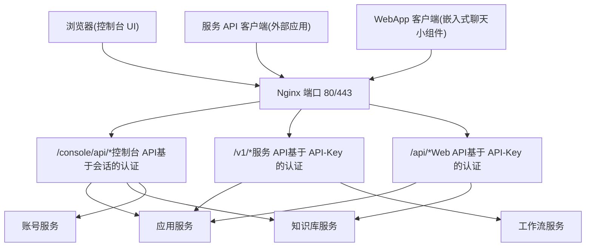
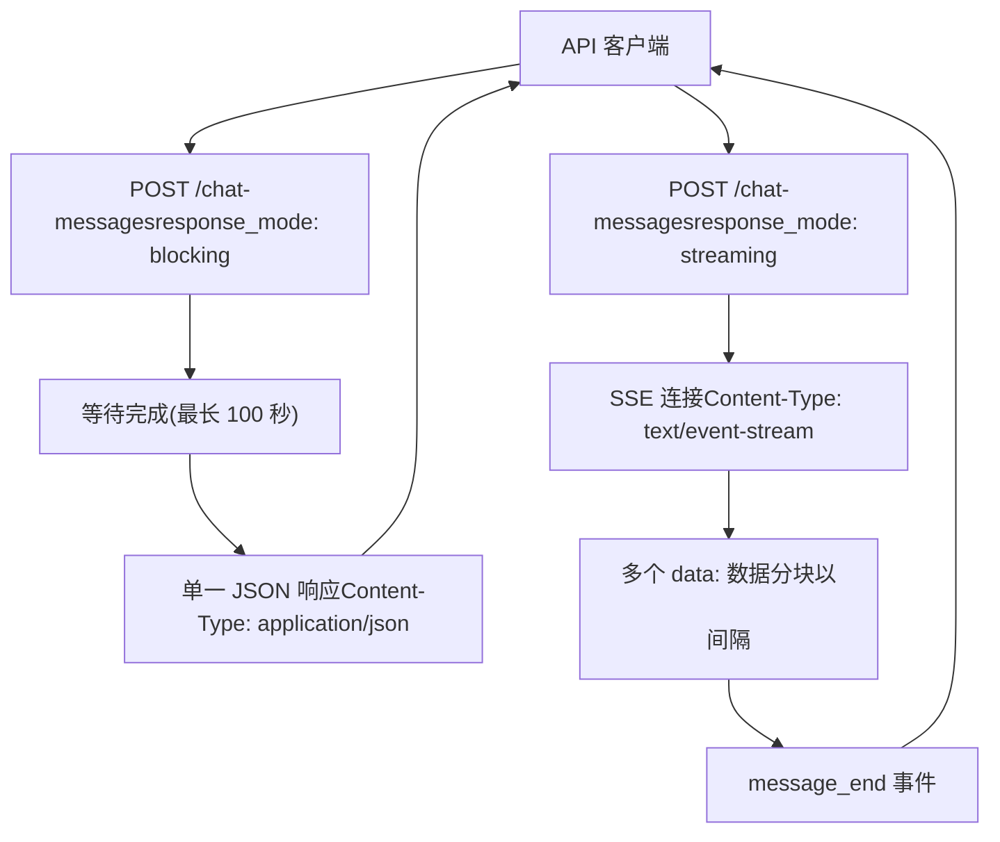
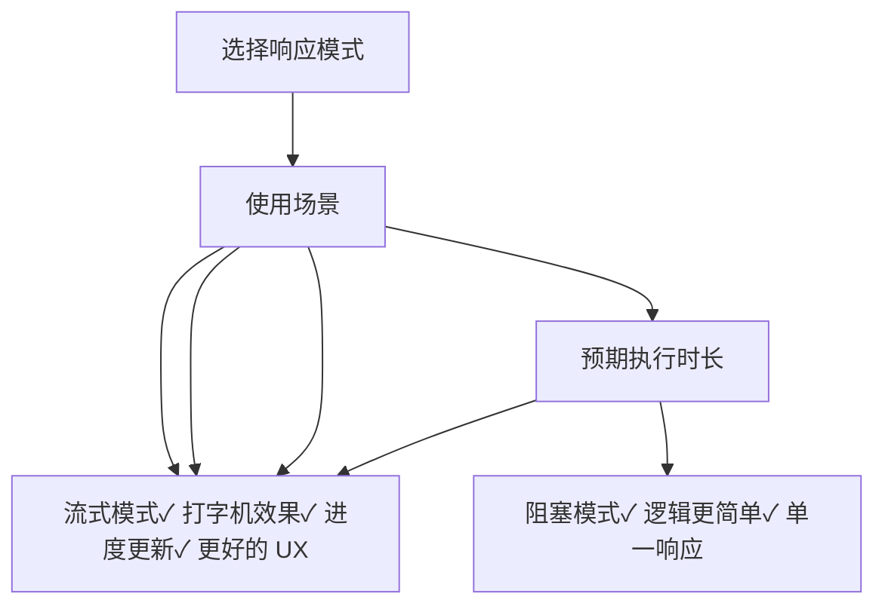

# API 架构与响应模式

相关源文件

-   [web/app/components/develop/template/template.en.mdx](https://github.com/langgenius/dify/blob/92dbc94f/web/app/components/develop/template/template.en.mdx)
-   [web/app/components/develop/template/template.ja.mdx](https://github.com/langgenius/dify/blob/92dbc94f/web/app/components/develop/template/template.ja.mdx)
-   [web/app/components/develop/template/template.zh.mdx](https://github.com/langgenius/dify/blob/92dbc94f/web/app/components/develop/template/template.zh.mdx)
-   [web/app/components/develop/template/template_advanced_chat.en.mdx](https://github.com/langgenius/dify/blob/92dbc94f/web/app/components/develop/template/template_advanced_chat.en.mdx)
-   [web/app/components/develop/template/template_advanced_chat.ja.mdx](https://github.com/langgenius/dify/blob/92dbc94f/web/app/components/develop/template/template_advanced_chat.ja.mdx)
-   [web/app/components/develop/template/template_advanced_chat.zh.mdx](https://github.com/langgenius/dify/blob/92dbc94f/web/app/components/develop/template/template_advanced_chat.zh.mdx)
-   [web/app/components/develop/template/template_chat.en.mdx](https://github.com/langgenius/dify/blob/92dbc94f/web/app/components/develop/template/template_chat.en.mdx)
-   [web/app/components/develop/template/template_chat.ja.mdx](https://github.com/langgenius/dify/blob/92dbc94f/web/app/components/develop/template/template_chat.ja.mdx)
-   [web/app/components/develop/template/template_chat.zh.mdx](https://github.com/langgenius/dify/blob/92dbc94f/web/app/components/develop/template/template_chat.zh.mdx)
-   [web/app/components/develop/template/template_workflow.en.mdx](https://github.com/langgenius/dify/blob/92dbc94f/web/app/components/develop/template/template_workflow.en.mdx)
-   [web/app/components/develop/template/template_workflow.ja.mdx](https://github.com/langgenius/dify/blob/92dbc94f/web/app/components/develop/template/template_workflow.ja.mdx)
-   [web/app/components/develop/template/template_workflow.zh.mdx](https://github.com/langgenius/dify/blob/92dbc94f/web/app/components/develop/template/template_workflow.zh.mdx)

## 目的与范围

本文档描述了 Dify 外部 API 的架构，重点介绍了在所有 API 端点中保持一致的结构模式、身份验证机制和响应交付模式。内容涵盖了三个 API 层（控制台 API、服务 API 和 Web API）、双重响应模式系统（流式与阻塞）以及用于实时流式传输的 Server-Sent Events (SSE) 协议。

有关特定端点的文档，请参阅：

-   **对话与补全 API**：[对话与补全 API](/langgenius/dify/8.2-chat-and-completion-apis)
-   **工作流执行 API**：[工作流执行 API](/langgenius/dify/8.3-workflow-execution-apis)
-   **文件上传与知识库 API**：[文件上传与知识库 API](/langgenius/dify/8.4-file-upload-and-management-apis)

有关 API Key 以外的身份验证和授权详情，请参阅 [账号服务与身份验证流程](/langgenius/dify/7.1-tenant-and-account-models)。

---

## API 分层架构

Dify 暴露了三个截然不同的 API 层，每一层服务于不同的使用场景和身份验证模型：


**API 层对比**

| 分层 | 路径前缀 | 身份验证方式 | 用途 | 典型用户 |
| --- | --- | --- | --- | --- |
| **控制台 API (Console API)** | `/console/api/*` | 会话 Cookie + CSRF 令牌 | 应用配置与管理 | 控制台 Web UI |
| **服务 API (Service API)** | `/v1/*` | Authorization 标头中的 API-Key | 外部应用集成 | 后端服务、移动应用 |
| **Web API** | `/api/*` | Authorization 标头中的 API-Key | 嵌入式聊天小组件 | WebApp 嵌入、公开应用 |

本文档的主要关注点是**服务 API**，因为它提供了面向外部集成的程序化接口。这三个分层共享通用的响应模式和错误处理模式。

**来源：** [web/app/components/develop/template/template_chat.en.mdx8-20](https://github.com/langgenius/dify/blob/92dbc94f/web/app/components/develop/template/template_chat.en.mdx#L8-L20) [web/app/components/develop/template/template_workflow.en.mdx8-20](https://github.com/langgenius/dify/blob/92dbc94f/web/app/components/develop/template/template_workflow.en.mdx#L8-L20)

---

## 身份验证

### API-Key 身份验证

所有服务 API 和 Web API 请求都要求在 `Authorization` HTTP 标头中使用 Bearer 令牌方案传递 API Key：

```
Authorization: Bearer {API_KEY}
```
**安全建议：**

-   仅在服务端存储 API Key；切勿在客户端代码中泄露。
-   使用环境变量或安全的密钥管理系统。
-   定期轮换密钥。
-   在客户端实施频率限制。

### API Key 类型

| 密钥类型 | 路径 | 作用域 | 生命周期 |
| --- | --- | --- | --- |
| **应用 API Key** | 服务 API (`/v1/*`) | 单个应用的访问权限 | 按应用生成，可撤销 |
| **Web API Key** | Web API (`/api/*`) | 公开应用的访问权限 | 与已发布的应用绑定 |

控制台 API 使用基于会话的身份验证（包含 Cookie 和 CSRF 令牌），这由基于浏览器的控制台 UI 自动处理。

**来源：** [web/app/components/develop/template/template_chat.en.mdx12-19](https://github.com/langgenius/dify/blob/92dbc94f/web/app/components/develop/template/template_chat.en.mdx#L12-L19) [web/app/components/develop/template/template_workflow.en.mdx13-19](https://github.com/langgenius/dify/blob/92dbc94f/web/app/components/develop/template/template_workflow.en.mdx#L13-L19)

---

## 响应模式

Dify API 支持两种响应交付模式：**阻塞 (blocking)** 和 **流式 (streaming)**。具体模式通过请求体中的 `response_mode` 参数指定。


**来源：** [web/app/components/develop/template/template_chat.en.mdx44-50](https://github.com/langgenius/dify/blob/92dbc94f/web/app/components/develop/template/template_chat.en.mdx#L44-L50) [web/app/components/develop/template/template_workflow.en.mdx47-57](https://github.com/langgenius/dify/blob/92dbc94f/web/app/components/develop/template/template_workflow.en.mdx#L47-L57)

---

### 阻塞模式 (Blocking Mode)

在阻塞模式下，API 会一直等待直到生成完整的响应，然后返回一个单一的 JSON 对象。

**特性：**

-   `Content-Type: application/json`
-   完成后返回单一 HTTP 响应。
-   请求超时时间：100 秒（Cloudflare 限制）。
-   适用场景：运行时间较短的操作、批处理。

**示例请求：**

```json
{
  "query": "什么是 Dify？",
  "response_mode": "blocking",
  "user": "user-123"
}
```
**示例响应：**

```json
{
  "event": "message",
  "task_id": "c3800678-a077-43df-a102-53f23ed20b88",
  "message_id": "9da23599-e713-473b-982c-4328d4f5c78a",
  "conversation_id": "45701982-8118-4bc5-8e9b-64562b4555f2",
  "mode": "chat",
  "answer": "Dify 是一个 LLM 应用开发平台...",
  "metadata": {
    "usage": {
      "total_tokens": 150,
      "total_price": "0.0001"
    }
  },
  "created_at": 1705395332
}
```
**限制：**

-   Agent 模式下不支持（因为执行时间可能较长）。
-   如果处理时间超过 100 秒，可能会被中断。
-   执行期间无法提供进度更新。

**来源：** [web/app/components/develop/template/template_chat.en.mdx89-104](https://github.com/langgenius/dify/blob/92dbc94f/web/app/components/develop/template/template_chat.en.mdx#L89-L104) [web/app/components/develop/template/template.zh.mdx70-83](https://github.com/langgenius/dify/blob/92dbc94f/web/app/components/develop/template/template.zh.mdx#L70-L83)

---

### 流式模式 (Streaming Mode)（推荐）

流式模式使用 Server-Sent Events (SSE) 增量交付响应，从而实现实时的打字机式输出。

**特性：**

-   `Content-Type: text/event-stream`
-   通过持久连接流式传输多个事件。
-   每个事件以 `data:` 开头，并以 `\n\n`（两个换行符）分隔。
-   支持通过工作流事件进行进度追踪。
-   无超时限制（通过定期发送 `ping` 事件保持连接活跃）。

**示例请求：**

```json
{
  "query": "写一首诗",
  "response_mode": "streaming",
  "user": "user-123"
}
```
**流式响应示例：**

```
data: {"event": "message", "message_id": "abc-123", "answer": "在", "created_at": 1705395332}

data: {"event": "message", "message_id": "abc-123", "answer": " 广阔的", "created_at": 1705395333}

data: {"event": "message", "message_id": "abc-123", "answer": " 原野上", "created_at": 1705395334}

data: {"event": "message_end", "message_id": "abc-123", "metadata": {"usage": {"total_tokens": 50}}}
```
**连接保持 (Keep-Alive)：** 每 10 秒发送一个 `ping` 事件以维持连接：

```
data: {"event": "ping"}
```
**来源：** [web/app/components/develop/template/template_chat.en.mdx106-113](https://github.com/langgenius/dify/blob/92dbc94f/web/app/components/develop/template/template_chat.en.mdx#L106-L113) [web/app/components/develop/template/template_workflow.zh.mdx82-89](https://github.com/langgenius/dify/blob/92dbc94f/web/app/components/develop/template/template_workflow.zh.mdx#L82-L89)

---

## SSE 事件协议

### 事件结构

每个 SSE 事件遵循以下格式：

```
data: {JSON_PAYLOAD}
```
JSON 载荷始终包含：

-   `event` (string)：事件类型标识符。
-   `task_id` (string)：唯一的任务标识符，用于追踪和取消操作。
-   针对特定事件类型的其他字段。

### 连接生命周期

> **[Mermaid 序列图]**
> *(图表结构无法解析)*

**来源：** [web/app/components/develop/template/template_chat.en.mdx106-178](https://github.com/langgenius/dify/blob/92dbc94f/web/app/components/develop/template/template_chat.en.mdx#L106-L178)

---

## 按应用模式划分的事件类型

不同的应用模式会发出不同的事件类型。以下各节详细介绍了每种模式可用的事件。

### 对话与补全事件 (Chat and Completion Events)

由对话应用（基础版和进阶版）以及文本补全应用使用。

| 事件类型 | 描述 | 发送时机 |
| --- | --- | --- |
| `message` | LLM 文本分块 | 文本生成期间（流式） |
| `agent_message` | Agent 文本分块 | Agent 回答期间（仅限 Agent 模式） |
| `agent_thought` | Agent 思考步骤 | 工具执行期间（仅限 Agent 模式） |
| `message_file` | 工具生成的文件 | 当工具创建文件时（Agent 模式） |
| `message_end` | 响应结束 | 所有文本生成完毕后 |
| `message_replace` | 内容审查替换 | 当输出被内容审查拦截并替换时 |
| `tts_message` | TTS 音频块 (base64) | 语音合成期间（如果已启用） |
| `tts_message_end` | TTS 结束 | 所有音频生成完毕后 |
| `error` | 发生错误 | 执行过程中出现任何错误时 |
| `ping` | 连接保持 | 每 10 秒发送一次 |

**对话 `message` 事件：**

```json
{
  "event": "message",
  "task_id": "900bbd43-dc0b-4383-a372-aa6e6c414227",
  "message_id": "663c5084-a254-4040-8ad3-51f2a3c1a77c",
  "conversation_id": "45701982-8118-4bc5-8e9b-64562b4555f2",
  "answer": " 你好",
  "created_at": 1705398420
}
```
**Agent `agent_thought` 事件：**

```json
{
  "event": "agent_thought",
  "id": "592c84cf-07ee-441c-9dcc-ffc66c033469",
  "task_id": "900bbd43-dc0b-4383-a372-aa6e6c414227",
  "message_id": "d35e006c-7c4d-458f-9142-be4930abdf94",
  "position": 1,
  "thought": "我需要搜索相关信息",
  "observation": "搜索结果：...",
  "tool": "google_search",
  "tool_input": "{\"query\": \"Dify 平台\"}",
  "created_at": 1705988186,
  "message_files": ["file-id-123"],
  "conversation_id": "45701982-8118-4bc5-8e9b-64562b4555f2"
}
```
**`message_end` 事件：**

```json
{
  "event": "message_end",
  "task_id": "900bbd43-dc0b-4383-a372-aa6e6c414227",
  "message_id": "663c5084-a254-4040-8ad3-51f2a3c1a77c",
  "conversation_id": "45701982-8118-4bc5-8e9b-64562b4555f2",
  "metadata": {
    "usage": {
      "prompt_tokens": 1033,
      "completion_tokens": 135,
      "total_tokens": 1168,
      "total_price": "0.0013030",
      "currency": "USD"
    },
    "retriever_resources": [
      {
        "position": 1,
        "dataset_id": "101b4c97-fc2e-463c-90b1-5261a4cdcafb",
        "dataset_name": "iPhone",
        "document_id": "8dd1ad74-0b5f-4175-b735-7d98bbbb4e00",
        "segment_id": "ed599c7f-2766-4294-9d1d-e5235a61270a",
        "score": 0.98457545,
        "content": "模型信息..."
      }
    ]
  }
}
```
**来源：** [web/app/components/develop/template/template_chat.en.mdx114-178](https://github.com/langgenius/dify/blob/92dbc94f/web/app/components/develop/template/template_chat.en.mdx#L114-L178) [web/app/components/develop/template/template_chat.zh.mdx114-178](https://github.com/langgenius/dify/blob/92dbc94f/web/app/components/develop/template/template_chat.zh.mdx#L114-L178)

---

### 工作流事件 (Workflow Events)

由工作流应用和进阶版对话应用（基于工作流）使用。

| 事件类型 | 描述 | 发送时机 |
| --- | --- | --- |
| `workflow_started` | 工作流执行开始 | 工作流启动时 |
| `node_started` | 节点开始执行 | 每个节点运行前 |
| `node_finished` | 节点执行完成 | 每个节点完成后 |
| `text_chunk` | 文本输出片段 | 节点生成文本期间 |
| `workflow_finished` | 工作流执行完成 | 所有节点完成后 |
| `error` | 发生错误 | 出现任何错误时 |
| `ping` | 连接保持 | 每 10 秒发送一次 |

**事件流图：**

> **[Mermaid 序列图]**
> *(图表结构无法解析)*

**`workflow_started` 事件：**

```json
{
  "event": "workflow_started",
  "task_id": "5ad4cb98-f0c7-4085-b384-88c403be6290",
  "workflow_run_id": "5ad498-f0c7-4085-b384-88cbe6290",
  "data": {
    "id": "5ad498-f0c7-4085-b384-88cbe6290",
    "workflow_id": "dfjasklfjdslag",
    "created_at": 1679586595
  }
}
```
**`node_started` 事件：**

```json
{
  "event": "node_started",
  "task_id": "5ad4cb98-f0c7-4085-b384-88c403be6290",
  "workflow_run_id": "5ad498-f0c7-4085-b384-88cbe6290",
  "data": {
    "id": "5ad498-f0c7-4085-b384-88cbe6290",
    "node_id": "llm-node-1",
    "node_type": "llm",
    "title": "生成摘要",
    "index": 1,
    "predecessor_node_id": "start-node",
    "inputs": {
      "query": "总结这段文本..."
    },
    "created_at": 1679586595
  }
}
```
**`node_finished` 事件：**

```json
{
  "event": "node_finished",
  "task_id": "5ad4cb98-f0c7-4085-b384-88c403be6290",
  "workflow_run_id": "5ad498-f0c7-4085-b384-88cbe6290",
  "data": {
    "id": "5ad498-f0c7-4085-b384-88cbe6290",
    "node_id": "llm-node-1",
    "node_type": "llm",
    "title": "生成摘要",
    "index": 1,
    "predecessor_node_id": "start-node",
    "inputs": {},
    "outputs": {
      "text": "这是摘要内容..."
    },
    "status": "succeeded",
    "elapsed_time": 1.234,
    "execution_metadata": {
      "total_tokens": 150,
      "total_price": "0.00015",
      "currency": "USD"
    },
    "created_at": 1679586595
  }
}
```
**`text_chunk` 事件：**

```json
{
  "event": "text_chunk",
  "task_id": "bd029338-b068-4d34-a331-fc85478922c2",
  "workflow_run_id": "b85e5fc5-751b-454d-b14e-dc5f240b0a31",
  "data": {
    "text": "你好 ",
    "from_variable_selector": ["1745912968134", "text"]
  }
}
```
**`workflow_finished` 事件：**

```json
{
  "event": "workflow_finished",
  "task_id": "5ad4cb98-f0c7-4085-b384-88c403be6290",
  "workflow_run_id": "5ad498-f0c7-4085-b384-88cbe6290",
  "data": {
    "id": "5ad498-f0c7-4085-b384-88cbe6290",
    "workflow_id": "dfjasklfjdslag",
    "status": "succeeded",
    "outputs": {
      "result": "最终输出文本"
    },
    "elapsed_time": 3.456,
    "total_tokens": 500,
    "total_steps": 3,
    "created_at": 1679586595,
    "finished_at": 1679586598
  }
}
```
**节点状态值：**

-   `running`: 节点正在执行。
-   `succeeded`: 节点执行成功。
-   `failed`: 节点执行出错。
-   `stopped`: 节点被手动停止。

**来源：** [web/app/components/develop/template/template_workflow.en.mdx98-148](https://github.com/langgenius/dify/blob/92dbc94f/web/app/components/develop/template/template_workflow.en.mdx#L98-L148) [web/app/components/develop/template/template_advanced_chat.en.mdx151-209](https://github.com/langgenius/dify/blob/92dbc94f/web/app/components/develop/template/template_advanced_chat.en.mdx#L151-L209)

---

### 错误事件 (Error Events)

当流式执行过程中发生异常时，会发送错误事件。收到错误事件即意味着流的终止。

```json
{
  "event": "error",
  "task_id": "900bbd43-dc0b-4383-a372-aa6e6c414227",
  "message_id": "663c5084-a254-4040-8ad3-51f2a3c1a77c",
  "status": 400,
  "code": "provider_quota_exceeded",
  "message": "模型调用配额已耗尽"
}
```
**错误结构：**

-   `status` (int)：HTTP 状态码。
-   `code` (string)：机器可读的错误代码。
-   `message` (string)：人类可读的错误描述。

**来源：** [web/app/components/develop/template/template_chat.en.mdx170-177](https://github.com/langgenius/dify/blob/92dbc94f/web/app/components/develop/template/template_chat.en.mdx#L170-L177) [web/app/components/develop/template/template_workflow.zh.mdx165-173](https://github.com/langgenius/dify/blob/92dbc94f/web/app/components/develop/template/template_workflow.zh.mdx#L165-L173)

---

## 通用响应对象

### Usage 对象

`Usage` 对象出现在补全响应的 `metadata` 字段中，提供 Token 消耗和成本信息。

```json
{
  "usage": {
    "prompt_tokens": 1033,
    "prompt_unit_price": "0.001",
    "prompt_price_unit": "0.001",
    "prompt_price": "0.0010330",
    "completion_tokens": 128,
    "completion_unit_price": "0.002",
    "completion_price_unit": "0.001",
    "completion_price": "0.0002560",
    "total_tokens": 1161,
    "total_price": "0.0012890",
    "currency": "USD",
    "latency": 0.7682376249867957
  }
}
```
**字段：**

-   `prompt_tokens` (int)：提示词/输入使用的 Token 数。
-   `completion_tokens` (int)：响应生成的 Token 数。
-   `total_tokens` (int)：提示词和补全 Token 的总和。
-   `prompt_price` (string)：提示词 Token 的费用。
-   `completion_price` (string)：补全 Token 的费用。
-   `total_price` (string)：本次请求的总费用。
-   `currency` (string)：货币代码（例如 `USD`, `RMB`）。
-   `latency` (float)：响应耗时（秒）。

**来源：** [web/app/components/develop/template/template_chat.en.mdx228-242](https://github.com/langgenius/dify/blob/92dbc94f/web/app/components/develop/template/template_chat.en.mdx#L228-L242)

---

### RetrieverResource 对象

当使用知识检索时，`RetrieverResource` 对象会出现在响应中，提供引用和归因信息。

```json
{
  "retriever_resources": [
    {
      "position": 1,
      "dataset_id": "101b4c97-fc2e-463c-90b1-5261a4cdcafb",
      "dataset_name": "iPhone",
      "document_id": "8dd1ad74-0b5f-4175-b735-7d98bbbb4e00",
      "document_name": "iPhone 列表",
      "segment_id": "ed599c7f-2766-4294-9d1d-e5235a61270a",
      "score": 0.98457545,
      "content": "型号, 发布日期, 屏幕尺寸..."
    }
  ]
}
```
**字段：**

-   `position` (int)：在检索结果中的排名位置（从 1 开始）。
-   `dataset_id` (string)：知识库的 UUID。
-   `dataset_name` (string)：知识库的显示名称。
-   `document_id` (string)：来源文档的 UUID。
-   `document_name` (string)：文档的显示名称。
-   `segment_id` (string)：具体分段/块的 UUID。
-   `score` (float)：相关性评分（0.0 到 1.0）。
-   `content` (string)：检索到的文本内容。

这些信息使应用能够展示引用，并允许用户追溯答案的来源文档。

**来源：** [web/app/components/develop/template/template_chat.en.mdx243-254](https://github.com/langgenius/dify/blob/92dbc94f/web/app/components/develop/template/template_chat.en.mdx#L243-L254)

---

### Metadata 结构

补全响应中的 `metadata` 对象汇总了用量和检索信息：

```json
{
  "metadata": {
    "usage": {
      "total_tokens": 1168,
      "total_price": "0.0013030",
      "currency": "USD"
    },
    "retriever_resources": [
      {
        "position": 1,
        "dataset_name": "知识库",
        "score": 0.95,
        "content": "..."
      }
    ]
  }
}
```
对于工作流执行，`node_finished` 事件中的 `execution_metadata` 字段提供了单个节点的指标：

```json
{
  "execution_metadata": {
    "total_tokens": 150,
    "total_price": "0.00015",
    "currency": "USD"
  }
}
```
**来源：** [web/app/components/develop/template/template_chat.en.mdx228-255](https://github.com/langgenius/dify/blob/92dbc94f/web/app/components/develop/template/template_chat.en.mdx#L228-L255) [web/app/components/develop/template/template_workflow.en.mdx144-147](https://github.com/langgenius/dify/blob/92dbc94f/web/app/components/develop/template/template_workflow.en.mdx#L144-L147)

---

## 错误处理

### 常见错误码

Dify API 返回标准的 HTTP 状态码以及结构化的错误信息。在流式模式下，错误作为 SSE 事件交付；在阻塞模式下，错误作为 JSON 响应返回。

**错误响应结构（阻塞模式）：**

```json
{
  "code": "provider_quota_exceeded",
  "message": "模型调用配额不足",
  "status": 400
}
```
**错误响应结构（流式模式）：**

```json
{
  "event": "error",
  "task_id": "900bbd43-dc0b-4383-a372-aa6e6c414227",
  "message_id": "663c5084-a254-4040-8ad3-51f2a3c1a77c",
  "status": 400,
  "code": "provider_quota_exceeded",
  "message": "模型调用配额不足"
}
```
**常见错误码：**

| HTTP 状态码 | 错误码 | 描述 |
| --- | --- | --- |
| 400 | `invalid_param` | 请求参数验证失败 |
| 400 | `app_unavailable` | 应用配置不可用 |
| 400 | `provider_not_initialize` | 未配置模型凭据 |
| 400 | `provider_quota_exceeded` | 模型 API 配额超限 |
| 400 | `model_currently_not_support` | 请求的模型当前不可用 |
| 400 | `completion_request_error` | 文本生成失败 |
| 400 | `workflow_request_error` | 工作流执行失败 |
| 400 | `workflow_not_found` | 指定的工作流版本未找到 |
| 400 | `draft_workflow_error` | 无法执行草稿版工作流 |
| 400 | `workflow_id_format_error` | 工作流 ID 格式无效 |
| 404 | `conversation_not_exists` | 会话 ID 未找到 |
| 413 | `file_too_large` | 上传文件超过大小限制 |
| 415 | `unsupported_file_type` | 不支持的文件类型 |
| 503 | `s3_connection_failed` | 存储服务连接失败 |
| 503 | `s3_permission_denied` | 存储权限被拒绝 |
| 500 | (无错误码) | 服务器内部错误 |

**来源：** [web/app/components/develop/template/template_chat.en.mdx179-190](https://github.com/langgenius/dify/blob/92dbc94f/web/app/components/develop/template/template_chat.en.mdx#L179-L190) [web/app/components/develop/template/template_workflow.en.mdx166-173](https://github.com/langgenius/dify/blob/92dbc94f/web/app/components/develop/template/template_workflow.en.mdx#L166-L173)

---

## Trace ID (追踪 ID) 支持

所有 API 端点都支持通过 `trace_id` 参数进行分布式追踪，从而实现与现有可观测性系统的集成。

**优先级顺序（从高到低）：**

1.  **HTTP 标头**：`X-Trace-Id`（推荐方式）。
2.  **查询参数**：`?trace_id=...`
3.  **请求体**：`"trace_id": "..."`

**使用标头的示例：**

```http
POST /v1/chat-messages HTTP/1.1
Host: api.dify.ai
Authorization: Bearer {api_key}
X-Trace-Id: my-custom-trace-id-12345
Content-Type: application/json

{
  "query": "你好",
  "response_mode": "streaming",
  "user": "user-123"
}
```
如果未提供 `trace_id`，系统将自动生成一个。Trace ID 包含在所有日志条目中，可用于将 API 请求与内部工作流执行、LLM 调用及数据库操作进行关联。

**来源：** [web/app/components/develop/template/template_chat.en.mdx80-85](https://github.com/langgenius/dify/blob/92dbc94f/web/app/components/develop/template/template_chat.en.mdx#L80-L85) [web/app/components/develop/template/template_workflow.en.mdx64-68](https://github.com/langgenius/dify/blob/92dbc94f/web/app/components/develop/template/template_workflow.en.mdx#L64-L68)

---

## 响应模式选择指南


**建议：**

**在以下情况下使用流式模式：**

-   构建交互式对话界面。
-   执行时间可能超过 90 秒。
-   使用 Agent 模式（必须使用）。
-   用户需要进度反馈。
-   执行包含多个节点的工作流。

**在以下情况下使用阻塞模式：**

-   实施批处理任务。
-   执行时间短且可预测。
-   集成简单性至关重要。
-   在不支持 SSE 的系统中消费 API。

**来源：** [web/app/components/develop/template/template_chat.en.mdx44-50](https://github.com/langgenius/dify/blob/92dbc94f/web/app/components/develop/template/template_chat.en.mdx#L44-L50) [web/app/components/develop/template/template_workflow.en.mdx54-57](https://github.com/langgenius/dify/blob/92dbc94f/web/app/components/develop/template/template_workflow.en.mdx#L54-L57)
