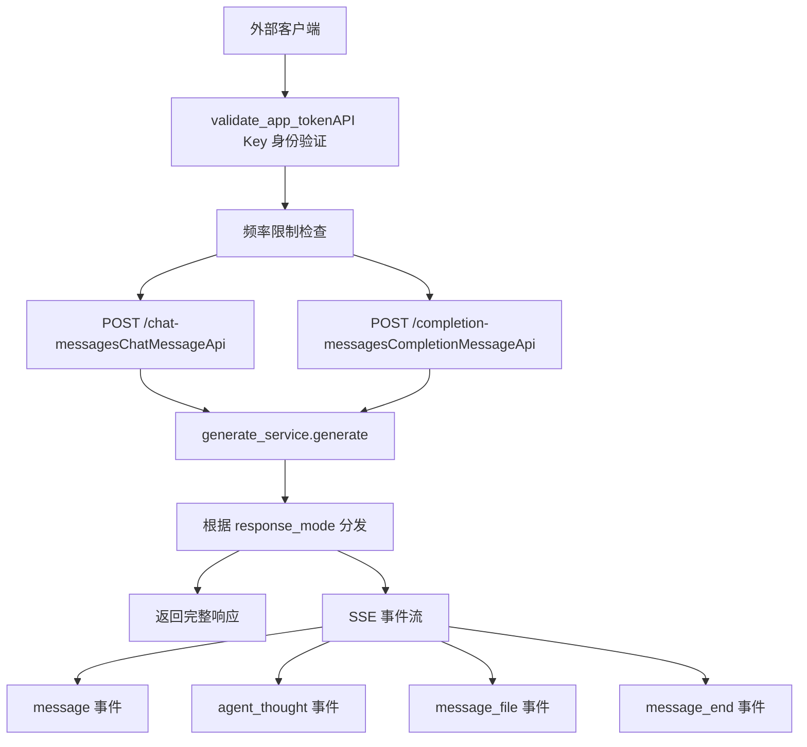
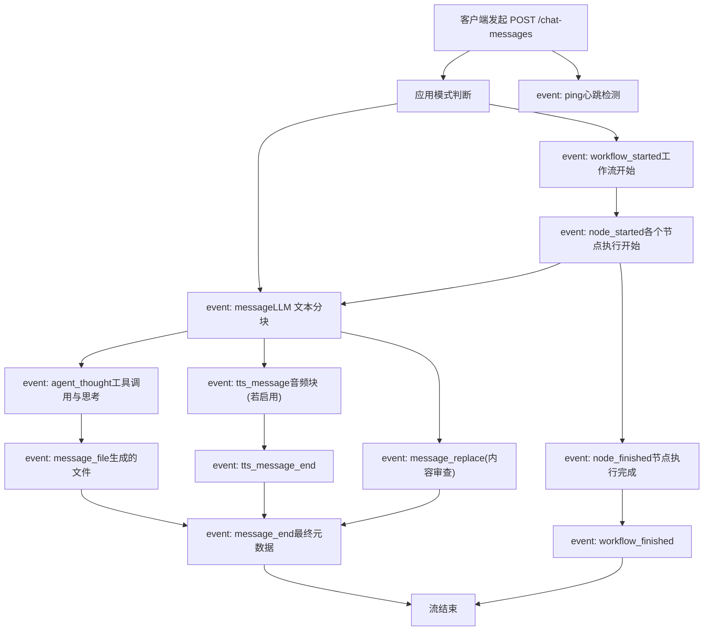
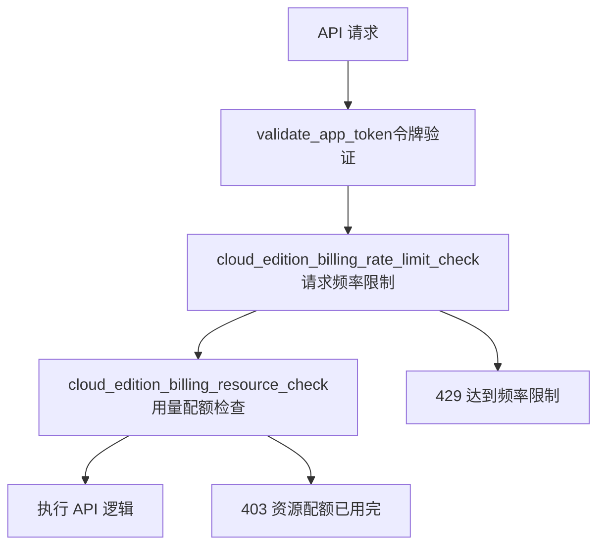

# 对话与补全 API

相关源文件

-   [web/app/components/develop/template/template.en.mdx](https://github.com/langgenius/dify/blob/92dbc94f/web/app/components/develop/template/template.en.mdx)
-   [web/app/components/develop/template/template.ja.mdx](https://github.com/langgenius/dify/blob/92dbc94f/web/app/components/develop/template/template.ja.mdx)
-   [web/app/components/develop/template/template.zh.mdx](https://github.com/langgenius/dify/blob/92dbc94f/web/app/components/develop/template/template.zh.mdx)
-   [web/app/components/develop/template/template_advanced_chat.en.mdx](https://github.com/langgenius/dify/blob/92dbc94f/web/app/components/develop/template/template_advanced_chat.en.mdx)
-   [web/app/components/develop/template/template_advanced_chat.ja.mdx](https://github.com/langgenius/dify/blob/92dbc94f/web/app/components/develop/template/template_advanced_chat.ja.mdx)
-   [web/app/components/develop/template/template_advanced_chat.zh.mdx](https://github.com/langgenius/dify/blob/92dbc94f/web/app/components/develop/template/template_advanced_chat.zh.mdx)
-   [web/app/components/develop/template/template_chat.en.mdx](https://github.com/langgenius/dify/blob/92dbc94f/web/app/components/develop/template/template_chat.en.mdx)
-   [web/app/components/develop/template/template_chat.ja.mdx](https://github.com/langgenius/dify/blob/92dbc94f/web/app/components/develop/template/template_chat.ja.mdx)
-   [web/app/components/develop/template/template_chat.zh.mdx](https://github.com/langgenius/dify/blob/92dbc94f/web/app/components/develop/template/template_chat.zh.mdx)
-   [web/app/components/develop/template/template_workflow.en.mdx](https://github.com/langgenius/dify/blob/92dbc94f/web/app/components/develop/template/template_workflow.en.mdx)
-   [web/app/components/develop/template/template_workflow.ja.mdx](https://github.com/langgenius/dify/blob/92dbc94f/web/app/components/develop/template/template_workflow.ja.mdx)
-   [web/app/components/develop/template/template_workflow.zh.mdx](https://github.com/langgenius/dify/blob/92dbc94f/web/app/components/develop/template/template_workflow.zh.mdx)

本文档详细介绍了对话 (Chat) 和补全 (Completion) 消息 API，这些 API 允许外部应用程序向 Dify 应用发送消息并接收 AI 生成的响应。这些是对话式 AI 和文本生成场景中的核心端点。

有关工作流执行 API，请参阅第 8.3 节。有关应用管理 API，请参阅第 8.4 节。

## 概览

Dify 提供了两个主要的消息发送 API：

-   **对话 API (Chat API)** (`/chat-messages`)：用于具有会话持久性的对话应用。支持会话历史、Agent 模式和工具调用。
-   **补全 API (Completion API)** (`/completion-messages`)：用于无状态的文本生成，不包含对话上下文。适用于翻译、摘要和内容生成。

### 对话 API 与 补全 API 对比

| 功能 | 对话 API | 补全 API |
| --- | --- | --- |
| 端点 | `/chat-messages` | `/completion-messages` |
| 会话持久性 | 是（通过 `conversation_id`） | 否 |
| Agent 模式支持 | 是 | 否 |
| 工具调用 | 是（在 Agent 模式下） | 否 |
| 会话历史 | 是 | 否 |
| 使用场景 | 聊天机器人、客户服务 | 翻译、内容生成 |

## API 请求流程


**来源：** [web/app/components/develop/template/template_chat.en.mdx4-21](https://github.com/langgenius/dify/blob/92dbc94f/web/app/components/develop/template/template_chat.en.mdx#L4-L21) [web/app/components/develop/template/template.en.mdx4-21](https://github.com/langgenius/dify/blob/92dbc94f/web/app/components/develop/template/template.en.mdx#L4-L21)

## 身份验证

所有服务 API 端点都通过 `Authorization` HTTP 标头使用 API-Key 进行身份验证：

```
Authorization: Bearer {API_KEY}
```
API Key 标识了特定的应用和终端用户上下文。每个应用的 API Key 均在 Dify 控制台中生成。API Key 应存储在服务端，切勿泄露在客户端代码中。

**来源：** [web/app/components/develop/template/template_chat.en.mdx12-20](https://github.com/langgenius/dify/blob/92dbc94f/web/app/components/develop/template/template_chat.en.mdx#L12-L20) [web/app/components/develop/template/template.en.mdx12-20](https://github.com/langgenius/dify/blob/92dbc94f/web/app/components/develop/template/template.en.mdx#L12-L20)

## 对话 API (Chat API)

对话 API (`POST /chat-messages`) 支持具有会话持久性的对话应用。它支持多种应用模式：基础助手、Agent 助手和进阶版对话（基于工作流）。

### 端点

```
POST {api_base_url}/chat-messages
```
### 请求体参数

| 参数 | 类型 | 是否必填 | 描述 |
| --- | --- | --- | --- |
| `query` | string | 是 | 用户输入/提问的内容 |
| `inputs` | object | 否 | 应用定义的变量值（键值对）。默认：`{}` |
| `response_mode` | string | 是 | 响应模式：`streaming` (推荐) 或 `blocking` |
| `user` | string | 是 | 唯一的终端用户标识符，用于追踪和统计 |
| `conversation_id` | string | 否 | 会话 ID，用于继续现有会话 |
| `files` | array[object] | 否 | 用于多模态输入的外部文件列表（图像、文档、音频、视频） |
| `auto_generate_name` | boolean | 否 | 是否自动生成会话标题。默认：`true` |
| `workflow_id` | string | 否 | 特定工作流版本 ID（针对进阶版对话应用） |
| `trace_id` | string | 否 | 分布式追踪 ID，用于端到端追踪 |

#### 文件对象结构

在 `files` 参数中提供文件时：

| 字段 | 类型 | 描述 |
| --- | --- | --- |
| `type` | string | 文件类型：`document`, `image`, `audio`, `video` 或 `custom` |
| `transfer_method` | string | 传输方式：`remote_url` 或 `local_file` |
| `url` | string | 文件 URL（仅当 `transfer_method` 为 `remote_url` 时） |
| `upload_file_id` | string | 已上传文件 ID（仅当 `transfer_method` 为 `local_file` 时） |

各类别支持的文件格式：

-   **document**: TXT, MD, PDF, HTML, XLSX, DOCX, CSV, PPT, XML, EPUB 等。
-   **image**: JPG, PNG, GIF, WEBP, SVG。
-   **audio**: MP3, M4A, WAV, WEBM, MPGA。
-   **video**: MP4, MOV, MPEG, WEBM。

**来源：** [web/app/components/develop/template/template_chat.en.mdx34-85](https://github.com/langgenius/dify/blob/92dbc94f/web/app/components/develop/template/template_chat.en.mdx#L34-L85) [web/app/components/develop/template/template_chat.zh.mdx34-83](https://github.com/langgenius/dify/blob/92dbc94f/web/app/components/develop/template/template_chat.zh.mdx#L34-L83)

### 响应模式

#### 阻塞模式 (Blocking Mode)

执行完成后在单一 JSON 对象中返回完整响应：

```json
{
  "event": "message",
  "task_id": "c3800678-a077-43df-a102-53f23ed20b88",
  "id": "9da23599-e713-473b-982c-4328d4f5c78a",
  "message_id": "9da23599-e713-473b-982c-4328d4f5c78a",
  "conversation_id": "45701982-8118-4bc5-8e9b-64562b4555f2",
  "mode": "chat",
  "answer": "iPhone 13 Pro Max 的规格是...",
  "metadata": {
    "usage": {...},
    "retriever_resources": [...]
  },
  "created_at": 1705407629
}
```
**注意**：Agent 助手模式不支持阻塞模式。如果执行时间超过 100 秒，请求可能会被中断（Cloudflare 限制）。

**来源：** [web/app/components/develop/template/template_chat.en.mdx216-258](https://github.com/langgenius/dify/blob/92dbc94f/web/app/components/develop/template/template_chat.en.mdx#L216-L258)

#### 流式模式 (Streaming Mode)（推荐）

返回包含增量更新的 Server-Sent Events (SSE) 流。每个事件的格式为：

```
data: {"event": "event_type", ...}\n\n
```
事件之间由两个换行符 (`\n\n`) 分隔。

### 流式事件类型


**来源：** [web/app/components/develop/template/template_chat.en.mdx105-176](https://github.com/langgenius/dify/blob/92dbc94f/web/app/components/develop/template/template_chat.en.mdx#L105-L176) [web/app/components/develop/template/template_advanced_chat.en.mdx114-216](https://github.com/langgenius/dify/blob/92dbc94f/web/app/components/develop/template/template_advanced_chat.en.mdx#L114-L216)

#### 事件：message

LLM 返回的文本分块事件。完整文本以分块形式输出，从而实现打字机效果。

**字段：**

-   `task_id` (string)：用于请求追踪的任务 ID。
-   `message_id` (string)：唯一的消息 ID。
-   `conversation_id` (string)：会话 ID。
-   `answer` (string)：文本分块内容。
-   `created_at` (int)：Unix 时间戳。

**示例：**

```json
{
  "event": "message",
  "task_id": "900bbd43-dc0b-4383-a372-aa6e6c414227",
  "message_id": "5ad4cb98-f0c7-4085-b384-88c403be6290",
  "conversation_id": "45701982-8118-4bc5-8e9b-64562b4555f2",
  "answer": " 很高兴认识你",
  "created_at": 1679586595
}
```
**来源：** [web/app/components/develop/template/template_chat.en.mdx114-119](https://github.com/langgenius/dify/blob/92dbc94f/web/app/components/develop/template/template_chat.en.mdx#L114-L119)

#### 事件：agent_thought

Agent 模式事件，包含 LLM 推理和工具执行详情。仅在 Agent 助手模式下存在。

**字段：**

-   `id` (string)：本次迭代的唯一 Agent 思考 ID。
-   `task_id` (string)：任务 ID。
-   `message_id` (string)：消息 ID。
-   `position` (int)：迭代序列中的位置（从 1 开始）。
-   `thought` (string)：Agent 内部推理内容。
-   `observation` (string)：工具执行结果。
-   `tool` (string)：使用的工具名，多个工具以 `;` 分隔。
-   `tool_input` (string)：工具输入的 JSON 字符串，例如 `{"dalle3": {"prompt": "一只可爱的猫"}}`。
-   `created_at` (int)：Unix 时间戳。
-   `message_files` (array)：工具创建的文件 ID 列表。
-   `conversation_id` (string)：会话 ID。

**示例：**

```json
{
  "event": "agent_thought",
  "id": "8dcf3648-fbad-407a-85dd-73a6f43aeb9f",
  "task_id": "9cf1ddd7-f94b-459b-b942-b77b26c59e9b",
  "message_id": "1fb10045-55fd-4040-99e6-d048d07cbad3",
  "position": 1,
  "thought": "",
  "observation": "",
  "tool": "dalle3",
  "tool_input": "{\"dalle3\": {\"prompt\": \"可爱的小猫\"}}",
  "created_at": 1705639511,
  "message_files": [],
  "conversation_id": "c216c595-2d89-438c-b33c-aae5ddddd142"
}
```
**来源：** [web/app/components/develop/template/template_chat.en.mdx136-148](https://github.com/langgenius/dify/blob/92dbc94f/web/app/components/develop/template/template_chat.en.mdx#L136-L148)

#### 事件：message_file

文件事件，指示工具（Agent 模式下）创建了新文件或有文件需要展示。

**字段：**

-   `id` (string)：唯一的文件 ID。
-   `type` (string)：文件类型，目前仅支持 `image`。
-   `belongs_to` (string)：归属者，在此 API 中始终为 `assistant`。
-   `url` (string)：文件访问 URL。
-   `conversation_id` (string)：会话 ID。

**示例：**

```json
{
  "event": "message_file",
  "id": "976990d2-5294-47e6-8f14-7356ba9d2d76",
  "type": "image",
  "url": "http://127.0.0.1:5001/files/tools/976990d2-...",
  "belongs_to": "assistant",
  "conversation_id": "957c068b-f258-4f89-ba10-6e8a0361c457"
}
```
**来源：** [web/app/components/develop/template/template_chat.en.mdx149-154](https://github.com/langgenius/dify/blob/92dbc94f/web/app/components/develop/template/template_chat.en.mdx#L149-L154)

#### 事件：message_end

消息完成事件，指示流式传输已结束。包含最终的元数据。

**字段：**

-   `task_id` (string)：任务 ID。
-   `message_id` (string)：消息 ID。
-   `conversation_id` (string)：会话 ID。
-   `metadata` (object)：元数据对象。
    -   `usage` (Usage)：模型使用信息（Token 数、成本）。
    -   `retriever_resources` (array[RetrieverResource])：知识库引用来源。

**示例：**

```json
{
  "event": "message_end",
  "id": "5e52ce04-874b-4d27-9045-b3bc80def685",
  "conversation_id": "45701982-8118-4bc5-8e9b-64562b4555f2",
  "metadata": {
    "usage": {
      "prompt_tokens": 1033,
      "completion_tokens": 135,
      "total_tokens": 1168,
      "total_price": "0.0013030",
      "currency": "USD",
      "latency": 1.381760165997548
    },
    "retriever_resources": [...]
  }
}
```
**来源：** [web/app/components/develop/template/template_chat.en.mdx155-161](https://github.com/langgenius/dify/blob/92dbc94f/web/app/components/develop/template/template_chat.en.mdx#L155-L161)

#### 事件：tts_message 和 tts_message_end

用于语音合成输出的 TTS 音频流事件。仅在启用自动播放时存在。

**tts_message 字段：**

-   `task_id` (string)：任务 ID。
-   `message_id` (string)：消息 ID。
-   `audio` (string)：Base64 编码的 MP3 音频分块。
-   `created_at` (int)：Unix 时间戳。

**tts_message_end** 具有相同的结构，但 `audio` 为空字符串，指示音频流已结束。

**来源：** [web/app/components/develop/template/template_chat.en.mdx126-135](https://github.com/langgenius/dify/blob/92dbc94f/web/app/components/develop/template/template_chat.en.mdx#L126-L135)

#### 事件：message_replace

内容审查事件。当启用输出内容审查且内容被拦截时，此事件将消息内容替换为预设回复。

**字段：**

-   `task_id` (string)：任务 ID。
-   `message_id` (string)：消息 ID。
-   `conversation_id` (string)：会话 ID。
-   `answer` (string)：替换后的内容（替换所有 LLM 回复文本）。
-   `created_at` (int)：Unix 时间戳。

**来源：** [web/app/components/develop/template/template_chat.en.mdx162-168](https://github.com/langgenius/dify/blob/92dbc94f/web/app/components/develop/template/template_chat.en.mdx#L162-L168)

#### 事件：workflow_started, node_started, node_finished, workflow_finished

进阶版对话模式下的工作流执行事件。详见第 8.3 节关于工作流执行事件的文档。

**来源：** [web/app/components/develop/template/template_advanced_chat.en.mdx151-208](https://github.com/langgenius/dify/blob/92dbc94f/web/app/components/develop/template/template_advanced_chat.en.mdx#L151-L208)

#### 事件：error

流式传输期间的错误事件。收到此事件将终止流。

**字段：**

-   `task_id` (string)：任务 ID。
-   `message_id` (string)：消息 ID。
-   `status` (int)：HTTP 状态码。
-   `code` (string)：错误代码。
-   `message` (string)：错误描述。

**来源：** [web/app/components/develop/template/template_chat.en.mdx169-175](https://github.com/langgenius/dify/blob/92dbc94f/web/app/components/develop/template/template_chat.en.mdx#L169-L175)

#### 事件：ping

每 10 秒发送一次的心跳事件，用于维持连接。

**来源：** [web/app/components/develop/template/template_chat.en.mdx176](https://github.com/langgenius/dify/blob/92dbc94f/web/app/components/develop/template/template_chat.en.mdx#L176-L176)

### 错误代码

| 代码 | 描述 |
| --- | --- |
| `404` | 会话不存在 |
| `invalid_param` | 输入参数无效 |
| `app_unavailable` | 应用配置不可用 |
| `provider_not_initialize` | 未配置可用的模型凭据 |
| `provider_quota_exceeded` | 模型调用配额不足 |
| `model_currently_not_support` | 当前模型不受支持 |
| `workflow_not_found` | 未找到指定的工作流版本 |
| `draft_workflow_error` | 无法使用草稿版工作流 |
| `workflow_id_format_error` | 工作流 ID 格式无效（应为 UUID） |
| `completion_request_error` | 文本生成失败 |
| `500` | 服务器内部错误 |

**来源：** [web/app/components/develop/template/template_chat.en.mdx178-189](https://github.com/langgenius/dify/blob/92dbc94f/web/app/components/develop/template/template_chat.en.mdx#L178-L189)

## 文本补全 API (Completion API)

文本补全 API (`POST /completion-messages`) 提供无状态的文本生成，不包含会话持久性。适用于翻译、文章写作、摘要以及单轮生成任务。

### 端点

```
POST {api_base_url}/completion-messages
```
### 与对话 API 的主要区别

| 特性 | 补全 API | 对话 API |
| --- | --- | --- |
| 会话支持 | 无 `conversation_id` | 有 |
| Agent 模式 | 不支持 | 支持 |
| 会话历史 | 不维护 | 维护 |
| 事件类型 | 简化（无 Agent 事件） | 全量事件集 |
| 使用场景 | 单轮生成 | 多轮对话 |

### 请求体参数

| 参数 | 类型 | 是否必填 | 描述 |
| --- | --- | --- | --- |
| `inputs` | object | 是 | 必须至少包含一个键值对。通常包含带输入文本的 `query` 字段 |
| `response_mode` | string | 是 | `streaming` 或 `blocking` |
| `user` | string | 是 | 唯一的终端用户标识符 |
| `files` | array[object] | 否 | 文件列表（结构同对话 API） |

**请求示例：**

```bash
curl -X POST 'https://api.dify.ai/v1/completion-messages' \
  --header 'Authorization: Bearer {api_key}' \
  --header 'Content-Type: application/json' \
  --data-raw '{
    "inputs": {"query": "将以下内容翻译成法语：你好"},
    "response_mode": "streaming",
    "user": "abc-123"
  }'
```
**来源：** [web/app/components/develop/template/template.en.mdx24-69](https://github.com/langgenius/dify/blob/92dbc94f/web/app/components/develop/template/template.en.mdx#L24-L69) [web/app/components/develop/template/template.zh.mdx24-68](https://github.com/langgenius/dify/blob/92dbc94f/web/app/components/develop/template/template.zh.mdx#L24-L68)

### 响应格式

#### 阻塞模式响应

```json
{
  "id": "0b089b9a-24d9-48cc-94f8-762677276261",
  "answer": "Bonjour",
  "created_at": 1679586667
}
```
#### 流式模式事件

与对话 API 相比，补全 API 使用简化的事件结构：

-   `event: message` - LLM 文本分块。
-   `event: message_end` - 包含用量和检索资源的最终元数据。
-   `event: tts_message` / `event: tts_message_end` - TTS 音频（若启用）。
-   `event: message_replace` - 内容审查替换。
-   `event: error` - 生成过程中的错误。
-   `event: ping` - 每 10 秒发送一次的心跳。

**不包含 Agent 特有事件** (`agent_thought`, `agent_message`)，因为不支持 Agent 模式。

**来源：** [web/app/components/develop/template/template.en.mdx86-127](https://github.com/langgenius/dify/blob/92dbc94f/web/app/components/develop/template/template.en.mdx#L86-L127)

## 文件操作

### 文件上传

上传文件以供具有多模态能力的对话或补全消息使用。

**端点：** `POST /files/upload`

**请求格式：** `multipart/form-data`

**参数：**

-   `file` (File, 必填)：待上传的文件。
-   `user` (string, 必填)：用户标识符（必须与消息端点中的用户一致）。

**响应：**

```json
{
  "id": "72fa9618-8f89-4a37-9b33-7e1178a24a67",
  "name": "example.png",
  "size": 1024,
  "extension": "png",
  "mime_type": "image/png",
  "created_by": "6ad1ab0a-73ff-4ac1-b9e4-cdb312f71f13",
  "created_at": 1577836800
}
```
在对话/补全请求的 `files` 参数中使用返回的 `id`，设置 `transfer_method: "local_file"` 并指定 `upload_file_id: "{id}"`。

**支持格式：** 图像支持 PNG, JPG, JPEG, WEBP, GIF。文档、音频和视频格式遵循文件类型规范。

**错误代码：**

-   `no_file_uploaded` (400)：必须提供文件。
-   `too_many_files` (400)：每次请求仅接受一个文件。
-   `file_too_large` (413)：文件超过大小限制。
-   `unsupported_file_type` (415)：不支持的文件扩展名。
-   `s3_connection_failed` (503)：无法连接到 S3。
-   `s3_permission_denied` (503)：无 S3 上传权限。

**来源：** [web/app/components/develop/template/template_chat.en.mdx292-361](https://github.com/langgenius/dify/blob/92dbc94f/web/app/components/develop/template/template_chat.en.mdx#L292-L361)

### 文件预览

预览或下载先前上传的文件。

**端点：** `GET /files/{file_id}/preview`

**路径参数：**

-   `file_id` (string, 必填)：上传响应中获得的文件 ID。

**查询参数：**

-   `as_attachment` (boolean, 选填)：强制作为附件下载。默认：`false`（在浏览器中预览）。

**响应标头：**

-   `Content-Type`: 基于文件 MIME 类型。
-   `Content-Length`: 文件字节大小。
-   `Content-Disposition`: 若 `as_attachment=true` 则设置为 "attachment"。
-   `Cache-Control`: 缓存标头。
-   `Accept-Ranges`: 针对音频/视频文件的 "bytes"。

**访问控制：** 仅当文件属于请求应用内的消息时才可访问。

**错误代码：**

-   `invalid_param` (400)：参数无效。
-   `file_access_denied` (403)：文件访问被拒绝或不属于该应用。
-   `file_not_found` (404)：文件未找到或已删除。
-   `500`: 服务器内部错误。

**来源：** [web/app/components/develop/template/template_chat.en.mdx364-437](https://github.com/langgenius/dify/blob/92dbc94f/web/app/components/develop/template/template_chat.en.mdx#L364-L437)

## 消息管理操作

### 停止生成

停止正在进行中的流式消息生成。

**端点：** `POST /chat-messages/{task_id}/stop` 或 `POST /completion-messages/{task_id}/stop`

**路径参数：**

-   `task_id` (string, 必填)：从流式分块中获取的任务 ID。

**请求体：**

```json
{
  "user": "abc-123"
}
```
**响应：**

```json
{
  "result": "success"
}
```
**注意：** 仅支持流式模式。`user` 参数必须与发起消息的用户一致。

**来源：** [web/app/components/develop/template/template_chat.en.mdx442-479](https://github.com/langgenius/dify/blob/92dbc94f/web/app/components/develop/template/template_chat.en.mdx#L442-L479)

### 消息反馈

提交用户对消息的反馈（点赞/点踩），帮助优化输出。

**端点：** `POST /messages/{message_id}/feedbacks`

**路径参数：**

-   `message_id` (string, 必填)：消息 ID。

**请求体：**

```json
{
  "rating": "like",
  "user": "abc-123",
  "content": "非常棒的回答，很有帮助！"
}
```
**参数：**

-   `rating` (string, 必填)：`like` (点赞), `dislike` (点踩), 或 `null` (撤销)。
-   `user` (string, 必填)：用户标识符。
-   `content` (string, 选填)：具体的反馈文本。

**响应：**

```json
{
  "result": "success"
}
```
**来源：** [web/app/components/develop/template/template_chat.en.mdx484-541](https://github.com/langgenius/dify/blob/92dbc94f/web/app/components/develop/template/template_chat.en.mdx#L484-L541)

### 获取应用反馈

检索应用的所有反馈记录。

**端点：** `GET /app/feedbacks`

**查询参数：**

-   `page` (int, 选填)：页码，默认：1。
-   `limit` (int, 选填)：每页记录数，默认：20。

**响应：**

```json
{
  "data": [
    {
      "id": "8c0fbed8-e2f9-49ff-9f0e-15a35bdd0e25",
      "app_id": "f252d396-fe48-450e-94ec-e184218e7346",
      "conversation_id": "2397604b-9deb-430e-b285-4726e51fd62d",
      "message_id": "709c0b0f-0a96-4a4e-91a4-ec0889937b11",
      "rating": "like",
      "content": "消息反馈信息",
      "from_source": "user",
      "from_end_user_id": "74286412-9a1a-42c1-929c-01edb1d381d5",
      "created_at": "2025-04-24T09:24:38",
      "updated_at": "2025-04-24T09:24:38"
    }
  ]
}
```
**来源：** [web/app/components/develop/template/template_chat.en.mdx545-602](https://github.com/langgenius/dify/blob/92dbc94f/web/app/components/develop/template/template_chat.en.mdx#L545-L602)

### 获取下一步建议提问

获取当前消息的后续建议提问。

**端点：** `GET /messages/{message_id}/suggested`

**路径参数：**

-   `message_id` (string, 必填)：消息 ID。

**查询参数：**

-   `user` (string, 必填)：用户标识符。

**响应：**

```json
{
  "result": "success",
  "data": ["价格是多少？", "它是如何运作的？", "我可以试用吗？"]
}
```
**来源：** [web/app/components/develop/template/template_chat.en.mdx606-655](https://github.com/langgenius/dify/blob/92dbc94f/web/app/components/develop/template/template_chat.en.mdx#L606-L655)

### 获取历史消息

分页检索会话中的历史聊天消息。

**端点：** `GET /messages`

**查询参数：**

-   `conversation_id` (string, 必填)：会话 ID。
-   `user` (string, 必填)：用户标识符。
-   `first_id` (string, 选填)：当前页面的第一条消息 ID（用于分页）。
-   `limit` (int, 选填)：单次请求的消息数，默认：20。

**响应格式：**

按时间倒序返回消息（最新消息在前）。

```json
{
  "limit": 20,
  "has_more": false,
  "data": [
    {
      "id": "a076a87f-31e5-48dc-b452-0061adbbc922",
      "conversation_id": "cd78daf6-f9e4-4463-9ff2-54257230a0ce",
      "inputs": {"name": "dify"},
      "query": "什么是 iPhone 13 Pro Max？",
      "answer": "iPhone 13 Pro Max 具有...",
      "message_files": [],
      "feedback": null,
      "retriever_resources": [...],
      "agent_thoughts": [],
      "created_at": 1705569239
    }
  ]
}
```
**消息字段：**

-   `id`: 消息 ID。
-   `conversation_id`: 会话 ID。
-   `inputs`: 用户输入变量。
-   `query`: 用户问题/输入文本。
-   `answer`: 助手回答。
-   `message_files`: 附件文件。
-   `agent_thoughts`: Agent 思考过程（仅限 Agent 模式，否则为空）。
-   `feedback`: 用户反馈对象。
-   `retriever_resources`: 知识库引用。
-   `created_at`: Unix 时间戳。

**来源：** [web/app/components/develop/template/template_chat.en.mdx660-802](https://github.com/langgenius/dify/blob/92dbc94f/web/app/components/develop/template/template_chat.en.mdx#L660-L802)

## 响应元数据结构

### Usage 对象

`metadata` 中的 `usage` 对象提供模型 Token 和成本信息：

```json
{
  "usage": {
    "prompt_tokens": 1033,
    "prompt_unit_price": "0.001",
    "prompt_price_unit": "0.001",
    "prompt_price": "0.0010330",
    "completion_tokens": 128,
    "completion_unit_price": "0.002",
    "completion_price_unit": "0.001",
    "completion_price": "0.0002560",
    "total_tokens": 1161,
    "total_price": "0.0012890",
    "currency": "USD",
    "latency": 0.7682376249867957
  }
}
```
**字段说明：**

-   `prompt_tokens`: 提示词使用的 Token 数。
-   `completion_tokens`: 补全生成的 Token 数。
-   `total_tokens`: 使用的总 Token 数。
-   `prompt_price` / `completion_price`: 费用明细。
-   `total_price`: 总费用。
-   `currency`: 货币代码（USD, RMB 等）。
-   `latency`: 响应耗时（秒）。

**来源：** [web/app/components/develop/template/template_chat.en.mdx228-241](https://github.com/langgenius/dify/blob/92dbc94f/web/app/components/develop/template/template_chat.en.mdx#L228-L241)

### RetrieverResource 对象

`retriever_resources` 数组包含知识库引用信息：

```json
{
  "retriever_resources": [
    {
      "position": 1,
      "dataset_id": "101b4c97-fc2e-463c-90b1-5261a4cdcafb",
      "dataset_name": "iPhone",
      "document_id": "8dd1ad74-0b5f-4175-b735-7d98bbbb4e00",
      "document_name": "iPhone 列表",
      "segment_id": "ed599c7f-2766-4294-9d1d-e5235a61270a",
      "score": 0.98457545,
      "content": "型号, 发布日期, 屏幕尺寸..."
    }
  ]
}
```
**字段说明：**

-   `position`: 引用位置/排名。
-   `dataset_id` / `dataset_name`: 来源知识库。
-   `document_id` / `document_name`: 来源文档。
-   `segment_id`: 具体分段/块 ID。
-   `score`: 相关性/相似度评分。
-   `content`: 检索到的文本内容。

**来源：** [web/app/components/develop/template/template_chat.en.mdx242-254](https://github.com/langgenius/dify/blob/92dbc94f/web/app/components/develop/template/template_chat.en.mdx#L242-L254)

### Agent Thoughts (Agent 思考) 结构

针对 Agent 助手模式，`agent_thoughts` 提供了详细的工具执行历史：

```json
{
  "agent_thoughts": [
    {
      "id": "592c84cf-07ee-441c-9dcc-ffc66c033469",
      "message_id": "d35e006c-7c4d-458f-9142-be4930abdf94",
      "position": 1,
      "thought": "我需要搜索相关信息",
      "tool": "google_search",
      "tool_input": "{\"google_search\": {\"query\": \"最新新闻\"}}",
      "observation": "搜索结果：...",
      "message_files": ["file_id_1"],
      "created_at": 1705988186
    }
  ]
}
```
**来源：** [web/app/components/develop/template/template_chat.en.mdx789-800](https://github.com/langgenius/dify/blob/92dbc94f/web/app/components/develop/template/template_chat.en.mdx#L789-L800)

## 响应格式标准

### 流式响应格式

所有流式 API 均使用 Server-Sent Events (SSE)，格式如下：

```
data: {"event": "event_type", "data": {...}}
```
### 错误处理

通用的错误响应结构：

```json
{
  "code": "error_code",
  "message": "错误描述",
  "status": 400
}
```
#### 标准错误代码

| 代码 | 描述 |
| --- | --- |
| `invalid_param` | 请求参数无效 |
| `app_unavailable` | 应用未配置 |
| `provider_not_initialize` | 模型供应商未配置 |
| `provider_quota_exceeded` | API 配额已超限 |
| `model_currently_not_support` | 模型当前不可用 |

**来源：** [web/app/components/develop/template/template_chat.en.mdx178-189](https://github.com/langgenius/dify/blob/92dbc94f/web/app/components/develop/template/template_chat.en.mdx#L178-L189)

## 频率限制与计费

服务 API 实施了多项保护措施：


频率限制应用于多个层级：

-   **知识库操作**：文档创建、分段操作。
-   **生成操作**：对话、补全、工作流执行。
-   **资源使用**：向量空间、文档数量限制。

**来源：** [api/controllers/service_api/dataset/document.py89-91](https://github.com/langgenius/dify/blob/92dbc94f/api/controllers/service_api/dataset/document.py#L89-L91) [controllers/service_api/wraps.py](https://github.com/langgenius/dify/blob/92dbc94f/controllers/service_api/wraps.py)
