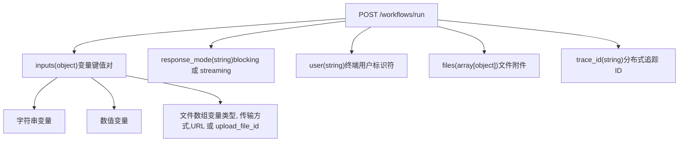
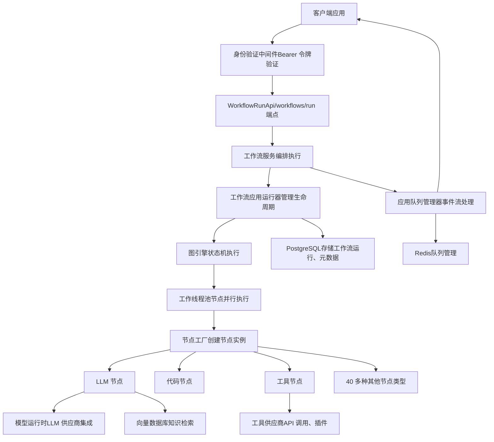

# 工作流执行 API

相关源文件

-   [web/app/components/develop/template/template.en.mdx](https://github.com/langgenius/dify/blob/92dbc94f/web/app/components/develop/template/template.en.mdx)
-   [web/app/components/develop/template/template.ja.mdx](https://github.com/langgenius/dify/blob/92dbc94f/web/app/components/develop/template/template.ja.mdx)
-   [web/app/components/develop/template/template.zh.mdx](https://github.com/langgenius/dify/blob/92dbc94f/web/app/components/develop/template/template.zh.mdx)
-   [web/app/components/develop/template/template_advanced_chat.en.mdx](https://github.com/langgenius/dify/blob/92dbc94f/web/app/components/develop/template/template_advanced_chat.en.mdx)
-   [web/app/components/develop/template/template_advanced_chat.ja.mdx](https://github.com/langgenius/dify/blob/92dbc94f/web/app/components/develop/template/template_advanced_chat.ja.mdx)
-   [web/app/components/develop/template/template_advanced_chat.zh.mdx](https://github.com/langgenius/dify/blob/92dbc94f/web/app/components/develop/template/template_advanced_chat.zh.mdx)
-   [web/app/components/develop/template/template_chat.en.mdx](https://github.com/langgenius/dify/blob/92dbc94f/web/app/components/develop/template/template_chat.en.mdx)
-   [web/app/components/develop/template/template_chat.ja.mdx](https://github.com/langgenius/dify/blob/92dbc94f/web/app/components/develop/template/template_chat.ja.mdx)
-   [web/app/components/develop/template/template_chat.zh.mdx](https://github.com/langgenius/dify/blob/92dbc94f/web/app/components/develop/template/template_chat.zh.mdx)
-   [web/app/components/develop/template/template_workflow.en.mdx](https://github.com/langgenius/dify/blob/92dbc94f/web/app/components/develop/template/template_workflow.en.mdx)
-   [web/app/components/develop/template/template_workflow.ja.mdx](https://github.com/langgenius/dify/blob/92dbc94f/web/app/components/develop/template/template_workflow.ja.mdx)
-   [web/app/components/develop/template/template_workflow.zh.mdx](https://github.com/langgenius/dify/blob/92dbc94f/web/app/components/develop/template/template_workflow.zh.mdx)

## 目的与范围

本页记录了用于以程序化方式执行工作流 (Workflow) 应用的服务 API。工作流应用是无状态的一次性执行应用，专为翻译、内容生成、数据处理和文档分析等任务而设计。与对话应用不同，工作流在多次执行之间不维护会话历史。

对于包含工作流编排的对话式应用（进阶版对话模式），请参阅 [对话与补全 API](/langgenius/dify/8.2-chat-and-completion-apis)。有关通用 API 身份验证和响应模式的概念，请参阅 [API 架构与响应模式](/langgenius/dify/8.1-api-architecture-and-response-modes)。有关底层工作流执行引擎的了解，请参阅 [图引擎与工作流编排](/langgenius/dify/5.1-workflow-definition-and-execution-model)。

---

## 工作流执行端点

### 端点概览

工作流应用通过单一的 HTTP 端点执行：

**POST** `/workflows/run`

此端点使用提供的输入变量执行已发布的工作流，并以完整响应（阻塞模式）或事件流（流式模式）的形式返回结果。

**核心特性：**

-   **无状态**：每次执行都是独立的；不维护会话上下文。
-   **输入驱动**：需要工作流“开始”节点中定义的输入变量。
-   **基于事件**：流式传输详细的执行事件，便于监控和调试。
-   **同步或异步**：支持阻塞和流式两种响应模式。

**来源：** [web/app/components/develop/template/template_workflow.en.mdx24-32](https://github.com/langgenius/dify/blob/92dbc94f/web/app/components/develop/template/template_workflow.en.mdx#L24-L32) [web/app/components/develop/template/template_workflow.zh.mdx24-32](https://github.com/langgenius/dify/blob/92dbc94f/web/app/components/develop/template/template_workflow.zh.mdx#L24-L32)

---

## 请求结构

### 请求参数


### 输入变量 (`inputs`)

`inputs` 参数接受与工作流“开始”节点定义的变量相对应的键值对。变量类型包括：

| 变量类型 | 格式 | 示例 |
| --- | --- | --- |
| **字符串 (String)** | 普通字符串 | `{"query": "翻译这段文本"}` |
| **数值 (Number)** | 数值 | `{"temperature": 0.7}` |
| **文件数组 (File Array)** | 文件对象数组 | 见下文的文件数组结构 |

**来源：** [web/app/components/develop/template/template_workflow.en.mdx34-52](https://github.com/langgenius/dify/blob/92dbc94f/web/app/components/develop/template/template_workflow.en.mdx#L34-L52) [web/app/components/develop/template/template_workflow.zh.mdx34-61](https://github.com/langgenius/dify/blob/92dbc94f/web/app/components/develop/template/template_workflow.zh.mdx#L34-L61)

### 文件数组变量

当工作流变量配置为“文件数组”类型时，对应的值必须是一个数组，其中每个元素包含：

```json
{
  "inputs": {
    "documents": [
      {
        "type": "document",
        "transfer_method": "local_file",
        "upload_file_id": "72fa9618-8f89-4a37-9b33-7e1178a24a67"
      },
      {
        "type": "image",
        "transfer_method": "remote_url",
        "url": "https://example.com/diagram.png"
      }
    ]
  }
}
```
**文件对象结构：**

| 字段 | 类型 | 描述 |
| --- | --- | --- |
| `type` | string | 文件类别：`document`, `image`, `audio`, `video` 或 `custom` |
| `transfer_method` | string | `local_file` (通过文件上传 API 上传) 或 `remote_url` |
| `upload_file_id` | string | 已上传文件的 ID (当 `transfer_method=local_file` 时) |
| `url` | string | 远程文件 URL (当 `transfer_method=remote_url` 时) |

**支持的文件类型：**

-   **文档 (Document)**：TXT, MD, MARKDOWN, PDF, HTML, XLSX, XLS, DOCX, CSV, EML, MSG, PPTX, PPT, XML, EPUB。
-   **图像 (Image)**：JPG, JPEG, PNG, GIF, WEBP, SVG。
-   **音频 (Audio)**：MP3, M4A, WAV, WEBM, MPGA。
-   **视频 (Video)**：MP4, MOV, MPEG, WEBM。

**来源：** [web/app/components/develop/template/template_workflow.en.mdx38-52](https://github.com/langgenius/dify/blob/92dbc94f/web/app/components/develop/template/template_workflow.en.mdx#L38-L52) [web/app/components/develop/template/template_workflow.zh.mdx36-52](https://github.com/langgenius/dify/blob/92dbc94f/web/app/components/develop/template/template_workflow.zh.mdx#L36-L52)

### 响应模式 (`response_mode`)

决定 API 如何返回工作流执行结果：

-   **`streaming`** (推荐)：随着工作流执行，通过 Server-Sent Events (SSE) 返回事件。提供实时进度更新并允许提前终止。
-   **`blocking`**：等待工作流执行完成后返回最终结果。由于基础设施限制，如果执行时间超过 100 秒，可能会被中断。

**来源：** [web/app/components/develop/template/template_workflow.en.mdx54-57](https://github.com/langgenius/dify/blob/92dbc94f/web/app/components/develop/template/template_workflow.en.mdx#L54-L57) [web/app/components/develop/template/template_workflow.zh.mdx48-51](https://github.com/langgenius/dify/blob/92dbc94f/web/app/components/develop/template/template_workflow.zh.mdx#L48-L51)

### Trace ID (追踪 ID) (`trace_id`)

用于集成分布式追踪的可选参数。可以通过三种方式提供（按优先级排序）：

1.  **HTTP 标头**：`X-Trace-Id`（最高优先级）。
2.  **查询参数**：`?trace_id=xxx`
3.  **请求体**：`"trace_id": "xxx"`

如果未提供，系统会自动生成一个唯一的追踪 ID。

**来源：** [web/app/components/develop/template/template_workflow.en.mdx64-68](https://github.com/langgenius/dify/blob/92dbc94f/web/app/components/develop/template/template_workflow.en.mdx#L64-L68) [web/app/components/develop/template/template_workflow.zh.mdx56-60](https://github.com/langgenius/dify/blob/92dbc94f/web/app/components/develop/template/template_workflow.zh.mdx#L56-L60)

---

## 阻塞模式 (Blocking Mode) 响应

### 响应结构

当 `response_mode=blocking` 时，API 在工作流执行完成后返回一个 JSON 响应：

```json
{
  "workflow_run_id": "b85e5fc5-751b-454d-b14e-dc5f240b0a31",
  "task_id": "bd029338-b068-4d34-a331-fc85478922c2",
  "data": {
    "id": "b85e5fc5-751b-454d-b14e-dc5f240b0a31",
    "workflow_id": "dfjasklfjdslag",
    "status": "succeeded",
    "outputs": {
      "text": "很高兴见到你。",
      "result": 42
    },
    "error": null,
    "elapsed_time": 0.875,
    "total_tokens": 3562,
    "total_steps": 8,
    "created_at": 1705407629,
    "finished_at": 1705407630
  }
}
```
### 响应字段

| 字段 | 类型 | 描述 |
| --- | --- | --- |
| `workflow_run_id` | string | 本次工作流执行的唯一标识符 |
| `task_id` | string | 用于请求追踪和停止 API 的任务 ID |
| `data.id` | string | 同 `workflow_run_id` |
| `data.workflow_id` | string | 被执行的工作流定义 ID |
| `data.status` | string | 执行状态：`running`, `succeeded`, `failed` 或 `stopped` |
| `data.outputs` | object | 来自工作流“结束”节点输出的键值对 |
| `data.error` | string | 如果 `status=failed` 则显示错误消息 |
| `data.elapsed_time` | float | 总执行耗时（秒） |
| `data.total_tokens` | int | LLM 节点消耗的总 Token 数 |
| `data.total_steps` | int | 已执行的节点数量 |
| `data.created_at` | timestamp | 执行开始时的 Unix 时间戳 |
| `data.finished_at` | timestamp | 执行完成时的 Unix 时间戳 |

**来源：** [web/app/components/develop/template/template_workflow.en.mdx74-88](https://github.com/langgenius/dify/blob/92dbc94f/web/app/components/develop/template/template_workflow.en.mdx#L74-L88) [web/app/components/develop/template/template_workflow.zh.mdx66-80](https://github.com/langgenius/dify/blob/92dbc94f/web/app/components/develop/template/template_workflow.zh.mdx#L66-L80)

---

## 流式模式 (Streaming Mode) 响应

### 事件流格式

当 `response_mode=streaming` 时，API 通过具有 `Content-Type: text/event-stream` 的 Server-Sent Events (SSE) 返回事件。每个事件的格式如下：

```
data: {"event": "event_type", "task_id": "...", "workflow_run_id": "...", "data": {...}}
```
事件以 `data:` 开头，并以两个换行符 (`\n\n`) 分隔。

**来源：** [web/app/components/develop/template/template_workflow.en.mdx90-96](https://github.com/langgenius/dify/blob/92dbc94f/web/app/components/develop/template/template_workflow.en.mdx#L90-L96) [web/app/components/develop/template/template_workflow.zh.mdx82-89](https://github.com/langgenius/dify/blob/92dbc94f/web/app/components/develop/template/template_workflow.zh.mdx#L82-L89)

### 工作流执行事件序列

> **[Mermaid 序列图]**
> *(图表结构无法解析)*

### 事件类型

#### 1. `workflow_started`

在工作流执行开始时发出。

```json
{
  "event": "workflow_started",
  "task_id": "bd029338-b068-4d34-a331-fc85478922c2",
  "workflow_run_id": "b85e5fc5-751b-454d-b14e-dc5f240b0a31",
  "data": {
    "id": "b85e5fc5-751b-454d-b14e-dc5f240b0a31",
    "workflow_id": "dfjasklfjdslag",
    "created_at": 1705395332
  }
}
```
**来源：** [web/app/components/develop/template/template_workflow.en.mdx99-106](https://github.com/langgenius/dify/blob/92dbc94f/web/app/components/develop/template/template_workflow.en.mdx#L99-L106) [web/app/components/develop/template/template_workflow.zh.mdx91-98](https://github.com/langgenius/dify/blob/92dbc94f/web/app/components/develop/template/template_workflow.zh.mdx#L91-L98)

#### 2. `node_started`

在工作流节点开始执行时发出。

```json
{
  "event": "node_started",
  "task_id": "bd029338-b068-4d34-a331-fc85478922c2",
  "workflow_run_id": "b85e5fc5-751b-454d-b14e-dc5f240b0a31",
  "data": {
    "id": "5ad498-f0c7-4085-b384-88cbe6290",
    "node_id": "llm_node_1745912968134",
    "node_type": "llm",
    "title": "LLM 节点",
    "index": 2,
    "predecessor_node_id": "start_node_id",
    "inputs": {
      "query": "你好，世界"
    },
    "created_at": 1705395332
  }
}
```
**关键字段：**

-   `node_id`：工作流图中该节点的唯一标识符。
-   `node_type`：节点类型（例如 `start`, `llm`, `code`, `if-else`, `end`）。
-   `index`：执行序列号，用于 UI 追踪展示。
-   `predecessor_node_id`：执行路径中前序节点的 ID。
-   `inputs`：该节点使用的所有输入变量值。

**来源：** [web/app/components/develop/template/template_workflow.en.mdx107-119](https://github.com/langgenius/dify/blob/92dbc94f/web/app/components/develop/template/template_workflow.en.mdx#L107-L119) [web/app/components/develop/template/template_workflow.zh.mdx99-111](https://github.com/langgenius/dify/blob/92dbc94f/web/app/components/develop/template/template_workflow.zh.mdx#L99-L111)

#### 3. `text_chunk`

当节点产生文本输出时发出（通常来自启用了流式的 LLM 节点或“直接回复”节点）。

```json
{
  "event": "text_chunk",
  "task_id": "bd029338-b068-4d34-a331-fc85478922c2",
  "workflow_run_id": "b85e5fc5-751b-454d-b14e-dc5f240b0a31",
  "data": {
    "text": "Hello, ",
    "from_variable_selector": ["llm_node_1745912968134", "text"]
  }
}
```
`from_variable_selector` 数组指示了来源节点 ID 和输出变量名，允许开发者追踪文本是由哪个节点生成的。

**来源：** [web/app/components/develop/template/template_workflow.en.mdx120-126](https://github.com/langgenius/dify/blob/92dbc94f/web/app/components/develop/template/template_workflow.en.mdx#L120-L126) [web/app/components/develop/template/template_workflow.zh.mdx112-118](https://github.com/langgenius/dify/blob/92dbc94f/web/app/components/develop/template/template_workflow.zh.mdx#L112-L118)

#### 4. `node_finished`

在节点执行完成（无论成功还是失败）时发出。

```json
{
  "event": "node_finished",
  "task_id": "bd029338-b068-4d34-a331-fc85478922c2",
  "workflow_run_id": "b85e5fc5-751b-454d-b14e-dc5f240b0a31",
  "data": {
    "id": "5ad498-f0c7-4085-b384-88cbe6290",
    "node_id": "llm_node_1745912968134",
    "node_type": "llm",
    "title": "LLM 节点",
    "index": 2,
    "predecessor_node_id": "start_node_id",
    "inputs": {...},
    "process_data": {...},
    "outputs": {
      "text": "你好，我能为您做些什么？"
    },
    "status": "succeeded",
    "error": null,
    "elapsed_time": 1.234,
    "execution_metadata": {
      "total_tokens": 150,
      "total_price": 0.0003,
      "currency": "USD"
    },
    "created_at": 1705395332
  }
}
```
**状态值：**

-   `running`: 节点仍在执行中（不应出现在完成事件中）。
-   `succeeded`: 节点执行成功。
-   `failed`: 节点执行过程中遇到错误。
-   `stopped`: 节点被用户停止。

**来源：** [web/app/components/develop/template/template_workflow.en.mdx127-148](https://github.com/langgenius/dify/blob/92dbc94f/web/app/components/develop/template/template_workflow.en.mdx#L127-L148) [web/app/components/develop/template/template_workflow.zh.mdx119-138](https://github.com/langgenius/dify/blob/92dbc94f/web/app/components/develop/template/template_workflow.zh.mdx#L119-L138)

#### 5. `workflow_finished`

在整个工作流执行完成时发出。

```json
{
  "event": "workflow_finished",
  "task_id": "bd029338-b068-4d34-a331-fc85478922c2",
  "workflow_run_id": "b85e5fc5-751b-454d-b14e-dc5f240b0a31",
  "data": {
    "id": "b85e5fc5-751b-454d-b14e-dc5f240b0a31",
    "workflow_id": "dfjasklfjdslag",
    "status": "succeeded",
    "outputs": {
      "result": "翻译完成",
      "word_count": 234
    },
    "error": null,
    "elapsed_time": 5.432,
    "total_tokens": 1250,
    "total_steps": 8,
    "created_at": 1705395332,
    "finished_at": 1705395337
  }
}
```
`outputs` 对象包含工作流“结束”节点配置中的键值对。

**来源：** [web/app/components/develop/template/template_workflow.en.mdx149-162](https://github.com/langgenius/dify/blob/92dbc94f/web/app/components/develop/template/template_workflow.en.mdx#L149-L162) [web/app/components/develop/template/template_workflow.zh.mdx139-153](https://github.com/langgenius/dify/blob/92dbc94f/web/app/components/develop/template/template_workflow.zh.mdx#L139-L153)

#### 6. `tts_message` 和 `tts_message_end`

如果启用了文本转语音 (TTS)，音频分块将以 Base64 编码的 MP3 数据流形式发送：

```json
{
  "event": "tts_message",
  "task_id": "bd029338-b068-4d34-a331-fc85478922c2",
  "message_id": "a8bdc41c-13b2-4c18-bfd9-054b9803038c",
  "audio": "qqqqqqqqqqqqqqqqqq...",
  "created_at": 1721205487
}
```
`tts_message_end` 事件通过空的 `audio` 字段信号通知音频流已结束。

**来源：** [web/app/components/develop/template/template_workflow.en.mdx163-171](https://github.com/langgenius/dify/blob/92dbc94f/web/app/components/develop/template/template_workflow.en.mdx#L163-L171) [web/app/components/develop/template/template_workflow.zh.mdx154-163](https://github.com/langgenius/dify/blob/92dbc94f/web/app/components/develop/template/template_workflow.zh.mdx#L154-L163)

#### 7. `ping`

每 10 秒发送一次的心跳事件，用于维持 SSE 连接。

**来源：** [web/app/components/develop/template/template_workflow.en.mdx172](https://github.com/langgenius/dify/blob/92dbc94f/web/app/components/develop/template/template_workflow.en.mdx#L172-L172) [web/app/components/develop/template/template_workflow.zh.mdx164](https://github.com/langgenius/dify/blob/92dbc94f/web/app/components/develop/template/template_workflow.zh.mdx#L164-L164)

#### 8. `error`

在工作流执行过程中发生错误时发出。收到此事件将终止流。

```json
{
  "event": "error",
  "task_id": "bd029338-b068-4d34-a331-fc85478922c2",
  "workflow_run_id": "b85e5fc5-751b-454d-b14e-dc5f240b0a31",
  "status": 400,
  "code": "workflow_request_error",
  "message": "节点执行失败：LLM 配额已耗尽"
}
```
**来源：** [web/app/components/develop/template/template_workflow.en.mdx173-179](https://github.com/langgenius/dify/blob/92dbc94f/web/app/components/develop/template/template_workflow.en.mdx#L173-L179)

---

## 请求流程架构

### 端到端执行流程


**来源：** 根据系统图表及 [web/app/components/develop/template/template_workflow.en.mdx1-298](https://github.com/langgenius/dify/blob/92dbc94f/web/app/components/develop/template/template_workflow.en.mdx#L1-L298) 推论出的架构。

### 关键组件

| 组件 | 职责 |
| --- | --- |
| **WorkflowRunApi** | HTTP 端点处理程序，负责请求验证和身份验证。 |
| **WorkflowService** | 业务逻辑编排，负责工作流的获取。 |
| **WorkflowAppRunner** | 生命周期管理，负责事件的发出。 |
| **GraphEngine** | 工作流图的执行，负责状态管理。 |
| **WorkerPool** | 并行节点执行，负责并发控制。 |
| **AppQueueManager** | 事件入队和 SSE 流式传输。 |
| **NodeFactory** | 根据类型动态实例化节点。 |

---

## 错误处理

### 错误响应码

| 状态码 | 错误码 | 描述 |
| --- | --- | --- |
| 400 | `invalid_param` | 请求参数无效。 |
| 400 | `app_unavailable` | 未找到工作流应用或应用未发布。 |
| 400 | `provider_not_initialize` | LLM 供应商凭据未配置。 |
| 400 | `provider_quota_exceeded` | LLM 供应商配额已耗尽。 |
| 400 | `model_currently_not_support` | 请求的模型不可用。 |
| 400 | `workflow_request_error` | 工作流执行通用失败。 |
| 500 | - | 服务器内部错误。 |

在流式模式下，错误作为 `error` 事件返回。在阻塞模式下，错误作为标准的 HTTP 错误响应返回。

**来源：** [web/app/components/develop/template/template_workflow.en.mdx181-188](https://github.com/langgenius/dify/blob/92dbc94f/web/app/components/develop/template/template_workflow.en.mdx#L181-L188) [web/app/components/develop/template/template_workflow.zh.mdx166-173](https://github.com/langgenius/dify/blob/92dbc94f/web/app/components/develop/template/template_workflow.zh.mdx#L166-L173)

### 错误事件示例

```json
{
  "event": "error",
  "task_id": "bd029338-b068-4d34-a331-fc85478922c2",
  "workflow_run_id": "b85e5fc5-751b-454d-b14e-dc5f240b0a31",
  "status": 400,
  "code": "provider_quota_exceeded",
  "message": "OpenAI API 配额已超限。请检查您的计费设置。"
}
```
---

## 完整的请求示例

### 示例 1：简单的翻译工作流

**请求：**

```bash
curl -X POST 'https://api.dify.ai/v1/workflows/run' \
  --header 'Authorization: Bearer {api_key}' \
  --header 'Content-Type: application/json' \
  --data-raw '{
    "inputs": {
      "source_text": "Hello, world!",
      "target_language": "Spanish"
    },
    "response_mode": "blocking",
    "user": "user-123"
  }'
```
**响应：**

```json
{
  "workflow_run_id": "a1b2c3d4-e5f6-7890-abcd-ef1234567890",
  "task_id": "task-xyz-123",
  "data": {
    "id": "a1b2c3d4-e5f6-7890-abcd-ef1234567890",
    "workflow_id": "workflow-abc-456",
    "status": "succeeded",
    "outputs": {
      "translated_text": "¡Hola, mundo!"
    },
    "elapsed_time": 1.2,
    "total_tokens": 45,
    "total_steps": 3,
    "created_at": 1705395332,
    "finished_at": 1705395333
  }
}
```
**来源：** [web/app/components/develop/template/template_workflow.en.mdx177-228](https://github.com/langgenius/dify/blob/92dbc94f/web/app/components/develop/template/template_workflow.en.mdx#L177-L228)

### 示例 2：带文件数组的文档分析

**请求：**

```bash
curl -X POST 'https://api.dify.ai/v1/workflows/run' \
  --header 'Authorization: Bearer {api_key}' \
  --header 'Content-Type: application/json' \
  --data-raw '{
    "inputs": {
      "documents": [
        {
          "type": "document",
          "transfer_method": "local_file",
          "upload_file_id": "72fa9618-8f89-4a37-9b33-7e1178a24a67"
        },
        {
          "type": "document",
          "transfer_method": "remote_url",
          "url": "https://example.com/report.pdf"
        }
      ],
      "analysis_type": "summary"
    },
    "response_mode": "streaming",
    "user": "user-456"
  }'
```
**流式响应：**

```
data: {"event": "workflow_started", "task_id": "task-123", "workflow_run_id": "run-456", "data": {"id": "run-456", "workflow_id": "wf-789", "created_at": 1705395332}}

data: {"event": "node_started", "task_id": "task-123", "workflow_run_id": "run-456", "data": {"id": "exec-1", "node_id": "start", "node_type": "start", "title": "开始", "index": 0, "inputs": {}, "created_at": 1705395332}}

data: {"event": "node_finished", "task_id": "task-123", "workflow_run_id": "run-456", "data": {"id": "exec-1", "node_id": "start", "status": "succeeded", "outputs": {}, "elapsed_time": 0.01, "created_at": 1705395332}}

data: {"event": "node_started", "task_id": "task-123", "workflow_run_id": "run-456", "data": {"id": "exec-2", "node_id": "llm-1", "node_type": "llm", "title": "文档分析器", "index": 1, "inputs": {"documents": [...]}, "created_at": 1705395333}}

data: {"event": "text_chunk", "task_id": "task-123", "workflow_run_id": "run-456", "data": {"text": "这些文档包含 ", "from_variable_selector": ["llm-1", "text"]}}

data: {"event": "text_chunk", "task_id": "task-123", "workflow_run_id": "run-456", "data": {"text": "对季度业绩的分析...", "from_variable_selector": ["llm-1", "text"]}}

data: {"event": "node_finished", "task_id": "task-123", "workflow_run_id": "run-456", "data": {"id": "exec-2", "node_id": "llm-1", "status": "succeeded", "outputs": {"text": "这些文档包含对季度业绩的分析..."}, "elapsed_time": 2.5, "execution_metadata": {"total_tokens": 523, "total_price": 0.0052, "currency": "USD"}, "created_at": 1705395333}}

data: {"event": "workflow_finished", "task_id": "task-123", "workflow_run_id": "run-456", "data": {"id": "run-456", "workflow_id": "wf-789", "status": "succeeded", "outputs": {"summary": "这些文档包含对季度业绩的分析..."}, "elapsed_time": 2.6, "total_tokens": 523, "total_steps": 2, "created_at": 1705395332, "finished_at": 1705395335}}
```
**来源：** [web/app/components/develop/template/template_workflow.en.mdx230-237](https://github.com/langgenius/dify/blob/92dbc94f/web/app/components/develop/template/template_workflow.en.mdx#L230-L237)

---

## 停止工作流执行

### 停止端点

可以在执行中途使用停止 API（仅在流式模式下可用）停止工作流：

**POST** `/workflows/tasks/{task_id}/stop`

**请求体：**

```json
{
  "user": "user-123"
}
```
**响应：**

```json
{
  "result": "success"
}
```
`user` 参数必须与原始工作流运行请求中的用户标识符匹配。停止后，会发出一个 `status: "stopped"` 的 `workflow_finished` 事件。

**来源：** [web/app/components/develop/template/template_workflow.en.mdx239-268](https://github.com/langgenius/dify/blob/92dbc94f/web/app/components/develop/template/template_workflow.en.mdx#L239-L268)

---

## 对比：工作流应用 vs 进阶版对话

### 主要区别

| 特性 | 工作流应用 (Workflow App) | 进阶版对话 (Advanced Chat) |
| --- | --- | --- |
| **端点** | `/workflows/run` | `/chat-messages` |
| **状态** | 无状态（无会话历史） | 有状态（维护会话上下文） |
| `conversation_id` | 不支持 | 多轮对话所必需 |
| `message_id` | 事件中不包含 | 包含在所有事件中 |
| **使用场景** | 翻译、批处理、数据转换 | 客户支持、聊天机器人、交互式 AI |
| **事件类型** | 仅限工作流事件 | 工作流事件 + 消息事件 + Agent 事件 |

### 何时使用哪种 API

-   **在以下情况使用工作流应用 API：**
    -   每个请求都是独立的。
    -   不需要会话历史。
    -   处理文档、翻译或数据转换任务。
    -   构建批处理流水线。
-   **在以下情况使用进阶版对话 API：**
    -   需要在多轮对话之间维护上下文。
    -   构建聊天机器人或对话界面。
    -   用户需要引用之前的对话内容。
    -   需要包含工具调用的 Agent 模式。

**来源：** 基于 [web/app/components/develop/template/template_workflow.en.mdx1-298](https://github.com/langgenius/dify/blob/92dbc94f/web/app/components/develop/template/template_workflow.en.mdx#L1-L298) 和 [web/app/components/develop/template/template_advanced_chat.en.mdx1-694](https://github.com/langgenius/dify/blob/92dbc94f/web/app/components/develop/template/template_advanced_chat.en.mdx#L1-L694) 的对比推论。

---

## 附加资源

有关使用 `transfer_method=local_file` 时所需的文件上传功能，请参阅 [文件上传与知识库 API](/langgenius/dify/8.4-file-upload-and-management-apis)。

有关身份验证和基础 API 概念的了解，请参阅 [API 架构与响应模式](/langgenius/dify/8.1-api-architecture-and-response-modes)。

有关底层工作流执行引擎架构的信息，请参阅 [图引擎与工作流编排](/langgenius/dify/5.1-workflow-definition-and-execution-model)。

有关工作流节点类型及其能力的信息，请参阅 [工作流节点类型与容器节点](/langgenius/dify/5.3-knowledge-retrieval-and-question-classifier-nodes)。
