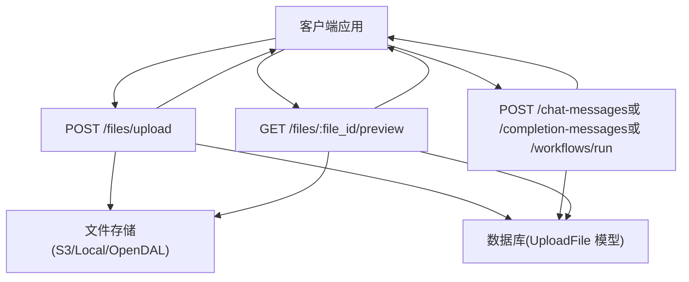
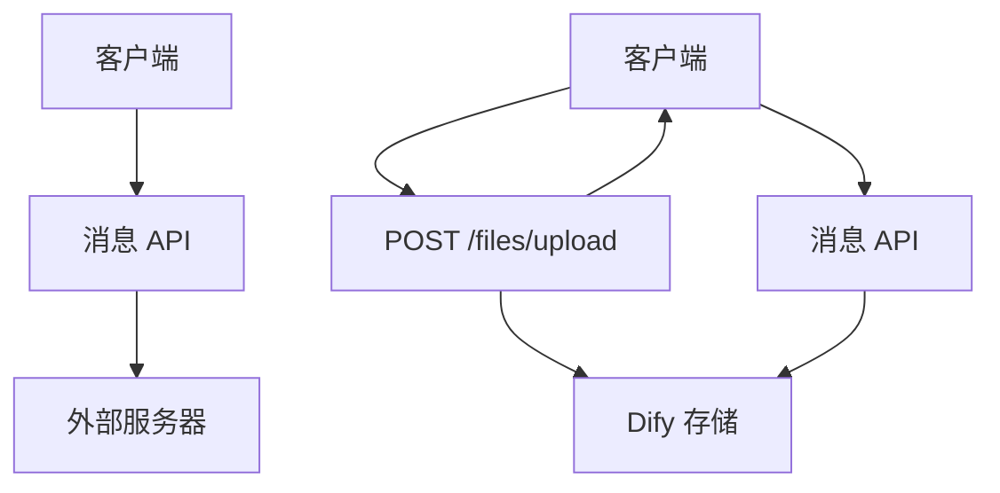
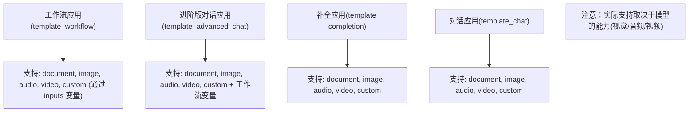
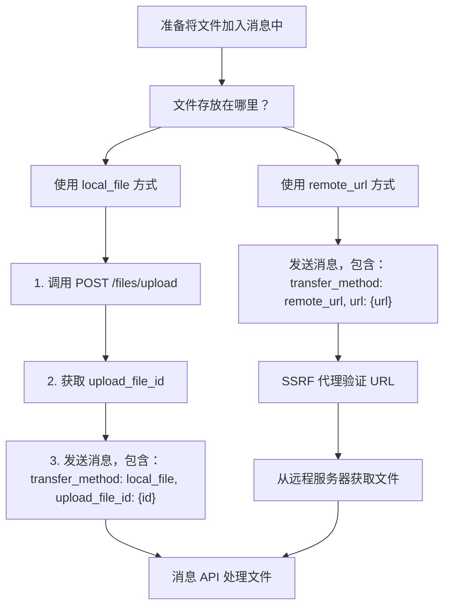
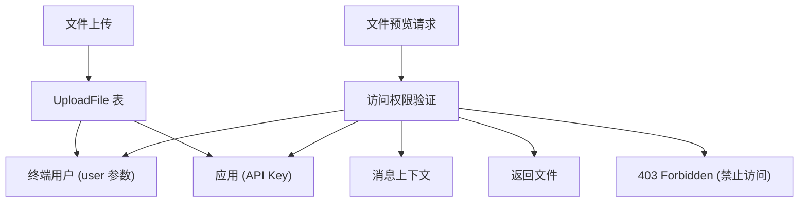
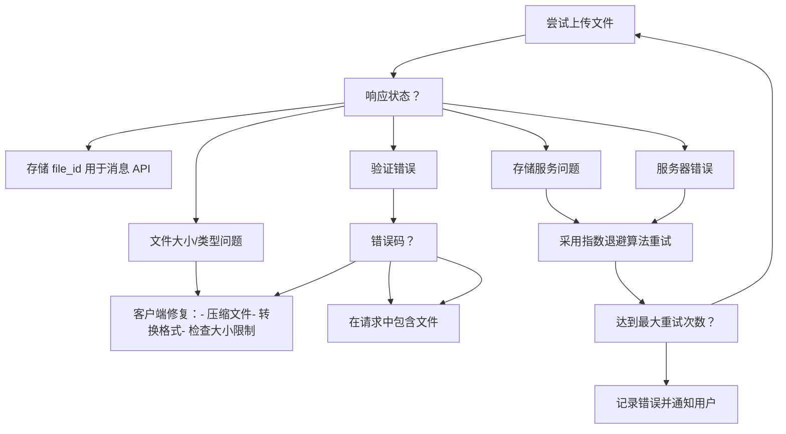

# 文件上传与管理 API

相关源文件

-   [web/app/components/develop/template/template.en.mdx](https://github.com/langgenius/dify/blob/92dbc94f/web/app/components/develop/template/template.en.mdx)
-   [web/app/components/develop/template/template.ja.mdx](https://github.com/langgenius/dify/blob/92dbc94f/web/app/components/develop/template/template.ja.mdx)
-   [web/app/components/develop/template/template.zh.mdx](https://github.com/langgenius/dify/blob/92dbc94f/web/app/components/develop/template/template.zh.mdx)
-   [web/app/components/develop/template/template_advanced_chat.en.mdx](https://github.com/langgenius/dify/blob/92dbc94f/web/app/components/develop/template/template_advanced_chat.en.mdx)
-   [web/app/components/develop/template/template_advanced_chat.ja.mdx](https://github.com/langgenius/dify/blob/92dbc94f/web/app/components/develop/template/template_advanced_chat.ja.mdx)
-   [web/app/components/develop/template/template_advanced_chat.zh.mdx](https://github.com/langgenius/dify/blob/92dbc94f/web/app/components/develop/template/template_advanced_chat.zh.mdx)
-   [web/app/components/develop/template/template_chat.en.mdx](https://github.com/langgenius/dify/blob/92dbc94f/web/app/components/develop/template/template_chat.en.mdx)
-   [web/app/components/develop/template/template_chat.ja.mdx](https://github.com/langgenius/dify/blob/92dbc94f/web/app/components/develop/template/template_chat.ja.mdx)
-   [web/app/components/develop/template/template_chat.zh.mdx](https://github.com/langgenius/dify/blob/92dbc94f/web/app/components/develop/template/template_chat.zh.mdx)
-   [web/app/components/develop/template/template_workflow.en.mdx](https://github.com/langgenius/dify/blob/92dbc94f/web/app/components/develop/template/template_workflow.en.mdx)
-   [web/app/components/develop/template/template_workflow.ja.mdx](https://github.com/langgenius/dify/blob/92dbc94f/web/app/components/develop/template/template_workflow.ja.mdx)
-   [web/app/components/develop/template/template_workflow.zh.mdx](https://github.com/langgenius/dify/blob/92dbc94f/web/app/components/develop/template/template_workflow.zh.mdx)

本文档描述了 Dify 服务 API 层中的文件上传与管理 API。这些 API 允许终端用户上传文件（图像、文档、音频、视频及自定义文件类型），并将其用于与对话 (Chat)、补全 (Completion)、进阶版对话 (Advanced Chat) 及工作流 (Workflow) 应用的交互中。当底层 LLM 模型支持文件处理时，文件 API 将支持多模态能力。

有关整体 API 架构和身份验证的信息，请参阅 [API 架构与响应模式](/langgenius/dify/8.1-api-architecture-and-response-modes)。有关文件如何在特定消息端点中使用的详情，请参阅 [对话与补全 API](/langgenius/dify/8.2-chat-and-completion-apis) 和 [工作流执行 API](/langgenius/dify/8.3-workflow-execution-apis)。

---

## 概览

文件管理系统提供了两个主要的端点：

1.  **文件上传 (`POST /files/upload`)**：上传文件并返回供后续使用的文件 ID。
2.  **文件预览/下载 (`GET /files/:file_id/preview`)**：获取已上传的文件以进行预览或下载。

可以通过两种传输方式将文件集成到消息中：

-   **`local_file`**：通过上传端点上传的文件，使用 `upload_file_id` 进行引用。
-   **`remote_url`**：外部托管的文件，使用 URL 进行引用。

**文件上传与使用流程**


**来源：** [web/app/components/develop/template/template_chat.en.mdx293-362](https://github.com/langgenius/dify/blob/92dbc94f/web/app/components/develop/template/template_chat.en.mdx#L293-L362) [web/app/components/develop/template/template_chat.en.mdx366-439](https://github.com/langgenius/dify/blob/92dbc94f/web/app/components/develop/template/template_chat.en.mdx#L366-L439)

---

## 文件上传 API

### 端点：`POST /files/upload`

将文件上传到 Dify 平台，以便在后续对话中使用。上传的文件作用域限定为终端用户（`user` 参数），并且只能在同一个应用上下文中访问。

**请求要求**

| 方面 | 详情 |
| --- | --- |
| Content-Type | `multipart/form-data` |
| 身份验证 | `Authorization: Bearer {API_KEY}` 标头 |
| 方法 | POST |

**请求参数**

| 参数 | 类型 | 是否必填 | 描述 |
| --- | --- | --- | --- |
| `file` | File | 是 | 待上传的文件 |
| `user` | string | 是 | 用户标识符，必须在应用内唯一，且与消息 API 中的 user 参数保持一致 |

**响应格式**

上传成功后返回包含文件元数据的 JSON：

```json
{
  "id": "72fa9618-8f89-4a37-9b33-7e1178a24a67",
  "name": "example.png",
  "size": 1024,
  "extension": "png",
  "mime_type": "image/png",
  "created_by": "6ad1ab0a-73ff-4ac1-b9e4-cdb312f71f13",
  "created_at": 1577836800
}
```
**响应字段**

| 字段 | 类型 | 描述 |
| --- | --- | --- |
| `id` | uuid | 唯一文件标识符，在发送消息请求时作为 `upload_file_id` 使用 |
| `name` | string | 原始文件名 |
| `size` | int | 文件大小（字节） |
| `extension` | string | 文件扩展名 |
| `mime_type` | string | 文件的 MIME 类型 |
| `created_by` | uuid | 上传该文件的终端用户 ID |
| `created_at` | timestamp | 上传时间戳 (Unix epoch) |

**请求示例**

```bash
curl -X POST 'https://api.dify.ai/v1/files/upload' \
  --header 'Authorization: Bearer {api_key}' \
  --form 'file=@/path/to/image.png;type=image/png' \
  --form 'user=abc-123'
```
**来源：** [web/app/components/develop/template/template_chat.en.mdx292-362](https://github.com/langgenius/dify/blob/92dbc94f/web/app/components/develop/template/template_chat.en.mdx#L292-L362) [web/app/components/develop/template/template.zh.mdx180-249](https://github.com/langgenius/dify/blob/92dbc94f/web/app/components/develop/template/template.zh.mdx#L180-L249)

---

## 文件预览与下载 API

### 端点：`GET /files/:file_id/preview`

获取已上传的文件以供浏览器预览或下载。仅当文件属于请求应用内的消息时，才允许访问。

**路径参数**

| 参数 | 类型 | 是否必填 | 描述 |
| --- | --- | --- | --- |
| `file_id` | string | 是 | 从上传 API 获取的唯一文件标识符 |

**查询参数**

| 参数 | 类型 | 是否必填 | 默认值 | 描述 |
| --- | --- | --- | --- | --- |
| `as_attachment` | boolean | 否 | `false` | 强制浏览器下载文件而非预览 |

**响应标头**

API 根据文件类型和请求参数设置相应的 HTTP 标头：

| 标头 | 描述 | 示例 |
| --- | --- | --- |
| `Content-Type` | 文件的 MIME 类型 | `image/png`, `application/pdf` |
| `Content-Length` | 文件大小（字节，若可用） | `1024` |
| `Content-Disposition` | 当 `as_attachment=true` 时设置为 `attachment` | `attachment; filename*=UTF-8''example.png` |
| `Cache-Control` | 性能缓存策略 | `public, max-age=3600` |
| `Accept-Ranges` | 针对音频/视频文件设置为 `bytes` | `bytes` |

**请求示例**

在浏览器中预览：

```bash
curl -X GET 'https://api.dify.ai/v1/files/72fa9618-8f89-4a37-9b33-7e1178a24a67/preview' \
  --header 'Authorization: Bearer {api_key}'
```
强制下载：

```bash
curl -X GET 'https://api.dify.ai/v1/files/72fa9618-8f89-4a37-9b33-7e1178a24a67/preview?as_attachment=true' \
  --header 'Authorization: Bearer {api_key}' \
  --output downloaded_file.png
```
**来源：** [web/app/components/develop/template/template_chat.en.mdx365-439](https://github.com/langgenius/dify/blob/92dbc94f/web/app/components/develop/template/template_chat.en.mdx#L365-L439) [web/app/components/develop/template/template.zh.mdx252-327](https://github.com/langgenius/dify/blob/92dbc94f/web/app/components/develop/template/template.zh.mdx#L252-L327)

---

## 在消息 API 中集成文件

通过上传 API 上传的文件可用于对话、补全、进阶版对话和工作流消息请求。文件作为数组传递在请求体的 `files` 参数中。

**文件对象结构**

`files` 数组中的每个文件包含：

| 字段 | 类型 | 是否必填 | 描述 |
| --- | --- | --- | --- |
| `type` | string | 是 | 文件类别：`document`, `image`, `audio`, `video` 或 `custom` |
| `transfer_method` | string | 是 | 文件提供方式：`local_file` (本地文件) 或 `remote_url` (远程 URL) |
| `upload_file_id` | string | 条件必填 | 从上传 API 获取的 ID（当 `transfer_method` 为 `local_file` 时必填） |
| `url` | string | 条件必填 | 文件 URL（当 `transfer_method` 为 `remote_url` 时必填） |

**文件传输方式对比**


**示例：使用已上传的文件**

```json
{
  "query": "iPhone 13 Pro Max 的规格是什么？",
  "files": [
    {
      "type": "image",
      "transfer_method": "local_file",
      "upload_file_id": "72fa9618-8f89-4a37-9b33-7e1178a24a67"
    }
  ],
  "user": "abc-123"
}
```
**示例：使用远程 URL 文件**

```json
{
  "query": "描述这张图片",
  "files": [
    {
      "type": "image",
      "transfer_method": "remote_url",
      "url": "https://cloud.dify.ai/logo/logo-site.png"
    }
  ],
  "user": "abc-123"
}
```
**来源：** [web/app/components/develop/template/template_chat.en.mdx58-71](https://github.com/langgenius/dify/blob/92dbc94f/web/app/components/develop/template/template_chat.en.mdx#L58-L71) [web/app/components/develop/template/template_advanced_chat.en.mdx59-72](https://github.com/langgenius/dify/blob/92dbc94f/web/app/components/develop/template/template_advanced_chat.en.mdx#L59-L72) [web/app/components/develop/template/template_workflow.en.mdx36-51](https://github.com/langgenius/dify/blob/92dbc94f/web/app/components/develop/template/template_workflow.en.mdx#L36-L51)

---

## 支持的文件类型

文件 API 支持五种主要文件类别，每种类别具有特定的扩展名和使用场景。

**文件类型类别与扩展名**

| 类别 | 支持的扩展名 | 使用场景 |
| --- | --- | --- |
| `document` (文档) | TXT, MD, MARKDOWN, MDX, PDF, HTML, XLSX, XLS, VTT, PROPERTIES, DOC, DOCX, CSV, EML, MSG, PPTX, PPT, XML, EPUB | 文档解析、文本提取、结构化数据分析 |
| `image` (图像) | JPG, JPEG, PNG, GIF, WEBP, SVG | 视觉模型、图像理解、多模态查询 |
| `audio` (音频) | MP3, M4A, WAV, WEBM, MPGA | 语音转文本、音频转录、音频分析 |
| `video` (视频) | MP4, MOV, MPEG, WEBM | 视频理解、帧分析（取决于模型能力） |
| `custom` (自定义) | 其他文件类型 | 用于自定义处理的通用文件处理 |

**按应用模式划分的文件类型使用情况**


**文件大小限制**

每种文件类型的大小限制可通过 `/parameters` API 端点配置：

| 限制类型 | 参数名 | 默认值 (MB) |
| --- | --- | --- |
| 文档文件 | `file_size_limit` | 15 |
| 图像文件 | `image_file_size_limit` | 10 |
| 音频文件 | `audio_file_size_limit` | 50 |
| 视频文件 | `video_file_size_limit` | 100 |

**来源：** [web/app/components/develop/template/template_chat.en.mdx60-66](https://github.com/langgenius/dify/blob/92dbc94f/web/app/components/develop/template/template_chat.en.mdx#L60-L66) [web/app/components/develop/template/template.zh.mdx622-650](https://github.com/langgenius/dify/blob/92dbc94f/web/app/components/develop/template/template.zh.mdx#L622-L650)

---

## 文件传输方式

Dify 支持两种不同的方式向消息 API 提供文件：`local_file`（上传到 Dify）和 `remote_url`（外部托管）。

**传输方式决策流**


**local_file 方式**

用于上传到 Dify 存储系统的文件：

1.  客户端通过 `POST /files/upload` 上传文件。
2.  Dify 存储文件并返回 `upload_file_id`。
3.  客户端在消息中通过 `upload_file_id` 引用该文件。

**优点：**

-   文件持久化存储在 Dify 中。
-   文件访问不依赖外部服务。
-   更适合处理敏感或私密文件。
-   支持文件访问控制。

**remote_url 方式**

用于可通过 HTTP(S) 访问的外部托管文件：

1.  客户端直接在消息中提供文件 URL。
2.  Dify 通过 SSRF 代理获取文件（参见 [API 身份验证与安全](/langgenius/dify/7.3-authentication-and-security)）。
3.  文件内容由 LLM 处理。

**优点：**

-   不需要单独的上传步骤。
-   适用于公开可访问的文件。
-   减少了存储需求。
-   适合处理已在别处托管的大型文件。

**工作流应用中的文件变量**

在工作流应用中，`inputs` 对象中的文件变量支持相同的传输方式：

```json
{
  "inputs": {
    "user_document": [
      {
        "transfer_method": "local_file",
        "upload_file_id": "72fa9618-8f89-4a37-9b33-7e1178a24a67",
        "type": "document"
      }
    ]
  },
  "response_mode": "streaming",
  "user": "abc-123"
}
```
**来源：** [web/app/components/develop/template/template_chat.en.mdx66-71](https://github.com/langgenius/dify/blob/92dbc94f/web/app/components/develop/template/template_chat.en.mdx#L66-L71) [web/app/components/develop/template/template_workflow.en.mdx38-51](https://github.com/langgenius/dify/blob/92dbc94f/web/app/components/develop/template/template_workflow.en.mdx#L38-L51) [web/app/components/develop/template/template_workflow.zh.mdx36-46](https://github.com/langgenius/dify/blob/92dbc94f/web/app/components/develop/template/template_workflow.zh.mdx#L36-L46)

---

## 安全与访问控制

文件管理 API 实施了多项安全措施，以保护文件访问并防止滥用。

**访问控制模型**


**安全特性**

| 特性 | 实现方式 | 目的 |
| --- | --- | --- |
| 用户作用域 | 文件与 `user` 参数绑定 | 防止跨用户文件访问 |
| 应用作用域 | 文件仅在同一应用（API Key）内可访问 | 防止跨应用访问 |
| 消息上下文验证 | 文件必须属于请求应用内的消息 | 防止未经授权的预览/下载 |
| API Key 身份验证 | 所有请求均需有效的 `Authorization` 标头 | 防止匿名访问 |
| SSRF 防御 | 远程 URL 通过 SSRF 代理获取 | 防止服务端请求伪造攻击 |
| 文件类型验证 | 检查扩展名是否属于允许列表 | 防止恶意文件上传 |

**访问控制规则**

1.  **上传**：用户可以使用其 `user` 标识符上传文件。
2.  **消息引用**：用户只能引用自己上传的文件。
3.  **预览/下载**：仅在满足以下条件时才允许访问文件：
    -   请求使用了该应用的有效 API Key。
    -   文件属于该应用中的某条消息。
    -   文件存在且未被删除。

**针对远程 URL 的 SSRF 防御**

当使用 `remote_url` 传输方式时，Dify 通过 SSRF 代理服务获取外部文件，该服务会：

-   验证 URL 协议（仅限 HTTP/HTTPS）。
-   拦截对内网和本地主机的访问。
-   防止针对内部服务的 SSRF 攻击。
-   强制执行超时限制。

**来源：** [web/app/components/develop/template/template_chat.en.mdx375-397](https://github.com/langgenius/dify/blob/92dbc94f/web/app/components/develop/template/template_chat.en.mdx#L375-L397) [web/app/components/develop/template/template.zh.mdx260-285](https://github.com/langgenius/dify/blob/92dbc94f/web/app/components/develop/template/template.zh.mdx#L260-L285)

---

## 错误处理

两个文件 API 都会针对各种失败场景返回标准的 HTTP 状态码和错误响应。

**文件上传错误**

| HTTP 状态码 | 错误码 | 描述 | 解决方法 |
| --- | --- | --- | --- |
| 400 | `no_file_uploaded` | 请求中未提供文件 | 在 multipart 表单数据中包含文件 |
| 400 | `too_many_files` | 发送了多个文件（仅允许一个） | 每次请求仅发送一个文件 |
| 400 | `unsupported_preview` | 文件类型不支持预览 | 检查受支持的文件类型 |
| 400 | `unsupported_estimate` | 文件不支持大小估算 | 检查文件格式 |
| 413 | `file_too_large` | 文件超过大小限制 | 减小文件大小或通过 `/parameters` 检查限制 |
| 415 | `unsupported_file_type` | 文件扩展名不受支持 | 仅使用受支持的文件类型 |
| 503 | `s3_connection_failed` | 无法连接到存储服务 | 重试请求，检查存储配置 |
| 503 | `s3_permission_denied` | 无权上传到存储空间 | 检查存储凭据/权限 |
| 503 | `s3_file_too_large` | 文件超过存储供应商限制 | 减小文件大小 |
| 500 | - | 服务器内部错误 | 重试请求，若问题持续请联系支持 |

**文件预览/下载错误**

| HTTP 状态码 | 错误码 | 描述 | 解决方法 |
| --- | --- | --- | --- |
| 400 | `invalid_param` | 无效的 file_id 或参数 | 检查 file_id 格式 |
| 403 | `file_access_denied` | 文件访问被拒绝或不属于该应用 | 验证文件所有权和应用上下文 |
| 404 | `file_not_found` | 文件未找到或已删除 | 验证 file_id 是否存在 |
| 500 | - | 服务器内部错误 | 重试请求，若问题持续请联系支持 |

**错误响应格式**

错误响应遵循统一的 JSON 结构：

```json
{
  "code": "file_too_large",
  "message": "文件过大",
  "status": 413
}
```
**错误处理最佳实践**


**来源：** [web/app/components/develop/template/template_chat.en.mdx321-331](https://github.com/langgenius/dify/blob/92dbc94f/web/app/components/develop/template/template_chat.en.mdx#L321-L331) [web/app/components/develop/template/template_chat.en.mdx393-397](https://github.com/langgenius/dify/blob/92dbc94f/web/app/components/develop/template/template_chat.en.mdx#L393-L397) [web/app/components/develop/template/template.zh.mdx331-341](https://github.com/langgenius/dify/blob/92dbc94f/web/app/components/develop/template/template.zh.mdx#L331-L341)

---

## 按应用类型划分的使用示例

**带图像的对话应用**

```bash
# 1. 上传图像
FILE_ID=$(curl -X POST 'https://api.dify.ai/v1/files/upload' \
  --header 'Authorization: Bearer {api_key}' \
  --form 'file=@screenshot.png;type=image/png' \
  --form 'user=user-123' | jq -r '.id')

# 2. 发送带图像的对话消息
curl -X POST 'https://api.dify.ai/v1/chat-messages' \
  --header 'Authorization: Bearer {api_key}' \
  --header 'Content-Type: application/json' \
  --data-raw '{
    "query": "你在图中看到了什么？",
    "files": [
      {
        "type": "image",
        "transfer_method": "local_file",
        "upload_file_id": "'$FILE_ID'"
      }
    ],
    "response_mode": "streaming",
    "user": "user-123"
  }'
```
**带文档的补全应用**

```bash
# 上传文档并发送补全请求
FILE_ID=$(curl -X POST 'https://api.dify.ai/v1/files/upload' \
  --header 'Authorization: Bearer {api_key}' \
  --form 'file=@report.pdf;type=application/pdf' \
  --form 'user=user-456' | jq -r '.id')

curl -X POST 'https://api.dify.ai/v1/completion-messages' \
  --header 'Authorization: Bearer {api_key}' \
  --header 'Content-Type: application/json' \
  --data-raw '{
    "inputs": {
      "query": "总结该文档"
    },
    "files": [
      {
        "type": "document",
        "transfer_method": "local_file",
        "upload_file_id": "'$FILE_ID'"
      }
    ],
    "response_mode": "blocking",
    "user": "user-456"
  }'
```
**带多个文件的工作流应用**

```bash
# 为工作流上传多个文件
DOC_ID=$(curl -X POST 'https://api.dify.ai/v1/files/upload' \
  --form 'file=@contract.docx' --form 'user=user-789' | jq -r '.id')

IMG_ID=$(curl -X POST 'https://api.dify.ai/v1/files/upload' \
  --form 'file=@signature.png' --form 'user=user-789' | jq -r '.id')

# 发送给带有文件变量的工作流
curl -X POST 'https://api.dify.ai/v1/workflows/run' \
  --header 'Authorization: Bearer {api_key}' \
  --header 'Content-Type: application/json' \
  --data-raw '{
    "inputs": {
      "documents": [
        {
          "transfer_method": "local_file",
          "upload_file_id": "'$DOC_ID'",
          "type": "document"
        },
        {
          "transfer_method": "local_file",
          "upload_file_id": "'$IMG_ID'",
          "type": "image"
        }
      ]
    },
    "response_mode": "streaming",
    "user": "user-789"
  }'
```
**使用远程 URL（无需上传）**

```bash
curl -X POST 'https://api.dify.ai/v1/chat-messages' \
  --header 'Authorization: Bearer {api_key}' \
  --header 'Content-Type: application/json' \
  --data-raw '{
    "query": "分析这家公司的 logo",
    "files": [
      {
        "type": "image",
        "transfer_method": "remote_url",
        "url": "https://example.com/logo.png"
      }
    ],
    "response_mode": "streaming",
    "user": "user-999"
  }'
```
**来源：** [web/app/components/develop/template/template_chat.en.mdx195-216](https://github.com/langgenius/dify/blob/92dbc94f/web/app/components/develop/template/template_chat.en.mdx#L195-L216) [web/app/components/develop/template/template_workflow.zh.mdx177-205](https://github.com/langgenius/dify/blob/92dbc94f/web/app/components/develop/template/template_workflow.zh.mdx#L177-L205)
