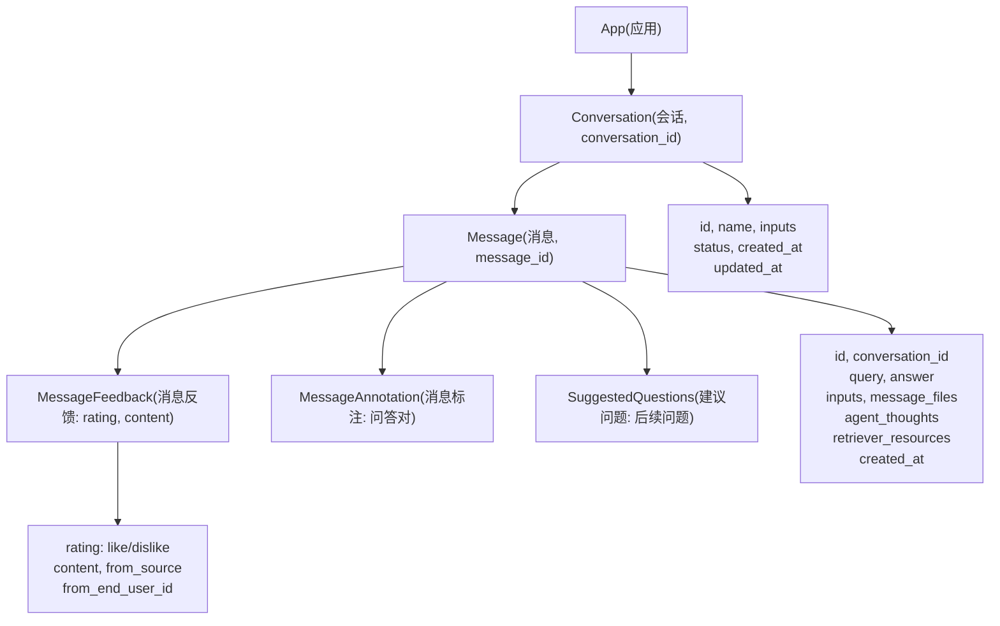
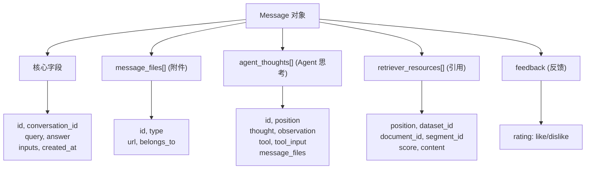
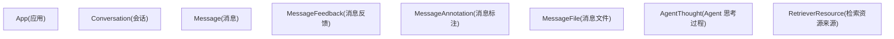

# 会话与消息管理 API

相关源文件

-   [web/app/components/develop/template/template.en.mdx](https://github.com/langgenius/dify/blob/92dbc94f/web/app/components/develop/template/template.en.mdx)
-   [web/app/components/develop/template/template.ja.mdx](https://github.com/langgenius/dify/blob/92dbc94f/web/app/components/develop/template/template.ja.mdx)
-   [web/app/components/develop/template/template.zh.mdx](https://github.com/langgenius/dify/blob/92dbc94f/web/app/components/develop/template/template.zh.mdx)
-   [web/app/components/develop/template/template_advanced_chat.en.mdx](https://github.com/langgenius/dify/blob/92dbc94f/web/app/components/develop/template/template_advanced_chat.en.mdx)
-   [web/app/components/develop/template/template_advanced_chat.ja.mdx](https://github.com/langgenius/dify/blob/92dbc94f/web/app/components/develop/template/template_advanced_chat.ja.mdx)
-   [web/app/components/develop/template/template_advanced_chat.zh.mdx](https://github.com/langgenius/dify/blob/92dbc94f/web/app/components/develop/template/template_advanced_chat.zh.mdx)
-   [web/app/components/develop/template/template_chat.en.mdx](https://github.com/langgenius/dify/blob/92dbc94f/web/app/components/develop/template/template_chat.en.mdx)
-   [web/app/components/develop/template/template_chat.ja.mdx](https://github.com/langgenius/dify/blob/92dbc94f/web/app/components/develop/template/template_chat.ja.mdx)
-   [web/app/components/develop/template/template_chat.zh.mdx](https://github.com/langgenius/dify/blob/92dbc94f/web/app/components/develop/template/template_chat.zh.mdx)
-   [web/app/components/develop/template/template_workflow.en.mdx](https://github.com/langgenius/dify/blob/92dbc94f/web/app/components/develop/template/template_workflow.en.mdx)
-   [web/app/components/develop/template/template_workflow.ja.mdx](https://github.com/langgenius/dify/blob/92dbc94f/web/app/components/develop/template/template_workflow.ja.mdx)
-   [web/app/components/develop/template/template_workflow.zh.mdx](https://github.com/langgenius/dify/blob/92dbc94f/web/app/components/develop/template/template_workflow.zh.mdx)

本页面记录了用于管理会话、检索历史消息、提交反馈以及访问相关元数据的 REST API 端点。这些端点允许客户端应用程序实现具有持久化聊天历史、用户反馈收集和标注能力的对话界面。

有关创建消息的端点（发送对话或补全请求），请参阅 [对话与补全 API](/langgenius/dify/8.2-chat-and-completion-apis)。有关工作流特定的执行追踪，请参阅 [工作流执行 API](/langgenius/dify/8.3-workflow-execution-apis)。有关身份验证和响应流机制，请参阅 [API 架构与响应模式](/langgenius/dify/8.1-api-architecture-and-response-modes)。

---

## API 概览

会话与消息管理 API 提供了访问用户与 Dify 应用交互持久状态的能力。所有端点都要求通过 `Authorization: Bearer {API_KEY}` 标头进行 API-Key 身份验证。

### 会话与消息层级结构


**来源：** [web/app/components/develop/template/template_chat.en.mdx660-764](https://github.com/langgenius/dify/blob/92dbc94f/web/app/components/develop/template/template_chat.en.mdx#L660-L764) [web/app/components/develop/template/template_chat.zh.mdx665-762](https://github.com/langgenius/dify/blob/92dbc94f/web/app/components/develop/template/template_chat.zh.mdx#L665-L762)

---

## 会话管理

### 获取会话列表

**端点：** `GET /conversations`

检索当前终端用户的分页会话列表。会话按时间倒序排列（最近的在前）。

**查询参数：**

| 参数 | 类型 | 是否必填 | 描述 |
| --- | --- | --- | --- |
| `user` | string | 是 | 终端用户标识符，必须在应用内唯一 |
| `last_id` | string | 否 | 当前页面最后一条会话的 ID，用于分页 |
| `limit` | integer | 否 | 返回的会话数量（默认：20） |
| `pinned` | boolean | 否 | 是否仅过滤置顶会话 |

**响应结构：**

```json
{
  "data": [
    {
      "id": "conversation-uuid",
      "name": "会话标题",
      "inputs": {},
      "status": "normal",
      "introduction": "开场白",
      "created_at": 1705395332,
      "updated_at": 1705395332
    }
  ],
  "has_more": true,
  "limit": 20
}
```
**响应字段说明：**

-   `data` (array[object]) - 会话对象列表。
    -   `id` (string) - 会话唯一标识符。
    -   `name` (string) - 会话标题（自动生成或自定义）。
    -   `inputs` (object) - 启动会话时使用的初始输入变量。
    -   `status` (string) - 会话状态：`normal`, `archived` (已归档) 等。
    -   `introduction` (string) - 展示给用户的开场白。
    -   `created_at` (timestamp) - 创建时间戳。
    -   `updated_at` (timestamp) - 最后更新时间戳。
-   `has_more` (boolean) - 是否存在更多会话。
-   `limit` (integer) - 返回的条目数量。

**来源：** [web/app/components/develop/template/template_chat.zh.mdx831-926](https://github.com/langgenius/dify/blob/92dbc94f/web/app/components/develop/template/template_chat.zh.mdx#L831-L926)

---

### 删除会话

**端点：** `DELETE /conversations/:conversation_id`

永久删除会话及其关联的所有消息。

**路径参数：**

| 参数 | 类型 | 是否必填 | 描述 |
| --- | --- | --- | --- |
| `conversation_id` | string | 是 | 会话唯一标识符 |

**请求体：**

| 字段 | 类型 | 是否必填 | 描述 |
| --- | --- | --- | --- |
| `user` | string | 是 | 终端用户标识符（必须与会话拥有者一致） |

**响应：**

```json
{
  "result": "success"
}
```
**来源：** [web/app/components/develop/template/template_chat.zh.mdx928-968](https://github.com/langgenius/dify/blob/92dbc94f/web/app/components/develop/template/template_chat.zh.mdx#L928-L968)

---

### 会话重命名

**端点：** `POST /conversations/:conversation_id/name`

更新会话标题。可以设置为使用 LLM 自动生成，也可以指定自定义名称。

**路径参数：**

| 参数 | 类型 | 是否必填 | 描述 |
| --- | --- | --- | --- |
| `conversation_id` | string | 是 | 会话唯一标识符 |

**请求体：**

| 字段 | 类型 | 是否必填 | 描述 |
| --- | --- | --- | --- |
| `name` | string | 否 | 自定义会话名称 |
| `auto_generate` | boolean | 否 | 是否使用 LLM 自动生成名称（默认：false） |
| `user` | string | 是 | 终端用户标识符 |

**响应：**

```json
{
  "id": "conversation-uuid",
  "name": "更新后的会话名称",
  "inputs": {},
  "status": "normal",
  "introduction": "",
  "created_at": 1705395332,
  "updated_at": 1705395440
}
```
**行为说明：**

-   如果 `auto_generate` 为 `true`，系统将使用 LLM 根据会话内容生成具有上下文的标题。
-   如果提供了 `name`，则直接设置该名称。
-   如果两者都提供，`name` 的优先级更高。

**来源：** [web/app/components/develop/template/template_chat.zh.mdx970-1028](https://github.com/langgenius/dify/blob/92dbc94f/web/app/components/develop/template/template_chat.zh.mdx#L970-L1028)

---

## 历史消息检索

### 获取会话消息

**端点：** `GET /messages`

以滚动分页格式检索会话中的历史消息。第一页将按时间倒序返回最新消息。

**查询参数：**

| 参数 | 类型 | 是否必填 | 描述 |
| --- | --- | --- | --- |
| `conversation_id` | string | 是 | 会话标识符 |
| `user` | string | 是 | 终端用户标识符 |
| `first_id` | string | 否 | 当前页面第一条消息的 ID（用于分页） |
| `limit` | integer | 否 | 返回的消息数量（默认：20） |

**响应结构：**

```json
{
  "limit": 20,
  "has_more": false,
  "data": [
    {
      "id": "message-uuid",
      "conversation_id": "conversation-uuid",
      "inputs": {"key": "value"},
      "query": "用户提问",
      "answer": "助手回答",
      "message_files": [],
      "agent_thoughts": [],
      "feedback": null,
      "retriever_resources": [],
      "created_at": 1705395332
    }
  ]
}
```
### 消息数据结构


**响应字段说明：**

| 字段 | 类型 | 描述 |
| --- | --- | --- |
| `id` | string | 消息唯一标识符 |
| `conversation_id` | string | 所属会话标识符 |
| `inputs` | object | 用户输入参数/变量 |
| `query` | string | 用户的输入文本或提问 |
| `answer` | string | 助手的回答内容 |
| `message_files` | array[object] | 附件文件（图像、文档等） |
| `agent_thoughts` | array[object] | Agent 推理步骤（仅限 Agent 模式） |
| `feedback` | object | 用户反馈数据（点赞/点踩） |
| `retriever_resources` | array[object] | 知识库引用来源 |
| `created_at` | timestamp | 消息创建时间 |

#### 消息文件结构 (Message Files)

`message_files` 数组中的每个元素：

| 字段 | 类型 | 描述 |
| --- | --- | --- |
| `id` | string | 文件标识符 |
| `type` | string | 文件类型：`image`, `document`, `audio`, `video`, `custom` |
| `url` | string | 文件预览 URL（配合 `/files/{file_id}/preview` 端点） |
| `belongs_to` | string | 归属者：`user` 或 `assistant` |

#### Agent 思考结构 (Agent Thoughts)

`agent_thoughts` 数组中的每个元素（仅适用于 Agent 模式应用）：

| 字段 | 类型 | 描述 |
| --- | --- | --- |
| `id` | string | 唯一思考步骤标识符 |
| `message_id` | string | 所属消息标识符 |
| `position` | integer | 在推理链中的迭代位置 |
| `thought` | string | LLM 的推理/思考过程 |
| `observation` | string | 工具执行结果 |
| `tool` | string | 调用的工具（多个以分号分隔） |
| `tool_input` | string | 工具输入参数（JSON 字符串） |
| `created_at` | timestamp | 创建时间 |
| `message_files` | array[string] | 该思考步骤生成的文件 ID 列表 |

#### 检索资源结构 (Retriever Resources)

`retriever_resources` 数组中的每个元素：

| 字段 | 类型 | 描述 |
| --- | --- | --- |
| `position` | integer | 结果排名位置 |
| `dataset_id` | string | 知识库标识符 |
| `dataset_name` | string | 知识库名称 |
| `document_id` | string | 来源文档标识符 |
| `document_name` | string | 来源文档名称 |
| `segment_id` | string | 文本分段标识符 |
| `score` | float | 相关性评分 (0-1) |
| `content` | string | 检索到的文本内容 |

**来源：** [web/app/components/develop/template/template_chat.en.mdx660-764](https://github.com/langgenius/dify/blob/92dbc94f/web/app/components/develop/template/template_chat.en.mdx#L660-L764) [web/app/components/develop/template/template_chat.zh.mdx665-762](https://github.com/langgenius/dify/blob/92dbc94f/web/app/components/develop/template/template_chat.zh.mdx#L665-L762)

---

## 消息反馈系统

### 提交消息反馈

**端点：** `POST /messages/:message_id/feedbacks`

允许终端用户对助手的回答提供反馈。反馈包括点赞/点踩评分以及可选的文本评论。

**路径参数：**

| 参数 | 类型 | 是否必填 | 描述 |
| --- | --- | --- | --- |
| `message_id` | string | 是 | 目标消息标识符 |

**请求体：**

| 字段 | 类型 | 是否必填 | 描述 |
| --- | --- | --- | --- |
| `rating` | string | 是 | `like` (点赞), `dislike` (点踩), 或 `null` (撤销) |
| `user` | string | 是 | 终端用户标识符 |
| `content` | string | 否 | 详细的反馈文本 |

**请求示例：**

```bash
curl -X POST 'https://api.dify.ai/v1/messages/abc-123/feedbacks' \
  --header 'Authorization: Bearer {api_key}' \
  --header 'Content-Type: application/json' \
  --data-raw '{
    "rating": "like",
    "user": "user-456",
    "content": "非常有帮助的回答"
  }'
```
**响应：**

```json
{
  "result": "success"
}
```
**来源：** [web/app/components/develop/template/template_chat.en.mdx484-542](https://github.com/langgenius/dify/blob/92dbc94f/web/app/components/develop/template/template_chat.en.mdx#L484-L542) [web/app/components/develop/template/template_chat.zh.mdx490-548](https://github.com/langgenius/dify/blob/92dbc94f/web/app/components/develop/template/template_chat.zh.mdx#L490-L548)

---

### 获取应用反馈列表

**端点：** `GET /app/feedbacks`

检索应用已提交的所有反馈记录，支持分页。适用于分析和提升应用质量。

**查询参数：**

| 参数 | 类型 | 是否必填 | 描述 |
| --- | --- | --- | --- |
| `page` | integer | 否 | 页码（默认：1） |
| `limit` | integer | 否 | 每页记录数（默认：20，最大：100） |

**响应结构：**

```json
{
  "data": [
    {
      "id": "feedback-uuid",
      "app_id": "app-uuid",
      "conversation_id": "conversation-uuid",
      "message_id": "message-uuid",
      "rating": "like",
      "content": "回答很有帮助",
      "from_source": "user",
      "from_end_user_id": "user-uuid",
      "from_account_id": null,
      "created_at": "2025-04-24T09:24:38",
      "updated_at": "2025-04-24T09:24:38"
    }
  ]
}
```
**响应字段说明：**

| 字段 | 类型 | 描述 |
| --- | --- | --- |
| `id` | string | 唯一反馈标识符 |
| `app_id` | string | 应用标识符 |
| `conversation_id` | string | 关联的会话 ID |
| `message_id` | string | 关联的消息 ID |
| `rating` | string | `like` 或 `dislike` |
| `content` | string | 反馈文本内容 |
| `from_source` | string | 来源类型：`user` (终端用户) 或 `account` (管理员/开发者) |
| `from_end_user_id` | string | 终端用户标识符 (若 from_source=user) |
| `from_account_id` | string | 账号标识符 (若 from_source=account) |
| `created_at` | string | ISO 8601 时间戳 |
| `updated_at` | string | ISO 8601 时间戳 |

### 反馈流程图

> **[Mermaid 序列图]**
> *(图表结构无法解析)*

**来源：** [web/app/components/develop/template/template_chat.en.mdx546-603](https://github.com/langgenius/dify/blob/92dbc94f/web/app/components/develop/template/template_chat.en.mdx#L546-L603) [web/app/components/develop/template/template_chat.zh.mdx552-609](https://github.com/langgenius/dify/blob/92dbc94f/web/app/components/develop/template/template_chat.zh.mdx#L552-L609)

---

## 建议提问 (Suggested Questions)

### 获取后续建议提问

**端点：** `GET /messages/{message_id}/suggested`

检索 AI 为给定消息生成的后续问题建议。这些建议有助于引导用户进行相关的后续查询。

**路径参数：**

| 参数 | 类型 | 是否必填 | 描述 |
| --- | --- | --- | --- |
| `message_id` | string | 是 | 用于生成建议的消息标识符 |

**查询参数：**

| 参数 | 类型 | 是否必填 | 描述 |
| --- | --- | --- | --- |
| `user` | string | 是 | 终端用户标识符 |

**响应结构：**

```json
{
  "result": "success",
  "data": [
    "核心功能有哪些？",
    "价格是如何计算的？",
    "能给我展示一个例子吗？"
  ]
}
```
**响应字段说明：**

-   `result` (string) - 操作状态：`success` 或错误码。
-   `data` (array[string]) - 建议问题字符串列表（通常为 2-4 项）。

**功能要求：**

仅在满足以下条件时此端点才可用：

1.  应用已启用“回答后提示后续问题”功能。
2.  目标消息已成功执行完成。
3.  该消息属于发起请求用户的会话。

**常见错误码：**

-   `404` - 消息未找到或用户无权访问。
-   `400` - 该应用未启用此功能。

**来源：** [web/app/components/develop/template/template_chat.en.mdx606-656](https://github.com/langgenius/dify/blob/92dbc94f/web/app/components/develop/template/template_chat.en.mdx#L606-L656) [web/app/components/develop/template/template_chat.zh.mdx612-661](https://github.com/langgenius/dify/blob/92dbc94f/web/app/components/develop/template/template_chat.zh.mdx#L612-L661)

---

## 音频转换 API

### 语音转文字 (Audio to Text)

**端点：** `POST /audio-to-text`

使用语音转文字模型将音频输入转换为文本。用于语音对话交互。

**请求体：**

| 字段 | 类型 | 是否必填 | 描述 |
| --- | --- | --- | --- |
| `file` | file | 是 | 音频文件 (multipart/form-data) |
| `user` | string | 是 | 终端用户标识符 |

**支持的音频格式：**

-   MP3, M4A, WAV, WEBM, AMR

**响应：**

```json
{
  "text": "从音频中转录的文本内容"
}
```
**来源：** [web/app/components/develop/template/template_chat.zh.mdx1030-1083](https://github.com/langgenius/dify/blob/92dbc94f/web/app/components/develop/template/template_chat.zh.mdx#L1030-L1083)

---

### 文字转语音 (Text to Audio)

**端点：** `POST /text-to-audio`

将文本转换为语音音频。用于对话应用中的语音输出。

**请求体：**

| 字段 | 类型 | 是否必填 | 描述 |
| --- | --- | --- | --- |
| `message_id` | string | 否 | 待合成的 Dify 消息 ID（优先级最高） |
| `text` | string | 否 | 待合成的文本内容（若无 message_id） |
| `user` | string | 是 | 终端用户标识符 |

**行为说明：**

-   如果提供了 `message_id`，系统将获取消息内容并进行合成。
-   如果仅提供了 `text`，则合成提供的文本。
-   如果两者都提供，`message_id` 优先。

**响应：**

二进制音频文件（Content-Type 为 `audio/wav` 或 `audio/mp3`）。

**请求示例：**

```bash
curl -o output.mp3 -X POST 'https://api.dify.ai/v1/text-to-audio' \
  --header 'Authorization: Bearer {api_key}' \
  --header 'Content-Type: application/json' \
  --data-raw '{
    "message_id": "msg-123",
    "user": "user-456"
  }'
```
**来源：** [web/app/components/develop/template/template.zh.mdx490-538](https://github.com/langgenius/dify/blob/92dbc94f/web/app/components/develop/template/template.zh.mdx#L490-L538) [web/app/components/develop/template/template_chat.zh.mdx1085-1142](https://github.com/langgenius/dify/blob/92dbc94f/web/app/components/develop/template/template_chat.zh.mdx#L1085-L1142)

---

## 数据模型关系


**来源：** [web/app/components/develop/template/template_chat.en.mdx660-764](https://github.com/langgenius/dify/blob/92dbc94f/web/app/components/develop/template/template_chat.en.mdx#L660-L764) [web/app/components/develop/template/template_chat.zh.mdx831-926](https://github.com/langgenius/dify/blob/92dbc94f/web/app/components/develop/template/template_chat.zh.mdx#L831-L926)

---

## 实现指南

### 分页模式

所有列表类端点都遵循基于游标的分页模式：

```bash
# 获取第一页
GET /messages?conversation_id={id}&user={user}&limit=20

# 使用上一页最后一条消息的 ID 获取下一页
GET /messages?conversation_id={id}&user={user}&first_id={last_msg_id}&limit=20
```
### 用户标识符一致性

对于特定的终端用户，`user` 参数必须在所有 API 调用中保持一致：

-   用于会话所有权验证。
-   检索历史消息所必需。
-   在多租户场景下实现正确的用户隔离。
-   服务 API 用户与 WebApp 用户是相互隔离的。

### 错误处理

常见的错误响应：

| 状态码 | 错误码 | 描述 |
| --- | --- | --- |
| 400 | `invalid_param` | 请求参数无效 |
| 403 | `forbidden` | 用户无权访问该资源 |
| 404 | `not_found` | 会话或消息未找到 |
| 500 | `internal_server_error` | 服务器内部错误 |

### 频率限制 (Rate Limiting)

反馈和标注端点可能会受到频率限制以防止滥用：

-   通常限制为每个用户每分钟 10 次请求。
-   超出限制时返回 `429 Too Many Requests`。

**来源：** [web/app/components/develop/template/template_chat.en.mdx1-900](https://github.com/langgenius/dify/blob/92dbc94f/web/app/components/develop/template/template_chat.en.mdx#L1-L900) [web/app/components/develop/template/template_chat.zh.mdx1-900](https://github.com/langgenius/dify/blob/92dbc94f/web/app/components/develop/template/template_chat.zh.mdx#L1-L900)
